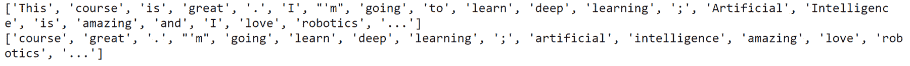

# 第四章：*第三章*

# 自然语言处理基础

## 学习目标

本章结束时，你将能够：

+   分类自然语言处理的不同领域

+   分析 Python 中的基本自然语言处理库

+   预测一组文本中的主题

+   开发一个简单的语言模型

本章涵盖了自然语言处理的不同基础知识和领域，并介绍了 Python 中的相关库。

## 介绍

**自然语言处理**（**NLP**）是**人工智能**（**AI**）的一个领域，旨在使计算机能够理解并处理人类语言，以执行有用的任务。在这个领域中，有两个部分：**自然语言理解**（**NLU**）和**自然语言生成**（**NLG**）。

近年来，人工智能改变了机器与人类的互动方式。人工智能通过执行一些任务帮助人们解决复杂的方程式，比如根据你的口味推荐电影（推荐系统）。得益于 GPU 的高性能和海量数据的可用性，已经可以创建能够学习并表现得像人类一样的智能系统。

有许多库旨在帮助创建这些系统。在本章中，我们将回顾一些最著名的 Python 库，用于从原始文本中提取和清理信息。你可能会认为这项任务很复杂，但语言的完整理解和解释本身就是一项艰巨的任务。例如，“Cristiano Ronaldo 进了三个球”这句话对于机器来说很难理解，因为它不知道 Cristiano Ronaldo 是谁，也不知道“进了三个球”是什么意思。

自然语言处理（NLP）中最受欢迎的主题之一是**问答系统**（**QA**）。这个领域还包含**信息检索**（**IR**）。这些系统通过查询数据库中的知识或信息来构建答案，但它们也能够从一组自然语言文档中提取答案。这就是像谷歌这样的搜索引擎的工作原理。

目前在行业中，自然语言处理正变得越来越流行。最新的 NLP 趋势包括在线广告匹配、情感分析、自动翻译和聊天机器人。

对话代理，通常被称为聊天机器人，是自然语言处理的下一个挑战。它们能够进行真实的对话，许多公司使用它们来获取产品反馈或创建新的广告活动，通过分析客户在聊天机器人中的行为和意见。虚拟助手是自然语言处理的一个极好例子，它们已经进入市场。最著名的包括 Siri、亚马逊的 Alexa 和 Google Home。在本书中，我们将创建一个聊天机器人来控制一个虚拟机器人，使其能够理解我们希望机器人做什么。

### 自然语言处理

如前所述，NLP 是一个涉及理解和处理人类语言的人工智能领域。NLP 位于人工智能、计算机科学和语言学的交汇点。这个领域的主要目标是让计算机理解用人类语言写成的陈述或词语：


###### 图 3.1：人工智能、语言学和计算机科学中的自然语言处理表示

语言学科学专注于研究人类语言，试图描述和解释语言的不同方法。

语言可以被定义为一组规则和符号的集合。符号通过规则组合使用，以传达信息。人类语言是特别的。我们不能简单地把它看作是自然形成的符号和规则；根据上下文，词汇的意义可能会发生变化。

自然语言处理正变得越来越流行，并且可以解决许多困难的问题。可用的文本数据量非常大，人类无法处理所有这些数据。在维基百科中，每天平均有 547 篇新文章，总共有超过 500 万篇文章。可以想象，人类无法阅读所有这些信息。

NLP 面临三个挑战。第一个挑战是收集所有数据，第二个是对数据进行分类，最后一个是提取相关信息。

自然语言处理解决了许多繁琐的任务，如电子邮件中的垃圾邮件检测、**词性**（**POS**）标注和命名实体识别。通过深度学习，NLP 还可以解决语音转文本问题。尽管 NLP 展示了很强的能力，但也存在一些情况，例如在人机对话中没有得到良好的解决方案、问答系统的摘要和机器翻译等。

### 自然语言处理的部分

如前所述，自然语言处理（NLP）可以分为两个部分：自然语言理解（NLU）和自然语言生成（NLG）。

**自然语言理解**

本节的自然语言处理涉及对人类语言的理解和分析。它侧重于对文本数据的理解，并处理这些数据以提取相关信息。NLU 提供直接的人机交互，并执行与语言理解相关的任务。

NLU 涉及人工智能最具挑战性的任务之一，那就是文本的理解。NLU 的主要挑战是理解对话。

#### 注意

自然语言处理使用一套方法来生成、处理和理解语言。自然语言理解通过功能来理解文本的意义。

以前，对话被表示为一棵树，但这种方法无法涵盖许多对话情况。为了覆盖更多的情况，需要更多的树，每个对话上下文对应一棵树，这就导致了许多句子的重复：


###### 图 3.2：使用树表示对话

这种方法已经过时且低效，因为它基于固定的规则；本质上是一个 if-else 结构。但现在，NLU（自然语言理解）贡献了另一种方法。对话可以表示为一个维恩图，其中每个集合代表对话的一个上下文：


###### 图 3.3：使用维恩图表示对话

如你在之前的图中所见，NLU 方法通过改进对话理解的结构，提升了效果，因为它不是一个包含 if-else 条件的固定结构。NLU 的主要目标是解释人类语言的意义，处理对话的上下文，解决歧义并管理数据。

**自然语言生成**

NLG 是生成具有意义和结构的短语、句子和段落的过程。它是 NLP 的一个领域，不涉及理解文本。

要生成自然语言，NLG 方法需要相关数据。

NLG 有三个组成部分：

+   **生成器**：负责将文本包含在意图中，使其与情境的上下文相关联。

+   **组成部分和表示层次**：为生成的文本提供结构

+   **应用**：保存对话中的相关数据，以跟随逻辑脉络

生成的文本必须是人类可读的格式。NLG 的优点在于你可以使数据变得易于访问，并且可以迅速创建报告摘要。

### 自然语言处理的层次

人类语言有不同的表示层次。每个表示层次都比前一个层次更复杂。随着层次的上升，理解语言变得越来越困难。

前两个层次依赖于数据类型（音频或文本），具体分为以下几类：

+   **语音学分析**：如果数据是语音，首先我们需要分析音频以获得句子。

+   **OCR/分词**：如果我们有文本，需要通过计算机视觉（OCR）识别字符并构成单词。如果没有，我们需要对文本进行分词（即将句子拆分成文本单元）。

    #### 注意

    OCR 过程是识别图像中的字符。一旦它生成了单词，这些单词就会作为原始文本进行处理。

+   **形态学分析**：专注于句子的单词，并分析其语素。

+   **句法分析**：这一层次专注于句子的语法结构。即理解句子中的不同部分，比如主语或谓语。

+   **语义表示**：程序并不理解单个词汇；它可以通过知道单词在句子中的使用方式来理解词汇的意义。例如，“猫”和“狗”对于算法来说可能意味着相同，因为它们可以以相同的方式使用。通过这种方式理解句子被称为词汇级别的意义。

+   **话语处理**：分析和识别文本中连接的句子及其关系。通过这样做，算法可以理解文本的主题是什么。

自然语言处理（NLP）在今天的行业中展现出巨大的潜力，但也存在一些例外。通过使用深度学习的概念，我们可以处理这些例外问题，从而获得更好的结果。这些问题将在*第四章*，*神经网络与 NLP*中进行回顾。文本处理技术的优势和递归神经网络的改进是 NLP 变得越来越重要的原因。

## Python 中的 NLP

近年来，Python 变得非常流行，它将通用编程语言的强大功能与特定领域语言的使用相结合，如 MATLAB 和 R（用于数学和统计）。它有不同的库用于数据加载、可视化、NLP、图像处理、统计等。Python 拥有最强大的文本处理和机器学习算法库。

### 自然语言工具包（NLTK）

NLTK 是 Python 中用于处理人类语言数据的最常见工具包。它包括一套用于处理自然语言和统计数据的库和程序。NLTK 通常作为学习工具和进行研究时使用。

该库提供了超过 50 个语料库和词汇资源的接口和方法。NLTK 能够对文本进行分类并执行其他功能，如分词、词干提取（提取单词的词干）、标注（识别单词的标签，如人名、城市等）和句法分析。

### 练习 10：NLTK 入门

在本练习中，我们将回顾关于 NLTK 库的最基本概念。正如我们之前所说，这个库是自然语言处理（NLP）领域中最广泛使用的工具之一。它可以用来分析和研究文本，忽略无关的信息。这些技术可以应用于任何文本数据，例如，从一组推文中提取最重要的关键词，或分析一篇报纸文章：

#### 注意

本章中的所有练习将在 Google Colab 中执行。

1.  打开你的 Google Colab 界面。

1.  为书籍创建一个文件夹。

1.  在这里，我们将使用 NLTK 库的基本方法处理一个句子。首先，让我们导入必要的方法（`stopwords`、`word_tokenize` 和 `sent_tokenize`）：

    ```py
    from nltk.corpus import stopwords
    from nltk.tokenize import word_tokenize
    from nltk.tokenize import sent_tokenize 
    import nltk
    nltk.download('punkt')
    ```

1.  现在我们创建一个句子并应用这些方法：

    ```py
    example_sentence = "This course is great. I'm going to learn deep learning; Artificial Intelligence is amazing and I love robotics..."
    sent_tokenize(example_sentence) # Divide the text into sentences
    ```

    

    ###### 图 3.4：将句子划分为子句

    ```py
    word_tokenize(example_sentence)
    ```

    

    ###### 图 3.5：将句子分解成单词

    #### 注意

    `Sent_tokenize` 返回一个包含不同句子的列表。NLTK 的一个缺点是 `sent_tokenize` 并没有分析整个文本的语义结构；它只是根据句号将文本分割。

1.  通过单词分词后的句子，我们来去除停用词。停用词是一组没有关于文本相关信息的词语。在使用`停用词`之前，我们需要下载它：

    ```py
    nltk.download('stopwords')
    ```

1.  现在，我们将`停用词`的语言设置为英语：

    ```py
    stop_words = set(stopwords.words("english")) 
    print(stop_words)
    ```

    输出如下：

    

    ###### 图 3.6: 停用词设置为英语

1.  处理句子，删除`停用词`：

    ```py
    print(word_tokenize(example_sentence))
    print([w for w in word_tokenize(example_sentence.lower()) if w not in stop_words]) 
    ```

    输出如下：

    

    ###### 图 3.7: 去除停用词后的句子

1.  现在，我们可以修改`停用词`的集合并检查输出：

    ```py
    stop_words = stop_words - set(('this', 'i', 'and')) 
    print([w for w in word_tokenize(example_sentence.lower()) if w not in stop_words]) 
    ```

    

    ###### 图 3.8: 设置停用词

1.  词干提取器去除单词的形态学词缀。让我们定义一个词干提取器并处理我们的句子。`Porter 词干提取器`是一种执行此任务的算法：

    ```py
    from nltk.stem.porter import *    # importing a stemmer
    stemmer = PorterStemmer()    # importing a stemmer     
    print([stemmer.stem(w) for w in  word_tokenize(example_sentence)])
    ```

    输出如下：

    

    ###### 图 3.9: 设置停用词

1.  最后，让我们按类型对每个单词进行分类。为此，我们将使用一个词性标注器：

    ```py
    nltk.download('averaged_perceptron_tagger')
    t = nltk.pos_tag(word_tokenize(example_sentence)) #words with each tag
    t
    ```

    输出如下：


###### 图 3.10: 词性标注器

#### 注意

平均感知机标注器是一种算法，用于预测单词的类别。

正如你在这次练习中可能已经注意到的，NLTK 能够轻松处理一个句子。它还可以分析大量文本文档，毫无问题。它支持多种语言，且分词过程比类似的库要快，并且每个 NLP 问题都有许多方法可供使用。

### spaCy

spaCy 是 Python 中的另一个自然语言处理库。它看起来与 NLTK 相似，但你会发现它的工作方式有所不同。

spaCy 由 Matt Honnibal 开发，旨在帮助数据科学家轻松清理和标准化文本。它是准备机器学习模型文本数据的最快库。它包含内置的词向量和一些方法，用于比较两个或多个文本之间的相似性（这些方法是通过神经网络训练的）。

它的 API 易于使用，比 NLTK 更直观。通常，在自然语言处理（NLP）中，spaCy 与 NumPy 进行比较。它提供了执行分词、词形还原、词性标注、命名实体识别（NER）、依赖解析、句子和文档相似性分析、文本分类等任务的方法和功能。

它不仅具有语言学特征，还拥有统计模型。这意味着你可以预测一些语言注释，例如判断一个词是动词还是名词。根据你希望进行预测的语言，你需要更改一个模块。在这一部分中有 Word2Vec 模型，我们将在*第四章*中讨论，*神经网络与自然语言处理*。

正如我们之前所说，spaCy 有许多优点，但也有一些缺点；例如，它仅支持 8 种语言（NLTK 支持 17 种语言），分词过程较慢（这个耗时的过程在长文本中可能会很关键），而且总的来说，它不够灵活（也就是说，它只提供了 API 方法，无法修改任何参数）。

在开始练习之前，我们先回顾一下 spaCy 的架构。spaCy 最重要的数据结构是 Doc 和 Vocab。

Doc 结构是你正在加载的文本；它不是一个字符串。它由一系列标记及其注释组成。Vocab 结构是一组查找表，那么什么是查找表，它为什么重要呢？查找表是计算中的一个数组索引操作，它替代了运行时操作。spaCy 将跨文档可用的信息集中化。这意味着它更加高效，因为这样节省了内存。没有这些结构，spaCy 的计算速度将会更慢。

然而，Doc 的结构与 Vocab 不同，因为 Doc 是数据的容器。一个 Doc 对象拥有数据，并由一系列标记或跨度组成。还有一些词素（lexemes），它们与 Vocab 结构有关，因为它们没有上下文（与标记容器不同）。

#### 注意

词素是没有屈折词尾的词汇意义单位。研究这一领域的是形态学分析。

图 3.11 显示了 spaCy 架构。


###### 图 3.11：spaCy 架构

根据你加载的语言模型不同，你将拥有不同的处理流程和 Vocab。

### 练习 11：spaCy 简介

在这个练习中，我们将进行与*练习 10*、*NLTK 简介*中相同的转换，使用 spaCy API 对该练习中的同一个句子进行操作。这个练习将帮助你理解和学习这些库之间的差异：

1.  打开你的 Google Colab 界面。

1.  为这本书创建一个文件夹。

1.  然后，导入包以使用它的所有功能：

    ```py
    import spacy
    ```

1.  现在我们将初始化我们的`nlp`对象。这个对象是 spaCy 方法的一部分。通过执行这行代码，我们正在加载括号内的模型：

    ```py
    import en_core_web_sm
    nlp = spacy.load('en')
    ```

1.  我们使用与*练习 10*、*NLTK 简介*中相同的句子，并创建 Doc 容器：

    ```py
    example_sentence = "This course is great. I'm going to learn deep learning; Artificial Intelligence is amazing and I love robotics..."
    doc1 = nlp(example_sentence)
    ```

1.  现在，打印`doc1`、它的格式，第 5 个和第 11 个标记，以及第 5 个和第 11 个标记之间的跨度。你将看到如下结果：

    ```py
    print("Doc structure: {}".format(doc1))
    print("Type of doc1:{}".format(type(doc1)))
    print("5th and 10th Token of the Doc: {}, {}".format(doc1[5], doc1[11]))
    print("Span between the 5th token and the 10th: {}".format(doc1[5:11]))
    ```

    输出结果如下：

    

    ###### 图 3.12：spaCy 文档输出

1.  正如我们在图 3.5 中看到的，文档由标记（tokens）和跨度（spans）组成。首先，我们将看到`doc1`的跨度，然后是它的标记。

    打印跨度：

    ```py
    for s in doc1.sents:
        print(s)
    ```

    输出结果如下：

    

    ###### 图 3.13：打印 doc1 的跨度

    打印令牌：

    ```py
    for i in doc1:
        print(i)
    ```

    输出结果如下：

    

    ###### 图 3.14：打印 doc1 的令牌

1.  一旦我们将文档划分为令牌，停用词就可以被去除。

    首先，我们需要导入它们：

    ```py
    from spacy.lang.en.stop_words import STOP_WORDS
    print("Some stopwords of spaCy: {}".format(list(STOP_WORDS)[:10]))
    type(STOP_WORDS)
    ```

    输出结果如下：

    

    ###### 图 3.15：spaCy 中的 10 个停用词

    但令牌容器有 `is_stop` 属性：

    ```py
    for i in doc1[0:5]:
        print("Token: {} | Stop word: {}".format(i, i.is_stop)
    ```

    输出结果如下：

    

    ](img/C13550_03_16.jpg)

    ###### 图 3.16：令牌的 `is_stop` 属性

1.  要添加新的停用词，我们必须修改 `vocab` 容器：

    ```py
    nlp.vocab["This"].is_stop = True doc1[0].is_stop
    ```

    这里的输出结果如下：

    真

1.  要执行词性标注，我们初始化令牌容器：

    ```py
    for i in doc1[0:5]:
        print("Token: {} | Tag: {}".format(i.text, i.pos_))
    ```

    输出结果如下：

    

    ###### 图 3.17：令牌的 `.pos_` 属性

1.  文档容器具有 `ents` 属性，包含令牌的实体。为了在文档中包含更多实体，我们可以声明一个新的实体：

    ```py
    doc2 = nlp("I live in Madrid and I am working in Google from 10th of December.")
    for i in doc2.ents:
        print("Word: {} | Entity: {}".format(i.text, i.label_))
    ```

    输出结果如下：


###### 图 3.18：令牌的 `.label_` 属性

#### 注意

如你在本练习中所见，spaCy 比 NLTK 更易于使用，但 NLTK 提供了更多方法来执行不同的文本操作。spaCy 非常适合用于生产环境。这意味着，在最短的时间内，你就能对文本进行基本处理。

练习已结束！现在你可以使用 NLTK 或 spaCy 对文本进行预处理。根据你要执行的任务，你将能够选择其中一个库来清理数据。

## 主题建模

在自然语言理解（NLU）中，作为自然语言处理（NLP）的一部分，许多任务之一是提取句子、段落或整个文档的含义。理解文档的一种方法是通过其主题。例如，如果一组文档来自一份报纸，那么这些主题可能是政治或体育。通过主题建模技术，我们可以获得一组代表不同主题的词语。根据你的文档集，你将拥有由不同词语代表的不同主题。这些技术的目标是了解语料库中不同类型的文档。

### 术语频率 – 逆文档频率（TF-IDF）

**TF-IDF** 是一种常用的 NLP 模型，用于从文档中提取最重要的词汇。为了进行这种分类，算法会为每个单词分配一个权重。这种方法的思想是忽略那些与全球概念（即文本的整体主题）无关的词语，因此这些词语的权重会被降低（意味着它们将被忽略）。降低它们的权重将帮助我们找到该文档的关键字（即权重最大的词语）。

数学上，算法用来查找文档中术语权重的方法如下：


###### 图 3.19：TF-IDF 公式

+   *Wi,j*：术语 i 在文档 j 中的权重

+   *tf,j*: i 在 j 中的出现次数

+   *df,j*: 包含 i 的文档数量

+   *N*: 文档的总数

结果是术语在该文档中出现的次数，乘以总文档数的对数，再除以包含该术语的文档数量。

### 潜在语义分析（LSA）

LSA 是主题建模的基础技术之一。它分析文档集与其术语之间的关系，并生成与之相关的一组概念。

与 TF-IDF 相比，LSA 更具前瞻性。在大规模文档集中，TF-IDF 矩阵包含大量噪声信息和冗余维度，因此 LSA 算法执行了降维处理。

这一降维处理通过奇异值分解（SVD）进行。SVD 将矩阵 M 分解为三个独立矩阵的乘积：


###### 图 3.20：奇异值分解

+   *A*: 这是输入数据矩阵。

+   *m*: 这是文档的数量。

+   *n*: 这是术语的数量。

+   *U*: 左奇异向量。我们的文档-主题矩阵。

+   *S*: 奇异值。表示每个概念的强度。这是一个对角矩阵。

+   *V*: 右奇异向量。表示术语在主题中的向量。

    #### 注意

    该方法在大规模文档集上更为高效，但还有更好的算法可以执行此任务，比如 LDA 或 PLSA。

### 练习 12：Python 中的主题建模

在本练习中，将使用特定的库在 Python 中编写 TF-IDF 和 LSA 代码。完成本练习后，你将能够执行这些技术来提取文档中术语的权重：

1.  打开你的 Google Colab 界面。

1.  为书籍创建一个文件夹。

1.  为了生成 TF-IDF 矩阵，我们可以编写图 3.19 中的公式，但我们将使用 Python 中最著名的机器学习库之一——scikit-learn：

    ```py
    from sklearn.feature_extraction.text import TfidfVectorizer
    from sklearn.decomposition import TruncatedSVD
    ```

1.  我们将在本练习中使用的语料库非常简单，只有四个句子：

    ```py
    corpus = [
         'My cat is white',
         'I am the major of this city',
         'I love eating toasted cheese',
         'The lazy cat is sleeping',
    ]
    ```

1.  使用`TfidfVectorizer`方法，我们可以将语料库中的文档集合转换为 TF-IDF 特征矩阵：

    ```py
    vectorizer = TfidfVectorizer()
    X = vectorizer.fit_transform(corpus)
    ```

1.  `get_feature_names()`方法显示提取的特征。

    #### 注意

    ```py
    vectorizer.get_feature_names()
    ```

    输出结果如下：

    

    ###### 图 3.21：语料库的特征名称

1.  X 是一个稀疏矩阵。要查看其内容，我们可以使用`todense()`函数：

    ```py
    X.todense()
    ```

    输出结果如下：

    

    ###### 图 3.22：语料库的 TF-IDF 矩阵

1.  现在让我们使用 LSA 进行降维。`TruncatedSVD`方法使用 SVD 对输入矩阵进行变换。在本练习中，我们将使用`n_components=10`。从现在开始，你需要使用`n_components=100`（它在较大的语料库中有更好的效果）：

    ```py
    lsa = TruncatedSVD(n_components=10,algorithm='randomized',n_iter=10,random_state=0)
    lsa.fit_transform(X)
    ```

    输出结果如下：

    

    ###### 图 23：使用 LSA 进行降维

1.  `attribute .components_` 显示每个 `vectorizer.get_feature_names()` 的权重。注意，LSA 矩阵的范围为 4x16，我们的语料库中有 4 个文档（概念），而矢量化器有 16 个特征（术语）：

    ```py
    lsa.components_
    ```

    输出如下：


](img/C13550_03_24.jpg)

###### 图 3.24：期望的 TF-IDF 矩阵输出

练习已经成功结束！这是*活动 3*的预备练习，*处理语料库*。请务必查看练习的第七步——它将为你提供完成后续活动的关键。我鼓励你阅读 scikit-learn 文档，学习如何发现这两种方法的潜力。现在你已经知道如何创建 TF-IDF 矩阵。这个矩阵可能会非常庞大，因此，为了更好地管理数据，LSA 算法对文档中每个术语的权重进行了降维处理。

### 活动 3：处理语料库

在本活动中，我们将处理一个非常小的语料库，通过 LSA 清理数据并提取关键词和概念。

想象一下这个场景：你所在城镇的报摊举办了一场比赛。比赛的内容是预测一篇文章的类别。该报纸没有结构化数据库，这意味着它只有原始数据。他们提供了一小组文档，需要知道这篇文章是政治类、科学类还是体育类：

#### 注意

你可以在 spaCy 和 NLTK 库之间选择进行活动。如果在 LSA 算法结束时，关键词相关性得以保留，那么两种解决方案都有效。

1.  加载语料库文档并将其存储在列表中。

    #### 注意

    语料库文档可以在 GitHub 上找到，[`github.com/PacktPublishing/Artificial-Vision-and-Language-Processing-for-Robotics/tree/master/Lesson03/Activity03/dataset`](https://github.com/PacktPublishing/Artificial-Vision-and-Language-Processing-for-Robotics/tree/master/Lesson03/Activity03/dataset)

1.  使用 spaCy 或 NLTK 预处理文本。

1.  应用 LSA 算法。

1.  显示与每个概念相关的前五个关键词：

    关键词：moon, apollo, earth, space, nasa

    关键词：yard, touchdown, cowboys, prescott, left

    关键词：facebook, privacy, tech, consumer, data

    #### 注意

    输出的关键词可能与你的不一样。如果你的关键词不相关，请检查解决方案。

    输出如下：


###### 图 3.25：概念中最相关词语的输出示例（f1）

#### 注意

该活动的解决方案可以在第 306 页找到。

## 语言建模

到目前为止，我们已经回顾了文本数据预处理的最基本技术。现在，我们将深入探讨自然语言的结构——语言模型。我们可以将此话题视为自然语言处理（NLP）中机器学习的入门。

### 语言模型简介

一个统计**语言模型**（**LM**）是一个单词序列的概率分布，这意味着，它为一个特定的句子分配一个概率。例如，语言模型可以用来计算句子中即将到来的单词的概率。这涉及到对语言模型结构以及如何形成它做出一些假设。一个语言模型的输出从来不是完全正确的，但使用它通常是必要的。

语言模型（LM）在许多 NLP 任务中都有应用。例如，在机器翻译中，了解下一句前面的句子非常重要。语言模型还用于语音识别，以避免歧义，拼写纠错以及摘要生成等。

让我们看看语言模型是如何在数学上表示的：

+   P(W) = P(w1, w2, w3, w4, … wn)

*P(W)* 是我们的语言模型（LM），*wi* 是包含在 *W* 中的单词，正如我们之前提到的，我们可以用它来计算即将到来的单词的概率，方式如下：

+   P(w5|w1, w2, w3, w4)

这个（w1, w2, w3, w4）表示在给定的单词序列中，*w5*（即将到来的单词）的概率可能是多少。

看这个例子，P(w5|w1, w2, w3, w4)，我们可以做出这样的假设：

+   P（实际单词 | 前一个单词）

根据我们查看的前几个单词的数量来获取实际单词的概率，我们可以使用不同的模型。那么，现在我们将介绍一些关于这些模型的重要概念。

### Bigram 模型

bigram 模型是由两个连续的单词组成的序列。例如，在句子“我的猫是白色的”中，有以下这些 bigram：

我的猫

猫是

是白色的

从数学上讲，bigram 模型有以下形式：

+   Bigram 模型：P(wi|wi-1)

### N-gram 模型

如果我们改变前一个单词的长度，就得到了 N-gram 模型。它的工作原理与 bigram 模型相似，但考虑的单词比前一个集合更多。

使用之前的例子“我的猫是白色的”，我们可以得到以下结果：

+   **Trigram**

    我的猫是

    猫是白色的

+   **4-gram**

+   我的猫是白色的

**N-Gram 问题**

此时，你可能会认为 n-gram 模型比 bigram 模型更准确，因为 n-gram 模型可以访问更多的“先前知识”。然而，由于长距离依赖，n-gram 模型也存在一定的局限性。一个例子是，“经过深思熟虑，我买了一台电视”，我们将其计算为：

+   P（电视 | 经过深思熟虑，我买了一台）

句子“经过深思熟虑，我买了一台电视”可能是我们语料库中唯一具有这种结构的单词序列。如果我们将“电视”这个词换成另一个词，例如“电脑”，句子“经过深思熟虑，我买了一台电脑”也是有效的，但在我们的模型中，以下情况将会发生：

+   P（电脑 | 经过深思熟虑，我买了一台） = 0

这个句子是有效的，但我们的模型不够准确，所以我们在使用 n-gram 模型时需要小心。

### 计算概率

**Unigram 概率**

单语是计算概率的最简单情况。它计算一个词在一组文档中出现的次数。它的公式如下：


###### 图 3.27：单语概率估计

+   *c(wi)* 是出现次数

+   *wi* 在整个语料库中出现。语料库的大小就是它包含的词项数量。

**双语概率**

为了估计双语概率，我们将使用最大似然估计：


###### 图 3.27：双语概率估计

为了更好地理解这个公式，我们来看一个例子。

假设我们的语料库由这三句话组成：

我的名字是查尔斯。

查尔斯是我的名字。

我的狗在玩球。

语料库的大小是 14 个词，现在我们要估计 "my name" 这一序列的概率。


###### 图 3.28：双语估计的例子

**链式法则**

现在我们了解了双语和 n-gram 的概念，我们需要了解如何获得这些概率。

如果你有基本的统计学知识，你可能会认为最好的选择是应用链式法则，将每个概率连接起来。例如，在句子 "My cat is white" 中，概率如下：

+   P(my cat is white) = p(white|my cat is) p(is|my cat) p(cat|my) p(my)

这似乎在这个句子中是可行的，但如果我们有一个更长的句子，长距离依赖问题就会出现，n-gram 模型的结果可能会不正确。

**平滑**

到目前为止，我们有了一个概率模型，如果我们想估计模型的参数，可以使用最大似然估计法。

语言模型（LM）面临的一个大问题是数据不足。我们的数据是有限的，因此会有许多未知事件。这意味着什么？这意味着我们最终得到的语言模型会对未见过的词汇给出 0 的概率。

为了解决这个问题，我们将使用平滑方法。通过这个平滑方法，每个概率估计结果都会大于零。我们将使用的方法是加一平滑：


###### 图 3.29：双语估计中的加一平滑

*V* 是我们语料库中不同词项的数量。

#### 注意

还有更多表现更好的平滑方法；这只是最基本的方法。

**马尔可夫假设**

马尔可夫假设对于估计长句子的概率非常有用。通过这种方法，我们可以解决长距离依赖问题。马尔可夫假设简化了链式法则，用于估计长序列的词汇。每次估计只依赖于前一步：


###### 图 3.30：马尔可夫假设

我们也可以使用二阶马尔可夫假设，它依赖于前两个词项，但我们将使用一阶马尔可夫假设：


###### 图 3.31：马尔科夫示例

如果我们将其应用于整个句子，结果如下：


###### 图 3.32：整个句子的马尔科夫示例

按照上述方式分解单词序列将更加准确地输出概率。

### 练习 13：创建二元模型

在这个练习中，我们将创建一个简单的语言模型（LM），使用 unigram 和 bigram。同样，我们将比较在没有加一平滑和加一平滑的情况下创建语言模型的结果。n-gram 的一个应用示例是键盘应用。它们可以预测你下一个单词。这个预测可以通过一个二元模型来实现：

1.  打开你的 Google Colab 界面。

1.  创建书籍文件夹。

1.  声明一个小的、易于训练的语料库：

    ```py
    import numpy as np
    corpus = [
         'My cat is white',
         'I am the major of this city',
         'I love eating toasted cheese',
         'The lazy cat is sleeping',
    ]
    ```

1.  导入所需的库并加载模型：

    ```py
    import spacy
    import en_core_web_sm
    from spacy.lang.en.stop_words import STOP_WORDS
    nlp = en_core_web_sm.load()
    ```

1.  使用 spaCy 对其进行分词。为了加快平滑处理和二元模型的速度，我们将创建三个列表：

    `Tokens`：语料库中的所有标记

    `Tokens_doc`：包含每个语料库标记的列表的列表

    `Distinc_tokens`：去重后的所有标记：

    ```py
    tokens = []
    tokens_doc = []
    distinc_tokens = []
    ```

    我们先创建一个循环，遍历语料库中的句子。`doc` 变量将包含句子的标记序列：

    ```py
    for c in corpus:
        doc = nlp(c)
        tokens_aux = []
    ```

    现在，我们将创建第二个循环，遍历标记并将其推入相应的列表中。`t` 变量将是句子的每个标记：

    ```py
        for t in doc:
            tokens_aux.append(t.text)
            if t.text not in tokens:
                distinc_tokens.append(t.text) # without duplicates 
            tokens.append(t.text)
        tokens_doc.append(tokens_aux)
        tokens_aux = []
        print(tokens)
        print(distinc_tokens)
        print(tokens_doc)
    ```

1.  创建 unigram 模型并进行测试：

    ```py
    def unigram_model(word):
        return tokens.count(word)/len(tokens)
    unigram_model("cat")
    ```

    结果 = 0.1388888888888889

1.  添加平滑并使用相同的单词进行测试：

    ```py
    def unigram_model_smoothing(word):
        return (tokens.count(word) + 1)/(len(tokens) + len(distinc_tokens))
    unigram_model_smoothing("cat")
    ```

    结果 = 0.1111111111111111

    #### 注意

    这种平滑方法的问题在于每个未见过的单词都有相同的概率。

1.  创建二元模型（bigram）：

    ```py
    def bigram_model(word1, word2):
        hit = 0
    ```

1.  我们需要遍历文档中的所有标记，尝试找到 `word1` 和 `word2` 一起出现的次数：

    ```py
        for d in tokens_doc:
            for t,i in zip(d, range(len(d))): # i is the length of d  
                if i <= len(d)-2:
                    if word1 == d[i] and word2 == d[i+1]:
                        hit += 1
        print("Hits: ",hit)
        return hit/tokens.count(word1)
    bigram_model("I","am")
    ```

    输出如下：

    

    ###### 图 3.33：输出显示 word1 和 word2 在文档中一起出现的次数

1.  为二元模型添加平滑：

    ```py
    def bigram_model_smoothing(word1, word2):
        hit = 0
        for d in tokens_doc:
            for t,i in zip(d, range(len(d))):
                if i <= len(d)-2:
                    if word1 == d[i] and word2 == d[i+1]:
                        hit += 1
        return (hit+1)/(tokens.count(word1)+len(distinc_tokens))
    bigram_model("I","am")
    ```

    输出如下：


###### 图 3.34：为模型添加平滑后输出结果

恭喜！你已经完成了本章的最后一个练习。在下一章，你将看到这种语言模型（LM）方法是一种基础的深度自然语言处理（NLP）方法。现在你可以利用庞大的语料库，创建属于你自己的语言模型（LM）。

#### 注意

应用马尔科夫假设，最终的概率将四舍五入为 0。我建议使用 log()并逐个添加各个组件。此外，检查代码的精度位数（float16 < float32 < float64）。

## 总结

自然语言处理（NLP）在人工智能中变得越来越重要。各个行业分析大量未经结构化的原始文本数据。为了理解这些数据，我们使用许多库进行处理。NLP 分为两大类方法和功能：NLG 用于生成自然语言，NLU 用于理解自然语言。

首先，清理文本数据非常重要，因为其中会有很多无用的、不相关的信息。一旦数据准备好进行处理，通过诸如 TF-IDF 或 LSA 等数学算法，就能理解大量文档。像 NLTK 和 spaCy 这样的库在完成这项任务时非常有用，它们提供了去除数据噪音的方法。文档可以被表示为一个矩阵。首先，TF-IDF 能够给出文档的全局表示，但当语料库较大时，更好的选择是通过 LSA 和 SVD 进行降维处理。scikit-learn 提供了处理文档的算法，但如果文档没有经过预处理，结果将不准确。最后，可能需要使用语言模型，但它们需要由有效的训练集文档构成。如果文档集质量良好，语言模型应该能够生成语言。

在下一章中，我们将介绍**递归神经网络**（**RNNs**）。我们将探讨这些 RNN 的一些高级模型，并因此在构建我们的机器人时走在前列。
