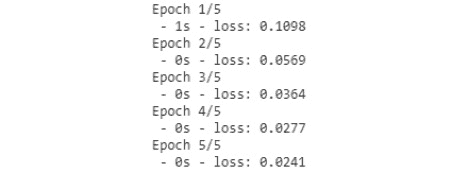
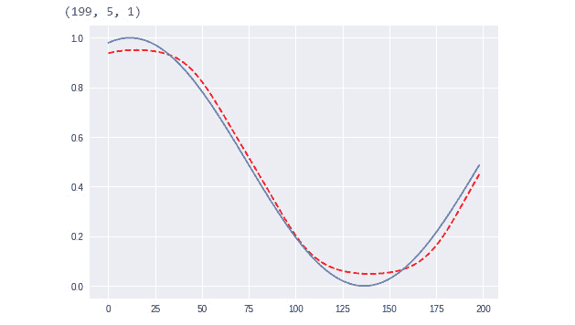
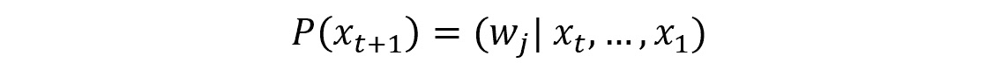
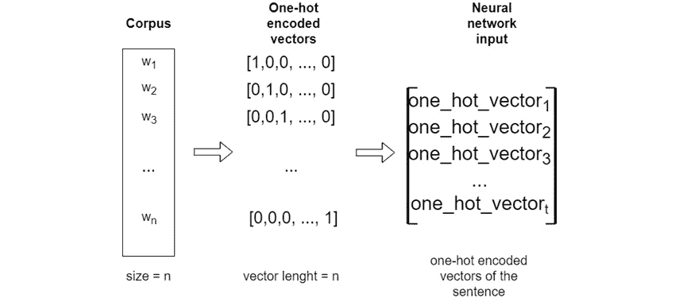

# 第五章：*第四章*

# 带有自然语言处理的神经网络

## 学习目标

到本章结束时，你将能够：

+   解释什么是循环神经网络

+   设计和构建循环神经网络

+   评估非数值数据

+   评估使用 RNN 的不同最先进的语言模型

+   使用时间序列数据预测一个值

本章涵盖了循环神经网络（RNN）的各个方面，主要讲解、设计和构建不同的 RNN 模型。

## 介绍

如前一章所述，自然语言处理（NLP）是人工智能（AI）中的一个领域，涵盖了计算机如何理解和操作人类语言以执行有用的任务。如今，随着深度学习技术的增长，深度自然语言处理（深度 NLP）已成为一个新的研究领域。

那么，什么是深度自然语言处理？它是自然语言处理技术和深度学习的结合。结合这些技术的结果在以下领域取得了进展：

+   语言学：语音转文本

+   工具：词性标注、实体识别和句法分析

+   应用：情感分析、问答、对话代理和机器翻译

深度 NLP 最重要的方法之一是对单词和句子的表示。单词可以表示为一个向量，位于充满其他单词的平面中。根据每个单词与另一个单词的相似度，其在平面中的距离会相应地设置为更大或更小。


###### 图 4.1：多维度中的词语表示

上一张图展示了词嵌入的示例。**词嵌入**是一组技术和方法，将词语和句子从语料库映射到向量或实数。它生成了每个词语的表示，基于词语出现的上下文。然后，词嵌入可以找到词语之间的相似性。例如，离“dog”最近的词语如下：

1.  狗

1.  猫

1.  牛

1.  老鼠

1.  鸟

有多种方式可以生成词嵌入，例如 Word2Vec，它将在*第七章*中讲解，*构建一个对话代理来管理机器人*。

这并不是深度学习对 NLP 在形态学层面带来的唯一巨大变化。通过深度学习，一个词可以表示为多个向量的组合。

每个语素都是一个向量，而一个词是通过组合多个语素向量得到的结果。

这种向量组合的技术也在语义层面上得到应用，但它用于单词和句子的创建。每个短语都是通过许多单词向量的组合形成的，因此一个句子可以表示为一个向量。

另一个改进是在句法分析方面。这项任务很困难，因为它具有歧义性。神经网络可以准确地确定句子的语法结构。

在应用的全面术语中，相关领域如下：

+   **情感分析**：传统方法是将词汇包标记为正面或负面情感。然后，通过组合这些词汇来返回整个句子的情感。如今，利用深度学习和词表示模型，结果更为优秀。

+   **问题回答**：为了找到问题的答案，向量表示可以将文档、段落或句子与输入问题匹配。

+   **对话代理**：利用神经语言模型，模型可以理解查询并生成回应。

+   **机器翻译**：机器翻译是 NLP 中最难的任务之一。已经尝试了许多方法和模型。传统模型非常庞大和复杂，但深度学习神经机器翻译解决了这个问题。句子通过向量进行编码，输出则进行解码。

词的向量表示是深度自然语言处理（NLP）的基础。创建一个平面，可以完成许多任务。在分析深度 NLP 技术之前，我们将回顾什么是循环神经网络（RNN），它在深度学习中的应用是什么，以及如何创建我们的第一个 RNN。

我们未来的对话代理将能够检测到对话的意图并作出预定义的回答。但是通过一个良好的对话数据集，我们可以创建一个循环神经网络（RNN）来训练一个能够根据对话主题生成回应的语言模型（LM）。这一任务也可以通过其他神经网络架构来实现，例如 seq2seq 模型。

## 循环神经网络

在本节中，我们将回顾**循环神经网络**（**RNNs**）。本话题将首先介绍 RNN 的理论。它将回顾该模型中的多种架构，帮助你确定使用哪种模型来解决特定问题，还会探讨几种类型的 RNN 及其优缺点。此外，我们将了解如何创建一个简单的 RNN，训练它并进行预测。

### 循环神经网络（RNN）介绍

人类行为展示了各种有序的动作序列。人类能够基于一组先前的动作或序列来学习动态路径。这意味着人们并不是从零开始学习；我们有一些先前的知识，这有助于我们。例如，如果你不理解句子中的前一个词，你就无法理解下一个词！

传统上，神经网络无法解决这些类型的问题，因为它们不能学习先前的信息。那么，当问题无法仅通过当前信息解决时，应该怎么办呢？

1986 年，Michael I. Jordan 提出了一个处理时间组织经典问题的模型。该模型能够通过研究动态物体的先前运动来学习其轨迹。Jordan 创造了第一个 RNN。


###### 图 4.2：非前置信息与时间序列的示例

在前一图中，左侧的图像告诉我们，如果没有任何信息，我们无法知道黑点的下一个动作会是什么。但如果我们假设它的前一个动作被记录为右侧图表中的红线，我们就能预测它的下一个动作。

### 递归神经网络内部

到目前为止，我们已经看到 RNN 与神经网络（NN）不同。RNN 的神经元就像普通神经元，但它们内部有循环，这使它们能够存储时间状态。通过存储某一时刻的状态，它们可以根据前一个时间状态进行预测。


###### 图 4.3：传统神经元

前面的图显示了一个传统神经元，通常用于神经网络（NN）中。*X**n*是神经元的输入，在激活函数后，生成响应。RNN 神经元的架构则有所不同：

.jpg)

###### 图 4.4：递归神经元

前图中的循环允许神经元存储时间状态。*h**n*是输入 *X**n* 和前一个状态的输出。神经元随着时间的推移而变化和演化。

如果神经元的输入是一个序列，那么展开的 RNN 将是这样的：


###### 图 4.5：展开的递归神经元

图 4.5 中的链状架构展示了 RNN 与序列和列表的紧密关系。因此，我们有与输入数量相同的神经元，每个神经元将其状态传递给下一个神经元。

### RNN 架构

根据 RNN 中输入和输出的数量，有许多具有不同神经元数量的架构。每种架构都专门用于某个特定任务。到目前为止，已经有许多种网络类型：


###### 图 4.6：RNN 的结构

前图展示了 RNN 的各种分类。书中早些时候，我们回顾了“一对一”架构。在本章中，我们将学习“多对一”架构。

+   **一对一**：来自一个输入的分类或回归任务（图像分类）。

+   **一对多**：图像描述任务。这些是深度学习中的难题。例如，传递图像作为输入的模型可以描述图像中的元素。

+   **多对一**：时间序列，情感分析……每个任务只有一个输出，但基于一系列不同的输入。

+   **多对多**：机器自动翻译系统。

+   **同步多对多**：视频分类。

### 长期依赖问题

在某些任务中，预测模型的下一步只需要使用最新的信息。对于时间序列任务，需要检查更早的元素来学习或预测句子中的下一个元素或词语。例如，看看这句话：

+   The clouds are in the sky.  

现在想象这个句子：

+   The clouds are in the [?]

你可能会假设需要的词是 sky，你知道这个是因为之前的信息：

+   云层位于

但也有一些任务，模型需要使用先前的信息来获得更好的预测。例如，看看这句话：

+   我出生在意大利，但 3 岁时搬到了法国……这就是我能说[?]的原因

为了预测词汇，模型需要从句子的开头获取信息，而这可能是一个问题。这是 RNN 的一个问题：当信息之间的距离较大时，学习变得更加困难。这个问题被称为 **梯度消失**。

**梯度消失问题**

在 RNN 中，信息是随着时间流动的，因此前一步的信息会作为输入传递到下一步。每一步，模型都会计算代价函数，所以每次模型可能都会获得一个误差值。在通过网络传播误差，并在更新权重时尽量减小误差的过程中，操作结果会逐渐接近零（如果将两个小数相乘，结果会是一个更小的数）。这意味着模型的梯度在每次乘法操作后会变得越来越小。这里的问题是网络无法正确训练。解决 RNN 问题的方法之一是使用长短期记忆（LSTM）。

### 练习 14：使用 RNN 预测房价

我们将使用 Keras 创建我们的第一个 RNN。这个练习不是一个时间序列问题。我们将使用回归数据集来介绍 RNN。

我们可以使用 Keras 库中包含的多种方法来作为模型或层的类型：

+   Keras 模型：这些让我们可以使用 Keras 中的不同模型。我们将使用 Sequential 模型。

+   Keras 层：我们可以向神经网络中添加不同类型的层。在本次练习中，我们将使用 LSTM 和 Dense 层。Dense 层是神经网络中的常规神经元层，每个神经元都接收来自前一层所有神经元的输入，且这些神经元之间是密集连接的。

本次练习的主要目标是预测波士顿一所房子的价值，因此我们的数据集将包含每所房子的相关信息，比如房产的总面积或房间数量：

1.  从`sklearn`导入波士顿房价数据集，并查看数据：

    ```py
    from sklearn.datasets import load_boston
    boston = load_boston()
    boston.data
    ```

    

    ###### 图 4.7：波士顿房价数据

1.  可以看到数据的数值很高，所以最好的做法是对数据进行归一化。使用 `sklearn` 的 `MinMaxScaler` 函数，我们将把数据转换为 0 到 1 之间的数值：

    ```py
    from sklearn.preprocessing import MinMaxScaler
    import numpy as np

    scaler = MinMaxScaler()
    x = scaler.fit_transform(boston.data)

    aux = boston.target.reshape(boston.target.shape[0], 1)
    y = scaler.fit_transform(aux)
    ```

1.  将数据分为训练集和测试集。测试集的合理比例是数据的 20%：

    ```py
    from sklearn.model_selection import train_test_split

    x_train, x_test, y_train, y_test = train_test_split(x, y, test_size=0.2, shuffle=False)
    print('Shape of x_train {}'.format(x_train.shape))
    print('Shape of y_train {}'.format(y_train.shape))
    print('Shape of x_test {}'.format(x_test.shape))
    print('Shape of y_test {}'.format(y_test.shape))
    ```

    

    ###### 图 4.8：训练数据和测试数据的形状

1.  导入 Keras 库并设置随机种子以初始化权重：

    ```py
    import tensorflow as tf
    from keras.models import Sequential
    from keras.layers import Dense
    tf.set_random_seed(1)
    ```

1.  创建一个简单的模型。密集层只是一个神经元集合。最后一层密集层只有一个神经元用于返回输出：

    ```py
    model = Sequential()

    model.add(Dense(64, activation='relu'))
    model.add(Dense(32, activation='relu'))
    model.add(Dense(1))

    model.compile(loss='mean_squared_error', optimizer='adam')
    ```

1.  训练网络：

    ```py
    history = model.fit(x_train, y_train, batch_size=32, epochs=5, verbose=2)
    ```

    

    ###### 图 4.9：训练网络

1.  计算模型的误差：

    ```py
    error = model.evaluate(x_test, y_test)
    print('MSE: {:.5f}'.format(error))
    ```

    

    ###### 图 4.10：计算模型的误差

1.  绘制预测结果：

    ```py
    import matplotlib.pyplot as plt

    prediction = model.predict(x_test)
    print('Prediction shape: {}'.format(prediction.shape))

    plt.plot(range(len(x_test)), prediction.reshape(prediction.shape[0]), '--r')
    plt.plot(range(len(y_test)), y_test)
    plt.show()
    ```


###### 图 4.11：我们模型的预测

现在你已经有了一个用于回归问题的 RNN！你可以尝试修改参数、添加更多层，或者改变神经元的数量来观察会发生什么。在下一个练习中，我们将使用 LSTM 层解决时间序列问题。

## 长短期记忆

**LSTM** 是一种 RNN，旨在解决长期依赖问题。它可以记住长时间或短时间的数值。它与传统的 RNN 的主要区别在于，它们包含一个单元或循环来内部存储记忆。

这种类型的神经网络是由 Hochreiter 和 Schmidhuber 于 1997 年创建的。这是一个 LSTM 神经元的基本结构：


###### 图 4.12：LSTM 神经元结构

正如你在前一张图中看到的，LSTM 神经元的结构是复杂的。它有三种类型的门控：

+   输入门：允许我们控制输入值以更新记忆单元的状态。

+   忘记门：允许我们擦除记忆单元中的内容。

+   输出门：允许我们控制输入和记忆单元内容返回的值。

在 Keras 中，LSTM 模型具有三维输入：

+   样本：是你拥有的数据量（序列的数量）。

+   时间步：是你网络的记忆。换句话说，它存储之前的信息，以便做出更好的预测。

+   特征：是每个时间步中的特征数量。例如，如果你处理的是图像，特征就是像素的数量。

    #### 注：

    这种复杂的设计会导致另一种类型的网络的形成。这种新类型的神经网络是**门控循环单元（GRU）**，它解决了消失梯度问题。

### 练习 15：预测数学函数的下一个解

在这个练习中，我们将构建一个 LSTM 来预测正弦函数的值。在这个练习中，你将学习如何使用 Keras 训练和预测一个 LSTM 模型。此外，这个练习还将介绍数据生成以及如何将数据划分为训练样本和测试样本：

1.  使用 Keras，我们可以通过 Sequential 类创建一个 RNN，并且可以创建一个 LSTM 来添加新的循环神经元。导入 Keras 库来构建 LSTM 模型，导入 NumPy 来设置数据，导入 matplotlib 来绘制图表：

    ```py
    import tensorflow as tf
    from keras.models import Sequential
    from keras.layers import LSTM, Dense
    import numpy as np
    import matplotlib.pyplot as plt
    ```

1.  创建用于训练和评估模型的数据集。我们将生成一个包含 1000 个值的数组，作为正弦函数的结果：

    ```py
    serie = 1000
    x_aux = [] #Natural numbers until serie
    x_aux = np.arange(serie)
    serie = (np.sin(2 * np.pi * 4 * x_aux / serie) + 1) / 2
    ```

1.  为了查看数据是否合适，让我们绘制它：

    ```py
    plt.plot(x_aux, serie)
    plt.show()
    ```

    

    ###### 图 4.13：带有绘制数据的输出

1.  如本章所述，RNN 使用数据序列，因此我们需要将数据拆分为序列。在我们的例子中，序列的最大长度将为 5。这是必要的，因为 RNN 需要序列作为输入。

    该模型将是**多对一**的，因为输入是一个序列，而输出只是一个值。要理解为什么我们要使用多对一结构来创建 RNN，只需要了解输入和输出数据的维度：

    ```py
    #Prepare input data
    maxlen = 5
    seq = []
    res = []
    for i in range(0, len(serie) - maxlen):
        seq.append(serie[i:maxlen+i])
        res.append(serie[maxlen+i])
    print(seq[:5])
    print(res[:5])
    ```

1.  准备数据以将其输入到 LSTM 模型中。注意 `x` 和 `y` 变量的形状。RNN 需要一个三维向量作为输入，一个二维向量作为输出。因此，我们将调整变量的形状：

    ```py
    x = np.array(seq)
    y = np.array(res)
    x = x.reshape(x.shape[0], x.shape[1], 1)
    y = y.reshape(y.shape[0], 1)
    print('Shape of x {}'.format(x.shape))
    print('Shape of y {}'.format(y.shape))
    ```

    

    ###### 图 4.14：调整变量的形状

    #### 注意

    LSTM 的输入维度为 3。

1.  将数据分为训练集和测试集：

    ```py
    from sklearn.model_selection import train_test_split

    x_train, x_test, y_train, y_test = train_test_split(x, y, test_size=0.2, shuffle=False)
    print('Shape of x_train {}'.format(x_train.shape))
    print('Shape of y_train {}'.format(y_train.shape))
    print('Shape of x_test {}'.format(x_test.shape))
    print('Shape of y_test {}'.format(y_test.shape))
    ```

    

    ###### 图 4.15：将数据拆分为训练集和测试集

1.  构建一个简单的模型，其中包含一个 LSTM 单元和一个带有一个神经元的全连接层，使用线性激活函数。全连接层只是接收来自上一层输入并生成多个神经元输出的常规神经层。因此，我们的全连接层只有一个神经元，因为我们需要一个标量值作为输出：

    ```py
    tf.set_random_seed(1)
    model = Sequential()
    model.add(LSTM(1, input_shape=(maxlen, 1)))   
    model.add(Dense(1, activation='linear'))      
    model.compile(loss='mse', optimizer='rmsprop')
    ```

1.  训练模型 5 个周期（一个周期是神经网络处理整个数据集的过程），批次大小为 32，并进行评估：

    ```py
    history = model.fit(x_train, y_train, batch_size=32, epochs=5, verbose=2)
    error = model.evaluate(x_test, y_test)
    print('MSE: {:.5f}'.format(error))
    ```

    

    ###### 图 4.16：使用 5 个周期和批次大小为 32 进行训练

1.  绘制测试预测结果，看看它是否表现良好：

    ```py
    prediction = model.predict(x_test)
    print('Prediction shape: {}'.format(prediction.shape))
    plt.plot(range(len(x_test)), prediction.reshape(prediction.shape[0]), '--r')
    plt.plot(range(len(y_test)), y_test)
    plt.show()
    ```

    

    ###### 图 4.17：绘制预测结果的形状

1.  让我们改进我们的模型。创建一个新的模型，LSTM 层中有四个单元，一个带有一个神经元的全连接层，并使用 sigmoid 激活函数：

    ```py
    model2 = Sequential()
    model2.add(LSTM(4,input_shape=(maxlen,1)))
    model2.add(Dense(1, activation='sigmoid'))
    model2.compile(loss='mse', optimizer='rmsprop')
    ```

1.  训练并评估模型 25 个周期，批次大小为 8：

    ```py
    history = model2.fit(x_train, y_train,
                         batch_size=8,
                         epochs=25, 
                         verbose=1)
    error = model2.evaluate(x_test, y_test)
    print('MSE: {:.5f}'.format(error))
    ```

    

    ###### 图 4.18：使用 25 个周期和批次大小为 8 进行训练

1.  绘制模型的预测结果：

    ```py
    predict_2 = model2.predict(x_test)
    predict_2 = predict_2.reshape(predict_2.shape[0]) 
    print(x_test.shape)
    plt.plot(range(len(x_test)),predict_2, '--r')
    plt.plot(range(len(y_test)), y_test)
    plt.show()
    ```



###### 图 4.19：我们的神经网络的预测结果

现在你可以比较每个模型的图表，我们可以看到第二个模型更好。通过这个练习，你已经掌握了 LSTM 的基础知识，学会了如何训练和评估你创建的模型，以及如何判断它是否好。

## 神经语言模型

*第三章*，*自然语言处理基础* 向我们介绍了统计语言模型（LMs），即一个单词序列的概率分布。我们知道语言模型可以用来预测句子中的下一个单词，或者计算下一个单词的概率分布。



###### 图 4.20：用于计算下一个单词概率分布的语言模型公式

单词序列是*x1*，*x2* … 下一个单词是*x**t+1*。*w**j*是词汇表中的一个词。*V*是词汇表，*j*是词汇表中词的位置信息。*w**j*是位于位置*j*的词。

你每天都在使用语言模型（LM）。手机上的键盘使用此技术来预测句子的下一个单词，像谷歌这样的搜索引擎也使用它来预测你想要搜索的内容。

我们讨论了 n-gram 模型和通过计数语料库中的词语来计算 bigram，但该解决方案有一些局限性，如长依赖性。深度 NLP 和神经语言模型将有助于绕过这些局限性。

### 神经语言模型简介

神经语言模型遵循与统计语言模型相同的结构。它们的目标是预测句子中的下一个单词，但方式不同。神经语言模型的灵感来源于 RNN，因为使用了序列作为输入。

*练习 15*，*预测数学函数的下一个解*，通过前五个步骤的序列来预测正弦函数的下一个结果。在这种情况下，数据不是正弦函数结果的序列，而是单词，模型将预测下一个单词。

这些神经语言模型（LMs）源于改善统计方法的需求。新的模型可以绕过一些传统语言模型的局限性和问题。

**统计语言模型的问题**

在前一章中，我们回顾了语言模型以及 n-gram、bigram 和马尔可夫模型的概念。这些方法通过计数文本中的词频来执行。这就是为什么这些方法被称为统计语言模型的原因。

语言模型的主要问题是数据限制。如果我们要计算的句子的概率分布在数据中不存在，该怎么办？一个部分解决方案是平滑方法，但它不足够。

另一种解决方案是使用马尔可夫假设（每个概率仅依赖于前一个步骤，从而简化链式法则）来简化句子，但这不会给出好的预测。这意味着我们可以使用 3-grams 来简化我们的模型。

解决这个问题的一种方法是增加语料库的大小，但语料库最终会变得过大。这种 n-gram 模型的局限性被称为**稀疏性问题**。

**基于窗口的神经模型**

这个新模型的第一次近似是使用滑动窗口来计算下一个单词的概率。这个解决方案的概念来自于窗口分类。

就单词而言，没有上下文，很难理解一个单词的含义。如果这个单词没有出现在句子或段落中，会出现很多问题，例如两个相似单词之间的歧义或自反义词问题。自反义词是具有多重含义的词。比如单词 "handicap" ，根据上下文，它可以表示优势（例如，在运动中）或劣势（有时具有冒犯意味，是一种身体问题）。

窗口分类法通过其邻近单词的上下文（由窗口创建）对单词进行分类。可以使用滑动窗口的方法生成语言模型。以下是一个图形示例：


###### 图 4.21：基于窗口的神经语言模型

在前面的图中，展示了基于窗口的神经模型是如何工作的。窗口大小为 5（word1 到 word5）。它创建一个向量，将每个单词的嵌入向量连接起来，并在隐藏层中进行计算：


###### 图 4.22：隐藏层公式

最后，为了预测一个单词，模型返回一个可以用来分类该单词概率的值：


###### 图 4.23：Softmax 函数

然后，具有最高值的单词将是预测的单词。

#### 注

我们不打算深入探讨这些术语，因为我们将使用 LSTM 来创建语言模型。

相比传统方法，这种方法的优势如下：

+   更少的计算工作。基于窗口的神经模型需要更少的计算资源，因为它们不需要遍历语料库计算概率。

+   它避免了通过改变 N-gram 的维度来寻找好的概率分布的问题。

+   生成的文本在意义上会更有逻辑，因为这种方法解决了稀疏性问题。

但是存在一些问题：

+   窗口的限制：窗口的大小不能太大，否则一些单词的含义可能会出错。

+   每个窗口都有自己的权重值，因此可能会导致歧义。

+   如果窗口的大小增加，模型也会随之增长。

分析窗口模型的问题时，RNN 可以提高性能。

### RNN 语言模型

RNN 能够计算序列中下一个单词的概率，基于之前步骤的信息。该方法的核心思想是，在整个训练过程中反复应用相同的权重。

使用 RNN 语言模型相对于基于窗口的模型有一些优势：

+   这种架构可以处理任意长度的句子；它没有固定的大小，不像基于窗口的方法。

+   对于每个输入大小，模型是相同的。如果输入更大，它不会增长。

+   根据神经网络架构，它可以使用来自前一步和后一步的信息。

+   权重在各个时间步之间是共享的。

到目前为止，我们已经讨论了改进统计语言模型的不同方法以及每种方法的优缺点。在开发 RNN 语言模型之前，我们需要了解如何将句子作为输入引入神经网络。

**独热编码**

神经网络和机器学习都是关于数字的。正如我们在本书中所看到的，输入元素是数字，输出是编码标签。但如果神经网络的输入是一个句子或一组字符，如何将其转化为数值呢？

独热编码是离散变量的数值表示。它假设对于离散变量集中的不同值，特征向量的大小相同。这意味着如果语料库的大小为 10，每个单词将被编码为一个长度为 10 的向量。因此，每个维度对应集合中的一个唯一元素。



###### 图 4.24：RNN 数据预处理流

前一张图展示了独热编码的工作原理。理解每个向量的形状非常重要，因为神经网络需要了解我们拥有的输入数据以及我们希望获得的输出。接下来，*练习 16，编码一个小语料库* 将帮助你更详细地学习独热编码的基础。

### 练习 16：编码一个小语料库

在本练习中，我们将学习如何使用独热编码对一组单词进行编码。这是最基本的编码方法，它为我们提供了离散变量的表示。

本练习将涵盖执行此任务的不同方法。一种方法是手动执行编码，另一种方法是使用库。在完成练习后，我们将获得每个单词的向量表示，准备作为神经网络的输入：

1.  定义一个语料库。这个语料库与我们在*第三章*，*自然语言处理基础*中使用的语料库相同：

    ```py
    corpus = [
         'My cat is white',
         'I am the major of this city',
         'I love eating toasted cheese',
         'The lazy cat is sleeping',
    ]
    ```

1.  使用 `spaCy` 对其进行分词。我们不会使用停用词（去除无用的词，如冠词）方法，因为我们有一个小语料库。我们希望保留所有的标记：

    ```py
    import spacy
    import en_core_web_sm
    nlp = en_core_web_sm.load()

    corpus_tokens = []
    for c in corpus:
        doc = nlp(c)
        tokens = []
        for t in doc:
            tokens.append(t.text)
        corpus_tokens.append(tokens)
    corpus_tokens
    ```

1.  创建一个包含语料库中每个唯一标记的列表：

    ```py
    processed_corpus = [t for sentence in corpus_tokens for t in sentence]
    processed_corpus = set(processed_corpus)
    processed_corpus
    ```

    

    ###### 图 4.25：语料库中每个唯一标记的列表

1.  创建一个字典，其中每个单词在语料库中作为键，唯一的数字作为值。这个字典将类似于 {word:value}，并且该值将在独热编码向量中具有索引 1：

    ```py
    word2int = dict([(tok, pos) for pos, tok in enumerate(processed_corpus)])
    word2int
    ```

    

    ###### 图 4.26：每个单词作为键，唯一的数字作为值

1.  对句子进行编码。这种编码方式是手动的。有一些库，如 sklearn，提供自动编码方法：

    ```py
    Import numpy as np
    sentence = 'My cat is lazy'
    tokenized_sentence = sentence.split()
    encoded_sentence = np.zeros([len(tokenized_sentence),len(processed_corpus)])
    encoded_sentence
    for i,c in enumerate(sentence.split()):
        encoded_sentence[i][ word2int[c] ] = 1
    encoded_sentence
    ```

    

    ###### 图 4.27：手动独热编码向量

    ```py
    print("Shape of the encoded sentence:", encoded_sentence.shape)
    ```

1.  导入 `sklearn` 方法。sklearn 首先使用 `LabelEncoder` 对语料库中的每个唯一标记进行编码，然后使用 `OneHotEncoder` 创建向量：

    ```py
    from sklearn.preprocessing import LabelEncoder
    from sklearn.preprocessing import OneHotEncoder
    Declare the LabelEncoder() class.
    le = LabelEncoder()
    Encode the corpus with this class.
    labeled_corpus = le.fit_transform(list(processed_corpus))
    labeled_corpus
    ```

    

    ###### 图 4.28：使用 OneHotEncoder 创建的向量

1.  现在，使用之前编码的相同句子，并应用我们创建的 `LabelEncoder` 转换方法：

    ```py
    sentence = 'My cat is lazy'
    tokenized_sentence = sentence.split()
    integer_encoded = le.transform(tokenized_sentence)
    integer_encoded
    ```

    

    ###### 图 4.29：应用 LabelEncoder 转换

1.  我们可以解码 `LabelEncoder` 中的初始句子：

    ```py
    le.inverse_transform(integer_encoded)
    ```

    

    ###### 图 4.30：解码后的 LabelEncoder

1.  使用 `sparse=False` 声明 `OneHotEncoder`（如果不指定此项，它将返回一个稀疏矩阵）：

    ```py
    onehot_encoder = OneHotEncoder(sparse=False)
    ```

1.  为了使用我们创建的标签编码器编码句子，我们需要将带标签的语料库重塑以适应 `onehot_encoder` 方法：

    ```py
    labeled_corpus = labeled_corpus.reshape(len(labeled_corpus), 1)
    onehot_encoded = onehot_encoder.fit(labeled_corpus)
    ```

1.  最后，我们可以将我们的句子（使用 LabelEncoder 编码）转换成一个 one-hot 向量。这种编码方式与手动编码的结果不会完全相同，但它们会具有相同的形状：

    ```py
    sentence_encoded = onehot_encoded.transform(integer_encoded.reshape(len(integer_encoded), 1))
    print(sentence_encoded)
    ```


###### 图 4.31：使用 Sklearn 方法进行的 One-hot 编码向量

#### 注意

这个练习非常重要。如果你不理解矩阵的形状，理解 RNN 的输入将会非常困难。

干得好！你完成了*练习 16*。现在你可以将离散变量编码成向量了。这是训练和评估神经网络的预处理数据的一部分。接下来，我们将进行本章的活动，目标是使用 RNN 和 one-hot 编码创建一个语言模型（LM）。

#### 注意

对于较大的语料库，one-hot 编码不是很有用，因为它会为每个词创建巨大的向量。因此，通常使用嵌入向量。这个概念将在本章稍后介绍。

### RNN 的输入维度

在开始 RNN 活动之前，你可能不了解输入维度。在本节中，我们将重点理解 n 维数组的形状，以及如何添加或删除一个维度。

**序列数据格式**

我们之前提到了多对一架构，其中每个样本由一个固定的序列和一个标签组成。这个标签对应序列中的下一个值。就像这样：


###### 图 4.32：序列数据的格式

在这个例子中，我们在矩阵 X 中有两个序列，Y 中有两个输出标签。因此，形状如下：

X = (2, 4)

Y = (2)

但如果你尝试将这些数据输入到 RNN 中，它将无法正常工作，因为它没有正确的维度。

**RNN 数据格式**

为了在 Keras 中实现带有时间序列的 RNN，模型将需要一个具有三维的输入向量，并且输出一个二维的向量。

所以，对于 X 矩阵，我们将得到以下形状：

+   样本数量

+   序列长度

+   值的长度


###### 图 4.33：RNN 数据格式

这里的形状如下：

X = (2, 4, 1)

Y = (2, 1)

**One-hot 格式**

使用 one-hot 编码后，我们的输入维度相同，但值的长度发生了变化。在前面的图中，我们可以看到值（[1]，[2]，…）是单维的。但使用 one-hot 编码后，这些值将变成向量，因此形状将如下所示：


###### 图 4.34：One-hot 格式

X = (2, 4, 3)

Y = (2, 3)

为了执行所有这些维度变化，将使用 NumPy 库中的**reshape**方法。

#### 注意

通过了解维度的知识，你可以开始进行活动，记住，LSTM 的输入维度是三，而输出维度是二。那么，如果你连续创建两层 LSTM，如何将第三个维度添加到第一层的输出中呢？将返回状态设置为 True。

### 活动 4：预测序列中的下一个字符

在这个活动中，我们将预测长序列中的下一个字符。这个活动必须使用 one-hot 编码来创建输入和输出向量。模型的架构将是 LSTM，就像我们在*练习 14*中看到的那样，*使用 RNN 预测房价*。

场景：你在一家全球公司担任安全经理。某天早晨，你发现黑客已经发现并更改了公司数据库的所有密码。你和你的工程师团队开始尝试解码黑客的密码，以进入系统并修复所有问题。分析所有新密码后，你发现了一个共同的结构。

你只需要解码密码中的一个字符，但你不知道那个字符是什么，而且你只有一次机会输入正确的密码。

然后，你决定创建一个程序，分析长序列的数据以及你已经知道的五个密码字符。通过这些信息，它可以预测密码的最后一个字符。

密码的前五个字符是：tyuio。最后一个字符会是什么？

#### 注意

你必须使用 one-hot 编码和 LSTM。你将使用 one-hot 编码向量训练模型。

1.  这是数据序列：qwertyuiopasdfghjklñzxcvbnm

    #### 注意

    这个序列重复了 100 次，所以这样做：sequence = 'qwertyuiopasdfghjklñzxcvbnm' * 100。

1.  将数据划分为五个字符一组，并准备输出数据。

1.  将输入和输出序列编码为 one-hot 编码向量。

1.  设置训练数据和测试数据。

1.  设计模型。

    #### 注意

    输出包含许多零，因此很难达到精确的结果。使用 LeakyRelu 激活函数，alpha 值为 0.01，当进行预测时，将该向量的值四舍五入。

1.  训练并评估它。

1.  创建一个函数，当给定五个字符时，预测下一个字符，以便找出密码的最后一个字符。

    #### 注意

    该活动的解决方案可以在第 308 页找到。

## 总结

AI 和深度学习在图像和人工视觉方面正在取得巨大进展，这要归功于卷积网络。但 RNN 也拥有强大的能力。

在这一章中，我们回顾了神经网络如何使用时间序列来预测正弦函数的值。如果你改变训练数据，这种架构可以学习每个分布的股票走势。此外，RNN 有许多不同的架构，每种架构都针对特定任务进行了优化。但是，RNN 存在梯度消失的问题。解决这个问题的一种方法是新模型——长短期记忆网络（LSTM），它通过改变神经元的结构来记住时间步长。

聚焦于语言学，统计语言模型（LM）存在许多与计算负载和分布概率相关的问题。为了解决稀疏性问题，n-gram 模型的大小被降低到 4 或 3 个 gram，但这个步长不足以预测下一个词。如果我们使用这种方法，稀疏性问题仍然会出现。一个具有固定窗口大小的神经语言模型（LM）可以避免稀疏性问题，但仍然存在窗口大小有限和权重的限制问题。使用 RNN 时，这些问题不会出现，并且根据架构的不同，它可以获得更好的结果，能够向前和向后看很多步。但是深度学习是关于向量和数字的。当你想要预测单词时，你需要对数据进行编码以训练模型。有多种不同的方法，例如独热编码（one-hot encoder）或标签编码（label encoder）。现在，你可以从已训练的语料库和 RNN 中生成文本。

在下一章中，我们将讨论卷积神经网络（CNN）。我们将回顾 CNN 的基本技术和架构，并进一步探讨更复杂的实现方法，例如迁移学习。
