# 第六章

# 计算机视觉中的卷积神经网络

## 学习目标

在本章结束时，你将能够：

+   解释卷积神经网络的工作原理

+   构建卷积神经网络

+   通过使用数据增强来改进已构建的模型

+   通过实现迁移学习使用最先进的模型

在本章中，我们将学习如何使用概率分布作为一种无监督学习的形式。

## 引言

在上一章中，我们学习了神经网络如何通过训练预测值，并了解了基于其架构的 **递归神经网络（RNN）** 在许多场景中的应用价值。本章中，我们将讨论并观察 **卷积神经网络（CNNs）** 如何与密集神经网络（也称为全连接神经网络，如*第二章*《计算机视觉导论》中所提到的）以类似的方式工作。

CNNs 拥有具有权重和偏置的神经元，这些权重和偏置会在训练过程中进行更新。CNNs 主要用于图像处理。图像被解释为像素，网络输出它认为图像所属的类别，以及损失函数，后者描述每次分类和每次输出的错误。

这类网络假设输入是图像或类似图像的形式，这使得它们可以更高效地工作（CNNs 比深度神经网络更快、更好）。在接下来的章节中，你将了解更多关于 CNNs 的内容。

## CNNs 基础

在本主题中，我们将看到 CNNs 如何工作，并解释卷积图像的过程。

我们知道图像是由像素组成的，如果图像是 RGB 格式，例如，它将有三个通道，每个字母/颜色（红-绿-蓝）都有自己的一组像素，每个通道的像素大小相同。全连接神经网络并不会在每一层表示图像的这种深度，而是通过一个单一的维度来表示这种深度，这显然是不够的。此外，它们将每一层的每个神经元与下一层的每个神经元连接，依此类推。这反过来导致性能较低，意味着你需要训练网络更长的时间，但仍然无法获得良好的结果。

**CNNs** 是一类神经网络，在分类和图像识别等任务中非常有效。虽然它们也能很好地处理声音和文本数据。CNNs 由输入层、隐藏层和输出层组成，就像普通的神经网络一样。输入层和隐藏层通常由 **卷积层**、**池化层**（用于减少输入的空间尺寸）和 **全连接层**（全连接层将在*第二章*《计算机视觉导论》中解释）构成。卷积层和池化层将在本章稍后进行详细讲解。

CNN（卷积神经网络）为每一层赋予了深度，从图像的原始深度到更深的隐藏层。下图展示了 CNN 的工作原理以及其结构：

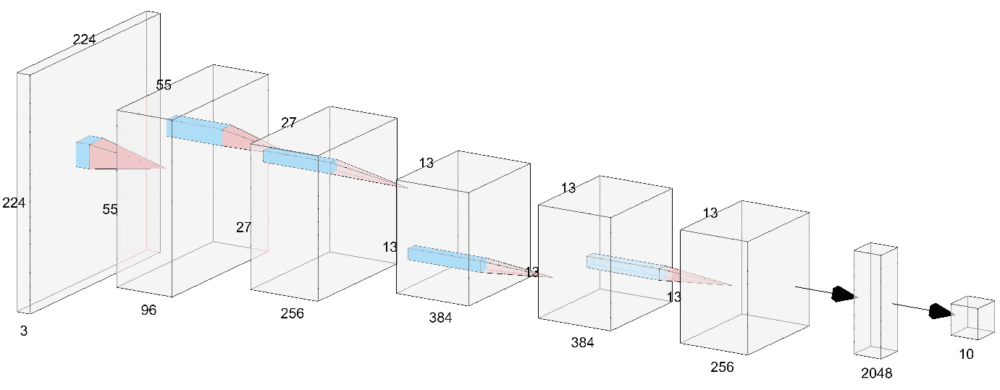

###### 图 5.1：CNN 的表示

在前面的图中，CNN 接收一个 224 x 224 x 3 的输入图像，通过卷积处理后转化为下一个层级，这一过程压缩了尺寸，但深度增加（我们稍后会解释这些过程是如何工作的）。这些操作会不断进行，直到图形表示被拉平，并通过这些密集层来输出数据集对应的类别。

**卷积层：**卷积层由一组固定大小（通常较小）的**滤波器**组成，这些滤波器是具有特定值/权重的矩阵，它们会遍历输入（例如一张图像），通过计算滤波器与输入之间的标量积，这个过程称为卷积。每个滤波器会生成一个二维激活图，这些激活图会沿着输入的深度堆叠。激活图的作用是寻找输入中的特征，并决定网络学习的效果。滤波器的数量越多，层的深度越大，因此网络学习得越多，但训练时的速度会变慢。例如，在某个图像中，你可能希望在第一层使用 3 个滤波器，在下一层使用 96 个滤波器，在再下一层使用 256 个滤波器，依此类推。请注意，在网络的开始部分，滤波器通常比在中间或末端部分少。这是因为网络的中间和末端具有更多潜在的特征可以提取，因此我们需要更多、更小的滤波器来处理网络的后段。这是因为随着我们深入网络，我们更多地关注图像中的小细节，因此希望从这些细节中提取更多特征，以便更好地理解图像。

卷积层滤波器的尺寸通常从 2x2 到 7x7 不等，具体取决于你处于网络的哪个阶段（开始部分使用较大尺寸，末端使用较小尺寸）。

在图 5.1 中，我们可以看到使用滤波器（浅蓝色）进行卷积操作，输出将是一个单一值，并传递到下一步/层。

在进行卷积操作后，在应用另一次卷积之前，通常会使用最大池化（**池化层**）来减少输入的大小，以便网络能够对图像进行更深层次的理解。然而，近年来，逐渐避免使用最大池化，转而鼓励使用步幅，这是在进行卷积时自然应用的，因此我们将通过自然地应用卷积来解释图像尺寸的缩小。

**步长（Strides）**：这是定义为像素的长度，用于描述滤波器在整个图像上应用的步伐。如果选择步长为 1，滤波器将每次应用一个像素。同样，如果选择步长为 2，则滤波器将每次应用两个像素，输出大小会比输入小，依此类推。

让我们来看一个例子。首先，将使用图 5.2 作为滤波器对图像进行卷积，它是一个 2x2 的矩阵：


###### 图 5.2: 卷积滤波器

以下可能是我们正在卷积的图像（矩阵）：

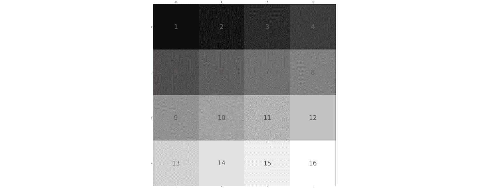

###### 图 5.3: 要卷积的图像

当然，这不是一个真实的图像，但为了简化，我们使用一个 4x4 的随机值矩阵来演示卷积是如何工作的。

现在，如果我们要应用步长为 1 的卷积，图形化的过程如下：

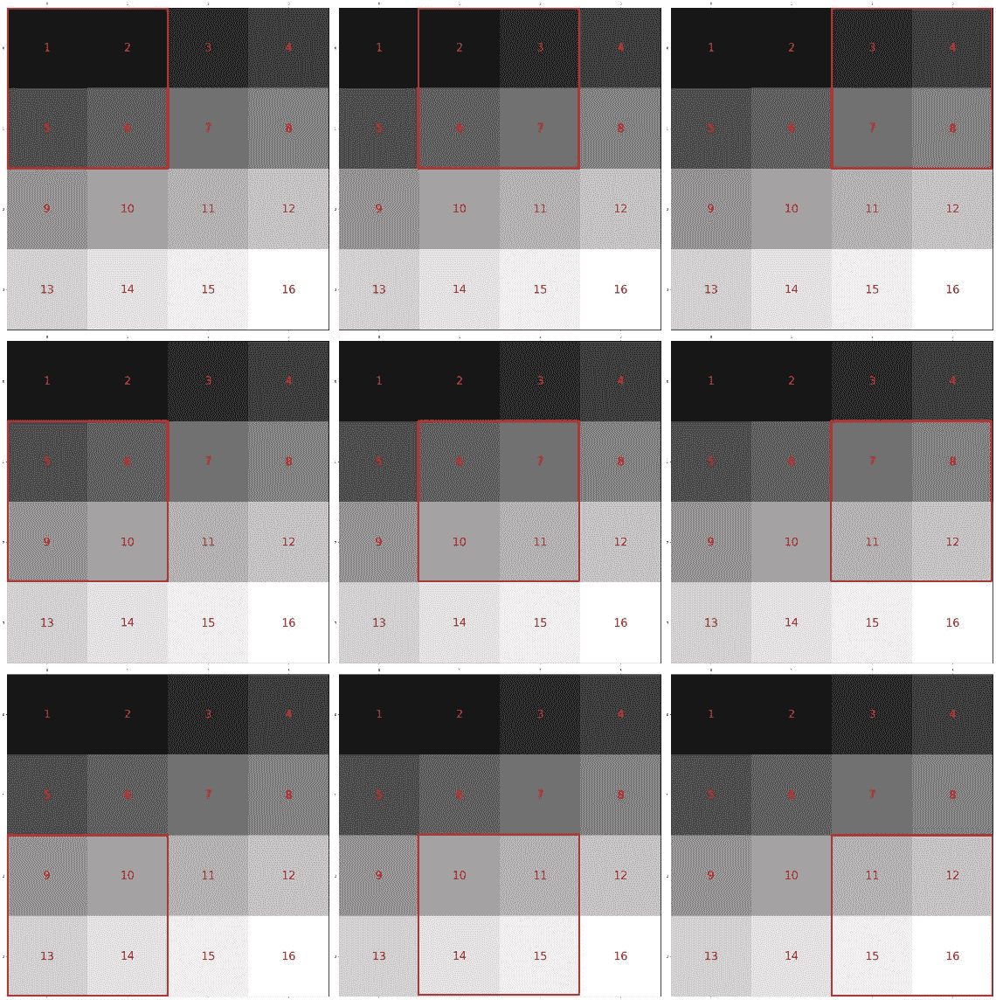

###### 图 5.4: 卷积过程 Stride=1

上面的图显示了一个 2x2 的滤波器被逐像素地应用到输入图像上。过程是从左到右、从上到下进行的。

滤波器将矩阵中每个位置的每个值与它所应用区域（矩阵）中每个位置的每个值相乘。例如，在过程的第一部分，滤波器应用于图像的前 2x2 部分 [1 2; 5 6]，而我们使用的滤波器是 [2 1; -1 2]，那么计算方式为 1*2 + 2*1 + 5*(-1) + 6*2 = 11。

应用滤波器矩阵后，得到的图像如下所示：

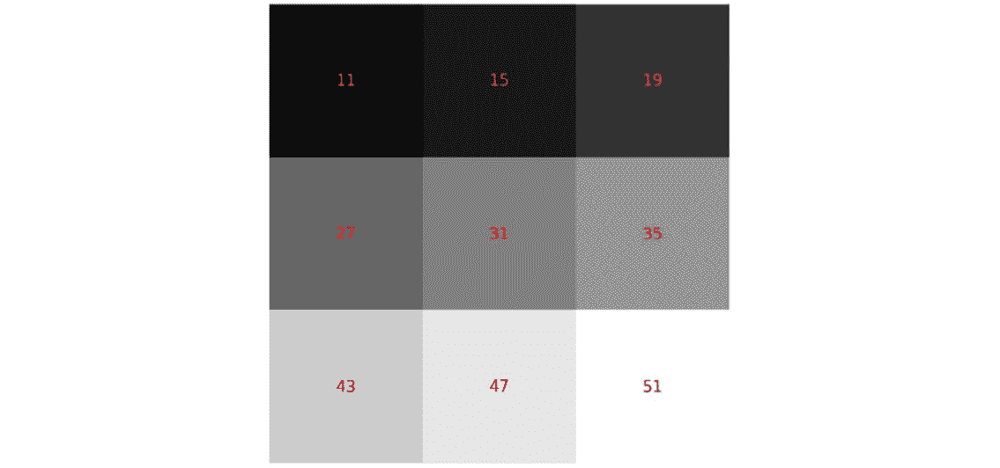

###### 图 5.5: 卷积结果 Stride=1

如你所见，处理后的图像现在变得比原来少了一维。这是因为存在一个名为**padding**的参数，默认设置为“valid”，这意味着卷积会按常规应用；也就是说，应用卷积后，图像自然会变得薄一像素。如果设置为“same”，图像周围将被一行像素包围，像素值为零，因此输出矩阵的大小将与输入矩阵相同。

现在，我们将应用步长为 2 的卷积，以将图像大小减少 2（就像一个 2x2 的最大池化层所做的那样）。请记住，我们使用的是“valid”类型的 padding。

该过程将会减少步骤，就像以下图所示：

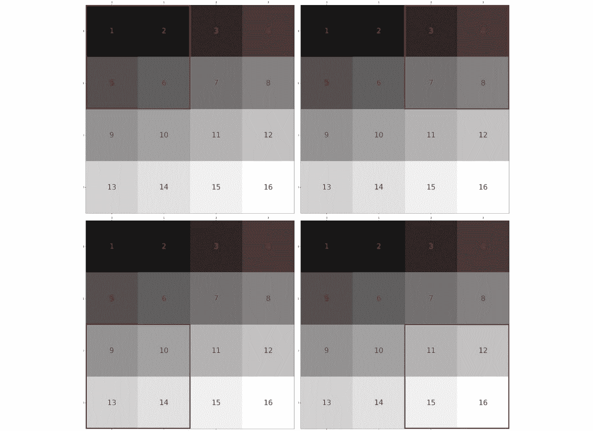

###### 图 5.6: 卷积过程 Stride=2

而输出的图像/矩阵看起来会是这样的：


###### 图 5.7: 卷积结果 Stride=2

结果图像将是一个 2x2 像素的图像。这是由于卷积过程的自然结果，步长（stride）为 2。

这些在每个卷积层上应用的过滤器，具有权重，神经网络会调整这些权重，使得这些过滤器的输出有助于神经网络学习有价值的特征。如前所述，这些权重通过反向传播过程更新。提醒一下，反向传播是网络计算训练步骤中预测结果与期望结果之间的误差（或损失），然后更新所有贡献于该误差的神经元权重，以避免再次犯同样的错误。

## 构建你的第一个 CNN

#### 注意

本章我们仍然将在 TensorFlow 上使用 Keras 作为后端，正如在本书的*第二章《计算机视觉导论》*中所提到的。此外，我们仍然会使用 Google Colab 来训练我们的网络。

Keras 是一个非常好的实现卷积层的库，因为它对用户进行了抽象，用户不需要手动实现各层。

在*第二章《计算机视觉导论》*中，我们通过使用`keras.layers`包导入了 Dense、Dropout 和 BatchNormalization 层，而为了声明二维卷积层，我们将使用相同的包：

```py
from keras.layers import Conv2D
```

`Conv2D`模块与其他模块类似：你必须声明一个顺序模型，这在本书的*第二章《计算机视觉导论》*中已做解释，我们还需要添加`Conv2D`：

```py
model = Sequential()
model.add(Conv2D(32, kernel_size=(3, 3), padding='same', strides=(2,2), input_shape=input_shape))
```

对于第一层，必须指定输入形状，但之后不再需要。

必须指定的第一个参数是**过滤器的数量**，即网络在该层要学习的过滤器数量。如前所述，在较早的层中，我们会学习少量的过滤器，而不是网络中的深层过滤器。

必须指定的第二个参数是**卷积核大小（kernel size）**，即应用于输入数据的滤波器大小。通常设置为 3x3 的卷积核，或者甚至是 2x2 的卷积核，但有时当图像较大时，会使用更大的卷积核。

第三个参数是**padding**，默认设置为“valid”，但我们需要将其设置为“same”，因为我们希望保持输入的尺寸，以便理解输入的下采样行为。

第四个参数是**strides**，默认设置为(1, 1)。我们将其设置为(2, 2)，因为这里有两个数字，并且需要为 x 轴和 y 轴都设置该参数。

在第一层之后，我们将采用与*第二章*《计算机视觉导论》中提到的相同方法：

```py
model.add(BatchNormalization())
model.add(Activation('relu'))
model.add(Dropout(0.2))
```

提醒一下，**批量归一化（BatchNormalization）**层用于规范化每层的输入，帮助网络更快收敛，通常也能提高整体效果。

`激活`函数是一个接受输入并计算其加权和的函数，添加偏置后决定是否激活（分别输出 1 和 0）。

**Dropout** 层通过关闭一定比例的神经元，帮助网络避免过拟合，过拟合是指训练集的准确率远高于验证集的准确率。

我们可以像这样应用更多的层集，根据问题的大小调整参数。

最后一层和密集神经网络的层保持一致，具体取决于问题。

### 练习 17：构建一个 CNN

#### 注意

这个练习使用了与*第二章，计算机视觉简介*相同的包和库。这些库包括 Keras、Numpy、OpenCV 和 Matplotlib。

在这个练习中，我们将使用与*第二章*、*活动 2*、*分类 Fashion-MNIST 数据库中的 10 种衣物类型*相同的问题。

记住，在那个活动中，构建的神经网络并不能很好地泛化，以至于无法对我们传递给它的未见数据进行分类。

提醒一下，这个问题是一个分类问题，模型需要正确地分类 10 种类型的衣物：

1.  打开你的 Google Colab 界面。

1.  为书籍创建一个文件夹，并从 GitHub 下载`Datasets`文件夹并上传到你驱动器中的文件夹里。

1.  挂载驱动器并按照以下方式进行：

    ```py
    from google.colab import drive
    drive.mount('/content/drive')
    ```

    #### 注意

    每次使用新合作者时，将驱动器挂载到目标文件夹。

1.  一旦你首次挂载了你的驱动器，你将需要输入 Google 给出的授权代码，点击给出的 URL 并按下键盘上的**Enter**键：

    

    ###### 图 5.8：在 Google Collab 上挂载

1.  现在你已经挂载了驱动器，需要设置目录的路径：

    ```py
    cd /content/drive/My Drive/C13550/Lesson05/
    ```

    #### 注意

    第 5 步中提到的路径可能会根据你在 Google Drive 上的文件夹设置而有所变化。路径将始终以`cd /content/drive/My Drive/`开头。

1.  首先，让我们从 Keras 导入数据并将随机种子初始化为 42，以确保结果可复现：

    ```py
    from keras.datasets import fashion_mnist 
    (x_train, y_train), (x_test, y_test) =fashion_mnist.load_data()
    import random
    random.seed(42) 
    ```

1.  我们导入了 NumPy 以便对数据进行预处理，并导入 Keras 工具来进行标签的独热编码：

    ```py
    import numpy as np
    from keras import utils as np_utils
    x_train = (x_train.astype(np.float32))/255.0 
    x_test = (x_test.astype(np.float32))/255.0 
    x_train = x_train.reshape(x_train.shape[0], 28, 28, 1) 
    x_test = x_test.reshape(x_test.shape[0], 28, 28, 1) 
    y_train = np_utils.to_categorical(y_train, 10) 
    y_test = np_utils.to_categorical(y_test, 10) 
    input_shape = x_train.shape[1:]
    ```

1.  我们声明`Sequential`函数来创建 Keras 的顺序模型、回调函数，当然还有层：

    ```py
    from keras.models import Sequential
    from keras.callbacks import EarlyStopping, ModelCheckpoint
    from keras.layers import Input, Dense, Dropout, Flatten
    from keras.layers import Conv2D, Activation, BatchNormalization
    ```

    #### 注意

    我们已经导入了一个回调函数叫做**EarlyStopping**。这个回调的作用是，当你选择的度量（例如，验证准确率）下降时，在指定的轮次后停止训练。你可以通过设置想要的轮次数来确定这个数字。

1.  现在，我们将构建我们的第一个 CNN。首先，让我们将模型声明为`Sequential`并添加第一个`Conv2D`：

    ```py
    def CNN(input_shape):
        model = Sequential()
        model.add(Conv2D(32, kernel_size=(3, 3), padding='same', strides=(2,2), input_shape=input_shape))
    ```

    我们添加了 32 个滤波器作为第一层，滤波器的大小为 3x3。填充设置为“`same`”，步长设置为 2，以自然地减少`Conv2D`模块的维度。

1.  我们通过添加`Activation`和`BatchNormalization`层来继续这个层：

    ```py
        model.add(Activation('relu'))
        model.add(BatchNormalization())
    ```

1.  我们将添加另外三层，保持之前相同的特性，应用 dropout，并跳到另一个模块：

    ```py
        model.add(Conv2D(32, kernel_size=(3, 3), padding='same', strides=(2,2)))
        model.add(Activation('relu'))
        model.add(BatchNormalization())
    ```

1.  现在，我们应用 20%的 dropout，这会关闭网络中 20%的神经元：

    ```py
        model.add(Dropout(0.2))
    ```

1.  我们将再次进行相同的操作，但这次使用 64 个过滤器：

    ```py
        model.add(Conv2D(64, kernel_size=(3, 3), padding='same', strides=(2,2)))
        model.add(Activation('relu'))
        model.add(BatchNormalization())
        model.add(Conv2D(64, kernel_size=(3, 3), padding='same', strides=(2,2)))
        model.add(Activation('relu'))
        model.add(BatchNormalization())
        model.add(Dropout(0.2))
    ```

1.  对于网络的最后部分，我们应用`Flatten`层将最后一层的输出转换为一维。我们应用一个包含 512 个神经元的`Dense`层。在网络的物流部分，我们应用`Activation`层和`BatchNormalization`层，然后应用 50%的`Dropout`：

    ```py
        model.add(Flatten())
        model.add(Dense(512))
        model.add(Activation('relu'))
        model.add(BatchNormalization())
        model.add(Dropout(0.5))
    ```

1.  最后，我们声明最后一层为一个包含 10 个神经元的`dense`层，这是数据集的类别数，并应用`Softmax`激活函数，确定图像最可能属于哪个类别，最后返回模型：

    ```py
        model.add(Dense(10, activation="softmax"))
        return model
    ```

1.  让我们声明模型并加上回调函数，然后进行编译：

    ```py
    model = CNN(input_shape)

    model.compile(loss='categorical_crossentropy', optimizer='Adadelta', metrics=['accuracy'])

    ckpt = ModelCheckpoint('Models/model.h5', save_best_only=True,monitor='val_loss', mode='min', save_weights_only=False) 
    earlyStopping = EarlyStopping(monitor='val_loss', patience=5, verbose=0,mode='min')
    ```

    对于编译，我们使用相同的优化器。对于声明检查点，我们使用相同的参数。对于声明`EarlyStopping`，我们将验证损失作为主要度量，并设置耐心值为五个 epoch。

1.  让训练开始吧！

    ```py
    model.fit(x_train, y_train, batch_size=128, epochs=100, verbose=1, validation_data=(x_test, y_test), callbacks=[ckpt,earlyStopping]) 
    ```

    我们将批量大小设置为 128，因为图像数量足够，而且这样做会减少训练时间。epoch 的数量设置为 100，因为`EarlyStopping`会负责停止训练。

    所得到的准确率比*第二章*中的练习*计算机视觉简介*中的结果更好——我们获得了**92.72%**的准确率。

    请查看以下输出：

    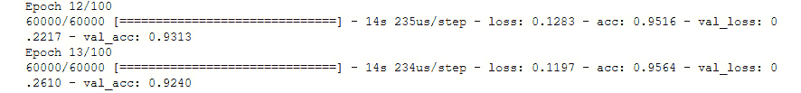

    ###### 图 5.9：显示的 val_acc 为 0.9240，即 92.72%

    #### 注意

    本次练习的完整代码可以在 GitHub 上找到：[`github.com/PacktPublishing/Artificial-Vision-and-Language-Processing-for-Robotics/blob/master/Lesson05/Exercise17/Exercise17.ipynb`](https://github.com/PacktPublishing/Artificial-Vision-and-Language-Processing-for-Robotics/blob/master/Lesson05/Exercise17/Exercise17.ipynb)。

1.  让我们尝试使用我们在*第二章*的*活动 2*，即*Fashion-MNIST 数据库的 10 种服装分类*中尝试过的相同例子，数据位于`Dataset/testing/`：

    ```py
    import cv2 

    images = ['ankle-boot.jpg', 'bag.jpg', 'trousers.jpg', 't-shirt.jpg'] 

    for number in range(len(images)):
        imgLoaded = cv2.imread('Dataset/testing/%s'%(images[number]),0) 
        img = cv2.resize(imgLoaded, (28, 28)) 
        img = np.invert(img) 
        img = (img.astype(np.float32))/255.0 
        img = img.reshape(1, 28, 28, 1) 

        plt.subplot(1,5,number+1),plt.imshow(imgLoaded,'gray') 
        plt.title(np.argmax(model.predict(img)[0])) 
        plt.xticks([]),plt.yticks([]) 
    plt.show()
    ```

这是输出：

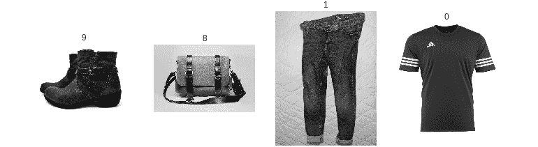

###### 图 5.10：使用卷积神经网络（CNN）进行服装预测

提醒一下，这是对应服装数量的表格：

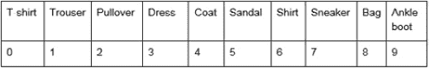

###### 图 5.11：对应服装数量的表格

我们可以看到模型已经很好地预测了所有图片，因此我们可以断定这个模型远比只有密集层的模型要好。

## 改进您的模型 - 数据增强

有时候，你可能无法通过构建更好的模型来提高模型的准确性。有时，问题不在于模型，而在于数据。工作时最重要的事情之一是，使用的数据必须足够好，以便潜在的模型能够对这些数据进行泛化。

数据可以表示现实中的事物，但也可能包含表现不佳的错误数据。当数据不完整或数据无法很好地代表各类时，就可能会发生这种情况。对于这些情况，数据增强已成为最流行的方法之一。

数据增强实际上是增加原始数据集的样本数量。对于计算机视觉，这意味着增加数据集中的图像数量。数据增强技术有很多种，你可能会根据数据集的不同选择特定的技术。这里提到了一些技术：

+   **旋转**：用户为数据集中的图像设置旋转角度。

+   **翻转**：水平或垂直翻转图像。

+   **裁剪**：从图像中随机裁剪一部分。

+   **改变颜色**：更改或变化图像的颜色。

+   **添加噪声**：向图像中添加噪声。

应用这些或其他技术，你将生成与原始图像不同的新图像。

为了在代码中实现这一点，Keras 有一个叫做`ImageDataGenerator`的模块，在其中声明你希望应用到数据集的变换。你可以通过以下代码行导入该模块：

```py
from keras.preprocessing.image import ImageDataGenerator
```

为了声明将应用所有这些更改的数据集变量，你需要像下面的代码片段一样声明它：

```py
datagen = ImageDataGenerator(
        rotation_range=20,
        zoom_range = 0.2,
        width_shift_range=0.1,
        height_shift_range=0.1,
        horizontal_flip=True
        )
```

#### 注意

你可以通过查看 Keras 的这篇文档，了解可以传递给`ImageDataGenerator`的属性：[`keras.io/preprocessing/image/`](https://keras.io/preprocessing/image/)。

在声明`datagen`之后，你需要使用以下方法进行特征-wise 规范化计算：

```py
datagen.fit(x_train)
```

这里，`x_train`是你的训练集。

为了使用数据增强训练模型，应使用以下代码：

```py
model.fit_generator(datagen.flow(x_train, y_train,
                                 batch_size=batch_size),
                    epochs=epochs,
                    validation_data=(x_test, y_test),
                    callbacks=callbacks,
                    steps_per_epoch=len(x_train) // batch_size)
```

`Datagen.flow()`用于应用数据增强。由于 Keras 不知道何时停止对给定数据应用数据增强，`Steps_per_epoch`是设置该限制的参数，应该是训练集长度除以批量大小。

现在我们将直接进入本章的第二个练习，观察输出。数据增强承诺更好的结果和更高的准确度。让我们来看看这是否成立。

### 练习 18：使用数据增强改进模型

在本练习中，我们将使用牛津-III 宠物数据集，该数据集包含 RGB 图像，大小不一，有多个类，包括不同品种的猫和狗。在这个例子中，我们将数据集分为两个类：猫和狗，为了简便。每个类有 1,000 张图片，虽然数量不多，但这将增强数据增强的效果。该数据集存储在 GitHub 上`Dataset/dogs-cats/`文件夹中。

我们将构建一个 CNN，并分别使用和不使用数据增强进行训练，然后比较结果：

#### 注意

对于这个练习，我们将打开另一个 Google Colab 笔记本。

此练习的完整代码可以在 GitHub 上找到：[`github.com/PacktPublishing/Artificial-Vision-and-Language-Processing-for-Robotics/blob/master/Lesson05/Exercise18/Exercise18.ipynb`](https://github.com/PacktPublishing/Artificial-Vision-and-Language-Processing-for-Robotics/blob/master/Lesson05/Exercise18/Exercise18.ipynb)。

1.  打开您的 Google Colab 界面。

1.  创建一个文件夹用于存放书籍，并从 GitHub 下载`Datasets`文件夹并上传到您驱动器中的该文件夹。

1.  导入驱动器并按如下方式挂载：

    ```py
    from google.colab import drive
    drive.mount('/content/drive')
    ```

    #### 注意

    每次使用新的协作者时，都要将驱动器挂载到所需的文件夹。

1.  在您第一次挂载驱动器后，您需要通过点击 Google 提供的 URL 并输入授权代码。

1.  现在您已经挂载了驱动器，接下来需要设置目录的路径：

    ```py
    cd /content/drive/My Drive/C13550/Lesson5/Dataset
    ```

    #### 注意

    步骤 5 中提到的路径可能会根据您在 Google Drive 上的文件夹设置而有所变化。路径将始终以`cd /content/drive/My Drive/`开头。

1.  首先，让我们使用之前已经使用过的这两种方法从磁盘加载数据：

    ```py
    import re, os, cv2
    import numpy as np
    rows,cols = 128,128
    //{…}##the detailed code can be found on Github##
    def list_files(directory, ext=None):
    //{…}##the detailed code can be found on Github##
    def load_images(path,label):
    //{…}
        for fname in list_files( path, ext='jpg' ): 
            img = cv2.imread(fname)
            img = cv2.resize(img, (rows, cols))
    //{…}##the detailed code can be found on Github##
    ```

    #### 注意

    图像的大小设置为 128x128。这比之前使用的大小要大，因为我们需要图像中更多的细节，因为这些类别更难以区分，且主题呈现出不同的姿势，这使得工作变得更加困难。

1.  我们加载相应的狗和猫的图像作为`X`（图像）和`y`（标签），并打印它们的形状：

    ```py
    X, y = load_images('Dataset/dogs-cats/dogs',0)
    X_aux, y_aux = load_images('Dataset/dogs-cats/cats',1)
    X = np.concatenate((X, X_aux), axis=0)
    y = np.concatenate((y, y_aux), axis=0)
    print(X.shape)
    print(y.shape)
    ```

    

    ###### 图 5.12：狗猫数据形状

1.  现在我们将导入`random`，设置种子，并显示一些数据样本：

    ```py
    import random 
    random.seed(42) 
    from matplotlib import pyplot as plt

    for idx in range(5): 
        rnd_index = random.randint(0, X.shape[0]-1)
        plt.subplot(1,5,idx+1)
        plt.imshow(cv2.cvtColor(X[rnd_index],cv2.COLOR_BGR2RGB)) 
        plt.xticks([]),plt.yticks([])
    plt.show() 
    ```

    

    ###### 图 5.13：牛津宠物数据集的图像样本

1.  为了预处理数据，我们将使用与*Exercise 17: 构建 CNN*中相同的过程：

    ```py
    from keras import utils as np_utils
    X = (X.astype(np.float32))/255.0
    X = X.reshape(X.shape[0], rows, cols, 3) 
    y = np_utils.to_categorical(y, 2)
    input_shape = X.shape[1:]
    ```

1.  现在，我们将`X`和`y`分别拆分为`x_train`和`y_train`（训练集），以及`x_test`和`y_test`（测试集），并打印它们的形状：

    ```py
    from sklearn.model_selection import train_test_split
    x_train, x_test, y_train, y_test = train_test_split(X, y, test_size=0.2)
    print(x_train.shape)
    print(y_train.shape)
    print(x_test.shape)
    print(y_test.shape)
    ```

    

    ###### 图 5.14：训练集和测试集形状

1.  我们导入相应的数据以构建、编译和训练模型：

    ```py
    from keras.models import Sequential
    from keras.callbacks import EarlyStopping, ModelCheckpoint
    from keras.layers import Input, Dense, Dropout, Flatten
    from keras.layers import Conv2D, Activation, BatchNormalization
    ```

1.  让我们构建模型：

    ```py
    def CNN(input_shape):
        model = Sequential()

        model.add(Conv2D(16, kernel_size=(5, 5), padding='same', strides=(2,2), input_shape=input_shape))
        model.add(Activation('relu'))
        model.add(BatchNormalization())
        model.add(Conv2D(16, kernel_size=(3, 3), padding='same', strides=(2,2)))
        model.add(Activation('relu'))
        model.add(BatchNormalization())
        model.add(Dropout(0.2))
    //{…}##the detailed code can be found on Github##

        model.add(Conv2D(128, kernel_size=(2, 2), padding='same', strides=(2,2)))
        model.add(Activation('relu'))
        model.add(BatchNormalization())
        model.add(Dropout(0.2))

        model.add(Flatten())
        model.add(Dense(512))
        model.add(Activation('relu'))
        model.add(BatchNormalization())
        model.add(Dropout(0.5))

        model.add(Dense(2, activation="softmax"))

        return model
    ```

    该模型的第一个层有 16 个滤波器，最后一个层有 128 个滤波器，每 2 层大小翻一倍。

    由于这个问题更难（我们有更大的图像，且图像具有 3 个通道，尺寸为 128x128），我们使模型更深，添加了另外几层，在开始时使用 16 个滤波器（第一层使用 5x5 的卷积核，这在最初阶段更为有效），并在模型的最后再添加了几层 128 个滤波器。

1.  现在，让我们编译模型：

    ```py
    model = CNN(input_shape)
    model.compile(loss='categorical_crossentropy', optimizer='Adadelta', metrics=['accuracy'])
    ckpt = ModelCheckpoint('Models/model_dogs-cats.h5', save_best_only=True,monitor='val_loss', mode='min', save_weights_only=False) 
    earlyStopping = EarlyStopping(monitor='val_loss', patience=15, verbose=0,mode='min')
    ```

    我们将`EarlyStopping`回调的耐心值设置为 15 个周期，因为模型需要更多的周期才能收敛到最佳位置，而验证损失在此之前可能会波动很大。

1.  然后，我们训练模型：

    ```py
    model.fit(x_train, y_train,
              batch_size=8,
              epochs=100,
              verbose=1, 
              validation_data=(x_test, y_test),
              callbacks=[ckpt,earlyStopping]) 
    ```

    批量大小也较小，因为我们没有太多数据，但它可以轻松增加到 16。

1.  然后，评估模型：

    ```py
    from sklearn import metrics
    model.load_weights('Models/model_dogs-cats.h5')
    y_pred = model.predict(x_test, batch_size=8, verbose=0)
    y_pred = np.argmax(y_pred, axis=1)
    y_test_aux = y_test.copy()
    y_test_pred = list()
    for i in y_test_aux:
        y_test_pred.append(np.argmax(i))

    print (y_pred)

    # Evaluate the prediction
    accuracy = metrics.accuracy_score(y_test_pred, y_pred)
    precision, recall, f1, support = metrics.precision_recall_fscore_support(y_test_pred, y_pred, average=None)
    print('\nFinal results...')
    print(metrics.classification_report(y_test_pred, y_pred))
    print('Acc      : %.4f' % accuracy)
    print('Precision: %.4f' % np.average(precision))
    print('Recall   : %.4f' % np.average(recall))
    print('F1       : %.4f' % np.average(f1))
    print('Support  :', np.sum(support))
    ```

    你应该看到以下输出：

    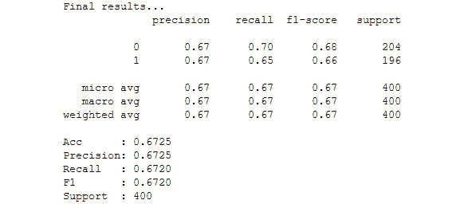

    ###### 图 5.15：展示模型准确度的输出

    如前图所示，使用此模型在该数据集上实现的准确率为**67.25%**。

1.  我们将对该过程应用数据增强。我们需要从 Keras 导入 ImageDataGenerator，并声明它与我们将进行的转换：

    ```py
    from keras.preprocessing.image import ImageDataGenerator
    datagen = ImageDataGenerator(
            rotation_range=15,
            width_shift_range=0.2,
            height_shift_range=0.2,
            horizontal_flip=True,
            zoom_range=0.3
            )
    ```

    应用了以下转换：

    我们设置了 15 度的旋转范围，因为图像中的狗和猫可能以稍微不同的方式呈现（可以根据需要调整此参数）。

    我们将宽度平移范围和高度平移范围设置为 0.2，以便在水平和垂直方向上平移图像，因为动物可能出现在图像的任何位置（同样可以调整）。

    我们将水平翻转属性设置为`True`，因为这些动物在数据集中可以水平翻转（对于垂直翻转，找到动物会更加困难）。

    最后，我们将缩放范围设置为 0.3，以便对图像进行随机缩放，因为图像中的狗和猫可能离得更远或更近。

1.  我们将声明好的`datagen`实例与训练数据拟合，以计算特征标准化所需的量，并重新声明并编译模型，以确保不使用之前的模型：

    ```py
    datagen.fit(x_train)

    model = CNN(input_shape)

    model.compile(loss='categorical_crossentropy', optimizer='Adadelta', metrics=['accuracy'])
    ckpt = ModelCheckpoint('Models/model_dogs-cats.h5', save_best_only=True,monitor='val_loss', mode='min', save_weights_only=False)
    ```

1.  最后，我们使用模型的`fit_generator`方法和`datagen`实例生成的`flow()`方法来训练模型：

    ```py
    model.fit_generator(
              datagen.flow(x_train, y_train, batch_size=8),
              epochs=100,
              verbose=1, 
              validation_data=(x_test, y_test),
              callbacks=[ckpt,earlyStopping],
              steps_per_epoch=len(x_train) // 8,
              workers=4) 
    ```

    我们将`steps_per_epoch`参数设置为训练集长度除以批量大小（8）。

    我们还将工作线程数设置为 4，以便充分利用处理器的四个核心：

    ```py
    from sklearn import metrics
    # Make a prediction
    print ("Making predictions...")
    model.load_weights('Models/model_dogs-cats.h5')
    #y_pred = model.predict(x_test)
    y_pred = model.predict(x_test, batch_size=8, verbose=0)
    y_pred = np.argmax(y_pred, axis=1)
    y_test_aux = y_test.copy()
    y_test_pred = list()
    for i in y_test_aux:
        y_test_pred.append(np.argmax(i))
    print (y_pred)
    # Evaluate the prediction
    accuracy = metrics.accuracy_score(y_test_pred, y_pred)
    precision, recall, f1, support = metrics.precision_recall_fscore_support(y_test_pred, y_pred, average=None)
    print('\nFinal results...')
    print(metrics.classification_report(y_test_pred, y_pred))
    print('Acc      : %.4f' % accuracy)
    print('Precision: %.4f' % np.average(precision))
    print('Recall   : %.4f' % np.average(recall))
    print('F1       : %.4f' % np.average(f1))
    print('Support  :', np.sum(support))
    ```

    你应该看到以下输出：

    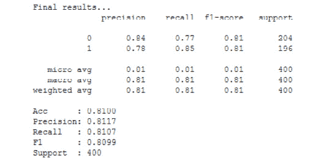

    ###### 图 5.16：展示模型准确度的输出

    如前图所示，经过数据增强后，我们实现了**81%**的准确率，效果远好于之前。

1.  如果我们想加载我们刚刚训练的模型（狗与猫），以下代码可以实现这一点：

    ```py
    from keras.models import load_model
    model = load_model('Models/model_dogs-cats.h5')
    ```

1.  让我们用未见过的数据来试试这个模型。数据可以在`Dataset/testing`文件夹中找到，代码来自*练习 17*，*构建卷积神经网络（CNN）*（但样本的名称不同）：

    ```py
    images = ['dog1.jpg', 'dog2.jpg', 'cat1.jpg', 'cat2.jpg'] 

    for number in range(len(images)):
        imgLoaded = cv2.imread('testing/%s'%(images[number])) 
        img = cv2.resize(imgLoaded, (rows, cols)) 
        img = (img.astype(np.float32))/255.0 
        img = img.reshape(1, rows, cols, 3) 

    ```

    在这些代码行中，我们加载了一张图片，将其调整为预期的大小（128 x 128），对图片进行了归一化处理——就像我们对训练集所做的那样——并将其重塑为（1, 128, 128, 3）的形状，以适应神经网络的输入。

    我们继续执行 for 循环：

    ```py
      plt.subplot(1,5,number+1),plt.imshow(cv2.cvtColor(imgLoad ed,cv2.COLOR_BGR2RGB))
        plt.title(np.argmax(model.predict(img)[0])) 
        plt.xticks([]),plt.yticks([]) 
    fig = plt.gcf()
    plt.show()
    ```

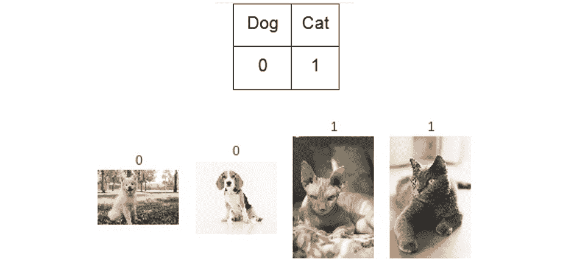

###### 图 5.17：使用卷积神经网络（CNNs）和数据增强对牛津宠物数据集进行预测，数据为未见过的数据

我们可以看到模型已经做出了所有正确的预测。请注意，并非所有的品种都存储在数据集中，因此并非所有猫狗都会被正确预测。为了实现这一点，需要添加更多品种类型。

### 活动 5：利用数据增强正确分类花卉图像

在此活动中，您将把所学内容付诸实践。我们将使用一个不同的数据集，其中图像更大（150x150）。该数据集包含 5 个类别：雏菊、蒲公英、玫瑰、向日葵和郁金香。该数据集总共有 4,323 张图像，较我们之前进行的练习要少。各个类别的图像数量也不相同，但请不要担心。图像是 RGB 格式的，因此将有三个通道。我们已将它们存储在每个类别的 NumPy 数组中，因此我们将提供一种方法来正确加载它们。

以下步骤将指导您完成此过程：

1.  使用以下代码加载数据集，因为数据以 NumPy 格式存储：

    ```py
    import numpy as np
    classes = ['daisy','dandelion','rose','sunflower','tulip']
    X = np.load("Dataset/flowers/%s_x.npy"%(classes[0]))
    y = np.load("Dataset/flowers/%s_y.npy"%(classes[0]))
    print(X.shape)
    for flower in classes[1:]:
        X_aux = np.load("Dataset/flowers/%s_x.npy"%(flower))
        y_aux = np.load("Dataset/flowers/%s_y.npy"%(flower))
        print(X_aux.shape)
        X = np.concatenate((X, X_aux), axis=0)
        y = np.concatenate((y, y_aux), axis=0)
    print(X.shape)
    print(y.shape)
    ```

1.  通过导入`random`和`matplotlib`，并使用随机索引访问`X`集来显示数据集中的一些样本。

    #### 注意

    NumPy 数组是以 BGR 格式存储的（OpenCV 格式），因此为了正确显示图像，您需要使用以下代码将格式转换为 RGB（仅用于显示图像）：`image=cv2.cvtColor(image,cv2.COLOR_BGR2RGB)`。

    您需要导入`cv2`。

1.  对`X`集进行归一化，并将标签设置为类别（即`y`集）。

1.  将数据集分成训练集和测试集。

1.  构建一个 CNN。

    #### 注意

    由于图像较大，您应该考虑添加更多的层，从而减少图像的大小，且第一层应包含更大的卷积核（如果卷积核大于 3，则应为奇数）。

1.  从 Keras 中声明 ImageDataGenerator，并根据您认为适合数据集变化的方式进行调整。

1.  训练模型。您可以选择提前停止（EarlyStopping）策略，或设置较大的 epoch 数量，等待或随时停止它。如果您声明了 Checkpoint 回调，它将始终仅保存最佳的验证损失模型（如果您使用的是该指标）。

1.  使用以下代码评估模型：

    ```py
    from sklearn import metrics
    y_pred = model.predict(x_test, batch_size=batch_size, verbose=0)
    y_pred = np.argmax(y_pred, axis=1)
    y_test_aux = y_test.copy()
    y_test_pred = list()
    for i in y_test_aux:
        y_test_pred.append(np.argmax(i))
    accuracy = metrics.accuracy_score(y_test_pred, y_pred)
    print(accuracy)
    ```

    #### 注意

    这将打印模型的准确率。请注意，batch_size 是您为训练集、`x_test` 和 `y_test` 设置的批量大小，它们是您的测试集。

    您可以使用以下代码来评估任何模型，但首先需要加载模型。如果您要从`.h5`文件加载整个模型，则必须使用以下代码：

    `from keras.models import load_model``model = load_model('model.h5')`

1.  尝试用未见过的数据测试模型。在 `Dataset/testing/` 文件夹中，您将找到五张花卉图像，可以加载它们进行测试。请记住，类别的顺序如下：

    classes=['daisy','dandelion','rose','sunflower','tulip']

    所以，结果应如下所示：

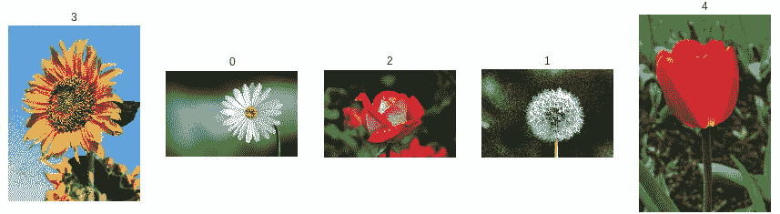

###### 图 5.18：使用 CNN 预测玫瑰花

#### 注意

本活动的解决方案可以在第 313 页找到。

## 最先进的模型 - 迁移学习

人类并不是从零开始学习每一个想要实现的任务；他们通常会以之前的知识为基础，以便更快速地学习新任务。

在训练神经网络时，有些任务对于每个个体来说是非常昂贵的，例如需要数十万张图像进行训练，且必须区分两个或多个相似的物体，最终可能需要几天时间才能获得好的性能。这些神经网络经过训练以完成这个昂贵的任务，而由于神经网络能够保存这些知识，其他模型可以利用这些权重来重新训练特定的模型以执行类似的任务。

**迁移学习**正是做了这件事——它将预训练模型的知识转移到你的模型中，这样你就可以利用这些知识。

例如，如果你想创建一个能够识别五个物体的分类器，但这个任务训练起来似乎成本太高（需要知识和时间），你可以利用一个预训练的模型（通常是在著名的**ImageNet**数据集上训练的），并重新训练模型，使其适应你的问题。ImageNet 数据集是一个大型视觉数据库，旨在用于视觉物体识别研究，包含超过 1400 万张图像和超过 20000 个类别，个人训练起来是非常昂贵的。

从技术上讲，你加载模型时会使用该数据集的权重，如果你想解决不同的问题，你只需更改模型的最后一层。如果模型是在 ImageNet 上训练的，它可能有 1000 个类别，但你只有 5 个类别，所以你需要将最后一层更改为一个只有 5 个神经元的全连接层。你还可以在最后一层之前添加更多的层。

你导入的模型层（基础模型）可以被冻结，这样它们的权重就不会影响训练时间。根据这一点，迁移学习有两种类型：

+   **传统**：冻结基础模型的所有层

+   **微调**：仅冻结基础模型的一部分，通常是前几层

在 Keras 中，我们可以导入一些著名的预训练模型，如 Resnet50 和 VGG16。你可以选择导入带或不带权重的预训练模型（在 Keras 中，只有 ImageNet 的权重可用），并决定是否包含模型的顶部部分。输入形状只有在不包含顶部部分时才能指定，且最小大小为 32。

使用以下代码行，你可以导入 Resnet50 模型，不包括顶部部分，带有`imagenet`权重，并且输入形状为 150x150x3：

```py
from keras.applications import resnet50
model = resnet50.ResNet50(include_top=False, weights='imagenet', input_shape=(150,150,3))
```

如果你已经包含了模型的顶部部分，因为你想使用模型的最后一层全连接层（假设你的问题类似于 ImageNet 但有不同的类别），那么你应该编写以下代码：

```py
from keras.models import Model
from keras.layers import Dense

model.layers.pop()
model.outputs = [model.layers[-1].output]
model.layers[-1].outbound_nodes = []

x=Dense(5, activation='softmax')(model.output)
model=Model(model.input,x)
```

这段代码移除了分类层（最后的全连接层），并准备模型，以便你可以添加自己的最后一层。当然，你也可以在最后添加更多层，之后再添加分类层。

如果你没有添加模型的顶部层，你应该使用以下代码添加自己的顶部层：

```py
from keras.models import Model
from keras.layers import Dense, GlobalAveragePooling2D
x=base_model.output
x=GlobalAveragePooling2D()(x)
x=Dense(512,activation='relu')(x) #dense layer 2
x=Dropout(0.3)(x)
x=Dense(512,activation='relu')(x) #dense layer 3
x=Dropout(0.3)(x)
preds=Dense(5,activation='softmax')(x) #final layer with softmax activation
model=Model(inputs=base_model.input,outputs=preds)
```

这里，`GlobalAveragePooling2D`类似于一种最大池化方法。

对于这类模型，你应该像训练这些模型的数据一样预处理数据（如果你正在使用权重）。Keras 有一个`preprocess_input`方法，针对每个模型都会这样做。例如，对于 ResNet50，应该是这样的：

```py
from keras.applications.resnet50 import preprocess_input
```

你将图像数组传递给那个函数，然后你的数据就准备好用于训练了。

模型中的**学习率**是指模型向局部最小值转换的速度。通常，你无需担心这一点，但如果你正在重新训练神经网络，这个参数需要调整。当你重新训练神经网络时，你应该降低该参数的值，以免神经网络忘记已经学到的内容。这个参数是在声明优化器时调整的。你可以选择不调整这个参数，尽管模型可能永远不会收敛或出现过拟合。

通过这种方法，你可以用非常少的数据训练网络，并获得总体良好的结果，因为你利用了模型的权重。

你还可以将迁移学习与数据增强结合使用。

### 练习 19：使用迁移学习和极少数据分类€5 和€20 账单

这个问题是关于用非常少的数据区分€5 和€20 账单。每个类别我们有 30 张图片，远少于之前的练习中的数据量。我们将加载数据，声明预训练模型，然后通过数据增强声明数据的变化，并训练模型。之后，我们将检查模型在未见数据上的表现：

1.  打开你的 Google Colab 界面。

    #### 注意

    你需要将`Dataset`文件夹挂载到你的驱动器上，并相应地设置路径。

1.  声明加载数据的函数：

    ```py
    import re, os, cv2
    import numpy as np
    def list_files(directory, ext=None):
    //{…}
    ##the detailed code can be found on Github##

    def load_images(path,label):
    //{…}
    ##the detailed code can be found on Github##
        for fname in list_files( path, ext='jpg' ): 
            img = cv2.imread(fname)
            img = cv2.resize(img, (224, 224))
    //{…}
    ##the detailed code can be found on Github##
    ```

    请注意，数据被调整为 224x224 的大小。

1.  数据存储在`Dataset/money/`中，其中有两个类别在子文件夹内。为了加载数据，你需要写出以下代码：

    ```py
    X, y = load_images('Dataset/money/20',0)
    X_aux, y_aux = load_images('Dataset/money/5',1)
    X = np.concatenate((X, X_aux), axis=0)
    y = np.concatenate((y, y_aux), axis=0)
    print(X.shape)
    print(y.shape)
    ```

    €20 账单的标签是 0，€5 账单的标签是 1。

1.  让我们展示数据：

    ```py
    import random 
    random.seed(42) 
    from matplotlib import pyplot as plt

    for idx in range(5): 
        rnd_index = random.randint(0, 59)
        plt.subplot(1,5,idx+1),plt.imshow(cv2.cvtColor(X[rnd_index],cv2.COLOR_BGR2RGB)) 
        plt.xticks([]),plt.yticks([])
    plt.savefig("money_samples.jpg", bbox_inches='tight')
    plt.show() 
    ```

    

    ###### 图 5.19：账单样本

1.  现在我们将声明预训练模型：

    ```py
    from keras.applications.mobilenet import MobileNet, preprocess_input
    from keras.layers import Input, GlobalAveragePooling2D, Dense, Dropout
    from keras.models import Model

    input_tensor = Input(shape=(224, 224, 3))

    base_model = MobileNet(input_tensor=input_tensor,weights='imagenet',include_top=False)

    x = base_model.output
    x = GlobalAveragePooling2D()(x)
    x = Dense(512,activation='relu')(x)
    x = Dropout(0.5)(x)
    x = Dense(2, activation='softmax')(x)

    model = Model(base_model.input, x)
    ```

    在这个例子中，我们正在加载 MobileNet 模型，并使用 imagenet 的权重。我们没有包括顶部层，因此我们应该构建自己的顶部层。输入形状是 224x224x3。

    我们通过获取 MobileNet 最后一层（非分类层）的输出，开始构建模型的顶部。我们添加了`GlobalAveragePooling2D`用于图像压缩，一个我们可以针对特定问题训练的密集层，一个`Dropout`层以避免过拟合，最后是分类层。

    最后的密集层有两个神经元，因为我们只有两个类别，并且使用了`Softmax`激活函数。对于二分类问题，也可以使用 Sigmoid 函数，但这会改变整个过程，因为不应该将标签做成类别形式，并且预测结果也会有所不同。

    然后，我们创建了一个模型，输入为 MobileNet，输出为分类密集层。

1.  我们将进行微调。为了做到这一点，我们必须冻结一些输入层，并保持其余可训练的数据不变：

    ```py
    for layer in model.layers[:20]:
        layer.trainable=False
    for layer in model.layers[20:]:
        layer.trainable=True
    ```

1.  让我们使用`Adadelta`优化器编译模型：

    ```py
    import keras
    model.compile(loss='categorical_crossentropy',optimizer=keras.optimizers.Adadelta(), metrics=['accuracy'])
    ```

1.  现在我们将使用之前导入的`preprocess_input`方法对 MobileNet 的`X`集进行预处理，然后将标签`y`转换为独热编码：

    ```py
    from keras import utils as np_utils
    X = preprocess_input(X)
    #X = (X.astype(np.float32))/255.0 
    y = np_utils.to_categorical(y)
    ```

1.  我们使用`train_test_split`方法将数据集分割为训练集和测试集：

    ```py
    from sklearn.model_selection import train_test_split
    x_train, x_test, y_train, y_test = train_test_split(X, y, test_size=0.2)
    print(x_train.shape)
    print(y_train.shape)
    print(x_test.shape)
    print(y_test.shape)
    ```

1.  我们将对数据集应用数据增强：

    ```py
    from keras.preprocessing.image import ImageDataGenerator
    train_datagen = ImageDataGenerator(  
          rotation_range=90,     
          width_shift_range = 0.2,
          height_shift_range = 0.2,
          horizontal_flip=True,    
          vertical_flip=True,
          zoom_range=0.4)
    train_datagen.fit(x_train)
    ```

    由于账单可能处于不同角度，我们选择设置旋转范围为 90º。其他参数对于此任务来说似乎合理。

1.  我们声明一个检查点，当验证损失减少时保存模型，并训练该模型：

    ```py
    from keras.callbacks import ModelCheckpoint
    ckpt = ModelCheckpoint('Models/model_money.h5', save_best_only=True, monitor='val_loss', mode='min', save_weights_only=False)
    model.fit_generator(train_datagen.flow(x_train, y_train,
                                    batch_size=4),
                        epochs=50,
                        validation_data=(x_test, y_test),
                        callbacks=[ckpt],
                        steps_per_epoch=len(x_train) // 4,
                        workers=4)
    ```

    我们将批次大小设置为 4，因为我们只有少量数据，并且不希望将所有样本一次性传递给神经网络，而是分批处理。由于数据不足，并且使用 Adadelta 优化器时学习率较高，所以我们没有使用 EarlyStopping 回调函数，因为损失值会上下波动。

1.  检查结果：

    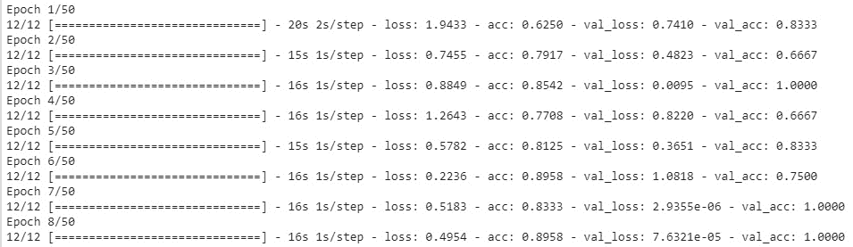

    ###### 图 5.20：显示期望的输出

    在上图中，我们可以看到，在第 7 个周期时，模型已经达到了 100%的准确率，并且损失较低。这是由于验证集数据的不足，因为只有 12 个样本，无法判断模型在未见数据上的表现。

1.  让我们运行代码来计算该模型的准确率：

    ```py
    y_pred = model.predict(x_test, batch_size=4, verbose=0)
    y_pred = np.argmax(y_pred, axis=1)
    y_test_aux = y_test.copy()
    y_test_pred = list()
    for i in y_test_aux:
        y_test_pred.append(np.argmax(i))

    accuracy = metrics.accuracy_score(y_test_pred, y_pred)
    print('Acc: %.4f' % accuracy)
    ```

    输出如下：

    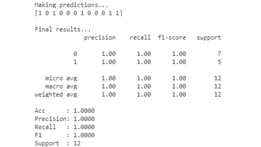

    ###### 图 5.21：达成 100%准确率

1.  让我们使用新数据测试这个模型。`Dataset/testing`文件夹中有测试图像。我们添加了四个账单示例来检查模型是否能准确预测：

    #### 注意

    ```py
    images = ['20.jpg','20_1.jpg','5.jpg','5_1.jpg']
    model.load_weights('Models/model_money.h5')
    for number in range(len(images)):
        imgLoaded = cv2.imread('Dataset/testing/%s'%(images[number])) 
        img = cv2.resize(imgLoaded, (224, 224)) 
        #cv2.imwrite('test.jpg',img) 
        img = (img.astype(np.float32))/255.0 
        img = img.reshape(1, 224, 224, 3) 
        plt.subplot(1,5,number+1),plt.imshow(cv2.cvtColor(imgLoaded,cv2.COLOR_BGR2RGB)) 
        plt.title('20' if np.argmax(model.predict(img)[0]) == 0 else '5') 
        plt.xticks([]),plt.yticks([]) 
    plt.show()
    ```

    在这段代码中，我们也加载了未见过的示例，并且我们将输出图像合并，结果如下所示：

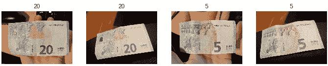

###### 图 5.22：账单预测

模型已精确预测所有图像！

恭喜！现在你可以在数据量较少的情况下，借助迁移学习训练一个自己的模型了。

#### 注意

这个练习的完整代码已上传到 GitHub：https://github.com/PacktPublishing/Artificial-Vision-and-Language-Processing-for-Robotics/blob/master/Lesson05/Exercise19/Exercise19.ipynb。

## 总结

CNN 在处理图像时的表现明显优于全连接神经网络。此外，CNN 也能够在处理文本和声音数据时取得良好结果。

CNN 已经被深入讲解，并且卷积的工作原理以及相关的所有参数也得到了详细说明。之后，所有这些理论通过一个练习进行了实践。

数据增强是一种通过对原始数据进行简单的转换来生成新图像，从而克服数据不足或数据集变异性不足的技术。此技术已经通过一个练习和活动进行了说明和实践，在其中你可以实验所学到的知识。

迁移学习是一种在数据不足或问题过于复杂，以至于使用常规神经网络训练会花费太长时间时使用的技术。此外，这种技术对神经网络的理解要求较低，因为模型已经实现。它也可以与数据增强结合使用。

迁移学习也已被涵盖，并通过一个练习进行实践，其中的数据量非常小。

学习如何构建 CNN 对于计算机视觉中的物体或环境识别非常有用。当机器人使用视觉传感器识别环境时，通常会使用 CNN，并通过数据增强来提高 CNN 的性能。在*第八章*，*使用 CNN 进行物体识别以引导机器人*中，你将把所学的 CNN 概念应用到实际应用中，并能够利用深度学习识别环境。

在应用这些技术来识别环境之前，首先你需要学习如何管理一个能够识别环境的机器人。在*第六章，机器人操作系统（ROS）*中，你将通过利用名为 ROS 的软件，学习如何使用模拟器来管理机器人。
