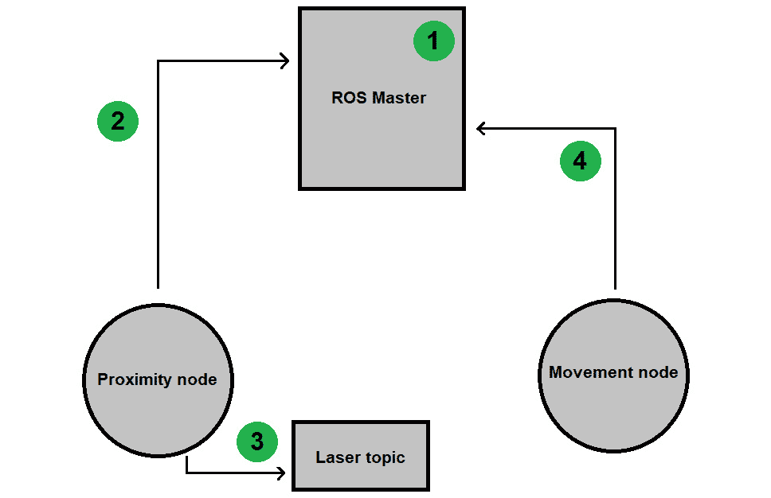
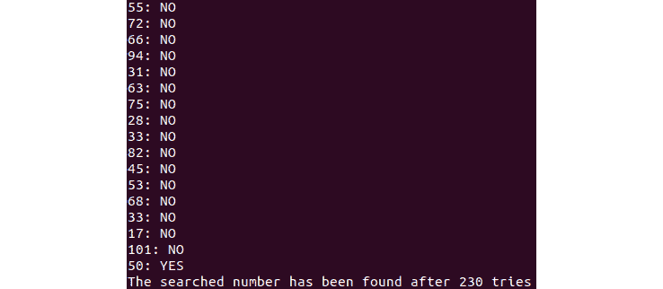
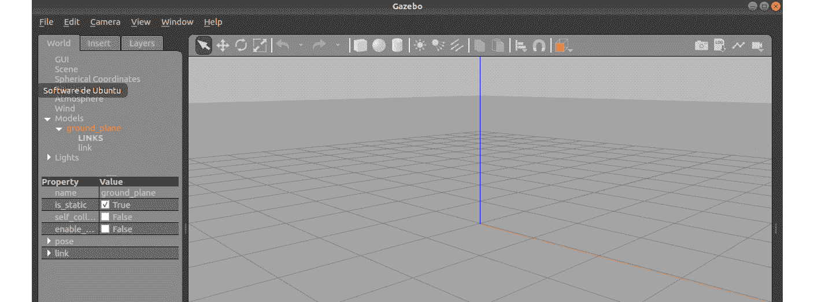
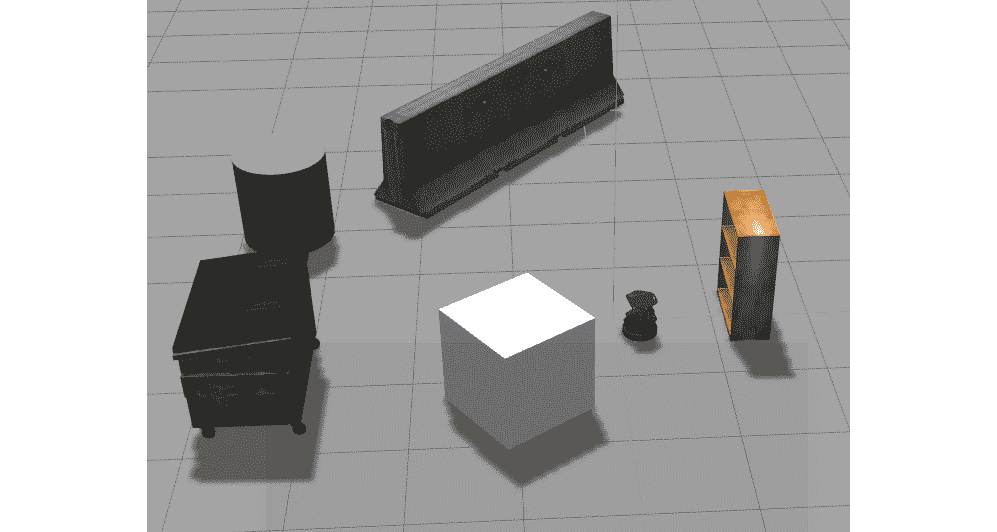
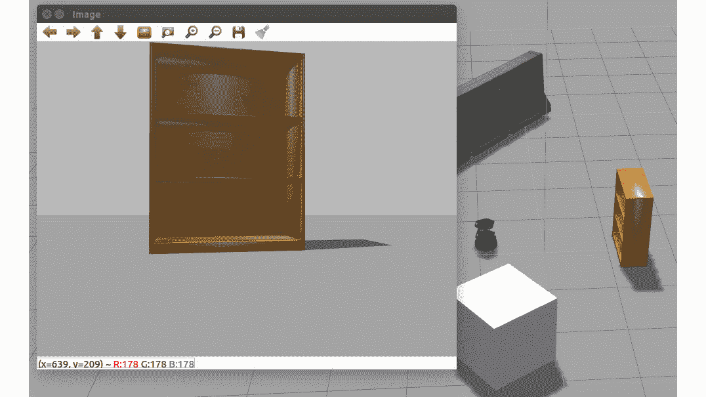
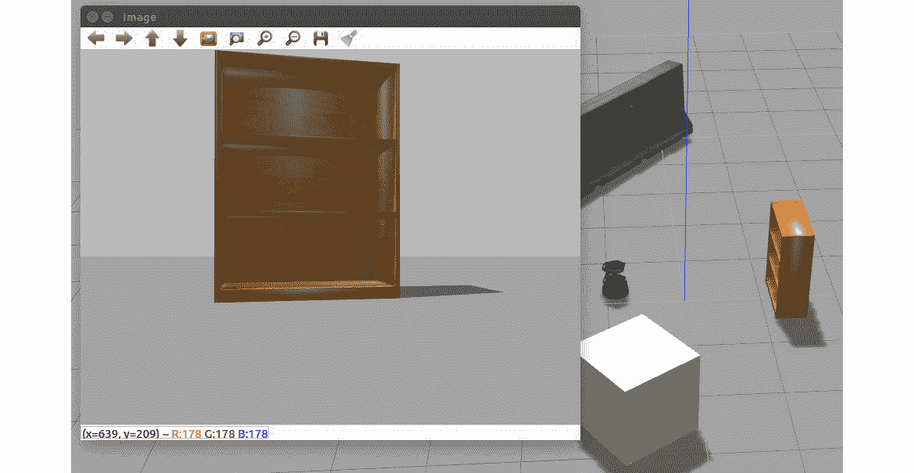

# 第七章

# 机器人操作系统（ROS）

## 学习目标

到本章结束时，你将能够：

+   解释机器人操作系统（ROS）的基本概念和要点

+   创建机器人操作系统软件包并与之协作

+   使用从传感器获取的信息操作虚拟机器人

+   开发并实现机器人的工作程序

本章重点介绍 ROS 及其软件包的不同工作方式。你还将学习如何根据从传感器接收到的信息使用 ROS 操作虚拟机器人。

## 介绍

为机器人开发软件并不像为其他类型的软件开发那么简单。要构建机器人，你需要一些方法和功能，这些方法能够让你访问传感器信息、控制机器人部件并与机器人连接。这些方法和功能都包含在 ROS 中，使得构建虚拟机器人变得更容易。

**ROS** 是一个与 Ubuntu（Linux）兼容的框架，用于编写机器人软件。它是一组库和工具，通过这些工具可以构建和创建各种机器人行为。关于这个框架最有趣的特点之一是，开发的代码可以适配任何其他机器人。ROS 还允许你在多台机器上同时工作；例如，如果你想用机器人采摘苹果，你可以使用一台计算机获取苹果的摄像头信息并进行处理，另一台机器发出控制机器人的运动命令，最后机器人将摘取苹果。通过这种工作流程，计算机不会执行过多的计算任务，执行过程也更加流畅。

ROS 是机器人领域最广泛使用的工具，既适用于研究人员，也适用于公司。它正成为机器人任务的标准工具。此外，ROS 正在不断发展，以解决新的问题，并适应不同的技术。所有这些事实使它成为学习和实践的好主题。

## ROS 概念

如前所述，第一次使用 ROS 时并不容易。但就像任何其他软件一样，你需要了解 ROS 是如何工作的，并学会如何使用它执行某些任务。在安装或使用框架之前，理解其基本概念是非常重要的。ROS 功能背后的关键思想将帮助你理解其内部流程，下面列出了这些关键点：

+   **节点**：ROS 节点是负责执行任务和计算的进程。它们可以通过话题或其他更复杂的工具相互组合。

+   **话题**：话题可以定义为节点之间的信息通道，工作方式是单向的。这被视为一种单向工作流，因为节点可以订阅话题，但话题并不知道哪些节点已订阅它。

+   **Master**：ROS 主控是一个提供节点名称和注册的服务。它的主要功能是启用各个节点，使它们能够相互定位并建立点对点通信。

+   **Package**：包是 ROS 组织的核心。在这些包中，你可以找到节点、库、数据集或用于构建机器人应用程序的有用组件。

+   **Stack**：一个 ROS 栈是一组节点，它们共同提供某些功能。当需要开发的功能过于复杂时，将任务分配给不同的节点可能会非常有用。

除了上述概念外，还有许多其他概念在使用 ROS 时也非常有用，但理解这些基础概念将使你能够为机器人实现强大的程序。让我们来看一个简单的例子，了解它们在实际情况中的使用方法：



###### 图 6.1：使用 ROS 的真实示例系统的框图

这里的情况是，当机器人检测到近距离障碍物时，它会改变方向。其工作原理如下：

1.  ROS 主控已启用。这意味着 ROS 系统已启动，可以运行任何节点。

1.  接近节点启动并提取激光传感器的信息。它会通知主控发布这些获取的信息。如果没有问题，并且信息类型符合预期，主控将允许节点通过话题发布。

1.  一旦主控允许节点发布，信息会被传递到一个话题并发布。在这种情况下，接近节点在激光话题中发布信息。

1.  移动节点请求主控订阅激光话题。订阅后，它将获得发布的信息，并使用这些信息决定机器人执行的下一个动作。

总结来说，两个节点可以通过主控服务共享信息，该服务会通知两个节点彼此的存在。

## ROS 命令

ROS 没有图形用户界面来进行操作；每个操作必须在命令行中执行，因为它与 Ubuntu 兼容。然而，在使用 ROS 之前，你需要了解它最常用的命令。这里有一个简短的命令列表以及它们的功能：

+   **roscore**：这是与 ROS 一起工作时要运行的第一个命令。它启用框架并为任何 ROS 程序或操作提供支持。必须启动它才能允许节点间的通信。

+   **roscd**：此命令用于切换到一个栈或包目录，而无需进入物理路径。

+   **rosnode**：这些命令用于管理节点并获取关于它们的信息。在这里，你可以看到最常用的 rosnode 命令：

+   **rosnode list**：此命令打印活动节点的信息。

+   **rosnode info <node_name>**：此命令用于通知用户关于输入节点的信息。

+   **rosnode kill <node_name>**：此命令的功能是停止一个节点进程。

+   **rosrun**：使用此命令，你可以运行系统上的任何应用程序，而无需切换到其目录。

+   **rostopic**：此命令允许你管理和检查主题信息。此命令还有多个其他类型：

+   **rostopic list**：此命令打印活动主题的信息。

+   **rostopic info <topic_name>**：此命令显示关于具体主题的信息。

+   **rostopic pub <topic_name> [data...]**：此命令的功能是将给定的数据发布到指定的主题。

+   **rqt_graph**：这是一个非常有用的命令，可以用来图形化地观察活动节点和正在发布或订阅的主题。

## 安装与配置

安装 ROS 之前，首先需要考虑安装的 Ubuntu 版本。根据你的操作系统版本，有几个 ROS 版本可供选择。在这种情况下，我们正在解释安装兼容 Ubuntu 16.04 LTS（Xenial Xerus）的 ROS Kinetic Kame 版本。

#### 注意

如果这不是你的 Ubuntu 版本，你可以前往 ROS 官网，[`www.ros.org/`](http://www.ros.org/)，查找对应的发行版。

就像几乎所有其他工具一样，建议始终安装最新版本，因为它可能已经解决了错误或新增了功能；但如前所述，如果你使用的是旧版本，也不必担心。

#### 注意

要获取安装 ROS 的详细步骤，请参阅前言第 vi 页。

## Catkin 工作空间和包

这是在为机器人编写第一个应用程序和程序之前的最后一步。你需要设置工作环境。为此，你将学习什么是 catkin 工作空间和包，以及如何使用它们。

catkin 工作空间是一个 ROS 目录，可以在其中创建、编译和运行 catkin 包。catkin 包是用于创建 ROS 节点和应用程序的容器。每个包作为一个单独的项目，可以包含多个节点。需要了解的是，catkin 包中的 ROS 代码只能是 Python 或 C++语言。

现在，让我们来看一下如何创建 catkin 工作空间：

#### 注意

在同一终端窗口中执行这些命令。

1.  创建一个标准文件夹，其中包含一个名为"`src`"的子文件夹。你可以选择系统上的任何位置：

    ```py
    mkdir -p ~/catkin_ws/src
    cd ~/catkin_ws
    ```

1.  切换到新的`catkin_ws`目录并运行`catkin`编译命令来初始化新的工作空间：

    ```py
    catkin_make
    ```

    每次在任何包中进行更改时，必须执行此命令才能编译工作空间。

通过遵循这些简单的步骤，你将完成 catkin 工作空间的设置。但在使用时，你应始终记住先输入以下命令：

```py
source devel/setup.bash
```

这让 ROS 知道在创建的 catkin 工作空间中可以存在 ROS 可执行文件。

如果你已经成功完成了前面的过程，现在可以创建 catkin 包并开始工作。按照此处提到的步骤创建一个包：

1.  进入你的 catkin 工作空间中的"`src`"文件夹：

    ```py
    cd ~/catkin_ws/src
    ```

1.  使用此命令创建一个包：

    ```py
    catkin_create_pkg <package_name> [dependencies]
    ```

依赖项是包正常运行所需的一组库或工具。例如，在一个仅使用 Python 代码的简单包中，命令将如下所示：

```py
catkin_create_pkg my_python_pkg rospy
```

## 发布者和订阅者

在解释基本的 ROS 概念时，我们讨论了一些用于发布数据的节点和一些用于订阅数据的节点。了解这一点后，我们不难想象，节点可以根据它们执行的操作类型分为两类。它们可以是**发布者**或**订阅者**。你认为区分这两种类型的节点为什么很重要？

如前所述，发布者是向其他节点提供信息的节点。它们通常与传感器一起工作，检查环境状态并将其转换为有价值的输出，供能够接收这些信息的订阅者使用。

另一方面，订阅者通常会接收可以理解的输入并进行处理。然后，它们会根据获得的结果决定将启动哪个操作。

由于这是一种较少使用的编程类型，在开始将其应用于机器人和模拟器之前，跟随一些示例了解这些节点的实际工作方式将会很有趣。所以，让我们通过一些练习来帮助你理解节点的工作原理。

### 练习 20：发布与订阅

在这个例子中，我们将使用以下步骤编写一个简单的发布者和订阅者：

1.  打开一个新的终端并输入`roscore`命令以启动 ROS 服务：

    ```py
    roscore
    ```

1.  在你的 catkin 工作空间中创建一个新包，其中包含该练习的解决方案。此包将依赖于`rospy`和`std_msgs`，因此你必须按如下方式创建它：

    ```py
    catkin_create_pkg exercise20 rospy std_msgs
    ```

    #### 注意

    `std_msgs`是一个为 ROS 原始数据类型提供支持的包。你可以在这里找到更多有关它的信息，包括管理数据的具体类型：[`wiki.ros.org/std_msgs`](http://wiki.ros.org/std_msgs)。

1.  切换到包目录并创建一个新文件夹，其中将包含发布者和订阅者文件，例如：

    ```py
    cd ~/catkin_ws/src/exercise20
    mkdir –p scripts
    ```

1.  进入新文件夹并为每个节点创建相应的 Python 文件：

    ```py
    cd scripts
    touch publisher.py
    touch subscriber.py
    ```

1.  为两个文件提供可执行权限：

    ```py
    chmod +x publisher.py
    chmod +x subscriber.py
    ```

1.  从发布者实现开始：

    初始化 Python 环境并导入必要的库。

    #### 注意

    ```py
    #!/usr/bin/env python
    import rospy
    from std_msgs.msg import String
    ```

    创建一个函数来发布消息。

    ```py
    def publisher():
    ```

    声明一个发布者，将一个`String`消息发布到一个新主题，无论其名称是什么。

    ```py
        pub  =rospy.Publisher('publisher_topic', String, queue_size=1)
    ```

    #### 注意

    ```py
        rospy.init_node('publisher', anonymous=True)
    ```

    使用创建的发布者变量发布任何所需的`String`。例如：

    ```py
        pub.publish("Sending message")
    ```

    最后，检测程序入口并调用创建的函数：

    ```py
    if __name__ == '__main__':
        publisher()
    ```

1.  继续实现订阅者：

    初始化 Python 并导入库，方法与为发布者所做的一样。

    #### 注意

    ```py
    #!/usr/bin/env python
    import rospy
    from std_msgs.msg import String
    ```

    创建一个函数来订阅该主题：

    ```py
    def subscriber():
    ```

    以与你之前相同的方式初始化节点：

    ```py
        rospy.init_node('subscriber', anonymous=True)
    ```

    使用此函数订阅`publisher_topic`：

    ```py
        rospy.Subscriber('publisher_topic', String, callback)
    ```

    #### 注意

    ```py
        rospy.spin()
    ```

    实现`callback`函数，当接收到任何数据时打印消息。对于这个第一个练习，我们将在接收到来自发布者的第一条消息时关闭订阅者节点。这可以通过`signal_shutdown`方法实现，该方法集成在`rospy`中，只需要一个关闭理由作为参数：

    ```py
    def callback(data):
        if(data != None):
            print("Message received")
            rospy.signal_shutdown("Message received")
    ```

    从主执行线程调用创建的函数：

    ```py
        if __name__ == '__main__':
            subscriber()
    ```

1.  测试创建的节点功能。你可以按照这里描述的方式进行测试：

    打开一个新的终端并切换到工作区。然后，运行以下命令，让 ROS 检查是否有可执行文件：

    ```py
    source devel/setup.bash
    ```

    运行订阅者节点。如果实现正确，它应该保持运行，直到你启动发布者：

    ```py
    rosrun exercise20 subscriber.py
    ```

    打开一个新终端并再次输入命令。

    运行发布者节点：

    ```py
    rosrun exercise20 publisher.py
    ```

    如果节点实现正确，订阅者执行完后会结束，输出必须是回调中打印的消息，在这种情况下是：`Message received`。

    #### 注意

    不需要编译工作区来运行你的包节点，因为它们是用 Python 编写的。如果是 C++编写的，你每次修改代码后都需要重新构建包。

### 练习 21：发布者与订阅者

这个练习与之前的类似，但更复杂。之前创建的发布者每次执行时只能发送一条消息。而现在，我们将实现一个发布者，直到我们终止它之前，它将不停地发送数据。

这个练习的目标是创建一个数字查找系统，遵循以下规则：

+   发布者节点必须向主题发布随机数字，直到用户停止它。

+   订阅者节点决定查找的数字，并在接收到的消息列表中查找它。这里有两种可能性：

    如果在 1000 次尝试之前找到数字，将打印一条正面消息，并显示达到目标所花费的尝试次数。

    如果在 1000 次尝试内未找到数字，将打印一条负面消息，告知用户无法找到该数字。

    所以，可以通过以下方式进行：

1.  如前所述，从创建包和文件开始：

    ```py
    cd ~/catkin_ws/src
    catkin_create_pkg exercise21 rospy std_msgs
    cd exercise21
    mkdir scripts
    cd scripts
    touch generator.py
    touch finder.py
    chmod +x generator.py finder.py
    ```

1.  从发布者实现开始。

    导入必要的库。这些库与前言中的相同，但这次必须将`String`导入更改为`Int32`，因为节点将处理数字。你还应该导入一个随机库来生成数字。

    #### 注意

    ```py
    #!/usr/bin/env python
    import rospy
    from std_msgs.msg import Int32
    import random
    ```

1.  创建数字生成器函数：

    ```py
    def generate():
    ```

1.  声明发布者并像之前的练习一样初始化节点。注意，这次数据类型不同，队列大小设置为 10，这意味着最多可以有 10 个已发布的数字。当第 11 个数字发布时，第一个数字会被从队列中丢弃：

    ```py
        pub = rospy.Publisher('numbers_topic', Int32, queue_size=10)
        rospy.init_node('generator', anonymous=True)
    ```

1.  配置程序循环的迭代频率。我们设置的频率为 10（Hz），这是一个不太高的频率，能够让我们检查生成的数字：

    ```py
        rate = rospy.Rate(10)
    ```

1.  实现生成和发布数字的循环。它必须迭代直到用户停止，因此你可以使用`is_shutdown()`函数。使用声明的速率上的 sleep 函数，以使其生效：

    ```py
        while not rospy.is_shutdown():
            num = random.randint(1,101)
            pub.publish(num)
            rate.sleep()
    ```

1.  从节点入口调用创建的函数。使用 try 指令，以确保用户关闭时不会产生错误：

    ```py
    if __name__ == '__main__':
        try:
            generate()
        except rospy.ROSInterruptException:
            pass
    ```

1.  继续进行订阅者的实现：

    导入必要的库。

    #### 注意

    ```py
    #!/usr/bin/env python
    import rospy
    from std_msgs.msg import Int32
    ```

1.  创建一个具有两个属性的类：一个用于设置要查找的数字的值，另一个用于计算尝试的次数：

    ```py
    class Finder:
        searched_number = 50
        generated_numbers = 0
    ```

1.  实现回调函数。寻找器的逻辑必须在这个函数中编写。有很多方法可以做到这一点，但这是一个常用的方法：

    ```py
        def callback(self, data):
            if data.data == self.searched_number:
                print(str(data.data) + ": YES")
                self.generated_numbers += 1
                print("The searched number has been found after " + str(self.generated_numbers) + " tries")
                rospy.signal_shutdown("Number found")
            elifself.generated_numbers>= 1000:
    print("It wasn't possible to find the searched number")
                rospy.signal_shutdown("Number not found")
    else:
                print(str(data.data) + ": NO")
                self.generated_numbers += 1
    ```

    如你所见，这是一个简单的函数，它寻找数字并为每次失败的尝试增加一次计数。如果找到数字，它将打印一个正面的消息。如果计数器达到 1000，搜索将中止，并显示负面消息。

1.  创建订阅函数。记住，这次发布的数据类型是`Int32`：

    ```py
        def finder(self):
            rospy.init_node('finder', anonymous=True)
            rospy.Subscriber('numbers_topic', Int32, self.callback)
            rospy.spin()
    ```

1.  最后，从节点入口创建一个`Finder`类实例，并调用`finder`方法：

    ```py
    if __name__ == '__main__':
        find = Finder()
        find.finder()
    ```

1.  测试执行的实现是否正确。

    打开一个新的终端并运行`roscore`。

    打开另一个终端并执行订阅者节点：

    ```py
    cd ~/catkin_ws
    source devel/setup.bash
    rosrun exercise21 finder.py
    ```

1.  在另一个终端中，运行发布者节点，以便生成数字并开始执行回调函数：

    ```py
    cd ~/catkin_ws
    source devel/setup.bash
    rosrun exercise21 generator.py
    ```

1.  如果找到要搜索的数字，这里是 50，输出应类似于此：

    ###### 图 6.2：找到数字的执行示例

1.  当未找到数字时，将搜索的数字更改为大于 100 的值。你应该获得如下的输出：


###### 图 6.3：未找到数字的执行示例

当两个节点都在运行时，使用`rqt_graph`命令会很有意思；这样，你可以图形化地看到你刚刚创建的结构。所以，打开一个新的终端并输入命令。输出应该类似于以下内容：


###### 图 6.4：输出

## 仿真器

仿真器是开发和测试机器人软件的非常好工具。它们使机器人技术变得对每个人都能负担得起。想象一下你正在进行一个机器人项目，在这个项目中，你需要不断测试机器人功能的改进。这将需要每次测试时都要连接机器人，充电多次，还要带着它到处移动。所有这些都可以通过仿真器来避免，仿真器可以在任何时候在你的计算机上启动，甚至可以模拟机器人生成的节点和话题。你知道有什么机器人仿真器吗？

我们将使用 Gazebo，这是 ROS 完整安装中包含的一个模拟器。事实上，如果您在安装时选择了这个选项，您只需在终端输入“**gazebo**”即可启动模拟器。Gazebo 界面如图 6.4 所示：



###### 图 6.5：Gazebo 启动点

下一步是安装并设置我们要模拟的机器人。在这个案例中，我们将使用 **Turtlebot**，它是一种配备有摄像头、激光传感器等的轮式机器人。Turtlebot 可能与您的 ROS 发行版（我们使用的是 Kinetic Kame）不兼容；但不用担心，Gazebo 中有许多机器人可以模拟。您可以查找不同的机器人并尝试与您的 ROS 发行版配合使用。

### 练习 22：Turtlebot 配置

在本练习中，我们将介绍一些在使用 Turtlebot 之前需要做的事情：

1.  安装其依赖项：

    ```py
    sudo apt-get installros-kinetic-turtlebotros-kinetic-turtlebot-apps ros-kinetic-turtlebot-interactions ros-kinetic-turtlebot-simulator ros-kinetic-kobuki-ftdiros-kinetic-ar-track-alvar-msgs
    ```

1.  下载 `Turtlebot` 仿真包到您的 `catkin` 工作空间。

    #### 注意

    ```py
    cd ~/catkin_ws/src
    git clone https://github.com/PacktPublishing/Artificial-Vision-and-Language-Processing-for-Robotics/blob/master/Lesson06/turtlebot_simulator.zip
    ```

1.  之后，您应该能够与 Gazebo 一起使用 Turtlebot。

    启动 ROS 服务：

    ```py
    roscore
    ```

    启动 Turtlebot 世界：

    ```py
    cd ~/catkin_ws
    source devel/setup.bash
    roslaunch turtlebot_gazebo turtlebot_world.launch
    ```

1.  现在，您应该会看到与之前相同的 Gazebo 世界，但在中心有一组对象，包括 Turtlebot，如图 6.5 所示：



###### 图 6.6：使用 Gazebo 的 Turtlebot 仿真

一旦仿真成功运行，我们将进行另一个练习，学习如何从传感器获取信息并进行处理。

### 练习 23：模拟器与传感器

在本练习中，我们将创建一个 ROS 节点，订阅 Turtlebot 摄像头以获取相应的图像。请按照以下步骤进行操作：

1.  创建一个包含必要依赖项和文件的软件包：

    ```py
    cd ~/catkin_ws/src
    catkin_create_pkg exercise22 rospy sensor_msgs
    cd exercise22
    mkdir scripts
    cd scripts
    touch exercise22.py
    chmod +x exercise22.py
    ```

1.  实现节点。

    导入必要的库。在本练习中，我们将使用 `OpenCV` 来处理从摄像头获取的图像：

    ```py
    #!/usr/bin/env python
    import rospy
    from sensor_msgs.msg import Image
    import cv2
    from cv_bridge import CvBridge
    ```

    创建一个类并声明一个类型为 `CvBridge` 的属性，稍后将用它来将图像类型转换为 `cv2`：

    ```py
    class ObtainImage:
        bridge = CvBridge()
    ```

    编写回调函数，在该函数中，您需要获取图像并将其转换为 cv2 格式：

    ```py
        def callback(self, data):
            cv_image = self.bridge.imgmsg_to_cv2(data, "bgr8")
            cv2.imshow('Image',cv_image)
            cv2.waitKey(0)
            rospy.signal_shutdown("Finishing")
    ```

    #### 注意

    我们使用 `waitKey()` 函数，这样图像就会保持在屏幕上，直到用户按下任意键，图像才会消失。

1.  定义并实现订阅者函数。记住，现在，所需的数据已经是一个图像类型（Image）：

    ```py
        def obtain(self):
                rospy.Subscriber('/camera/rgb/image_raw', Image, self.callback)
                rospy.init_node('image_obtainer', anonymous=True)
                rospy.spin()
    ```

    #### 注意

    如果您不知道想要订阅的主题名称，您可以随时输入 `rostopic` list 命令，查看可用的节点。您应该会看到如下列表：

    

    ###### 图 6.7：`rostopic list` 命令的输出

1.  从程序入口处调用订阅者函数：

    ```py
    if __name__ == '__main__':
        obt = ObtainImage()
        obt.obtain()
    ```

1.  检查节点是否正常工作。为此，您需要在不同的终端中运行 `roscore` 命令、Gazebo 和 Turtlebot，同时创建节点。请注意，如果您之前没有这样做，也可以运行 `source devel/setup.bash` 命令：

    ```py
    roscore
    roslaunch turtlebot_gazebo turtlebot_world.launch
    rosrun exercise22 exercise22.py
    ```

    结果应该类似于这样：



###### 图 6.8：练习节点的执行示例

### 活动 6：模拟器和传感器

考虑以下情景：你为一家机器人公司工作，该公司最近获得了一位新客户——一家安防监控公司。因此，你被要求为一个守夜机器人实现一个监控系统。客户希望机器人停留在商店的中央，并不断四处查看。

你需要模拟这个系统，并且已经被要求使用 Turtlebot 和 Gazebo。

1.  实现一个节点，订阅相机并显示它接收到的所有图像。

1.  实现一个节点，使机器人能够自启动。

    #### 注意

    为此，你需要发布 `/mobile_base/commands/velocity` 主题，该主题与 Twist 消息一起使用。Twist 是 `geometry_msgs` 库中的一种消息类型，因此你需要将其添加为依赖项。为了使机器人自转，创建一个 Twist 实例并修改其 `angular.z` 值，然后发布它。

1.  现在，同时运行这两个节点。

    在这个活动的最后，你将得到类似于这样的输出：



###### 图 6.9：展示虚拟环境中图像的旋转输出

#### 注意

这个活动的解决方案可以在第 318 页找到。

## 总结

在本章中，你学习了如何使用 ROS，从其安装和配置到节点的实现。你还使用了模拟器及其传感器，从中获取信息，并将这些获取的信息应用于解决问题。本章中涵盖的所有练习和活动将在后续章节中对你有所帮助。

在下一章，你将学习自然语言处理（NPL）并学会如何构建聊天机器人。如果你能构建一个优秀的聊天机器人，它将成为一个非常有趣的工具，可以添加到机器人中。你甚至可以使用 ROS 来开发它。
