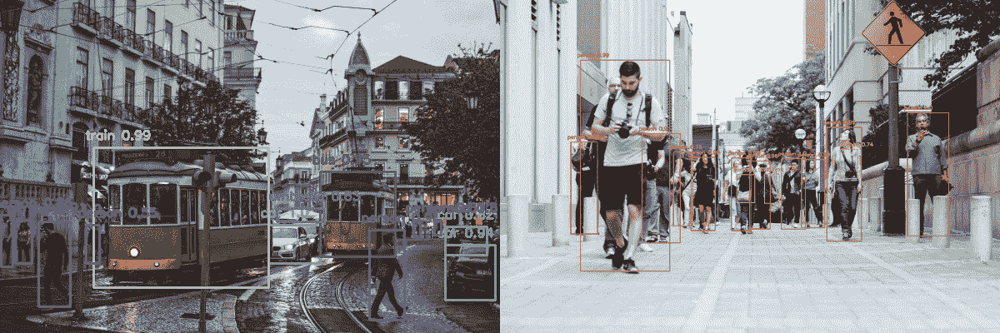

# 第九章

# 使用 CNN 进行物体识别以引导机器人

## 学习目标

本章结束时，你将能够：

+   解释物体识别是如何工作的

+   构建一个能够识别物体的网络

+   构建一个物体识别系统

本章介绍了如何通过构建一个能够基于视频识别物体的网络来实现物体识别。

## 介绍

**物体识别**是计算机视觉的一个领域，在这个领域中，机器人能够使用相机或传感器检测环境中的物体，传感器能够提取机器人周围环境的图像。从这些图像中，软件能够检测出每一张图像中的物体，并识别物体的种类。机器能够识别由机器人传感器捕捉的图像或视频中的物体。这使得机器人能够意识到它们的环境。

如果机器人能够识别其环境并利用物体识别获取这些信息，它将能够执行更复杂的任务，例如抓取物体或在环境中移动。在*第九章*，*机器人视觉*中，我们将看到一个机器人在虚拟环境中执行这些任务。

在这里要执行的任务是检测图像中的特定物体并识别这些物体。这种类型的计算机视觉问题与本书前面讨论的有所不同。为了识别特定物体，我们已经看到，标注这些物体并训练一个卷积神经网络（在*第五章*，*计算机视觉中的卷积神经网络*中已经介绍过），这种方法效果很好，但如果首先要检测这些物体呢？

之前，我们学习了要识别的物体必须标注上它们所属的相应类别。因此，为了在图像中检测到这些物体，必须在它们周围绘制一个矩形边界框，以便准确定位它们在图像中的位置。神经网络将预测这些物体的边界框及其标签。

用边界框标注物体是一个繁琐且艰难的任务，因此我们不会展示如何为数据集中的图像标注边界框，或如何训练神经网络来识别和检测这些物体。然而，有一个名为`labelImg`的库，你可以在这个 GitHub 仓库中找到：[`github.com/tzutalin/labelImg`](https://github.com/tzutalin/labelImg)。这个工具可以让你为每个图像中的物体创建边界框。一旦你创建了这些边界框，数据上称之为坐标，你就可以训练一个神经网络来预测图像中每个物体的边界框及相应的标签。

在本章中，我们将使用最先进的 YOLO 网络方法，这些方法已经准备好使用，能够节省你自己编写算法的时间。

## 多物体识别与检测

多物体识别与检测涉及在一张图像中检测和识别多个物体。这个任务包括用边界框标注每个物体，然后识别该物体的类型。

由于这个原因，市面上有许多预训练的模型可以检测各种物体。名为**YOLO**的神经网络是最适合此任务的模型之一，并且能够实时工作。YOLO 将在下一章中详细讲解，用于机器人模拟器的开发。

对于本章，YOLO 网络将训练用于识别和检测 80 种不同的类别。这些类别包括：

人、脚踏车、汽车、摩托车、飞机、公交车、火车、卡车、船、交通信号灯、消防栓、停车标志、停车计时器、长椅、鸟、猫、狗、马、羊、牛、大象、熊、斑马、长颈鹿、背包、雨伞、手提包、领带、手提箱、飞盘、滑雪板、单板滑雪、运动球、风筝、棒球棒、棒球手套、滑板、冲浪板、网球拍、瓶子、酒杯、杯子、叉子、刀子、勺子、碗、香蕉、苹果、三明治、橙子、西兰花、胡萝卜、热狗、比萨饼、甜甜圈、蛋糕、椅子、沙发、盆栽、床、餐桌、厕所、电视、笔记本电脑、鼠标、遥控器、键盘、手机、微波炉、烤箱、烤面包机、水槽、冰箱、书、时钟、花瓶、剪刀、泰迪熊、吹风机、牙刷。

在图 8.1 中，您可以看到一个街道场景，YOLO 已检测到其中的行人、汽车和公交车：


###### 图 8.1：YOLO 检测示例

在本主题中，我们将构建一个针对静态图像的多物体识别与检测系统。

首先，我们将使用一个名为**DNN**（深度神经网络）的 OpenCV 模块，它只需要几行代码。稍后，我们将使用一个叫做**ImageAI**的库，它能完成相同的任务，但代码量少于 10 行，并且让你选择具体要检测和识别的物体。

为了在 OpenCV 中实现 YOLO，您需要像本书其他章节一样，使用 OpenCV 导入图像。

### 练习 24：构建您的第一个多物体检测与识别算法

#### 注意

我们将使用 Google Colab 笔记本进行此任务，因为它不涉及训练算法，而是使用现成的算法。

在这个练习中，我们将使用 YOLO 和 OpenCV 实现一个多物体检测与识别系统。我们将编写一个检测器和识别系统，输入一张图像，检测并识别图像中的物体，然后输出带有这些检测框的图像：

1.  打开您的 Google Colab 界面。

1.  导入以下库：

    ```py
    import cv2
    import numpy as np
    import matplotlib.pyplot as plt
    ```

1.  要将图像输入到该网络中，我们需要使用`blobFromImage`方法：

    #### 注意

    ```py
    image = cv2.imread('Dataset/obj_det/image6.jpg')
    Width = image.shape[1]
    Height = image.shape[0]
    scale = 0.00392
    ```

    我们需要加载数据集的类别，对于 YOLO，这些类别存储在`Models/yolov3.txt`中，你可以在 GitHub 的`Chapter 8/Models`中找到。我们像这样读取类别：

    ```py
    # read class names from text file
    classes = None
    with open("Models/yolov3.txt", 'r') as f:
        classes = [line.strip() for line in f.readlines()]
    ```

1.  为不同的类别生成不同的颜色：

    ```py
    COLORS = np.random.uniform(0, 255, size=(len(classes), 3))
    ```

1.  读取预训练模型和配置文件：

    ```py
    net = cv2.dnn.readNet('Models/yolov3.weights', 'Models/yolov3.cfg')
    ```

1.  创建输入 blob：

    ```py
    blob = cv2.dnn.blobFromImage(image.copy(), scale, (416,416), (0,0,0), True, crop=False)
    ```

1.  设置网络的输入 blob：

    ```py
    net.setInput(blob)
    ```

    为了声明网络，我们使用`Models/yolov3.weights`（网络的权重）和`Models/yolov3.cfg`（模型的架构）中的`readNet`方法：

    #### 注意

    方法、类别、权重和架构文件可以在 GitHub 的`Lesson08/Models/`文件夹中找到。

    现在我们已经完成了设置，接下来只需要运行并执行代码，这样就能识别并检测图像中的所有物体，下面会详细解释如何操作。

1.  为了获取网络的输出层，我们声明以下代码中提到的方法，然后运行接口以获得输出层的数组，该数组包含多个检测结果：

    ```py
    # function to get the output layer names in the architecture
    def get_output_layers(net):

        layer_names = net.getLayerNames()

        output_layers = [layer_names[i[0] - 1] for i in net.getUnconnectedOutLayers()]
        return output_layers
    ```

1.  创建一个函数，在检测到的物体周围画一个带有类别名称的边界框：

    ```py
    def draw_bounding_box(img, class_id, confidence, x, y, x_plus_w, y_plus_h):
        label = str(classes[class_id])
        color = COLORS[class_id]
        cv2.rectangle(img, (x,y), (x_plus_w,y_plus_h), color, 2)
        cv2.putText(img, label + " " + str(confidence), (x-10,y-10), cv2.FONT_HERSHEY_SIMPLEX, 0.5, color, 2)
    ```

1.  执行代码：

    ```py
    # run inference through the network
    # and gather predictions from output layers
    outs = net.forward(get_output_layers(net))
    ```

    #### 注意

    'outs'是一个预测数组。稍后的操作中，我们将看到需要遍历该数组以获取每个检测结果的边界框、置信度和类别类型。

    物体检测算法常常会对一个物体进行多次检测，这是一个问题。可以通过使用**非最大抑制**（non-max suppression）来解决这个问题，该方法会删除置信度较低的物体的边界框（即预测为该类别的概率较低），最终只保留置信度最高的边界框。在检测到边界框和置信度，并声明相应的阈值后，可以按如下方式运行该算法：

1.  这一步是最重要的步骤之一。在这里，我们将收集每个输出层的每次检测的置信度（即每个被检测到的物体）、类别 ID 和边界框，但我们会忽略置信度低于 50%的检测：

    ```py
    # apply non-max suppression
    class_ids = []
    confidences = []
    boxes = []
    conf_threshold = 0.5
    nms_threshold = 0.4
    indexes = cv2.dnn.NMSBoxes(boxes, confidences, conf_threshold, nms_threshold)
    ```

1.  对于每个输出层的每次检测，获取置信度、类别 ID 和边界框参数，忽略置信度较低的检测（置信度 < 0.5）：

    ```py
    for out in outs:
        for detection in out:
            scores = detection[5:]
            class_id = np.argmax(scores)
            confidence = scores[class_id]
            if confidence > 0.5:
                center_x = int(detection[0] * Width)
                center_y = int(detection[1] * Height)
                w = int(detection[2] * Width)
                h = int(detection[3] * Height)
                x = center_x - w / 2
                y = center_y - h / 2
                class_ids.append(class_id)
                confidences.append(float(confidence))
                boxes.append([x, y, w, h])
    ```

1.  我们遍历索引列表，使用我们声明的方法打印每个边界框、标签和每个检测的置信度：

    ```py
    for i in indexes:
        i = i[0]
        box = boxes[i]
        x = box[0]
        y = box[1]
        w = box[2]
        h = box[3]

        draw_bounding_box(image, class_ids[i], round(confidences[i],2), round(x), round(y), round(x+w), round(y+h))
    ```

1.  最后，我们展示并保存结果图像。OpenCV 也有一个方法可以显示图像，因此不需要使用 Matplotlib：

    ```py
    # display output image    
    plt.axis("off")
    plt.imshow(cv2.cvtColor(image, cv2.COLOR_BGR2RGB))
    # save output image to disk
    cv2.imwrite("object-detection6.jpg", image)
    ```

    输出结果如下：

    

    ###### 图 8.2：YOLO 检测示例

    最后，我们需要绘制边界框、类别和置信度。

1.  现在让我们尝试使用前面提到的步骤做一些其他的示例。你可以在`Dataset/obj-det/`文件夹中找到图像，输出结果将如图 8.3 所示：



###### 图 8.3：YOLO 检测示例

### ImageAI

还有一种更简单的方法可以实现这一目标。你可以使用**ImageAI**库，它能够通过几行代码进行物体检测和识别。

该库的 GitHub 仓库链接可以在这里找到：

[`github.com/OlafenwaMoses/ImageAI`](https://github.com/OlafenwaMoses/ImageAI)

为了安装这个库，你可以通过以下命令使用 pip 进行安装：

```py
pip install https://github.com/OlafenwaMoses/ImageAI/releases/download/2.0.2/imageai-2.0.2-py3-none-any.whl
```

使用这个库时，我们需要导入一个类：

```py
from imageai.Detection import ObjectDetection
```

我们导入`ObjectDetection`类，它将作为神经网络工作。

之后，我们声明将要进行预测的类对象：

```py
detector = ObjectDetection()
```

我们将要使用的模型必须声明。对于这个库，我们只能使用三种模型：RetinaNet、YOLOV3 和 TinyYOLOV3。YOLOV3 是我们之前使用的相同模型，具有中等的性能和准确性，检测时间也适中。

至于 RetinaNet，它具有更高的性能和准确性，但检测时间较长。

TinyYOLOV3 经过优化，注重速度，具有中等的性能和准确性，但检测时间更快。由于其速度，本模型将在下一个主题中使用。

你只需要修改几行代码，就能让这些模型中的任何一个工作。对于 YOLOV3，需要以下几行代码：

```py
detector.setModelTypeAsYOLOv3()
detector.setModelPath("Models/yolo.h5")
detector.loadModel()
```

`.h5`文件包含了 YOLOV3 神经网络的权重和架构。

为了运行推理并获取相应的检测结果，只需一行代码：

```py
detections = detector.detectObjectsFromImage(input_image="Dataset/obj_det/sample.jpg", output_image_path="samplenew.jpg")
```

这行代码的作用是将一张图像作为输入，检测图像中物体的边界框及其类别。它输出一张标记了这些检测结果的新图像，并列出检测到的物体。

让我们来看一下它如何检测我们在上一个练习中使用的`sample.jpg`图像：


###### 图 8.4：ImageAI YOLOV3 图像检测

ImageAI 还允许你定制要识别的物体。默认情况下，它也能够检测与 YOLO 相同的 80 个类别，这些类别是基于 OpenCV 构建的。

你可以通过传递一个名为`CustomObjects`的参数来定制只检测你想要的物体，在该参数中，你指定模型要检测哪些物体。此外，检测器的方法也会从`detectObjectsFromImage()`改为`detectCustomObjectsFromImage()`。用法如下：

```py
custom_objects = detector.CustomObjects(car=True)
detections = detector.detectCustomObjectsFromImage(custom_objects=custom_objects, input_image="Dataset/obj_det/sample.jpg", output_image_path="samplenew.jpg")
```


###### 图 8.5：ImageAI YOLOV3 自定义图像检测

## 视频中的多物体识别和检测

静态图像中的多物体识别和检测听起来很棒，那么在视频中检测和识别物体如何呢？

你可以从互联网下载任何视频，尝试检测和识别视频中出现的所有物体。

接下来的处理流程是获取视频的每一帧，并且对于每一帧，检测相应的物体及其标签。

首先声明相应的库：

```py
from imageai.Detection import VideoObjectDetection
from matplotlib import pyplot as plt
```

`imageai`库包含一个对象，允许用户对视频进行物体检测与识别：

```py
video_detector = VideoObjectDetection()
```

我们需要`VideoObjectDetection`，这样我们才能在视频中检测物体。此外，Matplotlib 也需要用于显示每一帧的检测过程：


###### 图 8.6：ImageAI 单帧物体检测过程

现在我们首先需要加载模型。你可以根据视频处理的速度需求和所需精度来决定加载哪个模型。YOLOV3 位于 RetinaNet 和 TinyYOLOV3 之间，RetinaNet 精度最高但速度最慢，而 TinyYOLOV3 精度最低但速度最快。我们将使用 YOLOV3 模型，但你也可以自由选择其他两个模型。在声明视频物体检测之后，声明方式与上一个主题相同：

```py
video_detector.setModelTypeAsYOLOv3()
video_detector.setModelPath("Models/yolo.h5")
video_detector.loadModel()
```

在运行视频检测器之前，我们需要声明一个将在每一帧处理后应用的函数。这个函数不执行检测算法，但它处理每一帧的检测过程。为什么我们要处理每一帧的输出？那是因为我们希望使用 Matplotlib 逐帧展示检测过程。

在声明该方法之前，我们需要声明物体将在其上显示的颜色：

```py
color_index = {'bus': 'red', 'handbag': 'steelblue', 'giraffe': 'orange', 'spoon': 'gray', 'cup': 'yellow', 'chair': 'green', 'elephant': 'pink', 'truck': 'indigo', 'motorcycle': 'azure', 'refrigerator': 'gold', 'keyboard': 'violet', 'cow': 'magenta', 'mouse': 'crimson', 'sports ball': 'raspberry', 'horse': 'maroon', 'cat': 'orchid', 'boat': 'slateblue', 'hot dog': 'navy', 'apple': 'cobalt', 'parking meter': 'aliceblue', 'sandwich': 'skyblue', 'skis': 'deepskyblue', 'microwave': 'peacock', 'knife': 'cadetblue', 'baseball bat': 'cyan', 'oven': 'lightcyan', 'carrot': 'coldgrey', 'scissors': 'seagreen', 'sheep': 'deepgreen', 'toothbrush': 'cobaltgreen', 'fire hydrant': 'limegreen', 'remote': 'forestgreen', 'bicycle': 'olivedrab', 'toilet': 'ivory', 'tv': 'khaki', 'skateboard': 'palegoldenrod', 'train': 'cornsilk', 'zebra': 'wheat', 'tie': 'burlywood', 'orange': 'melon', 'bird': 'bisque', 'dining table': 'chocolate', 'hair drier': 'sandybrown', 'cell phone': 'sienna', 'sink': 'coral', 'bench': 'salmon', 'bottle': 'brown', 'car': 'silver', 'bowl': 'maroon', 'tennis racket': 'palevilotered', 'airplane': 'lavenderblush', 'pizza': 'hotpink', 'umbrella': 'deeppink', 'bear': 'plum', 'fork': 'purple', 'laptop': 'indigo', 'vase': 'mediumpurple', 'baseball glove': 'slateblue', 'traffic light': 'mediumblue', 'bed': 'navy', 'broccoli': 'royalblue', 'backpack': 'slategray', 'snowboard': 'skyblue', 'kite': 'cadetblue', 'teddy bear': 'peacock', 'clock': 'lightcyan', 'wine glass': 'teal', 'frisbee': 'aquamarine', 'donut': 'mincream', 'suitcase': 'seagreen', 'dog': 'springgreen', 'banana': 'emeraldgreen', 'person': 'honeydew', 'surfboard': 'palegreen', 'cake': 'sapgreen', 'book': 'lawngreen', 'potted plant': 'greenyellow', 'toaster': 'ivory', 'stop sign': 'beige', 'couch': 'khaki'}
```

现在我们将声明应用于每一帧的方法：

```py
def forFrame(frame_number, output_array, output_count, returned_frame):
    plt.clf()
    this_colors = []
    labels = []
    sizes = []
    counter = 0
```

首先，如图所示，声明函数，并传入帧号、检测数组、每个检测物体的出现次数和帧。我们还声明了相应的变量，用于在每一帧上打印所有检测结果：

```py
    for eachItem in output_count:
        counter += 1
        labels.append(eachItem + " = " + str(output_count[eachItem]))
        sizes.append(output_count[eachItem])
        this_colors.append(color_index[eachItem])
```

在这个循环中，存储了物体及其相应的出现次数。同时也存储了代表每个物体的颜色：

```py
    plt.subplot(1, 2, 1)
    plt.title("Frame : " + str(frame_number))
    plt.axis("off")
    plt.imshow(returned_frame, interpolation="none")
    plt.subplot(1, 2, 2)
    plt.title("Analysis: " + str(frame_number))
    plt.pie(sizes, labels=labels, colors=this_colors, shadow=True, startangle=140, autopct="%1.1f%%")
    plt.pause(0.01)
```

在这段代码中，每一帧会打印两个图：一个显示带有相应检测结果的图像，另一个是包含每个检测物体出现次数及其在总次数中占比的图表。

这个输出显示在图 8.6 中。

在最后一个单元格中，为了执行视频检测器，我们写了这几行代码：

```py
plt.show()
video_detector.detectObjectsFromVideo(input_file_path="path_to_video.mp4", output_file_path="output-video" ,  frames_per_second=20, per_frame_function=forFrame,  minimum_percentage_probability=30, return_detected_frame=True, log_progress=True)
```

第一行初始化 Matplotlib 绘图。

第二行开始视频检测。传递给函数的参数如下：

+   `input_file_path`：输入视频路径

+   `output_file_path`：输出视频路径

+   `frames_per_second`：输出视频的帧率

+   `per_frame_function`：每处理完一帧进行物体检测后的回调函数

+   `minimum_percentage_probability`：最低概率值阈值，只有检测到的物体具有最高置信度时才会被考虑

+   `return_detected_frame`：如果设置为 True，回调函数将接收该帧作为参数。

+   `log_progress`：如果设置为 True，过程将在控制台中记录。

### 活动 8：视频中的多物体检测与识别

在此活动中，我们将逐帧处理视频，检测每一帧中的所有可能物体，并将输出视频保存到磁盘：

#### 注意

我们将用于此活动的视频已上传到 GitHub，在`Dataset/videos/street.mp4`文件夹中：

链接：[`github.com/PacktPublishing/Artificial-Vision-and-Language-Processing-for-Robotics/blob/master/Lesson08/Dataset/videos/street.mp4`](https://github.com/PacktPublishing/Artificial-Vision-and-Language-Processing-for-Robotics/blob/master/Lesson08/Dataset/videos/street.mp4)

1.  打开 Google Colab 笔记本，挂载磁盘，并导航到第八章所在的位置。

1.  在笔记本中安装此库，因为它未预安装，可以使用以下命令：

    ```py
    !pip3 install https://github.com/OlafenwaMoses/ImageAI/releases/download/2.0.2/imageai-2.0.2-py3-none-any.whl
    ```

1.  导入本活动开发所需的库并设置`matplotlib`。

1.  声明你将用于检测和识别物体的模型。

    #### 注意

    你可以在这里找到相关信息：[`github.com/OlafenwaMoses/ImageAI/blob/master/imageai/Detection/VIDEO.md`](https://github.com/OlafenwaMoses/ImageAI/blob/master/imageai/Detection/VIDEO.md)

    同时注意，所有模型都存储在`Models`文件夹中。

1.  声明将在每帧处理后调用的回调方法。

1.  在`Dataset/videos/`文件夹中的`street.mp4`视频上运行 Matplotlib 和视频检测过程。你也可以尝试在同一目录中的`park.mp4`视频。

    #### 注意

    本活动的解决方案可在第 326 页找到。

## 总结

物体识别与检测能够识别图像中的多个物体，围绕这些物体绘制边框并预测它们的类型。

标签框及其标签的标注过程已被解释过，但由于过程庞大，未做深入讲解。相反，我们使用了最先进的模型来识别和检测这些物体。

YOLOV3 是本章使用的主要模型。OpenCV 用于解释如何使用其 DNN 模块运行物体检测管道。ImageAI，作为一种物体检测与识别的替代库，展示了用几行代码写物体检测管道并进行轻松定制的潜力。

最后，通过使用视频，实践了 ImageAI 物体检测管道，将视频中的每一帧传递通过该管道，检测和识别帧中的物体，并使用 Matplotlib 显示它们。
