# 第十章

# 机器人视觉

## 学习目标

本章结束时，您将能够：

+   使用人工视觉评估物体

+   将外部框架与 ROS 结合

+   使用机器人与物体交互

+   创建一个能够理解自然语言的机器人

+   开发自己的端到端机器人应用

在本章中，您将学习如何使用 Darknet 和 YOLO。您还将使用 AI 评估物体，并将 YOLO 与 ROS 集成，使您的虚拟机器人能够在虚拟环境中预测物体。

## 介绍

在前几章中，您接触了许多可能对您来说是新的技术和方法。您学到了许多概念和技术，帮助解决现实世界中的问题。现在，您将运用所有学到的技能，完成本章并构建自己的端到端机器人应用。

在本章中，您将使用一个深度学习框架 Darknet 来构建能够实时识别物体的机器人。该框架将与 ROS 集成，使最终的应用可以应用于任何机器人。此外，重要的是要说明，物体识别可以用于构建不同种类的机器人应用。

您将构建的端到端应用不仅具有学术价值，而且对解决实际问题和应对现实情况非常有用。您甚至可以根据不同情况调整应用的功能。这将为您在与机器人合作时解决实际问题提供很多机会。

## Darknet

Darknet 是一个开源神经网络框架，采用 C 和 CUDA 编写。它非常快速，因为支持 GPU 和 CPU 计算。它由计算机科学家 Joseph Redmon 开发，Redmon 专注于人工视觉领域。

尽管我们在本章不会研究所有功能，Darknet 包含了许多有趣的应用。正如我们之前提到的，我们将使用 YOLO，但以下是其他 Darknet 功能的列表：

+   **ImageNet 分类**：这是一种图像分类器，使用已知的模型，如 AlexNet、ResNet 和 ResNeXt。在使用这些模型对一些 ImageNet 图像进行分类后，会对它们进行比较。比较依据包括时间、准确性、权重等。

+   **RNN**：循环神经网络用于生成和管理自然语言。它们使用一种叫做 Vanilla RNN 的架构，包含三个循环模块，能够在语音识别和自然语言处理等任务中取得良好的效果。

+   **Tiny Darknet**：由另一个图像分类器组成，但这次生成的模型要轻得多。该网络获得与 Darknet 类似的结果，但模型大小仅为 4 MB。

    #### 注意

    除了前面提到的，Darknet 还有其他一些应用。您可以通过访问其网站 [`pjreddie.com/darknet/`](https://pjreddie.com/darknet/) 获取更多关于该框架的信息。

### Darknet 的基本安装

Darknet 的基础安装不会让你使用 YOLO 的全部功能，但足以检查其工作原理并进行第一次对象检测预测。它不会让你使用 GPU 进行实时预测。对于更复杂的任务，请参阅下一部分。

#### 注意

有关 Darknet 的基础和高级安装的详细步骤，请参阅前言，第 vii 页。

## YOLO

YOLO 是一个基于深度学习的实时对象检测系统，包含在 Darknet 框架中。其名称来源于缩写 *You Only Look Once*，指的是 YOLO 的处理速度之快。

在网站上（[`pjreddie.com/darknet/yolo/`](https://pjreddie.com/darknet/yolo/)），作者添加了一张图像，在其中将该系统与其他具有相同目的的系统进行了比较：

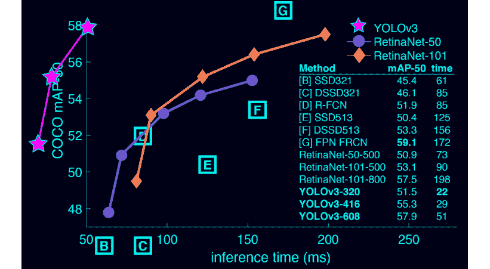

###### 图 9.1：对象检测系统的比较

在前面的图表中，**y** 轴表示 **mAP**（平均精度），**x** 轴表示时间（毫秒）。因此，你可以看到，YOLO 在更短时间内达到了比其他系统更高的 mAP。

同样，理解 YOLO 的工作原理也很重要。它使用一个神经网络，应用于整张图像，并将图像分割成不同的部分，预测边界框。这些边界框类似于矩形，用来标示出某些物体，后续过程将对其进行识别。YOLO 之所以快速，是因为它只需要对神经网络进行一次评估就能进行预测，而其他识别系统需要多次评估。

上述网络具有 53 层卷积层，交替使用 3x3 和 1x1 的层。以下是从 YOLO 作者论文中提取的架构图（[`pjreddie.com/media/files/papers/YOLOv3.pdf`](https://pjreddie.com/media/files/papers/YOLOv3.pdf)）：

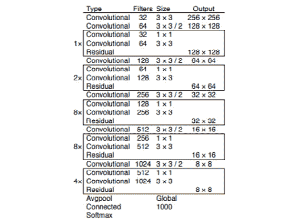

###### 图 9.2：YOLO 架构

### 使用 YOLO 进行图像分类的第一步

在本节中，我们将进行第一次 YOLO 预测。你需要完成基本安装。让我们开始识别单张图像中的物体：

1.  我们将使用一个预训练模型以避免训练过程，所以第一步是下载 Darknet 目录中的网络权重：

    ```py
    cd <darknet_path>
    wget https://pjreddie.com/media/files/yolov3.weights
    ```

1.  之后，我们将使用 YOLO 进行预测。在这个第一个示例中，我们尝试识别一个单一物体，一只狗。这是我们使用的样本图像：

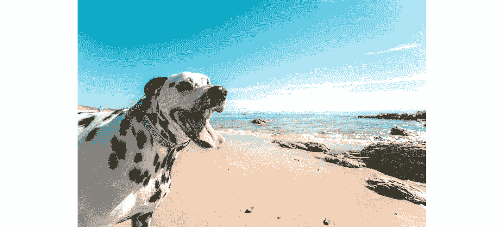

###### 图 9.3：要预测的样本图像

将此图像保存为 .jpg 文件，并在 Darknet 目录中运行 YOLO：

```py
./darknet detect cfg/yolov3.cfg yolov3.weights dog.jpg
```

当执行完成后，你应该会看到类似以下的输出：


###### 图 9.4：预测输出

如你所见，YOLO 以 100% 准确度检测到图像中的狗。它还生成了一个名为 `predictions.jpg` 的新文件，在该文件中可以看到狗在图像中的位置。你可以从 Darknet 目录中打开它：

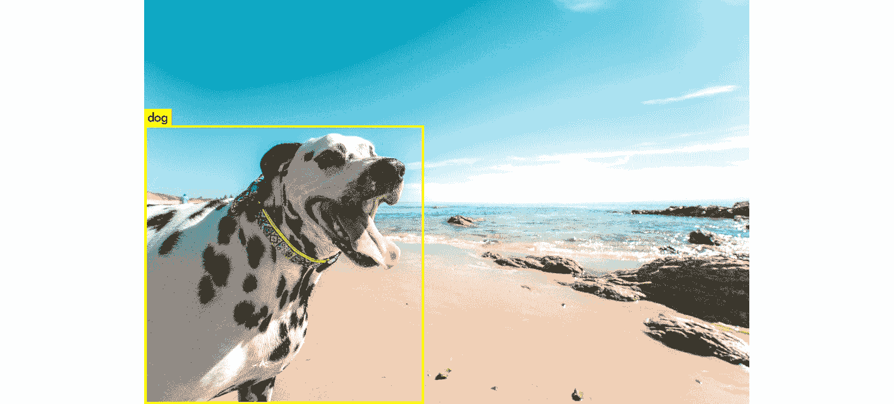

###### 图 9.5：图像中的识别物体

使用 YOLO 的另一种可能性是通过一次执行对多张图像进行预测。为此，你需要输入与之前相同的命令，但这次不要输入图像路径：

```py
./darknet detect cfg/yolov3.cfg yolov3.weights
```

在这种情况下，你将看到以下输出：


###### 图 9.6：预测命令输出

如你所见，它要求你输入一张图像。例如，你可以通过输入 `dog.jpg` 来使用之前的图像。然后，它会要求你输入另一张图像的路径。这样，你可以对所有想要预测的图像进行预测。这可能是一个示例：


###### 图 9.7：图像预测后的输出

如果你这样做，你将得到这张图像：

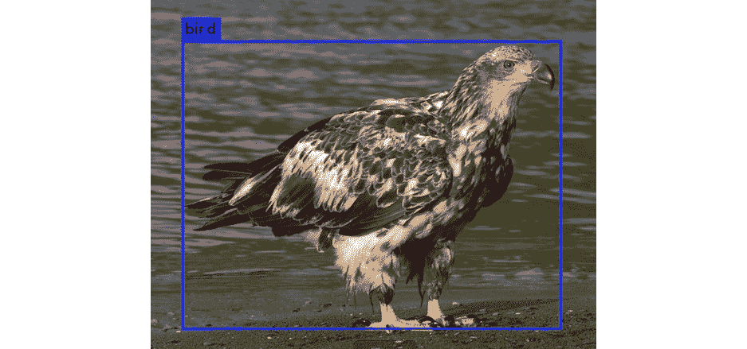

###### 图 9.8：图像预测

在使用 YOLO 时，还有一个有趣的命令需要了解。它可以用来修改检测阈值。

#### 注意

检测阈值是判断预测是否正确的准确度限制。例如，如果你将阈值设置为 0.75，那么准确度低于此值的物体将不会被视为正确预测。

默认情况下，YOLO 会将预测准确度为 0.25 或更高的物体包括在输出中。你可以使用以下命令的最后一个标志来更改阈值：

```py
./darknet detect cfg/yolov3.cfg yolov3.weights dog2.jpg -thresh 0.5
```

如你所料，前面的命令将阈值设置为 0.5。我们来看看一个实际的示例。按照以下步骤来测试阈值修改的功能：

1.  对图像进行预测，直到你找到一个预测准确度低于 100% 的图像。我们将使用这个示例，在该示例中，狗的识别准确度为 60%：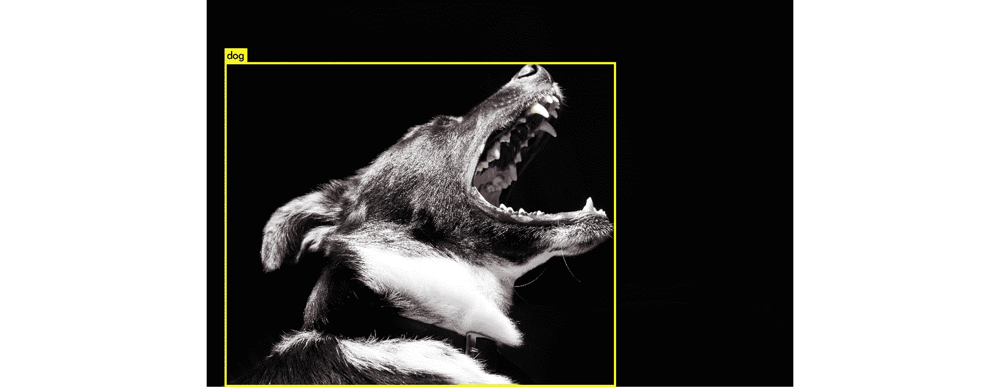

    ###### 图 9.9：准确率低于 100% 的示例图像

1.  现在，使用 `predict` 命令修改检测阈值。由于狗的检测准确度为 60%，如果我们将阈值改为 70%，则不应检测到任何物体：

    ```py
    ./darknet detect cfg/yolov3.cfg yolov3.weights dog2.jpg -thresh 0.7
    ```

1.  如果我们检查 `predictions` 文件，就可以确认狗没有被检测到。因此，你可以看到阈值在识别中的重要作用：

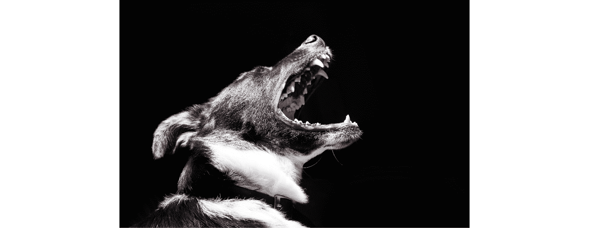

###### 图 9.10：修改阈值后的最终预测

### YOLO 在网络摄像头上

一旦你用 YOLO 做出了第一次预测，接下来是尝试这个系统的一个更有趣的功能。你将通过将 YOLO 连接到个人网络摄像头来检测你自己的真实物体。为此，你必须完成高级安装，因为它需要 GPU 和 OpenCV：

1.  确保你的网络摄像头已连接并且能被系统检测到。

1.  在 Darknet 目录下输入以下命令：

    ```py
    ./darknet detector demo cfg/coco.data cfg/yolov3.cfg yolov3.weights
    ```

1.  尝试识别环境中的物体；例如，我们已在书架上检测到书籍：

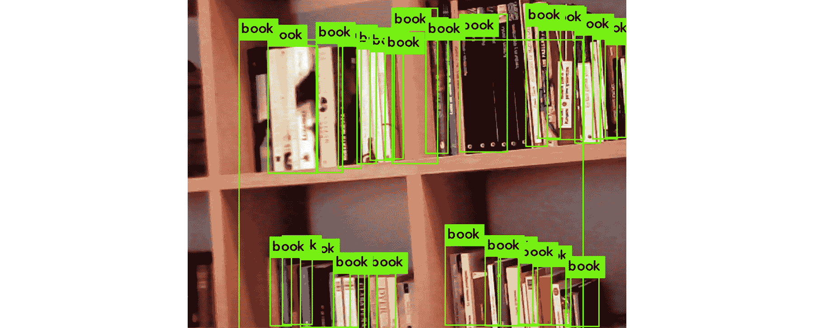

###### 图 9.11：使用网络摄像头识别的书籍

### 练习 28：使用 YOLO 编程

在本练习中，我们将学习如何使用 YOLO 和 Python 进行预测。我们将创建一个数据集，并检查数据集中包含某个特定物体的图像数量。要构建数据集，请查看以下图像：

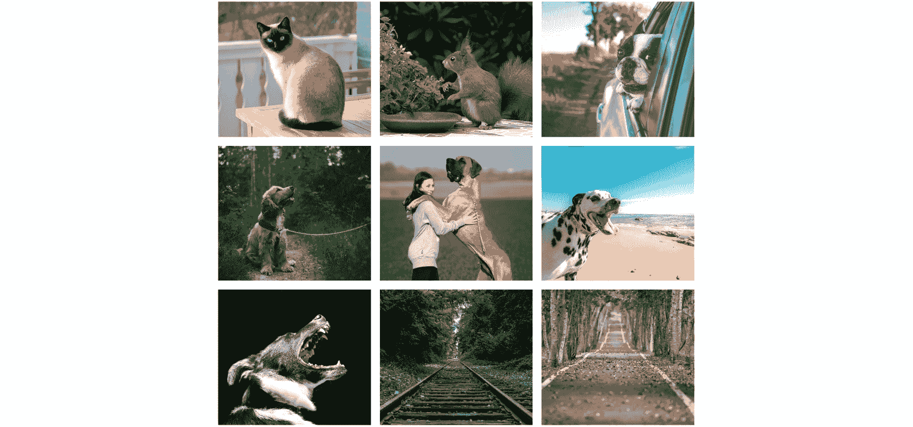

###### 图 9.12：数据集中包含的图像

如你所见，这是一个非常简单的数据集，包含了动物和景观图像。你将要实现的 Python 程序需要获取包含狗的图像数量。

我们将从 GitHub 克隆 Darknet 文件开始：

```py
git clone https://github.com/pjreddie/darknet
cd darknet
make
```

1.  在 Darknet 目录下创建一个名为 `dataset` 的新文件夹。

1.  将这些图像或你选择的其他图像放入新文件夹中。

    #### 注意

    图像可以在 GitHub 的 Chapter 9/exercise28/dataset/ 文件夹中找到

    URL: [`github.com/PacktPublishing/Artificial-Vision-and-Language-Processing-for-Robotics/tree/master/Lesson09/Exercise28/dataset`](https://github.com/PacktPublishing/Artificial-Vision-and-Language-Processing-for-Robotics/tree/master/Lesson09/Exercise28/dataset)

1.  创建一个 Python 文件 `excercise1.py`，并开始实现。

    导入 Python 及所需的库：

    ```py
    #!usr/bin/env python
    import sys, os
    ```

1.  告诉系统在哪里可以找到 Darknet 框架，然后导入它。如果你已经在 Darknet 目录下创建了文件，可以按以下方式操作：

    #### 注意

    ```py
    sys.path.append(os.path.join(os.getcwd(),'python/'))
    import darknet as dn
    ```

1.  告诉 Darknet 使用哪个 GPU 执行程序：

    #### 注意

    ```py
    dn.set_gpu(0)
    ```

1.  配置你将用来进行预测的网络。在这种情况下，我们使用的是与之前相同的配置：

    ```py
    net = dn.load_net("cfg/yolov3.cfg", "yolov3.weights", 0)
    meta = dn.load_meta("cfg/coco.data")
    ```

    #### 注意

    注意输入的路径；如果你的 Python 文件不在 Darknet 文件夹内，路径可能会发生变化。

1.  声明变量以计算图像的总数和包含狗的图像数量：

    ```py
    dog_images = 0
    number_of_images = 0
    ```

1.  实现一个循环，遍历数据集中的文件：

    ```py
    for file in os.listdir("dataset/"):
    ```

1.  使用 Darknet 的 `detect` 方法识别每张图像中的物体：

    ```py
        filename = "dataset/" + file
        r = dn.detect(net, meta, filename)
    ```

1.  遍历已识别的物体，检查它们中是否有狗。如果有，将狗图像计数器加一，并停止检查其余物体。总计数器也加一：

    #### 注意

    ```py
        for obj in r:
            if obj[0] == "dog":
                dog_images += 1
                break
        number_of_images += 1
    ```

1.  最后，打印得到的结果。例如：

    ```py
    print("There are " + str(dog_images) + "/" + str(number_of_images) + " images containing dogs")
    ```

    #### 注意

    ```py
    cd ..
     wget https://pjreddie.com/media/files/yolov3.weights
    python exercise28.py
    ```

    #### 注意

    这里的 `cd ..` 命令切换到文件所在的目录，并下载权重文件和运行脚本。

    例如，`cd <your_script_location>`

你可以通过运行脚本来测试它是否按预期工作。如果你使用了建议的数据集，输出应该如下所示：


###### 图 9.13：练习 28 最终输出

### ROS 集成

现在，你已经学会了如何在常见的 Python 程序中使用 YOLO。接下来，看看如何将其与机器人操作系统（ROS）集成，以便你可以在实际的机器人问题中使用它。你可以将它与任何机器人相机结合，允许机器人检测和识别物体，实现人工视觉的目标。在完成以下练习后，你将能够独立完成它。

### 练习 29：ROS 与 YOLO 集成

本练习包括一个新的 ROS 节点实现，该节点使用 YOLO 识别物体。我们将使用 TurtleBot 进行测试，这是我们在*第六章 机器人操作系统（ROS）*中使用的 ROS 模拟器，但它将很容易适配任何带有相机的机器人。以下是必须遵循的步骤：

1.  在你的 catkin 工作空间中创建一个新的包来包含集成节点。使用以下命令来包含正确的依赖项：

    ```py
    cd ~/catkin_ws/
    source devel/setup.bash
    roscore
    cd src
    catkin_create_pkg exercise29 rospy cv_bridge geometry_msgs image_transport sensor_msgs std_msgs
    ```

1.  切换到包文件夹并创建一个新的`scripts`目录。然后，创建 Python 文件并使其可执行：

    ```py
    cd exercise29
    mkdir scripts
    cd scripts
    touch exercise29.py
    chmod +x exercise29.py
    ```

1.  从实现开始。

    导入你将用于节点实现的库。你需要`sys`和`os`来从路径中导入 Darknet，`OpenCV`来处理图像，以及从`sensor_msgs`导入`Image`来发布它们：

    ```py
    import sys
    import os
    from cv_bridge import CvBridge, CvBridgeError
    from sensor_msgs.msg import Image
    ```

    告诉系统在哪里找到 Darknet：

    ```py
    sys.path.append(os.path.join(os.getcwd(), '/home/alvaro/Escritorio/tfg/darknet/python/'))
    ```

    #### 注意

    ```py
    import darknet as dn
    ```

    创建一个类，在其中编写节点逻辑和其构造函数：

    ```py
    class Exercise29():
        def __init__(self):
    ```

    编写构造函数：

    现在，我们将初始化节点：

    ```py
            rospy.init_node('Exercise29', anonymous=True)
    ```

    创建一个桥接对象：

    ```py
            self.bridge = CvBridge()
    ```

    订阅相机话题：

    ```py
            self.image_sub = rospy.Subscriber("camera/rgb/image_raw", Image, self.imageCallback)
    ```

    创建一个变量来存储获取到的图像：

    ```py
            self.imageToProcess = None
    ```

    为 YOLO 配置定义相应的路径：

    ```py
            cfgPath =  "/home/alvaro/Escritorio/tfg/darknet/cfg/yolov3.cfg"
            weightsPath = "/home/alvaro/Escritorio/tfg/darknet/yolov3.weights"
            dataPath = "/home/alvaro/Escritorio/tfg/darknet/cfg/coco2.data"
    ```

    #### 注意

    ```py
            self.net = dn.load_net(cfgPath, weightsPath, 0)
            self.meta = dn.load_meta(dataPath)
    ```

    定义用于存储图像的名称：

    ```py
            self.fileName = 'predict.jpg'
    ```

    实现回调函数以获取 OpenCV 格式的图像：

    ```py
        def imageCallback(self, data):
            self.imageToProcess = self.bridge.imgmsg_to_cv2(data, "bgr8")
    ```

    创建一个函数，用于对获取的图像进行预测。节点必须不断进行预测，直到用户停止执行。这将通过将图像存储到磁盘并使用检测函数进行预测来完成。最后，结果将持续打印：

    ```py
        def run(self):
            while not rospy.core.is_shutdown():
                if(self.imageToProcess is not None):
                    cv2.imwrite(self.fileName, self.imageToProcess)
                    r = dn.detect(self.net, self.meta, self.fileName)
                    print r
    ```

    实现主程序入口。在这里，你需要初始化 Darknet，创建已创建类的实例，并调用其主方法：

    ```py
    if __name__ == '__main__':
        dn.set_gpu(0)
        node = Exercise29()
        try:
            node.run()
        except rospy.ROSInterruptException:
            pass
    ```

1.  测试节点是否按预期工作。

    打开终端并启动 ROS：

    ```py
    cd ../../
    cd ..
    source devel/setup.bash
    roscore
    ```

    打开另一个终端并运行 Gazebo 与 TurtleBot：

    ```py
    cd ~/catkin_ws
    source devel/setup.bash
    roslaunch turtlebot_gazebo turtlebot_world.launch
    ```

    插入 YOLO 可识别的物体并让 TurtleBot**查看**它们。你可以通过点击位于左上角的**插入**按钮插入新物体。例如，你可以插入一个碗：

    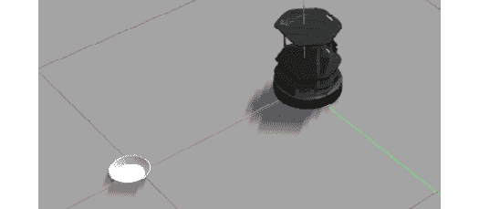

    ###### 图 9.14：在 Gazebo 中插入的碗

1.  打开一个新的终端并运行创建的节点：

    ```py
    cd ~/catkin_ws
    source devel/setup.bash
    rosrun exercise29 exercise29.py
    ```

    如果你使用了一个碗，检查你是否得到了如下输出：

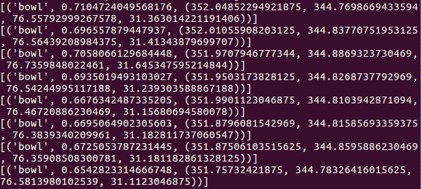

###### 图 9.15：节点预测的物体

### 活动 9：机器人安全守卫

假设一个场景，类似于*第六章，第 6 活动，模拟器与传感器*活动：你在一家机器人公司工作，该公司最近获得了一个新客户——一家购物中心。客户希望你的公司为购物中心提供一些机器人，晚上防止盗窃。这些机器人必须将任何人视为小偷，如果检测到小偷，则需要警告客户。

使用 Gazebo 为 TurtleBot 或其他模拟器提供所需的功能。你应该按照以下步骤进行：

1.  为存储所需节点创建一个 catkin 包。

1.  现在，实现第一个节点。它应该从机器人摄像头获取图像，并对其运行 YOLO。

1.  接下来，它应该以字符串格式发布检测到的物体列表。

1.  实现第二个节点。它应该订阅发布检测到的物体的主题，并获取它们。最后，它应该检查这些物体中是否有一个人，并在是的话打印警告信息。

1.  同时运行两个节点。

    #### 注意

    虽然这不是本活动的主要目标，但将这些节点的执行与另一个节点（例如用于移动机器人的节点，可以使用*第六章，机器人操作系统（ROS）*中实现的节点）结合起来会很有趣。

    本活动的解决方案可以在第 330 页找到。

## 总结

我们现在已经达到了本书的目标，并为机器人构建了一个端到端的应用程序。这只是一个示例应用程序；然而，你可以使用在本书中学到的技术，构建其他机器人应用程序。在本章中，你还学习了如何安装和使用 Darknet 和 YOLO。你学习了使用 AI 评估物体，并集成 YOLO 和 ROS，使你的虚拟机器人能够预测物体。

你已经学习了如何使用自然语言处理命令控制机器人，并研究了本书中的各种模型，如 Word2Vec、GloVe 嵌入技术和非数值数据。在此之后，你还与 ROS 一起工作，并构建了一个对话代理来管理你的虚拟机器人。你开发了构建一个功能性应用所需的技能，能够与 ROS 集成，从你的环境中提取有用的信息。你还使用了不仅对机器人有用的工具；你也可以使用人工视觉和语言处理。

本书的结尾，我们鼓励你开始自己的机器人项目，并且在本书中练习你最喜欢的技术。现在你可以比较不同的工作方法，并探索计算机视觉、算法和极限。始终记住，机器人是一种机器，它可以拥有你希望它具备的行为。
