# 第十一章：*附录*

## 关于

本节内容旨在帮助学生完成书中的活动。它包括学生为实现活动目标而需要执行的详细步骤。

## 第一章：机器人学基础

### 活动 1：使用 Python 进行机器人定位与里程计

**解决方案**

```py
from math import pi
def wheel_distance(diameter, encoder, encoder_time, wheel, movement_time):
    time = movement_time / encoder_time
    wheel_encoder = wheel * time
    wheel_distance = (wheel_encoder * diameter * pi) / encoder

    return wheel_distance
from math import cos,sin
def final_position(initial_pos,wheel_axis,angle):
    final_x=initial_pos[0]+(wheel_axis*cos(angle))
    final_y=initial_pos[1]+(wheel_axis*sin(angle))
    final_angle=initial_pos[2]+angle

    return(final_x,final_y,final_angle)
def position(diameter,base,encoder,encoder_time,left,right,initial_pos,movement_time):
#First step: Wheels completed distance
    left_wheel=wheel_distance(diameter,encoder,encoder_time,left,movement_time)
    right_wheel=wheel_distance(diameter,encoder,encoder_time,right,movement_time)
#Second step: Wheel's central axis completed distance
    wheel_axis=(left_wheel+right_wheel)/2
#Third step: Robot's rotation angle
    angle=(right_wheel-left_wheel)/base
#Final step: Final position calculus
    final_pos=final_position(initial_pos,wheel_axis,angle)

    returnfinal_pos
position(10,80,76,5,600,900,(0,0,0),5)
```

#### 注意：

若要进行进一步观察，您可以将车轮的直径更改为 15 cm 并检查输出的差异。类似地，您可以更改其他输入值并检查输出的差异。

## 第二章：计算机视觉简介

### 活动 2：从 Fashion-MNIST 数据集中分类 10 种衣物

**解决方案**

1.  打开你的 Google Colab 界面。

1.  创建一个书籍文件夹，从 GitHub 下载 `Dataset` 文件夹，并将其上传到该文件夹中。

1.  按如下方式导入驱动并挂载：

    ```py
    from google.colab import drive
    drive.mount('/content/drive')
    ```

    一旦你第一次挂载了你的驱动器，你将需要输入 Google 提供的授权代码，点击给定的 URL 并按下键盘上的 **Enter** 键：

    

    ###### 图 2.38：展示 Google Colab 授权步骤的图像

1.  现在你已经挂载了驱动器，你需要设置目录的路径：

    ```py
    cd /content/drive/My Drive/C13550/Lesson02/Activity02/
    ```

1.  加载数据集并展示五个样本：

    ```py
    from keras.datasets import fashion_mnist
    (x_train, y_train), (x_test, y_test) = fashion_mnist.load_data()
    ```

    输出如下：

    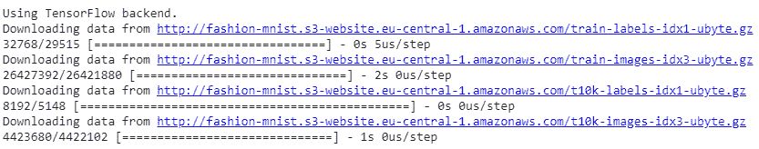

    ###### 图 2.39：加载带有五个样本的数据集

    ```py
    import random
    from sklearn import metrics
    from sklearn.utils import shuffle
    random.seed(42)
    from matplotlib import pyplot as plt
    for idx in range(5):
        rnd_index = random.randint(0, 59999)
        plt.subplot(1,5,idx+1),plt.imshow(x_train[idx],'gray')
        plt.xticks([]),plt.yticks([])
    plt.show()
    ```

    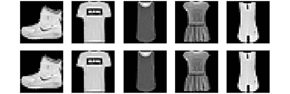

    ###### 图 2.40：来自 Fashion-MNIST 数据集的图像样本

1.  预处理数据：

    ```py
    import numpy as np
    from keras import utils as np_utils
    x_train = (x_train.astype(np.float32))/255.0
    x_test = (x_test.astype(np.float32))/255.0
    x_train = x_train.reshape(x_train.shape[0], 28, 28, 1)
    x_test = x_test.reshape(x_test.shape[0], 28, 28, 1)
    y_train = np_utils.to_categorical(y_train, 10)
    y_test = np_utils.to_categorical(y_test, 10)
    input_shape = x_train.shape[1:]
    ```

1.  使用 `Dense` 层构建神经网络架构：

    ```py
    from keras.callbacks import EarlyStopping, ModelCheckpoint, ReduceLROnPlateau
    from keras.layers import Input, Dense, Dropout, Flatten
    from keras.preprocessing.image import ImageDataGenerator
    from keras.layers import Conv2D, MaxPooling2D, Activation, BatchNormalization
    from keras.models import Sequential, Model
    from keras.optimizers import Adam, Adadelta
    def DenseNN(inputh_shape):
        model = Sequential()
        model.add(Dense(128, input_shape=input_shape))
        model.add(BatchNormalization())
        model.add(Activation('relu'))
        model.add(Dropout(0.2))
        model.add(Dense(128))
        model.add(BatchNormalization())
        model.add(Activation('relu'))
        model.add(Dropout(0.2))
        model.add(Dense(64))
        model.add(BatchNormalization())
        model.add(Activation('relu'))
        model.add(Dropout(0.2))
        model.add(Flatten())
        model.add(Dense(64))
        model.add(BatchNormalization())
        model.add(Activation('relu'))
        model.add(Dropout(0.2))
        model.add(Dense(10, activation="softmax"))
        return model
    model = DenseNN(input_shape)
    ```

    #### 注意：

    本活动的完整代码文件可以在 GitHub 的 Lesson02 | Activity02 文件夹中找到。

1.  编译并训练模型：

    ```py
    optimizer = Adadelta()
    model.compile(loss='categorical_crossentropy', optimizer=optimizer, metrics=['accuracy'])
    ckpt = ModelCheckpoint('model.h5', save_best_only=True,monitor='val_loss', mode='min', save_weights_only=False)
    model.fit(x_train, y_train, batch_size=128, epochs=20, verbose=1, validation_data=(x_test, y_test), callbacks=[ckpt])
    ```

    获得的准确率为 **88.72%**。这个问题更难解决，所以我们达成的准确率低于上一个练习。

1.  做出预测：

    ```py
    import cv2
    images = ['ankle-boot.jpg', 'bag.jpg', 'trousers.jpg', 't-shirt.jpg']
    for number in range(len(images)):
        imgLoaded = cv2.imread('Dataset/testing/%s'%(images[number]),0)
        img = cv2.resize(imgLoaded, (28, 28))
        img = np.invert(img)
    cv2.imwrite('test.jpg',img)
        img = (img.astype(np.float32))/255.0
        img = img.reshape(1, 28, 28, 1)
        plt.subplot(1,5,number+1),plt.imshow(imgLoaded,'gray')
        plt.title(np.argmax(model.predict(img)[0]))
        plt.xticks([]),plt.yticks([])
    plt.show()
    ```

    输出将如下所示：

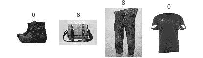

###### 图 2.41：使用神经网络进行衣物预测

它已经正确地分类了包和 T 恤，但它未能正确分类靴子和裤子。这些样本与它所训练的样本差异很大。

## 第三章：自然语言处理基础

### 活动 3：处理语料库

**解决方案**

1.  导入 `sklearn` 的 `TfidfVectorizer` 和 `TruncatedSVD` 方法：

    ```py
    from sklearn.feature_extraction.text import TfidfVectorizer
    from sklearn.decomposition import TruncatedSVD
    ```

1.  加载语料库：

    ```py
    docs = []
    ndocs = ["doc1", "doc2", "doc3"]
    for n in ndocs:
        aux = open("dataset/"+ n +".txt", "r", encoding="utf8")
        docs.append(aux.read())
    ```

1.  使用 `spaCy`，让我们添加一些新的停用词，标记化语料库，并删除这些停用词。去除这些词后的新语料库将存储在一个新变量中：

    ```py
    import spacy
    import en_core_web_sm
    from spacy.lang.en.stop_words import STOP_WORDS
    nlp = en_core_web_sm.load()
    nlp.vocab["\n\n"].is_stop = True
    nlp.vocab["\n"].is_stop = True
    nlp.vocab["the"].is_stop = True
    nlp.vocab["The"].is_stop = True
    newD = []
    for d, i in zip(docs, range(len(docs))):
        doc = nlp(d)
        tokens = [token.text for token in doc if not token.is_stop and not token.is_punct]
        newD.append(' '.join(tokens))
    ```

1.  创建 TF-IDF 矩阵。我将添加一些参数来改善结果：

    ```py
    vectorizer = TfidfVectorizer(use_idf=True, 
                                ngram_range=(1,2), 
                                smooth_idf=True,
                                max_df=0.5)
    X = vectorizer.fit_transform(newD)
    ```

1.  执行 LSA 算法：

    ```py
    lsa = TruncatedSVD(n_components=100,algorithm='randomized',n_iter=10,random_state=0)
    lsa.fit_transform(X)
    ```

1.  使用 pandas，我们看到一个排序过的 `DataFrame`，其中包含每个概念的术语权重和每个特征的名称：

    ```py
    import pandas as pd
    import numpy as np
    dic1 = {"Terms": terms, "Components": lsa.components_[0]}
    dic2 = {"Terms": terms, "Components": lsa.components_[1]}
    dic3 = {"Terms": terms, "Components": lsa.components_[2]}
    f1 = pd.DataFrame(dic1)
    f2 = pd.DataFrame(dic2)
    f3 = pd.DataFrame(dic3)
    f1.sort_values(by=['Components'], ascending=False)
    f2.sort_values(by=['Components'], ascending=False)
    f3.sort_values(by=['Components'], ascending=False)
    ```

    输出如下：


###### 图 3.26：概念中最相关单词的输出示例（f1）

#### 注意：

不用担心关键字与您的不完全相同，只要这些关键字代表一个概念，那就是有效结果。

## 第四章：自然语言处理中的神经网络

### 活动 4：预测序列中的下一个字符

**解决方案**

1.  导入解决此任务所需的库：

    ```py
    import tensorflow as tf
    from keras.models import Sequential
    from keras.layers import LSTM, Dense, Activation, LeakyReLU
    import numpy as np
    ```

1.  定义字符序列，并将其乘以 100：

    ```py
    char_seq = 'qwertyuiopasdfghjklñzxcvbnm' * 100
    char_seq = list(char_seq)
    ```

1.  创建一个 `char2id` 字典，将每个字符与一个整数关联：

    ```py
    char2id = dict([(char, idx) for idx, char in enumerate(set(char_seq))])
    ```

1.  将字符的句子划分为时间序列。时间序列的最大长度为五，因此我们将得到五个字符的向量。同时，我们将创建即将到来的向量。`y_labels` 变量表示我们词汇表的大小。我们稍后会使用这个变量：

    ```py
    maxlen = 5
    sequences = []
    next_char = []

    for i in range(0,len(char_seq)-maxlen):
        sequences.append(char_seq[i:i+maxlen])
        next_char.append(char_seq[i+maxlen])

    y_labels = len(char2id)
    print("5 first sequences: {}".format(sequences[:5]))
    print("5 first next characters: {}".format(next_char[:5]))
    print("Total sequences: {}".format(len(sequences)))
    print("Total output labels: {}".format(y_labels))
    ```

1.  到目前为止，我们有一个序列变量，它是一个数组的数组，包含字符的时间序列。`char` 是一个数组，包含即将出现的字符。现在，我们需要对这些向量进行编码，因此我们来定义一个方法，用 `char2id` 信息对字符数组进行编码：

    ```py
    def one_hot_encoder(seq, ids):
        encoded_seq = np.zeros([len(seq),len(ids)])
        for i,s in enumerate(seq):
            encoded_seq[i][ids[s]] = 1
        return encoded_seq
    ```

1.  将变量编码为 one-hot 向量。其形状为 x = (2695,5,27) 和 y = (2695,27)：

    ```py
    x = np.array([one_hot_encoder(item, char2id) for item in sequences])
    y = np.array(one_hot_encoder(next_char, char2id))
    x = x.astype(np.int32)
    y = y.astype(np.int32)

    print("Shape of x: {}".format(x.shape))
    print("Shape of y: {}".format(y.shape))
    ```

    

    ###### 图 4.35：变量编码为 OneHotVectors

1.  将数据分为训练集和测试集。为此，我们将使用 sklearn 的 `train_test_split` 方法：

    ```py
    from sklearn.model_selection import train_test_split

    x_train, x_test, y_train, y_test = train_test_split(x, y, test_size=0.2, shuffle=False)
    print('x_train shape: {}'.format(x_train.shape)) 
    print('y_train shape: {}'.format(y_train.shape))  
    print('x_test shape: {}'.format(x_test.shape)) 
    print('y_test shape: {}'.format(y_test.shape))
    ```

    

    ###### 图 4.36：将数据分为训练集和测试集

1.  数据准备好插入到神经网络中后，创建一个包含两层的 Sequential 模型：

    第一层：LSTM，包含八个神经元（激活函数为 tanh）。`input_shape` 是序列的最大长度和词汇表的大小。因此，基于我们数据的形状，我们不需要进行任何形状重塑。

    第二层：Dense，包含 27 个神经元。这就是我们成功完成任务的方式。使用 LeakyRelu 激活函数将给您一个良好的分数。但为什么？我们的输出中有许多零值，因此网络可能会失败并仅返回一个零向量。使用 LeakyRelu 可以避免这个问题：

    ```py
    model = Sequential()
    model.add(LSTM(8,input_shape=(maxlen,y_labels)))
    model.add(Dense(y_labels))
    model.add(LeakyReLU(alpha=.01)) 

    model.compile(loss='mse', optimizer='rmsprop')
    ```

1.  训练模型。我们使用的 `batch_size` 是 32，训练了 25 个周期：

    ```py
    history = model.fit(x_train, y_train, batch_size=32, epochs=25, verbose=1)
    ```

    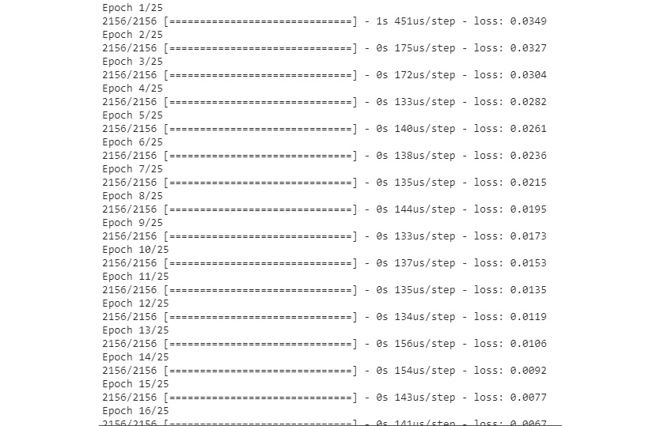

    ###### 图 4.37：使用批次大小 32 和 25 个周期进行训练

1.  计算您的模型的误差。

    ```py
    print('MSE: {:.5f}'.format(model.evaluate(x_test, y_test)))
    ```

    

    ###### 图 4.38：模型中显示的错误

1.  预测测试数据，并查看命中率的平均百分比。使用该模型，您将获得超过 90% 的平均准确率：

    ```py
    prediction = model.predict(x_test)

    errors = 0
    for pr, res in zip(prediction, y_test):
        if not np.array_equal(np.around(pr),res):
            errors+=1

    print("Errors: {}".format(errors))
    print("Hits: {}".format(len(prediction) - errors))
    print("Hit average: {}".format((len(prediction) - errors)/len(prediction)))
    ```

    

    ###### 图 4.39：预测测试数据

1.  为了完成这个任务，我们需要创建一个函数，该函数接受一个字符序列并返回下一个预测值。为了对模型的预测结果进行解码，我们首先编写一个解码方法。这个方法只是寻找预测中的最大值，并在 `char2id` 字典中获取相应的字符键。

    ```py
    def decode(vec):
        val = np.argmax(vec)
        return list(char2id.keys())[list(char2id.values()).index(val)]
    ```

1.  创建一个方法来预测给定句子中的下一个字符：

    ```py
    def pred_seq(seq):
        seq = list(seq)
        x = one_hot_encoder(seq,char2id)
        x = np.expand_dims(x, axis=0)
        prediction = model.predict(x, verbose=0)
        return decode(list(prediction[0]))
    ```

1.  最后，引入序列‘tyuio’来预测即将到来的字符。它将返回‘p’：

    ```py
    pred_seq('tyuio')
    ```


###### 图 4.40：带有预测序列的最终输出

恭喜！你已经完成了活动。你可以预测一个值并输出一个时间序列。这在金融中也非常重要，即预测未来的价格或股票的变动。

你可以更改数据并预测你想要的内容。如果添加语言语料库，你将从自己的 RNN 语言模型中生成文本。因此，我们未来的对话代理可以生成诗歌或新闻文本。

## 第五章：计算机视觉的卷积神经网络

### 活动 5：利用数据增强正确分类花卉图像

**解决方案**

1.  打开你的 Google Colab 界面。

    #### 注意：

    ```py
    import numpyasnp
    classes=['daisy','dandelion','rose','sunflower','tulip']
    X=np.load("Dataset/flowers/%s_x.npy"%(classes[0]))
    y=np.load("Dataset/flowers/%s_y.npy"%(classes[0]))
    print(X.shape)
    forflowerinclasses[1:]:
        X_aux=np.load("Dataset/flowers/%s_x.npy"%(flower))
        y_aux=np.load("Dataset/flowers/%s_y.npy"%(flower))
        print(X_aux.shape)
        X=np.concatenate((X,X_aux),axis=0)
        y=np.concatenate((y,y_aux),axis=0)

    print(X.shape)
    print(y.shape)
    ```

1.  输出数据集中的一些样本：

    ```py
    import random 
    random.seed(42) 
    from matplotlib import pyplot as plt
    import cv2
    for idx in range(5): 
        rnd_index = random.randint(0, 4000) 
        plt.subplot(1,5,idx+1),plt.imshow(cv2.cvtColor(X[rnd_index],cv2.COLOR_BGR2RGB)) 
        plt.xticks([]),plt.yticks([])
        plt.savefig("flowers_samples.jpg", bbox_inches='tight')
    plt.show() 
    ```

    输出如下所示：

    

    ###### 图 5.23：数据集中的样本

1.  现在，我们将进行归一化并执行一热编码：

    ```py
    from keras import utils as np_utils
    X = (X.astype(np.float32))/255.0 
    y = np_utils.to_categorical(y, len(classes))
    print(X.shape)
    print(y.shape)
    ```

1.  分割训练集和测试集：

    ```py
    from sklearn.model_selection import train_test_split
    x_train, x_test, y_train, y_test = train_test_split(X, y, test_size=0.2)
    input_shape = x_train.shape[1:]
    print(x_train.shape)
    print(y_train.shape)
    print(x_test.shape)
    print(y_test.shape)
    print(input_shape)
    ```

1.  导入库并构建 CNN：

    ```py
    from keras.models import Sequential
    from keras.callbacks import ModelCheckpoint
    from keras.layers import Input, Dense, Dropout, Flatten
    from keras.layers import Conv2D, Activation, BatchNormalization
    def CNN(input_shape):
        model = Sequential()

        model.add(Conv2D(32, kernel_size=(5, 5), padding='same',  strides=(2,2), input_shape=input_shape))
        model.add(Activation('relu')) 
        model.add(BatchNormalization()) 
        model.add(Dropout(0.2))
        model.add(Conv2D(64, kernel_size=(3, 3), padding='same', strides=(2,2))) 
        model.add(Activation('relu')) 
        model.add(BatchNormalization()) 
        model.add(Dropout(0.2))
        model.add(Conv2D(128, kernel_size=(3, 3), padding='same', strides=(2,2))) 
        model.add(Activation('relu')) 
        model.add(BatchNormalization()) 
        model.add(Dropout(0.2))

        model.add(Conv2D(256, kernel_size=(3, 3), padding='same', strides=(2,2))) 
        model.add(Activation('relu')) 
        model.add(BatchNormalization()) 
        model.add(Dropout(0.2))

        model.add(Flatten())
        model.add(Dense(512))
        model.add(Activation('relu'))
        model.add(BatchNormalization())
        model.add(Dropout(0.5))
        model.add(Dense(5, activation = "softmax"))
        return model
    ```

1.  声明 ImageDataGenerator：

    ```py
    from keras.preprocessing.image import ImageDataGenerator
    datagen = ImageDataGenerator(
            rotation_range=10,
            zoom_range = 0.2,
            width_shift_range=0.2,
            height_shift_range=0.2,
            shear_range=0.1,
            horizontal_flip=True
            )
    ```

1.  我们现在将训练模型：

    ```py
    datagen.fit(x_train)
    model = CNN(input_shape)
    model.compile(loss='categorical_crossentropy', optimizer='Adadelta', metrics=['accuracy'])
    ckpt = ModelCheckpoint('Models/model_flowers.h5', save_best_only=True,monitor='val_loss', mode='min', save_weights_only=False) 
    //{…}##the detailed code can be found on Github##
    model.fit_generator(datagen.flow(x_train, y_train,
                                batch_size=32),
                        epochs=200,
                        validation_data=(x_test, y_test),
                        callbacks=[ckpt],
                        steps_per_epoch=len(x_train) // 32,
                        workers=4)
    ```

1.  之后，我们将评估模型：

    ```py
    from sklearn import metrics
    model.load_weights('Models/model_flowers.h5')
    y_pred = model.predict(x_test, batch_size=32, verbose=0)
    y_pred = np.argmax(y_pred, axis=1)
    y_test_aux = y_test.copy()
    y_test_pred = list()
    for i in y_test_aux:
        y_test_pred.append(np.argmax(i))
    //{…}
    ##the detailed code can be found on Github##
    print (y_pred)
    # Evaluate the prediction
    accuracy = metrics.accuracy_score(y_test_pred, y_pred)
    print('Acc: %.4f' % accuracy)
    ```

1.  达到的准确率是**91.68%**。

1.  尝试使用未见过的数据测试模型：

    ```py
    classes = ['daisy','dandelion','rose','sunflower','tulip']
    images = ['sunflower.jpg','daisy.jpg','rose.jpg','dandelion.jpg','tulip .jpg']
    model.load_weights('Models/model_flowers.h5')
    for number in range(len(images)):
        imgLoaded = cv2.imread('Dataset/testing/%s'%(images[number])) 
        img = cv2.resize(imgLoaded, (150, 150)) 
        img = (img.astype(np.float32))/255.0 
        img = img.reshape(1, 150, 150, 3)
        plt.subplot(1,5,number+1),plt.imshow(cv2.cvtColor(imgLoaded,cv2.COLOR_BGR2RGB)) 
        plt.title(np.argmax(model.predict(img)[0])) 
        plt.xticks([]),plt.yticks([]) 
    plt.show()
    ```

    输出将如下所示：

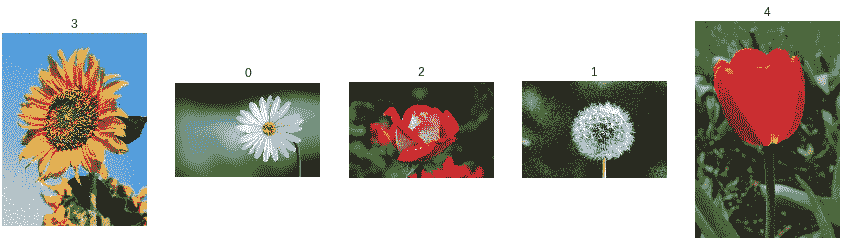

###### 图 5.24：活动 05 中玫瑰的预测结果

#### 注意：

该活动的详细代码可以在 GitHub 上找到 - [`github.com/PacktPublishing/Artificial-Vision-and-Language-Processing-for-Robotics/blob/master/Lesson05/Activity05/Activity05.ipynb`](https://github.com/PacktPublishing/Artificial-Vision-and-Language-Processing-for-Robotics/blob/master/Lesson05/Activity05/Activity05.ipynb)

## 第六章：机器人操作系统（ROS）

### 活动 6：模拟器和传感器

**解决方案**

1.  我们从创建包和文件开始：

    ```py
    cd ~/catkin_ws/src
    catkin_create_pkg activity1 rospy sensor_msgs
    cd  activity1
    mkdir scripts
    cd scripts
    touch observer.py
    touch movement.py
    chmod +x observer.py
    chmod +x movement.py
    ```

1.  这是图像获取节点的实现：

    #### 注意：

    ```py
    #!/usr/bin/env python
    import rospy
    from sensor_msgs.msg import Image
    import cv2
    from cv_bridge import CvBridge
    class Observer:
        bridge = CvBridge()
        counter = 0
        def callback(self, data):
            if self.counter == 20:
                cv_image = self.bridge.imgmsg_to_cv2(data, "bgr8")
                cv2.imshow('Image',cv_image)
                cv2.waitKey(1000)
                cv2.destroyAllWindows()
                self.counter = 0
            else:
                self.counter += 1
        def observe(self):
            rospy.Subscriber('/camera/rgb/image_raw', Image, self.callback)
            rospy.init_node('observer', anonymous=True)
            rospy.spin()
    if __name__ == '__main__':
        obs = Observer()
        obs.observe()
    ```

    如你所见，这个节点与*练习 21*中的*发布者和订阅者*节点非常相似。唯一的区别是：

1.  使用计数器仅显示收到的二十张图像中的一张。

    我们输入`1000 (ms)`作为`Key()`参数，这样每张图像就会显示一秒钟。

    这是运动节点的实现：

    ```py
    #!/usr/bin/env python
    import rospy
    from geometry_msgs.msg import Twist
    def move():
        pub = rospy.Publisher('/mobile_base/commands/velocity', Twist, queue_size=1)
        rospy.init_node('movement', anonymous=True)
        move = Twist()
        move.angular.z = 0.5
        rate = rospy.Rate(10)
        while not rospy.is_shutdown():
            pub.publish(move)
            rate.sleep()
    if __name__ == '__main__':
        try:
            move()
        except rospy.ROSInterruptException:
            pass
    ```

1.  为了执行文件，我们将执行这里提到的代码。

    #### 注意：

    ```py
    cd ~/catkin_ws
    source devel/setup.bash
    roscore
    roslaunch turtlebot_gazebo turtlebot_world.launch
    rosrun activity1 observer.py
    rosrun activity1 movement.py
    ```

1.  运行两个节点并检查系统功能。你应该看到机器人转动自己，同时展示它所看到的图像。这是执行的一个顺序：

    输出将如下所示：

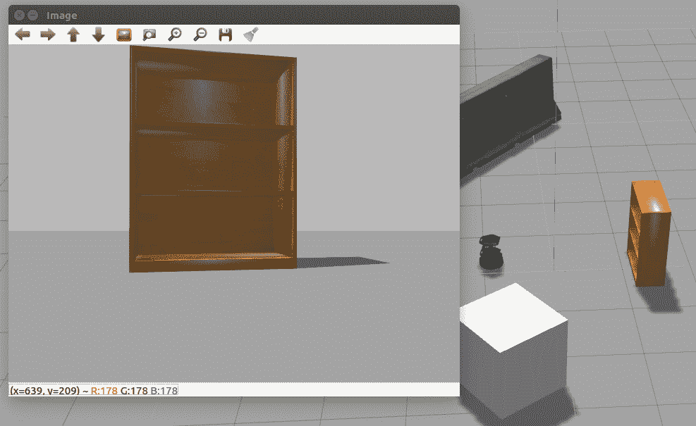

###### 图 6.10：活动节点执行的第一个顺序

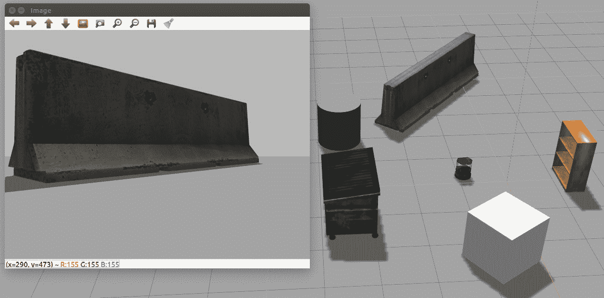

###### 图 6.11：活动节点执行的第二个顺序

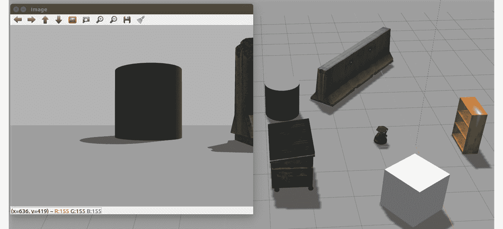

###### 图 6.12: 活动节点执行的第三个序列

#### 注意：

输出看起来类似但不完全像图 6.10、6.11 和 6.12 中提到的那样。

恭喜！您已完成此活动，最终将会有一个类似于图 6.8、6.9 和 6.10 的输出。通过成功完成此活动，您已能够实现并使用让您订阅相机的节点，在虚拟环境中显示图像。您还学会了让机器人自转，以便查看这些图像。

## 第七章：构建基于文本的对话系统（聊天机器人）

### 活动 7：创建用于控制机器人的对话代理

**解决方案**

1.  打开您的 Google Colab 界面。

1.  为书创建一个文件夹，并从 Github 下载`utils`、`responses`和`training`文件夹，然后上传到该文件夹中。

1.  导入驱动并按如下方式挂载它：

    ```py
    from google.colab import drive
    drive.mount('/content/drive')
    ```

    #### 注意

    每次使用新的协作者时，请将驱动器挂载到所需的文件夹。

1.  第一次挂载驱动后，您需要按照 Google 提供的 URL 并在键盘上按 Enter 键来输入授权代码：

    ###### 图 7.28: 显示 Google Colab 授权步骤的图像

1.  现在您已经挂载了驱动器，需要设置目录的路径。

    ```py
    cd /content/drive/My Drive/C13550/Lesson07/Activity01
    ```

    #### 注意：

    步骤 5 中提到的路径可能会根据您在 Google Drive 上的文件夹设置而变化。路径将始终以 cd /content/drive/My Drive/开头。

1.  导入 chatbot_intro 文件：

    ```py
    from chatbot_intro import *
    ```

1.  定义 GloVe 模型：

    ```py
    filename = '../utils/glove.6B.50d.txt.word2vec'
    model = KeyedVectors.load_word2vec_format(filename, binary=False)
    ```

1.  列出响应和训练句子文件：

    ```py
    intent_route = 'training/'
    response_route = 'responses/'
    intents = listdir(intent_route)
    responses = listdir(response_route)
    print("Documents: ", intents)
    ```

    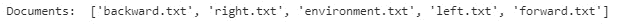

    ###### 图 7.29: 意图文档列表

1.  创建文档向量：

    ```py
    doc_vectors = np.empty((0,50), dtype='f')
    for i in intents:
        with open(intent_route + i) as f:
            sentences = f.readlines()
        sentences = [x.strip() for x in sentences]
        sentences = pre_processing(sentences)
    doc_vectors= np.append(doc_vectors,doc_vector(sentences,model),axis=0)
    print("Shape of doc_vectors:",doc_vectors.shape)
    print(" Vector representation of backward.txt:\n",doc_vectors)
    ```

    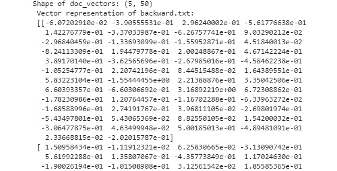

    ###### 7.30: doc_vectors 的形状

1.  预测意图：

    ```py
    user_sentence = "Look to the right"
    user_sentence = pre_processing([user_sentence])
    user_vector = doc_vector(user_sentence,model).reshape(100,)
    intent = intents[select_intent(user_vector, doc_vectors)]
    intent
    ```


###### 7.31: 预测意图

恭喜！您已完成此活动。如果希望，您可以添加更多意图，并训练 GloVe 模型以获得更好的结果。通过创建包含所有代码的函数，您可以编程和开发 ROS 中的运动节点，从而命令您的机器人进行移动和转向。

## 第八章：使用 CNN 引导机器人进行对象识别

### 活动 8：在视频中进行多对象检测和识别

**解决方案**

1.  挂载驱动器：

    ```py
    from google.colab import drive
    drive.mount('/content/drive')
    cd /content/drive/My Drive/C13550/Lesson08/
    ```

1.  安装库：

    ```py
    pip3 install https://github.com/OlafenwaMoses/ImageAI/releases/download/2.0.2/imageai-2.0.2-py3-none-any.whl
    ```

1.  导入库：

    ```py
    from imageai.Detection import VideoObjectDetection
    from matplotlib import pyplot as plt
    ```

1.  声明模型：

    ```py
    video_detector = VideoObjectDetection()
    video_detector.setModelTypeAsYOLOv3()
    video_detector.setModelPath("Models/yolo.h5")
    video_detector.loadModel()
    ```

1.  声明回调方法：

    ```py
    color_index = {'bus': 'red', 'handbag': 'steelblue', 'giraffe': 'orange', 'spoon': 'gray', 'cup': 'yellow', 'chair': 'green', 'elephant': 'pink', 'truck': 'indigo', 'motorcycle': 'azure', 'refrigerator': 'gold', 'keyboard': 'violet', 'cow': 'magenta', 'mouse': 'crimson', 'sports ball': 'raspberry', 'horse': 'maroon', 'cat': 'orchid', 'boat': 'slateblue', 'hot dog': 'navy', 'apple': 'cobalt', 'parking meter': 'aliceblue', 'sandwich': 'skyblue', 'skis': 'deepskyblue', 'microwave': 'peacock', 'knife': 'cadetblue', 'baseball bat': 'cyan', 'oven': 'lightcyan', 'carrot': 'coldgrey', 'scissors': 'seagreen', 'sheep': 'deepgreen', 'toothbrush': 'cobaltgreen', 'fire hydrant': 'limegreen', 'remote': 'forestgreen', 'bicycle': 'olivedrab', 'toilet': 'ivory', 'tv': 'khaki', 'skateboard': 'palegoldenrod', 'train': 'cornsilk', 'zebra': 'wheat', 'tie': 'burlywood', 'orange': 'melon', 'bird': 'bisque', 'dining table': 'chocolate', 'hair drier': 'sandybrown', 'cell phone': 'sienna', 'sink': 'coral', 'bench': 'salmon', 'bottle': 'brown', 'car': 'silver', 'bowl': 'maroon', 'tennis racket': 'palevilotered', 'airplane': 'lavenderblush', 'pizza': 'hotpink', 'umbrella': 'deeppink', 'bear': 'plum', 'fork': 'purple', 'laptop': 'indigo', 'vase': 'mediumpurple', 'baseball glove': 'slateblue', 'traffic light': 'mediumblue', 'bed': 'navy', 'broccoli': 'royalblue', 'backpack': 'slategray', 'snowboard': 'skyblue', 'kite': 'cadetblue', 'teddy bear': 'peacock', 'clock': 'lightcyan', 'wine glass': 'teal', 'frisbee': 'aquamarine', 'donut': 'mincream', 'suitcase': 'seagreen', 'dog': 'springgreen', 'banana': 'emeraldgreen', 'person': 'honeydew', 'surfboard': 'palegreen', 'cake': 'sapgreen', 'book': 'lawngreen', 'potted plant': 'greenyellow', 'toaster': 'ivory', 'stop sign': 'beige', 'couch': 'khaki'}
    def forFrame(frame_number, output_array, output_count, returned_frame):
        plt.clf()
        this_colors = []
        labels = []
        sizes = []
        counter = 0
        for eachItem in output_count:
            counter += 1
            labels.append(eachItem + " = " + str(output_count[eachItem]))
            sizes.append(output_count[eachItem])
            this_colors.append(color_index[eachItem])
        plt.subplot(1, 2, 1)
        plt.title("Frame : " + str(frame_number))
        plt.axis("off")
        plt.imshow(returned_frame, interpolation="none")
        plt.subplot(1, 2, 2)
        plt.title("Analysis: " + str(frame_number))
        plt.pie(sizes, labels=labels, colors=this_colors, shadow=True, startangle=140, autopct="%1.1f%%")
        plt.pause(0.01)
    ```

1.  运行 Matplotlib 和视频检测过程：

    ```py
    plt.show()
    video_detector.detectObjectsFromVideo(input_file_path="Dataset/videos/street.mp4", output_file_path="output-video" ,  frames_per_second=20, per_frame_function=forFrame,  minimum_percentage_probability=30, return_detected_frame=True, log_progress=True)
    ```

    输出将如下帧所示：

    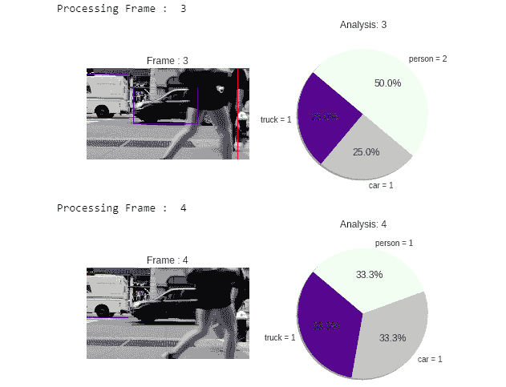

###### 图 8.7: ImageAI 视频对象检测输出

正如您所见，模型可以较为准确地检测到对象。现在您可以在第八章的根目录中看到包含所有对象检测结果的输出视频。

#### 注意：

在`Dataset/videos`文件夹中新增了一个视频——`park.mp4`。你可以使用刚才提到的步骤，也可以在这个视频中识别物体。

## 第九章：机器人计算机视觉

### 活动 9：机器人安保守卫

**解决方案**

1.  在你的 catkin 工作空间中创建一个新的包来包含集成节点。使用此命令来包括正确的依赖项：

    ```py
    cd ~/catkin_ws/
    source devel/setup.bash
    roscore
    cd src
    catkin_create_pkg activity1 rospy cv_bridge geometry_msgs image_transport sensor_msgs std_msgs
    ```

1.  切换到包文件夹并创建一个新的`scripts`目录。然后，创建 Python 文件并使其可执行：

    ```py
    cd activity1
    mkdir scripts
    cd scripts
    touch activity.py
    touch activity_sub.py
    chmod +x activity.py
    chmod +x activity_sub.py
    ```

1.  这是第一个节点的实现：

    库导入：

    ```py
    #!/usr/bin/env python
    import rospy
    import cv2
    import sys
    import os
    from cv_bridge import CvBridge, CvBridgeError
    from sensor_msgs.msg import Image
    from std_msgs.msg import String
    sys.path.append(os.path.join(os.getcwd(), '/home/alvaro/Escritorio/tfg/darknet/python/'))
    import darknet as dn
    ```

    #### 注意

    ```py
    class Activity():
        def __init__(self):
    ```

    节点、订阅者和网络初始化：

    ```py
            rospy.init_node('Activity', anonymous=True)
            self.bridge = CvBridge()
            self.image_sub = rospy.Subscriber("camera/rgb/image_raw", Image, self.imageCallback)
            self.pub = rospy.Publisher('yolo_topic', String, queue_size=10)
            self.imageToProcess = None
            cfgPath =  "/home/alvaro/Escritorio/tfg/darknet/cfg/yolov3.cfg"
            weightsPath = "/home/alvaro/Escritorio/tfg/darknet/yolov3.weights"
            dataPath = "/home/alvaro/Escritorio/tfg/darknet/cfg/coco2.data"
            self.net = dn.load_net(cfgPath, weightsPath, 0)
            self.meta = dn.load_meta(dataPath)
            self.fileName = 'predict.jpg'
            self.rate = rospy.Rate(10)
    ```

    #### 注意

    ```py
        def imageCallback(self, data):
            self.imageToProcess = self.bridge.imgmsg_to_cv2(data, "bgr8")
    ```

    节点的主函数：

    ```py
        def run(self): 
            print("The robot is recognizing objects")
            while not rospy.core.is_shutdown():
                if(self.imageToProcess is not None):
                    cv2.imwrite(self.fileName, self.imageToProcess)
    ```

    对图像进行预测的方法：

    ```py
                    r = dn.detect(self.net, self.meta, self.fileName)
                    objects = ""
                    for obj in r:
                        objects += obj[0] + " "
    ```

    发布预测：

    ```py
                    self.pub.publish(objects)
                    self.rate.sleep()
    ```

    程序入口：

    ```py
    if __name__ == '__main__':
        dn.set_gpu(0)
        node = Activity()
        try:
            node.run()
        except rospy.ROSInterruptException:
            pass
    ```

1.  这是第二个节点的实现：

    库导入：

    ```py
    #!/usr/bin/env python
    import rospy
    from std_msgs.msg import String
    ```

    类定义：

    ```py
    class ActivitySub():
        yolo_data = ""

        def __init__(self):
    ```

    节点初始化和订阅者定义：

    ```py
            rospy.init_node('ThiefDetector', anonymous=True)
            rospy.Subscriber("yolo_topic", String, self.callback)

    ```

    获取已发布数据的回调函数：

    ```py
        def callback(self, data):
            self.yolo_data = data
        def run(self):
            while True:
    ```

    如果检测到有人员在数据中，启动警报：

    ```py
                if "person" in str(self.yolo_data):
                    print("ALERT: THIEF DETECTED")
                    break
    ```

    程序入口：

    ```py
    if __name__ == '__main__':
        node = ActivitySub()
        try:
            node.run()
        except rospy.ROSInterruptException:
            pass
    ```

1.  现在，你需要将目标设置为 scripts 文件夹：

    ```py
    cd ../../
    cd ..
    cd src/activity1/scripts/
    ```

1.  执行 movement.py 文件：

    ```py
    touch movement.py
    chmod +x movement.py
    cd ~/catkin_ws
    source devel/setup.bash
    roslaunch turtlebot_gazebo turtlebot_world.launch
    ```

1.  打开一个新的终端并执行命令以获取输出：

    ```py
    cd ~/catkin_ws
    source devel/setup.bash
    rosrun activity1 activity.py
    cd ~/catkin_ws
    source devel/setup.bash
    rosrun activity1 activity_sub.py
    cd ~/catkin_ws
    source devel/setup.bash
    rosrun activity1 movement.py
    ```

1.  同时运行这两个节点。以下是执行示例：

    Gazebo 情况：

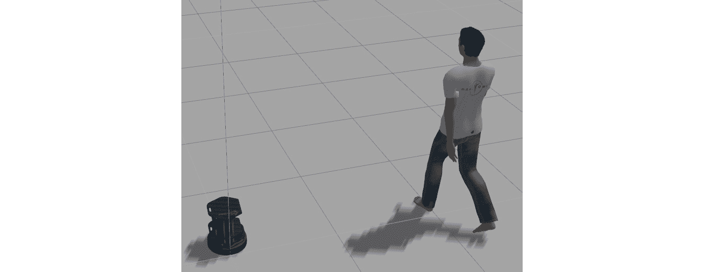

###### 图 9.16：活动的示例情况

第一个节点输出：


###### 图 9.17：第一个活动节点输出

第二个节点输出：


###### 图 9.18：第二个活动节点输出
