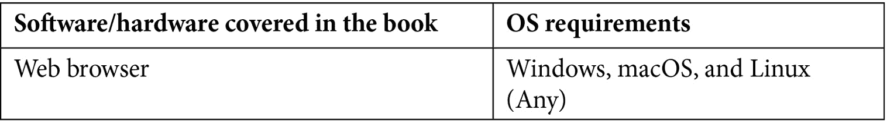

# 前言

深度学习能否普及到每个人？毫无疑问，这是 Google 或 Amazon 等科技巨头提供的云服务所试图实现的目标。Google AutoML 和 Amazon ML 服务是基于云的服务，使所有技术水平的开发者都能轻松使用机器学习技术。AutoKeras 是免费的开源替代方案，正如我们很快将看到的，它是一个非常棒的框架。

面对深度学习问题时，选择架构或配置创建模型时的某些参数，通常来源于数据科学家的直觉，这种直觉是基于多年的学习和经验。

对于我来说，作为一名没有广泛数据科学背景的软件工程师，我一直在寻找方法来自动化这一部分，使用不同的搜索算法（网格搜索、进化算法或贝叶斯方法）来探索构成模型的不同变量。

像许多其他 Python 开发者一样，我开始涉足机器学习世界时使用的是 scikit-learn，后来又转向了 TensorFlow 和 Keras 的深度学习项目，测试了 Hyperas 或 TPOT 等不同框架来自动化模型生成，甚至开发了一个用来在 Keras 模型中探索架构的工具。但一旦 AutoKeras 发布，我发现它满足了我所有的需求，从那时起我便开始使用它并为该项目做出贡献。

AutoKeras 拥有一个日益壮大的社区，并得到了广受欢迎的深度学习框架 Keras 的支持，但除了它的文档和偶尔的博客文章，至今几乎没有关于它的书籍——本书旨在填补这一空白。

本书和框架面向广泛的机器学习专业人士，从寻找云服务替代方案的初学者（仅通过定义输入和输出作为黑盒使用）到希望通过详细定义搜索空间参数并将生成的模型导出到 Keras 进行手动微调的经验丰富的数据科学家。如果你是前者，这些术语和概念可能会让你感到陌生，但不要担心，我们将在全书中详细解释。

# 本书适合人群

本书面向希望将自动化机器学习技术应用于项目的机器学习和深度学习爱好者。为了充分利用本书内容，读者需要具备一定的 Python 编程基础知识。

# 本书涵盖的内容

*第一章*，*自动化机器学习简介*，涵盖了自动化机器学习的主要概念，并概述了各种 AutoML 方法及其软件系统。

*第二章*，*AutoKeras 入门*，涵盖了你开始使用 AutoKeras 所需的所有内容，并通过一个基础且解释清晰的代码示例，帮助你将其付诸实践。

*第三章*，*使用 AutoKeras 自动化机器学习管道*，解释了标准的机器学习管道，讲解了如何使用 AutoKeras 自动化此管道，并描述了在训练模型之前应用的主要数据准备最佳实践。

*第四章*，*使用 AutoKeras 进行图像分类和回归*，专注于将 AutoKeras 应用于图像，通过创建更复杂、更强大的图像识别器，研究它们的工作原理，并演示如何调整它们以提高性能。

*第五章*，*使用 AutoKeras 进行文本分类和回归*，重点介绍了使用 AutoKeras 处理文本（单词序列）。本章还解释了什么是递归神经网络以及它们如何工作。

*第六章*，*使用 AutoKeras 处理结构化数据*，使你能够探索结构化数据集、进行转换，并将其用作特定模型的数据源，还可以创建自己的分类和回归模型来解决基于结构化数据的任务。

*第七章*，*使用 AutoKeras 进行情感分析*，使用文本分类器从文本数据中提取情感，并通过实现情感预测器，实际应用文本分类的概念。

*第八章*，*使用 AutoKeras 进行主题分类*，专注于前几章学习的基于文本的任务的实际应用。它教你如何使用 AutoKeras 创建一个主题分类器，并将其应用于任何主题或类别的数据集。

*第九章*，*处理多模态数据和多任务*，介绍了如何使用 AutoModel API 来处理多模态和多任务数据。

*第十章*，*导出和可视化模型*，教你如何导出和导入 AutoKeras 模型，并图形化展示模型训练过程中的实时变化。

# 要最大限度地发挥本书的价值



**如果你使用的是本书的数字版，我们建议你自己输入代码，或者通过 GitHub 仓库访问代码（链接将在下一节提供）。这样做将帮助你避免与复制和粘贴代码相关的潜在错误。**

# 下载示例代码文件

你可以从 GitHub 下载本书的示例代码文件，地址为[`github.com/PacktPublishing/Automated-Machine-Learning-with-AutoKeras`](https://github.com/PacktPublishing/Automated-Machine-Learning-with-AutoKeras)。如果代码有更新，将在现有的 GitHub 仓库中进行更新。

我们还提供了来自我们丰富书籍和视频目录的其他代码包，您可以在[`github.com/PacktPublishing/`](https://github.com/PacktPublishing/)查看。快来看看吧！

# 下载彩色图片

我们还提供了一个 PDF 文件，其中包含本书中使用的屏幕截图/图表的彩色图片。您可以在这里下载：[`static.packt-cdn.com/downloads/9781800567641_ColorImages.pdf`](https://static.packt-cdn.com/downloads/9781800567641_ColorImages.pdf)。

# 使用的约定

本书中使用了多种文本约定。

`文本中的代码`：表示文本中的代码字、数据库表名、文件夹名称、文件名、文件扩展名、路径名、虚拟 URL、用户输入和 Twitter 用户名。示例："将下载的`WebStorm-10*.dmg`磁盘映像文件挂载为系统中的另一个磁盘"。

一段代码块如下所示：

```py
import autokeras as ak 
import matplotlib.pyplot as plt 
import numpy as np 
import tensorflow as tf 
from tensorflow.keras.datasets import mnist 
```

当我们希望特别指出代码块的某部分时，相关行或项目会以粗体显示：

```py
[default]
exten => s,1,Dial(Zap/1|30)
exten => s,2,Voicemail(u100)
exten => s,102,Voicemail(b100)
exten => i,1,Voicemail(s0)
```

所有命令行输入或输出如下所示：

```py
$ mkdir css
$ cd css
```

**粗体**：表示新术语、重要单词或在屏幕上看到的单词。例如，菜单或对话框中的单词以这种方式出现在文本中。示例："用于训练模型的**训练数据集**和用于测试预测模型的**测试数据集**"。

注意

**笔记本**是由 Jupyter Notebook（https://jupyter.org）生成的文件，Jupyter Notebook 是一个开源框架，用于创建和共享文档，结合了实时代码、可视化和富文本。编辑和执行都在网页浏览器中完成，可以添加代码和富文本片段（称为单元格），清晰、直观地展示所编写的代码。每个代码单元都可以独立运行，开发过程具有互动性，避免在发生错误时需要重新运行所有代码。

# 联系我们

我们欢迎读者的反馈。

**一般反馈**：如果您对本书的任何部分有疑问，请在邮件主题中注明书名，并通过 customercare@packtpub.com 联系我们。

**勘误**：尽管我们已尽力确保内容的准确性，但错误还是会发生。如果您在本书中发现任何错误，我们将非常感谢您向我们报告。请访问[www.packtpub.com/support/errata](http://www.packtpub.com/support/errata)，选择您的书籍，点击勘误提交表单链接，并输入详细信息。

**盗版**：如果您在互联网上遇到我们作品的任何非法副本，请提供其位置地址或网站名称。请通过 copyright@packt.com 联系我们，并附上相关链接。

**如果您有兴趣成为作者**：如果您在某个领域有专业知识并且有意写作或为书籍做出贡献，请访问[authors.packtpub.com](http://authors.packtpub.com)。

# 评论

请留下评论。在您阅读并使用本书之后，为什么不在您购买它的站点上留下评论呢？潜在读者可以看到并参考您的客观意见来做出购买决策，我们在 Packt 也能了解您对我们产品的看法，而我们的作者可以看到您对他们书籍的反馈。谢谢！

欲了解更多关于 Packt 的信息，请访问[packt.com](http://packt.com)。
