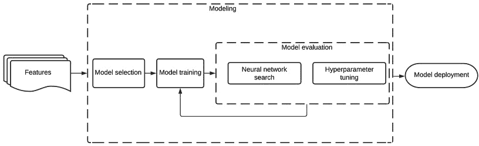

# 第一章：自动化机器学习概述

在本章中，我们将介绍与**自动化机器学习**（**AutoML**）相关的主要概念，并概述不同类型的 AutoML 方法及其软件系统。

如果您是一位从事 AutoML 的开发人员，您将能够利用这本实用指南，在项目中开发和使用最先进的 AI 算法。到本章结束时，您将清楚了解**机器学习**（**ML**）工作流的结构、AutoML 的定义及其不同类型。

通过对基本概念的清晰解释和实际示例，您将看到标准 ML 方法与 AutoML 方法的差异，以及各自的优缺点。

本章将涵盖以下主要内容：

+   标准 ML 工作流的结构

+   什么是 AutoML？

+   AutoML 的类型

# 标准 ML 工作流的结构

在传统的 ML 应用中，专业人员需要使用一组输入数据来训练模型。如果这些数据不符合正确的格式，专家可能需要应用一些数据预处理技术，如特征提取、特征工程或特征选择。

一旦数据准备好并且模型可以进行训练，下一步就是选择合适的算法并优化超参数，以最大化模型预测的准确性。每个步骤都涉及耗时的挑战，并且通常还需要具备经验和知识的数据科学家才能成功完成。下图中，我们可以看到典型 ML 流水线中的主要步骤：

图 1.1 – ML 流水线步骤

每个流水线过程都涉及一系列步骤。在接下来的章节中，我们将更详细地描述每个过程及其相关概念。

## 数据摄取

将传入数据传输到数据存储是任何 ML 工作流中的第一步。这里的目标是将原始数据存储起来，不进行任何转换，以便保留原始数据集的不可变记录。数据可以来自各种数据源，如数据库、消息总线、流等。

## 数据预处理

第二阶段，数据预处理，是流水线中最耗时的任务之一，并涉及许多子任务，如**数据清洗**、**特征提取**、**特征选择**、**特征工程**和**数据分割**。让我们仔细看看每个子任务：

+   **数据清洗**过程负责检测和修复（或删除）数据集中存在的错误或损坏的记录。由于数据是未经处理且无结构的，通常不符合处理的正确形式；这意味着需要填补缺失的字段、删除重复的行，或规范化并修复数据中的其他错误。

+   **特征提取**是通过将多个特征组合成新特征来减少大数据集所需资源的过程，并且可以删除原始特征。分析大数据集时的主要问题是需要考虑的变量数量。处理大量变量通常需要大量硬件资源，如内存和计算能力，并且可能导致过拟合，这意味着算法对训练样本表现很好，但对新样本的泛化能力较差。特征提取基于构建新变量，结合现有变量，解决这些问题，而不会丢失数据的精度。

+   **特征选择**是选择一组变量来用于构建模型的过程。进行特征选择可以简化模型（使其对人类更具可解释性），减少训练时间，并通过减少过拟合来提高泛化能力。应用特征选择方法的主要原因是，数据中可能包含一些冗余或无关的特征，因此删除这些特征不会造成太大的信息损失。

+   **特征工程**是通过数据挖掘技术，利用领域知识从原始数据中提取特征的过程。通常需要一位专业的专家，并且用于提升机器学习算法的性能。

**数据分割**是将数据集划分为两个子集：一个用于训练模型的**训练数据集**和一个用于测试预测模型的**测试数据集**。

建模分为三个部分：

1.  选择候选模型进行评估。

1.  训练所选择的模型（提高其性能）。

1.  评估模型（与其他模型进行比较）。

这个过程是迭代的，涉及测试各种模型，直到找到一种能够高效解决问题的模型。下图展示了 ML 流水线建模阶段的详细框架：

图 1.2 – ML 流水线建模阶段

在概述建模阶段后，让我们更详细地了解每个建模步骤。

让我们更深入地探讨建模的三个部分，以便对它们有更详细的理解。

### 模型选择

在选择候选模型时，除了考虑性能外，还需要考虑几个因素，如可读性（人类可读性）、调试便捷性、可用数据量以及用于训练和预测的硬件限制。

选择模型时需要考虑的主要点如下：

+   **可解释性和调试便捷性**：如何了解模型为什么做出特定决策。我们如何修正错误？

+   **数据集类型**：某些算法更适合特定类型的数据。

+   **数据集大小**：可用数据量是多少？将来是否会发生变化？

+   **资源**：你为训练和预测准备了多少时间和资源？

### 模型训练

这个过程使用训练数据集来为每个选定的候选模型提供数据，让模型通过应用反向传播算法，从训练样本中提取出模式进行学习。

模型通过数据预处理步骤的输出数据进行训练。该数据集被发送到选定的模型，训练完成后，模型配置和学习到的参数将用于模型评估。

### 模型评估

这一步负责使用测试数据集评估模型性能，以衡量预测的准确性。这个过程包括调整和改进模型，生成新的候选模型版本以重新训练。

### 模型调优

这个模型评估步骤包括修改超参数，例如学习率、优化算法或模型特定的架构参数，如神经网络的层数和操作类型。在标准的机器学习中，这些步骤通常需要专家手动执行。

其他时候，评估过的模型会被丢弃，选择另一个新的模型进行训练。通常，通过迁移学习从先前训练的模型开始，能缩短训练时间，并提高最终模型预测的精度。

由于主要瓶颈是训练时间，因此模型的调整应关注效率和可复现性，以便训练尽可能快速，并且其他人能够复现已经采取的步骤来提升性能。

## 模型部署

一旦选定最佳模型，通常通过 API 服务将其投入生产，以便最终用户或其他内部服务使用。

通常，最佳模型会被选择以在两种部署模式之一中部署：

+   **离线**（**异步**）：在这种情况下，模型预测是在定期的批处理过程中计算的，并作为键值数据库存储在数据仓库中。

+   **在线**（**同步**）：在这种模式下，预测是在实时计算中进行的。

部署包括将模型暴露给实际应用。这个应用可以是任何东西，从向流媒体平台的用户推荐视频，到在移动应用上预测天气。

将机器学习模型发布到生产环境是一个复杂的过程，通常涉及多种技术（版本控制、容器化、缓存、热交换、A/B 测试等），且超出了本书的讨论范围。

## 模型监控

一旦进入生产环境，模型会被监控，以查看它在现实世界中的表现，并根据需要进行校准。这个架构表示了持续的模型周期，从数据摄取到部署：

图 1.3 – 模型周期阶段

在接下来的章节中，我们将解释监控生产模型的主要原因。

### 为什么要监控你的模型？

你的模型预测会随着时间的推移而下降。这种现象称为漂移。漂移是输入数据变化的结果，因此随着时间的推移，预测自然会变得更差。

让我们以搜索引擎的用户为例。一个预测模型可以利用用户特征，如个人信息、搜索类型和点击的结果来预测展示哪些广告。但过了一段时间，这些搜索可能不再代表当前的用户行为。

一个可能的解决方案是用最新的数据重新训练模型，但这并不总是可行的，有时甚至可能适得其反。假设用 COVID-19 疫情初期的搜索数据来训练模型，这样只会展示与疫情相关的广告，导致其他产品的销量急剧下降。

对抗漂移的一个更智能的替代方法是监控我们的模型，通过了解发生了什么，我们可以决定何时以及如何重新训练模型。

### 如何监控你的模型？

在有实际值可以及时与预测进行对比的情况下——我的意思是，在做出预测后，你立刻就能得到真实标签——你只需要监控准确率、F1 分数等性能指标。然而，通常预测与真实情况之间会有延迟；例如，在预测邮件是否为垃圾邮件时，用户可能会在邮件创建后的几个月才报告某封邮件为垃圾邮件。在这种情况下，你必须使用基于统计方法的其他度量方法。

对于其他复杂的过程，有时候进行流量/案例拆分并监控纯业务指标会更容易，尤其是在很难考虑经典机器学习评估指标与现实世界实例之间的直接关系的情况下。

### 你应该在模型中监控什么？

任何机器学习管道都涉及性能数据监控。以下是一些可能需要监控的模型变量：

+   **选择的模型**：选择了哪种类型的模型，它的架构类型、优化算法和超参数值是什么？

+   **输入数据分布**：通过将训练数据的分布与输入数据的分布进行比较，我们可以检测出用于训练的数据是否代表了当前真实世界中的情况。

+   **部署日期**：模型发布的日期。

+   **使用的特征**：作为模型输入的变量。有时，生产环境中有一些相关特征，但我们没有在模型中使用它们。

+   **预期与实际**：通过散点图比较预期值和实际值，这通常是最广泛使用的方法。

+   **发布次数**：模型发布的次数，通常用模型版本号表示。

+   **运行时间**：自模型部署以来已经过去多久？

现在我们已经看过管道的不同组件，准备好在下一节介绍主要的 AutoML 概念了。

# 什么是 AutoML？

在建模阶段的主要任务是选择要评估的不同模型，并调整每个模型的不同超参数。数据科学家通常需要花费大量时间并拥有丰富经验才能完成这些工作。从计算角度来看，超参数调优是一个全面的搜索过程，因此可以自动化。

**AutoML**是一个自动化的过程，利用人工智能算法自动执行先前描述的机器学习流程中的每一个步骤，从数据预处理到机器学习模型的部署，使非数据科学家（如软件开发人员）也能使用机器学习技术，而无需该领域的经验。在下图中，我们可以看到 AutoML 系统的输入和输出的简单表示：

图 1.4 – AutoML 的工作原理

AutoML 还能够生成更简单的解决方案，更灵活的概念验证创建，以及无人值守的模型训练，这些模型通常优于手动创建的模型，显著提高模型的预测性能，并使数据科学家能够执行更复杂、难以自动化的任务，例如数据预处理和特征工程，这些任务在*模型监控*部分有定义。在介绍 AutoML 的类型之前，先快速了解一下 AutoML 与传统机器学习的主要区别。

## 与标准方法的区别

在标准的机器学习方法中，数据科学家有一个输入数据集来进行训练。通常，这些原始数据并未准备好供训练算法使用，因此专家必须应用不同的方法，如数据预处理、特征工程和特征提取方法，并通过算法选择和超参数优化来调整模型，以最大化模型的预测性能。

所有这些步骤都耗时且资源密集，是将机器学习（ML）应用到实际中的主要障碍。

通过 AutoML，我们简化了这些步骤，使非专家也能以更简便、更快速的方式应用机器学习解决问题。

既然已经解释了 AutoML 的主要概念，我们可以将其付诸实践。但首先，我们将了解 AutoML 的主要类型以及一些广泛使用的工具来执行 AutoML。

# AutoML 的类型

本章将探讨当前为每种先前列出的 AutoML 类型提供的框架，让您了解目前在 AutoML 方面可以实现的内容。但首先，让我们简要讨论一下端到端机器学习流程，并看看每个过程在该流程中发生的位置。

正如我们在之前的工作流程图中看到的，机器学习流水线涉及比建模更多的步骤，如数据步骤和部署步骤。在本书中，我们将专注于建模的自动化，因为这是一个需要更多时间投入的阶段，正如我们稍后将看到的，AutoKeras，我们将使用的 AutoML 框架，使用了神经架构搜索和超参数优化方法，这两者都应用在建模阶段。

AutoML 试图自动化管道中的每个步骤，但通常需要自动化的主要耗时步骤如下：

+   自动特征工程

+   自动模型选择和超参数调整

+   自动神经网络架构选择

## 自动特征工程

模型使用的特征直接影响机器学习算法的性能。特征工程需要大量时间和人力资源（数据科学家），并涉及大量的试验和错误，以及深入的领域知识。

自动特征工程基于迭代地创建新的特征集，直到机器学习模型达到良好的预测性能。

在标准的特征工程过程中，例如从一个职位搜索网站收集的数据集中，通常数据科学家会创建新的特征（如果数据中还没有），例如以下内容：

+   搜索关键字

+   候选人阅读的职位名称

+   候选人申请频率

+   上次申请以来的时间

+   候选人申请的职位类型

特征工程自动化尝试创建一种算法，该算法可以自动从数据中生成或获取这些类型的特征。

还有一种称为深度学习的专门形式的机器学习，其中特征是通过在模型层上的矩阵变换自动从图像、文本和视频中提取的。

## 自动模型选择和超参数优化

在数据预处理阶段之后，需要搜索一个机器学习算法来训练这些特征，以便能够预测新的观测结果。与前一步骤相比，模型选择有很多可供选择的选项。有分类和回归模型，基于神经网络的模型，聚类模型等等。

每种算法适用于某类问题，通过自动化模型选择，我们可以执行所有适合特定任务的适当模型，并选择最准确的模型。没有一种机器学习算法适用于所有数据集，有些算法需要比其他算法更多的超参数调整。事实上，在模型选择过程中，我们倾向于尝试不同的超参数。

### 什么是超参数？

在模型的训练阶段，有许多变量需要设置。基本上，我们可以将它们分为两类：**参数**和**超参数**。**参数**是在模型训练过程中学习到的，例如神经网络中的权重和偏置，而**超参数**是在训练过程开始前初始化的，例如学习率、丢弃率等。

#### 搜索方法类型

有许多算法可以找到模型的最优超参数。下图突出显示了最著名的几种算法，这些算法也被 AutoKeras 使用：

图 1.5 – 超参数搜索方法路径

让我们更详细地理解这些方法：

+   **网格搜索**：给定一组变量（超参数）和每个变量的值集合，网格搜索执行一种穷尽搜索，测试这些值在变量中的所有可能组合，以根据定义的评估标准（如精度）找到最佳的模型。在一个神经网络中，假设学习率和丢弃率作为超参数进行调整，我们可以将学习率的值集合定义为[0.1, 0.01]，丢弃率的值集合定义为[0.2, 0.5]，因此网格搜索将使用这些组合训练模型：

    (a) *学习率*：0.1，丢弃率=0.2 => 模型版本 1

    (b) *学习率*：0.01，丢弃率=0.2 => 模型版本 2

    (c) *学习率*：0.1，丢弃率=0.5 => 模型版本 3

    (d) *学习率*：0.01，丢弃率=0.5 => 模型版本 4

+   **随机搜索**：这与网格搜索类似，但它以随机顺序运行模型组合的训练。由于其随机探索特性，随机搜索通常比网格搜索便宜。

+   **贝叶斯搜索**：该方法基于贝叶斯定理执行超参数拟合，只探索那些最大化概率函数的组合。

+   **Hyperband**：这是一种新型的随机搜索变体，尝试通过基于老虎机的方法解决探索/利用困境，以进行超参数优化。

## 自动化神经网络架构选择

神经网络架构的设计是机器学习领域最复杂和最繁琐的任务之一。通常，在传统机器学习中，数据科学家会花费大量时间迭代不同的神经网络架构和超参数，以优化模型的目标函数。这既耗时，又需要深厚的知识，有时还容易出错。

在 2010 年代中期，提出了通过使用进化算法和强化学习来设计和寻找最优神经网络架构的想法。这被称为**网络架构搜索**（**NAS**）。基本上，它训练一个模型来创建层，并堆叠这些层以构建一个深度神经网络架构。

一个 NAS 系统包括以下三个主要组件：

+   **搜索空间**：由一组操作块（全连接、卷积等）以及这些操作如何相互连接以形成有效的网络架构组成。传统上，搜索空间的设计由数据科学家完成。

+   **搜索算法**：NAS 搜索算法测试一系列候选网络架构模型。从获得的指标中，它选择表现最好的候选模型。

+   **评估策略**：为了获得成功的结果，需要测试大量的模型，因此该过程在计算上非常昂贵，因此新的方法时常出现，以节省时间或计算资源。

在下一个图中，你可以看到三个描述的组件之间的关系：

图 1.6 – NAS 组件关系

目前，NAS 是一个新兴的研究领域，吸引了大量关注，并且已经发布了若干研究论文：[`www.ml4aad.org/automl/literature-on-neural-architecture-search/`](http://www.ml4aad.org/automl/literature-on-neural-architecture-search/)。以下是一些被引用最多的论文：

+   **NASNet** ([`arxiv.org/abs/1707.07012`](https://arxiv.org/abs/1707.07012)) – *可转移架构的学习用于可扩展图像识别*：基于非常复杂的神经网络（具有大量层）的高精度图像分类模型。NASNet 是一种直接从感兴趣的数据集学习模型架构的方法。由于在数据集非常大的情况下，执行该操作的成本很高，因此它首先在一个小数据集中寻找架构构建模块，然后将该模块转移到更大的数据集上。这种方法是 AutoML 成功应用的一个典范，因为 NASNet 生成的模型通常优于最先进的人工设计模型。在下图中，我们可以看到 NASNet 是如何工作的：

图 1.7 – NAS 概览

+   **AmoebaNet** – *图像分类器架构搜索的正则化进化*：该方法使用进化算法高效地发现高质量的架构。迄今为止，应用于图像分类的进化算法尚未超越人工设计的架构。而 **AmoebaNet-A** 首次超越了这些架构。关键在于通过引入年龄属性来修改选择算法，偏向选择最年轻的基因型。**AmoebaNet-A** 的精度与采用更复杂架构搜索方法发现的最新一代 ImageNet 模型相似，表明进化算法能够在相同硬件上更快地取得结果，特别是在搜索的早期阶段，这在计算资源有限时尤为重要。下图展示了历史上一些代表性的下一代图像分类模型的精度与模型大小之间的相关性。虚线圆圈显示了 **AmoebaNet** 模型的 84.3% 精度：

图 1.8 – 使用 ImageNet 数据集的最先进图像分类模型中，top-1 精度与模型大小之间的相关性

+   **Efficient Neural Architecture Search** (**ENAS**)：该 NASNet 的变种通过允许所有子模型共享权重，避免每个子模型从头开始训练，从而提高了效率。这一优化显著提高了分类性能。

有许多机器学习工具可用，它们的目标都相似，旨在自动化机器学习管道的不同步骤。以下是一些最常用的工具：

+   **AutoKeras**：一个基于深度学习框架 Keras 的 AutoML 系统，采用超参数搜索和神经架构搜索（NAS）。

+   **auto-sklearn**：一个 AutoML 工具包，允许你使用一种特殊类型的 scikit-learn 估算器，自动选择算法和调整超参数，使用贝叶斯优化、元学习和模型集成。

+   **DataRobot**：一个 AI 平台，自动化构建、部署和维护大规模 AI 的端到端过程。

+   **Darwin**：一个 AI 工具，自动化模型生命周期中最慢的步骤，确保模型的长期质量和可扩展性。

+   **H2O-DriverlessAI**：一个 AutoML 的 AI 平台。

+   **Google's AutoML**：一套机器学习产品，使没有机器学习经验的开发人员也能在项目中训练和使用高性能模型。为此，该工具采用了 Google 强大的下一代迁移学习和神经架构搜索技术。

+   **Microsoft Azure AutoML**：此云服务并行创建多个管道，尝试不同的算法和参数。

+   **基于树的管道优化工具** (**TPOT**): 一个 Python 自动化机器学习工具，使用遗传编程优化机器学习管道。

我们可以在论文*《AutoML 方法与工具的评估与比较》*中看到目前存在的主要 AutoML 工具的详尽比较，从中我们可以得出结论，虽然主要的商业解决方案，如 H2O-DriverlessAI、DataRobot 和 Darwin，允许我们检测数据架构、执行特征工程，并分析详细结果以供解释，但开源工具则更多专注于自动化建模任务、训练和模型评估，将数据相关的任务留给数据科学家。

研究还得出结论，在各种评估和基准测试中，AutoKeras 是最稳定和高效的工具，这在生产环境中非常重要，因为在这种环境中，性能和稳定性是关键因素。这些优良特性，加上它是一个广泛使用的工具，是选择 AutoKeras 作为本书编写时所选 AutoML 框架的主要原因。

# 摘要

在本章中，我们定义了 AutoML 的目的和好处，从描述 ML 管道的不同阶段到详细说明超参数优化和神经架构搜索的算法类型。

现在我们已经了解了 AutoML 的主要概念，准备进入下一章，您将在那里学习如何安装 AutoKeras，如何使用它训练一个简单的网络，并随着学习更复杂的技术，训练更高级的模型。

# 进一步阅读

+   贝叶斯定理: [`towardsdatascience.com/bayes-theorem-the-holy-grail-of-data-science-55d93315defb`](https://towardsdatascience.com/bayes-theorem-the-holy-grail-of-data-science-55d93315defb)

+   探索与利用的困境: [`towardsdatascience.com/intuition-exploration-vs-exploitation-c645a1d37c7a`](https://towardsdatascience.com/intuition-exploration-vs-exploitation-c645a1d37c7a)

+   多臂赌博机: [`homes.di.unimi.it/~cesabian/Pubblicazioni/ml-02.pdf`](https://homes.di.unimi.it/~cesabian/Pubblicazioni/ml-02.pdf)

+   AmoebaNet: [`arxiv.org/abs/1802.01548`](https://arxiv.org/abs/1802.01548)

+   ENAS: [`arxiv.org/abs/1802.03268`](https://arxiv.org/abs/1802.03268)

+   AutoML 方法与工具的评估与比较: [`arxiv.org/pdf/1908.05557.pdf`](https://arxiv.org/pdf/1908.05557.pdf)
