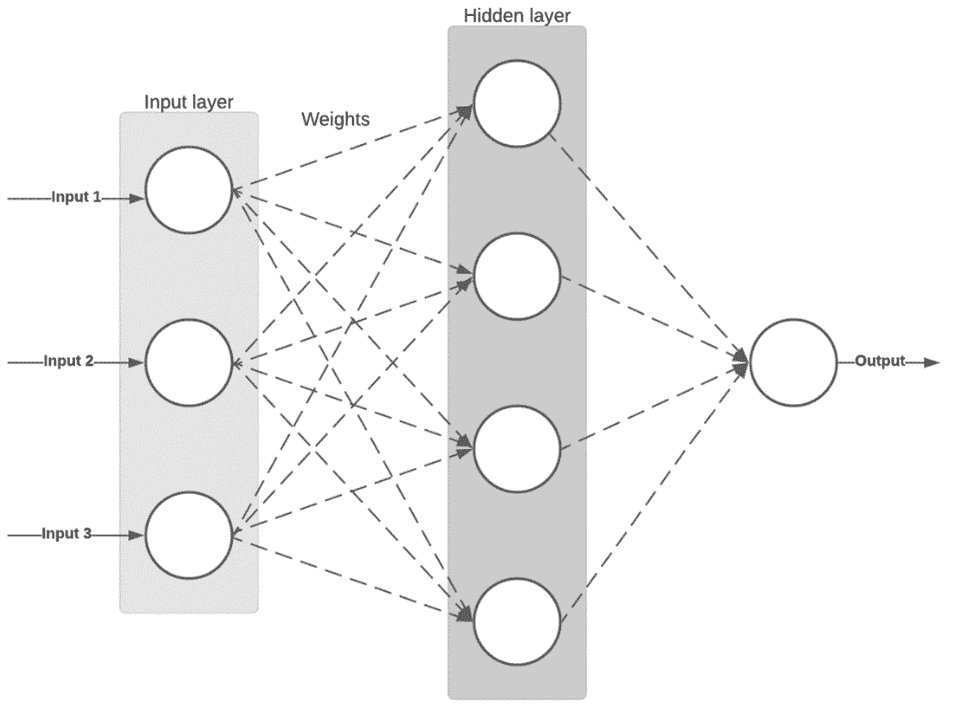
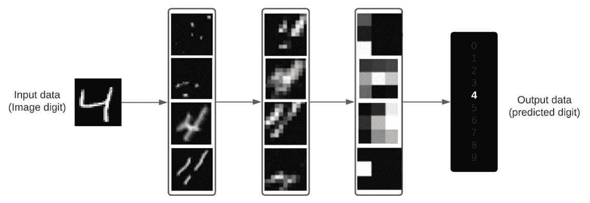

# 第二章：开始使用 AutoKeras

在这一章中，我们将介绍你需要了解的一切，以便开始使用**AutoKeras**并通过一个基础且讲解充分的代码示例将其付诸实践。在本章结束时，你将知道如何用几行代码创建一个简单的手写数字分类器，数据来源于广为人知的**修改版国家标准与技术研究所**（**MNIST**）数据集。

正如我们在上一章看到的那样，**深度学习**（**DL**）自动化能够加快训练时间，并且通过将人力资源（数据科学家）分配到其他不太可能被自动化的管道流程中，获得更多好处。

为了实现这一自动化，我们选择了 AutoKeras。它是一个基于**Keras**的**机器学习**（**ML**）自动化框架，**Keras**是一个广为人知的基于**TensorFlow**的神经网络库，提供了构建深度学习模型的高级模块。

接下来，我们将介绍如何安装 AutoKeras，并通过一个实际示例将其投入使用，但首先我们将解释一些相关概念，解答以下问题：

+   什么是深度学习？

+   什么是神经网络，它是如何学习的？

+   深度学习模型是如何学习的？

+   为什么选择 AutoKeras？

+   安装 AutoKeras

+   Hello MNIST：实现我们的第一个 AutoKeras 实验

# 技术要求

本书中的所有编码示例都可以作为 Jupyter Notebook 下载，下载地址为：[`github.com/PacktPublishing/Automated-Machine-Learning-with-AutoKeras`](https://github.com/PacktPublishing/Automated-Machine-Learning-with-AutoKeras)。

Jupyter Notebook 提供了一个基于 Python 的环境，可以将代码开发成一系列的步骤，称为单元格。该笔记本还提供了灵活性，可以通过在单元格中执行基于 Linux 的命令来即时安装库/依赖项。

所以，为了运行本章中的编码示例，你只需要一台安装了 Jupyter 的计算机。例如，在 Ubuntu/Linux 中，你可以使用以下命令安装：

```py
$ apt-get install python3-pip jupyter-notebook
```

上一个命令将安装 Jupyter Notebook 包及其所有依赖项。

你还可以查看*在 Ubuntu Linux 工作站上安装 AutoKeras*部分，了解更多详细信息。

另外，你也可以使用 Google Colaboratory 运行这些笔记本，在这种情况下，你只需要一个网页浏览器。更多详情请见*在 Google Colaboratory 上使用 AutoKeras*部分。

# 什么是深度学习？

深度学习（DL）是机器学习（ML）的一种子类别，通过实现一系列层来从数据中提取模式，这些层负责提取相关特征。这些模式通过称为神经网络的机器学习模型进行学习（灵感来源于我们的大脑神经元），并按层叠加的方式组织在一起。那么，什么是层呢？层是一组称为*单元*的节点，它们通过处理输入并生成输出来执行操作。这种操作可以是无状态的，但通常它会有一个状态，这个状态保存在一个浮动数值数组中，称为*权重*。

让我们来看一个多层深度神经网络识别单个数字图像，如下所示：


图 2.1 – 用于数字分类的神经网络层的视觉表示

我们可以把网络看作是一个有多个过滤器的漏斗，其中每一层相当于一个过滤器，逐步减少杂质，直到获得期望的结果。

深度学习在许多领域有着广泛的应用，如计算机视觉、**自然语言处理**（**NLP**）、信号处理等，因此本书中解释的技术可以应用于解决多个学科中的问题。

现在我们来简要解释一下神经网络以及学习是如何进行的。

# 什么是神经网络，它是如何学习的？

正如我们之前所说，神经网络是由一系列相互连接的层组成的。每一层包含一组节点，每个节点都有一个相关的权重。神经网络的学习就是通过适当地修改这些权重，使得模型能够做出准确的预测。在下面的图中，我们可以看到一个简单的两层网络：



图 2.2 – 两层神经网络的视觉表示

前面图中的每一个圆圈都是一个人工神经元，它不过是受生物神经元工作方式启发的数学函数。这些人工神经元是人工神经网络中的基本单元，其工作原理是接收一个或多个输入（数值），并将其乘以一个因子或权重，然后将结果相加生成输出值。

这些模型虽然简单，但非常强大，因为它们可以通过一组已定义输入和输出的数据，学习预测我们不知道输出的新数据。例如，如果我们用一系列输入变量（如面积、位置等）训练神经网络来预测房价，网络就能够根据这些变量预测新房屋的价格。

介绍了深度学习模型的主要概念后，接下来让我们看看这些模型是如何学习的。

# 深度学习模型是如何学习的？

让我们来看一个多层深度神经网络识别单个数字图像，如下所示：



图 2.3 – 用于数字分类的神经网络层内容渲染

如前面的图所示，网络从数字图像中提取模式。在每一层中，它获得不同的表示，因此每一层专注于图像的某些特征，为识别其所属类别提供了必要的线索。

这基本上是深度学习（DL），一种从数据中学习模式的多阶段技术。它基于一个非常简单的概念，但通过调整它并将其扩展到足够高的水平，你可以做出惊人的预测。

现在让我们来看看为什么 AutoKeras 是我们首选的**自动化机器学习**（**AutoML**）工具。

# 为什么选择 AutoKeras？

正如我们在前一章所解释的，AutoKeras 是一个开源的 AutoML 框架，允许非机器学习专家以简单的方式创建高性能模型。虽然有类似的工具具有相同的目标，但 AutoKeras 专注于深度学习（DL）。虽然它不是唯一的解决方案，还有许多可用的 AutoML 服务，但大多数是云计算平台（例如亚马逊、谷歌、**国际商业机器公司**（**IBM**）），并且有一些显著的缺点，下面将详细说明：

+   机器学习云平台价格昂贵；通常你会有一个带免费额度的试用期，但如果你想定期使用它们，就需要每月支付账单。

+   根据云平台的不同，其中一些平台配置和扩展较为困难，有时需要你具备容器和集群的知识。

+   它们通常提供简单易用，但灵活性较差的现成解决方案。

由于 AutoKeras 基于开源模型，它解决了这些问题，因为你可以查看源代码、安装它并在本地免费运行。

AutoKeras 基于以下四个主要特性，简化了安装和使用：

+   它有一个基于 Keras API 的清晰直观的**应用程序编程接口**（**API**）。没有编程经验的用户也能轻松学习如何使用它，但它也允许高级用户调整较低级的系统参数。

+   它可以在本地和云端都能工作。

+   它基于动态配置，根据本地系统中可用的**图形处理单元**（**GPU**）内存调整神经网络架构的大小。

+   它由开源社区积极开发和维护。

让我们通过一个实际例子，使用 AutoKeras 创建一个简单的分类器来预测手写数字。但首先，我们需要配置一个工作环境，并在其上安装 AutoKeras 及其必要的依赖项。

## 如何运行 AutoKeras 实验？

作为本书中实现所有编码示例的主要工具，我们将使用 Jupyter notebook。

注意

**笔记本**是由 Jupyter Notebook（[`jupyter.org`](https://jupyter.org)）生成的文件，Jupyter Notebook 是一个开源框架，用于创建和共享集成实时代码、可视化和富文本的文档。编辑和执行都在网页浏览器中进行，添加代码片段（称为单元格）和富文本，清晰直观地展示我们正在编写的内容。每个代码单元格都可以独立运行，使开发过程更具互动性，避免了在出现错误时必须运行所有代码。

在以下截图中，你可以看到如何通过点击工具栏上的 **运行** 按钮，在网页浏览器中运行我们的实验（notebook 文件）：


图 2.4 – 仅运行训练单元的 Jupyter notebook，在 AutoKeras 实验中

使用 Jupyter notebook 是开始使用 AutoKeras 的好方法，但不是唯一的方法；你还可以创建独立的 Python 脚本并通过命令行或你自己的 **集成开发环境** (**IDE**) 运行它们。

# 安装 AutoKeras

在接下来的章节中，我们将详细解释安装 AutoKeras 的不同选项，以及如何一步一步配置每个选项。

安装 AutoKeras 时有两个选项：我们可以将其安装在本地工作站，或者将其安装在云端。我们将在本章中分析这两种选择的优缺点。

## 在云端安装 AutoKeras

在云端，我们选择了两种方案：将其安装在 **亚马逊 Web 服务** (**AWS**) 实例/容器中，或者使用 **Google Colaboratory**。在这两种情况下，我们将通过网页浏览器的 Jupyter notebook 连接到云实例，正如以下截图所示。我们只需要一台可以联网的计算机来运行这些 notebook：


](img/B16953_02_05.jpg)

图 2.5 – AutoKeras 云端配置

让我们更详细地了解云端的选项。

### 使用 Google Colaboratory 的 AutoKeras

Google 提供了一项名为 **Colaboratory** 的 Jupyter notebook 托管服务，你可以上传自己的 Jupyter notebook，并在 Google 的云服务器上运行它们，利用 Google 硬件（GPU 或 **张量处理单元** (**TPU**)) 的计算能力，无论你的工作站性能如何。你只需要一个网页浏览器。正如我们之前所说，notebook 可以安装其自身的依赖项，因此在运行 notebook 时可以完成 AutoKeras 的安装（就像我们在本书中的 notebook 操作一样）。

你只需按照以下三个步骤，即可运行我们的 MNIST notebook：

1.  在 [`colab.research.google.com`](https://colab.research.google.com) 创建一个帐户。

1.  在 Colaboratory 中，通过此链接打开 GitHub 上的实验：[`colab.research.google.com/github/PacktPublishing/Automated-Machine-Learning-with-AutoKeras/blob/main/Chapter02/Chapter2.ipynb`](https://colab.research.google.com/github/PacktPublishing/Automated-Machine-Learning-with-AutoKeras/blob/main/Chapter02/Chapter2.ipynb)。

1.  点击 **运行** 按钮以开始安装 AutoKeras 并运行实验。

    在以下截图中，你可以看到 Colaboratory 正在运行我们的实验：


图 2.6 – 在 Google Colaboratory 中运行的 AutoKeras

所以，Google Colaboratory 是一个非常好的选择，可以快速轻松地探索和运行你的笔记本，但接下来，我们也将详细解释如何安装 Jupyter 笔记本，以及必要的依赖项，以便在 AWS 实例或你自己的工作站中运行我们的笔记本。

### AWS 中的 AutoKeras

基本上，我们需要确保创建一个支持 GPU 的 Amazon EC2 Ubuntu/Linux 实例，并且安装了**计算统一设备架构**（**CUDA**）库。因为 AutoKeras 将在我们的 Jupyter 笔记本运行时安装，所以我们只需安装 Jupyter 框架并在其中运行笔记本。以下截图展示了在 AWS 实例中安装 AutoKeras 的客户端和服务器端：


图 2.7 – AutoKeras 在 AWS 实例中运行

AWS 有许多实例，其中一些已经预装了 CUDA 和 Jupyter 库，并且其端口已映射，可以从浏览器访问。它们的配置超出了本书的范围，但在[`docs.aws.amazon.com/dlami/`](https://docs.aws.amazon.com/dlami/)上有关于如何设置 DL **Amazon Machine Images**（**AMIs**）的详细信息，这些映像允许你在 Amazon Linux 或 Ubuntu 上快速构建带有最流行 DL 框架的 Amazon **Elastic Compute Cloud**（**EC2**）实例。

如果你更喜欢使用容器而不是实例，你也可以选择运行**AWS DL Containers**（**AWS DL Containers**），这是一种类似于之前 AMIs 的 Docker 镜像，预装了 DL 软件。了解更多信息，请访问[`aws.amazon.com/machine-learning/containers/`](https://aws.amazon.com/machine-learning/containers/)。

### 云中的 AutoKeras：优缺点

如果你没有强大的 GPU，云计算是一个很好的且廉价的选择，可以在不购买额外硬件的情况下入门。

云服务使得开始使用 AutoKeras 变得容易；你可以从头开始在 AWS 实例中设置它，将你的实验上传到像 Google Colaboratory 这样的云服务([colab.research.google.com](http://colab.research.google.com))，或者使用 AutoKeras 扩展在远程服务器上运行训练。在书的结尾，我们将看到一个叫做 TensorFlow Cloud 的扩展，它可以让你只需插入几行代码，就能在**Google Cloud Platform**（**GCP**）上运行你的程序，轻松利用这个云平台的计算能力。

但对于更密集的 DL 使用，这种配置从长远来看并不是最合适的选择。云实例或服务是昂贵的，如果你需要训练一个模型超过几个小时，投资一台配备一个或多个 GPU 的本地工作站是值得的。

另一方面，如果你需要大规模的按需配置，建立自己的服务器集群需要高昂的人力和硬件资源成本，且比云计算替代方案更难扩展和维护。

在这张截图中，你可以看到云端与本地之间的主要差异：


图 2.8 – 云端与本地的 AutoKeras 成本比较

简而言之，在云端运行 AutoKeras 是一个非常好的起步方式。你可以按照本书中的代码示例，利用 Google Colaboratory 等云工具的强大功能，获得前沿的预测结果，但如果你计划运行自己的实验，并进行几天甚至几周的训练，最好还是购买自己的 GPU。

## 在本地安装 AutoKeras

如果你已经拥有自己的硬件资源，现在是时候安装软件来运行你的模型了。接下来的选项将指导你完成这一过程。

### 选择操作系统

当选择操作系统来运行 AutoKeras 时，Linux 无疑是最适合你的工作站和云端的选择。

虽然可以在 Windows 中使用 AutoKeras，但不推荐这样做。

更具体地说，理想的选择是 Ubuntu Linux 机器，因为它有丰富的包可供使用，并且是机器学习社区最常用的系统。如果你使用 Windows，最简单快速的解决方案是通过双启动安装 Ubuntu，按照此链接中的说明操作：[`help.ubuntu.com/community/WindowsDualBoot`](https://help.ubuntu.com/community/WindowsDualBoot)。

你还可以使用 AutoKeras 的 Docker 镜像，但根据你的硬件配置，这有时会导致无法访问 GPU 的问题。

### 在 Ubuntu Linux 工作站上安装 AutoKeras

一旦你在工作站上安装了 Ubuntu，你可以按照以下步骤安装 AutoKeras 并运行本书附带的笔记本文件：

1.  打开终端并运行这些命令来安装 Jupyter 笔记本：

    ```py
    $ apt-get install python3-pip jupyter-notebook
    ```

1.  运行此命令启动笔记本：

    ```py
    $ jupyter-notebook
    ```

1.  现在，在浏览器中访问`http://127.0.0.1:8888`并打开笔记本文件。

1.  在顶部菜单中，选择**Runtime** -> **Run All**来运行实验。AutoKeras 及其依赖项将在运行其余代码之前安装。

    重要提示

    **GPU 设置（可选）**：如果你在工作站上有 GPU，并且希望 AutoKeras 使用它们加速训练，你可以按照此教程进行设置：

    [`www.tensorflow.org/install/gpu`](https://www.tensorflow.org/install/gpu)

请记住，AutoKeras 仍在不断发展中，并且变化很快，安装过程可能会有所调整。因此，我建议你查看最新的安装说明，网址是[`autokeras.com/install/`](https://autokeras.com/install/)。

通过 Docker 容器运行 AutoKeras。开始使用 TensorFlow 和 Keras 的最简单方式是通过 Docker 容器运行。

**Docker** 是一套工具，允许你以名为容器的软件包形式安装软件，利用操作系统级的虚拟化。每个容器表现得像一个独立的操作系统，拥有自己的软件、库和配置文件，并且这些容器彼此隔离。创建 Docker 容器的过程包括三个步骤，如下所示：

1.  首先，在名为 **Dockerfile** 的文件中定义一个 Docker 容器。

1.  然后，使用 Docker 命令行工具，你可以从这个 Dockerfile 构建一个镜像。

1.  最后，你可以从这个镜像启动 Docker 容器。

你可以在以下图示中看到这三个步骤：


图 2.9 – 从 Dockerfile 构建容器

Docker 镜像有一个公共的存储库，叫做 Docker Hub（[`hub.docker.com/`](https://hub.docker.com/)）。在这里，你可以找到成千上万的预安装软件包的 Docker 镜像。

你可以使用 AutoKeras 的 Docker 镜像，其中已安装最新版本的框架及其依赖项，步骤如下：

1.  按如下方式将最新的 AutoKeras Docker 镜像下载到你的机器上：

    ```py
    $ docker pull haifengjin/autokeras:latest
    ```

1.  按如下方式运行 AutoKeras Docker 容器：

    ```py
     $ docker run -it --shm-size 2G  haifengjin /autokeras /bin/bash.
    ```

    如果你需要更多内存，只需更改 `shm-size` 的值。

1.  按如下方式在容器内运行本地 Python 脚本：

```py
$ docker run -it -v hostDir:/app --shm-size 2G  haifengjin /autokeras python file.py. 
```

请注意，我们已经挂载了 `hostDir:/app` 主机文件夹，该文件夹中包含要执行的 Python 文件。

你也可以安装 Jupyter notebook 并从 notebook 实验中运行 AutoKeras 安装过程，正如我们在前一节中所做的那样。

# Hello MNIST：实现我们的第一个 AutoKeras 实验

我们的第一个实验将是使用 MNIST 数据集的图像分类器。这个 MNIST 分类任务就像是深度学习的 *"hello world"*。它是一个经典的将手写数字图像分类为 10 类（0 到 9）的任务。这些图像来自 MNIST，它是机器学习中最著名且被广泛使用的数据集。它包含了 70,000 张图像（其中 60,000 张用于训练，10,000 张用于测试），这些图像是 1980 年代由 NIST 收集的。

在下一张截图中，你可以看到 MNIST 数据集中每个数字的一些样本：


图 2.10 – MNIST 数据集样本图像

AutoKeras 旨在轻松分类各种类型的数据输入——例如结构化数据、文本或图像——因为每种数据都包含一个特定的类别。

对于这个任务，我们将使用 `ImageClassifier`。这个类会生成并测试不同的模型和超参数，返回一个最优分类器，用于分类手写数字图像。

现在，让我们详细查看 notebook 中最相关的单元格。

## 导入所需的包

按如下方式加载 AutoKeras 和所需的包，比如 matplotlib：

```py
import autokeras as ak
import matplotlib.pyplot as plt
import numpy as np
import tensorflow as tf
from tensorflow.keras.datasets import mnist
```

前面提到的包中包括了一个绘图库，我们已使用它来绘制一些数字表示，所使用的数据集是 MNIST 手写数字数据集。

## 获取 MNIST 数据集

我们首先需要将 MNIST 数据加载到内存中，并快速查看数据集的形状。为此，我们运行以下代码：

```py
(x_train, y_train), (x_test, y_test) = mnist.load_data()
print(x_train.shape)
print(x_test.shape)
```

以下输出将会显示：

```py
Downloading data from https://storage.googleapis.com/tensorflow/tf-keras-datasets/mnist.npz
11493376/11490434 [==============================] - 0s 0us/step
(60000, 28, 28)
(10000, 28, 28)
```

从前面的输出中，我们可以看到每个数据集包含`28x28`像素大小的图像。

现在，让我们通过运行以下代码来看看一个数字长什么样：

```py
%matplotlib inline
fig = plt.figure()
ax = fig.add_subplot(1, 2, 1)
plt.imshow(x_train[1234])
ax.set_title('Train sample')
ax = fig.add_subplot(1, 2, 2)
plt.imshow(x_test[1234])
ax.set_title('Test sample')
plt.show()
```

以下输出将会显示：


图 2.11 – 训练和测试样本可视化

一旦我们查看了数据集的一些样本，就可以看看它们的分布情况。

## 数字是如何分布的？

当我们处理数据集时，非常重要的一点是检查数据是否均匀分布。通过使用`numpy`函数可以轻松完成这项工作，如以下代码块所示：

```py
train_histogram = np.histogram(y_train)
test_histogram = np.histogram(y_test)
_, axs = plt.subplots(1, 2)
axs[0].set_xticks(range(10))
axs[0].bar(range(10), train_histogram[0])
axs[1].set_xticks(range(10))
axs[1].bar(range(10), test_histogram[0])
plt.show()
```

以下输出将会显示：


图 2.12 – 训练和测试数据集直方图

数据似乎是均匀分布的——每组数字的样本数量相似，因此现在是时候创建我们的模型了。

## 创建图像分类器

我们现在将使用 AutoKeras 的`ImageClassifier`类来找到最佳的分类模型。仅仅为了这个小例子，我们将`max_trials`（最大尝试的不同 Keras 模型数量）设置为 1，并将训练每个模型的 epoch 数量设置为 20，但对于实际使用，建议设置较大的尝试次数，并且不要设置`epochs`参数，以便自动使用自适应的 epoch 数量。代码如下所示：

```py
clf = ak.ImageClassifier(max_trials=1)
```

让我们运行训练，寻找适合 MNIST 训练数据集的最佳分类器，步骤如下：

```py
clf.fit(x_train, y_train, epochs=10)
```

以下输出将会显示：


图 2.13 – 图像分类器训练的笔记本输出

在前面的输出中，我们可以看到模型在几分钟内就达到了相当不错的训练数据集准确率。我们还可以看到最佳生成的模型已保存到磁盘。

我们还可以看到精度在每个*epoch*中增加，因此如果我们增加*epoch*的数量，模型会更精确，尽管也会花费更长时间完成。还需要注意的是，在经过大量的 epoch 后，模型通常会停止学习。

让我们使用测试数据集进行测试，以了解预测的实际准确率。

## 使用测试集评估模型

训练完成后，是时候使用保留的测试数据集来测量模型的实际预测结果。通过这种方式，我们可以排除训练集上获得的良好结果是由于过拟合导致的。看看以下代码片段：

```py
metrics = clf.evaluate(x_test, y_test)
print(metrics)
```

以下输出将会显示：

```py
313/313 [==============================] - 1s 4ms/step - loss: 0.0354 - accuracy: 0.9889
[0.03537507727742195, 0.9889000058174133]
```

我们可以看到，使用我们的测试数据集，预测准确率非常高（98.8%），考虑到我们在训练阶段只花了几分钟时间。

让我们来看看它是如何预测单个测试样本的。首先，我们可视化数字及其真实值，如下所示：

```py
plt.imshow(x_test[1234])
plt.title('Test sample of number: %s' % y_test[1234])
plt.show()
```

以下输出将被显示：


图 2.14 – 待预测的测试样本

现在，我们使用我们的分类器打印预测值，如下所示：

```py
print(clf.predict(x_test[1234, None]))
```

以下输出将被显示：

```py
[['8']]
```

我们可以看到，输出与真实值匹配，因此我们的分类器预测是正确的。现在，让我们深入了解分类器，理解它是如何工作的。

## 可视化模型

我们现在将我们的分类器模型导出到 Keras，这样我们可以看到一些摘要信息，包括找到的最佳生成模型的架构。以下是我们需要做的代码：

```py
model = clf.export_model()
model.summary()
```

以下输出将被显示：


图 2.15 – 图像分类模型架构总结

如果你没有 Keras 或 Tensorflow 的经验，输出可能会有些令人困惑，但别担心——要使用 AutoKeras 并不需要理解这些细节，因为工具会做所有的工作，将我们从这些细节中抽象出来。不过，了解它是如何工作的总是有益的。在后续章节中，我们将详细了解每一层的含义，但现在让我们先看看这里发生了什么。

每一层执行对输入数据的变换操作，将变换后的数据传递给下一层。

第一层有一个 28x28 的输入，对应图像的像素，如下所示的代码片段：

```py
input_1 (InputLayer)         [(None, 28, 28)]        0       
```

以下树状层对图像进行变换和归一化，以适应卷积操作（Conv2D）的输入：

```py
tf_op_layer_Cast (TensorFlow (None, 28, 28)          0      
____________________________________________________________
tf_op_layer_ExpandDims (Tens (None, 28, 28, 1)       0      
_____________________________________________________________
normalization (Normalization (None, 28, 28, 1)       3       
```

卷积操作层广泛应用于图像分类，它通过使用滤波器提取图像的特征（我们将在后面的章节中讨论这一点）。我们可以在以下片段中看到这个过程：

```py
conv2d (Conv2D)              (None, 26, 26, 32)      320     
_____________________________________________________________
conv2d_1 (Conv2D)            (None, 24, 24, 64)      18496   
_____________________________________________________________
max_pooling2d (MaxPooling2D) (None, 12, 12, 64)      0       
```

随后，出现了多个层，防止过拟合，通过执行 dropout（随机断开部分神经连接），具体如下：

```py
dropout (Dropout)            (None, 12, 12, 64)      0      
____________________________________________________________
flatten (Flatten)            (None, 9216)            0       
____________________________________________________________
dropout_1 (Dropout)          (None, 9216)            0       
```

然后，执行全连接操作，将卷积操作的输出维度缩减为 10 个元素，这些元素对应从 0 到 9 的数字，具体如下：

```py
dense (Dense)                (None, 10)              92170   
```

最后一层（Softmax）只保留 10 个元素中最高的值，这个值将对应最终预测的数字，具体如下：

```py
classification_head_1 (Softm (None, 10)              0  
```

有一种更具图形化的方式来可视化模型，让我们通过运行以下代码来查看：

```py
from tensorflow.keras.utils import plot_model
plot_model(clf.export_model())
```

以下输出将被显示：

![图 2.16 – 图像分类模型架构可视化]

](img/B16953_02_16.jpg)

图 2.16 – 图像分类模型架构可视化

在上述图中，每个块代表一个层，每个层的输出连接到下一个层的输入，除了第一个块（其输入是图像）和最后一个块（其输出是预测值）。

## 创建图像回归器

现在，我们将使用不同的方法来从图像中找出数字值：一个称为回归器的回归模型。

图像回归器将尝试预测数字的标量值，而不是将其分类为 0-9 类别。

AutoKeras 已经有一个准备好使用的特殊类称为 `ImageRegressor`，它将找到最佳的回归模型。

就像我们对分类器所做的那样，对于这个小例子，我们将 `max_trials`（尝试的不同 Keras 模型的最大数量）设置为 1，并将每个模型训练的时期数设置为 20，但是对于实际使用，建议设置一个较大的试验数，并且不设置 `epochs` 参数以自动使用自适应数量的 epochs。

首先，我们初始化图像回归器，如下所示：

```py
reg = ak.ImageRegressor(
overwrite=True,
max_trials=1)
```

现在，使用训练数据集来喂养图像回归器，如下所示。

```py
reg.fit(x_train, y_train, epochs=20)
```

现在是真相的时刻——让我们用我们的测试集来评估它。

## 使用测试集评估模型

最后，我们使用以下代码评估最佳模型与测试数据集：

```py
reg.evaluate(x_test, y_test)
```

将显示以下输出：


图 2.17 – 图像回归器训练的笔记本输出

在 20 分钟后，找到的最佳模型具有 `0.083` 的值，这并不差。均方误差（MSE）是衡量回归模型性能的广泛使用的度量标准。

让我们使用找到的最佳模型预测测试数据集的前 10 个数字，并打印预测值和真实值以进行比较。我们可以通过运行以下代码来实现：

```py
predicted_y = reg.predict(x_test[:10])
print(list(y_test[:10]))
print([round(float(i)) for i in predicted_y])
```

将显示以下输出：

```py
[7, 2, 1, 0, 4, 1, 4, 8, 5, 9]
[7, 2, 1, 0, 4, 1, 4, 8, 5, 9]
```

正如您所看到的，它在每一个案例中都预测了真实值。让我们通过运行以下代码以更加图形化地看待它：

```py
fig = plt.figure()
for i, v in enumerate(predicted_y):
    ax = fig.add_subplot(2, 5, i+1)
    ax.set_axis_off()
    ax.set_title(round(float(v)))
    plt.imshow(x_test[i])
plt.show()
```

将显示以下输出：


图 2.18 – 图像数字标签与预测值

请注意，我们已经将回归器返回的浮点值四舍五入以与真实值进行比较。这是因为回归器总是返回接近实际值的连续值，所以如果我们想要预测离散值（0 到 9 的数字），我们必须进行四舍五入以返回预测值。

现在，就像我们对分类器所做的那样，让我们来看看生成的最佳模型的架构。

## 可视化模型

我们将模型导出为 Keras 模型，然后调用 `model.summary` 函数来查看架构，如下所示：

```py
model = clf.export_model()
model.summary()
```

将显示以下输出：


图 2.19 – 图像回归模型架构摘要

就像我们对分类器所做的那样，有一种更加直观的方式来看待它，如下所示：

```py
from tensorflow.keras.utils import plot_model
plot_model(clf.export_model())
```

以下输出将会显示：


图 2.20 – 图像回归模型架构可视化

在这个分类器的示例中，我们简要展示了每个模块的概况。我们不会在这里深入讲解，因为我认为这对于“入门”章节已经足够。在接下来的章节中，我们将更详细地解释截图中出现的每个模块。

# 总结

在本章中，你已经学习了如何使用 AutoKeras 的主要选项，从安装到在不同环境中的运行。

你也已经看到了 AutoKeras 的强大功能，通过仅用几行代码和 2 分钟的训练，成功实现了两种高精度图像分类器的方法。

现在你已经学会了从头实现一个深度学习模型，只需要按照相同的步骤并简单地更换数据集，你的模型就能够分类各种图像。

在接下来的章节中，你将学习如何解决与图像、结构化数据和纯文本等输入数据源相关的更复杂任务。但在此之前，在下一章，我们将介绍如何使用一些有趣的工具来准备数据，以尽可能自动化地将其输入到 AutoKeras。
