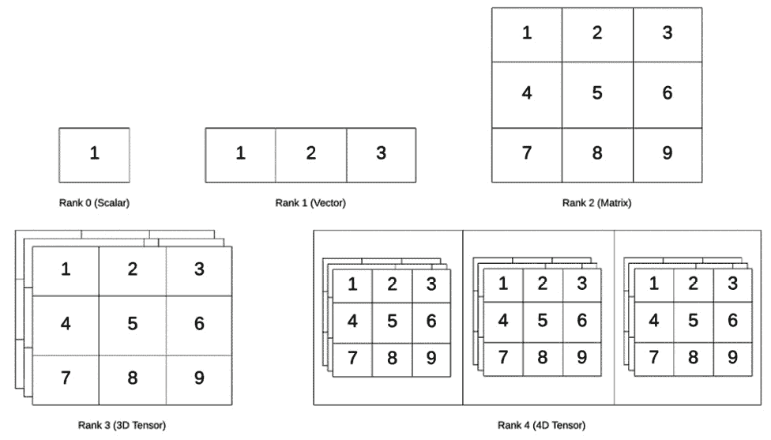
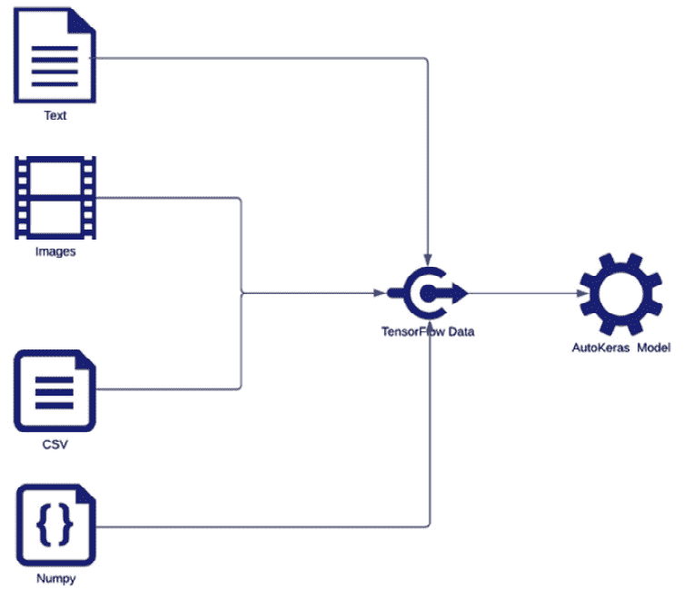
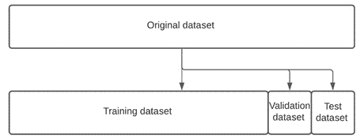

# 第三章：*第三章*：使用 AutoKeras 自动化机器学习管道

自动化机器学习管道涉及自动化一系列过程，如**数据探索**、**数据预处理**、**特征工程**、**算法选择**、**模型训练**和**超参数调整**。

本章将解释标准机器学习管道以及如何使用**AutoKeras**自动化其中的一些步骤。我们还将描述训练模型之前需要应用的主要数据准备最佳实践。数据准备后的步骤由 AutoKeras 执行，我们将在后面的章节中深入了解这些步骤。

正如我们在第一章中看到的，AutoKeras 可以通过应用超参数优化和**神经架构搜索**（**NAS**）来自动化所有管道建模步骤，但在这些步骤之前，某些数据预处理仍需手动完成或使用其他工具。

我们将解释模型所期望的数据表示形式，以及 AutoKeras 应用的基本预处理技术。在本章结束时，您将学到适合且最佳的方式来为模型提供数据的主要格式和技术。

本章将涵盖以下主要主题：

+   理解张量

+   为深度学习模型准备数据

+   以多种格式将数据加载到 AutoKeras 中

+   将数据集分割用于训练和评估

在本章中，我们将介绍一些基本的预处理技术，以及如何使用 AutoKeras 助手来应用它们，但首先，让我们解释一下模型所期望的数据结构是什么以及它们是如何表示的。

# 理解张量

在 MNIST 示例中，数字图像被存储在 NumPy 矩阵中，也叫张量。这些张量是机器学习模型的基本数据结构。现在我们已经知道了模型所需的输入，让我们更深入地了解张量是什么以及它们的不同类型。

## 什么是张量？

张量基本上是一个多维数组，通常是 N 维的浮动点数（也叫做*轴*）。

张量由三个关键属性定义：轴的数量或秩、每个轴的维度或形状，以及它包含的数据类型。让我们详细解释一下：

+   `numpy`命名法（`ndim`）。例如，标量（单个数字）没有轴，向量（数字列表）有一个，矩阵（向量列表）有两个，而 3D 张量（矩阵列表）有三个。我们来看一个实际的例子：

    ```py
    >>> import numpy as np 
    >>> x = np.array([[1, 2, 3], [4, 5, 6], [7, 8, 9], [10, 11, 12]]) 
    >>> x.ndim
    2
    ```

    在前面的代码片段中，我们创建了一个矩阵并打印了它的秩（`2`）。

+   **形状（每个轴的维度）**：这是每个轴的维度，并返回一个元组，包含相应数组维度的长度。对于矩阵，第一个项对应行数，第二个项对应列数，如以下代码所示：

    ```py
    >>> import numpy as np 
    >>> x = np.array([[1, 2, 3], [4, 5, 6], [7, 8, 9], [10, 11, 12]]) 
    >>> x.shape 
    (4, 3) 
    ```

    这一次，我们创建了一个矩阵并打印了它的形状（4 行，3 列）。

+   **数据类型**：张量中包含的数据类型通常是浮点数，因为计算机在处理这种数据时更加高效。例如，在以下矩阵中，存储的项目是整数：

    ```py
    >>> import numpy as np 
    >>> x = np.array([[1, 2, 3], [4, 5, 6], [7, 8, 9], [10, 11, 12]]) 
    >>> x.dtype 
    dtype('int64')Here we have created a matrix and printed the type of its items (int64)
    ```

现在我们已经解释了张量的关键属性，接下来看看我们可以使用哪些类型的张量。

## 张量的类型

根据它们的维度，我们可以将张量分类如下：

+   **标量（N=0）**：只包含一个数字的张量被称为标量；让我们创建一个：

    ```py
    >>> import numpy as np 
    >>> t = np.array(123) 
    >>> t 
    array(123) 
    >>> v.ndim 
    0
    ```

    通过创建一个标量并打印它的阶数，我们可以看到它的值是 0。

+   **向量（N=1）**：1D 张量被称为向量。它是一个一维的数字数组，如下代码所示：

    ```py
    >>> x = np.array([1, 2, 3]) 
    >>> xarray([1, 2, 3]) 
    >>> x.ndim 
    1
    ```

    在这里，我们创建了一个 1 维的向量并打印了它的阶数。

+   `[1, 2, 3]` 和第一列是 `[1, 4, 7]`，分别表示。

+   **3D 张量（N=3）**：3D 张量是矩阵的数组。这个张量通常用来表示图像，使用 3 个矩阵数组，其中每个矩阵代表像素的一个颜色（红色、绿色或蓝色）。你可以将它想象为一个充满数字的立方体。让我们用以下代码创建一个：

    ```py
    >>> x = np.array([[[1, 2, 3], [4, 5, 6], [7, 8, 9]], [[10, 11, 12], [13, 14, 15], [16, 17, 18]], [[19, 20, 21], [22, 23, 24], [25, 26, 27]]]) 
     >>> x.ndim 
     3
    ```

    在这里，我们可以看到，对于 3D 张量返回的阶数是 3。

+   **4D 张量（N=4）**：4D 张量是 3D 张量的数组。这种复杂结构常用于存储视频，视频基本上是一批帧，每一帧是由 3D 张量表示的图像。

以下是这些阶数的视觉表示：



图 3.1 – 不同阶数的张量视觉表示

3D 张量可以存储 RGB 图像或帧，而 4D 张量可以将视频作为一组帧的数组来存储。

# 为深度学习模型准备数据

在上一章中，我们解释了 AutoKeras 是一个专门用于深度学习的框架，使用神经网络作为学习引擎。我们还学会了如何为 MNIST 手写数字数据集创建端到端的分类/回归模型。该数据集已经过预处理，可以供模型使用，这意味着所有图像都有相同的属性（相同的大小、颜色等），但情况并非总是如此。

一旦我们知道了什么是张量，就可以开始学习如何输入我们的神经网络。大多数数据预处理技术是特定领域的，我们将在需要在特定示例中使用时在后续章节中解释它们。但首先，我们将介绍一些基础知识，这些知识是每个具体技术的基础。

## 神经网络模型的数据预处理操作

在本节中，我们将讨论一些可以用来将原始输入数据转换为更合适格式的操作。这将使我们能够将数据输入神经网络，从而提高模型的学习性能。

主要的数据预处理操作包括特征工程、数据归一化、数据向量化和缺失值处理。让我们详细了解一下：

+   **特征工程**：这是从原始数据中提取特征的过程，利用领域专家的知识，这些提取的特征能够改善我们模型的性能。

    在传统的机器学习中，特征工程至关重要，但在深度学习中，这个过程的重要性不那么突出，因为神经网络能够自动从原始输入数据中提取相关特征。然而，在某些情况下，特征工程仍然至关重要，例如当我们没有足够大的数据集、输入数据是结构化的，或者资源有限时。在这些情况下，这一步对于实现我们的目标至关重要。

+   **数据归一化**：神经网络在处理小的输入值时效果更好，通常在 0 到 1 之间。因为学习算法是基于梯度更新权重参数的方式进行的，所以小的数值会导致更快的更新，从而加速训练过程，而较大的数值则会减慢训练过程。通常，数据集包含较大的数值，因此在将它们输入到模型之前，我们需要将它们缩放到 0 到 1 的范围内。这种技术叫做归一化。AutoKeras 已经为我们完成了这一过程。在前面的数字分类示例中，数据集包含了从 0 到 255 的整数编码图像。然而，我们将数据喂入模型时并未执行归一化，因为 AutoKeras 已经自动为我们处理了这个问题。

+   前一章中展示的`MINST`示例，数据集已经被向量化，因此这个过程并不必要。

+   **缺失值处理**：数据集通常在某些记录中包含缺失值。那么您的模型应该如何处理这些不完整的记录呢？通常，对于深度学习模型，将缺失值初始化为 0 是一种常见做法，只要 0 不是一个重要的数值。一旦神经网络模型学会了 0 代表缺失值，它就会在每次遇到时忽略它。需要注意的是，如果您的模型将在现实世界中接触到缺失值，而您在训练时没有考虑到它们，它将无法学会忽略这些缺失值。因此，在这种情况下，一个常见的做法是人工生成缺失值，强迫您的模型学习如何处理它们。

现在我们已经了解了主要的数据结构及其`transform`操作，接下来我们将探讨 AutoKeras 支持的数据格式以及它如何将原始数据转换为更适合的格式。

# 将数据以多种格式加载到 AutoKeras 中

如前所述，AutoKeras 会自动执行归一化。然而，在接下来的章节中，您将看到通过堆叠模块，您可以以更个性化的方式创建模型。更具体地说，您可以使用特定的模块来归一化数据。

现在，让我们看看可以用来为模型提供输入的不同数据结构。

AutoKeras 模型接受三种类型的输入：

+   **NumPy 数组**是**Scikit-Learn**和许多其他基于 Python 的库常用的数组类型。只要数据能适应内存，这是最快的选择。

+   **Python 生成器**将数据批次从磁盘加载到内存，因此当整个数据集无法适应内存时，这是一个不错的选择。

+   **TensorFlow Dataset**是一种高性能选项，类似于 Python 生成器，但更适合深度学习和大规模数据集。这是因为数据可以从磁盘或分布式文件系统中流式传输。

在将数据提供给 AutoKeras 模型之前，你可以将数据准备为以下格式之一。如果你使用大规模数据集并且需要在 GPU 上训练，最佳选择是使用**TensorFlow Dataset**对象，因为它们在性能和灵活性方面有许多优势，例如：

+   它可以执行异步预处理和数据排队。

+   它提供了 GPU 内存数据预加载功能，因此在 GPU 完成处理前一个批次之后，数据将立即可用。

+   它提供了转换原语，让你可以对数据集中的每个元素应用一个函数，从而生成一个新的转换后的数据集。

+   一个缓存，保持已从数据集读取的最新批次数据在内存中。

+   你可以从多个来源加载数据（**NumPy 数组**、**Python 生成器**、**CSV 文件**、文本文件、文件夹等等）。

以下图示表示所有可以使用 TensorFlow Dataset 对象作为输入的数据源类型：



图 3.2 – TensorFlow Dataset 对象输入源的可视化表示

AutoKeras 提供了非常有用的工具，帮助你将磁盘上的原始数据转换为 TensorFlow Dataset：

+   `autokeras.image_dataset_from_directory`将以特定方式存储在目录中的图像文件转换为带标签的图像张量数据集。让我们学习如何处理图像目录。

    以下目录结构合理，这意味着我们可以将其提供给 AutoKeras。每个类别的图像都有一个子文件夹：

    ```py
    main_directory/
    ...class_a/
    ......a_image_1.jpg
    ......a_image_2.jpg
    ...class_b/
    ......b_image_1.jpg
    ......b_image_2.jpg
    ```

    现在，我们必须将此文件夹路径传递给`autokeras`函数，以便从图像目录创建数据集：

    ```py
    autokeras.image_dataset_from_directory(
        main_directory,
        batch_size=32,
        color_mode="rgb",
        image_size=(256, 256),
        interpolation="bilinear",
        shuffle=True,
        seed=None,
        validation_split=None,
        subset=None,
    )
    ```

    有几个参数，但只有路径目录（`main_directory`）是必需的；其余的参数默认设置。我们将在后续章节中详细解释它们。

+   `autokeras.text_dataset_from_directory`从以特定方式存储在目录中的文本文件生成 TensorFlow Dataset。正如我们之前看到的图像一样，我们必须为每个类别创建一个子文件夹：

    ```py
    # Directory structure
    main_directory/
    ...class_a/
    ......a_text_1.txt
    ......a_text_2.txt
    ...class_b/
    ......b_text_1.txt
    ......b_text_2.txt
    # Create a dataset from the texts directory
    autokeras.text_dataset_from_directory(directory, batch_size=32, max_length=None, shuffle=True, seed=None, validation_split=None, subset=None)
    ```

    如前所述，处理图像时，只需要路径目录（`directory`）；其他参数如果没有初始化，将会默认设置。我们将在后面的章节中更详细地解释这些内容。

此外，AutoKeras 可以通过直接将文件名作为参数传递给其结构化数据模型来处理 CSV 文件；也就是说，`autokeras.StructuredDataClassifier` 和 `autokeras.StructuredDataRegressor`。现在我们已经知道哪些数据类型最适合 AutoKeras 以及它为数据预处理提供了哪些工具，接下来我们将学习如何划分数据集，以便正确地评估和测试模型。

# 拆分你的数据集以进行训练和评估

要评估一个模型，你必须将数据集分为三个子集：训练集、验证集和测试集。在训练阶段，AutoKeras 会使用训练数据集来训练模型，同时使用验证数据集来评估模型的性能。一旦准备好，最终的评估将使用测试数据集进行。

## 为什么你应该拆分数据集

拥有一个在训练过程中不被使用的独立测试数据集对于避免信息泄漏非常重要。

如前所述，验证集用于根据模型的表现来调整模型的超参数，但一些关于验证数据的信息会被过滤到模型中。因此，你可能会面临一个模型在验证数据上表现得非常好，因为它是为此训练的。然而，模型的实际表现应基于我们使用之前未见过的数据，而不是验证数据，所以我们必须使用一个不同且全新的数据集来评估模型。这就是所谓的测试数据集。

为了避免信息泄漏，确保模型从未接触过测试集的任何信息，甚至是间接的，这一点非常重要。这就是为什么拥有一个独立的测试数据集如此重要的原因。

## 如何拆分数据集

在上一章的 MNIST 示例中，我们没有明确拆分数据集，因为 `load_data` 方法为我们完成了拆分。然而，通常这些数据集只是一个记录集，你需要自行拆分。以下是数据集拆分的可视化表示：



图 3.3 – 数据集拆分的可视化表示

当 AutoKeras 在训练模型时，默认会将 20% 的训练集保留用于验证，但你始终可以通过在 `fit` 函数中使用 `validation_split param` 来定义不同的百分比。在以下代码中，我们使用这个参数将训练数据拆分，并使用最后 15% 作为验证数据：

```py
reg.fit(x_train, y_train,validation_split=0.15)  
```

我们也可以手动创建验证数据集并将其作为 `validation_data param: split = 5000` 传递：

```py
x_val = x_train[split:] 
y_val = y_train[split:] 
x_train = x_train[:split] 
y_train = y_train[:split] 
reg.fit(x_train, 
        y_train, 
        epochs=2, 
        validation_data=(x_val, y_val))
```

你也可以使用 `train_test_split` 函数来进行拆分：

```py
X_train, X_test, y_train, y_test = train_test_split(X, y, test_size=0.20, ...) 
```

现在，让我们总结一下本章所学的内容。

# 概述

在这一章，我们学习了张量，它是网络的主要数据结构；一些神经网络的数据预处理操作；AutoKeras 支持的数据格式，以及它的数据预处理工具。最后，我们还学习了如何快速简便地划分数据集。现在，你已经准备好以最合适的方式为你的 AutoKeras 模型提供动力。

在下一章，我们将学习如何使用 AutoKeras 处理图像。我们还将介绍一些技术，教你如何从图像中提取特定特征，并应用这些技术。
