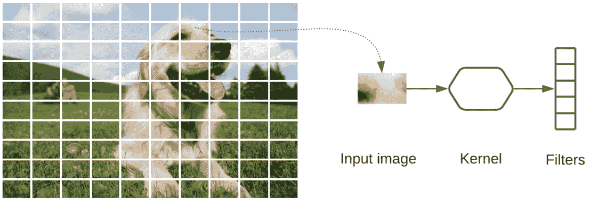

# 第四章：*第四章*：使用 AutoKeras 进行图像分类与回归

本章我们将重点介绍 AutoKeras 在图像上的应用。在*第二章*中，*入门 AutoKeras*，我们首次接触了应用于图像的**深度学习**（**DL**），通过创建两个模型（一个分类器和一个回归器），实现了对手写数字的识别。我们现在将创建更复杂、更强大的图像识别器，分析它们的工作原理，并学习如何微调它们以提高性能。

阅读完本章后，你将能够创建自己的图像模型，并将其应用于解决现实世界中的各种问题。

正如我们在*第二章*中讨论的那样，*入门 AutoKeras*，最适合图像识别的模型使用一种叫做**卷积神经网络**（**CNN**）的神经网络类型。对于我们在本章中看到的两个例子，AutoKeras 也会选择 CNN 来创建其模型。所以，让我们更详细地了解这些类型的神经网络是什么，以及它们是如何工作的。

本章将涉及以下主要主题：

+   理解 CNN——这些神经网络是什么，它们是如何工作的？

+   创建一个 CIFAR-10 图像分类器

+   创建和微调一个强大的图像分类器

+   创建一个图像回归器以找出人的年龄

+   创建和微调一个强大的图像回归器

# 技术要求

本书中的所有编码示例都可以作为 Jupyter Notebooks 下载，链接如下：[`github.com/PacktPublishing/Automated-Machine-Learning-with-AutoKeras`](https://github.com/PacktPublishing/Automated-Machine-Learning-with-AutoKeras)。

由于代码单元可以执行，每个笔记本都可以通过添加所需的代码片段进行自我安装。因此，在每个笔记本的开头都有一个环境设置的代码单元，用于安装 AutoKeras 及其依赖项。

因此，要运行编码示例，你只需要一台操作系统为 Ubuntu/Linux 的计算机，并且可以通过以下命令行安装 Jupyter Notebook：

```py
$ apt-get install python3-pip jupyter-notebook
```

另外，你也可以通过 Google Colaboratory 运行这些笔记本，在这种情况下，你只需要一个网页浏览器——有关更多详情，请参见*第二章*中关于*AutoKeras 与 Google Colaboratory*的部分，*入门 AutoKeras*。此外，在*安装 AutoKeras*部分，你还可以找到其他安装选项。让我们通过详细了解 CNN 来开始。

### 理解 CNN

CNN 是一种神经网络，灵感来源于生物大脑视觉皮层中神经元的工作原理。

这类网络在解决计算机视觉问题（如图像分类、物体检测、分割等）方面表现非常出色。

以下屏幕截图显示了 CNN 如何识别猫：


](img/B16953_04_01.jpg)

图 4.1 – CNN 如何识别猫

但为什么这些 CNN 比传统的全连接模型更有效呢？为了解答这个问题，让我们深入探讨卷积层和池化层的作用。

### 卷积层

CNN 的关键构建块是卷积层，它使用一个窗口（卷积核）扫描图像，并对其进行变换以检测模式。

核心不过是一个简单的神经网络，由扫描窗口的像素矩阵提供输入，输出一个数字向量，我们将使用这些向量作为滤波器。

让我们想象一个卷积层，其中有许多小的方形模板（称为卷积核），它们穿过图像并寻找模式。当输入图像的某个区域与卷积核模式匹配时，卷积核返回一个正值；否则，它返回 `0` 或更小的值。

以下屏幕截图显示了卷积层如何处理图像：



](img/B16953_04_01.jpg)

图 4.2 – 卷积层如何处理图像

一旦我们获得了滤波器，我们就必须使用池化操作来减少它们的维度，下一步将会解释这一过程。

### 池化层

池化层的功能是逐步减小输入特征矩阵的大小，从而减少网络中的参数数量和计算量。最常见的池化方式是最大池化，它通过对输入特征矩阵的非重叠子区域应用最大值滤波器来执行下采样。

以下屏幕截图提供了最大池化的示例：


图 4.3 – 最大池化示例

在前面的屏幕截图中，我们可以看到一个特征矩阵上进行最大池化操作的例子。对于图像来说，这个矩阵将由图像的像素值组成。

应用这一操作可以通过减少需要处理的特征数量，从而降低计算成本，同时有助于防止过拟合。接下来，我们将看到卷积层和池化层在 CNN 中是如何结合的。

### CNN 结构

通常，CNN 由一系列卷积层组成，之后是池化层（下采样）。这一组合会重复多次，正如我们在下面的屏幕截图示例中看到的那样：


图 4.4 – CNN 管道示例

在这个过程中，第一层检测简单的特征，比如图像的轮廓，第二层开始检测更高层次的特征。在中间层，它已经能够检测到更复杂的形状，比如鼻子或眼睛。在最后几层，它通常能够区分人脸。

这个看似简单的重复过程非常强大，每一步都能检测出比前一步稍高阶的特征，并生成惊人的预测结果。

## 超越经典神经网络

经典神经网络使用全连接（密集）层作为主要的特征转换操作，而 CNN 则使用卷积层和池化层（Conv2D）。

完全连接层和卷积层之间的主要区别如下：

+   完全连接层学习其输入特征空间的全局模式（例如，在**修改后的国家标准与技术研究所**（**MNIST**）数据集的数字示例中，见*第二章*，*AutoKeras 入门*，输入特征空间将是图像的所有像素）。

+   另一方面，卷积层学习局部模式——在图像的情况下，是通过小的二维窗口扫描图像时发现的模式。

在下面的截图中，我们可以看到这些小窗口如何检测局部模式，如线条、边缘等：


图 4.5 – 卷积网络提取模式的可视化表示

卷积操作通过一个扫描输入图像的窗口（2D 矩阵）来执行图像转换，生成一张具有不同特征的新图像。每一张生成的图像称为**滤波器**，每个滤波器包含从原始图像中提取的不同模式（如边缘、轴线、直线等）。

CNN 中每个中间层创建的滤波器集合被称为特征图，它是一个具有*r x c x n*维度的数字矩阵，其中*r*和*c*分别是行和列，*n*是滤波器的数量。

基本上，这些特征图是 CNN 学习的参数。

如我们在查看*第二章*，*AutoKeras 入门*中的 MNIST 分类器架构时所见，CNN 堆叠了多个卷积层（Conv2D），并结合池化层（MaxPooling2D）。后者的任务是减少滤波器的维度，保留最相关的值。这有助于清除噪声并减少模型的训练时间。

现在，是时候实现一些实际示例了。让我们从一个著名数据集的图像分类器开始。

# 创建一个 CIFAR-10 图像分类器

我们将要创建的模型将对一个名为`32x32`的**红色、绿色、蓝色**（**RGB**）彩色图像数据集进行分类，分为 10 个不同类别。它是一个常用于训练机器学习和计算机视觉算法的图像集合。

这是数据集中的各个类别：

+   `airplane`

+   `automobile`

+   `bird`

+   `cat`

+   `deer`

+   `dog`

+   `frog`

+   `horse`

+   `ship`

+   `truck`

在下一张截图中，你可以看到 CIFAR-10 数据集中一些随机的图像样本：


图 4.6 – CIFAR-10 图像样本

这是一个已经被认为解决了的问题。实现接近 80%的分类准确率相对容易。为了获得更好的性能，我们必须使用深度学习 CNN，通过它可以在测试数据集中实现超过 90%的分类精度。让我们看看如何使用 AutoKeras 实现这一点。

这是一个分类任务，因此我们可以使用`ImageClassifier`类。该类生成并测试不同的模型和超参数，返回一个最佳分类器，将每个图像分类到相应的类别。

注意

完整源代码的笔记本可以在[`github.com/PacktPublishing/Automated-Machine-Learning-with-AutoKeras/blob/main/Chapter04/Chapter4_Cifar10.ipynb`](https://github.com/PacktPublishing/Automated-Machine-Learning-with-AutoKeras/blob/main/Chapter04/Chapter4_Cifar10.ipynb)找到。

现在让我们详细查看一下笔记本中的相关单元格，如下所示：

+   `pip` 包管理器：

    ```py
    !pip3 install autokeras
    ```

+   `matplotlib`，我们将使用它来绘制一些数字表示图，并且 CIFAR-10 包含已分类的图像数据集。以下是导入这些包的代码：

    ```py
    import autokeras as ak
    import matplotlib.pyplot as plt
    from tensorflow.keras.datasets import cifar10
    ```

+   **获取 CIFAR-10 数据集**：我们首先需要将 CIFAR-10 数据集加载到内存中，并快速查看数据集的形状，如下所示：

    ```py
    (x_train, y_train), (x_test, y_test) = cifar10.load_data()
    print(x_train.shape)
    print(x_test.shape)
    ```

    以下是前面代码的输出：

    ```py
    Downloading data from https://www.cs.toronto.edu/~kriz/cifar-10-python.tar.gz
    170500096/170498071 [==============================] - 11s 0us/step
    (50000, 32, 32, 3)
    (10000, 32, 32, 3)
    ```

尽管这是一个广为人知的机器学习数据集，但始终确保数据分布均匀非常重要，以避免出现意外情况。可以通过使用`numpy`函数轻松实现这一点，如下代码块所示：

```py
import numpy as np 
train_histogram = np.histogram(y_train)
test_histogram = np.histogram(y_test)
_, axs = plt.subplots(1, 2)
axs[0].set_xticks(range(10))
axs[0].bar(range(10), train_histogram[0])
axs[1].set_xticks(range(10))
axs[1].bar(range(10), test_histogram[0])
plt.show()
```

如下截图所示，样本完美平衡：


图 4.7 – 训练和测试数据集直方图

现在我们确认我们的数据集是正确的，接下来是创建我们的图像分类器。

# 创建并微调一个强大的图像分类器

现在，我们将使用 AutoKeras 的`ImageClassifier`类来找到最佳的分类模型。仅此示例，我们将`max_trials`（尝试的不同 Keras 模型的最大数量）设置为`2`，并且不设置`epochs`参数，以便它自动使用自适应的训练轮数。对于实际使用，建议设置更多的尝试次数。代码如下：

```py
clf = ak.ImageClassifier(max_trials=2)
```

让我们运行训练，搜索 CIFAR-10 训练数据集的最佳分类器，如下所示：

```py
clf.fit(x_train, y_train)
```

这是输出结果：


图 4.8 – 图像分类器训练的笔记本输出

前面的输出显示，训练数据集的准确率正在上升。

由于需要处理成千上万的彩色图像，AutoKeras 生成的模型在训练时会更为昂贵，因此这个过程将需要几个小时，即使使用`max_trials = 5`。增加这个数字将给我们一个更准确的模型，尽管它也会花费更长的时间才能完成。

## 提升模型性能

如果我们需要在更短时间内获得更高精度，我们可以使用 AutoKeras 的高级功能来微调我们的模型，允许你自定义搜索空间。

通过使用`AutoModel`与`ImageBlock`代替`ImageClassifier`，我们可以创建高级配置，例如用于指定神经网络类型的`block_type`。我们还可以执行数据标准化或数据增强。

如果我们有深度学习的知识，并且之前遇到过这个问题，我们可以设计一个合适的架构，例如基于`EfficientNet`的图像分类器，它是用于图像识别的深度残差学习架构。

请查看以下示例，了解更多细节：

```py
input_node = ak.ImageInput()
output_node = ak.ImageBlock(
             block_type="efficient",
             augment=False)(input_node)
output_node = ak.ClassificationHead()(output_node)
clf = ak.AutoModel(inputs=input_node, outputs=output_node, max_trials=2)
clf.fit(x_train, y_train)
```

在前面的代码块中，我们已经使用以下设置完成了操作：

+   使用`block_type = "efficient"`，AutoKeras 将只探索`EfficientNet`架构。

+   初始化`augment = True`表示我们希望进行数据增强，这是一种通过原始图像生成新的人工图像的技术。在激活此功能后，AutoKeras 将对原始图像执行一系列变换，如平移、缩放、旋转或翻转。

你也可以不指定这些参数，在这种情况下，这些不同的选项会被自动调整。

你可以在这里看到关于`EfficientNet`函数的更多细节：

+   [`keras.io/api/applications/efficientnet/`](https://keras.io/api/applications/efficientnet/)

+   [`keras.io/api/applications/resnet/`](https://keras.io/api/applications/resnet/)

## 使用测试集评估模型

训练完成后，接下来就是使用保留的测试数据集来衡量模型的实际预测效果。通过这种方式，我们可以将从训练集获得的良好结果与从未见过的数据集进行对比。为此，我们运行以下代码：

```py
metrics = clf.evaluate(x_test, y_test)
print(metrics)
```

这是输出结果：

```py
313/313 [==============================] - 34s 104ms/step - loss: 0.5260 - accuracy: 0.8445
[0.525996744632721, 0.8445000052452087]
```

我们可以看到，使用我们的测试数据集（84.4%）预测准确率仍有提升空间，尽管这是仅仅几个小时训练得到的相当不错的得分；但通过增加尝试次数，我们已经实现了首个模型（`ImageClassifier`）的 98%精度，并且在 Google Colaboratory 中运行了一整天。

一旦我们创建并训练了分类器模型，让我们看看它在一部分测试样本上的预测结果。为此，我们运行以下代码：

```py
import matplotlib.pyplot as plt
labelNames = ["airplane", "automobile", "bird", "cat", "deer", "dog", "frog", "horse", "ship", "truck"]
fig = plt.figure(figsize=[18,6])
for i in range(len(predicted_y)):
    ax = fig.add_subplot(2, 5, i+1)
    ax.set_axis_off()
    ax.set_title('Prediced: %s, Real: %s' % (labelNames[int(predicted_y[i])],labelNames[int(y_test[i])]))
    img = x_test[i]
    ax.imshow(img)
plt.show()
```

这是输出结果：


图 4.9 – 带有预测标签和真实标签的样本

我们可以看到，所有预测的样本都与其真实值匹配，因此我们的分类器预测正确。现在，让我们深入了解分类器，理解它是如何工作的。

## 可视化模型

现在，我们可以看到一个小的总结，展示了最佳生成模型的架构（即准确度为 98%的模型），我们将解释它为什么能有如此好的表现。运行以下代码查看总结：

```py
model = clf.export_model()
model.summary()
```

这是输出：


图 4.10 – 最佳模型架构总结

这里的关键层是`efficientnetb7`层，它实现了由 Google 创建的前沿架构。如今，`EfficientNet` 模型是图像分类的最佳选择，因为这是一个最近的架构，不仅专注于提高准确度，还关注模型的效率，使其在现有的卷积网络架构基础上实现更高的精度和更好的效率，减少参数大小和**每秒浮动点操作数**（**FLOPS**）数量级。然而，我们不需要了解任何关于它的内容，因为 AutoKeras 已经自动为我们选择了它。

让我们以一种更直观的方式来看一下各个块是如何相互连接的，如下所示：


图 4.11 – 最佳模型架构可视化

正如我们在 *第二章*《AutoKeras 入门》中解释的那样，*每个块表示一个层，每个块的输出连接到下一个块的输入，除了第一个块（其输入是图像）和最后一个块（其输出是预测结果）。在`efficientnetb7`层之前的所有块都是数据预处理块，负责将图像转换为适合此`EfficientNet`块的格式，并通过数据增强技术生成额外的图像。*

现在是处理非分类问题的时候了。在接下来的实际示例中，我们将基于一组名人数据创建一个人类年龄预测器——一个有趣的工具，可能会让任何人脸红。

# 创建一个图像回归器来预测人们的年龄

在本节中，我们将创建一个模型，该模型能够从人脸图像中找出一个人的年龄。为此，我们将使用从**互联网电影数据库**（**IMDb**）提取的名人面孔数据集来训练该模型。

由于我们要预测年龄，我们将使用图像回归器来完成这项任务。

在下一张截图中，你可以看到一些从这个名人面孔数据集中提取的样本：


图 4.12 – 来自 IMDb 面孔数据集的几个图像样本

这本包含完整源代码的笔记本可以在这里找到：[`github.com/PacktPublishing/Automated-Machine-Learning-with-AutoKeras/blob/main/Chapter04/Chapter4_CelebrityAgeDetector.ipynb`](https://github.com/PacktPublishing/Automated-Machine-Learning-with-AutoKeras/blob/main/Chapter04/Chapter4_CelebrityAgeDetector.ipynb)。

接下来，我们将详细解释笔记本中的相关代码单元，具体如下：

+   `pip`包管理器。代码如下所示：

    ```py
    !pip3 install autokeras
    ```

+   **导入所需的包**：现在我们加载 AutoKeras 和一些常用的包，如 matplotlib，一个 Python 绘图库，我们将使用它来绘制一些图片样本和类别分布。执行此操作的代码如下所示：

    ```py
    import autokeras as ak
    import matplotlib.pyplot as plt
    ```

+   **获取 IMDb 面部数据集**：在训练之前，我们必须下载包含每个人脸图像及带有年龄标签的元数据的 IMDb 裁剪面部数据集。

    以下命令行是幂等的—它们只会在数据不存在时下载并解压数据：

    ```py
    !wget -nc https://data.vision.ee.ethz.ch/cvl/rrothe/imdb-wiki/static/imdb_crop.tar
    !tar --no-overwrite-dir -xf imdb_crop.tar
    ```

    这是前面代码的输出：

    ```py
    Resolving data.vision.ee.ethz.ch (data.vision.ee.ethz.ch)... 129.132.52.162
    Connecting to data.vision.ee.ethz.ch (data.vision.ee.ethz.ch)|129.132.52.162|:443... connected.
    HTTP request sent, awaiting response... 200 OK
    Length: 7012157440 (6.5G) [application/x-tar]
    Saving to: 'imdb_crop.tar'
    imdb_crop.tar       100%[===================>]   6.53G  27.7MB/s    in 3m 59s  
    2020-12-20 00:05:48 (28.0 MB/s) - 'imdb_crop.tar' saved [7012157440/7012157440]
    ```

+   `MatLab`文件。

    b. 年龄不在参数中—它必须被计算出来。

    c. 图像不一致—它们的尺寸和颜色不同。

    为了解决这些问题，我们创建了以下的工具函数：

    a. `imdb_meta_to_df(matlab_filename)`：此函数将 IMDb MatLab 文件转换为 Pandas DataFrame，并计算年龄。

    b. `normalize_dataset(df_train_set)`：这会返回一个元组，包含归一化后的图像（调整为`128x128`并转换为灰度）和转为整数的年龄。

在笔记本中，你将找到更多关于这些函数如何工作的细节。

现在让我们来看一下如何使用它们，具体如下：

```py
df = imdb_meta_to_df("imdb_crop/imdb.mat")
```

在前面的代码片段中，我们使用了`imdb_meta_to_df`函数，将存储在 MatLab 文件中的`imdb`元数据信息转换为 Pandas DataFrame。

DataFrame 包含了大量的图像；为了加速训练，我们将只使用其中一部分图像来创建数据集，具体如下：

```py
train_set = df.sample(10000)
test_set = df.sample(1000)
```

现在，我们创建最终的数据集，包含归一化的图像和年龄，具体如下：

```py
train_imgs, train_ages = normalize_dataset(train_set)
test_imgs, test_ages = normalize_dataset(test_set)
```

一旦所有图片的尺寸（128×128）和颜色（灰度图）一致，并且我们有了标签和估计的年龄，我们就可以准备输入模型，但首先我们需要创建它。

# 创建和微调一个强大的图像回归器

因为我们要预测年龄，并且这是一个标量值，所以我们将使用 AutoKeras 的`ImageRegressor`作为年龄预测器。我们将`max_trials`（尝试的不同 Keras 模型的最大数量）设置为`10`，并且不设置`epochs`参数，这样它会自动使用适应性数量的 epochs。对于实际使用，建议设置较大的试验次数。代码如下所示：

```py
reg = ak.ImageRegressor(max_trials=10)
```

让我们运行训练模型，寻找适合训练数据集的最佳回归器，具体如下：

```py
reg.fit(train_imgs, train_ages)
```

这是前面代码的输出：


图 4.13 – 我们的年龄预测器训练的笔记本输出

前面的输出显示训练数据集的损失正在下降。

这个训练过程在 Colaboratory 中花费了 1 小时。我们将搜索限制为 10 种架构（`max_trials = 10`），并将图像数量限制为 10,000。增加这些数字将给我们一个更精确的模型，尽管也会花费更多时间。

## 提升模型性能

如果我们需要在更短的时间内获得更高的精度，我们可以使用 AutoKeras 的高级功能微调我们的模型，从而自定义搜索空间。

正如我们在回归模型示例中所做的那样，我们可以使用 `AutoModel` 配合 `ImageBlock`，而不是使用 `ImageRegressor`，这样我们就可以实现更高级的配置，比如使用 `block_type` 搜索特定架构的神经网络。我们还可以执行数据预处理操作，比如归一化或增强。

正如我们在之前的图像分类器示例中所做的那样，我们可以设计一个合适的架构，例如基于 `EfficientNet` 的图像回归器，这是一种用于图像识别的深度残差学习架构。

请参见以下示例以获取更多细节：

```py
input_node = ak.ImageInput()
output_node = ak.Normalization()(input_node)
output_node = ak.ImageAugmentation()(output_node)
output_node = ak.ImageBlock(block_type="efficient")(input_node)
output_node = ak.RegressionHead()(output_node)
reg = ak.AutoModel(inputs=input_node, outputs=output_node, max_trials=20)
reg.fit(train_imgs, train_ages)
```

在之前的代码中，我们已经做了以下设置：

+   `Normalization` 块会将所有图像值从 0 到 255 的范围转换为 0 到 1 之间的浮动值。

+   已经设置了形状（60000, 28 * 28），值在 0 和 1 之间。

+   使用 `ImageBlock(block_type="efficient"`，我们告诉 AutoKeras 只扫描 `EfficientNet` 架构。

+   `ImageAugmentation` 块执行数据增强，这是通过原始图像生成新的人工图像的一种技术。

你也可以选择不指定这些参数，在这种情况下，系统将自动调整这些不同的选项。

你可以在这里查看更多关于 `EfficientNet` 函数的细节：

[`keras.io/api/applications/efficientnet/`](https://keras.io/api/applications/efficientnet/)

## 使用测试集评估模型

训练后，是时候使用保留的测试数据集来衡量我们模型的实际预测效果了。这样，我们可以排除训练集获得的好结果是由于过拟合造成的。执行此操作的代码如下：

```py
print(reg.evaluate(test_imgs, test_ages))
```

这是前面代码的输出：

```py
32/32 [==============================] - 2s 51ms/step - loss: 165.3358 - mean_squared_error: 165.3358
[165.33575439453125, 165.33575439453125]
```

这个错误还有很大的提升空间，但让我们看看它是如何在一部分测试样本上进行预测的，如下所示：

```py
fig = plt.figure(figsize=[20,100])
for i, v in enumerate(predicted_y[0:80]):
    ax = fig.add_subplot(20, 5, i+1)
    ax.set_axis_off()
    ax.set_title('Prediced: %s, Real: %s' % (predicted_y[i][0], test_ages[i]))
    img = test_imgs[i]
    ax.imshow(img)
plt.show()
```

这是前面代码的输出：


图 4.14 – 样本及其预测标签与真实标签

我们可以看到一些预测样本接近真实年龄，但另一些则不然，因此投入更多的训练时间和微调将使其预测得更好。让我们深入了解分类器，理解它是如何工作的。

## 可视化模型

现在我们可以看到通过运行以下代码找到的最佳生成模型的架构简要总结：

```py
model = clf.export_model()
model.summary()
```

这是前面代码的输出：


图 4.15 – 最佳模型架构概览

这里的关键层是卷积和池化块，正如我们在本章开头所解释的那样。这些层从图像中学习局部模式，帮助进行预测。以下是这一点的可视化表示：


图 4.16 – 最佳模型架构可视化

首先，有一些数据预处理块用于规范化图像并进行数据增强；然后，接下来是几个堆叠的卷积和池化块；接着是一个 dropout 块用于正则化（这是一种减少过拟合的技术，通过在训练过程中随机丢弃神经元，减少相邻神经元之间的相关性）；最后，我们看到回归块，它将输出转换为一个标量（即年龄）。

# 概览

在本章中，我们学习了卷积网络的工作原理，如何实现图像分类器，以及如何微调它以提高准确性。我们还学习了如何实现图像回归器并微调它以提高性能。

现在我们已经学会了如何处理图像，我们准备进入下一章，您将在那里学习如何通过使用 AutoKeras 实现分类和回归模型来处理文本。
