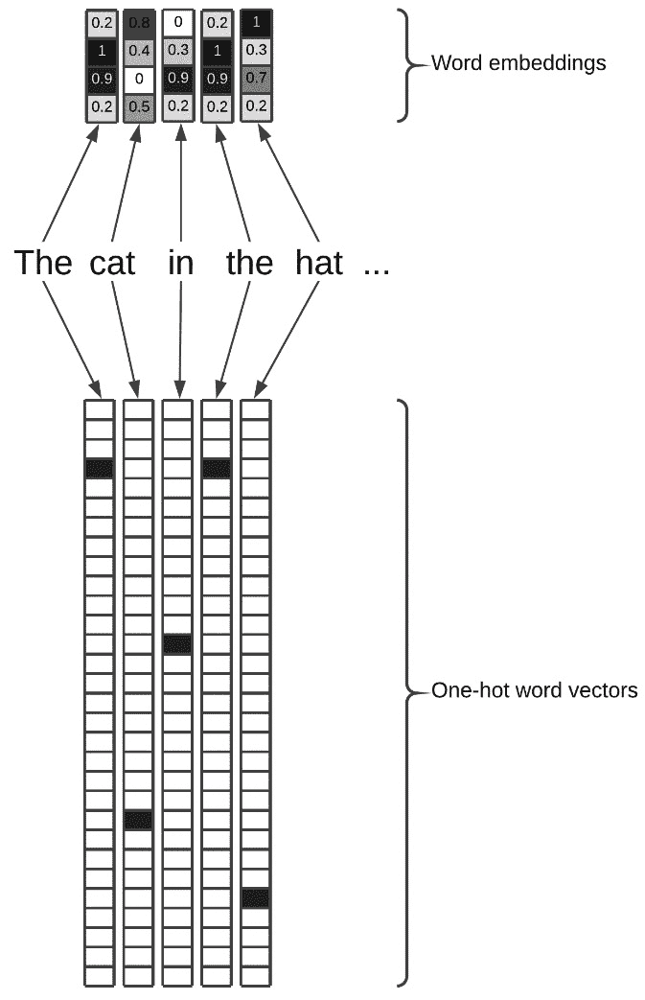

# 第五章：*第五章*：使用 AutoKeras 进行文本分类和回归

在本章中，我们将重点介绍使用 AutoKeras 处理文本（即一系列单词）的方式。

在上一章中，我们看到有一种专门适用于图像处理的网络类型，叫做**卷积神经网络**（**CNN**）。在本章中，我们将了解什么是**递归神经网络**（**RNN**），以及它们如何工作。RNN 是一种非常适合处理文本的神经网络类型。

我们还将使用分类器和回归器来解决基于文本的任务。到本章结束时，你将学会如何使用 AutoKeras 解决各种基于文本的问题，例如从推文中提取情绪、检测电子邮件中的垃圾邮件等。

在本章中，我们将覆盖以下主题：

+   处理文本数据

+   理解 RNN——这些神经网络是什么，它们如何工作？

+   一维 CNN（Conv1D）

+   创建电子邮件垃圾邮件检测器

+   预测社交媒体新闻的流行度

# 技术要求

本书中的所有代码示例都可以作为 Jupyter 笔记本下载，下载链接如下：[`github.com/PacktPublishing/Automated-Machine-Learning-with-AutoKeras`](https://github.com/PacktPublishing/Automated-Machine-Learning-with-AutoKeras)。

由于代码单元格可以执行，每个笔记本都可以自我安装，只需添加包含所需依赖项的代码片段。因此，在每个笔记本的开始部分都有一个代码单元格用于环境设置，安装 AutoKeras 及其依赖项。

因此，要运行这些代码示例，你只需要一台操作系统为 Ubuntu Linux 的计算机，并且可以使用以下命令行安装 Jupyter Notebook：

```py
$ apt-get install python3-pip jupyter-notebook
```

另外，你也可以使用 Google Colaboratory 运行这些笔记本，这时只需要一个网页浏览器。有关详细信息，请参见 *第二章* 中的 *AutoKeras 与 Google Colaboratory* 部分，*AutoKeras 入门*。此外，在 *安装 AutoKeras* 部分，你还会找到其他安装选项。

# 处理文本数据

AutoKeras 使我们能够快速轻松地创建高性能模型来解决基于文本的任务。

文本是喂养深度学习模型的优秀信息来源，存在大量基于文本的资源，例如社交媒体、聊天记录、电子邮件、文章、书籍，以及无数需要基于文本自动化的任务，如下所示：

+   **翻译**：将一种语言的源文本转换为另一种语言的文本。

+   **对话机器人**：使用机器学习模型模拟人类对话。

+   **情感分析**：通过分析文本数据来分类情绪。

+   **垃圾邮件分类器**：使用机器学习模型进行电子邮件分类。

+   **文档摘要生成器**：自动生成文档摘要。

+   **文本生成器**：从零开始自动生成文本。

与其他类型的数据一样，AutoKeras 会完成所有的预处理工作，这样我们就可以直接将文本传递给模型。在开始实际示例之前，让我们先看看它在幕后做了什么。

## 标记化

如我们所知，神经网络输入的是数值向量，因此文本必须通过一个叫做**向量化**的过程转换为数值张量。不过，在这之前，我们必须先将文本切分成片段。

这种文本分割可以通过以下不同的单位来完成：

+   **单词**：将文本按单词进行划分。

+   **字符**：将文本切分成字符。

+   **N-gram**：提取词或字符的 N-gram。N-gram 是多个连续词或字符的重叠分组。

前面提到的单位称为**标记**，将文本划分为这些标记的过程称为**标记化**。这是将文本转换为张量的必要步骤，接下来我们将解释这一过程。

## 向量化

一旦文本被标记化，就会进行向量化。这个过程将每个单词/字符/N-gram 转换为一个向量。

所有文本向量化过程包括以下步骤：

1.  应用某种标记化方案

1.  将数值向量与生成的标记关联

这些向量被打包成序列张量，输入到**深度神经网络**（**DNNs**）中。

有多种方式可以将标记与向量关联。让我们来看两种最重要的方式，如下所示：

+   `1` 和向量中的所有其他值都是零。

+   **标记嵌入**是另一种广泛使用的标记-向量关联方式，且比 One-hot 编码更为强大。虽然 One-hot 编码得到的向量是二进制的（一个输入值为*1*，其余值为*0*），且长度很大（必须与词汇表中单词的数量相同），而词嵌入则是低维的浮点向量。

    通过 One-hot 编码得到的词向量是静态的（数组中的位置决定了单词，这些值永远不会改变），而词嵌入向量是动态的（它们是从数据中学习得到的），以至于它们的值在学习过程中会发生变化，就像神经网络层的权重一样。

    正是这种动态性使它能够以更小的尺寸存储更多信息，正如你在以下截图中看到的那样：



图 5.1 – One-hot 编码与嵌入比较

就像卷积网络是处理基于图像任务的最合适选择一样，在谈到文本处理时，最优化的网络类型是 RNN。让我们在接下来的部分看看它的组成。

# 理解 RNN

到目前为止，所有神经网络的共同特点是它们没有记忆。由全连接层或卷积层组成的网络独立地处理每个输入，使得每一层都是孤立的。然而，在 RNN 中，“过去”会被考虑进去，这通过使用上一个输出作为状态来完成；因此，RNN 层将有两个输入，一个是当前向量的标准输入，另一个是前一个向量的输出，如下图所示：


图 5.2 – RNN 循环展开

RNN 通过对整个元素序列的内部循环来实现这个记忆特性。我们用一些伪代码来解释，如下所示：

```py
state = 0
for input in input_sequence:
     output = f(input, state)
     state = output
```

虽然有许多比本书所展示的更复杂的 RNN 架构，但这超出了本书的范围。理解这里解释的概念就足够了，因为配置和架构的选择将由 AutoKeras 来处理。

# 一维卷积神经网络（Conv1D）

处理文本时需要考虑的另一种架构是一维卷积神经网络（Conv1D）。它们的原理与我们在上一章中看到的二维卷积神经网络类似，参见 *第四章*，*使用 AutoKeras 的图像分类与回归*。这些神经网络通过滤波器学习文本中的模式，就像它们在上一章中学习图像模式一样。

以下是一个一维卷积神经网络的示例：


图 5.3 – 1D 卷积在文本序列上的应用

需要知道的是，如果序列中元素的时间顺序对于预测很重要，那么 RNN 的效果会更好，因此一维卷积神经网络常常与 RNN 结合使用，以创建高性能模型。AutoKeras 进行的全面搜索会同时考虑这两者，以找到最佳模型。

现在，让我们通过一些实际例子来实践所学的概念。

# 创建电子邮件垃圾邮件检测器

我们将创建的模型将从 `emails` 数据集中检测垃圾邮件。这是一个包含 5,572 封邮件的小型数据集，带有 `spam` 列标签。

包含完整源代码的笔记本可以通过以下链接找到：

[`colab.research.google.com/github/PacktPublishing/Automated-Machine-Learning-with-AutoKeras/blob/main/Chapter05/Chapter5_SpamDetector.ipynb`](https://colab.research.google.com/github/PacktPublishing/Automated-Machine-Learning-with-AutoKeras/blob/main/Chapter05/Chapter5_SpamDetector.ipynb)

现在让我们详细查看笔记本中的相关单元格，具体如下：

+   `pip` 包管理器：

    ```py
    !pip3 install autokeras
    ```

+   `tensorflow`、`pandas`、`numpy` 和 `autokeras` 作为此项目所需的依赖项：

    ```py
    import tensorflow as tf
    import pandas as pd 
    import numpy as np
    import autokeras as ak
    from sklearn import model_selection
    ```

+   来自我们 GitHub 仓库的 `emails` 垃圾邮件数据集，详见如下：

    ```py
    emails_dataset = pd.read_csv("https://raw.githubusercontent.com/PacktPublishing/Automated-Machine-Learning-with-AutoKeras/main/spam.csv", encoding="latin-1")
    ```

    我们现在通过重命名相关列并删除不必要的列来准备我们的数据集，如下所示：

    ```py
    emails_dataset.drop(['Unnamed: 2', 'Unnamed: 3', 'Unnamed: 4'], axis = 1, inplace = True)
    emails_dataset.rename(columns = {'v1': 'spam', 'v2': 'message'}, inplace = True)
    emails_dataset['spam'] = emails_dataset['spam'].map({'ham': 0, 'spam': 1})
    emails_dataset.head()
    ```

    这是前面代码的输出：


图 5.4 – 数据集预览的笔记本输出

现在，让我们将数据集拆分为`train`和`test`数据集，如下所示：

```py
x_train, x_test, y_train, y_test = model_selection.train_test_split(emails_dataset.message.to_numpy(), emails_dataset.spam.to_numpy())
```

我们已准备好创建垃圾邮件分类器。

## 创建垃圾邮件预测器

现在，我们将使用 AutoKeras 的`TextClassifier`类来找到最佳的分类模型。仅为了这个小示例，我们将`max_trials`（尝试的最大不同 Keras 模型数量）设置为 2，并且不设置`epochs`参数，而是定义了一个`EarlyStopping`回调，当验证损失在连续两个 epoch 内没有改善时，训练过程就会停止。代码如下所示：

```py
clf = ak.TextClassifier(max_trials=2)
cbs = [tf.keras.callbacks.EarlyStopping(patience=2)]
```

让我们开始训练，以寻找训练数据集的最佳分类器，如下所示：

```py
clf.fit(x_train, y_train, callbacks=cbs)
```

这是前面代码的输出：


](img/B16953_05_05.jpg)

图 5.5 – 文本分类器训练的笔记本输出

上面的输出显示，使用训练数据集时，准确率在不断提高。

如我们所见，在验证集上我们达到了`0.080`的损失值。仅仅经过一分钟的训练，结果已经非常好。我们将搜索范围限制在两种架构内（`max_trials = 2`）。增加该数字会使模型更准确，但也会增加训练时间。

## 评估模型

现在是时候使用测试数据集评估最佳模型了。我们可以通过运行以下命令来实现：

```py
clf.evaluate(x_test, y_test)
```

这是前面命令的输出：

```py
44/44 [==============================] - 0s 4ms/step - loss: 0.0491 - accuracy: 0.9849
[0.04908078908920288, 0.9849246144294739]
```

如我们所见，`0.9849`的测试集预测准确率是非常好的最终预测得分，考虑到投入的时间，这个结果非常令人满意。

## 可视化模型

现在，我们可以看到最佳生成模型的架构的简要总结。我们可以通过运行以下代码来实现：

```py
model = clf.export_model()
model.summary()
```

这是前面代码的输出：


](img/B16953_05_06.jpg)

图 5.6 – 最佳模型架构总结

如我们所见，AutoKeras 选择了卷积模型（Conv1D）来完成这个任务。正如我们在*第四章*《使用 AutoKeras 进行图像分类与回归》中解释的那样，这种架构在序列中元素的顺序对预测结果不重要时效果非常好，正如本例所示。

下面是架构的可视化表示：


](img/B16953_05_07.jpg)

图 5.7 – 最佳模型架构可视化

正如你们所知，生成模型并选择最佳模型是 AutoKeras 自动完成的任务，但让我们简要解释一下这些模块。

每个块代表一层，且每层的输出连接到下一层的输入，除了第一个块（其输入是文本）和最后一个块（其输出是预测的数字）。Conv1D 块之前的所有块都是数据预处理块，用于将文本生成的嵌入向量化以馈送到 Conv1D 块，并通过最大池化层降低过滤器的维度。请注意，AutoKeras 还添加了多个 dropout 块以减少过拟合。

在下一节中，我们将通过一个实际示例来解决文本回归问题：我们将创建一个新闻流行度预测器。

# 在社交媒体上预测新闻的流行度

在这一部分，我们将创建一个模型，基于文章的文本来预测其在社交媒体平台上的流行度评分。为此，我们将使用 2015 至 2016 年间收集的*新闻流行度*数据集来训练模型（[`archive.ics.uci.edu/ml/datasets/News+Popularity+in+Multiple+Social+Media+Platforms`](https://archive.ics.uci.edu/ml/datasets/News+Popularity+in+Multiple+Social+Media+Platforms)）。

由于我们希望预测一个分数（点赞数），因此我们将使用文本回归器来完成这项任务。

在下一个截图中，您可以看到从该数据集中提取的一些样本：


](img/B16953_05_08.jpg)

图 5.8 – 来自新闻流行度数据集的几个样本

这个包含完整源代码的笔记本可以在[`colab.research.google.com/github/PacktPublishing/Automated-Machine-Learning-with-AutoKeras/blob/main/Chapter05/Chapter5_SpamDetector.ipynb`](https://colab.research.google.com/github/PacktPublishing/Automated-Machine-Learning-with-AutoKeras/blob/main/Chapter05/Chapter5_SpamDetector.ipynb)找到。

我们现在将详细解释笔记本中的相关代码单元，如下所示：

+   **获取文章数据集**：在训练之前，我们必须下载包含每篇文章文本及其流行度评分的数据集。以下是实现这一目的的代码：

    ```py
    news_df = pd.read_csv("https://archive.ics.uci.edu/ml/machine-learning-databases/00432/Data/News_Final.csv")
    ```

+   `Title`和`Headline`文本列将用来馈送给我们的回归模型。

    现在，我们提取每篇文章在 LinkedIn 上的流行度评分，作为标签。为了简化示例，我们决定只使用 LinkedIn 上的评分。代码如下所示：

    ```py
    media_success_outputs = news_df.LinkedIn.to_numpy(dtype="int")
    ```

    接下来，我们将创建训练集和测试集，如下所示：

+   使用`sklearn`函数创建`train`和`test`数据集，如下所示：

    ```py
    from sklearn.model_selection import train_test_split
    x_train, x_test, y_train, y_test = train_test_split(text_inputs, media_success_outputs, test_size = 0.2, random_state = 10)
    ```

一旦我们创建了数据集，就可以将其输入模型，但首先，我们需要创建模型。

## 创建文本回归器

因为我们想从一组文本句子中预测一个流行度分数，而这个分数是一个标量值，所以我们将使用 AutoKeras 的`TextRegressor`。在这个示例中，我们将`max_trials`设置为`2`，并且没有设置`epochs`参数，而是定义了一个`EarlyStopping`回调，耐心等待`2`个 epoch，即如果验证损失在两个连续的 epoch 中没有减少，训练过程将停止。代码可以在以下代码片段中看到：

```py
reg = ak.ImageRegressor(max_trials=2)
cbs = [tf.keras.callbacks.EarlyStopping(patience=2)]
```

让我们运行训练，搜索训练数据集的最佳回归器，如下所示：

```py
reg.fit(x_train, y_train, callbacks=cbs)
```

这是前面代码的输出：


图 5.9 – 我们的新闻流行度预测器训练的笔记本输出

从之前的输出中可以看到，几分钟后，我们得到一个模型，最佳验证损失为`14726`（最终得分中的`121`是`14726`的平方根，对于投入的时间来说，这是一个不错的结果。接下来看看它在测试集上的表现。

## 评估模型

现在是时候使用测试数据集评估最佳模型了。我们通过运行以下代码来完成：

```py
reg.evaluate(x_test, y_test)
```

这是前面代码的输出：

```py
583/583 [==============================] - 3s 5ms/step - loss: 13944.2070 - mean_squared_error: 13944.2070

[13944.20703125, 13944.20703125]
```

如我们所见，`13944`是一个非常好的预测得分，考虑到投入的时间。如果我们使用更多的试验来运行 AutoKeras，我们会得到更好的结果。

## 可视化模型

现在，是时候看看我们引擎盖下的内容了。我们将运行以下代码：

```py
model = reg.export_model()
model.summary()
```

这是前面代码的输出：


图 5.10 – 最佳模型架构摘要

如同前面的分类示例一样，AutoKeras 选择了卷积模型（Conv1D）来完成任务。正如我们之前解释的，这比 RNN 架构更节省时间，且当序列中元素的顺序对于预测并不重要时，它是最合适的。

## 提升模型性能

正如我们在之前的示例中所做的那样，如果我们需要更高的精度并且希望节省时间，我们可以通过使用 AutoKeras 的高级功能来微调我们的模型，允许你自定义搜索空间。

通过使用`AutoModel`与`TextBlock`代替`TextRegressor`，我们可以创建高级配置，例如`block_type`来指定要查找的神经网络类型；或者，如果你的文本源有更大的词汇表（不同词汇的数量），你可能需要在 AutoKeras 中创建一个自定义的流水线来增加`max_tokens`参数。

详情请见以下示例：

```py
cbs = [tf.keras.callbacks.EarlyStopping(patience=2)]
input_node = ak.TextInput()
output_node = ak.TextToIntSequence(max_tokens=20000)(input_node)
output_node = ak.TextBlock(block_type='ngram')(input_node)
output_node = ak.RegressionHead()(output_node)
automodel = ak.AutoModel(inputs=input_node, outputs=output_node, objective='val_mean_squared_error', max_trials=2)
automodel.fit(x_train, y_train, callbacks=cbs)
```

在前面的代码块中，我们已经根据设置进行了以下操作：

+   `EarlyStopping`块将在验证损失在两个连续的 epoch 中没有减少时停止训练。

+   `max_token`参数设置为`20000`，因为我们的文本源有一个较大的词汇表（不同词汇的数量）。

+   使用`TextBlock(block_type="ngram"`时，我们告诉 AutoKeras 仅扫描使用 N-gram 嵌入的模型。

你也可以选择不指定这些参数，这样不同的选项将会自动调整。

## 使用测试集评估模型

训练完成后，是时候使用保留的测试数据集来测量我们模型的实际预测效果了。这样，我们可以排除训练集上获得的良好结果是由于过拟合造成的。运行以下代码来实现这一点：

```py
automodel.evaluate(x_test, y_test)
```

下面是前面代码的输出：

```py
583/583 [==============================] - 6s 9ms/step - loss: 13508.9316 - mean_squared_error: 13508.9316
[13508.931640625, 13508.931640625]
```

性能稍微好于没有微调的模型，但肯定通过更长时间的训练会进一步提升它。

# 总结

在本章中，我们学习了神经网络如何与文本数据一起工作，什么是循环神经网络以及它们如何工作。

我们还通过使用 AutoKeras 的强大功能，将神经网络的概念付诸实践，实现了一个垃圾邮件预测器和一个新闻热门度回归器，只用了几行代码。

既然我们已经学会了如何处理文本数据，我们准备进入下一章，在这一章中你将学习如何通过使用 AutoKeras 实现分类和回归模型来处理结构化数据。
