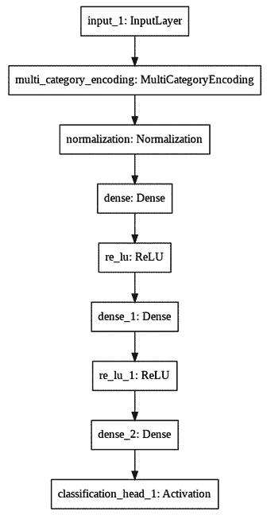
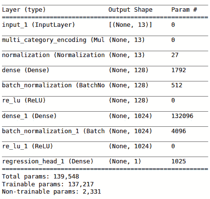

# 第六章：*第六章*：使用 AutoKeras 处理结构化数据

在本章中，我们将重点介绍如何使用 AutoKeras 处理结构化数据，也称为表格数据。我们将学习如何探索这种类型的数据集，并应用哪些技术来解决基于这种数据源的问题。

完成本章后，你将能够探索一个结构化数据集，转换它，并将其作为特定模型的数据源，此外还能够创建你自己的分类和回归模型来解决基于结构化数据的任务。

本章将具体涵盖以下主题：

+   理解结构化数据

+   处理结构化数据

+   创建一个结构化数据分类器来预测泰坦尼克号生还者

+   创建一个结构化数据回归器来预测波士顿房价

# 技术要求

本书中的所有编码示例都可以作为 Jupyter 笔记本下载，下载地址为本书 GitHub 仓库：[`colab.research.google.com/github/PacktPublishing/Automated-Machine-Learning-with-AutoKeras/blob/main/Chapter06/Chapter6_HousingPricePredictor.ipynb`](https://colab.research.google.com/github/PacktPublishing/Automated-Machine-Learning-with-AutoKeras/blob/main/Chapter06/Chapter6_HousingPricePredictor.ipynb)。

由于代码单元格可以执行，每个笔记本都可以自我安装，因此你可以添加你需要的代码片段来满足需求。因此，在每个笔记本的开头，都会有一个用于环境设置的代码单元格，用于安装 AutoKeras 及其依赖项。

因此，要运行本书中的编码示例，你只需要一台操作系统为 Ubuntu Linux 的计算机，并使用以下代码安装相应的 Jupyter 笔记本：

```py
$ apt-get install python3-pip jupyter-notebook
```

或者，你也可以使用 Google Colaboratory 来运行这些笔记本。在这种情况下，你只需要一个 Web 浏览器。有关更多详细信息，请参阅*第二章*中关于*使用 Google Colaboratory 的 AutoKeras*部分，*开始使用 AutoKeras*。此外，在该章节的*安装 AutoKeras*部分，你将找到其他安装选项。

# 理解结构化数据

结构化数据基本上就是表格数据；也就是说，由数据库中的行和列表示的数据。这些表格包含以下两种类型的结构化数据：

+   **数值数据**：这是在数值尺度上表示的数据。此外，它有两种表示方式，如下所示：

    a. **连续型**：可以在一个区间内取任何值的数据，例如温度、速度、身高等。例如，一个人的身高可以是任何值（在人类身高范围内），而不仅仅是某些固定的身高。

    b. **离散型**：只能取非可分整数值的数据，例如计数器。例子包括银行账户中的钱数、一个国家的人口等。

+   **类别数据**：这是只能取一组特定值的数据，通常对应可能的类别。它们又分为以下几类：

    a. **二元**：只能接受两个值（0/1）的数据

    b. **有序**：具有明确顺序的数据，例如一周中的每一天

需要了解每个特征的数据类型，以便应用适当的预处理方法。例如，如果 DataFrame 中的某一列包含有序数据，则必须先对其进行独热编码处理，然后才能传递给模型。

# 处理结构化数据

AutoKeras 允许我们快速、轻松地创建高性能的模型，以解决基于结构化数据的任务。

根据每列的格式，AutoKeras 会在输入模型之前自动进行预处理。例如，如果某列包含文本数据，它会将其转换为嵌入；如果列值是固定类别，它会将其转换为独热编码数组，等等。

在接下来的部分，我们将看到如何轻松处理表格数据集。

# 创建一个结构化数据分类器来预测 Titanic 幸存者

该模型将根据从 Titanic Kaggle 数据集中提取的特征，预测 Titanic 乘客是否会在船沉没时生还。尽管运气是生存的重要因素，但某些群体的生还几率更高。

该数据集中包含一个训练数据集和一个测试数据集。两个数据集都类似，包含乘客信息，如姓名、年龄、性别、社会经济阶层等。

训练数据集（`train.csv`）包含关于部分乘客的详细信息（准确来说是 891 名），并揭示了他们是否在`survived`列中生还。

测试数据集（`test.csv`）将用于最终评估，并包含其他 418 名乘客的类似信息。

AutoKeras 将在训练数据中寻找模式，以预测其他 418 名登船乘客（见`test.csv`）是否幸存。

完整的源代码笔记本可以在[`github.com/PacktPublishing/Automated-Machine-Learning-with-AutoKeras/blob/main/Chapter06/Chapter6_TitanicClassifier.ipynb`](https://github.com/PacktPublishing/Automated-Machine-Learning-with-AutoKeras/blob/main/Chapter06/Chapter6_TitanicClassifier.ipynb)找到。

现在，让我们详细查看笔记本中的相关单元格：

+   **安装 AutoKeras**：正如我们在其他示例中提到的，笔记本顶部的这段代码负责通过 pip 包管理器安装 AutoKeras 及其依赖项：

    ```py
    !pip3 install autokeras
    ```

+   **导入必要的包**：以下代码行加载了 TensorFlow、pandas 和 AutoKeras，作为该项目所需的依赖项：

    ```py
    import tensorflow as tf
    import autokeras as ak
    import pandas as pd
    ```

+   **创建数据集**：首先，我们将加载 Titanic 数据集作为 pandas 数据框：

    ```py
    train_file_url = "https://storage.googleapis.com/tf-datasets/titanic/train.csv"
    test_file_url = "https://storage.googleapis.com/tf-datasets/titanic/eval.csv"
    train_df = pd.read_csv(train_file_url)
    test_df = pd.read_csv(test_file_url)
    ```

    现在，我们必须将标签（目标）与其他乘客特征（输入）分开：

    ```py
    x_train_df, y_train_df = train_df.drop(['survived'], axis=1), train_df['survived']
    ```

+   **展示一些样本**：接下来，我们将打印前几行，以查看列的值：

    ```py
    train_df.head()
    ```

    这是前面代码的输出：


图 6.1 – 训练数据集前几行的笔记本输出

前面的截图显示了乘客信息在不同列中的表示。第一列（`survived`）将作为预测目标。

现在，是时候创建分类器模型了。

## 创建分类器

现在，我们将使用 AutoKeras 的`StructuredDataClassifier`来寻找最佳分类模型。仅在这个示例中，我们将`max_trials`（尝试的不同 Keras 模型的最大数量）设置为`2`，并将 epochs 参数设置为`10`：

```py
clf = ak.StructuredDataClassifier(
max_trials=2, 
overwrite=True)
```

让我们运行训练过程，以搜索训练数据集的最佳分类器：

```py
clf.fit(
    x_train_df,
    y_train_df,
    epochs=10,
)
```

`StructuredDataClassifier`接受不同的输入格式。你可以像我们在前面的代码中那样传入一个 pandas DataFrame，但它也接受其他格式，如 NumPy 数组和 TensorFlow 数据集。它还允许你直接传递 URL 或文件路径，模型会自动下载并加载。要使用这种选项，必须将目标列的名称作为第二个参数传递：

```py
clf.fit(
    train_file_url,
    'survived',
    epochs=10,
)
```

两种情况的输出将会相似：


图 6.2 – 结构化数据分类器训练的笔记本输出

之前的输出显示训练数据集的准确率在提高。

如我们所见，我们在验证集上达到了`0.84`的最佳预测准确率。这是一个相当不错的数字，仅用了几秒钟的训练。我们将搜索限制为 10 个 epoch 和两种架构（`max_trials = 2`）。简单地增加这些数字将给我们带来更好的准确率，但也会花费更长时间来完成训练。

## 评估模型

让我们使用测试数据集评估最佳模型：

```py
clf.evaluate(test_file_url, 'survived')
```

这是前面代码的输出：

```py
9/9 [==============================] - 0s 2ms/step - loss: 0.4322 - accuracy: 0.8068
[0.4321742355823517, 0.8068181872367859]
```

如我们所见，`0.80`也是一个非常好的最终预测分数，考虑到我们所投入的训练时间。

## 可视化模型

现在我们有了一个胜出的模型，让我们来看一下它的架构摘要：

```py
model = clf.export_model()
model.summary()
```

这是前面代码的输出：


图 6.3 – 最佳模型架构摘要

如我们所见，AutoKeras 已经为我们完成了所有的预处理工作，通过将类别列转换为类别并对其进行标准化。

让我们看一下这个的可视化表示：



图 6.4 – 最佳模型架构可视化

在数据预处理模块（多类别和标准化）之后，AutoKeras 选择了一个全连接神经网络。这是一个经典的机器学习架构，适用于表格数据。这是有道理的，因为结构化数据更适合用经典的机器学习模型进行训练，因为数据中的模式更加明确。

在下一节中，我们将通过预测房价来解决结构化数据回归问题。

# 创建一个结构化数据回归器以预测波士顿房价

在接下来的示例中，我们将尝试预测 1970 年代中期波士顿郊区的中位房价，给定该时段的郊区数据特征，如犯罪率、财产税率、当地财产等。

我们将创建一个模型，基于特征预测特定郊区的房价。为此，我们将使用`boston_housing`数据集来训练该模型，我们需要将其添加到我们的仓库中（[`github.com/PacktPublishing/Automated-Machine-Learning-with-AutoKeras/blob/main/boston.csv`](https://github.com/PacktPublishing/Automated-Machine-Learning-with-AutoKeras/blob/main/boston.csv)）。我们将使用的数据集相对较小——包含 506 个样本，分为 404 个训练样本和 102 个测试样本。请注意，该数据集没有经过标准化，这意味着输入数据中的每个特征在其值上应用不同的尺度。例如，一些列的值范围在 0 到 1 之间，而其他的则在 1 到 12 之间、0 到 100 之间，等等。因此，这是一个很好的数据集，用于测试 AutoKeras 的自动预处理功能。

数据集的特征（列）可以总结如下：

+   **CRIM**：按城镇分类的犯罪率（人均）

+   **ZN**：用于 25,000 平方英尺以上地块的住宅用地比例

+   **INDUS**：每个城镇的非零售商业用地比例

+   **CHAS**：查尔斯河虚拟变量（若该地块界限为河流，则为 1；否则为 0）

+   **NOX**：氮氧化物浓度（每 1000 万分之一）

+   **RM**：每个住宅的平均房间数

+   **AGE**：1940 年之前建造的自住单元的比例

+   **DIS**：到波士顿五个就业中心的加权平均距离

+   **RAD**：可达径向高速公路的可达性指数

+   **TAX**：每$10,000 的全额财产税率

+   **PTRATIO**：按城镇分类的师生比

+   **LSTAT**：低收入人群的百分比

+   **MEDV**：业主自住房屋的中位价值（以千美元为单位）

以下截图展示了该数据集的一些样本：


图 6.5 – 波士顿住房数据集的一些样本

由于我们要近似预测一个价格，因此我们将使用结构化数据回归器来完成这项任务。

本示例的笔记本及完整源代码可以在[`github.com/PacktPublishing/Automated-Machine-Learning-with-AutoKeras/blob/main/Chapter06/Chapter6_HousingPricePredictor.ipynb`](https://github.com/PacktPublishing/Automated-Machine-Learning-with-AutoKeras/blob/main/Chapter06/Chapter6_HousingPricePredictor.ipynb)找到。

让我们详细解释一下笔记本中的相关代码单元：

+   **获取波士顿房价数据集**：在训练之前，我们必须下载包含每个郊区特征的数据集，其中包括中位数价格：

    ```py
     df = pd.read_csv("https://raw.githubusercontent.com/PacktPublishing/Automated-Machine-Learning-with-AutoKeras/main/boston.csv")
    y = df.pop('MEDV')
    X = df
    train_data, test_data, train_targets, test_targets = train_test_split(X,y,test_size=0.2)
    ```

+   **数据预处理**：由于我们有数据集作为一个包，我们将在创建训练集和测试集时使用**中位数价格列**（**MEDV**）作为目标值。请注意，在将数据传递给模型之前，一些列会先进行预处理。AutoKeras 会自动对这些列进行预处理，对连续值进行归一化（将值设置在 0 和 1 之间），对离散值进行分类（进行独热编码）。稍后在模型架构中，我们将看到为此目的创建的数据预处理模块。

## 创建结构化数据回归器

因为我们想从一组特征中预测一个价格，而这个价格是一个标量值，所以我们将使用 AutoKeras 的`StructuredDataRegressor`，这是一个结构化数据回归类，它创建一个回归模型，接受`x`作为结构化数据集（如 CSV 文件名、NumPy 数组、pandas DataFrame 或 TensorFlow 数据集）以及`y`作为标签数据集（与输入数据集格式相同的一列数据集，或者如果输入数据来自 CSV 文件，则是目标列名称）作为输入。

在这种情况下，数据集较小，训练周期比其他示例快，因此我们将`max_trials`设置为 20，并将 epochs 参数设置为 50：

```py
reg = ak.StructuredDataRegressor(
    max_trials=20,
    overwrite=True,
    metrics=['mae']
)
```

对于回归模型，AutoKeras 使用**均方误差**（**MSE**）作为默认损失函数。正如我们在前几章中解释的那样，这是预测值与目标值之间差异的平方。但对于这个示例，我们在训练过程中还会监控一个新的指标，这将为我们提供更多信息：**平均绝对误差**（**MAE**）。这是预测值与目标值之间差异的绝对值。例如，在这个问题中，MAE 为 1.5 意味着你的预测平均偏差为$1,500。

让我们运行训练过程，搜索最佳模型：

```py
reg.fit(
    train_data,
    train_targets,
    epochs=50,
)
```

下面是前述代码的输出：


图 6.6 – 训练房价预测模型的笔记本输出

如前述输出所示，在不到 5 分钟的时间内，我们的模型的最佳验证损失（MSE）为`5.05`。这意味着在最终得分中，预测的平均偏差为`2.24`（5.05 的平方根）。这超过了$2,200。对于只有 5 分钟的训练时间来说，这并不是一个坏结果，因此让我们用测试集来评估它。

## 评估模型

我们准备用测试数据集评估我们的最终模型。让我们开始吧：

```py
reg.evaluate(test_data, test_targets)
```

这是前述代码的输出：

```py
4/4 [==============================] - 0s 5ms/step - loss: 13.9013 - mae: 2.4202
[13.901305198669434, 2.420168161392212]
```

让我们看一下我们的新指标，MAE。它的值为`2.420`，这意味着我们的预测平均偏差为$2,420。这是对我们投入时间的一个非常好的预测误差。如果我们运行更多的试验和周期，很可能会得到更好的结果。

## 模型可视化

现在，是时候看看我们底层的内容了：

```py
keras_model = reg.export_model()
keras_model.summary()
```

这是前述代码的输出：



图 6.7 – 最佳模型架构总结

就像前面的分类示例一样，AutoKeras 已经为我们完成了所有的预处理工作，通过`multi_category_encoding`块将具有离散值的列转换为类别，并使用`normalization`块对连续值列进行归一化。

让我们看看它的视觉表示：


图 6.8 – 最佳模型架构可视化

在上一张图中，我们可以更加简略地看到模型的不同层次。现在，让我们总结一下本章学到的内容。

# 摘要

在这一章中，我们学习了什么是结构化数据及其不同的类别，如何用不同的结构化数据格式（如 pandas、CSV 文件等）来喂养我们的 AutoKeras 模型，并且学会了如何使用一些 pandas 函数加载和探索表格数据集。

最后，我们通过创建一个强大的结构化数据分类器模型来预测泰坦尼克号的幸存者，并创建一个强大的结构化数据回归模型来预测波士顿房价，应用了这些概念。

通过这些技术，您已经学会了如何使用 AutoKeras 解决基于结构化数据的任何问题。使用这些技术，任何`CSV`文件都可以成为您可以用来训练模型的数据集。

在下一章中，我们将学习如何使用 AutoKeras 对文本进行情感分析。
