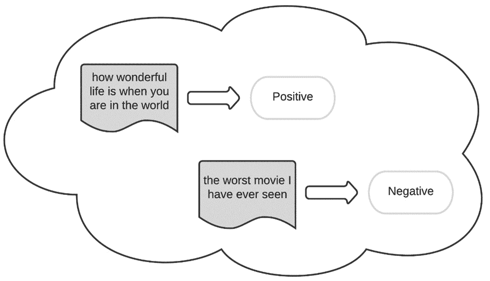
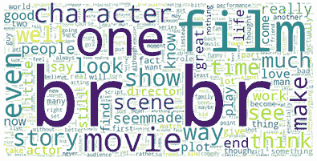
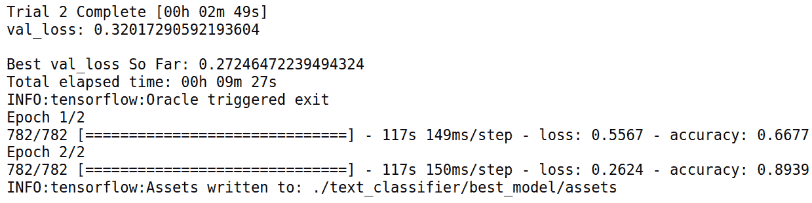
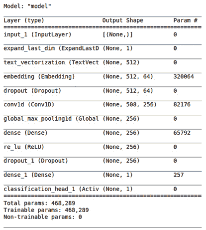
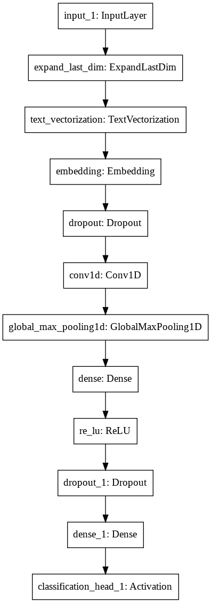
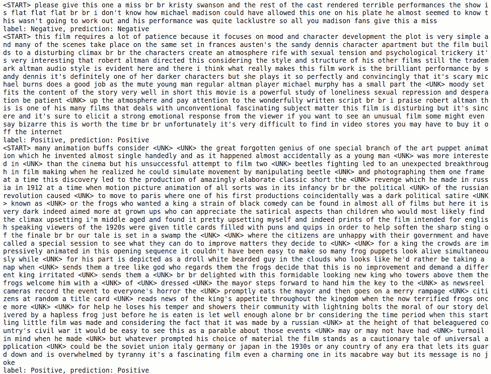

# 第七章：*第七章*：使用 AutoKeras 进行情感分析

让我们先定义标题中的不寻常术语。**情感分析**是文本分类中广泛使用的术语，基本上是通过使用**自然语言处理**（**NLP**）结合**机器学习**（**ML**）来解读和分类文本中的情感。

为了理解这个概念，让我们假设任务是判断一篇电影评论是正面还是负面。您自己看完评论就能做出判断，对吧？然而，如果我们的老板发给我们 1000 条电影评论让我们明天完成，那事情就复杂了。这就是情感分析变得有趣的地方。

本章将使用文本分类器从文本数据中提取情感。文本分类的大部分概念已经在*第四章*，*使用 AutoKeras 进行图像分类和回归*中解释过了，所以在本章中，我们将通过实现情感预测器以一种实际的方式来应用它们。然而，在我们开始之前，我们将首先了解开始工作所需的技术要求。

本章将具体涵盖以下主题：

+   创建情感分析器

+   创建分类器

+   评估模型

+   可视化模型

+   分析特定句子中的情感

# 技术要求

本书中的所有代码示例都可以作为 Jupyter notebooks 下载，您可以从[`github.com/PacktPublishing/Automated-Machine-Learning-with-AutoKeras`](https://github.com/PacktPublishing/Automated-Machine-Learning-with-AutoKeras)获取。

由于代码单元可以执行，因此每个 notebook 都可以自我安装；您只需要添加需要的依赖代码片段。因此，在每个 notebook 的开头都有一个用于环境设置的代码单元，它会安装 AutoKeras 及其依赖项。

所以，要运行本章的代码示例，您只需要一台操作系统为 Ubuntu Linux 的计算机，并用以下代码安装 Jupyter Notebook：

```py
$ apt-get install python3-pip jupyter-notebook
```

或者，您也可以使用 Google Colaboratory 运行这些 notebooks，这种情况下您只需要一个网页浏览器。更多细节请参见*第二章*，*使用 Google Colaboratory 进行 AutoKeras*部分。此外，在该章的*安装 AutoKeras*部分，您还可以找到其他安装选项。

现在，让我们通过一些实际示例来实践我们所学的内容。

# 创建情感分析器

我们要创建的模型将是一个用于情感的二分类器（1=正面/0=负面），数据集来自 IMDb 情感数据集。该数据集是一个二分类情感分类数据集，包含 25,000 条带情感标签的电影评论用于训练，另有 25,000 条用于测试：



图 7.1 – 在两个样本上使用情感分析的示例

类似于*第四章*中的 Reuters 示例，*使用 AutoKeras 进行图像分类和回归*，每个评论都被编码为一个单词索引列表（整数）。为了方便起见，单词根据其在数据集中的总体频率进行索引。例如，整数 *3* 表示数据中第三频繁出现的单词。

包含完整源代码的笔记本可以在[`github.com/PacktPublishing/Automated-Machine-Learning-with-AutoKeras/blob/main/Chapter07/Chapter7_IMDB_sentiment_analysis.ipynb`](https://github.com/PacktPublishing/Automated-Machine-Learning-with-AutoKeras/blob/main/Chapter07/Chapter7_IMDB_sentiment_analysis.ipynb)找到。

现在，让我们详细查看笔记本中的相关单元格：

+   **安装 AutoKeras**：正如我们在其他示例中提到的，笔记本顶部的这段代码负责使用 pip 包管理器安装 AutoKeras 及其依赖项：

    ```py
    !pip3 install autokeras
    ```

+   **导入必要的包**：以下几行代码加载 TensorFlow、内置的 Keras Reuters 数据集、NumPy 和 AutoKeras，作为本项目所需的依赖项：

    ```py
    import tensorflow as tf
    import numpy as np
    import autokeras as ak
    ```

+   `imdb_sentiment_raw` 函数。查看笔记本中的代码以获取更多细节：

    ```py
    (x_train, y_train), (x_test, y_test) = imdb_sentiment_raw()
    print(x_train.shape)  # (25000,)
    print(y_train.shape)  # (25000, 1)
    ```

    这是输出：

    ```py
    (25000,)
    (25000, 1)
    ```

+   **展示一些样本**：接下来，我们可以打印出第一个样本中的一些单词，了解其包含的内容：

    ```py
    print(x_train[0][:50])
    ```

    这是输出：

    ```py
    <START> vs from it as must exporters ability whole
    ```

为了更清楚地看到这一点，让我们渲染一个包含最常见单词的词云。词云（也称为标签云）是一种基于文本的数据可视化技术，其中单词根据其在文本中出现的频率显示为不同的大小：



图 7.2 – 包含数据集中最频繁单词的词云

现在，是时候创建分类器模型了。

# 创建情感预测器

现在，我们将使用 AutoKeras `TextClassifier` 来找到最佳的分类模型。为了这个示例，我们将 `max_trials`（最大尝试的 Keras 模型数量）设置为 `2`；我们不需要设置 epoch 参数；而是必须定义一个 `EarlyStopping` 回调，设置为 `2` 个 epoch，这样如果验证损失在连续两个 epoch 中没有改善，训练过程将停止：

```py
clf = ak.TextClassifier(max_trials=2)
cbs = [tf.keras.callbacks.EarlyStopping(patience=2)]
```

让我们运行训练过程并为训练数据集寻找最佳分类器：

```py
clf.fit(x_train, y_train, callbacks=cbs)
```

这是输出：



图 7.3 – 文本分类器训练的笔记本输出

上述输出显示训练数据集的准确率在提高。

如我们所见，我们在验证集上得到了 `0.28` 的损失值。对于几分钟的训练来说，这还算不错。我们已经将搜索限制为两种架构（`max_trials = 2`）。像其他示例一样，增加此数字会给我们一个更准确的模型，但完成的时间也会更长。

# 评估模型

现在，是时候使用测试数据集评估最佳模型了：

```py
clf.evaluate(x_test, y_test)
```

这是输出结果：

```py
782/782 [==============================] - 41s 52ms/step - loss: 0.3118 - accuracy: 0.8724

[0.31183066964149475, 0.8723599910736084]
```

如我们所见，`0.8724` 是我们投入时间的一个非常好的最终预测准确度。

# 可视化模型

现在，我们可以查看最佳生成模型的架构简要概述：

```py
model = clf.export_model()
model.summary()
```

这是输出结果：



图 7.4 – 最佳模型架构摘要

如我们所见，AutoKeras 在*第四章*中所做的分类示例中，*使用 AutoKeras 进行图像分类和回归*，也选择了卷积模型（Conv1D）来执行此任务。正如我们在该章开头所解释的，当输入句子的顺序对预测不重要时，这种架构表现得非常好；不同电影评论之间没有相关性。

这是该架构的可视化表示：



图 7.5 – 最佳模型架构可视化图

如你所知，生成模型并选择最佳模型是由 AutoKeras 自动完成的，但让我们更详细地解释这些模块。

每个模块表示一个层，每个层的输出都连接到下一个层的输入，除了第一个模块，其输入是文本，以及最后一个模块，其输出是预测值。Conv1D 之前的模块都是数据预处理模块，负责将文本向量化生成嵌入，以便输入到 Conv1D 模块，并通过最大池化层减少滤波器的维度。请注意，AutoKeras 还添加了几个 dropout 模块来减少过拟合。

# 分析特定句子的情感

现在，让我们看一下来自测试集的一些预测样本：

```py
import tensorflow as tf
tf.get_logger().setLevel('ERROR')
def get_sentiment(val):
    return "Positive" if val == 1 else "Negative"
for i in range(10):
    print(x_test[i])
    print("label: %s, prediction: %s" % (get_sentiment(y_test[i][0]), get_sentiment(clf.predict(x_test[i:i+1])[0][0])))
```

这是前面代码的输出结果：



图 7.6 – 基于测试数据集前 10 个句子的某些预测

如你所见，模型预测与测试数据集前 10 个样本的标签完全匹配。

# 摘要

在本章中，我们学习了情感分析在现实世界中的重要性，以及如何从文本数据中提取情感并在几行代码中实现情感预测器。

在下一章，我们将介绍一个非常有趣的话题：我们将使用 AutoKeras 通过文本分类器根据新闻内容来分类新闻话题。
