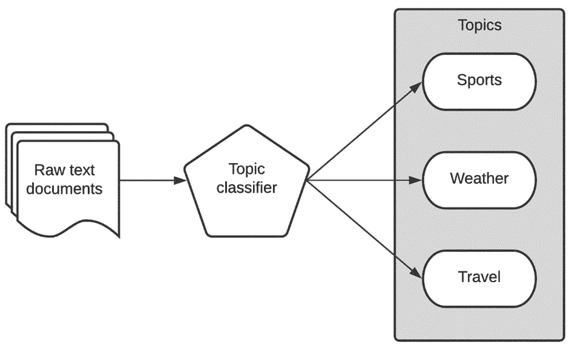
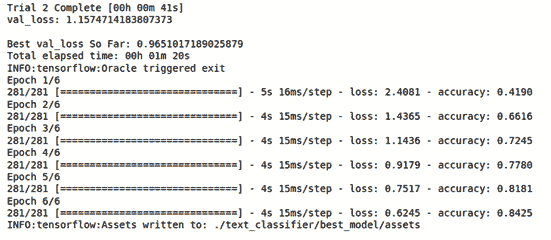
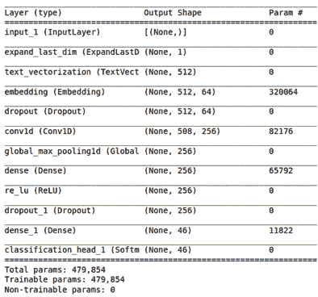
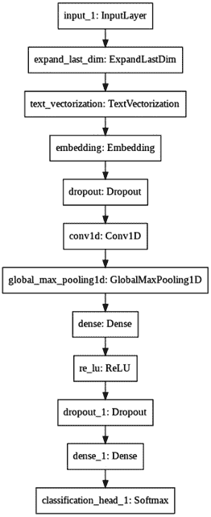

# 第八章：*第八章*：使用 AutoKeras 进行主题分类

有时，我们需要将某些特定的文本（如产品或电影评论）分类到一个或多个类别中，方法是为其分配标签或主题。主题分类是一种监督式机器学习技术，正是用来完成这项工作的：预测给定文本属于哪个类别。作为一种监督式模型，它需要通过一组已经分类的训练数据进行训练，包括文本及其对应的类别。

本章将主要是实践性的，因为我们在前几章为基于文本的任务打下了基础。在本章结束时，您将学会如何使用 AutoKeras 创建主题分类器，并将其应用于任何基于主题或类别的数据集。

本章将涵盖以下主要主题：

+   理解主题分类

+   使用 AutoKeras 创建一个主题分类器

+   自定义模型搜索空间

首先，让我们来看一下本章的技术要求。

# 技术要求

本书中的所有代码示例都可以作为 Jupyter 笔记本下载，地址为 [`github.com/PacktPublishing/Automated-Machine-Learning-with-AutoKeras`](https://github.com/PacktPublishing/Automated-Machine-Learning-with-AutoKeras)。

由于代码单元可以执行，因此每个笔记本都可以自我安装；只需添加所需的代码片段即可。因此，在每个笔记本的开头，都会有一个用于环境设置的代码单元，它会安装 AutoKeras 及其依赖项。

因此，要运行本章的代码示例，您只需要一台操作系统为 Ubuntu Linux 的计算机，并安装了 Jupyter Notebook，您可以通过以下代码行来安装：

```py
$ apt-get install python3-pip jupyter-notebook
```

另外，您可以使用 Google Colaboratory 运行这些笔记本，在这种情况下，您只需要一个网页浏览器。详情请见 *第二章*，*使用 Google Colaboratory 的 AutoKeras*。此外，在该章节的 *安装 AutoKeras* 部分，您将找到其他安装选项。

现在，让我们通过一些实际的示例，将所学知识付诸实践。

# 理解主题分类

我们在 *第五章*，*使用 AutoKeras 进行文本分类和回归* 中，看到过一个简单的主题分类示例，其中有一个垃圾邮件分类器的例子。在那个例子中，我们从电子邮件内容中预测了一个类别（垃圾邮件/非垃圾邮件）。在这一节中，我们将使用类似的文本分类器，将每篇文章分类到其对应的主题中。通过这样做，我们将获得一个模型，能够确定每个新闻项对应的主题（类别）。

例如，假设我们的模型输入了以下标题：

```py
"The match could not be played due to the eruption of a tornado"
```

这将输出 `weather` 和 `sports` 主题，如下图所示：



图 8.1 – 新闻主题分类器的工作流

上面的图表展示了主题分类器管道的简化版本。原始文本被分类器处理，输出将是一个或多个类别。

在本章后面，我们将应用文本分类器对路透社新闻线数据集进行处理，将每篇文章分配到 46 个类别中的一个或多个。大多数文本分类的概念已经在*第五章*《使用 AutoKeras 进行文本分类与回归》中讲解过，因此本章我们将通过实现主题分类器以实际方式回顾其中的一些概念。

# 创建新闻主题分类器

我们将要创建的模型将对路透社新闻线分类数据集的新闻进行分类。它将读取每篇新闻的原始文本，并将其分类到各个部分，为每个部分分配一个标签（例如：体育、天气、旅游等）。

路透新闻线是一个包含 11,228 条来自路透社的新闻数据集，按 46 个主题进行标注。

每篇新闻的文本被编码为一个单词索引列表。这些是按数据集中的频率索引的整数。因此，在这里，整数 *1* 编码数据中最常见的第一个单词，*2* 编码第二常见的单词，依此类推。

包含完整源代码的笔记本可以在 [`github.com/PacktPublishing/Automated-Machine-Learning-with-AutoKeras/blob/main/Chapter08/Chapter8_Reuters.ipynb`](https://github.com/PacktPublishing/Automated-Machine-Learning-with-AutoKeras/blob/main/Chapter08/Chapter8_Reuters.ipynb) 找到。

现在，让我们详细查看笔记本中的相关单元格：

+   **安装 AutoKeras**：正如我们在前面的章节中提到的，笔记本顶部的这段代码负责使用 pip 包管理器安装 AutoKeras 及其依赖项：

    ```py
    !pip3 install autokeras
    ```

+   将 `tensorflow`、内置的 Keras 路透社数据集加载到内存中，以及将 `numpy` 和 `AutoKeras` 作为本项目所需的依赖项：

    ```py
    import tensorflow as tf
    from tensorflow.keras.datasets import reuters 
    import numpy as np
    import autokeras as ak
    ```

+   `reuters_raw` 函数。查看笔记本中的代码以了解更多细节：

    ```py
    (x_train, y_train), (x_test, y_test) = reuters_raw()
    print(x_train.shape)  # (8982,)
    print(y_train.shape)  # (8982, 1)
    ```

    这是前面代码的输出：

    ```py
    Downloading data from https://storage.googleapis.com/tensorflow/tf-keras-datasets/reuters.npz
    2113536/2110848 [==============================] - 0s 0us/step
    Downloading data from https://storage.googleapis.com/tensorflow/tf-keras-datasets/reuters_word_index.json
    557056/550378 [==============================] - 0s 0us/step
    (8982,)
    (8982, 1)
    ```

+   **可视化数据集样本**：接下来，我们可以打印出第一个样本中的一些单词，以了解其包含的内容：

    ```py
    print(x_train[0][:50])
    ```

    这是前面代码的输出：

    ```py
    <START> <UNK> <UNK> said as a result of its decemb
    ```

让我们看一下词云中最常见词语的分布。词云（也称为标签云）是一种基于文本的数据可视化技术，单词的显示大小取决于它们在文本中出现的频率：


图 8.2 – 新闻线数据集的词云

现在，让我们创建新闻线分类器模型。

## 创建分类器

现在，我们将使用 AutoKeras 的 `TextClassifier` 来寻找最佳的分类模型。仅此示例，我们将 `max_trials`（尝试的不同 Keras 模型数量的最大值）设置为 2\. 我们不会设置 epochs 参数，而是定义一个 `EarlyStopping` 回调，设定为 2 个 epoch。这样，训练过程将在验证损失连续两个 epoch 没有改善时停止：

```py
clf = ak.TextClassifier(max_trials=2)
cbs = [tf.keras.callbacks.EarlyStopping(patience=2)]
```

让我们运行训练过程，寻找训练数据集的最佳分类器：

```py
clf.fit(x_train, y_train, callbacks=cbs)
```

这是输出结果：



图 8.3 – 文本分类器训练的笔记本输出

之前的输出显示了训练数据集的准确性在不断提高。

如我们所见，我们在验证集上达到了 0.965 的损失值。仅仅 1 分钟的训练时间就得到了一个非常不错的结果。我们将搜索限制为两种架构（`max_trials = 2`）。增加这个数字会给我们一个更精确的模型，尽管也会花费更多的时间。

## 评估模型

现在，是时候用测试数据集来评估最佳模型了：

```py
Clf.evaluate(x_test, y_test)
```

这是输出结果：

```py
71/71 [==============================] – 1s 7ms/step – loss: 0.9743 – accuracy: 0.7778
[0.9742580652236938, 0.777827262878418]
```

如我们所见，0.77（77%）是我们投入训练时间（不到几分钟）后得到的一个不错的最终预测得分。

## 可视化模型

现在，让我们来看一下最佳生成模型的架构简要总结：

```py
Model = clf.export_model()
model.summary()
```

这是输出结果：



图 8.4 – 最佳模型架构总结

如我们所见，AutoKeras 已选择了一个卷积模型（Conv1D）来执行这个任务。正如我们在本章开头所解释的，当序列中元素的顺序对预测没有重要影响时，这种架构效果很好。

这是它的可视化表示：



图 8.5 – 最佳模型架构可视化

## 评估模型

如你所知，生成模型并选择最佳模型是由 AutoKeras 自动完成的，但我们来更详细地解释这些模块。

每个模块代表一个层级，且每个模块的输出都与下一个模块的输入相连，除了第一个模块，其输入是文本，最后一个模块，其输出是预测的数字。在 Conv1D 之前的模块都是数据预处理模块，负责将文本向量化，生成嵌入以供 Conv1D 模块使用，并通过最大池化层减少滤波器的维度。请注意，AutoKeras 还添加了几个 dropout 模块以减少过拟合。

# 自定义模型搜索空间

我们可以通过使用 `AutoModel` 替代 `TextClassifier` 来自定义模型的搜索空间，例如，通过为某些特定配置设置 `TextBlock`。

在以下代码片段中，我们告诉 AutoKeras 只生成使用`'ngram'`来向量化句子的模型。记住，如果我们没有指定这些参数，AutoKeras 将自动尝试所有可能的组合，直到数量达到`max_trial`参数所设定的值：

```py
input_node = ak.TextInput()
output_node = ak.TextBlock(block_type="ngram")(input_node)
output_node = ak.ClassificationHead()(output_node)
clf = ak.AutoModel(inputs=input_node, 
                   outputs=output_node, overwrite=True,
                   max_trials=1)
clf.fit(x_train, y_train, epochs=2)
```

现在，让我们总结一下本章所学内容。

# 总结

在本章中，我们学习了如何通过实现一个高性能的文本分类器来解决一个主题分类任务，该分类器可以在仅仅几行代码的情况下对新闻文章进行分类。

现在我们已经为处理文本打下了基础，接下来我们可以进入下一章，在那里你将学习如何使用 AutoKeras 处理多模态和多任务数据。
