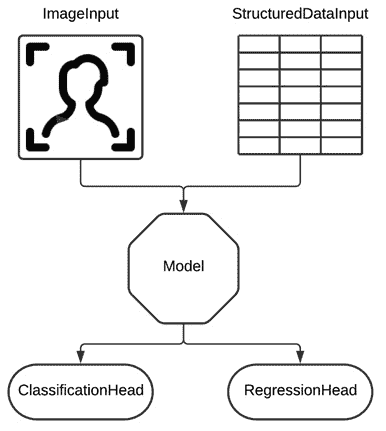
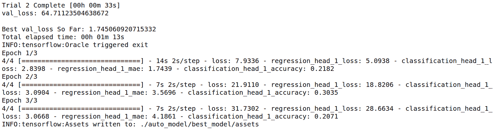
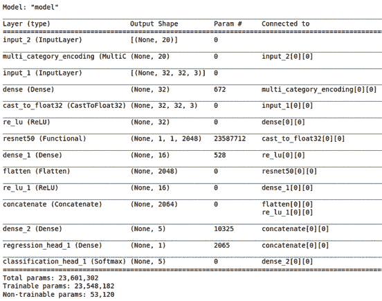
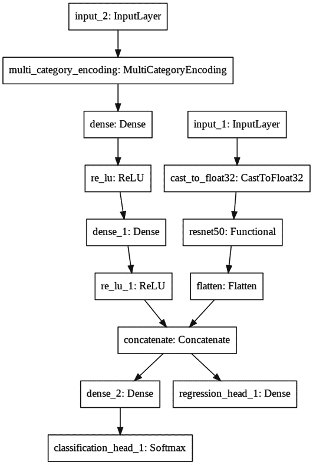

# 第九章：*第九章*：处理多模态和多任务数据

在本章中，我们将学习如何使用 AutoModel API 来处理多模态和多任务数据。

到本章结束时，你将学会如何使用创建具有多个输入和多个输出的模型所需的概念和工具。你将能够通过从头开始创建模型或将本章展示的实际示例适应其他相似数据集，将这些概念应用到自己的项目中。

在本章中，我们将讨论以下主题：

+   探索具有多个输入或输出的模型

+   创建一个多任务/多模态模型

+   自定义搜索空间

但首先，让我们解释一下本章的技术要求。

# 技术要求

本书中的所有代码示例都可以作为 Jupyter 笔记本下载，下载地址是[`github.com/PacktPublishing/Automated-Machine-Learning-with-AutoKeras`](https://github.com/PacktPublishing/Automated-Machine-Learning-with-AutoKeras)。

由于代码单元可以执行，因此每个笔记本都可以自我安装；只需添加包含所需依赖项的代码片段。因此，在每个笔记本的开头，都有一个用于环境设置的代码单元，用来安装 AutoKeras 及其依赖项。

因此，为了运行本章中的代码示例，你只需要一台运行 Ubuntu Linux 操作系统的计算机，并且必须通过以下代码行安装 Jupyter Notebook：

```py
$ apt-get install python3-pip jupyter-notebook
```

另外，你也可以使用 Google Colaboratory 运行这些笔记本，在这种情况下，你只需要一个网页浏览器。有关详细信息，请参见*第二章*，*AutoKeras 与 Google Colaboratory*。此外，在该章节的*安装 AutoKeras*部分，你将找到其他安装选项。

现在，让我们通过一个实际示例来实践在介绍中提到的这些概念。

# 探索具有多个输入或输出的模型

正如我们稍后将看到的，有时我们可能希望我们的模型同时获取来自不同来源的信息（多模态）和/或同时预测多个目标（多任务）。AutoKeras 有一个叫做**AutoModel**的类，允许我们将多个来源和目标定义为一组参数列表。在看实际示例之前，让我们稍微深入了解一下这个内容。

## 什么是 AutoModel？

AutoModel 是一个类，允许我们通过定义不仅是输入和输出，还包括其内部层来精细地定义模型。

它可以通过两种不同的方式使用：

+   **基本**：在这里，输入/输出节点被指定，AutoModel 推断模型的其余部分。

+   **高级**：在这里，高级架构通过使用功能 API 连接各层（模块）来定义，这与 Keras 的功能 API 相同。

让我们看一下每个示例。

### 基本示例

用户只需指定输入节点和输出头：

```py
import autokeras as ak
ak.AutoModel(
    inputs=[ak.ImageInput(), ak.TextInput()],
    outputs[ak.ClassificationHead(), ak.RegressionHead()])
```

接下来，让我们看一个高级示例。

### 高级示例

用户指定高级架构：

```py
import autokeras as ak
image_input = ak.ImageInput()
image_output = ak.ImageBlock()(image_input)
text_input = ak.TextInput()
text_output = ak.TextBlock()(text_input)
output = ak.Merge()([image_output, text_output])
classification_output = ak.ClassificationHead()(output)
regression_output = ak.RegressionHead()(output)
ak.AutoModel(
   inputs=[image_input, text_input],
   outputs=[classification_output, regression_output])
```

在前面的代码中，我们配置了 AutoModel 以创建一个具有多个输入（多模态）和多个输出（多任务）的模型。接下来，我们将解释这些概念，并通过创建自己的多模态模型来实际应用它们。

## 什么是多模态？

我们称数据为多模态数据，当每个数据实例包含多种信息形式时。例如，我们可以将一张照片保存为图像，但除了这张图像，它还包含关于拍摄地点的*元*信息。这些元信息可以视为结构化数据。

## 什么是多任务？

我们称一个模型为多任务模型，当它使用相同的输入特征预测多个目标时。例如，假设我们想按族群分类人物照片，同时还希望指定其年龄，年龄范围为 0 到 100。

下图展示了一个多模态和多任务神经网络模型的示例：



图 9.1 – 多模态和多任务神经网络模型示例

在这里，我们可以看到有两个条目：**图像**（**ImageInput**）和**结构化数据**（**StructuredDataInput**）。每个图像都与结构化数据中的一组属性相关联。通过这些数据，我们可以尝试同时预测**分类标签**（**ClassificationHead**）和**回归值**（**RegressionHead**）。

让我们通过实际示例更详细地了解这些概念。

# 创建一个多任务/多模态模型

基于本章开头提供的示例，我们将创建一个模型，该模型将图像及其结构化数据属性作为输入，并预测一个类别值和一个标量值。在这种情况下，我们将不使用现有数据集，而是生成我们自己的数据。我们将使用的笔记本，包含完整的源代码，可以在 [`github.com/PacktPublishing/Automated-Machine-Learning-with-AutoKeras/blob/main/Chapter09/Chapter9_MultiModel.ipynb`](https://github.com/PacktPublishing/Automated-Machine-Learning-with-AutoKeras/blob/main/Chapter09/Chapter9_MultiModel.ipynb) 上找到。

现在，让我们详细查看笔记本中的相关单元格：

+   **安装 AutoKeras**：正如我们在前几章中提到的，笔记本顶部的这段代码负责使用 pip 包管理器安装 AutoKeras 及其依赖项：

    ```py
    !pip3 install autokeras
    ```

+   `numpy` 和 `AutoKeras` 是该项目所需的依赖项：

    ```py
    import numpy as np
    import autokeras as ak
    ```

+   **创建数据集**：首先，我们将通过生成随机图像和结构化数据作为多模态数据来创建数据集：

    ```py
    import numpy as npnum_instances = 100
    image_data = np.random.rand(num_instances, 32, 32, 3).astype(np.float32)
    structured_data = np.random.rand(num_instances, 20).astype(np.float32)
    ```

    现在，生成一些用于分类和回归的多任务目标：

    ```py
    regression_target = np.random.rand(num_instances, 1).astype(np.float32)
    classification_target = np.random.randint(5, size=num_instances)
    ```

现在，是时候创建模型了。

## 创建模型

现在，我们将使用`AutoModel`创建模型，首先是基本配置，然后是高级配置。与之前的示例一样，我们将设置较小的`max_trials`和`epochs`，以避免训练过程花费太长时间。

首先，我们将使用多个输入和输出初始化模型：

```py
import autokeras as akmodel = ak.AutoModel(
    inputs=[ak.ImageInput(), ak.StructuredDataInput()],
    outputs=[
        ak.RegressionHead(metrics=['mae']),
        ak.ClassificationHead(loss='categorical_crossentropy', metrics=['accuracy'])
    ],
    overwrite=True,
    max_trials=2)
```

在之前的代码中，我们定义了两个输入（图像和结构化数据）和两个输出（回归和分类）。在这里，我们告诉模型，我们希望同时使用回归器和分类器来训练输入数据。

现在，让我们运行训练过程，以搜索适合训练数据集的最佳模型：

```py
model.fit(
    [image_data, structured_data],
    [regression_target, classification_target],
    epochs=3)
```

这是输出结果：



图 9.2 – 模型训练的笔记本输出

与之前的示例不同，在这里，我们可以看到输出显示了两个损失值——一个用于回归器，另一个用于分类器。在这种情况下，数据是随机生成的，因此没有必要关注性能评估。

## 可视化模型

现在，让我们看看最佳生成模型的架构摘要：

```py
keras_model = model.export_model()
keras_model.summary()
```

这是输出结果：



图 9.3 – 最佳模型架构总结

让我们简要描述一下用于该模型的各个模块。

在这种情况下，AutoKeras 创建了两个子模型——每个输入数据对应一个子模型。它选择了一个深度残差网络架构（**resnet50**），该架构我们已经在*第四章*中介绍过，*使用 AutoKeras 进行图像分类和回归*，用于处理图像数据，以及几个全连接层用于处理结构化数据。在消化了这两种数据源之后，两个子模型的结果被连接起来，再分开生成两个不同的输出（一个标量值和一个分类值）。

这里是该过程的可视化表示：



图 9.4 – 最佳模型架构可视化

现在，让我们在更高级的模式下使用 AutoModel，定制中间模块。

# 定制搜索空间

正如我们在本章开头提到的，使用 AutoModel 有一种高级方式。我们可以通过使用功能性 API 来定义整个模型架构，将层（模块）连接起来，这与 Keras 的功能性 API 相同。

让我们在以下示例中进行操作：

```py
input_node1 = ak.ImageInput()
output_node = ak.Normalization()(input_node1)
output_node = ak.ImageAugmentation()(output_node)
output_node1 = ak.ConvBlock()(output_node)
output_node2 = ak.ResNetBlock(version='v2')(output_node)
output_node1 = ak.Merge()([output_node1, output_node2])

input_node2 = ak.StructuredDataInput()
output_node = ak.CategoricalToNumerical()(input_node2)
output_node2 = ak.DenseBlock()(output_node)

output_node = ak.Merge()([output_node1, output_node2])
output_node1 = ak.ClassificationHead()(output_node)
output_node2 = ak.RegressionHead()(output_node)

model = ak.AutoModel(
    inputs=[input_node1, input_node2], 
    outputs=[output_node1, output_node2],
    overwrite=True,
    max_trials=2)

model.fit(
    [image_data, structured_data],
    [classification_target, regression_target],
    batch_size=32,
    epochs=3)
```

在这里，我们通过将一个模块的输出连接到下一个模块的输入，按顺序定义了每个模块。在这种情况下，我们通过添加一些图像预处理模块来进行定制，目的是进行归一化和数据增强。我们还将一个卷积层与 ResNet 层并行放置，以训练图像数据，该层也已进行定制。你甚至可以指定要使用的 ResNet 架构版本。

尽管这种模式更复杂，但它更强大且更灵活。请注意，你甚至可以指定想要使用的 ResNet 架构版本（v2）。需要注意的是，对于那些未自定义的参数（如版本），AutoKeras 会尝试不同的值组合，以找到最优解。

# 总结

在本章中，我们学习了什么是多任务模型，什么是多模态模型，以及如何使用强大的 AutoModel 类创建具有多个输入和输出的高效模型。现在，你已经准备好将这些概念应用到自己的多模态项目中，可以从头开始创建，或者通过调整这个实用示例来适应你自己的数据集。

在下一章中，我们将学习如何导出我们的模型，以及如何使用一个强大的可视化工具来实时跟踪和可视化诸如损失和准确率等指标的图形。
