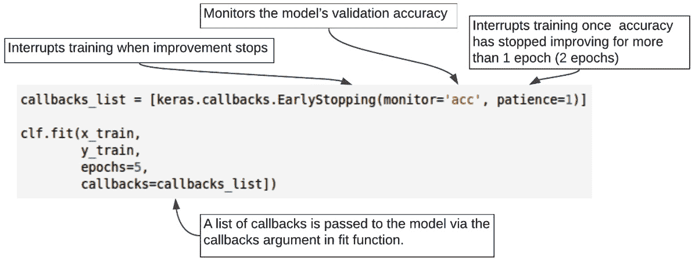
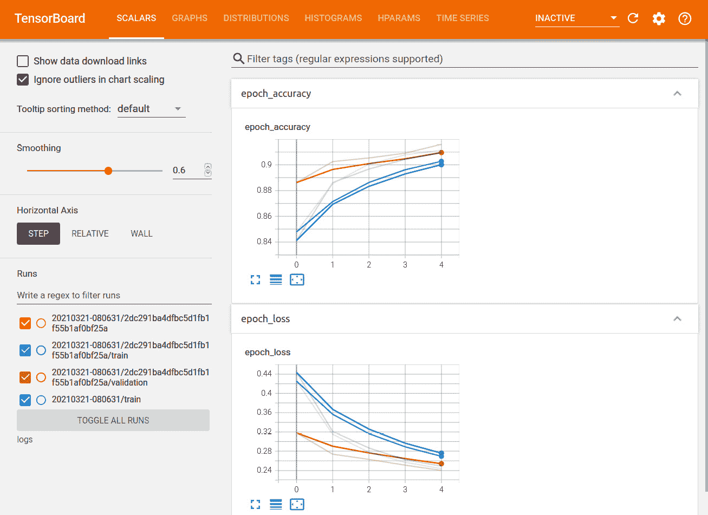
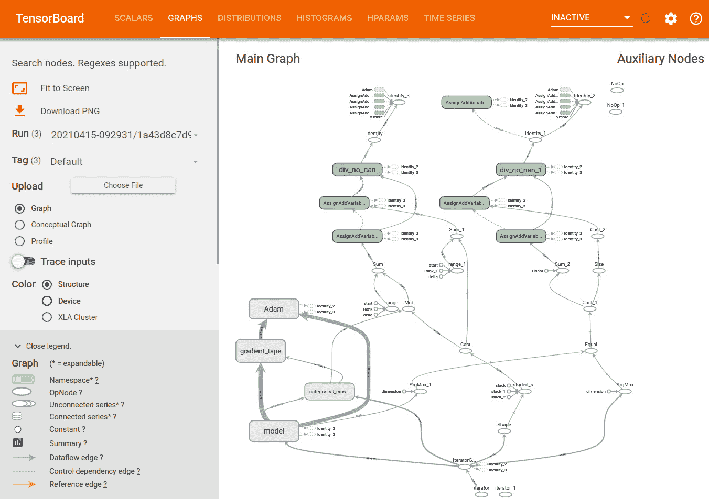
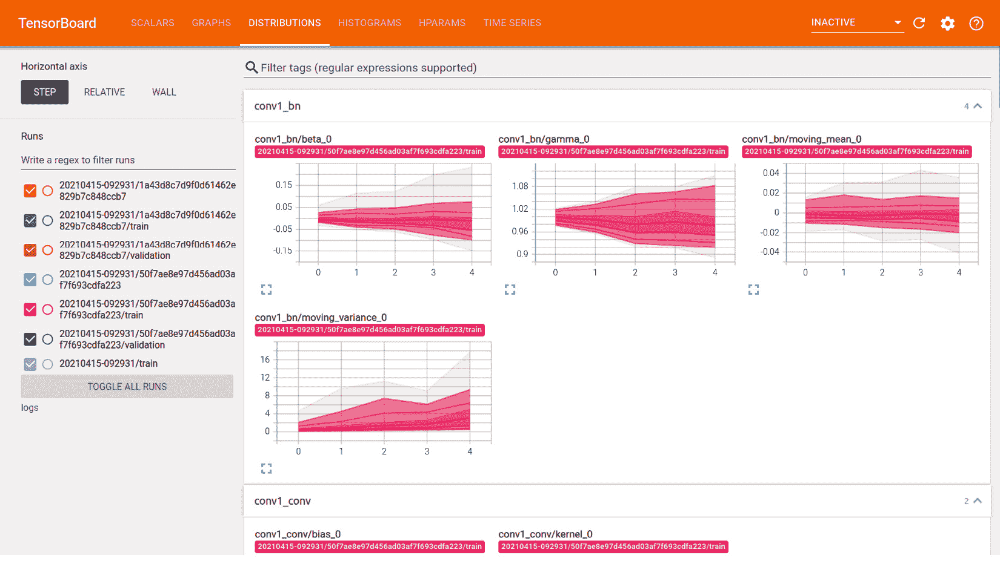
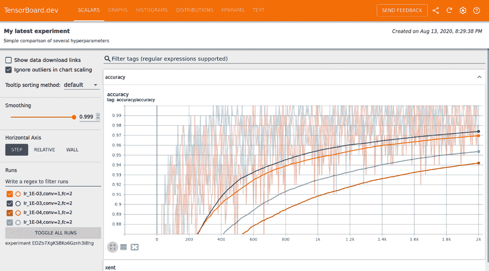
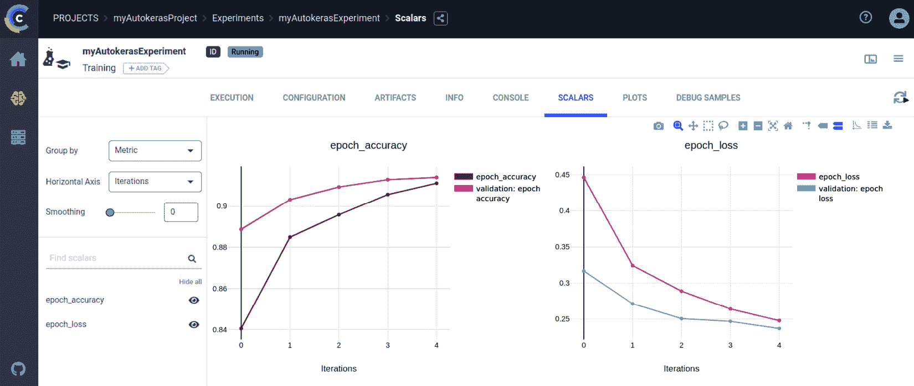
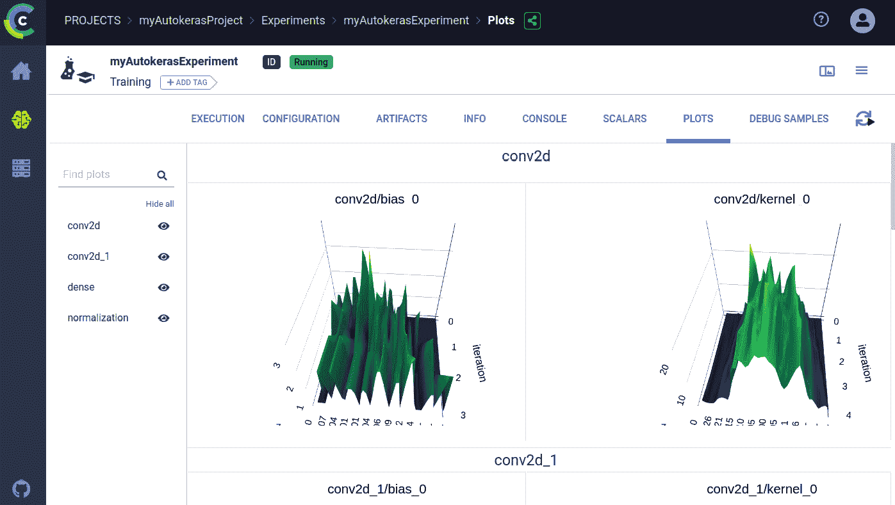
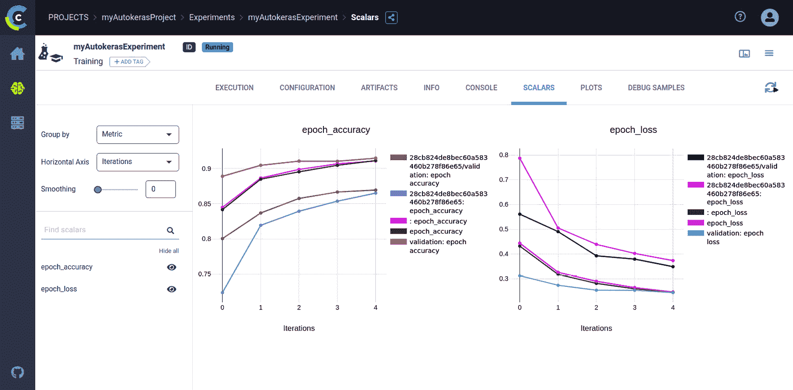

# 第十章：导出与可视化模型

在本章中，我们将学习如何导出和导入我们的 AutoKeras 模型。训练完成后，我们还将学习如何以图形方式实时可视化模型训练过程中发生的事情。

完成本章后，您将能够将模型导出和导入到磁盘，并且您将拥有一个强大的可视化工具，帮助您了解在模型训练过程中发生的情况。

本章将重点讲解以下要点：

+   导出您的模型：如何从磁盘保存和加载模型

+   使用 TensorBoard 可视化您的模型：如何使用这个强大的工具实时可视化您的模型

+   使用 ClearML 可视化和比较您的模型

让我们从第一点开始，但首先像往常一样确保我们已经安装了所有的要求。

# 技术要求

本书中的所有编码示例均以 Jupyter 笔记本形式提供，可以从以下网站下载：[`github.com/PacktPublishing/Automated-Machine-Learning-with-AutoKeras`](https://github.com/PacktPublishing/Automated-Machine-Learning-with-AutoKeras)。

由于代码单元可以执行，每个笔记本都可以自我安装，您只需添加包含所需要求的代码片段。因此，在每个笔记本的开始部分，都会有一个代码单元用于环境设置，安装 AutoKeras 及其依赖项。

因此，为了运行编码示例，您只需要一台运行 Ubuntu Linux 操作系统的计算机，并可以使用以下命令安装 Jupyter notebook：

```py
$ apt-get install python3-pip jupyter-notebook
```

另外，您也可以使用 Google Colaboratory 运行这些笔记本。在这种情况下，您只需要一个网页浏览器；有关详细信息，请参阅*第二章*中的*AutoKeras 与 Google Colaboratory*部分，*AutoKeras 入门*。此外，在主要章节*安装 AutoKeras*中，您还可以找到其他安装选项。

现在，让我们通过一个实际示例将上一节中的概念付诸实践。

# 导出模型

AutoKeras 找到的最佳模型可以轻松导出为 Keras 模型。

在将模型保存到磁盘时，可以选择两种不同的格式：TensorFlow SavedModel 格式和较旧的 Keras H5 格式。推荐使用 SavedModel 格式，这是我们调用`model.save()`时的默认选项。

## 如何保存和加载模型

现在，让我们一步步来看如何导出和恢复模型：

1.  使用以下代码块将模型导出为 Keras 模型：

    ```py
    model = my_autokeras_model.export_model() 
    ```

    现在，尝试使用 h5 格式作为备份保存为 TensorFlow 格式，因为出现了问题：

    ```py
    try:
        model.save("model_autokeras", save_format="tf")
    except:
        model.save("model_autokeras.h5")
    ```

1.  使用以下代码块重新加载模型：

    ```py
    from tensorflow.keras.models import load_model
    loaded_model = load_model("model_autokeras", custom_objects=ak.CUSTOM_OBJECTS)
    ```

代码几乎不需要解释，但我们将详细说明加载功能。在这个函数中，负责将模型从磁盘加载到内存中，我们将 `ak.CUSTOM_OBJECTS` 作为 `custom_objects` 参数传递。这告诉 Keras 函数我们要加载的模型具有自定义的 AutoKeras 对象。

一旦我们知道如何导入和导出模型，就该进入下一部分，在这一部分中，我们将学习在训练过程中进行可视化。这将帮助我们从学习过程提取观点。

# 使用 TensorBoard 可视化你的模型

为了开发高效且成功的模型，你需要了解实验过程中发生的事情，以便尽早反应，修正可能的异常或不想要的结果，例如过拟合和学习缓慢。这就是触觉回调概念发挥作用的地方。

回调是一个对象（实现特定方法的类实例），它在调用拟合时传递给模型，并且在训练过程中模型会在不同的时刻调用它。你可以访问模型状态和性能的所有可用数据，并根据这些数据采取以下措施：

+   中断训练，因为你已经停止学习或正在过拟合

+   保存模型；这样，训练可以从保存的点在未来恢复

+   记录度量指标，例如精度或损失

+   更改其状态，并修改其结构或超参数，例如学习率

以下是使用回调的一些示例：

+   模型检查点：在训练过程中的不同点保存当前模型的权重。

+   提前停止：当验证的损失不再改善时中断训练（并且当然保存训练过程中获得的最佳模型）。

+   在训练过程中动态调整某些参数的值，例如学习率。

+   在训练过程中记录训练和验证指标，或查看模型学习的表示方式，随着更新而变化。

有两个特别有用的回调函数用于训练，`EarlyStopping` 和 `ModelCheckpoint`。第一个用于在观察到的指标停止改进时中断训练，直到初始设置的次数。例如，使用此回调可以在开始过拟合时中断训练，从而避免需要用更少的轮次重新训练模型。这个回调通常与 `ModelCheckpoint` 一起使用，后者允许在训练过程中不断保存模型。



图 10.1 – 使用回调训练模型的示例

AutoKeras 会在训练过程中始终保存最好的模型，并默认使用 `EarlyStopping`，设定的 epoch 数量根据我们训练的模型类型而有所不同。不过，这种行为可以通过回调函数的 `fit` 参数进行自定义。

## 使用回调函数记录模型状态

记录指标的回调函数对于监控至关重要，因为它们允许像 TensorBoard 这样的工具实时可视化模型在训练过程中的学习进展，正如我们在这里所看到的。

因此，在我们的案例中，我们将设置回调函数来记录训练进度，使用以下命令：

```py
logdir = os.path.join("logs", datetime.datetime.now().strftime("%Y%m%d-%H%M%S"))
tensorboard_callback = tf.keras.callbacks.TensorBoard(logdir, histogram_freq=1)
```

在之前的代码中，我们定义了一个日志目录（`log_dir`），并创建了一个回调函数将模型检查点保存到该目录，这意味着 AutoKeras 会自动将每个 epoch 的指标保存到该文件夹中的多个日志文件中。我们还激活了直方图（`histogram_freq=1`），因此在 TensorBoard 的**直方图**标签中，你可以查看每一层的激活值的直方图。

在下一节中，我们将使用 TensorBoard 可视化日志，它是一个用于查看 TensorFlow 模型信息的 web 应用。由于 AutoKeras 是基于 TensorFlow 的，我们可以通过这种简单方式使用该工具来可视化我们的模型。

## 设置和加载 TensorBoard

TensorBoard 允许我们实时可视化不同的指标，例如损失和精度，同时渲染模型图（按层和操作分层），并显示权重、偏置或其他张量的直方图。

TensorBoard 可以直接在 Jupyter notebook 和 Colab 中使用。通过在 notebook 中加载 TensorBoard 扩展，可以实现这一功能。这是我们在本章中将采用的方法。

注意

如果你已经在同一个虚拟环境中安装了 Jupyter 和 TensorBoard，那么应该可以直接使用。如果你使用的是更复杂的设置，例如全局安装了 Jupyter 并为不同的 Conda/virtualenv 环境配置了内核，那么你需要确保 TensorBoard 二进制文件在 Jupyter notebook 的上下文中已经添加到 `PATH`。

首先，我们需要设置 `callbacks`，正如在上一节中解释的那样，记录训练进度到 `logs` 目录：

```py
logdir = os.path.join("logs", datetime.datetime.now().strftime("%Y%m%d-%H%M%S"))
tensorboard_callback = tf.keras.callbacks.TensorBoard(logdir)
```

现在我们将 `callbacks` 传递给训练函数：

```py
model.fit(x_train, 
        y_train,
        epochs=1, 
        callbacks=[tensorboard_callback])
```

一旦训练完成，我们就可以加载 `tensorboard` 扩展来可视化结果：

```py
%load_ext tensorboard
%tensorboard --logdir logs
```

上述代码行加载了 TensorBoard 仪表板，并将模型的 `logs` 目录作为输入：



图 10.2 – TensorBoard 显示模型训练结果

在之前的截图中，有两个图形，每个图形上有四条不同的线，表示两个候选模型的学习进度。

在第一个图中，两个最高的曲线分别显示了训练集和验证集的 epoch 精度，而较低的曲线则显示了另一个模型在训练集和验证集上的精度。

第二个图表中也发生了类似的情况，但在这种情况下，它表示的是损失值，而不是准确率。

我们还可以在 **GRAPHS** 标签页中看到模型的各个元素。**GRAPHS** 标签页显示了一个交互式低级 TensorFlow 图，展示了你的 AutoKeras 模型使用的特征：



](img/B16953_10_03.jpg)

图 10.3 – TensorBoard 显示模型图

在前面的截图中，我们可以看到模型图的一部分，以及它的不同层和操作。正如你所看到的，模型比你预期的要复杂得多。当你定义分类器时，代码只有三行，但在幕后，AutoKeras 构建了一个相当复杂的图结构来使其工作。

在这里，我们还可以可视化不同层中的权重/偏差分布：



](img/B16953_10_04.jpg)

图 10.4 – TensorBoard 显示模型层的分布

还有许多其他可用的选项，我们在此不做详细解释。TensorBoard 是一个非常强大且完整的工具，它的功能范围超出了本书的讨论。以下网址是一个很好的起点：[`www.tensorflow.org/tensorboard/get_started`](https://www.tensorflow.org/tensorboard/get_started)。

现在，让我们在下一节中看看如何将我们的实验分享给全世界。

## 使用 TensorBoard.dev 分享你的 ML 实验结果

TensorBoard.dev 是一个免费的公共服务，允许你上传 TensorBoard 记录并获得一个永久链接，可以与任何人分享，同时也可以用于你的学术文章、博客、社交媒体等。这可以提高实验的可重复性和协作性。

你可以通过运行以下命令简单地使用 TensorBoard.dev：

```py
!tensorboard dev upload \
  --logdir logs/fit \
  --name "(optional) My latest AutoKeras experiment" \
  --description "(optional) Simple comparison of several hyperparameters" \
  --one_shot
```

上面的命令会将模型的 `logs` 目录上传到 TensorBoard.dev：

```py
New experiment created. View your TensorBoard at: https://tensorboard.dev/experiment/TPcKbLPeRAqZ1GmRWDAdow/
```

现在，点击链接将会打开一个浏览器，在其中我们可以看到 TensorBoard 面板，网址显示为 TensorBoard.dev 网站，如下所示：



图 10.5 – 在 TensorBoard.dev 上分享的模型训练结果

正如我们所看到的，TensorBoard 是一个非常强大的工具，用于监控你的模型，但如果你需要追踪实验结果，并与其他团队进行比较和共享，那么有一个名为 ClearML 的 AutoKeras 扩展专门用于监控和追踪实验，它允许访问 TensorBoard 日志，并为其补充了许多额外的功能。我们将在下一节中详细了解这一点。

# 使用 ClearML 可视化和比较你的模型

ClearML（前身为 Trains）是一个完整的开源 ML/DL 实验解决方案，它会自动跟踪你需要的所有内容，帮助你记录工作、可视化结果，并通过直观的 Web 界面重现、调整和比较实验。

ClearML 允许你执行以下任务：

+   在 ClearML Web UI 中可视化实验结果。

+   跟踪并上传模型。

+   跟踪模型性能并创建跟踪排行榜。

+   重新运行实验，在任何目标机器上重现实验，并调整实验。

+   比较实验。

要在你的 AutoKeras 项目中使用它，你只需要在代码中初始化一个 ClearML 任务，ClearML 会自动记录报告给 TensorBoard、Matplotlib、Plotly 和 Seaborn 的标量、图形和图像，以及你添加到代码中的所有其他自动日志和显式报告。

## 将 ClearML 添加到代码中

只需将这两行代码添加到你的项目中：

```py
from clearml import Task
task = Task.init(project_name="myAutokerasProject", task_name="myAutokerasExperiment")
```

当代码运行时，它会在 ClearML 服务器中初始化一个任务，并在控制台输出指向实验日志的超链接：

```py
CLEARML Task: created new task id=c1f1dc6cf2ee4ec88cd1f6184344ca4e
CLEARML results page: https://app.clearml-master.hosted.allegro.ai/projects/1c7a45633c554b8294fa6dcc3b1f2d4d/experiments/c1f1dc6cf2ee4ec88cd1f6184344ca4e/output/log
```

ClearML 会检查 AutoKeras 的训练过程，查找 TensorBoard 回调函数，以及任何类型的输出，包括日志、指标、图像等。

在生成的实验链接中，你可以实时查看与 AutoKeras 自动生成的模型相关的仪表板，这些仪表板包含不同的图表。这些图表会在训练过程中生成，并且可以看到它们的准确性、在训练和评估数据集上的表现、控制台输出以及更多的指标：



图 10.6 – ClearML 仪表板显示 TensorBoard 指标

在之前的截图中，我们可以看到我们的模型在各个训练轮次中的精度和损失变化，在接下来的截图中，我们可以看到其中一个卷积层的权重分布：



图 10.7 – ClearML 仪表板显示一些模型层分布

在之前的截图中，我们可以看到类似于之前 TensorBoard 仪表板中的 ClearML 面板。

AutoKeras 在训练过程中会生成多个模型，所以让我们看看 ClearML 如何同时展示每个模型的结果。

## 比较实验

使用此工具，你还可以强有力地比较实验并对比结果。有许多比较选项，例如比较模型工件、超参数、数据系列图和每次迭代的调试样本。它还允许你使用查看器（用于图像和视频）和播放器（用于音频）浏览样本：



](img/B16953_10_08.jpg)

图 10.8 – ClearML 仪表板比较两个模型的训练结果

这些选项的详细信息以及更多内容可以在 ClearML Web UI 文档中找到。

# 摘要

在本章中，我们学习了如何定义 Keras 回调函数以在训练过程中监控模型，如何使用 TensorBoard 查看直方图、模型图表和其他许多指标，并且如何使用 ClearML 扩展来监控和跟踪实验。

使用这些新工具，你将能更好地在现实世界中构建深度学习模型并调试潜在的问题。

本书中，我们学习了使用 AutoKeras 解决基于文本、图像或结构化数据的任务所需的基本概念，以及本章中看到的可视化技术。AutoKeras、Keras 和 TensorFlow 都有出色的文档，你可以根据需要深入研究。基础已经打好，现在是时候完成建设了。

## 最后的几句话

这就是*《使用 AutoKeras 进行自动化机器学习》*的结束！我希望你已经学会了，它将帮助你实现自己的 AI 项目，或者提升你已有的项目，特别是在 AI 领域，每天都有新的概念诞生。因此，我鼓励你继续前行，深入探索这个令人兴奋的世界，享受每一步。

在西班牙的圣地亚哥之路上，经常有一句话被反复提到：“旅行者，路并不存在。路是走出来的。”

我希望这本书能作为一个起点，帮助你继续走这条路。
