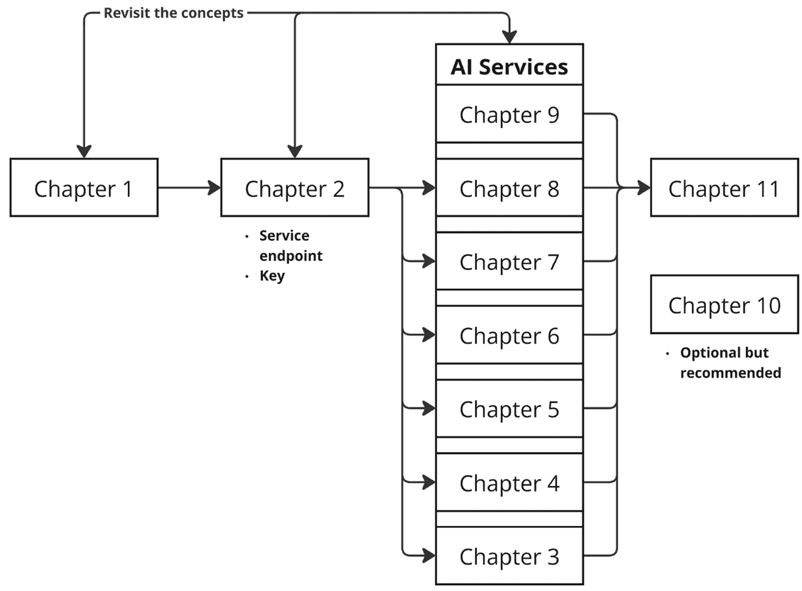
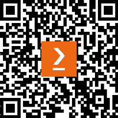

# 前言

**人工智能**（AI）的时机再好不过了。作为微软的 AI/数据解决方案架构师，我亲眼见证了 AI 的变革力量，尤其是在 OpenAI 出现之后。世界正在快速发展，传统流程正在被重新构想。

以我的一个保险客户为例。他们过去处理大量非结构化数据，如 PDF 和电子邮件。数百人的团队手动从数千个文件中提取信息，将其输入到 Excel 的定制结构化格式中，验证数据，并将其传递给业务分析师生成报告。决策者随后会依赖这些报告来做出关键选择。

现在，有了 AI，整个工作流程都是自动化的。AI 从结构化、半结构化和非结构化来源中提取数据，将其存储在数据库中，并生成分析报告。它甚至允许用户以对话方式与数据互动。结果是？节省了数百万美元，并显著提高了生产力。

如果你热衷于成为这一变革性旅程的一部分，你就来对地方了。这本书不仅专注于帮助你通过**AI-102: Azure AI 工程师助理认证**，还为你提供了实际项目经验（第十章）。我的目标是让你带着认证专业人员的信心和开启新机会的实用技能离开。

无论你是考虑转向 AI 职业还是提升你当前技能集，我都欢迎你来到这个激动人心的时刻。让这本书成为你通往有回报和充满活力的未来的大门。我希望你享受这段旅程。

# 本书面向对象

这本书是为所有准备参加**AI-102: Azure AI 工程师助理认证**考试的人设计的，无论他们的背景如何。它是对开发者工程师在 Azure 生态系统中扩展 AI 知识的一个极好的资源。对于那些从传统软件开发角色转向 AI 专注职业的人来说，这本书提供了在 Azure 项目中茁壮成长所需工具和见解。学生和教育工作者也会发现它很有价值，提供了将 AI 概念与实际应用相结合的实用方法。

虽然对 AI/ML 概念或开发实践有一定的了解可能会有所帮助，但这不是必需的。本书包含对考试主题的清晰、全面的总结，并提供额外的资源来支持你的学习之旅。通过实际案例、动手练习和直接解释，本书旨在让你有信心通过**Azure AI-102**考试，并将你的技能应用于实际的 AI 项目中。

# 本书涵盖内容

本书结构紧密遵循官方 *Microsoft AI-102 考试指南*，确保全面覆盖认证目标。您可能会注意到，一些最新的 Azure AI 服务或功能可能没有包括，或者只是简要提及。这是故意的——我专注于考试所需的内容，而不是试图追逐每一个新版本。然而，只要您理解了基础概念——支撑当前和未来服务的原则——您就会为适应未来做好准备。将这本书视为您 AI 生涯的基石。这也是为什么我包括了 *第十章*，它不仅超越了考试内容，还展示了实际应用案例和项目示例。这些案例旨在不仅加强您的知识，还帮助您从通过考试到自信地将 AI 应用于实际场景的过渡。这本书将帮助您获得认证——更重要的是，它将帮助您从第一天起就具备像真正的 AI 专业人士一样的思维和操作能力。

让我们看看每章都涵盖了哪些内容。

*第一章*，*理解 AI、ML 和 Azure 的 AI 服务*，介绍了关键的 AI 和 ML 基本概念，包括深度学习、生成式 AI 等高级主题，以及 **大型语言模型**（**LLMs**）、**自然语言处理**（**NLP**）和提示工程等基础元素，并对 Azure 的 AI 服务进行了概述，为您在后续章节中构建基础理解提供了工具。

*第二章*，*Azure AI 入门：工作室、管道和容器化*，介绍了关键的 Azure 开发环境（Azure AI Foundry、Azure OpenAI、Machine Learning Studio 和 Copilot Studio），以及 **Visual Studio Code**（**VS Code**），探讨了它们在 AI 开发中的作用，并涵盖了 CI/CD 集成、资源管理和灵活且安全的 AI 模型托管策略。

*第三章*，*管理、监控和安全 Azure AI 服务*，通过涵盖诊断日志、性能指标、成本管理、安全密钥处理、网络安全、身份验证机制和私密通信，专注于管理和监控 Azure AI 服务，提供确保平稳和安全 AI 部署的工具。

*第四章*，*实施内容审查解决方案*，强调了在开发道德 AI 系统中负责任的 AI 原则（公平性、透明度、问责制等）的重要性，讨论了生成式 AI 的独特风险，并探讨了缓解策略，如 Azure AI 内容安全和负责任创新框架，以确保安全可靠的 AI 部署。

*第五章*, *探索 Azure AI 视觉解决方案*，探讨了 Azure AI 视觉在图像和视频分析方面的能力，包括目标检测、人脸识别、**光学字符识别**（**OCR**）、自定义模型开发以及视频洞察，如场景检测和实时空间分析，使您能够从视觉内容中提取有意义的数据。

*第六章*, *实施自然语言处理解决方案*，涵盖了使用 Azure AI 语言和语音服务进行高级文本和语音分析，包括 NLP 技术、语音转文本、文本转语音、自定义语音解决方案和翻译功能，使开发智能、多语言、语音启用应用程序成为可能。

*第七章*, *实施知识挖掘、**文档智能**和内容理解*，教您如何使用 Azure AI 搜索和文档智能工具提取、组织和分析非结构化数据，将其转化为可操作的见解并自动化数据处理工作流。

*第八章*, *在生成式 AI 解决方案上工作*，探讨了使用 Azure OpenAI 服务生成式 AI 的实用应用，包括文本、代码和图像生成、模型部署、API 使用、微调和将数据与**检索增强生成**（**RAG**）集成以创建定制 AI 驱动解决方案。

*第九章*, *使用 Azure AI 代理服务实施代理解决方案*，探讨了如何使用 Azure 工具和框架（如 Azure AI 代理服务、语义内核和 AutoGen）设计、构建和部署智能 AI 代理，包括核心代理组件和实际用例，并通过动手练习比较开发方法。本章还涵盖了协作代理编排、部署最佳实践以及监控和在生产中保护代理的策略。

*第十章*, *实际 AI 实施：行业用例、技术模式和动手项目*，通过自定义 Copilot、与自己的数据聊天和文档处理等技术模式，探讨了 AI 的变革性影响，以及各行业的实际应用、RAG 模式，以及用于数据提取和 AI 搜索的高级工具，这些内容都通过动手项目得到支持。

*第十一章*, *准备 AI-102：Azure AI 工程师助理认证考试*，通过概述考试框架、关键关注领域和准备策略，并提供全面的实践考试来评估您的准备情况，帮助您准备*AI-102*认证。

以下图表概述了导航本书的推荐流程。*第一章*概述了全书各章节中涵盖的所有关键概念，作为基础。你可以在阅读*第三章*到*第九章*的过程中随时回顾相关概念。一种建议的方法是专注于你最感兴趣的 AI 服务，阅读相关部分，然后直接进入相应的章节，而不是一开始就阅读*第一章*中的所有细节。*第二章*接下来，因为它涵盖了基本的服务设置，并提供了服务端点以及后续章节练习所需的信息，如密钥。

章节按照当前的热门话题和典型的兴奋点进行排序，其中*第八章*专注于生成式 AI 和 OpenAI。然而，鼓励你从你最感兴趣的服务或主题开始，确保你保持动力，并通过本书稳步进步。*第十一章*专门用于考试练习和详细解释。强烈建议你回顾所有问题——包括正确和错误的答案——以及提供的参考链接，以加深你对每个主题的理解。一些考试问题可能涉及由于篇幅限制而在本书早期没有详细讨论的领域。这一章节提供了填补这些空白并加强你认证考试准备的有价值的机会。

*第十章*，虽然对于认证考试不是强制性的，但强烈推荐阅读。它提供了与真实世界项目相结合的动手活动，这将巩固你的专业知识。按照这个流程可以有效地引导你阅读全书。祝你在学习旅程中一切顺利！



重要提示

Azure AI 服务和用户界面正在不断演变。这包括模型可用性、API 版本、区域支持和视觉布局的变化——特别是在 Azure 将体验统一到 AI Foundry Studio 之下时。在本书的任何项目或动手练习开始之前，请始终验证你打算使用的服务和模型是否在你选择的 Azure 区域中得到支持。虽然服务名称、组织或 UI 元素可能会改变，但深刻理解底层概念和技术将使你能够自信地导航更新并适应未来的变化。

# 要充分利用本书

你需要 VS Code、.NET、PowerShell Core、Azure CLI、Python 的最新版本，因为本书也基于 Python，还需要 Git。

| **本书涵盖的软件/硬件** | **操作系统要求** |
| --- | --- |
| PowerShell Core | Windows, macOS, 或 Linux |
| Azure CLI & Azure 账户 | Windows, macOS, 或 Linux |
| .NET 7.0 | Windows, macOS, 或 Linux |
| Git 和 Python 3.9 以上 | Windows, macOS, 或 Linux |
| VS Code | Windows, macOS, 或 Linux |

**如果您正在使用本书的数字版，我们建议您自己输入代码或从本书的 GitHub 仓库（下一节中提供链接）获取代码。这样做将帮助您避免与代码的复制和粘贴相关的任何潜在错误。**

# 下载示例代码文件

您可以从 GitHub 下载本书的示例代码文件，网址为 [`github.com/PacktPublishing/Azure-AI102-Certification-Essentials`](https://github.com/PacktPublishing/Azure-AI102-Certification-Essentials)。如果代码有更新，它将在 GitHub 仓库中更新。我已经从 [learn.microsoft.com](http://learn.microsoft.com) 调整了示例代码，并修改以适应我们的特定需求。

重要提示

在您准备考试或通过考试期间，如果您有任何问题，请通过之前提供的 GitHub 链接中的 **讨论** 部分联系作者。

书中所有嵌入的 URL 链接都已在 GitHub 上汇总，以便于访问，消除了手动输入长 URL 的需要。您可以在 [`github.com/PacktPublishing/Azure-AI102-Certification-Essentials/blob/main/resources.md`](https://github.com/PacktPublishing/Azure-AI102-Certification-Essentials/blob/main/resources.md) 找到它们。

书中每个练习中的所有代码都是用 Python 编写的。

# 使用的约定

本书使用了多种文本约定。

`文本中的代码`：表示文本中的代码单词、数据库表名、文件夹名、文件名、文件扩展名、路径名、虚拟 URL、用户输入和 X/Twitter 处理符。以下是一个示例：“打开位于 `/``02-synthesize-speech/Python/speaking-clock` 文件夹中的 `speaking-clock.py` 文件。”

代码块设置如下：

```py
# Configure speech service
speech_config = speech_sdk.SpeechConfig(subscription=ai_key, region=ai_region)
print('Ready to use speech service in:', speech_config.region))
```

当我们希望您注意代码块中的特定部分时，相关的行或项目将以粗体显示：

```py
# Configure speech synthesis
speech_config.speech_synthesis_voice_name = "en-GB-RyanNeural"
speech_synthesizer = speech_sdk.SpeechSynthesizer(speech_config)
```

**粗体**：表示新术语、重要单词或您在屏幕上看到的单词。例如，菜单或对话框中的单词以 **粗体** 显示。以下是一个示例：“转到 **语言工作室** | **+ 创建新** | **会话式** **语言理解**。”

小贴士或重要提示

看起来像这样。

# 联系我们

我们始终欢迎读者的反馈。

**一般反馈**：如果您对本书的任何方面有疑问，请通过电子邮件发送给我们，电子邮件地址为 customercare@packtpub.com，并在邮件主题中提及书名。

**勘误表**：尽管我们已经尽一切努力确保内容的准确性，但错误仍然可能发生。如果您在这本书中发现了错误，我们将非常感激您向我们报告。请访问 [www.packtpub.com/support/errata](http://www.packtpub.com/support/errata) 并填写表格。

**盗版**：如果您在互联网上以任何形式发现我们作品的非法副本，如果您能提供位置地址或网站名称，我们将不胜感激。请通过 mailto:copyright@packt.com 与我们联系，并提供材料的链接。

**如果您有兴趣成为作者**：如果您在某个领域有专业知识，并且您有兴趣撰写或为书籍做出贡献，请访问[authors.packtpub.com](http://authors.packtpub.com)。

# 分享您的想法

一旦您阅读了*Azure AI-102 认证核心*，我们非常乐意听到您的想法！请[点击此处直接转到此书的亚马逊评论页面](https://packt.link/r/1-836-20527-9)并分享您的反馈。

您的评论对我们和科技社区非常重要，并将帮助我们确保我们提供高质量的内容。

# 下载此书的免费 PDF 副本

感谢您购买此书！

您喜欢在路上阅读，但无法携带您的印刷书籍到处走？

您的电子书购买是否与您选择的设备不兼容？

别担心，现在，每购买一本 Packt 书籍，您都可以免费获得该书的 DRM 免费 PDF 版本。

在任何地方、任何设备上阅读。直接从您喜欢的技术书籍中搜索、复制和粘贴代码到您的应用程序中。

优惠远不止于此，您还可以获得独家折扣、时事通讯和每日免费内容的每日电子邮件访问权限

按照以下简单步骤获取优惠：

1.  扫描二维码或访问以下链接



[`packt.link/free-ebook/978-1-83620-527-2`](https://packt.link/free-ebook/978-1-83620-527-2)

1.  提交您的购买证明

1.  就这样！我们将直接将您的免费 PDF 和其他优惠发送到您的电子邮件中

# 第一部分：Azure AI 的基础和核心

*第一部分* 的这本书旨在为使用 Azure AI 服务提供一个全面的基石。第一章重点介绍 **人工智能**（**AI**）和 **机器学习**（**ML**）的关键概念，包括监督学习、无监督学习和强化学习，以及深度学习、生成式 AI 等高级主题。它还涵盖了基础元素，如 **大型语言模型**（**LLMs**）和 **小型语言模型**（**SMLs**），**自然语言处理**（**NLP**）和提示工程，在不深入技术细节的情况下提供对这些概念的理解。第二章过渡到 Azure AI 的入门，概述了其功能，包括 AI 搜索、文档智能、Azure OpenAI 服务、视觉、语音、语言和内容安全等服务及其特性和实际应用。第三章专注于管理、监控和安全保护 Azure AI 服务，涵盖了日志记录、指标、成本管理、使用 Azure Key Vault 的安全密钥处理以及与虚拟网络和私有端点的私有通信等关键策略。这些章节共同为构建、部署和维护稳健的 AI 解决方案提供了坚实的基础。

本部分包含以下章节：

+   *第一章*，*理解 AI、ML 和 Azure 的 AI 服务*

+   *第二章*，*Azure AI 入门：工作室、管道和容器化*

+   *第三章*，*管理、监控和安全保护 Azure AI 服务*
