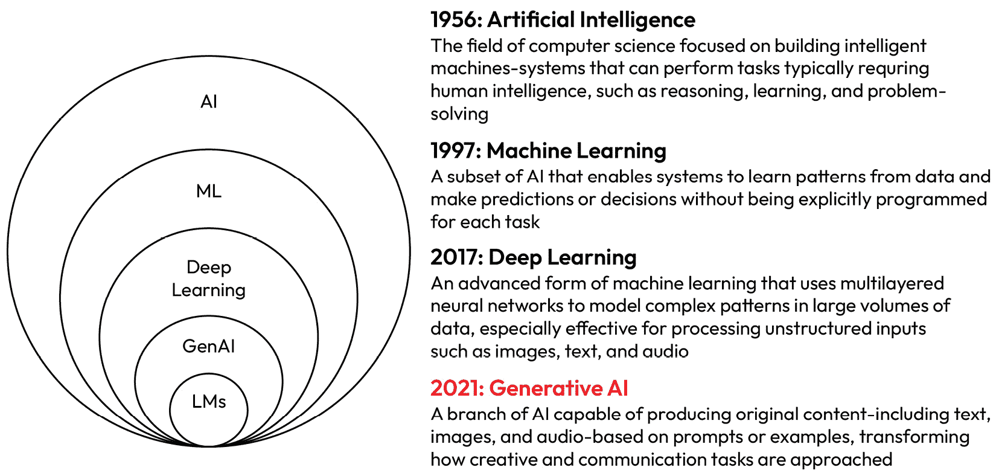
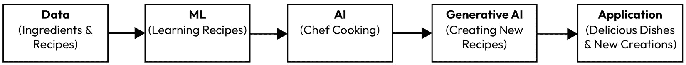
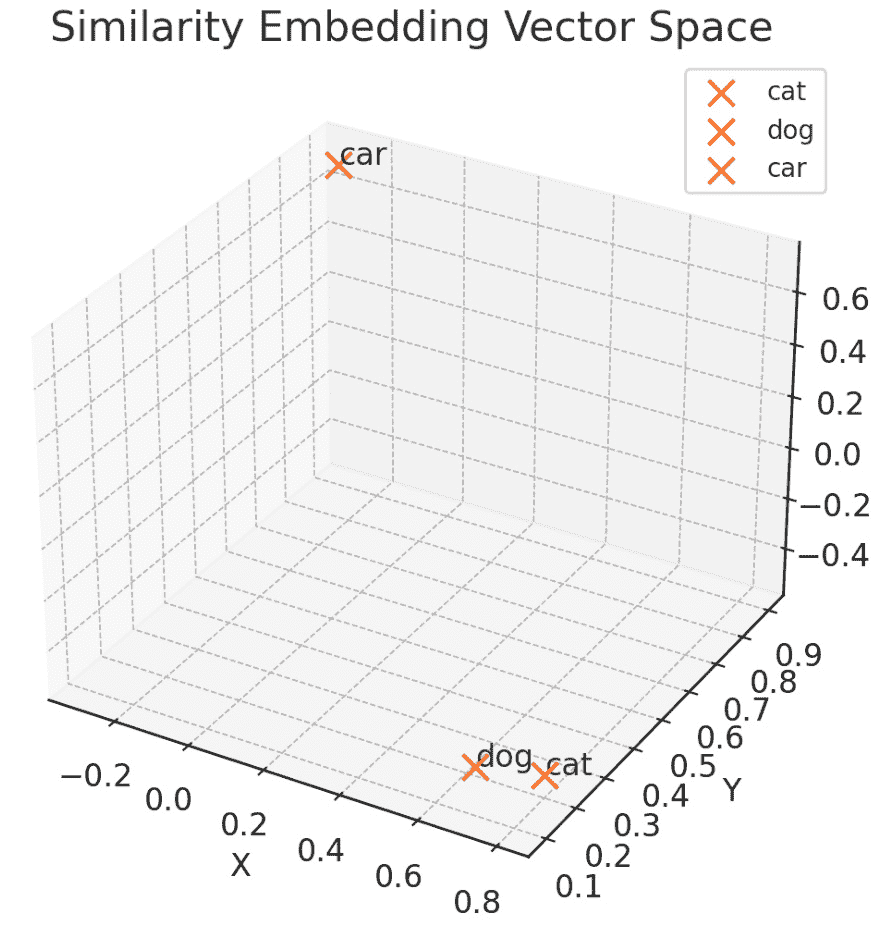
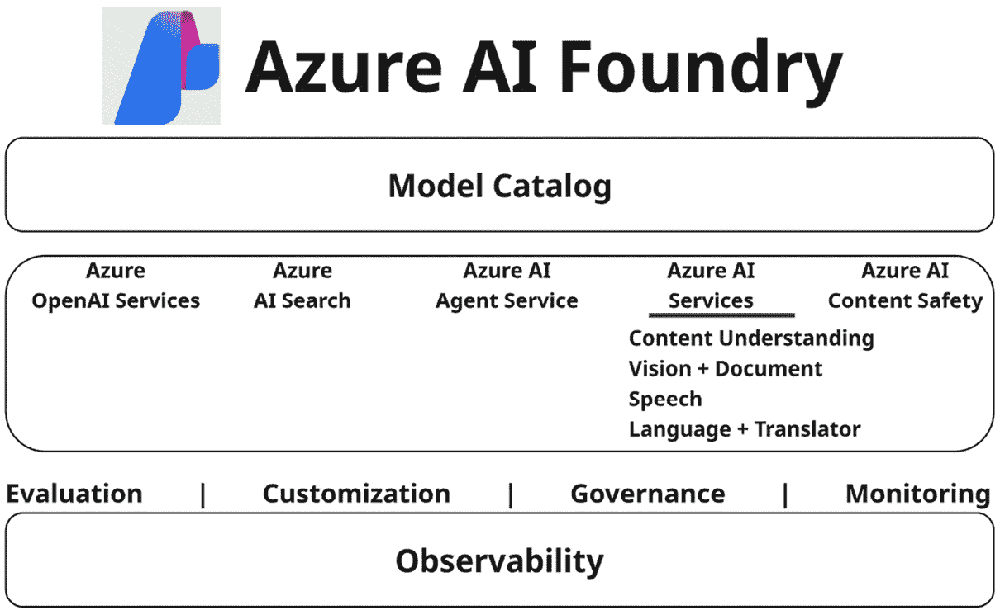

# 第一章：理解 AI、ML 和 Azure 的 AI 服务

**人工智能**（**AI**）和**机器学习**（**ML**）正成为技术创新的关键驱动因素，在全球范围内改变着行业。在本章中，我们将涵盖关键的 AI 和 ML 概念，包括监督学习、无监督学习和强化学习，并简要介绍深度学习和**生成式 AI**（**GenAI**）。您还将了解**大型和小型语言模型**（**LLMs 和 SLMs**）、**自然语言处理**（**NLP**）和提示工程等基本要素，这些是构建智能系统的基石。本章将为您提供坚实的理解，而不会深入技术理论。

此外，我们将探讨 Azure 的关键 AI 服务，如 AI 搜索、文档智能、Azure OpenAI 服务、视觉、语音、语言和内容安全。对于每一个，我们将概述其核心功能、功能性和实际用例。本章旨在建立一个知识库，帮助您更好地理解后续章节中讨论的概念和工具。您可以在阅读本书的过程中参考它以获得清晰度。

在本章中，您将探索以下关键主题：

+   AI、ML 的核心概念以及它们之间的关系

+   不同类型 ML 的概述：监督学习、无监督学习和强化学习

+   深度学习简介及其在现实世界 AI 场景中的应用

+   理解 GenAI 及其如何创建新的内容，如文本和图像

+   **语言模型**（**LMs**），包括 LLMs 和 SLMs，在自然语言理解中的作用

+   NLP 的实际应用和提示工程的重要性

+   六种基础 AI 技术——提示工程、NLP、**检索增强生成**（**RAG**）、扎根、嵌入和标记化——为智能应用提供动力

+   Microsoft Azure 关键 AI 服务的概述，包括 Azure AI 搜索、文档智能、Azure OpenAI、视觉、语音、语言和内容安全

+   实际场景中每个 Azure AI 服务最有效的应用以及针对您用例选择正确工具的指导

让我们开始并回顾关键概念！

# AI 的基础：探索 ML、LMs 和关键 AI 能力

以下图表提供了 AI、ML、深度学习、GenAI 和 LMs 之间关系的概述。每一层代表前一层的一个子集，展示了 AI 技术的演变。从 1956 年的 AI 开始，1997 年的 ML，到 2017 年的深度学习，该图表还突出了最近出现的 LMs 和 GenAI 如何融入这一更广泛的环境。关于这些技术的更多细节将在下一节中讨论。



图 1.1 – 简要的 AI 历史

让我们深入探讨。

## AI

虽然“AI”指的是模拟人类智能的更广泛目标，但 ML 是实现这一目标的核心方法之一。ML 提供了使 AI 能够从数据中学习的统计技术和模型。

AI 就像一个智能助手，可以执行通常需要人类智能的任务，例如理解语言、识别图像、做出决策、翻译和解决问题。想象一下有一个机器人可以帮你整理照片、下棋、翻译成另一种语言、为你预约或甚至与你交谈——AI 使这一切成为可能。

## ML

ML 是数据科学的一个分支，专注于训练模型根据数据做出预测或决策。ML 不是为每个任务明确编程，它使系统能够从示例中学习模式并在时间推移中改进。

ML 就像通过展示许多带有名称标签的图片来教孩子识别动物。随着时间的推移，孩子能够自己识别新的动物。同样，ML 使计算机能够从过去的数据中学习并推广到新的、未见过的情境。

ML 被广泛分为三种主要类型，每种类型都有其独特的特性和用例：

+   **监督学习**：这种方法使用标记数据来训练模型识别模式和做出预测。它在准确性至关重要的场景中使用，例如医疗诊断或欺诈检测。例如，一个监督学习模型在数千个标记的 X 射线图像上训练，以检测是否存在肿瘤。

+   **无监督学习**：在这里，模型在数据中识别模式或分组，而不需要标记的结果。它对于发现隐藏的结构很有用，例如客户细分或异常。例如，一家信用卡公司使用无监督学习来检测偏离典型用户行为的可疑交易。

+   **强化学习**：在这种类型中，模型通过与环境的交互并基于其行为获得奖励或惩罚来学习。它非常适合涉及一系列动作的决策任务。例如，强化学习代理通过根据实时条件调整冷却和电源设置来优化数据中心能源使用。

这些 ML 类型各自具有独特的优势，适用于不同类型的问题。

## 深度学习

深度学习是 ML 的一个专门子集，它使用人工神经网络从大量数据中建模和学习复杂模式。这些网络受到人脑结构的启发，并包含多个相互连接的层（因此得名“深度”）。

深度学习模型能够自动从原始数据中学习特征，而无需手动特征工程。它们在处理非结构化数据——如文本、图像和音频——方面表现出色，而传统机器学习可能难以处理。例如，在自然语言处理（NLP）中，深度学习使聊天机器人能够理解上下文、识别意图，并通过学习大量对话数据来自然地响应。

深度学习的影响跨越了许多领域，包括图像识别、**文本转语音**（**TTS**）、语言翻译、推荐系统和自动驾驶汽车。它通过实现高度准确和可扩展的人工智能解决方案，彻底改变了医疗保健、金融、零售和数字营销等行业。

例如，一个深度学习模型可以驱动一个虚拟助手，能够理解你的语音命令，将其转换为文本，解释你的请求，并生成类似人类的响应——这一切都在实时完成。

深度学习从复杂、高维数据中提取洞察力的能力使其成为现代人工智能系统的基石。

你知道吗？

**生成预训练转换器**（**GPTs**）是生成自然语言文本的深度学习模型。它们可以根据特定任务和目的进行定制，使用户能够为各种应用创建定制的 GPTs。

### GenAI

GenAI 是一种能够创建新内容的人工智能，如文本、图像、音乐和视频。它就像拥有一个创意艺术家，在研究了许多艺术作品示例之后，能够创作出原创画作。GenAI 从现有数据中学习，并基于这种学习生成新的、原创的作品。

想象一个有才华的厨师，他不仅会烹饪，还会创造新的食谱。



图 1.2 – GenAI 过程的示例

让我们分解这些元素：

1.  **数据（原料和食谱）**: 人工智能和机器学习从大量数据中学习，类似于厨师需要原料和食谱来烹饪。

1.  **ML（学习食谱）**: 机器学习帮助人工智能从这些数据中学习，提高其执行任务的能力，就像厨师练习食谱一样。

1.  **AI（厨师烹饪）**: 人工智能使用它所学的知识来执行任务，就像厨师烹饪一顿饭一样。

1.  **GenAI (创造新食谱)**: GenAI 通过创建新的原创内容更进一步，类似于厨师发明新的食谱。

1.  **应用（美味的菜肴和新创作）**: 结果是一个能够执行智能任务并创建新内容的应用程序，提供有价值的解决方案和创新创作。

你知道吗？

你知道为什么 GenAI 如此受欢迎吗？它创建新、原创内容的能力——如文本、图像和音乐——正在通过内容创作、设计和软件开发改变行业。通过自动化创意任务，它提高了生产力，并使各个领域的快速创新成为可能。

### LMs

语言模型（LMs）是一种经过训练以理解和生成人类语言的机器学习模型。它们通过分析大量文本来学习语法、意义和上下文，从而成为许多自然语言处理（NLP）任务的基础。

语言模型（LMs）被用于广泛的任务，如文本分类、摘要、情感分析、问答和内容生成。这些模型预测句子中的下一个单词或评估短语的概率，使它们能够产生连贯且符合上下文的响应。

例如，当你向聊天机器人询问“伦敦的天气怎么样？”时，语言模型（LM）帮助解释你的意图并生成一个自然的响应，例如“伦敦目前气温为 12°C，天气多云。”

现代语言模型（LMs）从小型、特定任务的模型到能够处理复杂、多轮对话甚至跨文本、图像或代码等模态的 LLMs（如 GPT）不等。这些模型为日常人工智能体验（如搜索引擎、写作助手和虚拟代理）提供动力。

#### LLMs 和 SLMs

大型语言模型（LLMs）是在大量数据集上训练的强大人工智能模型，使它们能够理解、生成和用自然语言进行推理。它们的广泛知识和上下文理解使它们非常适合聊天机器人、摘要、翻译和内容创作等任务。LLMs 还可以在**多模态**场景中运行——不仅处理文本，还处理图像、音频或代码——将它们的应用范围扩展到各个行业。例如，一个 LLM 可以驱动一个虚拟助手，该助手可以总结客户电子邮件、生成草稿回复并提取关键任务以填充待办事项列表——所有这些操作都在几秒钟内完成。

与此相反，小型语言模型（SLMs）为大型语言模型（LLMs）提供了一个轻量级的替代方案，以更少的计算资源提供许多相同的功能。它们旨在提高效率，因此适合在内存有限的设备上运行，如笔记本电脑或手机。微软的**Phi**模型系列就是这一点的例证，Phi-3 和 Phi-4 模型尽管参数远少于传统的 LLMs，但仍然表现出令人印象深刻的性能。

当速度、成本效益和本地处理是优先事项时，小型语言模型（SLMs）特别有用。LLMs 和 SLMs 的结合使开发者能够为他们的 AI 应用选择性能、大小和部署灵活性的最佳平衡。在**多模型**解决方案中，这些模型甚至可以结合使用——其中 SLM 处理轻量级本地任务，而 LLM 则介入进行更复杂的推理——创建一个智能、高效且可扩展的人工智能系统。

重要提示

新模型不断被引入，提供更大的力量和效率，同时成本更低。请确保检查本书中提到的最新模型之外的可用性，因为一些版本可能在出版时已经过时。

## 六大关键人工智能能力

要有效地使用 Azure AI 构建智能解决方案，了解推动大多数现代人工智能应用的基础六项能力至关重要。这些能力——自然语言处理 (NLP)、提示工程、RAG、扎根、嵌入和分词——是处理语言模型、构建聊天界面、自动化内容和检索相关数据的基础。这些能力共同赋予开发者创建可靠、上下文感知和高性能人工智能解决方案的能力。以下各节将使用实际示例解释每个概念，以帮助您将理论联系到实际应用。

### 自然语言处理 (NLP)

自然语言处理 (NLP) 使人工智能系统能够理解、解释和响应人类语言——无论是口语还是书面语。它支持语音转文本、聊天机器人、情感分析和语言翻译等功能。例如，当您向语音助手询问“今天天气怎么样？”时，NLP 帮助将您的语音转换为文本，理解您的意图，并生成包含当前预报的语音响应。*第六章*提供了这个主题的详细说明。

### 提示工程

这是一门制作清晰、有目的的输入——称为**提示**——的艺术，它引导生成式人工智能 (GenAI) 模型产生特定的结果。一个结构良好的提示有助于模型保持主题并交付准确的内容。例如，提示模型“将这封电子邮件线程总结为会议的关键点”可以生成一个简洁的摘要，节省时间并确保清晰。更多细节将在*第八章*中的*生成式人工智能的高级技术*部分进行介绍。

### 微调

微调是将预训练的语言模型进一步训练在较小、更专业的数据集上，以使其在特定任务或领域上表现更佳的过程。这有助于模型更紧密地与目标内容的独特语言、语气或结构对齐。例如，您可以将基础 GPT 模型微调以起草法律合同或以组织偏好的风格回应客户服务工单。与通过调整输入提示来控制输出的提示工程不同，微调调整模型的内部权重，使其能够在多个用例中持续提供定制化的响应。当准确性、一致性或领域特定性至关重要时，微调特别有用。要深入了解微调，请参阅*第八章*中的*练习 5*，*使用您自己的数据微调模型*。

### RAG

RAG 结合了搜索和语言生成的力量。RAG 不仅依赖于模型训练的内容，它还会从外部来源检索相关信息，并在模型响应之前提供这些信息。这导致更准确、更及时的答案。例如，使用 RAG 的聊天机器人可以查找您的公司内部文档来回答政策问题，即使基础模型没有训练过这些信息。更多细节将在*第七章*和*第十章*的“Chat your own data”部分中介绍。

### 基础知识

基础知识是确保 AI 模型的响应基于事实、现实世界信息的过程，而不是仅仅依赖于其内部训练数据——这些数据可能过时或不完整。它将模型连接到可信的外部来源，如公司知识库、数据库或文档，以便生成的响应反映当前和上下文相关的信息。例如，如果用户询问您的组织旅行政策，基础知识使 AI 能够从内部文档中检索并引用该政策的最新版本，而不是猜测。基础知识在 RAG 系统中至关重要，并在减少幻觉（看似合理但实际不准确或虚构的响应）方面发挥着关键作用。

你知道吗？

基础知识显著减少了幻觉，即模型在没有现实世界上下文的情况下生成不准确或虚构的响应。

### 嵌入

这是一种将文本、图像或其他类型的数据转换为表示其意义和上下文的数值向量的技术。这些向量使 AI 系统能够根据相似性而不是精确匹配来比较、分组和搜索信息。这在语义搜索、推荐和 RAG 等应用中特别有用，在这些应用中，理解上下文比匹配关键词更重要。

例如，在图 1.3*中简化的 3D 向量空间中，单词*cat*可能表示为*[0.8, 0.2, -0.5]*，而*dog*可能表示为*[0.7, 0.1, -0.4]*——距离相近，表明它们在语义上相似。相比之下，一个不相关的单词，如*car*，可能表示为*[-0.3, 0.9, 0.7]*，位置较远。这种空间排列使 AI 模型能够对语言中的意义和关系进行推理。嵌入技术为 Azure AI Search 的高级功能提供了动力，例如向量搜索和混合检索，使得在大型非结构化数据集中提供高度相关和上下文相关的搜索结果成为可能。



图 1.3 – 相似性嵌入向量空间

接下来，让我们看看分词化。

### 分词化

这是将文本分解成称为 **标记** 的更小单元的过程，这些标记是 LMs 理解的基本构建块。标记可以是完整的单词、单词的一部分，甚至是标点符号。标记化是训练和使用基于转换器的模型（如 GPT）的第一步，使它们能够有效地分析和生成语言。

例如，考虑以下句子：*我听到一只狗大声地对一只猫叫*。

要标记化此文本，你可以识别每个独立的单词并为其分配标记 ID，如下例所示：

```py
- I (1)
- heard (2)
- a (3)
- dog (4)
- bark (5)
- loudly (6)
- at (7)
- *("a" is already tokenized as 3)*
- cat (8)
```

现在句子可以用标记 `{1 2 3 4 5 6 7 3 8}` 来表示。同样，句子 *我听到一只猫* 可以表示为 `{1 2` `3 8}`。

随着你继续训练模型，训练文本中的每个新标记都会以适当的标记 ID 归入词汇表：

+   `喵喵 (9)`

+   `滑板 (10)`

+   等等...

通过足够大的训练文本集，可以编译包含数万个标记的词汇表。要了解 LLMs 中标记的计算方式，您可以访问 [`token-calculator.net/`](https://token-calculator.net/)。

现在你已经对基本的人工智能和机器学习概念有了扎实的理解，让我们以实际的方式探索 Azure AI 服务。我们将回顾可用的服务，检查每个服务的核心功能，了解它们的工作原理，并确定何时有效地使用它们。本节将引导你了解这些服务，并为你提供如何在现实世界场景中应用它们以最大化你的 AI 解决方案的见解。

# 探索 Azure AI 服务

Azure 提供了一套全面的 AI 服务，旨在加速智能应用程序的开发。这些服务涵盖了广泛的能力，包括视觉、语言、语音、搜索和生成式 AI。通过预构建的模型、API 和定制选项，开发者可以快速将高级 AI 功能集成到他们的解决方案中，而无需深厚的机器学习专业知识。

该生态系统的核心是 **Azure AI Foundry 平台**（在第二章的 *AI Foundry* 部分中详细讨论）——一个用于构建、部署和管理 AI 应用程序的统一环境。它通过结合模型训练、数据集成和部署工作流程以及企业级的安全和合规性功能来简化开发过程。Azure AI Foundry 使团队能够高效协作，同时跨组织扩展 AI 解决方案。



图 1.4 – Azure AI 服务的概述

以下是对关键 Azure AI 服务、其核心功能和实际用例的概述。

重要提示

随着 Azure AI 服务的快速发展，模型可用性、API 版本和区域支持可能会频繁变化。在开始项目或在此书中的动手练习之前，验证您计划使用的服务和模型是否在所选的 Azure 区域中得到支持是至关重要的。这一步骤有助于避免兼容性问题，并确保部署过程顺利。

为了帮助您保持最新状态，*进一步阅读*部分包含了直接链接到每个服务的官方微软文档。查阅这些资源将确保您使用的是最新功能——保持您的解决方案可扩展、成本效益高，并与生产就绪标准保持一致。

## Azure AI Search

**Azure AI Search**（以前称为 Azure 认知搜索）是一种基于云的服务，它使您能够快速、安全、可扩展地检索自己的数据。它支持关键字、语义和基于向量的搜索，使其成为传统和 GenAI 应用的通用工具。

关键特性包括以下内容：

+   **灵活的搜索能力**：支持结构化和非结构化内容中的全文、语义、向量和混合搜索

+   **全面索引**：提供数据分块、向量化、**光学字符识别**（**OCR**）和内置的语言分析工具

+   **高级查询支持**：启用模糊搜索、筛选、自动完成、分面搜索、地理搜索和语义排名

+   **无缝集成**：轻松连接到 Azure OpenAI、Azure ML 和外部数据管道

### 工作原理

Azure AI Search 在两个阶段中运行：**索引**和**查询**。在索引阶段，您的内容被摄取、处理（例如，分块、向量化和标记化），并存储在搜索索引中。内置的 AI 增强功能——如 OCR 和语言检测——可以应用于增强内容。当用户提出查询时，服务将在适当的索引中进行搜索，并返回排名结果。语义排名和混合检索确保高度相关的响应，尤其是在基于 RAG 的应用中。欲深入了解，请参阅*第七章*中的*图 7.2*和*第十章*中的*AI 搜索*部分。

### 何时使用 Azure AI Search

您可以使用以下用例：

+   **企业搜索门户**：使员工能够在大型文档库中使用自然语言查找内容。

+   **GenAI 和 RAG 应用**：检索用于上下文感知语言生成的向量化内容。

+   **定制搜索体验**：构建具有自动完成、筛选和同义词定制的搜索工具，以满足您的业务需求。

+   **集中索引**：将文档、结构化数据和向量内容统一在一个可搜索的索引下。

+   **多语言和领域特定搜索**：应用语言规则或自定义分析器以改进跨语言或专业内容领域的准确性。实现一个语义文档搜索工具，帮助员工使用自然语言查询快速找到相关的内部报告。

你知道吗？

OpenAI 使用 Azure AI 搜索作为其 RAG 工作负载（包括 ChatGPT、自定义 GPT 和助手 API）的向量数据库和检索系统。OpenAI 发现 Azure AI 搜索与其独特的规模需求相匹配，高度高效，是一个超越向量的完整检索系统，提供了混合检索、元数据过滤等功能。

在[`youtu.be/cjIE5fBInAE?si=j4FHgQ0lczRKUWO9`](https://youtu.be/cjIE5fBInAE?si=j4FHgQ0lczRKUWO9)的视频中，了解 ChatGPT 如何结合 RAG 功能、OpenAI 的信任 API 和 Azure AI 搜索来应对今天和明天的最大挑战！ChatGPT 是历史上增长最快的消费应用，拥有超过 1 亿周活跃用户。

## 文档智能

**Azure 文档智能**（以前称为**表单识别器**，在*第七章*的*实现文档智能解决方案*部分中详细说明）是一种基于云的服务，通过从表单、发票、收据和其他文档类型中提取结构化数据来自动化文档处理。它减少了手动数据输入，并实现了可扩展、准确的文档工作流程。

关键特性包括以下内容：

+   **预构建、自定义和组合模型**：使用现成的模型处理常见文档或为独特布局训练自定义模型。

+   **AI 驱动提取**：从扫描文档中识别和提取键值对、表格、选择标记和文本。

+   **灵活的接口**：支持 REST API、SDK 和低代码工具，便于集成。

### 它是如何工作的

该服务通过 OCR 和机器学习模型处理文档。根据布局，它使用预构建或自定义训练的模型来分析和提取信息，例如行项目、总计和元数据。提取的数据以结构化格式（例如，JSON）返回，可以直接集成到下游系统，如**企业资源规划**（ERP）或数据库。

### 何时使用 Azure 文档智能

你可以用它来处理以下用例：

+   **发票和收据自动化**：通过从扫描或数字文档中提取数据来简化应付账款流程。

+   **自定义表单处理**：训练自定义模型以处理具有特定布局的表单。

+   **存档和搜索**：将纸质档案转换为结构化、可搜索的格式。

+   **法规和合规工作流程**：自动检测关键字段或数据模式以确保文档标准。自动从扫描的发票中提取行项目并将结构化数据上传到财务系统。

你知道吗？

文档字段提取功能通过利用大型语言模型（LLM）来提高准确性，帮助自动标记、定位和置信度评分。更多详情，请访问 [`learn.microsoft.com/en-us/azure/ai-services/document-intelligence/train/custom-model?view=doc-intel-4.0.0`](https://learn.microsoft.com/en-us/azure/ai-services/document-intelligence/train/custom-model?view=doc-intel-4.0.0)。

## 视频索引器

**Azure AI 视频索引器**（在*第五章*的*使用 Azure AI 视频索引器分析视频*部分中详细说明）是一种视频和音频分析服务，它使用预构建的 AI 模型从媒体内容中提取详细元数据，例如语音文本、面部、场景、物体和情感。

关键特性包括以下内容：

+   **自动转录和翻译**：支持超过 50 种语言并生成多语言字幕

+   **丰富媒体洞察力**：识别主题、命名实体、演讲时间线、品牌和情感

+   **自定义模型训练**：使用账户训练的模型识别特定人物或视觉元素

+   **内容审核和可访问性**：检测不适当的内容并为包容性提供字幕

### 工作原理

该服务接收音频或视频内容，并应用 AI 模型来识别语音词、检测物体或面部，并提取其他关键元数据。所有元数据都通过 API 或 **视频索引器**门户进行索引并可供搜索。您还可以通过训练模型来检测已知个人或品牌元素来自定义识别逻辑。

### 何时使用 Azure AI 视频索引器

您可以使用以下用例：

+   **媒体库和档案**：通过主题、人物或场景使大型视频库可搜索。

+   **广播和内容平台**：添加多语言字幕、场景分割和审核过滤器。

+   **企业培训和合规性**：自动总结和标记视频，以确保合规性并提高内部培训材料的可发现性。

+   **广告和个性化**：识别产品植入、品牌提及或情感基调。通过为基于场景的搜索和多语言字幕索引大型视频库来增强视频平台。

## Azure OpenAI 服务

**Azure OpenAI 服务**（在*第八章*中详细说明）提供对高级 OpenAI 模型（如 GPT-4、GPT-4 Turbo with Vision 和 GPT-3.5）的安全访问。它使企业级语言能力（如摘要、聊天、内容创作和代码生成）成为可能。

重要注意事项

新模型正在不断推出，提供更高的性能和效率，同时成本更低。请确保检查本书中提到的最新模型的可用性，因为一些版本可能在出版时已经过时。有关更多信息，请访问官方文档[`learn.microsoft.com/en-us/azure/ai-services/openai/concepts/models?tabs=global-standard%2Cstandard-chat-completions`](https://learn.microsoft.com/en-us/azure/ai-services/openai/concepts/models?tabs=global-standard%2Cstandard-chat-completions)。

关键特性包括以下内容：

+   **访问强大的 LMs**：包括 GPT-4o、Codex、DALL-E 和嵌入模型

+   **可扩展接口**：使用 API、SDK 或 Azure OpenAI Studio 进行原型设计和生产

+   **企业级控制**：与 Azure 网络、身份和安全功能集成

+   **微调和批量推理**：定制输出或高效运行大规模处理作业

### 它是如何工作的

在 Azure 中部署模型后，开发者可以通过 REST API 或 SDK 使用提示与之交互。提示工程有助于塑造响应。对于特定任务，微调可以调整模型的行为。Azure 还提供工具来监控使用情况、应用内容过滤并确保负责任的 AI 实践。

### 何时使用 Azure OpenAI 服务

您可以使用以下用例：

+   **对话代理和共飞行员**：构建理解上下文并能自然响应的助手。

+   **文档摘要和洞察**：从合同、报告或支持票中提取关键点。

+   **代码生成和重构**：利用 Codex 编写、审查或优化代码。

+   **图像理解（视觉）**：在多模态工作流中分析并描述视觉输入，使用 GPT-4 构建基于内部知识的客户支持聊天机器人，生成准确、自然的响应。

您知道吗？

LangChain 是一个流行的开源 AI 框架，用于构建由 LMs（语言模型）驱动的应用程序，如代理、工具和链。微软的**语义内核**是一个为将 LLMs（大型语言模型）集成到实际应用中而设计的生产就绪且稳定的 SDK，具有可靠性和可扩展性。同时，**AutoGen**是微软开发的高级、多代理 LLM 系统的前沿研究 SDK，非常适合探索最先进的 AI 协调和推理。

## Azure 视觉

**Azure 视觉**服务（在第八章的*分析图像*部分详细说明）提供了强大的功能，用于使用预构建和自定义计算机视觉模型从图像和视频中提取、分类和分析视觉信息。

关键特性包括以下内容：

+   **预构建模型**：识别对象、文本、地标、名人品牌

+   **自定义视觉**：使用您的标记图像训练模型以进行定制识别

+   **OCR 和空间分析**：从扫描的文档或监控人们的流动中提取文本和布局

+   **部署灵活性**：在云端运行或导出到边缘设备

### **工作原理**

您可以将图像或视频帧上传到视觉 API，根据您的需求应用预构建或自定义训练的模型。例如，OCR 可以从文档中提取文本，而目标检测则突出照片中的特定特征。自定义视觉允许您构建专注于特定领域数据的模型。

### 何时使用 Azure 视觉服务

您可以使用它来处理以下用例：

+   **制造质量监控**：在生产中检测视觉缺陷或异常。

+   **零售和库存**：识别货架上的产品并自动化编目。

+   **文档数字化**：使用 OCR 将纸质记录转换为结构化文本。

+   **智能空间**：使用空间分析监测人流量和房间使用情况。使用自定义训练的目标检测模型在生产线检测产品缺陷。

## Azure 语音

**Azure 语音**服务（在*第六章*的*使用 Azure AI 语音处理语音*部分中详细说明）提供了全面的工具，以将语音功能添加到应用程序中，包括转录、语音合成和翻译，所有这些都具有高精度和自然的交付。

关键特性包括以下内容：

+   **语音到文本**：实时或批量模式下将语音音频转换为文本

+   **文本到语音**：使用预构建或自定义神经网络语音生成类似人类的语音

+   **语音翻译**：在 60 多种语言之间实现多语言通信

+   **自定义语音模型**：在嘈杂环境中或针对特定行话提高识别率

### **工作原理**

通过 API 或 SDK 将音频输入发送到 Azure 语音服务。模型使用神经网络生成转录本，翻译成另一种语言，或从文本中合成语音。您可以为特定词汇表或方言微调模型，并将它们部署到 Web、移动或物联网应用中。

### 何时使用 Azure 语音服务

您可以使用它来处理以下用例：

+   **客户支持自动化**：将语音通话转换为可搜索的转录本。

+   **语音助手**：在应用程序或设备中与用户创建自然的声音交互。

+   **实时字幕和可访问性**：为会议或广播提供实时字幕。

+   **语言学习应用**：评估发音并辅助交互式语音练习。为全球客户服务中心创建多语言语音助手。

## Azure 语言

**Azure 语言**服务（在*第六章*中详细说明）提供了一套全面的 NLP 功能，使开发者能够构建能够理解和分析文本的智能应用程序。该服务统一了之前可用的多个 Azure AI 服务，包括文本分析、QnA Maker 和**语言理解智能服务**（**LUIS**），并引入了新的功能，如文档摘要和**个人身份信息**（**PII**）检测。用户可以通过 REST API、SDK 或基于 Web 的语言工作室与该服务交互，使其适用于各种用例。

关键特性包括以下内容：

+   **文本分析**：情感分析、关键词提取、实体识别和语言检测

+   **摘要和问答**：自动总结长文档或从非结构化文本中提取答案

+   **个人身份信息检测和翻译**：删除敏感信息并支持多语言应用

+   **语言工作室**：无需代码的界面用于训练和测试 NLP 模型

### 工作原理

文本输入通过 API 或语言工作室提交。Azure 语言服务使用预构建或自定义模型分析内容，提取语言洞察，并以结构化格式返回结果。这些洞察可用于支持客户支持聊天机器人、文档摘要工具和合规工作流程等应用程序。

### 何时使用 Azure 语言服务

您可以使用以下用例：

+   **客户反馈分析**：识别产品评价或调查中的情感和趋势。

+   **知识提取**：从非结构化文本中提取结构化数据，如命名实体、关键词和摘要，以支持搜索索引和报告管道。

+   **隐私合规**：在存储或共享内容之前检测和删除敏感数据（PII）

+   **多语言应用**：构建支持全球市场语言检测和翻译的应用程序。自动总结客户评价并识别产品反馈中的趋势。

## 内容安全

**Azure 内容安全**服务（在*第四章*中详细说明）提供了一套全面的工具，旨在检测和调节跨各种平台和服务的有害用户生成内容和 AI 生成内容。该服务包括强大的文本和图像调节功能，帮助企业在用户之间维护一个安全和尊重的环境。开发者可以通过 REST API、SDK 或直观的内容安全工作室与该服务交互，使其易于实施和管理内容安全措施。

关键特性包括以下内容：

+   **文本和图像调节**：检测仇恨言论、暴力、色情内容和自残

+   **多严重程度评分**：按风险级别对内容进行分类

+   **自定义类别**：使用 Rapid API 定义带有自定义过滤器的监管规则

+   **内容安全工作室**：用于测试和优化监管逻辑的可视化工具

### 工作原理

内容——无论是文本还是图像——通过内容安全 API 或工作室提交。该服务应用了训练有素的机器学习模型来检测各种有害内容，并根据类型和强度分配严重程度评分。开发者可以使用内置过滤器或为特定行业需求定义自定义监管类别。结果以实时或批量模式返回，以便集成到面向用户的程序中。

### 何时使用 Azure 内容安全

您可以使用此工具用于以下用例：

+   **社交平台**：自动标记或屏蔽有害或不安全用户生成内容。

+   **监管社区**：在论坛、游戏或聊天应用中执行内容标准。

+   **电子商务和评论**：过滤产品列表或客户评论中的不适当内容。

+   **AI 生成的内容过滤**：确保生成的文本和图像符合公司政策或法律要求。在社交媒体应用中监管用户生成内容，以防止滥用并确保社区安全。

这些 Azure 人工智能服务共同提供了一个强大的工具包，用于开发智能、可扩展和安全的 AI 解决方案——无论您是在构建聊天机器人、图像识别系统还是多语言虚拟助手。随着您在以下章节中探索每个服务，您将看到它们如何结合和定制以满足您的特定商业和技术需求。

# 摘要

在本章中，我们探讨了人工智能和机器学习的基本概念，深入了解了它们如何推动各行各业的现代创新。通过理解关键的学习类型——监督学习、无监督学习和强化学习——我们获得了关于人工智能系统如何被训练来做出预测和决策的见解。此外，我们还简要介绍了深度学习和生成式人工智能，它们通过允许创建文本和图像等原创内容来扩展人工智能的能力。

这些技能对于构建自动化任务、分析数据和生成有用内容的 AI 应用程序至关重要，从而提高生产力和创新。通过了解语言模型和神经网络的工作原理，您将能够开发更智能、更高效的解决方案。在这里获得的知识是利用人工智能在现实世界场景中的基础。

在下一章中，我们将探讨如何规划符合负责任人工智能原则的 AI 解决方案。我们还将涵盖关键概念，如**持续集成/持续部署**（**CI/CD**）以及如何在 AI 项目中实施容器部署以增强可扩展性和可维护性。

# 复习问题

回答以下问题以测试你对本章知识的掌握：

1.  以下哪项最能描述机器学习的主要功能？

    1.  机器学习用于手动编程计算机执行特定任务

    1.  机器学习专注于训练模型，根据数据做出预测，而不需要对每个任务进行显式编程

    1.  机器学习主要用于数据存储和检索

    1.  机器学习是自然语言处理的一个子集，它处理语音识别

    **正确答案**：B

1.  机器学习中监督学习和无监督学习的关键区别是什么？

    1.  监督学习使用标记数据进行训练，而无监督学习不使用标签

    1.  监督学习用于语音识别，而无监督学习用于图像识别

    1.  监督学习涉及强化学习，而无监督学习涉及深度学习

    1.  监督学习总是比无监督学习更准确

    **正确答案**：A

1.  哪种 AI 技术专门设计用于生成新的内容，如文本、图像或音乐？

    1.  机器学习

    1.  自然语言处理（NLP）

    1.  生成式 AI（GenAI）

    1.  强化学习

    **正确答案**：C

1.  机器学习中嵌入的主要目的是什么？

    1.  嵌入用于加密数据以进行安全传输

    1.  嵌入将各种数据类型转换为数值表示，以捕捉意义和上下文

    1.  嵌入是使用强化学习训练模型的过程

    1.  嵌入是机器学习中用于对文本进行标记化的方法

    **正确答案**：B

1.  哪个 Azure AI 服务允许客户实时检测和调节应用程序和服务中的有害用户生成内容和 AI 生成内容？

    1.  Azure AI 搜索

    1.  Azure AI 内容安全

    1.  Azure OpenAI 服务

    1.  Azure AI Studio

    **正确答案**：B

# 进一步阅读

要了解更多关于本章所涵盖的主题，请查看以下资源：

+   *AI 架构设计*: [`learn.microsoft.com/en-us/azure/architecture/ai-ml/`](https://learn.microsoft.com/en-us/azure/architecture/ai-ml/)

+   *Azure 机器学习中的深度学习与机器学习对比*: [`learn.microsoft.com/en-us/azure/machine-learning/concept-deep-learning-vs-machine-learning?view=azureml-api-2`](https://learn.microsoft.com/en-us/azure/machine-learning/concept-deep-learning-vs-machine-learning?view=azureml-api-2)

+   *在 Databricks 上* *AI 和机器学习*: [`learn.microsoft.com/en-us/azure/databricks/generative-ai/generative-ai`](https://learn.microsoft.com/en-us/azure/databricks/generative-ai/generative-ai)

+   *LLMs 的接地*: [`techcommunity.microsoft.com/t5/fasttrack-for-azure/grounding-llms/ba-p/3843857`](https://techcommunity.microsoft.com/t5/fasttrack-for-azure/grounding-llms/ba-p/3843857)

+   *在 Azure OpenAI 服务中理解嵌入*: [`learn.microsoft.com/en-us/azure/ai-services/openai/concepts/understand-embeddings`](https://learn.microsoft.com/en-us/azure/ai-services/openai/concepts/understand-embeddings)

+   *使用 Azure OpenAI 优化高量级令牌使用的策略*: [`techcommunity.microsoft.com/t5/fasttrack-for-azure/strategies-for-optimizing-high-volume-token-usage-with-azure/ba-p/4007751`](https://techcommunity.microsoft.com/t5/fasttrack-for-azure/strategies-for-optimizing-high-volume-token-usage-with-azure/ba-p/4007751)

+   *什么是 Azure AI 搜索？*: [`learn.microsoft.com/en-us/azure/search/search-what-is-azure-search`](https://learn.microsoft.com/en-us/azure/search/search-what-is-azure-search)

+   *什么是 Azure AI 文档智能？*: [`learn.microsoft.com/en-us/azure/ai-services/document-intelligence/overview?view=doc-intel-4.0.0`](https://learn.microsoft.com/en-us/azure/ai-services/document-intelligence/overview?view=doc-intel-4.0.0)

+   *Azure AI 视频索引器概述*: [`learn.microsoft.com/en-us/azure/azure-video-indexer/video-indexer-overview`](https://learn.microsoft.com/en-us/azure/azure-video-indexer/video-indexer-overview)

+   *什么是 Azure OpenAI 服务？*: [`learn.microsoft.com/en-us/azure/ai-services/openai/overview`](https://learn.microsoft.com/en-us/azure/ai-services/openai/overview)

+   *什么是 Azure AI 视觉？*: [`learn.microsoft.com/en-us/azure/ai-services/computer-vision/overview`](https://learn.microsoft.com/en-us/azure/ai-services/computer-vision/overview)

+   *什么是语音服务？*: [`learn.microsoft.com/en-us/azure/ai-services/speech-service/overview`](https://learn.microsoft.com/en-us/azure/ai-services/speech-service/overview)

+   *什么是 Azure AI 语言？*: [`learn.microsoft.com/en-us/azure/ai-services/language-service/overview`](https://learn.microsoft.com/en-us/azure/ai-services/language-service/overview)

+   *什么是 Azure AI 内容安全？*: [`learn.microsoft.com/en-us/azure/ai-services/content-safety/overview`](https://learn.microsoft.com/en-us/azure/ai-services/content-safety/overview)
