# 第五章：探索 Azure AI 视觉解决方案

本章探讨了 Azure AI 视觉在分析图像和视频方面的强大功能。您将学习如何使用预构建和自定义模型执行对象检测、人脸识别、文本提取和视频内容索引等任务。我们将介绍如何从图像中提取洞察力，实现自定义计算机视觉模型，利用人脸服务，执行**光学字符识别**（**OCR**），以及分析视频。

本章从图像分析开始，您将探索对象检测、人脸识别和内容审核等功能。之后，您将学习如何根据需求自定义模型以对图像进行分类或检测特定对象。

接下来，我们将转向人脸服务，该服务包括检测和识别人脸，用于身份验证和免接触访问等场景。之后，我们将介绍 OCR，展示如何使用 Azure 的深度学习模型从发票、文档和名片等各种来源提取文本。

最后一节重点介绍使用 Azure AI 视频索引器进行视频分析，您将实现场景检测、人物跟踪和通过空间分析进行实时运动分析等高级功能。

到本章结束时，您将能够做到以下事项：

+   使用 Azure AI 视觉分析图像以进行对象检测、人脸识别和内容审核

+   训练和部署用于图像分类和对象检测的自定义模型

+   使用人脸服务进行人脸检测、验证和识别

+   使用 OCR 从图像中提取打印和手写文本

+   使用 Azure AI 视频索引器分析视频内容以进行转录、对象检测和场景跟踪

本章旨在更加注重实践，为您提供实际经验和用例，以巩固对这些多功能服务的理解。让我们开始吧，释放 Azure 计算视觉和视频分析能力的全部潜力！

# 分析图像

Azure AI 视觉图像分析服务是一个强大的工具，旨在从图像中提取详细的视觉洞察，帮助用户自动化视觉数据处理并做出明智的决策。它具有从检测对象和识别品牌到识别人脸和分析成人或敏感内容的全面图像分析功能，适用于各种场景。最新发布的 Image Analysis 4.0 版本（在撰写本文时已普遍可用），包括同步 OCR 和人物检测等增强功能，使其成为广泛应用的更稳健解决方案。

Azure AI 视觉通过支持客户端库 SDK 和直接 REST API 调用来为开发者提供灵活性，使其易于集成到不同的环境和工作流程中。无论您旨在过滤不适当的内容、突出特定对象还是从复杂视觉数据中提取文本，Azure AI 视觉的图像分析服务都提供了一种灵活的方法，将视觉信息转化为可操作的见解。让我们深入了解如何利用这些高级功能通过实际操作来提升您的 AI 应用程序并简化基于图像的过程。

重要：以下说明适用于本章节的所有练习

如果您尚未克隆存储库或配置 Azure AI 服务，请参阅 *第二章* 中的 *练习 1：Azure AI 服务入门*，特别是 *克隆 GitHub 存储库* 部分，以获取详细指导。**注意**：在开始练习之前，请确保您的 Azure AI 端点和密钥可用。您将使用它们在 SDK 和 REST API 示例中验证服务调用。

## 练习 1：使用 Azure AI 视觉分析图像

在本练习中，您将使用 Azure AI 视觉服务分析图像以生成标题、标签、对象检测等。按照以下步骤设置您的环境、配置 SDK 并使用 Python 探索图像分析功能。

### 第 1 步：配置 Azure AI 视觉 SDK

设置 Azure AI 视觉 SDK 和配置是启用 Python 环境中图像分析功能的第一个步骤：

1.  导航到 `01-analyze-images` 文件夹并打开 `Python` 文件夹。

1.  安装必要的包：

    ```py
    .env-sample file and rename the copy to .env. Open the .env file and update the configuration with your Azure *endpoint* and *key*:

    ```

    AI_ENDPOINT=<your_endpoint>

    AI_KEY=<your_key>

    ```py

    ```

1.  保存您的更改。

### 第 2 步：查看用于分析的图像

在项目中展开 `/chapter-5/01-analyze-images/Python/image-analysis/images` 文件夹以查看示例图像（`street.jpg`、`building.jpg` 和 `person.jpg`）。

### 第 3 步：分析图像以生成标题和标签

使用 Azure AI 视觉 SDK，您可以生成图像的标题和标签以提取有意义的见解：

1.  打开 `image-analysis.py` 并找到 `AnalyzeImage` 函数。

1.  定位到 `#Authenticate Azure AI Vision client` 注释。使用 Azure AI 视觉 SDK 所需的导入语句已经添加到代码中。请检查现有代码以确保所有必需的命名空间都已正确包含：

    ```py
    # Authenticate Azure AI Vision client
    from azure.ai.vision.imageanalysis import ImageAnalysisClient
    from azure.ai.vision.imageanalysis.models import VisualFeatures
    from azure.core.credentials import AzureKeyCredential
    ```

1.  定位到 `# Authenticate Azure AI Vision client` 注释并检查已添加的代码以确保它正确初始化了 Azure AI 视觉客户端：

    ```py
    cv_client = ImageAnalysisClient(endpoint=ai_endpoint, credential=AzureKeyCredential(ai_key))
    # Analyze image and retrieve specified features
    result = cv_client.analyze(
        image_data=image_data,    visual_features=[VisualFeatures.CAPTION, VisualFeatures.TAGS, VisualFeatures.OBJECTS, VisualFeatures.PEOPLE]
    )
    ```

1.  定位到 `# Get image captions` 注释并检查相应的代码以确保它按预期提取标题：

    ```py
    # Display image captions
    # Get image captions
    if result.caption is not None:
            print(«\nCaption:")
            print(« Caption: ‹{}› (confidence: {:.2f}%)».format(result.caption.text, result.caption.confidence * 100))
    ```

1.  运行脚本并指定图像路径：

    ```py
    images/building.jpg and images/person.jpg).
    ```

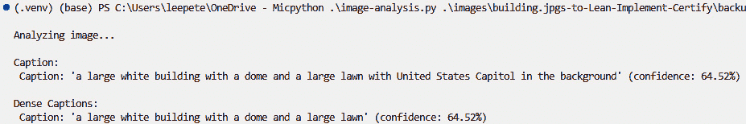

图 5.1 – 运行 python .\image-analysis.py .\images\building.jpg 的输出

运行脚本提供标题，提供图像内容的概述。

### 步骤 4：为图像获取建议的标签

识别相关标签通常可以提供关于图像内容的有用线索：

1.  在 `AnalyzeImage` 函数下，在 `#Get images tags` 注释中，检查代码以获取建议的标签列表：

    ```py
    # Get image tags
    if result.tags is not None:
        print("\nTags:")
        for tag in result.tags.list:
            print(" Tag: '{}' (confidence: {:.2f}%)".format(tag.name, tag.confidence * 100))
    ```

1.  保存您的更改，并运行文件夹中的每个图像的程序。您将看到图像标题以及建议的标签列表：

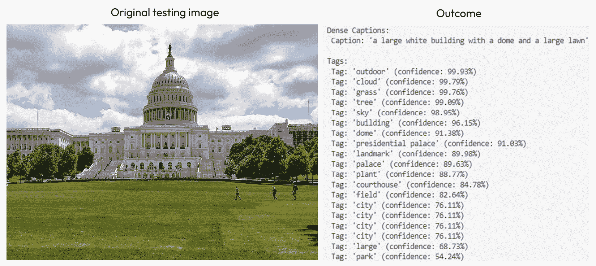

图 5.2 – 建议标签列表的输出

建议的标签提供了关于图像的额外上下文，使得对视觉数据进行分类和组织更加容易。

### 步骤 5：检测和定位图像中的对象

要检测和突出显示图像中的对象，请按照以下步骤配置和运行对象检测过程：

1.  在 `AnalyzeImage` 函数下，在 `#Get objects in the image` 注释中，检查以下代码：

    ```py
    # Get objects in the image
       if result.objects is not None:
            # Prepare image for drawing
            image = Image.open(image_filename)
            fig = plt.figure(figsize=(image.width/100, image.height/100))
            plt.axis(‹off›)
            draw = ImageDraw.Draw(image)
            color = ‹cyan›
            for detected_object in result.objects.list:
                # Print object name
                print(« {} (confidence: {:.2f}%)».format(detected_object.tags[0].name, detected_object.tags[0].confidence * 100))
                # Draw object bounding box
                r = detected_object.bounding_box
                bounding_box = ((r.x, r.y), (r.x + r.width, r.y + r.height))
                draw.rectangle(bounding_box, outline=color, width=3)
                plt.annotate(detected_object.tags[0].name,(r.x, r.y), backgroundcolor=color)
            # Save annotated image
            plt.imshow(image)
            plt.tight_layout(pad=0)
            outputfile = 'objects.jpg'
            fig.savefig(outputfile)
            print(‹  Results saved in›, outputfile)
    ```

1.  （可选）取消注释 `# Return the confidence of the person detected` 以查看图像中检测到的人的置信度。

1.  保存更改，并运行 `images` 文件夹中的每个图像的程序，注意检测到的对象。每次运行后，检查代码文件夹中生成的 `objects.jpg` 文件以查看注释对象：

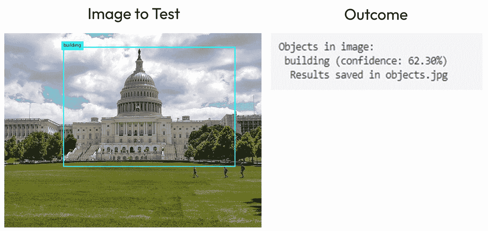

图 5.3 – 检测到的对象结果

运行人员检测程序后，检测到的对象会用边界框标记，从而提高图像中的对象识别。

### 步骤 6：检测图像中的人

要使用 Azure AI Vision 服务检测图像中的人，请按照以下步骤扩展您的图像分析实现：

1.  扩展 `AnalyzeImage` 函数以定位 `# Get people in the image` 以检测人：

    ```py
    # Get people in the image
    if result.people is not None:
        print("\nPeople in image:")
        # Prepare image for drawing
        image = Image.open(image_filename)
        fig = plt.figure(figsize=(image.width/100, image.height/100))
        plt.axis('off')
        draw = ImageDraw.Draw(image)
        color = 'cyan'
        for detected_people in result.people.list:
            # Draw object bounding box
            r = detected_people.bounding_box
            bounding_box = ((r.x, r.y), (r.x + r.width, r.y + r.height))
            draw.rectangle(bounding_box, outline=color, width=3)
            # Return the confidence of the person detected
            #print(" {} (confidence: {:.2f}%)".format(detected_people.bounding_box, detected_people.confidence * 100))
        # Save annotated image
        plt.imshow(image)
        plt.tight_layout(pad=0)
        outputfile = 'people.jpg'
        fig.savefig(outputfile)
        print('  Results saved in', outputfile)
    ```

1.  保存并运行脚本 (`python .\image-analysis.py .\images\street.jpg`) 以处理每个图像。以下是一个 `running` `street.jpg` 图像的示例。

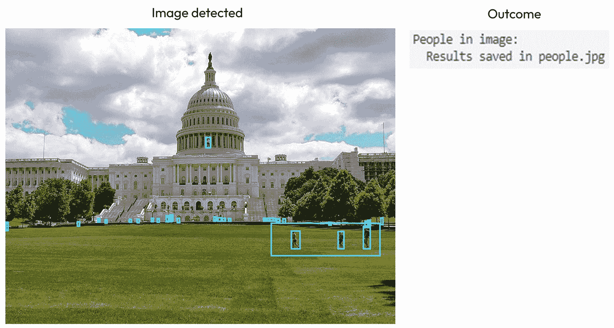

图 5.4 – 图像中找到的人

脚本成功识别并标记图像中的人，从而便于进一步分析人类存在。

### 步骤 7：移除背景

要使用 Azure AI Vision API 配置和执行背景移除过程以从图像中移除背景，请按照以下步骤操作：

1.  定位 `BackgroundForeground` 函数，检查代码，并确保 API 请求已正确配置以进行背景移除：

    ```py
    # Remove the background from the image or generate a def BackgroundForeground(endpoint, key, image_file):
        # Define the API version and mode
        api_version = "2023-02-01-preview"
        mode=»backgroundRemoval" # Can be "foregroundMatting" or "backgroundRemoval"
        # Remove the background from the image or generate a foreground matte
        print(‹\nRemoving background from image...')
        url = "{}computervision/imageanalysis:segment?api-version={}&mode={}".format(endpoint, api_version, mode)
        headers= {
            «Ocp-Apim-Subscription-Key": key,
            «Content-Type»: «application/json"
        }
        image_url=»https://github.com/MicrosoftLearning/mslearn-ai-vision/blob/main/Labfiles/01-analyze-images/Python/image-analysis/{}?raw=true».format(image_file)
        body = {
            «url": image_url,
        }
        response = requests.post(url, headers=headers, json=body)
        image=response.content
        with open(«background.png», «wb") as file:
            file.write(image)
        print(‹  Results saved in background.png \n›)
    ```

    生成的图像文件包含主题，不带其背景，可用于进一步使用或增强。


图 5.5 – 移除背景

1.  使用 `python .\image-analysis.py .\images\person.jpg` 命令运行脚本，将模式设置为 `backgroundRemoval` 以查看更改。如果脚本运行成功，将生成 `background.png` 文件作为输出。

重要提示

您可以在 `image-analysis` 文件夹中找到 `backgoutnd.png` 文件。

通过这些，我们完成了这个练习。下一步是回顾并进一步探索用户界面。尝试不同的图像和特征，例如生成密集的标题或额外的对象属性。您还可以使用 Azure 文档[`learn.microsoft.com/en-us/azure/ai-services/computer-vision/`](https://learn.microsoft.com/en-us/azure/ai-services/computer-vision/)来探索更多用例和优化。

通过遵循本练习中的步骤，您将能够高效地使用 Python 实现 Azure AI Vision 的图像分析、目标检测和文本提取！

让我们通过使用 Azure AI Vision 训练一个自定义模型来深入图像分类。

# 实现模型定制

Azure AI Vision 中的自定义模型允许用户训练 AI 模型以对图像进行分类或在其中检测对象。图像分类涉及分析图像以对其进行分类，Azure AI Vision 便于构建用于此目的的自定义视觉模型。目标检测是另一个关键的计算机视觉任务，需要识别图像中特定对象类别的位置。创建目标检测项目的流程与图像分类项目的流程类似，包括创建、标记和训练。虽然目标检测是为了说明背景，但本节中的动手练习专门关注训练用于图像分类的自定义模型。

## 自定义模型类型概述

Azure AI Vision 提供三种主要的自定义模型类型 – **图像分类**、**目标检测**和**产品识别**：

+   图像分类根据图像的整个内容分配标签，例如，将橙子、苹果或香蕉等水果类型分类，如图 *图 5**.6* 所示。此模型类型支持多类分类（每张图像一个标签）和多标签分类（每张图像多个标签）。

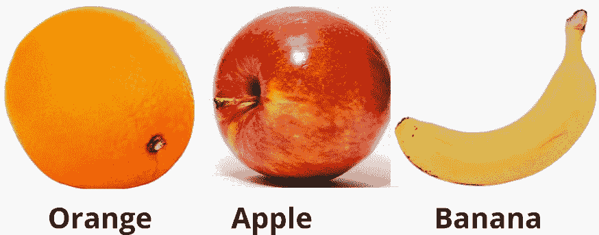

图 5.6 – 图像分类

+   另一方面，目标检测识别和定位图像中的多个对象，为每个检测到的对象提供类别标签和边界框，如图所示。例如，它可以检测一个苹果、一个橙子和一个香蕉，以及它们的位置，使其非常适合用于如人工智能驱动的结账系统等应用。

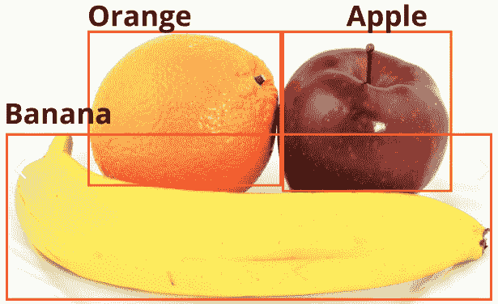

图 5.7 – 目标检测

+   产品识别与目标检测类似，但专门优化以识别和定位图像中的产品标签和品牌名称，为涉及库存管理和零售的应用程序提供更高的准确性。

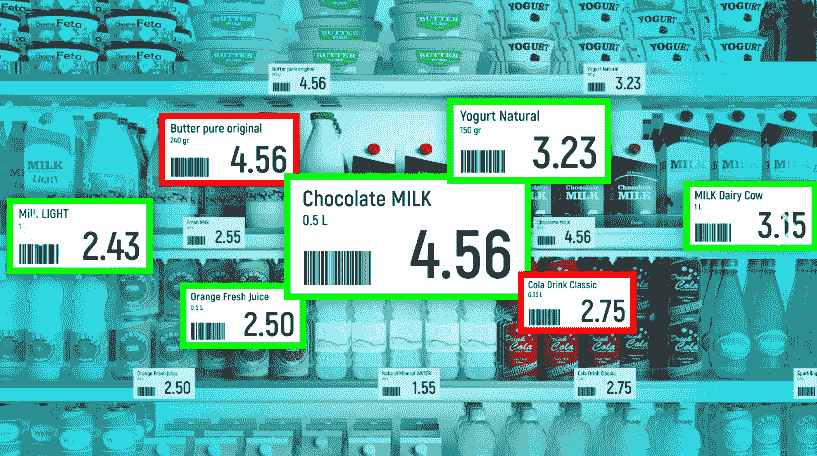

图 5.8 – 超市中的产品识别

现在您已经熟悉了可用的模型类型，让我们探索如何自定义它们以满足我们的项目需求。

## 创建自定义项目

要创建自定义视觉项目，首先需要配置 Azure AI 服务资源并设置一个新的项目。所需的第一组件是数据集，它由存储在 Azure Blob Storage 中的标记图像集合组成。定义您的数据集后，通过指定模型类型、数据集和训练预算来训练自定义模型。定期监控和评估模型性能，根据需要调整以优化结果。

每个数据集都必须包含一个 COCO 文件——一种特定的 JSON 格式，它提供了标签信息，例如图像元数据、注释和类别。COCO 文件通常在 Azure Machine Learning 数据标注项目中生成，并包含诸如图像属性（文件位置、宽度、高度和 ID）、注释（定义对象及其边界框）和类别（列出标签类别及其 ID）等关键细节。这些文件可以在数据标注过程中创建，也可以从以前的自定义视觉项目中迁移，以确保不同训练数据集之间的兼容性和一致性。

## 标记和训练自定义模型

在训练自定义模型之前，确保您的数据集已正确标记非常重要。高质量的标签直接影响模型的性能和准确性，尤其是在计算机视觉任务如分类和目标检测中。

如果您正在对图像进行分类——例如，不同类型的花朵——您将应用如*玫瑰*、*郁金香*或*雏菊*等标签到您的训练图像上。对于目标检测，您不仅需要标注标签，还需要使用边界框标注每个对象的位置。

标记完成后，通过选择模型类型（例如，图像分类或目标检测）、将其链接到您的数据集并设置训练预算来开始训练。Azure 将使用提供的数据优化模型。

训练完成后，使用单独的测试数据集评估模型非常重要，以验证其准确性和对未见图像的泛化能力。较差的结果可能表明需要重新审视您的标签或添加更多多样化的示例。

Azure Vision Studio 简化了这一过程，允许您：

+   上传存储在 Azure Blob Storage 中的标记数据集

+   导入标记元数据

+   配置并启动训练作业

+   监控训练状态并审查模型性能

在您的标记数据集准备就绪并可访问后，您现在可以开始下一个练习中构建和训练自定义模型的步骤。

您可以使用 Vision Studio 的 Web 界面或 REST API，具体取决于您的开发偏好。

现在您已经了解了标签的重要性以及如何准备您的数据集，让我们在下一个练习中通过实际操作过程来了解。

## 练习 2：创建自定义模型训练项目

在这个练习中，您将使用 Azure AI 视觉构建一个自定义图像分类模型，用于对不同水果的图像进行分类。

### 第 1 步：设置存储帐户以存储训练图像

在训练自定义模型之前，您需要创建一个存储帐户来保存数据集：

1.  通过导航到[`portal.azure.com/#create/Microsoft.StorageAccount`](https://portal.azure.com/#create/Microsoft.StorageAccount)创建一个新的存储帐户。

    +   使用`customclassifySUFFIX`格式命名存储帐户，将`SUFFIX`替换为您的首字母缩写（例如，`customclassifyJD`）。

    +   选择与您之前创建的资源组相同的区域。

    +   选择**Azure Blob Storage**作为帐户类型，并将**冗余**设置为**本地冗余存储（LRS）**。

    +   在**高级**选项卡下，在**安全**部分，启用**允许 blob 匿名访问**。

1.  创建一个名为**fruit**的新容器，并将**匿名访问级别**设置为**容器（容器和 blob 的匿名读取访问**），如图所示。

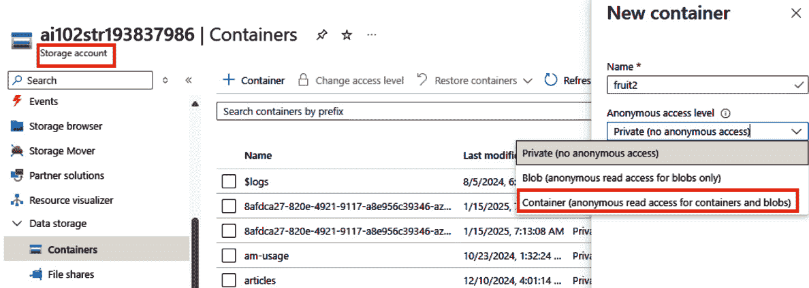

图 5.9 – 创建存储帐户以上传数据集

1.  在`02-image-classification/training-images`文件夹中的`training_labels.json`文件中，如图*图 5**.10*所示。

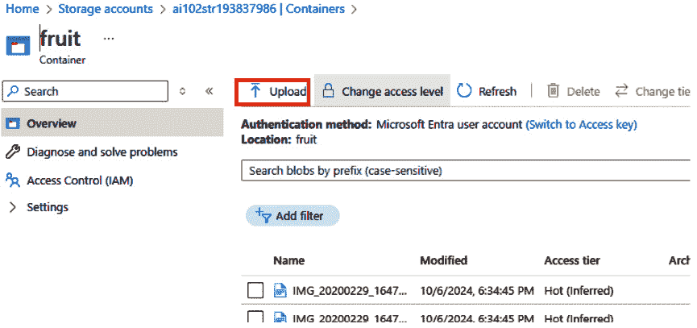

图 5.10 – 将图像文件上传到容器

### 第 2 步：运行脚本

为了确保您的训练数据集正确配置以与 Azure AI 视觉一起使用，请按照以下步骤更新 COCO 文件，包含您的存储帐户详细信息：

1.  打开`/02-image-classification/replace.ps1`文件，并将第一行中的占位符更新为您的存储帐户名称。

1.  在集成终端中运行 PowerShell 脚本（`replace.ps1`）以更新 COCO 文件。该脚本通过将所有`<storageAccount>`占位符替换为上一步中创建的实际存储帐户名称来更新`training_labels.json`文件，使其在部署或设置期间动态更新配置文件变得有用。

### 第 3 步：在自定义视觉门户中创建和训练自定义模型

在此步骤中，您将创建一个新的数据集，将其链接到您的存储帐户，并在视觉工作室中启动模型训练：

1.  前往 Azure Vision Studio，网址为[`customvision.ai/`](https://customvision.ai/)并登录。

1.  要创建您的第一个项目，请选择**新建项目**。在**创建新项目**对话框中，输入项目的名称。选择在*练习 1*中创建的多服务 Azure AI 资源（*第二章*）。

1.  选择 **分类** 作为项目类型，然后根据您的需求选择 **多类（每张图像一个标签）**。此设置可以稍后更改。接下来，选择针对您的图像类型优化的领域。在此练习中选择 **通用** [**A2**]。选择 **创建项目**，如图所示。

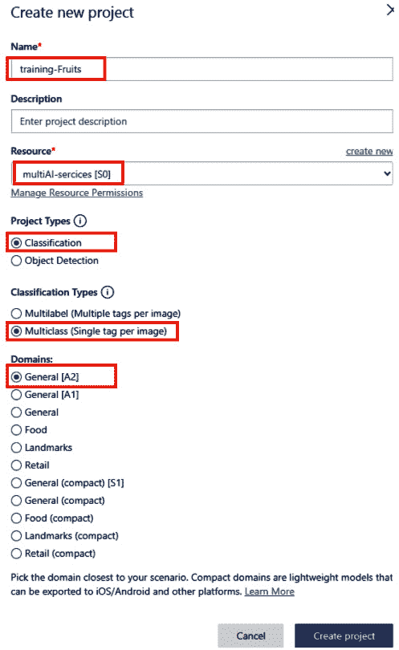

图 5.11 – 创建新项目

1.  要上传和标记图像，选择 **添加图像**，然后 **浏览本地文件**，选择您的图像。您选择的标签将应用于整个批次，因此按标签分组上传图像很有帮助。

1.  在 **我的标签** 字段中输入一个标签名称并按 *Enter*。点击 **上传 [数量] 个文件** 完成，如图所示。

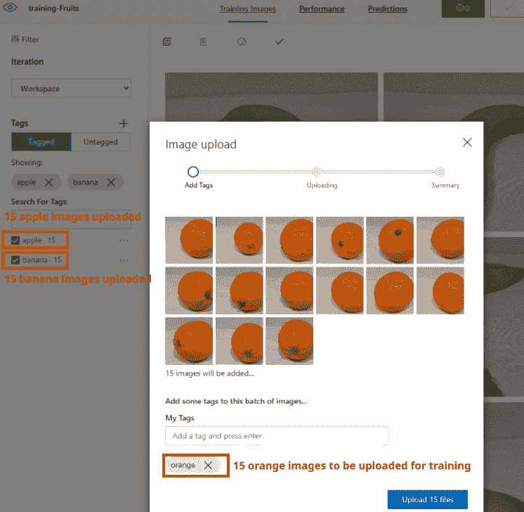

图 5.12 — 上传并标记图像以进行训练

1.  上传完成后，点击 **完成**。要上传更多图像，请重复前面的步骤。

1.  要开始训练，点击 **训练** 按钮。这将使用所有上传的图像根据它们的标签构建一个模型。训练需要几分钟，进度如图所示：

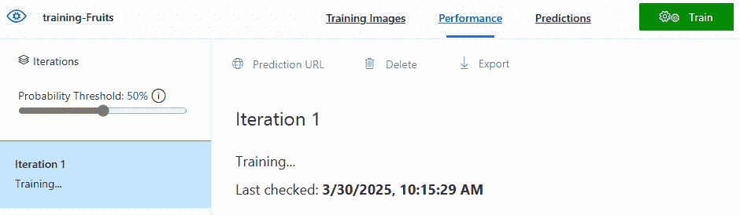

图 5.13 – 训练分类器

### 第 4 步：测试您的自定义模型

训练后测试模型有助于验证其在图像分类中的准确性和有效性：

1.  训练完成后，点击模型页面顶部的 **快速测试**。

1.  使用 `02-image-classification\test-images` 文件夹上传测试图像并观察分类结果。

1.  检查 **预测** 属性以查看详细结果，如图所示。

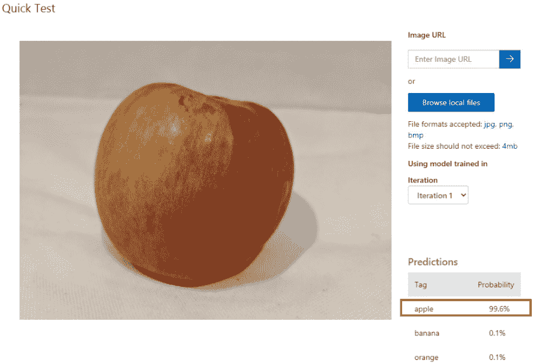

图 5.14 – 快速测试以检测分类

正如您所看到的，它以 99.6% 的置信度将图像识别为苹果。本练习将引导您通过使用 Azure AI Vision 创建、训练和测试自定义图像分类模型的完整过程，并举例说明如何对各种水果图像进行分类。

接下来，让我们探索人工智能的一个关键特性：应用程序检测人脸、分析面部特征和情绪以及识别个人的能力。

# 实施 Azure AI Face 服务

**Azure AI Face** 服务是由微软提供的一项基于人工智能的解决方案，它使开发者能够将人脸识别功能集成到他们的应用程序中。此服务可以在图像中检测和分析人脸，提供诸如人脸检测、验证和识别等功能。这些特性使 Azure AI Face 成为各种用例的理想选择，从安全系统到个性化用户体验。

## Azure AI Face 的关键特性

Azure AI Face 提供强大的面部识别功能，使应用程序能够通过详细的属性分析检测、验证和识别人脸：

+   **人脸检测**：人脸检测功能可以在图像中定位和识别人类面部。它还提供额外的属性，如估计的年龄、情绪（例如快乐、悲伤或愤怒）以及详细的 facial landmarks（例如眼睛、鼻子和嘴巴的位置）。这使得它非常适合需要精确人脸特征检测的应用程序，例如照片增强和生物识别系统。

+   **人脸验证**：人脸验证通过比较两个面部来确定它们是否属于同一个人。这种功能在需要确认人员身份的场景中非常有用，例如安全登录、身份验证或用户认证过程。

+   **人脸识别**：人脸识别将检测到的面部与已注册的面部数据库进行比较，以识别一个人。它通常用于考勤系统、自动安全检查或任何需要跟踪或识别个人的应用程序。

## Azure AI Face 的常见用例

Azure AI Face 在各个行业中广泛用于安全、认证、个性化以及媒体管理，提高了用户体验和运营效率：

+   **安全和认证**：通过启用访问控制或安全登录的人脸识别来增强安全系统。

+   **个性化**：通过识别零售或酒店环境中的客户，并相应地定制服务，提供个性化体验。

+   **媒体和娱乐**：根据图像中出现的人物自动标记和组织照片和视频，使内容管理更加容易和高效。

## 开始使用 Azure AI Face 服务

要开始使用 Azure AI Face 服务，首先在 Azure 门户中创建一个 Face 服务资源。设置资源后，您可以使用 Azure 提供的各种工具和 SDK 将人脸识别集成到您的应用程序中。了解如何利用这些功能将帮助开发者构建能够以自然、直观的方式与人类面部有效互动的智能应用程序。

在掌握了这些基础知识后，你现在可以准备在以下动手练习中应用这些概念，您将探索并使用 Azure AI Face 服务实现人脸检测和验证。

## 练习 3：使用 Azure AI Face 服务检测和分析人脸（Python）

在这个练习中，您将使用 Azure AI Face 服务来检测图像中的人脸，分析其属性，并显示结果。按照以下步骤设置和运行一个基于 Python 的应用程序以执行人脸分析。

### 使用 Python 的 Azure AI Vision SDK

按照以下步骤配置您的环境并使用 Python 的 Azure AI Vision SDK 检测和分析图像中的人：

1.  在 `04-face/computer-vision` 文件夹中，打开终端并运行以下命令来安装 SDK：

    ```py
    computer-vision folder, duplicate the .env-sample file and rename the copy to .env. Open the .env file and update the configuration with your Azure endpoint and key.
    ```

1.  `detect-people.py`，检查现有代码以确保所有必需的命名空间都是正确的：

    ```py
    from azure.ai.vision.imageanalysis import ImageAnalysisClient
    from azure.ai.vision.imageanalysis.models import VisualFeatures
    from azure.core.credentials import AzureKeyCredential
    ```

1.  `#Authenticate Azure AI Vision client` 注释，审查以下代码以创建一个认证客户端：

    ```py
    cv_client = ImageAnalysisClient(
        endpoint=ai_endpoint,
        credential=AzureKeyCredential(ai_key)
    )
    ```

1.  `AnalyzeImage` 函数，在`获取指定要检索的特征的结果`（`PEOPLE`）下，审查以下代码以检索图像中的人脸：

    ```py
    result = cv_client.analyze(
        image_data=image_data,
        visual_features=[VisualFeatures.PEOPLE]
    )
    ```

1.  `Draw bounding box around detected people`，审查以下内容：

    ```py
    for detected_people in result.people.list:
        if detected_people.confidence > 0.5:
            r = detected_people.bounding_box
            bounding_box = ((r.x, r.y), (r.x + r.width, r.y + r.height))
            draw.rectangle(bounding_box, outline="green", width=3)
    ```

1.  `computer-vision` 文件夹，运行程序：

    ```py
    people.jpg file to view annotated faces.
    ```

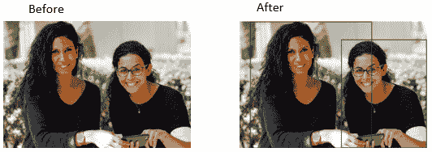

图 5.15 – 检测和分析人脸

配置 SDK 后，您现在可以检测和分析人脸，为高级人脸识别任务打下基础。

### 使用 Python 中的 Face SDK 进行增强人脸分析

要使用 Face SDK 进行更详细的 facial analysis，请按照以下步骤配置您的环境并在 Python 中实现增强的人脸检测工作流程：

1.  `04-face/face-api` 文件夹，打开终端并运行以下命令：

    ```py
    face-api folder, duplicate the .env-sample file and rename the copy to .env. Open the .env file and update the configuration with your Azure endpoint and key.
    ```

1.  `analyze-faces.py`, 在顶部审查以下导入：

    ```py
    from azure.cognitiveservices.vision.face import FaceClient
    from azure.cognitiveservices.vision.face.models import FaceAttributeType
    from msrest.authentication import CognitiveServicesCredentials
    ```

1.  `#Authenticate Face client` 注释，审查以下内容：

    ```py
    # Authenticate Face client
    credentials = CognitiveServicesCredentials(cog_key)
    face_client = FaceClient(cog_endpoint, credentials)
    ```

1.  `DetectFaces` 函数，在`指定要检索的面部特征`下审查以下代码：

    ```py
    # Specify facial features to be retrieved
    features = [FaceAttributeType.occlusion, FaceAttributeType.blur, FaceAttributeType.glasses]
    ```

1.  **检测和分析人脸**：审查以下代码以检测人脸并绘制边界框：

    ```py
    # Get faces
    with open(image_file, mode="rb") as image_data:
        detected_faces = face_client.face.detect_with_stream(image=image_data, 
    return_face_attributes=features, 
    return_face_id=False)
        if len(detected_faces) > 0:
            print(len(detected_faces), 'faces detected.')
            # Prepare image for drawing
            fig = plt.figure(figsize=(8, 6))
            plt.axis('off')
            image = Image.open(image_file)
            draw = ImageDraw.Draw(image)
            color = 'lightgreen'
            face_count = 0
            # Draw and annotate each face
            for face in detected_faces:
                # Get face properties
                face_count += 1
                print('\nFace number {}'.format(face_count))
                detected_attributes = face.face_attributes.as_dict()
                if 'blur' in detected_attributes:
                    print(' - Blur:')
                    for blur_name in detected_attributes['blur']:
                        print('   - {}: {}'.format(blur_name, detected_attributes['blur'][blur_name]))
                if 'occlusion' in detected_attributes:
                    print(' - Occlusion:')
                    for occlusion_name in detected_attributes['occlusion']:
                        print('   - {}: {}'.format(occlusion_name, detected_attributes['occlusion'][occlusion_name]))
                if 'glasses' in detected_attributes:
                    print(' - Glasses:{}'.format(detected_attributes['glasses']))
                # Draw and annotate face
                r = face.face_rectangle
                bounding_box = ((r.left, r.top), (r.left + r.width, r.top + r.height))
                draw = ImageDraw.Draw(image)
                draw.rectangle(bounding_box, outline=color, width=5)
                annotation = 'Face number {}'.format(face_count)
                plt.annotate(annotation,(r.left, r.top), backgroundcolor=color)
            # Save annotated image
            plt.imshow(image)
            outputfile = 'detected_faces.jpg'
            fig.savefig(outputfile)
    ```

1.  `face-api` 文件夹，执行以下操作：

    ```py
    detected_faces.jpg to view the annotated faces with the detected attributes.
    ```

通过遵循这些步骤，您将检测并分析人脸，展示 Azure AI 的关键人脸识别功能。

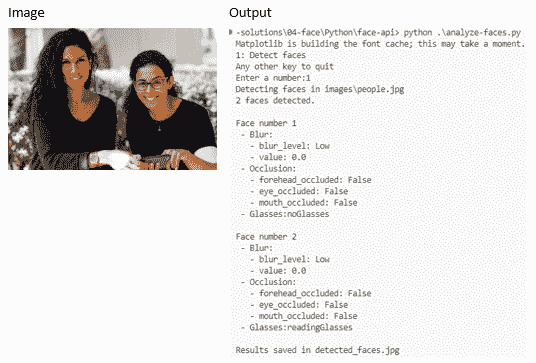

图 5.16 – 运行应用后的输出

通过这个练习，你已经成功使用 Azure AI 人脸服务检测并分析了人脸，了解了其核心功能及其在各种场景中的应用。

现在，让我们深入了解一个模块，它教你如何使用图像分析 API 进行 OCR。

# Azure AI Vision 中 OCR 概述

**OCR** 是 Azure AI Vision 中的关键技术，它使计算机能够从图像中读取和提取文本。这个强大的功能可以处理各种类型的图像，包括标志照片、扫描文档和屏幕截图，将嵌入的文本转换为数字、可编辑和可搜索的数据。有了 OCR，Azure AI Vision 将静态图像转换为易于访问和利用的结构化信息。

## Azure AI Vision 中 OCR 的工作原理

Azure AI Vision 中的 OCR 功能扫描图像以识别文本，无论是印刷的（例如标志或书籍）还是手写的。然后提取这些文本，并提供其结构的详细分解，识别元素如单词、行及其在图像中的确切位置。这有助于保留内容的上下文和布局，使其更容易理解和操作。此外，Azure 的 OCR 支持多种语言，使全球应用成为可能，并确保在不同脚本中准确识别文本。

## OCR 的常见用例

OCR 用于各种任务，但常见的包括以下：

+   **数字化文档**：OCR 可以将扫描的纸质文档（如合同或信件）转换为可编辑或存档的数字文本

+   **数据录入自动化**：它自动从结构化表格、发票或收据中提取文本，减少手动数据录入的工作量

+   **可访问性**：它将图像中的文本转换为语音或数字文本，为视障用户提高可访问性

+   **可搜索内容**：它将图像中的文本转换为可搜索的数据，使数字图书馆或基于图像的档案易于探索

例如，想象一下拍摄一张名片。使用 Azure AI 视觉的 OCR，卡片上的文本（如人的姓名、电话号码和电子邮件地址）可以被读取并转换为数字文本，然后可以自动保存到您的联系人中。这节省了时间并消除了手动转录的需要。

现在您已经清楚地了解了 Azure AI 视觉中 OCR 的工作原理及其潜在应用，让我们在以下练习中应用您所学的知识。

## 练习 4：使用 Azure AI 视觉 OCR 读取图像中的文本（Python）

在这个练习中，您将学习如何使用 Azure AI 视觉的 OCR 功能从图像中提取文本并分析它。按照以下步骤设置您的环境并实现使用 Azure AI 视觉 SDK 进行文本提取的代码。

### 设置 Python 环境

按照以下步骤准备您的 Python 环境以使用 Azure AI 视觉的 OCR 功能：

1.  在 `05-ocr/read-text` 文件夹中，打开集成终端并安装所需的 SDK：

    ```py
    read-text folder, duplicate the .env-sample file and rename the copy to .env. Open the .env file and update the configuration with your Azure endpoint and key.
    ```

1.  添加您的 Azure AI 服务端点和密钥：

    ```py
    AI_ENDPOINT=Your_Endpoint_Here
    AI_KEY=Your_Key_Here
    ```

1.  保存您的更改。

### 使用 Azure AI 视觉 SDK 从图像中读取文本

按照以下步骤使用 Azure AI 视觉 SDK 实现和运行 OCR 以从图像中提取文本：

1.  在 `read-text/read-text.py` 中，审查以下位于 `# import namespaces` 注释下的导入语句：

    ```py
    # import namespaces
     from azure.ai.vision.imageanalysis import ImageAnalysisClient
     from azure.ai.vision.imageanalysis.models import VisualFeatures
     from azure.core.credentials import AzureKeyCredential
    ```

1.  `# 认证 Azure AI 视觉客户端` 注释并审查以下代码以创建一个认证客户端：

    ```py
    # Authenticate Azure AI Vision client
     cv_client = ImageAnalysisClient(
         endpoint=ai_endpoint,
         credential=AzureKeyCredential(ai_key))
    ```

1.  在 `# 使用分析图像功能读取图像中的文本` 注释下，审查以下 `GetTextRead` 函数的代码以读取图像中的文本：

    ```py
    #  Use Analyze image function to read text in image
    result = cv_client.analyze(
        image_data=image_data,
        visual_features=[VisualFeatures.READ]
    )
    ```

1.  `# 显示图像并叠加提取的文本`，审查以下代码：

    ```py
    # Display the image and overlay it with the extracted text
     if result.read is not None:
         print("\nText:")
         # Prepare image for drawing
         image = Image.open(image_file)
         fig = plt.figure(figsize=(image.width/100, image.height/100))
         plt.axis('off')
         draw = ImageDraw.Draw(image)
         color = 'cyan'
         for line in result.read.blocks[0].lines:
             # Return the text detected in the image
    print(f"  {line.text}")
         drawLinePolygon = True
         r = line.bounding_polygon
    bounding_polygon = ((r[0].x, r[0].y),(r[1].x, r[1].y),(r[2].x, r[2].y),(r[3].x, r[3].y))
     # Return the position bounding box around each line
     # Return each word detected in the image and the position bounding box around each word with the confidence level of each word
     # Draw line bounding polygon
     if drawLinePolygon:
         draw.polygon(bounding_polygon, outline=color, width=3)
         # Save image
         plt.imshow(image)
         plt.tight_layout(pad=0)
         outputfile = 'text.jpg'
         fig.savefig(outputfile)
         print('\n  Results saved in', outputfile)
    ```

通过利用 Azure AI 视觉 SDK，您可以成功从图像中提取和分析文本，为各种应用实现自动化和改进的可访问性。

### 运行程序以检测文本

按照以下步骤执行 OCR 程序并审查从样本图像中提取的文本结果：

1.  在 `read-text` 文件夹中，运行以下命令：

    ```py
    1 to analyze the Lincoln.jpg image. The console will display the text extracted from the image.
    ```

1.  `text.jpg` 在 `read-text` 文件夹中。您应该看到每行检测到的文本被蓝色多边形轮廓包围。

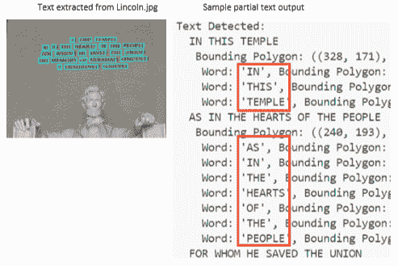

图 5.17 – 文本输出

程序运行后，提取的文本将在控制台显示，并标注的图像突出显示检测到的文本，确认 OCR 处理成功。

### 检测手写文本

按照以下步骤使用 Azure AI 视觉 OCR 检测和提取图像中的手写文本：

1.  `Main` 函数，检查当用户选择菜单选项 2 时运行的代码，该代码使用 `Note.jpg` 图像调用 `GetTextRead` 函数。

1.  **运行程序**：在终端中运行以下命令：

    ```py
    2 when prompted, and observe the extracted text in the console.
    ```

1.  在 `read-text` 文件夹中的 `text.jpg` 查看手写文本在 `Note.jpg` 图像中每个单词周围的多边形。

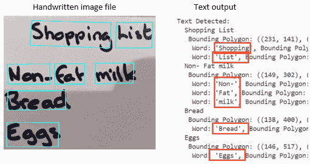

图 5.18 – 手写输出

通过遵循这些步骤，你已经成功实现了 OCR，使用 Python 中的 Azure AI 视觉服务从图像中读取文本，包括手写内容。

通过这个练习，你已经成功实现了并测试了使用 Python 的 Azure AI 视觉 SDK 实现的 OCR。你现在可以通过使用其他图像并调整代码以适应不同场景来进一步探索。

接下来，让我们探索 Azure AI 视频索引器，这是一个从视频中提取见解的服务，包括人脸识别、文本识别、对象标签和场景分割。

# 使用 Azure AI 视频索引器分析视频

Azure AI 视觉中的视频分析是一套 AI 驱动的工具，通过分析视觉和音频组件，帮助从视频内容中提取有意义的见解。它使组织能够自动处理视频并提取信息，如说话内容、检测到的对象、人脸甚至情绪，将非结构化视频数据转化为结构化、可搜索和可操作的见解。

## Azure AI 视觉中视频分析的关键功能

以下功能突出了 Azure AI 视频索引器如何通过视觉和音频分析从视频内容中提取有意义的见解：

+   **人员检测**：从视频流中实时检测个体，并提供带有跟踪 ID 的边界框。这使个体在摄像机视野中移动时能够进行一致的跟踪。

+   **线穿越检测**：当一个人穿越摄像机视野中定义的虚拟线时触发事件。适用于进出监测、方向流量跟踪或强制执行受限区域。

+   **区域进出检测**：检测人们何时进入或离开一个定义的多边形区域（例如，商店通道、等候区或安全区）。非常适合占用监测和安全合规。

+   **人数统计**：统计特定区域内的人数，有助于监测容量并优化空间利用率。

+   **停留时间分析**：测量一个人在指定区域停留的时间，从而深入了解客户参与度或检测敏感区域中的潜在徘徊。

+   **接近检测**：测量帧中个体之间的距离，如果违反了某个阈值，则可以触发事件——特别适用于在工作场所或公共场所强制执行物理距离。

+   **实时警报**：通过 webhooks 与外部系统集成，根据实时事件（例如有人进入限制区域）触发警报或自动操作。

+   **以隐私为首要设计**：空间分析功能处理视频帧而不存储个人可识别数据。仅处理和共享元数据（例如边界框和事件触发器），支持 GDPR 合规性和隐私敏感场景。

## 视频分析常见用例

让我们看看一些用例：

+   **媒体和娱乐**：自动标记和组织视频内容，使其更容易搜索和管理大型媒体库

+   **安全和监控**：为了安全目的监控和分析视频流，包括检测感兴趣的个人或物体

+   **教育和培训**：创建用于教育目的的可搜索视频内容，使学生能够找到特定的片段或主题

+   **市场营销和客户洞察**：了解营销视频中的客户反应和情感，以优化未来的内容策略

这些功能使组织能够使用预构建的 AI 模型从实时视频流中提取可操作的见解，而无需进行自定义视觉训练。系统旨在边缘到云的场景，并支持通过容器在 Azure Stack Edge 或兼容硬件上部署。

## 在 Azure AI Vision 中开始视频分析

要使用视频分析，首先将你的视频内容上传到 Azure AI Video Indexer。该服务处理视频并生成见解，这些见解可以通过 Azure 门户或通过 API 编程访问。使用视频分析，原始视频数据可以转换为结构化、可搜索的信息，对各个行业都具有高度价值。

现在你已经对 Azure AI Vision 中的视频分析工作原理有了基础的了解，让我们通过以下练习将这些概念付诸实践。你将学习如何上传视频，处理它，并提取诸如转录、对象检测和情感分析等见解。

## 练习 5：使用 Azure AI Video Indexer（Python）分析视频内容

在这个练习中，你将使用 Azure AI Video Indexer 上传并分析视频，以提取诸如转录、对象检测和关键场景等有意义的见解。按照以下步骤设置环境，分析视频，并探索结果。

### 第 1 步：克隆仓库

如果你已经克隆了 Azure AI Vision 仓库，你可以跳过*步骤 1*。否则，请参考本章*练习 1：使用 Azure AI Vision 分析图像*中的*步骤 1*。

### 第 2 步：将视频上传到视频索引器

按照以下步骤将你的视频文件上传到 Azure Video Indexer 并启动索引过程：

1.  访问[`www.videoindexer.ai/`](https://www.videoindexer.ai/)上的视频索引器门户并使用你的 Microsoft 账户登录。如果你没有账户，请注册一个免费账户。

1.  在`06-video-indexer`文件夹下找到`responsible_ai.mp4`。

1.  在视频索引器门户中，首先点击`.mp4`视频。

1.  上传完成后，点击**审查上传**按钮以确认视频元数据和索引设置，然后进行处理。

1.  选择复选框以确认符合微软政策，然后点击**上传 + 索引**。

1.  等待几分钟，视频索引器处理和索引视频。

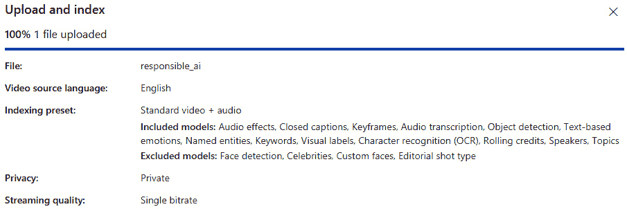

图 5.19 – 上传的 responsible_ai 文件

视频成功上传和索引后，您可以探索由 Azure AI 视频索引器生成的丰富洞察集。

### 第 3 步：审查视频洞察

视频处理完成后，按照以下步骤探索 Azure 视频索引器提取的洞察：

1.  视频处理完成后，在视频索引器门户中选择它以查看其洞察。

1.  切换到**时间轴**选项卡以查看音频叙述的转录文本。

1.  在门户右上角的**视图**菜单中，启用**字幕**、**OCR**和**发言人**以查看所有提取的信息：

    +   **字幕**：显示音频叙述转换为文本

    +   **OCR**：提取视频帧中显示的文本

    +   **发言人**：识别视频中的发言人（通过姓名识别或分配编号，如*发言人 #1*）

1.  探索其他洞察，如检测到的对象、命名实体（如人物和品牌）和关键场景。

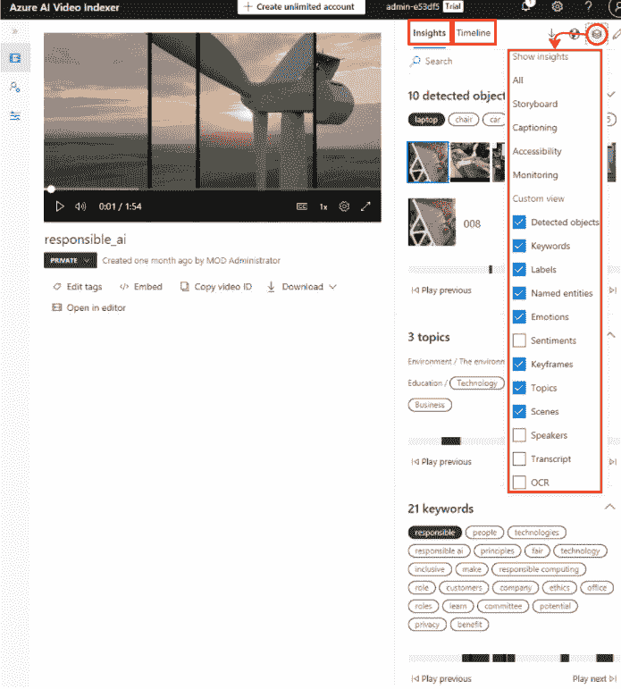

图 5.20 – 视频分析

通过审查视频洞察，您可以分析转录内容、检测到的对象和识别出的发言人，从而从视频内容中获得有价值的上下文和可搜索的元数据。

### 第 4 步：搜索特定洞察

使用以下步骤在分析的视频内容中搜索特定的关键词或实体：

1.  在“蜜蜂”上）。

1.  观察视频中蜜蜂出现的匹配标签和位置。

1.  点击时间轴跳转到视频中被检测到蜜蜂的确切时刻。

### 第 5 步：将视频洞察嵌入到网页中

要与他人分享洞察和视频，可以将视频索引器小部件嵌入到网页中：

1.  在 Visual Studio Code 中，导航到`06-video-indexer`文件夹并打开`analyze-video.html`。

1.  在视频索引器门户中，转到`responsible_ai`视频并选择**嵌入**选项，选择**播放器**小部件，设置视频大小为**560x315**，然后将嵌入代码复制到剪贴板。

1.  返回到`analyze-video.html`下的`<!-- Player widget goes here -->`注释。

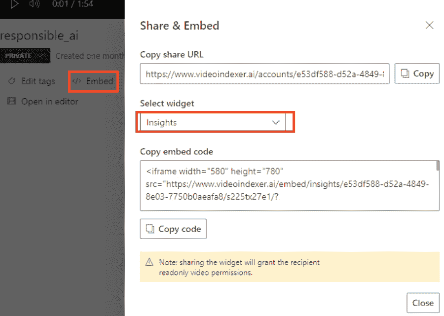

图 5.21 – 分享 & 嵌入

1.  保存 HTML 文件并在浏览器中打开以查看嵌入的视频和洞察。

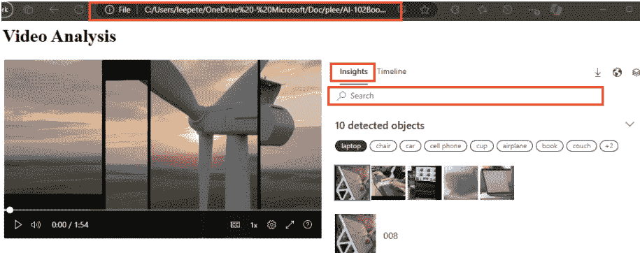

图 5.22 – 视频分析

1.  按照前面的图示尝试使用小部件。使用 **洞察** 选项卡搜索洞察并在视频中跳转到它们。

### 步骤 6：使用 Video Indexer REST API

要自动化视频管理任务或将洞察集成到自定义应用程序中，您可以通过其 REST API 以编程方式与 Azure 视频索引器交互。

按照以下步骤使用 REST API 和示例 PowerShell 脚本来验证和检索视频元数据：

1.  在 Visual Studio Code 中，导航到 `06-video-indexer` 文件夹并打开 `get-videos.ps1`。

1.  在 PowerShell 脚本中，将 `YOUR_ACCOUNT_ID` 和 `YOUR_API_KEY` 占位符替换为您在 *第二章* 的 *练习 1* 的 *步骤 2* 中获得的账户 ID 和 API 密钥值。

1.  注意，对于免费账户，位置设置为 **trial**。如果您使用的是与 Azure 资源关联的无限制 Video Indexer 账户，请将其更新为您的 Azure 资源部署的位置（例如，**eastus**）。

1.  检查脚本代码，它执行两个 REST 调用：一个用于获取访问令牌，另一个用于列出您账户中的视频。

1.  保存您的更改，然后单击脚本窗格右上角的 ▷ 按钮来运行它。

1.  检查来自 REST 服务的 JSON 响应，它应显示您在 *练习 5：使用 Azure AI 视频索引器分析视频内容* 的 *步骤 2* 中先前索引的 *Responsible AI* 视频的详细信息。

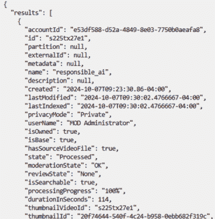

图 5.23 – responsible_ai 视频的详细信息

这个练习为您提供了使用 Azure AI 视频索引器分析视频内容、探索见解并与他人分享结果的动手经验。

# 摘要

在本章中，我们探讨了 Azure AI 视觉在分析图像和视频以提取有意义的见解方面的多种功能。我们从图像分析开始，学习了如何使用 Azure AI 视觉的图像分析功能来检测对象、识别面部和执行内容审核。这些技能对于自动化视觉数据处理、增强安全或实施制造中的质量控制等场景至关重要。通过理解对象检测和面部识别的底层概念，您获得了构建能够识别模式、识别对象并理解复杂视觉数据的 AI 模型的能力。

接下来，我们转向自定义视觉模型，涵盖了如何创建和训练模型以根据自定义标签对图像进行分类或检测特定对象。这涉及到使用存储在 Azure Blob 存储中的数据集并创建 COCO 文件来定义训练数据的标签和类别。通过动手练习，您学习了如何标记、训练和评估这些模型以实现准确性。当开发针对独特业务需求的 AI 解决方案时，这些技能非常有价值，例如在零售中识别定制产品或在工业环境中检测缺陷。

在此之后，我们探讨了 Azure AI 人脸服务，重点关注人脸检测、验证和识别。这些功能在安全系统中的访问控制和客户参与场景中得到了广泛应用，其中识别回头客可以增强用户体验。您学习了如何利用 Azure 的 Face 服务检测面部特征，如年龄和情绪，使 AI 模型能够解释人类表情并自然地交互。

我们随后介绍了 OCR，这是一个从各种来源提取文本的功能，例如扫描的文档、标志图像和手写笔记。您看到了 OCR 如何将静态图像转换为可搜索和可编辑的文本，这使得它在文档数字化、自动化数据录入和提升可访问性方面非常有用。了解如何实现 OCR 为自动化文本密集型流程打开了可能性，例如数字化法律文件或将印刷材料转换为数字档案。

最后的部分涵盖了使用 Azure AI 视频索引器的视频分析。这项服务允许您分析视频的音频和视觉组件，提供诸如转录、对象检测和情感分析等见解。您看到了视频分析如何自动标记、搜索和组织视频内容，使其更容易管理大型媒体库或为营销和教育目的提取见解。这些技能对于媒体管理、安全和内容生成中的应用至关重要。

在下一章中，我们将从视觉数据过渡到**自然语言处理**，我们将探讨 Azure AI 如何使应用程序能够理解和生成人类语言。您将了解文本分析、语言理解和构建使用 Azure 语言服务的对话式 AI 解决方案。

# 复习问题

回答以下问题以测试您对本章知识的了解：

1.  以下哪个功能是 Azure AI 视觉图像分析服务提供的？

    1.  文本翻译和情感分析

    1.  对象检测、人脸识别和内容审核

    1.  语音转文本和文本转语音转换

    1.  聊天机器人和会话管理

    **正确** **答案**：B

1.  在自定义视觉模型中，图像分类与对象检测的主要区别是什么？

    1.  图像分类将整个图像分类，而对象检测则识别并定位图像中的多个对象。

    1.  图像分类仅检测图像中的文本，而对象检测则找到图像中的人脸。

    1.  图像分类使用 Azure Blob 存储，对象检测使用 SQL 数据库。

    1.  图像分类仅适用于视频数据，而对象检测仅适用于静态图像。

    **正确** **答案**：A

1.  哪个 Azure AI 视觉功能最适合在安全场景中识别个人？

    1.  图像分析

    1.  人脸服务

    1.  OCR

    1.  视频索引器

    **正确** **答案**：B

1.  以下哪项最能描述 Azure AI 视觉中多模态嵌入的目的？

    1.  它们将手写文本转换为可搜索和编辑的机器可读字符。

    1.  它们允许将图像和音频数据合并成一个单一的媒体流，以实现高效的处理。

    1.  它们使图像和文本查询能够映射到共享的向量空间，以实现语义搜索和相似度匹配。

    1.  它们检测对象并根据预定义的类别（如动物或家具）进行分类。

    **正确** **答案**：C

1.  以下哪种场景可以使用 Azure AI 视觉中的 OCR 进行自动化？

    1.  将扫描文档中的文本转换为可编辑和可搜索的数字文本

    1.  为视频内容生成实时字幕

    1.  实时将文本从一种语言翻译成另一种语言

    1.  根据用户偏好提供推荐

    **正确** **答案**：A

# 进一步阅读

要了解更多关于本章所涉及的主题，请查看以下资源：

+   *什么是 Azure AI 视觉？*: [`learn.microsoft.com/en-us/azure/ai-services/computer-vision/overview`](https://learn.microsoft.com/en-us/azure/ai-services/computer-vision/overview)

+   *什么是图像分析？*: [`learn.microsoft.com/en-us/azure/ai-services/computer-vision/overview-image-analysis?tabs=4-0`](https://learn.microsoft.com/en-us/azure/ai-services/computer-vision/overview-image-analysis?tabs=4-0)

+   *什么是 Azure AI 面部* **服务**？: [`learn.microsoft.com/en-us/azure/ai-services/computer-vision/overview-identity`](https://learn.microsoft.com/en-us/azure/ai-services/computer-vision/overview-identity)

+   *光学字符识别* [`learn.microsoft.com/en-us/azure/ai-services/computer-vision/overview-ocr`](https://learn.microsoft.com/en-us/azure/ai-services/computer-vision/overview-ocr)

+   *什么是视频分析？*: [`learn.microsoft.com/en-us/azure/ai-services/computer-vision/intro-to-spatial-analysis-public-preview?tabs=sa`](https://learn.microsoft.com/en-us/azure/ai-services/computer-vision/intro-to-spatial-analysis-public-preview?tabs=sa)
