# 第六章：实施自然语言处理解决方案

在本章中，我们将探讨 Azure AI 语言和 Azure AI 语音服务中的高级文本和语音分析功能。本章向您介绍了分析文本的各种 **自然语言处理（NLP**）技术，包括语言检测、关键词提取、情感分析、实体识别和识别 **个人身份信息（PII**）。通过利用这些功能，您将学习如何构建处理和解释文本数据以驱动决策的应用程序。我们还将深入了解 Azure AI 语音服务，涵盖 **文本到语音（TTS**）、语音到文本和自定义语音解决方案，如关键词和意图识别，为您提供构建交互式和智能语音体验的工具。

此外，本章还涵盖了 Azure AI 翻译器，用于文本和语音翻译，使应用程序能够支持多种语言。

到本章结束时，您将能够做到以下事项：

+   使用 Azure AI 语言分析并处理文本，包括语言检测、关键词提取、情感分析、**命名实体识别（NER**）和 PII 检测

+   使用 Azure AI 语音实现自定义语音解决方案，包括实时和批量转录、文本到语音（TTS）、意图识别、关键词检测和说话人识别

+   配置和优化音频格式、语音和 **语音合成标记语言（SSML**）以实现定制的 TTS 体验

+   使用 Azure AI 翻译器在多种语言之间翻译文本和语音，提供语言检测、转写和同时翻译到多种语言的功能

+   构建结合 Azure AI 语言和 Azure AI 语音功能的应用程序，以创建对话界面、集成虚拟代理并支持多语言、交互式体验

让我们深入探讨！

# 使用 Azure AI 语言分析文本

Azure AI 语言提供了一套全面的工具，用于从文本中提取有价值的见解，这使得处理大量数据以适应各种应用变得更加容易。在本节中，我们将探讨关键文本分析功能，例如语言检测、关键词提取、情感分析、命名实体识别（NER）、个人身份信息（PII）检测和实体链接。通过利用这些功能，您可以增强从客户反馈分析到合规自动化等应用。Azure AI 语言中的每个功能都使文本内容的结构化分析成为可能，从而促进更好的决策：

+   **语言检测**：语言检测识别给定文本的语言并提供一个置信度分数，表示正确性的可能性。这种能力对于与多语言受众互动的企业至关重要，例如客户服务中心、内容审查平台和全球电子商务网站。通过自动确定传入文本的语言，组织可以将查询路由到相应的语言支持团队或配置聊天机器人以正确响应。例如，如果一份支持工单包含西班牙语文本，系统可以相应地进行分类，并确保西班牙语客服人员处理该请求。

+   **关键词提取**：关键词提取有助于识别给定文本中最重要的人和概念，使组织能够高效地总结内容并改进搜索功能。此功能对新闻聚合器、文档索引和自动报告生成等应用有益。例如，如果一篇文章讨论了*Azure AI*、*机器学习*和*预测分析*，这些*术语*将被提取为关键词，使用户能够快速把握文档的主要主题，而无需阅读整个文本。企业还可以使用此功能对大量文档进行标记和分类，以便在需要时更容易检索相关信息。

+   **情感分析**：情感分析确定文本的整体情感基调——是*正面*、*负面*、*中性*还是*混合*——并附带相应的置信度分数。这种能力在客户服务、品牌监控和市场研究中得到广泛应用，以衡量公众情绪并改善决策。例如，分析产品的客户评论可以帮助企业了解用户是否满意或不满。如果多个评论表明对某个特定功能的挫败感，公司可以优先改进该领域。同样，组织可以监控社交媒体对话，以评估公众看法并采取主动措施解决负面反馈。

+   **命名实体识别（NER）**：NER 识别并分类文本中的特定实体，例如*人*、*地点*、*组织*、*日期*和*产品名称*。这种能力对于结构化非结构化数据以及在法律文件处理、新闻分类和财务报告等应用中自动化内容分析至关重要。例如，在句子“Elon Musk 宣布在德克萨斯州周一开设一家新的特斯拉工厂”中，NER 将提取*Elon Musk*（*人*）、*Tesla*（*组织*）、*Texas*（*地点*）和*Monday*（*日期*）。通过识别这些实体，组织可以丰富元数据，改进搜索功能，并促进更好的内容推荐。

+   **检测 PII**：PII 检测在文本中识别并屏蔽敏感个人信息，帮助组织遵守数据保护法规，如**通用数据保护条例**（**GDPR**）和**健康保险可携带性和问责法案**（**HIPAA**）。对于处理客户数据的行业，如金融、医疗保健和电子商务，此功能至关重要。PII 检测自动标记如信用卡号码、社会保险号码、电话号码和电子邮件地址等详细信息，确保在存储或进一步处理之前，此类信息被删除或加密。例如，在一份客户支持日志中提到“John Doe 的电话号码是 +1-202-555-0198，他的电子邮件是 johndoe@example.com”，PII 检测将识别并删除敏感细节，保护客户隐私。

+   **实体链接**：实体链接通过将识别的实体与外部知识库（如维基百科、领英或专有数据库）连接起来，增强了文本分析。此功能在内容推荐系统、搜索引擎优化和数字助理中特别有用，在这些系统中，理解术语的上下文至关重要。例如，在短语“Venus 在夜空中可见”中，单词“Venus”可能指代行星、罗马女神或网球运动员 Venus Williams。实体链接通过将其与相关知识源关联来消除术语歧义，提供更深入的理解。这种能力对于改进聊天机器人响应、丰富新闻文章的相关链接以及通过将内容与权威来源连接起来来增强研究工作流程至关重要。

通过利用这些功能，您可以构建能够理解、分类和分析文本以驱动决策过程的人工智能应用。接下来，下一节将提供使用 Azure AI 语言服务进行动手练习，以巩固这些概念并帮助您将这些概念应用于实际场景。

重要提示：以下说明适用于本章节的所有练习

如果您尚未克隆存储库或配置 Azure AI 服务，请参阅*第二章*中的*练习 1：Azure AI 服务的入门*，特别是*克隆 GitHub 存储库*和*配置 Azure AI 服务*部分，以获取详细指导。如前所述，请记住准备好您的端点和密钥，因为在这里将需要它们。

## 练习 1：使用 Azure AI 语言进行文本分析

Azure AI 语言服务提供了一种强大的方式，通过使用各种技术分析文本，例如语言检测（*步骤 5*）、情感分析（*步骤 6*）、关键词提取（*步骤 7*）、实体识别（*步骤 8*）和实体链接（*步骤 9*）。在这个练习中，您将使用 Python 创建一个文本分析应用来探索这些功能。

### 步骤 1：设置 Visual Studio Code (VS Code)

首先，您将设置您的开发环境，为构建和测试您的文本分析应用程序做准备。

1.  在`chapter-6/01-text-analysis/Python/text-analysis`文件夹中打开一个集成终端。

1.  通过在终端中运行以下命令安装 Azure AI Language SDK 和`python-dotenv`包：

    ```py
    pip install azure-ai-textanalytics==5.3.0 python-dotenv
    ```

### 第 2 步：配置应用程序

接下来，您将设置客户端代码，使用这些配置值安全地将您的应用程序连接到 Azure AI Language 服务。

1.  在`text-analysis`文件夹中打开`.env`文件。

1.  添加您的 Azure AI Language 资源的端点和密钥：

    ```py
    AI_SERVICE_ENDPOINT=Your_Endpoint_Here
    AI_SERVICE_KEY=Your_Key_Here
    ```

1.  保存`.env`文件。

### 第 3 步：设置文本分析客户端

配置好文本分析客户端后，您现在可以运行应用程序并开始分析文本数据。

1.  在 VS Code 中打开`text-analysis.py`文件。

1.  在`导入命名空间`注释下，检查以下代码是否已添加：

    ```py
    from azure.core.credentials import AzureKeyCredential
    from azure.ai.textanalytics import TextAnalyticsClient
    ```

1.  使用端点和密钥找到`创建客户端`注释并审查以下代码：

    ```py
    credential = AzureKeyCredential(ai_key)
    ai_client = TextAnalyticsClient(endpoint=ai_endpoint, credential=credential)
    ```

1.  保存您的更改。

### 第 4 步：运行应用程序

接下来，您将使用此应用程序测试特定的文本分析功能。

1.  在终端中，导航到`text-analysis`文件夹，运行以下命令：

    ```py
    reviews folder.
    ```

### 第 5 步：测试检测语言

让我们先识别每个文本评论的语言。

1.  找到`获取语言`注释并审查代码：

    ```py
    detected_language = ai_client.detect_language(documents=[text])[0]
    print('\nLanguage: {}'.format(detected_language.primary_language.name))
    ```

1.  保存并运行程序。输出应显示每个评论检测到的语言，如图下所示。

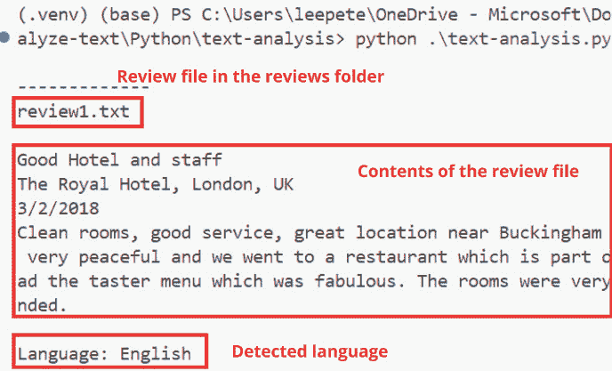

图 6.1 – 检测到的语言输出

### 第 6 步：测试情感分析

现在，分析每个文本评论中表达的情感。

1.  找到`获取情感`注释并审查代码：

    ```py
    sentiment_analysis = ai_client.analyze_sentiment(documents=[text])[0]
    print("\nSentiment: {}".format(sentiment_analysis.sentiment))
    ```

1.  保存并运行程序。对于每个评论，将显示情感（正面、中性或负面）。

### 第 7 步：测试提取关键短语

接下来，提取文本中的关键短语，以突出主要主题。

1.  找到`获取关键短语`注释并审查代码：

    ```py
    phrases = ai_client.extract_key_phrases(documents=[text])[0].key_phrases
    if phrases:
        print("\nKey Phrases:")
        for phrase in phrases:
            print('\t{}'.format(phrase))
    ```

1.  保存并运行程序。对于每个评论，将显示表示主要主题的关键短语。

### 第 8 步：测试识别实体

您现在将识别和分类文本中提到的实体。

1.  找到`获取实体`注释并审查代码：

    ```py
    entities = ai_client.recognize_entities(documents=[text])[0].entities
    if entities:
        print("\nEntities")
        for entity in entities:
            print('\t{} ({})'.format(entity.text, entity.category))
    ```

1.  保存并运行程序。将显示在评论中提到的实体，例如地点和人。

### 第 9 步：测试链接实体

最后，将识别的实体链接到外部知识源。

1.  找到`获取链接实体`注释并审查代码：

    ```py
    linked_entities = ai_client.recognize_linked_entities(documents=[text])[0].entities
    if linked_entities:
        print("\nLinks")
        for linked_entity in linked_entities:
        print('\t{} ({})'.format(linked_entity.name, linked_entity.url))
    ```

1.  保存并运行程序。将显示带有 URL 的链接实体（例如维基百科链接）。

在完成这项练习后，您应该拥有一个功能齐全的文本分析应用程序，能够检测语言、评估情感、提取关键短语、识别命名实体，并将实体链接到相关来源，跨越各种文本文档。这个应用程序展示了 Azure AI 语言服务从文本中提取有意义的见解的广泛能力。

接下来，我们将深入探讨使用 Azure AI 语音处理语音，您将学习如何集成语音到文本、TTS 和其他语音功能来构建智能语音启用应用程序。

# 使用 Azure AI 语音处理语音

Azure AI 语音是一个强大的服务套件，它使应用程序能够通过机器学习模型处理将口语转换为书面文本，反之亦然。它允许您将语音识别、转录和语音合成集成到您的应用程序中，以构建交互式和智能体验。

要使用 Azure AI 语音，您首先需要在您的 Azure 订阅中配置 Azure AI 语音资源。这可以通过创建一个专门的 AI 语音资源或一个多服务 AI 服务资源来完成。一旦资源创建完成，您将需要部署位置和分配的密钥之一，这些可以在 Azure 门户中的**密钥和端点**页面找到。这些详细信息对于使用支持 SDK 的客户端应用程序是必需的。让我们探索 Azure AI 语音服务的一些关键方面。

## 关键特性

Azure AI 语音提供了一套全面的特性，用于在文本和语音之间转换，通过语音驱动技术增强交互。TTS 可以将书面文本转换为语音，这对于创建交互式系统如**交互式语音响应**（**IVR**）或生成书面内容的音频版本非常理想。例如，一家公司可能会使用这项服务自动生成多语言客户服务信息。另一方面，语音到文本将语音转换为文本，这对于转录会议或语音命令非常有价值。这项服务支持**实时语音到文本**以实现即时转录，以及**批量语音到文本**以处理大量音频，通常用于通话后的分析。

附加功能包括**SSML**，这是一种基于 XML 的标记语言，允许对 TTS 输出进行详细定制。它提供了对声音特征如音调和发音的控制，从而允许生成更具表现力的语音。例如，一个教育应用可能会使用 SSML 为关键学习时刻添加情感。

**定制语音**解决方案允许创建定制模型，以提高特定行业或术语的识别准确性，例如医疗保健行业，其中需要准确捕捉医学术语。同样，**定制神经网络声音**允许企业创建与品牌身份相符的合成声音，提供独特且个性化的客户体验。

**意图识别**使 AI 系统能够从语音中解释用户意图，这对于语音激活助手至关重要，而**关键词识别**可以检测对话中的特定术语，这对于客户服务的自动警报很有用。配置音频格式和声音的能力提供了输出音频的灵活性，允许公司选择不同的声音或格式，包括区域口音以进行本地化营销活动。

其他高级功能包括**说话人识别**，这有助于从一组已知声音中识别未知说话人，有助于客户验证和欺诈检测，以及**语言识别**，它检测音频中的语言，帮助企业在多语言虚拟代理中进行调整。**Whisper 模型**增强了多语言识别，确保在各种语言中准确转录，这对于国际运营至关重要。最后，**对话转录**捕捉涉及多个说话人的讨论，使其非常适合会议或会议环境，同时遵守隐私和同意考虑，以在音频处理过程中保护用户数据。

## 访问 Azure AI 语音服务

与其他 Azure AI 服务类似，访问 Azure AI 语音服务主要有三种方式：

+   通过 Azure AI Foundry 服务门户

+   通过 REST API

+   使用 SDK

在下一节中，我们将详细介绍门户和 REST API 方法；你将在*练习 2：识别和* *合成语音*中探索 SDK 方法。

### Azure AI 服务工作室门户

要开始，请按照以下步骤操作：

1.  导航到[ai.azure.com](http://ai.azure.com)的 AI Foundry 主页，然后在左侧面板中选择**Azure AI 服务**，然后在**语音**服务下选择**实时转录**。

1.  接下来，选择**录制**。将自动生成音频文件，并显示转录文本，如下图所示：

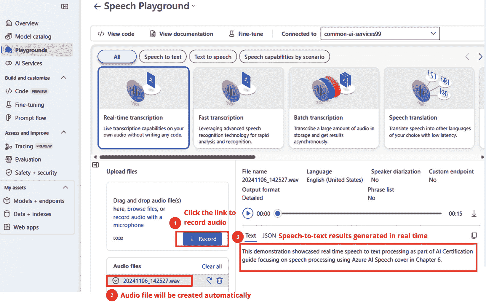

图 6.2 – AI 服务工作室中的实时语音到文本

通过利用 Azure AI Foundry 门户，用户可以在无代码环境中快速尝试语音到文本功能，使其成为原型设计和验证语音识别能力以集成到应用程序中的理想平台。

### REST API

Azure AI 语音到文本服务提供两个 REST API 用于语音识别：主要的**语音到文本 API**用于通用语音转录和**语音到文本短音频 API**，针对短音频流（最多 60 秒）进行了优化。这些 API 支持交互式语音识别和批量转录，使它们能够适应各种音频长度和音量。开发者通常通过特定语言的 SDK，如 Python 或 C#，访问这些服务。有关它们使用的更多详细信息，请访问[`learn.microsoft.com/en-us/azure/ai-services/speech-service/rest-text-to-speech?tabs=streaming`](https://learn.microsoft.com/en-us/azure/ai-services/speech-service/rest-text-to-speech?tabs=streaming)。

### 使用 SDK

要使用 Azure AI 语音 SDK，您需要使用`SpeechConfig`（包含您的资源位置和密钥）和`AudioConfig`（指定音频源）来配置`SpeechRecognizer`对象。通过调用`RecognizeOnceAsync()`等方法，服务异步转录语音，返回`SpeechRecognitionResult`对象。此结果包括重要细节，如持续时间、转录文本和错误处理，在识别失败的情况下，如以下图所示。

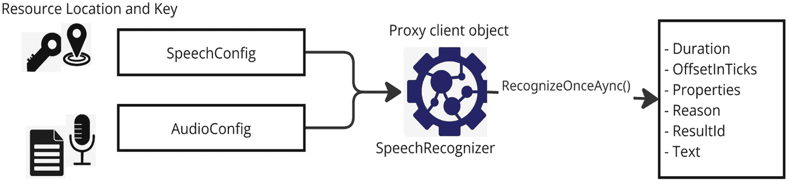

图 6.3 – 使用语音到文本 API 的模式

这种设置允许灵活地集成到应用程序中，支持实时和批量转录场景。更多细节将在*练习 2*中探讨。

## 配置音频格式和声音

Azure AI 语音服务提供了灵活的选项来配置音频格式和声音，以适应各种用例，无论是高质量音频还是带宽高效的程序。

### 音频格式

Azure AI 语音服务支持多种音频格式以满足不同的需求：

+   **WAV (PCM)**：使用**脉冲编码调制**（**PCM**）的比特率为 256 kbps、采样率为 16 kHz，提供高质量的音频，非常适合音频保真度至关重要的应用。

+   **OGG (Opus)**：此格式使用比特率为 256 kbps、采样率为 16 kHz 的 Opus。由于其压缩效率高，非常适合流媒体应用，同时保持良好的音频质量。

+   **MP3**：这是一个广泛支持的格式，MP3 允许不同的比特率（例如，低带宽的 48 kbps），使其在平衡质量和文件大小之间成为通用的播放选择。

支持的采样率有 24 kHz 和 48 kHz，较高的采样率提供更优的音频质量。比特率和编码决定了音频的质量和大小，较高的比特率产生更好的质量但文件更大，而较低的比特率在带宽方面更高效。

### 配置声音

语音服务提供各种预构建和自定义声音以增强用户体验：

+   **预构建的神经语音**：这些语音非常自然，类似于人类，提供不同的语言、性别和语音风格，适用于广泛的用途。

+   **自定义神经语音**：您可以通过使用自己的音频录音进行训练来创建独特的声音，使其与您的品牌或产品身份相符。

+   **语音风格和角色**：根据上下文，声音可以进一步定制为不同的风格，例如专业、休闲或同理心。

使用 SSML，您可以通过调整音调、速率、音量和发音来微调语音输出，从而提供对文本如何被读出的精确控制。

这里有一个如何使用 SSML 配置音频输出的示例：

```py
<speak version="1.0"  xml:lang="en-US">
  <voice name="en-US-JennyNeural">
    <prosody pitch="+2st" rate="medium" volume="loud">Welcome to our service.</prosody>
    <break time="500ms"/>
    <prosody rate="slow">How can I assist you today?</prosody>
  </voice>
</speak>
```

已选择`"en-US-JennyNeural"`语音，音调提高 2 个半音，中等语速，以及短语“欢迎来到”和“我们的服务”的响亮音量。

## 练习 2：识别和合成语音

在这个练习中，您将继续使用在*第二章*中创建的 Azure AI 多服务帐户来构建一个能够识别和合成语音的报时钟应用程序。或者，如果您愿意，可以在[`ms.portal.azure.com/#create/Microsoft.CognitiveServicesSpeechServices`](https://ms.portal.azure.com/#create/Microsoft.CognitiveServicesSpeechServices)创建一个专门的 Azure AI 语音资源。

### 第 1 步：配置应用程序

首先，配置您的环境以连接到 Azure AI 语音服务。

1.  打开位于`/02-synthesize-speech/Python/speaking-clock`的`speaking-clock.py`文件。

1.  使用您的 Azure AI 语音资源的区域和密钥更新`.env`配置文件。

重要提示

对于语音服务，使用相同的密钥，但在设置`SPEECH_KEY`和`SPEECH_REGION`环境变量时指定区域而不是服务端点。

1.  在集成终端中安装必要的 Python 包：

    ```py
    pip install azure-cognitiveservices-speech==1.30.0
    ```

这确保了您的开发环境具有 Azure AI 语音所需的所有依赖项。

### 第 2 步：查看使用 Azure AI 语音 SDK 的代码

接下来，回顾并准备与语音 SDK 交互的代码。

1.  打开`speaking-clock.py`并查看以下内容：

    ```py
    # Import namespaces
    import azure.cognitiveservices.speech as speech_sdk
    ```

1.  在“配置语音服务”注释下，查看以下内容：

    ```py
    # Configure speech service
    speech_config = speech_sdk.SpeechConfig(subscription=ai_key, region=ai_region)
    print('Ready to use speech service in:', speech_config.region))
    ```

完成此步骤后，您的应用程序现在已配置为安全地连接到 Azure AI 语音服务。

### 第 3 步：识别语音（语音转文本）

现在，设置应用程序以捕获和转录语音输入。

要在`speaking-clock.py`文件中使用麦克风进行语音识别，您可以按照以下步骤修改`TranscribeCommand`函数。在“配置语音识别”注释下，查看创建`SpeechRecognizer`客户端的代码，该客户端使用默认系统麦克风识别和转录语音。

在“配置”下的“语音识别”中查看以下内容：

```py
# Configure speech recognition
audio_config = speech_sdk.AudioConfig(use_default_microphone=True)
speech_recognizer = speech_sdk.SpeechRecognizer(speech_config, audio_config)
print('Speak now...')
```

您的应用程序现在可以捕获并转录麦克风中的语音输入。

### 第 4 步：处理转录的命令

处理并显示转录的语音以供进一步使用。

查看处理转录语音的代码：

```py
# Process speech input
speech = speech_recognizer.recognize_once_async().get()
   if speech.reason == speech_sdk.ResultReason.RecognizedSpeech:
      command = speech.text
      print(command)
   else:
      print(speech.reason)
      if speech.reason == speech_sdk.ResultReason.Canceled:
         cancellation = speech.cancellation_details
         print(cancellation.reason)
         print(cancellation.error_details)
```

您的应用程序现在可以处理并显示从语音输入转录的文本。

### 第 5 步：合成语音（文本到语音）

接下来，从您的文本响应生成语音音频输出。

查看以下 `TellTime` 函数下的代码以合成语音：

```py
now = datetime.now()
response_text = 'The time is {}:{:02d}'.format(now.hour,now.minute)
# Configure speech synthesis
speech_config.speech_synthesis_voice_name = "en-GB-RyanNeural"
speech_synthesizer = speech_sdk.SpeechSynthesizer(speech_config)
#Synthesize spoken output
speak = speech_synthesizer.speak_text_async(response_text).get()
    if speak.reason != speech_sdk.ResultReason.SynthesizingAudioCompleted:
        print(speak.reason)
```

您的应用程序现在可以生成当前时间的语音响应。

重要提示

如果您想在创建 `SpeechSynthesizer` 之前切换到替代语音，请设置如下：`speech_config.speech_synthesis_voice_name = 'en-GB-LibbyNeural'`。您可以在语音工作室的 [`speech.microsoft.com/portal/voicegallery`](https://speech.microsoft.com/portal/voicegallery) 找到神经和标准语音列表。

### 第 6 步：运行应用程序

运行完整的应用程序并测试语音转文本和文本转语音功能。

1.  在终端中，使用以下命令运行程序：

    ```py
    SpeechRecognizer allows about five seconds for input. If no speech is detected, it returns a No match result. If an error occurs, it returns Cancelled, likely due to an incorrect key or region in the configuration file.
    ```

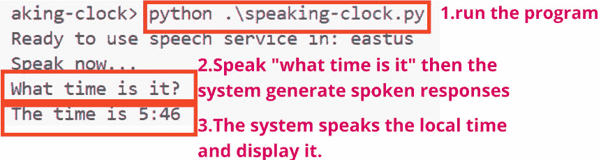

图 6.4 – 运行程序后的输出

您的语音时钟应用程序现在已启用，可以识别并响应对时间相关的查询。

### 第 7 步：使用语音合成标记语言（可选）

可选，使用 SSML 自定义语音输出以增强语音特征。

SSML 是一个基于 XML 的工具，用于自定义 TTS 输出。它提供了对语音特征（如音调、速率、音量和发音）的精确控制，能够为各种应用生成富有表现力和定制的语音，包括教育工具：

1.  在 `TellTime` 函数中，查看 `Speech Synthesis Markup Language` 注释下的代码，该代码替换了 `Synthesize` `spoken output` 下之前注释掉的代码：

    ```py
    # Synthesize spoken output
     responseSsml = " \
         <speak version='1.0' xmlns='http://www.w3.org/2001/10/synthesis' xml:lang='en-US'> \
             <voice name='en-GB-LibbyNeural'> \
                 {} \
                 <break strength='weak'/> \
                 Time to end this lab! \
             </voice> \
         </speak>".format(response_text)
     speak = speech_synthesizer.speak_ssml_async(responseSsml).get()
     if speak.reason != speech_sdk.ResultReason.SynthesizingAudioCompleted:
         print(speak.reason)
    ```

1.  再次运行程序，当提示时，请清晰地对着麦克风说话并说，“现在几点？”程序将以 SSML 中指定的语音（覆盖 `SpeechConfig` 中的语音）宣布当前时间。暂停后，它会通知您现在是时候结束这个实验了——因为确实是时候了！

通过遵循这些步骤，您已成功实现了一个可以转录语音并使用 Azure AI 语音服务生成语音响应的语音时钟！

让我们接下来讨论语言翻译服务。

# 使用语音服务翻译文本/语音

Azure AI 翻译器和 AI 语音服务提供了跨多种语言的全面工具，用于翻译文本、文档和语音。以下是关键功能的概述及其应用方式：

+   **使用 Azure AI 翻译服务翻译文本和文档**：Azure AI 翻译器允许您将文本或文档翻译成多种语言。这对于需要使用多种语言进行沟通的公司来说很有用。例如，一家公司可以将产品手册从英语翻译成西班牙语和法语，以触及更广泛的受众。

+   **使用自定义模型进行自定义翻译**：Azure 允许您训练特定于您领域的自定义翻译模型。例如，一家医疗保健公司可能会开发一个能够准确翻译医学术语的模型，从而改善不同语言之间的医生和患者之间的沟通。

+   **同时翻译成多种语言**：Azure AI Translator 允许您一次性将内容翻译成多种语言，非常适合全球通讯。例如，一个公告可以同时翻译成英语、法语、德语和中文，以迎合全球受众。

## 使用 SDK 将语音翻译成文本

使用语音转文本 API，您可以将口语识别并翻译成文本。这可以在实时或批量模式下进行，适用于大量音频文件。使用 `SpeechTranslationConfig` 对象，您指定输入语音语言和目标翻译语言。`TranslationRecognizer` 对象处理语音识别和翻译，提供原始转录及其翻译成其他语言的版本，如此处所示。

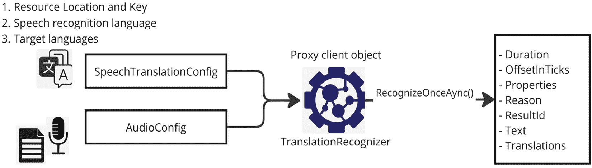

图 6.5 – 语音翻译

例如，在一个多语言会议环境中，演讲者可以用英语发言，Azure AI Speech 可以实时将发言转录并翻译成法语和西班牙语。更多细节将在 *练习 4：使用 Azure AI Speech 翻译语音* 中探讨。

## 合成翻译（语音到语音翻译）

除了将语音翻译成文本外，Azure AI Speech 允许您将翻译后的文本合成回语音，以进行语音到语音翻译。您可以使用基于事件的合成进行 1:1 翻译，其中单一口语语言被翻译成单一目标语言并播放为音频。对于多个目标语言，手动合成允许您从翻译结果中为每种语言创建音频流。

例如，一个客户服务系统可以接收讲西班牙语的客户的输入，将其翻译成英语文本供代理使用，并合成西班牙语的语音响应，使代理能够流畅地与客户互动。

通过集成这些翻译功能，您可以构建跨越文本和语音的语言障碍解决方案，使全球通讯更加顺畅和高效。

## 练习 3：将文档从源语言翻译成目标语言

如前所述，所有 AI 服务都可以通过门户、SDK 或 REST API 访问。在这个练习中，我将演示通过门户和 SDK 的访问方式，以帮助您熟悉用户界面。尽管 AI Foundry 是一个新工具，并且不在 AI-102 考试的范围内，但您应该知道它的存在，并且您可能会在实际场景中使用它。

### 使用门户翻译文本

如果您尚未创建 Azure AI Hub 和项目，请参阅 *第七章* 中的 *练习 1：在 Azure 门户中创建中心、项目和 AI 服务*。否则，请按照以下步骤在现有项目下创建 AI 服务资源。有关更多详细信息，请访问 [`learn.microsoft.com/en-us/azure/ai-studio/ai-services/how-to/connect-ai-services`](https://learn.microsoft.com/en-us/azure/ai-studio/ai-services/how-to/connect-ai-services)：

1.  访问 [ai.azure.com](http://ai.azure.com) 的 AI Studio 主页。在左侧面板中，选择 **AI 服务**，然后在 **语言 + 翻译** 下，在 **探索语言功能**部分的 **翻译**菜单中选择 **文档翻译**。

1.  接下来，上传英文文本文件并单击 **翻译** 按钮将英文文档翻译成目标语言，即韩语。

1.  下载翻译后的文件，并保存为任何名称，例如 `Ko-DocumentTranslationSample.txt`，以便审查，如图所示：

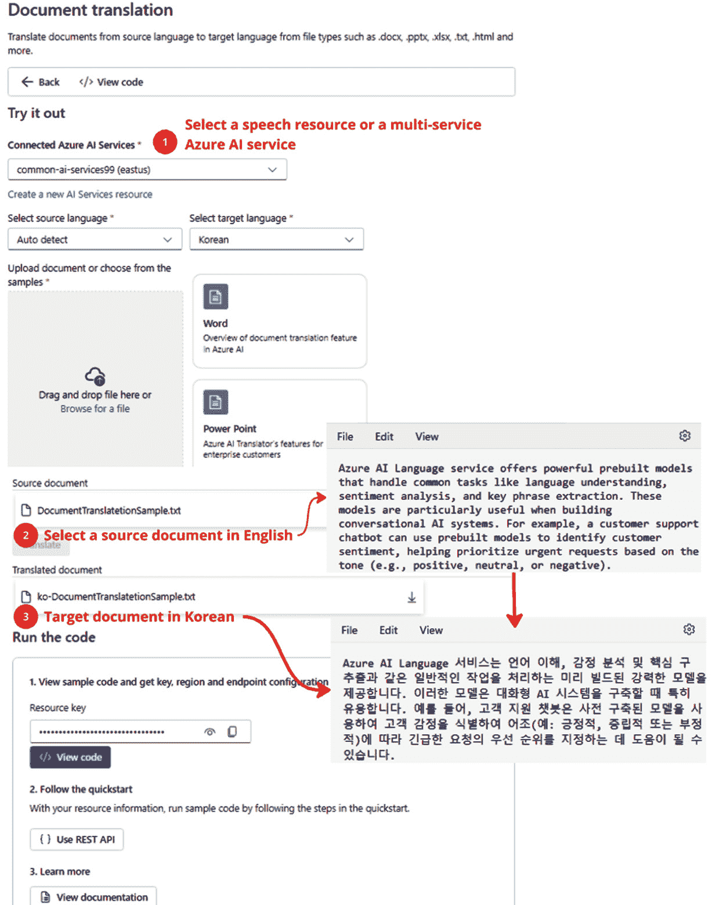

图 6.6 – 在门户中将文本从一种语言翻译成另一种语言

通过遵循这些步骤，您可以使用 Azure AI Studio 门户快速将文档翻译成多种语言，使其成为处理多语言内容的有效工具。

### 使用 SDK 翻译文本

本练习将指导您创建一个应用程序，使用 Azure AI 翻译器在语言之间翻译文本。它提供了与 *图 6.6* 相同的功能，但使用 SDK 方法。

#### 第 1 步：设置您的开发环境

首先，设置您的开发环境并安装所需的 SDK。

1.  在 VS Code 中打开 `03-translating-documents-sdk/Python/translate-text/` 文件夹。

1.  在 `translate-text` 文件夹中打开集成终端并运行以下命令以安装 SDK：

    ```py
    .env file in translate-text.
    ```

1.  输入您的 Azure AI 翻译器密钥和区域，然后保存文件。

#### 第 2 步：导入所需的库

接下来，导入必要的库以访问 Azure AI 翻译器 API。

1.  在 VS Code 中打开 `translate.py`。

1.  在顶部，在 `导入命名空间` 下，查看以下代码：

    ```py
    # import namespaces
    from azure.ai.translation.text import *
    from azure.ai.translation.text.models import InputTextItem
    ```

#### 第 3 步：为翻译器 API 创建客户端

现在，创建客户端对象以将您的应用程序连接到 Azure AI 翻译器。

在 `使用端点和密钥创建客户端` 下，查看以下代码以将您的应用程序连接到 Azure AI 翻译器以设置客户端连接：

```py
# Create client using endpoint and key
credential = TranslatorCredential(translatorKey, translatorRegion)
client = TextTranslationClient(credential))
```

此代码使用您的 API 密钥和端点初始化与 Azure AI 翻译器的连接。

#### 第 4 步：选择目标语言

提示用户选择翻译的目标语言。

在 `选择目标语言` 下，查看以下代码以获取并选择支持的语言：

```py
# Choose target language
 languagesResponse = client.get_languages(scope="translation")
 print("{} languages supported.".format(len(languagesResponse.translation)))
 print("(See https://learn.microsoft.com/azure/ai-services/translator/language-support#translation)")
 print("Enter a target language code for translation (for example, 'en'):")
 targetLanguage = "xx"
 supportedLanguage = False
 while supportedLanguage == False:
     targetLanguage = input()
     if  targetLanguage in languagesResponse.translation.keys():
         supportedLanguage = True
     else:
         print("{} is not a supported language.".format(targetLanguage))
```

此代码列出支持的语言并提示用户输入有效的目标语言代码。

#### 第 5 步：翻译文本

现在，实现将文本翻译成选定语言的逻辑。

在 `Translate text` 下，查看以下用于翻译文本的代码：

```py
# Translate text
 inputText = ""
 while inputText.lower() != "quit":
     inputText = input("Enter text to translate ('quit' to exit):")
     if inputText != "quit":
         input_text_elements = [InputTextItem(text=inputText)]
         translationResponse = client.translate(content=input_text_elements, to=[targetLanguage])
         translation = translationResponse[0] if translationResponse else None
         if translation:
             sourceLanguage = translation.detected_language
             for translated_text in translation.translations:
                 print(f"'{inputText}' was translated from {sourceLanguage.language} to {translated_text.to} as '{translated_text.text}'.")
```

此代码提示用户输入文本，将其翻译成选定的目标语言，并在用户输入 `"quit"` 之前显示结果。

#### 第 6 步：测试应用程序

运行应用程序并测试您的文本翻译工作流程。

1.  要运行应用程序，在终端中执行以下命令：

    ```py
    en for English).
    ```

1.  输入一个短语（例如，`This is a test`）进行翻译并查看输出。

1.  输入 `quit` 以退出程序。

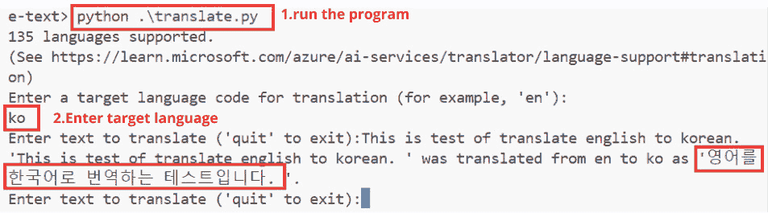

图 6.7 – 将英语翻译成韩语的输出

这就完成了您的文本翻译应用程序。您可以用不同的语言代码重新运行它以测试多个翻译。

## 练习 4：使用 Azure AI Speech 进行语音翻译

在这个练习中，您将使用 Azure AI Speech 服务开发一个能够翻译语音的翻译应用程序。例如，假设您正在一个您不说法语的国家旅行。您可以用您的语言说出诸如“车站在哪里？”之类的短语，并让应用程序将其翻译成当地语言。

### 第 1 步：配置应用程序/查看使用 Speech SDK 的代码

首先，配置您的应用程序并设置用于翻译的 Speech SDK。

1.  导航到 `04-translating-speech/Python/translator` 文件夹并打开 `Python` 文件夹。

1.  通过运行以下命令安装 Azure AI Speech SDK 包：

    ```py
    .env file with the region and key of your Azure AI multi-service account or Azure AI Speech resource.
    ```

重要提示

对于语音服务，使用相同的密钥，但指定区域而不是服务端点。

### 第 2 步：查看使用 Azure AI Speech SDK 的代码

接下来，查看初始化翻译和语音合成设置的代码。

1.  打开 `translator.py` 文件并导入使用 Azure AI Speech SDK 所需的命名空间：

    ```py
    import azure.cognitiveservices.speech as speech_sdk
    ```

1.  在主函数中，使用这些变量为您的 Azure AI Speech 资源创建一个 `SpeechTranslationConfig` 对象以翻译语音输入。在 `Configure` `translation` 注释下查看以下代码：

    ```py
    # Configure translation
    translation_config = speech_sdk.translation.SpeechTranslationConfig(ai_key, ai_region)
    translation_config.speech_recognition_language = 'en-US'
    translation_config.add_target_language('fr')
    translation_config.add_target_language('es')
    translation_config.add_target_language('hi')
    print('Ready to translate from', translation_config.speech_recognition_language)
    ```

1.  使用 `SpeechTranslationConfig` 将语音转换为文本，并使用 `SpeechConfig` 将翻译结果转换为语音。在 `Configure` `speech` 注释下查看以下代码：

    ```py
    # Configure speech
     speech_config = speech_sdk.SpeechConfig(ai_key, ai_region)
    ```

您的应用程序现在已设置好，可以识别并将语音翻译成多种语言。

### 第 3 步：使用麦克风实现语音翻译

现在，设置应用程序以识别并从麦克风输入翻译语音。在 `translator.py` 文件的 `Translate` 函数中，在 `Translate speech` 注释下，查看创建 `TranslationRecognizer` 客户端的代码。此客户端将使用默认系统麦克风作为输入来识别和翻译语音。配置语音翻译以无缝与麦克风输入协同工作：

```py
# Translate speech
audio_config = speech_sdk.AudioConfig(use_default_microphone=True)
translator = speech_sdk.translation.TranslationRecognizer(translation_config, audio_config=audio_config)
print("Speak now...")
result = translator.recognize_once_async().get()
print('Translating "{}"'.format(result.text))
translation = result.translations[targetLanguage]
print(translation)
```

您的应用程序现在可以识别语音输入并将其翻译成选定的语言。

### 第 4 步：运行程序

运行程序并测试实时语音翻译功能。

1.  在终端中，使用以下命令运行程序：

    ```py
    fr, es, or hi). If using a microphone, speak clearly, saying “Where is the station?” or a similar phrase.
    ```

1.  程序将转录并将您的输入翻译成选定的语言（法语、西班牙语或印地语）。为每个支持的语言重复此过程，然后按*Enter*键结束程序。

1.  `TranslationRecognizer`允许大约五秒钟的输入时间。如果没有检测到语音，它将返回**无匹配**的结果。请注意，由于字符编码问题，印地语翻译可能在控制台中显示不正确。

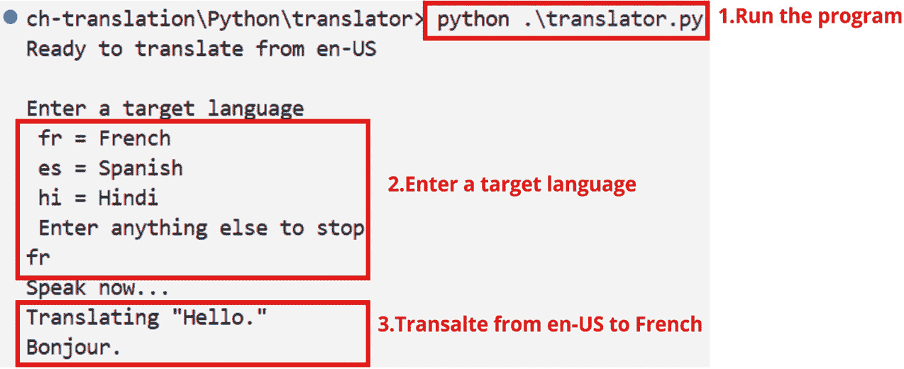

图 6.8 – 翻译的语音输出

您的应用程序现在可以将语音输入翻译成选定的语言。

### 第 5 步：将翻译合成语音

现在，您的应用程序将语音输入转换为文本，这在旅行中寻求帮助时可能很有用。通过以适当的语音将翻译大声读出来来增强这一点将使其更加有效：

1.  在`Translate`函数中，在`合成翻译`注释下方，包含以下代码以利用`SpeechSynthesizer`客户端。此客户端将翻译转换为语音并通过默认扬声器播放：

    ```py
    # Synthesize translation
    voices = {
        "fr": "fr-FR-HenriNeural",
        "es": "es-ES-ElviraNeural",
        "hi": "hi-IN-MadhurNeural"
    }
    speech_config.speech_synthesis_voice_name = voices.get(targetLanguage)
    speech_synthesizer = speech_sdk.SpeechSynthesizer(speech_config)
    speak = speech_synthesizer.speak_text_async(translation).get()
    if speak.reason != speech_sdk.ResultReason.SynthesizingAudioCompleted:
        print(speak.reason)
    ```

1.  使用以下命令运行程序：

    ```py
    fr, es, or hi), then speak clearly into the microphone with a travel-related phrase. The program will transcribe and respond with a spoken translation.
    ```

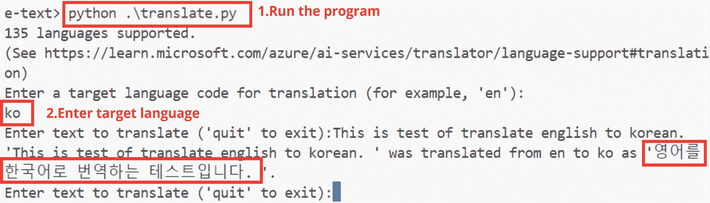

图 6.9 – 语言翻译的输出

本练习演示了如何使用 Azure AI 语音服务将语音翻译成文本，并将翻译作为语音翻译合成，使其成为旅行翻译器或客户支持等应用程序的实用解决方案。

让我们探索自然语言处理（NLP）的变革力量，其中机器学习理解并参与人类语言，从文本到语音合成。NLP 的一个关键部分是**自然语言理解**（**NLU**），它允许系统解释用户交互中的深层含义和意图——解锁响应性、智能应用程序的能力。

# 构建对话语言理解模型

自然语言处理（NLP）使机器能够理解和以文本和语音形式与人类语言进行交互。NLP 的一个方面是自然语言理解（NLU），它侧重于解释自然语言输入的语义意义，例如确定用户问题或命令背后的意图。

在对话式人工智能的常见设计模式中，以下情况发生：

1.  用户提供自然语言输入（语音或书面形式）。

1.  系统处理此输入以确定用户的意图。

1.  根据意图，系统执行适当的操作（例如，提供信息或执行任务）。

构建对话模型的一些关键概念包括以下内容：

+   **意图**代表用户输入背后的目的或目标（例如，询问天气）

+   **话语**是用户可能说的短语示例，这些短语对应于一个意图（例如，“今天天气怎么样？”）

+   **实体** 为意图提供上下文（例如，“今天”是天气请求中的时间实体）。

**Azure AI 语言** 服务包括情感分析、语言检测和关键短语提取等功能。预构建实体（例如数字或日期）允许开发者轻松捕获和分类常见类型的数据，无需进行广泛的模型训练。

开发者可以创建自定义模型来识别与其应用程序相关的特定意图和实体。例如，一家公司可以构建一个客户支持机器人，其中定义了诸如*检查订单状态*和*退货*等意图，并从用户语句中提取诸如*订单号*等实体。

这里有一个示例流程：

1.  **输入** 用户说：“西雅图明天的天气怎么样？”

1.  `GetWeather` 并提取 *西雅图* 作为位置实体和 *明天* 作为时间实体。

1.  **操作** 系统检索并提供西雅图明天的天气预报。

模型增强的一些高级功能包括以下内容：

+   **使用模式区分语句**：在语句相似但属于不同意图的情况下（例如，“打开灯”与“灯是开着的？”），模式有助于模型区分这些操作。

+   **预构建实体组件**：这些组件，如日期/时间、名称和数字，允许更快地设置模型，因为服务可以自动识别常见实体，无需训练数据。

一旦您定义了意图和实体，您需要执行以下操作：

1.  **训练** 模型使用样本语句。

1.  **测试** 新数据以确保准确性。

1.  **发布** 到端点，使其可用于应用程序，如聊天机器人。

1.  **回顾** 持续评估性能并根据用户交互重新训练模型。

通过遵循此循环，您可以构建一个能够有效理解用户查询并在实际使用中不断改进的对话式 AI 模型。

## 练习 5：构建对话式语言理解模型

在这个练习中，您将创建一个应用程序，使用 Azure AI 语言服务来解释自然语言输入，预测用户意图，并识别相关实体。此模型可用于增强对话式应用程序，例如一个可以解释“伦敦现在几点？”等问题的时钟应用程序。

### 第 1 步：配置 Azure AI 语言资源

要开始，您需要在 Azure 订阅中创建一个 Azure AI 语言资源：

1.  登录 Azure 门户，搜索“语言服务”，并使用您的订阅详细信息创建资源。或者，您可以直接使用以下 URL 直接访问资源创建页面：[`portal.azure.com/#create/Microsoft.CognitiveServicesTextAnalytics`](https://portal.azure.com/#create/Microsoft.CognitiveServicesTextAnalytics)。

1.  选择**自定义问答**选项。设置区域，提供唯一名称，并选择定价层（**F0** 免费或 **S** 标准）。

1.  创建完成后，导航到您的资源中的**密钥和端点**页面，以找到您稍后将要使用的凭据。

### 第 2 步：创建会话式语言理解项目

使用 Language Studio，您将创建一个项目来训练语言模型：

1.  在 [`language.cognitive.azure.com/`](https://language.cognitive.azure.com/) 打开 Language Studio 并登录。

1.  导航到**语言工作室** | **+ 创建新** | **会话式** **语言理解**。

1.  在项目创建对话框中，执行以下操作：

    +   为您的项目命名（例如，`Clock`）。

    +   将主要语言设置为**英语**。

    +   添加描述，点击**下一步**，创建项目。

### 第 3 步：为您的模型定义带有示例用语的意图

项目的第一步是定义意图，模型将根据自然语言输入预测用户的意图。意图代表用户可能有的动作或问题。

为了提高模型的准确性，每个意图都通过示例用语作为可能用户请求的示例进行标注：

1.  在 `GetTime`（例如，“现在几点？”）

1.  `GetDay`（例如，“今天星期几？”）

1.  `GetDate`（例如，“今天日期？”）

1.  在**数据标注**下，为每个意图添加示例用语（用户问题或命令），以帮助模型学习。在每个用语后按*Enter*键，使用以下表格中提供的示例：

| **意图** | **用语** |
| --- | --- |
| `GetDate` | 今天是哪一天？ / 今天是哪一天？ / 今天是哪一天？ / 今天是星期几？ |
| `GetDay` | 今天是星期几？ / 今天是哪一天？ / 今天是哪一天？ / 今天是星期几？ |
| `GetTime` | 现在几点了？ / 现在几点？ / 现在几点？ / 告诉我时间 |

表 6.1 – 每个意图的示例用语

在完成意图和用语的创建后，务必点击**保存更改**以保存您的作品。然后，以下图将显示结果。

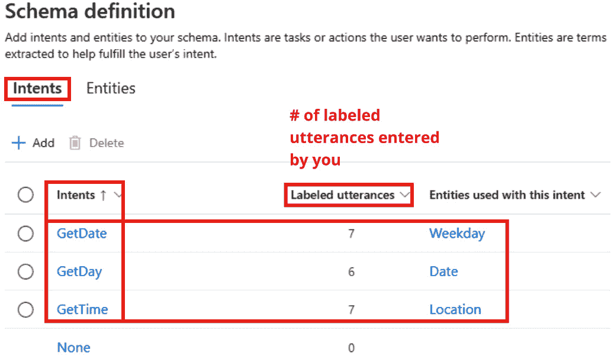

图 6.10 – 意图和用语创建后

重要提示

*图 6.10* 展示了额外的用语，因为虽然这个练习最初每个意图包含四个用语，但之后还会添加更多。这就是为什么你在图中看到**7**、**6**、**7**个用语的计数。

### 第 4 步：训练和测试您的模型

一旦定义了意图，就是时候训练和测试您的模型了：

1.  从项目左侧菜单下的**训练作业**部分导航。然后，在页面顶部点击**+ 开始训练作业**。

1.  命名模型（例如，`Clock`）并使用**标准训练模式**，保持默认设置不变，然后点击**训练**以开始训练任务。

1.  训练完成后，查看性能指标，如精确度和召回率，以评估模型的准确性。

### 第 5 步：添加实体以提取特定信息

现在你已经训练了你的模型以识别意图，下一步是添加实体以捕获用户输入中的特定信息。实体有助于提取日期、位置和其他上下文细节，从而细化模型的理解：

1.  在**模式定义**下的**实体**标签页中导航。要添加已学习实体，点击**+** **添加**。

1.  选择`位置`。然后，添加以下示例语句：

    +   `伦敦现在几点了？`

    +   `告诉我巴黎的时间`

    +   `纽约现在几点了？`

    在输入每个语句时，使用鼠标选择城市名称（例如，**纽约**、**伦敦**或**巴黎**）进行高亮。会出现一个下拉菜单——选择**位置**作为实体，如图所示。

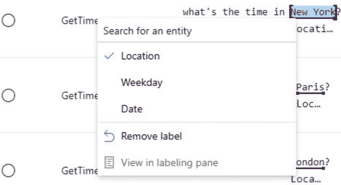

图 6.11 – 添加已学习位置实体

1.  导航到`周**，并点击**添加实体**。

1.  滚动到`星期一`、`星期五`等，以及它们的同义词（例如，`Mon`、`Fri`），如图所示。在每个同义词后按*Tab*键以添加更多条目。

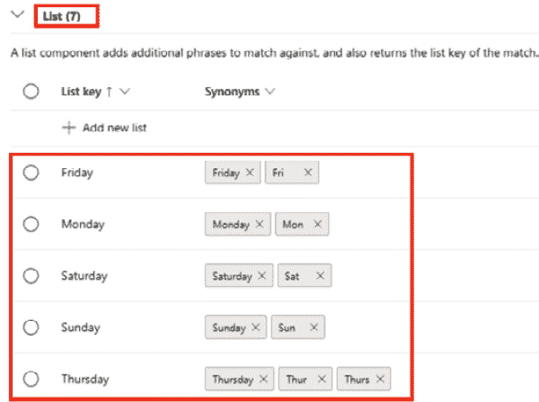

图 6.12 – 为“周”实体添加列表

1.  导航到`日期`，并点击**添加实体**。

1.  要添加预构建实体，滚动到**预构建**部分并点击**+ 添加新预构建**。从下拉列表中选择**日期时间**以启用对日期表达式的识别，例如**5 月 11 日**，如图所示。

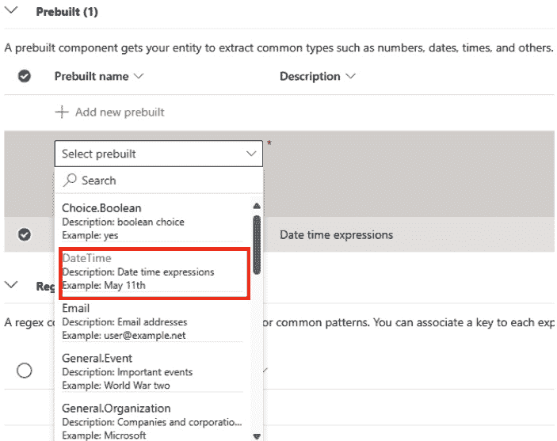

图 6.13 – 添加预构建实体

1.  添加了三个实体（**日期**、**位置**和**周**）后，最终屏幕将如图所示。

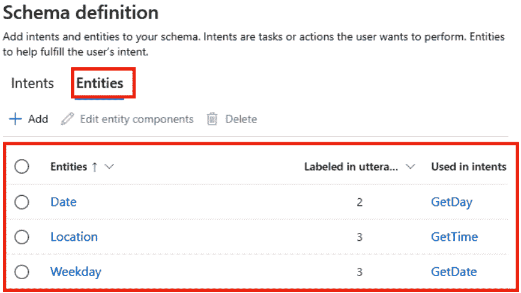

图 6.14 – 使用示例语句创建实体

通过添加实体，你的模型现在可以从用户输入中提取相关细节，从而在对话应用中提供更精确的响应。

### 第 6 步：重新训练和部署你的模型

在定义意图和实体后，执行以下操作：

1.  要重新训练你的模型，导航到**训练作业**并点击**+ 开始训练作业**。在**开始训练作业**窗口中，选择**覆盖现有模型**以使用新的训练数据更新当前模型。

1.  要部署模型，转到**部署模型**部分并点击**+ 添加部署**。在弹出窗口中，输入一个唯一的部署名称（例如，**生产**）或选择**覆盖现有部署名称**。然后，选择要部署的已训练模型并选择所需的部署区域。

### 第 7 步：测试你的部署模型

你可以在 Language Studio 的**测试部署**部分测试你的模型：

1.  在**测试部署**中，选择**生产**并输入示例语句。

1.  例如，测试**爱丁堡现在是什么时间？**或**星期五是星期几？**以查看模型能否准确预测意图和实体，如图下所示。

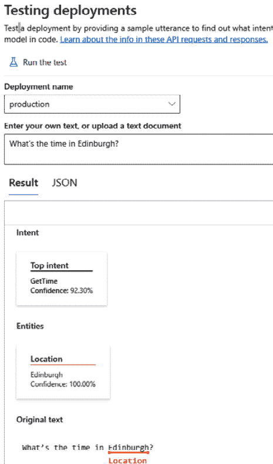

图 6.15 – 测试结果

### 第 8 步：将模型集成到 Python 应用程序中

使用 VS Code，您现在将部署的模型与您的应用程序集成。浏览到`05-language\Python\clock-client`文件夹并执行以下步骤：

1.  在您的应用程序文件夹的终端中，运行以下命令以安装 SDK：

    ```py
    .env file and enter your AI Language service credentials (endpoint and key). Save the configuration.
    ```

1.  审查`clock-client.py`并定位以下注释以查看为此次练习已准备好的代码：

    +   `#` `重要的命名空间`

    +   `# 创建用于语言` `服务模型的客户端`

    +   `# 调用语言服务模型以获取意图` `和实体`

    +   `# 应用适当的操作`

1.  使用以下命令运行应用程序：

    ```py
    Hello
    ```

1.  `What time` `is it?`

1.  `What's the time` `in London?`

1.  `What's` `the date?`

1.  `What date` `is Sunday?`

1.  `What day` `is it?`

1.  `What day` `is 01/01/2025?`

通过将您的对话模型集成到 Python 应用程序中，您现在拥有一个功能齐全的系统，能够理解用户查询并以智能的方式响应。

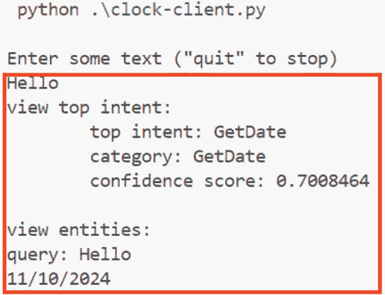

图 6.16 – 第一个示例：你好

本练习提供了一个构建对话应用程序的基础方法，允许持续优化意图和实体。Python 应用程序展示了从连接到 Azure AI 语言服务端点到解释用户输入并根据预测的意图和实体采取适当操作的整个过程。

让我们探索使用 Azure AI 语言构建自定义问答系统。下一节将指导您创建一个知识库，以对话精度处理频繁查询，这对于增强聊天机器人和 FAQ 应用程序非常完美。

# 使用 Azure AI 语言创建自定义问答解决方案

在本节中，您将学习如何使用 Azure AI 语言创建自定义问答解决方案。此解决方案允许您设置支持自然语言问题的知识库，并提供相关答案，通过对话智能增强 FAQ 风格的应用程序。此类解决方案特别适用于需要处理频繁查询并具有精确、预定义响应的应用程序或聊天机器人。

创建自定义问答解决方案的关键步骤如下：

1.  **创建知识库**：首先定义一组问答对的知识库。这可以通过各种来源完成，例如现有的常见问题解答（FAQs）、结构化文本文件或内置的闲聊数据集。每个问答对都作为数据点，当用户提出相关问题时，服务可以引用这些数据点。

1.  **比较问答与语言理解**：虽然问答和语言理解都使用自然语言，但它们服务于不同的目的。问答从知识库中返回静态答案，而语言理解则解释用户意图和实体，为需要执行除显示答案之外操作的应用程序提供支持。结合两者可以创建更动态的对话解决方案。

1.  **多轮对话**：有时，单个问题不足以提供完整答案的上下文。多轮对话允许应用程序根据用户的初始查询提出后续问题。此功能使解决方案能够在完全回答之前澄清细节，通过更个性化的答案增强用户体验。

1.  **测试和发布知识库**：一旦您创建并填充了知识库，您可以直接在语言工作室中通过提问和审查返回的答案来测试它。确认准确性后，将知识库部署到 REST 端点，以便应用程序或机器人可以使用它进行实时问答。

1.  `reservation` 和 `booking`) 确保用户即使在使用不同的术语时也能收到准确的响应。

通过完成*练习 6*，您将能够创建和增强智能问答应用程序，使用 Azure AI 语言支持为最终用户提供强大、交互式的体验。

## 练习 6：创建问答解决方案

本练习指导您使用 Azure AI 语言构建一个问答解决方案。通过设置常见问题知识库，此解决方案可以后来集成到聊天机器人中，实现高效且用户友好的信息检索。

### 第 1 步：使用现有的 Azure AI 语言资源

对于这个练习，我们将使用在*练习 5：构建对话语言理解模型*中创建的语言服务资源。利用该资源相同的端点和密钥来访问问答 API。

### 第 2 步：在语言工作室中创建问答项目

为了创建和管理您的知识库，我们将使用语言工作室：

1.  在[`language.cognitive.azure.com/`](https://language.cognitive.azure.com/)上的语言工作室中，选择您的语言资源，然后在**+ 创建新**下拉菜单下，选择**自定义问答**以开始一个新项目。

1.  在`QandASolution`

1.  `创建` `问答解决方案`

1.  `对不起，我不明白` `这个问题。`

1.  点击**下一步**继续。

1.  在**审查和完成**页面，点击**创建项目**。

重要提示

自定义问答利用 Azure AI 搜索对问题和答案的知识库进行索引和查询，因此您需要作为设置的一部分创建 Azure AI 搜索服务。有关更多详细信息，请参阅*第七章*中的*探索 Azure AI 搜索*。

### 第 3 步：向知识库添加来源

通过添加现有的 FAQ 或文档来填充您的知识库。您可以添加多个数据源，包括 Web URL、文件和预定义的对话式**闲聊**对，如下图所示：

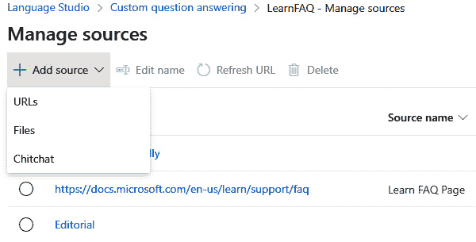

图 6.17 — 知识源的不同选项

1.  在`https://docs.microsoft.com/en-us/learn/support/faq`。

1.  以友好风格添加一个**闲聊**数据集以支持对话式问题。

### 第 4 步：编辑和扩展知识库

在用初始数据填充知识库后，添加自定义问题或改进答案：

1.  手动添加额外的问答对以覆盖独特场景，如下图所示：

    +   **来源**：[**https://docs.microsoft.com/en-us/learn/support/faq**](https://docs.microsoft.com/en-us/learn/support/faq)

    +   **问题**：**什么是** **Microsoft 凭证**？

    +   **答案**：**Microsoft 凭证使您能够通过 Microsoft 技术验证和证明您的技能。**

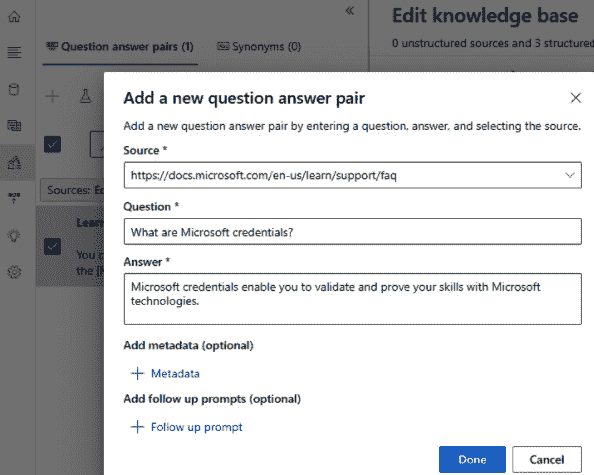

图 6.18 – 添加新的问答对

1.  在**什么是 Microsoft 凭证**？问题的字段中，展开**替代问题**并添加一个替代说法，例如**我如何展示我的 Microsoft** **技术技能**？

    在某些场景下，允许用户通过多轮对话跟进答案是有益的，这有助于他们细化问题以获取更详细的信息。

1.  在您为认证问题提供的答案下方展开`.`

1.  启用**仅显示在上下文流程中**以确保此答案仅在用户跟进原始认证问题时出现。

1.  选择**添加提示**以最终完成后续交互。

### 第 5 步：训练和测试知识库

为了确保准确性，训练知识库并使用各种问题进行测试以验证响应：

1.  保存知识库并开始训练，使模型理解不同的问题变体。

1.  使用测试面板尝试样本问题并验证响应是否符合预期，如下所示：

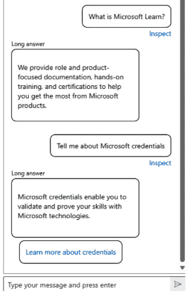

图 6.19 – 测试知识库

通过训练和测试知识库，您确保它向用户查询提供精确且上下文相关的答案。

### 第 6 步：部署知识库

一旦知识库达到准确度标准，部署它使其可供应用程序访问：

1.  按照图*6**.20*所示部署您的知识库，使其通过 REST API 可用。

1.  复制 API 端点，包括`projectName`和`deploymentName`等参数。

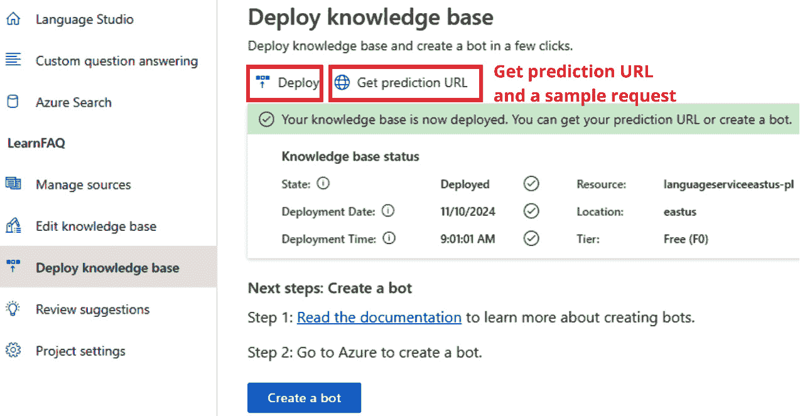

图 6.20 – 部署知识库

知识库部署后，现在可以将其集成到应用程序、聊天机器人和虚拟助手中。

### 第 7 步：在 VS Code 中开发问答应用程序

部署知识库后，在 VS Code 中配置一个简单的客户端应用程序以与问答模型交互：

1.  使用以下步骤配置应用程序：

    1.  在 `06-qna\Python\qna-app\qna-app.py` 中，找到添加命名空间、身份验证和 API 请求的占位符。

    1.  使用您在 Azure AI 语言资源中创建的端点和密钥（可在 Azure 门户中您的 Azure AI 语言资源的“密钥和端点”页面找到）更新配置值。同时，将部署的知识库的项目名称和部署名称添加到此文件中。

    1.  使用以下命令安装必要的 SDK：

    ```py
    # Import Namespaces: Import required libraries for connecting to the Azure AI Language resource
    ```

1.  `# 使用端点和密钥创建客户端`：使用端点和密钥设置经过身份验证的 API 客户端

1.  `# 提交问题并显示答案`：将用户问题发送到 API 并从您的知识库检索响应

### 第 8 步：运行和测试应用程序

最后，通过在终端中运行应用程序并提问来测试您的应用程序：

1.  使用以下命令运行应用程序：

    ```py
    What is a learning path?
    ```

1.  `告诉我关于` `Microsoft 凭据`

1.  检查每个响应并继续测试不同的问题。完成后，键入 `quit` 以结束程序。

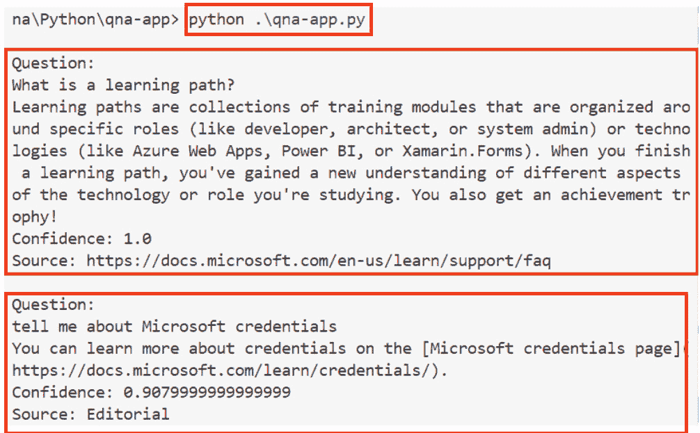

图 6.21 – 运行程序的结果

这个练习为构建一个交互式且能够以对话格式处理常见问题的基于知识库的问答系统提供了坚实的基础。

让我们深入了解自定义文本分类，这是 Azure AI 语言中的一个强大的 NLP 工具，它能够自动将文本组织到相关类别中，非常适合处理大量文档、支持票据和其他非结构化数据。

# 开发 NLP 解决方案

NLP 使软件能够解释和处理人类文本和语音，其中文本分类是一个关键方面。文本分类将文本组织到预定义的类别中，如情感、语言或自定义标签，有助于在应用程序中实现智能决策。

Azure AI 语言服务为自定义文本分类提供了强大的工具，提供两种项目类型：**单标签分类**，其中每个输入被分配到一个类别，以及**多标签分类**，允许每个输入有多个类别。这些功能使开发者能够为各种用例构建智能应用程序，例如对客户反馈进行分类或按主题对技术文档进行排序。

构建文本分类模型的关键步骤如下：

1.  **定义分类标签**：标签（或类别）是将文本数据分类到的类别。例如，在一个视频游戏分类项目中，标签可能包括**动作**、**冒险**和**策略**等类型。清晰的标签结构对于帮助模型有效地区分类别至关重要。

1.  **为训练标记数据**：在此步骤中，您将标记（或标记）文档，将它们与一个或多个类别关联起来。标记确保模型学会识别与每个类别相关的模式。正确标记的数据可以提高模型准确性和性能，尤其是在文档可以属于多个类别的多标签项目中。

1.  **训练模型**：使用标记数据，您训练模型，教它识别哪些类型的文本属于哪个标签。Azure 允许自动或手动数据拆分以进行训练和测试。使用平衡数据集训练模型有助于模型很好地泛化。

1.  **评估模型的性能**：训练后，使用精确度、召回率和 F1 分数等指标评估模型的性能：

    +   **精确度**：衡量模型的正预测中有多少是正确的

    +   **召回率**：评估模型正确识别的实际正例数量

    +   **F1 分数**：结合精确度和召回率，给出整体性能分数

1.  **改进模型**：使用评估反馈来优化模型。例如，如果 **冒险** 和 **策略** 类别经常混淆，添加更多每个类别的示例以帮助模型学习区分。

1.  **部署模型**：部署模型使其可通过 Azure 的 REST API 使用。已部署的模型可以处理来自应用程序的分类请求，支持实时可扩展的自动化分类。

Azure AI 语言服务通过 **Language Studio** 结合直观的图形用户界面与 REST API 的灵活性，赋予开发者创建和优化自定义 NLP 模型的能力。通过利用此服务，您可以构建强大且交互式的应用程序，以满足您特定的文本分类需求，提升用户体验并驱动可操作的见解。

## 练习 7：创建自定义文本分类

在这个练习中，我们将使用 Azure AI 语言服务创建和测试一个自定义文本分类解决方案。这包括配置分类模型、标记数据、训练模型并将其部署以根据自定义类别（如 **新闻** 或 **体育**）对文本进行分类。以下是逐步解释，包括为什么每个步骤是必要的。

### 步骤 1：使用现有的 Azure AI 语言资源

对于这个练习，我们将使用在 *练习 5* 中创建的语言服务资源。这允许我们利用该资源的相同端点和密钥来访问自定义文本分类 API，而无需创建新的资源。

### 步骤 2：上传样本文章

为了有效地训练我们的模型，我们需要样本文本数据：

1.  在 `/07-text-claasification/data` 文件夹下找到样本文章 (`articles.zip`) 并将其提取到相同的数据文件夹中。

1.  在您的 Azure 存储帐户中，创建一个名为 `articles` 的容器，并将 **匿名访问级别** 设置为 **容器**。为此，请转到存储帐户下的 **设置** 部分的 **配置**。

1.  将样本文章（13 个文件）上传到这个`articles`容器。

模型需要样本数据来学习如何对文本进行分类。通过将文章上传到 Azure 存储，我们确保它们可用于标记和训练。

### 第 3 步：在 Language Studio 中创建自定义文本分类项目

一旦您的存储和数据准备就绪，在 Language Studio 中设置一个新的文本分类项目：

1.  访问 Language Studio，网址为[`language.cognitive.azure.com/`](https://language.cognitive.azure.com/)，并创建一个新的**自定义文本** **分类**项目。

1.  选择**单标签分类**为每个文档分配一个类别。

1.  为您的项目命名（`ClassifyLab`），将主要语言设置为`Custom` `text lab`。

1.  连接您的文章容器，并选择将文件标记为项目的一部分。

    在 Language Studio 中设置自定义分类项目提供了一个结构化的工作空间来构建、训练和评估我们的分类模型，如图 6.22 所示。22。

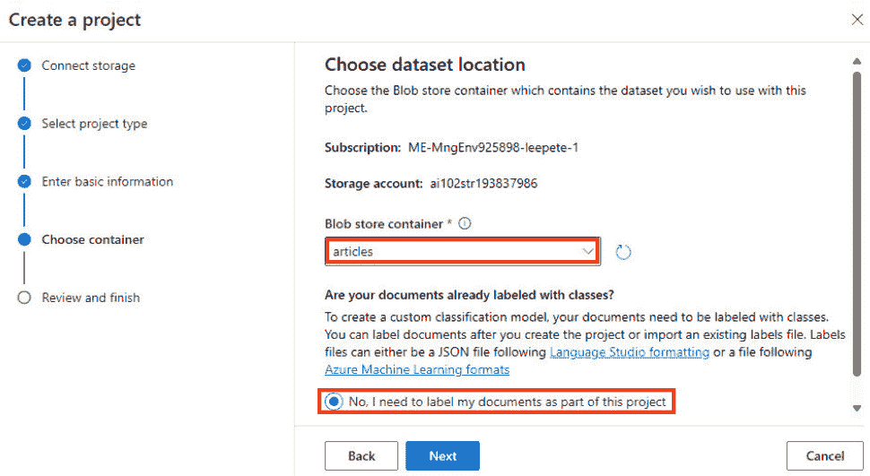

图 6.22 – 创建项目

您的项目现在已设置好，可以使用标记数据训练自定义文本分类模型。

重要提示

*检查*您的*存储账户*的*跨源资源共享（CORS）*设置

确保您的 CORS 设置配置正确。这是与 Azure AI Studio 等服务集成或部署模型时常见的问题来源。请参阅官方文档以获取详细步骤：[`learn.microsoft.com/en-us/azure/ai-services/language-service/custom-text-classification/how-to/create-project?tabs=language-studio%2Cstudio%2Cmulti-classification#enable-cors-for-your-storage-account`](https://learn.microsoft.com/en-us/azure/ai-services/language-service/custom-text-classification/how-to/create-project?tabs=language-studio%2Cstudio%2Cmulti-classification#enable-cors-for-your-storage-account)。

*遇到访问或* *设置错误？*

如果在设置自定义文本分类项目或部署内容过滤器时遇到一般错误或问题，官方指南提供了全面的说明：[`learn.microsoft.com/en-us/azure/ai-services/language-service/custom-text-classification/how-to/create-project?tabs=language-studio%2Cstudio%2Cmulti-classification#create-a-custom-text-classification-project`](https://learn.microsoft.com/en-us/azure/ai-services/language-service/custom-text-classification/how-to/create-project?tabs=language-studio%2Cstudio%2Cmulti-classification#create-a-custom-text-classification-project)。

### 第 4 步：标记您的数据

对数据集中的每篇文章进行标记有助于模型学习如何对内容进行分类：

1.  在 Language Studio 中，转到**数据标记**。

1.  创建如`Sports`、`News`、`Entertainment`和`Classifieds`等类别。

1.  选择每篇文章（共 13 篇文章），将其分配到类别，并指定其为**训练**（文章 1-10）或**测试**（文章 11-13）数据集的一部分，如图所示。

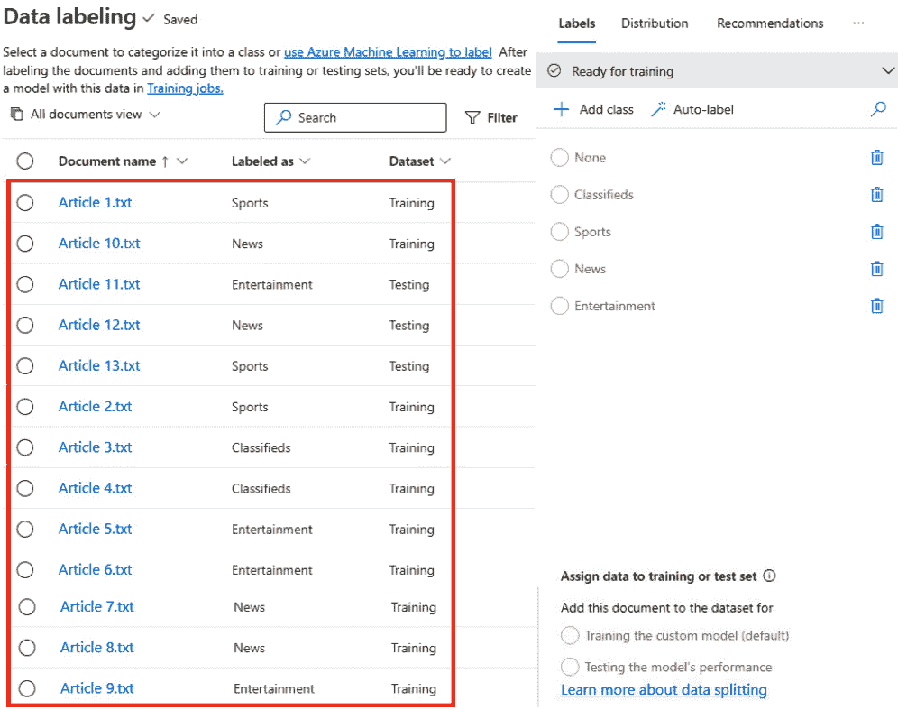

图 6.23 – 数据标记

正确标记的数据对于模型准确性至关重要。训练数据帮助模型学习，而测试数据评估其性能。

### 第 5 步：训练您的模型

现在，使用标记的数据来训练您的模型：

1.  在语言工作室中，前往**训练作业**并启动一个训练作业。

1.  命名模型（例如，`ClassifyArticles`）并选择**使用手动分割的训练和** **测试数据**。

1.  选择**训练**并等待训练完成。

使用您的标记数据训练模型，使其能够学习区分每个类别的模式，为分类新数据做好准备。

### 第 6 步：评估您的模型

训练后，评估模型以评估其准确性和确定改进区域：

1.  前往**模型性能**查看您模型的精确度、召回率和 F1 分数。

1.  在**测试集详细信息**选项卡下，使用**仅显示不匹配项**切换按钮仅显示具有不匹配项的文档。

模型评估有助于验证其准确性，显示可能需要额外数据或调整以实现最佳性能的地方。

### 第 7 步：部署您的模型

一旦你对模型的性能满意，就可以部署它进行实时或批量分类：

1.  在语言工作室中，前往`文章`。

1.  选择**部署**使模型可通过 API 访问。

部署使模型可用于集成，允许其在应用程序中分类文本或自动化任务。

### 第 8 步：使用 Python 应用程序测试模型

要测试模型的分类，创建一个简单的 Python 应用以与 Azure 的语言 API 接口：

1.  在 VS Code 中打开`07-text-classification\Python\classify-text`文件夹并配置应用。

1.  安装必要的库：

    ```py
    .env file with your Azure endpoint and key.
    ```

1.  定位以下注释以查看为该练习已准备好的代码：

    +   `# 导入命名空间`：包含连接到 Azure AI 语言服务的必要库

    +   `# 使用端点和密钥创建客户端`：使用端点和密钥设置经过身份验证的 API 客户端

    +   `# 获取分类结果`：根据模型的预测从 API 获取分类结果

1.  在终端中运行应用：

    ```py
    python classify-text.py
    ```

    使用 Python 应用测试部署的模型，允许我们以编程方式与之交互，模拟真实世界的使用案例。该应用验证模型准确分类文本的能力，如下面的输出所示。

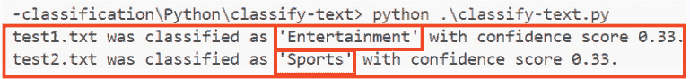

图 6.24 – 运行应用后的输出

按照这些步骤，您将拥有一个使用 Azure AI 语言的全功能文本分类模型，可以自动对文本进行分类。

# 摘要

在本章中，我们探讨了 Azure AI 语言和 Azure AI 语音在 NLP 任务中的强大功能，为分析、理解和交互文本和语音数据提供了基础。从文本分析开始，Azure AI 语言提供工具来检测语言、提取关键短语、分析情感、识别命名实体并将实体链接到外部来源。这些功能使您能够创建智能应用程序，解释和分类内容，为如客户反馈分析或自动内容摘要等流程增加价值。此外，检测 PII 有助于保护敏感数据，这对于遵守 GDPR 等法规至关重要。

本章还介绍了自定义文本分类，其中文档会根据预定义的类别自动标记。Azure AI 语言支持单标签分类（每个文档一个类别）和多标签分类（每个文档多个类别），可用于排序支持票证或为网站标记内容等场景。Azure 的工具包括模型评估指标，如精确率和召回率，这允许您评估模型的有效性并持续改进它。

除了文本分析之外，Azure AI 语音还提供了在文本和语音之间进行转换的高级功能，支持多种语言的实时转录和翻译。Azure AI 语音 SDK 允许开发者在应用程序中集成语音转文本、TTS 和语言翻译。如自定义语音模型和可配置音频格式等特性，可以提供定制化的用户体验，无论是用于交互式客户服务还是多语言支持。本章中的每个练习都提供了使用这些工具的实际经验，使你具备开发利用 NLP 和语音识别增强用户交互的应用程序技能。

在下一章中，我们将探讨知识和文档智能服务，这些服务允许企业从文档中提取、处理和管理结构化和非结构化信息，从而提高工作流程和自动化水平。这些服务在文档理解、合同分析和企业知识管理中发挥着关键作用，进一步扩展了人工智能驱动的智能自动化能力。

# 复习问题

回答以下问题以测试你对本章知识的了解：

1.  以下哪项是 Azure AI 语言分析文本的关键功能？

    1.  语音识别

    1.  命名实体识别

    1.  机器翻译

    1.  光学字符识别

    **正确答案**：B

1.  在构建自定义文本分类模型时，哪个术语指的是分配给每个文档的类别？

    1.  话语

    1.  标签

    1.  意图

    1.  实体

    **正确答案**：B

1.  哪种文本分类项目允许文档被分配到多个类别？

    1.  单标签分类

    1.  多标签分类

    1.  关键短语提取

    1.  命名实体识别

    **正确** **答案**：B

1.  哪个 Azure AI 语言服务功能可以检测并标记文档中敏感信息，如电子邮件地址或社会保障号码？

    1.  关键短语提取

    1.  情感分析

    1.  **个人身份信息**（**PII**）检测

    1.  实体链接

    **正确** **答案**：C

1.  哪个 Azure AI 语音功能可以实现将口语输入实时翻译成另一种语言，并将翻译后的输出作为语音播放？

    1.  语音转文本

    1.  文本到语音

    1.  语音到语音翻译

    1.  命名实体链接

    **正确** **答案**：C

# 进一步阅读

要了解更多关于本章所涉及的主题，请查看以下资源：

+   *Azure AI 语言* 文档：[`learn.microsoft.com/en-us/azure/ai-services/language-service/`](https://learn.microsoft.com/en-us/azure/ai-services/language-service/)

+   *什么是自定义问答*：[`learn.microsoft.com/en-us/azure/ai-services/language-service/question-answering/overview`](https://learn.microsoft.com/en-us/azure/ai-services/language-service/question-answering/overview)

+   *什么是 Azure AI 翻译器*：[`learn.microsoft.com/en-us/azure/ai-services/translator/translator-overview`](https://learn.microsoft.com/en-us/azure/ai-services/translator/translator-overview)

+   *语音服务* 文档：[`learn.microsoft.com/en-us/azure/ai-services/speech-service/`](https://learn.microsoft.com/en-us/azure/ai-services/speech-service/)

+   *什么是语音翻译*：[`learn.microsoft.com/en-us/azure/ai-services/speech-service/speech-translation`](https://learn.microsoft.com/en-us/azure/ai-services/speech-service/speech-translation)

+   *快速入门：识别并将语音转换为* 文本：[`learn.microsoft.com/en-us/azure/ai-services/speech-service/get-started-speech-to-text?tabs=windows%2Cterminal&pivots=ai-studio`](https://learn.microsoft.com/en-us/azure/ai-services/speech-service/get-started-speech-to-text?tabs=windows%2Cterminal&pivots=ai-studio)

+   *文本到语音* 文档：[`learn.microsoft.com/en-us/azure/ai-services/speech-service/index-text-to-speech`](https://learn.microsoft.com/en-us/azure/ai-services/speech-service/index-text-to-speech)
