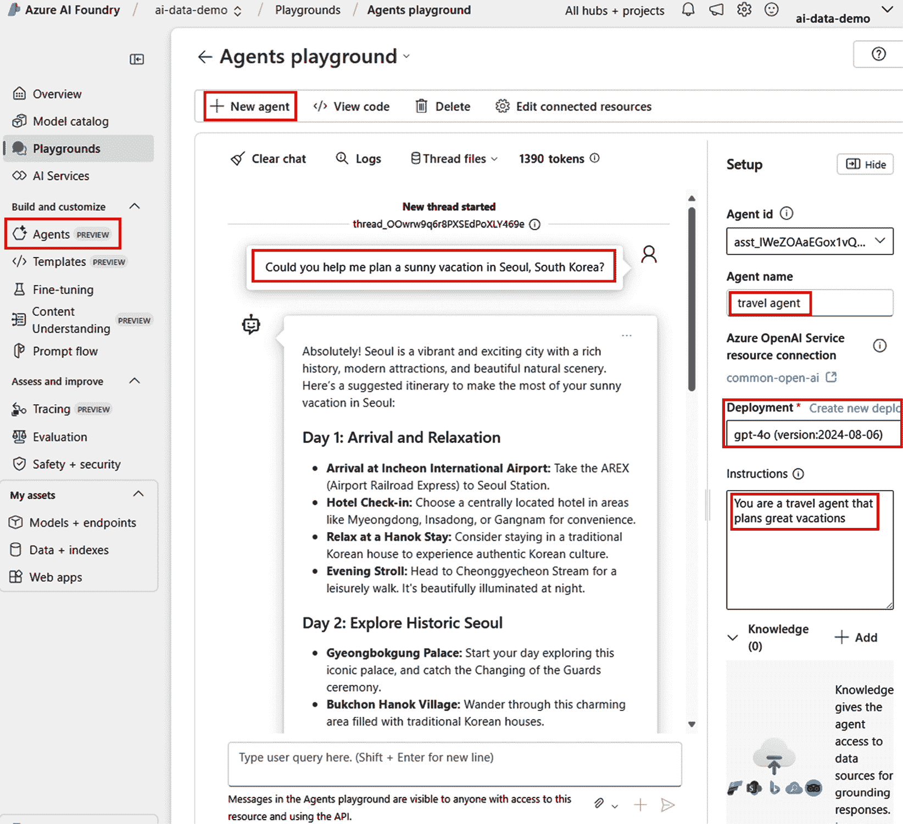

# 第九章：使用 Azure AI 代理服务实现代理解决方案

在本章中，我们将探讨如何使用 Azure AI 代理服务和支持框架（如语义内核和 AutoGen）设计、配置和实现智能代理解决方案。我们将引导你了解基础概念，介绍部署策略，并介绍高级多代理编排工作流程。内容旨在帮助你建立不同框架下的代理架构坚实基础——既为通过*AI-102：Azure AI 工程师助理认证*考试做准备，也让你能够自信地将这些概念应用于实际解决方案。

到本章结束时，你将能够做到以下事项：

+   理解 AI 代理的角色和用例

+   配置 Azure 资源以支持代理开发

+   使用 Azure AI 代理服务构建代理

+   使用语义内核和 AutoGen 实现高级代理

+   协调涉及多个代理和用户的复杂工作流程

+   测试、优化和部署用于生产使用的代理

要开始构建有效的代理解决方案，首先了解 AI 代理是什么、它们如何工作以及它们可以在哪里创造价值是非常重要的。这种基础知识将指导你在各种开发工具和用例中的设计决策。

# 理解 AI 代理及其用例

AI 代理是一种基于软件的实体，能够自主推理、规划和执行任务以实现特定目标。与传统自动化脚本或静态机器人不同，代理是动态的、上下文感知的，并能够执行复杂操作，如工具使用、内存管理和决策。

例如，医疗保健提供者可能会开发一个 AI 代理来协助临床医生进行患者记录摘要。这个代理可以与**电子健康记录**（**EHR**）系统集成，并使用**大型语言模型**（**LLM**）提取相关的临床细节，如诊断、药物和实验室结果。它可以将这些信息总结成简短的笔记，供临床医生在患者会诊前参考。此外，代理可以使用工具调用从医学知识库中获取最新的治疗指南，并提醒临床医生潜在的药物相互作用。随着时间的推移，代理还可以学习提供者的偏好，改善其摘要的结构和重点。

根据 Microsoft Learn，AI 代理具有以下特征：

+   **推理**：代理可以评估目标并确定是否拥有足够的信息继续进行

+   **规划**：如果需要，代理可以生成一系列步骤或子任务以实现目标

+   **执行操作**：它可以执行诸如调用 API、查询知识库和与其他系统交互等操作

+   **对话管理**：代理可以与用户进行多轮对话，以明确意图或收集更多信息

+   **记忆**：代理可能会记住之前的交互并保持短期或长期记忆以改进响应

代理非常适合需要决策、适应性和与外部系统交互的现实世界任务。代理可以采取各种形式，具体取决于它们的设计和包含的功能。

代理的类型包括以下几种：

+   使用工具的代理，通过访问 API 来增强其功能

+   以目标为导向的代理，将目标分解为子任务并执行它们

+   协作代理，与用户或其他代理一起解决问题

重要提示

人工智能代理与传统机器人之间的核心区别在于它们的自主程度和适应性。传统机器人通常遵循预定义的规则集，处理简单的线性工作流程，而人工智能代理可以推理目标、动态规划行动、使用工具，并在多轮对话中保留记忆。这使得代理能够解决更复杂的问题，适应新的输入，并在各种任务中更智能地交互。

为了有效地设计和部署 AI 代理，了解赋予它们能力的核心构建块非常重要。这些组件构成了代理智能、适应性和在不同场景中的有用性的基础。

### 代理的组件

使用 Azure AI 代理服务开发的代理通常由四个核心组件组成，这些组件协同工作以支持推理、交互和自动化：

+   **模型**：这是部署的生成式 AI 模型，它为代理理解输入和生成自然语言响应的能力提供动力。Azure 支持广泛的模型选择，包括 OpenAI 的 GPT-4 以及通过 Azure AI Foundry 可用的其他模型。例如，一个帮助员工完成人力资源任务的代理可能会使用 GPT-4 来理解“下周五提交请假申请”之类的请求。

+   **知识**：这是用于将代理的响应建立在上下文相关内容中的数据源。代理可以通过 Azure AI 搜索索引、特定公司的文档或通过必应的网页搜索结果来访问，以确保它们的答案准确且具体。例如，当被问及内部差旅政策时，代理可以从 Azure AI 搜索中索引的 HR SharePoint 网站检索答案。

+   **工具**：工具是代理可以使用的程序化函数，用于执行操作，例如执行工作流程、检索外部数据或运行计算。内置工具包括 Azure AI 搜索、必应搜索和 Python 代码解释器。开发者还可以使用 Azure Functions 创建自定义工具。例如，一个帮助进行营销任务的代理可能会调用一个自定义函数，直接将内容发布到社交媒体平台。

+   **对话线程**：用户和智能体之间的对话发生在持久线程中。这些线程跟踪整个交流历史，并存储任何附加的文档或由工具生成的输出。这使得智能体能够保持连续性，回顾先前的步骤，并在会话之间建立长期记忆。

重要提示

观看以下两个来自微软的视频，以全面了解 AI 智能体并看到它们在实际中的应用：

*AI 智能体功能和特性概述*

视频 URL：[`youtu.be/dMEwpthSuhU?si=GYlyC4jQJObZLnNm`](https://youtu.be/dMEwpthSuhU?si=GYlyC4jQJObZLnNm)

此视频提供了对 AI 智能体功能和特性的高级介绍。

*详细用例与* *示例代码*

视频 URL：[`youtu.be/ph-1-OIqsxY?si=rMJs8FqECKDw_0KI`](https://youtu.be/ph-1-OIqsxY?si=rMJs8FqECKDw_0KI)

本次会议将介绍一个实际用例，包括示例代码和实施细节。

在对这些组件有扎实理解的基础上，现在让我们探索一些常见的用例，以展示智能体如何被利用来解决不同行业中的实际问题。

常见用例如下：

+   **客户支持助理**：处理多轮对话，并能够访问内部工具和文档

+   **文档摘要智能体**：解析大型文件并提取关键信息供人类审查

+   **流程自动化机器人**：协调跨系统如**客户关系管理**（CRM）和**企业资源规划**（ERP）工具，或票务工具的工作流程

+   **多智能体规划系统**：通过专用智能体之间的协作解决复杂问题

这些用例展示了 AI 智能体在各个行业中的广泛影响。为了构建有效的智能体解决方案，选择正确的工具和框架至关重要。选择应指导你的团队的技术专长、用例的复杂性和目标部署环境。

### 智能体开发选项

开发者有多种方式在 Azure 中创建 AI 智能体，根据项目需求使用不同的服务、SDK 和开发环境。以下是关键选项：

+   **Azure AI 智能体服务**：这是一个完全托管、企业级服务，与 Azure AI Foundry 集成。它基于 OpenAI 助手 API，但提供了对模型选择、数据集成和企业级安全的增强支持。此服务非常适合创建、管理和扩展生产级智能体。

+   **OpenAI 助手 API**：这提供了一个专注于 OpenAI 模型的智能体开发能力的简化版本。它可以与 Azure OpenAI 服务一起使用，但缺乏 Azure AI 智能体服务的完全可扩展性。这使得它适用于轻量级场景或需要与 OpenAI 紧密对齐的情况。

重要提示

虽然 Azure AI 代理服务和 Azure OpenAI 助手都支持通过相同的 API 和 SDK 创建代理，但 Azure AI 代理服务提供了增强的企业功能。这些包括灵活的模型选择（支持 GPT、Llama 3、Mistral、Cohere 等）、更深入的数据集成（与 Bing、Azure AI 搜索和自定义 API）、企业级安全（无密钥认证和无公共出口）以及存储灵活性（使用您自己的 Azure Blob Storage 或使用平台管理的存储）。如果您的用例涉及合规性、高级数据处理或大规模部署，建议使用 Azure AI 代理服务。

+   **Semantic Kernel**：这是一个轻量级、开源的 **软件开发工具包**（**SDK**），用于构建智能代理和编排多代理工作流程。它包括语义内核代理框架，为构建灵活和模块化代理提供工具和模式。此选项非常适合希望实现自定义逻辑、规划和基于内存行为的开发者。

+   **AutoGen**：这是一个理想的 Python 开源框架，适用于原型设计和围绕代理行为的研究。它鼓励快速实验和不同角色代理的协调。

+   **Microsoft 365 代理 SDK**：这允许创建自托管代理，可以通过 Teams、Slack、Messenger 和其他渠道交付。尽管其名称如此，但它并不仅限于 Microsoft 365 场景。

+   **Microsoft Copilot Studio**：这提供了一个低代码环境，使业务用户能够使用可视化设计界面构建代理。它与 Microsoft 365、Power Platform 和外部连接器无缝集成，是低代码开发或融合团队的理想选择。

+   **Microsoft 365 Copilot 中的 Copilot Studio 代理构建器**：这是一个声明性工具，允许业务用户使用自然语言或可视化配置来定义代理行为。它特别适用于无需编写任何代码即可自动化日常任务。

在深入实际代理构建之前，选择正确的发展方法和支持工具集至关重要。Azure 提供了多种框架和 SDK，它们在复杂性和功能上有所不同，因此选择合适的工具取决于用例和受众。

### 选择合适的代理开发工具

以下是一些帮助确定最佳方法的指南：

+   **无代码业务用户**：使用 Copilot Studio 代理构建器创建基本任务自动化代理，设置简单

+   **低代码业务技术专家**：选择 Microsoft Copilot Studio 来构建与 Teams、Slack 或 Power Platform 集成的低代码代理

+   **构建企业级代理的专业开发者**：从 Azure AI 代理服务开始，以实现全面的可观察性、可扩展性和模型/工具灵活性

+   **研究和实验代理**：使用 AutoGen 或 Semantic Kernel 进行多代理编排和快速构思

重要提示

这些工具是互补的，开发者通常会根据用例、技能和环境使用多个工具。

在本节中，我们将专注于面向专业开发者的工具和服务，因为它们与目标受众为*AI-102：Azure AI 工程师助理认证*考试相一致。让我们深入了解三个核心框架：Azure AI 代理服务、Semantic Kernel 和 AutoGen。

### 代理开发框架比较

下表总结了 Azure 中用于代理开发的三个最广泛使用的框架。这将帮助您了解它们的特性，并确定哪个最适合您的开发目标：

| 框架 | 最佳用途 | 模型支持 | 内存 | 工具集成 | 复杂性 |
| --- | --- | --- | --- | --- | --- |
| Azure AI 代理服务 | 生产级托管代理 | OpenAI、Llama、Cohere、Mistral | 是 | 内置 + 自定义工具 | 低 |
| Semantic Kernel | 自定义编排和计划 | 通过 API/SDK 的任何 LLM | 是（语义） | 插件式 | 中等 |
| AutoGen | 研究、原型设计、实验 | 基于 Python 的 LLMs 通过 OpenAI，其他 | 是 | Python API + 代码工具 | 中等 |

表 9.1 – 代理开发框架比较

现在我们已经比较了可用于代理开发的键框架，让我们探索两种常见的部署方法——从单代理设置开始，逐步过渡到更高级的多代理编排场景：

+   **选项 1 – 单代理部署**：首先使用 Azure AI Foundry 部署独立代理。这些代理通过微服务进行管理，并设计为适用于生产就绪，具有企业级可观察性、安全性和模型灵活性。

+   **选项 2 – 多代理编排**：一旦您的解决方案需要多个专业代理之间的协调，您可以使用 AutoGen 进行构思和快速实验，并使用 Semantic Kernel 进行生产级多代理编排。AutoGen 特别适合迭代设计和研究工作流程，而 Semantic Kernel 则针对可扩展、安全和稳定的部署进行了优化。

如需有关 Azure AI 代理服务的更详细信息，请访问[`techcommunity.microsoft.com/blog/azure-ai-services-blog/introducing-azure-ai-agent-service/4298357`](https://techcommunity.microsoft.com/blog/azure-ai-services-blog/introducing-azure-ai-agent-service/4298357)。

现在我们来探讨如何通过配置必要资源和创建使用不同框架的代理来准备您的 Azure 环境以支持智能代理。

## 配置资源以构建代理

在我们深入实施之前，重要的是要强调，接下来的几节将侧重于使用三个主要开发路径进行动手练习：Azure AI 代理服务、Semantic Kernel 和 AutoGen。每条路径都展示了使用 Azure 中不同的工具集构建智能代理的独特方法。

为了帮助你比较，我们将对每个平台应用相同的提示场景，展示如何使用每种方法实现类似的功能。这种并排视角将提供不同平台如何处理代理推理、工具集成和内存管理的见解。这些实际示例将帮助你自信地选择并应用适合你自己的代理解决方案的正确开发路径。

### 使用 Azure AI 代理服务创建基本代理

为了将理论应用于实践，我们将首先使用 Azure AI 代理服务开发一个基本的代理。这个动手实验在一个生产就绪、托管的环境中介绍了基础概念。

你已经准备好使用 Azure AI 代理服务创建你的第一个代理。

#### 练习 1：使用 Azure AI Foundry 网页门户创建代理

要完成这个练习，你需要访问 Azure AI Foundry 网页门户，并在 `a102-hub` 工作区下有一个名为 `ai-data-demo` 的项目。该项目应该在 *第八章* 中创建。如果它尚未可用，请参考 *第八章* 的 *练习 1：在 Azure 门户中创建中心、项目和 AI 服务* 部分来设置它。一旦你的项目就绪，请导航到 `a102-hub` 中 `ai-data-demo` 的概览页面。

重要提示

你需要通过访问 [`learn.microsoft.com/en-us/azure/ai-services/agents/concepts/model-region-support#azure-openai-models`](https://learn.microsoft.com/en-us/azure/ai-services/agents/concepts/model-region-support#azure-openai-models) 来检查 Azure AI 代理服务在哪些区域可用。

在这个练习中，你将使用 Azure AI Foundry 创建一个简单的旅行助手代理。该代理将配置一个 LLM 模型作为其唯一工具，并帮助用户创建个性化的旅行行程。它将根据用户偏好生成特定地点的建议，例如活动、参观地点、住宿和有用的旅行提示：

1.  在 Azure AI Foundry 中创建代理：

    1.  导航到 `旅行代理`，如果你在**部署**下拉菜单中看不到任何模型，请选择 LLM 模型，然后你可以通过点击**创建新部署**来创建一个新模型，如图 9**.1** 所示。

    在这个练习中，旅行代理配置仅包括一个 LLM 模型作为其核心工具。然而，Azure AI 代理服务允许您通过添加其他功能，如知识源和动作来增强您的代理。为了将外部或企业特定信息与响应相结合，您可以将 Bing 搜索结果或 Azure AI 搜索索引作为知识工具进行集成。此外，为了启用动态动作，您可以通过将代理连接到自定义 API 或 Azure Functions 来调用函数，使其能够执行实时操作，例如生成报告、查询数据库或启动工作流。您还可以使用系统设置，如温度、top-p 和令牌限制来配置模型的行为和性能。

1.  点击**在游乐场中尝试**以创建线程并测试代理：

    1.  通过输入**你能帮我计划一次在首尔，韩国的阳光假期吗**来开始对话：

    1.  代理应响应针对首尔，韩国的定制旅行指南，包括景点、餐饮和当地小贴士，如下面的图所示：



图 9.1 – 旅行代理游乐场

这个视觉练习将引导您定义代理的行为，配置模型和工具设置，并在 Azure AI Foundry 中使用直观的无代码界面测试代理。它为理解基于 LLM 的代理在实际中的工作方式提供了清晰的基础。现在您已经完成了无代码设置，让我们在下一项练习中通过基于 SDK 的方法实现相同的实现。

#### 练习 2：使用 Azure AI 代理 SDK 创建代理

在这部分，您将使用基于 SDK 的开发来以编程方式配置和管理您的代理。这种方法非常适合生产自动化、集成到管道中或动态代理创建。让我们开始吧：

1.  导航到位于“第九章”文件夹中的`01-azure-ai-agent-service.ipynb`文件。打开笔记本，通过审查和执行每个单元来跟随，以程序化地遍历代理创建过程。笔记本中包含详细的说明，因此这里不再重复。

1.  导入所需的库：

    ```py
    import os
    from azure.ai.projects import AIProjectClient
    from azure.identity import DefaultAzureCredential
    from typing import Any
    from pathlib import Path
    ```

1.  这是认证和项目客户端设置代码：

    ```py
    from dotenv import load_dotenv
    load_dotenv()
    project_connection_string = os.getenv("AZURE_AI_AGENT_PROJECT_CONNECTION_STRING")
    if project_connection_string is None:
        raise KeyError("AZURE_AI_AGENT_PROJECT_CONNECTION_STRING not found in .env file")
    project_client = AIProjectClient.from_connection_string(
        credential=DefaultAzureCredential(), conn_str=project_connection_string)
    print(project_connection_string)
    ```

1.  这是创建 AI 代理的代码：

    ```py
    agent = project_client.agents.create_agent(
            model="gpt-4o-mini",
            name="Agent820",
            instructions="You are a travel agent that plans great vacations")
    print(f"Created agent, agent ID: {agent.id}")
    ```

1.  这是创建线程的代码：

    ```py
    thread = project_client.agents.create_thread()
    print(f"Created thread, thread ID: {thread.id}")
    Adding a User Message
    message = project_client.agents.create_message(
            thread_id=thread.id,
            role="user",
            content="Could you help me plan a sunny vacation in Seoul, South Korea?")
    print(f"Created message, ID: {message.id}")
    ```

1.  这是运行代理的代码：

    ```py
    run = project_client.agents.create_and_process_run(thread_id=thread.id, assistant_id=agent.id)
    print(f"Run finished with status: {run.status}")
    if run.status == "failed":
            print(f"Run failed: {run.last_error}")
    ```

1.  这是检索对话消息的代码：

    ```py
    messages = project_client.agents.list_messages(thread_id=thread.id)
    for msg in messages.data:
        print(f"Message ID: {msg.id}")
        print(f"Role: {msg.role}")
        print("Content:")
        for content in msg.content:
            if content['type'] == 'text':
                print(content['text']['value'])
        print(«-» * 50)
    ```

现在您已经使用 Azure 的 AI 代理 SDK 构建了一个基础代理，让我们进一步探索如何使用开源 SDK 创建更高级和灵活的代理。我们将从语义内核开始，然后在下一节深入探讨 AutoGen。

### 使用语义内核和 AutoGen 实现单个代理

在继续使用 Semantic Kernel 和 AutoGen 进行接下来的三个练习之前，您需要使用托管在 GitHub 上的模型进行身份验证。首先，将 `.env-sample` 文件复制到一个新的 `.env` 文件中。然后，在 `.env` 文件中生成一个 `GITHUB_TOKEN` 变量。此令牌允许安全访问需要 GitHub 身份验证的模型和服务。您可以通过以下说明创建您的 PAT：[`docs.github.com/en/authentication/keeping-your-account-and-data-secure/managing-your-personal-access-tokens`](https://docs.github.com/en/authentication/keeping-your-account-and-data-secure/managing-your-personal-access-tokens)。

每个练习都在 GitHub 中相应的笔记本中详细说明。请遵循每个笔记本中的逐步说明，因为它们不会在本节中重复。

为了构建更灵活和定制的代理解决方案——特别是那些需要复杂任务规划、内存集成和编排的解决方案——您可以利用像 Semantic Kernel 这样的开源 SDK。Semantic Kernel 提供了一个模块化、可扩展的基础，可以将传统编程结构与 AI 功能相结合，使开发者能够对代理行为有比仅使用 Azure AI Agent SDK 更大的控制权。

#### 语义内核框架

语义内核是由微软开发的开源 SDK，它使您能够将 AI 功能与传统编程逻辑集成。它支持将自然语言处理与插件、工具、内存和规划相结合，以构建强大且适应性强的 AI 代理。

在其核心，语义内核由几个模块化组件组成：

+   **内核**：管理技能执行、内存访问和编排的中心协调器。

+   **技能和函数**：可重用功能块——例如摘要、数学计算或外部 API 调用——代理可以调用以完成任务。

+   **规划器**：可以将用户的整体目标分解为一系列子任务，这些子任务调用相关函数的组件。

+   **内存**：它支持语义内存（使用向量嵌入）和传统内存，以在交互中维护上下文和连续性。

此 SDK 特别适合需要将任务链式连接并围绕 AI 响应注入结构化编程逻辑的场景，使其非常适合后续基于规划器的练习。

如前所述，以下练习将演示如何使用不同的方法产生相同的输出——这次是通过 Semantic Kernel 实现。这种比较突出了如何使用基于 SDK 的方法构建和编排代理，提供了比完全托管的平台（如 Azure AI Agent 服务）更多的灵活性、模块化和控制。

#### 练习 3：使用语义内核的单个代理

这个练习演示了如何使用基于语义内核 SDK 的方法实现单代理解决方案。你将遍历设置内核、配置代理和运行对话的过程，所有这些都在笔记本中完成，以说明语义内核如何以模块化和可扩展的方式编排 AI 行为：

1.  导航到位于`Chapter 9`文件夹中的`02-semantic-kernel.ipynb`文件。打开笔记本，通过审查和执行每个单元来跟随程序化代理创建过程。笔记本中包含详细的说明，因此这里不会重复。

1.  导入所需的库（此处未显示以节省空间），创建客户端并初始化内核：

    ```py
    load_dotenv()
    client = AsyncOpenAI(
        api_key=os.getenv("GITHUB_TOKEN"), base_url="https://models.inference.ai.azure.com/")
    kernel = Kernel()
    chat_completion_service = OpenAIChatCompletion(
        ai_model_id=»gpt-4o-mini»,
        async_client=client,
        service_id="agent")
    kernel.add_service(chat_completion_service)
    Create the agent
    AGENT_NAME = "TravelAgent"
    AGENT_INSTRUCTIONS = "You are a travel agent that plans great vacations"
    agent = ChatCompletionAgent(service_id="agent", kernel=kernel, name=AGENT_NAME)
    ```

1.  运行代理：

    ```py
    async def main():
        chat_history = ChatHistory()
        chat_history.add_system_message(AGENT_INSTRUCTIONS)
        user_inputs = [
            "Could you help me plan a sunny vacation in Seoul, South Korea?"]
        for user_input in user_inputs:
            chat_history.add_user_message(user_input)
            try:
               async for content in agent.invoke(chat_history):
                    # Add the response to the chat history
                    chat_history.add_message(content)
                    print(f"# Agent - {content.name or '*'}: '{content.content}'")
            except Exception as e:
                print(f"Error: {e}")
    await main()
    ```

`02-semantic-kernel.ipynb`笔记本展示了使用微软的语义内核框架的开源 SDK 方法。它演示了如何构建一个利用`semantic_kernel`库和 GitHub 模型 API 的客户端代理。该架构围绕一个内核，它协调服务和插件，一个`ChatCompletionAgent`定义代理行为，以及一个`ChatHistory`组件来管理本地对话。这种方法提供了更大的灵活性，能够在任何环境中运行，并具有可扩展的基于插件的架构，使开发者能够完全控制代理的实现方式。让我们对比一下 AutoGen 的工作方式。

#### AutoGen 框架

AutoGen 是一个开源、可扩展的框架，旨在通过多代理对话方法简化 LLM 应用程序的开发。它允许创建相互通信、协调任务并通过结构化对话自动化复杂工作流程的代理。AutoGen 中的每个代理都可以配置自己的目标、行为、工具和内存，使其非常适合原型设计基于高级 LLM 的系统。

与单代理方法不同，AutoGen 提供了群聊、代理内存、工具调用和函数执行链的抽象。它特别适合研究工作流程、迭代内容生成和模拟任务委派。例如，在文档摘要管道中，你可能有一个代理执行信息检索，另一个代理起草摘要，第三个代理进行质量验证——所有这些通过 AutoGen 的对话编排进行通信。

AutoGen 还支持多代理协调的基本对话管理模式：

+   **聊天终止**：AutoGen 包括灵活的终止逻辑，以控制多代理聊天何时结束。策略可能包括在固定数量的消息回合后结束，达到一定的响应条件（例如，“任务完成”）或当所有代理表示同意时。这防止了无休止的对话并确保了效率。例如，如果用户问“今天天气怎么样？”代理回答当前天气，对话可以自然地在那里结束，除非用户继续提问。可以使用清晰的条件或信号，例如用户说“谢谢，这就够了”，来触发终止。

+   **人工介入（HITL）**：AutoGen 可以将人工决策点集成到工作流程中。例如，如果客户支持代理无法验证用户的账户信息，它可能会通过说“我将您转接到一位可以进一步帮助您的支持专家。”将聊天升级到人工代表。这使自动化与监督相结合的方法更加平衡。

+   **对话模式**：AutoGen 提供内置支持，以支持几种结构化对话模式，这些模式能够有效地实现多代理协作：

    +   **一对一（用户代理代理** ⇄ **助手代理）**：用户代理代理与单个助手代理之间的直接交互。这种模式适用于只需要一个代理的简单任务。

    *示例*：用户代理代理与编码助手通信以生成 Python 代码。

    +   **一对多（用户代理代理** ⇄ **[代理 1，代理 2，...]）**：用户代理代理向一组具有不同角色的代理广播消息。这允许多个代理并行响应或根据任务流程轮流响应。

    *示例*：用户代理代理请求一组代理（例如，代码生成器、优化器和验证器）协作解决编程问题。

    +   **多对多（群聊）**：多个代理在无需直接用户输入的情况下进行动态、自主的对话。这种模式适用于复杂的多步骤工作流程，其中代理可以协同推理、计划和执行。

    *示例*：规划代理、开发代理和测试代理进行群聊，以设计、实施和验证一个软件模块。

这些功能使 AutoGen 不仅适用于开发和原型设计，而且能够支持结构化的企业工作流程，其中可靠性和可审查性是关键。

在深入实际示例之前，了解 AutoGen 如何通过简单和模块化的定义来模拟和编排代理角色非常重要。现在，让我们探索一个实际练习，将这些原则付诸实践。

#### 练习 4：使用 AutoGen 的单代理场景

AutoGen 支持单代理协作：

1.  导航到位于`Chapter 9`文件夹中的`03-autogen.ipynb`文件。打开笔记本，通过审查和执行每个单元来按程序遍历代理创建过程。该笔记本包含详细的说明，因此此处不再重复。

1.  导入所需的库（此处未显示以节省空间），创建一个客户端实例以与 Azure OpenAI 服务交互，并发送一个测试问题：

    ```py
    client = AzureAIChatCompletionClient(
    model="gpt-4o-mini",
    endpoint="https://models.inference.ai.azure.com",
    credential=AzureKeyCredential(os.getenv("GITHUB_TOKEN")),
    model_info={
    "json_output": True,
    "function_calling": True,
    "vision": True,
    "family": "unknown",
    })
    result = await client.create([UserMessage(content="What is the capital of South Korea?", source="user")])
    print(result)
    ```

1.  创建用于旅行计划的`AssistantAgent`：

    ```py
    agent = AssistantAgent(
    name="assistant",
    model_client=client,
    tools=[],
    system_message="You are a travel agent that plans great vacations")
    ```

1.  运行一个`async`函数来演示旅行代理助手：

    ```py
    async def assistant_run() -> None:
    response = await agent.on_messages(
    [TextMessage(content="Could you help me plan a sunny vacation in Seoul, South Korea?", source="user")],
    cancellation_token=CancellationToken())
    await assistant_run()
    ```

AutoGen 的实现提供了一种简化的方式来构建用于旅行计划的 AI 代理。它首先通过配置`AzureAIChatCompletionClient`开始，该客户端使用存储在环境变量中的个人访问令牌连接到 GitHub 的模型推理 API。此客户端具备诸如 JSON 格式输出、函数调用和视觉支持等关键功能。然后创建`AssistantAgent`作为旅行计划者，其行为由定义的系统消息引导。最后，执行一个异步函数，将用户消息发送以计划在韩国首尔度假。该笔记本捕捉了详细的内部代理推理和最终的聊天输出。这种设置侧重于简单性——允许用户和代理之间直接进行消息交换，同时配置或架构开销最小。

### 与 Azure AI 代理服务和语义内核的比较：

与语义内核和 Azure AI 代理服务相比，AutoGen 在简单性和能力之间取得了平衡。语义内核采用更分层的架构，包括内核、服务和聊天历史跟踪，以实现灵活的编排。另一方面，Azure AI 代理服务通过云托管代理和持久线程抽象化大多数基础设施关注点，使其非常适合可扩展的企业场景。

AutoGen 位于中间——它比语义内核更直接，比 Azure AI 代理服务更不抽象。虽然这个例子展示了简单的点对点交互，但 AutoGen 的架构支持更高级的多代理协作模式。尽管在这个旅行代理示例中，所有三个框架都使用相同的底层模型，但它们的开发风格不同：AutoGen 强调最小设置和消息传递，语义内核侧重于编排工作流程，Azure AI 代理服务在云中提供托管、有状态的代理交互。

现在我们已经探讨了如何使用 Azure AI 代理服务、语义内核和 AutoGen 实现智能代理，我们将迈出下一步：在多个代理之间进行协作编排。这种方法对于解决需要专业、协调和代理之间沟通的更复杂任务至关重要，使编排策略成为高级代理解决方案的关键组成部分。

### 使用语义内核编排多代理：

语义内核在编排 Azure 中的多代理解决方案中也发挥着关键作用。与单代理框架不同，语义内核代理框架允许您定义模块化、角色特定的代理，这些代理通过一致的消息传递协议进行通信、共享内存和委派任务。每个代理在其定义的范围内运行，可以包括对其自己的工具、内存存储和插件功能的访问。

在语义内核中，代理由一个规划器、一组工具或插件、一个内存存储和一个核心编排循环构成。这种结构使其非常适合研究助手、内容生成工作流程或多步骤业务自动化等场景，在这些场景中，子代理必须协作以完成复杂请求。

例如，基于语义内核的编排可能包括一个`WriterAgent`用于起草内容，一个`EditorAgent`用于检查清晰度和语法，以及一个`PublisherAgent`用于将更新推送到 CMS。每个代理在逻辑上都是隔离的，但通过编排器在共享的对话线程中协同工作。

为了在实践中展示这一点，让我们通过使用 Azure 原生工具和您已经探索的设计模式来演示多个代理的编排。

为了有效地协调多个代理，您需要的不仅仅是单个能力——您还需要一个策略来指导代理如何协作、如何选择任务代理以及何时结束对话。Azure 的语义内核代理框架引入了三种关键的编排模式，有助于结构化这种多代理交互：

+   **创建代理群组聊天**：在语义内核中，您可以定义一组在结构化对话中交互的代理。每个代理维护自己的记忆和能力，但通过编排的消息交换为共享目标做出贡献。您可以使用用户提示初始化聊天，并允许代理根据相关性或预定义逻辑轮流发言。

+   **设计代理选择策略**：组中的每个代理不需要对每条消息做出响应。使用语义内核，您可以实施一个选择策略，以确定每个回合参与哪些代理。这可能包括轮询、基于角色的选择，甚至基于内容相关性使用 LLM。这有助于减少不必要的响应，并将对话集中在每个步骤中最有能力的代理上。

+   **定义聊天终止策略**：多代理对话应该有明确的完成标准。您可以根据固定轮数、特定代理响应（例如，“任务完成”）或代理之间的共识来定义终止逻辑。这可以防止无限循环并有助于确保有效解决。

这些模式确保代理有效地协作，专注于任务，并在适当的时间停止——为多代理编排提供控制和灵活性。

#### 练习 5：使用语义内核编排多代理工作流程

在这个练习中，你将学习如何编排一个多代理工作流程，其中每个代理承担一个明确定义的角色并通过结构化对话进行协作。该过程从面向用户的代理接收与旅行相关的请求开始。然后，该输入由前台代理处理，生成推荐。第二个代理——礼宾部——审查建议的真实性和质量，提供改进的反馈。前台代理根据这些反馈改进其响应，然后交互迭代进行，直到礼宾部批准推荐或达到最大迭代次数。通过这个练习，你将获得关键编排模式的手动经验，包括特定角色的代理设计、消息传递、细化循环和终止策略——所有这些都是使用语义内核构建智能、协作代理系统的重要概念：

1.  导航到位于“第九章”文件夹中的 `04-multiagent-semantic-kernel.ipynb` 文件。打开笔记本，通过审查和执行每个单元来按程序化方式遍历代理创建过程。笔记本中包含详细说明，因此此处不再重复。

1.  导入所需的库（此处未显示以节省空间）并使用 OpenAI 聊天完成服务创建一个语义内核实例：

    ```py
    def _create_kernel_with_chat_completion(service_id: str) -> Kernel:
        kernel = Kernel()
        service_id="agent"
        client = AsyncOpenAI(
        api_key=os.environ["GITHUB_TOKEN"], base_url="https://models.inference.ai.azure.com/")
        kernel.add_service(
            OpenAIChatCompletion(
                ai_model_id=»gpt-4o-mini»,
                async_client=client,
                service_id=service_id))
        return kernel
    ```

1.  实现酒店礼宾部、前台代理和寻求旅行推荐的用户之间的主要对话流程。更多详情请参阅 `semantic-kernel.ipynb` 笔记本中的第三个单元。为了节省空间，此处未显示完整代码——仅包含初始的 `agent_reviewer` 代码：

    ```py
    async def main():
    REVIEWER_NAME = "Concierge"
    REVIEWER_INSTRUCTIONS = """
    You are an are hotel concierge who has opinions about providing the most local and authetic experiences for travelers.
    The goal is to determine if the front desk travel agent has reccommended the best non-touristy experience for a travler.
    If so, state that it is approved.
    If not, provide insight on how to refine the recommendation without using a specific example.
    """
    agent_reviewer = ChatCompletionAgent(
    service_id="concierge",
    kernel=_create_kernel_with_chat_completion("concierge"),
    name=REVIEWER_NAME,
    instructions=REVIEWER_INSTRUCTIONS)
    ……
    ….
    ```

    这个笔记本演示了多个 AI 代理如何通过结构化对话和反馈循环协作以提供更好的结果。代码创建了两个不同的代理：一个提供首尔度假具体推荐的柜台旅行代理，以及一个评估这些推荐以确保其真实性和非旅游性质的礼宾部。这个实现的特殊之处在于其通过 *选择策略*（确定下一个发言的代理）和 *终止策略*（确定对话何时结束）编排代理交互。《AgentGroupChat》管理这个协作过程，确保有来有往的交流，其中前台代理建议首尔的活动，礼宾部进行评论，前台代理根据反馈改进建议，直到礼宾部批准。这种复杂的方法展示了多个专业代理如何通过结构化协作共同产生高质量的推荐，这比单代理实现有显著进步。

现在您的代理解决方案已经启动并运行，是时候关注质量、性能和部署了。下一节将介绍如何在生产环境中测试、精炼和使代理投入运营。

## 测试、优化和部署代理

代理开发完成后，进行结构化的测试、优化和部署过程至关重要，以确保可靠和可扩展的性能。每个阶段都在验证代理行为并为实际使用做准备方面发挥着至关重要的作用。

测试从验证代理在不同输入场景下按预期执行开始。开发者可以为单个函数创建单元测试，特别是对于工具插件或外部 API 调用。测试多轮对话和推理的有效方法之一是使用提示流跟踪，这允许您模拟交互并检查决策路径。例如，在测试客户支持代理时，您可以运行诸如*重置密码*或*追踪我的订单*等场景，并验证代理是否始终如一地响应并调用正确的工具。此外，评估幻觉风险——代理生成不准确或虚构内容的多频繁，对于与基于（例如，Azure AI 搜索）和非基于（例如，Azure AI 搜索）数据的工作至关重要。

优化涉及改进代理的性能和资源使用。调整系统提示——它设定了代理的个性和边界——可以显著影响响应准确性和行为。调整模型参数，如温度、top-p 或 max tokens，有助于控制创造力和成本。如果一个代理经常执行耗时任务，例如调用 API 获取货币汇率，缓存这些响应可以减少延迟和令牌消耗。同样，监控令牌使用也很重要，以避免成本超支，尤其是在高流量或生产环境中。

部署是使您的代理投入运营的最终步骤。大多数基于 Azure 的代理都是通过 Azure App Service 或**Azure Kubernetes 服务**（**AKS**）作为 RESTful 端点进行部署。为了保护这些端点，建议使用托管标识和**基于角色的访问控制**（**RBAC**）。这确保只有授权的用户或应用程序可以调用代理。一旦部署，使用 Azure Monitor 和日志分析来跟踪使用指标、延迟、错误率和其他运营指标。这些洞察有助于您持续改进代理的响应性和可靠性。

通过严格测试、精心优化和安全部署您的代理，您创建出健壮、高效且生产就绪的智能系统。- 使用托管标识和 RBAC 保护端点

# 摘要

在本章中，你探讨了如何使用 Azure 的一套服务和 SDK 设计、配置和实现智能 AI 代理。我们首先定义了 AI 代理是什么，检查了它们的组件，并确定了在客户支持、自动化和知识检索等领域的关键用例。

我们随后评估了多个开发路径——包括 Azure AI 代理服务、语义内核和 AutoGen——突出了它们的优点、差异和适当的用例。通过一系列结构化的练习，你学习了如何使用 Azure AI Foundry 构建独立的代理，然后使用语义内核和 AutoGen 重新实现相同的逻辑以比较方法。你还学习了如何使用消息传递、选择策略和终止逻辑在协作工作流程中编排代理。

最后，我们介绍了使用 Azure 原生工具进行测试、优化和部署代理到生产环境中的最佳实践。

这些基础概念和模式将使你能够自信地构建可扩展、模块化和协作的 AI 代理解决方案，以满足你的企业需求。下一章将重点介绍如何为 *AI-102：Azure AI 工程师认证考试* 做准备。它涵盖了考试结构、关键主题和经过验证的学习策略，以及一个完整的练习测试，以帮助你评估你的准备情况并巩固你所学的知识。

# 复习问题

回答以下问题以测试你对本章知识的了解：

1.  以下哪个是区分代理解决方案和传统机器人的主要功能？

    1.  它们可以自主推理和调用工具

    1.  它们仅使用基于规则的决策树

    1.  它们使用静态响应

    1.  它们需要预编程的工作流程

    **正确** **答案**：A

1.  哪个 Azure 服务用于将企业数据与代理的响应关联起来？

    1.  Azure 密钥保管库

    1.  Azure 监视器

    1.  Azure AI 搜索

    1.  Azure 逻辑应用

    **正确** **答案**：C

1.  哪个框架允许基于角色的通信来定义多代理交互？

    1.  AutoML

    1.  AutoGen

    1.  Azure ML Studio

    1.  提示流

    **正确** **答案**：B

1.  以下哪个最好地描述了 `AgentGroupChat` 类在语义内核 `AgentChat` 框架中的作用？

    1.  它仅支持同一类型的代理之间的交互

    1.  它是一个抽象类，必须被子类化才能启用多代理交互

    1.  它充当定义系统提示的静态配置文件

    1.  它促进了多个代理之间的交互，并使用战略机制来管理对话的动态

    **正确** **答案**：D

1.  语义内核代理框架中终止策略的目的是什么？

    1.  它根据定义的逻辑确定何时结束对话

    1.  它确保一次只有一个代理可以发言

    1.  它定义了不同代理之间对话应该如何路由

    1.  它存储之前的对话以供长期记忆

    **正确** **答案**：A

# 进一步阅读

要了解更多关于本章涵盖的主题，请查看以下资源：

+   Azure AI Agent 服务概述: [`learn.microsoft.com/en-us/azure/ai-services/agents/`](https://learn.microsoft.com/en-us/azure/ai-services/agents/ )

+   什么是代理？Microsoft Learn: [`learn.microsoft.com/en-us/training/modules/ai-agent-fundamentals/2-what-are-agents`](https://learn.microsoft.com/en-us/training/modules/ai-agent-fundamentals/2-what-are-agents)

+   语义内核文档: [`learn.microsoft.com/en-us/semantic-kernel/`](https://learn.microsoft.com/en-us/semantic-kernel/ )

+   AutoGen 框架 GitHub: [`github.com/microsoft/autogen`](https://github.com/microsoft/autogen )

+   Azure AI Search for RAG: [`learn.microsoft.com/en-us/azure/search/`](https://learn.microsoft.com/en-us/azure/search/ )

+   代理测试的提示流: [`learn.microsoft.com/en-us/azure/ai-studio/prompt-flow-overview`](https://learn.microsoft.com/en-us/azure/ai-studio/prompt-flow-overview )

+   Azure AI 容器是什么？: [`learn.microsoft.com/en-us/azure/ai-services/cognitive-services-container-support`](https://learn.microsoft.com/en-us/azure/ai-services/cognitive-services-container-support)

+   (强烈推荐) 了解更多关于代理的信息: [`microsoft.github.io/generative-ai-for-beginners/#/`](https://microsoft.github.io/generative-ai-for-beginners/#/)
