# 第十章：实践 AI 实施：行业用例、技术模式和动手项目

重要提示

如果你只专注于通过**AI-102: Azure AI 工程师认证考试**，你可以直接跳转到*第十一章*进行有针对性的练习。然而，我强烈建议你在获得认证后或想要巩固知识时回到这一章。其中的实际案例和项目参考将加深你的专业知识，并为你提升 AI 职业生涯提供一个极好的跳板。

在这一章中，我们将通过检查高级技术模式和动手项目来探讨 AI 如何改变企业，重点关注以下三种主要方法：**构建自己的自定义副驾驶**，这使个性化 AI 解决方案（如零售助手或自动化承保）成为可能；**与数据对话**，这是一种以对话方式安全地访问专有数据的方法；以及**文档处理和摘要**，它自动从复杂文件中提取见解，以实现更快、更准确的决策。

我们还将深入研究**检索增强生成**（**RAG**）模式——这是一种用于与自定义数据进行交互式问答的最稳健技术之一——并了解**文档智能**用于结构化和非结构化数据提取，以及**AI 搜索**的基本原理，包括集成向量和语义索引。

本章涵盖了以下主题：

+   探索跨行业的实际 AI 应用，展示自定义副驾驶和基于聊天的检索等技术模式如何改变业务运营。

+   访问精心挑选的 GitHub 仓库，其中包含大量实用的解决方案加速器，旨在帮助你构建、部署和调整你自己的 Azure 环境中的 AI 解决方案。

你将获得适用于 Azure 中实际 AI 角色的实践经验。这一章不仅为你提供了认证知识，还提供了将具体 AI 解决方案付诸实践的实际专业知识。

# 行业用例和关键技术模式

作为数据/AI 解决方案架构师，我亲眼见证了 AI 如何通过解决复杂挑战来加速各个行业的创新——从自动化发票审批到提供复杂的产品推荐。在接下来的章节中，我们将通过实际场景中的 AI 模式部署案例进行探讨。虽然这一章不会直接出现在你的 AI-102 考试中，但它将显著提高你对实际 AI 解决方案设计的准备程度。

## 企业中的现代 AI 工具

今天的 AI 平台使得解决以前被认为耗时或重复的问题成为可能。常见的如**自定义副驾驶**、**与数据对话**和**文档处理**等技术模式，使组织更容易做到以下事情：

+   **简化工作流程**：自动化数据录入、发票匹配和法律合同审查等手动任务

+   **提高准确性**：通过设计良好的模型在几秒钟内处理大量数据集，减少人为错误

+   **启用更明智的决策**：从多个来源汇总和分析数据，提供近乎实时的相关见解

这里有一些实现这些益处的模式。

### 构建您自己的定制副驾驶

定制副驾驶就像一个个性化的 AI 助手。它可以模拟场景、回答特定领域的疑问，并指导用户完成流程。以下是一些实例：

+   **零售示例**：一个全球电子商务平台推出了一款内置的*购物副驾驶*，该副驾驶分析用户行为、库存水平和以往购买记录，以生成个性化建议。结果是购物体验更加顺畅，购物车放弃率降低，销售额转化率明显提升。

+   **金融服务示例**：银行使用定制的副驾驶来协助财务顾问为客户模拟投资选项——通过定制化的建议提高顾问的生产力和客户参与度。

设计定制副驾驶时，考虑将其连接到现有的数据集（如 CRM 记录或历史用户日志），以便您可以生成真正个性化的见解。同时，确保您保持强大的数据治理——特别是在金融或医疗保健等受监管行业。

### 与您的数据聊天

许多组织发现，人工智能聊天机器人可以安全地访问内部数据，从而缩短响应时间并提升用户体验。尽管聊天机器人已经存在一段时间了，但新一代的**大型语言模型**（**LLMs**）将它们提升到了更直观和情境感知的水平：

+   **保险示例**：一家主要的保险公司创建了一个聊天机器人，该机器人从索赔、保单和承保文件中检索数据。这大幅减少了搜索索赔信息所需的时间，提高了代理人的生产力和客户满意度。

+   **医疗保健示例**：医院越来越多地部署聊天机器人来管理预约、回答患者问题并提供一般健康指导。通过集成安全的数据层，这些聊天机器人可以实时参考患者记录或医生日程。

要使聊天机器人真正有效，需要将其与一个架构良好的数据存储库集成，该存储库包括基于向量的搜索和强大的访问控制（特别是在医疗保健和金融等关键领域）。这确保了快速检索相关信息的同时，尊重严格的隐私要求。

### 文档处理和摘要

文档处理不再局限于简单的**光学字符识别**（**OCR**）。现代人工智能解决方案可以理解上下文，提取关键见解，甚至总结整个文档：

+   **抵押贷款示例**: 抵押贷款提供者利用人工智能扫描和解释贷款申请、信用报告和财产估值。这种自动化方法显著加快了审批周期，减少了人为错误，并使员工能够专注于更有价值的任务，如客户关系。

+   **医疗保健示例**: 大型医院网络利用 Azure AI 总结临床记录和患者互动。结果是有序的记录保存和行政负担的减少——使医疗专业人员有更多时间与患者相处。

## 行业间的人工智能

人工智能解决方案在金融、医疗保健、零售、制造和能源等各个领域产生了有形的影响。以下是一些有代表性的例子（参见*图 10.1*以了解不同行业垂直领域的快照）：

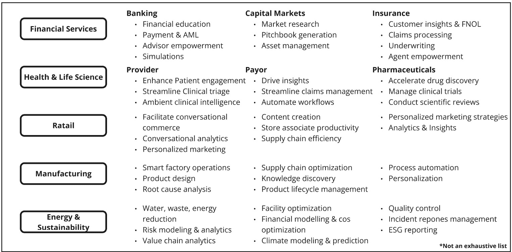

图 10.1 – 各个行业垂直领域的用户体验

让我们探讨人工智能如何通过解决现实世界挑战、开启新机遇并在各个领域推动创新来改变行业：

+   **金融服务**: 金融服务中的 AI 解决方案简化了欺诈检测、赋予顾问权力并改进合规工作流程：

    +   **示例**: 一家领先的银行利用 Azure AI 分析支付模式并实时检测欺诈活动，提供即时警报以减轻风险。这提高了客户信任和运营效率。

    +   **应用**: 反洗钱检测、贷款审批、金融教育和为顾问赋能的模拟。

+   **医疗和生命科学**: 提供者、支付者和制药公司正在利用人工智能改善患者护理、简化运营并加速药物发现：

    +   **示例**: 一家制药公司利用 Azure AI 分析化学化合物和临床试验的数据集，显著减少了药物发现所需的时间

    +   **应用**: 环境临床智能、自动索赔管理和为医疗提供者和支付者量身定制的营销策略

+   **零售**: 人工智能正在通过对话式商业、个性化营销和供应链优化重塑零售业：

    +   **示例**: 一家零售商利用 Azure AI 个性化营销活动，通过基于购买行为的定向促销提高客户参与度和转化率

    +   **应用**: 对话式分析、客户细分和实时库存管理

+   **制造业**: 由人工智能驱动的智能工厂运营和预测性维护帮助制造商减少停机时间并优化生产：

    +   **示例**: 一家汽车制造商采用 Azure AI 进行预测性维护，使其能够在设备发生故障之前识别出故障，从而显著降低成本并改善进度

    +   **应用**: 根本原因分析、产品生命周期管理和实时监控

+   **能源和可持续性**：AI 支持能源优化、气候建模和**环境、社会和治理**（**ESG**）报告，使组织能够实现可持续性目标：

    +   **示例**：一家能源公司实施了 Azure AI 进行气候建模和财务优化，改善了资源配置并减少了环境影响

    +   **应用**：风险评估、废物减少和设施优化

这些示例展示了 AI 不仅仅是自动化任务——它是关于开启新机遇、提高客户满意度和推动增长。借助 Azure AI 解决方案，各行业的业务都在寻找创新的方法来解决他们最紧迫的挑战。

下一节是本书的关键部分，旨在帮助您将从*第一章*到*8*所获得的知识应用于实践。它鼓励您通过在您的订阅中配置 Azure 资源、进行修改，甚至将您的作品贡献到您偏好的仓库中来亲身体验。熟悉这些仓库项目将使您成为 Azure 中 AI 相关角色的有力候选人，无论您是想转换职业还是提升现有职位，您都将为应对专业环境中各种 AI 项目做好准备。

# GitHub 上的学习加速器项目

我包括了一些现实世界 GitHub 仓库的引用，包括我自己在内的微软团队在与客户合作时经常使用。这些仓库作为加速器，使客户能够快速启动和执行针对其独特需求的**概念验证**（**PoC**）项目，而不是从头开始。

由微软员工和个人贡献者开发的开源 GitHub 仓库涵盖了各种用例，并普遍采用 RAG 等模式。它们旨在适应各种技术堆栈、数据源、架构和环境，为开发提供灵活的基础。

重要提示

本节的目标不是详细介绍所列出的 GitHub 仓库的每个细节。每个仓库都已经包含了全面的文档和动手实验的逐步指南。相反，目标在于介绍这些精选资源，并展示如何有效地使用它们来加速您自己的 AI 项目。

请注意，这些仓库正在积极维护并持续发展——随着时间的推移，会添加新功能、增强功能和错误修复。在探索和实施这些解决方案时，请务必查看相应的 README 文件和更新日志，以获取最新进展。

## 与您的数据聊天

本节将探讨四种不同的 RAG 模式，用于与自己的数据交互。每种模式都与其自己的 GitHub 仓库相关联，提供了详尽的详细指南。在此，我将提供每个项目内容的概述。对于更深入的理解和逐步说明，请访问相应的 GitHub 链接。

### 使用 RAG 模式与自己的数据聊天

此解决方案提供了一个类似于 ChatGPT 的界面，用于与自己的文档交互，利用 RAG 模式 ([`github.com/Azure-Samples/azure-search-openai-demo`](https://github.com/Azure-Samples/azure-search-openai-demo))。它使用 Azure OpenAI 的 GPT 模型以及 Azure AI Search 进行数据索引和检索，如下面的架构图所示。这是一个广泛适用的用例，使用户能够直接从 UI 中配置参数，并持续进行增强，如通过用户友好的界面上传数据以及 LLM 对话的完整聊天可追溯性。该解决方案使用 Python 后端构建，还包括 JavaScript、.NET 和 Java 版本，可通过项目的 README 文件访问。

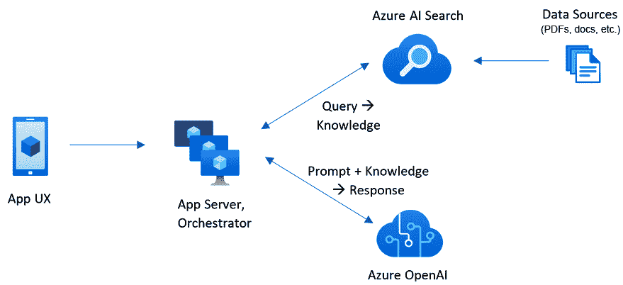

图 10.2 – 架构图（来源：[`github.com/Azure-Samples/azure-search-openai-demo`](https://github.com/Azure-Samples/azure-search-openai-demo)）

该示例应用程序使用一家虚构公司 Contoso Electronics，使员工能够查询内部文档，如政策和职位描述。主要功能包括多轮聊天和单轮问答、答案引用以及 UI 设置以自定义行为。Azure AI Search 支持文档索引、检索和向量化，可选功能包括基于图像推理的 GPT-4、语音输入/输出以提高可访问性、通过 Microsoft Entra 的自动用户登录以及使用 Application Insights 进行性能监控，如下面的截图所示：

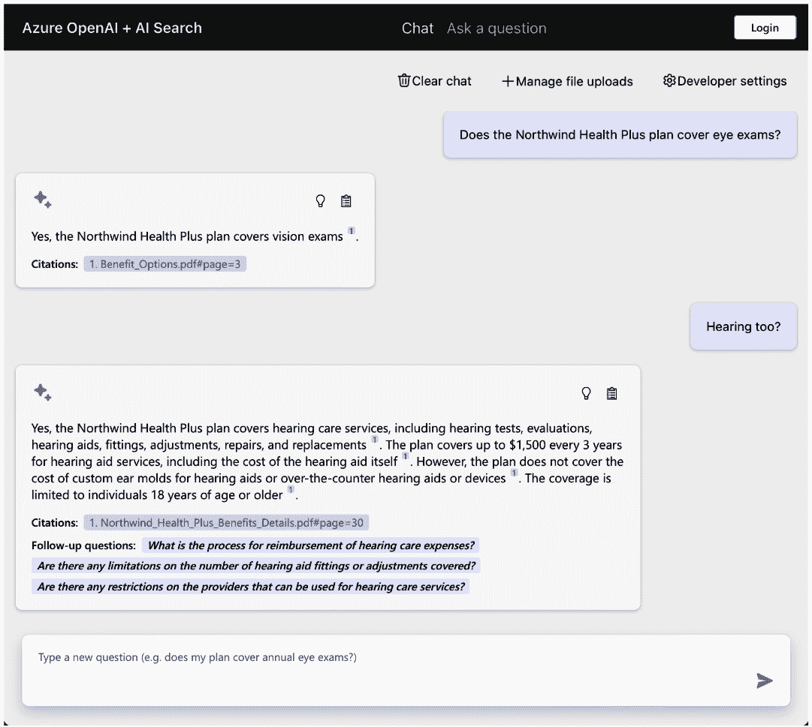

图 10.3 – 主要聊天

下一个屏幕允许用户修改配置设置：

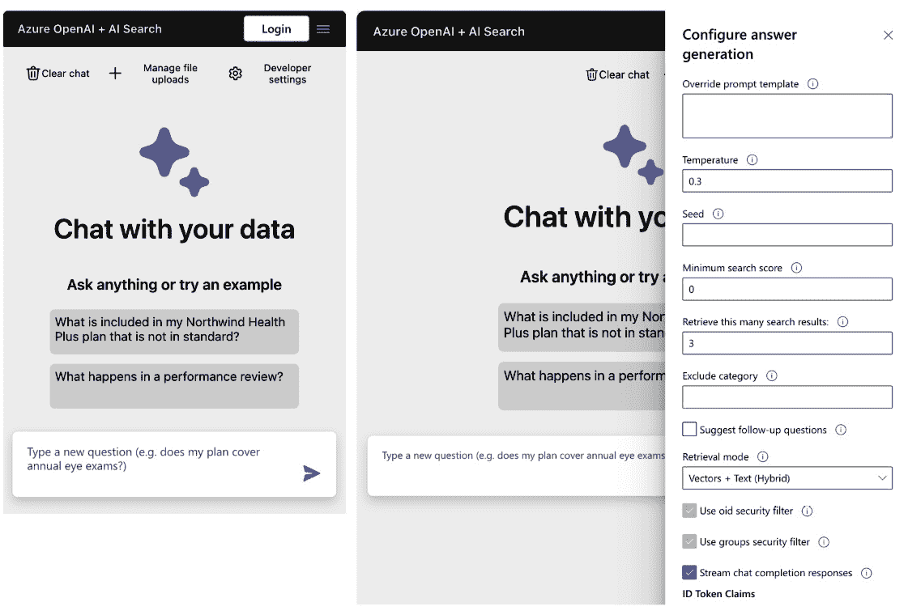

图 10.4 – 聊天 UI 界面（来源：[`github.com/Azure-Samples/azure-search-openai-demo`](https://github.com/Azure-Samples/azure-search-openai-demo)）

此解决方案是跨行业广泛采用的方法，用于通过聊天与自己的数据交互。它是基于 AI 搜索、文档智能和生成式 AI 的概念，如第七章* 和第八章所述。

### 使用 Azure AI Search 和 GPT-4o 实时 API 进行音频的 RAG 语音

2024 年 10 月 1 日推出了实时 API 的公开预览，允许开发者创建低延迟、多模态体验，具有自然语音到语音的交互，类似于 ChatGPT 的高级语音模式。此 API 使用六个预设声音，实现无缝、对话式的交互。

重要提示

有关 Azure OpenAI 模型部署的最新信息，请访问官方 Azure 文档 [`learn.microsoft.com/en-us/azure/ai-services/openai/whats-new`](https://learn.microsoft.com/en-us/azure/ai-services/openai/whats-new)。

此外，音频输入和输出功能正在添加到 Chat Completions API 中，该 API 支持文本和音频响应，但不如实时 API 具有低延迟优势。这意味着开发者现在可以在他们的应用程序中使用单个 API 调用来处理文本和音频输入/输出，从而消除了需要结合多个模型以实现语音增强体验的需求。在此处查看快速演示：[`youtu.be/fVbS-zpIqvY?si=YhGfyjUlhWQnJbX5`](https://youtu.be/fVbS-zpIqvY?si=YhGfyjUlhWQnJbX5)。

一些关键好处如下：

+   **简化开发**：以前，开发者需要为语音识别、推理和语音合成分别使用不同的模型。现在，这两个 API 都处理整个流程，实时 API 通过流式传输音频提供更快的响应时间和更自然的交互。

+   **持久连接**：实时 API 使用 WebSocket 连接与 GPT-4o 通信，支持函数调用以实现实时放置订单或获取客户数据等操作。

+   **用例**：目标应用包括客户支持、语言学习和其他带有语音的用户体验。与合作伙伴的早期测试在这些领域显示出有希望的结果。

这些功能通过支持自然语音交互和实现与各种应用的无缝集成来增强对话体验。

*图 10.5* 展示了如何使用 GPT-4o 实时 API 在基于语音的应用中实现 RAG。

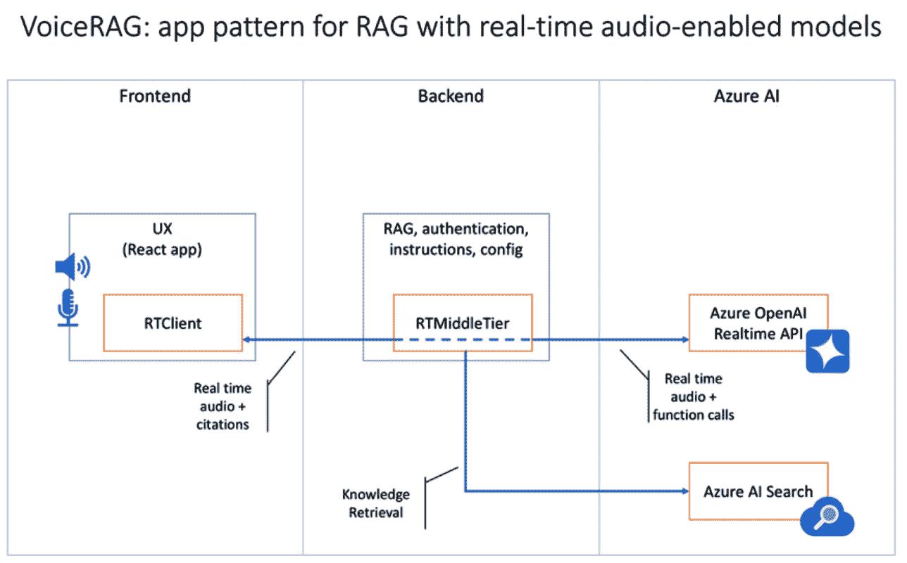

图 10.5 – 带实时音频功能的 RAG 应用程序模式（来源：[`github.com/Azure-Samples/aisearch-openai-rag-audio`](https://github.com/Azure-Samples/aisearch-openai-rag-audio)）

它使用两个主要组件来支持 RAG 工作流程，如前图所示：

+   **函数调用**：GPT-4o 实时 API 支持函数调用，允许模型使用搜索和定位工具。模型处理音频输入，并使用函数调用查询知识库以获取相关信息。

+   **实时中间层**：此组件将客户端任务与服务器端功能分开，处理安全的模型配置和访问知识库。客户端仅管理音频流量，而服务器管理功能调用和配置，通过在后端保留敏感凭证来增强安全性。

关键工作流程涉及模型监听音频输入，并使用 `search` 函数调用来通过 Azure AI 搜索从知识库中检索相关段落。当返回结果时，模型通过音频输出生成基于事实的响应。

要管理引用，`report_grounding` 工具识别基础来源，但不包括文件名或 URL 在语音输出中，确保响应的透明度。

此模式的一些好处如下：

+   **低延迟**：实时 API 与 Azure AI 搜索结合，提供低延迟响应，增强对话式语音应用的用户体验。

+   **后端安全**：所有敏感配置和凭证都安全地存储在后端，Azure OpenAI 和 Azure AI 搜索提供高级安全功能，如网络隔离、Entra ID 和加密。

### 与您自己的数据解决方案加速器聊天

此解决方案加速器结合了 Azure AI 搜索和 LLMs 的高级功能，以提供无缝的对话式搜索体验 ([`github.com/Azure-Samples/chat-with-your-data-solution-accelerator`](https://github.com/Azure-Samples/chat-with-your-data-solution-accelerator)). 使用 Azure OpenAI GPT 模型和从您的数据生成的 Azure AI 搜索索引，此解决方案集成到 Web 应用程序中，提供具有内置语音到文本功能的人工智能语言界面，以实现高效的搜索查询，如图 *图 9*。6* 所示。用户可以轻松上传文件，连接到存储，并处理技术设置以处理和转换文档。所有内容都可以在您的订阅内部署，以加速创新技术的采用。

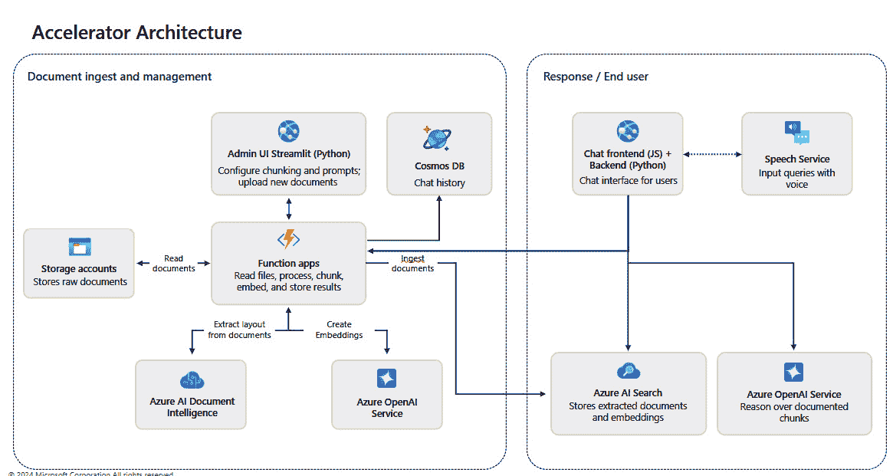

图 10.6 – 与您自己的数据解决方案架构聊天（来源：[`github.com/Azure-Samples/chat-with-your-data-solution-accelerator`](https://github.com/Azure-Samples/chat-with-your-data-solution-accelerator))

此存储库为希望使用自然语言查询其数据的用户提供了一个全面的解决方案。它包括支持多种文件类型的直观摄取系统、简化的部署和维护支持团队。解决方案加速器展示了推送和拉取摄取选项，并支持如 Semantic Kernel、LangChain、OpenAI Functions 和 Prompt Flow 等编排。它被设计为实施 RAG 模式的基础，但不建议未经仔细测试和数据评估就用于即时生产使用。主要功能包括以下内容：

+   使用 Azure OpenAI 和您的数据进行对话式搜索

+   文档上传和处理

+   公共网页的索引

+   可定制的提示配置

+   数据处理的多种分块策略

此存储库非常适合需要超出标准 Azure OpenAI 功能定制的场景。默认情况下，它包括特定的 RAG 配置，如块大小、重叠、检索/搜索类型和系统提示。在生产之前，评估和微调这些设置以优化数据检索和响应生成。有关 RAG 评估见解，请参阅[`github.com/microsoft/rag-experiment-accelerator`](https://github.com/microsoft/rag-experiment-accelerator)的 RAG 实验加速器。

解决方案加速器提供了几个高级功能：

+   使用内部数据和公共网络内容进行模型固化的方法

+   后端支持*自定义*和*数据本地化*的对话流程

+   高级提示工程工具

+   实时数据摄取、检查和配置的管理员界面

+   数据摄取的灵活推送或拉取模型，集成了向量化功能

### AI 驱动的呼叫中心智能加速器

Call Center Intelligence Accelerator 旨在显著降低呼叫中心的运营成本，同时提高效率和客户满意度([`github.com/amulchapla/AI-Powered-Call-Center-Intelligence`](https://github.com/amulchapla/AI-Powered-Call-Center-Intelligence))。利用 Azure 语音、Azure 语言和 Azure OpenAI（GPT-3）服务，此加速器可实现实时和通话后的分析，使呼叫中心能够提取、编辑和分析通话记录，以获得有价值的见解。这些见解可以帮助管理者评估绩效、监控客户情绪和分析对话主题，所有这些都在交互式 Power BI 仪表板中展示。以下图表描述了此解决方案可能帮助加速的关键业务成果：

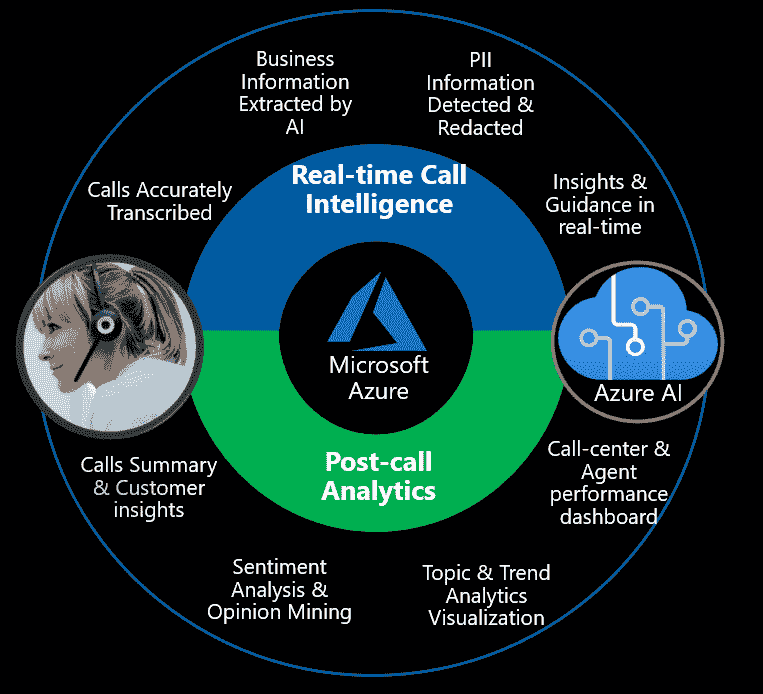

图 10.7 – 加速器的业务成果（来源：[`github.com/amulchapla/AI-Powered-Call-Center-Intelligence`](https://github.com/amulchapla/AI-Powered-Call-Center-Intelligence))

前面的图示展示了 AI 驱动的呼叫中心智能解决方案架构，展示了两个主要组件：**实时智能**和**通话后分析**：

+   **实时智能**：此组件支持在通话期间进行实时转录和分析，为代理提供即时洞察和建议操作。关键技术特性包括以下内容：

    +   使用 Azure 语音服务进行**实时转录**以处理实时音频

    +   使用 Azure 语言服务进行**实体提取和 PII 纠正**以保护敏感数据

    +   通过 Azure OpenAI 服务进行**对话摘要和业务洞察**以提供可操作的智能

    +   一个基于网页的应用模拟了代理-客户互动，展示了 Azure AI 如何作为副驾驶增强代理的能力

    对于设置，请参阅[`github.com/amulchapla/AI-Powered-Call-Center-Intelligence/blob/main/call-intelligence-realtime/README.md`](https://github.com/amulchapla/AI-Powered-Call-Center-Intelligence/blob/main/call-intelligence-realtime/README.md)中的*实时智能*部分以获取详细说明。

+   **通话后分析**：此组件专注于分析通话结束后的情况，生成推动通话处理和合规性持续改进的洞察。核心功能包括以下内容：

    +   使用 Azure 语音进行**批量语音到文本处理**以进行大规模转录和说话人分离

    +   **PII 提取和纠正**以保护敏感信息

    +   **情感分析和意见挖掘**以衡量对话中不同点的客户情绪

    +   使用 Power BI 进行**数据可视化**以使洞察易于访问和操作

这些组件利用 Azure AI 服务在客户互动期间和之后提供洞察，从而增强呼叫中心运营。

关键工具和集成包括 Azure 语音到文本进行音频转录，Azure 语言服务提取关键信息，以及 Azure OpenAI 服务进行高级实时处理。洞察存储在 CRM 系统中，以实现有效的客户关系管理，而 Power BI 可视化通话后数据，以进行趋势分析和运营改进。

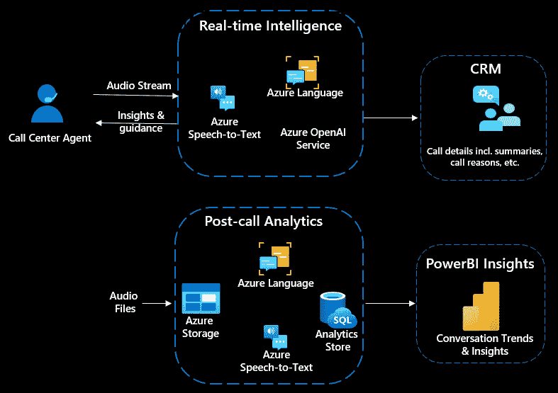

图 10.8 – Azure 关键服务（来源：[`github.com/amulchapla/AI-Powered-Call-Center-Intelligence`](https://github.com/amulchapla/AI-Powered-Call-Center-Intelligence)）

这些组件共同简化了呼叫中心运营，提高了客户满意度和组织效率。

下一节将深入探讨一种使用普通英语访问和检索数据库数据的新颖方法。通过向大型语言模型提供整个数据库架构，模型获得了对数据结构的上下文理解，包括表名和列细节。这使得大型语言模型能够解释自然语言查询，将它们转换为 SQL 语句以检索相关数据，并以普通英语而不是原始 SQL 输出呈现结果。

例如，如果你问，“2003 年 8 月美国销售额是多少？”，回答将是，“2003 年 8 月美国总销售额约为 164,602.67 美元。”让我们深入了解这一令人着迷的功能是如何工作的！

## 带有数据库的 RAG 模式：使用函数调用访问和查询结构化数据

Azure OpenAI 最强大的应用之一是能够使用自然语言访问结构化数据。这通过 Azure OpenAI 文档中的 `https://learn.microsoft.com/en-us/azure/ai-services/openai/how-to/function` 调用得以实现。

在此解决方案模式中，我们使用 Azure OpenAI、Azure SQL 和 Azure App Service 构建了一个 **数据库代理**。我们不需要用户编写复杂的 SQL 查询，模型可以解释他们的自然语言问题，将它们转换为 SQL 使用函数调用，然后执行查询以返回基于事实、易于理解的结果。

让我们看看它是如何工作的。

当用户提问时的逐步过程如下：

+   **聊天提示**：用户输入了问题，“2003 年 8 月美国销售额是多少？”

+   `Function get_table_schema completed`：此步骤检索表的架构，为代理提供有关表结构的详细信息

+   `Function get_table_rows completed`：此步骤检索数据行，这可能有助于代理理解表格内容并在执行 SQL 查询之前进行检查

+   `Function query_azure_sql completed`：这是最终的函数调用，在 Azure SQL 数据库上执行 SQL 查询

+   `query_azure_sql` 函数执行 SQL 查询以计算 2003 年 8 月美国总销售额：

    ```py
    SELECT SUM(SALES) AS Total_Sales_Revenue_USA
    FROM sales_data
    sales_data table for entries where the country is "USA" the month is August (MONTH_ID = 8), and the year is 2003.
    ```

    +   `164602.66999999995`   **最终答案**：应用程序解释函数输出，并以格式化的答案响应用户的问题：“2003 年 8 月美国总销售额约为 164,602.67 美元”

### 架构概述

整体解决方案使用三个主要组件：

+   **Azure OpenAI GPT-4**：提供自然语言理解、SQL 生成和函数调用编排

+   **Azure SQL 数据库**：存储要查询的结构化数据

+   **Azure 容器实例 (App 后端)**: 托管后端逻辑，执行验证过的查询，并保护敏感凭证

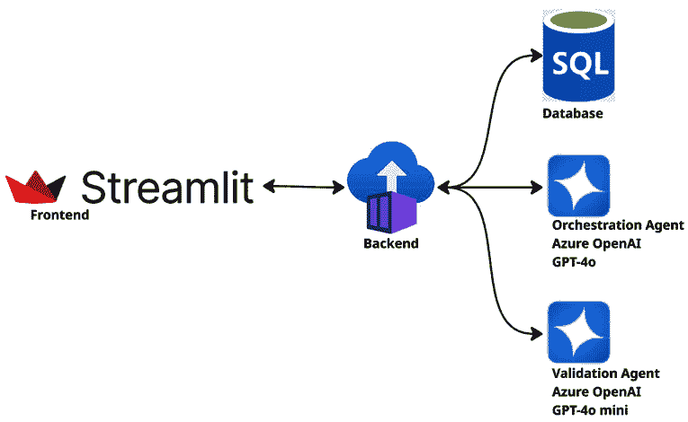

图 10.9 – 架构图

函数调用工作流程确保模型不会直接访问数据库。相反，它充当协调者——生成查询意图，这些意图由后端验证并安全执行。

### 为什么这很重要

这种模式将 RAG 的力量带入结构化数据环境。它不是检索文本文档，而是通过结合 LLM 推理和安全的后端协调，实现实时访问关系数据库。

主要好处包括以下内容：

+   **无需 SQL 知识**：最终用户可以用自然语言提问

+   **安全可控的执行**：所有 SQL 查询都经过验证并在服务器端管理

+   **基于事实的答案**：每个响应都是基于您信任的系统中的实时数据生成的

## 文档智能

人工智能的一个流行用例是支持从非结构化数据中提取数据。通过将文档智能与 LLM 模型相结合，我们可以显著提高数据提取的准确性。我已撰写了一篇文章，更详细地讨论了这一概念：[`techcommunity.microsoft.com/blog/azure-ai-services-blog/maximizing-data-extraction-precision-with-dual-llms-integration-and-human-in-the/4236728`](https://techcommunity.microsoft.com/blog/azure-ai-services-blog/maximizing-data-extraction-precision-with-dual-llms-integration-and-human-in-the/4236728)。

以下 GitHub 仓库专注于文档智能，并提供示例代码和数据，以帮助提高数据提取的准确性。

### 非代码方法解决 GenAI 中的非标准表格识别问题

在文档处理中，RAG 的一个主要挑战是保持准确性，尤其是在从非标准表格中提取数据时。复杂的表格结构——在财务文件和报告中很常见——需要高级预处理技术来捕捉跨各种列和子列的关系。简单的 OCR 工具，如 Azure 文档智能，很有帮助，但难以处理大量文档格式，尤其是那些布局复杂的格式。解决方案在于自适应预处理，而不是依赖于单一的全能模型。

非标准表格带来独特的挑战，因为它们不遵循固定的行和列数，并且通常包含合并单元格、双语内容或嵌套列。传统的基于代码的解决方案虽然有效，但需要不断更新以处理新的布局。当前的方法利用 GPT-4o 模型和 Azure 文档智能的最新功能，实现表格提取的无代码解决方案，使其更容易适应不同的布局而无需大量编码 ([`github.com/denlai-mshk/nocodetable`](https://github.com/denlai-mshk/nocodetable))。

表格转换流程将表格转换为基于行的、Markdown 格式，以使 LLMs 能够更直观地理解二维关系。为了达到最大精度，精心设计的提示和*少量示例*对于引导 GPT-4o 通过扁平化过程至关重要。通过将数据转换为清晰的、基于行的语句，LLMs 可以有效地处理关系，提高数据检索的速度和精度。这还允许自动填充缺失值，并用 `{auto-fill}` 标记以供验证。

简而言之，通过采用无代码、提示驱动的方案，并将非标准表格扁平化为简化的 Markdown 语句，LLMs 可以更有效地解释和检索复杂的文档数据，提高 AI 搜索结果的准确性和信心。请访问存储库以获取更多详细信息。

以下图像展示了设计用于处理和分析文档、提取信息以及使用 AI 驱动的工具对其进行索引的文档摄取管道。

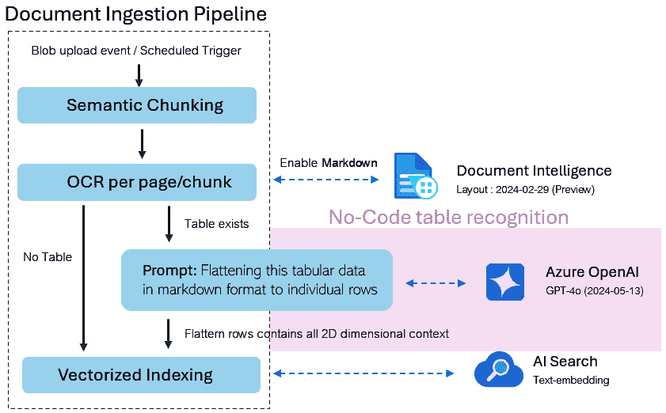

图 10.10 – 文档智能摄取管道（来源：[`github.com/denlai-mshk/nocodetable`](https://github.com/denlai-mshk/nocodetable))

管道由几个组件组成，每个组件执行特定功能，最终实现文档数据的无缝摄取、转换和索引：

1.  **Blob 上传事件/计划触发器**：过程从将文档上传到 Blob 存储或触发摄取管道的计划事件开始。

1.  **语义分块**：文档被分解成更小、语义上有意义的块。这允许更容易地处理文档的各个部分，并从单个部分中提取更准确的数据。

1.  **每页/块 OCR**：OCR 应用于每一页。此步骤用于从扫描图像或文档页面中提取文本。如果在文档中检测到表格，它们将按不同的方式处理（如以下步骤所述）。

1.  **表格检测和扁平化**：当存在表格时，系统利用**无代码表格识别**功能来识别和处理表格。

    提示用于将表格数据*扁平化*为 Markdown 格式中的单独行。这种重构捕捉了表格的二维上下文，使得独立分析每一行数据变得更加容易。

1.  **文档智能**：此组件标记为**布局：2024-02-29（预览**），通过利用文档智能功能增强文档理解。它有助于在不要求代码的情况下识别和提取结构化数据（如表格），并生成 Markdown 输出以实现更好的组织。

1.  **Azure OpenAI (GPT-4)**：Azure OpenAI 的 GPT-4 模型（具体日期为 2024-05-13）用于进一步分析和处理扁平化数据。这可能涉及上下文理解内容、细化数据提取或基于提取的数据增强响应。

1.  **基于向量索引的 AI 搜索**：处理后的数据使用向量嵌入进行索引，以实现基于语义的高效搜索。向量索引允许用户在文档内容上执行复杂的、上下文相关的搜索，这些内容现在以可搜索的格式存储。

让我们回顾一些额外的注意事项：

+   **无代码表格识别**：此功能允许管道识别和处理表格而无需自定义编码，简化了结构化数据的提取。

+   **Markdown 和 2D 上下文**：表格数据被转换为 Markdown 格式，每一行单独处理以保留表格的（2D）关系上下文。

+   **AI 搜索中的文本嵌入**：将处理后的文档数据嵌入到可搜索的格式中，使高级 AI 驱动的搜索功能成为可能，允许用户根据上下文而不是精确关键词检索信息。

此管道利用 Azure 的 OpenAI 和 AI 搜索工具通过 OCR、语义分块、表格识别和向量索引处理文档。结果是强大的文档处理解决方案，能够从多种文档类型中提取结构化信息，以高度上下文化的方式使其可搜索和可访问。

### Azure 文档智能代码示例仓库

Azure 文档智能代码示例仓库提供了使用 Azure AI 文档智能分析文档中的文本和结构化数据的资源，使用机器学习（[`github.com/Azure-Samples/document-intelligence-code-samples`](https://github.com/Azure-Samples/document-intelligence-code-samples)）。此基于云的 Azure 服务使开发智能文档处理解决方案成为可能，以高效地管理和处理大量数据，增强运营、决策和创新。

仓库包含多种语言的代码示例，包括 Python（默认）、.NET、Java 和 JavaScript。默认为最新预览版本（v4.0，2024-02-29-preview），早期版本（v3.1，2023-07-31-GA）也提供。关键部分包括**功能**、**先决条件**、**设置**、**运行示例**和**下一步操作**，提供了一本全面的指南，用于开始使用并探索该服务的功能。

## AI 搜索

实施 RAG 模式的一个关键特性是确保检索到相关且准确的数据，以有效地与 LLM 进行沟通，这依赖于 AI 搜索。随着集成数据分块和嵌入的引入，该过程现在简化了——从数据摄入到检索。让我们进一步探讨细节。

### 集成数据分块和嵌入

Azure AI Search 中的集成数据分块和嵌入简化了从各种来源摄取、处理和索引数据的过程，提供了一个无缝且用户友好的体验。通过自动化数据分块、丰富、向量化和索引等复杂任务，它消除了手动创建和配置索引器、技能集和向量字段等单个组件的需求。凭借其直观的界面，用户可以高效地导航整个工作流程，从数据摄取到使数据可搜索，简化操作并提高效率。以下是基于图表的详细分解：

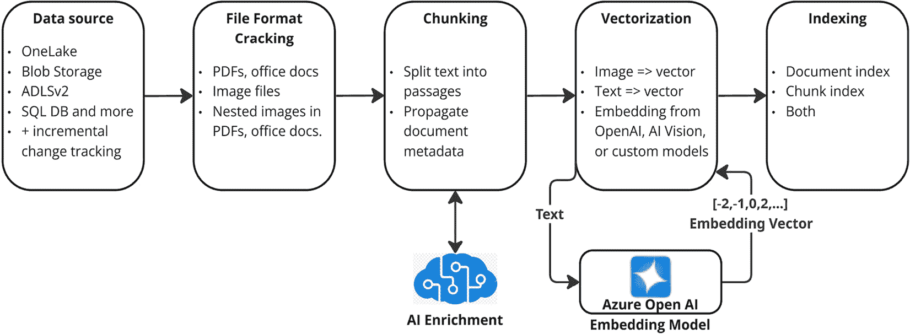

图 10.11 – 集成数据分块和嵌入

让我们看看工作流程：

1.  **数据源集成**：Azure AI Search 从各种来源获取数据，例如 **OneLake**、**Blob Storage**、**ADLSv2** 和 **SQL 数据库**。增量更改跟踪确保始终可用最新内容进行索引。

1.  **文件格式破解**：系统处理各种文件格式，包括 PDF、Office 文档和图像。它甚至处理文档中的嵌套图像，确保所有内容都可用于索引。

1.  使用 `text-embedding-ada-002`、`text-embedding-3-small` 或 `text-embedding-3-large` 生成向量数组

1.  **自定义嵌入技能**，指向 Azure 或其他平台上的外部模型

1.  **Azure AI Vision 技能（预览**），使用多模态 API 从图像和其他内容中提取嵌入

1.  **AML 技能**，链接到 Azure AI Studio 模型目录中选定的模型

1.  **向量化**：文本和图像被转换为嵌入（数值向量），这些向量捕获了内容的语义意义。Azure 支持使用 OpenAI、AI Vision 或自定义模型等工具生成嵌入。这些嵌入用于索引和查询。

1.  **索引**：处理后的数据存储在文档索引、块索引或两者中。这些索引在搜索查询期间能够实现快速和准确的检索。

Azure AI Search 中的集成数据分块和嵌入彻底改变了数据的索引和搜索方式。通过将数据分解成有意义的块并将其转换为语义嵌入，系统提供了更快、更准确且与上下文相关的结果。这种能力非常适合处理大规模、复杂数据集的组织，支持聊天式搜索和混合搜索，效率无与伦比。

集成数据分块和嵌入可以通过两种方法创建：**Azure 门户** 或 **SDK**。本节提供了这两种方法的概述。有关详细指导，请参阅官方文档：[`learn.microsoft.com/en-us/azure/search/vector-search-integrated-vectorization`](https://learn.microsoft.com/en-us/azure/search/vector-search-integrated-vectorization)。

#### 使用 Azure AI 搜索门户

为了简化数据摄取和搜索体验，Azure AI 搜索现在提供了一种简化的方法来设置集成分块和嵌入——直接从 Azure 门户进行。这种低代码方法消除了手动配置复杂组件（如索引器、技能集或向量字段）的需求。相反，它提供了一个引导式体验，让您只需几步点击即可连接到数据源、生成嵌入并索引内容。

要开始，请按照以下步骤从 Azure 门户操作：

1.  **导航到您的 AI 搜索资源**：打开 Azure 门户，选择您在*第七章*的*练习 1：创建 Azure AI 搜索服务*中创建的 AI 搜索资源。

1.  **点击导入和向量化数据**：在您的搜索资源概览页面上，找到并点击**导入和向量化数据**选项，如图下截图所示。

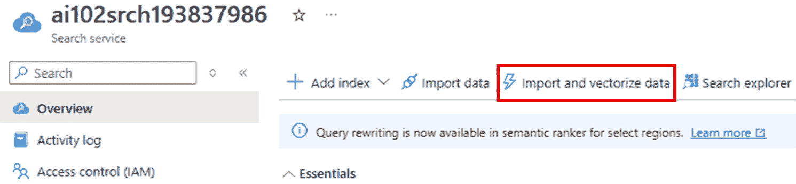

图 10.12 – 导入和向量化数据

1.  **连接到您的数据源**：选择数据源类型——例如 Azure Blob 存储、Azure SQL 或 Azure Data Lake Storage Gen2。系统支持各种结构化和非结构化格式，包括 PDF、Office 文档和图像文件。确保您所选的源包含一些样本或测试文件以继续设置。

1.  **向量化您的文本数据**：从您的 Azure OpenAI 或多服务帐户中选择一个嵌入模型。例如，您可能**选择 text-embedding-ada-002**、**text-embedding-3-small**或**text-embedding-3-large**，具体取决于所需的精度和性能。

1.  **（可选）启用图像向量和 OCR**：如果您的数据包含图像文件，您可以使用 Azure AI Vision（预览）技能启用视觉内容的向量化。您还可以选择从图像中提取文本以进行索引——非常适合扫描文档或基于图像的 PDF 文件。

1.  **启用语义排序**：切换此选项，通过在索引数据上应用语义排序器来提高结果的相关性。这增强了当查询您的搜索索引时，LLM 返回的响应质量。

1.  **安排索引运行**：定义管道应多久刷新一次搜索索引，通过重新摄取数据。选项包括按需、定期安排或变更跟踪以进行增量更新。

✅ 小贴士

此基于门户的工作流程是对于新接触 Azure AI 搜索或希望快速原型化基于 RAG 的应用程序而不编写代码的团队的理想起点。

通过使用此引导设置，您不仅是在索引内容——您还在嵌入向量语义的基础上启用了高级 AI 驱动的检索。这是构建与数据聊天、智能搜索助手以及跨企业数据的上下文问答体验等解决方案的基础。

+   表单顶部

+   表单底部

+   `azure-search-integrated-vectorization-sample.ipynb` Jupyter Notebook 文件位于 `integrated-vectorization/chapter9` 文件夹中。该文件夹将提供使用 Azure 认知搜索实现集成向量和搜索功能的全面指南。它演示了如何使用 Azure OpenAI 和自定义模型索引文档并生成嵌入，从而实现高级搜索类型，如向量搜索、混合搜索和语义混合搜索。

    关键组件包括技能集，如 OCR（用于文本提取）、文本分块和嵌入生成，使用 Azure OpenAI 或自定义模型。这些技能在索引器中配置，以处理来自 Blob 存储等数据源的数据，将内容转换为嵌入并高效地存储在索引中。笔记本探讨了各种搜索方法，包括向量相似度匹配、混合关键字和基于向量的搜索以及语义搜索以增强上下文和相关性。

    实现包括数据准备、元数据保留和索引的架构定义，支持多种查询格式，如纯文本和基于向量的查询。用例包括比较复杂的数据集（例如，保险计划）以及通过混合或语义搜索提取有意义的见解。通过强调高效数据处理、可扩展性和改进的搜索相关性，笔记本成为开发 Azure 认知搜索高级搜索解决方案的有价值资源。

重要提示

如果你还不熟悉在 Visual Studio Code 中运行 Jupyter Notebook 文件，你可以在[`code.visualstudio.com/docs/datascience/jupyter-notebooks`](https://code.visualstudio.com/docs/datascience/jupyter-notebooks)找到详细的说明。

# 摘要

在本章中，我们探讨了人工智能不仅仅是一个理论概念——它已经在多个行业中增强了商业成果。从创建特定领域的共飞行员和聊天机器人，到简化文档处理和用普通英语构建数据库查询，这些模式为组织带来了可衡量的投资回报。

我们还介绍了一系列开源加速器，这些加速器可以加快你的 AI 开发速度——无论是以对话驱动的解决方案（RAG 与 GPT-4o）、呼叫中心的实时分析，还是复杂文档的高级文本提取。

最后，我们探讨了 Azure AI Search 如何通过集成向量嵌入在确保 AI 驱动应用程序的相关性和高质量结果中发挥关键作用。通过利用这些工具，你将处于推出复杂的 AI 解决方案的有利位置，这些解决方案不仅通过考试，而且在现实世界中产生真正的影响。

对于动手学习的你，我鼓励你深入本章中提到的 GitHub 项目。尝试在你的 Azure 订阅中部署它们，调整参数，尝试不同的数据类型，并将你的发现与社区分享。如果你能在这些高级主题上展示出精通，你将作为一个强大的 AI 工程师脱颖而出——准备好应对几乎任何企业级 AI 挑战。

在下一章中，我们将深入探讨考试准备策略，并探讨 45 个模拟考试问题及其详细解释。

# 进一步阅读

要了解更多关于本章涵盖的主题，请查看以下资源：

+   Azure AI 搜索中集成的数据分块和嵌入 [`learn.microsoft.com/en-us/azure/search/vector-search-integrated-vectorization`](https://learn.microsoft.com/en-us/azure/search/vector-search-integrated-vectorization)

+   更多与你的数据解决方案 GitHub 仓库的交流 [`github.com/Azure-Samples/chat-with-your-data-solution-accelerator?tab=readme-ov-file`](https://github.com/Azure-Samples/chat-with-your-data-solution-accelerator?tab=readme-ov-file)

+   文档 AI - 输入、提取、后处理、校正以及异常和欺诈检测 [`github.com/tirtho/DocAI`](https://github.com/tirtho/DocAI)

+   Azure AI 样例中的文档处理 [`github.com/Azure-Samples/azure-ai-document-processing-samples`](https://github.com/Azure-Samples/azure-ai-document-processing-samples)

+   Azure 文档智能代码示例仓库位于 [`github.com/Azure-Samples/document-intelligence-code-samples`](https://github.com/Azure-Samples/document-intelligence-code-samples)

+   PostgreSQL 上的 RAG 在 [`github.com/Azure-Samples/rag-postgres-openai-python/tree/main`](https://github.com/Azure-Samples/rag-postgres-openai-python/tree/main)

+   SQL AI 样例 [`github.com/Azure-Samples/SQL-AI-samples`](https://github.com/Azure-Samples/SQL-AI-samples)

+   Azure AI 搜索高级技能 [`github.com/Azure-Samples/azure-search-power-skills`](https://github.com/Azure-Samples/azure-search-power-skills)

+   向量样本 - Azure AI 搜索 [`github.com/Azure/azure-search-vector-samples`](https://github.com/Azure/azure-search-vector-samples)
