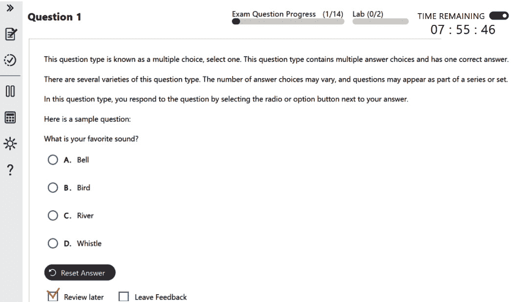
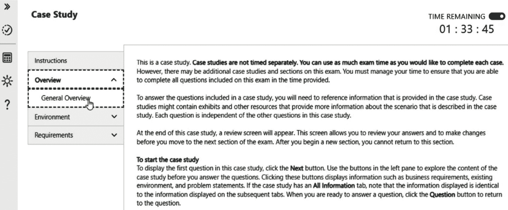

# 第十一章：准备 AI-102 Azure AI 工程师助理认证考试

在本章中，我们将为你提供必要的工具和策略，帮助你自信地应对*AI-102：Azure AI 工程师助理认证*考试。旨在简化你的准备过程，内容集中在考试的框架、关键主题和实际准备技巧上，以确保成功。本章提供了考试主题的分解，并包括一个全面的练习考试，以巩固你的学习。通过完成这个模拟考试，你将能够评估自己是否准备好进行认证。

在本章结束时，你将能够做到以下事项：

+   掌握有效的策略和考试技巧以取得成功

+   理解 AI-102 考试中每个主题的结构和权重

+   通过练习模拟测试来加强你的知识

让我们为迈向 AI-102 认证的最终步骤做好准备！

# 成功的策略和技巧

通过获得 18 项行业认证，我获得了关于在认证考试中取得成功所需条件的宝贵见解。本节将概述对我一直有效的方法和技巧，我相信这将帮助你自信地准备并通过 AI102-*Azure AI 工程师助理认证考试*。

## 通过解释掌握关键概念

要真正掌握材料，回顾每一章的关键概念，并练习像教别人一样解释它们。如果你不能清楚地表达一个主题，请重新阅读相关章节，并深化你的理解。例如，当学习*文档智能解决方案*(*第七章*)时，你可能会说：“AI 文档智能工作室从文档中提取文本、键值对、表格和结构。它提供三种模型：文档分析模型（用于阅读和布局）、预建模型（用于税务或发票表单）和自定义模型（用于独特文档类型）。”

这种迭代方法有助于知识内化，确保它长期留在你身边。作为微软的解决方案架构师，我每天都在使用这种方法。如果你不能向同事或客户清楚地解释一个概念，这通常意味着你需要重新审视并加强你的理解。

## 实践操作

单纯的概念是不够的——你需要获得实践经验。本书每一章提供的练习旨在帮助你应用所学知识，并清晰地理解每个服务的工作方式。通过遵循这些练习，你将获得每个服务功能的实际知识，并学习如何有效地将它们集成到解决方案中。

此外，*第十章* 包含更多高级、现实世界的示例，以进一步提高你的技能。虽然这些练习是可选的，但它们为你提供了一个极好的机会，无论是为考试做准备还是通过考试后扩展你的知识。

这种实用方法确保你获得的知识不仅为考试做好准备，而且适用于现实世界的场景，支持你的认证之旅和职业成长。

## 仔细练习和分析测试问题。

一旦你对概念有了坚实的理解并完成了每一章中提供的所有练习，就可以进行实践测试。完成尽可能多的模拟问题至关重要。然而，仔细分析每个答案同样重要——无论是正确的还是错误的：

+   理解为什么某个答案是正确的。

+   识别为什么某些选项是无效的。利用提供的任何链接和参考资料来加深你对基础主题的理解。这不仅为你准备认证做好准备，也提高了你在现实世界场景中解决问题的技能。如果任何领域仍然不清楚，请回顾相关章节以加强你对材料的掌握。

+   此外，你可能会注意到模拟考试中的一些细节在章节中并没有明确涵盖。然而，提供的*进一步阅读*链接应指导你到必要的信息，并帮助你有效地弥合这些差距。

## 优先考虑权重较高的主题。

在掌握第一章和第二章中涵盖的基础概念之后，关注高权重主题以最大限度地提高你的考试准备。正如*前言*中强调的，从第一章和第二章开始是至关重要的，但你可能考虑接下来深入到*第六章*，因为它占考试 30-35%的比例——使其成为最重要的部分。这种方法是可选的，但它有助于确保你有效地优先考虑。

考试的权重领域的高级概述如下：

+   **规划和管理工作负载的 Azure AI 解决方案**（15-20%）

+   **实施内容审核解决方案**（10-15%）

+   **实施计算机视觉解决方案**（15-20%）

+   **实施自然语言处理（NLP）解决方案**（30-35%）

+   **实施知识挖掘和文档智能解决方案**（10-15%）

+   **实施生成式 AI 解决方案**（10-15%）

通过有策略地针对这些领域，你可以建立信心并确保对所有主题的全面准备。现在，让我们深入了解一些额外的考试技巧。

## 考试技巧

在本节中，你将了解考试的时长、考试中的非计划休息、在考试期间访问 Microsoft Learn、练习评估、考试类型以及其他有用的技巧。

*考试时长*：100 分钟。通常包含 40-60 个问题。

### 非计划休息

你可以在大多数考试中安排休息时间：

+   使用考试界面的**休息**选项来暂停。

重要提示

在你休息期间，考试计时器会继续运行。

+   你可以在休息时间离开摄像头视图（例如，去洗手间），但访问未经授权的材料会导致考试被取消。

+   *一旦你休息，你将无法返回之前查看或* *标记的问题*

+   更多详细信息可以在[`learn.microsoft.com/en-us/credentials/support/exam-duration-exam-experience#unscheduled-breaks-on-exams`](https://learn.microsoft.com/en-us/credentials/support/exam-duration-exam-experience#unscheduled-breaks-on-exams)找到。

### 在考试期间访问 Microsoft Learn 资源

在考试期间，你可以访问 Microsoft Learn：

+   使用它来查找与问题解决相关的问题信息。

+   它可以通过考试界面的分屏访问。*请注意，当你使用 Microsoft Learn 时，计时器将继续运行，所以请明智地使用它*。

+   可用的资源包括 Microsoft Learn 域内的内容，但问答、练习评估和资料是受限的。

+   更多详细信息可以在[`learn.microsoft.com/en-us/credentials/support/exam-duration-exam-experience#accessing-microsoft-learn-during-your-certification-exam`](https://learn.microsoft.com/en-us/credentials/support/exam-duration-exam-experience#accessing-microsoft-learn-during-your-certification-exam)找到。

+   个人来说，我不经常使用这个选项，但如果你在寻找无法回忆起的命令或 API 名称，这可能值得一试。然而，熟悉如何高效地找到答案至关重要，因为时间管理是关键。我建议先过一遍所有问题，为那些你想再次验证的问题标记**查看稍后**框。参考以下图示以获取指导：

图 11.1 – 查看稍后框

这种方法允许你明智地管理时间，同时仍然利用 Microsoft Learn 的资源访问功能。

### 准备和推荐的附加功能

以下三个功能强烈推荐，因为它们最大化了 Microsoft 提供的资源：练习评估、考试沙盒和准备视频。这些工具帮助你熟悉考试格式并完善成功的策略：

+   **练习评估**：在 Microsoft Learn 上提供，这些模拟了问题和难度。要了解更多信息，请访问[`learn.microsoft.com/en-us/credentials/certifications/azure-ai-engineer/practice/assessment?assessment-type=practice&assessmentId=61&practice-assessment-type=certification`](https://learn.microsoft.com/en-us/credentials/certifications/azure-ai-engineer/practice/assessment?assessment-type=practice&assessmentId=61&practice-assessment-type=certification)。

+   **考试沙盒**：在实际考试之前熟悉用户界面和导航方式。您可以在[`aka.ms/examdemo`](https://aka.ms/examdemo)找到它。

+   **AI-102 考试准备视频**：本视频提供了准备考试的建议、技巧和策略。您可以在[`learn.microsoft.com/en-us/shows/exam-readiness-zone/preparing-for-ai-102-plan-and-manage-an-azure-ai-solution`](https://learn.microsoft.com/en-us/shows/exam-readiness-zone/preparing-for-ai-102-plan-and-manage-an-azure-ai-solution)找到它。

现在，让我们熟悉一下考试格式和有效的时间管理。

### 考试中的问题类型

微软提供了一个**考试沙盒**，帮助考生熟悉考试界面和问题类型。这个交互式环境模拟了实际的考试体验，包括介绍屏幕、导航、问题类型（例如，多项选择、拖放、案例研究、实验室）以及关键功能，如标记问题以供回顾和监控时间。我强烈建议您查看[`learn.microsoft.com/en-us/credentials/support/exam-duration-exam-experience#question-types-on-exams`](https://learn.microsoft.com/en-us/credentials/support/exam-duration-exam-experience#question-types-on-exams)上的问题类型。

下图展示了一个示例考试——在这种情况下，是一个案例研究：

图 11.2 – 一个案例研究

熟悉考试格式与时间管理紧密相关，我们将在下一部分进行讲解。

### 时间管理技巧

要在考试中取得成功，您必须通过熟悉格式、明智地管理时间和在压力下保持专注来有效地规划您的策略：

+   **熟悉考试格式**：回顾问题类型（例如，多项选择、案例研究、拖放）以及界面如何工作。我强烈建议使用考试沙盒工具提前练习导航。

+   **先扫描整个考试**：识别您可以快速解决的问题，并标记较难的问题，例如需要访问微软学习资源的问题，这样您可以在稍后回顾它们。

+   **为每个问题分配时间**：从总考试时间中减去 10 分钟用于最终复习，然后将剩余时间除以问题的数量。例如，如果您有 100 分钟的时间回答 45 个问题，每个问题大约分配 1.5 分钟，剩余时间用于复习。

+   **为最终复习留出时间**：在考试结束时留出时间回顾标记的问题，检查错误，并确保所有答案都已提交。始终提交答案——对于错误答案没有惩罚。

+   **保持冷静和专注**：如果您感到紧张，请使用深呼吸技巧保持镇定。从简单的问题开始，以建立信心和动力。

+   **确保您在技术上做好准备**：检查您的互联网连接并创建一个无干扰的环境。提前登录以解决在开始考试前可能出现的任何潜在技术问题。

有效的准备、战略的时间管理以及利用考试沙盒、练习评估和 Microsoft Learn 等资源将帮助您在 AI-102 考试中取得成功。通过熟悉格式并在压力下保持冷静，您将准备好实现您的认证目标。现在，让我们深入实践测试，验证您所学的知识！

# 实践考试

我们包括了 45 个模拟问题，其中一些超出了本书直接涵盖的内容。然而，所有这些问题都得到了每个章节中提供的链接和*进一步阅读*部分的支撑。我们的目标是确保深入覆盖，并允许您回顾和巩固您的理解，为考试做好充分准备。花时间仔细分析每个问题，并使用提供的链接了解为什么您的答案是正确或错误的。专注于掌握基本概念；这些模拟问题是一个极好的复习工具。此外，在考试前创建笔记以供快速参考，并练习在考试期间可访问的 Microsoft Learn 网站上的导航。

提醒

本书中的所有嵌入式 URL 链接都已汇总到 GitHub 上，以便轻松访问，消除了手动输入长 URL 的需要。您可以在[`github.com/PacktPublishing/Designing-and-Implementing-a-Microsoft-Azure-AI-Solution-AI-102-Certification/blob/main/resources.md`](https://github.com/PacktPublishing/Designing-and-Implementing-a-Microsoft-Azure-AI-Solution-AI-102-Certification/blob/main/resources.md)找到它们。

1.  您正在配置 Azure AI Search 中的搜索索引。您希望用户可以按其排序的字段。您应该将该属性分配给哪个字段？

    1.  `可排序的`。

    1.  `可分面的`。

    1.  `可过滤的`。

    1.  `可检索的`。

    `可排序的`。

    此属性允许字段用于排序搜索结果——例如，按价格或评分对产品列表进行排序。

    这里有一些关于错误选项的详细信息：

    +   B. `可分面的`：此属性用于分面导航，而不是排序。

    +   C. `可过滤的`：此属性用于过滤搜索结果，而不是排序它们。

    +   D. `可检索的`：此属性确定字段是否可以返回在搜索结果中。它与排序无关。

    参考文献：

    +   *Azure AI 中的搜索索引*：[`learn.microsoft.com/en-us/azure/search/search-what-is-an-index`](https://learn.microsoft.com/en-us/azure/search/search-what-is-an-index)

    +   *关键字搜索中的过滤器*：[`learn.microsoft.com/en-us/azure/search/search-filters`](https://learn.microsoft.com/en-us/azure/search/search-filters)

1.  您正在配置 Azure AI Search 中的投影以存储归一化的图像文件。您应该使用哪种类型的投影？

    1.  表格

    1.  文件

    1.  对象

    1.  JSON

    **正确答案**：B. 文件。

    当您需要保存归一化、二进制图像文件时使用文件。

    下面是一些关于错误选项的详细信息：

    +   A. **表**：这些用于最佳表示为行和列的数据

    +   C. **对象**：当您需要数据的完整 JSON 表示以及在一个 JSON 文档中的富化时使用

    +   D. **JSON**：这不是存储二进制文件的有效投影类型

    参考：

    +   *投影类型和用法*：[`learn.microsoft.com/en-us/azure/search/knowledge-store-projection-overview#types-of-projections-and-usage`](https://learn.microsoft.com/en-us/azure/search/knowledge-store-projection-overview#types-of-projections-and-usage)

1.  您有一个名为 `App1` 的 Web 应用程序，执行自定义搜索。您需要将此应用程序集成到 Azure AI 搜索解决方案中作为一个自定义技能。您应该使用哪个 `@odata.type`？

    1.  `Microsoft.Skills.Custom.AmlSkill`

    1.  `Microsoft.Skills.Custom.WebApiSkill`

    1.  `Microsoft.Skills.Text.CustomEntityLookupSkill`

    1.  `Microsoft.Skills.Util.ConditionalSkill`

    `Microsoft.Skills.Custom.WebApiSkill`.

    `Microsoft.Skills.Custom.WebApiSkill` 通过对自定义 Web API 进行 HTTP 调用来扩展 AI 富化管道。

    下面是一些关于错误选项的详细信息：

    +   A. `Microsoft.Skills.Custom.AmlSkill`：此技能用于集成 Azure Machine Learning 模型，而不是自定义 Web API

    +   C. `Microsoft.Skills.Text.CustomEntityLookupSkill`：根据提供的文档，此技能不存在

    +   D. `Microsoft.Skills.Util.ConditionalSkill`：此技能用于富化管道中的条件操作，而不是用于自定义 Web API

    参考：

    +   *索引期间的额外处理技能（Azure AI Search）*：[`learn.microsoft.com/en-us/azure/search/cognitive-search-predefined-skills`](https://learn.microsoft.com/en-us/azure/search/cognitive-search-predefined-skills)

1.  您正在配置 Azure 认知搜索中的技能集以丰富您的数据。您希望将富文档作为表投影到 Azure 存储中进行进一步分析。您应该使用哪个组件来实现此目的？

    1.  索引器

    1.  数据源

    1.  知识库

    1.  技能

    **正确答案**：C. 知识库。

    知识库用于将富文档作为表或对象投影到 Azure 存储中。它在技能集中定义，并允许将富数据以结构化格式存储，以便进行进一步分析或下游处理。

    下面是一些关于错误选项的详细信息：

    +   A. **索引器**：索引器负责从数据源拉取数据并将其推送到索引中。它不会将富文档作为表投影到 Azure 存储中。

    +   B. **数据源**：数据源指定了要索引的数据的位置，但不将富文档投影。

    +   D. **技能**：技能是技能集中执行特定富化任务的功能，例如提取实体或翻译文本。它不会将富文档投影到 Azure 存储中。

    参考文献：

    +   Azure AI Search 中的 AI 丰富：[`learn.microsoft.com/en-us/azure/search/cognitive-search-concept-intro`](https://learn.microsoft.com/en-us/azure/search/cognitive-search-concept-intro)

1.  您正在使用 Azure AI Search 开发一个搜索解决方案，并需要在 Azure Blob Storage 中存储的文档内容进行预处理和丰富。具体来说，您希望在丰富过程中从 PDF 文件中提取图像中的文本。您应该使用哪个内置技能？

    1.  `Microsoft.Skills.Text.KeyPhraseExtractionSkill`

    1.  `Microsoft.Skills.Vision.ImageAnalysisSkill`

    1.  `Microsoft.Skills.Util.DocumentExtractionSkill`

    1.  `Microsoft.Skills.Text.OcrSkill`

    `Microsoft.Skills.Util.DocumentExtractionSkill`：此技能用于在丰富管道中提取文件内容，包括从 PDF 文件等文档中提取的图像中的文本。

    下面是一些关于错误选项的详细信息：

    +   A. `Microsoft.Skills.Text.KeyPhraseExtractionSkill`：此技能用于从文本中识别和提取重要术语，但它不提取文档中嵌入的图像中的文本

    +   B. `Microsoft.Skills.Vision.ImageAnalysisSkill`：虽然此技能分析和描述图像内容，但它不是专门用于从文档中提取图像中的文本

    +   D. `Microsoft.Skills.Text.OcrSkill`：OCR 用于识别图像中的印刷和手写文本，但`DocumentExtractionSkill`更适合在 AI 丰富过程中从文档中提取图像中的文本。

    参考文献：

    +   *索引期间额外的处理技能（Azure AI Search）*：[`learn.microsoft.com/en-us/azure/search/cognitive-search-predefined-skills`](https://learn.microsoft.com/en-us/azure/search/cognitive-search-predefined-skills)

1.  您正在使用 Azure Image Analysis API 处理您的应用程序中的图像。您希望通过配置 API 调用并使用适当的特性来从图像中提取特定信息。如果您使用`https://<your-resource-name>.cognitiveservices.azure.com/computervision/imageanalysis:analyze?features=tags,objects`作为请求，它将返回什么结果？

    1.  仅对图像内容的描述

    1.  图像中的可见文本以及图像内容的描述

    1.  与图像内容相关的标签以及图像中检测到的对象，以及它们的近似位置

    1.  对图像内容的描述以及图像中检测到的对象

    (`tags`和`objects`)将返回两种类型的结果：

    +   `cat`、`tree`等

    +   指定了`description`特性，而不是`tags`和`objects`

    +   B. 指定了`read`和`description`特性，而不是`tags`和`objects`

    +   D. 需要指定`description`和`objects`特性，而不是`tags`和`objects`

    参考文献：

    +   *调用 Image Analysis 3.2* *API*：[`learn.microsoft.com/en-us/azure/ai-services/computer-vision/how-to/call-analyze-image?tabs=rest#select-visual-features`](https://learn.microsoft.com/en-us/azure/ai-services/computer-vision/how-to/call-analyze-image?tabs=rest#select-visual-features)

1.  你正在开发一个名为 `App1` 的应用程序，该程序利用 Azure AI Face 服务。该应用程序需要准确检测图像中的面部，即使面部模糊。为了优化应用程序以适应这种场景，你应该采取以下哪些操作？

    1.  将检测模型设置为 `detection_03`

    1.  启用 `enhanceImageQuality` 特性

    1.  将识别模型更改为 `recognition_03`

    1.  将 `faceIdTimeToLive` 参数调整到更高的值

    `detection_03`。

    通过将检测模型设置为 `detection_03`，你正在利用一个能够提高小、侧面和模糊人脸准确性的模型。这是专门为处理包括模糊图像在内的挑战性场景而设计的。

    下面是一些关于错误选项的详细信息：

    +   B. `enhanceImageQuality` 特性专门用于 Azure AI Face 服务中，以提升模糊人脸的检测准确性。

    +   C. `recognition_03` 提升了面部识别能力，但并不直接解决模糊人脸的初始检测问题。检测模型更适合这项任务。

    +   D. `faceIdTimeToLive` 参数控制面部 ID 缓存的时间长度。它对检测模糊人脸的准确性没有影响。

    参考：

    +   *指定人脸检测* *模型*：[`learn.microsoft.com/en-us/azure/ai-services/computer-vision/how-to/specify-detection-model`](https://learn.microsoft.com/en-us/azure/ai-services/computer-vision/how-to/specify-detection-model)

1.  你正在开发一个应用程序，该程序利用 Azure AI Vision 监控视频流并分析人们在物理环境中与物体之间的空间关系和交互。你应该使用 Azure AI Vision 的哪个功能？

    1.  人脸检测

    1.  图像分析

    1.  **光学字符识别**（**OCR**）

    1.  空间分析

    **正确答案**：D. 空间分析。

    空间分析专门设计用于分析实时流媒体视频，以帮助理解人们在物理环境中与物体之间的空间关系、运动和交互。此功能非常适合需要监控视频流中人们存在和行为的情况。

    下面是一些关于错误选项的详细信息：

    +   A. **人脸检测**：此功能用于检测和分析图像或视频帧中的单个面部，但它不提供关于人们与物体之间空间关系或交互的信息。

    +   B. **图像分析**：此功能更为通用，专注于分析静态图像以提取信息，如标签、描述和对象。它不针对分析实时视频流中的空间关系进行优化。

    +   C. **OCR**：OCR 用于从图像和视频中提取文本。它不提供检测视频中人物存在或分析其交互的能力。

    参考：

    +   *什么是 Azure AI 视觉？*：[`learn.microsoft.com/en-us/azure/ai-services/computer-vision/overview`](https://learn.microsoft.com/en-us/azure/ai-services/computer-vision/overview)

1.  您有一个名为`App2`的应用程序，它使用 Azure AI 文档智能处理 TIFF 文件。用户报告称`App2`无法处理某些文件。这些 TIFF 文件大小约为 1 GB，包含多达 1,500 页。这个问题可能的原因是什么？

    1.  文件大小超过了 S0 层的最大允许文件大小

    1.  文件超过了 S0 层允许的最大页数

    1.  文件格式不受支持

    1.  文件图像分辨率不足

    **正确答案**：A. 文件大小超过了 S0 层的最大允许文件大小。

    Azure AI 文档智能的 S0 层可以处理大小高达 500 MB 的文件。由于文件大小约为 1 GB，因此超过了此限制，导致处理失败。

    这里是一些关于错误选项的详细信息：

    +   B. **文件超过了 S0 层允许的最大页数**：S0 层可以处理高达 2,000 页，因此文件中的 1,500 页在可接受范围内

    +   C. **文件格式不受支持**：TIFF 是一种受支持的格式，因此这不可能是问题所在。

    +   D. **文件图像分辨率不足**：已指定最小分辨率要求，但根据提供的数据，文件大小问题是更可能的原因

    参考：

    +   *文档智能发票* *模型*：[`learn.microsoft.com/en-us/azure/ai-services/document-intelligence/prebuilt/invoice?view=doc-intel-3.1.0&viewFallbackFrom=form-recog-3.0.0`](https://learn.microsoft.com/en-us/azure/ai-services/document-intelligence/prebuilt/invoice?view=doc-intel-3.1.0&viewFallbackFrom=form-recog-3.0.0)

1.  您正在开发一个使用 Azure AI 自定义视觉在图像中检测各种类型车辆的移动应用程序。该应用程序必须在没有互联网连接的情况下运行，并在设备上执行实时分类。您应该选择哪个模型领域？

    1.  通用领域

    1.  紧凑领域

    1.  Logo 领域

    1.  商架上的产品领域

    **正确答案**：B. 紧凑领域。

    紧凑领域针对移动设备上实时分类的约束进行了优化，并且可以导出以在无需互联网连接的情况下本地运行。

    这里是一些关于错误选项的详细信息：

    +   A. **通用领域**：此领域未针对边缘设备上的实时分类进行优化，并且不能导出用于离线使用

    +   C. **Logo 领域**：此领域专门优化用于在图像中查找品牌标志，并不设计用于检测各种类型车辆的通用目的

    +   D. **货架上的产品领域**：此领域针对检测和分类货架上的产品进行优化，因此不适用于车辆检测或离线使用

    参考：

    +   *为自定义视觉项目选择一个领域*：[`learn.microsoft.com/en-us/azure/ai-services/custom-vision-service/select-domain`](https://learn.microsoft.com/en-us/azure/ai-services/custom-vision-service/select-domain)

1.  您正在开发一个使用 Azure AI 视频索引器分析网络研讨会记录的应用程序。该应用程序需要识别和提取网络研讨会中提到的特定产品和服务的见解。您应该使用哪种内容模型？

    1.  自定义语言

    1.  自定义品牌

    1.  自定义人物

    1.  自定义主题

    **正确答案**：B. 自定义品牌。

    自定义品牌模型旨在在视频和音频内容的索引过程中从语音和视觉文本中检测和识别特定产品、服务和公司的提及。这使得它适合识别网络研讨会中提到的特定产品和服务。

    这里有一些关于错误选项的详细信息：

    +   A. **自定义语言**：此模型用于添加标准语言模型中不存在的特定单词和短语，这有助于提高转录准确性，但并不直接支持品牌检测

    +   C. **自定义人物**：此模型用于识别和识别视频中的特定人物，不适用于检测产品或服务

    +   D. **自定义主题**：此模型用于提取和分类视频中讨论的不同主题，但不专门检测品牌或产品

    参考：

    +   *在 Azure AI 视频索引器中自定义品牌模型*：[`learn.microsoft.com/en-us/previous-versions/azure/azure-video-indexer/customize-brands-model-how-to?tabs=customizewebportal`](https://learn.microsoft.com/en-us/previous-versions/azure/azure-video-indexer/customize-brands-model-how-to?tabs=customizewebportal)

1.  您正在使用 Azure AI 视频索引器解决方案中的自定义语言内容模型。在测试期间，您上传了一个包含以下句子的文本文件：*Azure AI 视频索引器与其他工具对于视频分析至关重要。* 该句子被丢弃。您需要确保模型保留该句子。您应该怎么做？

    1.  在包含多个段落的文本文件中包含该句子

    1.  从文本文件中移除 *&* 字符

    1.  使用自定义品牌内容模型

    1.  在文本文件中添加更多包含特殊字符的句子

    **正确答案**：B. 从文本文件中移除 *&* 字符。

    在训练过程中，包含特殊字符（如 *&*）的句子会被丢弃。为确保句子被保留，您需要从文本文件中移除此类特殊字符。

    这里有一些关于错误选项的详细信息：

    +   A. **在包含多个段落的文本文件中包含该句子**：在包含多个段落的文本文件中包含该句子并不能解决由特殊字符导致句子被丢弃的问题

    +   C. **使用自定义品牌内容模型**：此模型用于品牌检测，与用于训练语言模型的文本文件中的特殊字符问题无关

    +   D. **在文本文件中添加更多包含特殊字符的句子**：添加更多包含特殊字符的句子并不能解决问题；它只会导致更多句子被丢弃

    参考：

    +   *使用 Azure AI 视频索引器自定义语言模型*：[`learn.microsoft.com/en-us/previous-versions/azure/azure-video-indexer/customize-language-model-how-to?tabs=customizewebportal`](https://learn.microsoft.com/en-us/previous-versions/azure/azure-video-indexer/customize-language-model-how-to?tabs=customizewebportal)

1.  您正在配置 Azure AI 视频索引器解决方案中自定义语言模型的训练阶段。该模型需要从特定词组合的概率中学习，并提高转录准确性。对于训练数据，应遵循哪三种实践？每个正确答案都提供了一个完整的解决方案。

    1.  包含至少 500,000 个句子

    1.  包含多个口语句子的例子

    1.  包含特殊字符，如 *~*, *#*, *@*, *%*, 和 *&*

    1.  提供多种适应选项

    1.  每行只放一个句子

    1.  重复相同的句子多次

    **正确答案**：

    +   B. **包含多个口语句子的例子**：包含多个口语句子的例子有助于模型学习语境和词汇的使用，从而提高转录准确性

    +   D. **提供多种适应选项**：提供多种适应选项有助于模型理解不同的语境和词汇使用的变体，从而增强其学习过程

    +   E. **每行只放一个句子**：每行只放一个句子确保模型学习句子内的概率，而不是跨句子，这对于准确转录至关重要

    这里有一些关于错误选项的详细信息：

    +   A. **包含至少 500,000 个句子**：包含过多的句子，如数十万个，可能会稀释提升效果，并且不建议用于有效训练

    +   C. **包含特殊字符，如 ~, #, @, % 和 &**：特殊字符将被丢弃，包含这些字符的句子也将被丢弃，这使得这种做法是错误的

    +   F. **重复相同的句子多次**：重复相同的句子多次可能会对其他输入产生偏见，应该避免

    参考：

    +   *使用 Azure AI 视频索引器自定义语言模型*：[`learn.microsoft.com/en-us/previous-versions/azure/azure-video-indexer/customize-language-model-how-to?tabs=customizewebportal`](https://learn.microsoft.com/en-us/previous-versions/azure/azure-video-indexer/customize-language-model-how-to?tabs=customizewebportal)

1.  您正在开发一个利用 Azure AI 视频索引器从多语言视频内容中提取洞察的应用程序。为确保转录和语言检测的准确性，您需要正确配置 API 调用。您应使用哪个参数允许 API 检测视频中的多种语言？

    1.  `isAutoDetect`

    1.  `customLanguages`

    1.  `sourceLanguage`

    1.  `multiLanguage`

    `sourceLanguage`。

    要启用 Azure AI 视频索引器 API 在视频中检测多种语言，您应使用 `sourceLanguage` 参数并将其设置为多语言检测。这允许视频索引器 API 自动识别和转录视频内容中的多种语言。

    以下是关于错误选项的一些详细信息：

    +   A. `isAutoDetect`：此参数用于指示是否应启用自动语言检测，但它不具体配置多语言检测

    +   B. `customLanguages`：此参数用于指定用于检测的自定义语言列表，但需要将 `sourceLanguage` 设置为多语言或自动

    +   D. `multiLanguage`：这不是配置 API 以检测多种语言的正确参数名称

    参考：

    +   *获取媒体转录、翻译和语言识别洞察*：[`learn.microsoft.com/en-us/previous-versions/azure/azure-video-indexer/transcription-translation-lid-insight`](https://learn.microsoft.com/en-us/previous-versions/azure/azure-video-indexer/transcription-translation-lid-insight)

1.  您正在配置 Azure AI Search 以支持复杂的搜索场景，包括通配符、模糊和正则表达式搜索。在您的 API 请求中应设置哪种查询类型以利用这些高级搜索功能？

    1.  `"``queryType": "simple"`

    1.  `"``queryType": "full"`

    1.  `"``queryType": "advanced"`

    1.  `"``queryType": "lucene"`

    `"``queryType": "full"`.

    将 `"queryType"` 设置为 `"full"` 启用了 `full` Lucene 查询语法的使用，它支持高级搜索功能，如通配符、模糊和正则表达式搜索。这允许进行比简单查询语言更复杂和强大的搜索查询，简单查询语言在范围上更为有限。

    以下是关于错误选项的一些详细信息：

    +   A. `"queryType": "simple"`：这是错误的，因为 `simple` 查询类型仅支持基本搜索功能，不包括通配符、模糊搜索或正则表达式等高级搜索功能。

    +   C. `"queryType": "advanced"`：这是错误的，因为在 Azure AI Search 中没有名为 `advanced` 的查询类型。支持的查询类型是 `simple` 和 `full`。

    +   D. `"queryType": "lucene"`：这是错误的，因为 `lucene` 不是一个有效的查询类型参数。启用 Lucene 查询语法的正确参数是 `"``queryType": "full"`。

    参考：

    +   *Azure AI 搜索中的全文搜索* *模型*：[`learn.microsoft.com/en-us/azure/search/search-lucene-query-architecture`](https://learn.microsoft.com/en-us/azure/search/search-lucene-query-architecture)

1.  您的任务是使用 Azure AI 文档智能预构建读取模型从各种文档格式中提取数据。以下哪些文件格式由该模型支持？选择所有适用的选项。

    1.  JPEG

    1.  XML

    1.  PowerPoint

    1.  HEIF

    **正确答案**：

    +   A. **JPEG**：预构建读取模型支持从 JPEG 图像中提取数据，因为它是一种受支持的图像格式。

    +   C. **PowerPoint**：预构建读取模型支持从 Microsoft PowerPoint (PPTX) 文件中提取数据

    +   D. **HEIF**：预构建读取模型支持从 HEIF 图像中提取数据，使其成为一种受支持的图像格式

    这里有一些关于错误选项的详细信息：

    +   B. **XML**：XML 未列为预构建读取模型支持的文件格式

    参考：

    +   *文档智能读取* *模型*：[`learn.microsoft.com/en-us/azure/ai-services/document-intelligence/prebuilt/read?view=doc-intel-3.1.0&viewFallbackFrom=form-recog-3.0.0&tabs=sample-code`](https://learn.microsoft.com/en-us/azure/ai-services/document-intelligence/prebuilt/read?view=doc-intel-3.1.0&viewFallbackFrom=form-recog-3.0.0&tabs=sample-code)

1.  您正在开发一个使用 Azure AI 语言服务分析文档并擦除敏感信息的应用程序。您需要配置**个人身份信息**（**PII**）检测功能以从文档中删除电子邮件地址和电话号码。您应该在请求中指定哪些类别？

    1.  **联系**和**地址**

    1.  **电子邮件**和**电话号码**

    1.  **电子邮件**、**电话号码**和**组织**

    1.  **人员**、**地址**和**电话号码**

    **正确答案**：B. **电子邮件**和**电话号码**。

    要特别删除电子邮件地址和电话号码，您应该在请求中指定**电子邮件**和**电话号码**类别。这些类别针对您想要擦除的确切类型的信息。

    这里有一些关于错误选项的详细信息：

    +   A. **联系和地址**：虽然**联系**可能暗示通信信息，但它不是一个认可的类别。**地址**类别会移除物理地址信息，而不是电子邮件地址和电话号码。

    +   C. **电子邮件、电话号码和组织**：虽然**电子邮件**和**电话号码**是正确的，但对于您要删除电子邮件地址和电话号码的具体要求来说，**组织**是不必要的。

    +   D. **人员、地址和电话号码**：**人员**和**地址**类别分别会移除姓名和物理地址。**电话号码**是正确的，但其他两个类别对于您的具体要求来说不是必需的。

    参考：

    +   *支持的 PII 实体类别*：[`learn.microsoft.com/en-us/azure/ai-services/language-service/personally-identifiable-information/concepts/entity-categories`](https://learn.microsoft.com/en-us/azure/ai-services/language-service/personally-identifiable-information/concepts/entity-categories)

1.  你正在开发一个使用 Azure AI 语言情感分析的反馈分析应用。你有一个名为`Feedback.docx`的测试文档，其中包含一个负面句子和几个正面句子。应用将为`Feedback.docx`返回哪种情感标签？

    1.  `混合`

    1.  `负面`

    1.  `中立`

    1.  `正面`

    `混合`

    如果文档中至少有一个负面句子和一个正面句子，整个文档的情感标签将是`混合`。

    这里有一些关于错误选项的详细信息：

    +   B. `负面`：如果文档中至少有一个负面句子且其余句子都是中立的，则将返回`负面`标签，但由于也存在正面句子，标签将是`混合`。

    +   C. `中立`：如果文档中的所有句子都是中立的，则将返回`中立`标签。由于既有正面句子也有负面句子，标签将是`混合`。

    +   D. `正面`：如果文档中至少有一个正面句子且其余句子都是中立的，则将返回`正面`标签。由于存在负面句子，标签将是`混合`。

    参考：

    +   *如何使用情感分析和意见挖掘*：[`learn.microsoft.com/en-us/azure/ai-services/language-service/sentiment-opinion-mining/how-to/call-api`](https://learn.microsoft.com/en-us/azure/ai-services/language-service/sentiment-opinion-mining/how-to/call-api)

1.  你正在创建一个需要通过识别最重要句子来生成文本文档摘要的应用。你应该使用哪个 Azure AI 语言功能？

    1.  关键短语提取

    1.  语言摘要

    1.  **命名实体识别**（NER）

    1.  PII 检测

    **正确答案**：B. 语言摘要。

    语言摘要提取代表原始内容中最重要或相关信息的句子，使其成为生成摘要的合适选择。

    这里有一些关于错误选项的详细信息：

    +   A. **关键短语提取**：关键短语提取识别文本中的主要概念，但不会提供最重要句子的总结

    +   C. **命名实体识别**（NER）：NER 识别和分类文本中的命名实体，例如人名、组织名和地点名，但它不会总结文本

    +   D. **PII 检测**：PII 检测从文本中识别并删除敏感信息，例如姓名、地址和电话号码，但它不会总结文本

    参考：

    +   *什么是* *摘要*？*：[`learn.microsoft.com/en-us/azure/ai-services/language-service/summarization/overview?tabs=text-summarization`](https://learn.microsoft.com/en-us/azure/ai-services/language-service/summarization/overview?tabs=text-summarization)

1.  您正在配置 Azure OpenAI 服务资源，并需要确保只有您 Azure 订阅内的特定虚拟网络可以访问它。您应该配置哪种网络安全设置？

    1.  所有网络

    1.  所有网络，并配置网络安全组以控制流量

    1.  禁用，并允许建立私有端点连接以建立访问

    1.  选择网络

    **正确答案**：D. 选择网络。

    此设置允许您指定哪些虚拟网络被允许访问您的 Azure AI 服务资源。通过配置此选项，您可以限制访问仅限于您明确允许的 Azure 订阅内的网络。

    这里有一些关于错误选项的详细信息：

    +   A. **所有网络**：允许从任何网络访问，包括互联网，这并不限制对订阅内特定网络的访问

    +   B. **所有网络，并配置网络安全组以控制流量**：虽然这可以帮助控制流量，但它本身并不限制对订阅内特定虚拟网络的访问

    +   C. **禁用，并允许建立私有端点连接以建立访问**：此设置禁用了所有网络访问，并要求使用私有端点，如果您只想限制对订阅内特定虚拟网络的访问，则此设置比所需更为严格

    参考：

    +   *配置 Azure AI 服务虚拟* *网络*：[`learn.microsoft.com/en-us/azure/ai-services/cognitive-services-virtual-networks?tabs=portal`](https://learn.microsoft.com/en-us/azure/ai-services/cognitive-services-virtual-networks?tabs=portal)

1.  您在 Azure OpenAI 服务中部署了一个 GPT-35-Turbo 模型，并禁用了自动更新。一段时间后，您发现您的应用程序正在使用模型的新版本，而无需手动干预。什么可能导致这次更新？

    1.  模型版本因新功能发布而自动更新

    1.  模型版本已更新，因为前一个版本存在一个关键错误

    1.  模型版本已退役，触发自动升级到当前默认版本

    1.  模型版本作为常规维护计划的一部分进行了更新

    **正确答案**：C. 模型版本已退役，触发自动升级到当前默认版本。

    当选择特定模型版本进行部署并禁用自动更新时，该模型将保留该版本，直到达到其退休日期。达到退休日期后，模型将自动升级到当前默认版本，以确保持续的功能性。

    这里有一些关于错误选项的详细信息：

    +   A. **模型版本由于新功能发布而自动更新**：这是不正确的，因为自动更新已禁用，更新仅在退休时发生

    +   B. **模型版本更新是因为之前的版本有一个关键错误**：虽然关键错误可以促使更新，但这种情况特别由退休日期管理

    +   D. **模型版本作为常规维护计划的一部分进行了更新**：这是不正确的；更新是基于退休日期而不是常规维护

    参考：

    +   *使用 Azure OpenAI 模型*：[`learn.microsoft.com/en-us/azure/ai-services/openai/how-to/working-with-models?tabs=powershell`](https://learn.microsoft.com/en-us/azure/ai-services/openai/how-to/working-with-models?tabs=powershell)

1.  你正在开发一个网页应用程序，使用 Azure OpenAI 服务中的 DALL-E 3 模型生成图像。为了确保对 Azure OpenAI API 的 HTTP 请求配置正确，你的请求中必须包含哪三个 URI 参数？

    1.  `endpoint`

    1.  `deployment-id`

    1.  `api-version`

    1.  `user`

    `endpoint`：指定 Azure OpenAI 端点的 URL，包括资源名称

1.  B. `deployment-id`：DALL-E 3 模型部署的唯一标识符

1.  C. `api-version`：指示请求中使用的 API 版本

这里有一些关于错误选项的详细信息

+   D. `user`：`user` 参数对于配置对 Azure OpenAI API 的 HTTP 请求不是必需的

参考：

+   *URI* *参数*：[`learn.microsoft.com/en-us/azure/ai-services/openai/reference#uri-parameters`](https://learn.microsoft.com/en-us/azure/ai-services/openai/reference#uri-parameters)

1.  你正在构建一个网页应用程序，用于审核用户生成的内容，以确保其不包含有害材料。该应用程序将使用 Azure AI 服务。你需要确保模型能够检测不适当的内容。你应该部署哪些额外的 Azure 服务？请只选择一个答案。

    1.  Azure AI 搜索

    1.  Azure AI 内容安全

    1.  语言

    1.  Azure 内容审核器

    **正确答案**：D. Azure 内容审核器。

    Azure 内容审核器是一个旨在检测和过滤文本、图像和视频中的不适当内容的服务的。它提供诸如粗话过滤、图像审核和可定制的术语列表等功能，使其适用于需要内容审核以确保安全和适当性的应用程序。

    这里有一些关于错误选项的详细信息：

    +   A. **Azure AI 搜索**：此服务用于搜索和索引，而不是内容审核

    +   B. **Azure AI 内容安全**：尽管这项服务也提供内容审核，但问题具体询问的是传统的内容审核器服务

    +   C. **语言**：此服务专注于语言理解和处理，而不是内容审核

    参考：

    +   *什么是 Azure AI 内容* *安全性？*：[`learn.microsoft.com/en-us/azure/ai-services/content-safety/overview`](https://learn.microsoft.com/en-us/azure/ai-services/content-safety/overview)

1.  您正在使用 Azure OpenAI 服务为您的组织设计一个基于 GPT 的聊天助手。您希望确保您的数据被正确摄取和支持。您可以将哪些文件类型上传以将模型与您的企业数据固定？

    1.  XML

    1.  DOCX

    1.  PPTX

    1.  ZIP

    **正确答案**：

    +   B. **DOCX**：Microsoft Word 文件（DOCX）支持在 Azure OpenAI 中使用您的数据固定模型。

    +   C. **PPTX**：Microsoft PowerPoint 文件（PPTX）也支持此目的。

    以下是关于错误选项的详细信息：

    +   A. **XML**：XML 文件不支持在 Azure OpenAI 中用于将模型固定。

    +   D. **ZIP**：ZIP 文件也不受支持。

    参考：

    +   *数据格式和文件* *类型*：[`learn.microsoft.com/en-us/azure/ai-services/openai/concepts/use-your-data?tabs=ai-search%2Ccopilot#data-formats-and-file-types`](https://learn.microsoft.com/en-us/azure/ai-services/openai/concepts/use-your-data?tabs=ai-search%2Ccopilot#data-formats-and-file-types)

1.  您正在配置 Azure OpenAI 资源以确保仅使用您公司数据中最相关的文档生成回复。您需要调整哪个参数来提高文档过滤的相关性阈值？

    1.  `Temperature`

    1.  `TopNDocuments`

    1.  `Strictness`

    1.  `System Message`

    `Strictness`。

    `Strictness` 参数控制系统根据用户查询的相似度分数过滤掉不太相关的文档的积极性。增加 `Strictness` 的值意味着系统将应用更高的相似度阈值，过滤掉更多被认为不太相关的文档，从而提高响应的准确性。

    以下是关于错误选项的详细信息：

    +   A. `Temperature`：这控制着模型回复的随机性，与文档过滤无关。

    +   B. `TopNDocuments`：指定在响应生成中包含的得分最高的文档数量，但不控制相关性阈值。

    +   D. `System Message`：用于自定义模型的回复，但不影响文档过滤。

    参考：

    +   *运行时* *参数*：[`learn.microsoft.com/en-us/azure/ai-services/openai/concepts/use-your-data?tabs=ai-search%2Ccopilot#runtime-parameters`](https://learn.microsoft.com/en-us/azure/ai-services/openai/concepts/use-your-data?tabs=ai-search%2Ccopilot#runtime-parameters)

1.  您正在使用 Azure OpenAI 服务开发一个客户支持聊天机器人。在测试过程中，您希望确保聊天机器人提供准确且相关的回复。以下哪些提示工程策略应该使用？选择所有适用的选项。

    1.  使用上下文具体性

    1.  保持模糊

    1.  包含示例

    1.  使用随机提示

    **正确答案**：

    +   A. **使用上下文特异性**：在提示中添加特定上下文有助于模型更好地理解场景，从而产生更准确和相关的响应

    +   C. **包含示例**：提供期望输出的示例可以引导模型产生类似的响应，从而提高其答案的准确性和相关性

    下面是一些关于错误选项的详细信息：

    +   B. **模糊不清**：模糊的提示可能导致模糊和不准确的响应，这在提示工程中是不推荐的

    +   D. **使用随机提示**：随机提示不提供模型清晰的方向或上下文，可能导致不一致和不相关的输出

    参考：

    +   *提示工程* *技术*：[`learn.microsoft.com/en-us/azure/ai-services/openai/concepts/prompt-engineering?tabs=chat`](https://learn.microsoft.com/en-us/azure/ai-services/openai/concepts/prompt-engineering?tabs=chat)

1.  你正在设置一个新的 Azure Cognitive Search 索引。以下哪个序列正确地表示了索引过程中的阶段顺序？

    1.  字段映射，输出字段映射，技能集执行，推入索引

    1.  文档破解，字段映射，技能集执行，推入索引

    1.  文档破解，技能集执行，字段映射，推入索引

    1.  字段映射，文档破解，技能集执行，推入索引

    **正确答案**：B. 文档破解，字段映射，技能集执行，推入索引。

    Azure Cognitive Search 索引过程中的正确阶段顺序如下：

    1.  **文档破解**：这是第一阶段，涉及打开文件并提取内容。

    1.  **字段映射**：下一步涉及将提取的内容映射到索引模式中定义的字段。

    1.  **技能集执行**：认知技能被应用于丰富提取的数据。

    1.  **推入索引**：最后，丰富和结构化的数据被推入搜索索引。

    下面是一些关于错误选项的详细信息：

    +   A. **字段映射，输出字段映射，技能集执行，推入索引**：这个顺序是错误的，因为它以字段映射开始而不是文档破解，并且包含一个不必要的阶段（输出字段映射）

    +   C. **文档破解，技能集执行，字段映射，推入索引**：这个顺序错误地将技能集执行放在了字段映射之前

    +   D. **字段映射，文档破解，技能集执行，推入索引**：这个顺序错误地将字段映射放在了文档破解之前

    参考：

    +   *索引阶段*：[`learn.microsoft.com/en-us/azure/search/search-indexer-overview#stages-of-indexing`](https://learn.microsoft.com/en-us/azure/search/search-indexer-overview#stages-of-indexing)

1.  你正在配置 Azure AI Search 中的技能集，并希望为将技能集输出投影到 Azure Storage 添加可选设置。你应该将哪个部分添加到你的技能集定义中？

    1.  `技能`

    1.  `认知服务`

    1.  `知识库`

    1.  `加密密钥`

    `知识库`。

    此可选部分指定了一个 Azure 存储账户以及将技能集输出投影到 Azure 存储中的表、blob 和文件的设置。

    下面是一些关于错误选项的详细信息：

    +   A. `skills`：此部分是必需的，并指定了要执行的一组技能

    +   B. `cognitiveServices`：此可选部分用于调用 Azure 认知服务 API 的可计费技能

    +   D. `encryptionKey`：此可选部分指定了 Azure Key Vault 位置和用于在技能集定义中加密敏感内容的客户管理的密钥

    参考：

    +   *添加技能集* *定义*：[`learn.microsoft.com/en-us/azure/search/cognitive-search-defining-skillset#add-a-skillset-definition`](https://learn.microsoft.com/en-us/azure/search/cognitive-search-defining-skillset#add-a-skillset-definition)

1.  你正在配置一个 Azure AI 搜索解决方案，并需要在未来的技能集执行中持久化富集数据以供重用。你应该创建什么？

    1.  知识库

    1.  可搜索索引

    1.  可搜索存储

    1.  一个富集缓存

    **正确答案**：D. 一个富集缓存。

    这用于在后续的技能集执行中缓存富集内容以供重用。缓存存储了导入的未处理内容（破损的文档）以及在技能集执行期间创建的富集文档，这有助于避免重新处理图像文件或其他数据密集型操作的时间和费用。

    下面是一些关于错误选项的详细信息：

    +   A. **知识库**：虽然对下游应用如知识挖掘或数据科学很有用，但它并非专门设计用于在未来的技能集执行中缓存数据以供重用

    +   B. **可搜索索引**：这用于全文搜索和其他查询形式，并不服务于缓存富集的目的

    +   C. **可搜索存储**：此选项不是 Azure AI 搜索解决方案中的相关术语或已识别的结构

    参考：

    +   *Azure AI 搜索中的增量富集和缓存*：[`learn.microsoft.com/en-us/azure/search/cognitive-search-incremental-indexing-conceptual`](https://learn.microsoft.com/en-us/azure/search/cognitive-search-incremental-indexing-conceptual)

1.  你正在设计一个 Azure AI 搜索索引，以从你的数据中识别和提取个人信息。你应该使用哪个技能来实现这一点？

    1.  `Microsoft.Skills.Text.KeyPhraseExtractionSkill`

    1.  `Microsoft.Skills.Text.PIIDetectionSkill`

    1.  `Microsoft.Skills.Text.V3.EntityRecognitionSkill`

    1.  `Microsoft.Skills.Text.TranslationSkill`

    `Microsoft.Skills.Text.PIIDetectionSkill`.

    此技能专门设计用于从文本中提取个人信息，并且它还提供了在文本中屏蔽检测到的个人信息实体的选项。

    下面是一些关于错误选项的详细信息：

    +   A. `Microsoft.Skills.Text.KeyPhraseExtractionSkill`：此技能根据术语位置和其他语言特征检测重要短语，但并不专注于个人信息

    +   C. `Microsoft.Skills.Text.V3.EntityRecognitionSkill`: 此技能识别文本中的实体，但并不专门针对个人信息

    +   D. `Microsoft.Skills.Text.TranslationSkill`: 此技能将文本翻译成不同语言，但不处理识别个人信息

    参考：

    +   *索引期间额外处理的技能（Azure AI Search）*: [`learn.microsoft.com/en-us/azure/search/cognitive-search-predefined-skills`](https://learn.microsoft.com/en-us/azure/search/cognitive-search-predefined-skills)

1.  您正在配置一个 Azure AI Search 索引，需要将多个字段中的文本合并到一个可搜索的字段中。您应该使用哪个内置技能？

    1.  `Microsoft.Skills.Text.KeyPhraseExtractionSkill`

    1.  `Microsoft.Skills.Util.DocumentExtractionSkill`

    1.  `Microsoft.Skills.Text.SplitSkill`

    1.  `Microsoft.Skills.Text.MergeSkill`

    `Microsoft.Skills.Text.MergeSkill`.

    此技能将来自一系列字段的文本合并到一个字段中，使得作为统一实体进行搜索和处理内容变得更加容易。

    这里有一些关于错误选项的详细信息：

    +   A. `Microsoft.Skills.Text.KeyPhraseExtractionSkill`: 从文本中提取关键短语，但不合并字段

    +   B. `Microsoft.Skills.Util.DocumentExtractionSkill`: 在丰富管道中从文件中提取内容，但不合并字段

    +   C. `Microsoft.Skills.Text.SplitSkill`: 将文本拆分为页面以进行增量丰富，但不合并字段

    参考：

    +   *索引期间额外处理的技能（Azure AI Search）*: [`learn.microsoft.com/en-us/azure/search/cognitive-search-predefined-skills`](https://learn.microsoft.com/en-us/azure/search/cognitive-search-predefined-skills)

1.  您正在配置一个 Azure AI Search 索引器以从文档中的图像中提取和分析颜色。您将使用哪个 Azure AI Search 功能来提取颜色信息？

    1.  OCR

    1.  图像分析

    1.  Custom Vision

    1.  Facetable

    **正确答案**: B. 图像分析。

    Azure AI Search 中的此功能允许从图像中提取视觉特征，包括颜色信息。

    这里有一些关于错误选项的详细信息：

    +   A. **OCR**: 这用于光学字符识别，从图像中提取文本，而不是颜色信息

    +   C. **Custom Vision**: 此服务用于创建自定义图像分类模型，而不是专门用于提取颜色信息

    +   D. **Facetable**: 此属性用于在搜索结果中启用分面导航，而不是用于图像分析

    参考：

    +   *分析图像*: [`learn.microsoft.com/en-us/azure/ai-services/computer-vision/overview-image-analysis?tabs=4-0#analyze-image`](https://learn.microsoft.com/en-us/azure/ai-services/computer-vision/overview-image-analysis?tabs=4-0#analyze-image)

1.  您正在开发一个安全应用程序，使用 Azure AI Vision 实时视频流监控和理解人与物体之间的空间关系。您应该使用哪个功能来实现这一点？

    1.  人脸检测

    1.  图像分析

    1.  OCR

    1.  空间分析

    **正确答案**：D. 空间分析。

    Azure AI 视觉中的空间分析旨在理解人们、他们的运动以及与物理环境中物体的交互在实时视频流中的空间关系。这个功能专门针对分析视频流中人们的存在和运动，因此是给定场景的合适选择。

    下面是一些关于错误选项的详细信息：

    +   A. **人脸检测**：这个功能在媒体文件中检测和识别人脸，但不提供关于人与人或人与物体之间空间关系或交互的信息

    +   B. **图像分析**：这个功能在图像中识别和分类视觉对象和动作，但不专注于视频流中的实时空间关系

    +   C. **OCR**：这个功能从图像和视频中提取文本，如街牌或产品标签，但不分析人们的存在或运动

    参考：

    +   *什么是 Azure AI 视觉？*：[`learn.microsoft.com/en-us/azure/ai-services/computer-vision/overview`](https://learn.microsoft.com/en-us/azure/ai-services/computer-vision/overview)

1.  你正在开发一个应用程序，使用 Azure AI 视频索引器来检测上传视频中场景变化发生的时间。你应该使用哪个 API 功能？

    1.  关键帧提取

    1.  场景分割

    1.  目标检测

    1.  音频事件检测

    **正确答案**：B. 场景分割。

    场景分割根据视觉线索确定视频中的场景何时发生变化。一个场景描述一个单一事件，由一系列语义相关的连续镜头组成。

    下面是一些关于错误选项的详细信息：

    +   A. **关键帧提取**：这个功能识别视频中的稳定关键帧，但不专注于场景变化

    +   C. **目标检测**：这个功能识别视频中的视觉对象和动作，但不确定场景变化

    +   D. **音频事件检测**：这个功能与检测特定音频事件相关，而不是视觉场景变化

    参考：

    +   *Azure AI 视频索引器* 概述：[`learn.microsoft.com/en-us/azure/azure-video-indexer/video-indexer-overview`](https://learn.microsoft.com/en-us/azure/azure-video-indexer/video-indexer-overview)

1.  你正在开发一个应用程序，利用 Azure AI 视频索引器来识别营销视频中的特定产品和标志。你应该为此任务配置哪个自定义模型？

    1.  自定义品牌

    1.  自定义人物

    1.  自定义语言

    1.  自定义板

    **正确答案**：A. 自定义品牌。

    这个模型专门设计用于从视频中的语音和视觉内容中检测品牌，因此适合识别产品和标志。

    下面是一些关于错误选项的详细信息：

    +   B. **自定义人物**：这个模型用于识别视频中的特定个人，而不是产品或标志

    +   C. **自定义语言**: 此模型用于添加不在标准语言模型中的单词，但并不帮助识别品牌或标志

    +   D. **自定义滑板**: 此模型用于检测滑板和带有色条的数字图案，与品牌检测无关

    参考：

    +   *在 Azure AI Video Indexer 中自定义品牌模型*: [`learn.microsoft.com/en-us/azure/azure-video-indexer/customize-brands-model-how-to?tabs=customizewebportal`](https://learn.microsoft.com/en-us/azure/azure-video-indexer/customize-brands-model-how-to?tabs=customizewebportal)

1.  你正在使用 Azure AI 服务为医疗转录服务开发自定义语音模型。在测试过程中，你注意到由于许多插入错误而导致高**词错误率**（WER）。你应该专注于收集哪种类型的音频数据以提高模型的准确性？

    1.  具有自定义医疗术语的音频录音

    1.  语音清晰度高的音频录音

    1.  无背景噪音的音频录音

    1.  具有多个说话人的音频录音

    **正确答案**: C. 无背景噪音的音频录音。

    当音频在嘈杂环境中录制或存在串扰时，插入错误经常发生。收集无背景噪音的音频数据可以通过确保模型专注于目标语音而不是杂音来帮助减少这些错误。

    以下是关于错误选项的一些详细信息：

    +   A. **具有自定义医疗术语的音频录音**: 虽然这有助于替换错误，但并未直接解决由背景噪音引起的插入错误

    +   B. **语音清晰度高的音频录音**: 清晰的发音有助于整体准确性，但并不专门针对减少由背景噪音引起的插入错误

    +   D. **具有多个说话人的音频录音**: 这有助于理解对话上下文，但并未解决由背景噪音导致的插入错误问题

    参考：

    +   *自定义语音模型的测试精度*: [`learn.microsoft.com/en-us/azure/ai-services/speech-service/how-to-custom-speech-evaluate-data?pivots=speech-studio`](https://learn.microsoft.com/en-us/azure/ai-services/speech-service/how-to-custom-speech-evaluate-data?pivots=speech-studio)

1.  你正在开发一个应用，该应用将转录会议录音并在对话中区分不同的说话人。你应该使用哪个功能来实现这一点？

    1.  语音转文本转换

    1.  文本依赖验证

    1.  文本无关验证

    1.  说话人识别

    **正确答案**: D. 说话人识别。

    此功能专门设计用于在注册的说话人群体中确定未知说话人的身份。它有助于将语音归因于个别说话人，这对于区分会议录音中的不同参与者至关重要。

    以下是关于错误选项的一些详细信息：

    +   A. **语音转文本转换**：将口语转换为文本，但不会识别个别说话人

    +   B. **基于文本的验证**：基于特定的口令来验证说话人的身份，但不适合区分录音中的多个说话人

    +   C. **文本无关的验证**：无需特定的口令即可验证说话人的身份，但与基于文本的验证类似，它也无法区分多个说话人

    参考：

    +   *什么是说话人识别？*：[`learn.microsoft.com/en-us/azure/ai-services/speech-service/speaker-recognition-overview`](https://learn.microsoft.com/en-us/azure/ai-services/speech-service/speaker-recognition-overview)

1.  你正在设计一个必须以高精度识别特定用户命令的语音控制应用。在哪种场景下你应该考虑在 Azure AI 语音服务中使用模式匹配而不是**会话语言理解（CLU**）？

    1.  当你需要根据用户说的确切短语来识别意图时

    1.  当你想要利用预训练的机器学习模型

    1.  当你需要处理大量的自然语言变体时

    1.  当你需要使用预构建的实体进行意图识别时

    **正确答案**：A. 当你需要根据用户说的确切短语来识别意图时。

    当你需要根据用户说的确切短语来识别意图时，应使用模式匹配。这种方法更为激进和精确，适用于命令的具体措辞很重要的场景。

    这里有一些关于错误选项的详细信息：

    +   B. **当你想要利用预训练的机器学习模型**：这在模式匹配中是不正确的，因为模式匹配不使用机器学习模型，而是使用预定义的模式

    +   C. **当你需要处理大量的自然语言变体时**：这更适合使用 CLU，因为它可以处理自然语言的变体

    +   D. **当你需要使用预构建的实体进行意图识别时**：预构建的实体是 CLU 的一个功能，而不是模式匹配

    参考：

    +   *如何使用自定义实体模式匹配来识别意图*：[`learn.microsoft.com/en-us/azure/ai-services/speech-service/how-to-use-custom-entity-pattern-matching?tabs=jre%2Cwindows%2Cubuntu%2Cmaven&pivots=programming-language-csharp`](https://learn.microsoft.com/en-us/azure/ai-services/speech-service/how-to-use-custom-entity-pattern-matching?tabs=jre%2Cwindows%2Cubuntu%2Cmaven&pivots=programming-language-csharp)

1.  你正在开发一个必须保留原始格式和结构的文档翻译应用。Azure AI 翻译服务的哪个功能允许你实现这一点？

    1.  文本翻译

    1.  自定义翻译器

    1.  文档翻译

    1.  实时翻译

    **正确答案**：C. 文档翻译。

    文档翻译允许你在保留原始格式和结构的同时翻译文档。此功能支持对多个文档的异步批量翻译和对单个文件的同步翻译。

    这里有一些关于错误选项的详细信息：

    +   A. **文本翻译**：这用于实时翻译文本，但不保留文档格式和结构。

    +   B. **自定义翻译器**：这允许为特定领域构建定制的翻译模型，但与文档格式保留无直接关系。

    +   D. **实时翻译**：这个术语在 Azure AI 翻译器的文档中并未明确提及，很可能是指文本翻译，它不保留文档格式和结构。

    参考：

    +   *什么是文档翻译？*：[`learn.microsoft.com/en-us/azure/ai-services/translator/document-translation/overview`](https://learn.microsoft.com/en-us/azure/ai-services/translator/document-translation/overview)

1.  你正在为多语言 CLU 项目配置编排工作流。为确保编排工作流的语言支持，你应该采取以下哪些步骤？

    1.  在同一个项目中启用多语言选项。

    1.  为每种语言创建单独的编排工作流项目。

    1.  使用单个编排工作流项目并设置多种语言。

    1.  训练一个模型来处理多种语言。

    **正确答案**：B. 为每种语言创建单独的编排工作流项目。

    Azure 中的编排工作流项目不支持多语言选项，这意味着每种语言必须由一个单独的项目处理，以确保适当的语言支持。这种方法通过在独立的项目中明确分离语言特定的配置和模型，从而最小化了管理工作量。

    这里有一些关于错误选项的详细信息：

    +   A. **在同一个项目中启用多语言选项**：编排工作流项目不支持多语言选项。每个项目只能处理一种语言。

    +   C. **使用单个编排工作流项目并设置多种语言**：由于编排工作流项目不支持在同一项目中使用多种语言，这不会起作用。

    +   D. **训练一个模型来处理多种语言**：虽然高级模型可以处理多语言数据，但编排工作流项目仍必须按语言分开，以确保正常功能。

    参考：

    +   *编排工作流项目对语言的支持*：[`learn.microsoft.com/en-us/azure/ai-services/language-service/orchestration-workflow/language-support`](https://learn.microsoft.com/en-us/azure/ai-services/language-service/orchestration-workflow/language-support)

1.  你正在使用 Azure AI 语言服务设计编排工作流，以集成各种语言处理项目。在这个编排工作流中，你可以执行哪两个有效操作？

    1.  添加连接到不同项目（如**语言理解智能服务**（LUIS**）、CLU 或自定义问答）的意图

    1.  训练一个结合所有连接项目的单个模型

    1.  直接将实体添加到您的编排工作流中

    1.  使用编排工作流来预测哪个项目应该处理特定的用户查询

    **正确答案**：

    +   A. **添加连接到不同项目（如 LUIS、CLU 或自定义问答）的意图**：在编排工作流中，您可以创建意图并将它们连接到各种语言理解项目，如 LUIS、CLU 或自定义问答项目

    +   D. **使用编排工作流来预测哪个项目应该处理特定的用户查询**：编排工作流旨在预测哪个连接项目应该处理传入的查询，并相应地路由请求

    以下是关于错误选项的一些详细信息：

    +   B. **训练一个结合所有连接项目的单个模型**：编排工作流不会将所有连接项目合并为单个模型；相反，它根据预测将请求路由到适当的项目。

    +   C. **直接将实体添加到您的编排工作流中**：实体不能直接添加到编排工作流中；它专注于路由意图和连接到现有项目

    参考：

    +   *什么是 Azure AI Foundry？（编排工作流的常见问题解答）*：[`learn.microsoft.com/en-us/azure/ai-studio/what-is-ai-studio`](https://learn.microsoft.com/en-us/azure/ai-studio/what-is-ai-studio)

1.  您正在将同义词添加到 Azure 认知服务中的问答解决方案项目。如果由于同义词错误导致 API 调用失败，您应该采取以下哪些操作？

    1.  修改同义词的顺序

    1.  确保项目中至少有一个问题和答案对

    1.  从同义词中删除任何特殊字符

    1.  将停用词添加到同义词列表中

    **正确答案**：C. 从同义词中删除任何特殊字符。

    从同义词中删除特殊字符是正确的操作，因为 Azure 认知服务的同义词不允许特殊字符。例如，*#* 这样的字符被认为是特殊的，会导致 API 调用失败。

    以下是关于错误选项的一些详细信息：

    +   A. **修改同义词的顺序**：同义词的顺序不会影响计算逻辑，因此修改它不会解决错误。

    +   B. **确保项目中至少有一个问题和答案对**：虽然确实需要至少一个问题和答案对来添加同义词，但这与同义词中特殊字符引起的错误无关。

    +   D. **将停用词添加到同义词列表中**：将停用词添加到同义词列表可能会导致意外结果，并且不建议这样做。此外，它也不会解决特殊字符的问题。

    参考：

    +   *通过使用同义词提高响应质量*：[`learn.microsoft.com/en-us/azure/ai-services/language-service/question-answering/tutorials/adding-synonyms`](https://learn.microsoft.com/en-us/azure/ai-services/language-service/question-answering/tutorials/adding-synonyms)

1.  您需要通过从扫描的文件中提取关键信息（如客户名称、账单地址和总金额）来自动化处理采购订单。您应该使用哪个 Azure AI 服务？

    1.  Azure AI Search

    1.  Azure AI 文档智能

    1.  Azure AI 计算机视觉

    1.  Azure AI Custom Vision

    **正确答案**：B. Azure AI 文档智能。

    此服务专门设计用于从各种类型的文档中提取关键信息，包括采购订单。它结合了强大的 OCR 功能和深度学习模型，从扫描的文档中提取关键字段，如客户名称、账单地址、总金额等。

    以下是一些关于错误选项的详细信息：

    +   A. **Azure AI Search**：这是一个云搜索服务，可以帮助您在大规模上识别和探索相关内容，但它不是为从扫描的文档中提取关键信息而设计的。

    +   C. **Azure AI 计算机视觉**：虽然它可以从图像中提取文本，但它不是针对结构化文档处理和键值对提取（如文档智能）的专业化。

    +   D. **Azure AI Custom Vision**：此服务用于构建自定义图像识别模型，这与从文档中提取关键信息无直接关系

    参考：

    +   *什么是 Azure AI 服务？*：[`learn.microsoft.com/en-us/azure/ai-services/what-are-ai-services`](https://learn.microsoft.com/en-us/azure/ai-services/what-are-ai-services)

1.  您正在开发一个将利用 Azure AI 服务的应用程序。有哪些方法可用于认证 Azure AI 服务的请求？

    1.  使用资源密钥

    1.  使用 API 密钥

    1.  使用访问令牌

    1.  使用用户密码

    **正确答案**：

    +   A. **使用资源密钥**：Azure AI 服务可以通过资源密钥进行认证，这可以是单一服务或多项服务的资源密钥。这是一种常见且直接的方法进行认证。

    +   C. **使用访问令牌**：认证还可以通过通过 Microsoft Entra ID（以前称为 Azure Active Directory）获得的访问令牌进行。这种方法涉及令牌交换过程，并且被认为比使用订阅密钥更安全。

    以下是一些关于错误选项的详细信息：

    +   B. **使用 API 密钥**：Azure AI 服务专门指的是用于认证目的的资源密钥，而不是 API 密钥。

    +   D. **使用用户密码**：用户密码不是用于认证 Azure AI 服务请求的支持方法

    参考：

    +   *使用访问* *令牌*进行身份验证：[`learn.microsoft.com/en-us/azure/ai-services/authentication?tabs=powershell#authenticate-with-an-access-token`](https://learn.microsoft.com/en-us/azure/ai-services/authentication?tabs=powershell#authenticate-with-an-access-token)

1.  你有一个名为`App1`的 Azure App Services Web 应用。你需要配置`App1`，使其能够在使用 Microsoft Entra ID 进行身份验证的同时访问 Azure AI 搜索资源。解决方案必须遵循最小权限原则。你应该怎么做？

    1.  为`App1`启用系统分配的托管身份并将其分配`App1`的`App1`和启用基于证书的认证

    1.  从 PowerShell 创建一个永不过期的密钥并用于身份验证

    `App1`并分配它在 Azure AI 搜索资源上的**搜索索引数据读取者**角色。

    此选项最小化了管理努力，因为托管身份由 Azure 管理，不需要手动处理密钥或证书。它通过分配最小的必要角色（**搜索索引数据读取者**）来访问 Azure AI 搜索资源，遵循最小权限原则。

    这里有一些关于错误选项的详细信息：

    +   B. **在 Azure Key Vault 位置创建一个密钥并分配 App1 RBAC 权限给该密钥**：这种方法需要更多的管理努力来手动管理和轮换密钥，这并不会最小化管理努力

    +   C. **为 App1 创建一个 Microsoft Entra 应用注册并启用基于证书的认证**：这种方法涉及更复杂的证书设置和维护，这增加了管理努力

    +   D. **从 PowerShell 创建一个永不过期的密钥并用于身份验证**：以这种方式创建的密钥仍然需要管理和轮换，出于安全原因不建议创建永不过期的密钥

    参考：

    +   *授权对托管* *身份*的访问：[`learn.microsoft.com/en-us/azure/ai-services/authentication?tabs=powershell#authorize-access-to-managed-identities`](https://learn.microsoft.com/en-us/azure/ai-services/authentication?tabs=powershell#authorize-access-to-managed-identities)

# 摘要

哈喽！你做到了！完成这本书不是一件小事，你应该为自己感到无比自豪。你恰好在市场需求 AI 专业知识达到历史最高点的时候深入 Azure AI 的世界。在这个过程中，你掌握了基本概念，完成了动手练习，并充分准备了自己参加*AI-102：Azure AI 工程师助理认证*考试。你的奉献、好奇心和努力使你达到了这个里程碑，展示了你作为 AI 专业人士不断进步的承诺。

通过完成这本书，你不仅为考试中的出色表现装备了工具，还为使用 Azure AI 解决现实世界商业问题打下了坚实的基础。记住，这只是一个开始——人工智能是一个不断发展的领域，你新获得的能力让你在这个激动人心的领域中蓬勃发展。

为你的成就感到自豪，并祝你在认证和未来的努力中好运。人工智能社区非常庞大，你的贡献必将产生影响。继续探索，继续创新，并不断突破边界！

# 进一步阅读

要了解更多关于本章涵盖的主题，请查看以下资源：

+   *认证流程* 概述：[`learn.microsoft.com/en-us/credentials/certifications/certification-process-overview`](https://learn.microsoft.com/en-us/credentials/certifications/certification-process-overview)

+   *AI-102 考试：设计和实施 Microsoft Azure AI 解决方案* 学习指南：[`learn.microsoft.com/en-us/credentials/certifications/resources/study-guides/ai-102`](https://learn.microsoft.com/en-us/credentials/certifications/resources/study-guides/ai-102)

+   *Azure Microsoft* *Q**&**A*：[`learn.microsoft.com/en-us/answers/tags/133/azure`](https://learn.microsoft.com/en-us/answers/tags/133/azure)

+   *AI 展示*：[`learn.microsoft.com/en-us/shows/ai-show/`](https://learn.microsoft.com/en-us/shows/ai-show/)
