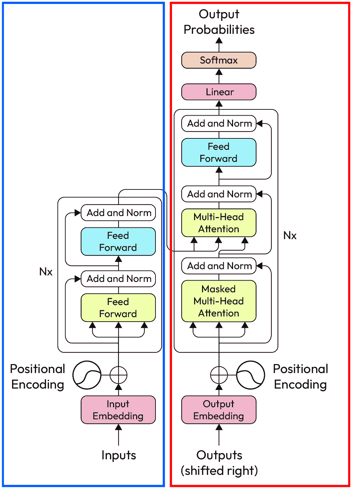
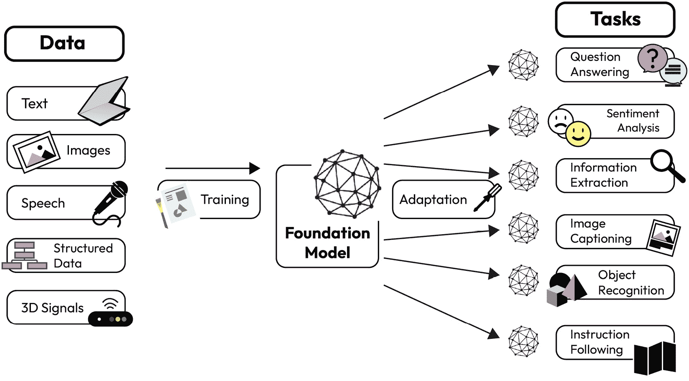

# 第一章：大型语言模型简介

在技术的世界里，**聊天生成预训练变换器**（**ChatGPT**）是一个基于**大型语言模型**（**LLM**）的聊天机器人，由 OpenAI 于 2022 年 11 月 30 日发布。在 ChatGPT 的首周内，已有超过一百万人开始使用这项技术。这是一个重要的时刻，因为它展示了普通人现在如何在日常生活中使用生成性**人工智能**（**AI**）。到 2023 年 1 月，ChatGPT 的用户数超过了 1 亿，成为历史上增长最快的应用，并使得背后的公司 OpenAI 的估值达到了 290 亿美元。

在本章节中，我们将建立 LLM 的基本概念，查看一些示例，理解基础模型的概念，并提供多个业务应用场景，展示 LLM 如何解决复杂问题。

本章将涵盖以下主题：

+   什么是 LLM？

+   LLM 示例

+   基础模型的概念

+   LLM 的应用场景

# 什么是 LLM？

LLM 是深度学习中的现代突破，专注于人类语言。它们在许多方面表现出了巨大的实用性，例如内容创作、客户支持、编码辅助、教育与辅导、医疗诊断、情感分析、法律援助等。简单来说，LLM 是一种智能计算机程序，能够像人类一样理解和生成文本，并且其底层使用了大型变换器模型。变换器架构使得模型能更有效地理解数据中的上下文和关系，这使得它在涉及人类语言和序列数据的任务中尤为强大。

对人类来说，文本是一堆拼凑在一起的单词。我们阅读句子，句子组成段落，段落组成文档中的章节。但是对计算机来说，文本只是一个由字母和符号组成的序列。为了让计算机理解文本，我们可以创建一个使用所谓的循环神经网络的模型。这个模型一次处理一个单词或字符，当它读完所有内容时，会给出一个答案。这个模型效果不错，但有时当它读取到一段文本的结尾时，它很难回忆起该段文本的开头部分。这就是变换器架构的亮点所在。变换器架构的关键创新是使用了自注意力机制，这使得它能够比以前的模型更有效地捕捉序列中不同部分之间的关系。

早在 2017 年，Ashish Vaswani 和他们的团队写了一篇名为 *Attention is All You Need* ([`arxiv.org/pdf/1706.03762.pdf`](https://arxiv.org/pdf/1706.03762.pdf)) 的论文，介绍了一种叫做 Transformer 的新模型。这个模型使用了一种叫做注意力（attention）的技术。与旧的递归神经网络处理文本的方式不同，注意力可以让你一次性查看整个句子，甚至是整段话，而不是一次只看一个单词。这有助于 Transformer 更好地“理解”单词，因为它获得了更多的上下文信息。如今，许多最好的大型语言模型（LLM）都是基于 Transformer 构建的。

当你希望一个 Transformer 模型理解一段文本时，必须将其拆解为单独的单词或称为 token 的部分。这些 tokens 然后会被转化为数字，并映射到称为嵌入（embeddings）的特殊编码，这些嵌入就像是存储 token 语义信息的特殊地图。最终，Transformer 的编码器将这些嵌入转化为一种表示。这个“表示”是一个向量，能够捕捉输入 tokens 的上下文含义，使得模型能够更有效地理解和处理输入。简单来说，你可以将其理解为将所有碎片拼凑在一起，以便理解完整的故事。

这是一个文本字符串，它的 token 化及其向量嵌入。请注意，token 化可以将单词拆分成子单词。例如，单词“generative”可以被拆分为“gener”和“ative”。

让我们看看输入文本：

```py
Generative AI, a groundbreaking technology fueled by intricate algorithms and machine learning, possesses the remarkable ability to independently craft content across diverse domains. By meticulously analyzing vast datasets and discerning intricate patterns, it generates textual compositions, artistic creations, and a myriad of other outputs that mirror human ingenuity. This innovative capability is reshaping industries far and wide, driving unprecedented advancements in fields such as language generation, creative arts, and data synthesis.
```

这是 token 化后的文本：

```py
['Gener', 'ative', ' AI', ',', ' a', ' groundbreaking', ' technology', ' fueled', ' by', ' intricate', ' algorithms', ' and', ' machine', ' learning', ',', ' possesses', ' the', ' remarkable', ' ability', ' to', ' independently', ' craft', ' content', ' across', ' diverse', ' domains', '.', ' By', ' meticulously', ' analyzing', ' vast', ' datasets', ' and', ' discern', 'ing', ' intricate', ' patterns', ',', ' it', ' generates', ' textual', ' compositions', ',', ' artistic', ' creations', ',', ' and', ' a', ' myriad', ' of', ' other', ' outputs', ' that', ' mirror', ' human', ' ing', 'enuity', '.', ' This', ' innovative', ' capability', ' is', ' resh', 'aping', ' industries', ' far', ' and', ' wide', ',', ' driving', ' unprecedented', ' advancements', ' in', ' fields', ' such', ' as', ' language', ' generation', ',', ' creative', ' arts', ',', ' and', ' data', ' synthesis', '.']
```

现在，让我们来看看嵌入：

```py
[-0.02477909065783024, -0.013280253857374191, 0.014264720492064953,0.002092828741297126, 0.008900381624698639, 0.017131058499217033, 0.04224500060081482, 0.012088178656995296, -0.028958052396774292, 0.04128062725067139, 0.020171519368886948, 0.034369271248579025, 0.005337550304830074, -0.011920752003788948, 0.0027072832453995943,0.008103433065116405, 0.035440798848867416, 0.015430007129907608,
…
…
-0.02812761813402176, -0.009549995884299278, 0.02203330025076866, 0.015215701423585415, 0.02339949831366539, -0.008967352099716663, 0.01867138035595417, -0.01762663945555687, 0.01278467196971178, 0.029922427609562874, -0.0002689284738153219, -0.010213003493845463]
```

把上下文向量看作是输入信息的核心。它使得 Transformer 的解码器能够确定接下来该说什么。例如，通过给解码器提供一个起始句子作为提示，它可以建议下一个合适的单词。这个过程会重复，每次新的建议都会成为提示的一部分，从而让解码器从一个初始句子生成一个自然流畅的段落。

基于解码器的内容生成就像是一场游戏，每一步都基于前一步，最终你将得到一个完整的故事。这种内容生成方法叫做“自回归生成”（autoregressive generation）。广义来说，这就是大型语言模型（LLM）的工作原理。基于自回归生成的模型能够处理长篇输入文本，同时保持足够大的上下文向量来处理复杂的概念。此外，解码器中有很多层，使得它非常复杂。它大到通常无法仅在一台计算机上运行，而必须依赖于多个节点协同工作，这些节点通常需要频繁访问。这就是为什么它通过 **应用程序编程接口** (**API**) 提供服务的原因。如你所猜测，这个庞大的模型是通过大量文本的训练来学习语言的运作方式，包括句子的所有模式和结构。现在，让我们理解大型语言模型（LLM）的主要结构。

LLM 的结构（参见*图 1.1*）主要由不同层次的神经网络组成，例如递归层、前馈层、嵌入层和注意力层。这些层次协作处理输入文本并对输出进行预测。我们来仔细看看：

+   **嵌入层**将输入文本中的每个单词转换为一种特殊的详细描述，类似于独特的指纹。这些描述包含关于单词及其含义的重要细节，帮助模型理解更大的图景。

+   **前馈层**由许多连接的层组成，这些层处理在嵌入层中创建的详细描述。这些层对这些嵌入进行复杂的变换，帮助模型理解输入文本中更重要的思想。

+   **递归层**设计用于一步步地读取输入文本。这些层具有隐藏的记忆，随着每一步读取，它们会更新记忆。这帮助模型记住句子中单词之间的关系。

+   **注意力机制**是 LLM 的另一个重要部分。它就像一个聚光灯，模型将其聚焦于输入文本的不同部分。这帮助模型集中注意力于文本中最重要的部分，从而做出更好的预测。

    例如，当你阅读时，并不会对每个词都给予同等的关注；而是更多地集中在关键词和重要短语上，以掌握主旨。例如，在句子“猫坐在垫子上”中，你可能会强调“猫”和“垫子”来理解发生了什么。此外，你还会利用前面句子的上下文来理解当前句子——如果你之前读到有只猫在玩耍，你就能理解为什么这只猫现在坐在垫子上。随着阅读的进行，你会根据理解的需要调整关注重点，重新审视或更加关注那些有助于理解整体情节的关键部分。

    本质上，就像人类通过关注重要词汇并利用上下文理解含义来阅读文本一样，变换器中的注意力机制也会关注输入的关键部分，并动态调整，以捕捉单词之间的上下文和关系：



图 1.1：变换器架构（来源：[`arxiv.org/pdf/1706.03762.pdf`](https://arxiv.org/pdf/1706.03762.pdf)）

现在我们已经了解了 LLM 背后的基本概念，接下来让我们关注一些行业中的顶级实例。

# LLM 示例

许多公司已经开发出了先进的 LLM，包括 OpenAI（GPT-4）、Meta（Llama 3.1）、Anthropic（Claude）和 Google（Gemini），等等。OpenAI 在 LLM 领域一直保持着主导地位。我们来看一下在撰写时使用的顶级模型：

+   **Generative Pre-trained Transformer (GPT)**: OpenAI 创建了多个 GPT 模型，包括 GPT1（1.17 亿参数）、GPT2（15 亿参数）、GPT-3（1750 亿参数）、GPT 3.5、GPT4-Turbo、GPT4-o 和 GPT4-o mini 等。GPT4-o 是全球最先进的语言大模型之一。这些模型从大量文本中学习，能够提供类似人类的回答，涵盖多个主题和问题，并且能记住对话中的各个部分。

+   **Anthropic**: Anthropic 的 Claude 模型是一系列先进的语言大模型（LLM），旨在以高效的方式处理复杂任务。最新版本 Claude 3 包括了 Opus、Sonnet 和 Haiku 等不同型号，每种型号都根据不同的性能需求进行了优化。Opus 是最强大的，擅长处理复杂的分析和高阶任务，而 Sonnet 则在速度和智能之间取得平衡，Haiku 则为轻量级操作提供最快的响应时间。这些模型注重安全性、可靠性和道德的人工智能实践。

+   **Llama 3.1**: Llama 3.1 是一款前沿的语言大模型，代表着人工智能研究的一个重要里程碑。凭借其先进的架构和庞大的规模，Llama 3.1 能够以前所未有的准确性和细致度理解和生成类似人类的文本。这款强大的工具在自然语言处理（**NLP**）、文本生成和对话式人工智能等多个应用领域具有深远的影响。

+   **Llama 2**: Llama 2 是 Meta 开发的第二代语言大模型。它是开源的，可以用来创建类似 ChatGPT 或 Google Bard 的聊天机器人。Llama 2 的训练数据比 Llama 1 多 40%，从而使其能提供更加逻辑清晰且自然的回应。Llama 2 可以供任何人用于研究或商业用途。Meta 表示，Llama 2 能够理解比 Llama 1 更多的上下文信息，这使得它成为一个更加智能的语言模型，能够提供听起来像人类回答的回复。

+   **Gemini**: Google Gemini 是由 Google DeepMind 开发的一系列先进的多模态语言大模型（LLM）。该系列于 2023 年 12 月 6 日发布，包括 Gemini Ultra、Gemini Pro、Gemini Flash 和 Gemini Nano 等版本。Gemini 旨在无缝理解和处理不同类型的信息，包括文本、图像、音频、视频和代码。作为 OpenAI GPT-4 的竞争者，Gemini 驱动着 Google 的 AI 聊天机器人，并旨在提升创造力和生产力。

+   **PaLM 2**：最后，PaLM 2 是谷歌更新的 LLM（大型语言模型）。它擅长处理复杂任务，如处理代码和数学、分类和回答问题、翻译语言、精通多种语言，并能创造类人句子。它的表现超过了前述的模型，包括最初的 PaLM。谷歌在创建和使用 AI 时非常谨慎，PaLM 2 就是这一方法的一部分。它经过了全面评估，以检查潜在的问题和偏见。PaLM 2 不仅单独使用，还被应用于其他先进模型，如 Med-PaLM 2 和 Sec-PaLM。它还为谷歌的 AI 功能和工具提供动力，如 Bard 和 PaLM API。

现代 LLM 的进化树（见*图 1.2*）展示了这些模型近年来的演变，并突出了其中一些最著名的模型。相关性较强的模型位于同一分支上。使用 Transformer 架构的模型显示在不同的颜色上：仅解码的模型位于蓝色分支，只有编码的模型位于粉色分支，而既进行编码又进行解码的模型位于绿色分支。模型在时间线上的位置表示它们的发布时点。开源模型以实心方块表示，而非开源模型则以空心方块表示。右下角的柱状图显示了不同公司和组织发布的模型数量：

)](img/B21019_01_2.jpg)

图 1.2：现代 LLM 的进化树（来源：[`arxiv.org/abs/2304.13712`](https://arxiv.org/abs/2304.13712)）

在探讨了一些典型的 LLM 实例后，让我们讨论一下基础模型的概念及其优缺点。

# 基础模型的概念

最近几年，围绕 LLM（如 ChatGPT）的热议席卷了全球。LLM 是一个更广泛模型类别——基础模型（foundation models）的子集。有趣的是，“基础模型”这一术语最初由斯坦福大学的团队提出。他们观察到 AI 领域发生了变化，推动了一个新范式的出现。

过去，人工智能应用程序是通过训练单个人工智能模型构建的，每个模型都针对特定任务使用专门的数据进行训练。这种方法通常涉及以大多数是监督学习的方式组装一个包含各种人工智能模型的库。其基础能力，即基础模型（见 *图 1.3*），将成为各种应用和用例背后的驱动力。实际上，这个单一的模型能够满足那些曾经由传统方法中不同的人工智能模型支持的应用程序。这意味着一个模型可以驱动多种多样的应用程序。关键在于，这个模型拥有惊人的能力，能够适应多种任务。促使该模型实现这种多功能性的因素在于，它通过无监督的方式，在海量的非结构化数据上进行了广泛的训练：



图 1.3：基础模型（来源：[`arxiv.org/pdf/2108.07258.pdf`](https://arxiv.org/pdf/2108.07258.pdf)）

考虑一个场景，我开始一句话说“不要在鸡还没孵出来之前就开始数它们。”现在，我的目标是引导模型预测最后一个词，这个词可能是“孵化”（hatched）、“生长”（grown）甚至是“消失”（gone）。这个过程包括通过分析句子中前面给出的上下文，训练模型预测合适的词。能够根据前面遇到的词的上下文来生成对下一个词的预测，这种令人印象深刻的能力使得基础模型处于生成性人工智能的领域。本质上，这些模型属于生成性人工智能，因为它们能够创造一些新东西——在这种情况下，就是预测句子中的下一个词。

尽管这些模型主要设计用来生成预测，特别是预测句子中的下一个词，但它们具有巨大的能力。只需添加少量带标签的数据，我们就可以调整这些模型，使其在更传统的自然语言处理（NLP）任务上表现得非常出色。这些任务包括分类或命名实体识别等活动，这些通常与生成能力无关。通过一种叫做微调的过程，可以实现这一转变。当你使用适量的数据集来微调你的基础模型时，你会调整其参数，使其能够在特定的自然语言任务上表现出色。通过这种方式，模型从主要是生成型的演变为一个强大的、针对性的 NLP 任务工具。

即使是在数据有限的情况下，基础模型也可以证明其高效性，特别是在数据稀缺的领域。通过称为提示或提示工程的过程，可以使用技术如上下文学习、零样本、一次样本和少样本学习来解决复杂的下游任务。让我们来分析一下如何为分类任务设置提示。想象一下，你向模型提供一个句子，然后跟上这样一个问题：“这个句子带有积极还是消极情绪？”模型会运用其魔法，生成完整的句子。它生成的下一个词将作为你分类问题的答案。根据它认为句子情感所在的位置，模型将回答“积极”或“消极”。这种方法利用了模型生成上下文相关文本的内在能力，以解决特定的分类挑战。我们将在本书后面讨论不同的提示技术和高级提示工程。

让我们来谈谈基础模型的一些关键优势：

+   **性能**：这些模型经过大量数据的训练，数据量通常达到了几 TB。当用于较小的任务时，这些模型展示出非凡的性能，远远超过仅训练在少量数据点上的模型。

+   **生产力提升**：LLM 可以极大地提升生产力。它们就像超高效的人类，可以完成通常需要大量时间和精力的任务。例如，在客户服务中，LLM 可以快速回答常见问题，从而让人类工作人员有更多时间处理更复杂的问题。在企业中，它们可以比人类更快地处理和组织数据。使用 LLM，公司可以节省时间和金钱。这让他们能够专注于重要任务，因此像生产力的涡轮增压器一样发挥作用。

然而，这些基础模型也存在关键的挑战和限制：

+   **成本**：由于需要大量的数据量来训练，这些模型的训练成本往往相当高昂。这通常对试图训练自己的基础模型的小型企业构成挑战。此外，随着这些模型规模的扩大，达到数十亿参数的规模，它们在推断方面的使用成本可能会昂贵。

    诸如微软之类的云服务提供商提供了一项名为**Azure OpenAI**的服务。这项服务允许企业按需使用这些模型，并且仅支付他们使用的部分。这类似于租用一台强大的计算机一段时间，而不是直接购买一台。利用这种基于服务的能力使公司能够节省在模型训练和使用上的资金，特别是考虑到需要强大的基于 GPU 的硬件。

    总结一下，通过使用 Azure OpenAI 等服务，企业可以利用这些先进的模型，而无需在资源和基础设施上花费大量资金。

+   **可信度**：就像数据对这些模型来说是巨大的优势一样，也有另一面需要考虑：LLM 是通过大量从互联网抓取的语言数据进行训练的，这些数据可能包含偏见、仇恨言论或有害内容，进而影响其可靠性。这将是一个艰巨的任务。此外，还有一个挑战是我们甚至不能完全了解这些数据的构成。对于许多开源模型来说，用于训练 LLM 的确切数据集不明确，这使得评估它们是否存在可信度和潜在偏见问题变得困难。LLM 训练数据的庞大规模几乎使得人工注释人员无法彻底审查每一个数据点，从而增加了无意中引发负面后果的风险，比如加剧有害偏见或生成有毒内容。

    大型组织充分意识到这些技术蕴藏的巨大潜力。为了解决基础模型的可信度问题，OpenAI、微软、谷歌和 Anthropic 正联合推出“前沿模型论坛”（[`blogs.microsoft.com/on-the-issues/2023/07/26/anthropic-google-microsoft-openai-launch-frontier-model-forum`](https://blogs.microsoft.com/on-the-issues/2023/07/26/anthropic-google-microsoft-openai-launch-frontier-model-forum)），这是一个旨在确保前沿 AI 模型安全和负责任发展的全新行业倡议。这个新的合作实体将利用成员公司在技术和运营方面的集体优势，推动整个 AI 领域的进展。它的核心目标之一是推动技术评估和基准测试的前进。此外，论坛还将努力构建一个公开可访问的解决方案库，促进 AI 领域行业最佳实践和标准的采用。

+   **幻觉**：有时，LLM 可能会生成一些信息或答案，这些内容可能并不完全准确。这就像是你做了一个看起来很真实的梦，但它并不基于现实中的情况。LLM 可能生成听起来正确但实际上并不完全真实或准确的文本。因此，虽然 LLM 具有高度智能，但有时它们也会犯错或生成并不存在的内容。

    LLM 的应用通常需要人工监督，以确保输出结果值得信赖。然而，有一种前景广阔的技术叫做 **模型对接**，旨在改善这种情况。对接意味着将 LLM 的理解与现实世界的信息和上下文联系起来。这就像是确保模型牢牢扎根于现实中一样。本书后面会详细讨论如何使用这种技术来防止模型凭空捏造内容，并只给出基于给定上下文的答案。

+   **有限的上下文窗口**：LLM 有一个有限的上下文窗口或令牌大小。上下文窗口或令牌大小可以看作是模型每次能处理的记忆量。LLM 一次只能理解一定数量的信息。例如，ChatGPT（GPT4-o）可以处理 128K 输入令牌。这意味着如果给它的输入太多，它将无法处理并会报错。因此，保持输入在此限制内对于模型正常运行非常重要。

在我们理解基础模型概念的基础上，接下来让我们深入探讨 LLM 的一些实际应用案例。

# 探索 LLM 的应用案例

LLM 在各个领域和行业中有着广泛的应用案例，因为它们能够理解并生成类人文本。让我们来看看其中的一些：

+   **内容生成**：LLM 可以生成博客、文章、营销材料和社交媒体帖子的书面内容。它们可以用于自动化内容创作并提供创意灵感。

+   **客户支持**：LLM 可以为客户查询和支持工单提供自动化回应，从而处理常见问题和问题，将更复杂的案例交由人工代理处理。

+   **语言翻译**：LLM 可以用于在不同语言之间翻译文本，使全球范围内的沟通更加便捷和可达。

+   **文本摘要**：LLM 可以快速总结长篇文本，使得更容易把握文章、报告及其他书面材料的要点。

+   **聊天机器人和虚拟助手**：LLM 可以驱动聊天机器人和虚拟助手，与用户进行自然语言对话，帮助完成任务、解答询问和获取信息。

+   **内容个性化**：LLM 可以分析用户偏好和行为，个性化推荐、广告和在社交媒体和流媒体服务平台上的内容推送。

+   **数据录入与提取**：LLM 可以从非结构化文本中提取相关信息，例如文档或电子邮件，并将其录入结构化的数据库或电子表格中。

+   **创意写作**：LLM 可以通过生成故事创意、对话、角色描述甚至整个叙事来协助作家。

+   **医疗聊天机器人**：LLM 驱动的聊天机器人可以回答与健康相关的问题，提供急救建议，并提供有关常见医疗状况的信息。

+   **医学诊断**：LLM 可以通过分析患者症状和病历来帮助诊断医疗状况，提供潜在的诊断和治疗方案。

+   **心理健康支持**：LLM 可以为寻求心理健康支持的个人提供同情的回应和资源。

+   **旅游和旅行规划**：LLM 可以通过建议行程、推荐景点并提供有关当地习俗和美食的信息来协助旅行者。

+   **食谱创作**：LLM 可以根据食材和饮食偏好设计创意食谱，提供全新的烹饪体验。

+   **网络安全分析**：LLM 可以分析网络安全威胁，并建议保护数字系统和数据的策略。

+   **时尚推荐**：LLM 可以根据个人风格偏好和当前流行趋势，推荐服装和配饰搭配。

+   **法律文件审查**：LLM 可以审查法律文件、合同和案件历史，识别相关信息、异常情况和潜在问题。

+   **学术研究**：LLM 可以通过提供学术论文摘要、帮助进行文献综述，并生成进一步研究的想法，来协助研究人员。

+   **财务分析**：LLM 可以处理和分析财务数据，生成报告，并提供市场趋势和投资机会的洞察。

+   **语言学习**：LLM 可以通过与学习者对话、提供解释和提供练习，帮助学习者练习和提升语言技能。

+   **无障碍工具**：LLM 可以用于为视障人士创建音频描述、为视频生成字幕，并将文本转化为语音，帮助有阅读困难的人群。

尽管这些只是一些示例用例，但 LLM 的无限灵活性使其能够在技术进步的过程中应用于更多的场景。

想要创建生成型 AI 应用程序但不想自己训练 LLM 或花钱购买昂贵硬件的人，可以使用 Azure OpenAI API。这使他们能够使用由 OpenAI 制作的先进 LLM。

到目前为止，我们已经介绍了 LLM 的基础知识。接下来的一章将更详细地讨论 Azure OpenAI 服务。

# 总结

在这一章中，我们从介绍 LLM 及其如何受 Transformer 网络影响开始。然后，我们探讨了构成 LLM 的各个部分。接下来，我们深入研究了由 OpenAI、Meta 和 Google 创建的一些顶级 LLM 模型，讨论了这些模型如何演变。我们还介绍了基础模型的概念，包括其优势和局限性。最后，我们查看了 LLM 在各个商业应用中的巨大潜力。

在接下来的章节中，我们将专注于 Azure OpenAI 服务。我们将学习如何访问该服务，包括 GPT 3.5、GPT-4、嵌入式模型和 DALL.E 2 等模型。我们还将解释定价机制，讨论按需付费和预留容量等选项。

# 进一步阅读

+   *AI 解释器*：*基础模型与 AI 的下一个时代* ([`www.microsoft.com/en-us/research/blog/ai-explainer-foundation-models-and-the-next-era-of-ai/`](https://www.microsoft.com/en-us/research/blog/ai-explainer-foundation-models-and-the-next-era-of-ai/))

+   *Orca:* *来自* *GPT-4* *的复杂解释轨迹的渐进学习* ([`www.microsoft.com/en-us/research/publication/orca-progressive-learning-from-complex-explanation-traces-of-gpt-4/`](https://www.microsoft.com/en-us/research/publication/orca-progressive-learning-from-complex-explanation-traces-of-gpt-4/))

+   *Florence:* *计算机视觉的新基础模型* ([`www.microsoft.com/en-us/research/publication/florence-a-new-foundation-model-for-computer-vision/`](https://www.microsoft.com/en-us/research/publication/florence-a-new-foundation-model-for-computer-vision/))

+   *加速基础模型研究* ([`www.microsoft.com/en-us/research/collaboration/accelerating-foundation-models-research/`](https://www.microsoft.com/en-us/research/collaboration/accelerating-foundation-models-research/))

+   *注意力即是你所需要的* ([`arxiv.org/abs/1706.03762`](https://arxiv.org/abs/1706.03762))

+   *关于基础模型的机会与风险* ([`arxiv.org/abs/2108.07258`](https://arxiv.org/abs/2108.07258))
