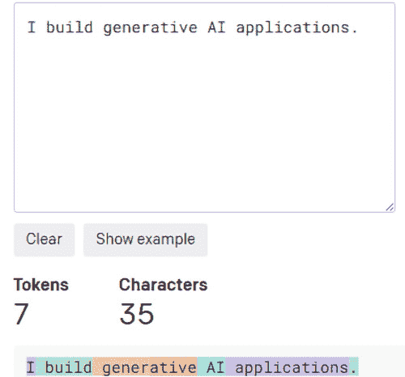

# 第二章：Azure OpenAI 基础知识

在上一章中，我们讨论了**大型语言模型**（**LLMs**）、LLM 的概念以及不同的企业级 LLM 示例。我们还讨论了基础模型的概念，并探讨了 LLM 的不同应用场景。在本章中，我们将深入探讨**Azure OpenAI**（**AOAI**）服务、不同的模型类型、如何部署模型以及各种定价方面。

在本章中，我们将探讨以下内容：

+   什么是 AOAI 服务？

+   AOAI 模型类型

+   访问 AOAI 服务

+   创建 AOAI 资源

+   部署 AOAI 模型

+   利用 AOAI 模型

+   定价

在深入探讨这些内容之前，让我们先更好地了解微软与 OpenAI 的合作关系。

微软向 OpenAI 投资了数十亿美元，确保他们能够开发先进的 AI 技术，并与大家共享其成果。这一合作关系建立在微软 2019 年和 2021 年的先前投资基础上。这使得微软和 OpenAI 能够将他们所创造的先进 AI 技术应用于各自的业务中。微软还投资了强大的超级计算机，以帮助 OpenAI 进行重要的 AI 研究。

微软与 OpenAI 建立了战略合作伙伴关系，并在此过程中整合了其先进的大型语言模型（LLM）。他们在多种产品中使用 OpenAI 的模型，并创造出创新的数字体验。微软有一项名为 AOAI 的服务，开发者可以利用前沿模型的强大功能，同时结合微软的强大工具。微软是唯一为 OpenAI 提供云服务的公司，这意味着他们将处理 OpenAI 的研究、产品和服务所需的所有计算工作，以便构建复杂的 AI 应用程序。此次合作促成了变革性解决方案的诞生，为基于 AI 的开发开启了新的可能性。在下一节中，我们将深入探讨 AOAI 服务以及如何使用它。

# 什么是 AOAI 服务？

微软提供了广泛的 AI 工具和解决方案，帮助客户在 AI 旅程的各个阶段取得进展，无论其团队的技术水平如何。无论你是 AI 的新手，还是已经有具体应用场景的用户，微软都能满足你的需求。对于初学者，他们提供了易于使用的选项；对于有更高需求的数据科学家，他们也提供了支持。探索 Azure AI 产品时，你可以自由地从高级 AI 服务入手，深入了解 Azure 机器学习平台，构建、训练、调优并大规模部署深度学习模型。整体 Azure AI 架构如下图所示：


图 2.1 – Azure AI 架构

在最上层，你可以找到针对特定应用的 AI 服务，如**认知搜索**、**机器人服务**和**文档智能**。还有一些领域特定的预训练模型，如**视觉**、**语音**、**语言**、**决策**和**Azure OpenAI 服务**。这些模型建立在 Azure 机器学习的基础上，作为一个托管端点。如果你使用 AI 服务，就不需要担心基础层。然而，如果你希望访问基础层并控制它，可以使用最底层：**Azure 机器学习**。它是一个端到端托管的机器学习平台，旨在负责任且安全地大规模构建、训练、部署和操作机器学习模型。

AOAI 服务（在*图 2.1*中的红色矩形框内标记）是一个新的 Azure AI 服务，提供对 OpenAI 强大语言模型的 REST API 访问，包括 GPT-4 Turbo、GPT-4o、GPT-4o mini、GPT-3.5 Turbo、Whisper、DALL-E 3 和 Embeddings 模型系列。它们具有企业级功能，如安全性、私有网络、合规性、区域可用性和负责任的 AI 内容过滤，这些功能仅在 Microsoft Azure 上提供。这些模型可以轻松适应各种任务，包括但不限于内容生成、摘要、语义搜索和自然语言到代码的翻译。用户可以通过 REST API、Python SDK 或 Azure AI Foundry 中的基于 Web 的界面访问各种服务。

现在，让我们来讨论 AOAI 中的不同模型类型。

# AOAI 模型类型

AOAI 服务提供了多种不同的模型，它们可以做不同的事情，并且有不同的费用。让我们深入了解不同的模型类型及其可用性：

+   **GPT 基础模型**：GPT 基础模型可以理解并生成自然语言和代码，但在遵循指令方面没有经过特别训练。它们设计为原始 GPT-3 基础模型的替代品，并依赖于传统的 Completions API。对于大多数用户，我们建议使用 GPT-3.5 或 GPT-4 来完成他们的任务。这些模型有两种不同的变体：

    +   **Babbage-002**：作为 GPT-3 的 Ada 和 Babbage 基础模型的替代品。它可以支持最多 16,384 个 token 并可以进行微调。

    +   **Davinci-002**：作为 GPT-3 的 Curie 和 Davinci 基础模型的替代品。它可以支持最多 16,384 个 token 并可以进行微调。

+   **GPT-4**：这是最新的模型，适用于解决复杂问题。它比 OpenAI 之前的任何模型都更准确。GPT-4 模型能够理解并生成自然语言和计算机代码，并具备高级推理能力。它是一个优化的聊天完成模型，意味着它最适合互动聊天应用，并且在常规的完成任务中表现优异。作为一个大型、高度优化的模型，GPT-4 在互动聊天和完成任务方面都能出色地表现。最新的 GPT-4 类模型包括三种旗舰型号：

    +   **GPT-4 Turbo**：此模型支持最多 128,000 个输入标记/上下文窗口和 4,096 个输出标记。

    +   **GPT-4o**：此模型支持最多 128,000 个输入标记/上下文窗口和 4,096 个输出标记。

    +   **GPT-4o mini**：此模型支持最多 128,000 个输入标记/上下文窗口和 16,384 个输出标记。

+   **GPT-3.5**：GPT-3.5 代表一系列基于 GPT-3 能力的模型。这些模型在理解和生成自然语言以及计算机代码方面表现出色。在 GPT-3.5 模型中，最强大且最具成本效益的是 GPT-3.5 Turbo。它专门为互动对话进行微调，在常规完成任务中表现良好。GPT-3.5 的最新版本还提供两种不同的版本：

    +   **gpt-35-turbo-1106**：此模型支持最多 16,385 个输入标记/上下文窗口和 4,096 个输出标记。

    +   **gpt-35-turbo-0125**：此模型支持最多 16,385 个输入标记/上下文窗口和 4,096 个输出标记。

    +   **isgpt-35-turbo-instruct**：此模型支持最多 4,097 个输入标记/上下文窗口。此模型无法进行微调。

重要说明

GPT-3.5 Turbo Instruct 提供的能力与 text-davinci-003 相当，但使用的是 Completions API，而非 Chat Completions API。我们强烈建议使用 GPT-3.5 Turbo 和 GPT-3.5 Turbo Instruct，而不是旧版本的 GPT-3.5 和 GPT-3 模型。

这是一个互动聊天示例，可以使用 GPT-3.5 或 GPT-4。通常，用户输入提示，模型生成完成（模型输出）。这可以是一个持续的对话交流：


图 2.2：基础提示和完成示例

除了提示完成，您还需要理解令牌的另一个概念。当您将提示发送到 GPT-3.5 或 GPT-4 时，它会通过嵌入过程进行分词，其中单词或—更常见的是—单词的一部分会转换为数字向量表示。数字令牌代替完整的单词或句子来处理信息。这种设计使得 GPT 模型能够处理相对较大量的文本。然而，GPT-3.5 和 GPT-4（根据您选择的模型类型，如前所述）在输入提示和生成的完成内容上有令牌约束。

为了确保您不超过令牌限制，您可以估算输入提示和生成结果所需的令牌数量。作为粗略指南，英语中每四个字符通常对应一个令牌。因此，您可以通过将提示的字符数与期望的回复长度相加，然后将总数除以四来计算所需的令牌数。这个计算可以为您提供一个大致的令牌数量估算，这对于需要考虑令牌约束的任务规划非常有价值。*图 2.3*展示了给定句子的令牌示例：



图 2.3：令牌计数器

在此示例中，总共有七个令牌。值得注意的是，“generative”一词由两个不同的令牌表示，而其余词汇则每个由一个令牌表示。

+   **嵌入模型**：嵌入是浮动点数字向量的列表。当我们衡量两个向量之间的距离时，它告诉我们它们的相似性或差异性。如果距离较小，表示它们非常相似；如果距离较大，则表示它们差异较大。当您将原始文本输入嵌入模型时，它会生成该文本的向量表示列表：


图 2.4：基本嵌入过程

在实际应用中，您将一组文档词汇提供给嵌入模型作为输入，嵌入模型随后使用这些词汇生成嵌入向量。该向量通常存储在一个向量数据库中，如 Azure Cognitive Search 或 Azure Cosmos DB。随后，当用户提交查询时，它会通过相同的嵌入模型生成一个查询向量，该向量用于在向量数据库中搜索相似的向量。这种模式称为**检索增强生成**（**RAG**）。

以下图示展示了这一过程：


图 2.5：文档嵌入过程

在撰写本文时，AOAI 服务提供了四种不同类型的嵌入模型：

+   **text-embedding-ada-002（版本 1）**：此版本使用 GPT-2/GPT-3 分词器。它可以处理最多**2,046**个输入令牌，并提供**1,024**维度的输出。

+   **text-embedding-ada-002 (版本 2)**: 该版本使用 cl100k_base 分词器，支持四倍于前版本的输入，最多可处理**8,191**个令牌，并返回**1,536**维的输出。这是第二代嵌入模型。我们强烈推荐使用 text-embedding-ada-002 版本 2，因为它在功能和性能上与 OpenAI 的 text-embedding-ada-002 模型相当。该模型不仅更加经济高效，而且更简单、更高效。

+   **text-embedding-3-small**: 新的 text-embedding-3-small 模型显著优于其前身 text-embedding-ada-002，在多语言检索的基准分数上从 31.4%提高至 44.0%，在英语任务上从 61.0%提高至 62.3%。此外，它在成本效益方面提高了五倍，将每千个令牌的价格从$0.0001 降至$0.00002。虽然 text-embedding-ada-002 仍将保持可用，但由于其更高的效率和性能，推荐使用 text-embedding-3-small。一款新模型 text-embedding-3-large 提供了更大的容量，支持最多 3,072 维度的嵌入。

+   **text-embedding-3-large**: 新的 text-embedding-3-large 模型是性能最强的嵌入模型，较 text-embedding-ada-002 有了显著的提升。在 MIRACL 基准测试中，它的平均分为 54.9%，在 MTEB 基准测试中的分数为 64.6%，分别高于 31.4%和 61.0%。text-embedding-3-large 的定价为每千个令牌$0.00013，在所有嵌入模型中提供了最高的性能，超越了 text-embedding-3-small 和 text-embedding-ada-002。

要创建一个生成式 AI 应用程序，您主要需要的关键模型就是此处提到的模型。值得注意的是，这些模型仅在一个截止到 2021 年 9 月的大型数据集上进行过训练。因此，它们不具备该日期之后的任何知识或信息。如果您想要创建一个包含最新信息的生成式 AI 应用，您可以探索一种被称为**RAG**的技术。我们将在本书后面详细探讨这一技术，提供实践教程和深入讨论。

AOAI 服务中还提供了其他模型，包括以下模型：

+   **DALL-E 3**: 该模型能够根据自然语言描述生成真实感的图像和艺术作品。

+   **Whisper**: 这是一个通用的语音识别（ASR）模型。它已经在包含音频和文本的 680,000 小时的庞大且多样化的数据集上进行训练，能够处理多种任务，例如识别多种语言的语音、翻译口语和识别语言。Whisper 采用基于 Transformer 的编码器-解码器架构，能够将口语转化为书面文本，并且还可以处理特殊令牌来指示涉及的任务或语言。此模型可以通过 AOAI 服务或 Azure 语音访问。

现在我们已经讨论了各种类型的模型，接下来我们来讨论如何获得 AOAI 服务的访问权限。

# 访问 AOAI 服务

要访问 AOAI，您需要拥有一个有效订阅和启用 AOAI 访问的 Azure 账户。本节将引导您如何获取 AOAI 服务访问权限。

*步骤 1：创建* *Azure 账户*。

在本文写作时，AOAI 的访问权限仅限于企业客户和合作伙伴。因此，技术上，您可以使用四种选项中的一种创建一个 Azure 账户（[`learn.microsoft.com/en-us/dotnet/azure/create-azure-account`](https://learn.microsoft.com/en-us/dotnet/azure/create-azure-account)）。但是，在创建账户时，您必须使用公司的电子邮件地址；个人邮箱将无法获得 AOAI 访问权限：

+   **选项 1**：Visual Studio 订阅者可以使用每月的 Azure 积分。此选项允许您激活积分并将其用于 AOAI。

+   **选项 2**：注册免费 Azure 账户。此选项为您提供 12 个月的免费服务和 200 美元的积分，您可以在 30 天内使用这些积分探索 Azure。如果您已获得批准，可以使用这些积分用于 AOAI。

+   **选项 3**：注册按需付费账户。此选项会根据您超出免费额度的使用量收费。如果您已获得批准，您可以使用此选项为 AOAI 付费。

+   **选项 4**：使用企业账户。此选项要求您的公司有一个云管理员来授予您访问 AOAI 的权限。

创建 Azure 账户后，您将获得一个默认的 Azure 订阅。您可以使用该订阅，或者创建一个新的订阅来访问 AOAI：

1.  您可以在**订阅**资源下找到您的订阅信息：


图 2.6：查找订阅

1.  记下**订阅 ID**值；您将需要它来申请 AOAI 访问权限：


图 2.7：检索订阅详细信息

*步骤 2：申请* *AOAI 访问权限*。

要申请 AOAI 访问权限，请按照以下步骤操作：

1.  AOAI 是一个受限的通用可用性服务。通常，您可以在您的订阅中创建 AOAI 资源。如果您没有访问权限，必须填写[`aka.ms/oaiapply`](https://aka.ms/oaiapply)提供的表单。请确保在填写表单时使用公司的电子邮件地址。

1.  填写表单后，大约需要 3-4 天才能批准。一旦您的访问权限获得批准，您将收到 Azure 认知服务团队的电子邮件。

    此批准将允许您访问和使用 AOAI 模型。

到此为止，我们已经介绍了如何获得 AOAI 服务的访问权限。接下来，我们将重点讨论如何有效地利用这些模型。

# 创建 AOAI 资源

获得 AOAI 模型的访问权限后，您可以创建 AOAI 资源来部署模型。本节将指导您完成创建 AOAI 资源的过程：

1.  登录到您之前在 Azure 门户（[`portal.azure.com/`](https://portal.azure.com/)）中创建的 Azure 订阅。

1.  转到`Azure OpenAI`。找到该服务后，点击**创建**：


图 2.8：创建 AOAI 资源

1.  在 AOAI**创建**页面中，在**基本**选项卡的字段中提供以下详细信息：

    | **字段** | **描述** |
    | --- | --- |
    | **订阅** | 在您的应用程序中提到的 Azure 订阅，用于接入 AOAI 服务。 |
    | **资源组** | 包含您的 AOAI 资源的 Azure 资源组。您可以创建一个新的资源组或使用现有的资源组。 |
    | **区域** | 您实例的地理位置。不同的区域可能会引入延迟，但不会影响资源的操作可用性。 |
    | **名称** | 为您的 AOAI 服务资源提供一个描述性的名称。 |
    | **定价层级** | 资源的定价层级。目前，AOAI 服务仅提供标准层。 |

表 2.1：AOAI 资源创建详细信息

1.  现在，让我们通过在**基本**选项卡中提供以下详细信息来创建 AOAI 资源：


图 2.9：创建 AOAI 资源的基本信息

1.  点击**下一步**。

1.  **网络**选项卡提供三种安全选项。如果在部署过程中需要增强的安全性，您可以从**网络**选项卡中选择选项 2 或选项 3。此选项允许您为 AOAI 配置更高的安全性，使其可以通过 Azure 虚拟网络集成和私有端点连接访问。本书稍后将重点介绍选项 2 和选项 3。目前，选择选项 1（**所有网络，包括互联网，都可以访问此资源。**）以访问资源：


图 2.10：创建 AOAI 资源的公共访问网络设置

1.  继续点击**下一步**，根据需要为您的资源配置标签。

1.  点击**下一步**进入过程的最后阶段：**审阅+提交**。

1.  验证您的配置设置，然后点击**创建**以启动过程。请耐心等待；该过程可能需要 2-3 分钟完成。

    一旦新资源可用，Azure 门户会通知您。点击**转到资源**以访问新创建的资源。

到目前为止，我们已经设置了 AOAI 服务。在下一节中，我们将部署模型。

# 部署 AOAI 模型

在上一节中，您已经创建了一个 AOAI 资源。有了这个资源，您可以通过各种方式部署和使用模型，例如 Azure AI Foundry、REST API 或 SDK。本节将指导您通过 Azure AI Foundry 部署这些模型，并通过 Studio 和 Python SDK 访问它们：

1.  在 Azure 门户内（[`portal.azure.com/`](https://portal.azure.com/)）登录到您的 Azure 订阅。

1.  在资源搜索栏中，搜索`Azure OpenAI`。定位之前在上一节创建的 AOAI 资源：


图 2.11：定位之前创建的 AOAI 资源

1.  点击正确的服务名称（在前述图中以红色矩形突出显示）。

1.  通过点击**探索 Azure AI Foundry 门户**或**转到 Azure AI Foundry 门户**来导航到 Azure AI Foundry：


图 2.12：访问 Azure AI Foundry

1.  在**管理**部分，选择**部署**：


图 2.13：创建新的 AOAI 模型部署

1.  选择**部署模型**并继续配置以下字段：

| **Fi****el****d** | **描述** |
| --- | --- |
| **选择一个模型** | 从下拉列表中选择一个模型。模型的可用性因地区而异。要查看每个地区可用模型的列表，请参阅[模型总结表格和地区可用性](https://learn.microsoft.com/en-us/azure/ai-services/openai/concepts/models#model-summary-table-and-region-availability)。 |
| **部署名称** | 在选择部署名称时要考虑周到。部署名称至关重要，因为它将用于通过客户端库和 REST API 调用模型。 |
| **高级选项**（可选） | 您可以根据资源的需要配置高级设置，例如内容过滤、**每分钟令牌**（TPM）等。 |

对于初始部署，将**高级选项**保持不变。关于内容过滤和 TPM 的更多详细信息将在接下来的章节中提供：


图 2.14：部署 gpt-35-turbo 模型

1.  点击**创建**继续。

1.  **部署**表将显示与刚刚创建的模型对应的新条目，状态为**成功**：


图 2.15：gpt-35-turbo 模型的部署状态

（**可选**）：如果您可以访问 GPT-4，您还可以重复所有先前的步骤来部署 GPT-4 或 GPT 基础模型。

现在您已成功使用 Azure AI Foundry 部署了模型，请探索如何在 Azure AI Foundry 内和通过 Python SDK 中利用这些模型。

# 利用 AOAI 模型

要有效利用模型，了解与聊天模型相关的一些基本要素至关重要。这些概念对于正确利用模型是必不可少的。

GPT-3.5 Turbo 和 GPT-4 模型是经过优化的语言模型（LLMs），适用于对话接口。它们与旧版的 GPT-3 模型在操作方式上有所不同。GPT-3 模型是基于文本输入输出的，即它们接受输入（提示）字符串并返回输出（完成内容）；而 GPT-3.5 Turbo 和 GPT-4 模型是为对话风格的互动而设计的。这些模型期望输入以类似聊天记录的结构格式呈现，并返回一个代表模型在聊天中生成的消息的完成内容。虽然这种格式主要是为多轮对话设计的，但它也可以有效地用于非聊天场景。

在 AOAI 中，与 GPT-3.5 Turbo 和 GPT-4 等模型互动有两种不同的选择：

+   `messages` 参数期望一个按角色组织的消息对象数组。在使用 Python API 与这些模型互动时，你通常提供一个字典列表，以有效表示对话格式。列表中的每个字典应该包括消息的角色和内容，使你能够与模型进行有意义的来回交换。

    基本的聊天完成 API 格式如下代码所示：

    ```py
    response = openai.ChatCompletion.create(
        engine="gpt-35-turbo",
        messages=[
            {"role": "system", "content": "You are a helpful assistant that helps people find information"},
            {"role": "user", "content": "Who won the ICC world cup series in 2011?"},
            {"role": "assistant", "content": "India won the ICC world Cup series in 2011."},
            {"role": "user", "content": "Where the final match played?"},
            {"role": "assistant", "content": "The final match of the ICC World Cup 2011 was played at the Wankhede Stadium in Mumbai, India"}
        ]
    )
    ```

    与这些模型互动的主要输入是 `messages` 参数，它期望接收一个消息对象的数组。每个消息对象包含一个 `role` 类型（可以是 `system`、`user` 或 `assistant`）和 `content`。对话可以简短至单条消息，也可以包括多个来回交换。让我们仔细看看这些不同的角色：

    +   `system`：`system` 角色，也称为系统消息，通常放在消息数组的开头。它作为向模型提供的初始指令，用于引导模型的响应和互动。这些角色由开发者设定，可以影响模型处理各种任务和与用户沟通的方式。在 `system` 角色中，你可以灵活地提供多种类型的信息：

        +   `system` 角色定义了模型应如何与用户互动。例如，某个模型可能有一个角色，优先考虑提供有用和信息丰富的回答，或者一个确保它保持中立和无偏见立场的角色。

        +   **行为约束**：该角色设定了模型应该做什么和不应该做什么的边界。这可以包括避免某些话题、遵守隐私指南，或避免提供医学或法律建议：

1.  `system` 角色可以影响响应的语气和风格。例如，模型可能被设置为在专业场合以正式的方式回应，或在更轻松的互动中采用随意的语气。

1.  `system` 角色设计用于客户支持，模型可能针对故障排除和提供与特定产品或服务相关的帮助进行了优化。

1.  `system`角色通常包括参数，以确保回应遵守伦理指南和安全协议，帮助防止生成有害或不当的内容。

总体而言，`system`角色有助于定制 LLM 的行为，以更好地满足用户需求并与预期的使用场景对接，无论是用于具体详细的指令，还是仅仅提供基本的指导。虽然`system`角色是可选的，但通常建议至少包含一个基本的消息，以确保获得最佳的结果，并有效地引导助手的行为。

+   `user`：`user`角色指的是用户在互动过程中所承担的功能或角色。它影响用户如何构建问题以及他们从模型中寻求什么，比如信息、建议或创意帮助。`user`角色通过为互动提供背景，进而影响模型的回应方式，并根据用户的需求和期望塑造回答的风格和细节。它还影响模型如何调整回答，以适应用户的目标，无论是用于教育目的、技术支持还是日常对话。总体来说，`user`角色有助于定制互动，使其更加有效并符合用户的具体需求。

+   `assistant`：`assistant`角色代表的是与用户对话的模型。它用于区分模型所写的消息与用户所写的消息。`assistant`角色还用于指示模型在对话中是回应谁。例如，如果对话记录中的最后一条消息是`assistant`角色，那么模型将生成一个回应，仿佛它在继续与用户的对话。

通常，一个对话结构是先有系统消息，然后交替出现用户消息和助手消息。系统消息在设定助手的行为上起着至关重要的作用。它可以用于自定义助手的个性，或者提供特定的指令，指导助手如何在整个对话中作出回应。用户消息用于传达用户的请求或评论，供助手处理。助手消息不仅存储了之前的助手回应，还可以由你编写，用来提供期望助手在对话中表现的示例。这种结构化的格式允许与模型进行有效的沟通，控制地引导其回应。图 2.16 提供了这一结构的更清晰理解：


图 2.16：系统、用户和助手角色/消息的框架

第一个方框表示系统消息，在这里你设置元提示来引导 LLM 的回应。第二个方框是用户消息，用户在这里提出问题。最后一个方框展示了助手消息，即模型对用户问题的回应。

+   **带有 Chat 标记语言（ChatML）的完成 API**：ChatML 使用的是与你用于其他 GPT-3 模型（如 davinci-002 或 babbage-002）相同的完成 API，但它采用了不同的基于令牌的提示格式。虽然 ChatML 提供的访问级别低于专用的聊天完成 API，但它也有一些限制和注意事项：

    +   **输入验证**：在使用 ChatML 时，你必须进行额外的输入验证，以确保消息的格式和结构正确。

    +   **模型兼容性**：ChatML 仅与 GPT-3.5 Turbo 模型兼容，无法与新的 GPT-4 模型一起使用。

    +   **潜在格式变化**：ChatML 的基础格式可能会随时间变化。

    因此，虽然 ChatML 提供了灵活性，但在与 GPT-3.5 Turbo 模型一起使用时，了解这些约束条件以及格式可能会发生变化是非常重要的。

现在你已经对 Chat Completion API 及其结构有了基本了解，接下来我们将探索如何通过 Azure AI Foundry 和 Python SDK 来使用该模型。

## Azure AI Foundry 体验

要在 Azure AI Foundry 中使用该模型，请按照以下步骤操作：

1.  在 Azure 门户中登录你的 Azure 订阅 ([`portal.azure.com/`](https://portal.azure.com/))。

1.  在资源搜索栏中，搜索`Azure OpenAI`。找到你在上一节中创建的 AOAI 资源：


图 2.17：定位之前创建的 AOAI 实例

1.  点击前面图中红色矩形框内的服务名称。

1.  通过点击**探索 Azure AI Foundry 门户**或**前往 Azure AI Foundry 门户**来导航至 Azure AI Foundry：


图 2.18：启动 Azure AI Foundry

1.  在**沙盒**部分，选择**聊天**：


图 2.19：使用 Azure AI Foundry 的聊天沙盒测试提示

在**聊天沙盒**中，你可以灵活地提供自定义的**系统消息**，以满足你的特定业务需求。我们将在后面的章节中深入探讨各种提示技术。但现在，你可以随意使用提供的默认系统消息。

在**配置**面板中，导航到**部署**标签，并从**部署**下拉菜单中选择你在上一节中创建的**部署名称**。在这里，你可以选择与之互动的 gpt-3.5 或 gpt-4 模型。

1.  选择默认的**会话设置**。此设置决定了你在模型上下文中可以保留多少个持续的对话，以便更好地响应用户的提示。它用于管理令牌限制，这是我们在本章开头所提到的。

1.  接下来，选择 **配置** 面板中的 **参数** 标签。选择参数的默认设置：


图 2.20：设置参数

需要考虑几个参数。让我们逐一查看：

+   **最大回复**：在聊天完成回复中生成的最大标记数。输入标记和生成标记的总长度受模型上下文长度的限制。

+   **温度**：选择使用的采样温度，范围从 0 到 1，这是一个关键决定。选择较高的值（如 0.9）会使输出更加随机，而选择较低的值（如 0.1）则会增强其专注性和确定性。需要注意的是，设置为 0 并*不会*使模型变得确定性；相反，它会减少回复的整体变异性。

+   `0.1` 意味着只考虑位于前 10% 概率质量范围内的标记。通常建议调整 **Top P** 参数或 **Temperature** 参数，但不要同时调整这两个参数。

+   **停止序列**：这有助于您在特定点结束模型的回复，并确保它不包含提供的停止序列文本。通过这样做，您可以防止模型生成后续的用户查询。您可以选择最多包含四个不同的停止序列用于此目的。

+   **频率惩罚**：该数字范围为 0 到 2.0。它会根据标记在文本中先前出现的频率降低标记重复的可能性，从而减少在回复中重复相同文本的几率。

+   **出现惩罚**：该数字范围为 0 到 2.0。它最小化了重复使用文本中已经出现的任何标记的概率，从而提高了在回复中引入新话题的可能性。

在这些参数中，您最有可能根据特定使用场景调整的是 **Temperature** 参数。当您处理需要创造性的用例（如内容生成）时，通常会将该值设置得接近 1。相比之下，对于需要事实性和精确答案的用例，通常会选择接近 0 的值。

1.  现在，让我们使用 GPT-3.5 模型进行聊天交互，如*图 2.21*所示。在这个例子中，我们首先提出问题：“2011 年 ICC 世界杯系列赛的冠军是谁？”模型的回答是：“印度在 2011 年 ICC 世界杯系列赛中获胜。”随后，我们提出跟进问题：“决赛在哪里举行？”模型的回答是：“2011 年 ICC 世界杯系列赛的决赛在印度孟买的万科德体育场举行。”这展示了可以持续进行的对话式交互：


图 2.21：描述代理和用户聊天互动

这样，您就已经有效地利用了 AOAI 模型进行类似 ChatGPT 的对话。在下一节中，我们将讨论如何使用 Python SDK 利用相同的 GPT-3.5 Turbo 或 GPT-4 模型。

## 编程体验

在本节中，我们将引导您通过使用 Python SDK 进行首次调用 AOAI 的过程：

1.  在您的计算机上安装 Python 版本 3.7.1 或更高版本。或者，您可以使用 Azure Machine Learning 笔记本获取 Python 环境。在此示例中，我们使用了 Anaconda 和 Visual Studio Code 作为 IDE。

1.  通过运行`pip` `install openai`安装 OpenAI Python 客户端库。

1.  要向 AOAI 服务发起请求，您需要以下输入：

    | `ENDPOINT` | 您可以在`API-KEY`中找到此值 | 您可以在`DEPLOYMENT-NAME`中找到此值 | 此值对应您在*部署 AOAI* *模型*部分中为部署选择的自定义名称。 |
    | --- | --- | --- | --- |

    要获取前两个值，请导航到 Azure 门户中的资源。您可以在**资源管理**部分找到**密钥和终结点**。确保复制您的终结点和访问密钥；您需要这两个信息来验证 API 调用。您可以选择使用**KEY 1**或**KEY 2**。这两个密钥的存在使得密钥轮换和再生在不中断服务的情况下进行：


图 2.22：检索 AOAI 密钥和终结点信息

1.  在您偏好的 IDE 中，创建一个名为`quickstart.py`的 Python 文件，并执行以下代码：

    1.  导入必要的 Python 包，并设置 AOAI 密钥和终结点信息。确保将部署名称的值更改为您在创建部署时提供的自定义名称：

        ```py
        import os
        import requests
        import json
        import openai
        openai.api_key = "<ENTER YOUR API KEY>"
        openai.api_base = "<ENTER YOUR ENDPOINT>"
        openai.api_type = 'azure'
        openai.api_version = '2023-08-01-preview' # API version may change in the future
        deployment_name='gpt-35-turbo'  # Enter your Deployment Name.
        ```

    1.  调用 AOAI 聊天完成 API，并提供 AOAI 部署名称，以及系统和用户消息详细信息：

        ```py
        # Send a chat completion call to generate an answer
        response = openai.ChatCompletion.create(  /
                   engine="gpt-35-turbo",
        # This is your deployment name
        messages=[
        {"role": "system", "content": "You are an AI assistant that helps      people find information."},
        {"role": "user", "content": "Who won the ICC world cup series in 2011?"},
        {"role": "assistant", "content": "India won the ICC world Cup series in 2011."},
         {"role": "user", "content": "Where the final match played?"}]
        )
        ```

    1.  打印模型的最终响应：

        ```py
        print(response['choices'][0]['message']['content'])
        ```

    输出应该类似于以下内容：

    ```py
    The final match of the ICC World Cup 2011 was played at the Wankhede Stadium in Mumbai, India.
    ```

重要提示

在生产环境中，建议使用安全的方法存储和访问凭据，例如 Azure Key Vault。这确保了敏感信息的最高安全级别。

至此，您已了解如何使用 AOAI GPT-3.5 和 GPT-4 模型。我们尚未讨论的是如何使用嵌入模型；我们将在下一章中进行介绍。在下一节中，我们将讨论 AOAI 定价。

# 定价

在本节中，我们将讨论各种 AOAI 定价选项，并帮助您选择最适合您需求的计划。

AOAI 有两种不同的定价计划：

+   **按需计费**：在此定价模型下，您将根据每 1,000 个标记的提示和完成的消耗量进行计费。请注意，每个模型在提示和完成方面有其独特的定价。此计划更适用于开发和测试环境，以及那些 API 调用和处理的标记量不大的特定生产工作负载。有关完整的定价表，请参阅[`azure.microsoft.com/en-us/pricing/details/cognitive-services/openai-service/`](https://azure.microsoft.com/en-us/pricing/details/cognitive-services/openai-service/)。需要注意的是，这些费用可能会在未来发生变化，因此建议您检查提供的前述链接，以获取最准确的定价信息：

| **模型** | **上下文窗口** | **提示**（每**1,000 个标记**） | **完成**（每**1,000 个标记**） |
| --- | --- | --- | --- |
| gpt-35-turbo | 4K | $0.0015 | $0.002 |
| gpt-35-turbo | 16K | $0.003 | $0.004 |
| gpt-4 | 8K | $0.03 | $0.06 |
| gpt-4 | 32K | $0.06 | $0.12 |
| text-embedding-ada-002 | 8K | $0.0001 |  |

+   **PAUG**：在此定价计划下，您将最初获得默认的吞吐量级别，也称为配额。这意味着模型将根据您选择的地区每分钟处理一定数量的标记。您可以选择请求额外的配额，直到达到一定的上限。如果您的需求超过预定的限制，您应考虑使用**预配置吞吐量单元**（**PTU**）定价计划，我们将稍后讨论。在后续章节中，我们将详细介绍配额管理。有关最新的配额和限制，请参考以下链接：

    以下表格将帮助您确定每个模型能够提供的吞吐量：

    | **模型** | **上下文窗口** | **默认** **吞吐量（标记/分钟）** |
    | --- | --- | --- |
    | gpt-35-turbo | 4K | 240K |
    | gpt-35-turbo | 16K | 240K |
    | gpt-4 | 8K | 20K |
    | gpt-4 | 32K | 40K |
    | text-embedding-ada-002 | 8K | 240K |

    请注意，这些信息可能会随时间变化，因此请始终查阅最新文档，以获取最准确的信息：[`learn.microsoft.com/en-us/azure/ai-services/openai/quotas-limits`](https://learn.microsoft.com/en-us/azure/ai-services/openai/quotas-limits)。

    +   **预配吞吐量单元 - 托管 (PTU-M)**：PTU-M 是 AOAI 服务中的一项新功能，允许您为高容量或对延迟敏感的工作负载预留专用的处理能力。PTU 处理能力提供一致的延迟和吞吐量水平，非常适合具有稳定特征的工作负载，例如均匀的提示大小、完成大小和并发 API 请求数。PTU 可按小时（无承诺）、按月或按年（有承诺）购买。在此定价计划中，您支付固定的统一费率，在承诺期内可以自由发送无限数量的标记。此外，与标准按需支付选项相比，此计划提供更高的吞吐量。PTU 吞吐量可能会根据输入标记、输出标记和每分钟 API 调用次数等因素波动。为了准确评估特定 PTU 单元的吞吐量，您可以使用微软提供的基准脚本。您可以在此处访问基准工具：[`github.com/Azure/azure-openai-benchmark`](https://github.com/Azure/azure-openai-benchmark)。

    让我们来解析一下 PTU 的定价结构。对于没有任何承诺的按小时使用 PTU，每小时每个 PTU 的费用为 2 美元。对于按月承诺的费用，每个 PTU 每月 260 美元，而按年承诺则是每个 PTU 每年 221 美元。

    每个模型都有最低的 PTU 要求和最小的扩展增量。例如，GPT-4o 需要至少 50 个 PTU 才能运行，并且需要 50 个单位进行增量扩展。因此，如果选择按月承诺，GPT-4o 每月的费用为 260 美元乘以 50 个 PTU，总计 13,000 美元。如果您需要扩展 GPT-4o 的使用量，仍然需要按增量添加 50 个 PTU。

    有关各种模型的详细定价信息，请参阅所提供的表格。现在，让我们深入了解定价结构的运作方式。每个 PTU 每月的费用为 312 美元。不同的模型类型需要不同数量的 PTU 才能最佳运行。例如，具有 4K 上下文窗口的 GPT-35 Turbo 至少需要 300 个 PTU，提供 90 万到 270 万 TPM 的吞吐量。如果需要额外的吞吐量，可以每次增加 100 个 PTU，带来额外的 30 万到 90 万 TPM 的吞吐量。

    另一方面，GPT-35 Turbo 具有 16K 上下文窗口，最小需要 600 个 PTU，提供 180 万到 540 万 TPM 的吞吐量。为了进一步提升吞吐量，可以每次增加 200 个 PTU，带来每分钟 60 万到 180 万个标记的额外吞吐量。有关每种模型类型的最低 PTU 要求、相关费用和吞吐能力的详细信息，请参见下表：


图 2.23：PTU 定价信息

尽管 AOAI 提供了多种 LLM，客户通常根据具体的使用场景选择不同的模型，以便平衡成本和精度。对于复杂任务，如临床协议编写、药物发现和临床试验匹配，客户通常选择 GPT-4o，因为它具有更高的准确性。对于不那么复杂的任务，如客户支持聊天机器人或实体提取，客户可能会选择 GPT-3.5 或 GPT-4o mini，这些模型提供了更好的性价比，更具经济可行性。

重要提示

需要注意的是，您不能像其他服务一样直接通过 Azure 门户购买 PTU。要为您的订阅购买 PTU，您必须联系微软账户代表，他们将帮助您获得在订阅中使用 PTU 的批准。批准后，您可以继续购买 PTU。PTU 的价格未来可能会有所变动。因此，建议您始终与微软账户代表咨询，以获取最新的定价信息。

# 摘要

本章深入探讨了 AOAI 服务。我们首先定义了 AOAI 服务是什么，接着讨论了它提供的各种模型类型。我们还指导您完成了访问此服务的步骤，从创建 AOAI 资源到部署模型并将其用于实际应用。最后，我们阐明了定价结构，确保您清楚了解如何在 Azure 生态系统中利用这一强大的 AI 服务。有了这些知识，您已具备了在 AI 和机器学习项目中利用 AOAI 服务的能力。

展望下一章，我们的注意力将转向深入探讨 AOAI 中的高级主题。我们将探索嵌入模型，并学习如何将这些嵌入存储在向量数据库中，借助 Azure Cognitive Search 服务。此外，我们还将深入了解模型基础和微调模型的复杂性，以满足特定需求。

此外，我们还将讨论一些最新的功能，如函数调用、助手 API、微调和批量 API。这些高级主题将提供对 AOAI 功能的更深理解，使您能够充分利用其潜力。最后，我们将强调 LLM 应用开发框架的重要性，如 LangChain 和 Semantic Kernel。这些框架在简化应用程序创建方面起着至关重要的作用。通过利用这些框架的能力，开发人员可以简化开发过程，充分利用 LLM 的力量，轻松构建创新和智能的应用程序。随着我们在 AI 和语言处理领域的前进，这些框架作为重要工具，帮助我们充分发挥 LLM 在各种应用中的潜力。

# 进一步阅读

要了解本章中涉及的更多内容，请查看以下资源：

+   *AOAI 服务简介* *([`learn.microsoft.com/en-us/training/modules/explore-azure-openai/`](https://learn.microsoft.com/en-us/training/modules/explore-azure-openai/))*

+   *AOAI：生成式 AI 模型及其使用方法* *（它们）* ([`www.linkedin.com/learning/azure-openai-generative-ai-models-and-how-to-use-them`](https://www.linkedin.com/learning/azure-openai-generative-ai-models-and-how-to-use-them))
