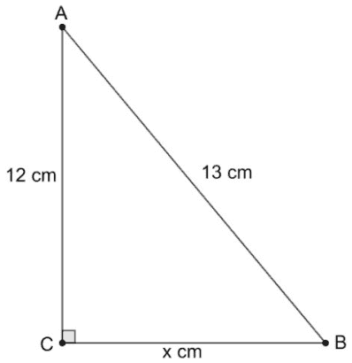
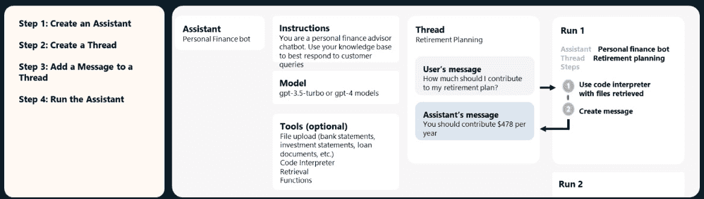

# 第三章：Azure OpenAI 高级主题

在前面的章节中，我们已经介绍了**Azure OpenAI**（**AOAI**）服务的基础知识，包括模型部署和各种定价结构。现在，我们将转向深入探讨 AOAI 中的更多高级主题。

在本章中，我们将深入探讨以下高级 AOAI 主题：

+   AOAI 模型上下文窗口

+   AOAI 嵌入模型

+   Azure 向量数据库

+   AOAI 在您的数据上

+   AOAI 多模态模型

+   AOAI 函数调用

+   AOAI 助理 API

+   AOAI 批量 API

+   AOAI 微调

# AOAI 模型上下文窗口

在**大型语言模型**（**LLMs**）的世界中，上下文窗口定义了模型一次可以处理的文本量，影响模型如何生成和理解语言。这个窗口通过令牌的数量来衡量（可以是完整的单词或碎片），直接影响模型用于预测下一个令牌的信息量。简单来说，它决定了模型在形成预测或生成响应时，考虑了多少上下文信息。

例如，GPT-3.5-Turbo（0125）模型的上下文具有 16,385 个输入令牌和 4,096 个输出令牌，而 GPT-4o 和 GPT-4o mini 模型的上下文则大得多，拥有 128,000 个输入令牌和 16,384 个输出令牌。有关 AOAI 模型上下文窗口的信息，请访问[`learn.microsoft.com/en-us/azure/ai-services/openai/concepts/models?#gpt-4-and-gpt-4-turbo-models`](https://learn.microsoft.com/en-us/azure/ai-services/openai/concepts/models?#gpt-4-and-gpt-4-turbo-models)。

LLM 的趋势正在向更大的上下文窗口发展，这使得输出更为详细和连贯。然而，这也带来了代价：更大的上下文窗口需要更多的计算能力和内存。实际上，上下文窗口定义了模型在交互过程中能够“记住”多少先前的对话内容。当对话超过上下文窗口时，模型将丢失最早的部分对话，这可能影响它在长时间交互或复杂任务中的一致性。因此，上下文窗口大小是构建使用 LLM 的应用程序时需要考虑的一个关键因素。

虽然更大的上下文窗口使得 LLMs 能够处理更多的数据，但它们也伴随着巨大的计算和财务成本。处理大量上下文长度非常昂贵且极其缓慢，这只在有限的情况下是可以接受的。例如，当处理数百万个令牌时，百万令牌的上下文窗口可能需要近一分钟才能生成一个响应。

相比之下，**检索增强生成**（**RAG**）更加高效，因为它仅获取每个查询最相关的信息，从而减少了模型需要处理的令牌数量。这种高效性使得 RAG 成为一种更具成本效益的解决方案，尤其适用于需要频繁查询或高频数据密集型任务的应用。我们将在后面的章节中详细解释 RAG。

在文本被拆分为标记后，每个标记都会转换为一种称为嵌入的数字形式。嵌入是旨在捕捉标记意义的密集向量表示。这些向量存在于一个高维空间中，其中向量之间的距离和方向可以表示它们所代表的词语之间的语义和句法关系。

在下一部分，我们将讨论 AOAI 使用的嵌入模型，该模型将标记转换为嵌入向量。

# AOAI 嵌入模型

AOAI 拥有四种不同的嵌入模型，每种模型都有特定的输入标记数和输出维度限制：

+   **text-embedding-ada-002（****版本 2）**：

    +   **最大输入** **标记数**：8,191

    +   **输出** **维度**：1536

+   **text-embedding-ada-002（****版本 1）**：

    +   **最大输入** **标记数**：2046

    +   **输出** **维度**：1536

+   **text-embedding-3-large**：

    +   **最大输入** **标记数**：8191

    +   **输出** **维度**：3072

+   **text-embedding-3-small**：

    +   **最大输入** **标记数**：8191

    +   **输出** **维度**：1536

text-embedding-3-small 和 text-embedding-3-large 是最新且最强大的嵌入模型。它们现在已在 AOAI 上可用。

## text-embedding-ada-002（版本 2）

text-embedding-ada-002 模型整合了五种不同模型的功能，用于搜索文本、比较文本相似性和搜索代码。它在大多数任务中比我们之前的顶级模型 Davinci 表现更好，并且便宜 99.8%。此模型的上下文长度为 8,192，比之前的 text-embedding-ada-002 版本更长。

你可以像使用之前的版本一样，使用几行代码调用此嵌入模型，方法是使用我们的 OpenAI Python 库：

```py
from openai import AzureOpenAI
client = AzureOpenAI(
  api_key = os.getenv("AZURE_OPENAI_API_KEY"),
  api_version = "2024-04-01-preview",
  azure_endpoint =os.getenv("AZURE_OPENAI_ENDPOINT")
)
response= client.embeddings.create(input = "<INPUT TEXT>",
              model=<deployment name>).data[0].embedding
print (response)
```

## text-embedding-3-small

text-embedding-3-small 是一种全新的、高效的嵌入模型，相比于 2022 年 12 月发布的 text-embedding-ada-002（版本 2）提供了显著的升级。

它具有改进的性能：

+   text-embedding-3-small 在 **多语言检索** (**MIRACL**) 上表现优于 text-embedding-ada-002，平均得分从 31.4% 提升至 44.0%。

+   对于 **英语任务** (**MTEB**)，平均得分从 61.0% 提升至 62.3%

它还具有更低的成本。text-embedding-3-small 比 text-embedding-ada-002 的成本效率高五倍，将每千个标记的价格从 $0.0001 降低到 $0.00002。

## text-embedding-3-large

text-embedding-3-large 是另一种新型、下一代的嵌入模型，生成的嵌入具有最多 3,072 个维度。

它具有改进的性能：

+   text-embedding-3-large 是表现最好的模型

+   在 MIRACL 上，它将平均得分从 31.4%（text-embedding-ada-002）提升至 54.9%

+   在 MTEB 上，平均得分从 61.0% 增加到 64.6%

就成本而言，text-embedding-3-large 的成本略高于 text-embedding-3-small，每千个标记的价格为 $0.00013。

AOAI 并不会停止提供 text-embedding-ada-002（版本 2），因此客户如果更喜欢，仍然可以继续使用它。然而，推荐切换到更新的模型，以获得更好的性价比。

两种新的嵌入模型都使用一种叫做`dimensions` API 参数的技术，你可以在不丢失含义的情况下减少嵌入的大小。

例如，在 MTEB 基准测试中，一个 text-embedding-3-large 嵌入可以缩短至 256 维，同时仍然优于一个未缩短的 text-embedding-ada-002 嵌入（1,536 维）。

通常，在创建嵌入时最好使用`dimensions`参数。如果之后需要更改维度，请确保嵌入已标准化，如下所示：

```py
from openai import AzureOpenAI
import numpy as np
client = AzureOpenAI(
  api_key = os.getenv("AZURE_OPENAI_API_KEY"),
  api_version = "2024-04-01-preview",
  azure_endpoint =os.getenv("AZURE_OPENAI_ENDPOINT")
)
def normalize(x):
    x = np.array(x)
    if x.ndim == 1:
        norm = np.linalg.norm(x)
        if norm == 0:
            return x
        return x / norm
    else:
        norm = np.linalg.norm(x, 2, axis=1, keepdims=True)
        return np.where(norm == 0, x, x / norm)
response = client.embeddings.create(
    model="<DEPLOYMENT NAME>",
    input="<INPUT TEXT>",
    encoding_format="float"
)
cut_dim = response.data[0].embedding[:256]
norm_dim = normalize(cut_dim)
print(norm_dim)
```

动态变化维度允许灵活使用。例如，如果一个向量数据库仅支持最多 1,536 维的嵌入，开发者仍然可以通过将`dimensions` API 参数设置为`1536`，使用最好的模型 text-embedding-3-large。这样可以将嵌入从 3,072 维缩减，牺牲一些准确度换取更小的向量大小。这为我们在下一节讨论 Azure AI Search 服务中的向量搜索功能奠定了基础。

# Azure 向量数据库

在前一节中，我们探讨了多种 AOAI 嵌入模型用于生成向量嵌入。创建这些向量后，必须拥有一个优化过的数据库来有效存储和管理它们。向量数据库与其他类型数据库的关键区别在于其能够处理高维数据。向量数据库专门设计用于将数据存储为高维向量，这些向量是各种特征或属性的数学表示。每个向量包含多个维度，数量从几十到上千不等，具体取决于数据的复杂性和细节。这些向量通常是通过将转换或嵌入函数应用于原始数据源（如文本、图像、音频、视频等）生成的。此类数据库使得可以使用向量搜索算法进行嵌入的索引和查询，评估向量的距离或相似度。为了确保准确检索相关信息，必须有一个强大的机制。主要的向量搜索算法包括**层次可导航小世界**（**HNSW**）、**倒排文件**（**IVF**）和 DiskANN 等。

向量数据库的主要优势在于它能够基于向量距离或相似度进行快速且精确的相似性搜索和数据检索。与依赖精确匹配或预定义查询标准的传统数据库不同，向量数据库可以根据语义或上下文意义识别最相似或最相关的数据。以下是一些实际应用：

+   **搜索引擎**：向量数据库通过支持基于相似性的高效搜索，改变了搜索引擎的运作方式。它们帮助查找相似的项目，提高搜索相关性，并增强用户体验。

+   **图像检索**：根据视觉内容和风格，识别与给定图像相似的图像。

+   **文档搜索**：根据主题和情感等因素，定位与给定文档相似的文档。

+   **产品推荐**：根据特征和评分，发现与给定产品相似的产品。

+   **语义搜索**：向量数据库增强了语义搜索能力，使应用能够找到具有上下文相关性的内容。这使得它们在信息检索、聊天机器人和问答系统中具有重要价值。

+   **推荐系统**：推荐系统通过利用向量数据库，根据用户的偏好提供个性化的产品推荐或内容建议，从而提高推荐的准确性。

+   **医学和科学研究**：在基因组学和化学等领域，向量数据库促进了基因数据分析、化学化合物相似性的识别，以及科学发现的加速。

要在向量数据库中执行相似性搜索和检索，需要一个封装了您期望信息或标准的查询向量。这个查询向量可以来自与存储向量相同类型的数据（例如，使用图像查询图像数据库），也可以来自不同类型的数据（例如，使用文本查询图像数据库）。下一步是使用相似性度量来确定两个向量在向量空间中的接近度或距离。为此目的，可以采用各种度量标准，如余弦相似度、欧几里得距离、汉明距离和杰卡德指数。相似性搜索和检索过程的结果通常是一个按与查询向量相似度得分排序的向量列表。随后，您可以从原始源或索引中检索与每个向量相关联的数据。

Azure 提供六种不同种类的向量数据库选项，旨在满足多样化的需求和使用场景：

+   **Azure AI Search**：Azure AI Search 是一个强大的工具，具有向量搜索功能。它利用 HNSW 算法进行向量搜索，使用 **Best Match 25**（**BM25**）算法进行全文搜索。此外，它还提供了一种混合搜索选项，结合了全文搜索和向量查询的结果，每种查询使用不同的排序方法，例如 BM25 和 HNSW。**Reciprocal Rank Fusion**（**RRF**）算法用于整合这些结果，确保生成一个统一、连贯的结果集，突出显示搜索索引中最相关的匹配项。实际上，OpenAI 利用 Azure AI Search 来增强其 ChatGPT 应用的功能。通过集成 Azure AI Search，OpenAI 受益于先进的搜索功能，如向量搜索、全文搜索和混合搜索，这些功能结合了 BM25 和 HNSW 算法的优势。这种集成使 ChatGPT 能够通过高效地检索和排序来自搜索索引的信息，提供更准确和相关的响应。

    但是，需要注意的是，Azure AI Search 不会为您的内容生成向量嵌入；您需要自己提供这些嵌入。生成这些嵌入的一个可行选项是使用 AOAI 嵌入模型。

    从架构角度来看，AI Search 服务充当外部数据存储和客户端应用之间的中介，外部数据存储存放您的未索引数据，而客户端应用则发送查询请求到搜索索引并管理响应。


图 3.1：Azure AI Search 应用架构

在您的客户端应用中，搜索体验是通过 Azure AI Search API 打造的，这些 API 可以包括相关性调整、语义排名、自动完成、同义词匹配、模糊匹配、模式匹配、筛选和排序等功能。

Azure AI Search 还提供与其他 Azure 服务的无缝集成。这通过索引器得以实现，索引器自动从各种 Azure 数据源中提取和检索数据，以及结合 Azure AI 服务的技能集，这些技能集可以包括图像和自然语言处理，或者封装在 Azure Functions 中的自定义代码。

+   `WHERE` 子句。这使得您的向量搜索能够为您的应用提供最相关的数据。

    该功能增强了 Azure Cosmos DB 的核心能力，使其在处理 AI 应用中的向量数据和搜索需求时更加多样化。

+   **Azure Cosmos DB for MongoDB**：Azure Cosmos DB for MongoDB 还提供集成的向量数据库功能，允许将嵌入存储、索引并与其他关系数据一起查询。此功能使得在 MongoDB 集合中高效管理和检索向量数据成为可能，从而增强了 Azure Cosmos DB 在多种应用需求中的适用性。

    MongoDB vCore 提供了两种类型的向量索引方法：

    +   **IVF**：IVF 索引是一种在向量搜索中使用的方法，通过将向量分组进行聚类，有效组织和管理大量向量。每个聚类由一个质心或中心点表示。在搜索过程中，查询向量首先与这些质心进行比较，以确定最接近的聚类。然后，在该特定聚类内进行搜索，显著减少搜索空间并提高检索速度。此方法平衡了速度和准确性，非常适合需要快速且高效向量搜索的应用。

    +   **HNSW**：这是一种用于高维空间中**近似最近邻**（**ANN**）搜索的先进算法，利用多层图结构组织数据点。每一层代表不同的接近度级别，较高的层包含较少、代表性更广的点，而较低的层包含更为详细的点。这个可导航的图通过从顶部层开始，向下移动以找到更近的邻居，利用“随机小世界”属性快速访问整个数据集。HNSW 提供了快速且准确的 ANN 搜索，非常适用于推荐系统、图像检索和自然语言处理等应用。

+   在 Azure PostgreSQL 灵活服务器上提供 `pgvector` 扩展，您可以将向量功能无缝集成到您的 PostgreSQL 环境中。`pgvector` 是一个为 PostgreSQL 定制的开源扩展，能够直接在 PostgreSQL 中存储和检索来自自然语言处理或深度学习模型的向量。`pgvector` 特别吸引人的地方在于其熟悉的基于 SQL 的接口，类似于传统 PostgreSQL 操作，用于创建向量列、定义包含向量列的表以及使用 L2 距离执行最近邻搜索等任务。无论您是开发 AI 应用、创建推荐系统，还是处理高维数据，`pgvector` 都简化了在熟悉的数据库框架中进行向量管理，免去了专门的存储解决方案和深入了解向量数据库的需求。

+   **Azure SQL**：Azure SQL 数据库现在支持直接在数据库中执行向量操作，能够高效地进行向量相似度搜索。结合全文搜索和 BM25 排序，这一功能使得开发适用于各种应用的强大搜索引擎成为可能。执行向量操作有两种方法：本地选项和经典选项：

    +   **本地选项**：利用 Azure SQL 数据库中新引入的向量函数。这些函数旨在直接在数据库中执行向量操作，提供简化且高效的方法。

    +   **经典选项**：使用传统的 T-SQL 进行向量操作，利用列存储索引实现高性能。

    这两种选项都为实现向量搜索提供了强大的解决方案，使得 Azure SQL 数据库成为一个适用于高级搜索场景的多功能工具。

    微软最近宣布的*SQL Server 2025*标志着数据库演变的重要一步，将其推出为企业级*向量数据库*。这一版本集成了*内置安全性和合规性*，强调其支持企业级*AI 解决方案*的重点。一个突出特点是*原生向量存储和索引*，由 DiskANN 提供支持，利用磁盘存储执行高性能搜索，适用于大规模数据集。这个功能支撑语义搜索，使得高效的分块和准确的数据检索成为可能——这是 AI 驱动的洞察所必需的关键功能。这一进展使得高维数据的高效处理成为可能，非常适合 AI 工作负载，如推荐系统、自然语言处理和图像搜索。

+   `RediSearch`模块提供了全面的搜索功能，包括多种距离度量方法，如欧几里得距离、余弦相似度和内积，并支持使用 FLAT 索引的 KNN 和使用 HNSW 索引的 ANNs。它支持以哈希或 JSON 格式存储向量，并支持通过 top-K 和向量范围查询来查找位于特定向量距离内的项。此外，Redis 通过高级功能增强了搜索功能，如地理空间过滤、数值和文本过滤、前缀和模糊匹配、语音匹配和布尔查询。Redis 通常被认为是一种具有成本效益的解决方案，广泛用于缓存或会话存储，使其能够同时处理传统的缓存角色和向量搜索应用。

大多数 Azure 向量数据库，如 AI Search、CosmosDB 和 Azure 托管 Redis，都与 LLM 框架如 Semantic Kernel、LangChain 和 LlamaIndex 集成，以便轻松创建向量并将其导入到各自的服务中。这些集成简化了嵌入生成、存储和检索的过程，使得向量数据的高效处理成为可能，并增强了 GenAI 应用的能力。

Azure 还提供了一种无需编码的解决方案，用于创建向量嵌入并将其自动导入到 Azure AI Search 或 Cosmos DB，作为其原生功能的一部分。在接下来的部分，我们将探索这个能力，作为*AOAI On* *Your Data*的一部分。

# AOAI On Your Data

在各行各业中，一个常见的应用是利用生成性 AI 创建个性化聊天机器人，通过使用自身的企业数据。传统上，这要求客户手动编写代码，从非结构化数据中提取文本，生成嵌入，并将其存储在向量数据库中，这对开发者来说既耗时又劳动密集。然而，Azure OpenAI 的 On Your Data 功能显著简化了这一工作流程，使开发者能够在几乎不编写任何代码的情况下实现相同的结果。这意味着，构建一个聊天机器人应用程序现在只需几次点击即可完成。

此功能在后台使用 RAG 技术，如*图 3.2*所示。


图 3.2：AOAI 在您的数据中的 RAG 架构

当你上传各种格式的文档集合时，这些文档会被拆分成更小的块。每个块会被转换为嵌入，例如 *text-embedding-ada-002*，并使用 AOAI 的嵌入模型进行处理。这些嵌入会存储在 AI 搜索向量数据库中，利用 HNSW 索引进行语义搜索。用户可以通过 GPT4-o 聊天输入查询，这些查询也会使用相同的嵌入模型转换为嵌入。然后，使用 ANN 技术在 HNSW 索引上进行相似性搜索，找到最相关的文档向量。接着，将检索到的上下文和原始用户查询提供给 GPT 模型，以生成对用户问题的回答。

此外，Azure RBAC 确保整个系统的安全访问和权限控制。整个过程简化且用户友好，让你可以专注于利用洞察，而不必处理技术复杂性。

重要提示

在使用“On your Data”功能之前，请确保已设置 Azure AI Search 资源。要设置 Azure AI Search 资源，请参考 [`learn.microsoft.com/en-us/azure/search/search-create-service-portal`](https://learn.microsoft.com/en-us/azure/search/search-create-service-portal) 中提供的说明。

现在，让我们演示如何在不编写任何代码的情况下轻松使用此功能：

1.  登录到 Azure AI Foundry 门户。

1.  如果你还没有设置聊天模型和嵌入模型，前往 `text-embedding-ada-002`。

1.  从 **Playgrounds** 菜单中导航到 **Chat**，然后选择 **Add your** **data** 标签。

1.  点击 **Add a** **data source**。

    你可以选择多种数据源。在本演示中，我们手动上传文件。你也可以选择直接使用 Blob 存储帐户，如果你的数据已经在那里。如果你有一个 AI 搜索索引，数据已经预先索引并向量化，你也可以连接到该索引。

1.  选择适当的订阅和您上传数据将存储的 blob 存储账户。接下来，选择用于存储向量索引的**Azure AI 搜索资源**选项，最后指定索引名称。

1.  勾选复选框以启用此 AI 搜索资源的向量搜索功能。有关详细信息，请参见*图 3.3*。


图 3.3：AOAI On Your Data 设置

1.  点击**下一步**。

1.  在接下来的屏幕上，上传一个 PDF 文件。您还可以上传 `.txt`、`.md`、`.html`、`.pdf`、`.docx` 或 `.pptx` 格式的文件。在此示例中，我上传的是一张酒店发票的 PDF 收据。有关收据的示例视图，请参见*图 3.4*。


图 3.4：AOAI On Your Data 的示例数据

1.  点击**下一步**。

1.  选择您想要使用的**搜索类型**选项。您可以从以下三种选项中进行选择：

    +   **向量**：该选项通过向量嵌入查找与查询相似的文档。

    +   **混合**（向量 + 关键词）：该选项结合了基于向量字段的相似性搜索和基于关键词的全文搜索。

    +   **混合 + 语义**：该选项利用向量嵌入、语言理解和灵活的查询解析，提供高级搜索体验。由于其卓越的搜索质量，强烈推荐此选项。

    选择正确的类型可以根据您的具体需求增强搜索能力。

1.  选择块大小。分块涉及将文档拆分为更小的部分，以提高搜索和检索效率，块大小以标记为单位进行测量。

1.  点击**下一步**。在接下来的屏幕上，选择认证类型。

1.  索引所需的时间可能会随着文档大小的增加而增加。

1.  选择要使用的**部署**选项，并填写**系统消息**字段，如*图 3.5*所示。然后点击**应用更改**。


图 3.5：On Your Data 设置

1.  现在，您已准备好从**Chat playground**开始聊天。

1.  请参见*图 3.6*了解示例问题。您可以根据提供的文档提问并获得准确的答案。点击参考文献查看答案的引用。


图 3.6：带参考的示例问题和答案

您已经观察到答案是如何基于您的数据使用 AOAI On Your Data 功能生成的。如果您打算开发一个 Web 应用并将其部署到生产环境，只需点击**作为 Web 应用部署**，并按照*图 3.7*所示填写应用服务详情。然后点击**部署**，为用户创建一个 Web 应用。


图 3.7：Chat On Your Data 网络应用设置

部署后，您将收到应用程序的公共 URL，允许最终用户与他们上传的文档进行互动，如下所示：


图 3.8：Web 应用视图

这个过程简化了应用部署，使你只需几次点击就能将聊天应用提供给最终用户，无需编写代码。这是一个快速部署和共享应用的高效方式。然而，需要注意的是，虽然该功能非常适合小规模的**概念验证**，但开发一个健壮的生产应用仍需要仔细考虑各个因素，以提高准确性。这些因素包括分块策略、查询重写以及定制提示模板的设计。鉴于这些能力的局限性，通常需要采用代码优先的方法来创建更复杂和量身定制的解决方案。

到目前为止，我们已经将 AOAI 模型应用于文本相关的场景。然而，也有一些场景需要理解图像。在接下来的部分，我们将探索 AOAI 的多模态能力，其中输入是图像，输出是文本。通过结合视觉数据分析，这种方法拓宽了 AOAI 的应用范围。

# AOAI 多模态模型

AOAI 多模态能力可以应用于各种现实世界场景，具体如下：

+   **图像标注**：自动生成图像的描述性文本，适用于组织数字照片集或帮助视障用户

+   **音频处理**：低延迟对话场景，要求用户与模型之间实时互动，例如客户支持聊天机器人、语音助手和实时翻译服务

+   **视觉问答**：回答关于图像的问题，可以增强互动教育工具或客户支持系统

+   **内容审查**：分析图像以检测不当或有害内容，提高社交媒体平台的安全性

+   **电子商务**：从图像中提供产品描述，帮助目录管理并改善用户搜索体验

+   **医疗健康**：通过解读医学图像并提供初步报告来辅助医学诊断

这些应用场景展示了集成视觉和文本数据处理的多样性。为了实现这些功能，AOAI 提供了一个带有内建多模态特性的 GPT-4 类别模型。目前，AOAI 在 GPT-4 系列中提供了三种不同的模型，支持这些原生的多模态能力：

+   GPT4-Turbo

+   GPT4-o

+   GPT4-o-mini

现在，让我们测试 GPT4-o 的多模态能力，来自**Chat playground**：

1.  登录到 Azure AI Foundry 门户。

1.  导航到**Playgrounds**菜单中的**Chat from**。

1.  上传图片到聊天中并提问。或者，你可以通过 SDK 提供一个 base64 编码的图像作为输入，以便模型处理。为了说明，我使用了*图 3.9*。



图 3.9：GPT4-o 示例图

你可以提问如下问题：

`"CB 线的尺寸是多少？"`

尽管 AOAI GPT4-o 的视觉能力在各类应用中非常多样且有用，但必须认识到它的局限性。以下是需要注意的几个关键限制：

+   **医学图像**：模型并不适用于解释专门的医学图像，如 CT 扫描，因此不应用于医学建议

+   **非英语文本**：处理包含非拉丁字母文本的图像（如日语或韩语）时，性能可能会下降

+   **小文本**：为了提高可读性，放大图像中的小文本，但要确保没有重要细节被裁剪掉

+   **旋转问题**：模型可能会误解被旋转或倒置的文本或图像

+   **视觉元素**：理解带有不同颜色或样式的图表或文本，如实线、虚线或点线，对于模型来说可能是具有挑战性的

+   **空间推理**：需要精确空间定位的任务，如识别国际象棋位置，对于模型来说是困难的

+   **准确性**：在某些情况下，模型可能会生成不准确的描述或说明

+   **图像形状**：全景图和鱼眼图像对模型来说存在困难

+   **元数据和调整大小**：模型不会处理原始文件名或元数据，图像会在分析前调整大小，这可能会影响其原始尺寸

+   **计数**：模型可能会提供图像中物体的近似计数

+   **验证码**：出于安全原因，系统配置为阻止提交验证码

了解这些限制有助于客户设定现实的期望，并确保模型的正确应用。

现在我们已经了解了 GPT4-o 视觉功能的能力和局限性，让我们来看看图像输入的成本模型。

## 图像的 token 成本

图像输入与文本输入一样，都是按 tokens 计费。图像的 token 成本受两个主要因素的影响：图像的尺寸和为每个图像 URL 块指定的细节级别。以下是详细的分解：

+   **低细节**：每张设置为**低**细节的图像需要 85 个 tokens。

+   **高细节**：对于高细节图像，处理过程较为复杂。首先，图像被缩放至 2,048 x 2,048 的正方形，并保持其长宽比。接着，图像再次缩放，使其最短边为 768 像素。然后，计算构成图像的 512 像素方块数量，每个方块需要 170 个 tokens。最终，额外增加 85 个 tokens。

让我们看一些例子：

+   **1,024 x 1,024 高细节图像**：

    +   由于 1,024 小于 2,048，因此不需要初步调整大小

    +   图像被缩小至 768 x 768，因为最短边为 1,024

    +   这需要四个 512 像素的块

    +   token 成本计算如下：170 tokens/块 * 4 块 + 85 tokens = 765 tokens。

+   **2,048 x 4,096 高细节图像**：

    +   图像首先被缩放到 1,024 x 2,048，以适应 2,048 平方的范围

    +   最短边为 1,024，因此进一步缩放至 768 x 1,536

    +   这需要 6 个 512 像素的瓦片

    +   令牌成本计算如下：170 令牌/瓦片 * 6 个瓦片 + 85 令牌 = 1,105 令牌

+   **4,096 x 8,192 图像的** **低细节**：

    +   无论输入大小如何，低细节图像具有固定成本

    +   令牌成本为 85 个令牌

理解这个令牌成本结构可以帮助有效管理图像输入时的资源使用。

到目前为止，我们已经探讨了 AOAI 模型的自包含功能。然而，企业中有一些用例需要客户将 LLM 与外部系统或工具集成。这允许将自然语言查询转换为这些系统可执行的结构化输入。在下一部分，我们将讨论开发人员如何通过使用 AOAI 的函数调用功能来实现这一功能。

# AOAI 函数调用

AOAI 函数调用允许你将 GPT-4o 等模型与外部工具和系统连接。这对于增强 AI 助手的能力或在应用程序与模型之间创建无缝集成非常有利。

此功能并不会直接为你运行函数。相反，你在 API 调用中定义函数，模型会弄清楚如何生成所需的参数。在这些参数生成后，你可以用它们在代码中执行函数。

函数调用对许多应用程序有益，例如：

+   **允许助手检索信息**：AI 助手可能需要访问来自内部系统（例如 Azure Cosmos DB 或 Azure SQL）的最新客户数据，以回答用户关于近期订单的查询

+   **使助手执行任务**：AI 助手可以根据用户偏好和日历可用性安排会议

+   **协助计算**：数学辅导助手可以根据需要执行计算

+   **创建复杂工作流**：例如，数据提取过程可以收集原始文本，将其转换为结构化数据，并将其存储在数据库中

+   **修改应用程序的用户界面**：函数调用可以根据用户的操作更新 UI，例如在地图上显示一个图钉

现在，让我们讨论一下 AOAI 函数调用的生命周期。

## 函数调用生命周期

函数调用有五个不同的阶段，如*图 3.10*所示：

1.  你的代码通过调用 API 并提供提示和 LLM 可以访问的函数来启动该过程。

1.  模型评估是否直接响应用户，还是需要调用一个或多个函数。

1.  API 回复你的应用程序，指定应该调用哪个函数以及所需的参数是什么。

1.  你的应用程序使用提供的参数运行指定的函数。

1.  您的应用程序将与 API 进行通信，发送初始提示以及已执行函数的结果。


图 3.10：函数调用生命周期

在使用 OpenAI API 进行函数调用时，模型本身并不会执行这些函数。相反，在*步骤 3*中，模型生成函数的参数，供您的应用程序使用。您的代码决定如何处理这些参数，通常通过调用指定的函数。这确保了您的应用程序对执行过程保持完全控制。

函数调用支持在 Chat Completions、Assistants 和 Batch APIs 中。本节重点介绍使用 Chat Completions API 进行函数调用。Assistant 和 Batch APIs 将在下一节中讨论。

让我们开始吧。

### 步骤 1 – 定义函数

首先，指定您打算调用的函数。该函数应为一个 Python 函数，能够接受输入并提供输出。函数的输入将由模型生成。

在此示例中，假设您希望启用模型在您的代码库中执行 `get_weather` 函数。该函数将城市作为参数，以从天气 API 检索天气信息。您的函数可能如下所示：


图 3.11：get_weather 函数定义

### 步骤 2 – 为模型使用描述函数

现在我们已经确定了要让模型调用的函数，我们将开发一个*函数定义*。它将解释函数的功能、何时使用以及调用该函数所需的参数。

函数定义中的参数部分应使用 JSON Schema 进行概述。当模型生成函数调用时，它将参考此模式以适当创建参数。

在此示例中，它可能看起来像*图 3.12*。


图 3.12：函数的 JSON Schema

### 步骤 3 – 将函数定义作为“工具”提供给模型

接下来，我们需要在使用 Chat Completions API 时，将我们的函数定义包含在可用的*工具*数组中。像往常一样，我们会提供一个*消息*数组，可能包括您的提示或用户与助手之间的完整对话。

如*图 3.13*所示，本示例演示了如何调用 Chat Completions API，提供相关的函数和消息，以便正确生成带有唯一 ID 的函数调用。


图 3.13：生成函数调用

默认情况下，模型设置为自动决定调用哪些函数，基于 `tool_choice`：“`auto`” 配置。

我们提供了三种选项来修改此默认行为：

+   要强制模型始终调用一个或多个函数，你可以设置`tool_choice: "required"`。这确保模型总是会选择至少一个函数来执行，在你希望模型在多种操作之间做出选择时，这会非常有用。

+   要指示模型使用特定的函数，你可以定义`tool_choice: {"type": "function", "function": {"name": "my_function"}}`。这将强制模型只调用指定的函数。

+   为了防止任何函数调用并使模型只返回面向用户的消息，你可以完全省略工具，或者设置`tool_choice: "none"`。

### 第 4 步 - 进行实际的函数调用

如前所述，AOAI 函数调用不会自动触发实际的函数。相反，你必须根据模型生成的输入参数添加代码来触发调用。为此，请参考*图 3.14*中所示的代码。


图 3.14：进行函数调用

当你在请求中包含一个函数时，函数的详细信息（如定义和参数）会成为系统消息的一部分，然后与用户输入一起由模型处理。这种集成使得模型能够根据提示上下文评估是否应该调用该函数。

这个过程确实会使用到令牌，因为函数定义和参数会影响总体令牌计数。因此，采用提示工程策略，例如简洁明了、去除不必要的细节以及专注于提示的关键部分，可以提高函数调用的效率。

这里还有一些优化函数调用效率的方法：

+   **增加更多的函数定义细节**：包括详细的函数定义和有意义的描述对于清晰度和高效的函数调用至关重要。定义函数时，每个参数应以便于模型和任何审查代码的人员理解的方式进行描述。以下是如何使函数定义更全面的详细说明。

+   `search_hotels`，你可以设置如下的系统消息：

    ```py
    {"role": "system", "content": "You're an AI assistant designed to help users search for hotels. When a user asks for help finding a hotel, you should call the search_hotels function."}
    ```

    这可以根据用户输入通知模型何时调用函数。

+   `search_hotels`，如果用户请求中缺少位置详情，询问相关信息。在你的系统消息中包括类似的指示，以指导模型：

    ```py
    {"role": "system", "content": "Avoid assuming values for functions; instead, seek clarification when a user's request is unclear."}
    ```

+   **错误处理**：提示工程中的另一个关键方面是最小化函数调用中的错误。尽管模型经过训练能够根据你定义的模式生成函数调用，但有时它们可能会创建与模式不匹配的调用，或者尝试调用未包含的函数。

    为了解决这个问题，你可以在系统消息中加入如下语句：

    ```py
    {"role": "system", "content": "Only use the functions you have been provided with."}
    ```

    这有助于确保模型严格遵守你定义的函数。

现在你已经了解如何调用 AOAI 函数，接下来的部分将重点介绍 AOAI 助手 API，它简化了开发人员的应用开发过程。

# AOAI 助手 API

AOAI 助手 API 支持创建可以直接集成到你自己应用中的 AI 助手。这些助手基于一套预定义的指令操作，并可以通过利用各种功能，如模型、工具和文件，来与用户互动。目前，助手 API 支持三种主要类型的工具：

+   **代码解释器**：此功能使得助手能够处理用户对计算或脚本执行的请求，通过允许助手在安全的、多租户的 Kubernetes 环境中编写和运行 Python 代码。Kubernetes 沙箱利用嵌套虚拟化技术来隔离每个容器，提供独特的用户空间内核，而非传统的内核。这种设置通过隔离环境来增强安全性，减少通过防止容器间干扰来降低风险，并提高系统灵活性。通过在安全的虚拟化环境中促进代码执行，助手能够动态应对复杂的计算、数据处理和文件处理。

    该工具支持多种数据格式（[`learn.microsoft.com/en-us/azure/ai-services/openai/how-to/code-interpreter?tabs=python#supported-file-types`](https://learn.microsoft.com/en-us/azure/ai-services/openai/how-to/code-interpreter?tabs=python#supported-file-types)），可以处理各种结构的文件，根据需要提取信息。代码解释器支持迭代代码执行，使得助手在初次执行失败时能够调整代码并重新执行，这对于复杂的编码和数学问题特别有帮助。常见的应用场景包括从 CSV 文件中提取数据、创建结构化数据可视化（如图表和图形）以及解决数学问题。

+   **文件搜索**：AOAI 文件搜索工具允许助理通过访问和检索用户提供的文档中的信息来增强基于文件的查询处理。作为一个外部知识库，它让助理能够超越模型训练数据，检索专有内容或其他基于文档的信息。AOAI 的系统会自动按切块策略将文档拆分，并通过创建向量嵌入并将其存储在由 Azure AI Search 支持的管理向量存储中来索引文档。这使得基于向量和关键词的搜索都可以进行，从而支持更精确、基于上下文的信息检索，支持各种格式，详情请见[`learn.microsoft.com/en-us/azure/ai-services/openai/how-to/file-search?tabs=python#supported-file-types`](https://learn.microsoft.com/en-us/azure/ai-services/openai/how-to/file-search?tabs=python#supported-file-types)。通过将文档内容转化为向量嵌入，文件搜索使得搜索能够理解上下文和意义，而不仅仅是匹配确切的关键词。这一功能特别适用于需要细致理解和快速检索的任务，如详细的问答、总结和数据提取。该工具也非常灵活，可以处理各种文档格式，便于集成到需要复杂文档交互的工作流中。

+   **函数调用**：此工具允许助理调用应用程序中的特定函数，使其能够通过 API 接口执行任务或检索数据。我们之前已经详细介绍了函数调用，突出了它在增强助理互动能力方面的作用。

这些工具使得构建针对应用程序中具体用例的动态和响应性 AI 助理变得更加容易。

现在，让我们讨论助理的流程。

## 助理流程

设置和运行一个 AI 助理（如财务机器人）通常涉及四个关键步骤。以财务机器人为例，如*图 3.15*所示，步骤如下：



图 3.15：AOAI 助理的流程

### 第 1 步——创建助理

助理是一个实体，可以通过各种参数（如模型、指令和工具）进行定制，以响应用户输入。助理可以通过 AOAI 使用 OpenAI 模型，并可以根据提供的指令定制以适应不同的个性或能力。你可以为助理配备工具，既可以是预先构建的工具，如`code_interpreter`和`file_search`，也可以通过函数调用提供自定义工具。这些工具帮助助理根据用户的查询执行特定任务。Assistants API 支持多个参数，允许你定制助理的输出。`tool_choice`参数允许你强制助理使用指定的工具。

### 第 2 步——创建线程

线程（Thread）是用户与一个或多个助手之间对话的记录。当用户（或 AI 应用程序）发起对话时，会创建一个新的线程。助手可以访问持久化的线程，从而在不丢失上下文的情况下进行连续对话。这简化了 AI 应用程序的开发，通过保留消息历史并通过在对话超出模型的上下文窗口时截断较旧的数据，有效管理内存。线程一旦创建，就会随着新消息的交换而更新。

### 步骤 3 – 向线程添加一条消息

在对话过程中交换的消息，无论是来自用户还是应用程序，都会作为**消息**对象存储在线程中。这些消息可以包含文本和文件。虽然线程可以存储最多 100,000 条消息，但系统通过智能管理对话，在超出模型上下文窗口时自动截断任何内容，确保助手自动截断文本以保证对话保持在模型的最大令牌限制内。然而，您可以通过指定每次运行应包含多少令牌或最近消息来调整此行为。

为了在单次运行中管理令牌使用量，可以在开始时设置`max_prompt_tokens`和`max_completion_tokens`。这些限制适用于整个运行过程中所有的补全。例如，如果将`max_prompt_tokens`设置为`500`，将`max_completion_tokens`设置为`1000`，助手首先会截断提示词，使其适应 500 个令牌，并将输出限制为 1000 个令牌。如果提示词只用了 200 个令牌，补全用了 300 个令牌，下一次补全将有 300 个提示词令牌和 700 个补全令牌可用。

如果补全达到了`max_completion_tokens`的限制，运行将以不完整状态停止，并且原因将包含在`Run`对象的`incomplete_details`字段中。

在使用文件搜索工具时，建议将`max_prompt_tokens`设置为不少于`20000`。对于更大规模的对话或使用文件搜索的多个交互，考虑将此限制提高到`50000`，甚至完全去除该限制以获得最佳效果。

您还可以定义一个**截断策略**来控制线程如何适应模型的上下文窗口：

+   使用`auto`截断策略将应用 OpenAI 的默认截断行为

+   使用`last_messages`策略可以指定在上下文中包含多少条最近的消息。

这种方法让你在管理对话长度和确保每次运行的最佳性能方面有更多控制权。

### 步骤 4 – 创建一个运行

在所有用户消息添加到线程后，启动一个运行来处理对话。该运行利用为助手定义的模型和工具生成回应。然后，助手的回应作为新消息添加到线程中，继续对话的流程。

现在我们已经涵盖了助手的 API 流程，让我们继续设置助手。

## AOAI 助手 - 代码解释器

在本节中，我们将指导您逐步完成在 Azure AI Foundry 门户中设置助手的过程，并演示如何使用代码解释器工具处理 CSV 数据上的用户查询。您也可以通过基于 API 的方法实现相同的功能：

1.  登录 Azure AI Foundry 门户。

1.  如果您尚未设置聊天模型，请转到 **共享资源** 菜单中的 **部署** 部分。从那里启动新聊天模型的部署，例如 **GPT4-o**。

1.  导航到 **来自 Playground 的助手** 菜单，选择 **GPT4-o** 部署，并点击 **创建助手**。

1.  在 **设置** 页面，您会看到已经创建了一个助手 ID。在这里，您可以为助手指定名称并编写自定义指令，以明确其目标，如下所示：


图 3.16：助手设置

1.  在 **工具** 部分，启用 **代码解释器** 并上传 CSV 文件以查询。对于此示例，我们将使用一个包含零售订单数据的示例 CSV 文件。该文件的一部分如下所示：


图 3.17：CSV 文件示例

1.  上传 CSV 数据后，您可以开始询问相关查询。例如，您可以询问：“`到目前为止已发货多少订单？`”。或者，您也可以使用以下提示：“`创建一个图表，横轴为订单状态，纵轴为数量。`”。

对于这种类型的问题，代码解释器工具将在 Microsoft 管理的沙箱环境中执行 Python 代码，并为您提供结果，如下所示：


图 3.18：代码解释器输出

在下一节中，我们将介绍如何使用 SDK 方法将文件搜索功能集成到助手中。

## AOAI 助手 - 文件搜索

使用 OpenAI SDK，您可以直接编程助手以搜索文档并根据需要提取特定的函数签名。文件搜索将使助手能够解析、分块并索引文档，以便通过 SDK 高效地检索。您可以在应用程序中无缝配置这些工具，从而增强助手的数据检索和交互能力：

1.  首先，我们需要创建一个新的助手，并将文件搜索作为其工具集的一部分，如下所示：


图 3.19：创建助手

1.  上传您的文件以启用自动分块（分块大小为 800 个标记，分块重叠为 400 个标记）。嵌入并创建一个向量存储，驱动文件搜索工具，如下所示：


图 3.20：向量存储创建

1.  将向量存储附加到助手上，以便访问文件，如下所示：


图 3.21：将向量存储附加到助手

1.  创建线程并运行助手，如下所示：


图 3.22：创建线程并运行

1.  显示带引用的助手响应，如下所示：


图 3.23：带引用的助手响应

现在，你可以看到如何使用各种工具（如文件搜索和代码解释器）简单地调用助手 API。此外，你还可以通过函数调用功能使用助手 API 与外部系统进行交互。这些助手能够利用 OpenAI 的先进语言模型，使用如代码解释器和文件搜索等工具，并在整个对话过程中保持上下文。

在接下来的部分，我们将讨论 AOAI 批处理，它是为不需要实时处理的用例设计的。

# AOAI 批处理 API

一些应用需要同步请求处理，也叫实时推理，要求立即响应。然而，也有许多情况下响应可以延迟，或者速率限制可能会限制多个查询处理的速度。在这种情况下，批处理作业显得特别有用，尤其是在以下任务中：

+   大规模数据处理

+   生成大量内容并进行大规模数据转换

+   评估 LLM 模型并全面评估性能

AOAI 批处理 API 提供了一套用户友好的端点。这些端点允许你将多个请求打包成一个文件，启动一个批处理作业以异步处理这些请求，检查批处理的状态并运行任务，最后在处理完成后获取合并的结果。

相较于传统的 PAUG 部署，批处理 API 提供了以下优势：

+   **成本效益**：相对于标准的 PAUG 部署，提供 50%的成本减少

+   **专用配额**：使用单独排队的令牌配额，与在线端点配额不同，确保在线工作负载不受影响；批处理配额也显著更大

+   **24 小时周转**：每个批处理在 24 小时内完成，通常能更快地获得结果

提交批处理并获取结果涉及六个步骤。让我们详细了解每个步骤：

1.  **批处理部署创建**：你需要首先为批处理创建一个单独的部署。为此，请按照以下步骤操作：

    1.  登录到 Azure AI Foundry。

    1.  导航至**部署**下的**共享资源**。

    1.  点击**部署模型**并选择**部署基础模型**。

    1.  选择任何聊天完成模型，如 gpt-4o-mini，并点击**确认**。

    1.  在**部署名称**下提供一个值，将**部署**类型设置为**全局批处理**，将**排队令牌**值调整为最大限制，然后点击**部署**。


图 3.24：批处理部署

您还可以切换**启用动态配额**，当有额外容量可用时，它允许您使用更多配额。

完成前面的步骤后，您的**全局批处理**部署将会创建。然后，这个部署将用于运行批处理任务。

1.  `.jsonl` 文件，其中每一行指定一个单独 API 请求的详细信息。目前，支持的端点是`/chat/completions`（用于聊天完成 API）。

    在此输入文件中，每行的正文字段中的参数应与相应端点的参数匹配。每个请求必须包含一个唯一的`custom_id`值，该值有助于在处理完成后引用结果。文件中的`model`名称应与您在前一步骤中创建的部署名称匹配。

    以下是一个输入文件的示例，如下所示，包含三个请求。每个输入文件必须仅限于单一模型的请求：


图 3.25：批处理输入 .jsonl 文件

1.  **上传批处理输入文件**：在准备好输入文件后，您需要上传它才能启动批处理任务。您可以通过编程方式或通过**Studio**界面上传文件。在此示例中，我们使用 Python SDK 方法从本地驱动器上传文件。请参见*图 3.26*以获取参考。


图 3.26：批处理文件上传

1.  `File` 对象用于启动批处理。在此示例中，文件 ID 为`file-0a27a5cd4d94440789971497e6d80391`。目前，完成窗口固定为 24 小时。您还可以使用可选的`metadata`参数包含自定义元数据，如*图 3.27*所示。

    这将返回一个批处理对象，包含批处理 ID 和状态字段。您可以在[`learn.microsoft.com/en-us/azure/ai-services/openai/how-to/batch?tabs=standard-input%2Cpython-key&pivots=programming-language-python#batch-object`](https://learn.microsoft.com/en-us/azure/ai-services/openai/how-to/batch?tabs=standard-input%2Cpython-key&pivots=programming-language-python#batch-object)中查看批处理对象的完整详情。


图 3.27：批处理任务提交

1.  **跟踪批处理任务状态**：成功创建批处理任务后，您可以通过**Studio**或编程方式监控其进度。在检查状态时，建议每次状态调用之间等待至少 60 秒，如*图 3.28*所示。


图 3.28：批处理任务状态检查

给定批处理对象的状态可以是下表中显示的任何一种状态，见*表 3.1*。

| **Status** | **Description** |
| --- | --- |
| `validating` | 输入文件正在验证中，批处理才能开始 |
| `failed` | 输入文件未通过验证过程 |
| `in_progress` | 输入文件已成功验证，批处理正在运行 |
| `finalizing` | 批处理已完成，结果正在准备中 |
| `completed` | 批处理已完成，结果已准备好 |
| `expired` | 批处理未在 24 小时内完成 |
| `cancelling` | 批处理正在取消中（可能需要最多 10 分钟） |
| `cancelled` | 批处理已取消 |

表 3.1：批处理作业状态表

1.  从 `Batch` 对象中获取 `output_file_id`。然后将其保存为您计算机上的文件，例如 `batch_output.jsonl`。`output.jsonl` 文件将包含每个成功请求的响应。任何失败的请求将在单独的错误文件中包含其错误详情，该文件可以通过批处理的 `error_file_id` 访问。

重要提示

输出行的顺序可能与输入顺序不匹配。请不要依赖顺序，而应使用每个输出行中的 `custom_id` 字段，将输入请求与其对应的结果关联。


图 3.29：检索输出文件

通过按照上述步骤操作，您可以手动提交批处理作业。

尽管这些步骤适用于演示目的，但对于存储帐户中有数百万个文件的企业来说，仍然需要一个自动化解决方案来有效地提交批处理并检索结果。在这种情况下，您可以使用以下解决方案加速器：

[`github.com/Azure-Samples/aoai-batch-api-accelerator`](https://github.com/Azure-Samples/aoai-batch-api-accelerator)

AOAI 批处理 API 有一定的服务限制，可以在 [`learn.microsoft.com/en-us/azure/ai-services/openai/how-to/batch?tabs=standard-input%2Cpython-key&pivots=programming-language-python#global-batch-limits`](https://learn.microsoft.com/en-us/azure/ai-services/openai/how-to/batch?tabs=standard-input%2Cpython-key&pivots=programming-language-python#global-batch-limits) 查找。配额限制详见 [`learn.microsoft.com/en-us/azure/ai-services/openai/how-to/batch?tabs=standard-input%2Cpython-key&pivots=programming-language-python#global-batch-quota`](https://learn.microsoft.com/en-us/azure/ai-services/openai/how-to/batch?tabs=standard-input%2Cpython-key&pivots=programming-language-python#global-batch-quota)。这些限制可以根据您的工作负载进行增加；如果需要增加配额，请联系微软。

您还可以使用 AOAI 批处理 API 批量处理图像。此功能适用于特定的多模态模型，目前只有 GPT-4o 支持批量请求中的图像。图像可以通过 URL 或 Base64 编码的数据提供。请注意，GPT-4 Turbo 当前不支持批处理中的图像输入。

AOAI 批处理具有全球性质，这意味着数据处理可能发生在世界任何地方。这可能会引发那些有严格法规要求的行业的关注。然而，你可以为 AOAI 批处理选择数据区域，限制数据处理仅在特定地区进行。通过选择美国数据区，处理将在美国的某个区域进行；选择欧盟数据区，处理则会在欧盟的某个区域进行。这确保了企业可以遵守数据合规和监管要求。

现在我们已经讲解了 AOAI 批量 API，接下来的部分将聚焦于微调，它使你能够根据特定任务定制模型。

# AOAI 微调

微调使你能够通过以下方式最大化 Azure AI Foundry 或 API 提供的模型潜力：

+   与仅使用基本提示相比，响应质量得到改进

+   能够在更大的数据集上进行训练，突破了模型上下文窗口的限制

+   通过最小化提示长度减少令牌使用

+   更快速的响应时间和更低延迟的请求

AOAI 的文本生成模型是基于大量文本数据预训练的。为了有效使用这些模型，用户通常会在提示中加入指令和示例案例——这种方法被称为**少量示例学习**。少量示例学习通过在提示中展示少量示例来演示如何完成任务。

微调通过在模型上训练更多的示例数据来增强少量示例法，从而在更广泛的任务中提升性能，而这些数据无法完全包含在单个提示中。经过微调后，通常在提示中所需的示例较少，这样不仅减少了令牌使用量，还进一步降低了响应延迟。

## 利用微调的理想情况

在评估微调是否适用于特定用例时，理解一些基础概念是有益的：

+   **提示工程**：该技术涉及精确地为自然语言处理模型设计提示。通过仔细设计提示，用户可以提高模型响应的准确性和相关性，从而提升整体性能。第十三章深入探讨了各种提示工程技术。

+   **RAG**：RAG 通过将外部数据集成到提示中，增强了 LLM 的效果。通过从外部来源检索相关信息，RAG 使企业能够创造量身定制的解决方案，这些解决方案既具有成本效益，又在上下文上更加准确。

+   **微调**：微调是通过在特定示例数据上重新训练现有的 LLM，从而调整其以反映提供的示例数据集的细微差别和要求，结果是一个*定制化*的模型。

AOAI 微调是一个**监督微调**过程，与持续预训练或**通过人类反馈强化学习**（**RLHF**）不同。监督微调涉及在精心选择的数据集上重新训练预训练模型，以提高在特定任务上的表现。我们建议从提示工程、提示链（将复杂任务分解为更小、更易管理的提示）和利用函数调用等技术开始，以实现最佳效果。

AOAI 使用**低秩近似**（**LoRA**）通过降低模型复杂度，且对性能影响最小，来高效地微调模型。该方法通过使用低维矩阵来近似模型原始的高维矩阵，允许在监督训练过程中仅对部分关键参数进行微调。通过专注于这些*关键*参数，模型保持了高效性并更易于管理。对于用户而言，与传统方法相比，这将带来更快速的训练和更具成本效益的微调。

微调是一个复杂的过程，要求有扎实的领域和数据理解才能有效应用。接下来五个常见问题旨在帮助您评估是否准备好进行微调，指导您考虑关键因素，并帮助您决定微调是否是最佳方法，或是否有更适合的替代方法：

+   **为什么微调** **一个模型？**

    为了有效进行微调，您应该清晰定义具体的应用场景，并识别您打算微调的模型。适合微调的情况包括需要模型以特定风格、语气或格式输出，或者当用于指导模型的指令或数据过于复杂或冗长，无法放入标准提示中时。

    以下是一些表明您可能还没有准备好进行微调的指标：

    +   **用例不明确**：如果您无法清楚地表达出一个明确的目的，除了*我想要改进模型*之外，微调可能不是下一步正确的选择。

    +   **成本驱动的动机**：微调可以在允许使用更短提示或更小模型的情况下减少成本。然而，它也涉及到为训练和托管定制模型的前期成本。请留意这些费用，并参考 AOAI 的定价页面，了解更多关于微调成本的细节。

    +   **超出领域的知识需求**：如果您的主要目标是将超出模型原始训练范围的信息整合进来，考虑从 RAG 开始。AOAI 的 RAG 功能，例如基于嵌入的检索，可以根据您的具体数据和目标提供更加灵活且通常更具成本效益的解决方案。

+   **您到目前为止** **尝试了什么？**

    微调是一项高级功能，通常不是与生成性 AI 合作的第一步。你需要熟悉 LLM 的基础知识，并从测试模型性能、使用提示工程和/或 RAG 开始。这些技术帮助你建立一个基准性能水平，这对于评估微调是否真正提升了模型非常重要。

    没有微调的性能基准也起到了保障作用：它有助于检测微调带来的负面影响，因为准备不充分的训练数据可能会降低模型质量。

    让我们来看一些你准备好进行微调的关键指标：

    +   **有提示工程和 RAG 经验**：你应该能够展示来自提示工程或基于 RAG 方法的知识和结果

    +   **文档化的挑战和应用案例测试**：有具体的例子表明在你的应用案例中，提示工程或 RAG 未能达到预期效果

    +   **量化基准评估**：在可能的情况下，确保有可衡量的模型性能基准，且没有微调

    接下来，让我们看看一些常见的微调可能还不适合的迹象：

    +   从没有测试其他可用技术的微调开始

    +   缺乏对微调如何具体增强 LLM 的清晰理解

    +   没有基准数据来衡量微调的影响

+   在提示中`始终返回 SQL`并使用 RAG 来检索数据库架构时，模型常常产生不正确的语法，尤其是在边缘案例中。为了解决这个问题，他们收集了数千个问题及其等效的数据库查询的示例，包括先前模型的失败，并用这些数据来微调模型。结果，经过微调的模型，结合他们工程化的提示和检索设置，达到了实际应用所需的准确性。

    这里有一些你准备好进行微调的指标：

    +   **先前尝试的文档化示例**：你已经测试了各种提示工程或 RAG 解决方案，并记录了具体的限制。

    +   **识别模型短板**：这些可能包括边缘案例处理不一致、无法在上下文窗口内包含足够的少量提示，或延迟问题

    另一方面，这里有一些迹象表明你可能需要等一等，才能进行微调：

    +   缺乏对模型限制或所需数据的深入理解

    +   难以识别合适的数据来有效地训练模型

+   **你将使用什么数据** **进行微调？**

    即使有强有力的应用案例，微调的成功在很大程度上取决于你提供的数据质量。必须投入必要的时间和资源来收集高质量、精心整理的数据。不同的模型可能需要不同量的数据，但在大多数情况下，你需要提供大量精心整理的示例，以实现有意义的改进。

    除了数据质量外，数据格式同样重要。即使是高质量的数据，也可能需要付出大量努力才能正确格式化以进行微调。这可能需要分配工程资源以确保数据结构正确。

    一些你已准备好进行微调的迹象包括：

    +   **已选择数据集**：你已经选择了打算用于微调的数据集。

    +   **正确格式**：数据集按选定模型的要求正确构建。

    +   **数据策划工作**：已经对数据进行了一定程度的策划，以确保数据的质量。

    另一方面，以下是一些你可能还没有准备好进行微调的常见迹象：

    +   **未选择数据集**：你还没有选择用于微调的数据集。

    +   **格式不正确**：数据集格式与您打算微调的模型要求不符。

+   **你将如何衡量你的** **微调模型的质量？**

    没有一种通用的方法来衡量微调模型的成功，但明确且清晰的目标是至关重要的。成功不仅应该进行定性评估，还应包括定量指标。一种好的方法是使用*保留验证数据集*来客观评估性能。此外，你还可以通过进行*用户接受度测试*或执行*A/B 测试*，将微调模型与基础模型进行比较，看看改进是否达到了预期。

为了优化模型的上下文，你应探索如提示工程和 RAG 等技术。对于优化 LLM 本身，重点应放在提示工程和随后的微调上，如*图 3.30*所示。


图 3.30：优化 LLM 准确度

一旦确定微调是合适的策略，你可以按照后续章节中详细的步骤来有效地微调模型。

## 微调步骤

从高层次来看，微调过程包括以下步骤：

1.  准备并上传训练数据。

1.  训练一个新的微调模型。

1.  进行安全评估。

1.  进行模型性能评估。

1.  部署微调后的模型。

让我们详细了解每个步骤：

1.  **准备并上传训练数据**：你的训练和验证数据集应包含能够展示所需模型行为的输入和输出示例。这些数据集必须采用**JSON Lines**（**JSONL**）文档格式。对于如 gpt-3.5-turbo（所有版本）、gpt-4、gpt-4o 和 gpt-4o-mini 等模型，微调数据应遵循 Chat completions API 使用的对话格式。以下是示例格式：

| {“messages“: [{“role”: “system”, “content”: “你是 Ontoso 客户支持代理，帮助客户解决与 Ontoso 账户和服务相关的问题。你友好且简洁，只提供与 Ontoso 相关的事实性答案。”}, {“role”: “user”, “content”: “我需要帮助恢复我的 Ontoso 账户。我忘记了密码。”}, {“role”: “assistant”, “content”: “你好！我很高兴为你提供帮助。请提供你的注册邮箱地址，我将引导你重置密码。”}]}{“messages”: [{“role”: “system”, “content”: “你是 Ontoso 客户支持代理，帮助客户解决与 Ontoso 账户和服务相关的问题。你友好且简洁，只提供与 Ontoso 相关的事实性答案。”}, {“role”: “user”, “content”: “我可以在 Ontoso 上追踪我的订单吗？”}, {“role”: “assistant”, “content”: “是的，你可以通过登录 Ontoso 账户并查看‘订单历史’部分来追踪订单。在那里，你可以查看当前和过去订单的状态。”}]} |
| --- |

表 3.2：示例训练数据 JSONL 格式

除了采用 JSONL 格式，训练和验证数据文件必须使用带有**字节顺序标记**（**BOM**）的 UTF-8 编码。此外，文件大小不得超过 512 MB。

你还可以在 JSONL 训练文件的单一行中包含多轮对话。要排除特定的助手消息不参与微调，你可以添加可选的 weight 键值对。目前，weight 可以设置为 `0` 或 `1`。以下是另一个多轮示例格式：

| {“messages”: [{“role”: “system”, “content”: “你是 Contoso 客户支持代理，友好且简洁，但有点讽刺的语气。”}, {“role”: “user”, “content”: “你们的营业时间是什么？”}, {“role”: “assistant”, “content”: “我们的营业时间是周一至周五，上午 9 点至下午 5 点。”，“weight”: 0}, {“role”: “user”, “content”: “你能再讽刺一点吗？”}, {“role”: “assistant”, “content”: “当然，我们的营业时间是从早上 9 点到下午 5 点，周一至周五。真是一个让人吃惊的时间吧？”, “weight”: 1}]}{“messages”: [{“role”: “system”, “content”: “你是 Contoso 客户支持代理，友好且简洁，但有点讽刺的语气。”}, {“role”: “user”, “content”: “我该如何重置密码？”}, {“role”: “assistant”, “content”: “你可以点击登录页面上的‘忘记密码’链接来重置密码。”，“weight”: 0}, {“role”: “user”, “content”: “你能再讽刺一点吗？”}, {“role”: “assistant”, “content”: “哦，你只需点击‘忘记密码’链接。这可是一个革命性的功能，已经存在了很久。”，“weight”: 1}]} |
| --- |

表 3.3：示例多轮训练数据 JSONL 格式

提供的训练示例越多，微调的结果就越好。虽然微调至少需要 10 个训练示例才能进行，但这个最小数量通常不足以对模型的性能产生有意义的影响。理想情况下，应该提供数百甚至数千个示例，以获得最佳效果。

通常，增加数据集的大小可以带来模型质量的成比例提升。然而，值得注意的是，低质量的示例可能会影响模型的性能。如果你在没有精心筛选数据的情况下，用大量的内部数据训练模型，且数据只包含低质量示例，那么模型的表现可能会比预期更差。

1.  **训练新的微调模型**：训练新的微调模型可以通过 Azure AI Foundry 或使用 API 完成。在本次演示中，我们将使用 Azure AI Foundry 来展示如何轻松地微调基础聊天完成功能模型。AOAI 支持多种模型进行微调。要查看完整的支持模型列表，请参考 [`learn.microsoft.com/en-us/azure/ai-services/openai/how-to/fine-tuning?tabs=azure-openai%2Ccompletionfinetuning%2Cpython-new&pivots=programming-language-studio#models`](https://learn.microsoft.com/en-us/azure/ai-services/openai/how-to/fine-tuning?tabs=azure-openai%2Ccompletionfinetuning%2Cpython-new&pivots=programming-language-studio#models)：

    1.  首先，打开 Azure AI Foundry 网站 [`oai.azure.com/`](https://oai.azure.com/)，并使用具有 AOAI 资源访问权限的凭据登录。在登录过程中，确保选择正确的目录、Azure 订阅以及与你的帐户关联的 AOAI 资源。

    1.  在 Azure AI Foundry 中，导航到左侧菜单中的 **工具** 部分，然后选择 **微调** 面板。接着，点击 **微调模型** 选项以开始微调过程。


图 3.31：AOAI 微调向导

1.  创建自定义模型的第一步是选择一个基础模型。在 **基础模型** 面板中，你可以从 **基础模型类型** 下拉菜单中选择一个基础模型。你的选择将影响你所创建的自定义模型的性能和成本。选择好基础模型后，点击 **下一步** 继续微调过程，如 *图 3.31* 所示：


图 3.32：选择基础模型进行微调

AOAI 还支持增量微调，这意味着你可以对已经进行过微调的模型进行再次微调。这样，你可以通过在新的或更新的数据集上进一步训练模型，持续提升其性能，增强模型处理更具体任务或响应不断变化需求的能力。

1.  继续操作时，您可以根据具体的定制需求，选择之前上传的训练数据集，或上传新的数据集。**训练数据**部分将显示所有可用的数据集，您可以查看并选择现有选项，或上传新的数据进行训练。在此示例中，我们演示了如何直接从本地驱动器上传新的数据集，过程如*图 3.32*所示。

对于处理大型数据文件，建议直接从 Azure Blob 存储导入。通过多部分表单上传大型文件可能导致不稳定，因为这些上传依赖于原子请求，这意味着如果上传中断，无法恢复或重试。使用 Azure Blob 存储进行此类传输可确保更高的可靠性和容错能力，尤其是在处理大型数据集时。


图 3.33：训练数据上传

1.  在下一步中，您将找到设置验证数据的选项，适用于您的模型训练过程。如果不需要验证数据，只需选择**下一步**，直接进入高级配置设置。然而，如果您希望使用验证数据，可以从现有数据集中选择，或者上传专门为此目的准备的新验证数据集。

**验证数据**部分显示所有可用的训练和验证数据集，提供灵活性，可以使用现有数据或根据需要添加新的验证数据以进行模型定制。在此示例中，我们演示了如何直接从本地驱动器上传新的验证数据集，过程如下：


图 3.34：验证数据上传

1.  `batch_size`（整数）：指定在单次前向和反向传播过程中处理的训练示例数量。通常，对于较大的数据集，推荐使用较大的批次大小，因为它们有助于稳定训练过程。较大的批次大小减少了模型参数更新的频率，从而降低了更新的方差。

1.  `learning_rate_multiplier`（数值）：这是应用于预训练学习率的乘数，用于设置微调学习率。较大的值可以提高较大批次大小的训练效率，但如果值过大，可能会导致过拟合。通常可以尝试在`0.02`和`0.2`之间的值，以找到最佳学习率。

1.  `n_epochs`（整数）：指模型训练的轮次数，即完整地通过数据集的次数。每一轮表示从数据集中学习的一个完整周期。

1.  `seed`（整数）：控制训练过程的可复现性。设置特定的种子值可确保训练结果在相同作业参数下具有一致性。如果未指定种子，则会自动生成一个种子。

选择**默认**使用精细调优任务的默认值，或选择**自定义**显示并编辑超参数值。当选择**默认**时，微软会根据你的训练数据通过算法确定正确的值，如下所示：


图 3.35：超参数选择

配置完高级选项后，选择**下一步**来检查你的选择并训练你精细调优后的模型。

1.  在向导的**审查**窗格中，你可以查看所选配置设置的摘要。确认所有配置正确后，点击**提交**以启动精细调优任务。提交后，你将被重定向到**模型**窗格，在那里你可以监控精细调优任务的状态和进度。最后一步确认你的设置并启动模型训练过程。

1.  **模型**窗格提供了你自定义模型精细调优过程的详细概览，显示了精细调优任务状态和结果的关键信息，如*图 3.36*所示。一旦你启动精细调优任务，可能需要一些时间才能完成。你的任务可能会排在系统中其他任务的队列后面。训练过程的持续时间可能会有所不同，从几分钟到几个小时不等，这取决于模型和数据集的大小。点击**刷新**以更新状态页面上的信息。


图 3.36：精细调优状态

完成此处提到的七个步骤后，你将拥有一个精细调优的模型。在训练过程中，每个训练周期结束时会生成一个检查点。检查点代表了一个功能完整的模型版本，可以部署并作为未来精细调优任务的基础模型。这些检查点非常有价值，因为它们提供了在过拟合发生之前的模型快照。在精细调优任务完成后，你将可以访问模型的三个最新版本，可以根据需要进行部署。

1.  GPT-4o 和 GPT-4o-mini 是我们最先进的模型，旨在根据你的特定需求进行精细调优。然而，和所有 AOAI 模型一样，这些模型的精细调优版本也面临着更多负责任的人工智能挑战，包括与有害内容、操控、人类行为、隐私问题等相关的风险。

为了减少这些风险，已实施额外的评估步骤，以检测和防止精细调优模型的训练和输出中有害内容。这些措施符合微软负责任的人工智能标准以及 AOAI 服务的内容过滤政策。

主要的评估功能包括以下内容：

+   **专用的私人工作空间**为每个客户提供，确保在评估过程中安全性和隐私。

+   **评估端点**位于与 AOAI 资源相同的地理区域内，以确保遵守地区数据政策。

+   **训练数据隐私**得到了保障，因为用于评估的数据不会被存储；仅保留最终模型评估结果（是否可以部署）。

+   **预定义评估过滤器**：GPT-4o、GPT-4o-mini 和 GPT-4 微调模型的过滤器设置为固定的阈值，客户无法更改；这些过滤器独立于您可能已设置的任何自定义内容过滤配置。

这些步骤旨在帮助确保微调后的模型遵循负责任的 AI 实践，并尽量减少生成有害或不当内容的风险。

AOAI 微调服务在训练过程中结合了两项关键的保障措施，以促进 AOAI 微调服务的负责任和伦理使用：

1.  `提供的训练数据未通过 RAI 检查，存在以下危害类型：[仇恨公平性、自残、暴力]。请修复数据并` `重试。`

表 3.3：训练数据评估通知

在数据导入过程中，您的训练数据会自动评估，作为启用微调功能的一部分。如果在训练数据中检测到有害内容，导致微调任务失败，您将不会产生任何费用。

1.  **模型评估**：训练完成后，在微调模型部署之前，模型将接受评估，以评估其潜在的有害响应，使用 Azure 内置的风险和安全度量标准。这一评估过程与对基础 LLM 的测试过程相同。它模拟与微调模型的对话，评估模型是否会根据预定义类别（暴力、色情内容、仇恨言论、公平性问题和自残）生成有害内容。如果模型生成有害内容的比例超过可接受阈值，您将收到通知，如*表 3.5*所示，表示该模型无法部署。同时，您还会收到关于具体有害内容类别的详细信息。

    | 此模型无法部署。模型评估发现该微调模型在[暴力、自残]方面的得分超过了可接受的阈值。请使用安全数据集重新训练您的模型。 |
    | --- |

表 3.4：模型评估通知

类似于数据评估，模型在微调过程中会自动评估。这是微调过程的一部分。只有最终评估结果——模型是否可以部署——会被服务记录。如果由于模型输出中检测到有害内容导致微调模型无法部署，您将不会被收取训练费用。

1.  每个任务的 `results.csv` 文件。该文件帮助您分析自定义模型在训练和验证过程中的表现。您可以在 Azure AI Foundry 的 **模型** 面板下找到结果文件的文件 ID，从而在 **数据** **文件** 面板中下载该文件。

`results.csv` 文件包含以下列，如*表 3.5*所示：


表格：3.5：模型训练和验证性能

在 Azure AI Foundry 中，你可以将 `results.csv` 文件中的数据可视化为图表。通过选择你的训练模型链接，你将能够查看两个关键图表：**损失**和**标记准确率**。如果你提供了验证数据，那么训练和验证数据集的结果将显示在同一图表中，如下所示：


图 3.37：微调指标

这是你在图表中需要关注的内容：

+   *损失应随时间减少*，这表示模型随着学习的进行在不断改进。

+   *准确率应提高*，这表明模型在预测标记时变得更加准确。

+   如果你注意到训练数据和验证数据之间存在*发散*（即训练损失继续减少，而验证损失增加或保持平稳），这可能是*过拟合*的信号。在这种情况下，你可能需要做以下几件事：

    +   使用更少的训练轮次来训练模型

    +   使用较小的学习率倍增器，防止模型过度拟合训练数据

在微调模型时，有几个重要的考虑因素，以确保最佳性能：

+   **缺失系统消息**：在微调和使用微调模型时，提供一致的系统消息非常重要。如果系统消息发生变化，模型可能会生成与微调时不同的结果。因此，部署时使用的系统消息应与训练过程中使用的消息保持一致，以确保一致性。

+   **数据不足**：虽然微调管道运行所需的最小数据量为 10 个示例，但建议使用数百甚至数千个数据点来教会模型新技能。数据点太少，存在过拟合的风险，模型会记住特定的示例，而不是泛化模式。这可能导致在应用到真实世界、未见过的数据时表现不佳。为了取得最佳结果，目标应是准备一个包含数百或数千个多样化数据点的数据集。

+   **糟糕的数据**：训练数据的质量直接影响到微调模型的质量。一个精心策划或存在偏见的数据集可能导致模型学习到不准确的模式。例如，如果你只用一个场景（例如退货）的数据来训练一个客服聊天机器人，它将难以应对其他情况。此外，如果训练数据包含不正确或误导性的信息，模型将学会生成错误或有偏见的响应。始终确保你的数据集是多样化的、准确的，并且能代表你希望模型处理的任务。

1.  **部署微调后的模型**：一旦微调任务成功，您可以通过 Azure AI Foundry 中的**Models**面板部署您的自定义模型。部署是使微调后的模型能够在完成调用中使用的必要步骤。要部署模型，只需选择自定义模型并点击**Deploy model**，如下所示：


图 3.38：微调模型部署

当您打开**Deploy model**对话框时，您需要为您的自定义模型输入一个部署名称。输入名称后，点击**Deploy**以启动微调模型的部署过程。您可以在 Azure AI Foundry 的**Deployments**面板中跟踪部署进度。

AOAI 微调还支持将您的自定义模型部署到与原始微调位置不同的区域，包括跨订阅和区域的部署。

然而，需要考虑一些关键的限制：

+   目标区域必须支持微调

+   如果跨订阅部署，生成授权令牌的账户必须同时具有源订阅和目标订阅的访问权限

重要提示

一旦您部署了自定义模型，如果它在*15 天*内没有任何活动，部署将自动被删除。如果在连续的 15 天内没有对模型进行任何*完成*或*聊天完成*调用，则该部署将被视为非活动状态。需要注意的是，删除非活动部署不会影响底层的自定义模型。模型本身将被保留，可以随时重新部署。此外，每个已部署的微调模型都会产生*按小时计算的托管费用*，即使在该时间段内没有调用该模型。

一旦您的自定义模型部署完成，您可以像使用任何其他已部署的模型一样使用它。您可以通过调整`temperature`和`max_tokens`等参数来测试新的部署，就像对其他已部署的模型一样：

+   对于微调后的`babbage-002`和`davinci-002`模型，您将使用**Completions**沙盒和 Completions API

+   对于微调后的 gpt-4o 模型，您将使用**Chat**沙盒和 Chat Completion API

这些工具允许您与微调后的自定义模型互动并进行测试。

# 摘要

在本章中，我们重点介绍了 AOAI，它提供了一整套旨在增强 AI 模型能力和集成的工具和服务。这些服务的核心是 AOAI 模型上下文窗口，它定义了模型一次可以处理的信息量。我们了解到，这对于维持复杂任务中的连贯性和理解力至关重要。我们还了解到，AOAI 嵌入模型有助于将文本转化为数值向量，从而实现更好的语义理解和相似性搜索。这些嵌入向量可以通过 Azure 向量数据库高效存储和查询，而这些数据库已经针对高维数据的处理进行了优化，从而提高了 AI 应用的性能。我们还讨论了标准 RAG 模式，概述了其逐步流程。此外，我们了解到，AOAI On Your Data 允许组织快速原型化，并在其专有数据集上利用这些模型，确保 AI 解决方案能够根据特定的业务需求进行定制。

AOAI 的功能扩展到多模态模型，这些模型能够处理和整合来自多种数据类型的信息，如文本和图像，从而拓宽了人工智能应用的范围。我们了解到，功能调用特性允许 AI 模型与 Azure 强大的生态系统无缝集成，便于根据 AI 输出执行预定义函数。开发者可以利用 AOAI Assistants API 创建复杂的、具备上下文意识的对话代理，提升用户交互体验。对于需要高吞吐量的操作，AOAI Batch API 提供了一个可扩展的解决方案，能够高效地处理大量数据，正如我们在本章中学到的那样。最后，我们了解到，AOAI 微调功能使用户能够定制预训练模型，以更好地适应特定任务或领域，从而提升在专业应用中的性能和准确性。所有这些工具共同提供了一个强大且灵活的平台，用于开发针对多样化商业需求的先进 AI 解决方案，正如我们在本章中学到的那样。

在接下来的章节中，我们将重点关注生成型 AI 应用的实际示例，并附有编码练习，帮助你轻松构建这些应用。通过动手实现，你将全面理解如何将生成型 AI 技术应用于现实世界的用例。内容将涵盖各种场景，如基于文档的问答和联络中心分析，以及查询结构化数据、使用 AOAI 生成代码、创建推荐系统、生成文本到视频的内容，并通过 Assistant API 构建多模态多代理系统。每个示例都将包括逐步指导和代码片段，帮助你将这些功能集成到你的项目中。

# 第二部分：Azure OpenAI 的实际应用：真实世界用例

在第二部分中，我们从基础概念过渡到实际操作，探索展示 Azure OpenAI 在解决现实世界挑战中的变革潜力的实际用例。每一章都介绍一个独特的应用，提供有关问题背景、技术架构以及逐步解决方案开发的详细见解。从创建企业级文档问答系统到构建多模态、多智能体框架，本部分将帮助读者掌握 Azure OpenAI 的知识和工具，以应对各种具有影响力的应用。

本部分包含以下章节：

+   *第四章*，开发企业文档问答解决方案

+   *第五章*，构建联络中心分析解决方案

+   *第六章*，*从结构化数据库中查询*

+   *第七章*，*代码生成与文档编写*

+   *第八章*，*使用 Azure OpenAI 创建基础推荐系统*

+   *第九章*，*将文本转化为视频*

+   *第十章*，*使用 Azure OpenAI 助手 API 创建多模态多智能体框架*
