# 第四章：开发企业文档问答解决方案

在上一章，我们深入探讨了扩展我们对语言模型理解的高级话题。我们了解了诸如嵌入（embedding）等概念，嵌入是指将单词或短语以数字形式表示，供语言模型处理，并将嵌入存储到 Azure Cognitive Search 中，便于相关性搜索。此外，我们还探讨了模型上下文窗口（Model Context Window），它决定了语言模型生成预测时所考虑的上下文量。我们还发现了诸如 Azure OpenAI On Your Data 的功能，它允许客户进行聊天、模型微调和 OpenAI 函数调用，支持在语言模型内执行特定功能。本章还介绍了 OpenAI 插件，提供了扩展语言模型功能的选项。最后，我们了解了 LangChain 和 Semantic Kernel，这是一个为大语言模型开发应用的框架。

本章涉及以下主题：

+   企业使用非结构化文档的案例

+   架构设计

+   使用 Azure OpenAI 和 Azure Cognitive Search 索引开发问答解决方案

在深入探讨企业使用非结构化文档的案例之前，让我们先解决一个许多人都会遇到的常见挑战：如何在大量文档中找到特定的信息。每个主题或项目通常都会附带大量文档，这些文档由各种来源提供，涵盖了成功的关键，但它们往往是零散且混乱的。

当需要查找特定信息时，这项任务可能变得让人望而却步。你可能会花费数小时，仔细翻阅一页又一页、一个又一个文档，只为寻找那一条关键信息。这一过程既费时又令人沮丧。

然而，还是有希望的。试想有一个解决方案能够简化这一过程，让查找所需信息变得更加轻松和快速。今天，我们将探索这样一个革命性的解决方案，它利用 Azure OpenAI，旨在高效解决这些问题。

企业拥有大量非结构化文档，这些文档中蕴藏着能够回答特定问题的宝贵知识。这一挑战不仅仅是企业面临的问题，许多行业的组织也都面临这一困境。让我们通过一个真实的案例来感受这一问题的严重性。

想象一下，你是一个成功的旅游公司老板，专门为热爱冒险的旅客定制旅行体验。多年来，你的公司为旅行者策划了许多独特的旅程，积累了大量的非结构化文档。

在这个数字化的宝库中，你会发现各种各样的资料：详细的行程安排、旅游指南、客户评价、预订记录，以及与世界各地的酒店、航空公司和当地旅游运营商之间的大量通讯。这些文档蕴含着丰富的信息，从游客的偏好到隐藏的瑰宝，再到为打造难忘旅行而涉及的物流复杂性。

现在，让我们聚焦于一个特定的场景。一位忠实的客户，在经历了你们几次非凡的冒险后，带着特殊的请求找到了你。他们寻求一趟精心策划的旅行，能够满足他们的特定兴趣：穿越原始的自然风光，通过镜头捕捉野生动植物，沉浸于真实的文化体验中。他们的要求很明确——他们需要一份详细的行程，能够无缝地将这些独特的元素融合成一场难忘的旅程。

当你和你的团队踏上这项任务时，挑战变得尤为明显。手动筛选成千上万的无结构文档，去发掘相关的旅游目的地、住宿选项、旅游活动和物流细节，不仅耗时，而且还存在遗漏关键信息的风险。这项艰苦的工作可能会延续数周，即便如此，最终结果也未必如你所愿。

旅游公司面临的困境并非独特。许多企业也在处理类似的情况，他们收集了大量无结构的文档，每份文档都承载着开启非凡体验的钥匙。在本章中，我们将看到如何通过使用 Azure OpenAI 和 Azure Cognitive Search 索引来解决这个问题。

# 技术要求

要跟随本章中的实践练习，访问本章在 GitHub 上的源代码，链接为：[`github.com/PacktPublishing/Azure-OpenAI-Essentials/blob/main/Chapter4.ipynb`](https://github.com/PacktPublishing/Azure-OpenAI-Essentials/blob/main/Chapter4.ipynb)。

在本地机器上安装以下工具以开始解决方案的工作：

+   Python 3.9、3.10 或 3.11 – [`www.python.org/downloads/`](https://www.python.org/downloads/)

+   Azure 开发者 CLI – [`learn.microsoft.com/en-us/azure/developer/azure-developer-cli/install-azd?tabs=winget-windows%2Cbrew-mac%2Cscript-linux&pivots=os-windows`](https://learn.microsoft.com/en-us/azure/developer/azure-developer-cli/install-azd?tabs=winget-windows%2Cbrew-mac%2Cscript-linux&pivots=os-windows)

+   Node.js 14+ – [`nodejs.org/en/download`](https://nodejs.org/en/download)

+   Git – [`git-scm.com/downloads`](https://git-scm.com/downloads)

+   PowerShell 7+（pwsh）– [`github.com/powershell/powershell`](https://github.com/powershell/powershell)

+   Azure 账户 – 如果你是 Azure 新手，可以免费创建一个 Azure 账户，开始时还会获得一些免费的 Azure 信用额度。

+   启用访问的 Azure 订阅（你可以通过此表单请求访问：[`learn.microsoft.com/en-in/legal/cognitive-services/openai/limited-access`](https://learn.microsoft.com/en-in/legal/cognitive-services/openai/limited-access))

+   Azure OpenAI 连接和模型信息：

    +   OpenAI API 密钥

    +   OpenAI 嵌入模型部署名称

    +   OpenAI API 版本

除了上述系统要求外，掌握基础的 Azure 服务和 Python 编程语言的基本能力（相当于初学者水平，Python 100）非常重要。这些技能对于在本章中高效地使用 Azure 服务至关重要。放心，即使你是 Azure 环境的新手，我们已将本章设计为适合初学者。它提供了清晰的解释并包括详细的截图，帮助你更好地学习并顺利入门。

# 架构设计

要构建这个系统，我们需要以下基本服务：

+   Azure Cognitive Search

+   Azure OpenAI 服务

我们的主要目标是将非结构化数据转化为嵌入向量，这些向量将存储在向量数据库中。当用户提交查询时，系统会利用 Azure OpenAI 嵌入向量进行处理。随后，执行向量搜索操作，从向量数据库中检索出前 K 段内容。这些选中的段落将被发送到 Azure OpenAI 回答提示中，提取答案并将其交付给用户。

以下是使用 Azure OpenAI 的问答解决方案的简单架构图：

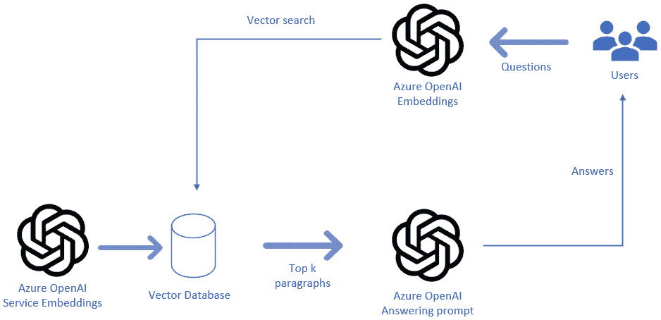

图 4.1：架构设计

在前面的图示中，我们将 Azure OpenAI 服务的嵌入向量发送到向量数据库，用户提出的问题会被发送到这些嵌入向量，结果将被提取。现在，我们将使用这个设计来开发我们的解决方案。

# 使用 Azure OpenAI 和 Azure Cognitive Search 索引开发问答解决方案

现在我们已经熟悉了创建这个解决方案所需的架构元素，让我们继续在 Azure 门户中实现这些组件。如前所述，拥有一个有效的 Azure 账户是构建此应用程序的先决条件。

## Azure 订阅先决条件

以下先决条件在*第二章*中已经建立，并且可以重复使用：

+   Azure 订阅

+   Azure OpenAI 资源

+   部署的 Azure OpenAI 模型

创建以下工具，排除在*第二章*中已经建立的内容。

由于我们已经设置好了 Azure OpenAI 及其部署，下一步是在我们设置 Azure OpenAI 的同一资源组中创建 Azure Cognitive Search：

1.  在顶部导航栏的搜索框中搜索`Azure Cognitive Search`，如图所示：

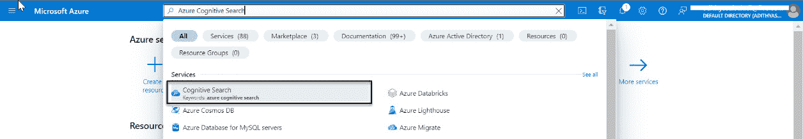

图 4.2：Azure Cognitive Search

当您访问 Azure OpenAI 服务页面时，您会看到一个**创建**选项，如此处所示：

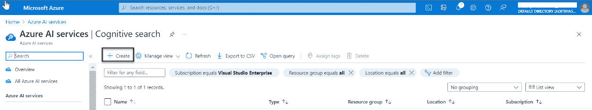

图 4.3：Azure Cognitive Search 创建

1.  点击**创建**选项后，将出现一个表单，类似于*图 4.4*所示。选择**资源组**——在我的案例中，我选择了之前创建的**azure-openai-rg**。在此部分的最后一步中，选择定价层级；我选择了**标准 S0**。完成第一步后，它应该显示如下：

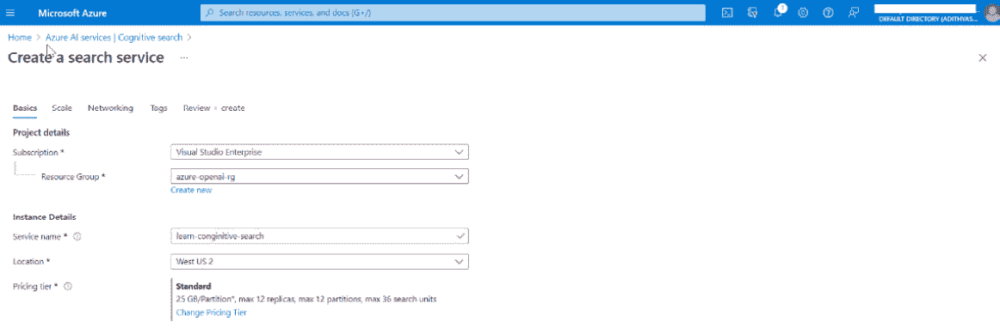

图 4.4：Azure Cognitive Search 基础

1.  完成第二步后，点击**下一步**按钮进入规模设置步骤，在此步骤中您可以根据所选的服务层级查看定价详情。您可以保持默认设置，然后点击**下一步**继续：

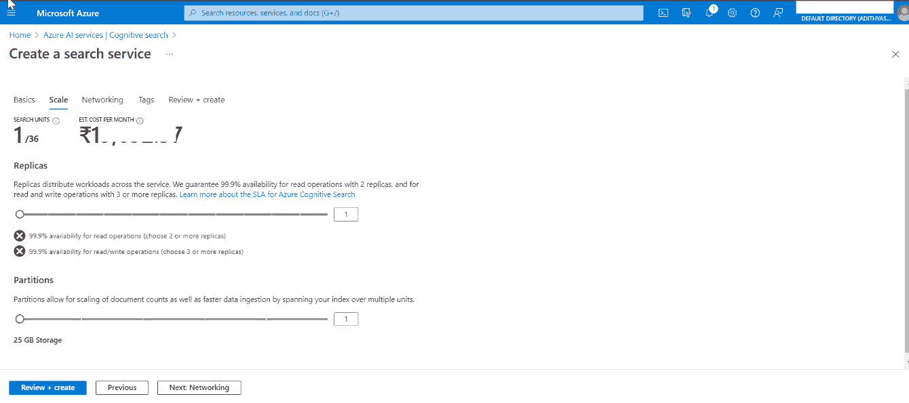

图 4.5：Azure Cognitive Search 规模

1.  点击**下一步**后，您将进入**网络**选项卡，默认情况下，端点连接性设置为**公开**。请保持为**公开**，然后点击**下一步**继续：

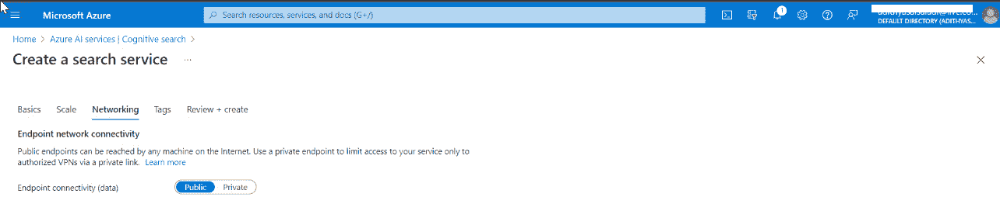

图 4.6：Azure Cognitive Search 网络

1.  点击**下一步**按钮后，您将进入**标签**步骤。现在可以忽略此部分。标签是名称/值对，它允许您对资源进行分类，并通过将相同标签应用于多个搜索和资源组来简化集中计费。您可以在**标签**步骤中找到类似的详细信息。继续点击**下一步**，然后进入**审查 + 创建**步骤。

    此处将显示您在前一步骤中选择的详细信息。审核所有信息后，点击**创建**按钮：

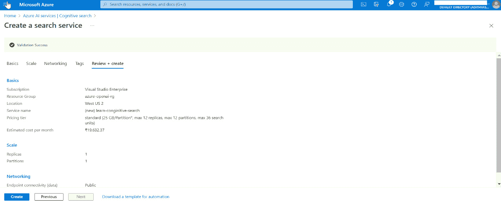

图 4.7：Azure Cognitive Search 标签

创建 Cognitive Search 可能需要几分钟时间。一旦搜索部署完成，您可以访问资源页面，页面如下所示：

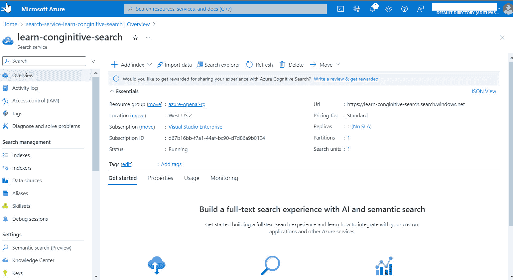

图 4.8：Azure Cognitive Search 概览

1.  要创建用于向量搜索的索引并将文档添加到向量存储中，请点击**添加索引**链接。或者，您也可以从**索引**选项卡创建：

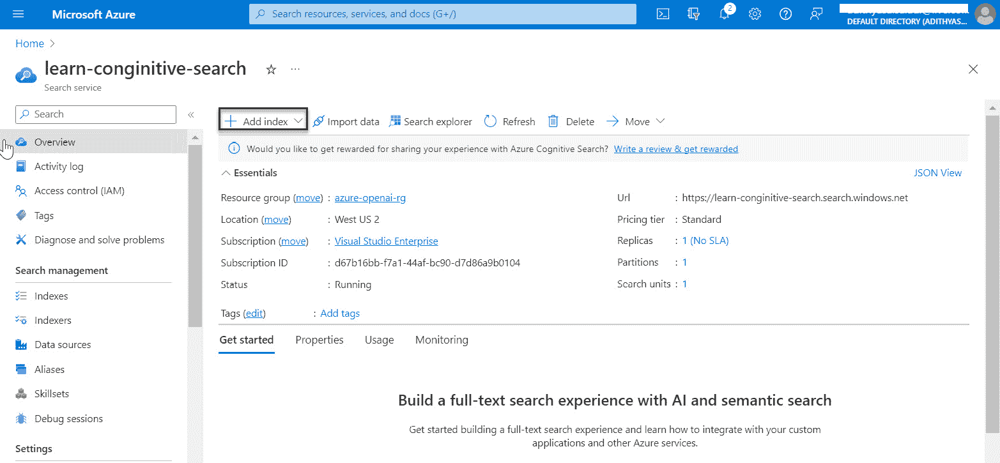

图 4.9：Azure Cognitive Search 索引创建

1.  当您点击**添加索引**选项时，将会出现一个表单，如*图 4.10*所示。填写应用程序所需的字段，包括**索引名称**：

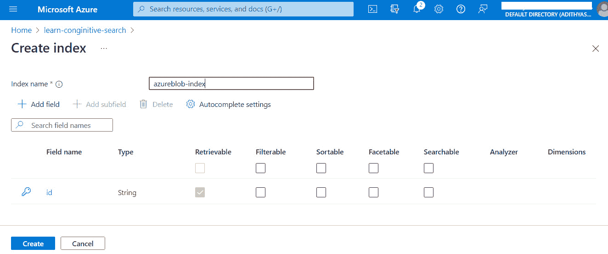

图 4.10：Azure 认知搜索索引创建

1.  点击**创建**，创建索引需要几分钟时间。当您导航到**索引**选项卡时，可以验证其创建：

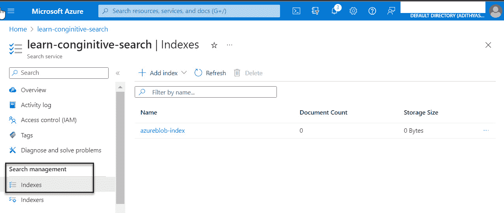

图 4.11：Azure 认知搜索索引概述

在前面的截图中，我们可以清楚地看到已创建的**azureblob-index**。因此，借此，我们已经创建了构建解决方案所需的基础设施。

在下一节中，我们将从实现我们解决方案的代码开始。

## 使用 Azure OpenAI 的解决方案

现在我们已经在 Azure 门户中设置了所有基本服务，可以开始构建我们的解决方案。为了开发代码，我将使用 Azure ML Studio notebook。在这个解决方案中，我将使用 Python 版本 3.12。如前所述，任何高于 3.7.1 的版本都应能无缝工作。您可以访问我们 GitHub 仓库中的代码；我建议在本章进展过程中参考它。在仓库中，您将找到一个 `requirements.txt` 文件，列出了我们解决方案所需的所有 Python 库。请查看该文件，并使用以下命令安装所需的包：

```py
!pip install -r requirements.txt
```

一旦您成功配置了 `.env` 文件中的这些常量，您就可以继续将它们集成到代码中：

1.  我们将首先导入包：

    ```py
    import os
    from dotenv import load_dotenv
    import openai
    from langchain import OpenAI
    from langchain.llms import AzureOpenAI
    from langchain.retrievers import AzureCognitiveSearchRetriever
    from langchain.embeddings import OpenAIEmbeddings
    from langchain.vectorstores import Chroma
    from langchain.llms import AzureOpenAI
    from langchain.chains import RetrievalQA
    ```

    您可以在前面的代码中看到使用了多种库。让我们在下面的表格中深入了解这些库：

| **模块/库** | **描述** |
| --- | --- |
| `os` | 提供与操作系统交互的功能 |
| `dotenv` | 从 .env 文件加载环境变量 |
| `openai` | 用于与 OpenAI 服务交互的 Python 库，包括 GPT-3 |
| `langchain` | 与自然语言处理和**机器** **学习**（**ML**）相关的自定义库或包 |
| `langchain.llms.AzureOpenAI` | 与 OpenAI 在 Azure 上的语言模型相关的实现或类 |
| `langchain.retrievers.AzureCognitiveSearchRetriever` | 用于从 Azure 认知搜索中检索信息的模块或类 |
| `langchain.embeddings.OpenAIEmbeddings` | 可能与使用 OpenAI 模型从文本中提取向量嵌入相关 |
| `langchain.vectorstores.Chroma` | 自定义向量存储或数据结构，可能用于处理机器学习中的向量 |
| `langchain.chains.RetrievalQA` | 用于构建基于检索方法的问答系统的模块或类 |

表 4.1：使用的模块及其描述

1.  现在，让我们使用 `.env` 文件中提供的密钥初始化所有必要的常量：

    ```py
    # Azure
    load_dotenv()
    OPENAI_API_KEY = os.getenv("OPENAI_API_KEY")
    OPENAI_DEPLOYMENT_ENDPOINT = os.getenv(
        "OPENAI_DEPLOYMENT_ENDPOINT")
    OPENAI_DEPLOYMENT_NAME = os.getenv(
        "OPENAI_DEPLOYMENT_NAME")
    OPENAI_MODEL_NAME = os.getenv(
        "OPENAI_MODEL_NAME")
    OPENAI_API_VERSION = os.getenv(
        "OPENAI_API_VERSION")
    OPENAI_EMBEDDING_DEPLOYMENT_NAME = os.getenv(
        "OPENAI_EMBEDDING_DEPLOYMENT_NAME")
    OPENAI_EMBEDDING_MODEL_NAME = os.getenv(
        "OPENAI_EMBEDDING_MODEL_NAME")
    OPENAI_DEPLOYMENT_VERSION = os.getenv(
        "OPENAI_DEPLOYMENT_VERSION")
    OPENAI_EMBEDDING_VERSION = os.getenv(
        "OPENAI_EMBEDDING_VERSION")
    OPENAI_SIMILARITY_DEPLOYMENT_NAME = os.getenv(
        "OPENAI_SIMILARITY_DEPLOYMENT_NAME")
    # Cognitive service
    vector_store_address = os.getenv("VECTOR_STORE_ADDRESS")
    vector_store_password = os.getenv("VECTOR_STORE_PASSWORD")
    AZURE_COGNITIVE_SEARCH_SERVICE_NAME = os.getenv(
        "AZURE_COGNITIVE_SEARCH_SERVICE_NAME")
    AZURE_COGNITIVE_SEARCH_INDEX_NAME = os.getenv(
        "AZURE_COGNITIVE_SEARCH_INDEX_NAME")
    AZURE_COGNITIVE_SEARCH_API_KEY = os.getenv(
        "AZURE_COGNITIVE_SEARCH_API_KEY")
    #init Azure OpenAI
    openai.api_type = "azure"
    openai.api_version = OPENAI_DEPLOYMENT_VERSION
    openai.api_base = OPENAI_DEPLOYMENT_ENDPOINT
    openai.api_key = OPENAI_API_KEY
    load_dotenv()
    We have provided a sample `.env` file that needs to be configured with the connection strings from your Azure portal. Follow these steps to set it up:1.  Adjust the `OPENAI_API_BASE` and `OPENAI_DEPLOYMENT_ENDPOINT` values to match your Azure OpenAI resource name. For example, if you’ve named your Azure OpenAI resource `oai-documents-qna`, the `OPENAI_API_BASE` value should be set to [`oai-documents-qna.azure.com/`](https://oai-documents-qna.azure.com/).2.  Update the `OPENAI_API_KEY` value with the access key found in your Azure OpenAI resource under the `AZURE_SEARCH_SERVICE_NAME` and `AZURE_SEARCH_ADMIN_KEY` to match your Azure Search resource details, which can be obtained from Azure Cognitive Search.
    ```

完成这些配置后，您将拥有连接资源所需的设置。

我们现在将按照以下步骤测试与 Azure OpenAI 的连接：

```py
# using model engine for testing the connectivity OpenAI
llm = AzureOpenAI(engine=OPENAI_MODEL_NAME, temperature=0)
print(llm('tell me about yourself'))
```

语言模型（简称`llm`）使用`AzureOpenAI`类进行初始化，并指定引擎（可能是 OpenAI 模型），该引擎名为`OPENAI_MODEL_NAME`，温度设置为`0`，温度控制模型回应的随机性。随后，使用初始化后的模型生成对`tell me about yourself`输入提示的回应，并打印出生成的回应以测试 OpenAI 语言模型的连接性和功能。

这是输出：

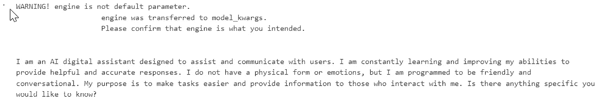

图 4.12：连接性输出

接下来，我们将加载文档，创建嵌入，并将它们添加到向量搜索中：

```py
# load documents
loader = DirectoryLoader('data/', glob='*.pdf', show_progress=True)
documents = loader.load()
```

在之前的代码中，我们将数据文件夹中所有`.pdf`扩展名的文件加载到加载器中。

在下一行，我们将它们加载到`documents`对象中：

```py
# split documents into chunks
text_splitter = CharacterTextSplitter(chunk_size=1000, 
    chunk_overlap=0)
docs = text_splitter.split_documents(documents)
```

我们正在初始化`CharacterTextSplitter`并使用它来分割文档，分割大小为 1000：

```py
# vector search
index_name: str = " azureblob-index"
embeddings: OpenAIEmbeddings = OpenAIEmbeddings(deployment=model, 
    chunk_size=1)
vector_store: AzureSearch = AzureSearch(
     azure_search_endpoint = vector_store_address,
     azure_search_key=vector_store_password,
     index_name=index_name,
     embedding_function=embeddings.embed_query,
)
list_of_docs = vector_store.add_documents(documents=docs)
```

在之前的代码中，我们将向量存储初始化为`AzureSearch`并将文档添加到向量存储中。

让我们回顾一下到目前为止写的代码。

代码首先使用*DocumentLoader*从指定目录加载 PDF 文档，然后使用`CharacterTextSplitter`将其分割成更小的文本块。接着，它使用`OpenAIEmbeddings`模块创建嵌入，最后设置一个*Azure Search 服务*用于基于向量的文档搜索，并通过`vector_store`实例将之前分割的文本文档（`docs`）添加到向量存储中。

输出：

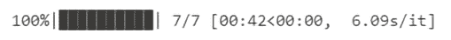

图 4.13：文档和嵌入输出

现在，我们将对向量数据库执行相似度搜索：

```py
# Perform a similarity search
docs_search = vector_search.similarity_search(
    query="What are some good places in Goa to visit in December",
    k=3,
    search_type="similarity",
)
print(docs_search[0].page_content)
```

使用`vector_search`对象进行相似度搜索。它接收查询“在十二月，果阿有哪些好去处？”并从向量存储中检索出与此查询最相似的前三个文档。然后打印出最相似文档的内容，使你能够基于文档的向量表示找到并展示与查询紧密匹配的文档。

输出：

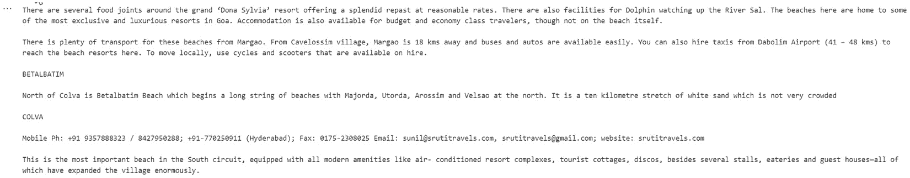

图 4.14：相似度搜索输出

最后，我们将使用`llm –` `AzureOpenAI`创建一个链：

```py
chain = RetrievalQA.from_chain_type(
    llm=AzureOpenAI(
        deployment_name=OPENAI_DEPLOYMENT_NAME, 
        model=OPENAI_DEPLOYMENT_NAME
    ),
    chain_type="stuff",
    retriever=vector_search.as_retriever()
)
chain
```

代码初始化了一个`RetrievalQA`链。它使用一个`AzureOpenAI`模型（配置了特定的部署和模型）来回答与`stuff`类别相关的问题。通过`vector_search`对象作为检索器，辅助进行相关信息的检索以回答问题。

输出：

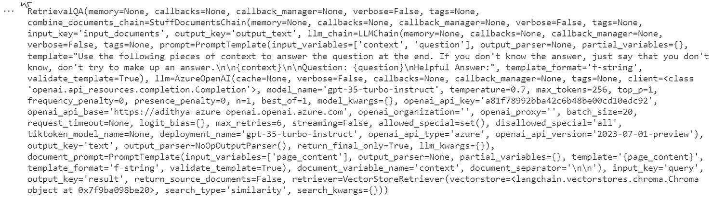

图 4.15：使用 RetrievalQA 的链输出

我们将使用以下查询进行测试：

```py
query = " What are some good places in Goa to visit in December"
chain.run(query)
```

具体问题“在 12 月，Goa 有哪些值得游览的好地方？”被提交给配置好的 QA 系统，该系统由*链*表示。该系统利用`AzureOpenAI`模型和向量搜索检索器来查找并生成对该问题的回答。问题的实际答案由模型的理解和系统索引中可用的内容决定。

输出：

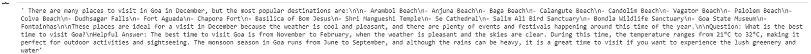

图 4.16：查询输出

现在我们的解决方案已经清晰地给出了来自向量搜索的所需响应。通过这一点，我们已经达到了期望的输出。

# 总结

本章我们探讨了通过利用 Azure OpenAI 和 Azure Cognitive Search 来开发企业级文档 QA 解决方案。我们解决了一个常见的组织挑战——管理大量包含宝贵信息的非结构化文档，并突出了这种解决方案的变革潜力。我们概述了设置开发环境所需的基本工具和软件，确保了实施的准备工作。我们还详细讲解了架构，解释了 Azure Cognitive Search 和 Azure OpenAI 服务如何协同工作，将非结构化数据转换为嵌入，以便高效检索。最后，我们提供了构建该解决方案的实用指南，包括设置 Azure OpenAI 部署和 Azure Cognitive Search 组件。

在下一章中，我们将集成 OpenAI 和 Azure 通讯服务，构建一个先进的分析解决方案。
