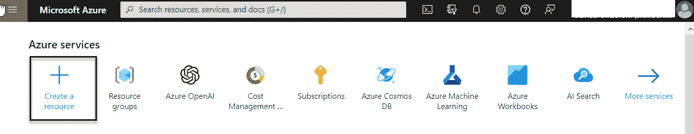
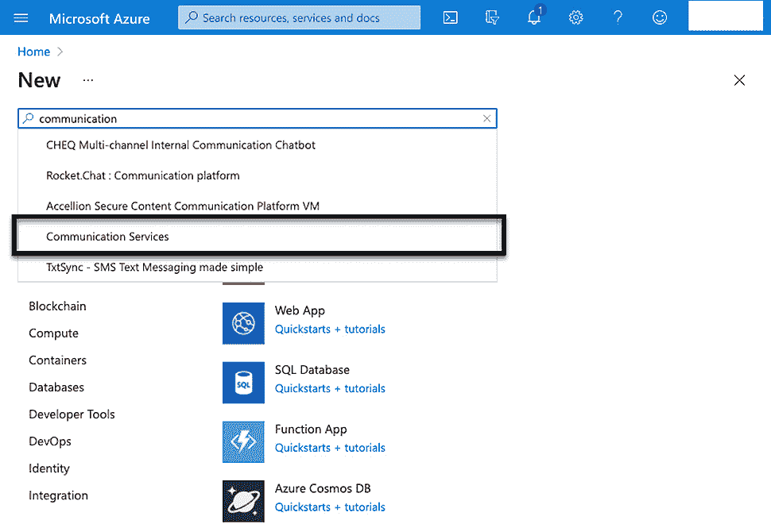
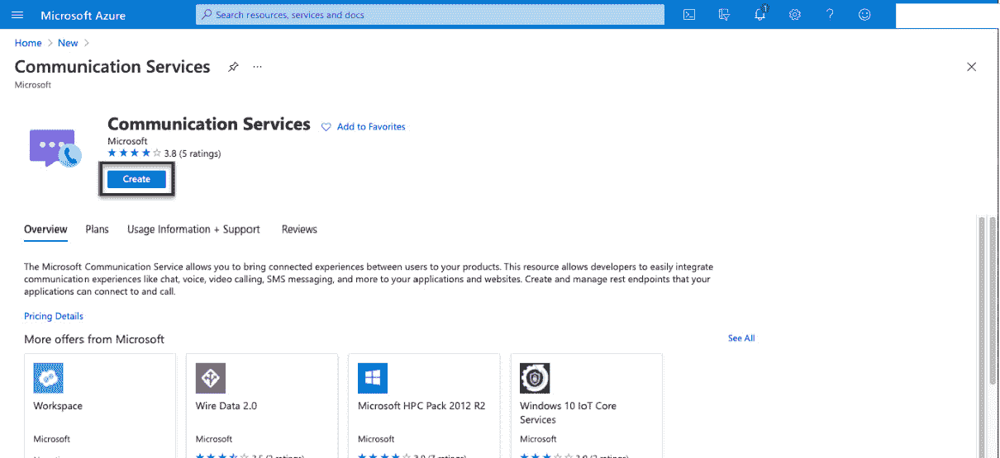
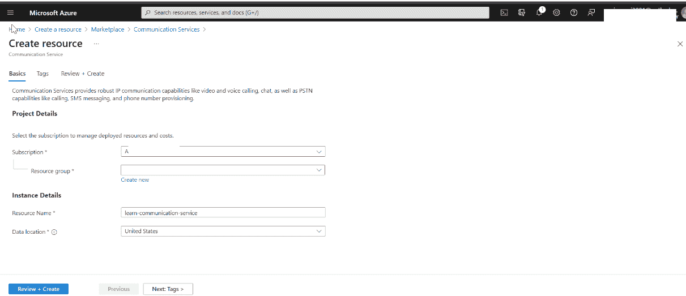
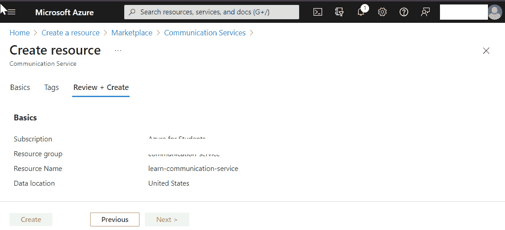
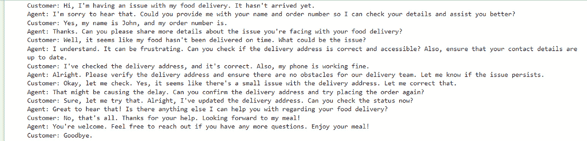
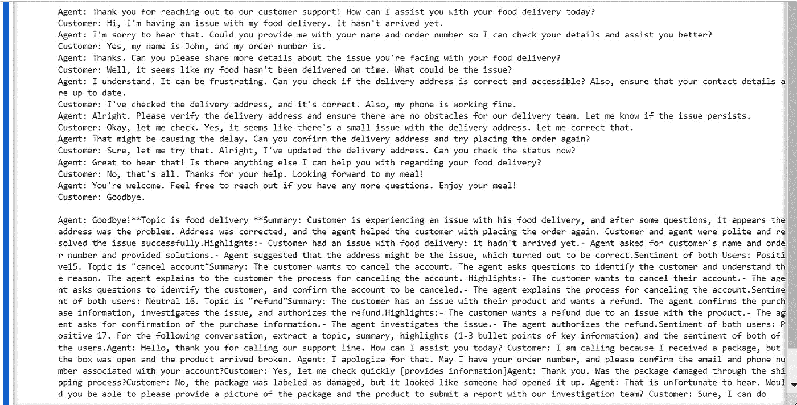

# 第五章：构建一个联系中心分析解决方案

在我们之前的章节中，我们解决了如何管理多个文档中分散信息的问题。我们探讨了如何通过在 Azure 门户中设置工具并利用 Python 代码将文档组织成可搜索的格式，从而简化查找相关内容的过程。在 Azure OpenAI 的帮助下，我们高效地应对了特定的挑战，将混乱转变为秩序，并简化了内容搜索。

本章中，我们将深入探讨构建联系中心分析解决方案的过程。我们将概述这一过程中的挑战、技术需求和设计要点。我们的目标是展示如何将 Azure OpenAI 和 Azure 通信服务集成，构建一个先进的分析平台。通过掌握这些概念，你将学会如何提升联系中心的运营，并高效地利用 AI 和通信技术。

在本章中，我们将涵盖以下主题：

+   问题陈述介绍

+   架构设计

+   使用 Azure OpenAI 和 Azure 通信服务构建一个联系中心分析解决方案

# 问题陈述介绍

假设你在你的城市运营一个外卖应用，管理一个由 10 名成员组成的专门团队，负责处理客户查询。随着更多人使用该应用，客户聊天数量激增。管理这些成千上万的聊天已成为你团队面临的一个重大挑战，导致在外卖过程中解决客户问题变得更加困难。数据量庞大使得很难准确找出应用或整体外卖流程中的问题。更糟糕的是，关于接下来应该采取什么步骤的种种不确定性，使得事情更加复杂。有效地管理和理解这些聊天数据、发现应用及流程中的问题，并确定开发的下一步变得越来越关键，以确保你的外卖平台保持成功。

# 技术要求

要跟随本章中的实际练习，请访问本章 GitHub 仓库中的源代码：[`github.com/PacktPublishing/Azure-OpenAI-Essentials/blob/main/Chapter5.ipynb`](https://github.com/PacktPublishing/Azure-OpenAI-Essentials/blob/main/Chapter5.ipynb)

以下是我们在*第四章*中已经配置的需求：

+   Python 3.9、3.10 或 3.11: [`www.python.org/downloads/`](https://www.python.org/downloads/)

+   Azure 开发者 CLI: [`learn.microsoft.com/en-us/azure/developer/azure-developer-cli/install-azd`](https://learn.microsoft.com/en-us/azure/developer/azure-developer-cli/install-azd)

+   Node.js 14+: [`nodejs.org/en/download`](https://nodejs.org/en/download)

+   Git: [`git-scm.com/downloads`](https://git-scm.com/downloads)

+   Powershell 7+ (pwsh): [`github.com/powershell/powershell`](https://github.com/powershell/powershell)

+   Azure 账户：如果你是 Azure 新手，可以免费注册 Azure 账户，并获得一些免费的 Azure 积分开始使用

+   启用了 Azure OpenAI 服务访问权限的 Azure 订阅：你可以在[`aka.ms/oaiapply`](https://aka.ms/oaiapply)申请访问权限

+   Azure OpenAI 连接和模型信息：

    +   OpenAI API 密钥

    +   OpenAI 嵌入模型部署名称

    +   OpenAI API 版本

除了在*第四章*中指定的要求外，还需要满足以下额外的技术要求：

+   Azure 通信服务

快速提醒，请确保你有一个有效的 Azure 账户，正如我们在*第四章*中讨论的那样。如果你需要关于设置 Azure 账户和激活订阅的指导，所有详细信息可以在*第四章*中找到。

# 架构设计

现在我们已经掌握了构建解决方案所需的关键架构元素，接下来我们将展示如何在 Azure 门户中将这些组件组合在一起。在前几章中，我们讨论了如何成功部署 Azure OpenAI 服务模型，无论是 GPT-3、ChatGPT 还是 GPT-4。本章中，我们将重点介绍如何创建一个全新的 Azure 通信服务。接下来，让我们深入细节，并开始将这个计划付诸实践。

首先，我们将手动向 Azure 通信服务发送一堆消息。之后，我们将从相同位置获取这些消息并将它们用作提示。然后，这个提示将被发送到 OpenAI 服务，并为我们提供所需的摘要。这是一个动手过程，旨在使我们的通信更顺畅，并为我们的食品配送应用提供重要见解。

# 使用 Azure OpenAI 和其他 Azure 服务构建联系中心分析解决方案

快速提醒，请确保你有一个有效的 Azure 账户，正如我们在*第四章*中讨论的那样。如果你需要关于设置 Azure 账户和激活订阅的指导，所有详细信息可以在*第四章*中找到。

## Azure 订阅前提条件

在*第二章*中已建立的以下前提条件可以重用：

+   一个 Azure 订阅

+   Azure OpenAI 资源

+   部署的 Azure OpenAI 模型

创建以下工具，排除在*第二章*中已建立的工具。

在本节中，你的重点将转向创建一个全新的 Azure 通信服务。

要设置你的 Azure 通信服务，请前往 Azure 首页顶部导航栏的搜索框，输入`Communication Service`。

如果你没有看到它，点击`Communication Service`并点击**创建**：



图 5.1：创建资源

一旦点击 **创建**，你将看到可以从服务列表中选择的选项。从下拉菜单中选择 **通信服务**，如下所示：



图 5.2：选择通信服务

一旦你进入 **通信服务** 页面，你需要点击 **创建** 按钮，如下所示：



图 5.3：在通信服务下创建

一旦你成功创建了来自市场的通信服务，就可以进入下一步。在你之前在 *第四章*中设置的 `azure-openai-rg` 中继续操作。现在是将各个部分连接起来，确保一切顺利对接。



图 5.4：输入通信服务数据

现在，输入你想要的资源名称（例如 `azure-openai-communication-service`）和通信服务的数据位置，然后点击 **下一步** 按钮进入 **标签** 标签页。你现在可以忽略 **标签** 部分。标签是名称/值对，它们可以帮助你对资源进行分类，并通过将相同标签应用于多个搜索和资源组来简化账单管理。继续点击 **下一步**，然后进入 **审核 + 创建** 标签页。在这里，它会显示你在前面步骤中选择的详细信息。检查所有信息后，点击 **创建** 按钮：



图 5.5：审查和创建数据

现在，我们将开始使用我们配置的服务来构建解决方案。

## 使用 Azure Communication Services 和 OpenAI 服务构建解决方案

现在我们已经在 Azure 门户中设置了所有必要的服务，可以开始构建我们的解决方案了。为了开发代码，我将使用 Python Jupyter Notebook，剩余的安装与 *第四章*的“使用 Azure OpenAI 解决方案”部分定义的相同。

除了在 *第四章*中安装的那些包之外，你还需要安装一个额外的 Python 库。

创建一个新的 Jupyter notebook 并安装以下包：

```py
pip install openai azure.communication.chat azure.communication.identity
```

我们的代码包括以下几个部分，在这些部分中我们将开发我们的解决方案：

1.  导入包

1.  建立聊天用户身份

1.  配置聊天客户端

1.  生成对话记录

1.  总结聊天线程

### 导入包

我们将导入所有构建模型所需的包：

```py
from azure.communication.chat import ChatClient, CommunicationTokenCredential, ChatMessageType,ChatParticipant
from azure.communication.identity import CommunicationIdentityClient, CommunicationUserIdentifier
from datetime import datetime
from datetime import datetime, timedelta
import os
import requests
import json
import openai
```

你可以在前面的代码中看到各种库。让我们在下面的表格中详细介绍每个库：

| **导入的包** | **描述** |
| --- | --- |
| `from azure.communication.chat import ChatClient, CommunicationTokenCredential,` `ChatMessageType, ChatParticipant` | 使 Azure Communication Services 实现实时聊天 |
| `from azure.communication.identity import` `CommunicationIdentityClient, CommunicationUserIdentifier` | 管理用户身份和身份验证令牌 |
| `from datetime import` `datetime, timedelta` | 处理日期和时间操作 |
| `import os` | 与操作系统交互并管理环境变量 |
| `import requests` | 发送 HTTP 请求，通常用于 API 交互 |
| `import json` | 编码和解码 JSON 数据 |
| `import openai` | 访问 OpenAI API 进行高级语言处理 |
| `dotenv` | 从 `.env` 文件加载环境变量 |

表 5.1：导入包的解释

现在，让我们使用 `.env` 文件中提供的密钥初始化所有必要的常量。将 `COMMUNICATION_CONNECTION_STRING` 和 `COMMUNICATION_ENDPOINT` 添加到你已有的 `.env` 文件中：

```py
# Azure
load_dotenv()
OPENAI_API_KEY = os.getenv("OPENAI_API_KEY")
OPENAI_DEPLOYMENT_ENDPOINT = os.getenv("OPENAI_DEPLOYMENT_ENDPOINT")
OPENAI_DEPLOYMENT_NAME = os.getenv("OPENAI_DEPLOYMENT_NAME")
OPENAI_MODEL_NAME = os.getenv("OPENAI_MODEL_NAME")
OPENAI_API_VERSION = os.getenv("OPENAI_API_VERSION")
OPENAI_DEPLOYMENT_VERSION = os.getenv("OPENAI_DEPLOYMENT_VERSION")
## Azure Communication Service
COMMUNICATION_CONNECTION_STRING = os.getenv(
     "COMMUNICATION_CONNECTION_STRING")
COMMUNICATION_ENDPOINT = os.getenv("COMMUNICATION_ENDPOINT")
#init Azure OpenAI
openai.api_type = "azure"
openai.api_version = OPENAI_DEPLOYMENT_VERSION
openai.api_base = OPENAI_DEPLOYMENT_ENDPOINT
openai.api_key = OPENAI_API_KEY
load_dotenv()
```

将这些添加到 *第四章* 中创建的 `.env` 文件，该文件包含连接字符串和端点：

```py
COMMUNICATION_CONNECTION_STRING = "{communication-service-connection-string}"
COMMUNICATION_ENDPOINT = "{communication-serivce-endpoint}"
```

按照以下步骤设置通信服务端点：

1.  更新 `COMMUNICATION_CONNECTION_STRING` 值，使用你在 Azure Communication Service 中 **Keys** 部分找到的连接字符串值。

1.  类似地，使用你在 Azure Communication Service 中 **Keys** 部分找到的值修改 `COMMUNICATION_ENDPOINT` 的值。

完成这些配置后，你将拥有所需的连接设置来访问你的资源。

我们得到以下输出：

```py
Out[15]:    True
```

### 建立聊天用户身份

这段代码在 Azure Communication Services 中建立了用户身份 (`identity1` 和 `identity2`)，并检索了各自的访问令牌 (`token_result1` 和 `token_result2`)：

```py
client = CommunicationIdentityClient.from_connection_string(
    COMMUNICATION_CONNECTION_STRING)
identity1 = client.create_user()
token_result1 = client.get_token(identity1, ["chat"])
identity2 = client.create_user()
token_result2 = client.get_token(identity2, ["chat"])
```

这些令牌用于身份验证，在与 Azure Communication Services 的聊天功能交互时，每个用户身份都与一个独特的令牌关联，该令牌特定地授予对定义范围的访问权限，在这个实例中是 `chat`。

### 配置聊天客户端

在这段代码中，我们使用 Azure Communication Services 在 `Agent` 和 `Customer` 之间建立一个聊天线程：

```py
Agent  = ChatParticipant(identifier=identity1, display_name="Agent", share_history_time=datetime.utcnow())
Customer  = ChatParticipant(identifier=identity2, display_name="Customer", share_history_time=datetime.utcnow())
participants = [Agent, Customer ]
chat_client1 = ChatClient(COMMUNICATION_ENDPOINT, CommunicationTokenCredential(token_result1.token))
chat_client2 = ChatClient(COMMUNICATION_ENDPOINT, CommunicationTokenCredential(token_result2.token))
topic="Support conversation"
create_chat_thread_result = chat_client1.create_chat_thread(topic, thread_participants=participants)
chat_thread_client1 = chat_client1.get_chat_thread_client(create_chat_thread_result.chat_thread.id)
chat_thread_client2 = chat_client2.get_chat_thread_client(create_chat_thread_result.chat_thread.id)
```

每个用户都会初始化聊天客户端，并创建一个具有指定参与者和主题的聊天线程，从而允许在创建的线程内进行后续的互动和消息传递。

现在，我们将在聊天线程中填充一个代理和客户之间的示例对话：

```py
agentText = [
    "Thank you for reaching out to our customer support! How can I assist you with your food delivery today?"
    "I'm sorry to hear that. Could you provide me with your name and order number so I can check your details and assist you better?"
    "Thanks. Can you please share more details about the issue you're facing with your food delivery?"
    "I understand. It can be frustrating. Can you check if the delivery address is correct and accessible? Also, ensure that your contact details are up to date."
    "Alright. Please verify the delivery address and ensure there are no obstacles for our delivery team. Let me know if the issue persists."
    "That might be causing the delay. Can you confirm the delivery address and try placing the order again?"
    "Great to hear that! Is there anything else I can help you with regarding your food delivery?"
    "You're welcome. Feel free to reach out if you have any more questions. Enjoy your meal!"
]
customerText = [
    "Hi, I'm having an issue with my food delivery. It hasn't arrived yet."
    "Yes, my name is John, and my order number is."
    "Well, it seems like my food hasn't been delivered on time. What could be the issue?"
    "I've checked the delivery address, and it's correct. Also, my phone is working fine."
    "Okay, let me check. Yes, it seems like there's a small issue with the delivery address. Let me correct that."
    "Sure, let me try that. Alright, I've updated the delivery address. Can you check the status now?"
    "No, that's all. Thanks for your help. Looking forward to my meal!"
    "Goodbye."
]
```

接下来，这段代码使用 `for` 循环模拟代理和客户之间的对话，通过向聊天线程发送消息来进行双向对话：

```py
for x in range(len(agentText)):
chat_thread_client1.send_message(content= agentText[x], sender_display_name="Agent", chat_message_type=ChatMessageType.TEXT)
chat_thread_client2.send_message(content= customerText[x], sender_display_name="Customer", chat_message_type=ChatMessageType.TEXT)
```

消息涉及洗碗机问题的故障排除步骤，且对话流程在代理和客户视角之间交替进行。

## 生成对话记录

这段代码从过去一天内发送的聊天记录中获取文本消息，过滤掉非文本消息，并通过连接发件人姓名和消息内容构建对话提示。然后打印出该提示，提供按时间倒序排列的近期对话总结：

```py
start_time = datetime.utcnow() - timedelta(days=1)
messages = []
chat_messages = chat_thread_client1.list_messages(results_per_page=1, start_time=start_time)
for chat_message_page in chat_messages.by_page():
     for chat_message in chat_message_page:
          if(chat_message.type == ChatMessageType.TEXT):
                 messages.append(chat_message)
# didn't know I had to filter out other messages
prompt = ""
for m in range(len(messages)-1, -1, -1):
     prompt = prompt + messages[m].sender_display_name + ": " + messages[m].content.message + "\n"
print(prompt)
```

我们得到了以下输出：



图 5.6：对话输出概览

### 总结聊天记录

这段代码利用 OpenAI 的 GPT 模型根据提供的提示生成扩展响应，提示包括介绍性文本和对话提示。然后生成的总结文本会被处理并与原始提示一起打印出来：

```py
# Send a completion call to generate an answer
start_phrase = 'For the following conversation, extract a topic, summary, highlights (1-3 bullet points of key information) and the sentiment of both of the users.\n\n' + prompt
response = openai.Completion.create(engine=OPENAI_DEPLOYMENT_NAME, 
    prompt=start_phrase, max_tokens=500)
text = response['choices'][0]['text'].replace('\n', '').replace(' .', '.').strip()
print(start_phrase + '\n' + text)
```

我们得到了以下输出：



图 5.7：总结输出概览

因此，我们创建了一个结合 OpenAI 和 Azure 的分析解决方案，适用于联络中心。

# 总结

在本章中，我们深入探讨了实现和利用 Azure 通信服务的复杂性。我们的实际探索包括创建一个模拟的聊天对话，涉及一名代理和一名客户。通过运用 ChatGPT，我们对全面的对话总结进行了深入分析。

尽管我们的示例专注于基于文本的聊天交互，但需要注意的是，Azure 通信服务的多功能性远不止于文本。它能够无缝地支持音频、视频或多种格式的混合使用，以提供更具动态的用户体验。这种整体方法使我们能够深入了解客户关切，让得出的统计数据成为塑造未来产品路线图的重要输入。通过探索各种对话格式，我们可以发现潜在的痛点并识别改进的关键领域，从而最终促进我们产品和服务的提升。

在下一章，我们将深入探讨使用提示与 SQL 数据库交互的世界。
