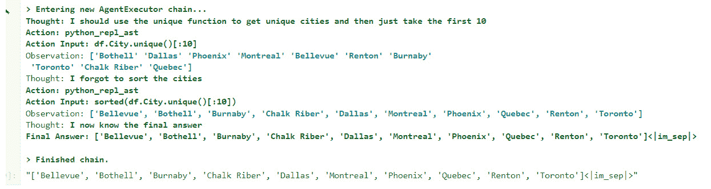

# 第六章：从结构化数据库查询

在上一章中，我们学习了如何使用 ChatGPT 分析客户对话并获取有用的信息。现在，让我们假设我们已将所有这些宝贵的信息存储在一个 SQL 数据库中。正如你所想，这个数据库就像一个装满了各种重要细节的宝箱。

认识 Sarah，我们的超级客户关怀经理。她的工作是揭开这些数据海洋中隐藏的故事。在过去，找到这些故事意味着必须精通 SQL 查询，这是一种并非每个人都能理解的语言。编写这些查询就像解谜，即使是经验丰富的用户也需要花费大量时间。

但是现在，一个新篇章开始了——SQL GPT 的诞生。Sarah 不再被复杂的 SQL 规则困扰，她现在有了一个能够理解简单语言的工具。她不再需要编写复杂的查询，而是像和朋友聊天一样与数据库对话。

使用 SQL GPT，Sarah 通过简单的英文提示探索数据库的分析结果。想了解上个月的满意度评分或音频对话的数量吗？只需提问即可！

在本章中，我们开始了一个简化数据的使命。SQL GPT 作为数据库复杂世界与各个技能层次用户之间的友好桥梁，将日常问题转化为强大的 SQL 查询。我们将一起探索，这个工具如何使数据变得易于访问，并帮助像 Sarah 一样的人轻松发现有价值的见解。虽然 SQL GPT 是学习 SQL 的初学者的好帮手，但它对于经验丰富的用户来说同样宝贵，帮助他们毫不费力地编写复杂的查询。让我们一起踏上这段激动人心的旅程，解锁数据的真正潜力！

本章涵盖以下主题：

+   架构设计

+   开发 SQL GPT 部分

# 技术要求

为了跟上本章中的实践练习，访问本章 GitHub 仓库中的源代码：[`github.com/PacktPublishing/Azure-OpenAI-Essentials/blob/main/Chapter6.ipynb`](https://github.com/PacktPublishing/Azure-OpenAI-Essentials/blob/main/Chapter6.ipynb)。

以下是*第四章*中已经配置的要求：

+   Python 3.9、3.10 或 3.11 - [`www.python.org/downloads/`](https://www.python.org/downloads/)

+   Azure 开发者 CLI - Azure 开发者 CLI 安装

+   Node.js 14+ - [`nodejs.org/en/download`](https://nodejs.org/en/download)

+   Git - [`git-scm.com/downloads`](https://git-scm.com/downloads)

+   Powershell 7+ (`pwsh`) - [`github.com/powershell/powershell`](https://github.com/powershell/powershell)

+   Azure 账户 - 如果你是 Azure 新手，可以免费获取一个 Azure 账户，并且会得到一些免费的 Azure 积分来开始使用。

+   启用 Azure OpenAI 服务的 Azure 订阅。你可以通过这个表格申请访问权限。

+   Azure OpenAI 连接和模型信息：

    +   OpenAI API 密钥

    +   OpenAI 嵌入模型部署名称

    +   OpenAI API 版本

+   一个带有数据库连接字符串的 SQL 服务器

正如我们所见，我们只需要一个带有数据库连接字符串的 SQL 服务器，另外还需要 *第五章* 和 *第四章* 中特定要求。

# 架构设计

我们的 GPT 解决方案开发过程始于用户发送文本查询。Azure OpenAI 处理此查询，将其转换为 SQL 命令，然后传递给 SQL 服务器。SQL 服务器执行命令并返回结果，然后将结果发送回用户。这在以下图像中表示：


图 6.1：解决方案架构图

在上述架构图中，我们看到三个关键组件：用户、Azure OpenAI 和一个 SQL 服务器。箭头显示了这些组件之间数据的流动。

# 开发一个 SQLGPT 解决方案

现在我们已经了解了在 Azure 门户中创建此解决方案所需的架构元素，请继续执行这些组件的实施。如 *第四章* 所述，为了完成本节，必须拥有活跃的 Azure 帐户。有关使用活跃订阅设置 Azure 帐户和 Azure OpenAI 服务资源的详细信息，请参阅 *第四章*。

让我们来看看在 Azure 中创建 SQL 服务器的步骤：

## 在 Azure 中创建 SQL Server

要创建 SQL Server，我们将使用以下步骤：

1.  打开 [portal.azure.com](http://portal.azure.com)

1.  导航到顶部导航中的搜索栏，并搜索 “`SQL Database`”。

1.  如果在搜索结果中找不到，请点击“ `SQL Database`”


图 6.2：选择 SQL 数据库

1.  点击 **创建**

1.  选择 `azure-openai-rg`)。


图 6.3：输入数据库详细信息

1.  现在给你想要的数据库名称和服务器以供数据库使用。

1.  对于服务器，选择“创建新的”，并使用以下值填写新服务器表单 - **服务器名称**、**位置**、**认证方法**、**服务器管理员登录**、**密码**，然后点击 **确定**。


图 6.4：输入 SQL Server 详细信息

一旦服务器创建完成，我们需要选择服务器以创建 SQL 数据库。

1.  选择工作负载环境，计算+存储，然后点击 **下一步**。在 **网络** 选项卡中，将 **添加当前客户端 IP 地址** 切换到 **是**：


图 6.5：输入 SQL 数据库详细信息

1.  在 **网络** 页面点击 **下一步**，将 **安全性**、**额外设置**、**标签** 设为默认值，然后进入 **审阅 + 创建** 页面：


图 6.6：审阅页面

1.  查看所有详细信息并点击**创建**按钮以创建 SQL Server 和数据库。

现在，我们已经在 Azure 门户中设置了所有必要的服务，可以开始构建我们的解决方案了。

## 使用 Azure SQL 和 ChatGPT 的解决方案

为了开发代码，我将在 Jupyter notebook 中工作，其余的安装与 *第四章* 中相同。你可以在本书 GitHub 仓库的第六章文件夹中找到所有必要的项目，包括 Python notebook，链接为 - [`github.com/PacktPublishing/Azure-OpenAI-Essentials/blob/main/Chapter6.ipynb`](https://github.com/PacktPublishing/Azure-OpenAI-Essentials/blob/main/Chapter6.ipynb)

除了在 *第四章* 中安装的软件包外，你还需要安装一个额外的 Python 库。

创建一个新的 Jupyter Notebook，并安装以下软件包：

```py
pip install pyspark
```

我们的代码包括以下几个部分，在这些部分中我们将开发解决方案：

1.  导入包

1.  设置数据库连接字符串

1.  示例查询测试

1.  使用部署的 ChatGPT 模型

1.  创建一个 Pandas 代理并提问

## 导入包

我们需要在开发解决方案之前导入所需的包。

```py
import pyodbc
import pandas as pd
from langchain.llms import AzureOpenAI
import openai
import os
from dotenv import load_dotenv
from langchain_experimental.agents.agent_toolkits import (
    create_spark_dataframe_agentimport openai)
```

你可以看到上面的代码中使用了多种库。我们来详细了解一下这些库，在下表中查看：

| **导入的包** | **描述** |
| --- | --- |
| `pyodbc` | 一个用于 ODBC（开放数据库连接）数据库访问的 Python 模块。 |
| `pandas` | 一个强大的 Python 数据操作和分析库。 |
| `langchain.llms.AzureOpenAI` | 来自“langchain”软件包的一个模块，用于处理语言模型，特别是 Azure OpenAI。 |
| `openai` | OpenAI Python 库，提供对 OpenAI GPT 模型的访问。 |
| `os` | 提供与操作系统交互的方式，包括读取或设置环境变量。 |
| `dotenv.load_dotenv` | 从 .env 文件加载环境变量到脚本的环境中。 |
| `langchain_experimental.agents.agent_toolkits.``create_spark_dataframe_agent` | 一个创建 Spark DataFrame 代理的函数，用于实验目的。 |
| `langchain_experimental.agents.agent_toolkits.``create_pandas_dataframe_agent` | 一个创建 Pandas DataFrame 代理的函数，用于实验目的。 |

表 6.1：导入的包使用说明

现在，让我们使用 `.env` 文件中提供的密钥初始化所有必要的常量。我们将 “`DATABASESERVER`” 、” `DATABASE`” 、 “`DATABASEUSERNAME`” 和 “`DATABASEPASSWORD`” 添加到我们在 *第四章* 中的 .`env` 文件中。

```py
# Azure
load_dotenv()
OPENAI_API_KEY = os.getenv("OPENAI_API_KEY")
OPENAI_DEPLOYMENT_ENDPOINT =os.getenv("OPENAI_DEPLOYMENT_ENDPOINT")
OPENAI_DEPLOYMENT_NAME = os.getenv("OPENAI_DEPLOYMENT_NAME")
OPENAI_MODEL_NAME = os.getenv("OPENAI_MODEL_NAME")
OPENAI_API_VERSION = os.getenv("OPENAI_API_VERSION")
OPENAI_DEPLOYMENT_VERSION =os.getenv("OPENAI_DEPLOYMENT_VERSION")
server = os.getenv("DATABASESERVER")
database = os.getenv("DATABASE")
username = os.getenv("DATABASEUSERNAME")
password = os.getenv("DATABASEPASSWORD")
#init Azure OpenAI
openai.api_type = "azure"
openai.api_version = OPENAI_DEPLOYMENT_VERSION
openai.api_base = OPENAI_DEPLOYMENT_ENDPOINT
openai.api_key = OPENAI_API_KEY
load_dotenv()
```

将这些添加到我们在 *第四章* 创建的 `.env` 文件中，并包括 `connectionString` 和 `endpoints`：

```py
DATABASESERVER = 'tcp :{server}, 1433'
DATABASE = '{name}'
DATABASEUSERNAME = '{username}'
DATABASEPASSWORD = '{password}'
```

按照以下步骤将 SQL Server 端点添加到 `.env` 文件中。所需的详细信息可以在 Azure 门户中的 **连接字符串** -> **ODBC** 部分找到

1.  更新 **DATABASESERVER** 的值为你在 SQL 数据库页面中找到的 **服务器名称**。

1.  同样，修改 `DATABASE` 的值为数据库名称。

1.  同样，更新你在设置数据库时设置的 **DATABASEUSERNAME** 和 **DATABASEPASSWORD**：


图 6.7：连接字符串

我们得到以下输出：

```py
Out[2]:    True
```

## 设置数据库连接字符串

这段代码是连接到 SQL Server 数据库的常见模式，使用 `pyodbc` 在 Python 中指定连接参数，参数位于 `connectionString` 中。生成的连接 (`cnxn`) 和游标 (`cursor`) 可用于通过 SQL 查询与数据库进行交互。

```py
connectionString = f'DRIVER={{ODBC Driver 18 for SQL Server}};SERVER={server};DATABASE={database};UID={username};PWD={password};Encrypt=yes;TrustServerCertificate=no;Connection Timeout=30;'
cnxn = pyodbc.connect(connectionString)
cursor = cnxn.cursor()
```

现在我们已经将连接字符串集成到 SQL 数据库中，是时候通过执行示例查询来验证它们了。在我的经验中，我见过多次开发人员在获取正确的连接字符串时遇到困难，最佳方式是直接从源（如 Azure 门户）复制并粘贴。如果你是自己格式化的，请确保密码或用户名中没有特殊字符。

这段代码有助于从指定的 SQL 表中提取一部分数据，并在 Pandas DataFrame 中进行可视化，这是在 Python 中处理数据时的典型操作。

```py
# select 10 rows from SQL table to insert in dataframe.
query = "select * from [SalesLT].[Address];"
df = pd.read_sql(query, cnxn)
print(df.head(10))
```

我们得到以下输出：


图 6.8：SQL 查询输出概述

## 使用部署的 ChatGPT 模型

从之前的输出可以确认，SQL 连接已成功建立，这使得我们可以从 Python 代码中执行数据库查询。

提供的代码片段初始化了一个 `AzureOpenAI` 类的实例，假设 `OPENAI_DEPLOYMENT_NAME` 和 `OPENAI_MODEL_NAME` 是存储目标部署和模型名称的变量，用于使用该模型。

```py
llm = AzureOpenAI(deployment_name=OPENAI_DEPLOYMENT_NAME, 
    model_name=OPENAI_DEPLOYMENT_NAME)
```

### 创建 Pandas 代理并提问

从前一步继续，代码初始化了一个实验性代理，能够与 Pandas DataFrame 和语言模型进行自然语言交互。它发出了一个查询，“有多少行？”，预计代理将根据 DataFrame 进行解析并作出响应。

```py
agent = create_pandas_dataframe_agent(llm, df, verbose=True)
x`
```

我们得到以下输出：


图 6.9：我们代理创建的示例输出

现在让我们通过尝试各种提示来评估代理的有效性，以便从 SQL 数据库中获取数据。

第一个提示：“每个国家区域的频率是多少？”

```py
agent.run("what is the frequency of each country region")
```

我们得到以下输出：


图 6.10：我们提示的 SQL 输出

第二个提示：“列出 10 个独特的城市名”

```py
agent.run("list the name of 10 unique cities")
```

我们得到以下输出：



图 6.11：我们提示的 SQL 输出

第三个提示：“有多少个独特的省份？”

```py
agent.run("how many unique state provinces are there?")
```

我们得到以下输出：


图 6.12：我们提示的 SQL 输出

有了这个，我们成功地建立了 SQL Server 与 ChatGPT 之间的连接。现在，我们无需直接执行 SQL 查询，而是可以通过 Pandas DataFrame 和 ChatGPT LLM 提供提示来检索 SQL 数据。

# 总结

本章中，我们深入探讨了如何通过简明的英语提示与 SQL 数据库进行交互。首先，我们通过创建一个 SQL 数据库并通过 PyODBC 库建立无缝连接来奠定基础。我们通过测试简单的 SQL 查询确保了连接的正常性。

接下来，我们引入了一个强大的助手——一个由 ChatGPT 驱动的 Pandas 代理。这对动态组合使我们能够轻松地使用日常英语提示进行查询。本质上，这个 SQL GPT 工具打开了一个领域，在这个领域中，任何人都可以轻松地从数据库中提取数据，无论他们是否具备 SQL 知识。这是一个颠覆性的创新，让数据库世界对所有人更加开放和友好。

在下一章中，我们将探讨如何使用 Azure Open AI 为用户提示生成代码和文档。
