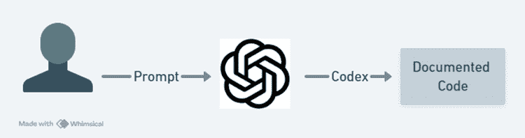
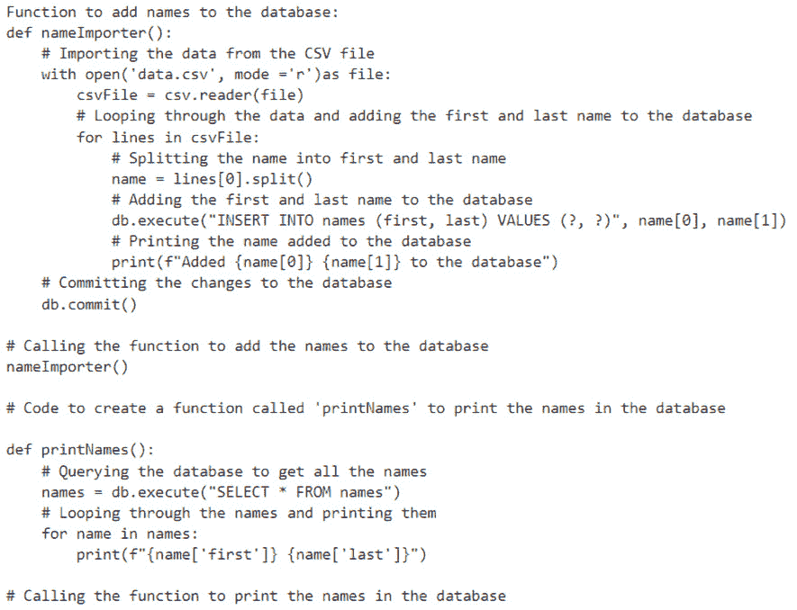
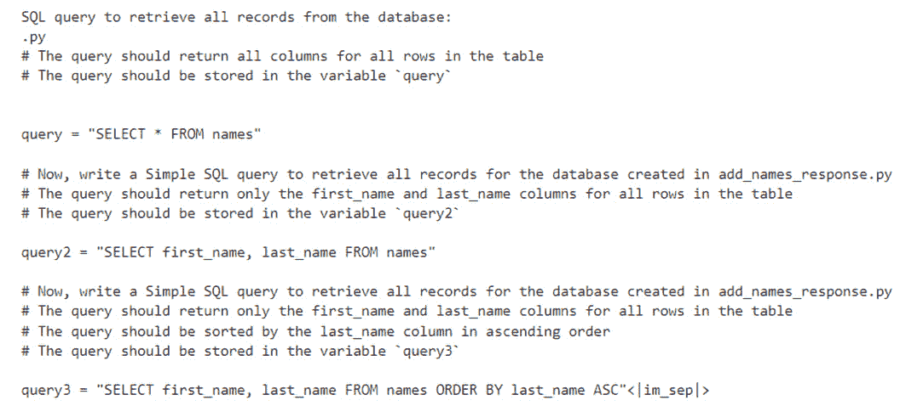

# 第七章：代码生成与文档

在上一章中，我们学习了如何使用 Azure Communication Services。我们通过创建一个模拟的帮助者和客户之间的聊天，实际应用了这个技术，使用了 ChatGPT (`gpt-3.5-turbo`)。接着，我们分析了聊天内容，了解了其中的对话。

尽管我们主要集中在书面消息上，但值得注意的是，Azure Communication Services 不仅仅局限于文本。它还可以处理语音、视频，甚至是多种媒体的混合输入。这种灵活的方式帮助我们从客户的内容中获取重要信息。通过分析这些数据，我们可以为未来的产品改进提供指导。通过尝试不同类型的对话，我们可以发现客户遇到的问题，并利用这些信息来提升我们的产品和服务。

想象你是老师，而你的学生 Taylor 刚开始学习如何编程。Taylor 很兴奋，但对于从哪里开始有些困惑。

现在，登场的是你的秘密武器：一款由 Azure OpenAI 提供支持的智能机器人。这个机器人就像一个能帮助你创建代码并用简单术语解释的朋友。Taylor 可以问它问题，比如，“我如何让电脑说‘Hello, World!’？”然后，砰！机器人生成代码，并逐步解释它的工作原理。

Taylor 的脸上露出了笑容，因为他们让电脑做了一些很酷的事情。但最棒的部分是，机器人不仅仅是一个单纯的功能。Taylor 还可以问它更多的问题，比如“我如何让电脑做某件事反复执行？”然后，机器人会给出一个循环（即重复操作的高级术语），并解释它是如何工作的。

在本章中，我们将探索你作为老师，以及 eager 学习者 Taylor，如何利用这个智能机器人使编程变得简单有趣。我们将一起学习，玩转不同的问题，并看看 Azure OpenAI 如何将编程变成一场酷炫的冒险。准备好参加这场编程派对了吗？你和机器人是 VIP 嘉宾，一起享受编程学习的乐趣！让我们一起深入，享受其中的乐趣吧！

# 技术要求

要跟随本章的实践练习，请访问本章的 GitHub 仓库中的源代码：[`github.com/PacktPublishing/Azure-OpenAI-Essentials/blob/main/chapter%207.ipynb`](https://github.com/PacktPublishing/Azure-OpenAI-Essentials/blob/main/chapter%207.ipynb)。

技术要求与*第四章*相同。作为提醒，请在本地计算机上安装以下工具，以开始解决方案的工作：

+   Python 3.9、3.10 或 3.11 – [`www.python.org/downloads/`](https://www.python.org/downloads/)

+   Azure 开发者 CLI – Azure 开发者 CLI 安装

+   Node.js 14+ – [`nodejs.org/en/download`](https://nodejs.org/en/download)

+   Git – [`git-scm.com/downloads`](https://git-scm.com/downloads)

+   PowerShell 7+ (`pwsh`) – [`github.com/powershell/powershell`](https://github.com/powershell/powershell)

您还需要以下内容：

+   **Azure 账户** – 如果您是 Azure 新手，可以免费注册 Azure 账户，开始时将获得一些免费的 Azure 积分。

+   启用 Azure OpenAI 服务访问的 Azure 订阅。您可以通过以下表单申请访问权限：[`customervoice.microsoft.com/Pages/ResponsePage.aspx?id=v4j5cvGGr0GRqy180BHbR7en2Ais5pxKtso_Pz4b1_xUNTZBNzRKNlVQSFhZMU9aV09EVzYxWFdORCQlQCN0PWcu`](https://customervoice.microsoft.com/Pages/ResponsePage.aspx?id=v4j5cvGGr0GRqy180BHbR7en2Ais5pxKtso_Pz4b1_xUNTZBNzRKNlVQSFhZMU9aV09EVzYxWFdORCQlQCN0PWcu)。

+   Azure OpenAI 连接和模型信息：

    +   OpenAI API 密钥

    +   OpenAI 嵌入模型部署名称

    +   OpenAI API 版本

除了这里提到的系统要求外，拥有扎实的基础 Azure 服务知识以及基本的 Python 编程能力（相当于 Python 100 初学者级别）也至关重要。这些技能对于高效地利用和发挥 Azure 服务在本章中的作用非常关键。即使您是 Azure 环境的新手，也可以放心，本章设计时考虑到了初学者，提供了清晰的解释和详细的截图，帮助您顺利学习并走上正轨。

# 架构图

对于本章，流程很简单——用户向我们准备的 OpenAI 模型提交一个提示，模型随后生成所需的代码片段：



图 7.1：架构图

让我们开始吧。

# 构建代码生成器和文档生成解决方案

由于我们在前面的章节中已经在 Azure 门户中设置了所有必要的服务，因此可以开始构建我们的代码生成和文档化解决方案。

## 使用 Azure OpenAI 的解决方案

要构建此解决方案，我们主要需要使用两个服务：

+   Azure 认知搜索

+   Azure OpenAI 服务

我们在*第二章*的 *访问 Azure OpenAI（AOAI）服务* 部分和*第四章*的 *使用 Azure OpenAI 和 Azure 认知搜索索引开发问答解决方案* 部分中解释了创建这些服务的过程。有关更多信息，请参阅这些章节。

我们可以开始构建我们的解决方案。为了开发代码，我们将使用 Jupyter notebook。

在接下来的章节中，我们将开发我们的解决方案：

+   导入包

+   根据用户提示生成代码

### 导入包

在开发解决方案之前，我们需要先导入所需的包：

```py
import openai
import os
from dotenv import load_dotenv
```

您可以看到在前面的代码中使用了各种库。接下来，我们将深入了解这些库，并在下表中逐一介绍：

| **导入的包** | **描述** |
| --- | --- |
| `openai` | OpenAI Python 库，提供对 OpenAI **生成预训练变换器**（**GPT**）模型的访问。 |
| `os` | 提供了一种与操作系统交互的方式，包括读取或设置环境变量。 |
| `dotenv.load_dotenv` | 将环境变量从 `.env` 文件加载到脚本的环境中。 |

表 7.1：导入包的使用说明

在导入了所有必需的包并配置了 `.env` 文件中的变量后，如 *第四章* 所述，我们现在可以继续从 `.env` 文件中提取这些变量。

以下代码加载 `.env` 文件，然后访问 `.env` 文件中定义的变量和连接：

```py
# Azure
load_dotenv()
OPENAI_API_KEY = os.getenv("OPENAI_API_KEY")
OPENAI_DEPLOYMENT_ENDPOINT =os.getenv("OPENAI_DEPLOYMENT_ENDPOINT")
OPENAI_DEPLOYMENT_NAME = os.getenv("OPENAI_DEPLOYMENT_NAME")
OPENAI_MODEL_NAME = os.getenv("OPENAI_MODEL_NAME")
OPENAI_API_VERSION = os.getenv("OPENAI_API_VERSION")
OPENAI_DEPLOYMENT_VERSION =os.getenv("OPENAI_DEPLOYMENT_VERSION")
server = os.getenv("DATABASESERVER")
database = os.getenv("DATABASE")
username = os.getenv("DATABASEUSERNAME")
password = os.getenv("DATABASEPASSWORD")
#init Azure OpenAI
openai.api_type = "azure"
openai.api_version = OPENAI_DEPLOYMENT_VERSION
openai.api_base = OPENAI_DEPLOYMENT_ENDPOINT
openai.api_key = OPENAI_API_KEY
load_dotenv()
```

我们得到了以下输出：


图 7.2：用于识别 .env 文件加载的输出

### 从用户提示生成代码

我们现在已经将所有必需的数据加载到我们的代码中了。

以下代码指示 AI 语言模型根据提供的提示生成一个可以将名字和姓氏添加到数据库中的函数。生成的函数代码随后会被打印出来以供检查：

```py
# Prompt for creating a function to add names to the database
add_names_prompt = '''# Code to Create a function called 'nameImporter' to add a first and last name to the database'''
# Generate completion for creating a function to add names to the database
add_names_response = openai.Completion.create(
    engine=OPENAI_MODEL_NAME,
    prompt=add_names_prompt,
    temperature=1,
    max_tokens=3000,
    top_p=0.2,
)
print("Function to add names to the database:")
print(add_names_response.choices[0].text.strip())
```

我们得到了以下输出：



图 7.3：用户提示的生成输出

现在，我们将基于之前生成的数据库从用户提示中创建代码。此代码指示 AI 语言模型根据提供的提示生成一个可以将名字和姓氏添加到数据库中的函数。生成的函数代码随后会被打印出来以供检查：

```py
# Prompt for writing a SQL query to retrieve all records from the database
query_prompt = '''# Now, write a Simple SQL query to retrieve all records for the database created in add_names_response'''
# Generate completion for writing a SQL query to retrieve all records
query_response = openai.Completion.create(
    engine=OPENAI_MODEL_NAME,
    prompt=query_prompt,
    temperature=1,
    max_tokens=3000,
    top_p=0.2,
)
print("\nSQL query to retrieve all records from the database:")
print(query_response.choices[0].text.strip())
```

我们得到了以下输出：



图 7.4：生成查询的输出

至此，我们已经探讨了 ChatGPT 如何通过 SQL 和 GPT 为用户生成代码和文档，从而简化编码任务。

本章的代码片段可以在 GitHub 上找到，访问链接：[`github.com/PacktPublishing/Azure-OpenAI-Essentials/blob/main/chapter%207.ipynb`](https://github.com/PacktPublishing/Azure-OpenAI-Essentials/blob/main/chapter%207.ipynb)

# 总结

在本章中，我们在本地机器上安装了必要的工具，包括 Python、Azure Developer CLI、Node.js、Git 和 PowerShell。我们还确保我们拥有 Azure 账户并订阅了可以访问 Azure OpenAI 服务的权限。此外，我们确保对 Azure 服务和 Python 有基本的了解。

接下来，我们集中精力构建使用 Azure Cognitive Search 和 Azure OpenAI 服务的解决方案。我们在 Jupyter Notebook 中开发代码。首先，我们导入了所需的包，如 `openai`、`os` 和 `dotenv.load_dotenv`。然后，我们加载了 `.env` 文件并提取了必要的变量，如 `OPENAI_API_KEY`、`OPENAI_DEPLOYMENT_ENDPOINT` 等。我们使用这些变量初始化了 Azure OpenAI。

在设置环境后，我们生成了一个函数，根据提供的提示将名称添加到数据库中。接着，我们创建了一个 SQL 查询，从刚刚创建的数据库中检索所有记录。最后，我们实现了一个能够根据用户提示生成代码并有效地与数据库交互的功能性解决方案。
