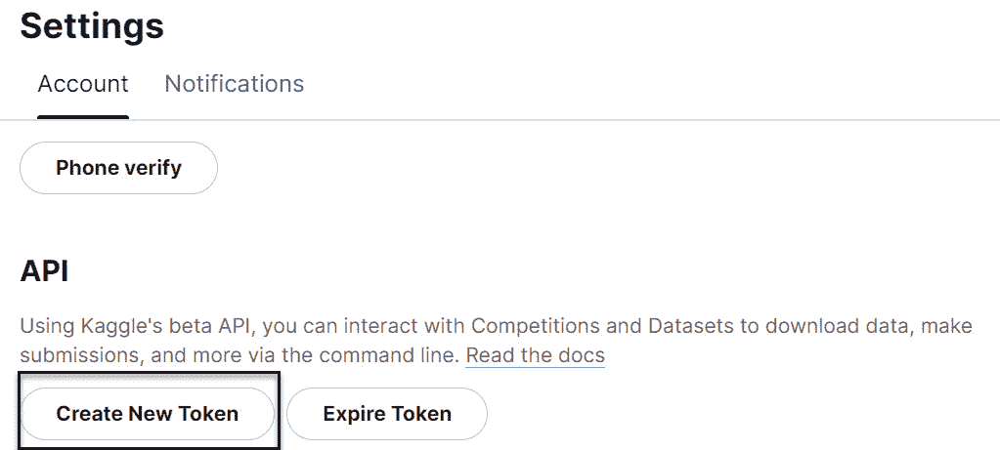
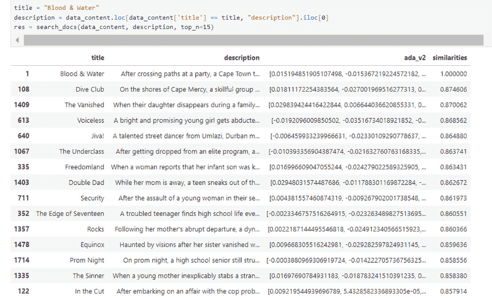

# 第八章：使用 Azure OpenAI 创建一个基本的推荐系统

在上一章中，我们深入探讨了制作一个简单 Python 程序的技巧。这个程序不仅能生成代码片段；它就像一个编程精灵，还能提供所生成代码的文档。这个功能为我们的编程之旅提供了一个启动平台，使得即使是没有编程知识的人也能轻松上手。

想象一下，你和你的朋友准备好享受一个轻松的周五夜晚，打算看一部电影。但问题是，从一大堆电影中挑选一部可不容易。

所以，你想出了一个很酷的主意！与其为选择而烦恼，为什么不创建一些帮助你的东西呢？你决定制作一个聊天机器人，它是一个像有用朋友一样的小程序，了解你喜欢什么类型的电影，并推荐最合适的电影。

现在，想象一下：你和你的朋友准备好零食，告诉你的机器人你想看什么类型的电影。不再需要翻阅无尽的列表——机器人会帮你做艰难的筛选工作，并根据你的喜好给出电影推荐。

这段体验就像拥有一个自己的电影指南，确保完美的周五之夜。当你想到有了这个新的电影指南，电影之夜会变得更轻松、更有趣时，兴奋感油然而生。准备好享受一个无压力的电影之夜吧，带着你的推荐系统。

# 技术要求

要跟随本章的实操练习，请访问本章 GitHub 仓库中的源代码，地址为[`github.com/PacktPublishing/Unlocking-Creativity-with-Azure-OpenAI/blob/main/Chapter%208.ipynb`](https://github.com/PacktPublishing/Unlocking-Creativity-with-Azure-OpenAI/blob/main/Chapter%208.ipynb)

除*第七章*中*技术要求*部分所列出的内容外，不需要额外的技术要求。

然而，你确实需要创建一个 Kaggle 帐户，以生成 API 密钥来获取你选择的数据集。在本章中，我们使用的是 Netflix 数据集，地址为[`www.kaggle.com/datasets/shivamb/netflix-shows/code`](https://www.kaggle.com/datasets/shivamb/netflix-shows/code)。

# 架构图

在本章的解决方案中，用户首先从 Kaggle 等来源获取原始数据集。接着，我们对数据进行规范化和清理，以满足我们的需求。然后，处理后的数据将用于创建嵌入。当用户查询电影推荐时，ChatGPT API 会在嵌入的数据集中进行搜索，并根据用户的输入提供推荐。下图展示了整体工作流程：


图 8.1：架构图

# 使用 Azure OpenAI 创建推荐系统

现在我们已经在 Azure 门户中设置了所有必要的服务，我们可以开始构建我们的解决方案。为了开发代码，我们将在一个`requirements.txt`文件中工作，该文件列出了我们解决方案所需的所有 Python 库。请检查此文件，并使用以下命令安装所需的包：!`pip install requirements.txt`。然后，按以下步骤继续：

1.  创建一个 Kaggle 账户。

    访问[`www.kaggle.com/datasets/shivamb/netflix-shows?resource=download`](https://www.kaggle.com/datasets/shivamb/netflix-shows?resource=download)，然后下载 CSV 文件，或者进入**设置**并通过点击**创建新令牌**来生成 API 令牌：



图 8.2：生成 Kaggle 令牌

1.  导入所需的包。

    使用`pip install`安装缺失的库，并确保你的`openai`版本为 0.28.0：

    ```py
    import openai
    import os
    import re
    import requests
    import sys
    from num2words import num2words
    import pandas as pd
    import numpy as np
    from openai.embeddings_utils import (
        get_embedding, cosine_similarity)
    import tiktoken
    from dotenv import load_dotenv
    #Unzip the downloaded file
    import zipfile
    ```

    你可以看到在前面的代码中使用了多种库。让我们在下表中深入探讨每一个库：

| **导入语句** | **描述** |
| --- | --- |
| `import openai` | 提供访问 OpenAI API 的功能，用于与 AI 模型和服务进行交互。 |
| `import os` | 提供与操作系统交互的功能，如访问环境变量和文件。 |
| `import re` | 提供对正则表达式的支持，允许模式匹配和字符串操作。 |
| `import requests` | 启用 HTTP 请求，允许与 Web 服务器和 API 进行交互。 |
| `import sys` | 提供系统特定的参数和功能，例如访问命令行参数和 Python 解释器。 |
| `from num2words` `import num2words` | 允许将数字转换为单词。 |
| `import pandas` `as pd` | 提供用于数据操作和分析的数据结构和函数，特别适用于处理表格数据。 |
| `import numpy` `as np` | 提供数值计算功能，包括对数组、矩阵和数学运算的支持。 |
| `from openai.embeddings_utils import` `get_embedding, cosine_similarity` | 提供用于处理嵌入的工具函数，包括生成嵌入和计算余弦相似度。 |
| `import tiktoken` | 不是标准的 Python 模块。它似乎是一个自定义或第三方模块。从`import`语句本身无法确定其用途。 |
| `from dotenv` `import load_dotenv` | 提供从`.env`文件加载环境变量到环境中的功能。 |

表 8.1：已导入包的说明

1.  现在，让我们使用`.env`文件中提供的密钥初始化所有必要的常量。将`"KAGGLE_USERNAME"`和`"KAGGLE_KEY"`添加到已存在的`.env`文件中：

    ```py
    # Azure
    load_dotenv()
    OPENAI_API_KEY = os.getenv("OPENAI_API_KEY")
    OPENAI_DEPLOYMENT_ENDPOINT =os.getenv(
        "OPENAI_DEPLOYMENT_ENDPOINT")
    OPENAI_DEPLOYMENT_NAME = os.getenv("OPENAI_DEPLOYMENT_NAME")
    OPENAI_MODEL_NAME = os.getenv("OPENAI_MODEL_NAME")
    OPENAI_API_VERSION = os.getenv("OPENAI_API_VERSION")
    OPENAI_DEPLOYMENT_VERSION =os.getenv(
        "OPENAI_DEPLOYMENT_VERSION")
    KAGGLE_USERNAME = os.getenv("KAGGLE_USERNAME")
    KAGGLE_KEY = os.getenv("KAGGLE_KEY")
    server = os.getenv("DATABASESERVER")
    database = os.getenv("DATABASE")
    username = os.getenv("DATABASEUSERNAME")
    password = os.getenv("DATABASEPASSWORD")
    #init Azure OpenAI
    openai.api_type = "azure"
    openai.api_version = OPENAI_DEPLOYMENT_VERSION
    openai.api_base = OPENAI_DEPLOYMENT_ENDPOINT
    openai.api_key = OPENAI_API_KEY
    load_dotenv()
    ```

1.  将这些内容添加到已经在*第六章*中创建的包含 Kaggle 信息的`.env`文件中：

    ```py
    KAGGLE_USERNAME = '{username}'
    KAGGLE_KEY='{key}'
    ```

1.  按照以下步骤设置 Kaggle 凭据：

    1.  一旦你生成了 Kaggle token，正如本节开始时所解释的，会生成一个包含用户名和密钥的 `.json` 文件。

    1.  使用在 `kaggle.json` 中找到的用户名值更新 `KAGGLE_USERNAME`。

    1.  同样，使用密钥修改 `KAGGLE_KEY` 的值。

    完成这些配置后，你将拥有连接资源所需的设置。我们得到了以下输出：


图 8.3：加载 .env 文件后的输出

1.  下载数据集。

    这是一个简洁的方式，从 Jupyter notebook 中直接下载 `netflix-shows` 数据集：

    ```py
    !kaggle datasets download -d shivamb/netflix-shows
    ```

    我们得到了以下输出：


图 8.4：从 Kaggle 下载数据集

1.  解压下载的数据集。

    这段代码解压下载的文件，并将其添加到 `netflix_dataset` 文件夹中：

    ```py
    with zipfile.ZipFile("netflix-shows.zip", 'r') as zip_ref:
        zip_ref.extractall("netflix_dataset")
    ```

1.  从 `.csv` 文件读取数据。

    这段代码从 `.csv` 文件中读取数据，并将其导入到 `pandas` DataFrame 中：

    ```py
    #Read Data from csv file
    pd.read_csv("netflix_dataset/netflix_titles.csv")
    data
    ```

    这是输出结果：


图 8.5：.csv 数据的输出

1.  获取标题和描述。

    这段代码从整个数据集中获取标题和描述：

    ```py
    data_content = data[['title', 'description']]
    data_content
    ```

    这是输出结果：


图 8.6：仅显示标题和描述的输出

1.  对数据进行归一化处理。

    ```py
    'title' column in the data_content DataFrame is normalized by removing excess whitespace, unnecessary punctuation, and newline characters:
    ```

    ```py
    pd.options.mode.chained_assignment = None
    # s is input text
    def normalize_text(s, sep_token = " \n "):
        s = re.sub(r'\s+',  ' ', s).strip()
        s = re.sub(r". ,","",s)
        # remove all instances of multiple spaces
        s = s.replace("..",".")
        s = s.replace(". .",".")
        s = s.replace("\n", "")
        s = s.strip()
        return s
    data_content['title']= data_content["title"].apply(
        lambda x : normalize_text(x))
    data_content
    ```

    这是输出结果：


图 8.7：归一化后数据的输出

1.  创建嵌入（embeddings）。

    ```py
    the embeddings into the data_content DataFrame, laying the groundwork for potential further analysis or applications involving the generated embeddings:
    ```

    ```py
    data_content['ada_v2'] = data_content["description"]. apply(
        lambda x : get_embedding(
            x, engine = 'text-embedding-ada-002'))
    ```

    这是输出结果：


图 8.8：带嵌入的输出

1.  搜索特定内容。

    这段代码高效地发现数据集中的相似内容。通过计算相似度分数并选择最匹配的项，函数成为寻找所需结果的强大工具：

    ```py
    def search_docs(df, user_query, top_n=3, to_print=True):
        embedding = get_embedding(
            user_query,
            engine="text-embedding-3-large"
        )
        df["similarities"] = df.ada_v2.apply(
        lambda x: cosine_similarity(x, embedding))
        res = (
            df.sort_values("similarities", ascending=False)
            .head(top_n)
        )
        if to_print:
            display(res)
        return res
    title = "Blood & Water"
    description = data_content.loc[data_content['title'] == title, 
        "description"].iloc[0]
    res = search_docs(data_content, description, top_n=15)
    ```

    这是输出结果：



图 8.9：数据搜索输出

在我们的代码中，我们使用了标题 `"Blood & Water"`。我们的推荐系统根据你的偏好生成了电影列表。数据中的第一条记录是 `"Blood & Water"` 本身，其相似度分数为 1。随后，我们收到了类似 `"Dive Club"`（相似度 0.874）和 `"The Vanished"`（相似度 0.870）的推荐。这让我们可以根据提供的相似度分数轻松选择一部电影。

本章节的代码片段可以在 GitHub 上获取，点击这里访问：[`github.com/PacktPublishing/Azure-OpenAI-Essentials/blob/main/Chapter%208.ipynb`](https://github.com/PacktPublishing/Azure-OpenAI-Essentials/blob/main/Chapter%208.ipynb)

# 总结

在本章中，我们显著增强了我们的电影推荐解决方案，增加了多个功能层，使其更加智能且易于使用。我们首先设置了必要的密钥和凭证，确保我们的程序能够安全地与所需的 API 和服务进行交互。这一设置至关重要，因为它使我们的系统能够访问强大的资源，例如 OpenAI 的嵌入模型，这些模型对于理解和处理数据至关重要。

接下来，我们将一个直接从 Kaggle 获取的 Netflix 数据集集成到我们的 Jupyter notebook 中。通过将该数据集组织成一个 `pandas` DataFrame，我们创建了一个结构化的环境，便于高效的数据操作和分析。这一步至关重要，因为一个干净、组织良好的数据集是任何数据驱动解决方案的基础，使我们能够专注于提取有意义的洞察。

在加载数据后，我们将重点放在节目的标题和描述上，因为这些文本字段包含了推荐内容最有价值的信息。我们对这些文本数据进行了清理和预处理，确保它们的格式能够被机器轻松理解。文本预处理是一个关键步骤，因为它消除了噪音并标准化了数据，使模型能够更好地理解不同节目的细微差别。

为了进一步提升我们的推荐系统，我们使用 OpenAI 强大的模型将描述转化为数值表示，这些表示被称为嵌入（embeddings）。这些嵌入捕捉了文本的语义意义，使我们的系统能够更有效地比较和对比不同的节目。这一能力使得我们的推荐系统能够推荐与用户已经喜爱的节目在内容和主题上真正相似的节目。

最后，我们开发了一个利用这些嵌入来查找并推荐与给定喜好相似节目的功能。例如，如果你是《"Blood & Water"》的粉丝，我们的系统可以推荐其他在主题、情节或风格上相似的节目。这个功能是我们推荐系统的核心，使其不仅仅是一个发现新内容的工具，更是一个为你量身定制的个性化指南。

展望未来，在下一章节，我们将更进一步，探索如何将文本提示转化为视频。我们将首先从文本提示生成图像，然后将这些图像合成视频。这将为动态内容创作开辟新的可能性，可以应用于各种其他场景，如营销、教育和娱乐。
