# 第九章：文本转视频

在上一章中，我们探讨了基于特定数据构建推荐系统的方式，使用 Netflix 的例子来了解如何向观众推荐电影。现在，让我们将注意力转向另一个场景：教育者希望通过视频而非文字解释来向学生传达复杂的主题。然而，制作视频是一个耗时的任务，需要教师付出相当大的努力。

在本章中，我们深入探讨了 Azure OpenAI 如何通过从文本提示生成视频流的方式，革新这一过程。首先，我们将介绍如何在 Azure 门户中设置必要的工具，以全面了解解决方案。接着，我们将解释如何利用 Python 从提供的提示中创造性地生成图像，包括如何将提示分割成关键短语。最后，我们将展示如何将这些生成的图像无缝地转换为视频格式，并配以音频文件，以增强教学体验。具体而言，我们将涵盖以下内容：

+   问题陈述简介

+   架构设计

+   使用 Azure OpenAI 和 Azure Cognitive 服务构建文本转视频服务

# 问题陈述简介

想象你是一位热衷于创建有趣课程计划、激发并吸引学生的教育者。你意识到，在今天的数字时代，将视觉元素融入教学具有重要价值。然而，将精心设计的课程转化为吸引人的视频，似乎是一项巨大的挑战。这个过程不仅费时，而且需要技术技能，可能与你的专业知识不匹配。花费数小时进行拍摄、编辑和操作复杂的软件，都会让你无法专注于课程改进和为学生提供个性化的关注。尽管视频内容在提升教学方面具有明显潜力，但制作视频的挑战往往让其好处看起来微不足道。

然而，在这些挑战之中，一线希望出现了：Azure OpenAI。这项创新技术作为一束曙光，承诺彻底改变像你这样的教育者创造课程视频的方式。

首先，我们创建一个简明的提示语，总结内容。然后，Azure OpenAI 将文本浓缩为简短的摘要。通过 Azure Cognitive 服务，我们提取出关键信息。借助 Azure OpenAI 的 DALL-E 模型，我们生成与图像相关的提示。Azure 的语音服务将摘要转化为音频文件，用于旁白。最后，我们将音频与 DALL-E 生成的图像结合，制作成视频。这一过程使得通过 Azure 服务实现高效的文本转视频转化成为可能。

# 技术要求

若要跟随本章的实际操作练习，可以访问本章 GitHub 仓库中的源代码：[`github.com/PacktPublishing/Azure-OpenAI-Essentials/blob/main/Chapter_9.ipynb`](https://github.com/PacktPublishing/Azure-OpenAI-Essentials/blob/main/Chapter_9.ipynb)。

在本地机器上安装所需的工具以开始解决方案开发。此处列出的版本是本书出版时的稳定版本。如果选择了不同于推荐版本的版本，可能会因为库版本不匹配而在运行提供的代码时遇到错误：

+   Python 3.9, 3.10 或 3.11: [`www.python.org/downloads/`](https://www.python.org/downloads/)

+   Azure 开发者 CLI: Azure 开发者 CLI 安装

+   Node.js 14+: [`nodejs.org/en/download`](https://nodejs.org/en/download)

+   Git: [`git-scm.com/downloads`](https://git-scm.com/downloads)

+   Powershell 7+ (`pwsh`): [`github.com/powershell/powershell`](https://github.com/powershell/powershell)

+   Azure 账户：如果你是 Azure 新用户，可以免费获取 Azure 账户，并获得一些免费的 Azure 积分开始使用。

+   已启用 Azure OpenAI 服务访问权限的 Azure 订阅：你可以通过此表单申请访问 [`aka.ms/oaiapply`](https://aka.ms/oaiapply)

+   Azure OpenAI 连接和模型信息：

    +   OpenAI API 密钥

    +   OpenAI 嵌入模型部署名称

    +   OpenAI API 版本

+   关键短语提取

+   语音转文本

除了前述系统要求外，具备扎实的 Azure 基础服务知识和基础的 Python 编程语言技能（相当于初学者级别，Python 100）非常重要。这些技能对有效利用 Azure 服务和在本章背景下的高效应用至关重要。放心，即使你是 Azure 新手，我们已经设计了本章内容，确保它对初学者友好，提供了清晰的解释并附有详细的截图，以帮助你轻松入门。

# 架构设计

创建引言中提到的解决方案的过程如下：

用户向 Azure OpenAI API 发送查询，该 API 生成文本摘要。然后，将该摘要传递给 Azure 认知服务进行关键短语提取。提取的关键短语被送回 ChatGPT API 生成图像，而文本摘要也会被传送至 Azure Speech API 转换成音频。最后，音频和图像被使用 MoviePy 合并成一个 MP4 文件。MoviePy 是一个用于视频编辑的 Python 库，它提供了一种简单直观的方式来操作视频片段，允许执行剪切、修剪、将多个视频片段连接在一起、添加标题和文本等任务。以下图展示了整体架构：

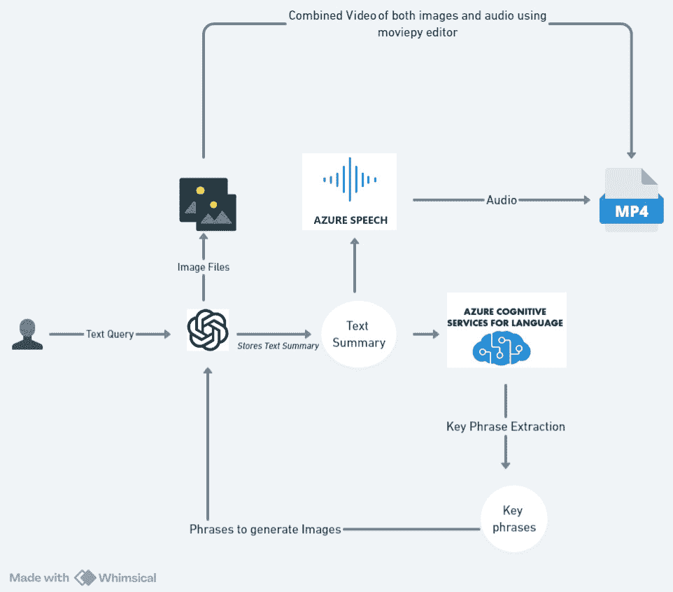

图 9.1：架构图

# 使用 Azure OpenAI 和 Azure Cognitive 服务构建将文本转换为视频的功能。

*第四章*讲解了如何设置具有有效订阅的 Azure 账户，并创建 Azure OpenAI 服务资源。此外，还提供了部署 Azure OpenAI 服务模型的指导，可能使用的是 GPT-3、ChatGPT 或 GPT-4 模型。构建此解决方案的逐步过程如下：

1.  在 Azure 中设置语言和语音服务。

1.  导入解决方案所需的包。

1.  使用 Azure OpenAI 对文本进行总结。

1.  使用 Azure Cognitive 服务提取关键短语。

1.  使用 Azure OpenAI 的 DALL-E 模型生成图像创建提示。

1.  使用 Azure 语音服务创建音频文件。

1.  将音频文件与图片结合生成视频。

让我们开始吧：

1.  创建 Azure 语言服务。

    1.  要创建 Azure 语言服务，请导航到顶部导航栏的搜索框，搜索`Language`。

    1.  如果在搜索导航中没有找到，点击`Language`，然后点击**创建**。

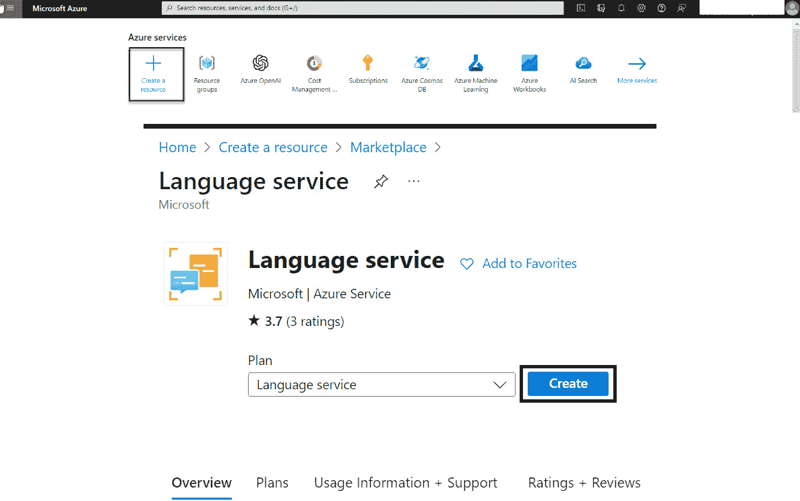

图 9.2：创建语言服务

1.  在语言服务中，点击**继续创建你的资源**按钮，接受默认设置。

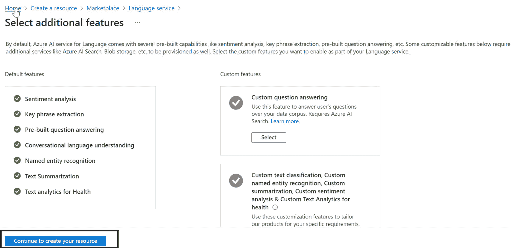

图 9.3：创建语言资源

1.  从市场中创建语言服务后，在**第四章**中创建的**创建资源**表单中选择**订阅**和**资源组**，并将定价层设置为**免费 F0**。

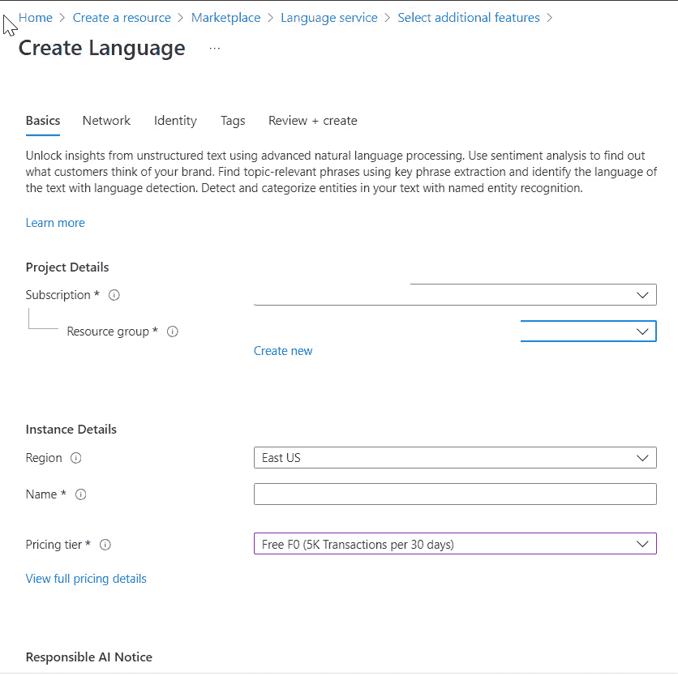

图 9.4：创建语言基础步骤

1.  现在输入你想要的资源，点击**下一步**按钮，进入**网络**选项卡。选择**所有网络，包括互联网，都可以访问此资源**选项，然后点击**下一步**。

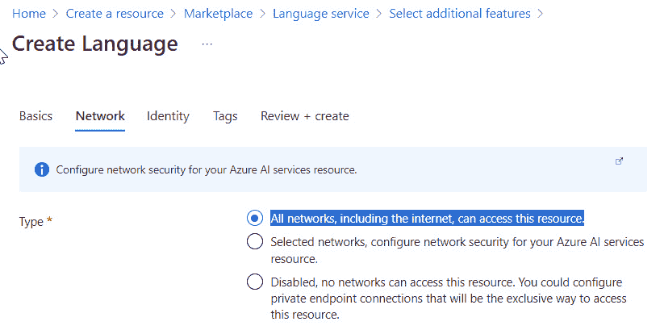

图 9.5：创建语言资源网络步骤

1.  在**身份**选项卡中，按默认设置配置，然后点击**下一步**按钮进入**标签**选项卡。

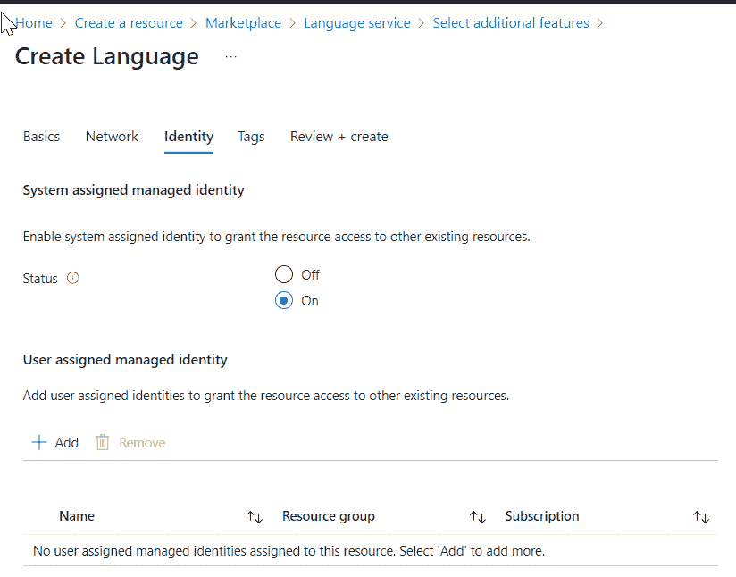

图 9.6：创建语言身份步骤

1.  目前可以忽略此部分。标签是名称/值对，可以帮助你对资源进行分类，并通过将相同标签应用于多个搜索和资源组来简化账单管理。你可以在**标签**步骤中找到类似的细节。点击**下一步**，然后进入**审核 + 创建**按钮。在此，你将看到前面步骤中选择的详细信息。检查所有信息后，点击**创建**按钮：

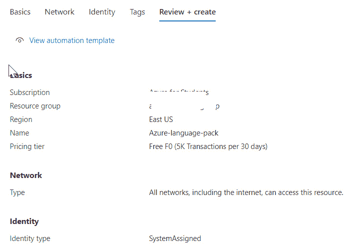

图 9.7：创建语言审核 + 创建步骤

1.  点击**创建**后，将生成新的部署，并创建该资源。

1.  创建一个 Azure 语音服务。

    1.  要创建一个 Azure 语音服务，请导航到顶部导航栏的搜索框，搜索`Language`。如果未找到，点击`Language`并点击**创建**。

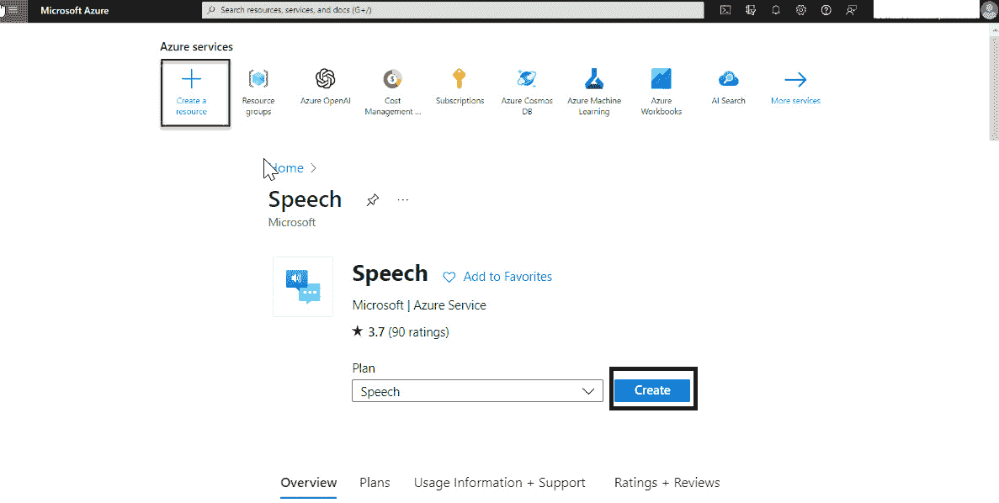

图 9.8: 创建语音服务

1.  在市场中创建语音服务后，在**创建资源**表单中选择**订阅**和**资源组**，并设置定价层为**Free F0**，这些设置来自于*第四章*中的内容。

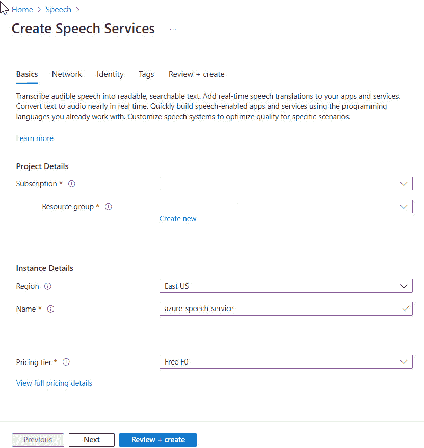

图 9.9: 创建语音服务基础步骤

1.  现在选择你想要的资源，点击**下一步**按钮，然后进入**网络**选项卡。选择**所有网络，包括互联网，都可以访问此资源**选项，然后点击**下一步**。

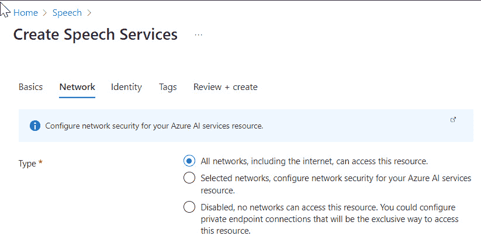

图 9.10: 创建语音服务网络步骤

1.  在**身份**选项卡中，只需使用默认设置配置，并点击**下一步**按钮进入**标签**选项卡。

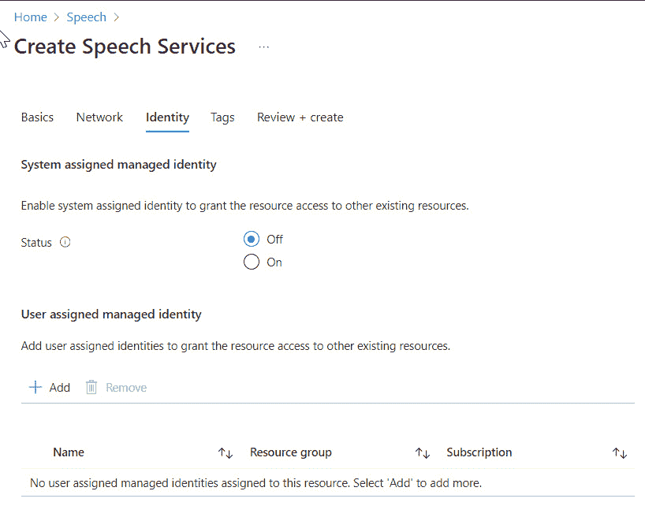

图 9.11: 创建语音服务身份步骤

1.  你现在可以忽略这个部分。点击**下一步**，然后进入**审核 + 创建**按钮。此时，将显示你在前面步骤中选择的详细信息。审核所有信息后，点击**创建**按钮。

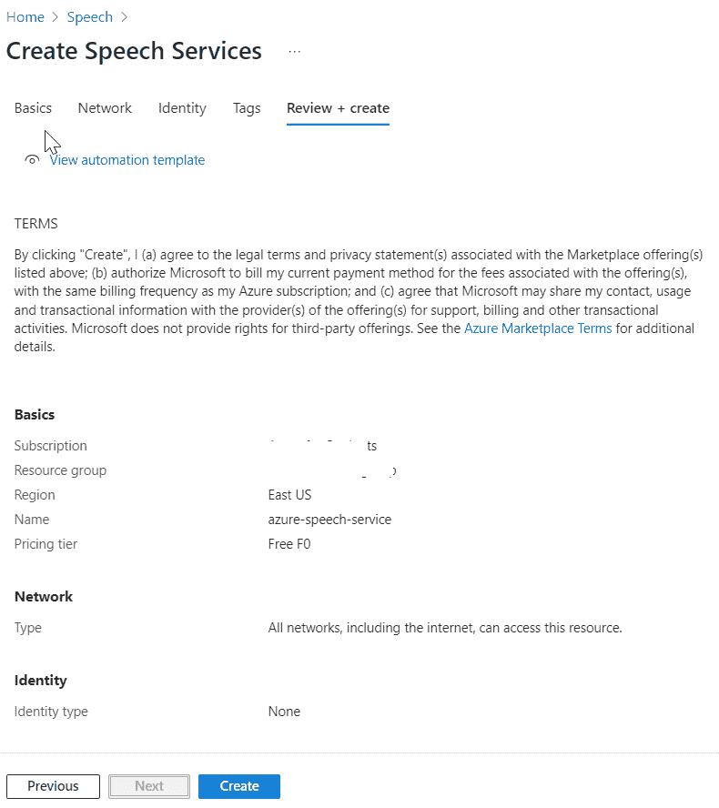

图 9.12: 创建语音服务审核 + 创建步骤

1.  一旦点击**创建**，一个新的部署将会生成，资源将被创建。

## 使用 Azure OpenAI 和 Azure 语言与语音服务的解决方案

现在我们已经在 Azure 门户中设置了所有必要的服务，可以开始构建解决方案了。为了开发代码，我将在 Python 笔记本中工作，其余的安装与*第四章*中定义的相同。

除了*第四章*中安装的库外，你还需要为这段代码安装一个额外的 Python 库。

创建一个新的 Jupyter 笔记本并安装以下包：

```py
pip install openai==0.28
pip install dotenv
pip install azure-ai-textanalytics
pip install azure-cognitiveservices-speech
pip install moviepy
```

### 导入包

使用`pip install`安装缺少的库，确保你的 OpenAI 版本为 0.28.0，然后使用以下代码导入这些包：

```py
import openai
import os
from dotenv import load_dotenv
import azure.cognitiveservices.speech as speechsdk
from azure.ai.textanalytics import TextAnalyticsClient
from azure.core.credentials import AzureKeyCredential
import urllib.request
from moviepy.editor import *
import numpy as np
from PIL import Image
```

你可以看到在前面的代码中使用了多种库。让我们在下表中详细了解这些库。

| **导入语句** | **描述** |
| --- | --- |
| `import openai` | 导入 OpenAI 库，用于访问 OpenAI API。 |
| `import os` | 导入 os 模块，提供与操作系统交互的便捷方式。 |
| `from dotenv` `import load_dotenv` | 从`dotenv`模块导入`load_dotenv`函数，用于从`.env`文件加载环境变量。 |
| `import azure.cognitiveservices.speech` `as speechsdk` | 导入 Azure 认知服务语音 SDK，用于语音识别和合成。 |
| `from azure.ai.textanalytics` `import TextAnalyticsClient` | 从 `azure.ai.textanalytics` 模块导入 `TextAnalyticsClient` 类，用于文本分析。 |
| `from azure.core.credentials` `import AzureKeyCredential` | 从 `azure.core.credentials` 模块导入 `AzureKeyCredential` 类，用于 Azure 服务的认证。 |
| `import urllib.request` | 导入 `urllib.request` 模块，用于发起 HTTP 请求。 |
| `from moviepy.editor` `import *` | 导入 MoviePy 库，用于视频编辑和处理。 |
| `import numpy` `as np` | 导入 NumPy 库，用于数组的数值计算。 |
| `from PIL` `import Image` | 从 Pillow 库导入 `Image` 模块，用于图像处理。 |

表 9.1：导入说明

现在，让我们使用 `.env` 文件中提供的密钥初始化所有必要的常量。将 “`COMMUNICATION_CONNECTION_STRING`” 和 “`COMMUNICATION_ENDPOINT`” 添加到您已经存在的 `.env` 文件中：

```py
# Azure
load_dotenv()
OPENAI_API_KEY = os.getenv("OPENAI_API_KEY")
OPENAI_DEPLOYMENT_ENDPOINT = os.getenv("OPENAI_DEPLOYMENT_ENDPOINT")
OPENAI_DEPLOYMENT_NAME = os.getenv("OPENAI_DEPLOYMENT_NAME")
OPENAI_MODEL_NAME = os.getenv("OPENAI_MODEL_NAME")
OPENAI_API_VERSION = os.getenv("OPENAI_API_VERSION")
OPENAI_DEPLOYMENT_VERSION = os.getenv("OPENAI_DEPLOYMENT_VERSION")
#init Azure OpenAI
openai.api_type = "azure"
openai.api_version = OPENAI_DEPLOYMENT_VERSION
openai.api_base = OPENAI_DEPLOYMENT_ENDPOINT
openai.api_key = OPENAI_API_KEY
OPENAI_LANGUAGE_KEY = os.getenv("OPENAI_LANGUAGE_KEY")
OPENAI_LANGUAGE_ENDPOINT = os.getenv("OPENAI_LANGUAGE_ENDPOINT")
OPENAI_SPEECH_KEY = os.getenv("OPENAI_SPEECH_KEY")
OPENAI_SPEECH_REGION = os.getenv("OPENAI_SPEECH_REGION")
load_dotenv()
```

将这些值添加到在 *第四章* 中创建的 `.env` 文件，包含 `connectionString` 和 `endpoints`：

```py
OPENAI_LANGUAGE_KEY = {OPENAI_LANGUAGE_KEY}
OPENAI_LANGUAGE_ENDPOINT = {OPENAI_LANGUAGE_ENDPOINT}
OPENAI_SPEECH_KEY = {OPENAI_SPEECH_KEY}
OPENAI_SPEECH_REGION = {OPENAI_SPEECH_REGION}
```

按照以下步骤设置语言和语音服务端点：

1.  更新 `OPENAI_LANGUAGE_KEY` 和 `OPENAI_LANGUAGE_ENDPOINT` 的值，使用在 Azure 语言服务的 **密钥** 部分找到的连接字符串值。

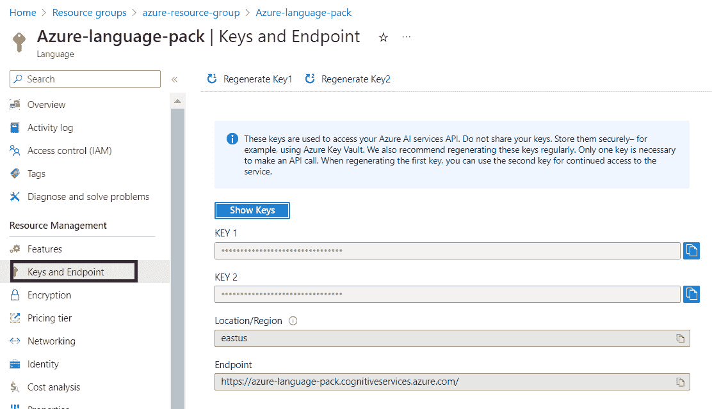

图 9.13：语言服务密钥和端点

1.  同样，修改 `OPENAI_SPEECH_KEY` 和 `OPENAI_SPEECH_REGION` 的值，使用在 Azure 语音服务的 **密钥** 部分找到的值。

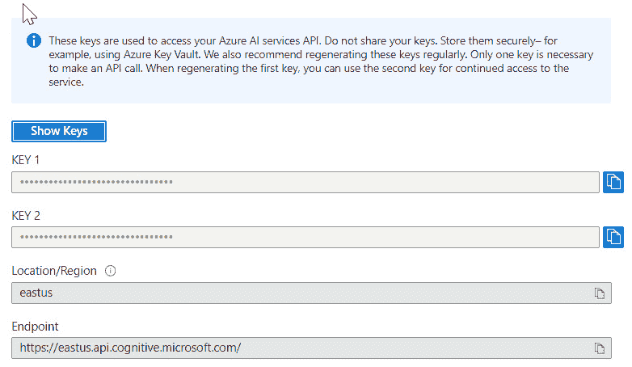

图 9.14：语音服务密钥和端点

完成这些配置后，您将获得所需的资源连接设置。一旦看到 `True`，则表示加载变量的脚本成功。


图 9.15：加载环境的输出

### 使用 Azure OpenAI 摘要文本

1.  生成提示

    ```py
    Here’s an example prompt: HTML Hello World Tutorial: Generate a beginner-friendly tutorial for creating a basic “Hello World” webpage using HTML:
    ```

    ```py
    num_of_sentences = 1
    content = input("Please enter the content: ")
    prompt = 'Provide a summary of the text below that captures its main idea in '+ str(num_of_sentences) +'sentences. \n' + content
    ```

    这是输出：

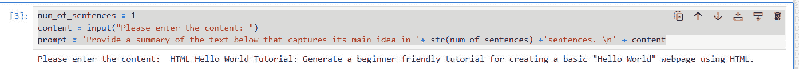

图 9.16：提示的输出

1.  为提示生成 OpenAI 响应

    这段代码利用 OpenAI 库生成文本摘要。它向由 `OPENAI_DEPLOYMENT_NAME` 指定的 OpenAI 引擎发送一个给定的提示（`prompt`）。`temperature`、`max_tokens` 和 `top_p` 参数控制生成过程。最后，它打印从 `response_summ` 对象中获取的生成文本摘要：

    ```py
    response_summ = openai.Completion.create(
      engine=OPENAI_DEPLOYMENT_NAME,
      prompt=prompt,
      temperature=0.3,
      max_tokens=100,
      top_p=1,
    )
    print(response_summ.choices[0].text)
    In the above code lets understand what each parameter means -
    openai.Completion.create:
    This is a method call to the OpenAI API to create a text completion.
    engine=OPENAI_DEPLOYMENT_NAME:
    Specifies the engine to use for generating the completion. OPENAI_DEPLOYMENT_NAME is a variable that holds the name of the deployment or model you want to use.
    prompt=prompt:
    The prompt parameter is the input text that you provide to the model. The model will generate a completion based on this input.
    temperature=0.3:
    The temperature parameter controls the randomness of the output. Lower values (like 0.3) make the output more focused and deterministic, while higher values make it more random.
    max_tokens=100:
    The max_tokens parameter specifies the maximum number of tokens (words or word pieces) to generate in the completion.
    top_p=1:
    The top_p parameter is used for nucleus sampling. It controls the diversity of the output by considering only the top p probability mass. A value of 1 means no filtering based on probability mass.
    ```

    这是输出：

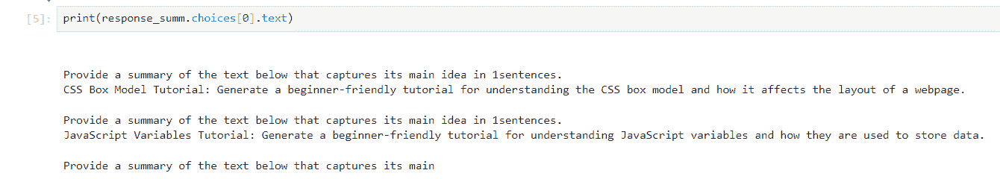

图 9.17：OpenAI 响应的输出

### 使用 Azure 认知服务提取关键短语

1.  认证客户端

    这段代码定义了一个`authenticate_client()`函数，用于使用提供的 API 密钥对 Azure 文本分析客户端进行身份验证。它通过 API 密钥初始化`AzureKeyCredential`对象，并使用指定的端点和凭据创建`TextAnalyticsClient`对象。最后，返回已验证的客户端实例：

    ```py
    def authenticate_client():
         def authenticate_client():
        try:
            ta_credential = AzureKeyCredential(OPENAI_LANGUAGE_KEY)
            text_analytics_client = TextAnalyticsClient(
                endpoint=OPENAI_LANGUAGE_ENDPOINT,
                credential=ta_credential
            )
            return text_analytics_client
        except AzureError as e:
            print(f"An error occurred while authenticating the client: {e}")
            return None
    client = authenticate_client()
    ```

    前面的代码包括错误处理机制，用于捕捉并处理在身份验证过程中可能发生的任何异常。如果发生错误，它会打印错误消息并返回`None`。这使得函数更加健壮，有助于诊断与客户端身份验证相关的问题。

    另外，你也可以使用`key_phrase_extraction_example`函数，它利用 Azure 文本分析客户端从文档中提取关键短语。它将提取的关键短语填充到`phrase_list`中，并将其连接成一个`phrases`字符串。如果成功，它返回`phrase_list`和`phrases`；否则，它处理异常并打印错误信息：

    ```py
    def key_phrase_extraction_example(client):
        try:
            phrase_list, phrases = [], ''
            documents = [response_summ.choices[0].text]
            response_kp = client.extract_key_phrases(
                documents = documents)[0]
            if not response_kp.is_error:
                print("\tKey Phrases:")
                for phrase in response_kp.key_phrases:
                    print("\t\t", phrase)
                    phrase_list.append(phrase)
                    phrases = phrases +"\n"+ phrase
            else:
                print(response_kp.id, response_kp.error)
        except Exception as err:
            print("Encountered exception. {}".format(err))
        return phrase_list, phrases
    ```

1.  执行关键短语：

    这一行调用了`key_phrase_extraction_example`函数，并将客户端对象作为参数。它检索两个值：`phrase_list`，一个包含提取关键短语的列表，以及`phrases`，这些短语的连接字符串：

    ```py
    phrase_list, phrases = key_phrase_extraction_example(client)
    ```

    这是输出结果：

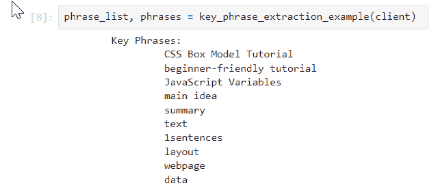

图 9.18：从用户提示生成的短语输出

### 使用 Azure OpenAI 的 DALL-E 模型生成图像创建提示

1.  图像生成提示：

    构建一个基于提供的短语生成图像的 DALL-E 模型提示：

    ```py
    prompt = ''' Provide an image idea for each phrases: ''' + phrases
    ```

1.  从生成的响应中提取图像短语：

    这段代码向 OpenAI 的文本补全 API 发送一个给定的提示，获取包含图像短语的响应，将响应按换行符分割，并从中提取图像短语。该提示为 DALL-E 创建图像设定了背景。例如，`Provide an image idea for each phrase`（为每个短语提供一个图像创意）是一个指令，告诉模型将这些短语视为视觉提示，并根据它们生成图像创意。提取的短语是从模型对提示的响应中派生出来的特定描述性元素。这些短语提供了详细的视觉组件，指导 DALL-E 生成图像：

    ```py
    response_phrase  = openai.Completion.create(
      engine=OPENAI_DEPLOYMENT_NAME,
      prompt=prompt,
      temperature=0.3,
      max_tokens=100,
      top_p=1,
    )
    image_phrases = response_phrase.choices[0].text.split("\n")[1:]
    print(image_phrases)
    ```

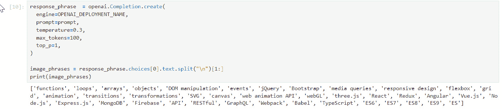

图 9.19：生成的图像短语输出

1.  处理图像短语

    ```py
    and to optimize the efficiency of the image generation process:
    ```

    ```py
    im_ph = []
    for image_phrase in image_phrases:
       if(len(image_phrase) > 0):
            im_ph.append(image_phrase.split(":")[0])
    # Convert the list to a set to remove duplicates, then back to a list
    im_ph = list(set(im_ph))
    print(im_ph)
    ```

    这是输出结果：

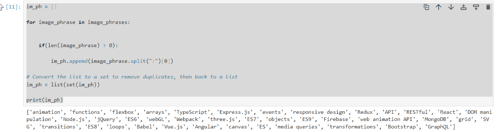

图 9.20：去除重复项后的图像短语输出

1.  生成图像 URL：

    这段代码遍历图像短语列表，向 OpenAI 的图像 API 发送请求，根据每个短语生成图像，获取生成图像的 URL，并将 URL 添加到图像列表中：

    ```py
    images = []
    for phrase in im_ph:
        response = openai.Image.create(
            prompt=phrase,
            size='1024x1024',
            n=1
        )
        image_url = response["data"][0]["url"]
        images.append(image_url)
    ```

1.  下载生成的图像

    这段代码遍历图像 URL 列表，使用 `urllib` 下载每张图像，根据计数器为每张图像分配一个文件名，并将文件名附加到列表中。最后，它会打印一条消息，指示下载过程已完成：

    ```py
    counter = 0
    image_list = []
    for url in images:
        counter += 1
        filename = "file" + str(counter) + ".jpg"
        urllib.request.urlretrieve(url, filename)
        image_list.append(filename)
    print ("Downloading done.....")
    ```

    这是输出：

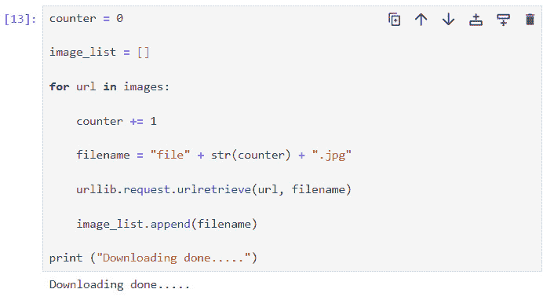

图 9.21：生成图像的输出

### 使用 Azure 语音服务生成音频文件

1.  创建语音配置对象

    这段代码使用提供的订阅密钥和区域初始化 `SpeechConfig` 对象，配置 Azure 语音服务，并打印配置详细信息：

    ```py
    speech_config = speechsdk.SpeechConfig(
        subscription=OPENAI_SPEECH_KEY, 
        region=OPENAI_SPEECH_REGION)
    print(speech_config)
    ```

1.  文本转语音功能：

    `text_to_speech` 函数利用 Azure 语音服务将输入文本转换为语音。它将合成的音频保存到指定的文件名，并提供关于处理结果的反馈：

    ```py
    def text_to_speech(text, filename):
        audio_config = speechsdk.AudioConfig(filename=filename)
        speech_synthesizer = speechsdk.SpeechSynthesizer(speech_config=speech_config, audio_config=audio_config)
        result = speech_synthesizer.speak_text_async(text).get()
        print(result)
        if result.reason == speechsdk.ResultReason.SynthesizingAudioCompleted:
            print(f"Audio saved to {filename}")
        else:
            print(f"Error: {result.error_details}")
    text = response_summ.choices[0].text
    filename = "audio.mp4"
    text_to_speech(text, filename)
    ```

    这是输出：

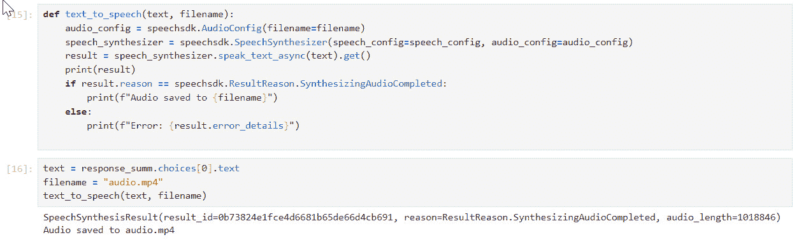

图 9.22：基于生成图像的语音输出

### 将音频文件与图像结合生成视频

这段代码调整图像大小，为每张图像创建一个 2 秒的短片，将它们合成到最终的视频短片中，从指定的文件中添加音频，并将生成的视频写入输出文件。最后，它会打印消息，指示视频创建过程的开始和完成：

```py
print("Creating the video.....")
def create_video(images, audio, output):
    resized_images = [np.array(Image.open(img).resize((1024, 1024))) for img in images]
    clips = [ImageClip(img).set_duration(2) for img in resized_images]
    concat_clip = concatenate_videoclips(clips, method="compose")
    audio_clip = AudioFileClip(audio)
    final_clip = concat_clip.set_audio(audio_clip)
    final_clip.write_videofile(output, fps=24)
images = image_list
audio = filename
output = "video.mp4"
create_video(images, audio, output)
print("Video created.....")
```

这是输出：

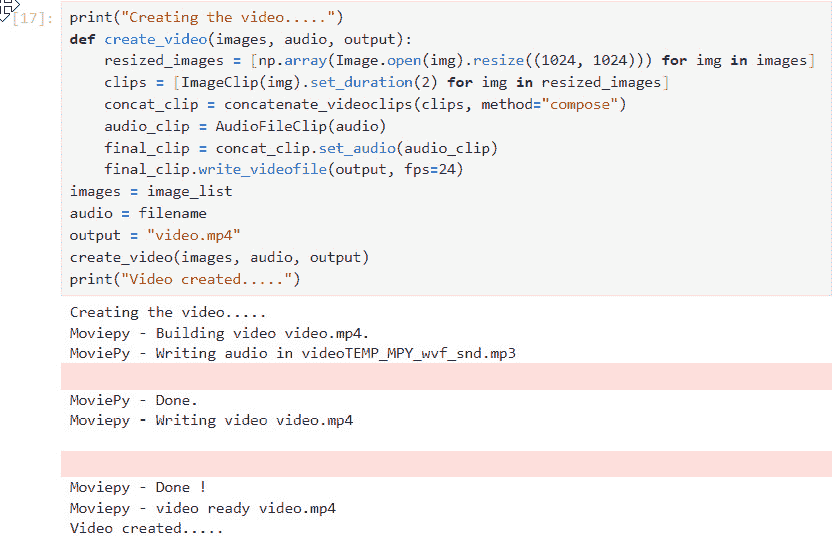

图 9.23：将图像和音频合成视频的输出

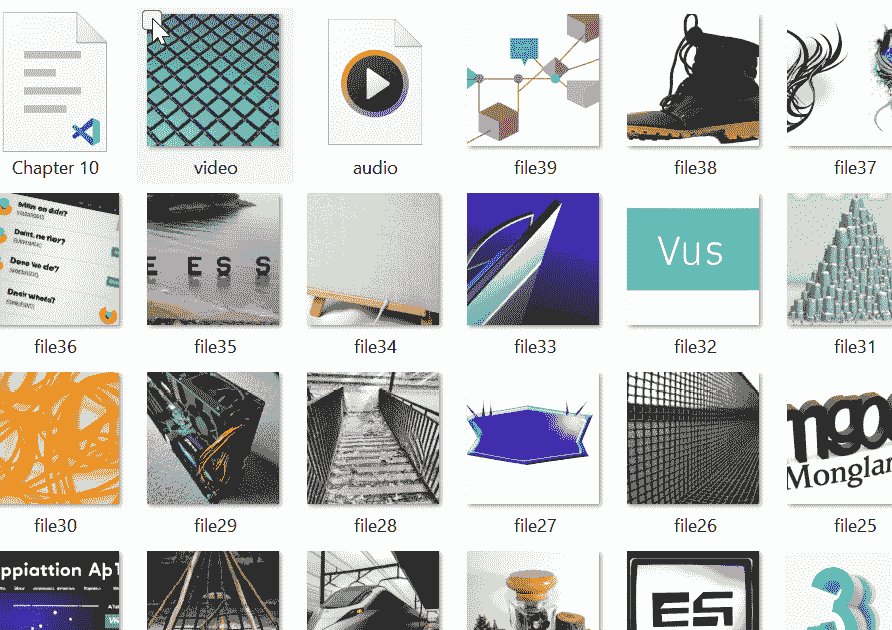

图 9.24：下载的图像、音频和合成视频的输出

本章的代码示例可以在 GitHub 上找到，访问地址：[`github.com/PacktPublishing/Azure-OpenAI-Essentials/blob/main/Chapter_9.ipynb`](https://github.com/PacktPublishing/Azure-OpenAI-Essentials/blob/main/Chapter_9.ipynb)

# 摘要

在本章中，我们学习了如何使用 Azure 和 OpenAI 将文本转化为视频。首先，我们通过 Azure 认知服务对文本进行了摘要，并提取了重要短语。然后，我们用 OpenAI 的 DALL-E 模型获取了图像创意并下载了相关图像。接着，我们通过 Azure 语音服务将文本转换为语音，并将其与图像结合制作成视频。这种方法通过自动将文本转化为视觉和音频，简化了制作有趣视频内容的过程。

通过使用这些先进的技术，我们可以加速将文本制作成视频的过程。这不仅节省了时间，还使视频内容更加易于获取和富有吸引力。借助 Azure 和 OpenAI，将文本转化为引人入胜的视频变得更加简单高效，为分享创意和故事提供了新的机会。

在下一章，我们将深入探讨如何使用 Azure OpenAI Assistant API 创建一个多模态多智能体框架。本章将引导你构建一个系统，其中多个智能体通过使用先进的语言模型协作。这些智能体将能够理解和生成自然语言，使它们能够独立执行任务并做出自主决策。例如，我们将探讨一个场景，AI 智能体根据用户输入共同工作，创建和增强图像。一个智能体可能会生成初始图像，另一个则完善细节，第三个调整颜色和纹理。这个协作过程将展示 AI 智能体团队如何实现高质量且复杂的输出，而单个智能体独自完成这一任务将具有挑战性。
