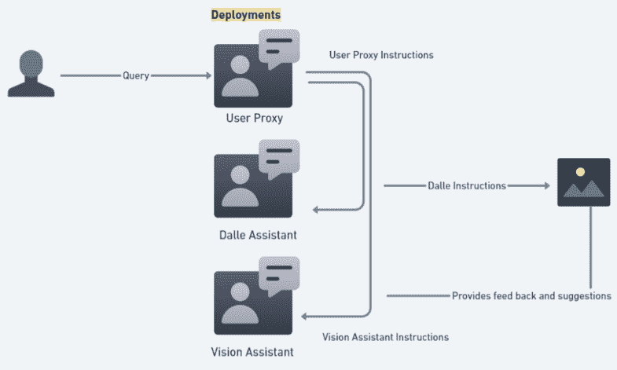
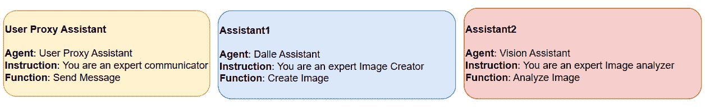
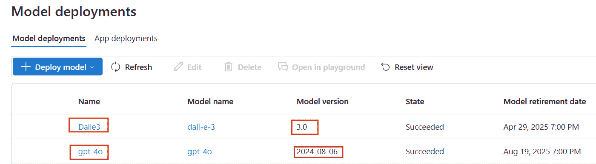
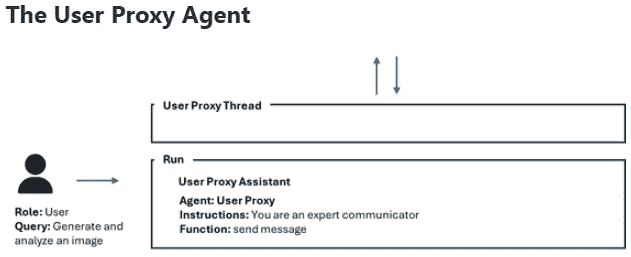
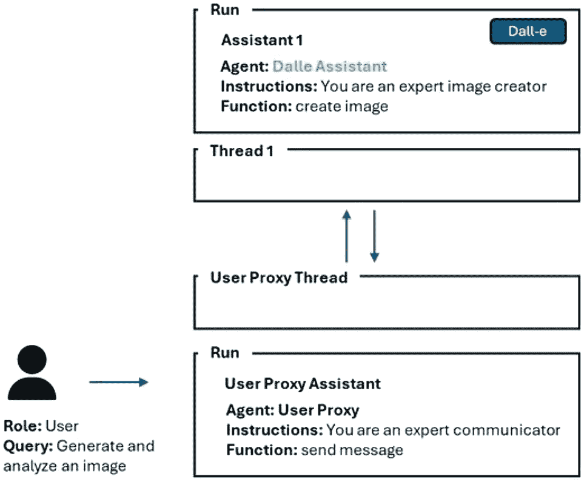
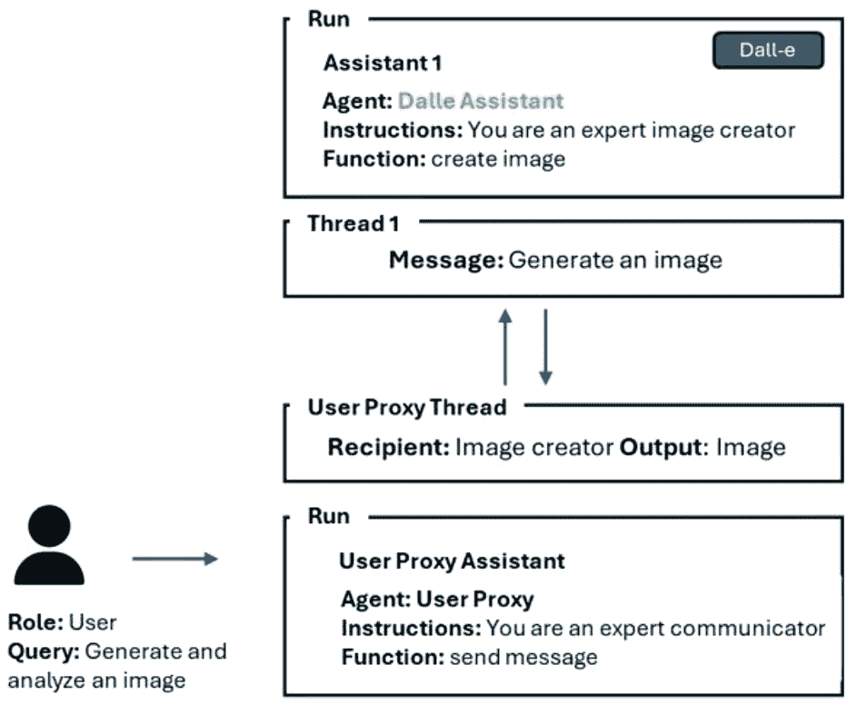
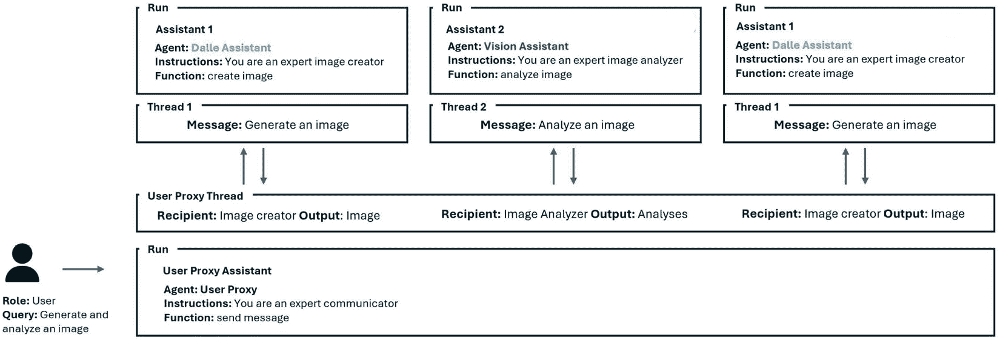

# 第十章：使用 Azure OpenAI Assistants API 创建多模态多代理框架

在本章中，我们将探索如何使用 Azure OpenAI Assistants API 构建一个系统，允许多个智能代理协同工作。这些代理使用先进的语言模型来理解和生成自然语言，使它们能够独立执行任务并自主做出决策。

例如，想象一个由 AI 代理协作的团队，根据用户输入生成和增强图像。一个代理可以生成初始图像，另一个代理可以精细化细节，第三个代理可以调整颜色和纹理。这种协作过程产生了高质量且复杂的输出，而单个代理可能很难独立完成。这个例子为开发者提供了一个全面的指南，帮助他们利用多个 AI 代理协同工作的能力。它展示了代理如何沟通和合作来处理复杂的任务，特别是聚焦于生成式 AI 应用。

微软最近推出了**Azure AI Agent Service**，这是一个完全托管的平台，旨在帮助开发者高效地构建、部署和扩展高质量的 AI 代理。该服务消除了管理计算和存储资源的复杂性，使开发者可以专注于创建智能和可扩展的 AI 解决方案。传统上，客户端函数调用的实现需要编写数百行代码，而通过**Azure AI Agent Service**，这一过程现在简化为仅几行代码，大大减少了开发时间和工作量。由于 Azure AI Agent Service 遵循与**Azure OpenAI Assistants**相同的通信协议，开发者可以无缝地使用**OpenAI SDK**或**Azure AI Foundry SDK**创建并运行代理。

虽然该服务已针对**单一代理**实现进行了优化，但将多个代理协调为**多代理系统**需要额外的工具。对于研究和概念验证项目，**AutoGen**是一个不错的选择。然而，对于生产级多代理系统，**Semantic Kernel**提供了一个更好且更具可扩展性的多代理框架。

本章特别适合那些对探索生成式 AI 和多代理系统前沿的开发者和技术爱好者，使用 Azure OpenAI Assistants API。本章将涵盖以下主题：

+   问题陈述

+   技术要求

+   架构图

+   创建多模态多代理框架

# 问题陈述

随着人工智能技术的进步，我们需要更智能的系统来处理机器人、游戏和自动驾驶汽车等领域中的复杂任务。单一智能体系统通常难以解决这些复杂问题，因为它们无法独立完成所有任务。为了解决这个问题，我们旨在创建一个多个智能体协同工作的系统。通过使用 Azure OpenAI 助手 API，我们将构建一个框架，结合先进 AI 模型的语言技能和智能体的决策能力。

例如，在机器人技术中，一组机器人可以合作清理一个大型公园。一个机器人负责捡拾垃圾，另一个负责修剪草坪，第三个负责浇灌植物。这些机器人需要进行沟通和协调任务，以确保公园得到高效和彻底的清理。

另一个例子是在游戏中，多个 AI 角色可以合作创造更具动态性和挑战性的游戏体验。一个角色可以是战略家，负责规划下一步动作，而另一个角色则可以是侦察员，收集环境信息。类似地，在自动驾驶汽车中，多个自动驾驶车辆需要互相通信，避免碰撞并优化交通流量。通过合作，它们可以做出比单个车辆更好的决策。

在本章中，我们将引导你通过使用 Azure OpenAI 助手 API 构建一个多智能体框架的过程。我们将从概述涉及的关键概念和技术开始，包括智能体和大型语言模型（LLM）。接下来，我们将通过实际案例和示例，演示如何实现和集成这些智能体。你将学习如何在智能体之间设置通信，使它们能够协作完成任务，并利用 LLM 的能力提升决策和问题解决的效果。

本章结束时，你将理解如何创建并使用一个结合了语言模型和自主智能体优势的多智能体系统。这个系统将能够处理广泛的任务，并展示其在机器人、游戏和自动系统等多个领域的潜在应用。

# 技术要求

要跟随本章的实践练习，请访问本章 GitHub 仓库中的源代码：[`github.com/PacktPublishing/Azure-OpenAI-Essentials/blob/main/Chapter10.ipynb`](https://github.com/PacktPublishing/Azure-OpenAI-Essentials/blob/main/Chapter10.ipynb)。

你需要在本地机器上安装以下工具才能开始解决方案的工作：

+   Python 3.9、3.10 或 3.11：[`www.python.org/downloads/`](https://www.python.org/downloads/)

+   一个 Azure 账户：如果你是 Azure 新手，可以免费获取一个 Azure 账户，并获得一些免费的 Azure 积分来开始使用。

+   一个启用了 Azure OpenAI 服务访问权限的 Azure 订阅

+   **Azure OpenAI** (**AOAI**) 连接和模型信息：使用瑞典中央区域创建一个 Azure OpenAI

+   基于 GPT-4o 的助手模型

+   DALL-E 3 模型，版本 3.0

除了刚才提到的系统要求外，拥有坚实的基础 Azure 服务知识以及一定的 Python 编程语言基础（相当于初学者级别，Python 100）也是至关重要的。这些技能对于在本章节中高效地利用 Azure 服务至关重要。

请放心，即使您是 Azure 环境的新手，我们也已经设计了这一章节，使其适合初学者。它提供了清晰的解释，并包括详细的截图，帮助您学习并顺利入门。

# 架构设计

我们将使用一个多代理系统，其中用户代理助手作为主要协调者，促进用户与专业代理之间的通信。DALL-E 助手负责根据用户查询生成图像，而视觉助手则使用 GPT-4o 模型分析这些图像。该系统通过持久的线程保持持续通信，并利用函数调用来执行特定任务，如图像生成和分析。

在典型的工作流中，用户将查询发送到用户代理助手，后者将其转发给 DALL-E 助手以创建图像。然后，视觉助手分析该图像，提供可以用于进一步改进图像的反馈。这种专业代理之间的协调合作确保了对复杂任务的高效处理。

重要说明

这只是实现多代理系统的一种方式。您还可以使用其他框架，如 AutoGen、Semantic Kernel、CrewAI 和 LangGraph。



图 10.1：架构图

*图 10.1* 展示了整体架构框架的示例。在这个场景中，用户代理助手作为中央协调者，促进了 DALL-E 助手和视觉助手之间的通信。

# 创建一个多模态多代理框架

在本节中，我们将通过一个实际示例，演示如何使用 AOAI 助手 API 构建一个多代理框架。我们将重点介绍这些代理如何互相作用和协作，以处理复杂任务，如通过基于用户输入的迭代改进生成和完善图像。

每个助手的结构如*图 10.2*所示，展示了它们在系统中的角色和交互：

+   **用户代理助手**：该助手被初始化为主要的协调者，能够在用户与群聊中的专业代理之间实现无缝沟通。它确保信息正确转发，并保持持续的对话，以确保用户任务能够成功执行。

+   **DALL·E 助手**：此助手配置用于处理图像生成任务。它与 DALL·E 模型连接，根据用户的提示生成视觉内容。

+   **视觉助手**：此助手配置用于执行图像分析。它利用 GPT-4 Vision 模型处理和解释视觉输入，为用户提取有意义的洞察。

这些助手共同形成一个紧密协作的系统，其中用户代理助手协调互动，DALL·E 助手生成图像，视觉助手分析图像，确保高效且响应迅速的 AI 驱动工作流程。



图 10.2：助手详情

在开始之前，请确保 Azure OpenAI 服务已设置，并且 DALL·E 3 和 GPT-4o 模型已部署，如*图 10.3*所示。



图 10.3：模型部署

重要说明

设置具有有效订阅和 Azure OpenAI 服务资源的 Azure 账户的详细信息，请参见*第二章*。

现在，使用以下配置设置所有三个助手：

+   首先，使用以下代码设置`user_proxy`代理：

```py
user_proxy = assistant_client.beta.assistants.create(
    name=name_pa,
    instructions=instructions_pa,
    model=assistant_deployment_name,
    tools=tools
)
```

+   接下来，使用以下代码设置`dalle_assistant`代理：

```py
dalle_assistant = assistant_client.beta.assistants.create(
    name=name_dl,
    instructions=instructions_dl,
    model=assistant_deployment_name,
    tools=tools
)
```

+   最后，使用以下代码设置`vision_assistant`代理：

```py
dalle_assistant = assistant_client.beta.assistants.create(
    name=name_dl,
    instructions=instructions_dl,
    model=assistant_deployment_name,
    tools=tools
)
```

用户代理助手线程作为主要的通信渠道，促进代理之间的消息交换，以满足用户的请求，如*图 10.4*所示：



图 10.4：用户代理助手线程

使用以下代码初始化用户代理助手线程：

```py
thread = assistant_client.beta.threads.create()
```

唯一需要的输入是用户的查询，它驱动所有助手间的任务执行。此查询通过`dispatch_message`函数传递到用户代理助手线程，如此处所示：

```py
user_message = input("User Query: ")
message = dispatch_message(user_message, user_proxy, thread)
```

用户代理助手旨在将消息路由到适当的代理，以确保任务的完成。`send_message`函数通过利用`agents_threads`结构来促进此过程，该结构保持代理及其相关线程的记录，确保整个对话中顺畅的通信和任务执行：

```py
agents_threads: Dict[str, Dict[str, Optional[str]]] = {
    "dalle_assistant": {"agent": dalle_assistant, "thread": None},
    "vision_assistant": {"agent": vision_assistant, "thread": None},
}
```

如果用户代理助手与其他代理之间的线程尚未存在，则会创建一个新线程来启动对话，确保顺畅的通信和任务执行：

```py
# Create a new thread if user proxy and agent thread does not exist
    if not recipient_info["thread"]:
        thread_object = assistant_client.beta.threads.create()
        recipient_info["thread"] = thread_object
```

例如，当用户代理助手需要与 DALL·E 助手交互时，它会在两个代理之间建立一个新线程，以促进通信，如此处所示：



图 10.5：用户代理和 DALL·E 助手的通信

`send_message` 函数调用另一个负责创建并派发消息到相应助手的函数，确保任务高效执行：

```py
message = dispatch_message(query, recipient_info["agent"]
```

`dispatch_message` 函数识别并获取指定助手的所有可用功能。它使用 `agent.tool` 函数注册这些功能，并将它们添加到助手的可用功能字典中以供执行：

```py
available_functions = {}
# Iterate through each tool in the agent.tools list
    for tool in agent.tools:
        # Check if the tool has a 'function' attribute
        if hasattr(tool, 'function'):
            function_name = tool.function.name
            # Attempt to retrieve the function by its name and add it 
            # to the available functions dictionary
            if function_name in globals():
                available_functions[function_name] = globals()
                    [function_name]
        else:
# Handle the case where the tool does not have a 'function' attribute
            print("This tool does not have a 'function' attribute.")
```

`dispatch_message` 函数随后将消息定向到相应助手，通过在线程中生成新消息并调用助手的 `create` 函数来执行任务。当处理用户在用户代理助手线程中的查询时，也应用相同的过程：

```py
# Draft a new message as part of the ongoing conversation.
message = assistant_client.beta.threads.messages.create(
    thread_id=thread.id, role="user", content=message)
    # Carry out the tasks delineated in this discussion thread.
    run = assistant_client.beta.threads.runs.create(
        thread_id=thread.id,
        assistant_id=agent.id,
    )
```

助手线程的 `run` 函数评估是否需要特定工具或功能来执行任务。如果识别到需求，它会将相关功能分配给助手执行。一旦调用，该功能处理任务并返回输出，然后存储在 `tool_response` 对象中：

```py
# Execute the proper function to execute the task if an action is required
        if run.status == "requires_action":
            tool_calls = run.required_action.submit_tool_outputs
                            .tool_calls
            tool_outputs = []
            for tool_call in tool_calls:
                tool_responses = []
                if (
                    run.required_action.type == "submit_tool_outputs"
                    and run.required_action.submit_tool_outputs
                           .tool_calls is not None
                ):
                tool_calls = run.required_action.submit_tool_outputs
                                .tool_calls
                for call in tool_calls:
                    if call.type == "function":
                        if call.function.name not in 
                            available_functions:
                        raise Exception("Function requested by the 
                            model does not exist")
#associate the proper function to the agent to call
                    function_to_call = available_functions[
                        call.function.name]
                    tool_response = function_to_call(**json.loads(
                        call.function.arguments))
                    tool_responses.append({"tool_call_id": call.id, 
                        "output": tool_response})
 # submit tool outputs
            run = client.beta.threads.runs.submit_tool_outputs(
                thread_id=thread.id,
                run_id=run.id,
                tool_outputs=tool_responses
            )
```

输出通过 `submit_tool_outputs` 函数作为消息返回给用户代理助手，确保了无缝的通信和任务完成。

例如，如*图 10.6*所示，DALL·E 助手将生成的图像返回给用户代理助手线程，确保输出被传回以便进一步处理或用户交互。



图 10.6: 助手之间的消息和输出

用户代理助手随后向视觉助手发起请求，分析生成的图像并提供反馈。它遵循与之前相同的流程，但现在将请求发送给视觉助手，创建一个与现有用户代理助手线程相关联的新线程。这个过程可以重复迭代，根据需要调用不同的助手，直到整体任务完全完成，如图所示：



图 10.7: 多代理架构

# 示例输出

现在，让我们进行端到端测试，所有三个助手协同工作，通过部署本章 GitHub 仓库中的完整解决方案来完成任务。

*用户代理*: 生成一幅船漂浮在水面上的图像，分析并增强该图像。

*Dalle 助手*: 正在创建图像...


*视觉助手*: 正在分析图像...

*视觉助手*：这幅图呈现了一个宁静且极简的构图，展示了一只孤独的木船漂浮在平静的水面上。整体色调柔和空灵，传达出一种平和与宁静的感觉。船只上有一个小篷和一面旗帜，恰到好处地吸引了观众的注意力。水中的倒影为场景增添了深度。光线的运用非常到位，可能呈现的是清晨或黄昏的时光，给场景带来了一种梦幻般的柔和光辉。

**评论**：

+   **细节不足**：虽然简洁是图像魅力的一部分，但船本身缺乏细致的纹理或独特的特征。为船增加一些细节或装饰可以在不打扰宁静氛围的情况下，提升视觉吸引力。

+   **前景波浪**：前景的波浪稍显分散注意力。它让视线从船上转移，似乎与其余平静的环境不太协调。更均匀的水面会更能突出宁静的氛围。

+   **天空渐变**：天空缺乏清晨或黄昏场景中典型的渐变效果，这本可以显著增强氛围。引入一些颜色过渡可能会提升空灵的效果。

+   **背景内容**：背景非常简单，虽然这使观众的注意力集中在船上，但加入一些微妙的元素，如远处的陆地或飞鸟，可能会让构图更具动态感和情境丰富性。

*为 DALL-E 优化的提示*：生成一幅带有细致纹理的木船漂浮在平静水面上的空灵图像。船应配有一个小篷和一面装饰性旗帜。水面应显得静止，且没有波浪打破宁静氛围。捕捉天空中柔和且多彩的渐变效果，展现清晨或傍晚的时光，或许可以加入远处的陆地或飞鸟的微弱轮廓，为场景增添微妙的复杂性和深度。

*Dalle 助手*：正在创建图像...


*视觉助手*：正在分析图像...

*视觉助手*：这幅图展示了一个美丽而宁静的景观，捕捉到了一只传统木船漂浮在平静水面上的画面，背景是如画的日出或日落时分。水面静得如镜，船只和远处的其他船只及某些结构的轮廓都清晰地倒映其中，增强了整体的宁静感。天空的暖色调由橙色和粉色渐变至蓝色，为场景增添了一种梦幻和平静的氛围。天际线上稀疏的鸟群飞过，增添了动态元素，并传达了一种旅行与自由的感觉。

**评论**：

+   **细节与纹理**：虽然整体构图非常吸引人，但船的纹理可以进一步增强，以增加真实感。目前，它看起来有些光滑，可能会减少木纹的细节感。

+   **照明**：环境光照效果良好，但可以增加对比度，使船只的特点更加突出，并增加场景的深度，尤其是在背景的结构部分。

+   **背景元素**：背景中的建筑物具有吸引力并增添了深度，但缺乏清晰度。提供更多细节或建议一种特定类型的结构可能会增强场景的叙事性。

+   **前景兴趣**：或许在前景中加入更多元素，如水面上的轻微涟漪或附近的野生动物，可能会为场景增添更多趣味和生气，同时不影响其简洁性。

*增强的 DALL-E 提示*：在平静的湖面上，创造一幅传统木船的宁静场景，船体木纹质感细致，背景是一片生动的夕阳。天空应为温暖的橙色和粉色渐变，过渡到冷蓝色，柔和的光辉在平静的水面上反射。在背景中，若隐若现的高脚建筑物暗示着神秘的环境，足够清晰以揭示其文化意义。水面上可以引入轻微的涟漪，表明船只的移动，或许可以巧妙地在前景中融入几只野生动物，增加生动元素，同时保持场景的宁静。

*Dalle 助手*: 正在创建图像...


仅凭一个用户输入，你就可以看到 DALL·E 和视觉助手如何协同合作提升图像质量——展示了多智能体系统的强大能力。

# 总结

在本章中，我们探讨了如何使用 Azure OpenAI Assistants API 构建多智能体系统。通过 Azure AI Assistants API 构建的多智能体框架为我们提供了有关 AI 驱动的协作不断发展的宝贵见解。通过利用基于 LLM 的智能体在 Azure 生态系统中的能力，我们可以构建一个由专业智能体组成的网络，增强系统智能，使它们能够动态地处理复杂任务并做出明智决策。通过建立助手、管理通信线程、发送消息和执行功能，我们概述了开发人员可以采用的结构化方法。

在下一章中，我们将把焦点转移到与 AOAI 相关的隐私和安全性的重要议题。在前几章中，我们已经探讨了利用 AOAI 和各种 Azure AI 服务开发和实施实际解决方案，接下来我们将深入探讨保护数据和确保合规性的关键因素。本章将涵盖诸如 Azure OpenAI 服务合规性、数据隐私、内容过滤、托管身份、虚拟网络配置、私有端点配置、数据加密以及 Azure OpenAI 的负责任 AI 实践等主题。这些领域对于在企业环境中构建安全可靠的 AI 解决方案至关重要。

# 第三部分：掌握治理、操作和 AI 优化与 Azure OpenAI

在最后这一部分，我们将重点从创建解决方案转移到掌握治理、部署和 Azure OpenAI 高级优化策略的关键要素。本部分将为你提供保护实施方案、有效地将 AI 解决方案投入运营，并通过高级提示工程技术最大化生成式 AI 潜力的知识。

你将探索确保合规性和数据保护的基本隐私和安全实践，深入了解高效管理资源的运营最佳实践，并获得精确制定有影响力的提示的洞察。不论你是在大规模部署 AI，还是为特定应用场景优化其行为，本部分提供的工具将帮助你将 Azure OpenAI 解决方案转变为强大、可靠且富有创新的系统。

本部分包含以下章节：

+   *第十一章*，*隐私与安全*

+   *第十二章*，*将 Azure OpenAI 付诸实践*

+   *第十三章*，*高级提示工程*
