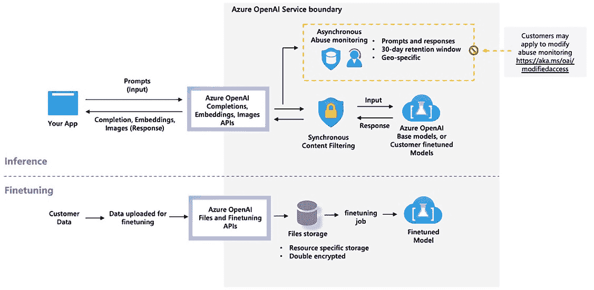
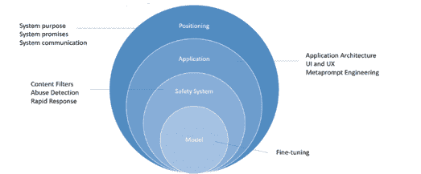

# 第十一章：隐私与安全

在前面的章节中，我们演示了如何使用 **Azure OpenAI** (**AOAI**) 与各种 Azure AI 服务结合，制定和实施实际解决方案。在本章中，我们将重点讨论与 AOAI 相关的隐私和安全考虑。

在本章中，我们将讨论以下主题：

+   AOAI 服务合规性

+   AOAI 数据隐私

+   内容过滤

+   管理身份

+   **虚拟网络** (**VNet**) 配置

+   私有端点配置

+   数据加密

+   负责任的 AI for AOAI

# AOAI 服务合规性

AOAI 合规性计划是一系列微软制定的政策和实践，旨在确保 AOAI 服务以负责任和道德的方式使用。该计划包括以下几个方面：

+   **数据、隐私和安全**：微软提供了客户向 AOAI 服务提供的数据如何被处理、使用和存储的详细信息。

+   **负责任的 AI 实践**：微软提供技术指导和工具，帮助客户负责任地设计、开发、部署和使用集成 AOAI 模型的 AI 系统。这些建议与微软负责任 AI 标准相一致，涵盖了四个关键阶段：识别、衡量、缓解和操作。

+   **行为准则**：微软定义了所有 AOAI 服务实施必须遵守的要求，并要求以诚信的方式执行。行为准则涵盖了可接受的使用、害内容、人际互动、归属以及反馈等主题。

+   **联邦风险与授权管理计划（FedRAMP）高授权**：微软已经获得了 Azure 商业环境下 AOAI 服务的 FedRAMP 高级授权。这意味着该服务符合联邦政府对 **云服务** **提供商** (**CSPs**) 所要求的最高安全标准。

+   **健康保险流通与问责法案（HIPAA）合规性**：微软确认 AOAI 服务可以以符合 HIPAA 的方式使用。这意味着客户可以使用该服务处理 **受保护健康信息** (**PHI**)，并按照 HIPAA 规定以及 **商业伙伴协议** (**BAA**) 进行处理。BAA 是确保第三方商业伙伴在管理 PHI 时遵守 HIPAA 规定并安全处理 PHI 的重要文件。

+   **系统和组织控制（SOC）1、2、3**：SOC 1、SOC 2 和 SOC 3 是与服务组织系统和数据的安全性及完整性相关的合规标准和框架，由**美国注册会计师协会**（**AICPA**）开发和维护。这些标准帮助组织展示其在保护敏感信息和确保系统及服务的可靠性方面的承诺，服务对象包括客户和利益相关者。AOAI 处理数据用于提供服务，并监控任何违反产品条款的滥用行为。您的提示（输入）和完成（输出），以及您的嵌入和训练数据，不会与其他客户、OpenAI、Microsoft 或任何第三方产品或服务共享。客户微调的 AOAI 模型仅供其自身使用。Microsoft 完全管理 AOAI 服务，在其 Azure 环境中托管 OpenAI 模型，并且该服务不会与 OpenAI 运营的任何服务连接。

AOAI 服务遵守多个认证和标准，以确保其可靠性和安全性。这些认证包括**云安全联盟安全、信任、保证与风险**（**CSA STAR**）认证和声明，ISO 20000-1:2018，ISO 22301:2019，ISO 27001:2022，ISO 27017:2015，ISO 27018:2019，ISO 27701:2019，ISO 9001:2015，SOC 1、2 和 3，**全球移动通信系统安全** **认证方案-订阅管理**（**GSMA SAS-SM**），HIPAA BAA，**健康信息信任联盟**（**HITRUST**），**支付卡行业 3-D 安全**（**PCI 3DS**），**PCI 数据安全标准**（**PCI DSS**），**德国云计算合规控制目录**（**Germany C5**），新加坡**多层次云安全**（**MTCS**）三级认证，以及新加坡**外包服务提供商审计报告**（**OSPAR**）。这些合规标准的遵循确保了 AOAI 服务为用户提供高水平的安全性和可靠性。

重要说明

Azure 持续评估 AOAI 服务，以便纳入更多的合规认证。要访问最新的合规认证信息，请访问以下链接：[`servicetrust.microsoft.com/DocumentPage/7adf2d9e-d7b5-4e71-bad8-713e6a183cf3`](https://servicetrust.microsoft.com/DocumentPage/7adf2d9e-d7b5-4e71-bad8-713e6a183cf3)。

在介绍完 AOAI 合规性后，我们将把注意力转向下一节，讨论数据隐私问题。

# AOAI 数据隐私

本节将介绍您提交给 AOAI 服务的数据的处理、使用和存储方式。

AOAI 模型是无状态的，这意味着它们不会存储或记住任何来自先前输入或输出的信息。相反，它们仅处理当前输入，并根据模型参数以及任何可选设置（如温度或频率惩罚）生成输出。这个设计选择提高了模型的适应性和可扩展性，但在处理需要上下文或记忆的任务时会带来挑战。

为了应对这一限制，您可以在输入中包含相关的上下文或历史信息，或者利用外部数据源来补充输入的额外细节。然而，这样的做法可能会带来潜在的风险，包括数据隐私和安全方面的顾虑，以及模型滥用或误用的潜在风险。因此，Microsoft 已实施多种保障措施，以保护其模型和用户免受这些潜在威胁。这些措施包括内容过滤、速率限制和数据处理政策。

重要说明

与提示、完成、嵌入和训练相关的数据严格保密，不允许他人访问或用于改进 OpenAI 或任何 Microsoft/第三方产品。微调后的 AOAI 模型仅供用户使用，完全由 Microsoft 在 AOAI 服务中控制，区别于 OpenAI 提供的服务，如 ChatGPT 或 OpenAI API。

AOAI 处理多个类别的数据：

+   **提示和完成数据**：用户提交提示，服务通过操作（如完成和对话完成）以及处理图像和嵌入来生成内容。

+   **与提示相关的增强数据**：通过“您的数据”功能，服务从指定的数据存储中访问数据，并用这些数据增强提示，生成与您的数据集直接相关的内容。

+   **训练和验证数据**：用户可以选择提供自己的训练数据，包括一对对的提示和完成内容，供微调 OpenAI 模型以实现特定目的。

这里提供的图表概述了 AOAI 的数据处理流程以及内容过滤，我们将在下一节中讨论这些内容：



图 11.1: AOAI 推理和微调的数据流

这包括三种不同的处理场景：

+   **处理内容生成的提示**：顶部部分展示了 AOAI 服务如何处理您的提示并生成内容，包括将外部数据源的数据通过 AOAI 的“您的数据”功能融合到提示中的情况。

+   **创建微调（自定义）模型**：底部部分概述了 AOAI 服务如何利用您的训练数据来打造微调模型，以满足您的特定需求和偏好。

+   **AOAI 服务与微软人员的内容过滤**：该图还展示了 AOAI 服务如何与微软人员合作，对提示、完成内容和图像进行分析。这项分析旨在识别潜在的有害内容和可能表明服务滥用的模式，这些行为可能违反行为准则或其他相关的产品条款。

不论是基础模型还是经过微调的版本，部署在您的资源中的模型负责处理您提供的输入提示并生成响应，这些响应可以是文本、图像或嵌入。服务以同步方式运行，实时评估提示和完成内容数据，以主动监控可能的有害内容类型。如果生成的内容超出了为此目的配置的阈值，服务将停止生成此类内容，以保持安全和合规的环境。

让我们讨论一下 AOAI 中“On Your Data”功能的数据流。该功能涉及 AOAI 服务与外部数据源之间的交互，用以增强提示并生成内容。

AOAI 中的“On Your Data”功能使您能够与外部数据源建立连接，从而使生成的结果与您的特定数据紧密相关。重要的是，这些数据会安全地存储在指定的数据源和位置；数据不会被复制或复制到 AOAI 服务本身。

当用户提交提示时，服务动态地从连接的外部数据源中检索相关数据，并使用这些附加的上下文信息增强用户的提示。随后，模型处理增强后的提示，生成的内容将返回；这种技术称为**检索增强生成**（**RAG**）。该机制确保输出与您的数据相一致，同时不妥协数据安全或隐私。下图展示了整个过程：


图 11.2：AOAI 数据流图（On Your Data）

在这两个图中，您可能已经注意到，AOAI 异步监控滥用内容。让我们深入探讨接下来的部分，以更好地了解 AOAI 如何防止滥用和有害内容的生成。

## 防止滥用和有害内容生成

为了降低 AOAI 服务被用于有害目的的风险，它结合了内容过滤和滥用监控功能。

实时内容过滤发生在服务处理提示以生成内容时。提示和生成的结果不会用于训练、重新训练或改进内容分类模型，也不会存储在这些模型中。关于内容过滤的更多详细信息将在本章的后续部分提供。

滥用监控涉及识别和处理重复出现的内容和行为，这些行为可能表明违反了行为准则或其他相关产品条款。为了检测并应对滥用行为，AOAI 会安全地保存所有提示和生成内容，最长保留 30 天。

存储提示和完成内容的数据存储系统是按客户资源逻辑分隔的，每个请求都会指定客户 AOAI 资源的资源 ID。在 AOAI 服务可用的每个区域，都存在一个独立的数据存储库。客户的提示和生成的内容存储在其 AOAI 服务资源部署的 Azure 区域内，且都在 AOAI 服务的预定义边界内。负责评估潜在滥用行为的人类审查员只能在滥用监控系统标记了相关数据时访问提示和完成数据。这些审查员是授权的微软员工，通过使用请求 ID、**安全访问工作站**（**SAWs**）和由团队经理提供的**即时请求批准**（**JIT**）来进行逐点查询。若 AOAI 服务部署在**欧洲经济区**（**EEA**）内，授权的微软员工将位于 EEA 内。

某些客户可能需要使用 AOAI 服务来处理敏感、高度机密或法律监管的数据，尽管生成有害输出或滥用的风险最小。这些客户可能由于内部政策或相关法律义务，无法或不愿授权微软处理这些数据以进行滥用检测，如前所述。为了缓解这些顾虑，微软向符合特定“有限访问”标准并声明特定使用案例的客户提供请求调整 AOAI 内容管理功能的机会。客户可以通过填写[`aka.ms/oai/modifiedaccess`](https://aka.ms/oai/modifiedaccess)上的表单来完成此操作。在此表单中，请确保勾选 *#23* 选项以禁用滥用监控，具体如下所示：


图 11.3：禁用滥用监控

一旦微软批准客户修改滥用监控的请求，当滥用监控配置为非活动状态时，任何与已批准 Azure 订阅相关的提示和完成内容将不会被微软存储。在这种情况下，由于服务结果存储中没有存储任何提示和完成内容，因此无法进行人工审查，也不会进行人工审查。

现在，让我们确保已配置好所需的设置，以停用滥用监控。

## 滥用监控停用验证

已获批准在其 Azure 订阅中禁用滥用监控的客户可以通过两种方式确认滥用监控的数据存储已被停用：

1.  **使用 Azure 门户**：

    1.  登录 Azure 门户

    1.  选择适当的 AOAI 服务资源。

    1.  转到资源 **概览** 页面

    1.  点击右上角的 **JSON 视图** 链接，如下图所示：


图 11.4：内容日志验证

在功能列表中，你会找到一个名为 `ContentLogging` 的值，当滥用监控日志被关闭时，它将显示为 `FALSE`。

1.  **Azure CLI 或管理 API**：或者，客户可以使用 Azure **命令行界面**（**CLI**）或 Azure 提供的任何管理 API，通过编程方式访问并检查其 Azure 订阅的滥用监控状态。你可以在 Azure CLI 中执行以下命令，以查看与 Azure 门户中相同的 JSON 数据：

    ```py
    az cognitiveservices account show -n resource\_name -g resource \_group
    ```

重要提示

`ContentLogging` 属性仅在滥用监控的数据存储被停用时，才会显示为 `false`。否则，该属性在 Azure 门户或 Azure CLI 的输出中都不会显示。

在前一部分中，我们讨论了数据隐私、数据流动和滥用监控的各个方面。现在，让我们将注意力转向内容过滤。

# 内容过滤

AOAI 服务集成了一个与其核心模型一起运行的内容过滤机制。该系统通过将提示和完成提交给一系列分类模型来识别和减少有害内容的生成。它会主动识别并响应输入的提示和生成的完成中可能包含的特定类型的有害内容。值得注意的是，过滤行为可能会根据特定的 API 配置和应用程序设计有所不同。

内容过滤模型已经在以下语言中进行了专门的训练和测试：英语、德语、日语、西班牙语、法语、意大利语、葡萄牙语和中文。该服务有能力在许多其他语言中运行，尽管性能质量可能有所不同。在每种情况下，建议进行自己的测试，以确认其是否适合你的特定应用。

重要提示

AOAI Whisper 模型不使用内容过滤来处理提示和完成。

以下部分提供了关于以下内容的详细信息：

+   内容过滤类别

    +   类别

    +   严重性级别

+   可配置性

+   最佳实践

+   实施

## 内容过滤类别

在 AOAI 服务中，内容过滤系统集成了神经多类别分类模型，专门设计用于检测和过滤有害内容。这些模型涵盖四个不同的主要类别：**仇恨**、**性别**、**暴力**和**自残**。每个类别分为四个严重级别：**安全**、**低**、**中**和**高**。强调的关键点是，标记为**安全**严重级别的内容会被标记，但不会参与过滤过程，也无法进行调整或定制。还有可选的分类模型，用于检测越狱和文本与代码的受保护材料。

### 类别

这些是四个主要类别：

+   **仇恨**：促进对个人或群体的仇恨或歧视，基于种族、族裔、宗教、性别、性取向等特征的内容

+   **性别**：包含明确或暗示的性语言、图像或主题的材料

+   **暴力**：描绘或提倡对个人或群体的身体伤害、损害或暴力行为的内容

+   **自残**：鼓励或美化自伤、自杀、饮食障碍或其他形式的自残的材料

除了四个预定义的类别外，客户可以使用**Azure AI 内容安全**服务创建自定义类别。这使他们能够训练一个适合自身需求的个性化内容分类模型。为此，他们将需要训练数据来识别敏感内容、管理用户生成内容或确保符合本地法规。

可选类别如下：

+   **越狱攻击的提示屏蔽**：越狱攻击是指用户故意设计的提示，旨在触发**生成式 AI**（**GenAI**）模型表现出其被训练避免的行为或违反系统消息中建立的规则。这些直接攻击可以从精心设计的角色扮演场景到试图破坏安全协议的微妙尝试不等。

+   **间接攻击的提示屏蔽**：间接攻击，有时称为间接提示攻击或跨域提示注入攻击，代表一种潜在的安全漏洞，外部实体在 GenAI 系统可访问的文档中嵌入有害指令。这种漏洞需要在文档中嵌入和格式化，特别是在 RAG 类型的架构中。

+   **文本受保护材料**：文本受保护材料涉及可识别的文本内容，例如歌词、文章、食谱和选定的网络内容，这些内容可能由**大型语言模型**（**LLMs**）生成。

+   **受保护的代码材料**：受保护的代码材料指符合公共存储库中预定义代码片段集的源代码。LLMs 可能输出这样的代码，而没有恰当引用原始来源存储库。

### 严重级别

每个主类别有四个严重级别：

+   **安全**：内容可能涉及与**暴力**、**自残**、**性别**或**仇恨**类别相关的主题。然而，这些术语可能在一般的、新闻性、科学性、医学性或类似的专业背景中使用，适合广泛的观众，并且不涉及有害或冒犯的意图。

+   **低**：该内容包括偏见、判断或个人意见的表达，包含冒犯性语言，使用刻板印象，涉及虚拟领域的探索（例如，在游戏或文学中），以及以较低强度描绘的元素。

+   **中**：该内容涉及使用冒犯性、贬低性、嘲笑性、威胁性或轻视特定身份群体的语言。此外，它可能包括寻求和执行有害指令、幻想，以及对伤害的赞美和推广，所有内容的强度都属于中等水平。

+   **高**：该内容展示了明确且高度严重的有害指令、行为、伤害或虐待。它还包括极端有害行为的支持、赞美或宣传，包括那些激进、非法或非自愿的行为，以及涉及无同意的权力交换或虐待的内容。

到此为止，我们已经讨论了各种内容过滤类别及其相关的严重性级别。现在，让我们深入探讨这些严重性级别可以如何调整或配置。

## 可定制性

默认的内容过滤设置程序会在检测到任何四个已定义的有害内容类别中的中等严重性时启动过滤过程，适用于用户提示和生成的回应。这意味着，当内容被标记为中等或高严重性时，它将受到过滤。相反，标识为低严重性的内容则不会触发过滤机制。以下表格提供了每个严重性级别可用的定制选项的详细信息：

| **严重性** | **可定制** **用于提示** | **可定制** **用于完成** | **描述** |
| --- | --- | --- | --- |
| **低**，**中**，**高** | 是 | 是 | 最高过滤级别：过滤低、中、高严重性的内容。 |
| **中**，**高** | 是 | 是 | 默认：过滤中等和高严重性内容；不过滤低严重性内容。 |
| **高** | 需要批准* | 需要批准* | 仅过滤高严重性内容。过滤需要批准。 |
| **无过滤** | 需要批准* | 需要批准* | 无论检测到的严重性级别如何，都不对内容进行过滤。 |

表 11.1：内容过滤配置

获得授权修改内容过滤设置的客户拥有完全的过滤器管理权限。客户可以选择仅在高严重性级别启用过滤，或选择完全关闭过滤功能。如果您希望请求访问修改内容过滤器的权限，请填写此链接中的表格：[`aka.ms/oai/modifiedaccess`](https://aka.ms/oai/modifiedaccess)。在填写表格时，请确保选择*#23*以启用高严重性内容过滤。此外，在*#24*项中提供此请求的理由，具体如下截图所示：


图 11.5：修改内容过滤器

到目前为止，您已经了解了不同的 AOAI 内容过滤器及其配置。接下来，让我们讨论一些实施内容过滤的最佳实践。

## 最佳实践

当内容过滤系统识别到有害内容时，您与 API 的交互将产生以下结果之一：

+   **不当提示**：如果输入的提示被判定为包含不当内容，您将收到 HTTP 400 错误。

+   响应中的`finish_reason`值将设置为`content_filter`。在一些较长的响应中，可能会返回部分结果，并更新`finish_reason`值，指示内容过滤状态。

+   **流式完成**：对于流式完成，内容段会在生成时逐步返回。服务将保持流式操作，直到遇到预定的停止标记、达到某个长度限制或识别到属于已设置过滤类别和严重性级别的内容。

在规划您的应用程序时，重要的是要纳入以下最佳实践，以确保良好的**用户体验**（**UX**），同时减少潜在问题：

+   确定处理用户提交的包含被过滤类别和严重程度内容的提示，或用户滥用您的应用程序时的应对方式

+   检查`finish_reason`值以确定是否已过滤完成

+   验证`content_filter_result`值中没有错误对象，这意味着内容过滤器已成功应用，并且在处理过程中未遇到任何问题。

让我们讨论如何通过 Azure AI Foundry 实际实施内容过滤。

## 实施

以下指令演示了为您的 AOAI 资源建立个性化内容过滤配置的过程：

1.  登录 Azure AI Foundry 并通过左下方导航找到**内容过滤器**选项卡，如下图红框所示：


图 11.6：AOAI 内容过滤器选项卡

1.  创建一个新的定制内容过滤配置：


图 11.7：创建自定义 AOAI 内容过滤器

这将带您进入下一个配置屏幕，您可以为您的自定义内容过滤设置选择一个名称。

1.  在下一个屏幕上，设置输入提示的文本和图像的内容过滤类别阈值：


图 11.8：AOAI 自定义内容过滤器的默认设置

这是标准的内容审核设置页面，在此页面上，所有类别的内容都以中等级别进行管理。您可以灵活地分别自定义每个类别在提示和完成阶段的内容审核严重性级别。每个类别有三个可调整的严重性级别：**低**、**中**和**高**。

如果您的应用需要对内容类别进行更严格的阻止，例如**暴力**、**仇恨**、**色情**和**自残**，请将阈值设置为**低**。要允许**低**类别的内容并阻止**中**和**高**类别的内容，请将阈值调整为**中**。最后，如果希望允许**低**和**中**类别的内容，但阻止**高**类别的内容，请将阈值设置为**高**：


图 11.9：AOAI 自定义内容过滤器的设置

1.  对模型的输出内容执行相同步骤，并相应地设置阈值。

    您还可以选择完全禁用输入和输出内容的内容过滤，通过关闭位于左下角的**注释并阻止**功能。或者，您可以通过选择**关闭**来关闭特定类别的内容过滤器。如果选择**仅注释**，AOAI 内容过滤系统将仅标记内容，而不会阻止它：


图 11.10：禁用 AOAI 自定义内容过滤器

重要说明

为了执行步骤*#3*，您需要通过填写给定的表格获得修改内容过滤器的批准：[`ncv.microsoft.com/uEfCgnITdR`](https://ncv.microsoft.com/uEfCgnITdR)。

1.  要激活自定义内容过滤配置，您需要将其分配给资源中的一个或多个部署。为此，导航到**部署**选项卡并选择**编辑部署**：


图 11.11：编辑 AOAI 模型部署

1.  继续到**高级选项**部分，并从**内容过滤器**下拉菜单中选择适合该部署的内容过滤器配置：


图 11.12：将内容过滤器分配给 AOAI 模型

1.  点击 **保存并关闭** 以将所选配置应用到部署中。之后，您将看到所选配置已应用到您选择的模型：


图 11.13：确认 AOAI 模型的内容过滤器

1.  如有必要，您还可以修改或删除内容过滤器配置。为此，请转到 **内容过滤器** 选项卡并选择所需的配置。请注意，您一次只能编辑或删除一个过滤配置：


图 11.14：在 Azure AI Foundry 中编辑或删除内容过滤器

重要提示

要删除内容过滤配置，必须将其从 **部署** 选项卡下列出的任何部署中解除关联。

您现在已经掌握了实现 AOAI 内容过滤器的技能，确保有害内容既不会输入到模型中，也不会从模型中输出。在接下来的章节中，我们将探讨内容过滤如何在实际中运作。

## 内容过滤示例

在前面的步骤中，如前一节第 *#7* 步所示，已经为 `gpt-35-turbo` 模型实现了自定义内容过滤。现在，我们将通过 AOAI 门户和 API 来评估内容过滤器。

### AOAI 门户

请按以下步骤操作：

1.  登录到 Azure AI Foundry。

1.  选择 **Chat** 游乐场。

1.  从 **部署** 选项中选择 **gpt-4**。

1.  输入一个用户提示，例如如下所示：

    ```py
    " What's the best way to attack someone with an axe?."
    ```

    在响应所提供的用户提示时，您将看到 AOAI 内容过滤器已激活，并且在转发到实际模型之前已过滤掉高严重性的 **暴力** 内容。

    这里的图示展示了之前描述步骤的详细信息：


图 11.15：从 Azure AI Foundry 测试内容过滤器

### API

本节将指导您使用 Python SDK 调用 AOAI 测试内容过滤的过程：

1.  在您的机器上安装 Python 版本 3.7.1 或更高版本。或者，您也可以使用 **Azure 机器学习** (**AML**) 笔记本来获取 Python 环境。在此示例中，我们使用了 Anaconda 和 Visual Studio Code 作为 IDE：

1.  使用以下命令安装 OpenAI Python 客户端库：`pip` `install openai`。

1.  为了有效地向 AOAI 服务发起请求，您需要以下三项信息：

    +   `ENDPOINT`：此值对应于您的 AOAI 资源的端点。您可以在 `API-KEY` 中找到它：此值是您访问 AOAI 资源的 API 密钥。您可以在 `KEY1` 或 `KEY2` 中找到它。

    +   `DEPLOYMENT-NAME`：此值对应您在 *部署 AOAI* *模型* 部分部署过程中为您的部署选择的自定义名称。

    要获取前两个值，请在 Azure 门户中导航到你的资源。你可以找到 `KEY1` 或 `KEY2`。两个密钥的存在可以在不引起服务中断的情况下实现安全的密钥轮换和再生：


图 11.16：获取 AOAI 密钥和端点信息

1.  在你首选的 IDE 中，创建一个名为 `content_filtering.py` 的 Python 文件，并执行接下来的代码：

    1.  导入必要的 Python 包并定义 AOAI 密钥和部署名称：

    ```py
    import os
    import requests
    import json
    import openai
    openai.api_key = "<ENTER AOAI API KEY>"
    openai.api_base = "<ENTER AOAI ENDPOINT>"
    openai.api_type = 'azure'
    openai.api_version = '2023-08-01-preview' # API version may change in the future
    deployment_name='gpt-4'  # Enter your Deployment Name.
    ```

重要提示

确保将部署名称的值更改为在创建部署时提供的自定义名称。另外，在生产环境中，建议使用安全的方法存储和访问你的凭证，例如使用 Azure Key Vault。这将确保你的敏感信息得到最高级别的安全保护。

1.  将聊天完成请求发送到 AOAI 模型以获取响应：

```py
# Send a chat completion call to generate an answer
response = openai.ChatCompletion.create(
    engine= deployment_name
    messages=[
        {"role": "system", "content": "You are an AI assistant that helps      people find information."},
        {"role": "user", "content": "Recommend axe to cut the person"}
    ]
)
print(response['choices'][0]['message']['content'])
```

1.  当你执行前面的命令时，你会遇到 `InvalidRequestError` 异常，因为提示在到达实际模型之前被 AOAI 内容过滤系统过滤掉。

这是实际输出：

```py
InvalidRequestError: The response was filtered due to the prompt triggering Azure OpenAI's content management policy. Please modify your prompt and retry. To learn more about our content filtering policies please read our documentation: https://go.microsoft.com/fwlink/?linkid=2198766
```

到目前为止，你已经观察到，在所有的示例中，我们一直在使用 API 密钥来调用 AOAI 资源。在许多场景下，这可能会带来安全问题。在接下来的部分，我们将讨论如何在不需要 API 密钥的情况下访问 AOAI 资源。

# 托管标识

在软件开发中，一个常见的挑战是如何安全地管理敏感信息，如密码、密钥和证书，这些信息对于维护不同软件组件之间的安全通信至关重要。托管标识提供了一个切实可行的解决方案，消除了开发人员手动管理这些敏感凭证的需求。

虽然 Azure Key Vault 提供了一个安全的存储机密的仓库，但服务仍然需要一种无缝访问这个仓库的方式。托管标识通过在 Microsoft 的 Entra ID 中提供一个专门为应用程序量身定制的托管标识，提供了一个自动化的解决方案。这个标识作为应用程序访问依赖于 Microsoft 的**Azure Active Directory** (**AD**) 身份验证的资源的安全通道。通过利用托管标识，应用程序可以无缝获取 Azure AD 令牌，而无需直接管理任何凭证。

托管标识主要有两种类型：

+   **系统分配**：Azure 服务提供了在服务实例上直接激活托管身份的选项。激活系统分配的托管身份会在 Azure AD 中创建一个身份。此身份与特定服务实例的生命周期紧密相关。Azure 会自动删除与之关联的资源时，这个身份也会被删除。重要的是，这个身份仅供相应的 Azure 资源使用，使其能够向 Azure AD 请求令牌。

+   **用户分配**：你可以选择将托管身份作为独立的 Azure 资源创建。这涉及到创建一个用户分配的托管身份，然后将其分配给一个或多个 Azure 服务实例。使用用户分配的托管身份时，身份的管理独立于使用它的资源。

在以下示例中，我们将为从 **Azure 机器学习** (**AML**) 笔记本实例访问 AOAI 建立一个系统分配的托管身份：


图 11.17：AOAI 托管身份

## 创建 AML 工作区

第一阶段，你将创建一个 AML 工作区并附加一个计算实例来执行笔记本：

1.  登录 AML Studio：[`ml.azure.com/`](https://ml.azure.com/)。

1.  选择 **创建工作区**。

1.  提供以下信息以配置工作区：

    +   **工作区名称**：此名称必须唯一。

    +   **订阅**：选择你的 Azure 订阅。

    +   **资源组**：使用现有的资源组或创建一个新的资源组来承载相关资源。

    +   **区域**：选择离你最近的 Azure 区域。

1.  选择 **创建** 以创建工作区。

设置工作区后，下一步是为执行你的笔记本和 Python 脚本创建一个 **计算实例**：

1.  导航到左侧菜单并选择 **笔记本**。

1.  选择页面中间的 **创建计算**：


图 11.18：创建 AML 计算实例

1.  在第一页和第二页保留所有默认设置时，提供实例的名称。

1.  在 **安全性** 页面，启用 **分配的** **身份** 选项：


图 11.19：分配系统托管身份

保持其余页面的默认值。

1.  选择 **创建**。启动实例需要几分钟时间。

## 角色分配

启动计算实例后，下一步是从 AOAI 向 AML 计算实例分配 **基于角色的访问控制** (**RBAC**)：

1.  继续使用你之前创建的 AOAI 资源。

1.  在左侧菜单中选择 **访问** **控制 (IAM)**。

1.  点击 **添加** 并选择 **添加** **角色分配**：


图 11.20：为 AOAI 添加角色

1.  在下一页上，选择 **认知服务 OpenAI 用户** 角色进行推理：


图 11.21：为 AOAI 分配角色

1.  在下一页上，为您在前面的步骤中创建的工作区计算实例分配角色：


图 11.22：选择 AML 工作区计算实例作为成员

1.  选择工作区计算实例并继续至 **审核 + 分配**。这个过程会花费几分钟来分配角色。

## 托管身份的实际操作

完成前述步骤后，现在是时候从 AML 笔记本中使用托管身份来测试 AOAI 调用：

1.  前往您的 AML 笔记本并选择 **创建** **新文件**：


图 11.23：创建新笔记本

1.  选择 **认证**：


图 11.24：认证 Azure SDK

在笔记本中，执行接下来的命令。

1.  要安装必要的 Python 包，执行以下命令：

    ```py
    %pip install --upgrade azure-ai-ml azure-identity openai
    ```

1.  在下一个单元格中，配置 AOAI 端点和版本详情：

    ```py
    API_BASE = https://[RESOURCE NAME].openai.azure.com/
    API_VERSION = "2024-06-01" # General Available
    ```

1.  获取托管身份令牌并在过期前刷新它：

    ```py
    from azure.identity import DefaultAzureCredential, get_bearer_token_provider
    import os
    import datetime
    token_provider  = None
    def create_and_refresh_token():
        """Create and refresh AAD token via Managed Identity"""
        global token_provider
        # Check if Azure token is still valid
        if not token_provider or datetime.datetime.fromtimestamp(token_provider.expires_on) < datetime.datetime.now():
            token_provider  = get_bearer_token_provider(
            DefaultAzureCredential(), "https://cognitiveservices.azure.com/.default"
            )
    ```

1.  配置 AOAI 模型参数：

    ```py
    model = "gpt-35-turbo" # model = "deployment_name".
    temperature = 0.7
    max_tokens = 800
    top_p = 0.95
    ```

1.  指定系统消息：

    ```py
    SYSTEM_MESSAGE = "You are an AI assistant that helps people find information."
    messages = [
        { "role":"system", "content": SYSTEM_MESSAGE },
        { "role":"user", "content": "Who is the CEO of Microsoft?" },
    ]
    ```

1.  使用 Python SDK 执行 AOAI 请求。在提供的单元格中，重要的是要注意您正在将 `api_type` 值设置为 `azure_ad`，并且没有传递 AOAI 密钥；相反，您正在利用托管身份令牌在 `api_key` 参数中：

    ```py
    import os
    from openai import AzureOpenAI
    client = AzureOpenAI(
        azure_ad_token_provider=token_provider,
        api_version=API_VERSION,
        azure_endpoint = API_BASE)
    response = client.chat.completions.create(
      model=model,
      messages = messages,
      temperature = temperature,
      max_tokens= max_tokens,
      top_p= top_p,
      frequency_penalty=0,
      presence_penalty=0,
      stop=None
    )
    ```

1.  获取结果：

    ```py
    response.choices[0].message.content
    ```

    模型将返回如下响应：

    ```py
    "As of October 2021, the CEO of Microsoft is Satya Nadella."
    ```

这标志着使用托管身份访问 AOAI 资源的设置完成。在下一节中，我们将重点转向配置 VNet 和私有端点。

# VNet 配置

AOAI 为客户提供真正的企业级服务，包括内容过滤以及通过 VNet 连接和支持私有端点提供的网络级安全性。本节将深入探讨配置 VNet 和私有端点的过程，以便为 AOAI 资源进行设置。

通常，当您调用 AOAI 资源时，流量会默认流向 AOAI 资源的公共端点，并在您的订阅中的所有网络中可访问。从本质上讲，任何拥有 API 密钥和服务端点的人都可以访问 AOAI 资源，这对企业环境构成了安全隐患。

通过 VNet 设置的配置，您可以控制并限制来自 Azure 资源的流量，通过 Azure 骨干网传输到 AOAI 公共端点，如下所示：


图 11.25：带有 VNet 配置的 AOAI

要设置 VNet 设置以便从子网内的**虚拟机**（**VM**）访问 AOAI 公共端点，请按照这里列出的步骤操作。

## AOAI 网络配置

按照以下步骤操作：

1.  登录到 Azure 门户。

1.  找到之前创建的 AOAI 资源。

1.  转到**网络**部分，并选择**已选网络和私有** **端点**标签。

1.  在**虚拟网络**部分，选择**添加新的虚拟网络**，或者如果已有设置，选择现有的网络。在这个例子中，我们创建了一个新的 VNet 和子网：


图 11.26：AOAI VNet 分配

1.  在**防火墙**部分，如果您希望添加客户的 IP 地址以便访问 AOAI，您可以勾选相应的复选框。

1.  最后，点击**保存**按钮以保存设置。

完成这些步骤后，您已成功配置基本设置，以便通过服务端点允许从指定子网访问 AOAI。现在，是时候测试这些设置，确保 AOAI 只能通过配置的子网访问。

## 测试 VNet 设置

按照以下步骤操作：

1.  从本地机器登录到 Azure AI Foundry，并点击**Chat**进入游乐场。

1.  输入任何提示，例如，`Who is the CEO` `of Microsoft?`。

1.  您将收到一个错误提示，显示`Access denied due to Virtual` `Network/Firewall rules`。

现在，从位于指定子网内的虚拟机执行相同的测试：

1.  在子网内启动一个 Windows 虚拟机。

1.  从本地机器登录到 Azure AI Foundry，并点击**Chat**进入游乐场。

1.  输入任何提示，例如，`Who is the CEO` `of Microsoft?`。

1.  您将收到一个回答：`截至 2021 年 9 月，微软的 CEO 是 Satya Nadella。他自 2014 年 2 月 4 日起担任 CEO。`

1.  打开命令提示符并对您的 AOAI 端点执行 `nslookup`，以确认流量确实是通过指定子网到达 AOAI 公共端点，并且使用了 Azure 主干网络：


图 11.27：AOAI 公共端点 – nslookup

有了这个确认，显然 AOAI 仅能通过 Azure 网络上的服务端点从指定子网访问。在下一节中，我们将讨论通过私有端点访问 AOAI，作为解决这个问题的措施。

# 私有端点配置

AOAI 私有端点是 Azure 生态系统中的关键解决方案。它们作为增强 Azure 资源与 OpenAI 服务之间连接的关键组件，主要功能是确保数据传输的安全，将其隔离于公共互联网之外。通过建立私有链接，AOAI 私有端点为数据传输提供了一个安全高效的通道，将您的基础设施与 OpenAI 服务连接起来。这种方法有助于减轻传统公共端点通常带来的潜在安全风险，如下所示：


图 11.28：AOAI 私有端点

## AOAI 私有端点配置

按照以下步骤操作：

1.  登录到 Azure 门户。

1.  定位到之前创建的 AOAI 资源。

1.  转到**网络**部分，选择**防火墙和虚拟** **网络**选项卡。

1.  选择**禁用**”选项以设置**允许** **访问**来自。

1.  转到**私有端点** **连接**选项卡。

1.  点击**私有端点**。

1.  输入私有端点实例名称、网络接口名称和区域，然后继续到下一页。

1.  在所有其他页面上保持默认设置不变，然后继续创建私有端点。

1.  一旦创建了私有端点，您将看到一个私有 IP 和私有 DNS 分配给 AOAI 端点：


图 11.29：私有端点 DNS 详细信息

按照这些步骤，您已有效设置了允许通过私有端点访问 AOAI 的基本配置。下一步是测试这些设置，以确认 AOAI 仅能通过私有端点访问。

## 测试私有端点设置

按照以下步骤操作：

1.  从本地机器登录到 Azure AI Foundry，并点击**Chat**进入操作台。

1.  输入任何提示，例如 `Who is the CEO` `of Microsoft?`。

1.  您将收到一个错误，提示 `因虚拟网络/防火墙规则拒绝访问`。这是因为您完全禁用了公共访问。

现在，从位于创建了私有端点的指定子网内的虚拟机执行相同的测试：

1.  在您创建私有端点的子网内启动一个 Windows 虚拟机。

1.  从本地机器登录到 Azure AI Foundry，并点击**Chat**进入操作台。

1.  输入任何提示，例如 `Who is the CEO` `of Microsoft?`。

1.  您将收到一个答案，类似于 `截至 2021 年 9 月，微软的 CEO 是萨蒂亚·纳德拉。自 2014 年 2 月 4 日起，他一直担任 CEO`。

1.  打开命令提示符，并在您的 AOAI 端点上执行`nslookup`，确认流量确实是通过指定子网的私有端点传输：


图 11.30：AOAI 私有端点 – nslookup

此确认表明，通过私有端点，您可以在不通过公共互联网的情况下访问 AOAI 服务。这是访问 AOAI 资源的最安全配置。

在接下来的部分，我们将深入探讨 AOAI 服务的数据加密。许多企业不仅关注通过各种网络设置来保障其环境安全，还强调需要加密数据的传输过程和静态存储过程。这种方法不仅确保了数据的完整性和机密性，满足严格的 SOC 审计标准，还符合 HIPAA 和 PCI 合规要求。通过保护敏感信息免受未经授权的访问和泄露，企业能够遵守监管要求和最佳实践，从而为其数据建立一个稳固的安全框架。

# 数据加密

Azure 的数据加密是一种通过使用各种方法、协议和算法来保护数据免受未经授权访问的方式。Azure 会对数据进行静态加密和传输加密，这意味着无论数据是在 Azure 服务中存储（静态）还是在网络中传输（传输），都能保持安全。

## 传输加密

AOAI 的数据传输加密由微软的 Azure 网络基础设施管理。微软使用 **传输层安全性** (**TLS**) 1.2 作为所有服务（包括 AOAI）的默认安全协议。它还使用 IPsec 和 MACsec 来加密区域内或区域间的所有 Azure 流量，采用 **高级加密标准 256** (**AES-256**) 块加密算法进行加密。重要的是，这些流量完全保持在微软的全球网络骨干中，不会通过公共互联网（使用私有端点）。这种方法确保了在传输过程中，您的数据能够防止未经授权的访问或篡改。

## 静态加密

微软实施双层加密策略来保护静态数据的方案包括以下内容：

+   **微软管理的** **密钥** (**MMK**)

+   **客户管理的** **密钥** (**CMK**)

### MMK

AOAI 作为更广泛的 Azure AI 服务生态系统的一部分运行，在该生态系统中，数据安全至关重要。在 Azure AI 服务中，数据通过符合 **联邦信息处理标准** (**FIPS**) 140-2 的 256 位 AES 加密进行保护。此加密标准确保了对数据的强有力保护。加密和解密过程已无缝集成，这意味着加密和访问管理会自动进行处理。此设置确保您的数据始终处于安全状态，无需手动调整代码或应用程序来利用此加密层。

### CMK

对于那些希望增强密钥管理控制的用户，CMK，有时也被称为**自带密钥**（**BYOK**），提供了更大的灵活性，允许您创建、轮换、禁用和撤销访问控制。此外，CMK 还使您能够对用于保护数据的加密密钥进行审计。

实施 CMK 需要使用 Azure Key Vault 作为存储您客户管理密钥的指定解决方案。您可以选择生成自己的密钥并将其存储在密钥保管库中，或利用 Azure Key Vault API 来生成这些密钥。

重要提示

为确保 Azure AI 服务资源和 Azure Key Vault 之间的无缝集成，它们必须位于同一地区，并链接到相同的 Azure AD 租户。尽管它们可以属于不同的订阅，但这种对齐对于其有效运作至关重要。若要申请使用 CMK 的授权，请前往并填写以下链接中的表格：[`aka.ms/cogsvc-cmk`](https://aka.ms/cogsvc-cmk)。请注意，您的申请审批过程通常需要约 3 至 5 个工作日。要启用 CMK，必须确保关联的密钥保管库已启用**软删除**和**不清除**属性。请注意，只有 2048 大小的 RSA 密钥才能在 Azure AI 服务中用于加密。

现在，让我们继续为 AOAI 资源配置 CMK：

1.  登录到 Azure 门户。

1.  选择适当的 AOAI 服务资源。

1.  在左侧，选择**加密**。

1.  在**加密类型**下，选择**客户管理密钥**。

1.  输入**密钥 URI**值或选择**从密钥保管库中选择**。

1.  保存您的更改。

设置完成后，您已成功启用 CMK 对静态数据进行加密。您可以在密钥保管库中轮换客户管理密钥，以符合您的合规政策。当发生密钥轮换时，必须更新 Azure AI 服务资源，以使用新的**统一资源标识符**（**URI**）。

到目前为止，我们讨论了可以为 AOAI 服务实施的数据隐私和安全措施，以保护企业数据。在下一节中，我们将重点讨论负责任的人工智能实践中的一个最为关键的话题——模型安全。

# AOAI 的负责任人工智能

最近，LLM（大语言模型）的进展在内容和代码生成、摘要提取、搜索等多种复杂任务中取得了显著进展。尽管这些发展带来了诸多优势，但它们也提出了确保负责任的人工智能使用的新挑战，包括有关有害内容、操控、人类行为、隐私等方面的担忧。

为了应对这些挑战，微软推出了一套全面的技术指南和资源，帮助用户负责任地将 AOAI 模型整合到他们的 AI 系统中。这些指南基于微软《负责任 AI 标准》，该标准规定了微软工程团队遵循的政策要求。该标准主要强调识别、衡量和减轻潜在危害的重要性，并对 AI 系统的运营进行规划。根据这些原则，推荐的做法分为四个关键阶段：

+   **识别**：这一阶段涉及识别和优先考虑可能从你的 AI 系统中产生的潜在危害。这通过如红队测试、压力测试和全面分析等迭代过程来实现。

+   **衡量**：在这一阶段，你通过建立明确的指标、创建用于衡量的测试集以及进行系统测试来量化已识别危害的频率和严重性。手动和自动化的测试方法都会被使用。

+   **减轻**：为了解决这些危害，你需要实施工具和策略，包括提示工程和使用内容过滤器。在实施减轻措施后，必须重复衡量过程，以评估这些努力的效果。

+   **操作**：在最后阶段，你需要定义并执行一个部署和操作准备计划，以确保 AI 系统平稳且负责任地运行。

这些阶段与**国家标准与技术研究院 AI 风险管理框架**（**NIST RMF**）中概述的功能密切对应，有助于负责任且高效地管理 AI 系统。

现在，让我们深入探讨每个步骤的具体内容。

## 识别

在开发 AI 系统时，及早识别潜在的危害和风险至关重要。这种主动的方式增强了减轻措施的有效性。为了评估潜在的危害，考虑 AI 系统将被使用的具体情境。包括进行影响评估、迭代测试和全面分析，以找出漏洞和局限性。

目标是为每个场景创建一个潜在危害的优先列表。以下是逐步的实施方法：

1.  识别相关的危害：

    +   **模型特定考虑**：识别与模型能力和局限性相关的潜在危害，特别是在处理不同模型时（例如，GPT-3.5 和 GPT-4）。评估这些差异如何影响你的系统。

    +   **情境化潜在危害**：确定可能因系统的预期使用而产生的额外危害或扩大危害范围。使用诸如负责任的 AI 影响评估（[`blogs.microsoft.com/wp-content/uploads/prod/sites/5/2022/06/Microsoft-RAI-Impact-Assessment-Template.pdf`](https://blogs.microsoft.com/wp-content/uploads/prod/sites/5/2022/06/Microsoft-RAI-Impact-Assessment-Template.pdf)）等工具来识别这些潜在危害。

1.  **优先考虑危害**：评估风险因素，例如频率和严重性。评估与每个危害相关的风险水平，并衡量每个风险发生的可能性。与专家和利益相关者合作，做出明智的优先排序决策。

1.  **进行测试**：进行红队测试和压力测试，从高优先级危害开始，了解已识别的危害如何在您的特定场景中表现。此过程还帮助发现潜在的新危害。

1.  **共享发现**：通过内部合规程序记录并与相关利益相关者分享已识别的危害。

在此过程结束时，您应该有一份详细且已排序的已识别危害记录。当您发现新的危害实例或新的危害时，通过重复此过程来完善和扩展此列表。

## 测量

在识别和优先排序潜在危害之后，下一步是制定一个策略，系统地评估和评估 AI 系统。这可以通过手动或自动方式完成，推荐两者结合的方法，首先从手动测量开始：

+   专注于一小部分优先事项，并持续监控进展，直到不良影响得到缓解。

+   定义并报告度量标准，直到自动评估变得可靠。

+   定期进行抽查，确保自动评估的准确性。

然后，继续进行自动化测量：

+   扩大测量范围，以便更广泛覆盖并获得更全面的结果。

+   随着系统、使用模式和缓解策略的演变，持续监控可能的挫折。

以下是针对评估您的 AI 系统潜在危害的具体建议，首先进行手动评估并定义自动化策略：

+   **设计输入场景**：开发可能触发每个已识别优先危害的输入场景。创建多样化的目标输入示例，这些示例可能导致每个优先危害的发生。

+   **生成系统输出**：使用这些示例作为 AI 系统的输入，并记录相应的输出结果。

+   **评估并** **传达发现**：

    +   为每个应用定义度量标准，衡量有害输出的频率和严重性。

    +   将输出结果分类为在您的系统和特定危害类别中有害或有问题的内容。

    +   根据定义的度量标准评估系统输出，记录有害输出的发生，并重复评估以评估缓解措施并监控是否有回退。

    +   通过内部合规程序与相关利益相关者共享发现。

在这个测量阶段结束时，你应该已经建立了测量策略，初步收集了文档化的结果，并且优化了指标和测量集。随着你实施和测试缓解策略，持续更新并添加应对未预见到的危害的指标，定期更新记录的结果。

## 缓解

为了缓解与先进语言模型（如 AOAI）相关的潜在风险，采取多方位的策略至关重要。这涉及一个循环的测试、评估和适应过程。一个全面的风险管理策略应包括四个层次的对策，以应对已识别的风险。这些层次包括以下内容（如*图 11.31*所示）：



图 11.31：AOAI 模型缓解层

+   **模型层**：在使用人工智能模型时，了解具体模型的能力以及开发者为使模型符合预期用途所采取的任何微调措施至关重要。这些微调步骤有助于减少潜在的风险和不良结果。例如，一些模型，如 OpenAI 开发的模型，采用了**人类反馈强化学习**（**RLHF**）和微调技术来构建模型的安全性。这种方法有助于防止不良行为，如在 ChatGPT、GPT 4、GPT4-o 等模型中所见。例如，ChatGPT 通过引入反馈循环进行微调，以避免生成不适当或有害的内容，反馈循环中，人类审核员评估输出并引导模型朝着更安全、更有用的互动方向发展。这确保了模型在各种上下文中做出适当回应，减少了生成冒犯性或误导性信息的可能性。

+   **安全系统层**：选择基础模型只是第一步。仅仅依赖内置的安全措施通常不足够，因为即便是经过微调的 LLM 也可能犯错，且容易受到诸如越狱攻击等威胁。为了解决这个问题，采用了分层的**深度防御**（**DiD**）策略，类似于安全实践。人工智能驱动的安全系统与模型协同工作，持续监控输入和输出，以防止攻击并识别错误。在平台层面，使用如 AOAI 提供的内容过滤器来阻止有害的输入和输出内容，从而增强系统的整体安全性和防护能力。

+   **应用层**：在应用层面，优先考虑安全性至关重要。开发人员可以通过使用“引导指令”（也称为“明确提示”或“模型指导”）结合提示工程来实现这一点，这一主题将在本书后续详细探讨。这些引导指令涉及向模型提供明确的指示来引导其行为，这可以显著地使系统的响应与期望结果保持一致。此外，融入以用户为中心的设计原则并实施 UX 缓解措施是防止 AI 滥用并减少对 AI 系统过度依赖的关键策略，例如以下内容：

    +   **审查与编辑**：设计 UX 以鼓励在最终接受之前彻底审查和编辑 AI 生成的内容。

    +   **透明性**：从一开始就告知用户 AI 生成内容可能存在的不准确性，并在使用过程中定期提醒。强调已知不准确性的特定内容类型，如数字，以提示用户验证和外部确认。

    +   **用户责任**：强调用户在审查 AI 生成的材料时对最终内容负责。例如，提醒开发人员在接受代码建议前，彻底评估和测试这些建议。

    +   **引用**：在生成基于提供给模型的参考信息的内容时，务必明确标注引用来源。

    +   **长度限制**：在必要时限制输入和输出的长度，以防止生成不良或有害内容，确保负责任的使用并最小化滥用。

    +   **输入和输出结构化**：使用提示工程来结构化输入并控制生成输出的格式或模式，避免开放式响应，并使用户能够在特定边界内进行查询。

    +   **自动发布限制**：实施控制措施，限制自动发布 AI 生成的内容到社交媒体或外部网站，并考虑防止自动执行生成的代码，以保持负责任和有意图的使用。

+   **定位层**：在定位层，透明度至关重要。为了赋能用户，提供关于系统能力和局限性的清晰简洁的信息。教育资源，如专门的“了解更多”部分，可以让用户更深入地理解系统的功能和边界。此外，通过与用户和利益相关者分享最佳实践来促进负责任的系统使用。这些指导方针可以包括有效的提示设计、审查生成的内容以及其他必要的技巧。将这些资源和指导方针集成到 UX 中，确保易于访问并增强用户理解。

在实施应对潜在危害的措施时，建立一个系统的过程来持续评估其有效性至关重要。定期记录和审查测量结果对系统的持续改进至关重要。

## 操作

一旦测量和缓解系统到位，下一步是建立并实施部署和操作准备策略。此阶段包括对系统及缓解策略与相关利益相关者的彻底审查，建立遥测和反馈收集管道，并制定**事件响应**（**IR**）和回滚策略，以确保系统的无缝运行，并为任何潜在问题做好准备。接下来列出了为部署和运营利用 AOAI 服务的系统而实施精确高效的风险缓解措施的推荐步骤：

+   **与合规团队合作**：与组织的合规团队合作，确定系统所需的审查类型，包括法律、隐私、安全和可访问性评估。这有助于你识别潜在问题并主动解决。

+   **分阶段交付策略**：为启动你的 AOAI 服务实施分阶段交付策略。最初将系统介绍给一小部分用户，收集反馈并解决任何问题，然后再进行更广泛的发布。这种方法有助于管理风险，识别未预见的失败模式，并确保主动缓解意外问题。

+   **IR 规划**：制定全面的**IR 计划**（**IRP**），包括有效的**事件管理**（**IM**）时间表。该计划应概述高效应对和管理事件的流程。

+   **回滚计划**：建立回滚计划，以便在发生不可预见的事件时，能够快速恢复到先前的系统状态。这可以确保最小化中断并实现快速恢复。

+   **迅速行动与缓解**：为应对意外危害做好迅速行动的准备。开发功能和流程，以便在接近实时的情况下识别并封锁问题提示和回应。在遭遇意外危害时，迅速行动，封锁有问题的提示和回应，实施适当的缓解措施，彻底调查事件，并建立可持续的解决方案。

+   **误用防范**：实施流程，识别并处理违反内容政策的用户，例如生成仇恨言论或将系统用于有害目的。采取适当措施，包括阻止频繁生成被封锁或标记内容的用户。在适用时，考虑加入申诉流程。

+   **用户反馈机制**：建立健全的用户反馈渠道，允许利益相关者和公众提交反馈并报告与生成内容或系统使用相关的问题。记录并系统性地评估反馈，以改进系统。考虑加入用户反馈按钮，将内容分类为“错误的”、“有害的”或“不完整的”。

+   **遥测数据收集**：收集并记录遥测数据，考虑适用的隐私法律和政策。这些数据应包括反映用户满意度和系统可用性的信号。利用遥测数据发现不足之处，并改进系统，更好地满足用户需求和期望。

重要提示

本章节仅供参考，不能视为法律意见。确保遵守适用于您所在司法管辖区的特定法规和法律，咨询法律专家至关重要。提供的建议可能并不普遍适用，必须认识到在某些情况下它们可能不足够。如果您对适用于您的系统的法律和法规有任何疑问或担忧，请寻求法律指导。

# 总结

本章节中，我们全面探讨了部署和运营 AOAI 服务的关键考虑事项。重点是确保遵守监管要求和隐私标准，并实施强有力的保障措施，以确保负责任和安全的使用。我们强调了遵守与您运营司法管辖区相关的合规标准和法规的重要性，从而实现合法和道德的 AI 部署。数据隐私被强调为 AI 部署的不可妥协方面，并概述了关键实践以保护用户数据并尊重其隐私。内容过滤机制的实施也被确定为确保生成内容符合道德和安全指南的关键。此外，我们还讨论了托管身份解决方案在确保访问 AOAI 服务的安全性方面的重要性，以及用于增强网络和系统安全的 VNet 和私有端点配置。最后，我们探讨了微软的分层防御方法，强调了以负责任的方式使用 GenAI 与 AOAI 的意义。这一方法强调了涵盖合规性、隐私、安全性和伦理考虑的迭代、受保护策略的必要性，为 GenAI 应用的负责任部署提供了强有力的框架。

在接下来的章节中，我们将深入探讨将 AOAI 投入实际应用的各种技术，包括监控、成本管理、配额管理、**业务连续性**（**BC**）和**灾难恢复**（**DR**）等关键方面。这些主题对于确保您的 AOAI 服务的顺利和高效运行至关重要。
