# 第十二章：操作化 Azure OpenAI

在前面的章节中，我们展示了如何在确保数据安全和隐私的前提下使用 **Azure OpenAI** (**AOAI**)。在本章中，我们的重点将转向操作化 Azure OpenAI。这意味着我们将探索如何有效地部署、管理和优化 Azure OpenAI 服务。我们将讨论日志记录和监控的最佳实践，确保您能够跟踪和分析 AOAI 服务的性能。此外，我们还将讨论各种服务配额和限制，帮助您理解如何高效地管理和分配资源。我们还将介绍配额管理以及如何请求增加配额以支持更大的工作负载。此外，我们将解释如何配置吞吐量单元，以确保您的 AI 服务能够承载所需的负载。最后，我们将研究如何扩展 Azure OpenAI 服务，以满足不断增长的需求。

本章将涵盖以下主要内容：

+   Azure OpenAI 默认日志记录和监控

+   Azure OpenAI 服务配额和限制

+   Azure OpenAI 配额管理

+   Azure OpenAI 配置吞吐量单元

+   Azure OpenAI 扩展

# Azure OpenAI 默认日志记录和监控

Azure OpenAI 服务收集监控数据的方式与其他 Azure 资源类似。您可以设置 Azure Monitor 来收集活动日志、资源日志、虚拟机日志和平台指标。

平台指标和 Azure Monitor 活动日志会自动收集并存储。为了将这些数据传输到其他目的地，您可以使用诊断设置。然而，只有在创建诊断设置并将日志路由到一个或多个指定位置时，Azure Monitor 资源日志才会被收集和存储。在配置诊断设置时，您可以决定收集哪些类型的日志。需要注意的是，使用诊断设置并将数据发送到 Azure Monitor Logs 可能会产生额外费用。以下部分提供了可以收集的指标和日志的详细信息。

## Azure OpenAI 指标

您可以在 Azure 门户中使用 Azure Monitor 工具来检查 Azure OpenAI 服务资源的指标。

1.  登录 Azure 门户。

1.  进入您的 Azure OpenAI 资源的 **Overview** 页面

1.  如图 *Figure 12.1* 所示，选择左侧 **Monitoring** 部分中的 **Metrics**：

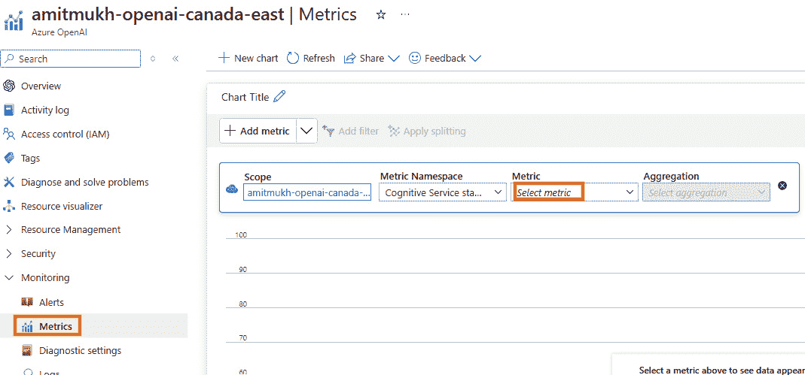

图 12.1：AOAI 指标门户视图

Azure OpenAI 与 Azure AI 服务的一个子集具有共性。Azure OpenAI 服务提供了几个关键指标，帮助用户监控和优化他们的使用情况。**Azure OpenAI 请求**是一个基础指标，跟踪对该服务的 API 调用次数。这帮助用户了解他们的使用模式，对于管理成本和确保资源的高效利用至关重要。**响应时间**衡量处理请求所需的时间，这对于评估服务的性能和响应性至关重要。高延迟可能表示潜在的瓶颈或需要解决的问题，以保持顺畅的用户体验。

另一个重要的指标是**Prompt Token Cache Match Rate**，它监控 PTU-M 中的 KV 缓存命中率。**键值**（**KV**）缓存是一种在生成型变换器模型中使用的技术，包括**大型语言模型**（**LLM**），旨在提高推理过程的效率。KV 缓存的主要特性包括：

+   **减少计算开销**：它消除了在生成的每一步中重新计算先前标记的键值张量的需求，从而加快了过程。

+   **内存与计算平衡**：通过将这些张量存储在 GPU 内存中，KV 缓存优化了内存使用和计算性能之间的权衡。

为了充分利用 KV 缓存，您可以采用以下优化策略：

+   **战略性地定位动态元素**：将动态组件——如基础数据、日期和时间或聊天历史——放置在提示的末尾。这可以确保频繁变化的部分不会干扰静态部分的缓存。

+   **保持静态元素一致**：将静态组件，如安全指南、示例和工具或功能定义，按一致的顺序安排在提示的开头。这可以最大化这些部分的可重用性和缓存效率。

+   **专注于您的部署**：将您的 Prompt-Tuned Use（PTU）部署集中在有限的用例上。这增加了请求的一致性，从而提升了缓存命中率和整体性能。

**处理过的推理标记**，它跟踪请求和响应中处理的标记数。这对于理解与服务的交互的复杂性和长度尤其有用。监控标记使用情况有助于优化提示并有效地管理成本。最后，**Provisioned-managed Utilization V2**指标监控 PTU-M 的使用百分比。预配置管理部署的使用百分比通过以下公式计算：（消耗的 PTU / 部署的 PTU）x 100。当此使用率达到或超过 100%时，调用会被限制，并返回错误代码 429。这些指标共同提供了服务性能的全面视图，帮助用户识别改进的领域，并确保最佳的操作。

要查看由 Azure Monitor 收集的所有平台度量数据，涵盖 Azure OpenAI 和类似的 Azure AI 服务，请访问以下链接：[`learn.microsoft.com/en-us/azure/ai-services/openai/monitor-openai-reference`](https://learn.microsoft.com/en-us/azure/ai-services/openai/monitor-openai-reference)。

你可以通过 Azure Monitor 中的诊断设置导出所有度量数据。要使用 Azure Monitor Log Analytics 中的查询检查日志和度量数据，必须为你的 Azure OpenAI 资源和日志分析工作区都设置诊断设置。现在，让我们开始设置诊断设置。

1.  转到你的 Azure OpenAI 资源页面，在左侧的**监控**下选择**诊断设置**。在**诊断设置**页面，选择**添加****诊断设置**。

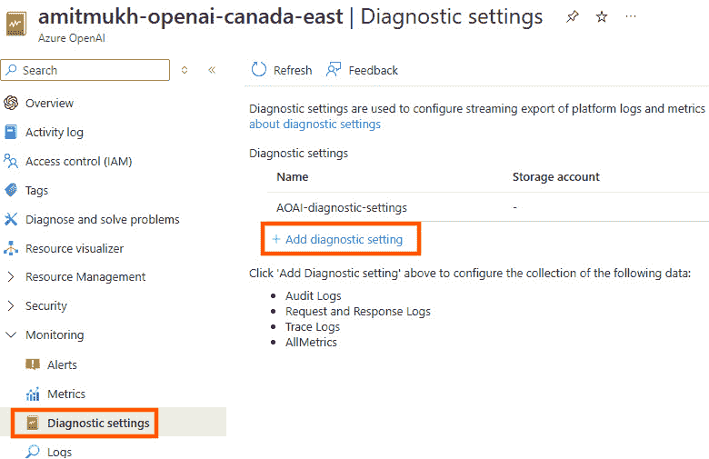

图 12.2：添加诊断设置

1.  在**诊断设置**页面，执行以下步骤：

    1.  选择**发送到日志分析**工作区。

    1.  选择你的 Azure 账户订阅。

    1.  选择你的**日志分析**工作区。

    1.  在**日志**下，选择**所有日志**。

    1.  在**度量**下，选择**所有度量**。

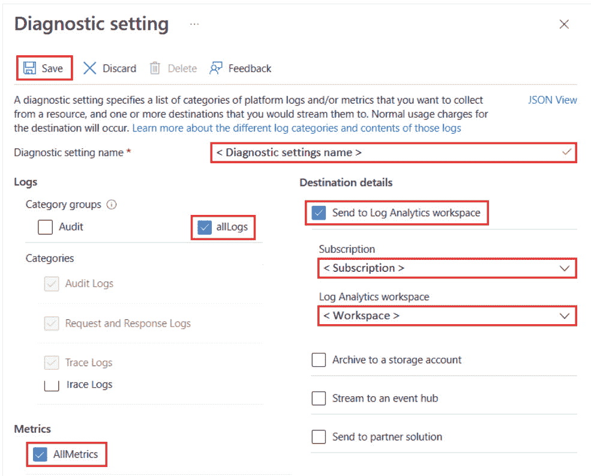

图 12.3：配置诊断设置。

1.  为**诊断设置**选择一个名称，以便存储该配置。

1.  点击**保存**。

一旦配置了诊断设置，你就可以在日志分析工作区中使用 Azure OpenAI 资源的度量和日志数据。

接下来，我们将学习如何使用 Kusto 查询来跟踪日志。

## 使用 Kusto 查询监控日志。

要创建我们将监控的日志，首先需要发出 API 调用。请按照以下步骤生成日志。

1.  进入 Azure AI Foundry 门户中的聊天完成页面。

1.  在门户中提问任何问题。

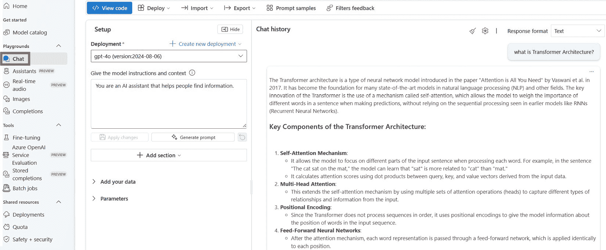

图 12.4：发出 API 调用生成日志

当你使用**聊天完成沙盒**输入任何文本时，它会为你的 Azure OpenAI 资源生成度量和日志数据。你可以使用 Kusto 查询语言在日志分析工作区查询监控数据。

接下来，我们将使用 Kusto 搜索日志。

1.  在你的 Azure OpenAI 资源页面，选择屏幕左侧监控部分中的**日志**。

1.  选择你为 Azure OpenAI 资源设置了诊断的**日志分析**工作区。

1.  在**日志分析**工作区页面的左侧窗格中，选择**日志**。

1.  默认情况下，Azure 门户会显示一个包含示例查询和建议的窗口。你可以退出此窗口。

1.  要运行以下示例，请在**查询**窗口顶部的编辑区域中输入 Kusto 查询，然后选择**运行**。

    ```py
    AzureDiagnostics
    | take 100
    | project TimeGenerated, _ResourceId, Category, OperationName, DurationMs, ResultSignature, properties_s
    ```

    该查询展示了 100 条审核记录的示例。Azure Monitor 中的审核日志捕获有关在系统内执行的日志查询的详细遥测信息。它们提供的信息包括查询运行的时间、执行查询的用户身份、用于执行查询的工具、查询文本本身，以及与查询执行相关的性能指标。

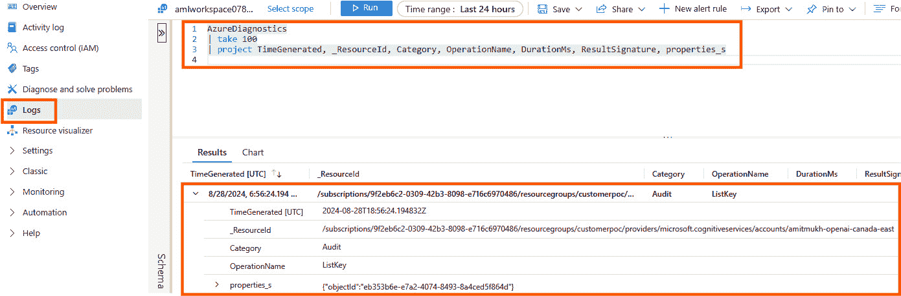

图 12.5: 使用 Kusto 查询分析日志

现在，您已经了解了如何检查 AOAI 日志，接下来的部分将介绍对于设计 GenAI 解决方案至关重要的 AOAI 服务限制和配额。

# Azure OpenAI 服务配额和限制

Azure OpenAI 按需付费模式是一个共享租户 GPU 基础设施，用于推理。因此，AOAI 服务对如何使用此资源有一些服务限制。在本节中，我们将描述不同 AOAI 模型的各种限制和配额，并介绍如何通过遵循一些最佳实践来防止节流。

在撰写本文时，每个 Azure 订阅可以在每个区域访问最多 30 个 OpenAI 资源。对于 DALL-E 模型，默认配额限制是 DALL-E 2 支持 2 个并发请求，DALL-E 3 支持 2 个容量单位（相当于每分钟 6 个请求）。Whisper 模型的请求限制为每分钟 3 次。每个请求的最大提示令牌数因模型而异，更多详细信息可以在给定的链接中找到：[`learn.microsoft.com/en-us/azure/ai-services/openai/concepts/models?tabs=python-secure%2Cglobal-standard%2Cstandard-chat-completions#gpt-4-and-gpt-4-turbo-models`](https://learn.microsoft.com/en-us/azure/ai-services/openai/concepts/models?tabs=python-secure%2Cglobal-standard%2Cstandard-chat-completions#gpt-4-and-gpt-4-turbo-models)。微调能力被限制为每个模型最多 5 次部署，每个资源总共有 100 个训练作业。然而，每个资源只能同时运行一个训练作业，并且最多可以排队 20 个作业。每个资源最多可以包含 50 个微调文件，总大小限制为 1 GB，每个训练作业的时长不得超过 720 小时，且不得包含超过 20 亿个令牌。

额外的限制包括：所有文件的最大上传大小为 16 MB，嵌入中的数组输入限制为 2048，聊天完成消息的限制为 2048。每个聊天完成的最大函数和工具数量为 128。每个部署的预配吞吐量单元上限为 100,000。使用 API 或 AI Studio 时，每个助手或线程最多可以处理 10,000 个文件，但在使用 Azure AI Foundry 时，此限制降至 20 个文件。助手和微调的文件大小限制为 512 MB，助手的令牌限制为 2,000,000 令牌。GPT-4o 每次请求最多可以处理 10 张图片，GPT-4 Turbo 的默认最大令牌限制为 16,384，可以增加此限制以避免响应被截断。最后，API 请求最多可以包含 10 个自定义头部。

不同 Azure OpenAI 模型的配额限制因地区而异。这些限制是根据每个 Azure 订阅、每个地区和每个模型来确定的。Azure OpenAI 为像 GPT-4 Turbo、GPT-4o 和 GPT-4o-mini 这样的较新模型提供了两种不同的部署类型：“标准”部署和“全球标准”部署。“标准”部署是地区特定的，因此相较于全球运行的“全球标准”部署，其**每分钟令牌数**（**TPM**）较少。与微软签订“企业协议”的客户将获得更高的配额，无论是哪种部署类型。在“全球标准”部署中，推理可以在全球任何地方进行。需要符合**通用数据保护条例**（**GDPR**）的客户，GDPR 是一项欧盟数据隐私法，旨在保护个人数据，赋予个人对其信息的控制权，并对组织施加严格的合规要求，对不合规者处以重大罚款，可能会倾向选择“标准”或“数据区域”部署，而那些优先考虑最大吞吐量的客户则可能选择“全球标准”部署。“全球标准”部署本身具备高可用性，消除了单独负载均衡机制的需求。然而，如果选择“标准”部署并需要高可用性，则需要使用 Azure API 管理服务设置负载均衡。有关 Azure OpenAI 模型的最新配额限制，请访问：[`learn.microsoft.com/en-us/azure/ai-services/openai/quotas-limits`](https://learn.microsoft.com/en-us/azure/ai-services/openai/quotas-limits)。

总结来说，Azure OpenAI 提供了灵活的部署选项，针对不同的需求量身定制，确保您可以根据具体要求选择最佳配置，无论是合规性相关的还是性能驱动的。

## 避免限制的最佳实践

为了了解避免限制的最佳实践，我们需要了解这些速率限制是如何在后台计算的。

TPM 速率限制是根据接受请求时，预计请求处理的最大令牌数来计算的。它与用于计费的令牌数不同，后者是在所有处理完成后确定的。当 Azure OpenAI 接收到请求时，它会计算出一个近似的最大处理令牌数，涵盖以下内容：

+   提示文本和计数

+   `max_tokens` 参数设置

+   `best_of` 参数设置

AOAI 模型部署端点会跟踪所有请求的令牌计数，每分钟重置一次，基于每个请求的估计最大处理令牌数。如果在该分钟内的任何时刻，令牌计数达到了 TPM 速率限制值，那么后续请求将会收到 429 错误响应代码，直到计数器重置。

**每分钟请求数**（**RPM**）速率限制决定了你的组织在一分钟内可以向 OpenAI API 发送的请求数量。此限制有助于防止服务器过载，并确保所有用户之间的公平使用。具体的 RPM 限制取决于端点和你拥有的账户类型。RPM 限制假定请求均匀分布在这一分钟内。如果没有保持这种均匀分布，即使在一分钟内没有超过总体限制，请求也可能会收到 429 错误响应。

为了强制执行这一点，Azure OpenAI 服务会在更短的时间间隔内监控传入请求的速率，通常是 1 或 10 秒。如果在这些短时间内的请求数量超过 RPM 限制所允许的数量，后续请求将会收到 429 错误代码，直到下一个时间间隔检查。例如，如果服务在 1 秒的间隔内检查请求速率，那么如果在任何 1 秒内发送的请求超过 10 个（因为 600 每分钟请求相当于每秒 10 个请求），则该部署将受到速率限制。

总结来说，理解并遵守 RPM 速率限制对于优化 API 使用和避免中断至关重要。这个机制确保了系统的稳定性以及所有用户的公平访问。

为了减少因速率限制而导致的问题，建议应用以下方法：

+   在你的应用程序中添加重试逻辑。当你遇到请求速率限制时，这种方法可以帮助你，因为这些限制会在每个 10 秒的间隔后发生变化。根据你的配额，变化时间可能会更快。

+   不要突然改变工作负载。应该逐步增加工作负载。

+   尝试不同的方式来增加负载。

+   为了提高性能，提升模型的配额或将负载分配到不同的订阅或区域。当你达到 turbo 或 gpt-4-8k 的配额限制时，可以考虑使用其他选项，如 turbo-16k 或 gpt-4-32k。这些都是 Azure OpenAI 服务内的独立配额桶。

+   保持 `max_tokens` 参数尽可能低，同时确保它能够满足你的需求。

接下来，我们将讨论如何从 AOAI 门户管理配额。

# Azure OpenAI 配额管理

配额让你控制如何在订阅中的各个部署之间分配速率限制。在本节中，我们将展示如何管理你的 Azure OpenAI 配额。

Azure OpenAI 的配额功能允许你为部署分配速率限制，最高可设置为一个称为“配额”的总限制。该配额按每个区域、每个模型分配给你的订阅，并以 **每分钟令牌数（TPM）** 为单位进行衡量。当你创建 Azure OpenAI 服务时，你会收到一个默认配额，适用于大多数可用模型（有关每个模型的默认配额，请参阅前一节）。

当你创建部署时，你将为每个部署分配 TPM，并且该模型的可用配额将减少分配的数量。你可以继续创建并为部署分配 TPM，直到达到配额限制。一旦配额达到，你只能通过从现有部署中重新分配 TPM，或者通过请求并获得批准来增加所需区域的配额，才能创建该模型的新部署。例如，一位在美国东部地区拥有 240,000 TPM 配额的客户可以以多种配置方式使用该配额。他们可以选择创建一个 GPT-35-Turbo 部署，限制为 240K TPM，或者选择创建两个单独的部署，每个部署为 120K TPM。或者，他们可以将配额分配到多个部署中，任意组合，只要总 TPM 不超过 240K，且位于美国东部地区。

本质上，Azure OpenAI 的配额管理系统帮助你高效地分配和管理 API 使用，确保你可以在不超出配额限制的情况下最大化部署的效用。

AOAI 模型部署的推理请求将根据分配给该部署的 TPM 数量进行速率限制。TPM 的分配还会决定 **每分钟请求数（RPM）** 速率限制的值，遵循以下比例：每 1,000 TPM 对应 6 RPM。

接下来，我们将讨论如何从 AOAI 门户分配配额。

## 分配配额

在创建 AOAI 模型部署时，你可以选择要分配给模型部署的 TPM 数量。TPM 可以每次增加 1,000，并将决定适用于你的部署的 TPM 和 RPM 限制，如前面一节所述。

要分配配额，请执行以下步骤。

1.  登录到 Azure OpenAI 门户

1.  点击 **部署** 下的 **共享资源**

1.  选择现有的部署

1.  点击 **编辑部署**

1.  设置所需的 TPM

1.  点击 **保存** **并关闭**。

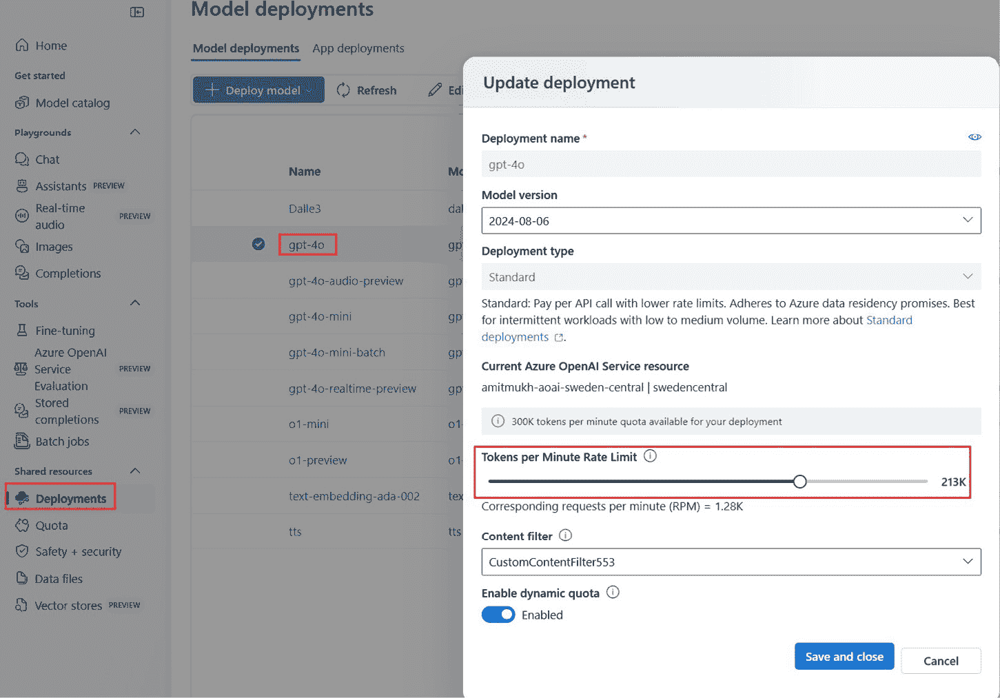

图 12.6：为 AOAI 部署分配配额

根据您为模型选择的部署类型，您可以导航到“**Azure OpenAI 标准**”或“**Azure OpenAI 全球标准**”标签页。配置完不同部署的配额后，您可以通过访问 **共享资源** 下的 **配额** 页面，查看配额在不同区域或全球部署中的分配情况。

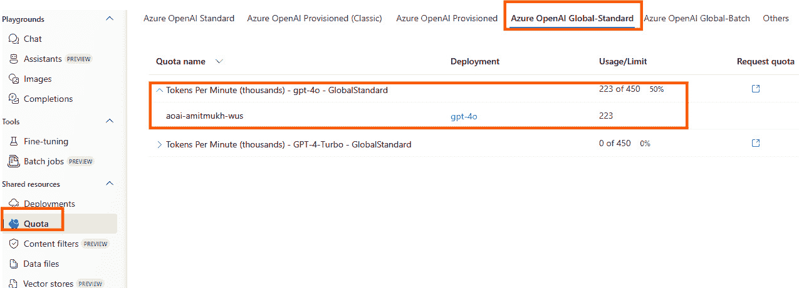

图 12.7：AOAI 部署的整体配额分配

该配额页面包含四个字段：

+   **配额名称**：每个模型类型在每个区域都有一个配额值。该配额适用于该模型的所有版本。可以在用户界面中将配额名称放大，以显示使用该配额的部署。

+   **部署**：按模型类别分组的模型部署。

+   **使用量/限制**：显示部署所消耗的配额量以及为此订阅和区域分配的配额量，配额名称下显示。

+   **请求配额**：此字段中的链接指向一个表单，您可以在该表单中申请特定 AOAI 模型的更多配额。

现在，您已经了解如何管理 APOAI 资源中的配额，接下来的部分将探讨预配置吞吐量单元的概念。

# Azure OpenAI 预配置吞吐量单元

**预配置吞吐量单元**（**PTU**）功能允许您为应用程序设置所需的吞吐量。它使您能够更好地控制在大规模下如何使用和配置 OpenAI 的大型语言模型。它为 OpenAI 模型提供专用计算，并保证吞吐量。您可以设置所需的吞吐量单元（PTU）总数，并拥有将承诺分配给您首选的 OpenAI 模型的能力和控制权。每个模型需要不同数量的 PTU 运行，例如，GPT-3.5 比 GPT-4 需要的 PTU 少。您可以从多种承诺选项中进行选择。通过 1 个月或 1 年的承诺，您可以确保预配置的吞吐量并获得定价优惠。预配置吞吐量模型提供了更多的控制权和灵活性，能够满足工作负载的需求，确保在更高工作负载出现时系统可以随时准备好。

此功能支持：

+   **一致的性能**：可靠的峰值延迟和稳定的工作负载容量。

+   **固定性能容量**：部署设置吞吐量的水平。部署后，无论实际需求如何，吞吐量都可以随时使用。

+   **节省成本**：高吞吐量工作负载可能比基于令牌的使用降低成本。

AOAI 提供两种类型的 PTU：

+   **经典 PTU**：这种特定类型的 PTU 由于某些模型的最低 PTU 要求，具有较高的入门门槛，导致初期成本较大。此外，未来的成本增长也很显著。新客户不再能购买这种类型的 PTU。微软建议现有客户将这种 PTU 迁移到 PTU 管理版。

+   **PTU 托管**：这种 PTU 也被称为分数 PTU。意味着某个型号的最小 PTU 需求一开始较低，因此初始成本低于经典 PTU，未来的增量也更小。

**PTU 托管**（**PTU-M**）推荐给大多数客户，因为与经典 PTU 相比，它提供了更低的入门成本、更小的增量和更好的监控指标。

购买 PTU-M 的过程完全是自助式的，无需联系微软的账户团队。你可以通过 Azure 的**预留实例**（**RI**）购买机制来购买 PTU-M。在撰写本书时，选择 PTU-M 时，你可以选择每个 PTU-M 每月$260 的 RI 或每个 PTU-M 每年$221 的 RI（特定区域内）。此外，还可以选择按小时购买 PTU-M，费用为每个 PTU-M $2，无需长期承诺。如需详细的各 PTU-M 型号定价信息，请参见第二章。你可以随时停止按小时购买 PTU-M。然而，重要的是要注意，PTU-M 的可用性取决于每个区域指定型号的容量。

通过 RI 机制购买 PTU-M 后，你不受特定型号的限制。只要满足所选区域的最小 PTU-M 要求，你可以灵活地切换到任何型号。有关每个型号的最小 PTU-M 和扩展要求的详细信息，请参见*图 12.8*。

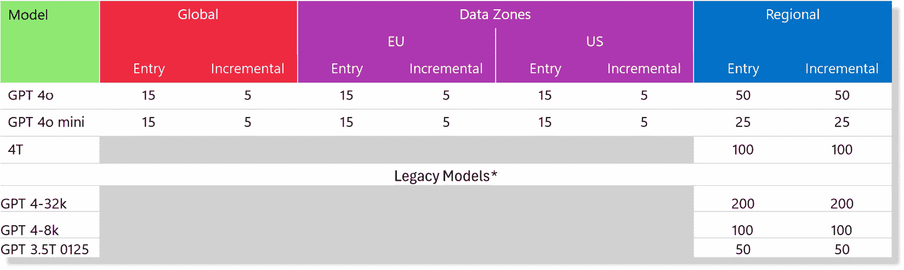

图 12.8：每个型号的最小 PTU-M

例如，如果你在东美国区域购买了 200 个单位的 PTU-M 月度预留实例，可以将 100 个单位分配给 GPT-4-Turbo，50 个单位分配给 GPT4-o，另外 50 个单位分配给 GPT4-o-mini。分配可以在第二天根据需要进行调整，无需等待续订期。然而，一旦你为特定区域预定了 PTU-M，就无法增加、减少或交换。要修改预定，你需要购买额外的预定或取消现有预定，这可能会导致提前终止费用。

AOAI PTU 提供三种部署选项：

+   **全球部署**：数据处理可以发生在全球任何 Azure 区域，并且包括内置的数据平面高可用性（HA）。

+   **数据区域部署**：目前仅限于欧盟和美国区域，其中数据处理仅限于所选区域，即美国或欧盟。此部署还提供了设计上的数据平面高可用性（HA）。

+   **区域部署**：数据处理仅限于托管 AOAI 服务的特定 Azure 区域，并且没有内置的数据平面**高可用性**（**HA**）。不过，你可以使用**Azure API 管理**（**APIM**）来实现 HA，相关内容将在后续部分讲解。

在所有部署类型中，您的数据驻留在托管您的 AOAI 服务的区域内。

到目前为止，您已探索了各种 AOAI PTU 选项及其购买和部署选项。接下来，我们将讨论如何在预订 PTU-M 之前，适当确定 PTU 的尺寸。

## PTU-M 尺寸

PTU-M 是一种基于承诺的定价模型，目前没有自动扩展功能。因此，如果您的工作负载需要额外的计算资源，您必须在使用之前预先获取这些资源。因此，准确确定 PTU 的尺寸在购买前非常重要。AOAI 在 Azure AI Foundry 中提供了一个 PTU-M 计算器，帮助估算适合您特定工作负载的 PTU-M 尺寸。

要使用计算器，请按照以下步骤操作：

1.  登录到您的 Azure 门户

1.  选择您将请求 PTU-M 的特定区域的 AOAI 资源

1.  打开 Azure AI Foundry。

1.  在**管理**下导航至**配额**

1.  选择**Azure OpenAI** **已配置**选项卡

1.  选择**容量计算器**

1.  选择您想要使用的模型

1.  选择模型版本

1.  提供您的工作负载名称、每分钟的峰值调用次数

1.  对于多模态用例（仅适用于 GPT4-o 和 GPT4-o-mini），分别指定文本和图像输入提示调用中使用的令牌数量。这通常包括您的输入问题的总令牌数和文本的上下文大小。此外，还需指明响应中使用的令牌数量。

1.  点击**计算**以计算您为每种工作负载所需的 PTU。

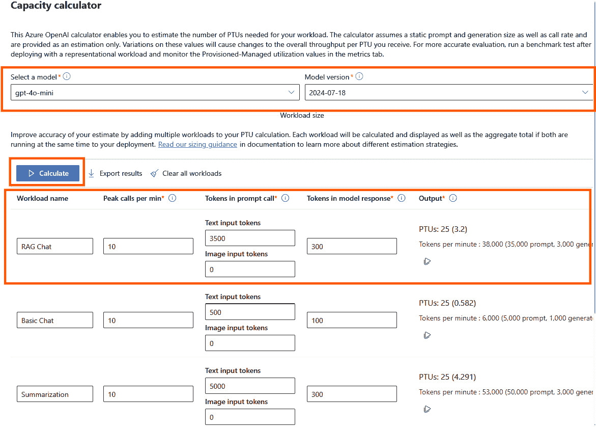

图 12.9：PTU-M 尺寸计算

一旦您确定了应用程序的 PTU-M 要求，您可以通过 Azure 预留或按小时按需 PTU 选项进行购买。我们将在以下部分详细讨论此过程。

## PTU-M 购买模型

AOAI 提供两种不同的 PTU-M 购买模型。

+   **按需每小时 PTU**：这种按小时支付的预配置部署非常适用于短期场景。这包括像基准测试新模型的质量和性能，或者在黑客马拉松等活动中临时增加 PTU 容量等任务。在此模型下，费用为 $2/PUT/HR。例如，如果您部署了 300 个 PTU，您将按每小时费率乘以 300 收费，即 2*300 = $600/小时。如果部署运行不到一个小时，您将按部署时长（以分钟计）按比例收费。例如，若每小时费率为 $600，部署 15 分钟的费用为每小时费率的四分之一，费用为 $150。

    默认情况下，客户会有一些配额（通常为 100 个单位）用于部署模型的 PTU，您可以利用这些配额来部署按小时计费的 PTU。以下是您可以按照的步骤来部署按小时 PTU。

1.  登录到您的 Azure 门户

1.  选择您将请求按小时 PTU-M 的特定区域的 AOAI 资源。

1.  打开 Azure AI Foundry。

1.  在**共享资源**下点击**部署**。

1.  点击**部署模型**

1.  选择**部署** **基础模型**

1.  选择所需的模型

1.  点击**确认**

1.  设置**部署名称**和**模型版本**

1.  选择**部署类型**为**预配置管理**。

1.  设置**预配置吞吐量** **单元（PTUs）**。

1.  如果你有自定义内容过滤器，请选择该过滤器，否则选择**DefaultV2**

1.  点击**确认购买**

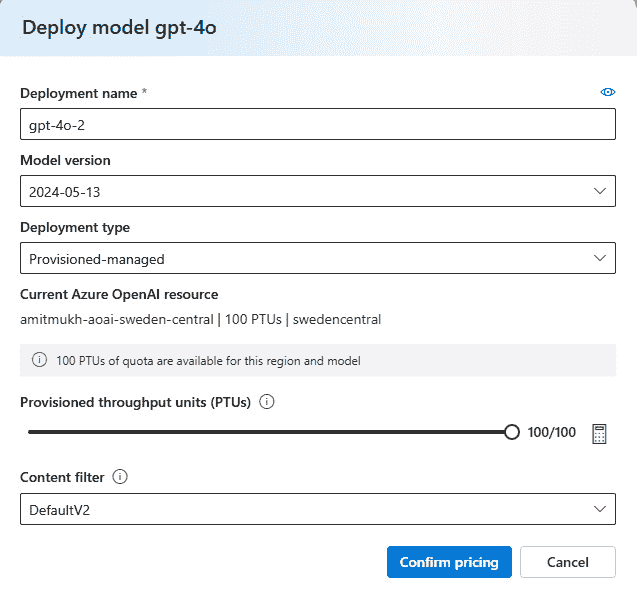

图 12.10：按小时部署 PTU-M

1.  确认部署的按小时计费价格并选择**部署**

重要说明

如果你在指定区域用于部署模型的 PTU 配额已用尽，你需要通过以下链接提交请求：[`aka.ms/oai/ptueaquotarequest`](https://aka.ms/oai/ptueaquotarequest)。通常，对于少于 1000 PTU 的请求，将会在一个工作日内自动批准。超过 1000 PTU 的请求，你需要联系 Microsoft 账户代表以确保必要的配额。

单独分配配额并不能保证模型容量的可用性。因此，部署模型到特定区域时，必须同时具备配额和容量。如果你拥有配额，但 Microsoft 没有足够的容量来部署模型，你将收到一条通知（如*图 12.11*所示），表明所选区域当前没有足够的容量。此时，系统会提示你选择另一个可能具备所需容量的区域。

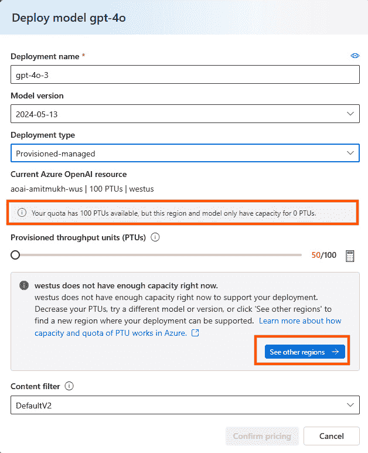

图 12.11：容量不可用

部署后要移除按小时计费的 PTU，你只需按照以下步骤在 Azure AI Foundry 中删除它，步骤如*图 12.12*所示：

1.  登录到你的 Azure 门户。

1.  选择特定区域内部署的 AOAI 资源。

1.  打开 Azure AI Foundry。

1.  在共享资源下导航到**部署**。

1.  找到并选择按小时计费的 PTU 部署。

1.  按**删除**以移除它。

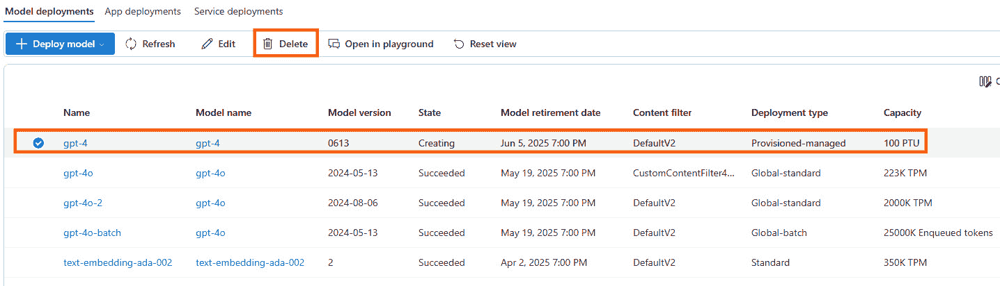

图 12.12：按小时部署 PTU 移除

持续运行 PTU（24x7）可能会产生高昂费用。为了解决这个问题，AOAI 提供了一种名为 Azure 预留的替代 PTU 购买选项，针对长期使用提供显著折扣。接下来我们将探讨这一点。

+   **Azure 预留**：此购买选项对于长期使用最具成本效益。通过 Azure OpenAI 预配置预留，你可以通过承诺一定数量的 PTU，获得月度或年度的折扣。你可以通过 Azure 预留门户购买。购买 AOAI PTU 预留之前，需要考虑以下几个要点：

    +   预定是按地区购买的，可以根据多个模型部署的使用情况量身定制，只要模型的最小 PTU 要求满足（参见图 12.8）。预定的范围可以包括：

        +   特定的资源组或订阅

        +   管理组中的订阅集合

        +   所有账单账户下的订阅

    +   您可以购买新的预定，以便对在与现有预定相同范围内新配置的部署应用折扣。此外，现有预定的范围可以随时调整而不产生任何惩罚。

    +   您不能交换 AOAI 预定。

    +   您无法在预定中添加或删除单元。您只能购买新的预定或取消现有预定。但是，取消有一定的限制。

    +   如果已配置的部署超过了预定的数量，超出的部分将按小时费率计费。例如，如果您的部署总数为 400 PTU，而预定为 300 PTU，则额外的 100 PTU 将按小时费用计费，直到您将部署大小减少到 300 PTU 或为额外的 100 PTU 购买新的预定。

    +   预定确保所选期限内的较低价格，但并不保证服务容量或在创建部署之前的可用性。因此，建议客户在购买 PTU 预定之前先设置部署，以避免过度购买。为了建立部署，您可以首先选择小时部署过程（如前所述），以确保所需地区的容量。然后，购买 AOAI 预定，通过预定覆盖小时 PTU 成本。

    让我们通过 Azure 门户一步一步地了解如何购买 AOAI PTU 预定。

1.  登录到您的 Azure 门户

1.  搜索预定

1.  点击**添加**

1.  搜索**Azure** **OpenAI 服务**

1.  选择**范围、计费订阅、地区和特定产品**。您有三个产品选项：1 年期预定（预付费）、1 年期预定（月付）或按月支付。选择合适的产品后，将显示每个 PTU 的价格，如*图 12.13*所示。

1.  选择**添加** **到购物车**

重要说明

AOAI PTU 预定提供选择满足最小 PTU 要求的任意模型的灵活性，但它是地区特定的。因此，在购买 AOAI PTU 预定时，选择正确的地区至关重要。

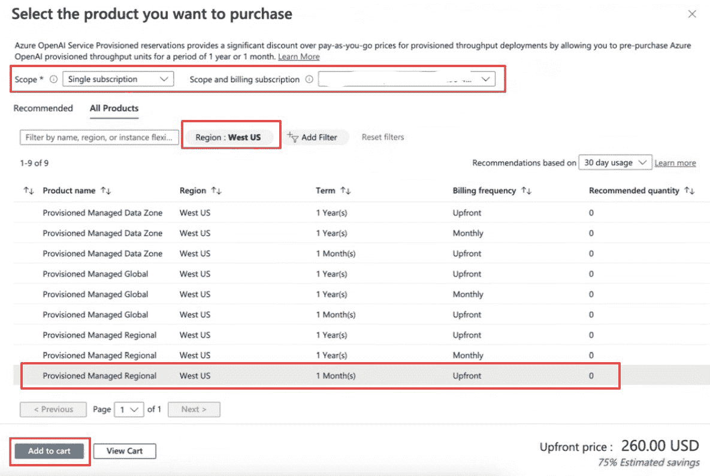

图 12.13：AOAI 预定购买

1.  在以下屏幕中，如*图 12.14*所示，指定您希望为预定购买的 PTU 数量。

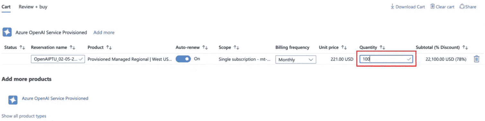

图 12.14：设置 AOAI 预定 PTU 数量

1.  点击**下一步：审查 +** **购买**

1.  购买预定后，可能需要最多 12 小时才能在预定门户中报告预定的使用情况。

购买 PTU-M 后，如果您希望评估其性能并确定如平均延迟、最大 TPM 或 RPM 等指标，您可以使用微软提供的基准脚本进行精确的吞吐量计算。基准脚本可以通过以下链接获得：[`aka.ms/aoai/benchmarking`](https://aka.ms/aoai/benchmarking)。

AOAI 保证 PTU 的正常运行时间 SLA 为 99.9%，并且令牌生成延迟 SLA 为 99%，确保一致且可预测的吞吐量。gpt-4o 模型支持 50 个可部署增量（区域部署），每个 PTU 的最大输入吞吐量为 2,500 TPM，输出限制为 833 TPM，同时每秒的延迟目标为 25 个令牌。相比之下，gpt-4o-mini 模型提供 25 个可部署（区域部署）增量，但每个 PTU 的最大输入和输出速率大大提高，分别为 37,000 TPM 和 12,333 TPM，延迟目标为每秒 33 个令牌。这些性能指标适用于所有三种可用的部署选项。有关每个模型的吞吐量和令牌延迟的详细信息，请访问：[`learn.microsoft.com/en-us/azure/ai-services/openai/concepts/provisioned-throughput#how-much-throughput-per-ptu-you-get-for-each-model`](https://learn.microsoft.com/en-us/azure/ai-services/openai/concepts/provisioned-throughput#how-much-throughput-per-ptu-you-get-for-each-model)

您还可以使用 Azure OpenAI 的“预配管理使用 V2”指标来跟踪 PTU 使用情况，尤其是在执行负载测试或将 PTU 用于生产时。此指标仅在 PTU-M 中可用，而不适用于经典 PTU。

如果您决定不继续使用 AOAI PTU 预留，只需按照*图 12.15*中的说明关闭该预留的自动续订选项，并确保删除 PTU 部署，如前所述。如果预留未自动续订且您忘记删除 PTU 部署，您将会产生每小时费用。以下是如何在购买后避免续订预留的方法。

1.  登录到您的 Azure 门户

1.  搜索预留

1.  选择您希望防止自动续订的特定预留。

1.  进入设置菜单并选择**续订**选项。

1.  选择**不续订**

1.  点击**保存**

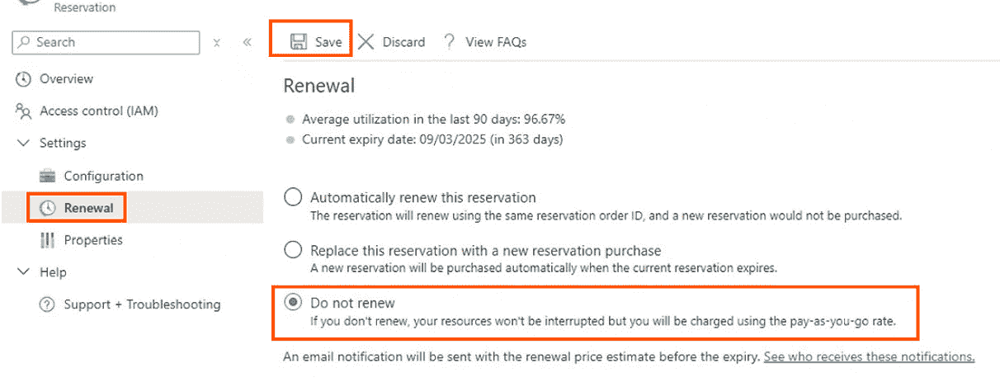

图 12.15: 关闭 AOAI PTU 预留续订

我们已经讨论了企业在业务生产应用中需要的 AOAI 各种组件。接下来，我们将探索一些 AOAI 的扩展技术，以克服吞吐量限制。

# Azure OpenAI 扩展

AOAI 通常会对允许的调用量施加限制。对于 Azure OpenAI，这些限制表现为令牌限制（TPM， 每分钟令牌数）和每分钟请求次数限制（RPM）。然而，这些配额是针对单个订阅、区域和特定模型的。因此，许多客户选择跨不同区域部署多个 Azure OpenAI（AOAI）资源，以实现最大吞吐量。尽管这种在“PAUG”配置中的设置不能解决延迟问题，接下来的部分将深入探讨如何使用 PTU 来解决延迟问题。

在 PAUG 中，当容量限制达到时，AOAI 会返回一个 429 或 TooManyRequests HTTP 状态码，并附带一个 Retry-After 响应头，指示在尝试下一次请求之前应该等待的秒数。处理这些错误通常由客户端 SDK 进行管理，这对于处理单个 API 端点时很有效。然而，当使用多个 OpenAI 端点以获得最大吞吐量时，管理客户端上的 URL 列表变得必要，这可能并不是理想的解决方案。为了解决这个问题，需要一种复杂的负载均衡机制，能够智能地判断流量应该路由到哪个 AOAI 端点。

APIM 为开发人员提供了一种强大的解决方案，用于安全地向外部和内部用户公开其 API。借助此平台，您可以实施智能负载均衡策略，考虑到“Retry-After”和 429 错误响应，动态地将流量重新路由到当前没有遭遇限速的替代 OpenAI 后端。此外，您还可以灵活地为 AOAI 端点建立优先顺序，确保在未被限速时，优先使用高优先级的端点。当发生限速时，API 管理会自动切换到低优先级的后端，而高优先级后端则恢复。这种方法优化了资源利用率，减少了服务中断。让我通过一个例子来说明：

假设您已在多个区域建立了多个 AOAI 端点，每个端点根据您的业务需求被分配到不同的优先级组。例如，位于美国东部和美国东部 2 的端点被归类为优先级组 1，而位于北中部和南中部的端点被归类为优先级组 2，位于西部美国和西部美国 3 的端点则属于优先级组 3。

+   **正常情况**：在典型条件下，优先级组 1 中的 AOAI 后端接收来自 Azure API 管理（APIM）的所有传入流量，而优先级组 2 和 3 中的后端保持待命状态，不激活。

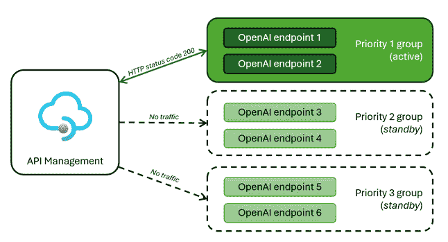

图 12.16：APIM 在正常场景中的负载均衡

+   **限流案例**：如果优先级组 1 遇到工作负载限流，导致向 APIM 发送 429 错误码，流量将通过 APIM 被重定向到优先级组 2。这一重定向确保了服务的持续交付，直到优先级组 1 恢复正常。通常，优先级组 1 会在从 AOAI 收到的“Retry-After”HTTP 头中指定的持续时间后重新激活。

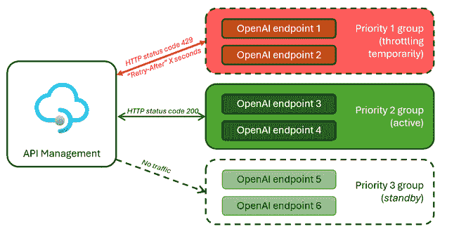

图 12.17: 限流场景中的 APIM 负载均衡

在定义优先级组时，您可以灵活选择与业务需求一致的策略。例如，您可以实施基于地理位置的优先级组策略，其中部署在美国区域的所有 AOAI 资源合并到优先级组 1，而部署在加拿大区域的所有 AOAI 资源合并到优先级组 2。如果优先级组 1（包含美国资源）遇到限流，流量可以作为替代方案路由到加拿大区域。这一策略确保了高效的资源利用，并保持不同地理位置的服务可用性。

在解决延迟问题时，PTU 成为合适的解决方案，通常推荐用于生产用例。然而，由于其成本较高且仅限于特定的订阅，精确的规模调整至关重要。虽然 AOAI 门户中提供了 PTU 尺寸计算器，但许多客户选择基于基线平均利用率来调整 PTU 尺寸，并将高峰期流量卸载到 PAUG 实例。这种方法在成本、吞吐量和延迟之间取得了平衡。因此，采用了 PTU 和 PAUG 实例并存的混合方案。

以下是一个针对在单一区域内部署 PTU 和 PAUG 实例的参考架构。在此架构中，将 AOAI PTU 实例指定为优先级组 1，而将 AOAI PAUG 实例指定为优先级组 2。这种架构为 AOAI 提供了一个可靠的 HA 设置。

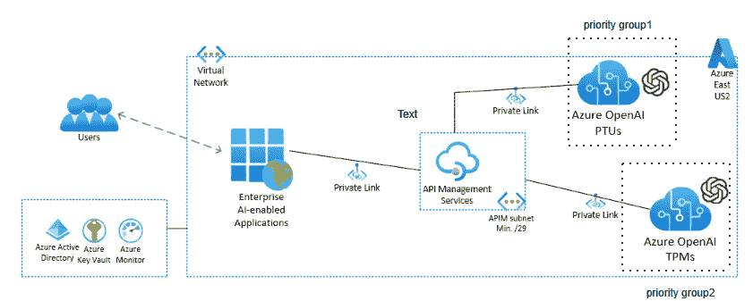

图 12.18: 带 HA 的单区域扩展

有时，客户可能需要为其利用 AOAI 的业务应用程序提供**灾难恢复**（**DR**）解决方案，并配合高可用性（HA）。在这种情况下，建议在不同区域部署 AOAI PTU 和 PAUG 实例。根据各自的区域，将特定区域的 AOAI 资源分配到不同的优先级组。以下是为这种设置提供的架构。

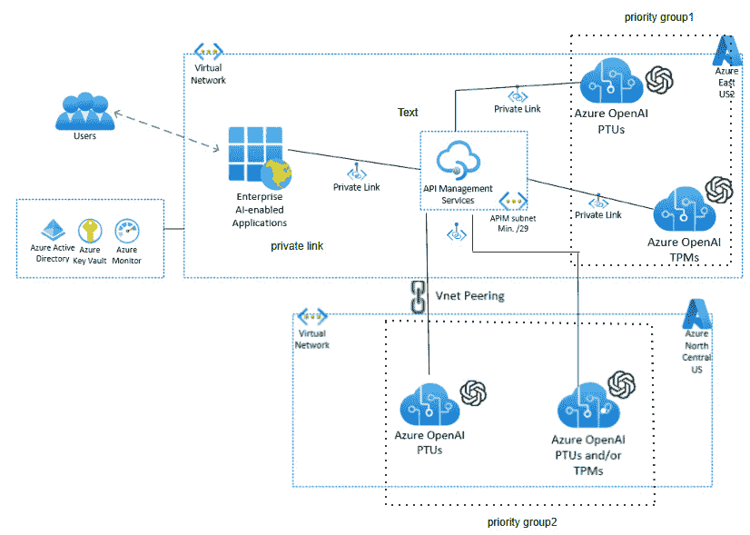

图 12.19: 带 HA 和 DR 的多区域扩展

在提供的参考架构中，重点是一个主动-待命的灾备（DR）策略，其中只有主区域的优先级组 1 是活动的。如果该区域发生故障，待命区域的优先级组 2 将变为活动状态。然而，对于一个更为主动-主动的灾备设置，可以将两个区域的 PTU 实例都指定为优先级组 1，而将两个 PAUG 实例分配给优先级组 2。这个配置确保了 PTU 能有效利用，同时 PAUG 实例处理任何额外的卸载流量。

# 总结

本章涵盖了将 AOAI 落地实施的关键方面，包括监控各种指标，如 API 调用次数、延迟、提示令牌总数和完成令牌等。此外，还讨论了 AOAI 资源配额，概述了不同资源的限制以及如何有效管理和分配配额。此外，本章深入探讨了 AOAI 的预留实例概念，即 PTU，这是任何生产工作负载的关键组成部分。最后，本章探讨了如何通过多个终端点扩展 AOAI，并讨论了高可用性（HA）和灾备（DR）策略，这些都是构建企业级生成式 AI 应用的关键组成部分。

在接下来的章节中，我们将讨论提示工程的概念，这是生成式 AI 模型开发和优化中的一项重要基石。提示工程涵盖了一系列多样化的技术，旨在精炼和定制输入的提示，以影响模型生成输出的质量、一致性和相关性。在本章中，我们将探讨提示工程中最流行的技术和有影响力的策略。通过深入了解这些技术，我们旨在为您提供全面的见解和实用的知识，以有效利用生成式 AI 模型在各种应用和领域中的能力。
