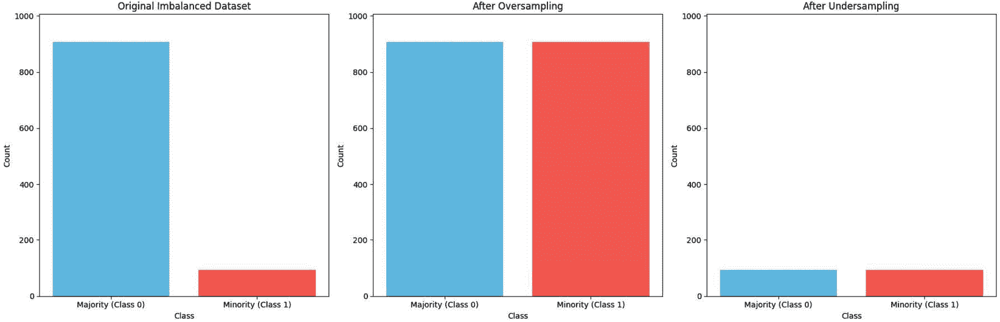

# 第一章：生成式 AI 基础

生成式 AI 迅速成为人工智能（**AI**）和机器学习领域的一项变革性技术，它正在改变着各个行业和用例中的创意过程和问题解决方式。它正在推动基于代理的智能系统自主性的边界。在本章中，我们将介绍生成式 AI 的基础。我们将探讨生成式 AI 是什么，以及生成式 AI 模型的简要历史。然后，我们将讨论不同类型的生成模型，包括**变分自编码器**（**VAEs**）、**生成对抗网络**（**GANs**）、自回归和 Transformer 模型。接下来，我们将深入研究生成式 AI 的应用，并在本章结束时简要讨论一些与生成式 AI 相关的局限性和挑战。

在本简介章节中，我们将涵盖以下主题，这将帮助我们为进一步探索由生成式 AI 驱动的自主智能代理的能力奠定基础：

+   生成式 AI 简介

+   生成式 AI 模型的类型

+   生成式 AI 的应用

+   生成式 AI 的挑战和局限性

到本章结束时，你将全面了解生成式 AI，包括其基本概念、多样化的应用和当前挑战。你还将了解这项技术的潜力和局限性，特别是它对推进智能代理和代理系统所发挥的关键作用。

# 生成式 AI 简介

生成式 AI 指的是一类能够生成各种形式内容的人工智能技术，包括但不限于文本、图像、音频和视频。这些 AI 系统可以根据其训练数据和输入参数生成新的内容，通常包括文本提示，但也可能涉及其他形式的输入，如图像。最近围绕生成式 AI 的炒作源于这种 AI 技术支持的新用户界面能够以极简的方式在几秒钟内创建高质量的文本、图形和视频。

用非常简单的术语来说，生成式 AI 是关于创建看起来像其训练数据的新数据。换句话说，学习输入数据的底层模式、结构和分布，使得模型内部的一个过程能够以类似的方式生成新数据。例如，如果在一个包含人类面部数据集上训练，一个生成式 AI 模型将能够创建出完全不存在于现实生活中的新面孔，但这些面孔非常逼真。本质上，生成式 AI 模型通过学习数据集的概率分布，然后从该分布中采样以创建新实例来工作。这种方法与判别模型不同，判别模型的目标是学习如何区分数据类别。例如，一个判别模型可以被训练来区分猫和狗的图片，但一个生成模型则被训练来制作猫或狗的全新图片。

生成式 AI 的概念可以追溯到很久以前；实际上，它可以追溯到机器学习尚处于摇篮时期的时候。然而，由于神经网络和过去 10 年计算能力的巨大提升，这个领域最近才受到关注。在早期生成建模尝试中——高斯混合模型和隐马尔可夫模型——涉及了许多简单的统计技术。建模任意复杂数据分布的方法与之前占主导地位但最近被深度学习所超越的方法具有更高的兼容性。因此，深度学习对生成式 AI 领域来说是一个分水岭的发展。例如，VAEs 等模型在 2010 年代初开始出现，能够利用深度神经网络来建模更复杂的数据分布。在同一个时期，GANs 被提出；它们第一次提出了一种让两个神经网络通过博弈论原理共同工作以创建数据的新方法。从一般意义上讲，这些突破在实现真实、高质量、逼真数据创建的可能性方面迈出了巨大的步伐。

这可以在大多数行业中的大多数领域带来创新，例如医疗保健、金融、教育、旅游和酒店业、制造业等等。创意产业中的生成式 AI 帮助艺术家和设计师跳出思维定势，帮助构思新的创新内容。它为药物发现和个性化医疗开辟了新的途径。在商业世界中，生成式 AI 通过提供个性化的内容和体验，以高效和有效的方式与客户互动。另一个要点涉及质疑自己对创造力和原创性的立场：当机器能够大量产出非常相似的材料时，人们会自动被迫思考什么是创造力，真正的艺术家是谁，以及 AI 创建内容的伦理参数应该是什么。

理解了什么是生成式 AI 及其简要历史之后，让我们来探讨不同类型的生成式 AI 模型。

# 生成式 AI 模型类型

生成式 AI 是人工智能的一个令人兴奋的领域，它通过从现有数据集中学习模式来生成新的、合成的数据，旨在生成与训练数据具有相似统计特性和特征的输出。以下是对一些最突出的生成模型类型的概述：VAE、GAN 和自回归模型。

## VAEs

最受欢迎的生成式模型之一是 VAE。VAE 背后的核心思想是学习数据与潜在空间之间的概率映射，反之亦然。这意味着学习如何将真实数据转换为简化的表示（例如压缩形式），然后再将其转换回看起来真实的数据。VAEs 被设计用来确保数据的高可能性，同时保留一个结构良好的潜在空间，以便生成与训练数据相似的新数据样本。以下是一些最常见的 VAE 变体：

+   **VAE**：这是一种基本的模型，用于压缩和重建数据。它提供了一个框架，用于从学习到的潜在空间中生成新的样本。VAE 是一种生成模型，它学习压缩和重建数据的同时，也学习潜在空间的概率分布。简单来说，VAE 就像是一个聪明的算法，它学会了理解和重建数据。想象一下，它就像一个技艺高超的艺术家，可以将一幅详细的画作压缩成简单的素描（编码），然后从那个素描中重新创作出完整的画作（解码）。VAE 的独特之处在于，它们不仅复制数据，还学习数据的本质，从而能够创建新的、类似的数据。这就像一个艺术家不仅学会了复制特定的画作，而且对风格的理解如此之深，以至于他们可以以那种风格创作出新的、原创的作品。在现实生活中，VAEs 已经被用于许多创造性的方式。例如，在药物发现中，VAEs 被用于生成新的分子结构。阿斯利康的研究人员使用 VAEs 来探索化学空间，并提出具有所需特性的新型药物分子，这可能会加速药物开发过程[1]。

+   **Beta-VAE**：VAE 的一种扩展，引入了一个超参数来显式地控制重建质量和潜在空间解耦之间的权衡。该模型承担了创建更多可解释的解耦表示的任务。简单来说，Beta-VAE 就像是一个更灵活的原版 VAE。它允许研究人员调整模型在重建精确细节和理解数据基本特征之间的关注程度。这类似于教一个艺术学生不仅复制一幅画，还要理解和区分关键元素，如颜色、形状和风格。这种*解耦*特征的能力使 Beta-VAE 在计算机视觉和机器人学等领域特别有用。例如，研究人员已经使用 Beta-VAE 来教机器人更好地理解物体。通过学习分离大小、颜色和位置等特征，机器人可以更容易地在不同情况下识别和操作物体，使它们在各种任务中更加适应和高效 [2]。

+   **条件变分自编码器**（**CVAE**）：一种变体，它将生成过程条件化在额外信息上，通常是类别标签，不仅产生与训练集相似的数据，还可以从中抽取特定类别的样本。将 CVAE 视为一个更受控制的 VAE 版本，就像一个可以根据需求绘制不同风格的艺术家。这位艺术家不仅会随机创作新的画作，还可以被要求“*画一幅风景画*”或“*画一幅肖像画*”，他们将在特定类别中创作新的艺术作品。这种额外的控制使 CVAE 在实用应用中非常有用。例如，在计算机游戏领域，CVAE 已被用于游戏开发和程序内容生成，包括角色设计、关卡布局、音乐和音效等游戏元素。通过提供不同的条件，如“*创建一个森林关卡*”或“*创建一个沙漠关卡*”，CVAE 可以产生各种各样的游戏环境，为设计师节省时间，并通过更多样化和有趣的游戏世界来增强玩家的体验 [3]。

## GANs

GAN 基本上由两个神经网络组成：一个**生成器**和一个**判别器**。生成器生成合成数据样本；另一个训练好的神经网络应该能够区分真实和创建的样本。在训练这些网络时，它们是相互对抗地训练的：生成器试图欺骗判别器，而判别器则试图正确地分类真实和伪造数据。在这场竞争中，生成器在伪造数据方面变得越来越擅长。以下是一些不同类型的 GAN：

+   **GAN**：这是一个生成器和判别器通过对抗性训练的基本模型；它是大多数生成模型创新的基础模型。如前所述，你可以将 GAN 想象成两个玩家之间的游戏——一个伪造者（生成器）试图制造假币，而一个侦探（判别器）试图识别假币。随着他们之间的竞争，他们各自的工作都变得更好，这意味着伪造者制造假币的能力越来越强。这种巧妙的设置使得 GANs 能够创建极其逼真的假数据，如图像或声音 [4]。

+   **深度卷积生成对抗网络** ( **DCGAN** )：这是基于深度卷积神经网络对基础 GAN 模型的一种改进；目前，它是生成高质量图像的最佳架构之一。将 DCGAN 想象成一个比基本 GAN 更为复杂的艺术家。它就像是从简单的素描工具升级到完整的数字艺术工作室，允许创建更加详细和逼真的图像。DCGANs 特别擅长理解和重现图像中的复杂模式 [5]。

+   **Wasserstein GAN** ( **WGAN** )：这提出了一个使用 Wasserstein 距离的不同损失函数。这消除了使用 GAN 训练时的问题，因此使训练更加稳定并提高样本质量。这有助于更好地衡量两个概率分布之间的距离。WGAN 就像是给 GAN 中的艺术家（生成器）和评论家（判别器）提供了一个更好的沟通和评估彼此作品的方式。他们现在不仅可以说出“*好*”或“*坏*”，还可以给出更细微的反馈，例如“*你越来越接近了*”或“*你完全错了*”。这导致更一致的改进和高品质的结果。在实际应用中，WGANs 已被用于医学成像，用于生成用于训练目的的合成医学图像。这有助于创建更大的、更多样化的数据集，用于训练诊断人工智能系统，可能提高其从扫描和 X 射线中检测疾病准确性的能力 [6]。

+   **StyleGAN**：它生成高质量的逼真图像。该模型特别擅长分别处理风格和内容。StyleGAN2 和 StyleGAN3 的引入带来的进展仍然旨在提高图像的保真度和逼真度。将 StyleGAN 想象成一个高级数字艺术家，他不仅能创建逼真的图像，还能混合和匹配不同的风格和内容。这就像有一个画家，他可以将梵高的风格应用到现代城市景观中。这种灵活性使 StyleGAN 极其多才多艺 [7]。

## 自回归模型和 Transformer 架构

自回归模型一次生成一个数据点，每个数据点都基于前一个数据点。令人惊讶的是，这最终在序列或数据结构相关的任务中非常有用，例如文本生成和图像生成。在《*注意力即是所有你需要*》论文 [8] 中引入的 Transformer 架构是一种已经彻底改变了许多序列数据任务的模型架构，特别是在**自然语言处理**（**NLP**）方面。其关键组件在*图 1* *.1* 中展示：

图 1.1 – Transformer 架构

这些关键组件包括以下内容：

+   **自注意力机制**：一种计算技术，允许模型在处理每个元素时动态地关注输入的不同部分

+   **多头注意力**：并行运行多个注意力机制，允许模型同时关注输入的不同方面

+   **位置编码**：为序列中每个元素的位置添加信息

+   **前馈神经网络**：处理注意力层的输出

+   **层归一化和残差连接**：增强训练稳定性和信息流

Transformer 可以用于自回归和非自回归配置，使其适用于各种任务。以下是一些示例：

+   **PixelCNN**：自回归地逐像素生成图像，每个像素都基于之前生成的像素。该模型在生成具有精细细节的高质量图像方面表现非常好 [9]。

+   **PixelSNAIL**：在 PixelCNN 的基础上进行改进，将注意力机制添加到模型中，以捕捉像素之间的强依赖关系，从而提高图像质量 [10]。

+   **GPT**：代表**生成预训练变换器**，这是一系列专注于文本生成的模型——即预测接下来应该出现哪些单词。其中包含 GPT-2、GPT-3 和 GPT-4，在生成连贯且上下文相关的文本方面取得了巨大飞跃 [11] [12]。

+   **BERT**：与 GPT 不同，BERT 代表**从变换器中提取的双向编码器表示**，它旨在从文本的两个方向理解上下文。它使用 Transformer 的编码器部分，通常用于需要一次性理解整个输入的任务，而不是自回归地生成文本 [13]。

+   **文本到文本迁移变换器**（**T5**）：该模型将所有 NLP 任务框架化为文本到文本格式。它使用完整的 Transformer 架构（编码器和解码器），可以处理各种文本生成任务 [14]。

尽管这些模型取决于任务，但它们展示了 Transformer 架构如何适应自回归（例如 GPT）和非自回归（例如 BERT）任务，展示了其在处理序列数据方面的多功能性。生成模型的优势各不相同。这类模型从生成逼真的图像到生成连贯的文本，再到全新的数据样本。

建立在 GPT 等模型成功的基础上，研究人员将这些架构扩展到创建**大型语言模型**（**LLMs**）。这些模型通常在大量公开网络文本和其他免费可用的文本数据上训练，展示了它们在理解和生成类似人类文本方面的卓越能力，展示了它们的多样性和高级语言能力。LLMs 的例子包括 GPT-3、GPT-4、PaLM 和 BERT-large。这些模型推动了自然语言处理（NLP）可能性的边界，展示了在从问答和摘要到创意写作和代码生成等任务中的熟练程度。以下是对 LLMs 常见类型的概述：

+   **自回归 LLMs**：这些语言模型通常能够按顺序生成文本，即一次生成一个标记。这些类型模型常用的任务包括文本生成、文本补全任务和创意写作。自回归 LLMs 的流行例子包括 GPT 系列（GPT-3、GPT-4）和 PaLM。

+   **仅编码器 LLMs**：这些模型专注于**自然语言理解**（**NLU**）任务，涉及分析和理解输入文本而不生成新文本。仅编码器 LLMs，如 BERT 及其变体包括 RoBERTa，专注于理解输入文本的上下文和含义。这些模型同时处理整个输入序列，使它们能够捕捉上下文，帮助完成文本分类、**命名实体识别**（**NER**）和情感分析等任务。

+   **编码器-解码器 LLMs**：这是编码器和解码器架构的组合，模型不仅能理解输入文本的上下文（NLU），还能生成文本输出。前面讨论的 T5 模型是编码器-解码器 LLMs 的一个非常流行的例子，还有 BERT 等模型。这些模型能够进行语言翻译、摘要和问答。

+   **多模态 LLMs**：多模态是一个概念，即 AI 模型不仅能处理文本，还能处理其他模态，如图像、视频和音频。多模态 LLMs 可以处理和生成各种模态的内容，如文本、图像、音频、视频及其任何组合。这些模型在本质上相当新颖，计算能力的最新进展使得训练多模态 LLMs 成为可能。一些知名的多模态 LLMs 包括 DALL-E、Stable Diffusion、Flamingo、GPT-4 和 LlaVa。

+   **指令调整的 LLM**：LLM 通常是在大量公开可用的网络或其他文本语料库上训练的。因此，在某些情况下，这些模型可能无法有效地执行使用模型之前从未见过的数据的任务，从而可能无法遵循用户意图。例如，一个专有仪器的制造手册可能包含特定领域的专有语言，这在训练过程中模型可能没有接触过。在这种情况下，可以使用特定领域的数据进行微调，以使 LLM 遵循特定的指令和提示（即输入到模型中的文本）。这种特殊的微调使模型能够在微调的特定领域任务上表现良好，同时还能发挥其其他能力。将其视为将模型的个人副本本地化以擅长执行对您的用例有意义的任务。这类模型的常见例子是 InstructGPT，其中研究人员在特定指令上微调了 GPT-3 模型。这类模型被用于多种不同的任务，如聊天机器人、虚拟助手和特定应用。

+   **特定领域的 LLM**：如前所述，虽然 LLM 通常是在大量公开、普遍可用的网络数据上训练的，但它们在特定领域环境中可能表现不佳。虽然指令调整的 LLM 是使这些通用模型适用于特定任务的一条途径，但研究人员已经从底层创新了特定领域 LLM 的训练。这意味着这些模型是在高度专业化的、领域知识上预先训练的。例如，BioBERT 模型是在高度专业化的医疗数据上训练的，而 LegalBERT 是在法律文件上训练的。这些模型在特定领域的专业任务中非常有用，例如医学、法律和金融。

## LLM 驱动的 AI 代理

之前讨论的每种 LLM 类型都有其自身的优势和劣势，并且适用于不同的应用。然而，本书的重点将深入探讨 LLM 代理的能力，并探讨如何利用它们构建高级系统。需要注意的是，LLM 代理并不适合单一类别，因为它们代表的是 LLM 技术的先进应用，而不是特定类型的模型架构。代理通常使用指令调整的 LLM 作为其基础，通常结合本书将进一步学习的额外组件和能力。

让我们通过一个简单的例子来展示由 LLM 驱动的智能体系统的能力。我们的例子是一个拥有**航班预订助手**聊天机器人的旅行网站，该聊天机器人是一个使用 LLM 构建的对话界面。它可以通过类似人类的对话帮助客户预订旅行票务。在后台，随着对话的进行，聊天机器人可以执行各种任务。以下是一个客户想要预订机票的样本对话：

| 航班预订助手 |
| --- |
|  | 嗨，我想预订航班。 |
| 🤖 | 你好！我很乐意帮助你预订航班。为了开始，你能告诉我你的出发城市和目的地吗？ |
|  | 我要从圣地亚哥去 SFO。 |
| 🤖 | 太好了，感谢你提供这些信息。你打算从圣地亚哥（SAN）飞往旧金山国际机场（SFO）。为了帮助你找到最佳航班选项，我需要更多一些详细信息。1. 你希望哪天出行？2. 这是单程还是往返？3. 将有多少乘客出行？ |
|  | 我想在下周五出发，周日返回。只有我一个人出行。 |
| 🤖 | 感谢您提供额外信息。让我总结一下到目前为止的情况：- 出发地：圣地亚哥（SAN）至旧金山（SFO）- 出发日期：下周五 – 08/23/2024- 返回日期：周日 – 08/25/2024- 乘客：1 位成人 |
|  | 我更喜欢早晨的航班。没有航空公司偏好。经济舱即可。 |
| 🤖 | 感谢你提供这些详细信息。我将搜索所有航空公司经济舱的早晨航班。请稍等，我为你找到最佳选项。[搜索航班中...请稍候....] |
| 🤖 | 我为你找到了几个旅行选项。以下是最佳的早晨航班：- 出发（SAN 至 SFO）- 下周五：1. 联合航空 UA1234：出发时间 7:15 AM，到达时间 8:45 AM2. 阿拉斯加航空 AS5678：出发时间 8:30 AM，到达时间 10:00 AM- 返回（SFO 至 SAN）- 周日：1. 达美航空 DL9876：出发时间 9:00 AM，到达时间 10:30 AM2. 西南航空 WN5432：出发时间 10:15 AM，到达时间 11:45 AM 往返总费用（包括税费和费用）为：- 选项 1（联合/阿拉斯加）：$325- 选项 2（达美/西南）：$310 你希望选择哪个选项？或者你想让我寻找不同的航班吗？ |
|  | 第二个选项看起来不错。你能为我预订吗？ |
| 🤖 | 当然可以！我很乐意为您预订第二个选项。为了确认，我将预订以下行程：- 出发：阿拉斯加航空公司 AS5678- 日期：2024 年 8 月 23 日- 从圣地亚哥出发时间为上午 8:30，到达旧金山国际机场时间为上午 10:00- 返回：西南航空公司 WN5432- 日期：2024 年 8 月 25 日- 从旧金山国际机场出发时间为上午 10:15，到达圣地亚哥时间为上午 11:45- 总价：310 美元。为了进行预订，我需要一些额外的信息：1. 您在政府颁发的身份证上显示的完整姓名 2. 您的出生日期 3. 您的电子邮件地址（用于发送确认信息）4. 您的电话号码 5. 任何特殊要求（例如，餐食偏好，座位偏好）。此外，请注意，您需要提供一种付款方式以完成预订。您准备好使用这些信息进行预订了吗？ |
|  | 是的，我已经准备好了。我叫约翰·史密斯，出生于 1985 年 5 月 15 日。我的电子邮件是 john.smith@email.com，我的电话号码是 555-123-4567。没有特殊要求。 |
| 🤖 | 史密斯先生，感谢您提供这些信息。我已经将您的详细信息输入到预订系统中。以下是您提供信息的摘要：- 姓名：约翰·史密斯- 出生日期：05/15/1985- 电子邮件：john.smith@email.com- 电话：555-123-4567- 特殊要求：无。最后一步是处理您机票的 310 美元付款。出于安全原因，我无法在此聊天中直接接受信用卡信息。相反，我将通过您的电子邮件地址（john.smith@email.com）发送一个安全的付款链接。一旦您收到电子邮件，请点击链接完成付款过程。付款成功处理后，您将收到另一封电子邮件，其中包含您的航班确认和电子机票。可以开始将付款链接发送到您的电子邮件地址吗？ |
|  | 是的，这样很好。请发送付款链接。 |
| 🤖 | 极好，史密斯先生。我已经启动了将安全付款链接发送到您的电子邮件地址（john.smith@email.com）的过程。您应该在接下来的几分钟内收到它。如果您立刻没有看到，请检查您的收件箱和垃圾邮件文件夹。完成付款后，系统将自动处理您的预订并发送包含电子机票的确认电子邮件。此电子邮件将包含以下重要信息：1. 预订确认号码 2. 详细航班行程 3. 登机指示 4. 行李额度信息 5. 航空公司联系方式。收到确认电子邮件后，请仔细检查所有详细信息，以确保一切正确。如果您发现问题或有任何疑问，请随时联系我们。您在旅行或预订过程中还需要其他帮助吗？ |
|  | 不，就这些。感谢您的帮助！ |
| 🤖 | 史密斯先生，不客气！很高兴我能帮助您预订从圣地亚哥到旧金山的航班。如果您需要任何进一步的帮助或有关于您旅行的任何问题，请随时联系我们。我们 24/7 都在这里为您服务。祝您下周去旧金山的旅程愉快！ |

在表面上，这个例子看起来相当直接。然而，在幕后发生了很多事情。首先，客户开始时提出一个模糊的请求，想要预订航班。人工智能助手明白，为了处理这个请求，它需要查找更多的一些信息，比如出发/到达城市、旅行日期等等。

随着对话的进行，人工智能助手请求进一步的信息，以便能够成功完成预订。它在每个步骤收集的信息被用作参数值，在后台调用与航班预订相关的 API；例如，需要城市/旅行日期/乘客数量等信息来使用一个（虚构的）API 名为**flightLookup**查找可用的航班信息，需要客户姓名/电话/电子邮件等信息来使用名为**bookFlight**的 API 实际完成预订，等等。*图 1.2* 给出了模型做出的决策、交互流程以及它为完成每个步骤调用的工具（API 函数）的概述：

图 1.2 – 基于 LLM 的多智能体航班预订助手聊天机器人

除了调用工具之外，你还会注意到，在对话开始时，模型进行了一些自我反思，这被称为**思维链**（**CoT**）。这意味着后端的模型制定了一个逐步的方法来完成任务，但发现了一些缺失的信息。然后，它向客户请求提供所需的信息。随后，根据客户提供的输入，它自主地做出某些决定，使用智能体调用特定的工具来完成任务。

在设计这样的系统时，除了外部工具和 API 之外，还有许多其他因素需要考虑。我们将在后续章节中详细讨论这些组件的基本原理。现在，只需知道智能体是 LLM（如这个旅行预订人工智能助手）的高级应用，代表了一个新兴领域，它将各种 LLM 类型的特点与额外的 AI 技术相结合，如强化学习、规划和工具使用。随着您在后续章节中学习更多，您会发现智能体被设计得更加互动、适应性强，并且能够完成比标准 LLM 更复杂、多步骤的任务，这使得它们适合各种不同的复杂任务和工作流程。

在深入探讨智能体系统的细节之前，让我们回顾一下生成式人工智能的一些应用。

# 生成式 AI 的应用

生成式 AI 具有涵盖众多领域的创新能力。如前所述，医疗保健、金融、教育、媒体和娱乐、市场营销、制造业、零售等行业都有可能从生成式 AI 的能力中受益。以下是对生成式 AI 主要应用中的一些应用的概述：

+   **图像和视频生成**：多模态生成模型（即能够处理图像、文本、音频和视频的 LLMs）正在通过各种平台和工具使生成逼真的音频/视觉内容成为可能。例如，在媒体和娱乐领域，生成式 AI 可以帮助生成视觉效果、设计头像和开发虚拟现实内容。在时尚和设计行业，它被用于构思新的服装设计、准备虚拟时装秀和预测时尚趋势。在营销广告和推广领域，生成式 AI 被用于生成定制广告、活动、营销沟通以及其他营销材料创意，如图像和标志。

+   **文本和内容生成**：生成式 AI 在基于文本的任务方面取得了显著进展。例如，内容写作，如快速且无烦恼地生成文章、博客文章、营销和产品副本，已经成为最常见的用例之一。聊天机器人和虚拟助手正在以非常人性化的方式提供客户支持，以回答信息相关的问题。生成式 AI 还在文本翻译、文档摘要和内容本地化方面提供帮助，以增加内容对在线学习和专业搜索引擎等平台的可访问性。

+   **音乐和音频生成**：创建原创音乐、音效和语音合成是多媒体内容生成领域由生成式 AI 推动的另一种范式。实际上，这类内容正在被用于游戏和娱乐行业，以创建辅助训练材料、自动呼叫中心助手以及如亚马逊 Alexa 或谷歌 Next 等物联网设备，这些设备可以接收音频命令并使用语音响应来完成自动化任务。

+   **医疗保健和药物发现**：生成式 AI 在医疗保健领域找到了一席之地。例如，新药的设计和预测其治疗疾病或其他条件的能力；个性化医疗，即根据每个患者的情况量身定制治疗方案；以及医学成像，即通过研究目的生成合成图像并提高图像质量。

+   **代码生成**：代码生成是 LLM（大型语言模型）的一个新兴功能，它正在帮助软件开发者。这些模型通常可以根据文本提示生成准确的代码片段，有时甚至可以根据文本提示生成整个函数。代码生成中生成式 AI 的高级实现包括为各种**集成开发环境**（**IDE**）创建的插件，例如**Visual Studio Code**（**VS Code**），它可以理解整个代码库的上下文，识别错误，创建代码文档，并生成单元测试脚本。代码生成的另一种实现是文本到查询用例，其中自然语言提示被转换为 SQL 查询，然后可以对该数据库执行以获取所需的结果。然而，这是必须特别小心处理的一个领域，尤其是在执行由 LLM 生成的代码之前，以防止恶意代码执行的风险。在这些情况下，LLM 生成的代码通常在沙盒中执行并经过清理，以检查代码是否安全且适合在自主环境中执行。

+   **自主工作流和机器人技术**：正如我们之前简要讨论的那样，由 LLM（大型语言模型）驱动的 AI 代理是生成式 AI 的高级实现，其中 LLM 作为其基础。这些代理可以在各种用例中执行多个任务。例如，一个拥有虚拟助手聊天机器人的旅行预订网站可以实现代理来自动化客户的旅行和酒店预订流程。在这些情况下，基于代理的系统可以通过理解客户与聊天机器人进行的对话上下文来执行特定任务，例如调用航班预订 API。当讨论机器人技术时，更高级的基于代理的系统通常被应用，其中机器人的动作主要受代理控制。机器人代理基本上根据其环境或分配给其执行的具体任务来决定要做出什么决定。它使用代理来执行 LLM 无法执行的动作；例如，代理可以打开或关闭机器人的肢体执行器。机器人工智能是一个新颖且开放的研究领域，该领域在行业中涌现出许多创新，尤其是针对制造应用。

这些只是使用 LLM 的生成式 AI 的一些常见示例。其他具体示例包括在时尚和设计、合成数据生成、个性化教育内容、金融建模和预测以及预测性维护中的应用。以下是我们讨论的用例中使用的商业和开源工具的简要列表：

| **用例** | **商业工具** | **开源工具** |
| --- | --- | --- |
| **视觉效果和** **虚拟形象设计** |

+   **Unreal Engine 的 MetaHuman Creator**：允许创建用于游戏和电影的非常逼真的数字人类

+   **NVIDIA Omniverse**：一个用于 3D 设计协作和模拟的平台，适用于创建视觉效果

|

+   **DeepFaceLab**：用于面部交换和创建数字头像

+   **StyleGAN**：能够生成高度逼真的面孔，并可适应用于头像创建

|

| **虚拟现实** **内容开发** |
| --- |

+   **Unity**：虽然不是专门用于 VR，但它具有强大的 VR 开发能力

+   **Adobe Aero**：允许创建 AR 体验

|

+   **A-Frame**：一个用于构建虚拟现实体验的 Web 框架

+   **Godot**：一个支持 VR 的开源游戏引擎

|

| **服装设计** **和虚拟时尚秀** |
| --- |

+   **CLO3D**：一个 3D 服装设计软件，可以创建虚拟时尚秀

+   **Browzwear**：为时尚行业提供 3D 设计解决方案

|

+   **Blender**：虽然主要是一个 3D 建模工具，但也可以用于时尚设计和虚拟秀

|

| **时尚** **趋势预测** |
| --- |

+   **WGSN**：使用 AI 进行时尚趋势预测

+   **Heuritech**：提供 AI 驱动的趋势预测

|

+   None

|

| **营销** **广告生成和** **活动创建** |
| --- |

+   **Jasper**：一个 AI 写作助手，可以帮助创建营销文案

+   **Midjourney**：一个 AI 图像生成工具，可用于创建营销视觉内容

|

+   **GPT-J**：一个开源语言模型，可以针对营销内容生成进行微调

+   **Stable Diffusion**：一个开源的图像生成模型，可以创建营销视觉内容。

|

| **标志和** **图像创建** |
| --- |

+   **DALL-E 2**：可以根据文本描述生成独特的图像和标志

+   **Canva**：虽然不是完全由 AI 驱动，但它集成了 AI 功能以辅助设计

|

+   **Stable Diffusion**：可用于标志和图像生成

+   **Craiyon（原名 DALL-E mini）**：DALL-E 的开源替代品

|

| **文本和** **内容生成** |
| --- |

+   OpenAI 的 ChatGPT

+   Anthropic 的 Claude AI

+   Jasper

+   Copy.ai

+   Anyword

+   Writer

+   WriteSonic

还有更多…… |

+   **Mistral 7B**：一个以在文本生成任务中的效率和精确性而闻名的开源 LLM

+   **LLaMA**：一组开源的预训练和微调的生成文本模型，提供不同参数大小的版本

+   **BLOOM 语言模型**：由 1000 多名 AI 研究人员开发的大型开放访问 AI 模型，以其在文本生成中的鲁棒性和多功能性而闻名

还有更多… |

| **代码生成** |
| --- |

+   GitHub Copilot

+   Amazon Q for Developers

+   Tabnine

+   OpenAI Codex

还有更多…… |

+   **Code T5**：一个用于代码相关任务的开源 AI 模型。它可以生成代码片段、完整代码，甚至可以在编程语言之间进行翻译。

+   **Polycoder**：一个开源的商业代码生成器的替代品。它在涵盖多种编程语言的庞大代码库上进行了训练，可以生成用于各种任务的代码。

|

| **自主工作流** **和机器人** |
| --- |

+   **UiPath** 将生成式 AI 集成到其 **机器人流程自动化**（**RPA**）平台中。它使用 AI 来发现自动化机会，并增强诸如文档理解和通信挖掘等任务。

+   **Automation Anywhere** 将生成式 AI 集成到其自动化平台中。它提供了自动化协同驾驶者等特性，该特性使用生成式 AI 来加速开发者的生产力。

+   **NVIDIA** 提供了利用其 AI 框架的 AI 工作流，包括生成式 AI 功能，用于开发机器人学和自主系统中的创新解决方案。

|

+   **OpenAI Gym** 提供了一个用于开发和比较强化学习算法的工具包，这些算法可以与 LLMs 结合，用于更高级的机器人应用。

+   **Hugging Face** 提供了开源库，可用于在机器人学和自主工作流应用中实现 LLMs。

+   **LangChain** 是一个开源的 Python 库，用于开发使用 LLMs 的应用程序，可以应用于创建更智能的自主工作流和机器人系统。

|

表 1.1 – 使用生成式 AI 的商业和开源工具示例

这绝不是目前市场上可用的商业和开源工具的完整列表，而且这个领域每天都在变化。我们正在见证许多新的初创公司提供使用生成式 AI 解决现实生活用例的新颖和创新方法，同时我们也在见证新的模型提供商开发出比之前更强大且运营成本更低的 LLMs。这仅仅展示了生成式 AI 领域的动态和激动人心的特点。

# 生成式 AI 的挑战和局限性

尽管生成式 AI 具有巨大的好处，但它并非没有自己的挑战和局限性。在考虑将生成式 AI 技术应用于任何特定用例时，需要非常谨慎地考虑这些挑战和局限性。以下是对一些与 LLMs 相关的常见注意事项的简要讨论，以及一些减轻这些问题的方法。

## 数据质量和偏见

生成模型在很大程度上依赖于训练数据集中数据的质量和多样性。任何使用有偏见或不具代表性的数据进行训练的模型都将产生具有相同类型偏见的输出，从而巩固现有的偏见，或者在训练数据存在偏见的情况下，使一个或多个群体边缘化。

处理这种挑战的一种方法是通过确保数据集本身用于训练的广泛视角中的多样性丰富性、高质量数据等。与任何机器学习问题一样，分析数据和了解数据在特征上的分布通常是有帮助的。数据分析可以揭示可能导致模型偏差的不平衡。有几种算法方法可以减轻训练数据中的偏差（例如，使用过采样或欠采样），但每种方法都有其自身的优缺点。例如，考虑一个训练数据集的两个类别，其中*Class 0*数据实例比*Class 1*数据实例多，导致数据集自然不平衡。当使用这样的数据集训练模型时，模型会对*Class 0*类型的数据“过度拟合”，并可能更加擅长或甚至记住属于*Class 0*的数据，而对于属于*Class 1*的数据可能表现不佳。这本质上导致模型表现不佳并显示出严重的偏差。以下图展示了过采样和欠采样对这种数据集的影响，以减轻偏差：

图 1.3 – 不平衡数据分布和过采样、欠采样的影响

## 数据隐私

多项实验和研究人员已经证明，大型语言模型（LLMs）有泄露它们训练数据的倾向。如果模型是在大量私人或专有信息上训练的，这尤其成问题。对 LLMs 进行特殊技巧和风格的提示已经表明，迫使模型生成包含其训练数据集中字面文本的数据是足够的。这些提示技术并不复杂，通常使攻击向量变得非常简单、成本效益高，可以迫使模型泄露信息。例如，正如在名为*Scalable Extraction of Training Data from (Production) Language Models* [15]的论文中讨论的那样，研究人员能够仅花费价值 200 美元的 API 调用费用，使用提示注入技术迫使 OpenAI 的 GPT-3.5 模型泄露私人信息。泄露的信息包括人们的姓名、电子邮件和物理地址，以及模型训练数据集中意外出现的电话号码。虽然一些这些问题正在由模型提供商如 OpenAI 积极解决，但对于选择在内部自行训练模型的组织来说，这仍然可能是个问题。

一些常见的缓解机制是在训练数据上执行数据匿名化或假名化，以在训练模型之前删除或模糊个人、私人或专有信息。这两种技术都涉及使用更小、更便宜、更快的 AI 模型来执行分类和实体检测，以识别训练数据集中是否存在个人或私人数据。一旦识别出来，这些私人信息可以被模糊、掩盖或完全从训练数据集中删除。请注意，根据您的用例，这样做可能会有几个影响，因此必须进行特殊分析以确保不会影响模型的表现。

## 计算资源

训练复杂的生成模型非常资源密集，需要高计算能力；这通常使得训练大型语言模型在经济上成本高昂且能耗巨大。尽管已经有一些硬件突破使得训练此类模型成为可能，但这些硬件资产仍然价格昂贵、特权且有限。例如，**图形处理单元**（**GPU**），最初是为渲染高保真图形而设计的，已经成为 AI 模型训练、微调和计算的关键。NVIDIA 的 CUDA 架构于 2006 年推出，使得 GPU 能够用于通用计算，而现代 GPU 如 NVIDIA 的 A100 和 H100 自那时起就专门针对 AI 工作负载进行了优化。然而，这些高端 GPU 的单位价格通常高达数万美元。

训练大型模型如 GPT-3 仅计算资源就估计需要数百万美元。确切成本取决于模型大小、训练时间和硬件效率等因素。例如，训练 GPT-3 估计需要约 4000 万至 5000 万美元的计算资源，而更近期的模型如 GPT-4 和 PaLM 的训练成本可能更高。除了硬件本身之外，还存在着与电力消耗、冷却和数据中心空间相关的重大基础设施成本。由于成本高昂，大型语言模型的训练主要由大型科技公司或资金充足的科研机构完成。云服务现在提供对预训练模型和微调能力的访问，使得某些级别的 LLM 工作对小型组织和公众更加可及。最近在**小型语言模型**（**SLMs**）方面的创新提供了一种克服这一挑战的方法，这些模型是更小的生成 AI 模型，可以训练以完成特定任务。尽管这些模型仅限于非常狭窄的特定领域任务，但由于它们需要的计算资源远少得多，因此训练这些模型的经济性要高得多。

## 道德和社会影响

技术生成式 AI 的进步在伦理和社会方面暴露出的一系列问题，引发了以下许多复杂问题，这远非一个详尽的列表：

+   **深度伪造和虚假信息**：它能够生成非常逼真的合成内容。如果发生这种情况，它将产生深度伪造甚至虚假信息，这可能对隐私、安全甚至公众信任构成威胁。

+   **知识产权**：开发与现有内容相似的过程会引发版权和知识产权问题。与创作的原创性和正确所有权相关的法律复杂性可能非常令人困惑。

+   **工作替代**：经济学家常常淡化对内容生成和其他自动化任务领域重大失业的担忧。令人担忧的是，预期结果将与关于再培训和调整策略的研究相平行，这些策略可以帮助受影响的工人，以及创业机会。

当谈到减轻社会和伦理影响时，问题更多的是哲学性的，而不是技术性的。虽然深度伪造 AI 图像检测和私人及个人数据检测方法等是一些常见的策略，但在 AI 对社会的好处以及任何现有或即将出台的政府法规的背景下，社会影响是一个更大的问题。

## 泛化与创造力

这些生成式 AI 模型的一个大问题是它们的泛化能力非常差。更具体地说，它们很少生成与训练数据显著不同的内容。也就是说，它们擅长复制重复的模式，但真正创造原创或新颖的东西的能力非常有限。因此，它们在资本 C 创造力方面的潜力非常有限。

随着生成式 AI 以新颖的方式不断进化，它必然会带来新的挑战，正如我们正在见证的新研究和努力，以确保该技术的合理和负责任的使用。

# 摘要

生成式 AI 是一个发展相当迅速的领域，对行业和我们的生活的许多方面具有巨大的颠覆性潜力。相比之下，生成式 AI 的应用包括非常逼真的图像生成和文本生成、加速药物发现以及丰富的创意表达。

关于这一点的一个关键点是理解不同的生成模型，如 VAEs、GANs 和自回归模型，这些模型可以提供对技术如何工作以及它们可以应用在哪些方面的见解。然而，指出生成式 AI 面临的许多问题和局限性也很重要，包括数据质量、计算资源、伦理考虑，甚至创造力。

在下一章中，我们将学习关于代理系统原理的内容，这包括代理和自主的概念、智能代理的特征、智能系统各种架构以及多代理系统。

# 问题

1.  生成式 AI 模型只能接受文本数据作为输入。对还是错？

1.  生成式 AI 模型有哪些不同类型？

1.  生成式 AI 有哪些伦理和社会影响？

1.  有哪些方法可以减轻训练数据中的偏差？

1.  有哪些文本和内容生成的开源 LLMs？

# 答案

1.  错误。生成式 AI 模型可以将文本以及图像、视频和音频数据作为输入。

1.  VAEs、GANs 和自回归模型。

1.  Deepfakes、虚假信息、版权或知识产权问题以及就业岗位的流失是生成式 AI 的一些社会和伦理影响。

1.  解决训练数据偏差的一些常见方法包括过采样或欠采样。

1.  Mistral、LLaMA 和 Bloom 是一些开源的文本和内容生成 LLMs。

# 进一步阅读

+   *《精通机器学习算法——第二版》* 由 Giuseppe Bonaccorso 著

+   *《不平衡数据机器学习》* 由 Kumar Abhishek 和 Dr. Mounir Abdelaziz 著

+   *《使用 Python 和 TensorFlow 2 的生成式 AI》* 由 Joseph Babcock 和 Raghav Bali 著

# 参考文献

1.  *自编码变分贝叶斯* : [`arxiv.org/abs/1312.6114`](https://arxiv.org/abs/1312.6114)

1.  *beta-VAE：使用约束变分框架学习基本视觉概念* : [`openreview.net/forum?id=Sy2fzU9gl`](https://openreview.net/forum?id=Sy2fzU9gl)

1.  *使用深度条件生成模型学习结构化输出表示* : [`papers.nips.cc/paper_files/paper/2015/hash/8d55a249e6baa5c06772297520da2051-Abstract.html`](https://papers.nips.cc/paper_files/paper/2015/hash/8d55a249e6baa5c06772297520da2051-Abstract.html)

1.  *生成对抗网络* : [`arxiv.org/abs/1406.2661`](https://arxiv.org/abs/1406.2661)

1.  *《使用深度卷积生成对抗网络进行无监督表示学习》* : [`arxiv.org/abs/1511.06434`](https://arxiv.org/abs/1511.06434)

1.  *Wasserstein GAN* : [`arxiv.org/abs/1701.07875`](https://arxiv.org/abs/1701.07875)

1.  *用于生成对抗网络的基于风格的生成器架构* : [`ieeexplore.ieee.org/document/8953766`](https://ieeexplore.ieee.org/document/8953766)

1.  *《专注即一切》* : [`arxiv.org/abs/1706.03762`](https://arxiv.org/abs/1706.03762)

1.  *使用 PixelCNN 解码器进行条件图像生成* : [`arxiv.org/abs/1606.05328`](https://arxiv.org/abs/1606.05328)

1.  *PixelSNAIL：改进的自回归生成模型* : [`www.researchgate.net/publication/322114155_PixelSNAIL_An_Improved_Autoregressive_Generative_Model`](https://www.researchgate.net/publication/322114155_PixelSNAIL_An_Improved_Autoregressive_Generative_Model)

1.  *语言模型是少样本* *学习者* : [`arxiv.org/abs/2005.14165`](https://arxiv.org/abs/2005.14165)

1.  *GPT-4 技术* *报告* : [`arxiv.org/abs/2303.08774`](https://arxiv.org/abs/2303.08774)

1.  *BERT：用于语言* *理解* 的深度双向 Transformer 预训练* : [`arxiv.org/abs/1810.04805`](https://arxiv.org/abs/1810.04805)

1.  *探索统一文本到文本* *Transformer* 的迁移学习极限* : [`arxiv.org/abs/1910.10683`](https://arxiv.org/abs/1910.10683)

1.  *从（生产）语言* *模型* 中可扩展地提取训练数据* : [`arxiv.org/abs/2311.17035`](https://arxiv.org/abs/2311.17035)

# 加入我们的 Discord 和 Reddit 社区

对这本书有疑问或想参与关于生成式 AI 和 LLMs 的讨论？加入我们的 Discord 服务器[`packt.link/I1tSU`](https://packt.link/I1tSU)和 Reddit 频道[`packt.link/ugMW0`](https://packt.link/ugMW0)，与志同道合的爱好者交流、分享和协作。

