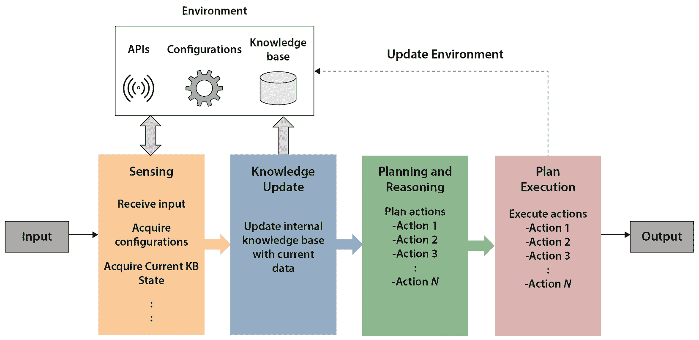
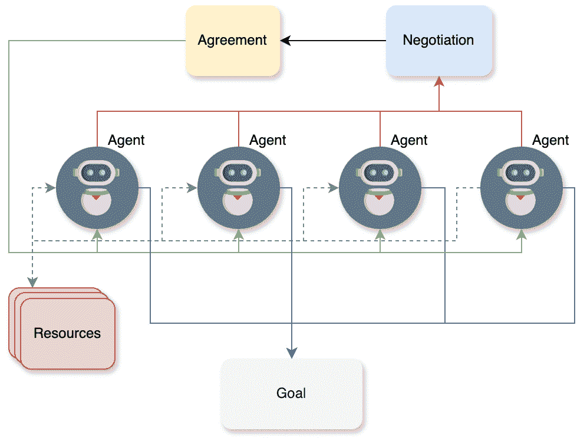

# 第二章：代理系统原理

在上一章中，我们介绍了生成式 AI 的基础知识，学习了生成式 AI 模型类型，并简要讨论了由 LLM 驱动的 AI 代理。在本章中，我们将讨论代理系统的基本原理，从对代理和自主性概念的简要讨论开始，接着讨论智能代理及其特征。我们还将通过上一章讨论的旅行预订助手示例，讨论各种代理系统架构以及多智能体系统。

本章讨论的主要主题如下：

+   理解自我治理、代理和自主性

+   审查智能代理及其特征

+   探索代理系统的架构

+   理解多智能体系统

到本章结束时，您将了解智能代理的基础知识以及构建智能代理系统时必须考虑的代理系统架构的最关键方面。

# 技术要求

您可以在[`github.com/PacktPublishing/Building-Agentic-AI-Systems`](https://github.com/PacktPublishing/Building-Agentic-AI-Systems)找到本章的代码文件，并按照仓库中的 README 文件设置您的开发环境。

# 理解自我治理、代理和自主性

**代理系统**的迷人之处在于它们复杂的决策过程，这些过程为特定情境下如何优化选择提供了宝贵的见解。这些系统常常挑战我们对责任和问责制的传统理解。

代理系统作为推动机器人、AI 和系统工程等领域创新和技术进步的驱动力。这些系统的发展和部署加速了新形式自动化和智能行为的探索和创造。让我们讨论一下代理系统取得进展的一些领域：

+   **机器人学**：在机器人领域，代理系统为设计并实现能够在复杂环境中导航、执行复杂任务并适应变化条件的自主机器人铺平了道路。这些配备决策能力和自主性的机器人已在制造、探索、搜救行动和医疗保健等领域得到应用。例如，具有代理行为的机器人可以自主穿越灾区，评估潜在风险，并做出协助救援工作的决策，展示了智能和适应性强的行为。

+   **人工智能**：在人工智能领域，代理系统在智能代理和决策支持系统的开发中发挥了重要作用。这些系统利用高级算法、机器学习技术和知识表示方法来分析数据、对复杂场景进行推理，并提供智能推荐或自动化决策能力。代理人工智能系统已应用于金融、医疗保健、交通和市场营销等领域，使决策过程更加高效和有效。

+   **系统工程**：在系统工程领域，代理系统促进了复杂、分布式和自适应系统的设计和实施。这些系统通常由多个相互作用的组件或子系统组成，每个都表现出代理行为和决策能力。这类系统存在于电网、交通网络和 cyber-physical systems 等领域，在这些领域，智能和自主的决策对于高效运行、资源分配和容错至关重要。

代理系统理念的核心是自我治理、代理和自主性的概念。让我们在接下来的部分中逐一讨论这些概念，了解它们是什么，并探讨它们在代理系统架构中扮演的关键角色。

## 自我治理

代理系统是具有自我治理、适应性和交互的人工和人类系统。自我治理指的是系统或实体能够自主地治理或控制自己，无需外部指导或控制。在代理系统的背景下，自我治理意味着系统可以做出自己的决定，设定自己的目标，并根据其内部规则、模型和决策算法来调节其行为。基本上，它们根据其规则和内部状态运行，并在必要时根据环境或目标的变化执行行为变化。这些系统以对其有意义的方式与环境或其他系统互动，并通过这些互动受到影响。

代理系统中的自我治理的一些关键方面如下：

+   **自我组织**：在没有外部干预的情况下，组织和结构其自身内部过程、资源和行为的能力

+   **自我调节**：根据来自环境或内部状态的反饋，监控和调整其自身行动和输出的能力，以确保其在期望的参数或约束内运行

+   **自我适应**：根据环境或自身内部条件的变化，修改其行为、策略或决策过程的能力，以更有效地实现其目标

+   **自我优化**：通过学习、经验或进化过程，持续提高其性能、效率或决策能力的能力

+   **自我决定**：根据其内部决策过程设定自己的目标、优先级和行动路线的能力，而不完全受外部力量的控制

在代理系统中，自我治理通常是通过集成各种技术、框架和方法实现的，例如机器学习、知识表示、推理和决策算法。这些技术使得系统能够处理信息、从数据和经验中学习，并基于其获取的知识和当前环境自主做出决策。

## 代理

代理被描述为个人或任何其他实体独立行动和做出选择的能力。在人类和人工系统的背景下，代理包括以下关键要素：

+   **决策权**：这指的是根据选择的替代方案或行动路线采取行动和执行行动的权力或能力。具有代理能力的系统拥有自主权，可以根据其内部决策过程评估不同的选项并选择最合适的行动，而不是仅仅由外部力量或预先设定的规则驱动。

+   **意向性**：代理意味着存在意图、目标或目标，这些指导着系统的行动和行为。代理系统不仅仅是反应性的；它们有一种目的感，可以追求具体的目标，并根据需要调整其行动和策略以实现这些目标。

+   **责任**：代理与责任的概念紧密相连，即对个人行动的结果和后果负责或承担责任。具有代理能力的系统被认为对其决策及其对环境或其他与之交互的实体的行动影响负责。

在大多数情况下，人工智能代理涉及系统根据其内部程序、模型和处理的 数据自主做出决策的能力。这些决策可以对系统的自身功能或其与环境交互产生重大影响。

让我们回顾一下上一章中的旅行预订助手示例，它负责预订机票，甚至可能预订酒店。在这种情况下，系统会通过分析各种因素来展现其代理能力，例如两个城市之间航班的可用性、机票价格以及用户给出的任何其他限制，如首选座位等级等，然后决定如何最优地寻找符合这些标准的航班和酒店，以最小化客户的整体旅行成本。系统将对其决策的结果负责，这将对客户的整体旅行计划和旅行成本产生影响。

## 自主性

自主性与代理的概念密切相关，但更具体地关注一个实体或系统所拥有的独立程度。它可以分解为几个方面：

+   **操作自主性**：这指的是系统在没有直接人类干预或控制的情况下执行特定任务或一系列任务的能力。具有操作自主性的系统可以独立执行其功能，依靠其自身的内部流程、决策算法和环境感知能力。

+   **功能自主性**：自主性的这一方面涉及系统在所处环境或情境中做出选择和采取行动以实现既定目标或目标的能力。功能自主的系统可以对其行为和决策过程做出调整，以应对变化条件或刺激，使其能够更有效地追求其目标。

+   **分层自主性**：这一方面与系统在一个更大的框架或组织结构内所赋予的决策权威或决策权力量相关。具有更高分层自主性的系统在做出影响其子系统或更广泛运营的决策时具有更大的自由度，而具有较低分层自主性的系统可能受到更高层实体的更多约束或监督。

在人工智能和机器人技术中，自主性是一个关键概念，指的是系统在无需持续人类干预的情况下执行任务和做出决策的程度。

在我们的旅行预订助手示例中，该系统将具有操作自主性，可以执行诸如预订航班或酒店、管理提醒和检索旅行信息等任务，几乎不需要或不需要人类输入。它还将拥有功能自主性，允许它解释用户命令，适应个人偏好，并做出与用户目标和情境相符的决策。授予此类系统的分层自主性水平可能取决于诸如用户隐私偏好或系统对敏感数据和服务器的访问等因素。

注意，人工智能和机器人系统的自主性并不一定意味着完全没有人类的监督或控制。通常，这些系统在其设计者或操作者设定的明确边界和约束内运行，同时仍然表现出相当程度的自主性。在我们的旅行预订示例中，聊天机器人会从用户那里请求额外的信息，例如旅行日期、地点、姓名和地址，以便进行航班预订。然后，它会将此数据与可用的航班进行交叉参考，提出符合用户偏好的选项。如果任何细节缺失或不清楚，聊天机器人会提示用户进行澄清，确保准确性，同时在编程设定的边界内自主运行。

人工智能系统中的自我治理、代理和自主权概念通常伴随着伦理考量，尤其是关于授予这些系统的自主程度以及它们决策的潜在风险和影响。随着人工智能系统变得更加先进和能够进行独立决策，确保它们与人类价值观和伦理原则相一致变得至关重要。

## 代理中代理和自主性的例子

让我们用一个简单的旅行预订助手算法来阐述代理和自主权的概念。请注意，这个算法目前并不一定使用人工智能，但它有助于理解这些概念。我们的旅行预订助手算法可能如下所示。

算法 1：具有代理和自主性的旅行预订助手算法

需求：代理名称 N

确保：初始化具有代理和自主性的旅行代理对象 A

1: 初始化 A ← 创建旅行代理(N)

2: 初始化 A.goals ← 空列表

3: 初始化 A.knowledge_base ← 空字典

// 代理：代表用户行动的能力

4: 函数 SetGoal(G)

5: A.goals.Append(G) // 代理：定义目标

6: 函数 UpdateKnowledge(K, V)

7: A.knowledge_base[K] ← V // 代理：从 API 获取信息并进行评分

// 自主性：独立操作的能力

8: 函数 MakeDecision(选项)

9: best_option ← max(选项, key =score) // 自主性：独立决策

10: 返回最佳选项

11: 函数 BookTravel(出发地, 目的地)

12: 输出 “代理 A.name 正在预订前往目的地的旅行”

// 代理：代表用户执行行动

13: 设置目标（“从出发地到目的地预订航班”）

14: 更新知识({出发地, 目的地})

// 自主性：通过找到最佳航班独立预订旅行

15: MakeDecision()

// 在此处实现预订逻辑并将其存储到 A

16: 输出 A

下面是这个算法的工作方式，展示了代理的代理和自主能力：

1.  我们首先给我们的代理命名；我们称之为 **TripPlanner** 。

1.  接下来，我们初始化一个新的 **TravelAgent** 对象，名称为 **N = "TripPlanner"**；这代表了一个既具有代理又具有自主能力的实体。

1.  然后我们设置一个列表来存储代理的目标。这与代理相关，因为目标代表了代理将代表用户追求的意图或期望的结果。这由 **A.goals ←** **空列表** 表示。

1.  接下来，我们初始化一个空字典（也称为映射或键值对）来存储代理的知识。这对于代理（代表用户行动）和自主性（独立操作）都至关重要，因为它将包含代理用于做出决策的信息。

1.  算法中的步骤 *4* 和 *5* 指示了定义一个函数，该函数将一个新的目标 **G** 添加到智能体的目标列表中。这类似于智能体代表用户承担目标。这表示为 **A.goals.Append(G)**。想象一下，这将是一段代码，它将接收用户的聊天消息，例如 *“为我预订从圣地亚哥到西雅图的航班。”* 在这里，目标是预订从圣地亚哥到西雅图的航班。

1.  算法中的步骤 *6* 和 *7* 指示了定义一个函数，该函数通过添加一个新的键值对（映射或字典）来更新智能体的知识库。这代表了通过获取将用于代表用户采取行动的信息来体现智能体的能力。它还通过为智能体提供可用于做出独立决策的信息来支持自主性。这个操作表示为 **A.knowledge_base[K] ← V**。在我们的案例中，这个函数使用几个与旅行相关的 API（理论上）来获取两个城市之间的航班选项，从而将知识形成知识库。这也是对这些航班选项进行评分的地方；例如，晚班机得到低分，而早班机得到高分。

1.  步骤 *8* 到 *10* 定义了一个函数，它执行几项不同的操作。它接受一个选项列表，并根据某些评分标准选择最佳选项。这是算法中自主性的一个例子，因为智能体独立评估选项并做出决定，而不需要直接的人为干预。

1.  最后，步骤 *10* 到 *15* 展示了所有这些组件如何协同工作，从使用出发城市和目的地城市设置航班预订目标开始，使用航班查找 API 更新知识库，然后对可用的航班进行评分。随后，它使用 **MakeDecision** 函数根据最高评分找到最佳可能的航班，并为用户执行航班预订。

算法中 **BookTravel** 函数的 Python 实现如下所示：

```py
1 def book_travel(departure: str, destination: str):
2     self.set_goal(f"Book flight from {departure} to {destination}")
3     self.update_knowledge(departure, destination)
4
5     try:
6        best_flight = self.make_decision()
7        booking_confirmation = f"BOOKING_#12345"
8        self.knowledge_base['booking_confirmation'] = \
9                         booking_confirmation
10       print(f"Booking confirmed: {booking_confirmation}")
11    except Exception as e:
12       print(f"Booking failed: {str(e)}")
13
14 if __name__ == "__main__":
15    agent = TravelAgent("TripPlanner")
16    agent.book_travel("SAN", "SEA")
17    print("\n----------- Final Agent State: -----------")
18    print(f"Name: {agent.name}")
19    print(f"Goals: {agent.goals}")
20    if 'booking_confirmation' in agent.knowledge_base:
21      print(f"Booking Confirmation: \
22      {agent.knowledge_base['booking_confirmation']}")
```

当智能体初始化为从 SAN（圣地亚哥）到 SEA（西雅图）预订航班时，此代码的输出如下所示：

```py
1 Agent TripPlanner is booking travel from SAN to SEA
2 Goal set: Book flight from SAN to SEA
3 Knowledge updated with 3 flight options
4 Decision made: Selected flight JetBlue
5 Booking confirmed: BOOK-JetBlue-TRIPPLANNER
6 ----------- Final Agent State: -----------
7 Name: TripPlanner
8 Goals: ['Book flight from SAN to SEA']
9 Booking Confirmation: BOOK-JetBlue-TRIPPLANNER
```

对于完整实现旅行计划智能体的代码，请参阅 GitHub 仓库中的 **Chapter_02.ipynb** Python 笔记本。

在这个代码片段中，`book_travel` 函数接受一个出发城市代码（例如 SAN 或 SEA，这些是机场代码），然后调用其他函数来设置目标、更新其知识库，然后决定选择哪架航班并预订该航班。请注意，尽管我们的代理具有一些代理和自主性的功能，但它并不智能。它不能从用户那里接收纯文本消息并解码用户的意图来设置其目标、更新其知识库，然后执行操作；相反，它需要机场代码。然而，正如我们在我们的例子中看到的，用户（或客户）可能只是用简单的语言表达他们的意图，例如“*为我预订从圣地亚哥到西雅图的航班*”。

在其当前形式下，给定任何此类用户输入（消息），代理无法确定出发和目的地城市是什么，用户在询问什么，甚至输入文本的字符串是什么意思。这就是生成式 AI 介入的地方，正如我们在后续章节中将会看到的。现在，让我们继续我们的讨论，通过查看代理的特性。

# 智能代理及其特性的回顾

智能代理是一个复杂、自我管理的实体，它感知其环境并采取行动以实现某些目标或目标。这些代理的范围可以从严格遵循预定义规则的基本系统到能够从经验中学习和适应的高度先进系统。智能代理具有几个关键属性：

+   **反应性**：反应性代理实时对其环境中发生的变化和事件做出反应。它们持续监控其周围环境并根据情况调整其行为。这种反应性使代理能够适应动态条件并适当地对刺激做出反应，确保其行动保持相关和有效。

+   **主动性**：理想的智能代理不仅应该对事件做出反应，还应该表现出主动性。主动性代理预测未来的需求、挑战或机会，并主动规划并采取相应的行动。它们以目标为导向，积极追求实现其目标的策略，而不是简单地对出现的情况做出反应。

+   **社交能力**：许多智能代理在多代理系统中运行，它们与其他代理或人类互动和合作，以实现需要协作努力的共同目标。社交能力包括沟通、协调和谈判技巧，使代理能够有效地合作并利用集体智慧或资源。

这些关键特性使得智能代理在广泛的领域和情境中展现出非凡的多样性和高效性。它们的技能使它们能够在从简单的自动化流程到高度复杂、动态的决策情境中表现出色，这些情境需要实时适应和环境响应。除了这些核心特性之外，智能代理可能还拥有其他高级能力：

+   **学习和适应**：智能代理具有从经验中学习并随时间调整其行为的能力。它们可以通过机器学习、强化学习或进化算法等技术获取新知识，完善其决策过程，并提高其性能。

+   **推理和规划**：智能代理可能利用推理和规划能力来分析复杂情境，制定策略，并做出明智的决策。它们可以利用知识表示、逻辑推理和规划算法等技术来穿越复杂的问题空间，并确定最佳行动方案。

+   **自主性和自我治理**：智能代理通常表现出一定程度的自主性和自我治理能力，使它们能够独立做出决策和采取行动，而无需持续的或不可能的人类干预或监督。这种自主性使代理能够在动态环境或场景中高效运行，在这些环境中，持续的人类控制是不切实际或不可能的。

具有这些特性，智能代理可以在广泛的领域中表现出多样性和高效性，从简单的自动化任务到高度复杂、动态的决策情境。它们在机器人技术、决策支持系统、虚拟助手、游戏和模拟等领域得到应用。

# 探索代理系统的架构

设计用于以自主方式执行复杂目标的代理系统，可以使用多种架构模式。一般来说，这些模式定义了系统的结构和行为，使系统能够有效地感知、推理、学习和对环境采取行动。代理系统主要有三种架构模式：审议式、反应式和混合架构。让我们详细讨论它们。

## **审议式架构**

也称为*基于知识*或*符号*架构，依赖于使用显式的知识表示和推理机制来做出决策。它们通常遵循*感知-计划-行动*循环，首先感知环境信息，然后根据感知和知识库制定行动计划，最后执行这些行动计划。

计算架构的关键优势在于其处理涉及复杂推理的任务的能力，如规划、问题解决和决策。这些架构利用基于规则的推理、约束满足和启发式搜索等技术，在复杂的问题空间中导航并制定适当的行动方案。

演算架构的一个关键组件是知识库，它存储了环境的符号表示、目标、约束和特定领域的知识。这个知识库通常使用形式语言或逻辑进行编码，使系统能够进行逻辑推理和推理。在计算架构中的“感知-计划-行动”周期通常涉及以下步骤：

1.  **感知**：代理通过各种传感器或输入机制感知并获取有关环境的信息。

1.  **知识更新**：感知到的信息被用来更新代理的内部知识库，确保它保持对环境当前状态的准确表示。

1.  **规划和推理**：基于更新的知识库，代理使用推理技术和算法制定计划并做出决策。这可能涉及约束满足、逻辑推理、搜索算法或基于启发式的规划。

1.  **计划执行**：一旦确定了一个计划或行动方案，代理将在环境中执行相应的动作，可能改变环境或实现特定目标。

下图展示了具有感知-计划-行动周期的代理系统的计算架构：



图 2.1 – 代理系统的计算架构

演算架构在处理需要复杂推理、规划和决策的任务方面表现出色，尤其是在定义明确的环境中。它们可以通过概率推理、模糊逻辑或信念修正机制等技术有效地处理不确定性和模糊性。

然而，计算架构也有一些缺点。一个显著的挑战是与维护和推理复杂知识库相关的计算成本，这可能会限制在动态环境中的实时响应能力。此外，在难以形式化或不断发展的领域，知识的显式表示可能具有挑战性。

为了解决这些限制，通常将计算架构与反应式或基于行为的组件结合使用，以混合架构的形式，允许同时进行复杂推理和对环境变化的快速响应。

尽管存在局限性，深思熟虑的架构仍然是许多智能系统的一个关键组成部分，尤其是在需要复杂决策、规划和推理的领域，如机器人学、决策支持系统和智能辅导系统。

## 反应式架构

反应式架构，也称为基于行为或刺激-响应架构，旨在对环境中的刺激提供即时响应。与深思熟虑的架构不同，反应式架构不依赖于对世界的明确模型或复杂的推理过程。相反，这些系统直接将感知映射到行动，通常使用以下图示中的简单条件-行动规则或神经网络：


图 2.2 – 代理系统的反应式架构

反应式架构的一些关键属性和特点包括以下内容：

+   **速度和响应性**：反应式架构旨在对环境中的变化做出快速反应。通过直接将感知与行动耦合，它们可以绕过耗时的深思熟虑的推理过程，实现快速和及时的响应。

+   **鲁棒性和容错性**：这些架构通常很鲁棒，不太容易受到噪声或不完整信息的影响。它们的简单、独立性质使它们不太可能发生灾难性故障，因为单个组件或行为可以补偿或减轻错误或缺失输入的影响，尤其是在与深思熟虑的架构结合使用时。

+   **处理不确定性**：反应式架构可以有效地处理动态环境中的不确定性。它们直接对环境刺激做出反应的能力使它们能够根据当前情况调整和调整其行动，而不依赖于整个世界的精确或完整模型。

+   **并行和分布式处理**：反应式架构通常采用并行和分布式处理，使用多个反应模块，其中多个模块同时独立运行。这种去中心化的方法可以有效地处理复杂任务，并提供了固有的可扩展性和模块化。

+   **复杂行为的出现**：尽管单个行为或规则很简单，但多个反应组件的交互和协调可以在系统层面上导致出现复杂、类似智能的行为。

虽然反应式架构在速度、鲁棒性和处理不确定性方面具有优势，但它们也存在局限性，如下所述：

+   **缺乏长期规划**：反应式架构通常缺乏前瞻性规划或推理长期后果的能力。它们的重点是立即对环境刺激做出反应，这使得追求复杂的多步骤目标或策略变得困难。

+   **有限的推理和抽象**：这些架构可能在需要抽象推理、泛化或操作符号表示的任务上遇到困难。它们主要设计为在较低级的刺激-反应层面上运行。

+   **有限的学习能力**：许多反应架构缺乏从经验中学习或随时间调整其行为的能力。它们固定的规则或行为可能不适合动态环境或需要持续学习和适应的任务。

尽管存在这些限制，但反应架构在需要实时响应、鲁棒性和处理不确定性的应用中得到了广泛应用，例如在机器人技术、使用 AI 构建的视频游戏和控制系统中。此外，反应架构通常作为更复杂混合架构的组成部分，补充深思熟虑或基于学习的系统，以实现所需的性能和适应性水平。

## 混合架构

研究人员已经认识到深思熟虑和反应架构的优势和局限性，这导致了旨在利用两种方法优势的混合架构的发展。这种混合架构通常采用分层结构，包括以下内容：

+   一个用于快速和低级响应的**反应层**。反应层负责处理与环境的实时交互，对外部刺激提供快速且情境适当的响应。这一层被设计为高度响应、容错并能处理不确定性，利用反应架构的优势。

+   一个用于高级推理和规划的**深思熟虑层**。深思熟虑层致力于高级推理、规划和决策过程。这一层可以保持对环境、目标和约束的更全面表示，使其能够制定复杂策略、推理抽象概念并规划长期行动方案。

这两层之间的交互对于使代理系统能够有效地对动态环境背景做出反应，同时保持规划行动和对其推理的能力至关重要。反应层可以向深思熟虑层提供实时反馈和情境意识，从而告知其决策过程。相反，深思熟虑层可以通过提供高级计划、目标和约束来引导和影响反应层的行为。

为了实现复杂目标并利用两层结构的优势，混合架构通常采用以下技术：

+   **任务分解**：将复杂任务分解为可以由适当层处理的子任务，其中反应层处理低级、时间敏感的任务，而深思熟虑层专注于高级规划与协调。

+   **多计划选择**：决策层可以生成多个潜在的方案或策略，而反应层可以根据当前的环境条件动态选择并执行最合适的方案。

+   **使用外部模块进行规划**：决策层可以整合外部模块或专门算法，用于路径规划、资源分配或调度等任务，利用特定领域的知识和技术。

+   **反思与精炼**：决策层可以反思执行计划的成果，从经验中学习，并据此精炼其推理和规划过程，从而实现持续改进和适应。

+   **记忆增强规划**：决策层可以维持过去经验、决策和成果的记忆或历史，使其能够在未来的规划和推理过程中利用这些知识。

通过结合决策和反应方法的优势，混合架构寻求平衡响应性和推理，使开发出更稳健、更自主和更适应的代理系统成为可能。这些架构利用两种方法的力量，提供对动态环境快速响应的能力，同时保持进行复杂规划、推理和决策的能力。

有效的混合架构的设计和实现仍然是研究的一个活跃领域，因为研究人员努力开发能够无缝集成和协调决策和反应组件的架构，以实现高度能效和智能的代理系统。

为代理系统选择适当的架构模式取决于应用的特定要求，包括任务复杂性、环境不确定性和对实时响应的必要性。决策架构在需要复杂推理和决策过程的场景中表现出色，而反应架构在需要快速和适应性响应的动态环境中茁壮成长。混合架构通过巧妙地利用两种范例的优势，实现了和谐的平衡，从而开发出更强大、更适应的代理系统，这些系统能够无缝地导航其操作环境的复杂性。

# 理解多代理系统

**多智能体系统**（**MASs**）是分布式人工智能更广泛领域中的一个重要子领域。它们由多个智能代理组成，这些代理相互交互、合作和协调以执行任务并实现集体目标。MAS 中的每个代理通常是自主的，能够通过传感器感知其环境，拥有推理机制来做出决策，并据此采取行动以满足其设计目标。这些代理的集体行为和交互使得 MAS 能够处理单代理系统因个体代理固有限制而难以解决的复杂问题。

MASs（多智能体系统）的例子可以在各个领域找到，展示了它们在解决复杂问题中的适用性和有效性：

+   **供应链管理和物流**：MASs 可以通过协调代表供应商、制造商、分销商和零售商的不同代理的活动来优化供应链运营。每个代理可以根据其本地知识和约束条件做出决策，同时与其他代理协作以确保资源分配、库存管理和运输计划的效率。

+   **交通控制和交通系统**：MASs 已被用于管理交通流量和优化交通网络。代理可以代表单个车辆、交通信号灯或交通管理中心，共同工作以减少拥堵、协调交通信号并根据实时交通状况为车辆找到最佳路线。

+   **机器人和制造**：在制造环境中，MASs 可以协调多个机器人或自动化系统的活动。每个机器人或代理可以负责特定任务，如组装、焊接或物料处理，同时与其他代理通信和协调以确保高效和同步的操作。

+   **环境监测和资源管理**：MASs 可用于监测和管理自然资源，如水分配网络、林业管理或野生动物栖息地保护。代理可以代表不同的利益相关者、环境传感器或决策实体，合作做出关于资源分配、保护努力或缓解策略的明智决策。

+   **分布式传感器网络**：MASs 非常适合涉及分布式传感器网络的应用，如环境监测、监控或灾害响应。每个传感器节点可以表示为一个代理，收集和处理本地数据，同时与其他代理协调以融合信息，并提供对监测区域或现象的全面理解。

+   **智能虚拟环境和模拟**：MASs 可以用来创建智能虚拟环境和模拟，其中代理代表模拟世界中的各种实体或参与者。这些代理可以相互交互、做出决策并表现出复杂的行为，从而实现社会系统、经济模型或军事行动等现实模拟。

MASs 的关键优势在于它们能够分配问题解决能力，利用个体代理的集体智慧和专业化，并通过去中心化决策表现出鲁棒性和容错性。此外，MASs 可以促进异构组件的集成，使系统能够开发出灵活且可扩展的系统，能够解决复杂、动态的问题，这些问题对于单一、集中式方法来说可能具有挑战性。

## MASs 的定义和特征

MAS 是由多个自主代理组成的系统，这些代理可以相互交互、协作和合作以实现共同目标。这些代理可以是软件程序、机器人，甚至是具有专业能力和目标的配备人员。代理之间的交互是必要组成部分，使它们能够高效地一起工作，共享信息，并根据其优势和专业知识划分任务。MASs 的关键特征包括以下内容：

+   **自主性**：MAS 中的每个代理都是自我管理的，根据其对环境的感知和其目标做出自我包含的决策。代理独立于集中式控制运行，表现出自主行为。

+   **交互**：MAS 中的代理通过定义的协议相互通信，使它们能够共享信息、协商任务并协调其行动。这种交互可以采取各种形式，如合作、协调或竞争，具体取决于问题的性质和代理的目标。

+   **适应性**：MASs 具有适应和改变其行为以应对环境变化或个体代理目标变化的灵活性。这种适应性使 MAS 能够处理动态情况，在运行期间保持灵活和鲁棒。

+   **分布式控制**：与集中式系统不同，MASs 采用分布式控制，决策和控制分布在各个个体代理之间。这种分布式控制有助于系统的弹性，因为单个代理的故障或故障并不一定影响整个系统的功能。

+   **可扩展性**：MAS 架构本质上是可扩展的，允许根据需要添加或删除代理。这种可扩展性使系统能够根据复杂性和能力增长或缩小，使其适用于广泛的用途。

+   **异构性**：MAS 中的智能体可以是异构的，这意味着它们可以具有不同的架构、能力和目标。这种异构性允许整合多样化的组件并利用专业知识，从而有助于提高整个系统的有效性。

+   **去中心化的数据和知识**：在 MAS（多智能体系统）中，数据和知识是去中心化的，并分布在各个个体智能体之间。这种去中心化增强了系统的鲁棒性，因为没有单一故障点，智能体可以基于其本地知识和感知进行操作。

MAS 能够分配问题解决能力、利用集体智慧、展现鲁棒性以及整合异构组件的能力，使其非常适合解决复杂、动态的问题，这些问题对传统的集中式方法来说具有挑战性。

## MAS 中的交互机制

MAS 中的交互机制在使系统内智能体之间实现有效沟通、协作和协调方面发挥着至关重要的作用。MAS 中基本交互机制的通用分类可以归纳为三种主要类型：

+   **合作**：合作可以被定义为智能体为了共同的目标或目标而共同努力。在没有任何单个智能体单独行动就能完成目标的情况下，合作尤为重要。


图 2.3 – MAS 中的合作

MAS 中合作的典型例子是灾害救援行动，其中多个无人机、机器人智能体和人类需要合作协作，以有效地定位和营救受害者。MAS 依赖于智能体通过汇集他们的知识、资源和努力来完成单个智能体难以完成的任务。智能体可以通过划分任务、结合他们的专业知识或互补彼此的能力来更有效地解决复杂问题。

+   **协调**：协调涉及管理系统中智能体行为和活动产生的相互依赖关系。当智能体共享资源并具有重叠的责任或冲突行为时，协调是必不可少的。


图 2.4 – MAS 中的协调

MAS 中的协调机制可能包括诸如任务调度、资源分配管理和冲突解决等策略。例如，在制造业环境中，代表生产线不同机器人的智能体可能需要协调其行为，以确保共享资源的有效利用，防止干扰，并保持整体生产效率。

+   **协商**：协商是智能体就如何共享资源、划分任务或解决冲突达成协议的过程。它涉及智能体提出提议、反提议和妥协，即使他们的利益最初可能存在冲突。



图 2.5 – MAS 中的协商

MAS 中的谈判机制使代理能够通过交换提案、评估替代方案和达成共识来找到互利共赢的解决方案。这在代理拥有有限或冲突的资源、不同的偏好或竞争目标的情况下特别有用。谈判可以涉及各种技术，如拍卖、投票协议、谈判策略或博弈论方法，具体取决于问题域的具体要求和限制。

这些交互机制——合作、协调和谈判——是 MAS 有效运行的基础。它们使代理能够共同工作，利用他们的集体能力，并解决在交互过程中可能出现的冲突或相互依赖关系。选择和设计适当的交互机制对于实现能够解决复杂问题并适应动态环境的有效且健壮的多代理系统至关重要。

在我们的旅行助手示例中，MAS 可以在促进旅游业网络中涉及的各种实体之间的有效协调和谈判中发挥至关重要的作用。在这种情况下，代理可以代表不同的利益相关者，如航空公司、酒店、汽车租赁公司、旅行社或旅游代理，并利用谈判机制来优化旅行预订操作的各种方面。

例如，考虑一个 MAS，其中代理代表航空公司、酒店和其他与旅游业相关的相关方。这些代理可以参与谈判过程，以确定航班时刻表、房间可用性、定价和其他与旅行相关的决策，旨在实现整体旅行预订操作的最高效率。

谈判过程可以如下展开：

1.  代表航空公司的代理可以提出其航线的可用座位、航班时刻表和定价。

1.  代表酒店的代理可以根据其房间可用性、预期入住率和需求预测评估这些提案，并与航空公司代理谈判，以确定最合适的航班时刻表，以符合他们的入住和退房时间。

1.  旅行社代理可以与航空公司和酒店代理进行谈判，考虑到客户偏好、预算限制以及他们对旅行日期和住宿的具体要求。

1.  交通运输代理（例如，汽车租赁公司或班车服务）也可以参与谈判过程，提供地面交通服务，并向其他参与代理提出接送/上下车时刻表和相关成本。

在整个谈判过程中，代理人可以利用各种策略和算法来评估提案、生成反提案以及寻找双方都能接受的协议。这些策略可能包括拍卖、谈判协议、博弈论方法或针对旅游行业运营优化的算法。例如，代理人可能会采用多属性效用函数，考虑诸如旅行时间、成本、舒适度和客户偏好等因素来评估和排名各种提案。然后，他们可以进行迭代谈判，根据各自的效用函数和约束条件调整他们的出价和反出价。

此外，多智能体系统（MAS）的分布式特性允许去中心化决策，其中每个智能体可以根据其本地知识和约束条件做出决策，同时与其他智能体协作和协调以实现全局优化目标。在我们的旅游和酒店业示例中，MAS 的谈判机制不仅促进了各种实体之间的有效协调，还提供了灵活性和适应性来处理需求、供应、定价变化或其他运营因素的变化，最终导致一个更具弹性和响应性的系统，以满足客户需求。

为了说明我们的旅游预订助手示例中的 MAS，我们将介绍一些新的功能。除了预订航班外，我们现在希望我们的系统能够在目的地找到酒店并为客户创建合适的旅游套餐。这样的 MAS 系统的算法可能如下所示：

算法 2：旅游预订助手的智能体系统

需要：航空公司智能体集合 A = {A1, A2, ..., An} 和酒店智能体集合 H = {H1, H2, ..., Hm}

确保：初始化 TravelBookingSystem S 与 Travel Agency Agent TA

1: 初始化 S 与 A、H 和 TA

2: 函数 RequestTravelPackage(departure, destination, dates)

3: 对每个 Ai 在 A 中执行

算法 2：旅游预订助手的智能体系统

4: available_flights ← Ai.GetAvailableFlights(departure, destination, dates)

5: 对每个 Hj 在 H 中执行

6: available_rooms ← Hj.GetAvailableRooms(destination, dates)

7: packages ← TA.CompilePackages(available_flights, available_rooms)

8: 返回 packages

9: 函数 BookTravel(selected_package)

10: flight_booking ← selected_package.airline.BookFlight()

11: room_booking ← selected_package.hotel.BookRoom()

12: 如果 flight_booking 和 room_booking 成功，则

13: 返回 CreateBooking(flight_booking, room_booking)

14: 否则

15: 返回 FailureNotification()

16: 函数 UpdateDynamicPricing()

17: 对每个 Ai 在 A 中执行

18: Ai.UpdateFlightPrices()

19: 对每个 Hj 在 H 中执行

20: Hj.UpdateRoomPrices()

21: while True do

22: 如果 NewTravelRequest()，则

23: request ← GetTravelRequest()

24: packages ← RequestTravelPackage(request.departure, request.destination, request.dates)

25: selected_package ← TA.PresentOptionsToCustomer(packages)

26: if selected_package is not null then

27: booking ← BookTravel(selected_package)

28: if booking is successful then

29: NotifyCustomer(booking, “ Booking confirmed”)

30: else

31: NotifyCustomer(“Booking failed”)

32: if TimeToUpdatePricing() then

33: UpdateDynamicPricing()

34: 输出 S

这里是这个算法关键组件的分解：

1.  第一步是明确定义一组代理：在这种情况下是一个航班代理、一个酒店代理和一个旅行社代理。航班和酒店代理负责航空公司和酒店相关的行动，而旅行社代理负责根据最佳选项创建旅游套餐。

1.  步骤 *2* 到 *8* 展示了旅行社如何与多个航空公司和酒店代理互动，以编制旅游套餐。它找到目的地城市的适当航班时间和酒店可用性，然后使用这些数据创建套餐。

1.  步骤 *9* 到 *15* 展示了所选航空公司和酒店代理之间的协调，以确认根据所选套餐的航班和酒店预订。

1.  步骤 *16* 到 *20* 展示了每个航空公司和酒店代理如何独立更新其定价。

1.  从步骤 *21* 到 *33* 的主循环将所有内容结合起来，展示了系统如何处理旅行请求并定期更新所有代理的定价。

这个示例算法展示了代理之间的协调和合作组合：

+   合作，因为所有代理都致力于一个共同的目标，即为用户预订旅行行程

+   协调，因为旅行社代理需要从航班代理和酒店代理那里获取输入来构建旅游套餐，然后随后预订最佳旅游套餐

与此算法相关的完整 Python 代码可以在 GitHub 仓库中的**Chapter_02.ipynb** Python 笔记本中找到。请注意，就像之前一样，我们的 MAS（多智能体系统）并不非常智能，因为它仍然需要离散的输入，即出发城市代码和到达城市代码，才能成功运行，并且缺乏从用户消息或文本中理解或推断值和动作的能力。

# 摘要

在本章中，我们探讨了代理系统和智能代理的迷人世界，深入研究了代理、自主性和定义理想代理的特征的核心概念。我们研究了设计和实现此类系统的各种架构模式，包括审议、反应和混合方法。此外，我们还考察了 MAS（多智能体系统），其中多个代理通过合作、协调和谈判等机制协作和协调，以实现集体目标。

本章获得的知识为开发能够在复杂、不可预测的环境中有效运行的智能和自主系统提供了坚实的基础。你现在应该能够决定哪种代理系统架构最适合任何特定的用例，并能够构建一个关于 MAS 的心理模型，为你构建代理系统的基础。在下一章中，我们将更深入地探讨代理系统的本质，进一步增强我们构建高效系统的能力。

# Questions

1.  智能体的关键特征有哪些？

1.  智能代理的主要架构模式有哪些？

1.  How do deliberative and reactive architectures differ in their strengths and weaknesses?

1.  什么是**多智能体系统** ( **MAS** ) 以及其关键特征是什么？

1.  MASs 中的主要交互机制是什么？

1.  MASs 通常在哪些领域应用？

# Answers

1.  智能体的关键特征包括反应性、主动性、社交能力、自主性和学习适应的能力。

1.  智能代理的主要架构模式是深思熟虑的（基于知识的）、反应性的（基于行为的）和混合架构。

1.  思考性架构在复杂推理和规划方面表现出色，但在动态环境中的实时响应能力可能不足。反应性架构非常适合需要快速响应的动态环境，但缺乏长期规划和抽象推理能力。

1.  A **多智能体系统** ( **MAS** ) consists of multiple intelligent agents that interact, cooperate, and coordinate to achieve collective goals. Key characteristics include autonomy, interaction, adaptability, distributed control, scalability, heterogeneity, and decentralized data and knowledge.

1.  The main interaction mechanisms in MASs are cooperation (working towards a common goal), coordination (managing interdependencies), and negotiation ( reaching agreements).

1.  MASs find applications in domains such as supply chain management, traffic control, robotics, environmental monitoring, distributed sensor networks, and intelligent virtual environments.

# 加入我们的 Discord 和 Reddit 社区

对本书有疑问或想参与关于生成式 AI 和 LLMs 的讨论？加入我们的 Discord 服务器 [`packt.link/I1tSU`](https://packt.link/I1tSU) 和 Reddit 频道 [`packt.link/ugMW0`](https://packt.link/ugMW0)，与志同道合的爱好者建立联系、分享和协作。


