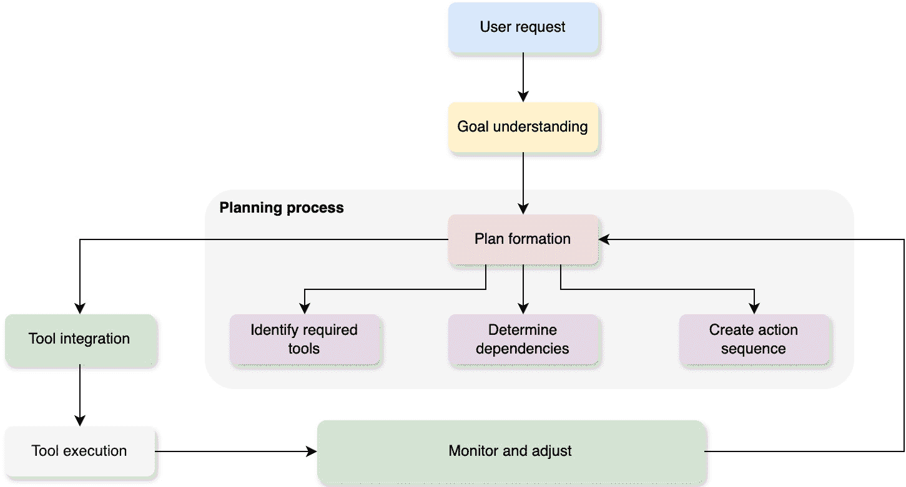

# 第五章：在智能体中启用工具使用和规划

在上一章中，我们探讨了智能体中反思和内省的复杂概念。这些能力使智能体能够对自己的认知过程进行推理，从经验中学习，并动态地修改它们的行为。

智能体的一大进步来自于结合智能体规划和工具使用的方法。本章将探讨工具如何工作，不同的规划算法，它们如何相互配合，以及实际例子展示了它们在实际中的有用性。我们将探讨智能体通过扩展其能力超越决策和问题解决来使用工具的概念。我们将研究智能体可以利用的不同类型的工具，例如 API、数据库和软件功能。然后我们将深入研究对智能体至关重要的规划算法，包括状态空间搜索、强化学习和分层任务网络规划。我们将讨论通过推理可用工具、根据目标评估其适用性、选择适当的工具以及生成利用这些工具的有效动作序列来整合工具使用和规划。

本章分为以下主要部分：

+   理解智能体工具使用概念

+   智能体规划算法

+   整合工具使用和规划

+   探索实际实现

在本章结束时，你将了解工具是什么，它们如何被用来为你的智能体系统提供动力，以及它们如何与规划算法协同工作。

# 技术要求

你可以在 GitHub 上找到本章的代码文件，链接为[`github.com/PacktPublishing/Building-Agentic-AI-Systems`](https://github.com/PacktPublishing/Building-Agentic-AI-Systems)。在本章中，我们还将使用智能体 Python 框架，如 CrewAI、AutoGen 和 LangChain，来展示 AI 智能体的各个方面。

# 理解智能体工具使用概念

在其核心，智能体使用工具指的是 LLM 智能体利用外部资源或工具来增强智能体的固有功能性和决策过程的 capability。这个概念超越了传统智能体作为一个自包含（隔离）实体的概念，它仅依赖于其内部知识（训练数据）和算法。相反，它承认智能体通过战略性地利用外部工具和系统的力量来超越其内在限制的潜力。

例如，当你向隔离状态下的代理发送查询（“*天气怎么样？*”）时，模型可以自由地给出任何虚构的答案，或者它可能回答它不知道如何找到天气。在这种情况下，代理将依赖于 LLM 的训练数据，这些数据将不会有关于实时天气数据的最新信息。另一方面，如果 LLM 代理能够访问实时天气查找工具，它可能能够准确地回答问题。工具使用使代理能够访问实时数据，执行专业任务，并管理超出其内置知识和算法的复杂工作流程。*图 5.1* 显示了这种隔离状态与工具驱动行为的对比：


图 5.1 – 代理在隔离状态下的行为与使用工具时的行为

工具使用的重要性在于其能够拓宽代理（以及，反过来，驱动代理的 LLM）的能力范围，使其能够应对复杂、现实世界的挑战，这些挑战可能超出了其原生问题解决能力。通过整合和协调使用各种工具，代理可以有效地卸载特定任务或访问补充数据和功能，从而提高其整体性能并扩大其可达成目标的范围。在我们深入工具的细节之前，让我们首先了解 LLM 工具调用是如何工作的。

## 工具和函数调用

虽然*工具调用*和*函数调用*在 LLM 的上下文中经常被互换使用，但它们有明显的技术差异。**函数调用**指的是 LLM 生成结构化调用同一运行时内的预定义函数，通常执行内部任务，如数据库查询或计算。另一方面，**工具调用**使 LLM 能够与外部 API、服务或系统交互，允许它们访问实时数据并执行超出其固有能力的专业任务。例如，使用函数调用的 LLM 可能会从本地数据库检索用户的配置文件，而工具调用则可能涉及查询天气 API 以获取实时更新。理解这种区别对于设计能够无缝整合内部逻辑与外部系统以增强功能的 AI 代理至关重要。

当一个 LLM 调用一个工具或函数时，它实际上并没有执行任何代码。相反，它生成一个结构化响应，表明以下内容：

+   它想使用哪个工具/函数

+   应该传递给该工具/函数哪些参数

+   这些参数应该如何格式化

想象一下，这就像编写详细的指令而不是执行动作本身。LLM 充当一个复杂的调度器，确定需要做什么以及如何做，但工具或函数的实际执行必须由外部运行环境或 *代理控制器* 处理。例如，当询问波士顿的天气时，LLM 可能会识别出需要天气查找函数，并以如下结构化的调用进行响应：

```py
{
    "function": "weather_lookup",
    "parameters": {
        "location": "Boston",
        "date": "10/01/2024"
    }
}
```

此结构化响应随后被代理控制器解释并执行，该控制器实际上具有运行指定函数并提供参数的能力。**weather_lookup** 工具（或函数）可能看起来像这样：

```py
1 import requests
2
3 def weather_lookup(location: str, date: str) -> dict:
4    """A function to lookup weather data that takes location and date
     as input"""
5    API_KEY = "api_key"
6    base_url = "<api URL>"
7
8    params = {
9        "q": location,
10        "appid": API_KEY,
11       "units": "imperial"  # For Fahrenheit
12  }
13  response = requests.get(base_url, params=params)
14  if response.status_code == 200:
15      data = response.json()
16      return data
```

至少，LLM 代理需要工具的功能描述以及它期望的输入。您还可以指定哪些参数（在这种情况下，**location** 和 **date**）是必需的，哪些是可选的。*图 5* *.2* 展示了 LLM 代理、工具和代理控制器之间的流程：


图 5.2 – LLM 代理工具调用和代理控制器执行工具

值得注意的是，并非所有 LLM 都能够或高效（或更准确地说，准确）地调用工具/函数。虽然较大的模型在工具调用方面更有能力，但一些较大的模型（如 OpenAI 的 GPT-4 和 -4o、Anthropic 的 Claude Sonnet、Haiku、Opus 以及 Meta 的 Llama 3 模型）是专门为工具调用行为进行训练的。而其他模型虽然没有专门针对工具调用进行训练，但它们可能仍然能够通过积极的提示工程实现类似的功能，但成功率各不相同。

## 为代理定义工具

工具通过清晰的描述来定义，通常使用文档字符串或 JSON 模式，以将目的、所需输入和预期输出传达给代理。根据是否使用框架或直接与 LLM API 交互，定义工具主要有两种方法。

### 框架方法 - 使用文档字符串

在如 CrewAI 或 LangGraph 这样的框架中，工具是通过文档字符串定义的 - 出现在函数开头处的描述性文本。以下是一个天气查找工具的示例：

```py
1 def weather_lookup(location: str, date: str = None):
2     """
3     A tool that can lookup real-time weather data.
4     Arguments:
5       location (str): The location to lookup weather for
6       date (str) Optional: The date in MM/DD/YYYY format
7     """
8    # function code and logic
```

三重引号（**"""**）内的文档字符串提供了关于以下内容的 crucial 信息：

+   工具的目的

+   必需和可选参数

+   预期返回值

这种方法使开发者创建工具变得直观，因为它使用了标准的编程实践。虽然 Python 使用三重引号来表示文档字符串，但其他编程语言可能有不同的约定来定义此类文档。

### 直接 LLM 集成

当在没有框架的情况下直接与 LLM API（如 Anthropic 的 Claude 或 OpenAI 的 GPT）交互时，必须使用特定的 JSON 模式格式来定义工具：

```py
{
  "name": "weather_lookup",
  "description": "A tool that can lookup real-time weather data",
  "input_schema": {
     "type": "object",
     "properties": {
        "location": {
          "type": "string",
          "description": "The city and state, e.g. San Francisco, CA"
         }
       },
       "required": ["location"]
   }
 }
```

可以使用多个工具作为调用模型时工具定义的 JSON 模式对象的列表（或数组），例如以下所示：

```py
tools = [
 { "name": "weather_lookup",
   "description": "A tool that can check weather data",
   … },
 {
  "name": "flight_booking",
  "description": "A tool that can book flights",
   … },
 …
]
```

注意，这取决于模型，因此您必须参考模型的文档以了解更多关于如何指定工具的信息。如果您的项目使用多个模型，这些模型以不同的方式定义工具，那么定义、管理和维护工具定义可能会变得非常繁琐。这也是为什么越来越多的人倾向于使用如 CrewAI、LangGraph 和 AutoGen 等库或框架的原因，这些库或框架为定义工具提供了一种简化的方式，无论使用的 LLM 是什么。

## 工具类型

LLM 代理可以利用各种类型的工具包来增强其功能并执行复杂任务。以下是主要类别：

+   **应用程序编程接口**（**APIs**）：APIs 是代理访问外部服务和数据的实时主要门户。它们提供与第三方系统交互的标准方法，使代理能够无缝集成到各种服务中。例如，在旅行规划场景中，APIs 允许代理访问天气服务、支付处理系统、导航和地图服务以及航班和酒店预订系统。这种实时连接确保代理可以向用户提供最新信息和服务的。

+   **数据库工具**：数据库工具使代理能够高效地存储、检索和管理结构化（或半结构化）数据。这些工具支持读写操作，允许代理在会话之间维护持久信息。代理通常使用数据库来存储客户资料和偏好、维护历史交易记录、管理产品目录和访问特定领域的知识库。这种持久存储能力使代理能够从过去的交互中学习并提供个性化服务。

+   **实用函数**：实用函数是为在代理环境中本地运行的特定任务而设计的定制软件组件。这些函数处理基本操作，如数据处理和分析、格式转换、数学计算和自然语言处理任务。它们是更复杂操作的基础，并帮助代理高效地处理信息。实用函数对于需要一致、可重复操作的任务尤其有价值。

+   **集成工具**：集成工具专门用于连接不同的系统和服务，实现无缝的工作流程自动化。这些工具处理关键任务，如日历同步、文档处理、文件管理和通信系统集成。它们作为不同平台和服务之间的桥梁，允许代理编排跨越多个系统和数据源的复杂工作流程。

+   **硬件接口工具**：硬件接口工具使代理能够与物理设备和系统交互，架起数字世界和物理世界之间的桥梁。这些工具对于控制物联网设备、与机器人系统集成、处理传感器数据和管理物理自动化系统至关重要。通过硬件接口工具，代理可以将其影响力扩展到数字交互之外，影响现实世界的变化并监控物理环境。

每种工具类型都有其特定的用途，可以组合使用以创建强大的代理能力。工具的选择取决于代理的角色、需求以及它需要执行的任务的复杂性。

理解代理如何使用这些工具涉及以下几个关键考虑因素，这些因素影响其有效性和可靠性。这些方面对于开发能够处理复杂现实世界任务、同时保持安全性、优雅处理错误和适应变化需求的强大代理系统至关重要：

+   **工具组合和链式操作**：代理经常需要组合多个工具来完成复杂任务。工具组合允许代理通过链式操作创建复杂的流程。例如，一个旅行规划代理可能会首先使用 API 检查航班可用性，然后使用数据库工具检索用户偏好，最后使用实用函数计算最佳行程。这种链式操作能力显著扩展了代理使用工具所能完成的任务范围。

+   **工具选择和决策**：工具使用中最关键的方面之一是代理选择适合特定任务的适当工具的能力。代理必须评估环境、理解需求，并选择最合适的工具或工具组合。这涉及到考虑工具功能、可靠性、性能和成本等因素。代理还必须处理多个工具可以解决同一问题的情况，选择最有效的选项。

+   **错误处理和回退机制**：在使用工具时，代理必须准备好应对潜在的错误，并制定相应的处理策略。这包括检测失败的 API 调用、管理数据库连接问题或处理错误的函数输出。健壮的错误处理通常涉及实现回退机制，当主要方法失败时，代理可以切换到替代工具或方法。

+   **工具状态管理**：许多工具维护状态或需要特定的初始化和清理程序。代理需要有效地管理这些工具状态，确保适当的资源分配和释放。这包括管理数据库连接、维护 API 身份验证令牌和处理各种服务的会话状态。

+   **工具更新和版本控制**：工具随着时间的推移通过新版本和功能而演变。代理需要策略来处理工具更新、版本兼容性和已弃用功能。这可能涉及与工具的多个版本保持兼容、优雅地处理已弃用功能，以及适应新的工具接口。

+   **工具安全和访问控制**：当代理与工具交互时，尤其是访问敏感数据或关键系统时，安全考虑至关重要。这包括管理身份验证凭据、实施适当的授权检查，并确保安全的通信渠道。代理还必须遵守各种工具施加的速率限制和用量配额。

考虑一个用户与我们的 AI 旅行代理有效使用工具的互动的实际例子。

**用户**：“我需要为 2 位成人提供 2024 年 6 月 15 日至 22 日罗马的航班和酒店选项，总预算为 3,000 美元。”

在以下代码片段中，我们将使用 CrewAI 框架演示代理如何在专注于旅行规划的场景中使用工具：

```py
1 class TravelTools:
2   def search_flights(self, ...) 6 -> dict:
     """Basic flight search simulation"""
3    return {
4     "flights": [ {"airline": "Alitalian airlines",
5                   "price": 800, "duration": "9h"}]
6      }
7
8  def check_hotels(self, ...) -> dict:
9      """Basic hotel search simulation"""
10      return {
11          "hotels": [ {"name": "Roma Inn",
12                       "price": 150, "rating": 4.0}]
13      }
14
15 travel_agent = Agent(
16    role='Travel Agent',
17    goal='Find suitable flight and hotel options within
            budget',
18  tools=[TravelTools().search_flights,
19         TravelTools().check_hotels]
20  )
21
22 search_task = Task(
23    description="Find flights and hotels for 2 adults to
                  Rome, June 15-22, budget $3000",
24    agent=travel_agent )
25
26 crew = Crew(agents=[travel_agent], tasks=[search_task])
27 result = crew.kickoff()
```

在这个例子中，我们可以看到几个关键概念的实际应用：

+   **工具定义**：**TravelTools**类实现了针对特定旅行相关任务的专注工具

+   **代理配置**：旅行代理配置了适当的工具和明确的目标

+   **任务规范**：任务使用精确的参数定义，以便代理可以工作

+   **工具集成**：代理无缝集成多个工具（航班和酒店搜索）以完成其任务

+   **执行流程**：CrewAI 框架管理代理及其工具的整体执行和协调

这个简化的实现展示了代理如何在保持操作清晰和目的的同时有效地使用工具。在我们的例子中，**TravelTools**类使用简化的 JSON 响应以提高清晰度。然而，在实际应用中，这些工具将与实际的外部服务交互并处理更复杂的数据。

注意，这是一个相当简单的实现，实际实现将涉及与各种 API、数据库和特定于旅行领域的软件工具的集成。此外，可以采用先进的 AI 规划算法来优化行程构建和活动规划步骤。这种综合的工具使用使 AI 旅行代理能够提供无缝、端到端、的旅行规划体验，远不止于搜索航班和酒店。您可以在 GitHub 仓库中的 Python 笔记本（**Chapter_05.ipynb**）中找到完整的代码。

## 工具在代理系统中的重要性

向工具使用的范式转变是由对许多复杂问题需要各种专业工具和资源的认识所驱动的，每个都贡献了独特的能力集。而不是试图在代理本身中封装所有必需的知识和功能，一个更有效和可扩展的方法是智能地根据需要利用适当的工具。

例如，一个被分配提供个性化医疗建议的代理可以利用诸如医疗数据库、临床决策支持系统和高级诊断算法等工具。通过明智地将这些外部资源与其自身的推理能力相结合，代理可以提供更准确、更全面的指导，针对个别患者的档案和状况进行定制。

智能代理使用工具的概念并不仅限于基于软件的工具。在某些领域，例如机器人和自动化，代理可能需要与物理工具、机械或专用设备互动，以将它们的能力扩展到物理领域。例如，在制造工厂中的机器人代理可以利用各种工具和机械来完成复杂的组装任务、质量检查或物料处理操作。

最终，有效利用外部工具和资源的能力是真正智能代理的标志，它们能够在动态、复杂的环境中适应和繁荣。通过超越其原生能力的限制，这些代理可以不断进化，利用各种工具和系统的集体力量来实现雄心勃勃的目标。

另一个很好的例子是虚拟旅行代理，它具有访问多个 API、数据库和软件工具的能力，为用户规划并预订完整的旅行行程。这样的旅行代理可以利用来自航空公司、酒店、租车公司和旅行评论网站的 API，收集有关航班时刻表、可用性、定价和客户评价的实时数据。它还可以访问有关旅行警告、旅行文件要求和目的地信息的数据库。通过整合并推理来自各种工具的所有这些数据，代理可以提供个性化的建议，做出明智的权衡，并无缝预订和协调所有符合用户偏好和限制的旅行方面。当然，在这种情况下使用的工具集是多样化的，并且它们都以独特的方式运行。

我们已经探讨了工具是什么以及它们是如何工作的。接下来，我们将探讨代理系统的一个关键方面——规划——以及一些规划算法。

# 代理的规划算法

规划是智能代理的基本能力，使他们能够对其行为进行推理并制定有效实现目标的策略。规划算法构成了 LLM 代理确定和排序其行动的基础。算法是一系列旨在解决特定问题或完成任务的步骤或规则。它是一系列明确且有限的步骤，在有限的时间内接受输入并产生预期的输出。

人工智能中有几种规划算法，每种都有自己的优势和途径。然而，当与 LLM 代理一起工作时，我们需要考虑它们在处理自然语言、不确定性和大状态空间（代理在其任务期间可能遇到的所有可能情况或配置）方面的实用性。例如，在简单的机器人导航任务中，状态空间可能包括所有可能的位置和方向，但在 LLM 代理中，状态空间变得极其复杂，因为它们包括所有可能的对话状态、知识背景和潜在响应。

在已知的规划算法中——**斯坦福研究学院问题求解器**（**STRIPS**）、**分层任务网络**（**HTN**）、**A*规划**、**蒙特卡洛树搜索**（**MCTS**）、**GraphPlan**、**快速前进**（**FF**）和**基于 LLM 的规划**——可以根据它们对 LLM 代理的实用性进行分类。

STRIPS、A*规划、GraphPlan 和 MCTS 虽然在传统人工智能中功能强大，但由于其僵化的结构和处理自然语言的困难，对于 LLM 代理来说不太实用。FF 显示出一定的潜力，但需要重大的调整。最实用的方法是基于 LLM 的规划和 HTN，因为它们与语言模型处理和分解任务的方式自然一致。让我们详细讨论它们。

## 较不实用的规划算法

如前所述，较不实用的规划算法包括 STRIPS、A*规划、GraphPlan 和 MCTS。以下是详细概述。

### STRIPS

**STRIPS** 使用由逻辑谓词定义的状态和动作，使其对清晰的二元条件有效。然而，它不适合 LLM 代理，因为自然语言交互无法有效地简化为简单的**真**/**假**条件。例如，虽然 STRIPS 可以轻松地模拟**真**/**假**状态，但它难以处理细微的语言状态，如*部分理解一个概念*或*对响应有些满意*，这使得它在基于语言规划方面过于僵化。

### A*规划

**A*规划**虽然对于路径查找问题非常强大，但在 LLM 智能体面前面临根本性的挑战。该算法需要一种明确的方式来计算采取行动的成本以及到达目标剩余成本的启发式估计。在基于语言的交互中，定义这些成本变得非常困难——如何量化不同对话状态之间的“距离”或估计达到特定理解的成本？这些数学要求使得 A*在自然语言规划中不切实际。

### GraphPlan

**GraphPlan**构建了一个表示每个时间步可能行动及其效果的分层图结构。当应用于 LLM 智能体时，这种方法因为语言交互不适合整齐地分为具有明确因果关系离散层而失效。可能的语言状态组合爆炸和确定不同对话行动之间互斥关系的困难使得 GraphPlan 在基于语言的规划中计算上不可行。

### MCTS

对于 LLM 智能体来说，**MCTS**由于两个主要原因变得不切实际。首先，每一次“模拟”都需要实际的 LLM 调用，这在计算和成本上变得过于昂贵；其次，可能的语言交互空间巨大，随机采样对于寻找有意义的模式或策略效率低下。该算法在游戏场景中的优势在开放式的语言交互中变成了弱点。

## 适度实用的规划算法——FF

**FF**规划被认为是一种适度实用的规划算法，可以用于 LLM 智能体。它使用启发式搜索和简化版的规划问题来引导搜索。它对目标导向规划的关注可以适应 LLM 智能体，尽管它需要修改以有效地处理自然语言。FF 规划使用启发式搜索和简化版的规划问题来引导搜索。

对于 LLM 智能体来说，FF 规划提供了几个令人信服的优势，使其值得考虑。其以目标为导向的方法自然地与 LLM 处理任务完成的方式相一致，同时其宽松的规划机制为复杂语言任务提供了有用的近似。启发式指导有助于管理基于语言规划的固有庞大搜索空间，其灵活性允许对部分状态描述进行修改，这在自然语言环境中尤其有价值。

然而，当将 FF 规划应用于 LLM 代理时，也面临着重大的挑战。使 FF 在传统规划中有效的原始数值启发式方法在语言状态中无法顺利转换，并且放宽的计划可能会过度简化语言交互中存在的丰富上下文。在基于语言的规划中，定义清晰的删除效果——动作如何删除或改变会话状态中的哪些方面——也存在相当大的困难。也许最具挑战性的是，基本状态表示需要大量调整才能有效地与自然语言一起工作。在实践中，FF 可以按以下方式为 LLM 代理进行适配：

```py
1 class LLMFastForward:
2    def create_relaxed_plan(self,
3                            current_state: str,
4                            goal: str) -> list:
5     """Create a simplified plan ignoring complexities"""
6     # Use LLM to generate a high-level plan
7     prompt = f"Given current state: {current_state}\nAnd
               goal: {goal}\n"
8     prompt += "Generate a simplified step-by-stepplan"
9        return self.llm.generate_plan(prompt)
10
11   def select_next_action(self, relaxed_plan: list):
12      """Choose next action based on the relaxed plan"""
13      # Implement action selection logic
14      return relaxed_plan[0]  # Simplified selection
```

这段代码展示了 FF 规划对 LLM 代理的简化适配。让我解释其关键组件。**LLMFastForward**类有两个主要方法：

+   **create_relaxed_plan**：此方法将当前状态和目标作为文本字符串，并使用 LLM 生成一个简化计划。想象一下，这是向 LLM 提问：“*鉴于我们现在在哪里，以及我们想去哪里，我们应该采取哪些主要步骤？*”。它忽略了许多复杂性，类似于传统 FF 规划忽略删除效果的方式。

+   **select_next_action**：此方法从放宽计划中选择下一个动作。在这个简化版本中，它只是从计划中取出第一个动作（**relaxed_plan[0]**）。在更复杂的实现中，它将使用额外的逻辑来选择最合适的下一个动作。

从本质上讲，这段代码展示了 FF 规划的核心概念，即使用简化计划来指导决策，如何适应与语言模型一起工作，尽管这显著简化了 FF 规划和 LLM 能力。虽然这种适应显示出潜力，但为 LLM 代理实现 FF 规划需要仔细考虑如何在语言模型环境中表示状态、动作和放宽问题。这使得它在实际应用中具有一定的实用性——可能但需要对其原始形式进行重大修改。

## 大多数实用的规划算法

当涉及到 LLM 代理的规划算法时，两种方法特别有效：基于 LLM 的规划和 HTN 规划。这些算法已被证明特别适合语言模型，因为它们自然地与 LLM 处理信息和处理复杂任务的方式相一致。虽然传统的规划算法往往难以处理自然语言的模糊性和复杂性，但这些方法接受了基于语言规划的流动性和上下文性质。让我们探索这些算法，并了解为什么它们已成为现代 AI 代理框架的首选选择。

### 基于 LLM 的规划

现代方法利用大型语言模型（LLMs）以更灵活和自然的方式生成计划。这种方法可以处理复杂、现实世界的场景，并且比传统的规划算法更好地理解上下文。基于 LLM 的规划基于这样一个原则：语言模型可以理解复杂的目标，生成实现这些目标的适当步骤，并根据不断变化的环境调整这些步骤。与传统规划器需要显式状态表示不同，LLM 规划器使用自然语言描述状态和动作，这使得它们本质上更加灵活和表达性强。让我们通过*图 5.3*来可视化规划过程：


图 5.3 – 基于 LLM 的规划算法流程

让我们通过使用 CrewAI 的实际实现来检验这种规划方法。在这个例子中，我们将创建一个包含两个专业代理的旅行规划系统：一个*旅行规划策略师*，它将旅行请求分解为可管理的步骤，以及一个*旅行研究员*，它验证并找到特定的选项。系统通过协同代理交互处理自然语言旅行请求，并生成全面的旅行计划。以下是实现方式：

```py
1 class TravelPlanner:
2    def __init__(self):
3        self.planner = Agent(
4            role='Travel Planning Strategist',
5            goal='Create comprehensive, personalized travel plans',
6            ... # Other parameters
7        )
8        self.researcher = Agent(
9            role='Travel Researcher',
10           goal='Find and validate travel options and opportunities',
11           ... # Other parameters
12       )
13
14   def create_travel_plan(self, request: str) -> Dict:
15       planning_task = Task(
16           description=f"""
17           Analyze the following travel request and
18           create a detailed plan:
19           {request}
20           Break this down into actionable steps by:
21           1\. Understanding client requirements
22           3\. Specific booking requirements
23           4\. Required validations
24           """, agent=self.planner )
25
26       research_task = Task(
27           description="""
28           Based on the initial plan, research and
29           validate: Flight availability, hotel options,
30           and local transportation
31           """, agent=self.researcher)
32
33       crew = Crew(
34           agents=[self.planner, self.researcher],
35           tasks=[planning_task, research_task],
36           process=Process.sequential )
37       return crew.kickoff(inputs={"request": request})
```

此实现展示了基于 LLM 的规划的关键优势。规划器可以理解复杂的自然语言请求，动态生成适当的步骤，并适应不同类型的旅行规划场景。代理可以协同工作，共享上下文并建立在彼此的输出之上。系统的复杂性来自于其处理细微要求的能力。例如，当用户请求“*一个放松的海滩度假，附带一些文化活动*”时，规划器理解这些抽象概念，并将它们转化为具体的建议。

然而，开发者应该注意某些注意事项。如果未适当约束，基于 LLM 的规划系统有时可能会生成过于乐观或不切实际的计划。除非在实现中明确处理，否则它们可能难以处理高度具体的数值约束或严格的时序要求。与传统的算法相比，基于 LLM 的规划的一个显著优势在于系统的适应性。虽然 STRIPS 或 A*规划需要为每个可能的旅行场景提供显式状态表示，但基于 LLM 的规划可以通过利用其对语言和上下文的理解来处理新情况。这使得它特别适合那些要求通常模糊或不断变化的应用领域。这种规划方法在处理不确定性和部分信息方面也表现出色，这是传统规划器难以处理的。当信息缺失或模糊时，系统可以生成合理的假设，并在其计划中包括应急步骤。

### HTN

**HTN** 规划将复杂任务分解为更简单的子任务，创建一个动作的层次结构。与使用原始动作的 STRIPS 不同，HTN 可以处理抽象任务并将它们分解为更具体的步骤。这使得它特别适合于现实世界的规划问题，其中任务自然分解为子任务。HTN 规划通过将高级任务分解为越来越小的子任务来工作。考虑以下示例代码：

```py
1 def buy_groceries_task():
2    return [
3        ('go_to_store', []),
4        ('select_items', []),
5        ('checkout', []),
6        ('return_home', [])
7    ]
8
9 def select_items_task():
10   return [
11       ('check_list', []),
12       ('find_item', []),
13       ('add_to_cart', [])
14   ]
```

HTN 规划基于任务分解的原则，其中高级任务（复合任务）被分解为更小、更易于管理的子任务，直到达到可以直接执行的原始任务。这种层次结构允许直观地表示问题和高效地找到解决方案。在我们的例子中，**buy_groceries_task** 是一个高级任务，分解为四个子任务。其中这些子任务之一，**select_items**，进一步分解为三个更具体的行为，依此类推。在我们的旅行代理示例中，我们可以使用类似的方法将复杂任务分解为更小的任务。从视觉上看，*图 5.4* 显示了这可能看起来是什么样子：


图 5.4 – HTN 分解

要使用 CrewAI 实现这一点，我们可以使用 CrewAI 的 *分层* 处理，其中任务以 HTN 规划算法中解释的方式分层分解。在 CrewAI 框架中，分层方法需要一个 **管理器** 单元，该单元将负责分解任务并将单个任务 *委派* 给代理。管理器可以是代理，也可以是 LLM 本身。如果管理器是代理，那么您可以控制管理器如何根据工作流程的需求将任务分解为 *n* 级任务。如果管理器是 LLM，那么它将使用 LLM 根据用户的查询生成的任意计划。使用管理器 LLM，您可能能够通过一些提示工程来控制任务分解和委派的方式；然而，它通常不太灵活，适用于更简单的工作流程。以下是为旅行规划器提供的类似 HTN 的工作流程的示例代码：

```py
1 flight_specialist = Agent(
2     role='Flight Planning Specialist',
3     goal='Handle all aspects of flight arrangements',
4     backstory='Expert in airline bookings and flight
                logistics.')
5
6 accommodation_specialist = Agent(
7    role='Accommodation Specialist',
8    goal='Manage all accommodation-related planning',
9    backstory='Expert in hotel and accommodation booking')
10
11 activity_specialist = Agent(
12    role='Vacation Activity Specialist',
13    goal='Manage all activity-related planning',
14    backstory="Expert in recreational activity
                 arrangements.",)
15
16 manager_llm = ChatOpenAI(model="gpt-4o-mini")
17 travel_planning_task = Task(
18    description=f"""
19      Plan a comprehensive flight itinerary based on the
20      following request:
21      {request}
22      The plan should include: Flight arrangements,
23      Accommodation bookings, other relevant travel
24        components
25      """,
26      expected_output="A detailed flight itinerary
        covering all requested aspects.",
27      agent=None) #No agent; the manager will delegate
                    subtasks
28
29 crew = Crew(
30           agents=[self.flight_specialist,
31                   self.accommodation_specialist,
32                   self.activity_specialist],
33           tasks=[travel_planning_task],
34           process=Process.hierarchical,
35           manager_llm=self.manager_llm,)
36      return crew.kickoff()
```

此执行的输出可能看起来如下（输出已缩减以节省空间）：

```py
Final Travel Plan:
Here's the complete travel itinerary for a 5-day trip to Paris from New York for two adults:
---
Travel Itinerary for Paris Trip
From New York (JFK) to Paris (CDG)
Travelers: 2 Adults , Duration: 5 Days
---
1\. Flights:
- Departure Flight: ...
- Total Flight Cost: $2,960
---
2\. Hotel Accommodations:
- Hotel: ...
- Estimated Total = €800.
---
3\. Airport Transfers:
- Option 1: ...
- Option 2: ...
---
4\. Day Trip to Versailles:
- Transportation: Round-trip via RER C train from …
   - Cost: Approximately …
   - Departure Time: 9:00 AM from …
   - Return Time: 5:00 PM from Versailles.
   ...
   - Overall Total for Day Trip: Approximately €364.20.
---
Grand Total Estimated Cost:
- Flights: $2,960
- Accommodation: €800 (with Le Fabe Hotel)
- Airport Transfers: €100 (may vary)
- Day Trip to Versailles: Approximately €364.20
- Convert Total Costs as Necessary to USD.
...
```

注意，在这种情况下，代理系统无法访问外部工具或查找，因此它生成的任何响应都将完全是虚构的和非事实性的。这强调了工具的重要性，我们将在下一节中探讨。目前，前面的例子展示了如何使用框架进行任务分解，并让管理器管理多个代理执行从用户请求分解的简化任务。您可以在 GitHub 仓库中的 Python 笔记本（**Chapter_05.ipynb**）中看到完整的代码。

HTN 规划提供了几个显著的优点，使其特别适用于复杂的规划场景。它自然的问题表示与人类思维模式相呼应，使得理解和维护变得直观。分层方法通过将复杂问题分解为可管理的子任务，从而提高了可扩展性，有效地减少了搜索空间。HTN 的结构在通过任务层次结构编码专家知识方面表现出色，允许在类似问题之间重用模式。此外，它在处理抽象和原始任务方面的灵活性使其能够适应各种规划情况，使规划者能够根据需要在不同抽象级别上工作。

到目前为止，我们已经学习了工具和几种规划算法，但将战略规划与有效工具使用相结合，它们可以使得 LLM 智能体执行更复杂、多步骤的任务。让我们进一步探讨如何在智能体系统中有效地整合工具使用与规划。

# 整合工具使用与规划

在人工智能规划和工具使用方面的大部分早期工作都是独立进行的，分别关注规划算法或工具能力。然而，为了实现真正智能的智能体，需要有效地整合工具使用与规划。正如我们在上一节中已经看到的，我们的旅行规划器为我们提供了一个详细的旅行计划，但没有一个细节是真实的——也就是说，它包含了 LLM 随意编造的信息。为了使我们的系统注入实际的航班、酒店和活动数据，从而使旅行计划建立在事实基础上，我们需要利用工具以及规划算法。本节将讨论如何结合这两个方面来生成相关响应并准确完成任务。

## 工具推理

智能体需要具备对可用的工具进行推理的能力，理解每个工具的功能、能力和局限性，以及它们可以有效地应用的环境和条件。推理过程涉及根据当前目标和目标评估可用的工具，然后选择在给定情况或问题域中可以使用的最合适的工具。

例如，在我们的旅行规划器案例中，智能体将能够访问各种工具，如航班预订 API、酒店预订系统以及活动规划软件。智能体需要推理每个工具的能力，例如哪些工具可以用于预订航班或预订酒店，以及哪些可以提供关于当地景点的信息。

当与 LLM 代理一起工作时，关于工具的推理主要是由语言模型固有的能力处理的。现代 LLM 被训练来理解工具描述、目的和适当的用法上下文。这意味着我们不需要明确编程复杂的推理机制——相反，我们提供清晰的工具描述，让 LLM 决定何时以及如何使用它们。例如，让我们看看我们的旅行规划代理场景：

```py
1 from crewai import Agent
2
3 travel_agent = Agent(
4   role='Travel Planner',
5   goal='Plan comprehensive travel itineraries',
6   tools=[
7       flight_search_tool,    # Tool for finding and booking flights
8       hotel_booking_tool,    # Tool for hotel reservations
9       activity_planner_tool  # Tool for local activities and
                                 attractions
10    ])
```

LLM 代理可以自然理解以下内容：

+   每项任务使用哪个工具（例如，**flight_search_tool** 用于航空旅行）

+   何时组合使用工具（例如，协调航班和酒店日期）

+   如何根据用户需求（例如，预算限制）调整工具使用

这种内置的推理能力意味着我们可以专注于提供定义明确的工具和清晰的描述，而不是实现复杂的推理机制。LLM 将根据每个情境的上下文和要求处理工具选择和应用的决策过程。然而，并非所有语言模型都同样擅长有效的工具推理。这种能力通常需要经过专门训练或微调以用于工具使用和功能调用的模型。较小的模型或未进行工具使用训练的模型可能存在以下问题：

+   未能理解何时需要使用工具

+   对工具能力做出错误的假设

+   错误地使用工具的顺序

+   错过使用可用工具的机会

+   忽略工具约束或要求

即使是能力较强的模型也可能面临以下限制：

+   复杂工具组合的步骤繁多带来的困难

+   在类似场景中工具选择的矛盾性

+   功能上有细微差别的工具带来的挑战

+   工具失效时的错误恢复问题

这也是为什么 CrewAI、LangGraph 和 AutoGen 等框架通常与具有强大工具推理能力的更高级模型配合得最好，以及为什么在部署前测试代理的工具使用模式很重要。

## 工具使用的规划

现代人工智能代理的规划过程从根本上是由大型语言模型（LLM）的能力驱动的，这些能力基于我们在基于 LLM 的规划和 HTN 方法中讨论的原则。代理不是遵循严格的规划算法，而是利用其语言模型的理解来创建灵活的、上下文感知的工具使用计划。*图 5.5* 描述了这一过程：



图 5.5 – 工具规划流程

当代理收到请求时，它首先通过自然语言处理理解目标。对于一个旅行代理来说，这可能意味着理解家庭度假请求不仅需要航班预订，还需要适合家庭的住宿和活动。这一目标理解阶段直接来源于 LLM 的训练理解能力。

然后，规划过程转向确定所需的工具及其使用顺序。这类似于我们在 HTN 规划中看到的分层分解，但具有基于 LLM 决策的灵活性。代理不仅遵循预定义的分解规则，而且根据每个请求的具体情境和要求调整其规划。

工具集成到计划中是作为此过程自然发生的一部分。代理通过其描述了解工具的能力，并可以适当地对它们进行排序。例如，在规划假期时，代理知道在预订酒店之前需要确认航班日期，并且活动规划应考虑地点和时间。

这种规划方法结合了传统规划算法的结构化特性与语言模型的可适应性。代理可以根据新信息或变化的情况调整其计划，就像一个旅行代理根据客户反馈或可用性变化修改其方法一样。

此规划过程的成功在很大程度上依赖于 LLM 理解情境并生成适当动作序列的能力。这就是为什么 CrewAI 等框架通常实现此类规划，允许代理利用其语言理解能力，同时保持完成复杂任务所需的系统方法。

# 探索实际实施

为了展示如何使用各种 AI/ML 框架创建能够通过工具使用和规划执行复杂任务的智能代理，让我们通过使用 CrewAI、AutoGen 和 LangGraph（LangChain 的代理框架）的示例来探索。您可以在 GitHub 仓库中找到每个框架示例的完整代码，位于**Chapter_05.ipynb** Python 笔记本中。

## CrewAI 示例

让我们通过一个实际的旅行规划示例来考察 CrewAI 如何通过工具推理实现。该框架的 Python 库提供了一个**@tool**装饰器，允许我们定义具有清晰描述和文档的工具。以下是我们可以创建一组与旅行相关的工具的方法：

```py
1 @tool("Search for available flights between cities")
2 def search_flights(...) -> dict:
3    """Search for available flights between cities."""
4    # Call flight API and other tool logic
5
6 @tool("Find available hotels in a location")
7 def find_hotels(...) -> dict:
8   """Search for available hotels in a location."""
9   # Call hotels API and other tool logic
10
11 @tool("Find available activities in a location")
12 def find_activities(...) -> dict:
13   """Find available activities in a location."""
14  # Call activities API and other tool logic
```

工具随后被分配给一个理解如何在特定情境中使用它们的代理。代理被创建时具有特定的角色、目标和背景故事，这些有助于指导其决策过程：

```py
1 Agent(
2    role='An expert travel concierge',
3    goal='Handle all aspects of travel planning',
4    backstory="Expert in airline bookings and flight
          logistics, hotel bookings, and booking vacation
          activities.",
5    tools=[search_flights, find_hotels, find_activities],
6    verbose=False
7 )
```

当分配任务时，代理根据情境和要求使用这些工具：

```py
1 travel_planning_task = Task(
2    description=f"""
3    Plan a comprehensive travel and leisure itinerary
4    based on the following request:
5    {request}
6    The plan should include:
7    - Flight arrangements
8    - Accommodation bookings
9    - Any other relevant travel components
10   """,
11   expected_output="A detailed travel itinerary covering
         all requested aspects.",
12   agent=self.travel_specialist )
```

当调用**crew.kickoff()**时，CrewAI 以以下方式协调工具的使用：

+   通过任务描述理解任务要求

+   根据代理的角色和任务目标确定所需的工具

+   使用逻辑顺序的工具构建旅行计划

+   处理工具输出并将它们纳入最终响应

此实现展示了 CrewAI 如何结合工具定义、代理能力和任务规范来创建一个连贯的规划系统。该框架处理工具推理的复杂性，同时允许开发者专注于定义清晰的工具接口和代理行为。

## AutoGen 示例

AutoGen 提供了一个平台，用于开发能够参与对话并通过对这些交互的 AI 代理，为给定任务找到解决方案。AutoGen 通过循环轮询群聊系统来处理多代理协作，其中专业代理互动以创建全面的旅行计划。该实现定义了四个关键代理：一个航班规划者、一个酒店规划者、一个活动规划者和一个总结代理，每个代理都有特定的职责和工具。

每个代理初始化时具有以下内容：

+   一个名称和描述

+   一个模型客户端（在这种情况下，OpenAI 的 GPT-4o-mini）

+   他们可以访问的特定工具

+   定义他们角色和职责的系统消息

与 CrewAI 的关键区别在于执行模型：

+   **代理通信**：虽然 CrewAI 使用基于任务的分层方法，但 AutoGen 实现了一个循环轮询群聊，其中代理轮流贡献解决方案。**RoundRobinGroupChat**类协调这种对话流程，允许代理基于彼此的建议进行构建。

+   **终止处理**：AutoGen 通过**TextMentionTermination**类使用显式的终止条件。当完成完整的计划时，旅行总结代理可以通过提及**"TERMINATE"**来结束对话。这与 CrewAI 基于任务完成的终止不同。以下是**TextMentionTermination**的参数：

    +   **mention_text(str)**：触发终止的关键词或短语（例如，**"TERMINATE"**）

    +   **case_sensitive (bool, optional)**：关键词匹配是否应区分大小写

    +   **strip_whitespace (bool, optional)**：是否忽略检测到的文本中的前导/尾随空格

    +   **regex_match (bool, optional)**：允许使用正则表达式进行更灵活的终止触发

+   **工具集成**：与 CrewAI 基于装饰器的工具定义不同，AutoGen 在初始化期间直接将工具与代理关联。每个代理都可以访问与其角色相关的特定工具。

+   **协调模式**：虽然 CrewAI 经常使用管理者-工人模式，但 AutoGen 的循环轮询方法创造了一个更具协作性的环境，其中代理平等地贡献于解决方案，总结代理负责创建最终的综合计划。

此实现展示了 AutoGen 在处理复杂的多代理对话的同时，保持清晰的职责分离和每个代理的专业工具使用的优势。以下是如何使用 AutoGen 定义代理：

```py
1 flight_agent = AssistantAgent(
2    name="flight_planner",
3    model_client=model_client,
4    tools=[travel_tools.search_flights],
5    description="A helpful assistant that can plan flights
                 itinerary for vacation trips.",
6    system_message="You are a helpful assistant that can
           plan flight itinerary for a travel plan for a
           user based on their request." )
7
8 hotel_agent = AssistantAgent(
9    name="hotel_planner",
10    model_client=model_client,
11    tools=[travel_tools.search_flights],
12    description="...", system_message="..." )
```

一旦定义了代理，就可以使用代理和与多代理系统的对话来定义**RoundRobinGroupChat**类：

```py
2 group_chat = RoundRobinGroupChat(
3     [flight_agent, hotel_agent],
4     termination_condition=termination)
6  await Console(group_chat.run_stream(task="I need to plan
               a trip to Paris from New York for 5 days."))
```

## LangGraph 示例

LangChain 提供了一个框架，用于开发能够利用 LLMs（大型语言模型）以及其他工具和数据源的应用程序。在代理系统的背景下，LangChain 提供了一个名为 LangGraph 的子框架，用于构建基于 LLM 的强大工作流程。LangGraph 通过工作流程图系统来处理基于代理的旅行规划，提供了与 CrewAI 和 AutoGen 不同的范式。让我们来探讨这种实现的工作原理及其独特的特点。

LangGraph 采用状态机方法，其中工作流程被定义为具有节点和边的图。实现主要集中在两个主要节点上：

+   一个处理消息并做出决策的代理节点

+   执行请求的工具（航班搜索、酒店预订和活动规划）的工具节点

工作流程遵循一个循环，其中代理节点评估当前状态，并决定是调用工具还是提供最终响应。这是通过一个解释模型下一步动作（即调用工具或结束响应）的函数来控制的，该函数确定是否路由到工具节点或结束对话。就像 CrewAI 一样，LangGraph 也使用（Python 中的）**@tool**装饰器，通过它可以定义工具函数：

```py
1 @tool
2 def search_flights(...) -> dict:
3    """Search for available flights between cities."""
4   # Emulate JSON data from an API
5   return data
```

一旦定义了带有或没有工具的节点，它们就可以相互连接，构建工作流程的完整图结构。例如，在我们的案例中，以下代码使用 LangGraph 定义了一个基于状态图的流程，其中任务在代理节点和工具节点之间循环：代理节点调用一个函数（**call_model**）来处理输入。代理运行后，一个条件函数（**should_continue**）确定下一个节点——要么循环回工具节点，要么结束工作流程。工具节点（**tool_node**）处理中间任务，并始终过渡回**代理**节点，创建一个重复循环，直到条件函数决定停止。使用**MemorySaver**检查点来持久化状态，并将图编译成 LangChain 兼容的可运行版本。最后，使用关于规划旅行的初始输入消息调用工作流程，并在图执行结束后打印最终消息内容：

```py
1 workflow = StateGraph(MessagesState)
2 workflow.add_node("agent", call_model)
3 workflow.add_node("tools", tool_node)
4 workflow.add_edge(START, "agent")
5 workflow.add_conditional_edges("agent",should_continue)
6 workflow.add_edge("tools", 'agent')
7 checkpointer = MemorySaver()
8 app = workflow.compile(checkpointer=checkpointer)
9 final_state = app.invoke(
10   {"messages": [HumanMessage(content="I need to plan a
               trip to Paris from New York for 5 days")]},
11    config={"configurable": {"thread_id": 42}})
```

LangGraph 的方法提供了几个显著的优点。例如，其图结构提供了明确的流程控制，使得工作流程易于可视化和理解，而内置的状态管理以及检查点功能确保了对应用程序状态的稳健处理。然而，这些好处也伴随着某些权衡。该框架需要深入了解基于图编程的概念，并且其初始设置比 CrewAI 更直接的代理定义涉及更多的开销。完整的代码实现可以在 GitHub 仓库中的**Chapter_05.ipynb** Python 笔记本中找到。

*表 5.1* 展示了 LangGraph、CrewAI 和 AutoGen 之间的一些关键差异：

|  | **LangGraph** | **CrewAI** | **AutoGen** |
| --- | --- | --- | --- |
| 状态管理 | 使用显式状态管理 | 通过代理实例及其任务上下文管理状态 | 通过群聊消息历史记录处理状态 |
| 工具集成 | 通过专用工具节点管理工具 | 使用基于装饰器的工具定义，直接关联代理 | 将工具直接关联到特定代理 |
| 流程控制 | 使用基于图的流程控制 | 使用分层任务分解或顺序流程 | 实现代理之间的循环轮询轮流 |

表 5.1 – LangGraph、CrewAI 和 AutoGen 实现方法的比较

前面的表格展示了 LangGraph、CrewAI 和 AutoGen 在我们的实现中的差异。

# 摘要

在本章中，我们学习了工具和规划在 AI 代理系统中的关键作用。我们讨论了工具/函数调用的概念以及 LLM 代理如何表现出这种特性。我们还了解了各种工具类型，并看到了如何使用框架或原生方式与 LLM 一起使用工具的示例。随后，我们探讨了各种规划算法，从传统的 STRIPS 和 HTN 到现代基于 LLM 的规划方法，理解了它们在语言模型背景下的相对实用性。通过一个实际的旅行规划示例，我们看到了如何在每个框架中定义、集成和使用工具，以创建复杂的规划系统。

我们了解到，通过将工具调用与规划集成，可以极大地增强代理系统，使它们能够更好地处理复杂任务。我们还回顾了三个框架（CrewAI、AutoGen 和 LangGraph）中的实现模式，揭示了代理协调和工具使用的不同方法。

在下一章中，我们将深入探讨代理系统中协调者、工作者和委托者方法的概念，并了解它们如何帮助完成复杂的现实世界任务。

# 问题

1.  AI 代理中工具的目的是什么，文档字符串如何帮助工具定义？

1.  解释传统规划算法（如 STRIPS）与现代基于 LLM 的规划之间的区别。为什么传统算法对 LLM 代理来说不太实用？

1.  HTN 规划是如何工作的，为什么它被认为是 LLM 代理更实用的方法之一？

1.  在工具选择中，推理在 LLM 代理中扮演什么角色，它有什么局限性？

1.  当比较框架（CrewAI、AutoGen 和 LangGraph）时，对于 AI 代理实现，需要考虑哪些关键因素？

# 答案

1.  AI 代理中的工具是使代理能够执行特定任务或访问外部服务的功能。文档字符串提供了关于工具目的、预期参数和返回值的关键信息，帮助大型语言模型理解何时以及如何有效地使用每个工具。本文档作为指导模型决策过程的背景。

1.  传统的规划算法，如 STRIPS，依赖于显式的状态表示和预定义的动作集，使用二元条件和清晰的状态转换。然而，基于 LLM 的规划操作使用自然语言理解，可以处理模糊的状态和动作。传统算法在 LLM 上遇到困难，因为它们无法有效地表示基于语言的任务的细微和情境性质。

1.  HTN 规划通过将复杂任务分解为层次结构中的逐步更简单的子任务来工作。它对 LLM 代理来说是实用的，因为这种层次分解反映了语言模型自然处理和理解任务的方式。这种方法允许进行结构化规划，同时也提供了基于语言交互所需的灵活性。

1.  在 LLM 代理中的推理主要是由模型内置的能力来理解和做出决策。虽然这使得工具选择更加自然，但并非所有模型都同样具备这种能力。局限性包括工具选择可能存在的不一致性、复杂工具组合的困难以及在工具失败时的错误恢复挑战。

1.  选择框架的关键因素包括工作流程的复杂性（结构化与对话式）、状态管理的需求、多代理协作要求以及开发复杂性。CrewAI 提供了直接的实现，AutoGen 在多代理交互方面表现出色，而 LangGraph 提供了强大的工作流程控制，但需要更多的设置。

# 加入我们的 Discord 和 Reddit 社区

对本书有任何疑问或想参与关于生成式 AI 和 LLM 的讨论？加入我们的 Discord 服务器[`packt.link/I1tSU`](https://packt.link/I1tSU)和 Reddit 频道[`packt.link/ugMW0`](https://packt.link/ugMW0)，与志同道合的爱好者建立联系、分享和协作。


