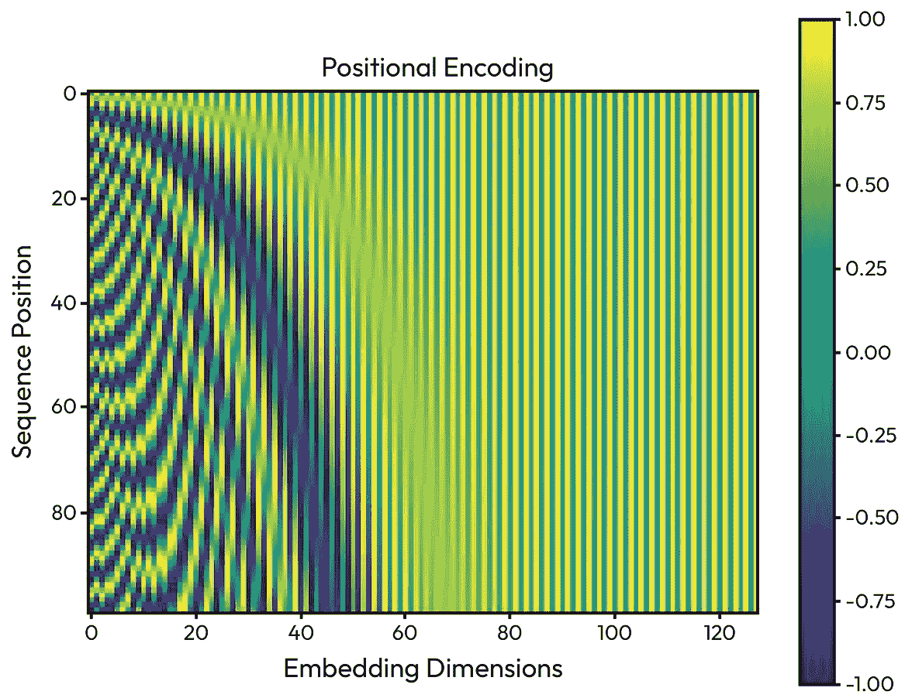
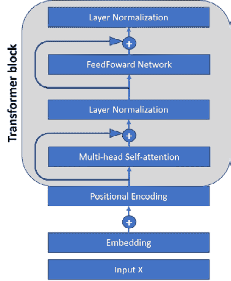

# 第二章：Transformer：现代人工智能革命的模型背后的秘密

在本章中，我们将讨论上一章中看到的模型的局限性，以及如何通过新的范式（首先是注意力机制，然后是 transformer）来解决这些局限性。这将使我们能够理解这些模型是如何训练的，以及为什么它们如此强大。我们将讨论为什么这个范式是成功的，以及为什么它使得解决以前不可能的自然语言处理（NLP）任务成为可能。然后我们将看到这些模型在实际应用中的能力。

本章将阐明为什么当代的 LLM（大型语言模型）本质上基于 transformer 架构。

在本章中，我们将讨论以下主题：

+   探索注意力机制和自注意力

+   介绍 transformer 模型

+   训练一个 transformer

+   探索掩码语言模型

+   可视化内部机制

+   应用 transformer

# 技术要求

大部分代码可以在 CPU 上运行，但某些部分（微调和知识蒸馏）更适宜在 GPU 上运行（在 CPU 上训练一小时与在 GPU 上不到五分钟相比）。

代码是用 PyTorch 编写的，大部分使用标准库（PyTorch、Hugging Face Transformers 等），尽管一些片段来自 Ecco，一个特定的库。代码可以在 GitHub 上找到：[`github.com/PacktPublishing/Modern-AI-Agents/tree/main/chr2`](https://github.com/PacktPublishing/Modern-AI-Agents/tree/main/chr2)

# 探索注意力机制和自注意力

在 20 世纪 50 年代，随着计算机革命的开始，政府开始对机器翻译的想法产生兴趣，尤其是军事应用方面。这些尝试都以失败告终，主要原因有三个：机器翻译比看起来更复杂，计算能力不足，数据也不足。政府在 20 世纪 60 年代得出结论，这是一个技术上不可能的挑战。

到了 20 世纪 90 年代，三个限制中的两个开始被克服：互联网最终允许有大量的文本，GPU 的出现最终允许计算能力。第三个要求仍然需要满足：一个能够利用新发现的计算能力来处理自然语言复杂性的模型。

机器翻译吸引了研究者的兴趣，因为它是一个易于评估结果的实际问题（我们可以很容易地判断翻译是否好）。此外，我们有一种语言的大量文本和另一种语言的对应文本。因此，研究人员试图将先前模型适应到任务（RNN、LSTM 等）中。最常用的系统是**seq2seq 模型**，其中包含一个**编码器**和一个**解码器**。编码器将序列转换成一种新的简洁表示，应该保留相关信息（一种良好的摘要）。解码器接收这个上下文向量作为输入，并使用它来转换（翻译）这个输入为输出。


图 2.1 – 带有编码器和解码器的 seq2seq 模型。在一种情况下，我们取隐藏状态的平均值（左）；在另一种情况下，我们使用注意力机制来识别哪个隐藏状态对翻译更相关（右）

RNN 及其衍生模型存在一些问题：

+   **对齐**：输入和输出的长度可以不同（例如，将英语翻译成法语“*她不喜欢土豆*”翻译成“*她不喜欢苹果* *土豆*”）。

+   **梯度消失和梯度爆炸**：在训练过程中出现的问题，使得多层无法有效管理。

+   **不可并行性**：训练计算成本高且不可并行。RNN 在几步之后就会忘记。


图 2.2 – 对齐问题的示例：一对一（左）和虚假词（右）

**注意力机制**最初被描述为解决对齐问题，以及学习文本的各个部分与相应翻译文本部分之间的关系。

理念是，我们不是传递 RNN 的隐藏状态，而是传递只关注序列重要部分的上下文信息。在解码（翻译）每个标记时，我们希望检索另一种语言中对应和具体的信息。注意力机制确定在那一刻输入中哪些标记是重要的。

第一步是编码器（`h`）的隐藏状态和前一个解码器输出（`s`）之间的对齐。得分函数可以不同：点积或余弦相似度是最常用的，但也可以是更复杂的函数，例如前馈神经网络层。这一步使我们能够理解在那一刻隐藏状态编码器与翻译的相关性。这一步会对所有编码器步骤进行。

<mrow><mrow><mrow><mfenced close=")" open="("><mn>1</mn></mfenced><msub><mi>e</mi><mrow><mi>i</mi><mo>,</mo><mi>j</mi></mrow></msub><mo>=</mo><mi>s</mi><mi>c</mi><mi>o</mi><mi>r</mi><mi>e</mi><mo>(</mo><msub><mi>s</mi><mrow><mi>i</mi><mo>−</mo><mn>1</mn></mrow></msub><mo>,</mo><msub><mi>h</mi><mi>j</mi></msub><mo>)</mo></mrow></mrow></mrow>

目前，我们有一个表示两个向量（`h` 和 `s`）之间相似度的标量。所有这些分数都传递到 softmax 函数中，该函数将所有值压缩到 0 和 1 之间。这一步也用于为每个隐藏状态分配相对重要性。

<mrow><mrow><mfenced close=")" open="("><mn>2</mn></mfenced><msub><mi>a</mi><mrow><mi>i</mi><mo>,</mo><mi>j</mi></mrow></msub><mo>=</mo><mi>s</mi><mi>o</mi><mi>f</mi><mi>t</mi><mi>m</mi><mi>a</mi><mi>x</mi><mfenced close=")" open="("><msub><mi>e</mi><mrow><mi>i</mi><mo>,</mo><mi>j</mi></mrow></msub></mfenced><mo>=</mo><mfrac><mrow><mi mathvariant="normal">e</mi><mi mathvariant="normal">x</mi><mi mathvariant="normal">p</mi><mo>(</mo><msub><mi>e</mi><mrow><mi>i</mi><mo>,</mo><mi>j</mi></mrow></msub><mo>)</mo></mrow><mrow><msubsup><mo>∑</mo><mrow><mi>k</mi><mo>=</mo><mn>1</mn></mrow><mi>t</mi></msubsup><mrow><mi mathvariant="normal">e</mi><mi mathvariant="normal">x</mi><mi mathvariant="normal">p</mi><mo>(</mo><msub><mi>e</mi><mrow><mi>i</mi><mo>,</mo><mi>k</mi></mrow></msub><mo>)</mo></mrow></mrow></mfrac></mrow></mrow>

最后，我们对各种隐藏状态进行加权求和，乘以注意力分数。因此，我们有一个固定长度的上下文向量，能够提供关于整个隐藏状态集的信息。简单来说，在翻译过程中，我们有一个动态更新的上下文向量，告诉我们应该对输入序列的每个部分给予多少注意力。

<mrow><mrow><mfenced close=")" open="("><mn>3</mn></mfenced><msub><mi>c</mi><mi>t</mi></msub><mo>=</mo><mrow><munderover><mo>∑</mo><mrow><mi>j</mi><mo>=</mo><mn>1</mn></mrow><mi>T</mi></munderover><mrow><msub><mi>a</mi><mrow><mi>i</mi><mo>,</mo><mi>j</mi></mrow></msub><mo>∙</mo><msub><mi>h</mi><mi>j</mi></msub></mrow></mrow></mrow></mrow>

如原文所示，模型在翻译过程中对输入中的不同单词给予不同的注意力。


图 2.3 – 使用注意力训练模型后的句子对齐示例。每个像素显示源词和目标词之间的注意力权重。[`arxiv.org/pdf/1409.0473`](https://arxiv.org/pdf/1409.0473)

除了解决对齐问题外，注意力机制还有其他优点：

+   它减少了梯度消失问题，因为它提供了一个通往早期状态的捷径。

+   它消除了瓶颈问题；编码器可以直接在翻译中访问源。

+   它还提供了可解释性，因为我们知道哪些词用于对齐。

+   它无疑提高了模型的性能。

它的成功催生了几个变体，其中评分函数不同。特别是其中一个变体，称为**自注意力**，具有特别的优势，即它可以直接从输入中提取信息，而不必一定需要与其他东西进行比较。

自注意力的背后洞察是，如果我们想在图书馆（查询）寻找一篇关于法国大革命的论文，我们不需要阅读所有书籍来找到关于法国历史的书籍（值），我们只需要阅读书籍的边缘（键）。换句话说，自注意力是一种允许我们在上下文中搜索以找到所需表示的方法。


图 2.4 – 自注意力机制。包括矩阵维度；数字是任意的

对于模型来说，给定一个输入，我们想要在序列的各种组件（如标记）之间进行一系列比较以获得输出序列（然后我们可以将其用于各种模型或任务）。自注意力方程如下：

<mrow><mrow><mi>A</mi><mi>t</mi><mi>t</mi><mi>e</mi><mi>n</mi><mi>t</mi><mi>i</mi><mi>o</mi><mi>n</mi><mfenced close=")" open="("><mrow><mi>Q</mi><mo>,</mo><mi>K</mi><mo>,</mo><mi>V</mi></mrow></mfenced><mo>=</mo><mi>s</mi><mi>o</mi><mi>f</mi><mi>t</mi><mi>m</mi><mi>a</mi><mi>x</mi><mfenced close=")" open="("><mfrac><mrow><mi>Q</mi><mo>∙</mo><msup><mi>k</mi><mi>T</mi></msup></mrow><msqrt><msub><mi>d</mi><mi>k</mi></msub></msqrt></mfrac></mfenced><mo>∙</mo><mi>V</mi></mrow></mrow>

你可以立即看出，它是从原始注意力公式派生出来的。我们使用点积来进行比较，然后利用`softmax`函数来计算相对重要性和将值归一化到 0 和 1 之间。`D`是序列的大小；换句话说，自注意力也是作为我们序列长度的函数进行归一化的。

下一步是使用`softmax`。这里是对该函数（如何计算以及如何在 Python 中更高效地实现）的一个小复习：

<mrow><mrow><mi>y</mi><mo>=</mo><mfrac><msup><mi>e</mi><msub><mi>x</mi><mi>i</mi></msub></msup><mrow><msubsup><mo>∑</mo><mrow><mi>i</mi><mo>=</mo><mn>1</mn></mrow><mrow><mi>i</mi><mo>=</mo><mi>n</mi></mrow></msubsup><msup><mi>e</mi><msub><mi>x</mi><mi>i</mi></msub></msup></mrow></mfrac></mrow></mrow>

<mrow><mrow><mi>p</mi><mi>y</mi><mi>t</mi><mi>h</mi><mi>o</mi><mi>n</mi><mo>:</mo><mi>y</mi><mo>=</mo><mfenced close="]" open="["><mtable columnalign="center" columnwidth="auto" rowalign="baseline baseline baseline" rowspacing="1.0000ex 1.0000ex"><mtr><mtd><msub><mi>y</mi><mn>1</mn></msub></mtd></mtr><mtr><mtd><msub><mi>y</mi><mn>2</mn></msub></mtd></mtr><mtr><mtd><msub><mi>y</mi><mn>3</mn></msub></mtd></mtr></mtable></mfenced><mo>=</mo><mi>s</mi><mi>o</mi><mi>f</mi><mi>t</mi><mi>m</mi><mi>a</mi><mi>x</mi><mfenced close=")" open="("><mi>x</mi></mfenced><mo>=</mo><mi>f</mi><mfenced close=")" open="("><mfenced close="]" open="["><mtable columnalign="center" columnwidth="auto" rowalign="baseline baseline baseline" rowspacing="1.0000ex 1.0000ex"><mtr><mtd><msub><mi>x</mi><mn>1</mn></msub></mtd></mtr><mtr><mtd><msub><mi>x</mi><mn>2</mn></msub></mtd></mtr><mtr><mtd><msub><mi>x</mi><mn>3</mn></msub></mtd></mtr></mtable></mfenced></mfenced><mo>=</mo><mfrac><mfenced close="]" open=""><mtable columnalign="center center center" columnspacing="0.8000em 0.8000em" columnwidth="auto auto auto" rowalign="baseline"><mtr><mtd><msub><mi>x</mi><mn>1</mn></msub></mtd><mtd><msub><mi>x</mi><mn>2</mn></msub></mtd><mtd><msub><mi>x</mi><mn>3</mn></msub></mtd></mtr></mtable></mfenced><mrow><msup><mi>e</mi><msub><mi>x</mi><mn>1</mn></msub></msup><mo>+</mo><msup><mi>e</mi><msub><mi>x</mi><mn>2</mn></msub></msup><mo>+</mo><msup><mi>e</mi><msub><mi>x</mi><mn>3</mn></msub></msup></mrow></mfrac><mo>=</mo><mfrac><msup><mi>e</mi><mi>x</mi></msup><mrow><mi>s</mi><mi>u</mi><mi>m</mi><mo>(</mo><msup><mi>e</mi><mi>x</mi></msup><mo>)</mo></mrow></mfrac></mrow></mrow>

正如我们在上一章中看到的，随着向量长度的增加，点积可以变得相当宽。这可能导致`softmax`函数中的输入太大（这会将`softmax`中的概率质量转移到几个元素上，从而导致梯度很小）。在原始文章中，他们通过将`D`的平方根进行归一化来解决此问题。

![图 2.5 – 展开的自我注意力图 2.5 – 展开的自我注意力真正的区别在于我们使用三个初始随机初始化的权重矩阵：**查询**（`Q`）、**键**（`K`）和**值**（`V`）。`Q`是当前注意力的焦点，`K`向模型提供关于先前输入的信息，而`V`用于提取最终输入信息。因此，第一步是将这三个矩阵与我们的输入`X`（一个向量数组，其中每个向量代表一个标记）相乘。`<mrow><mrow><mi mathvariant="bold-italic">Q</mi><mo>=</mo><mi mathvariant="bold-italic">X</mi><mo>∙</mo><msup><mi mathvariant="bold-italic">W</mi><mi>Q</mi></msup><mo>,</mo><mi mathvariant="bold-italic">K</mi><mo>=</mo><mi mathvariant="bold-italic">X</mi><mo>∙</mo><msup><mi mathvariant="bold-italic">W</mi><mi>V</mi></msup><mo>,</mo><mi mathvariant="bold-italic">V</mi><mo>=</mo><mi mathvariant="bold-italic">X</mi><mo>∙</mo><msup><mi mathvariant="bold-italic">W</mi><mi>V</mi></msup></mrow></mrow>这个系统的美妙之处在于我们可以用它从相同的输入中提取多个表示（毕竟，教科书里可以有多个问题）。因此，由于操作可以并行化，我们可以有多头注意力。**多头自注意力**使得模型能够同时捕捉输入序列中多种类型的关系。这一点至关重要，因为句子中的一个词在上下文中可能与几个其他词相关。在训练过程中，每个头中的`K`和`Q`矩阵专门用于建模不同类型的关系。每个注意力头根据其特定的视角产生输出，从而为`n`个头生成`n`个输出。然后，这些输出被连接起来，并通过最终的线性投影层恢复到原始输入的大小。

图 2.6 – 多头自注意力

自注意力机制具有几个优点：

+   我们可以为每个输入提取不同的表示。

+   我们可以在 GPU 上并行执行所有这些计算。每个头可以独立计算。

+   我们可以在不必要包含编码器和解码器的模型中使用它。

+   我们不必等待不同时间步来看到远距离词对之间的关系（如在 RNN 中）。

+   然而，它在函数上具有与标记数`N`的二次成本，并且没有固有的顺序概念。

自注意力在计算上很昂贵。可以证明，考虑到序列`T`和序列长度`d`，计算成本和空间是二次的：

`<mrow><mrow><mrow><mi>t</mi><mi>i</mi><mi>m</mi><mi>e</mi><mo>=</mo><mi mathvariant="script">O</mi><mfenced close=")" open="("><mrow><msup><mi>T</mi><mn>2</mn></msup><mo>+</mo><mi>d</mi></mrow></mfenced><mi>s</mi><mi>p</mi><mi>a</mi><mi>c</mi><mi>e</mi><mo>=</mo><mi mathvariant="script">O</mi><mo>(</mo><msup><mi>T</mi><mn>2</mn></msup><mo>+</mo><mi>T</mi><mi>d</mi><mo>)</mo></mrow></mrow></mrow>

他们将点积识别为罪魁祸首。这种计算成本是可扩展性问题之一（考虑到多头注意力在每个块中计算）。因此，已经提出了许多自注意力的变体来降低计算成本。

尽管计算成本较高，但自注意力已经显示出其能力，尤其是在堆叠多层时。在下一节中，我们将讨论这如何使模型尽管计算成本高，但仍然非常强大。

# 介绍 Transformer 模型

尽管有这个决定性的进步，但在机器翻译中仍存在几个问题：

+   模型未能捕捉句子的含义，并且仍然存在错误倾向

+   此外，我们还有初始词汇表中没有的单词的问题

+   代词和其他语法形式中的错误

+   模型未能维持长文本的上下文

+   如果训练集和测试数据中的领域不同（例如，如果它在文学文本上训练，而测试集是金融文本），则不可适应

+   RNN 不可并行化，必须按顺序计算

考虑到这些点，2016 年谷歌研究人员提出了完全消除 RNN 而不是改进它们的想法。根据《注意力即一切》开创性文章的作者；你所需要的是一个基于多头自注意力的模型。在详细说明之前，Transformer 模型完全由堆叠的多头自注意力层组成。通过这种方式，模型学习到文本的分层和越来越复杂的表示。

该过程的第一步是将文本转换为数值向量（分词）。之后，我们有一个嵌入步骤来获取每个标记的向量。Transformer 的一个特殊功能是引入一个函数来记录序列中每个标记的位置（自注意力不是位置感知的）。这个过程被称为**位置编码**。文章中的作者使用正弦和余弦函数交替使用位置。这使得模型能够知道每个标记的相对位置。

<mml:math display="block"><mml:msub><mml:mrow><mml:mi>P</mml:mi><mml:mi>E</mml:mi></mml:mrow><mml:mrow><mml:mfenced separators="|"><mml:mrow><mml:mi>p</mml:mi><mml:mi>o</mml:mi><mml:mi>s</mml:mi><mml:mo>,</mml:mo><mml:mn>2</mml:mn><mml:mi>i</mml:mi></mml:mrow></mml:mfenced></mml:mrow></mml:msub><mml:mo>=</mml:mo><mml:mi mathvariant="normal">s</mml:mi><mml:mi mathvariant="normal">i</mml:mi><mml:mi mathvariant="normal">n</mml:mi><mml:mo>(</mml:mo><mml:mi>p</mml:mi><mml:mi>o</mml:mi><mml:mi>s</mml:mi><mml:mo>/</mml:mo><mml:msup><mml:mrow><mml:mn>1000</mml:mn></mml:mrow><mml:mrow><mml:mn>2</mml:mn><mml:mi>i</mml:mi><mml:mo>/</mml:mo><mml:mi>d</mml:mi></mml:mrow></mml:msup><mml:mo>)</mml:mo></mml:math>

<mml:math display="block"><mml:msub><mml:mrow><mml:mi>P</mml:mi><mml:mi>E</mml:mi></mml:mrow><mml:mrow><mml:mfenced separators="|"><mml:mrow><mml:mi>p</mml:mi><mml:mi>o</mml:mi><mml:mi>s</mml:mi><mml:mo>,</mml:mo><mml:mn>2</mml:mn><mml:mi>i</mml:mi><mml:mo>+</mml:mo><mml:mn>1</mml:mn></mml:mrow></mml:mfenced></mml:mrow></mml:msub><mml:mo>=</mml:mo><mml:mi mathvariant="normal">c</mml:mi><mml:mi mathvariant="normal">o</mml:mi><mml:mi mathvariant="normal">s</mml:mi><mml:mo>(</mml:mo><mml:mi>p</mml:mi><mml:mi>o</mml:mi><mml:mi>s</mml:mi><mml:mo>/</mml:mo><mml:msup><mml:mrow><mml:mn>1000</mml:mn></mml:mrow><mml:mrow><mml:mn>2</mml:mn><mml:mi>i</mml:mi><mml:mo>/</mml:mo><mml:mi>d</mml:mi></mml:mrow></mml:msup><mml:mo>)</mml:mo></mml:math>

在第一步中，嵌入向量与这些函数的结果相加。这是因为自注意力不知道词序，但一个句子中的词序很重要。因此，顺序直接编码在它等待的向量中。注意，然而，这个函数中没有可学习的参数，并且对于长序列，它将需要修改（我们将在下一章讨论这个问题）。



图 2.7 – 位置编码

之后，我们按顺序有一系列变换器模块。**变换器模块**由四个元素组成：多头自注意力、前馈层、残差连接和层归一化。



图 2.8 – 变换器模块的流程图

前馈层由两个线性层组成。这一层用于获取多头自注意力的线性投影。权重对于每个位置都是可识别的，并且是分开的。它可以看作是两个线性变换，中间有一个 ReLU 激活。

<mml:math display="block"><mml:mi>F</mml:mi><mml:mi>F</mml:mi><mml:mi>N</mml:mi><mml:mfenced separators="|"><mml:mrow><mml:mi>x</mml:mi></mml:mrow></mml:mfenced><mml:mo>=</mml:mo><mml:mi mathvariant="normal">m</mml:mi><mml:mi mathvariant="normal">a</mml:mi><mml:mi mathvariant="normal">x</mml:mi><mml:mo>⁡</mml:mo><mml:mo>(</mml:mo><mml:mn>0</mml:mn><mml:mo>,</mml:mo><mml:mi>x</mml:mi><mml:msub><mml:mrow><mml:mi>W</mml:mi></mml:mrow><mml:mrow><mml:mn>1</mml:mn></mml:mrow></mml:msub><mml:mo>+</mml:mo><mml:msub><mml:mrow><mml:mi>b</mml:mi></mml:mrow><mml:mrow><mml:mn>1</mml:mn></mml:mrow></mml:msub><mml:mo>)</mml:mo><mml:msub><mml:mrow><mml:mi>W</mml:mi></mml:mrow><mml:mrow><mml:mn>2</mml:mn></mml:mrow></mml:msub><mml:mo>+</mml:mo><mml:msub><mml:mrow><mml:mi>b</mml:mi></mml:mrow><mml:mrow><mml:mn>2</mml:mn></mml:mrow></mml:msub></mml:math>

这为自注意力添加了一个非线性步骤。选择 FFN 层是因为它是一个易于并行化的操作。

剩余连接是两种层之间传递信息而不经过中间层变换的连接。最初在卷积网络中开发，它们允许层之间有捷径，并帮助梯度向下传递到较低层。在 Transformer 中，存在注意层和前馈的块，其中输入与输出相加。剩余连接还有使损失表面更平滑的优势（这有助于模型找到更好的最小值，而不会陷入局部损失）。这种强大的效果在*图 2.9*中可以清楚地看到：


图 2.9 – 剩余连接对损失的影响

注意

*图 2.9*最初来自 Hao Li、Zheng Xu、Gavin Taylor、Christoph Studer 和 Tom Goldstein 的《可视化神经网络损失景观》（[`github.com/tomgoldstein/loss-landscape/tree/master`](https://github.com/tomgoldstein/loss-landscape/tree/master))。

剩余连接使损失表面更平滑，这允许模型更高效、更快速地训练。

层归一化是一种归一化形式，它有助于训练，因为它保持隐藏层值在某个范围内（它是批归一化的替代方案）。在取了一个单向量之后，它通过利用均值和标准差的过程进行归一化。计算了均值和标准差后，向量被缩放：

<mrow><mrow><mi>μ</mi><mo>=</mo><mfrac><mn>1</mn><mi>d</mi></mfrac><mrow><munderover><mo>∑</mo><mrow><mi>i</mi><mo>=</mo><mn>1</mn></mrow><mi>d</mi></munderover><msub><mi>x</mi><mi>i</mi></msub></mrow><mi>σ</mi><mo>=</mo><msqrt><mrow><mfrac><mn>1</mn><mi>d</mi></mfrac><mrow><munderover><mo>∑</mo><mrow><mi>i</mi><mo>=</mo><mn>1</mn></mrow><mi>d</mi></munderover><msup><mrow><mo>(</mo><msub><mi>x</mi><mi>i</mi></msub><mo>−</mo><mi>μ</mi><mo>)</mo></mrow><mn>2</mn></msup></mrow></mrow></msqrt></mrow></mrow>

<mrow><mrow><mover><mi>x</mi><mo stretchy="true">ˆ</mo></mover><mo>=</mo><mfrac><mrow><mo>(</mo><mi>x</mi><mo>−</mo><mi>μ</mi><mo>)</mo></mrow><mi>σ</mi></mfrac></mrow></mrow>

在最终的转换中，我们利用了训练期间学习的两个参数。

<mrow><mrow><mi>L</mi><mi>a</mi><mi>y</mi><mi>e</mi><mi>r</mi><mi>N</mi><mi>o</mi><mi>r</mi><mi>m</mi><mi>a</mi><mi>l</mi><mi>i</mi><mi>z</mi><mi>a</mi><mi>t</mi><mi>i</mi><mi>o</mi><mi>n</mi><mo>=</mo><mi>γ</mi><mover><mi>x</mi><mo stretchy="true">ˆ</mo></mover><mo>+</mo><mi>β</mi></mrow></mrow>

训练过程中有很多可变性，这可能会损害训练学习。为了减少无信息可变性，我们添加了这个归一化步骤，从而也归一化了梯度。

在这一点上，我们可以将所有内容组装成一个单独的块。考虑在嵌入之后，我们输入 `X` 是一个维度为 *n x d* 的矩阵（其中 `n` 是标记的数量，`d` 是嵌入的维度）。这个输入 `X` 进入转换器块，并以相同的维度输出。这个过程会重复应用于所有转换器块：

<mml:math display="block"><mml:mi mathvariant="bold-italic">H</mml:mi><mml:mo>=</mml:mo><mml:mi>L</mml:mi><mml:mi>a</mml:mi><mml:mi>y</mml:mi><mml:mi>e</mml:mi><mml:mi>r</mml:mi><mml:mi>N</mml:mi><mml:mi>o</mml:mi><mml:mi>r</mml:mi><mml:mi>m</mml:mi><mml:mfenced separators="|"><mml:mrow><mml:mi mathvariant="bold-italic">X</mml:mi><mml:mo>+</mml:mo><mml:mi>M</mml:mi><mml:mi>u</mml:mi><mml:mi>l</mml:mi><mml:mi>i</mml:mi><mml:mi>H</mml:mi><mml:mi>e</mml:mi><mml:mi>a</mml:mi><mml:mi>d</mml:mi><mml:mi>S</mml:mi><mml:mi>e</mml:mi><mml:mi>l</mml:mi><mml:mi>f</mml:mi><mml:mi>A</mml:mi><mml:mi>t</mml:mi><mml:mi>t</mml:mi><mml:mi>e</mml:mi><mml:mi>n</mml:mi><mml:mi>i</mml:mi><mml:mi>n</mml:mi><mml:mi>o</mml:mi><mml:mi>n</mml:mi><mml:mfenced separators="|"><mml:mrow><mml:mi mathvariant="bold-italic">X</mml:mi></mml:mrow></mml:mfenced></mml:mrow></mml:mfenced></mml:math>

<mml:math display="block"><mml:mi mathvariant="bold-italic">H</mml:mi><mml:mo>=</mml:mo><mml:mi>L</mml:mi><mml:mi>a</mml:mi><mml:mi>y</mml:mi><mml:mi>e</mml:mi><mml:mi>r</mml:mi><mml:mi>N</mml:mi><mml:mi>o</mml:mi><mml:mi>r</mml:mi><mml:mi>m</mml:mi><mml:mfenced separators="|"><mml:mrow><mml:mi mathvariant="bold-italic">H</mml:mi><mml:mo>+</mml:mo><mml:mi>F</mml:mi><mml:mi>F</mml:mi><mml:mi>N</mml:mi><mml:mfenced separators="|"><mml:mrow><mml:mi mathvariant="bold-italic">H</mml:mi></mml:mrow></mml:mfenced></mml:mrow></mml:mfenced></mml:math>

关于此过程的几点说明如下：

+   在某些架构中，*层归一化*可以放在 *FFN* 块之后而不是之前（是否更好仍在讨论中）。

+   现代模型串联的转换器块最多可达 96 个，但结构实际上完全相同。其理念是模型学习语言越来越复杂的表示。

+   从输入的嵌入开始，自注意力允许通过结合越来越复杂的上下文来丰富这种表示。此外，模型还了解每个标记的位置信息。

+   绝对位置编码的缺陷是过度表示序列开头的单词。今天，有考虑相对位置的变体。

一旦我们有了“积木”，我们就可以将它们组装成一个功能结构。在原始描述中，该模型是为机器翻译而设计的，由两部分组成：一个编码器（它接受要翻译的文本）和一个解码器（它将生成翻译）。

原始的转换器由编码器和解码器中的不同转换器块和结构组成，如图 `2`*.10* 所示。


图 2.10 – 编码器-解码器结构

解码器，就像编码器一样，由嵌入层、位置编码器和一系列的 Transformer 块组成。有一点需要注意的是，在解码器中，我们不是使用自注意力，而是使用**交叉注意力**。交叉注意力完全相同，只是我们同时从编码器和解码器中取两个元素（因为我们希望解码器的生成基于编码器输入）。在这种情况下，查询来自编码器，其余来自解码器。正如你从*图 2*.11 中可以看到的，解码器序列可以有不同的长度，但结果是一样的：


图 2.11 – 交叉注意力

输入`N`来自编码器，而输入`M`来自解码器。在图中，交叉注意力正在混合编码器和解码器中的信息，使解码器能够从编码器中学习。

关于结构的另一个注意事项：在解码器中，第一个自注意力机制有一个额外的遮蔽层，以防止模型看到未来的信息。

这在 QT 的情况下尤其如此。事实上，如果想要预测下一个单词，而模型已经知道它是什么，我们就有了数据泄露。为了补偿这一点，我们添加了一个遮蔽层，其中上三角部分被替换为负无穷大：- ∞。


图 2.12 – 遮蔽注意力

第一个 Transformer 由一个编码器和解码器组成，但今天也有模型要么只有编码器，要么只有解码器。今天，对于生成式 AI，它们实际上都是只有解码器。我们有了我们的模型；现在，如何训练这样一个看似复杂的系统呢？在下一节中，我们将看到如何成功地进行训练。

# 训练一个 Transformer

你如何训练这样一个复杂的模型？这个问题的答案比你想象的要简单。模型可以通过多头自注意力学习复杂且多样化的关系，这使得模型能够灵活地学习复杂的模式。构建示例（或找到它们）来教模型这些复杂关系会非常昂贵。因此，我们希望有一个系统，允许模型自己学习这些关系。优势在于，如果我们有大量的文本可用，模型可以在我们不需要精心挑选训练语料库的情况下进行学习。多亏了互联网的出现，我们有了大量语料库，允许模型看到不同主题、语言、风格等的文本示例。

尽管原始模型是一个`seq2seq`模型，但后来的转换器（如 LLMs）被训练成语言模型，尤其是在**自监督方式**下。在语言建模中，我们考虑一个单词序列 `s`，序列中下一个单词 `x` 的概率是 <mml:math><mml:mi>P</mml:mi><mml:mo>(</mml:mo><mml:mi>w</mml:mi><mml:mo>|</mml:mo><mml:mi>h</mml:mi><mml:mo>)</mml:mo></mml:math>。这个概率取决于该点之前的所有单词。通过概率的链式法则，我们可以分解这个概率：

<mml:math display="block"><mml:mi>P</mml:mi><mml:mfenced separators="|"><mml:mrow><mml:mi>w</mml:mi></mml:mrow><mml:mrow><mml:mi>h</mml:mi></mml:mrow></mml:mrow><mml:mfenced separators="|"><mml:mrow><mml:mi>P</mml:mi></mml:mrow><mml:mrow><mml:msub><mml:mrow><mml:mi>w</mml:mi></mml:mrow><mml:mrow><mml:mi>n</mml:mi></mml:mrow></mml:msub></mml:mrow><mml:mrow><mml:msub><mml:mrow><mml:mi>w</mml:mi></mml:mrow><mml:mrow><mml:mn>1</mml:mn><mml:mo>:</mml:mo><mml:mi>n</mml:mi><mml:mo>-</mml:mo><mml:mn>1</mml:mn></mml:mrow></mml:msub></mml:mrow></mml:mfenced><mml:mo>=</mml:mo><mml:mrow><mml:munderover><mml:mo stretchy="false">∏</mml:mo><mml:mrow><mml:mi>i</mml:mi><mml:mo>=</mml:mo><mml:mn>1</mml:mn></mml:mrow><mml:mrow><mml:mi>n</mml:mi></mml:mrow></mml:munderover><mml:mrow><mml:mi>P</mml:mi><mml:mfenced separators="|"><mml:mrow><mml:msub><mml:mrow><mml:mi>w</mml:mi></mml:mrow><mml:mrow><mml:mi>i</mml:mi></mml:mrow></mml:msub></mml:mrow><mml:mrow><mml:msub><mml:mrow><mml:mi>w</mml:mi></mml:mrow><mml:mrow><mml:mn>1</mml:mn><mml:mo>:</mml:mo><mml:mi>i</mml:mi><mml:mo>-</mml:mo><mml:mn>1</mml:mn></mml:mrow></mml:msub></mml:mrow></mml:mfenced></mml:mrow></mml:mrow></mml:math>

这使我们能够计算从一系列先前单词中一个单词的条件概率。其理念是，当我们拥有足够的文本时，我们可以将诸如**“to be or not to”**这样的序列作为输入，并让模型估计下一个单词为**“be”**的概率，即 `<mrow><mrow><mrow><mi>P</mi><mo>(</mo><mi>b</mi><mi>e</mi><mo>|</mo><mi>t</mi><mi>o</mi><mi>b</mi><mi>e</mi><mi>o</mi><mi>r</mi><mi>n</mi><mi>o</mi><mi>t</mi><mi>t</mi><mi>o</mi><mo>)</mo></mrow></mrow></mrow>`. 然后，在 transformer 块序列之后，我们有一个执行线性投影的层和一个生成输出的**softmax 层**。之前的序列被称为上下文；第一个 transformer 的上下文长度为 512 个标记。模型生成一个输出，这是一个维度为`V`（模型词汇表）的概率向量，也称为**logit 向量**。投影层被称为**unembedder**（它执行反向映射），因为我们必须从`N`标记 x `D`嵌入维度映射到 1 x `V`。由于每个 transformer 块的输入和输出相同，理论上我们可以消除块，并将 unembedder 和 softmax 附加到任何中间块上。这使我们能够更好地解释每个块的功能及其内部表示。

一旦我们有了这个概率向量，我们就可以使用自监督进行训练。我们取一个文本语料库（未标注）并训练模型以最小化序列中真实单词的概率与预测概率之间的差异。为此，我们使用**交叉熵损失**（预测概率分布与真实概率分布之间的差异）。预测概率分布是 logit 向量，而真实的一个是 one-hot 编码向量，其中序列中的下一个单词为 1，其他地方为 0。

`<mml:math display="block"><mml:msub><mml:mrow><mml:mi>L</mml:mi></mml:mrow><mml:mrow><mml:mi>C</mml:mi><mml:mi>E</mml:mi></mml:mrow></mml:msub><mml:mo>=</mml:mo><mml:mo>-</mml:mo><mml:mrow><mml:munder><mml:mo stretchy="false">∑</mml:mo><mml:mrow><mml:mi>w</mml:mi><mml:mo>∈</mml:mo><mml:mi>V</mml:mi></mml:mrow></mml:munder><mml:mrow><mml:msub><mml:mrow><mml:mi>y</mml:mi></mml:mrow><mml:mrow><mml:mi>t</mml:mi></mml:mrow></mml:msub><mml:mfenced close="]" open="[" separators="|"><mml:mrow><mml:mi>w</mml:mi></mml:mrow></mml:mfenced><mml:mi>l</mml:mi><mml:mi>o</mml:mi><mml:mi>g</mml:mi><mml:msub><mml:mrow><mml:mover accent="true"><mml:mrow><mml:mi>y</mml:mi></mml:mrow><mml:mo>^</mml:mo></mml:mover></mml:mrow><mml:mrow><mml:mi>t</mml:mi></mml:mrow></mml:msub><mml:mo>[</mml:mo><mml:mi>w</mml:mi><mml:mo>]</mml:mo></mml:mrow></mml:mrow></mml:math>`

在实践中，训练过程中只是简单地计算实际预测单词的概率和 1 之间的差异。这个过程对序列中的每个单词都是迭代的（称为教师强制）。最终的损失是整个序列的平均值。


图 2.13 – transformer 的训练；损失是所有时间步长的平均损失

由于所有计算都可以在 transformer 中并行进行，我们不需要逐词计算，而是将整个序列输入到模型中。

一旦我们得到了一个概率向量，我们可以选择概率最高的（**贪婪解码**）。贪婪解码形式上定义为在每个时间步选择概率最高的标记：

`<mml:math display="block"><mml:msub><mml:mrow><mml:mi>w</mml:mi></mml:mrow><mml:mrow><mml:mi>t</mml:mi></mml:mrow></mml:msub><mml:mo>=</mml:mo><mml:msub><mml:mrow><mml:mi>a</mml:mi><mml:mi>r</mml:mi><mml:mi>g</mml:mi><mml:mi>m</mml:mi><mml:mi>a</mml:mi><mml:mi>x</mml:mi></mml:mrow><mml:mrow><mml:mi>w</mml:mi><mml:mo>∈</mml:mo><mml:mi>V</mml:mi></mml:mrow></mml:msub><mml:mi>P</mml:mi><mml:mo>(</mml:mo><mml:mi>w</mml:mi><mml:mo>|</mml:mo><mml:msub><mml:mrow><mml:mi>w</mml:mi></mml:mrow><mml:mrow><mml:mo><</mml:mo><mml:mi>t</mml:mi></mml:mrow></mml:msub><mml:mo>)</mml:mo></mml:math>`

事实上，它已经不再使用了，因为结果太可预测、太通用和太重复。因此，使用更复杂且确定性较低的采样方法。这个过程被称为解码（或自回归生成或因果语言建模，因为它是从先前的单词选择中派生出来的）。这个系统的最简单版本是基于生成最多预定的序列长度文本，或者直到选择一个句子结束标记（`<EOS>`）。

我们需要找到一种方法，在平衡质量和多样性的同时选择标记。一个总是选择相同单词的模型肯定会具有更高的质量，但也会很重复。有几种不同的采样方法：

+   **随机采样**：模型随机选择下一个标记。句子看起来很奇怪，因为模型选择了罕见或独特的单词。

+   **Top-k 采样**：在每一步，我们对概率进行排序，并选择概率最高的`k`个单词。我们重新归一化概率并随机选择一个。

+   **Top-p 采样**：这是一种替代方案，我们只保留最可能单词的一定百分比。

+   `softmax`，我们将除以一个温度参数（介于 0 和 1 之间）。当`t`越接近 0 时，最可能单词的概率就越接近 1（接近贪婪采样）。在某些情况下，当我们想要一个不那么贪婪的方法时，`t`也可以大于 1。

到目前为止，我们考虑了固定词汇，并假设每个标记都是一个单词。一般来说，一旦模型训练完成，可能会有一些模型不知道的单词，这些单词被分配了一个特殊的标记`<UNK>`。在之后的 transformers 和 LLMs 中，寻求了一种解决未知词问题的方法。例如，在训练集中，我们可能有诸如*big*、*bigger*和*small*这样的单词，但没有*smaller*。模型不会知道*smaller*，会导致`<UNK>`。根据训练集，模型可能有不完整或过时的知识。在英语和其他语言中，都有确切的词素和语法规则，我们希望分词器能够意识到这一点。为了避免出现太多的`<UNK>`，一种解决方案是从子词（标记）的角度思考。

最常用的方法是**字节对编码**（**BPE**）。这个过程从一组单个字符开始。算法随后扫描整个语料库，并开始合并最频繁一起出现的符号。例如，我们有`E`和`R`，在第一次扫描后，我们向词汇表中添加一个新的**ER**符号。这个过程会迭代地进行，合并并创建新的符号（越来越长的字符字符串）。通常，算法会在创建了`N`个标记（`N`是开始时预定的一个数字）后停止。此外，还有一个特殊的单词结束符号，用于区分标记是在单词内部还是单词的末尾。一旦算法到达创建词汇表，我们就可以使用分词器对语料库进行分词，并为每个子词分配一个与词汇表中索引相对应的索引。


图 2.14 – 分词结果的示例

这种方法通常会导致常见词汇出现在模型词汇表中，而罕见词汇则被分割成子词。此外，模型还会学习后缀和前缀，并考虑*app*和*app#*子词之间的区别，代表一个完整的单词和一个子词（*app#*是*application*的子词）。

# 探索掩码语言建模

尽管 transformer 具有革命性，但 transformer 在科学界的普及也归功于**双向编码器表示的 Transformer**（**BERT**）模型。这是因为 BERT 是 transformer 的一个革命性变体，展示了这种类型模型的能力。BERT 之所以革命性，是因为它已经前瞻性地专门为未来的应用（如问答、摘要和机器翻译）进行了设计。事实上，原始的 transformer 分析的是从左到右的序列，所以当模型遇到一个实体时，它不能将其与实体右侧的内容联系起来。在这些应用中，从两个方向获取上下文非常重要。


图 2.15 – 因果语言模型和双向语言模型之间的差异

**双向编码器**通过允许模型在整个序列中找到关系来解决这个问题。显然，我们不能再使用语言模型来训练它（当你已经知道答案时，识别序列中的下一个词将变得非常容易），但我们必须找到一种方法来训练双向模型。为了澄清，模型一次性读取整个序列，在这种情况下，只包含编码器。

为了尽量减少对结构的改变，我们使用所谓的`<MASK>`。在原始训练中，他们随机遮蔽了 15%的标记。请注意，在这种情况下，我们没有遮蔽未来，因为我们希望模型意识到整个上下文。此外，为了更好地分隔不同的句子，我们有一个特殊的标记`[CLS]`，它表示输入的开始，以及`[SEP]`来分隔输入中的句子（例如，如果我们有一个问题和答案）。否则，结构是相同的：我们有一个嵌入器、位置编码器、不同的 transformer 块、线性投影和 softmax。损失的计算方式相同；我们不是使用下一个标记，而是使用遮蔽标记。原始文章介绍了 BERT 的两个版本：BERT-BASE（12 层，隐藏大小为 d=768，12 个注意力头，总参数为 110M）和 BERT-LARGE（24 层，隐藏大小为 d=1024，24 个注意力头，总参数为 340M）。

MLM 是一种灵活的方法，因为其理念是破坏输入并要求模型重建。我们可以进行遮蔽，也可以重新排序或进行其他转换。这种方法的缺点是只有 15%的标记实际上被用于学习，因此模型效率非常高。

训练也非常灵活。例如，模型可以扩展到句子之间的`[SEP]`标记。最后一层是用于句子分类的 softmax；我们考虑类别的损失。这显示了系统的灵活性，可以适应不同的任务。

最后再澄清一点。直到 2024 年，人们一直认为这些模型无法生成文本。在 2024 年，两项研究表明，通过调整模型，即使使用 BERT 类似的模型也可以生成文本。例如，在这项研究中，他们展示了通过利用一系列标记可以生成文本。

)(img/B21257_02_16.jpg)

图 2.16 – 使用 MLM 进行文本生成([`arxiv.org/pdf/2406.04823`](https://arxiv.org/pdf/2406.04823))

现在我们已经看到了 transformer 的两种主要训练类型，我们可以更好地探索这些模型内部发生的事情。

# 可视化内部机制

我们已经看到了 transformer 的内部工作原理，以及它是如何被训练的，以及主要模型类型。注意力的美妙之处在于我们可以可视化这些关系，在本节中，我们将看到如何做到这一点。然后，我们可以可视化 BERT 注意力头内的关系。如前所述，在每一层中，都有几个注意力头，每个头都学习输入数据的不同表示。颜色强度表示注意力权重中的更大权重（较深的颜色表示接近 1 的权重）。

我们可以使用 BERTviz 包来完成此操作：

```py
head_view(attention, tokens, sentence_b_start)
```

重要提示

该可视化是交互式的。代码在仓库中。尝试使用不同的短语运行它，并探索短语中不同单词之间的不同关系。可视化允许您通过利用下拉模型来探索模型中的不同层。将鼠标悬停在各个单词上，您可以看到各个头的单个权重。

这是相应的可视化：


图 2.17 – 输入中所有单词之间的注意力可视化

我们还可以同时查看模型的各个头。这使我们能够看到各个头如何建模不同的关系。该模型有 12 个头，对应 12 层，因此模型有 144 个注意力头，因此可以查看超过 100 个相同句子的表示（这解释了模型的能力）。此外，这些表示并不完全独立；早期层学习到的信息可以被后续层使用：

```py
model_view(attention, tokens, sentence_b_start)
```

重要提示

该可视化是交互式的。代码在仓库中。尝试使用不同的短语运行它，并探索不同短语中不同单词之间的关系。在这里，我们有各种注意力头的集成表示。观察每个头如何具有不同的功能以及它如何对相同输入的不同表示进行建模。

这是相应的可视化：


图 2.18 – 第一层和第二层的模型视图

另一个对当今模型发展至关重要的模型是**生成预训练 Transformer 2**（**GPT-2**）。GPT-2 是在大约 40 GB 的文本数据语料库上使用语言模型预训练的因果（单向）Transformer。GPT-2 专门用于预测下一个标记并生成带有输入的文本（它一次生成一个标记；然后将这个标记添加到输入序列中，以自回归过程生成下一个标记）。此外，这可能是第一个使用大量文本进行训练的模型。此外，这个模型仅由解码器组成。GPT-2 是一个模型系列，从 12 层的 GPT-2 小型到 48 层的 GPT-2 XL。每一层由掩码自注意力和前馈神经网络组成。

GPT-2 是生成式模型，作为语言模型进行训练，因此我们可以给它一个输入判断并观察下一个标记的概率。例如，使用“To be or not to”作为输入，概率最高的标记是“be”。


图 2.19 – 当用“To be or not to”输入序列进行查询时，GPT-2 模型与下一个标记相关的概率

有时，可能需要了解哪些标记对模型生成下一个标记最为重要。**梯度 X 输入**是一种最初为卷积网络开发的技巧；在给定的时间步长，我们取每个标记的输出概率，选择概率最高的标记，并计算相对于输入标记的梯度。这给出了每个标记对生成序列中下一个标记的重要性（理由是，输入标记中重要性最高的微小变化会导致输出中最大的变化）。在图中，我们可以看到序列中下一个标记的最重要标记：


图 2.20 – 序列中下一个标记的梯度 X 输入

如前所述，除了自注意力机制外，还有前馈神经网络，它在 Transformer 块中扮演着重要的角色（它提供了参数的很大一部分，大约 66%）。因此，一些研究工作集中在检查层中神经元的激活（这项技术最初也是为计算机视觉开发的）。

我们可以跟踪每一层的激活，并且对于每个标记，我们可以监控它们在每一层后的概率排名。正如我们所见，模型从第一层开始就能理解哪个标记最有可能继续序列：


图 2.21 – 每层之后最有可能的五个标记的排名热图

由于神经元数量相当多，直接观察它们是复杂的。因此，研究这些激活的一种方法是在首先降低维度。为了避免负激活，更倾向于使用**非负矩阵分解**（**NMF**）而不是**主成分分析**（**PCA**）。这个过程首先捕捉模型 FFNN 层中神经元的激活，然后分解为一些因素（用户选择的参数）。接下来，当生成一个标记时，我们可以交互式地观察具有最高激活的因素。我们在图中看到的是每个生成标记的因素激发：


图 2.22 – 生成序列时模型的激活的 NMF

我们也可以对单层进行这种分析。这使我们能够分析层中神经元（在模型的图像层 0）的有趣行为。在这种情况下，有一些因素专注于文本的特定部分（开头、中间和结尾）。正如我们之前提到的，由于位置编码，模型跟踪序列中的词序，这在激活中得到了体现。然而，其他神经元是由语法结构（如连词、冠词等）激活的。这表明我们注意到模式中单个神经元跟踪的专门化，这是 transformer 的强大组件之一。通过增加事实的数量，我们可以提高分辨率，更好地理解模式在其激活中编码的语法和语义结构。在模型结构的进一步分析中，我们可以看到层学习不同的表示。


图 2.23 – 生成序列时模型的激活的 NMF

我们已经看到了如何构建 transformer 以及它是如何工作的。现在我们知道了 transformer 的解剖结构，是时候看到它的工作状态了。

# 应用 transformer

变压器的强大之处在于其能够从大量文本中学习的能力。在这个训练阶段（称为**预训练**），模型学习关于语言结构的通用规则。这种通用表示可以用于众多应用。在深度学习中，最重要的概念之一是**迁移学习**，其中我们利用在大量数据上训练的模型的能力来执行与原始训练任务不同的任务。迁移学习的一个特殊情况是**微调**。微调使我们能够将模型的通用知识适应到特定情况。实现这一目标的一种方法是为模型添加一组参数（在顶部），然后通过梯度下降对这些参数进行特定任务的训练。

变压器已经用大量文本进行训练，并学会了在理解文本中有用的语义规则。我们希望利用这些知识来处理特定应用，如情感分类。而不是从头开始训练模型，我们可以将预训练的变压器适应于对句子进行分类。在这种情况下，我们不想破坏模型的内部表示，而是要保留它。这就是为什么在微调过程中，大多数层都是冻结的（权重没有更新）。相反，我们只训练那些添加到模型顶部的层。想法是保留表示，然后学习如何为我们特定的任务使用它。这两个添加的层精确地学习了如何使用模型的内部表示。为了简单起见，让我们想象我们想要学习如何撰写科学论文。为了做到这一点，我们不需要再次学习如何用英语写作，只需要将我们的知识适应到这个新任务。

在 BERT 中，正如我们提到的，我们在每个序列的开头添加一个特定的标记：一个`[CLS]`标记。在双向变压器的训练或推理过程中，这个标记等待序列中的所有其他标记（如果你还记得，所有标记都是相互连接的）。这意味着最终向量（最后一层的那个）为序列中的每个元素提供了上下文。然后我们可以利用这个向量来进行分类任务。如果我们有三个类别（例如，正面、中立和负面），我们可以取序列的向量并使用 softmax 进行分类。

<mml:math display="block"><mml:mi>y</mml:mi><mml:mo>=</mml:mo><mml:mi>s</mml:mi><mml:mi>o</mml:mi><mml:mi>f</mml:mi><mml:mi>t</mml:mi><mml:mi>m</mml:mi><mml:mi>a</mml:mi><mml:mi>x</mml:mi><mml:mfenced separators="|"><mml:mrow><mml:mi>W</mml:mi><mml:msub><mml:mrow><mml:mi>h</mml:mi></mml:mrow><mml:mrow><mml:mi>C</mml:mi><mml:mi>L</mml:mi><mml:mi>S</mml:mi></mml:mrow></mml:msub></mml:mrow></mml:mfenced></mml:math>

模型最初并未针对序列分类进行训练，因此我们希望引入一个可学习的矩阵以实现类别分离。这个矩阵代表一个线性变换，也可以通过一个或多个线性层来实现。然后我们应用交叉熵损失函数来优化这些权重。这种设置遵循标准的监督学习范式，其中使用标记数据来适应特定任务。

在这个过程中，我们迄今为止假设 transformer 的其余权重保持冻结。然而，正如在卷积神经网络中观察到的，即使是模型参数的最小微调也能提高性能。此类更新通常使用非常低的学习率进行。

我们可以通过监督微调来将预训练的 transformer 适应新任务。


图 2.24 – 微调 transformer

在第一步中，我们正在移除最后一层（这针对原始任务而言是特定的）。在第二步中，我们添加一个随机初始化的层，并为新任务收集训练示例。在微调过程中，我们向模型展示新的示例（在这种情况下，是正面和负面的评论）。在保持模型冻结（每个示例在正向传播中由整个模型处理）的同时，我们只更新新层的权重（通过反向传播）。现在，模型已经学会了新任务。

使用 Hugging Face 进行微调是一个简单直接的过程。我们可以使用像 distill-BERT（BERT 的蒸馏版本）这样的模型，用几行代码和前一章中使用的数据集。我们需要准备数据集并将其标记化（以便可以使用 transformer）。然后，Hugging Face 通过一个简单的包装器允许我们训练模型。训练的参数存储在`TrainingArguments`中：

```py
training_args = TrainingArguments(
    output_dir='./results',
    num_train_epochs=3,
    per_device_train_batch_size=8,
    per_device_eval_batch_size=16
    warmup_steps=500,
    weight_decay=0.01,
    logging_dir='./logs',
    logging_steps=10,
    evaluation_strategy="epoch"
)
trainer = Trainer(
    model=model,
    args=training_args,
    train_dataset=train_dataset,
    eval_dataset=val_dataset
)
trainer.train()
```

重要提示

注意到这个过程与训练神经网络非常相似。事实上，transformer 是一个深度学习模型；在训练时，我们使用类似的超参数。

在这种情况下，我们只使用了评论的一小部分。微调的美丽之处在于，我们只需要几个示例就能达到与从头开始训练的模型相似（如果不是更好的）的性能。


图 2.25 – 微调后的混淆矩阵

BERT 的训练是在 64 个 TPU（用于张量操作的专用硬件）上进行的，耗时四天；这对大多数用户来说都遥不可及。相比之下，微调可以在单个 GPU 或 CPU 上进行。因此，BERT 在发布时在包括释义检测、问答和情感分析在内的广泛任务上实现了最先进的性能。因此，诞生了几个变体，如**RoBERTa**和**SpanBERT**（在这种情况下，我们用一个整个跨度而不是单个标记进行掩码，以获得更好的结果），或者针对特定领域进行了调整，如**SciBERT**。然而，编码器对于生成任务来说并不理想（因为掩码训练），而解码器则更合适。

要进行机器翻译，原始的 Transformer 模型由编码器和解码器组成。像 GPT-2 这样的模型只有解码器。我们可以像之前看到的那样进行微调，我们只需要以最佳方式构建一个仅由解码器构成的模型的训练数据集。例如，我们可以取一个包含英语和法语句子的数据集，并构建以下微调数据集：`<英语句子>`后跟一个特殊的`<to-fr>`标记，然后是`<法语句子>`。同样的方法也可以用来教模型进行摘要，其中我们插入一个表示摘要的特殊标记。模型通过进行下一个标记预测（语言建模）进行微调。


图 2.26 – 仅解码器模型的微调

利用模型学习到的知识的另一种方法是使用**知识蒸馏**。在上一节中，我们使用了 distillGPT-2，它是 GPT-2 的蒸馏版本。蒸馏模型能够从更大的模型中捕获知识，而不会损失显著的性能，但更容易管理。使用大量文本训练的模型会学习到大量的知识。当我们需要针对某些特定任务使用模型时，所有这些知识和技能往往是多余的。我们希望有一个在特定任务上非常强大的模型，但又不想处理数十亿参数的模型。此外，有时我们没有足够的示例让模型从头开始学习任务。在这种情况下，我们可以从更大的模型中提取知识。


图 2.27 – 知识蒸馏的通用师生框架 ([`arxiv.org/pdf/2006.05525`](https://arxiv.org/pdf/2006.05525))

知识蒸馏可以看作是一种压缩形式，其中我们试图将具有许多参数的已训练“教师”模型中的知识转移到具有较少参数的“学生”模型中。学生模型试图模仿教师模型，并在任务中达到与教师模型相同的性能。在这种框架中，我们有三个组件：模型、知识和算法。算法可以利用教师的 logits 或中间激活。在 logits 的情况下，学生试图模仿教师模型的预测，因此我们试图最小化教师和学生产生的 logits 之间的差异。为此，我们使用一种蒸馏损失，使我们能够训练学生模型。

(img/B21257_02_28.jpg)

图 2.28 – 知识蒸馏训练的教师-学生框架([`arxiv.org/pdf/2006.05525`](https://arxiv.org/pdf/2006.05525))

对于知识蒸馏，步骤也类似。第一步是数据预处理。对于每个模型，你必须记得选择模型特定的分词器（尽管 GPT-2 的分词器是最广泛使用的，但许多模型有不同的分词器）。然后我们必须在我们的任务上对模型进行微调（没有专门用于分类评论的模型）。这个模型将成为我们的教师。下一步是训练一个学生模型。我们也可以使用一个比教师更小的预训练模型（这使我们能够使用一些示例来训练它）。

一个重要的区别是，我们现在有一个专门用于知识蒸馏的损失。这种蒸馏损失计算教师 logits 和学生 logits 之间的损失。这个函数通常使用 Kullback-Leibler 散度损失来计算两个概率分布之间的差异（Kullback-Leibler 散度实际上是两个概率分布之间差异的度量）。我们可以将其定义为以下：

```py
def distillation_loss(outputs_student, outputs_teacher,
                      temperature=2.0):
    log_prob_student = F.log_softmax(
        outputs_student / temperature, dim=-1)
    prob_teacher = F.softmax(
        outputs_teacher / temperature, dim=-1)
    loss = KLDivLoss(reduction='batchmean')(
        log_prob_student, prob_teacher)
    return loss
```

到这一点，我们只需要有一种方法来训练我们的系统。在这种情况下，教师将仅在推理中使用，而学生模型将被训练。我们将使用教师的 logits 来计算损失：

```py
def train_epoch(model, dataloader, optimizer, device,
                teacher_model, temperature=2.0):
    model.train()
    total_loss = 0
    for batch in tqdm(dataloader, desc="Training"):
        inputs = {k: v.to(device)
                  for k, v in batch.items()
                  if k in ['input_ids', 'attention_mask']}
        with torch.no_grad():
            outputs_teacher = teacher_model(**inputs).logits
        outputs_student = model(**inputs).logits
        loss = distillation_loss(
            outputs_student, outputs_teacher, temperature)
        optimizer.zero_grad()
        loss.backward()
        optimizer.step()
        total_loss += loss.item()
    return total_loss / len(dataloader)
```

如以下图所示，学生模型的性能与教师模型相似：


图 2.29 – 教师和学生模型的混淆矩阵

微调和知识蒸馏使我们能够将转换器用于任何监督任务。微调允许我们处理小数据集（在这些数据集中，通常例子太少以至于无法从头开始训练模型）。另一方面，知识蒸馏允许我们在计算成本是限制的情况下，获得一个更小的模型（但性能与一个更大的模型相当）。通过利用这些技术，我们可以处理任何任务。

# 摘要

在本章中，我们讨论了转换器，这个革命了自然语言处理和人工智能的模型。今天，所有具有商业应用的模型都是转换器的衍生品，正如我们在本章中所学。在机制层面上理解它是如何工作的，以及它的各个部分（自注意力、嵌入、分词等）是如何协同工作的，使我们能够理解现代模型的局限性。我们以直观的方式看到了它是如何内部工作的，从而从多个角度探索了现代人工智能的动机。最后，我们看到了如何使用利用模型先前知识的技巧来调整转换器以满足我们的需求。现在我们可以用几乎任何数据集和任何任务来重新利用这个过程。

学习如何训练一个转换器将使我们理解当我们将这个过程扩展到规模时会发生什么。一个大型语言模型（LLM）是一个具有更多参数并且使用更多文本进行训练的转换器。这导致了使其如此成功的涌现特性，但它的优点和缺点都体现在我们所看到的元素中。

在*第三章*中，我们将精确地了解如何从一个转换器中获得一个 LLM。在本章中我们所学的知识将使我们看到这一步骤是如何自然而然地发生的。
