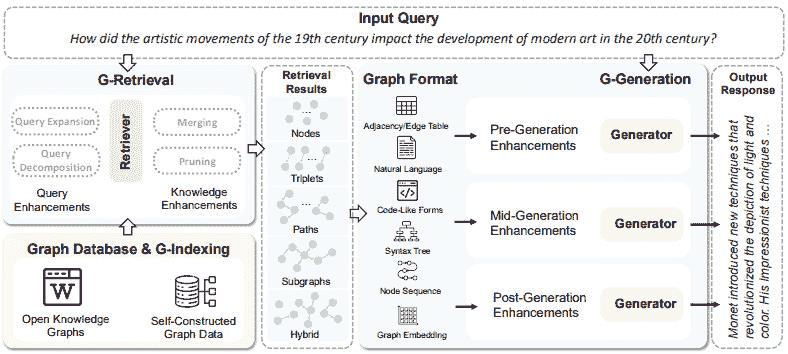

# 第七章：创建和连接知识图谱到 AI 代理

在前两章中，我们详细讨论了 RAG 框架。我们从简单的 RAG 开始，然后看到了我们如何添加不同的组件，替换其他组件，或修改整个管道以满足我们的需求。整个系统非常灵活，但有些概念保持不变。首先，我们从语料库（或多个文本语料库）开始，对这些文本进行嵌入以获得向量数据库。一旦用户查询到达，我们就对这个向量数据库进行相似度搜索。无论文本的范围或类型如何，我们的管道都基于以某种方式对文本进行矢量化，然后向 LLM 提供发现的文本中包含的信息。

文本通常充满了冗余信息，在上一章中，我们看到了 LLMs 对输入中噪声量的敏感性。大多数人已经看到了创建图表笔记或思维导图的好处。这些图表之所以简洁，是因为在书中划线一切就像没有划线一样。这些图表的原则是提取关键信息以便我们能够记住，这将使我们能够回答未来的问题。图表应该展示基本信息和连接它们的关系。这些模式可以表示为图形，更精确地说，是知识图谱。这些图形的优点是它们紧凑，将知识表示为实体和关系，并且我们可以对它们进行分析和使用图搜索算法。多年来，这些**知识图谱**（**KGs**）由主要公司或机构构建，现在可供使用。许多这些 KGs 已被用于信息提取，其中信息通过一系列查询来提取以回答问题。这些提取的信息是一系列实体和关系，知识丰富但对我们人类来说不太容易理解。自然的下一步是使用这些信息为 LLM 的上下文生成自然语言响应。这种范式被称为**GraphRAG**，我们将在本章中详细讨论。

在任何情况下，没有什么阻止我们使用 LLM 在 KG 的所有步骤中。事实上，LLMs 具有许多固有的能力，即使对于它们未经过训练的任务也很有用。这正是我们将看到我们可以使用 LLMs 来提取关系和实体并构建我们的 KGs 的原因。然而，LLMs 也具备推理能力，在本章中，我们将讨论我们如何使用这些模型来推理图中包含的信息以及图的结构本身。最后，我们将讨论哪些观点和问题仍然是开放的，以及所提出方法的优缺点。

在本章中，我们将讨论以下主题：

+   知识图谱简介

+   使用你的 LLM 创建知识图谱

+   使用知识图谱和大型语言模型检索信息

+   理解图推理

+   知识图谱和 GraphRAG 的持续挑战

# 技术要求

大部分代码都可以在 CPU 上运行，但更倾向于在 GPU 上运行。代码是用 PyTorch 编写的，大部分使用标准库（PyTorch、Hugging Face Transformers、LangChain、ChromaDB、`sentence-transformer`、`faiss-cpu`等）。

在本章中，我们也将使用 Neo4j 作为图数据库。尽管我们将使用 Python 进行所有操作，但 Neo4j 必须安装，并且您必须注册才能使用它。代码可以在 GitHub 上找到：[`github.com/PacktPublishing/Modern-AI-Agents/tree/main/chr7`](https://github.com/PacktPublishing/Modern-AI-Agents/tree/main/chr7)。

# 知识图谱简介

知识表示是人工智能的开放问题之一，并且有着非常悠久的历史（莱布尼茨认为所有知识都可以被表示并用于计算）。对知识表示的兴趣基于这样一个事实，即它是进行计算机推理的第一步。一旦这些知识被有序地组织起来，就可以用来设计推理算法和解决推理问题。早期的研究主要集中在使用演绎法来解决有关有序实体的问题（例如，通过使用本体）。这对于许多玩具问题来说效果很好，但它很费力，通常需要一套硬编码的规则，并且存在陷入组合爆炸的风险。因为这些空间中的搜索可能极其计算密集，因此尝试定义了两个概念：

+   **有限理性**：找到解决方案的同时，也要考虑其成本

+   **启发式搜索**：限制搜索空间，从而找到半优解（局部但非全局最优解）

这些原则激发了一系列算法的产生，这些算法随后使得信息搜索变得更加高效和可行。在 20 世纪 90 年代末，随着万维网的诞生和快速准确进行互联网搜索的需求，对这些算法的兴趣急剧增长。关于数据，万维网也基于三个技术原则：

+   **分布式数据**：数据分布在全球各地，可以从世界各地的任何地方访问

+   **连接数据**：数据是相互关联的，而不是孤立的；数据的意义是其与其他数据连接的函数

+   **语义元数据**：除了数据本身之外，我们还有关于其关系的信息，并且这些元数据使我们能够高效地搜索

因此，我们开始寻找一种能够尊重这种新型数据本质的技术。自然而然地，我们转向了图形表示。实际上，根据定义，图模型化了不同实体之间的关系。这种方法始于 2012 年，当时 Google 开始为每个搜索的概念添加知识卡片。这些知识卡片可以被视为名称实体的图，其中连接是图链接。这些卡片随后允许进行更相关的搜索和用户便利化。随后，“知识图谱”一词开始指任何通过一系列有意义的连接连接实体的图。这些关系通常表示实体之间的语义关系。


图 7.1 – Google 中的知识卡片

## 图和知识图谱的正式定义

由于知识图谱是图的一种子类型，我们将从图的简要介绍开始。图是由节点（或顶点）组成的数据结构，这些节点通过关系（或边）连接，以表示一个领域的模型。图可以以紧凑的方式表示知识，同时试图减少噪声。存在不同类型的图：

+   **无向图**: 边没有方向

+   **有向图**: 边有定义的方向（有明确的开始和结束）

+   **加权图**: 边带有权重，表示关系的强度或成本

+   **标记图**: 节点与特征和标签相关联

+   **多重图**: 同一对节点之间存在多个边（关系）

下图展示了这些图的视觉表示：


图 7.2 – 不同类型的图架构

因此，知识图谱是一个具有三个主要属性的子图：

+   **节点代表现实世界实体**: 这些实体可以代表人、地点或特定领域的实体（基因、蛋白质、疾病、金融产品等）

+   **关系定义节点之间的语义连接**: 例如，两个人可能通过代表友谊的关系相连，或者一个特定的基因与某种特定疾病相关联

+   **节点和边可能具有关联属性**: 例如，所有人都会有一个属性，即他们是人类（一个标签），但他们也可以有定量属性（出生日期、特定标识符等）

因此，更正式地说，我们可以认为我们有一个以事实三元组形式表示的知识库（事实数据库）。事实三元组的形式为`(头，关系，尾)`或`(主体，谓词，对象)`，或者更简洁地，`(e1,r1,e2)`，例如`(拿破仑，出生地，阿雅克肖)`。知识图谱是这种知识库的表示，它允许我们进行解释。鉴于这些三元组的结构，知识图谱是一个有向图，其中节点是这些实体，边是事实关系。


图 7.3 – 知识库和知识图谱的示例 ([`arxiv.org/pdf/2002.00388`](https://arxiv.org/pdf/2002.00388))

知识图谱定义为由一组实体`E`、关系`R`和事实`F`组成的图，其中每个事实`f`是一个三元组：

<mrow><mrow><mrow><mi mathvariant="script">G</mi><mo>=</mo><mfenced close="}" open="{"><mrow><mi mathvariant="script">E</mi><mo>,</mo><mi mathvariant="script">R</mi><mo>,</mo><mi mathvariant="script">F</mi></mrow></mfenced><mo>;</mo><mi>f</mi><mo>=</mo><mo>(</mo><mi>h</mi><mo>,</mo><mi>r</mi><mo>,</mo><mi>t</mi><mo>)</mo></mrow></mrow></mrow>

如您所见，知识图谱是知识的另一种表示形式。相同类型的数据可以以表格或图的形式表示。我们可以直接从表格中创建三元组，然后直接在知识图谱中表示它们。我们不需要表头，并且更新这种结构更容易。图被认为是通用数据表示，因为它们可以应用于任何类型的数据。实际上，我们不仅可以将表格数据映射到知识图谱，还可以从其他格式（如 JSON、XML、CSV 等）获取数据。图还允许我们灵活地表示递归结构（如树和文档）或循环结构（如社交网络）。此外，如果我们没有所有属性的信息，表格表示将充满缺失值；而在知识图谱中，我们不会遇到这个问题。

图本身代表网络结构。这在许多业务案例（例如，在金融和医学领域）中非常有用，因为这些数据已经以网络的形式结构化。另一个优点是，合并图比合并表格要容易得多。合并表格通常是一个复杂的过程（你必须选择要合并的列，避免创建重复项，以及其他潜在问题）。如果数据以三元组形式存在，合并两个知识图谱数据库就极其简单。例如，看看将这个表格转换为图是多么简单；它们是等价的：


图 7.4 – 表格和图表是等价的

知识图谱不应被视为一个静态实体。实际上，知识是不断演变的；这会导致新的实体或关系被添加。在**知识图谱推理**（KGR）中最广泛使用的任务之一是预测新的关系。例如，如果 A 是 B 的丈夫和 C 的父亲，这暗示 B 是 C 的母亲，这可以通过逻辑推理得出：*(A, husband of, B) ^ (A, father of C) -> (B, mother of, C)*。在这个预存数据中，我们推断出一个缺失的关系。

另一个非常重要的任务是，一旦我们获得了新的三元组（这可能需要复杂的预处理），如何更新知识图谱。这非常重要，因为一旦我们整合了一些新的知识，我们就可以进行进一步的分析和推理。此外，作为一个图，我们可以使用图分析算法（如中心性度量、连通性、聚类等）来处理我们的业务案例。利用这些算法使得在知识图谱中进行搜索或复杂查询比在关系数据库中要容易得多。


图 7.5 – 知识图谱是一个动态实体

此外，知识图谱比人们想象的要灵活和适应性强得多。知识图谱可以适应不同的任务。例如，有知识图谱的扩展，如**层次知识图谱**，其中我们有多级。在层次知识图谱中，一个级别的实体可以连接到下一个级别（例如，当我们有本体时，这非常有用）。实体也可以是**多模态的**，因此一个节点可以代表一个图像，其他实体（文本或其他图像，或其他类型的模态）与之相连。另一种类型的知识图谱是**时序知识图谱**，其中我们引入了时间维度。这种类型的知识图谱对于预测分析非常有用。我们可以在以下图中看到这些知识图谱：


图 7.6 – 不同类型的知识图谱

## 分类法和本体

图和 KG 之间的主要区别在于，前者是一个给定的结构，表示实体之间的关系，而后者通过允许推理和推理使语义关系明确，对人类和机器都是如此。因此，KG 的优势在于我们可以使用图算法和特定的推理算法（我们将在“理解图推理”部分中稍后详细说明）。通过整合元数据，这些能力得到了增强。实际上，我们可以构建`dog`和`cat`实体可能被分组在`mammals`下）。此外，如果需要，可以整合多个分类法（因此拥有多个树，以便进行更精细的搜索）。这些分类法有助于搜索或在我们需要过滤和操作非常大的 KG 时。例如，`maximum_speed`属性为`100` km，因此鲍勃将无法在不到一个小时的时间内到达那里，因为他的工作有一个`distance_from_home`属性为`120` km）。规则使我们能够改进搜索并解决以前过于复杂的任务（例如，我们可以为关系分配不同的属性：如果`married_to`是传递性的，我们可以在没有指定关系的情况下自动推断有关某人的信息）。多亏了本体，我们可以有效地快速进行某些类型的推理，例如演绎推理、类推理、传递推理等。

本体通常分为两组：

+   **独立于领域的本体**：这些本体提供的是与特定领域无关的基本概念。它们提供了一个高级视图，有助于数据集成，尤其是在存在多个领域的情况下。通常，这些本体数量较少，它们代表第一级，并且是首先构建的。

+   **领域本体**：这些本体专注于一个领域，用于提供基本术语。它们对于医学和金融等专业化领域非常有用。它们通常位于独立于领域的本体之下，并且是它的子类。

在本节中，我们看到了 KG 是如何作为灵活的系统来存储数据并能轻松找到知识的。这种灵活性使它们成为后续分析的有力工具，但同时也使得构建它们并不容易。在下一节中，我们将看到如何从一组文本中构建 KG。

# 使用你的大型语言模型（LLM）创建知识图谱

KG 的构建通常是一个多步骤的过程，包括以下步骤：

1.  **知识创造**：第一步，我们定义这个知识图谱（KG）的目的，即收集提取知识的来源。在这个步骤中，我们必须决定如何构建我们的 KG 以及在哪里维护它。一旦构建完成，KG 就必须被存储，并且我们必须有一个高效的查询结构。

1.  **知识评估**：在这个步骤中，我们评估获得的 KG 的质量。

1.  **知识清洗**：有多个步骤和程序来确保没有错误，然后进行纠正。这一步可以与知识评估同时进行，并且一些流程将它们一起进行。

1.  **知识增强**：这涉及一系列步骤来识别知识中是否存在空白。我们还可以整合额外的来源（从其他数据集中提取信息、整合数据库或合并多个知识图谱）。

1.  **知识部署**：在这一最终步骤中，知识图谱可以作为独立的应用程序（例如，作为图数据库）部署，或者用于其他应用程序中。

我们可以在以下图中看到这个过程：


图 7.7 – 知识图谱构建流程

## 知识创建

通常，从头开始构建知识图谱时，本体定义是第一步。有关于如何构建它们的几个指南（包括库和可视化工具）。努力构建清晰、可验证和可重用的本体。定义本体时应有一个目的，与各种利益相关者讨论知识图谱的目的，然后相应地定义本体。最相关的本体应该被选择（知识图谱的第一级），然后定义层次结构和属性。有两种方法：自上而下（首先定义核心本体，然后是更专业的本体）或自下而上（首先定义专业本体，然后将它们分组到超类中）。特别是对于专业领域，我们可以从已经构建的本体开始（有几种是为金融、医学和学术研究定义的），这确保了更好的互操作性。

下一步是从我们的来源中提取知识。在这个步骤中，我们必须从文本语料库或其他来源（数据库、结构化和非结构化数据）中提取三元组（或一组事实）。可以定义两个任务：

+   **命名实体识别（NER**）：NER 是从文本中提取实体并将它们分类的任务

+   **关系抽取（RE**）：RE 是识别上下文中各种实体之间联系的任务

NER 是自然语言处理（NLP）中最常见的任务之一，不仅用于知识图谱的创建，而且在我们想要从非结构化文本转换为结构化数据时也是一个关键步骤。它通常需要一个由多个步骤组成的管道（文本预处理、实体识别和分类、上下文分析以及数据后处理）。在 NER 过程中，我们首先进行预处理步骤以避免管道中的错误（例如，正确的标记化），然后尝试识别实体。一旦识别出实体，它们通常会被分类（例如，通过添加如人物、组织或地点等标签）。此外，还尝试使用周围文本来消除歧义（例如，试图识别文本中的*Apple*代表的是水果还是公司）。然后进行预处理步骤以解决歧义或合并多标记实体。


图 7.8 – NER 示例 ([`arxiv.org/pdf/2401.10825`](https://arxiv.org/pdf/2401.10825))

RE 是我们理解各种提取实体之间关系的任务。更正式地说，我们使用一个模型来识别和分类文本中实体之间的连接（例如，在句子*Bob works at Apple*中，我们提取关系*works at*）。它可以被视为一个单独的任务，或者在某些情况下与 NER 一起进行（例如，使用单个模型）。此外，RE 是知识图谱创建的关键步骤，同时对于其他几个 NLP 任务（如问答、信息检索等）也很有用。

有几种方法可以进行 NER 和 RE。最早且最费力的方法是基于知识或基于规则的。例如，在财务文件中识别公司名称的最简单方法之一是使用诸如大写字母等指标（识别`Mr.`和`Ms.`元素以提取人物，等等）。基于规则的方法在标准化文档（如临床笔记或官方文件）中效果很好，但可扩展性较差。这些方法需要建立繁琐的上游规则和特定知识，风险是错过不同数据集中许多实体。

基于隐马尔可夫模型、条件随机字段或最大熵（基于从训练数据中学习到的可能性预测实体的方法）的统计方法，使得更大的可扩展性成为可能。然而，这些方法需要大量、高质量的已定义标签的数据集。其他监督学习算法已被用于预测实体然后提取它们。这些算法在高计算成本和特别需要标签的情况下表现良好。获取标签是昂贵的，这些数据集很快就会过时（新公司、新产品等不断出现）。

最近，鉴于无监督学习（如 transformer 模型）的进步，决定使用 LLM 进行 NER 和 RE 以及构建 KG（在某些研究中，这些被称为**LLM 增强的 KG**）。处理大量文本语料库的能力、在预训练期间获得的知识以及它们的通用性使 LLM 在构建 KG（以及我们稍后将看到的其他相关任务）中变得非常有用。

由于它们能够利用上下文信息和语言能力，最先进的方法通常使用基于 transformer 的模型进行 NER 任务。以前的方法在处理具有复杂结构的文本（属于多个实体的标记，或文本中不连续的实体）时存在问题，而 transformer 在这些情况下表现更优。以前曾使用基于 BERT 的模型，这些模型后来被微调用于不同的任务。然而，如今，我们利用 LLM 的能力，它不需要微调，但可以通过上下文学习来学习任务。然后 LLM 可以直接从文本中提取实体，无需标签，并以所需格式提供它们（例如，我们可能希望 LLM 提供三元组列表或三元组加上给定的标签）。为了避免歧义问题，我们可以要求 LLM 在提取时提供额外的信息。例如，在音乐领域，*Apple*可以指苹果音乐、英国迷幻摇滚乐队 Apple 或歌手 Fiona Apple。LLM 可以帮助我们根据时期上下文区分这些实体中它指的是哪一个。同时，LLM 的灵活性允许我们在提取过程中将实体与各种本体联系起来。

类似地，LLM 也可以帮助进行 RE 任务。有几种方法可以实现这一点。其中最简单的一种是进行句子级别的 RE，即你向模型提供一个句子，它必须提取两个实体之间的关系。这种方法的扩展是在整个文档级别提取实体之间的所有关系。由于这并非易事，因此可以使用更复杂的、包含多个 LLM 的方法来确保我们能够理解文档的局部和全局关系（例如，在文档中，两个实体之间的局部关系位于同一句子中，但我们也可以有全局关系，其中一个实体位于文档的开头，而另一个实体位于文档的结尾）。


图 7.9 – 基于 LLM 的知识图谱构建的一般框架（此信息来源于 2023 年发表的一篇文章；[`arxiv.org/pdf/2306.08302`](https://arxiv.org/pdf/2306.08302))

如前所述，两个任务不需要分别进行（NER 和 RE），但 LLM 提供了在单步中执行它们的灵活性。在这种情况下，定义正确的提示非常重要，其中我们指导模型提取实体和关系，并指定我们想要的输出格式。然后我们可以迭代地进行，从大量文本中提取实体和关系。或者，我们可以使用一组针对不同任务的提示（一个用于实体提取，一个用于关系提取等）并使用 LLM 自动扫描语料库和这些提示。在某些方法中，为了保持更大的灵活性，使用一个 LLM 进行提取，然后使用一个更小的 LLM 进行校对。

另一个有趣的视角是，一个 LLM 就足以创建一个 KG。实际上，LLMs 是用大量文本训练的（最新的 LLMs 使用了包含从互联网抓取和数千本书的万亿个标记进行训练）。今天，有几项研究表明，即使是小型 LLMs（大约 70 亿个参数）也具有相当的知识，特别是关于事实（在 LLM 中的知识定义也很复杂，因为它不是与单个参数相关联，而是广泛分布的）。因此，一些作者提出了直接从 LLM 中蒸馏知识。在这种情况下，通过利用为任务构建的提示，我们进行所谓的 LLM **知识搜索**以提取三元组。通过这种方式，直接从 LLM 中提取事实，然后我们可以直接构建我们的 KG。以这种方式构建的 KG 在质量、多样性和新颖性方面与使用大型文本数据集构建的 KG 具有竞争力。


图 7.10 – 从 LLM 中蒸馏 KG 的一般框架 ([`arxiv.org/pdf/2306.08302`](https://arxiv.org/pdf/2306.08302))

## 使用 LLM 创建知识图谱

在本教程中，我将使用 Neo4j 和 LangChain 创建一个由 LLM 构建的 KG。LangChain 允许我们高效地使用 LLM 从文本语料库中提取信息，而 Neo4j 是一个用于分析和可视化图的程序。完整的代码在本书的 GitHub 仓库中（[`github.com/PacktPublishing/Modern-AI-Agents/tree/main/chr7`](https://github.com/PacktPublishing/Modern-AI-Agents/tree/main/chr7)）；在这里，我们将描述一般过程和最重要的代码片段。我们可以有两种方法：

+   **自定义方法**：LLMs 天生具备完成任务的能力；我们可以利用这些通用能力

+   **LangChain 图转换器**：如今，有库可以简化工作，只需几行代码就能达到相同的效果

自定义方法简单来说就是定义一个提示，让模型能够理解任务并高效执行。在这种情况下，我们的提示由以下元素构成：

+   一个清晰的带有项目符号的任务定义。任务描述可以包含模型必须做什么以及不能做什么。

+   提供额外的上下文，帮助模型更好地理解如何执行任务。由于这些模型是针对对话任务训练的，提供它们关于应该扮演什么角色的信息有助于提高性能。

+   一些示例来解释如何执行任务。

这种方法建立在我们在 *第三章* 中学到的知识之上。我们使用的模型是指令微调的（训练用于执行任务），因此提供清晰的指令有助于模型理解任务并执行它。添加一些示例利用了情境学习。使用精心制作的提示使我们能够灵活地调整提示以适应我们的需求：

```py
#Custom method
from langchain_core.prompts import ChatPromptTemplate
from langchain_core.messages import SystemMessage
from langchain_core.output_parsers import StrOutputParser
prompt = ChatPromptTemplate.from_messages([
    SystemMessage(content="""
    You are a helpful assistant in creates knowledge graphs by Generating Cypher Queries.\n
    Task:
     *  Identify Entities, Relationships and Property Keys from Context.\n
     *  Generate Cypher Query to Create Knowledge Graph from the Entities Relationships and Property Keys discovered.\n
     *  Extract ALL Entities and RelationShips as Possible.\n
     *  Always extract a person Profession as an Entity.\n
     *  Be creative.
     *  Understand hidden relationships from the network.
     Note: Read the Context twice and carefully before generating Cypher Query.\n
     Note: Do not return anything other than the Cypher Query.\n
     Note: Do not include any explanations or apologies in your responses.\n
     Note: Do not hallucinate.\n
     Entities include Person, Place, Product, WorkPlaces, Companies, City, Country, Animals, Tags like peoples Profession and more \n
     Few Shot Prompts:
      Example Context:
       Mary was born in 1995\. She is Friends with Jane and John. Jane is 2 years older than Mary.
       Mary has a dog named Max,and is 3 years old. She is also married to John. Mary is from USA and a Software Engineer.
      Answer:
        MERGE (Mary:Person {name: "Mary", birth_year: 1995})
        MERGE (Jane:Person {name: "Jane", age:1993})
        MERGE (John:Person {name: "John"})
        MERGE (Mary)-[:FRIENDS_WITH]->(Jane)
        MERGE (Mary)-[:FRIENDS_WITH]->(John)
        MERGE (Jane)-[:FRIENDS_WITH]->(Mary)
        MERGE (John)-[:FRIENDS_WITH]->(Mary)
        MERGE (Mary)-[:HAS_DOG]->(Max:Dog {name: "Max", age: 3})
        MERGE (Mary)-[:MARRIED_TO]->(John)
        MERGE (Mary)-[:HAS_PROFESSION]->(SoftwareEngineer:Profession {name: "Software Engineer"})
        MERGE (Mary)-[:FROM]->(USA:Country {name: "USA"})
    """),
    ("human", "Context:{text}"),
])
```

执行前面的代码应该产生以下结果：


图 7.11 – 结果截图

结果显示，精心制作的提示如何成功生成三元组（然后我们可以使用这些三元组来构建我们的 KG）。这突出了 LLM 的巨大灵活性。

我们并不总是想要一个定制的解决方案，但可能想要使用一个更成熟的流程。LangChain 只需几行代码就能提供这种能力：

```py
from langchain_core.documents import Document
from langchain_experimental.graph_transformers import LLMGraphTransformer
llm_transformer = LLMGraphTransformer(llm=llm)
documents = [Document(page_content=content)]
graph_documents = llm_transformer.convert_to_graph_documents(documents)
```

LangChain 以一种已经结构化的格式给我们相同的成果，这简化了我们的工作。

图形可以在 Neo4j 中进行可视化，我们可以在图上工作，进行搜索，选择节点等操作。


图 7.12 – 从 Neo4j 中获取的图形截图

一旦生成了图形，我们就可以用它来进行查询。显然，我们可以在 Neo4j 中进行这些查询，但也可以在 Python 中进行。例如，LangChain 允许我们对我们的 KG 进行查询：

```py
from langchain.chains import GraphCypherQAChain
graphchain = GraphCypherQAChain.from_llm(
    llm, graph=graph, verbose=True, return_intermediate_steps=True
)
results = graphchain.invoke({"query":"People who have kids"})
print(results["result"])
```

执行代码后，你应该获得以下结果：


图 7.13 – 查询 KG

如我们所见，LangChain 在这种情况下生成相应的 Cypher 查询，然后执行图查询。这样，我们使用一个 LLM 在 Cypher 中生成查询，同时我们也可以直接用自然语言编写。

## 知识评估

一旦知识图谱（KG）创建完成，就需要检查错误以及 KG 的整体质量。KG 的质量是通过一系列维度（每个维度都有相应的指标）来评估的，这些维度用于监控 KG 在可访问性、表示、上下文和内在质量方面的表现。以下是一些指标：

+   **准确性**：这个指标从语法和语义的角度评估准确性。

+   **完整性**：这个指标衡量 KG 在某个领域或任务中的知识量。它通常衡量 KG 是否包含一个领域所需的所有实体和关系（有时会与黄金标准 KG 进行比较）。

+   **简洁性**：知识图谱允许知识以高效的方式表达，但它们也面临着快速扩展的风险。空白节点（代表匿名或未命名的实体的一种特定类型的节点，在图中需要节点但未精确指示时使用）在创建过程中经常被生成。如果不加注意，就有可能使知识图谱充满空白节点。

+   **时效性**：知识也应定期更新，因为知识可能会变化并变得过时。因此，决定更新的频率很重要。

+   **易用性、操作简便性和操作性**：知识图谱（KGs）用于搜索或其他任务；目前存在一些度量标准来衡量知识图谱的有用性。实际上，对于一个知识图谱来说，要变得有用，它必须易于访问、能够被操作，并且能够进行研究和更新。

+   **易于理解**：由于知识图谱旨在用于代表人类的知识，一些作者提出了衡量知识图谱对人类可解释程度的方法。确实，今天，在人工智能中，对模型的透明度和可解释性的重视程度更高。

+   **安全性、隐私性和可追溯性**：目前也存在一些度量标准来控制谁可以访问知识图谱以及它是否能够抵御外部访问。同样，知识也需要被追踪，因为我们需要确保它来自哪个来源。可追溯性还允许我们遵守隐私法规。例如，我们的知识图谱可能包含关于用户的敏感数据，或者来自错误或有问题的文档。可追溯性允许我们纠正这些错误，删除需要删除其数据的用户的数据，等等。

## 知识清洗

评估了我们的知识图谱的质量后，我们可以看到其中存在错误。一般来说，错误检测和纠正统称为**知识清洗**。知识图谱中可能发生不同类型的错误：

+   我们可能存在语法错误的实体或关系

+   一些错误可能与本体相关（分配给不存在的本体、将它们连接到错误的本体、本体的错误属性等等）

+   一些可能是语义的，可能更难识别

+   知识来源的错误也可能导致知识错误（症状 `x` 不是疾病 `y` 的症状，人 `x` 不是公司 `y` 的首席执行官等等）

有几种方法可以检测这些错误。最简单的方法是统计方法，通过利用概率和统计建模来识别 KG 中的异常值。也有更复杂的变化，利用简单的机器学习模型。这些模型并不特别准确。由于我们可以使用逻辑推理和本体与 KG，因此有基于知识的推理方法来识别异常值（例如，一个人的实例不能也是地点的实例，因此通过利用类似的规则，我们可以识别异常值）。最后，有基于 AI 的方法，也可以使用一个 LLM 来检查错误。LLM 拥有知识和推理技能，因此可以用来验证事实是否正确。例如，如果我们对于某个错误，我们有三元组 `(Vienna, CapitalOf, Hungary)`，LLM 可以识别这个错误）。然后，还有类似的 KG 修正方法。然而，已经建立了几个框架来进行检测和修正。

## 知识丰富化

**知识丰富化**（或 KG 补全）通常是下一步。KGs 通常是不完整的，因此可能需要进行几轮 KG 补全和修正。KG 的完整性有时很难定义，并且与领域和应用任务相关。完成 KG 的第一步通常是识别额外的信息来源（例如，对于一个医学 KG，这可能是一个额外的生物医学数据库或额外的科学文章语料库）。通常，在构建 KG 的第一步中，我们只使用一种数据类型（非结构化文本），然后在第二步中扩展提取到其他数据类型（CSV、XML、JSON、图像、PDF 等）。每种数据类型都提出了不同的挑战，因此我们应该修改我们的管道。我们使用的来源越多，KG 清理和对齐任务就越重要。例如，来源越异构，实体解析（在 KG 级别识别重复实体）的重要性就越大。

一个有趣的替代方案是使用一个 LLM（或其他 transformer 模型）来推断知识。例如，已经探索了三种可能的方法：

+   `(h,r,t)` 被作为一个 transformer 模型输入以预测其存在的概率（`0` 表示三元组无效，而 `1` 是一个有效的三元组）。这种方法的变体是从模型中提取最终隐藏状态并训练一个线性分类器以二进制方式预测三元组是否有效。

+   `(h,r,?)`，我们可以尝试填补这个空缺。

+   `(h,r)` 和 `(t)`。这样，我们从模型中获得了两种表示（模型的最终隐藏状态被使用）。之后，我们使用评分函数来预测这个三元组是否有效。这种方法确实更准确，但存在组合爆炸的风险。正如你所见，在这个方法中，我们试图计算两个文本表示之间的相似性（`(h,r)` 和 `(t)` 的表示）。

这些方法实际上与我们之前章节中尝试计算两个句子之间相似性时看到的方法非常相似。


图 7.14 – LLMs 作为 KG 补全的编码器（[`arxiv.org/pdf/2306.08302`](https://arxiv.org/pdf/2306.08302)）

或者，可以使用少量示例或其他提示技术，并要求一个 LLM 直接完成它们。此外，这种方法还允许你在提示中提供额外的项目。在以前的方法中，我们只提供了三元组 `(h,r,t)`；通过提示工程，我们还可以提供其他上下文元素（关系描述、实体描述等）或添加指令以更好地完成任务。


图 7.15 – 基于提示的 KG 补全（[`arxiv.org/pdf/2306.08302`](https://arxiv.org/pdf/2306.08302)）

## 知识托管和部署

最后一步是 KG 的托管和部署。KG 是一组节点和关系，因此我们可以使用图特定的范式来存储数据。当然，托管 KG 并非没有挑战：

+   **大小**：KG 越大，其管理就越复杂

+   **数据模型**：我们必须选择一个系统，使我们能够最优地访问我们任务所需的信息，因为不同的系统有不同的优缺点

+   **异质性**：图可能包含多种模式，这使得存储更加复杂

+   **速度**：随着其增长，知识更新的复杂性也随之增加

+   **用户需求**：用户可能有异质的需求，这些需求可能相互冲突，需要我们实施规则和约束

+   **部署**：系统必须对用户可访问，并允许轻松推理

KG 的存储有不同选择：

+   KG 可以托管在经典的**关系数据库**（例如，**结构化查询语言**（SQL）中，实体和关系存储在表中）。然后，可以从这些表中使用投影重建图的关系结构。使用关系数据库存储大型 KG 可能导致大型表不切实际，或者大量具有复杂层次结构的表。

+   另一种选择是**文档模型**，其中数据以元组（键值对）的形式存储，然后组织成集合。这种结构在搜索时可能很方便；它是一个允许快速写入的示意图系统，但更新嵌套集合中的知识可能是一场噩梦。

+   **图数据库**是针对存储和搜索图以及数据转换进行优化的数据库。图数据模型包含节点和边，并附加了各种元数据。查询语言也适应了这种结构（并且有些类似于 SQL）。图数据库还有允许异构性和支持速度的优势。Neo4j 是最广泛使用的之一，并使用了一种修改后的查询语言（Cypher）。

+   **三元组存储**是数据库直接由三元组组成的地方。今天存在一些数据库，它们以三元组的形式保存信息，并允许在数据库中执行查询。通常，这些数据库也具有对本体和进行逻辑推理的原生支持。

托管带来了一系列挑战，选择数据模型时应考虑到后续应用。例如，如果我们的 KG 需要从我们的关系型数据库中检索数据，使用这个系统在集成方面有优势。然而，在这种情况下，我们将为了异构性和速度而牺牲性能。图数据库在处理性能和图的结构的结构性质方面做得更好，但它可能与其他系统组件的集成不佳。无论我们使用什么系统进行存储，我们都可以根据应用构建混合系统，或者创建一个作为数据库之上的层的 KG。

部署是管道中的最后一步。但这并不意味着故事的结束。KG 很容易过时，因此我们需要考虑知识更新或能够处理新应用的管道。同样，新知识的进入意味着我们必须有知识评估的管道（监控 KG 的质量，确保没有错误输入或没有冲突）。某些知识可能过时或需要删除，以解决法律或隐私问题；因此，我们应该有清理 KG 的管道。其他管道应专注于控制系统的访问和安全。

在本节中，我们看到了创建和部署 KG 所需的所有步骤。现在我们有了我们的 KG，我们可以使用它；在下一节中，我们将讨论如何查找信息并将其作为我们 LLM 的上下文。

# 使用知识图谱和 LLM 检索信息

在前两章中，我们讨论了 RAG 的能力及其在减少 LLM 生成的幻觉中的作用。尽管 RAG 在研究和工业应用中已被广泛使用，但仍存在局限性：

+   **忽略关系**：数据库中的文本是相互关联的，而不是孤立的。例如，一个文档被分割成块；因为这些块属于单个文档，它们之间存在语义联系。当无法通过语义相似性捕获时，RAG 无法捕捉结构化的关系知识。一些作者指出，在科学中，一篇文章与先前作品之间存在重要的关系，这些关系通常通过引用网络来突出显示。使用 RAG，我们可以找到与查询相似的文档，但我们无法找到这个引用网络，从而丢失了这些关系信息。

+   **冗余信息**：传递给 LLM 的上下文是一系列连接的块。今天，随着 LLM 的发展，我们可以添加越来越多的上下文（模型的上下文长度越来越长），但它们在冗余信息的存在上遇到了困难。我们添加到上下文中的块越多，用于回答查询的冗余或非必要信息就越多。这种冗余信息的存在降低了模型的表现。

+   **缺乏全局信息**：RAG 找到一组文档，但无法找到全局信息，因为文档集不能代表全局信息。这是一个问题，尤其是在摘要任务中。

**图检索增强生成**（**GraphRAG**）作为一种新的范式出现，试图解决这些挑战。在传统的 RAG 中，我们通过对嵌入向量进行相似性分析来找到文本块。在 GraphRAG 中，我们在知识图谱上进行搜索，并将找到的三元组提供给上下文。因此，主要区别在于，当用户查询到达时，我们在知识图谱中进行搜索，并使用图中包含的信息来回答查询。

(img/B21257_07_16.jpg)

图 7.16 – 直接 LLM、RAG 和 GraphRAG 的比较([`arxiv.org/pdf/2408.08921`](https://arxiv.org/pdf/2408.08921))

正式来说，我们可以将 GraphRAG 定义为一个利用知识图谱（KG）为语言模型（LLM）提供上下文并生成更好响应的框架。因此，该系统与经典的 RAG 非常相似；为了避免混淆，在此语境中，我们将称之为*向量 RAG*。在 GraphRAG 中，知识图谱是知识库，从中我们可以找到实体和关系的信息。GraphRAG 由三个主要步骤组成：

1.  **基于图的索引**（**G-indexing**）：在这个初始阶段，目标是构建一个图数据库并正确索引它。

1.  `q`，在自然语言中，我们希望提取一个子图，我们可以用它来正确回答查询。

1.  **图增强生成**（**G-generation**）：最后一步是使用找到的知识进行生成。这一步使用一个 LLM 来完成，该 LLM 接收上下文并生成答案。



图 7.17 – 图 RAG 框架在问答任务中的概述 ([`arxiv.org/pdf/2408.08921`](https://arxiv.org/pdf/2408.08921))

在接下来的小节中，我们将详细讨论每个步骤。

## 基于图的索引

在第一步，我们需要选择我们的图数据将是什么。通常，使用两种类型的知识图谱：开放的知识图谱或自构建的知识图谱。在前一种情况下，我们可以使用已经可用的知识图谱，并将其适应到我们的 GraphRAG 中。今天，已经建立了许多知识图谱，并且可供使用（例如，Wikidata 是一个收集来自各种维基百科相关项目的数据的知识库）。一些知识图谱专注于特定领域；这些知识图谱对特定领域有更深入的理解（其中一些是开放的且可用的）。或者，你也可以构建自己的知识图谱。

在构建它或在使用它之前，你应该注意索引。适当的索引使我们能够拥有更快、更高效的 GraphRAG。虽然我们可以将知识图谱可视化为一个图，但它仍然存储在数据库中。索引使我们能够访问我们想要找到的信息。因此，存在几种索引类型。例如，我们可以将文本描述与节点、三元组或本体关联起来，然后在搜索中使用这些描述。另一种方式是将图数据转换为向量，并在这些向量空间上进行搜索（嵌入）。我们还可以使用更尊重数据图性质的索引或混合版本。


图 7.18 – 基于图的索引概述 ([`arxiv.org/pdf/2408.08921`](https://arxiv.org/pdf/2408.08921))

## 图引导检索

在 GraphRAG 中，检索对于生成高质量响应至关重要（类似于向量 RAG）。对知识图谱的搜索面临两个需要解决的问题：

+   **爆炸性候选子图**：随着图的增长，知识图谱中的子图数量呈指数增长。这意味着我们需要高效的算法来探索知识图谱并找到相关的子图。其中一些算法使用启发式方法以提高效率。

+   **相似度测量不足**：我们的查询是文本形式，但我们希望在图上执行相似度搜索。这意味着我们的算法必须能够理解文本和结构信息，并且能够成功比较来自不同来源的数据之间的相似度。

我们可以有不同类型的检索器。最简单的是`奥巴马`实体，在 KG 中，我们取相邻实体，`k-hop=1`，或者甚至邻居的邻居，`k-hop=2`，等等）。非参数检索器是最简单且也是最快的系统，但它们在检索准确性方面存在问题（可以通过学习来改进）。有一些机器和深度学习模型是原生在图上训练的。基于 GNN 的检索器是一个例子。**图神经网络**（**GNNs**）是原生处理图的神经网络，可以用于图上的许多任务（节点分类、边预测等），因此它们搜索与查询相似的子图。

或者，我们可以使用基于 LLM 的检索器，其中我们有一个基于 transformer 的模型来进行搜索。然后模型处理和解释查询以进行搜索。这些 LLM 中有一些是在文本上训练过的模型，然后进行微调以搜索图。一个优点是 LLM 可以用作代理，并使用不同的工具或函数来搜索图。基于 LLM 的检索器和基于 GNN 的检索器都显著提高了检索精度，但计算成本很高。今天也有使用不同方法（同时使用 GNN 和 LLM，或与 LLM 一起使用启发式方法）的替代方案，或者过程可以是多阶段的（例如，先用 LLM 进行初始搜索，然后细化结果）。

就像为向量 RAG 所做的那样，我们可以添加额外的组件来进行增强。例如，在前一章中，我们看到我们可以重写查询或分解过于复杂的查询。查询修改有助于更好地捕捉查询的含义（因为有时查询没有捕捉到用户意图的隐含含义）。检索也可以是一个灵活的过程。在前一章中，我们看到在简单的 RAG 中，检索只进行了一次，但在高级和模块化 RAG 中建立了检索可以多阶段或迭代的变体。更复杂的变体使过程根据查询自适应，因此对于简单的查询，只进行一次检索，而对于更复杂的查询，可能需要进行多次迭代。同样，检索后获得的结果也可以进行修改。例如，即使在使用 GraphRAG 的情况下，我们也可以对检索到的知识进行压缩。实际上，如果我们进行多个检索阶段，我们可能也会发现冗余信息，因此方便过滤掉不相关信息。

今天，使用 GraphRAG 也有重新排序检索结果的方法。一个例子是对找到的各种子图进行排序，并可能选择前`k`个子图。

](img/B21257_07_19.jpg)

图 7.19 – 基于图的检索的一般架构 ([`arxiv.org/pdf/2408.08921`](https://arxiv.org/pdf/2408.08921))

与向量 RAG 相比，另一个区别在于我们如何控制搜索粒度。在向量 RAG 中，粒度是通过决定块的大小来控制的。在 GraphRAG 的情况下，我们不进行分块或寻找块。然而，我们可以通过选择我们找到的内容来在检索过程中控制粒度：

+   **节点**: 在 GraphRAG 中，我们可以检索单个实体。节点可以与它们关联属性，然后只将实体及其属性添加到上下文中。这对于目标查询可能很有用。

+   **三元组**: 通过扩展搜索粒度，我们选择检索三元组（因此不仅包括节点，还包括它们的关系）。当我们不仅对实体本身感兴趣，还对它们的关系感兴趣时，这很有用。

+   **路径**: 在这种情况下，我们仍然扩展检索。路径是一系列节点和关系，因此从实体 `X` 到实体 `Y` 的路径是连接它们的实体和关系的所有链。显然，不同实体之间存在多条路径，并且随着图的大小增加，这些路径呈指数增长。因此，我们通常定义规则、使用 GNN 或选择最短路径。

+   **子图**: 子图可以被定义为 KG 内部节点和关系的子集。提取子图使我们能够回答复杂查询，因为它允许我们分析实体之间的复杂模式和依赖关系。提取子图有几种方法：我们可以使用特定的模式或进行不同路径的合并。

+   **混合粒度**: 我们可以同时使用不同的粒度或选择一个自适应系统。

在 GraphRAG 的情况下，平衡粒度和效率很重要。我们不希望用元素填满上下文，以防止后续 LLM 与无关信息作斗争。这也取决于查询的复杂性：对于简单查询，即使低粒度也足够，而对于复杂查询，更高的粒度更有益。自适应方法可以使系统更高效，同时在需要时保持细微差别。


图 7.20 – 不同级别的检索粒度

一旦找到并清理了知识，我们就可以将其提供给 LLM 以生成对查询的响应。这种知识进入提供给 LLM 的提示中，模型生成响应。或者，这种找到的知识可以用于某些特定任务的模型（例如，一个用于回答多项选择题的 GNN）。主要问题是图具有非欧几里得性质，与文本信息的集成并不理想。为此，可以使用图翻译器将找到的图信息转换成 LLM 更容易理解的信息。这种转换提高了 LLM 理解信息的能力。因此，一旦我们在图形式（节点、关系、路径或子图）中找到信息，我们就将其置于 LLM 的上下文中。有一些替代方案：

+   **图形格式**：我们可以在提示中直接添加关系和节点的集合，或者我们可以使用一种图形结构表示形式，如邻接表或边表。后者紧凑地传达了更好的关系结构。另一种想法是节点序列，它是根据预定规则生成的。这是一种紧凑的表示，包含了图中节点的顺序。

+   **自然语言**：存在特定的图语言，可以将信息转换成自然语言，这种表示对 LLM 来说更为亲切。在这个过程中，我们将找到的子图转换成描述性形式。可以使用模板将图转换，其中节点和关系被填充。在某些模板中，您可以定义节点的最近邻和最远邻（图中的 1-hop 和 2-hop），或者您可以使用 LLM 将此子图转换成自然语言描述。

+   **语法树**：图被展平并表示为语法树。这些树具有层次结构的优势，并保持了图的拓扑顺序。这种方法保持了图的属性，但使信息对 LLM 来说更容易消化。

+   **代码形式**：检索到的图可以被转换成标准格式，例如**图形标记语言**（**GraphML**）。这些语言专门为图设计，但它们是结构和文本的混合体。

转换仍然存在困难，因为它必须确保结果是简洁且完整的，同时，对 LLM 来说是可理解的。理想情况下，这种表示还应包括图的结构的详细信息。无论检索到的子图是否转换，结果都输入到 LLM 提示中，并生成响应。


图 7.21 – 通过子图转换增强生成([`arxiv.org/pdf/2408.08921`](https://arxiv.org/pdf/2408.08921))

## GraphRAG 应用

GraphRAG 有多个应用。第一个是问答（与 RAG 相同的应用）中，我们提取子图，而 LLM 使用它们进行后续推理和回答。问答的一个子分支是常识推理问答，它通常以多选题的形式出现。对于这个子任务，我们通常不使用 LLM，而是使用 GNN 或其他机器学习（ML）模型。然而，KG（因此也是 GraphRAG）在信息检索方面有广泛的应用，例如，如果我们想研究一些感兴趣实体之间的关系。KG 可以单独用来提取实体之间的关系，但添加 LLM 的生成功能使我们能够更好地探索这些关系和上下文细微差别。这是学术和文献研究的一个吸引因素。事实上，在学术界，一篇文章是由来自不同机构的多个作者共同撰写的。一篇文章建立在先前研究的基础上，因此对于每篇文章，都有一个引用网络。这些结构元素很容易用图来建模。最近发表的一个有趣的应用展示了 Ghafarollahi 等人如何使用多个 KG 智能体来分析已发表的文献并提出新的研究假设。简而言之，他们从一个由 1,000 篇文章构建的 KG 中提取路径或子图，然后一个智能体分析本体，然后从这个本体中生成新的研究假设。在这个有趣的应用中，多个智能体协作以创建新的潜在材料搜索。


图 7.22 – 科学发现辅助的多智能体图推理系统概述 ([`arxiv.org/pdf/2409.05556v1`](https://arxiv.org/pdf/2409.05556v1))

对 GraphRAG 感兴趣的一个原因是，知识图谱过去常用于事实核查（毕竟，知识图谱是一系列事实的集合），因此向大型语言模型（LLM）提供事实应该会减少 LLM 的幻觉。这一特性使其特别适合生物医学应用。事实上，幻觉是医疗决策应用中的一个严重问题。在医学中，如果 RAG 向量可以减少幻觉，它不允许有全面的视角，尤其是在需要概述来回答问题时。因此，Wu 等人建议使用基于 GraphRAG 的方法，称为**MedGraphRAG**。在这项工作中，他们使用几个医学来源来创建他们的系统，并利用知识图谱的层次性质。他们为他们的知识图谱构建了三个层级。在第一层级，有用户提供的文档（医院的医疗报告）。这一层级的实体随后连接到一个更基础的信息层级。第二层级由医学教科书和科学文章构建。最后，在第三层级，有从标准化和可靠来源获得的明确定义的医学术语和知识关系。利用从这个知识图谱中的检索获得了在主要医学问答基准数据集上的最先进结果。其优势在于，这个系统也优于在医学知识上微调的模型，从而实现了大量的计算节省。


图 7.23 – MedGraphRAG 框架 ([`arxiv.org/pdf/2408.04187`](https://arxiv.org/pdf/2408.04187))

对 GraphRAG 的进一步兴趣源于使用知识图谱（KGs）向用户提出推荐。在电子商务平台上，推荐系统被用来预测用户的未来购买意图，并建议其他感兴趣的产品。因此，有人提出，该系统将新用户与从过去具有相似行为的用户中派生出的子图相匹配，并利用这些信息来预测可能的未来购买并建议合适的产品。此外，这种方法对于法律和金融领域也很有用。在法律领域，案例和司法意见之间存在广泛的引用，法官使用过去的案例和意见来做出新的裁决。给定一个法律案例，GraphRAG 可以建议先前的法律案例并帮助决策。在金融领域，GraphRAG 可能会建议先前的金融交易或客户案例。

最后，到目前为止，我们建议 GraphRAG 和向量 RAG 是相互对立的。实际上，这两个系统都有优点和缺点，因此将它们协同使用会更有用。Sarmah 等人提出了**HybridRAG**，在该系统中同时使用了 GraphRAG 和向量 RAG。他们的系统在金融响应方面显示出优势。未来，可能会有系统利用这两种方法，并增加一个路由器来选择是否搜索知识图谱或向量数据库。或者，可能会有更复杂的系统用于上下文中的知识融合（特别是如果知识图谱搜索和块提供了一些冗余信息）。

在本节中，我们讨论了如何将 LLM 连接到知识图谱，以及如何使用它来查找丰富 LLM 上下文的信息。在下一节中，我们将讨论 LLMs 和 KGs 协同有用的其他任务。

# 理解图推理

本节致力于讨论如何解决图数据任务。在本节中，我们将讨论一些用于解决知识图谱上任务的途径：知识图谱嵌入、图神经网络（GNNs）和大型语言模型（LLMs）。知识图谱嵌入和 GNNs 各需要至少一章内容；因此，这些主题超出了本书的范围，但我们相信对这些内容的介绍对实践者是有益的。实际上，嵌入和 GNNs 都可以与 LLMs 和代理协同使用。

有许多任务需要模型理解结构来解决，这些任务统称为**图结构理解任务**。许多这些任务都是使用专门设计来学习这些任务的算法或模型来解决的。今天，我们正在开发一种新范式，我们试图使用 LLMs 来解决这些任务；我们将在本节末尾深入讨论这一点。任务的例子可能包括度计算（一个节点有多少邻居）、路径搜索（定义两个节点之间的路径，计算哪条是最短路径等）、哈密顿路径（识别一个只访问每个节点一次的路径）、拓扑排序（识别节点是否可以按拓扑顺序访问）以及许多其他任务。其中一些任务很简单（度计算和路径搜索），但其他任务则要复杂得多（拓扑排序和哈密顿路径）。


图 7.24 – 图结构理解任务 ([`arxiv.org/pdf/2404.14809`](https://arxiv.org/pdf/2404.14809))

另一方面，图学习任务要求模型不仅包括图的结构，还包括图的属性（节点、边和图的特征），从而理解图的语义信息。一些任务的例子包括节点分类（根据节点的属性及其邻居的属性进行分类）、图分类（你必须理解整个图才能对其进行分类）、边分类和节点特征解释（解释节点的某个特征）。**知识图谱问答**（**KGQA**）是这类任务之一，因为我们需要理解实体和关系的结构和意义来回答问题。一个类似的任务是执行知识图谱查询以生成文本（这也可以被视为一个子任务）。知识图谱嵌入捕获图中的多关系语义和潜在模式，使它们在关系推理和符号链接预测任务（例如 KG 链接预测）中特别有用。另一方面，图神经网络（GNNs）捕获图结构和节点/边特征；这使得它们在需要归纳推理、使用特征或图结构的局部/全局表示（节点或图分类/回归）的任务中表现良好。


图 7.25 – 图学习任务 ([`arxiv.org/pdf/2404.14809`](https://arxiv.org/pdf/2404.14809))

## 知识图谱嵌入

知识图谱（KGs）在表示知识方面非常有效，但它们在规模上的操作却很复杂。这在我们对特定任务感兴趣时，例如链接预测和实体分类，会使得它们的使用变得复杂。因此，**知识图谱嵌入**（**KGE**）被提出以简化这些任务。我们已经在第一章中讨论了嵌入的概念。嵌入是将数据投影到低维且连续的向量空间中，这在我们的数据具有稀疏表示（如文本和图）时特别有用。对于一个知识图谱，嵌入是将图（节点、边及其特征向量）投影到这个降低的空间中。然后，KGE 模型试图学习一个既保留结构又保留信息的投影，以便它可以用于下游任务。

学习这种表示方法并非易事，已经提出了几种类型的算法。例如，一些 KGEs 试图保留实体之间的关系模式。TransE 是一种将 KGs 嵌入欧几里得空间的方法，其中实体之间的关系是向量。TransE 基于这样的想法，即三元组中连接的两个实体在空间中应该尽可能接近。此外，从三元组 `(h, r, t)` 中，它试图学习一个空间，其中 *h + r ≈ t*，从而允许我们进行各种数学运算。RotatE，另一种方法，也试图使用复杂的向量空间来保留其他关系模式（对称性、反对称性、逆运算和组合）。当我们想要回答需要这种对称性概念（*婚姻*是对称的）或组合（*我的侄子是我哥哥的儿子*）的问题时，这非常有用。然而，其他方法试图保留结构模式。实际上，较大的 KGs 包含在嵌入过程中丢失的复杂和复合结构。例如，层次结构、链结构和环结构在经典嵌入过程中丢失。当我们想要进行推理或为某些任务提取子图时，这些结构很重要。ATTH（另一种 KG 嵌入方法）使用双曲空间来同时保留层次结构和逻辑模式。然而，其他方法试图模拟实体和关系的不确定性，使诸如链接预测等任务更容易。

(img/B21257_07_26.jpg)

图 7.26 – KGs 中三种典型结构的示意图([`arxiv.org/pdf/2211.03536`](https://arxiv.org/pdf/2211.03536))

KGEs 已被广泛用于诸如链接预测等任务。在这种情况下，利用小空间试图识别最有可能缺失的链接。同样，连续空间允许模型用于三元分类。进一步的应用是使用学习到的嵌入来构建推荐系统。

## 图神经网络

在使用图形与 ML 算法原生结合时存在几个挑战。首先，经典的 ML 模型接受的是矩形或网格状的数据，这使得将其应用于图形非直观。此外，对于图形，我们想要使用的信息有：节点、边、全局上下文和连通性。最后一个尤其难以表示，我们通常使用邻接矩阵。这种表示是稀疏的，随着图中节点数量的增加而大幅增长，因此空间效率低下。此外，由于图中没有顺序，我们可以得到几个传递相同信息的邻接矩阵，但可能不会被模型识别。

GNN 是一种深度学习模型，它原生地接受一个图，并在其学习过程中利用其结构。有不同类型的 GNN（在 *进一步阅读* 部分有一些综述，你可以深入了解这个主题），但在这里我们将关注主要框架：消息传递。大多数 GNN 可以被视为图卷积网络，其中我们为每个节点聚合来自其邻居的信息。GNN 的一个优点是，在训练任务的同时，它还为每个节点学习一个嵌入。在每一步，这个节点嵌入都会用来自邻居的信息进行更新。

消息传递框架在某种程度上与神经网络非常相似，正如我们之前所看到的。在这种情况下，有两个主要步骤：收集各个邻居节点的嵌入，然后跟随一个聚合函数（这取决于不同的架构而不同）和非线性函数。然后，在每一步，我们更新每个节点的嵌入，学习图的新表示。一个经典的 GNN 可以由一系列 GNN 块和一个最终层组成，该层利用学习到的表示来完成任务。这可以写成如下公式：

<mml:math display="block"><mml:msubsup><mml:mrow><mml:mi>h</mml:mi></mml:mrow><mml:mrow><mml:mi>v</mml:mi></mml:mrow><mml:mrow><mml:mo>(</mml:mo><mml:mi>l</mml:mi><mml:mo>+</mml:mo><mml:mn>1</mml:mn><mml:mo>)</mml:mo></mml:mrow></mml:msubsup><mml:mo>=</mml:mo><mml:msup><mml:mrow><mml:mi mathvariant="bold-italic">W</mml:mi></mml:mrow><mml:mrow><mml:mo>(</mml:mo><mml:mi>l</mml:mi><mml:mo>+</mml:mo><mml:mn>1</mml:mn><mml:mo>)</mml:mo></mml:mrow></mml:msup><mml:mo>∙</mml:mo><mml:mrow><mml:munder><mml:mo stretchy="false">∑</mml:mo><mml:mrow><mml:mi>w</mml:mi><mml:mo>∈</mml:mo><mml:mi mathvariant="script">N</mml:mi><mml:mo>(</mml:mo><mml:mi>v</mml:mi><mml:mo>)</mml:mo><mml:mo>⋃</mml:mo><mml:mo>{</mml:mo><mml:mi>v</mml:mi><mml:mo>}</mml:mo></mml:mrow></mml:munder><mml:mrow><mml:mfrac><mml:mrow><mml:mn>1</mml:mn></mml:mrow><mml:mrow><mml:msub><mml:mrow><mml:mi>c</mml:mi></mml:mrow><mml:mrow><mml:mi>w</mml:mi><mml:mo>,</mml:mo><mml:mi>v</mml:mi></mml:mrow></mml:msub></mml:mrow></mml:mfrac></mml:mrow></mml:mrow><mml:msubsup><mml:mrow><mml:mi>h</mml:mi></mml:mrow><mml:mrow><mml:mi>w</mml:mi></mml:mrow><mml:mrow><mml:mo>(</mml:mo><mml:mi>l</mml:mi><mml:mo>)</mml:mo></mml:mrow></mml:msubsup></mml:math>

在这里，在第 *l+1* 层，我们基于之前的嵌入学习一个表示，`h`。`W` 是一个特定于层的权重矩阵，`v` 是一个节点，`w` 是邻居集合，`c` 是归一化系数。


图 7.27 – GNNs

在这种情况下，我们假设每个邻居的贡献是相同的。这可能并不成立，因此受到 RNN 和 transformers 的注意力机制的启发，提出了**图注意力网络**（GATs）。在这种类型的 GNN 中，模型学习为每个邻居学习不同的重要性级别。目前存在几种 GNN 层模型，但基本原理变化不大。

GNNs 已成功应用于多个图任务，但仍存在一些局限性，如难以扩展、批处理问题等。它们也已被应用于知识图谱，但增加了复杂性。

## LLM 在知识图谱上的推理

LLM 的优势在于它们不是为特定任务训练的，而是在训练过程中获得了一组广泛技能。此外，LLM 具有可以通过特定方法改进的推理技能。因此，一些研究人员建议使用 LLM 进行图推理。接近 LLM 的主要方法是用提示作为输入。有三种方法：

+   **手动提示**：最简单的方法是向 LLM 提供一个提示，要求它们在图上解决一个任务。在提示中，输入图，并可以添加额外信息（例如，如果我们希望 LLM 使用**深度优先搜索**（DFS）算法来解决任务，我们提供该算法如何工作的简要说明）。这些提示的局限性在于，无法在提示中插入宽图（这是由于 LLM 的上下文长度限制造成的）。

+   **自我提示**：LLM 通过持续更新提示来使任务解决更加容易。换句话说，给定一个原始提示，LLM 进行提示更新以更好地定义任务及其解决方式。然后，基于 LLM 的输出，生成一个新的提示并反馈给 LLM。这个过程可以多次进行以优化输出。

+   **API 调用提示**：这种提示类型受到代理的启发，其中 LLM 被提供一组它可以调用的 API，用于对图或其他外部工具进行推理。


图 7.28 – 将 LLM 应用于图任务的提示方法 ([`arxiv.org/pdf/2404.14809`](https://arxiv.org/pdf/2404.14809))

寻找复杂提示策略的替代方法是**监督微调**（SFT）方法。在这种情况下，使用包含图任务及其解决方案的数据集来训练模型，以提高其推理能力。

LLMs（大型语言模型）的另一个有趣方面是它们也可以与其他模型结合使用。这使得它们的特性可以与专门针对某些任务而优化的模型相结合。例如，我们可以将 LLMs 与 GNNs（图神经网络）结合，在这种情况下，LLMs 可以作为 GNNs 的增强器。GNN 在处理图结构方面比 LLM 做得更好，但 LLM 在处理文本属性方面做得更好。然后我们可以利用这两个模型的优势，以获得一个更强的协同模型。LLMs 比其他模型具有更大的语义和句法能力，这使得它们能够创建强大的文本嵌入。然后 LLM 可以生成数值嵌入，这些嵌入随后被 GNN 用作节点特征。例如，我们有一个科学论文之间的引用网络（我们的图中每个节点是一篇论文），我们希望将文章分类到各种主题中。我们可以取每篇文章的摘要，并使用 LLM 创建摘要的嵌入。这些数字向量将成为文章的节点特征。在这个阶段，我们可以训练我们的 GNN，比没有特征时获得更好的结果。或者，如果节点特征是文本的，我们可以使用 LLM 来生成标签。例如，对于我们的文章网络，我们每个节点都有与之关联的文章标题，我们使用 LLM 在零样本设置下生成一组标签。这很有用，因为手动标注很昂贵，所以我们可以更快地获得标签。当我们获得标签后，我们可以在图上训练一个 GNN。或者，我们也可以考虑同时进行 LLM 和 GNN 的微调。


图 7.29 – LLM 和 GNN 协同

另一种有趣的方法是图形成推理。一些用于推理的提示技术没有考虑到人类思维不是线性的，因此根据某些观点，这种推理方法可以用图来近似。有两种利用这种想法的方法：

+   `距离 = 60 km`，`时间 = 1.5 小时`，`使用速度 = 距离 ÷ 时间`，`速度 = 40 km/h`，边表示每个思想如何导致下一个。这种图结构使模型能够逐步推理，探索替代方案或验证计算。

+   **在图上验证**：在这种方法中，我们使用图来验证推理的正确性和一致性。例如，如果不同的路径应该导致一个逻辑结论，它们应该是相同的或相似的。所以，如果有矛盾，这意味着推理是错误的。通常，人们会为一个问题生成几个推理，将它们结构化为一个图，并分析它们以改进最终答案。这种方法需要一个验证者来分析这个图，通常是另一个 LLM。


图 7.30 – 在图上思考并在图上验证（[`arxiv.org/pdf/2404.14809`](https://arxiv.org/pdf/2404.14809)）

在本节中，我们讨论了图和 LLM 之间错综复杂的关系以及它们如何使我们能够解决一些以前使用图 ML 算法执行的任务。在下一节中，我们将讨论一些尚未解决的问题领域的令人兴奋的视角。

# 知识图谱和 GraphRAG 的持续挑战

KGs 是存储和组织信息的有力媒介，但仍存在局限性和未解决的问题。特别是对于大型 KGs，可扩展性很重要；必须在表达性和计算效率之间取得平衡。此外，构建 KG 需要大量的计算工作（使用 LLM 从大量文本语料库中提取三元组可能很昂贵，并且需要足够的基础设施）。此外，一旦 KG 构建完成，就必须对其进行评估和清理，这也需要一些努力（手动或计算）。此外，KG 的增长也意味着支持访问或使用的基础设施成本的增长。查询大型 KGs 需要拥有优化算法以避免越来越大的延迟时间风险。工业 KGs 可以包含数十亿个实体和关系，代表着复杂和庞大的规模。许多算法是为小型 KGs（多达数千个实体）设计的，因此在大规模 KGs 中的检索仍然具有挑战性。

此外，知识图谱（KGs）众所周知是不完整的，这意味着必须拥有管道来完善 KG。这意味着需要既有添加额外来源的管道，也有更新数据源的管道。大多数数据库都是静态的，因此创建动态系统具有挑战性。这对于在金融等领域充分利用 KG 至关重要，在这些领域，我们希望考虑到市场的快速变化。顺便提一下，KGs 可以是多模态的，但整合这些模式并不容易。虽然添加模态可以显著提高推理过程，对存储知识的细微差别和 KG 的丰富性的理解，但它也显著增加了管理复杂性（需要更多存储，更复杂的管道，更复杂的知识协调等等）。

GraphRAG 是一种相对较新的技术，并且尚未完全优化。一方面，信息检索可以改进，尤其是在用户的文本查询和知识图谱检索之间的转换。随着知识图谱的不断扩大，找到冗余信息并损害生成过程的风险也随之增加。检索之后，我们可能会得到一个很长的上下文，这个上下文被提供给大型语言模型进行生成。为了减少噪声和降低计算量，我们可以压缩上下文，但这会带来信息丢失的风险。目前，无损压缩是一个活跃的研究领域，而现有方法最多只能允许在压缩和信息保留之间进行权衡。目前还缺乏基准标准来评估新的 GraphRAG 方法；这不允许对当前或未来的方法进行轻松比较。GraphRAG 允许考虑实体间关系和结构化知识信息，减少冗余文本信息，并能够再次找到全局信息。然而，与此同时，文本的细微差别却丢失了，GraphRAG 在抽象问答任务或当问题中没有明确提到实体时表现不佳。因此，向量和 GraphRAG（或 HybridRAG）的结合对未来来说是一个令人兴奋的前景。了解这两种技术如何以最佳方式集成仍然很有趣。

重要的一点是，LLM 并没有专门训练用于图任务。正如我们在**第三章**中提到的（B21257_03.xhtml#_idTextAnchor042），LLM 被训练来预测序列中的下一个单词。通过优化这个简单的目标，它们获得了大部分技能。显然，仅从文本中吸收空间理解是困难的。这意味着 LLM 通常在结构数据上遇到困难。这一点在表格数据中得到了突出，LLM 在理解表格和关系上存在问题。第一个问题是 LLM 在数值表示上遇到困难，因为标记化步骤使得 LLM 难以理解整个数字（缺乏一致的十进制表示，以及数值运算问题）。这随后影响了需要这种数值理解的图任务的执行。对图理解的具体研究表明，LLM 对图结构有基本理解。LLM 以线性形式理解这些图，并且比图的结构拓扑结构更好地理解与节点相关的标签。根据这些研究，LLM 有基本理解，这强烈受到提示设计、提示技术、提供的语义信息和示例存在的影响。下一代多参数 LLM 在解决小图上的简单任务时取得成功，但随着图和任务复杂性的增加，它们的性能迅速下降。这种对结构数据缺乏理解有两个原因。第一个原因是，在用于训练 LLM 的大文本语料库中，没有多少来自图的数据。因此，LLM 只能学习基本的时空关系，因为这些关系在文本中有所描述。因此，在图数据集上进行的 SFT 可以产生比许多更大的模型更好的结果。

(img/B21257_07_31.jpg)

图 7.31 – 在图数据上使用 SFT 比大 LLM 对小 LLM 有更好的性能([`arxiv.org/pdf/2403.04483`](https://arxiv.org/pdf/2403.04483))

另一方面，第二个原因源于人类理解空间结构良好的原因。人类从他们在外部世界的经验中学习空间关系。大脑创建心理地图，使我们能够在空间中定位自己。这些地图还使我们能够更好地理解抽象的空间概念，如图形。LLM 没有心理地图，也不能有外部世界的经验，这使得它们在理解抽象空间概念方面处于不利地位。

# 摘要

在**第五章**和**第六章**中，主要问题是如何找到信息以及如何使用这些信息来生成对用户问题的答案。动态地查找信息使我们能够减少我们模型的幻觉并保持其知识更新。

在本章中，我们从一个文本语料库开始，创建了一个系统来找到生成答案的最相关信息（朴素 RAG）。接下来，我们创建了一个更复杂的系统，试图提取仅相关的信息，避免冗余信息或噪声。对于一些研究人员来说，文本本质上包含与背景噪声混合的相关信息。重要的是实体及其关系。从这个还原论方法中产生了在知识图谱中表示基本知识的想法。图使我们能够使用算法来搜索信息或探索可能的连接。长期以来，图推理和 LLM 一直在平行轨道上运行，但最近，它们的故事开始交织在一起。我们已经看到了 LLM 和 KG 之间如何以各种方式进行交互。例如，LLM 可以用来提取用于图构建的关系和实体，或者 LLM 可以用来对 KG 进行推理。同样，我们可以使用 KG 来寻找知识并丰富 LLM 的上下文，从而使其能够有效地回答用户问题。

目前，存在一种类似摩尼教式的定义：要么是向量 RAG，要么是 GraphRAG。两者都有优点和缺点，研究趋势指向这两个世界的统一（HybridRAG）。在未来，我们将找到更多将知识图谱和向量结合在一起的高级方法。此外，对于 LLM 的一侧的图结构理解仍然不成熟。随着训练数据集的增长，新一代 LLM 暴露于更多图示例。然而，在抽象概念如图中的空间关系理解，也意味着在具有更大现实相关性的问题中理解它们。因此，这是一个活跃的研究领域，特别是对于必须在太空中互动并使用人工智能的机器人。

进入太空是人工智能的下一个前沿领域之一。太空中的交互带来了独特的挑战，例如平衡探索和开发。在下一章中，我们将更抽象地讨论这一概念。我们将关注强化学习和代理在太空关系中的行为。无论是棋类游戏、视频游戏还是现实世界环境，代理必须学习如何与太空互动以实现目标。在下一章中，我们将探讨如何使代理能够在不失去目标的情况下探索世界。

# 进一步阅读

+   [Ghafarollahi, 《SciAgents：通过多智能体智能图推理自动化科学发现》](https://arxiv.org/pdf/2409.05556v1) 2024

+   [Raieli, 《科学发现的勇敢新世界：AI 研究想法是否更好？》](https://levelup.gitconnected.com/a-brave-new-world-for-scientific-discovery-are-ai-research-ideas-better-5692c5aa8182) 2024

+   Raieli, *LLM 如何在网络中迷失并发现图推理*, 2024, [`towardsdatascience.com/how-the-llm-got-lost-in-the-network-and-discovered-graph-reasoning-e2736bd04efa`](https://towardsdatascience.com/how-the-llm-got-lost-in-the-network-and-discovered-graph-reasoning-e2736bd04efa)

+   Wu, *医学图 RAG：通过图检索增强生成实现安全的医学大型语言模型*, 2024, [`arxiv.org/abs/2408.04187`](https://arxiv.org/abs/2408.04187)

+   Raieli, *图和向量 RAGs 的收敛：信息检索的新时代*, 2024, [`medium.com/gitconnected/the-convergence-of-graph-and-vector-rags-a-new-era-in-information-retrieval-b5773a723615`](https://medium.com/gitconnected/the-convergence-of-graph-and-vector-rags-a-new-era-in-information-retrieval-b5773a723615)

+   Sarmah, *HybridRAG：整合知识图谱和向量检索增强生成以实现高效信息提取*, 2024, [`arxiv.org/pdf/2408.04948`](https://arxiv.org/pdf/2408.04948)

+   Liang, *图神经网络及其应用综述*, 2022, [`onlinelibrary.wiley.com/doi/10.1155/2022/9261537`](https://onlinelibrary.wiley.com/doi/10.1155/2022/9261537)

+   Arora, *关于图神经网络在知识图谱补全中的应用综述*, 2020, [`arxiv.org/pdf/2007.12374`](https://arxiv.org/pdf/2007.12374)

+   Huang, *LLM 能否通过提示有效地利用图结构信息，为什么？*, 2023, [`arxiv.org/abs/2309.16595`](https://arxiv.org/abs/2309.16595)

+   Liu, *在图上评估大型语言模型：性能洞察和比较分析*, 2023, [`arxiv.org/abs/2308.11224`](https://arxiv.org/abs/2308.11224)
