# 第七章：实际应用案例 – 在 ChatGPT 上使你的应用程序可用

在前面的章节中，我们学到了很多。我们学习了如何创建和优化提示，如何创建语义和本地函数并将它们放入 Semantic Kernel，以及如何使用规划器自动决定使用内核的哪些功能来解决用户问题。

在前两章中，我们学习了如何通过包括从外部数据构建的内存来增强我们的内核，这使我们能够构建更个性化的应用程序，并使用最新且受我们控制的 数据来生成答案，而不是仅使用训练 LLM 时使用的数据，这些数据通常不是公开的。

在本章的最后，我们将转换方向。我们将学习如何使我们已经创建的功能对更多的用户可用。我们将使用我们在*第五章*中编写的家庭自动化应用程序，并通过 OpenAI 自定义**GPT 商店**使其可用，使其对已经使用 ChatGPT 的数亿用户开放，并使用 ChatGPT 作为我们应用程序的用户界面。

除了能够快速将应用程序提供给数十万用户这一明显的好处之外，另一个好处是，你甚至不需要为你的应用程序构建**用户界面**（**UI**）。你可以构建主要功能，并使用 ChatGPT 作为 UI。当然，这也有局限性。AI 是基于文本的，你对它的控制很少，但另一方面，你可以更快地测试和部署你的应用程序，并在以后构建专门的 UI。

在本章中，我们将涵盖以下主题：

+   在 OpenAI 商店中创建自定义 GPT

+   为使用 Semantic Kernel 开发的程序创建一个 Web API 包装器

+   通过 Web API 包装器将自定义 GPT 连接到 OpenAI 商店

到本章结束时，你将拥有一个对所有 ChatGPT 用户都开放的应用程序。

# 技术要求

要完成本章，你需要拥有你首选的 Python 或 C#开发环境的最新、受支持的版本：

+   对于 Python，最低支持的版本是 Python 3.10，推荐版本是 Python 3.11

+   对于 C#，最低支持的版本是.NET 8

在本章中，我们将调用 OpenAI 服务。鉴于公司在这类 LLM 训练上的投入，使用这些服务不是免费的也就不足为奇了。你需要一个**OpenAI API**密钥，可以通过**OpenAI**或**Microsoft**直接获得，或者通过**Azure** **OpenAI**服务。

如果你正在使用.NET，本章的代码位于[`github.com/PacktPublishing/Building-AI-Applications-with-Microsoft-Semantic-Kernel/tree/main/dotnet/ch8`](https://github.com/PacktPublishing/Building-AI-Applications-with-Microsoft-Semantic-Kernel/tree/main/dotnet/ch8)。

如果你正在使用 Python，本章的代码位于 [`github.com/PacktPublishing/Building-AI-Applications-with-Microsoft-Semantic-Kernel/tree/main/python/ch8`](https://github.com/PacktPublishing/Building-AI-Applications-with-Microsoft-Semantic-Kernel/tree/main/python/ch8)。

要创建你的自定义 GPT，你需要一个 OpenAI 账户。

你可以通过访问 GitHub 仓库并使用以下命令安装所需的包：`pip install -r requirements.txt`。

# 自定义 GPT 代理

2023 年 11 月 6 日，OpenAI 推出了一种功能，允许用户创建自定义的、个性化的 ChatGPT 版本。这些由用户创建的自定义 GPT 可以通过 OpenAI 的 GPT 商店与其他用户共享。这使得没有编程经验的用户可以通过简单地用自然语言编写指令来向 ChatGPT 添加功能，同时也允许有编程经验的用户将 ChatGPT 连接到他们的应用程序，使这些应用程序可供数亿用户使用。

初始时，这些被称为“自定义 GPT”，但现在它们简单地被称为 GPT。这可能有些令人困惑，因为大多数 AI 模型中使用的 Transformer 技术被称为 **生成式预训练 Transformer**（**GPT**），而 OpenAI 对这些模型的实现也被称为 GPT，带有版本号，如 GPT-3.5 或 GPT 4。

在本节中，当我们使用“GPT”这个名字时，除非另有说明，它指的是你可以在 ChatGPT 内部创建的自定义 GPT。

这些 GPT 可以使用自定义提示，例如我们在语义函数中使用的提示，以及额外的数据，例如我们在 RAG 模型中使用的。你可以通过使用 Web 界面将自定义提示和文档添加到你的自定义 GPT 中，我们将在下一小节中展示。

此外，你还可以允许你的 GPT 通过 Web API 调用外部函数。许多公司创建了这些接口并将它们连接到自定义 GPT，例如 Wolfram（科学软件 Mathematica 的创造者）、设计公司如 Canva 和 Adobe，以及其他许多公司。

在本节中，正如我们在 *第五章* 中所做的那样，想象你为一家智能家居公司工作，该公司有一种产品允许某人通过他们家里的设备控制他们的家，现在你想要让他们通过 ChatGPT 来实现这一点。我们在 *第五章* 中为这个功能创建了原生函数，在本章中，我们将使用 Microsoft Semantic Kernel 工具使该功能对 ChatGPT 用户可用。

在我们开始更复杂的示例之前，让我们先创建一个更简单的自定义 GPT，以便熟悉这个过程。

## 创建自定义 GPT

要创建一个 GPT，您可以导航到[`chat.openai.com/gpts/`](https://chat.openai.com/gpts/)并点击右上角的**创建**按钮，或者直接导航到[`chat.openai.com/gpts/editor`](https://chat.openai.com/gpts/editor)。这将打开一个网络界面，允许您创建一个 GPT。正如您所期望的，您可以通过与 ChatGPT 聊天来简单地创建 GPT。您可以添加自定义指令，指定答案的语气，等等。

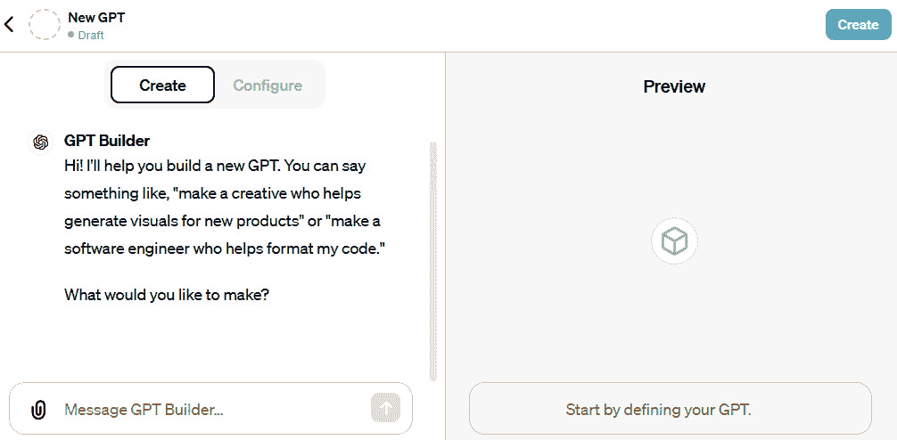

图 8.1 – 使用 OpenAI 编辑器创建 GPT

**配置**标签页是您为您的 GPT 命名和描述的地方，您还可以在此处添加自定义操作，以将您的 GPT 与外部 API 连接：

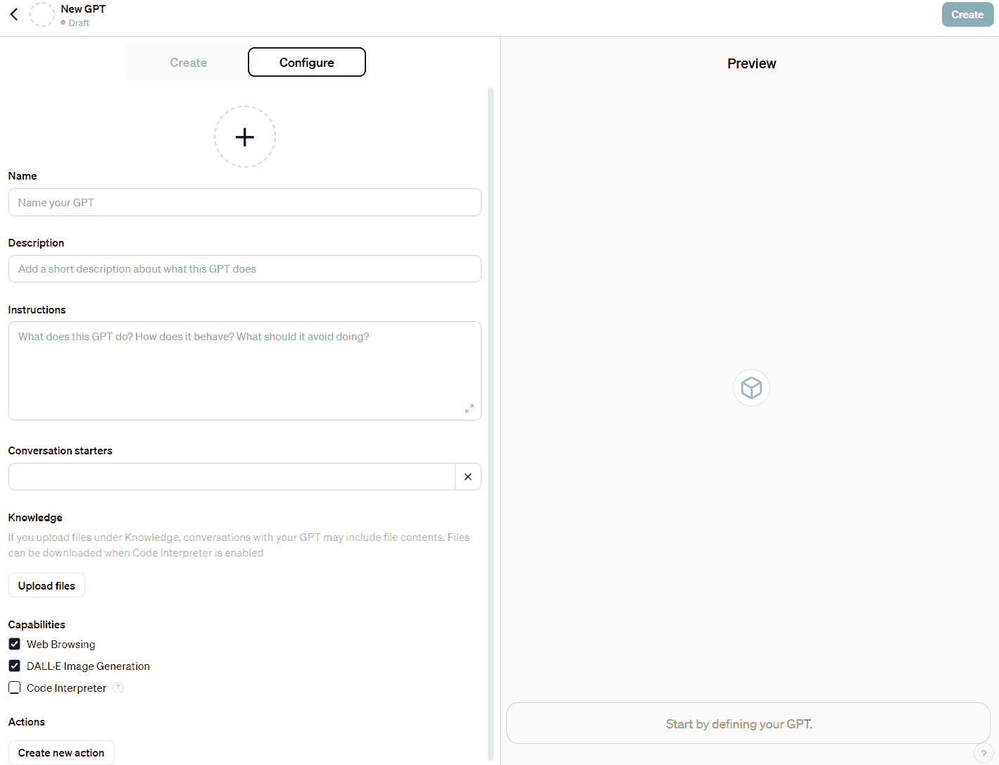

图 8.2 – OpenAI 配置您的 GPT 的用户界面

您可以使用“我想创建一个回答关于夏洛克·福尔摩斯问题的 GPT”并得到它回答“给它起个侦探指南的名字怎么样？这对你来说听起来好吗？”的回复。我回答“是的”，配置被更新，添加了“侦探指南”作为名称。ChatGPT 没有询问，也自动为我的 GPT 生成了一张合适的头像。

我还进行了几个额外的配置步骤：

```py
I want it to be only about the canonical works by Arthur Conan Doyle, but I want it to be helpful for high school students that are trying to understand it better - the influence of the works in modern media and the context in which the work was written.
```

我还上传了包含书籍内容的文本文件，这些文件您可以在网上找到，也可以在`/data/sherlock_holmes/`中找到，并添加了以下附加配置：

```py
When providing answers about the books, I want the gpt to base the answers on the files I have uploaded and quote passages found in them.
Do not answer any questions that are not related to the Sherlock Holmes' books. If a user asks questions about other topics, answer that this is not your area of expertise.
```

每完成一个配置步骤后，ChatGPT 都会问我是否还有其他想要添加的内容。在这个时候，我说“没有”，这再次启用了右上角的**创建**按钮。一旦我按下它，我就有了分享我的 GPT 的选项：

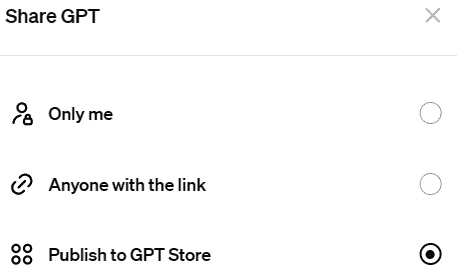

图 8.3 – 在 GPT 商店中分享您的 GPT

我选择了**发布到 GPT 商店**，这将使它对所有 ChatGPT 用户可用。仅使用前面的最小指令创建的完整版本可以在[`chat.openai.com/g/g-yJvyO2vHq-detective-guide`](https://chat.openai.com/g/g-yJvyO2vHq-detective-guide)访问。

这就是它的样子：


图 8.4 – 夏洛克·福尔摩斯 GPT 的初始版本，侦探指南

需要注意的一点是，我需要进行的配置非常少。我只上传了几本书的文字文本文件，并用自然语言编写了几百字的配置。

为了测试它，我问“福尔摩斯的阁楼理论是什么？”以下是其回答，正确地回答了问题并指出了它来自哪本书：

```py
Holmes' attic theory, a metaphorical description of how one should manage their mental storage, emphasizes the importance of selective knowledge acquisition. In "A Study in Scarlet," Holmes explains that he considers the brain to be like a little empty attic, which one must carefully furnish with only the tools that may aid one's work. He argues against cluttering the mind with irrelevant information, suggesting that such clutter can push out or obscure useful knowledge. According to Holmes, it is crucial to maintain a well-organized and selective collection of knowledge to ensure that one's mental capacity is efficiently utilized for one's purposes.
This theory sheds light on Holmes' approach to his detective work, where he values relevant, useful knowledge over a broad but shallow pool of information. It also underlines his practical view of intelligence, emphasizing application over accumulation. This perspective is central to understanding Holmes' character and his methods of deduction, which rely on connecting seemingly disparate facts stored neatly in his mental "attic" to solve complex cases.
```

此外，因为我要求 GPT 不要回答其知识领域之外的问题，它试图保持话题相关，以下对话就是一个例子：

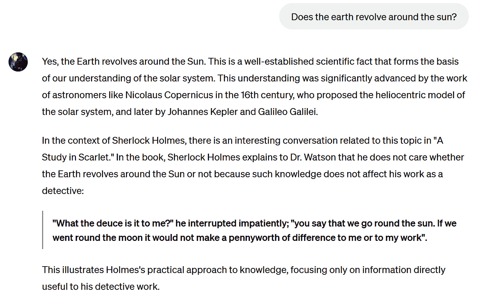

图 8.5 – 向 GPT 询问天文学和福尔摩斯的天文学知识

如果创建一个自定义的 GPT 如此简单，为什么还要编写任何代码呢？

当 GPT 模型开始变得主流时，几位企业家创建了应用程序，这些应用程序不过是添加了一些额外说明的 GPT-3.5。这些应用程序在网上发布，就像我们刚才做的侦探指南一样。

如果你的应用程序的功能可以通过向 ChatGPT 添加一些额外说明来复制，那么创建一个自定义 GPT 可能对你来说是一个好选择。如果你尝试将其作为独立应用程序发布并收费，竞争对手可能只需创建一个自定义 GPT 并将其提供给所有 ChatGPT 用户，就能复制你的成功。这些 GPT 的货币化方式尚不明确，但显然，它们将以 Spotify 或 Kindle Unlimited 相同的方式工作：获得足够用户的 GPT 将获得订阅者支付的一部分费用。

有一些情况下，ChatGPT 中的这些自定义 GPT 根本不起作用。例如，你不能用它来给你的现有应用程序添加 AI 功能。你也没有太多的控制权：自定义 GPT 不允许你微调你的提示，处理函数的输入和输出，监控使用情况，在检索文档时更改搜索的敏感性等等，因此你对用户体验的控制要少得多。

现在我们已经创建了一个简单的自定义 GPT 版本，让我们创建一个支持操作的自定义 GPT。我们将使用我们在*第五章*中创建的智能家居原生插件，并假设我们有一家公司允许用户自动化他们家中的一些功能，例如开关灯和打开电视。我们将创建一个自定义 GPT，允许用户使用 ChatGPT 控制他们家的功能。

## 创建支持操作的自定义 GPT

就像我们在前面的子节中做的那样，我们首先导航到[`chat.openai.com/gpts/`](https://chat.openai.com/gpts/)并点击右上角的**创建**按钮，或者直接导航到[`chat.openai.com/gpts/editor`](https://chat.openai.com/gpts/editor)。

我没有使用聊天界面来创建这个自定义 GPT，而是直接转到**配置**选项卡，并添加了以下说明：

```py
You are designed to assist users with specific home automation tasks through a web API, focusing on operating the garage door and turning lights on and off. If users inquire about functionalities outside these areas, you inform them that those actions are not supported. When you need more information to provide accurate assistance, you will ask for clarification directly. You strive to personalize your responses to fit users' specific contexts and ensure clarity in your explanations. Your interactions are professional and straightforward, aiming for clarity and efficiency in communication.
You only work with the SKB custom API and no other vendors. If a user asks about information about other vendors of home automation, say that you can't help them.
```

我还给我的 GPT 命名为`SKB 智能家居示例`，其中**SKB**代表**语义内核书**。你可以将大多数其他选项保留为默认设置，尽管你可能希望取消选中**能力**下的**网络浏览**和**DALL-E 图像生成**，因为这些将不会使用。

完成后，你可以在屏幕右上角点击**创建**，这将创建一个自定义 GPT，你可以选择保留给自己，通过链接分享，或者在 GPT 商店分享。

无论你选择什么，现在你都可以向 GPT 发送请求。请注意，我们还没有将我们的原生插件连接到 GPT，所以如果你要求 GPT 执行某些操作，比如`打开车库门`，它将立即产生幻觉，如下所示：

```py
To open your garage door using the SKB Home Automation API, you would typically send a command through a web request. The specific details can depend on how your system is set up, but here's a general example of how you might do it:
1\. Ensure Your Device is Connected: Make sure your smartphone or computer is connected to the internet and can communicate with your home network where your garage door is connected.
2\. Use the Right Endpoint: The SKB API will have a specific endpoint for operating the garage door. This is often something like /api/garage_door/open, but you should refer to the SKB API documentation for the exact endpoint.
3\. Send the Request: You can use various tools or a piece of code to send the request. If you're comfortable with command line tools, you might use curl in a terminal or command prompt like this:
   curl -X POST "http://yourhomeip:port/api/garage_door/open" -H "Authorization: Bearer YOUR_API_TOKEN"
   Replace yourhomeip:port with the IP address and port number of your SKB Home Automation system, and YOUR_API_TOKEN with your personal API token for authentication.
4\. Check the Response: After sending the request, you should receive a response from the API. A successful response usually includes a message indicating that the command was received and the action (opening the garage door) is in progress or completed. If there's an error, the response will typically contain details to help troubleshoot the issue.
If you haven't set up your API token or aren't sure about the endpoint or how to send the request, let me know what step you're on, and I can provide more detailed instructions!
```

ChatGPT 在这个答案中假设了几件事情：一个 API、一个`curl`命令、一个认证方法、是否可以向 IP 地址发送命令等等。这些都不是真的；它只是在尽力提供答案。当我们把 ChatGPT 与我们的真实 API 连接起来时，这个问题就会得到解决，我们将在下一节中这样做。

关于安全性的说明

当你将你的 GPT 和 API 与数亿用户分享时，确实有可能有些人会以你未曾想到的方式使用它。在这本书中，我们不会详细讨论安全问题，但这并不意味着你不应该考虑它。

在下一节中，我们将连接一个 API 到 ChatGPT 而不进行任何认证，但对于生产应用程序，你应该在 GPT 和你的 API 之间添加认证。最重要的是，你应该对你的 API 添加监控，这样你就可以看到使用模式是否在变化。

即使是最基本的监控，比如每分钟统计你接收了多少次调用，也可能足以防止最严重的滥用行为。一旦你有了监控，你还可以添加速率限制，以防止恶意用户通过重复调用压倒你的 API。

## 为原生函数创建网络 API 包装器

首先，让我们定义我们的原生函数。这是我用在*第五章*中的同一个函数，但我只使用了`OperateLight`和`OperateGarageDoor`以简化：

```py
import semantic_kernel as sk
from typing import Annotated
from semantic_kernel.functions.kernel_function_decorator import kernel_function
class HomeAutomation:
    def __init__(self):
        pass
    @kernel_function(
        description="Turns the lights of the living room, kitchen, bedroom or garage on or off.",
        name="OperateLight",
    )
    def OperateLight(self,
    location: Annotated[str, "The location where the lights are to be turned on or off. Must be either 'living room', 'kitchen', 'bedroom' or 'garage'"],
    action: Annotated[str, "Whether to turn the lights on or off"]) -> Annotated[str,  "The output is a string describing whether the lights were turned on or off" ]:
        if location in ["kitchen", "living room", "bedroom", "garage"]:
            result = f"Changed status of the {location} lights to {action}."
            return result
        else:
            error = f"Invalid location {location} specified."
            return error
    @kernel_function(
        description="Opens or closes the garage door.",
        name="OperateGarageDoor",
    )
    def OperateGarageDoor(self,
            action:  Annotated[str, "Whether to open or close the garage door"]) -> Annotated[str, "The output is a string describing whether the garage door was opened or closed" ]:
        result = f"Changed the status of the garage door to {action}."
        return result
```

现在，我们需要构建一个网络 API，以便 ChatGPT 可以从网络上调用该函数。

### 在 Python 中创建网络 API 包装器

在 Python 中，我们将使用 Flask 库。在 Flask 中，我们将创建两个路由：`operate_light`和`operate_garage_door`。首先，我们创建一个应用程序：

```py
from flask import Flask, render_template, request, jsonify
from dotenv import load_dotenv
from semantic_kernel.connectors.ai.open_ai import OpenAIChatCompletion
import semantic_kernel as sk
from HomeAutomation import HomeAutomation
app = Flask(__name__)
app.secret_key = b'skb_2024'
```

创建应用程序很简单，只需要调用`Flask`构造函数并设置一个`secret_key`属性，该属性可以用来签名来自应用程序的 cookie。这个应用程序将不会有 cookie，所以密钥可以是任何东西，包括一个随机字符串。

现在，我们将定义 API 的路由：

```py
@app.route('/operate_light', methods=['POST'])
async def operate_light():
    kernel = sk.Kernel()
    api_key, org_id = sk.openai_settings_from_dot_env()
    gpt4 = OpenAIChatCompletion("gpt-4-turbo-preview", api_key, org_id)
    kernel.add_service(gpt4)
    kernel.import_plugin_from_object(HomeAutomation(), "HomeAutomation")
    data = request.get_json()
    location = data['location']
    action = data['action']
    result = str(kernel.invoke(kernel.plugins["HomeAutomation"]["OperateLight"], location=location, action=action))
    return jsonify({'result': result})
@app.route('/operate_garage_door', methods=['POST'])
async def operate_garage_door():
    kernel = sk.Kernel()
    api_key, org_id = sk.openai_settings_from_dot_env()
    gpt4 = OpenAIChatCompletion("gpt-4-turbo-preview", api_key, org_id)
    kernel.add_service(gpt4)
    kernel.import_plugin_from_object(HomeAutomation(), "HomeAutomation")
    data = request.get_json()
    action = data['action']
    result = str(kernel.invoke(kernel.plugins["HomeAutomation"]["OperateGarageDoor"], action=action))
    return jsonify({'result': result})
```

每个路由的结构都是相同的：我们创建一个内核，向其中添加一个 GPT 服务，导入`HomeAutomation`插件，并调用适当的函数，返回其答案。

你可以将这两行代码添加到应用程序中，以便进行本地测试：

```py
if __name__ == '__main__':
    app.run()
```

要在本地测试应用程序，请打开命令行并输入以下内容：

```py
flask run
```

这将创建一个本地网络服务器：

```py
* Debug mode: off
WARNING: This is a development server. Do not use it in a production deployment. Use a production WSGI server instead.
 * Running on http://127.0.0.1:5000
```

现在，如果你使用 bash，你可以使用`curl`向本地网络服务器发送命令；如果你使用 PowerShell，你可以使用`Invoke-RestMethod`。在这里，我们正在调用`operate_light`路由，参数为`"action": "on"`和`"location": "bedroom"`：

```py
Invoke-RestMethod -Uri http://localhost:5000/operate_light -Method Post -ContentType "application/json" -Body '{"action": "on", "location": "bedroom"}'
```

结果，正如预期的那样，应用程序成功响应：

```py
Result
------
Changed status of the bedroom lights to on.
```

现在我们已经验证了 Web 应用程序正在工作，我们可以在 Web 上部署它。

### 在 C# 中创建 Web API 包装器

.NET 使得创建模板化的 Web API 应用程序变得简单。你可以使用以下命令，它将在 `SkHomeAutomation` 目录下创建一个 Web API：

```py
dotnet new webapi --use-controllers -o SkHomeAutomation
```

不要忘记安装 `Microsoft.SemanticKernel` 包：

```py
dotnet add package Microsoft.SemanticKernel
```

`dotnet new webapi` 命令有助于生成一个提供 Web API 的天气预报 Web 应用程序的代码。它生成的其中一个文件是一个名为 `WeatherForecast.cs` 的模块。你可以删除此文件，因为我们将会用我们自己的功能替换它。为此，将 `HomeAutomation.cs` 文件从 *第五章* 复制到本项目的根目录。为了使我们的工作更简单，在文件开头添加以下行，这将允许你更容易地引用 `HomeAutomation` 对象：

```py
namespace SkHomeAutomation;
```

你需要做的最后一件事是进入 `Controllers` 目录。它将包含一个 `WeatherForecastController.cs` 文件。你可以删除此文件，并用这里的 `HomeAutomationController.cs` 文件替换它，如下所示：

```py
using Microsoft.AspNetCore.Mvc;
namespace SkHomeAutomation.Controllers;
using Microsoft.Extensions.Logging;
public class LightOperationData
{
    public string? location { get; set; }
    public string? action { get; set; }
}
public class GarageOperationData
{
    public string? action { get; set; }
}
[ApiController]
[Route("[controller]")]
public class HomeAutomationController : ControllerBase
{
    private readonly ILogger<HomeAutomationController>? _logger;
    private HomeAutomation ha;
    public HomeAutomationController(ILogger<HomeAutomationController> logger)
    {
        _logger = logger;
        ha = new HomeAutomation();
    }
    [HttpPost("operate_light")]
    public IActionResult OperateLight([FromBody] LightOperationData data)
    {
        if (data.location == null || data.action == null)
        {
            return BadRequest("Location and action must be provided");
        }
        return Ok( ha.OperateLight(data.action, data.location) );
    }
    [HttpPost("operate_garage_door")]
    public IActionResult OperateGarageDoor([FromBody] GarageOperationData data)
    {
        if (data.action == null)
        {
            return BadRequest("Action must be provided");
        }
        return Ok( ha.OperateGarageDoor(data.action) );
    }
}
```

`HomeAutomationController` 暴露了 `operate_light` 和 `operate_garage_door` Web API 路径，当调用这些路径时，它将请求路由到我们在 *第五章* 中创建的 `HomeAutomation` 类的相应方法，本质上在部署后向 Web 暴露我们的语义内核应用程序。

下一个步骤，无论你是用 C# 还是 Python 创建的应用程序，都是部署应用程序。

## 将你的应用程序部署到 Azure Web App

要在 Web 上部署你的应用程序，你需要一个 Azure 账户。访问 Azure 门户 [`portal.azure.com`](https://portal.azure.com)，然后从主页点击 **Create a Resource**，然后点击 **Create a Web App**。正如你将看到的，我们可以为测试使用免费层，但如果你计划为真实应用程序部署类似的应用程序，你应该选择不同的计划。

在 *图 8.6* 中，我展示了我是如何创建的：我创建了一个名为 `skb-rg` 的新资源组，将我的应用程序命名为 `skb-home-automation`，这给了它 `skb-home-automation.azurewebsites.net` 的 URL，并为其选择了 Python 3.11 (Python) 或 .NET 8 LTS (C#) 作为其运行时堆栈。

在 `skb-sp` 下，选择 **Free F1** 定价计划。一旦完成这些配置，点击 **Review + create**，你的 Web 应用程序将在几分钟内部署：

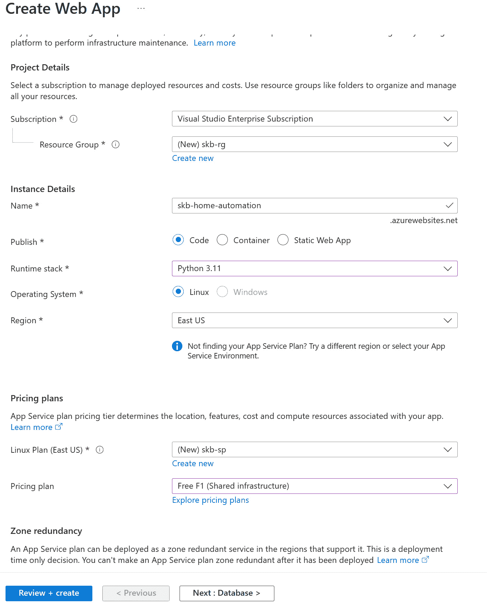

图 8.6 – 创建一个免费的 Web 应用程序以托管我们的 API

将您的 API 部署到 Web 应用程序的最简单方法是使用 GitHub。为此，我们需要为这个 Web API 创建一个新的、干净的 GitHub 仓库，并将[`github.com/PacktPublishing/Microsoft-Semantic-Kernel/tree/main/python/ch8`](https://github.com/PacktPublishing/Microsoft-Semantic-Kernel/tree/main/python/ch8)的内容复制到其中。这需要是一个单独的仓库，因为您需要将整个仓库部署到 Web 应用程序中。例如，您可以将您的副本放在如`https://github.com/<your-github-username>/skb-home-automation`这样的地址上。请注意，我的 API 版本对您不可用；您必须部署自己的。

在您的 Web 应用程序中，转到**部署中心**，选择**GitHub**作为源。在**组织**中，选择您的用户名。选择仓库。

这将在您自己的账户下创建和部署 Web API。

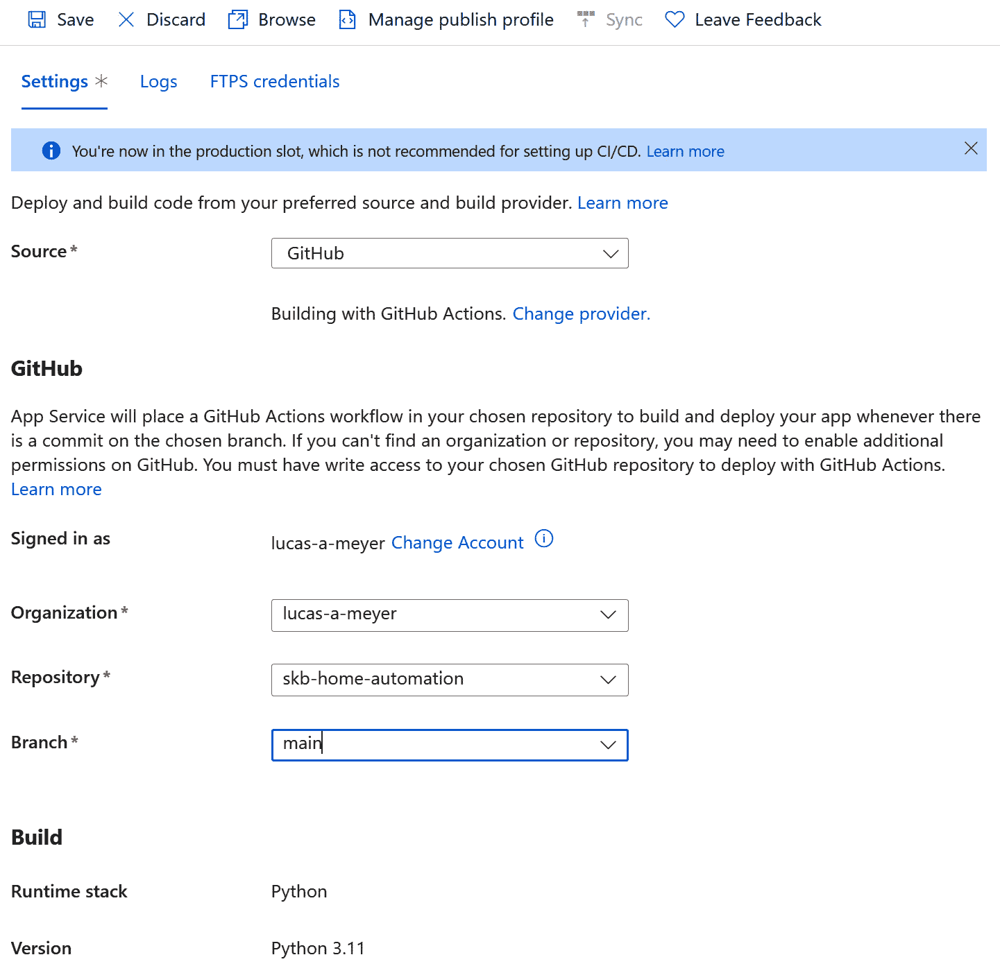

图 8.7 – 使用 GitHub 部署 Web API

一旦 Web API 部署完成，您可以使用`curl`或`Invoke-RestApi`对其进行测试。唯一的变化是，您需要将端点从 localhost 更改为您部署的端点。在我的情况下，我选择了`skb-home-automation.azurewebsites.net`（您的情况将不同）。请注意，我的 API 版本对您不可用；您必须部署自己的。

因此，我们可以提交以下内容：

```py
Invoke-RestMethod -Uri https://skb-home-automation.azurewebsites.net/operate_light -Method Post -ContentType "application/json" -Body '{"action": "on", "location": "bedroom"}'
```

结果将如下所示：

```py
Result
------
Changed status of the bedroom lights to on.
```

现在我们有一个正在工作的 Web API，我们需要将 API 与 ChatGPT 连接起来。

## 将定制 GPT 与您的定制 GPT 操作连接

要将我们的 Web API 与我们的定制 GPT 连接，我们需要给它一个 OpenAPI 规范。ChatGPT 使生成一个变得非常简单。

首先，转到我们的定制 GPT，从其名称中选择下拉菜单，并选择**编辑 GPT**：

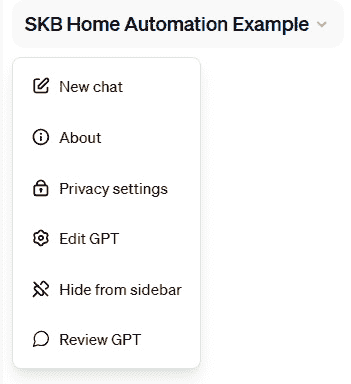

图 8.8 – 编辑我们的 GPT

在**配置**选项卡的底部，点击**动作**下的**创建新操作**。这将打开**添加动作**UI：

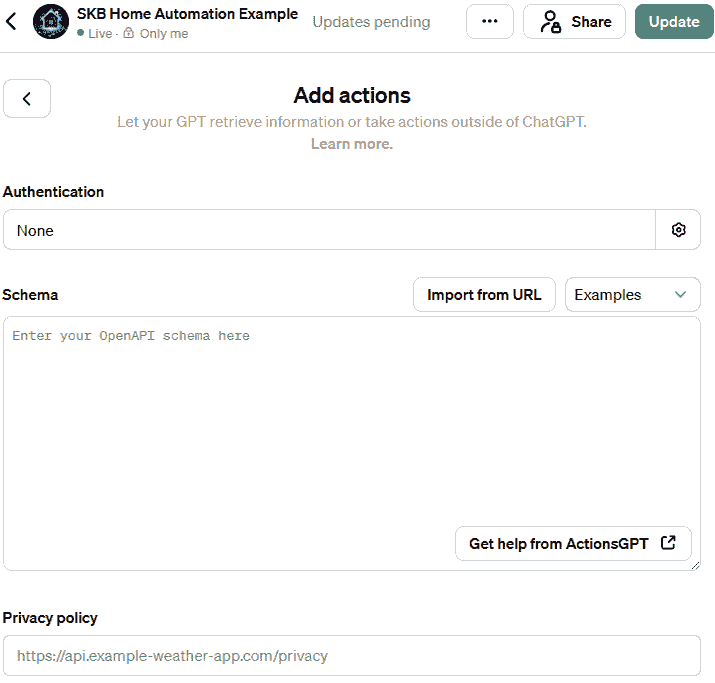

图 8.9 – 向我们的 GPT 添加操作

要添加操作，您需要使用名为**OpenAPI**的语言指定一个模式。ChatGPT 使这变得极其简单：点击**从 ActionGPT 获取帮助**将打开一个与另一个可以帮您创建 OpenAPI 规范的定制 GPT 的聊天对话框：

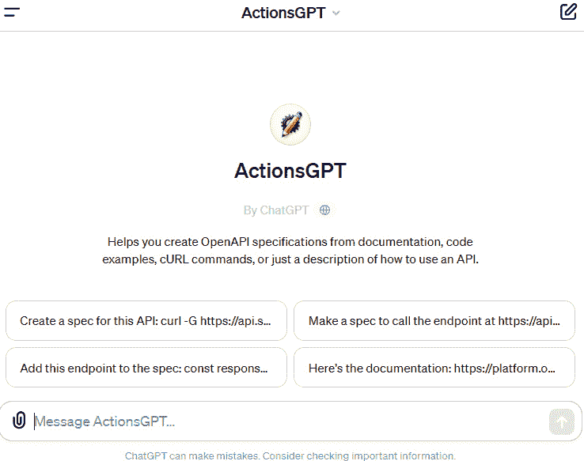

图 8.10 – 使用 ActionsGPT

在 ActionsGPT 中，您需要做的只是粘贴我们 Web API 的代码，它将自动生成 OpenAPI 规范。自动生成的内容如下，但我们需要做一些修改：

```py
openapi: 3.0.0
info:
  title: Home Automation API
  description: This API allows controlling lights and garage doors in a home automation system.
  version: 1.0.0
servers:
  - url: http://yourserver.com
    description: Main server
paths:
  /operate_light:
    post:
      operationId: operateLight
      summary: Controls a light in the home automation system.
      requestBody:
        required: true
        content:
          application/json:
            schema:
              type: object
              required:
                - location
                - action
              properties:
                location:
                  type: string
                  description: The location of the light to be controlled.
                action:
                  type: string
                  description: The action to be performed on the light.
                  enum:
                    - turnOn
                    - turnOff
                    - toggle
      responses:
        '200':
          description: Operation result
          content:
            application/json:
              schema:
                type: object
                properties:
                  result:
                    type: string
                    description: The result of the light operation.
  /operate_garage_door:
    post:
      operationId: operateGarageDoor
      summary: Controls the garage door in the home automation system.
      requestBody:
        required: true
        content:
          application/json:
            schema:
              type: object
              required:
                - action
              properties:
                action:
                  type: string
                  description: The action to be performed on the garage door.
                  enum:
                    - open
                    - close
                    - stop
      responses:
        '200':
          description: Operation result
          content:
            application/json:
              schema:
                type: object
                properties:
                  result:
                    type: string
                    description: The result of the garage door operation.
```

值得注意的是，它不知道我的服务器的名称或灯光安装地点的限制。它还试图猜测命令。因此，我们必须在规范中添加正确的限制。另一个需要注意的细节是，我所有的端点都有 `x-openai-isConsequential: false` 参数。当该参数为 `true` 或空白时，ChatGPT 将对每个发出的命令请求确认。对于我们的目的，我们不需要这个，但您的用例可能需要它，例如，当用户决定进行支付时。

这是修正后的版本，更改内容以粗体突出显示：

```py
openapi: 3.0.0
info:
  title: Home Automation API
  description: This API allows controlling lights and garage doors in a home automation system.
  version: 1.0.0
servers:
  - url: https://skb-home-automation.azurewebsites.net
    description: Main server
paths:
  /operate_light:
    post:
      operationId: operateLight
      summary: Controls a light in the home automation system.
      x-openai-isConsequential: false
      requestBody:
        required: true
        content:
          application/json:
            schema:
              type: object
              required:
                - location
                - action
              properties:
                location:
                  type: string
                  description: The location of the light to be controlled.
                  enum:
                    - "kitchen"
                    - "living room"
                    - "bedroom"
                    - "garage"
                action:
                  type: string
                  description: The action to be performed on the light.
                  enum:
                    - "on"
                    - "off"
      responses:
        '200':
          description: Operation result
          content:
            application/json:
              schema:
                type: object
                properties:
                  result:
                    type: string
                    description: The result of the light operation.
  /operate_garage_door:
    post:
      operationId: operateGarageDoor
      summary: Controls the garage door in the home automation system.
      x-openai-isConsequential: false
      requestBody:
        required: true
        content:
          application/json:
            schema:
              type: object
              required:
                - action
              properties:
                action:
                  type: string
                  description: The action to be performed on the garage door.
                  enum:
                    - "open"
                    - "close"
      responses:
        '200':
          description: Operation result
          content:
            application/json:
              schema:
                type: object
                properties:
                  result:
                    type: string
                    description: The result of the garage door operation.
```

您可以将这个修正后的版本粘贴到**模式**框中，并在右上角点击**更新**。这将部署与您使用语义内核开发的本地应用程序连接的自定义 GPT。

在这里，您将看到一个与我们的自定义 GPT 的真实对话示例，其中我要求它操作几个设备：

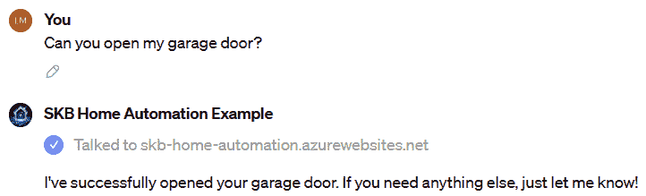

图 8.11 – 使用我们的 SKB 家居自动化自定义 GPT

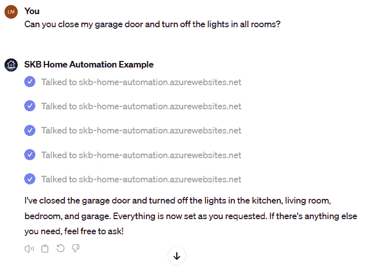

图 8.12 – 使用我们的 SKB 家居自动化自定义 GPT

首先，我要求 GPT 打开我的车库门。它正确地使用适当的命令调用了 API。接下来，我要求它执行一个复杂的命令：关闭我的车库门并关闭所有灯光。如*图 8**.12 所示，它发出了五个命令。查看 Web API 的日志，您将能够看到命令被正确发送：

```py
2024-04-08T05:16:27.968713802Z: [INFO]  Changed the status of the garage door to close.
2024-04-08T05:16:30.939181143Z: [INFO]  Changed status of the kitchen lights to off.
2024-04-08T05:16:33.701639742Z: [INFO]  Changed status of the living room lights to off.
2024-04-08T05:16:36.377148658Z: [INFO]  Changed status of the bedroom lights to off.
2024-04-08T05:16:39.017400267Z: [INFO]  Changed status of the garage lights to off.
```

如果我要求一个它无法执行的命令，它也会正确地回应它能做什么：

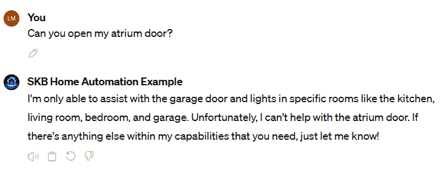

图 8.13 – 向自定义 GPT 发出无效命令

将应用程序与自定义 GPT 连接的两个主要后果如下：

+   `关闭我所有的灯`，ChatGPT 将解析它们并将它们发送到您的应用程序。如果用户请求应用程序中不可用的功能，ChatGPT 会告诉他们可以做什么和不能做什么。

+   **您的应用程序获得广泛的分布和访问 ChatGPT 提供的所有 UI 设施的权限**：任何可以访问 ChatGPT 的人都可以使用您的应用程序，甚至可以从他们的手机上使用。他们还可以使用语音来使用该应用程序，因为 ChatGPT 支持语音命令。

在本节中，我们看到了如何将我们编写的应用程序与 ChatGPT 连接起来，使其能够被数亿 ChatGPT 用户使用。

# 摘要

在本章中，我们通过开发自定义 GPT 并向其添加自定义操作，将应用程序与 OpenAI 的 ChatGPT 连接起来。这可以使应用程序获得访问基于 ChatGPT 用户最新模型的规划器的权限，这通常是一个非常先进的模型。

此外，我们所学到的东西让你可以以最小的努力将你的应用程序部署给数亿用户，并获得 ChatGPT 用户可用的几个新功能，例如自然语言请求和语音请求。这也允许你更快地将你的应用程序部署给用户，因为你不必自己开发 UI——你可以在开发并扩展你的应用程序时使用 ChatGPT 作为 UI。

如果你是一名 Python 程序员，Microsoft Semantic Kernel 在默认的 OpenAI Python API 提供的基础上增加了几个额外功能。其中，你得到了提示和代码之间的分离、原生函数、规划器、核心插件以及与内存的接口。所有这些都可以缩短你创建和维护代码所需的时间。鉴于目前 AI 领域的变化量，能够节省一些时间是件好事。

如果你是一名 C#开发者，除了可以获得 Python 程序员所获得的好处之外，你还会发现，与 OpenAI 不提供 C# API 相比，Microsoft Semantic Kernel 是将 C#应用程序连接到 OpenAI 模型的最佳方式。你可以用 REST API 做很多事情，正如我们在创建 DALL-E 3 图像时在*第四章*中展示的那样，但 REST API 使用起来繁琐，并且在过去一年中有所变化。使用 Microsoft Semantic Kernel 大大简化了这些事情，并且当发生变化时，它们很可能会在未来版本中集成。

至此，我们与 Microsoft Semantic Kernel 的旅程告一段落。作为一个临别思考，Semantic Kernel 和 AI 模型只是工具。你对世界的影响取决于你如何使用这些工具。在我的职业生涯中，我很幸运能够使用技术，最近则是 AI，为社会做出贡献。我希望你也能做到同样的事情。
