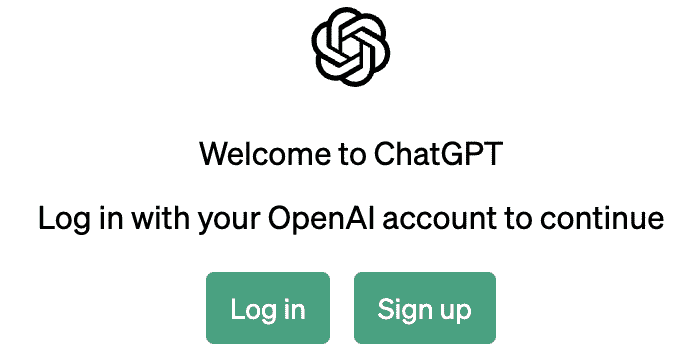
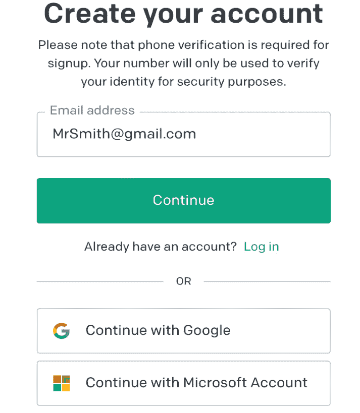
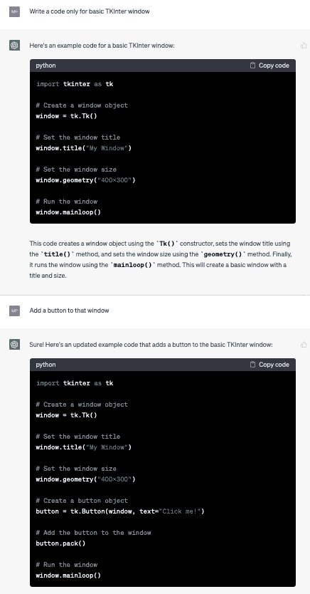
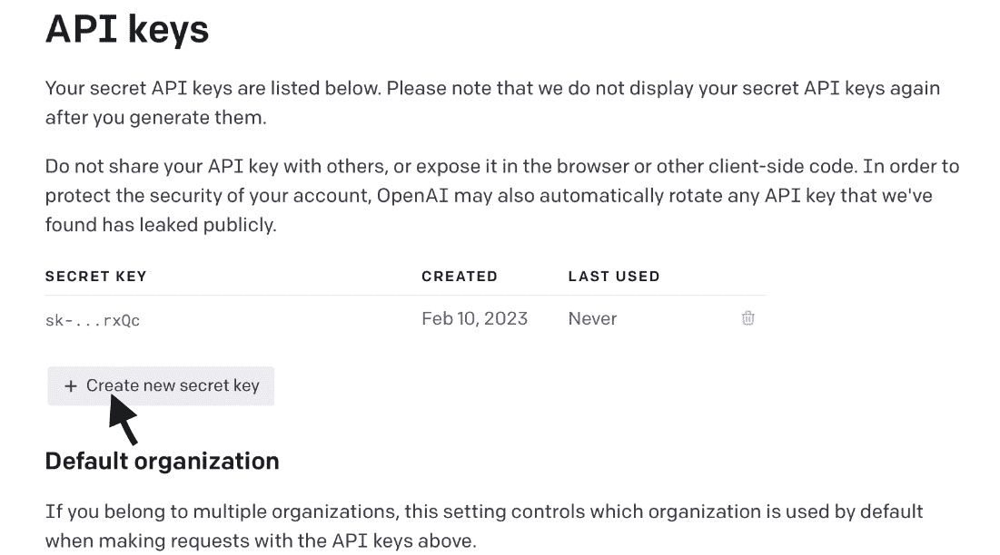
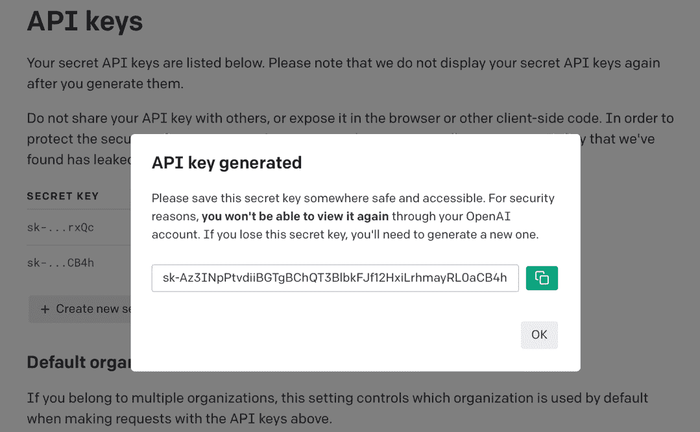
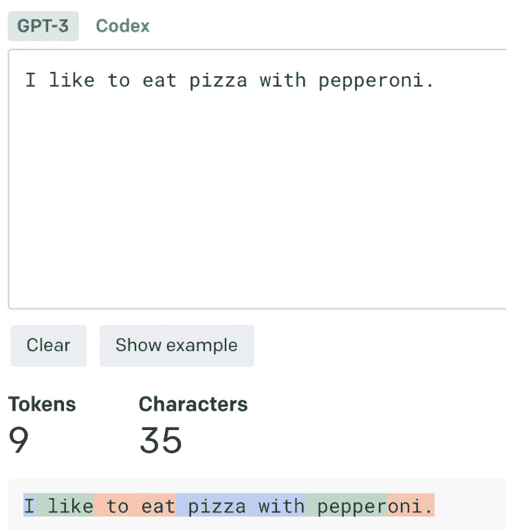
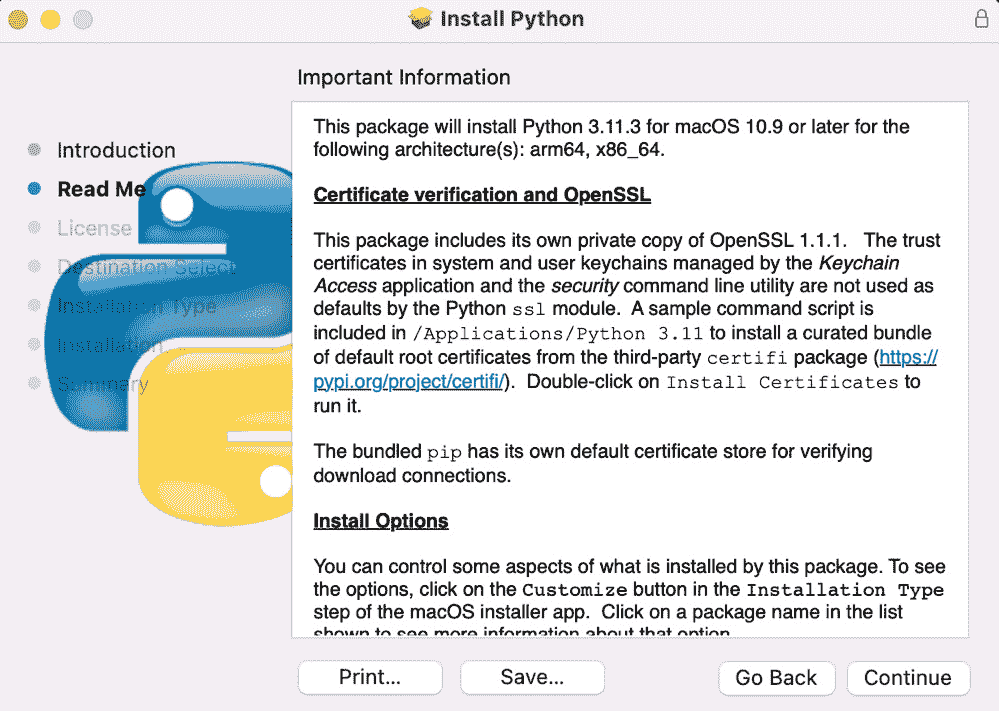
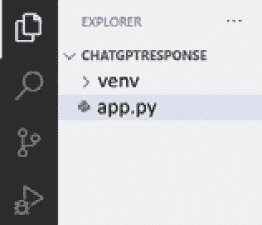
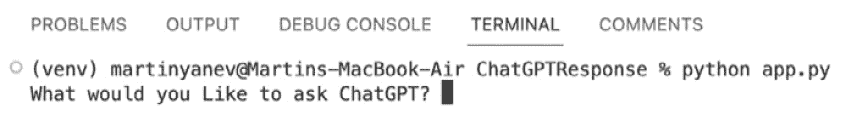

# 第二章：1<st c="0"></st>

# 开始使用 ChatGPT API 进行 NLP 任务<st c="2"></st>

**<st c="52">自然语言处理</st>** <st c="80">(**<st c="82">NLP</st>**<st c="85">**)是人工智能<st c="102">（**<st c="127">AI</st>**<st c="129">**）</st>领域的一个分支，专注于通过自然语言进行人机交互。<st c="144">多年来，自然语言处理在语言理解领域取得了显著的进步；**<st c="308">ChatGPT</st>**<st c="315">是近年来在 NLP 领域获得显著流行的一种革命性 NLP 工具。</st>

ChatGPT 是由**<st c="461">OpenAI</st>**<st c="467">开发的高级 AI 语言模型，并在包括书籍、文章和网页在内的各种文本的庞大数据集上进行了训练。<st c="574">凭借其理解和生成类似人类文本的能力，ChatGPT 已成为许多 NLP 应用（包括聊天机器人、语言翻译和内容生成）的首选工具。</st>

本章中，我们将探讨 ChatGPT 的基础知识以及如何使用它来执行 NLP 任务。<st c="759">我们将从介绍 ChatGPT 及其对 NLP 领域的影响开始。</st> <st c="858">然后我们将探讨如何从网络使用 ChatGPT 及其优势。</st> <st c="940">接着，我们将学习如何开始使用 ChatGPT API，包括创建账户和生成 API 密钥。</st> <st c="1011">之后，我们将了解如何设置开发环境以与 ChatGPT API 一起工作。</st> <st c="1133">最后，我们将通过一个简单的 ChatGPT API 响应示例来了解该工具的基本功能。</st>

本章中，我们将涵盖以下主题：<st c="1363"></st> <st c="1399">以下内容：</st>

+   <st c="1416">ChatGPT 革命</st> <st c="1421"></st>

+   从网络使用 ChatGPT<st c="1439"></st> <st c="1459"></st>

+   开始使用 ChatGPT API<st c="1466"></st> <st c="1492"></st>

+   设置您的 Python<st c="1503">开发环境</st> <st c="1527"></st>

+   简单的 ChatGPT API 响应<st c="1550"></st> <st c="1568"></st>

到本章结束时，您将对该章内容有扎实的理解，了解 ChatGPT 及其如何高效地执行 NLP<st c="1580">任务。</st> <st c="1689"></st>

# 技术要求<st c="1707"></st>

为了充分利用本章内容，您需要一些基本工具来处理 Python 代码和 ChatGPT API。<st c="1730">本章将指导您完成所有软件安装和注册。</st> <st c="1850"></st> <st c="1913"></st>

您需要以下内容：<st c="1931"></st> <st c="1949">以下：</st>

+   在您的计算机上安装了<st c="1963">Python 3.7 或更高版本</st> <st c="1997"></st>

+   <st c="2010">一个 OpenAI API 密钥，可以通过注册一个</st> <st c="2073">OpenAI 账户</st>来获取

+   <st c="2087">一个代码编辑器，例如</st> **<st c="2111">VSCode</st>** <st c="2117">(推荐)，用于编写和运行</st> <st c="2150">Python 代码</st>

+   <st c="2161">基本的 Python 编程经验</st> <st c="2191">使用 Python</st>

<st c="2202">本章的代码示例可以在 GitHub 上找到</st> <st c="2262">在</st> [<st c="2265">https://github.com/PacktPublishing/Building-AI-Applications-with-ChatGPT-API</st>](https://github.com/PacktPublishing/Building-AI-Applications-with-ChatGPT-API)<st c="2341">。</st>

# <st c="2342">ChatGPT 革命</st>

<st c="2365">ChatGPT 是由 OpenAI 开发的高级</st> <st c="2388">AI 语言模型</st>，并在 NLP 领域产生了重大影响。</st> <st c="2416">该模型基于 transformer 架构，并在包括书籍、文章和</st> <st c="2632">网页在内的各种文本的大量数据集上进行了训练。

<st c="2642">ChatGPT 的一个关键特性是它能够生成连贯且上下文适当的文本。</st> <st c="2757">与之前的 NLP 模型不同，ChatGPT 对语言有更广泛的理解，并且可以生成与人类生成文本在风格和结构上相似的文本。</st> <st c="2923">这一特性使 ChatGPT 成为各种应用的宝贵工具，包括对话 AI 和</st> <st c="3027">内容创作</st>。

<st c="3044">ChatGPT 在对话 AI 领域也取得了显著进展，其中它被用于开发能够与人类自然互动的聊天机器人。</st> <st c="3207">凭借其理解上下文并生成与人类生成文本风格相似文本的能力，ChatGPT 已成为开发</st> <st c="3361">对话 AI</st>的必备工具。

<st c="3379">**<st c="3397">大型语言模型</st>** <st c="3418">(**<st c="3420">LLMs</st>**<st c="3424">)如 GPT-3 的出现，彻底改变了聊天机器人的格局。</st> <st c="3487">在 LLMs 之前，聊天机器人的功能有限，依赖于基于规则的系统，并具有预定义的响应。</st> <st c="3492">这些聊天机器人缺乏上下文理解，难以进行有意义的对话。</st> <st c="3604">然而，基于 LLMs 的聊天机器人经历了显著的变化。</st> <st c="3783">这些模型能够理解复杂的查询，生成连贯且细微的响应，并拥有更广泛的知识库。</st> <st c="3903">它们表现出改进的上下文理解能力，从用户交互中学习，并不断改进其性能。</st> <st c="4024">基于 LLMs 的聊天机器人通过提供更自然和个性化的交互，提升了用户体验，展示了聊天机器人技术的显著进步。</st>

<st c="4195">ChatGPT 在 NLP 领域有着悠久而成功的历史。</st> <st c="4259">该模型在多年中经历了多次改进，包括以下内容：</st>

+   **<st c="4344">GPT-1 (2018)</st>**<st c="4357">：拥有 1.17 亿个参数，并在多样化的网页集上进行训练。</st> <st c="4386">它在各种 NLP 任务中表现出色，包括问答、情感分析和</st> <st c="4434">语言翻译。</st>

+   **<st c="4566">GPT-2 (2019)</st>**<st c="4579">：拥有 15 亿个参数，并在超过 800 万个网页上进行训练。</st> <st c="4654">它在语言理解和生成方面取得了显著的进步，并成为各种</st> <st c="4767">NLP 应用中的广泛使用工具。</st>

+   **<st c="4784">GPT-3 (2020)</st>**<st c="4797">：拥有创纪录的 1750 亿个参数，为语言理解和生成设定了新的基准。</st> <st c="4912">它被用于各种应用，包括聊天机器人、语言翻译和</st> <st c="4996">内容创作。</st>

+   **<st c="5013">GPT-3.5</st>**<st c="5021">：在 OpenAI 的持续优化和改进后发布。</st> <st c="5087">在成本和性能比较中是目前最佳价值模型。</st>

+   **<st c="5154">GPT-4</st>**<st c="5160">：能够以更高的精度解决难题，这得益于其更广泛的一般知识和</st> <st c="5191">问题解决能力。</st>

<st c="5285">开发者可以利用</st> **<st c="5322">生成式预训练变换器</st>** <st c="5356">(</st>**<st c="5358">GPT</st>**<st c="5361">) 模型的力量，而无需从头开始训练自己的</st> <st c="5412">模型。</st> <st c="5434">这可以节省大量时间和资源，尤其是对于小型团队或</st> <st c="5509">个人开发者。</st>

在下一节中，你将学习如何从网页上使用 ChatGPT。<st c="5601">你将学习如何创建一个 OpenAI 账户并探索 ChatGPT 的</st> <st c="5672">网页界面。</st>

# <st c="5686">从网页上使用 ChatGPT</st>

<st c="5713">通过 OpenAI 网站与 ChatGPT 交互</st> <st c="5738">非常简单。</st> <st c="5793">OpenAI 提供</st> <st c="5808">一个基于网页的界面，可以在</st> [<st c="5852">https://chat.openai.com</st>](https://chat.openai.com)<st c="5875">找到，使用户能够无需</st> <st c="5924">任何先前的编码知识或设置即可与模型互动。</st> <st c="5971">一旦访问网站，您就可以开始输入您的问题或提示，模型将产生其最佳可能的答案或生成的文本。</st> <st c="6120">值得注意的是，网页上的 ChatGPT 还向用户提供各种设置和选项，使他们能够跟踪对话的上下文并保存与 AI 的所有互动历史。</st> <st c="6308">这种功能丰富的基于网页的 AI 交互方法使用户能够轻松地尝试模型的功能，并深入了解其广泛的应用潜力。</st> <st c="6489">要开始使用基于网页的界面，您需要通过 OpenAI 注册一个账户，我们将在下一节中详细介绍。</st> <st c="6637">一旦创建了账户，您就可以访问网页界面，开始探索模型的功能，包括各种设置和选项来增强您的</st> <st c="6803">AI 交互。</st>

## <st c="6819">创建 OpenAI 账户</st>

<st c="6846">在使用 ChatGPT</st> <st c="6868">或 ChatGPT API 之前，您必须在 OpenAI 网站上创建一个账户，这将使您能够访问公司开发的所有工具。</st> <st c="7014">为此，您可以访问</st> [<st c="7040">https://chat.openai.com</st>](https://chat.openai.com)<st c="7063">，在那里您将被要求登录或注册一个新账户，如图</st> *<st c="7148">图 1</st>**<st c="7156">.1</st>*<st c="7158">所示：</st>



<st c="7225">图 1.1 – OpenAI 欢迎窗口</st>

<st c="7259">只需点击</st> **<st c="7277">注册</st>** <st c="7284">按钮，按照提示进入注册窗口（见</st> *<st c="7354">图 1</st>**<st c="7362">.2</st>*<st c="7364">）。</st> <st c="7368">从那里，您可以选择输入您的电子邮件地址并点击</st> **<st c="7438">继续</st>**<st c="7446">，或者您可以选择使用 Google 或 Microsoft 账户注册。</st> <st c="7515">完成此步骤后，您可以选择一个密码并验证您的电子邮件，就像在其他任何网站的注册过程中一样</st> <st c="7627">注册过程。</st>

<st c="7648">完成注册</st> <st c="7683">流程后，您就可以开始探索 ChatGPT 的全部功能。</st> <st c="7750">只需点击</st> **<st c="7767">登录</st>** <st c="7773">按钮，如图 <st c="7793">图 1</st>**<st c="7801">.1</st>* <st c="7803">所示，并在登录窗口中输入您的凭证。</st> <st c="7855">登录成功后，您将获得对 ChatGPT 以及所有其他 OpenAI 产品的完全访问权限。</st> <st c="7951">通过这种简单易用的访问方式，您可以无缝探索 ChatGPT 的全部功能，并亲眼见证它为何成为 NLP 任务如此强大的工具</st> <st c="8111">。</st>



<st c="8408">图 1.2 – OpenAI 注册窗口</st>

<st c="8447">现在我们可以更详细地探索 ChatGPT 网页界面的功能和特性。</st> <st c="8546">我们将向您展示如何导航界面，并充分利用其多样化的选项，以从 AI 模型中获得最佳结果</st> <st c="8674">。</st>

## <st c="8683">ChatGPT 网页界面</st>

<st c="8705">ChatGPT 网页界面</st> <st c="8731">允许用户与 AI 模型交互。</st> <st c="8776">一旦用户注册服务并登录，他们可以将文本提示或问题输入到聊天窗口中，并从模型那里获得回应。</st> <st c="8925">您可以使用</st> **<st c="8964">发送消息</st>** <st c="8978">文本字段向 ChatGPT 提问。</st> <st c="8991">聊天窗口还会显示之前的消息和提示，使用户能够跟踪对话的上下文，如图 <st c="9124">F</st><st c="9125">图 1</st>**<st c="9132">.3</st>*<st c="9134"> 所示：</st>



<st c="9299">图 1.3 – ChatGPT 跟随对话上下文</st>

除了这些，ChatGPT 允许用户轻松记录与模型交互的历史。<st c="9462">用户的聊天记录会自动保存，稍后可以从左侧侧边栏访问以供参考或分析。</st> <st c="9581">此功能对于研究人员或希望跟踪与模型对话并评估其性能随时间变化的人来说特别有用。</st> <st c="9747">聊天记录还可以用于训练其他模型或比较不同模型的性能。</st> <st c="9848">你现在能够区分并使用不同 ChatGPT 模型的进步。</st> <st c="9934">您还可以通过网页使用 ChatGPT，包括创建账户和生成 API 密钥。</st> <st c="10028">ChatGPT API 灵活且可定制，可以节省开发者的时间和资源，使其成为聊天机器人、虚拟助手和自动内容生成的理想选择。</st> <st c="10211">在下一节中，您将学习如何使用 Python 轻松访问 ChatGPT API。</st> <st c="10284">。</st>

# <st c="10297">开始使用 ChatGPT API</st>

<st c="10334">ChatGPT API</st> **<st c="10339">是由 OpenAI 开发的，允许开发者与 GPT 模型进行 NLP 任务交互。</st> <st c="10350">此 API 提供了一个易于使用的界面，用于生成文本、完成提示、回答问题和执行其他 NLP 任务，使用的是最先进的机器学习模型。</st>**

<st c="10624">ChatGPT API 用于聊天机器人、虚拟助手和自动内容生成。</st> <st c="10717">它还可以用于语言翻译、情感分析和内容分类。</st> <st c="10811">API 灵活且可定制，允许开发者针对特定用例微调模型性能。</st> <st c="10935">现在让我们了解获取 API 密钥的过程。</st> <st c="10991">这是从您自己的应用程序访问 ChatGPT API 的第一步。</st>

## <st c="11070">获取 API 密钥</st>

<st c="11091">要使用 ChatGPT API，您需要获取</st> <st c="11139">一个 API 密钥。</st> <st c="11152">这可以从 OpenAI 获取。</st> <st c="11172">此密钥将允许您验证对 API 的请求，并确保只有授权用户才能访问</st> <st c="11300">您的账户。</st>

<st c="11313">要获取 API 密钥，您必须</st> <st c="11344">使用 ChatGPT 凭据访问</st> [<st c="11375">https://platform.openai.com</st>](https://platform.openai.com) <st c="11402">的 OpenAI 平台。</st> <st c="11435">OpenAI 平台页面提供了一个管理您的 OpenAI 资源的中心枢纽。</st> <st c="11519">一旦</st> <st c="11523">您注册成功，您就可以导航到 API 访问页面：</st> [<st c="11585">https://platform.openai.com/account/api-keys</st>](https://platform.openai.com/account/api-keys)<st c="11629">。在 API 访问页面上，您可以管理 ChatGPT API 和其他 OpenAI 服务的 API 密钥。</st> <st c="11731">您可以生成新的 API 密钥，查看和编辑每个密钥的权限，并监控 API 的使用情况。</st> <st c="11855">该页面提供了您 API 密钥的清晰概述，包括它们的名称、类型和创建日期，并允许您根据需要轻松撤销或重新生成密钥</st> <st c="12009">。</st>

<st c="12019">点击</st> **<st c="12033">+ 创建新的密钥</st>** <st c="12056">按钮，您的 API 密钥将被创建：</st>



<st c="12715">图 1.4 – 创建 API 密钥</st>

<st c="12747">创建您的 API 密钥后，您将只有一次机会复制它（见</st> *<st c="12823">图 1</st>**<st c="12831">.5</st>*<st c="12833">）。</st> <st c="12837">保护您的 API 密钥的安全和机密性非常重要，因为任何能够访问您的密钥的人都有可能访问您的账户并使用您的资源。</st> <st c="12997">您还应该小心不要将密钥与未经授权的用户共享，并避免将密钥提交到公共存储库或通过不安全的渠道以明文形式共享。</st>



<st c="13454">图 1.5 – 保存 API 密钥</st>

<st c="13484">在我们的应用程序和脚本中复制和粘贴 API 密钥</st> <st c="13504">使我们能够使用 ChatGPT API。</st> <st c="13583">现在，让我们来探讨 ChatGPT 的 token 及其在 OpenAI</st> <st c="13657">定价模型中的作用。</st>

## <st c="13671">API token 和定价</st>

<st c="13694">在使用 ChatGPT API 时，理解 token 的概念非常重要</st> <st c="13741">至关重要</st> <st c="13767">。</st> <st c="13779">Token 是模型用于处理和理解的文本的基本单元。</st>

<st c="13881">标记可以是单词或字符块，通过将文本分解成更小的部分来创建。</st> <st c="13989">例如，单词</st> *<st c="14012">汉堡</st>* <st c="14021">可以被分解为</st> *<st c="14046">ham</st>*<st c="14049">,</st> *<st c="14051">bur</st>*<st c="14054">, 和</st> *<st c="14060">ger</st>*<st c="14063">，而像</st> *<st c="14094">梨</st>* <st c="14098">这样的较短的单词是一个单独的标记。</st> <st c="14118">标记也可以以空白字符开头，例如</st> *<st c="14165">hello</st>* <st c="14170">或</st> *<st c="14174">bye</st>*<st c="14177">。</st>

<st c="14178">在 API 请求中使用的标记数量取决于输入和输出文本的长度。</st> <st c="14280">一般来说，一个标记大约对应于 4 个字符或 0.75 个英文单词。</st> <st c="14383">需要注意的是，文本提示和生成的响应的总长度不能超过模型的最大上下文长度。</st> *<st c="14530">表 1.1</st>* <st c="14539">显示了某些流行 ChatGPT 模型的标记限制。</st>

| **<st c="14601">模型</st>** | **<st c="14607">最大标记数</st>** |
| --- | --- |
| <st c="14618">gpt-4</st> | <st c="14624">8,192 标记</st> |
| <st c="14637">gpt-4-32k</st> | <st c="14647">32,768 标记</st> |
| <st c="14661">gpt-3.5-turbo</st> | <st c="14675">4,096 标记</st> |
| <st c="14688">gpt-3.5-turbo-0125</st> | <st c="14707">16,385 标记</st> |

<st c="14721">表 1.1 – API 模型标记限制</st>

<st c="14756">要了解更多关于文本如何转换为标记的信息</st> <st c="14799">，您可以查看 OpenAI 的</st>**<st c="14839">标记化工具</st>** <st c="14849">。</st> <st c="14856">标记化工具是 OpenAI 提供的一个有用的资源，用于了解文本如何转换为标记。</st> <st c="14970">该工具将文本分解成单个标记，并显示它们对应的字节偏移量，这对于分析和理解</st> <st c="15136">您的文本结构非常有用。</st>

<st c="15146">您可以在</st> <st c="15159">[<st c="15182">https://platform.openai.com/tokenizer</st>](https://platform.openai.com/tokenizer)<st c="15219">] 找到标记化工具。要使用标记化工具，只需</st> <st c="15254">输入您想要分析的文本并选择合适的模型和设置。</st> <st c="15337">然后，该工具将生成一个标记列表，以及它们对应的字节偏移量（见</st> *<st c="15432">图 1</st>**<st c="15440">.6</st>*<st c="15442">）。</st>



<st c="15572">图 1.6 – 标记化工具</st>

<st c="15603">ChatGPT API 的定价</st> <st c="15627">是按照每处理 1,000 个令牌计费</st> <st c="15684">，并且每个 API 请求有最低费用。</st> <st c="15735">这意味着你的输入和输出文本越长，处理的令牌就越多，费用也就越高。</st> *<st c="15862">表 1.2</st>* <st c="15871">显示了截至 2024 年 5 月，处理 1,000 个令牌的当前成本，适用于几个常用的 ChatGPT 模型。</st>

| **<st c="15981">模型</st>** | **<st c="15987">提示</st>** | **<st c="15994">完成</st>** |
| --- | --- | --- |
| <st c="16005">gpt-4</st> | <st c="16011">$0.03 /</st> <st c="16020">1K 令牌</st> | <st c="16029">$0.06 /</st> <st c="16038">1K 令牌</st> |
| <st c="16047">gpt-4-32k</st> | <st c="16057">$0.06 /</st> <st c="16066">1K 令牌</st> | <st c="16075">$0.12 /</st> <st c="16084">1K 令牌</st> |
| <st c="16093">gpt-3.5-turbo</st> | <st c="16107">$0.0005 /</st> <st c="16118">1K 令牌</st> | <st c="16127">$0.0015 /</st> <st c="16138">1K 令牌</st> |
| <st c="16147">gpt-3.5-turbo-0125</st> | <st c="16166">$0.0005 /</st> <st c="16177">1K 令牌</st> | <st c="16186">$0.0015 /</st> <st c="16197">1K 令牌</st> |

<st c="16206">表 1.2 – ChatGPT API 模型定价</st>

<st c="16244">重要提示</st>

<st c="16259">注意你的令牌使用情况，以避免意外收费。</st> <st c="16340">你可以通过</st> **<st c="16414">使用情况</st>** <st c="16419">仪表板</st> <st c="16430">在</st> [<st c="16433">https://platform.openai.com/account/usage</st>](https://platform.openai.com/account/usage)<st c="16474">上跟踪你的使用情况和监控</st> <st c="16419">账单信息。</st>

<st c="16475">正如你所见，ChatGPT 是一个易于使用的界面，允许开发者与 GPT 模型进行 NLP 任务交互。</st> <st c="16594">令牌是模型用于处理和理解输入和输出文本的基本文本单元。</st> <st c="16701">ChatGPT API 的定价结构基于处理的令牌数量，每个 API 请求有最低费用。</st>

<st c="16825">在下一节中，我们将介绍</st> <st c="16860">如何设置 Python 开发环境</st> <st c="16909">以使用 ChatGPT API。</st> <st c="16944">这包括安装 Python 和 VSCode 的</st> `<st c="17223">venv</st>` <st c="17227">模块以及如何在 VSCode 中访问</st> **<st c="17257">终端</st>** <st c="17265">选项卡。</st>

# <st c="17284">设置你的 Python 开发环境</st>

<st c="17331">在我们开始编写</st> <st c="17355">我们的第一个代码之前，创建一个工作环境并安装任何必要的依赖项是很重要的。</st> <st c="17463">幸运的是，Python 有一个出色的工具系统来管理虚拟环境。</st> <st c="17550">Python 中的虚拟环境是一个复杂的话题，但就本书的目的而言，只需知道它们是独立的 Python 环境，与您的全局 Python 安装分开即可。</st> <st c="17756">这种隔离允许开发者使用不同的 Python 版本，在环境中安装包，并管理项目依赖项，而不会干扰 Python 的</st> <st c="17936">全局安装。</st>

<st c="17956">为了在您的 NLP 项目中使用 ChatGPT API，您需要设置您的 Python 开发环境。</st> <st c="18076">本节将指导您完成启动所需的步骤，包括以下内容：</st>

+   <st c="18172">安装 Python</st>

+   <st c="18190">安装</st> <st c="18206">VSCode IDE</st>

+   <st c="18216">安装</st> `<st c="18228">pip</st>`

+   <st c="18231">设置</st> <st c="18245">虚拟环境</st>

+   <st c="18264">安装所需的</st> <st c="18289">Python 包</st>

<st c="18304">一个正确配置的开发环境</st> <st c="18350">将允许您向 ChatGPT 发送 API 请求，并在您的</st> <st c="18442">Python 代码中处理生成的响应。</st>

## <st c="18454">安装 Python 和 VSCode IDE</st>

<st c="18491">Python 是一种流行的</st> <st c="18511">编程语言</st> <st c="18532">，被广泛用于各种目的，包括机器学习和数据分析。</st> <st c="18621">您可以从官方网站下载并安装 Python 的最新</st> <st c="18660">版本，</st> [<st c="18706">https://www.python.org/downloads/</st>](https://www.python.org/downloads/) <st c="18739">(见</st> *<st c="18745">图 1.7</st>**<st c="18753">.7</st>*<st c="18755">).</st> <st c="18759">为了验证 Python 是否已安装，您可以在设备上的终端中输入以下内容：</st>

```py
 $ python --version
```

<st c="18882">一旦您下载了 Python 安装程序，只需按照说明在您的计算机上安装 Python</st> <st c="18978">即可。</st> <st c="18997">下一步是选择一个 IDE 来</st> <st c="19034">与之配合。</st>



<st c="20109">Figure 1.7 – Python installation</st>

<st c="20141">Python 开发者中一个流行的选择是 VSCode，这是一个强大且用户友好的 IDE。</st> <st c="20230">VSCode 提供了一系列功能，使开发 Python</st> <st c="20306">应用程序变得容易，包括代码补全、调试工具和项目</st> <st c="20377">管理功能。</st>

<st c="20401">要安装 VSCode，您可以从 VSCode 网站免费</st> <st c="20437">下载它</st>，[<st c="20475">https://code.visualstudio.com/download</st>](https://code.visualstudio.com/download)<st c="20513">。下载安装程序后，只需</st> <st c="20561">按照说明在您的计算机上安装 VSCode。</st>

## <st c="20621">设置 Python 虚拟环境</st>

<st c="20661">设置 Python 虚拟环境</st> <st c="20701">是创建项目独立开发环境的关键步骤。</st> <st c="20786">通过创建虚拟环境，您可以在不干扰系统上其他项目的情况下安装特定版本的 Python 包和依赖项。</st> <st c="20934">您的系统。</st>

<st c="20946">为您的 ChatGPT 应用程序项目创建特定的 Python 虚拟环境是一种推荐的最佳实践。</st> <st c="21062">这样做可以确保所有包和依赖项都保存在您的项目文件夹中，而不是弄乱您计算机的全局 Python 安装。</st> <st c="21236">这种方法为项目开发和执行提供了一个更组织化和隔离的环境。</st>

<st c="21346">VSCode IDE 允许您使用其内置终端设置 Python 虚拟环境。</st> <st c="21443">您可以通过以下步骤设置您的</st> <st c="21485">VSCode 项目：</st>

1.  <st c="21500">在您的计算机上启动 VSCode。</st>

1.  <st c="21532">使用文件资源管理器或</st> `<st c="21665">ChatGPTResponse</st>`<st c="21680">。</st>

1.  <st c="21681">创建文件夹后，通过选择**<st c="21740">文件</st>** <st c="21744">|</st> **<st c="21747">打开文件夹</st>** <st c="21758">并导航到您刚刚创建的文件夹来在 VSCode 中打开它。</st>

1.  <st c="21805">在打开的文件夹内，创建一个新的 Python 文件，您将在其中编写代码。</st> <st c="21889">您可以通过在</st> `<st c="21997">.py</st>` <st c="22000">扩展名上右键单击，例如</st> `<st c="22017">app.py</st>`<st c="22026">。</st>

1.  <st c="22027">通过选择**<st c="22080">视图</st>** <st c="22084">|</st> **<st c="22087">终端</st>** <st c="22095">从菜单中打开 VSCode 的集成终端。</st>

1.  <st c="22110">进入您的项目文件夹后，运行以下命令创建虚拟环境。</st> <st c="22207">第二个</st> `<st c="22218">venv</st>` <st c="22222">参数指的是您的虚拟环境文件夹名称：</st>

    ```py
    <st c="22349">venv</st> that contains the virtual environment (see *<st c="22397">Figure 1</st>**<st c="22405">.8</st>*). You can replace <st c="22427">venv</st> with any name you want.
    ```

1.  <st c="22455">要激活虚拟环境，请运行以下</st> <st c="22511">终端命令：</st>

    +   <st c="22528">在 Windows 上，运行以下终端命令以激活</st> <st c="22592">虚拟环境：</st>

        ```py
        <st c="22612">$ venv\Scripts\activate.bat</st>
        ```

    +   <st c="22640">在 macOS 或 Linux 上，运行以下终端命令来激活虚拟环境：</st>

        ```py
        <st c="22731">$ source venv/b</st><st c="22747">in/activate</st>
        ```



<st c="22793">图 1.8 – VSCode 项目层次结构</st>

<st c="22830">一旦激活，您应该在命令提示符或终端中看到虚拟环境的名称，如图所示。</st> <st c="22948">从这里，您可以安装您项目所需的任何包或依赖项，而不会干扰系统上的其他 Python 安装：</st> <st c="23085">。</st>

```py
 ChatGPTResponse % source venv/bin/activate <st c="23141">(venv)</st> ChatGPTResponse % <st c="23166">(venv)</st> ChatGPTResponse %
```

<st c="23190">重要提示</st>

<st c="23205">为了保持一致性，您需要为每个新创建的 Python 项目激活虚拟环境。</st>

<st c="23309">安装任何 Python 包的关键组件是</st> <st c="23325">pip</st> <st c="23372">。让我们看看如何检查 pip 是否已安装在您的系统上，以及如果需要的话如何安装它</st> <st c="23468">。</st>

## <st c="23481">pip 包安装器</st>

<st c="23507">pip 是 Python 的包安装器。</st> <st c="23534">它允许您轻松安装和管理第三方 Python 库和包，例如</st> `<st c="23640">openai</st> <st c="23646">。如果您使用的是 Python 的较新版本，</st> `<st c="23693">pip</st> <st c="23696">应该已经安装。</st> <st c="23726">您可以通过打开命令提示符或终端并键入</st> `<st c="23831">pip</st> <st c="23834">然后按下</st> *<st c="23860">Enter</st> <st c="23865">键来检查您的系统上是否已安装 pip。</st> <st c="23871">如果</st> `<st c="23874">pip</st> <st c="23877">已安装，您应该会看到一些描述其用法和命令的输出。</st>

<st c="23953">如果您的系统上没有安装 pip，您可以通过以下步骤安装它：</st> <st c="24026">。</st>

1.  <st c="24038">首先，从</st> <st c="24059">get-pip.py</st> <st c="24069">脚本从官方 Python</st> <st c="24102">网站下载：</st> [<st c="24111">https://bootstrap.pypa.io/get-pip.py</st>](https://bootstrap.pypa.io/get-pip.py) <st c="24147">。</st>

1.  <st c="24148">将文件保存到您容易访问的位置，例如桌面或</st> <st c="24246">下载文件夹。</st>

1.  <st c="24263">打开命令提示符或终端，导航到您保存</st> <st c="24348">get-pip.py</st> <st c="24358">文件的目录。</st>

1.  <st c="24364">运行以下命令来安装 pip：</st> <st c="24407">python get-pip.py</st> <st c="24424">。</st>

1.  <st c="24425">安装完成后，您可以通过在命令提示符或终端中键入</st> <st c="24508">pip</st> <st c="24511">并按下</st> *<st c="24561">Enter</st> <st c="24566">键来验证 pip 是否已安装。</st>

<st c="24567">你现在应该已经在你的系统上安装了 pip，并且可以使用它来安装 Python 的包和库</st> <st c="24673">。</st>

<st c="24684">这是一份关于如何在 NLP 项目中使用 ChatGPT API 设置 Python 开发环境的完整指南。</st> <st c="24804">设置虚拟环境是在创建一个独立开发环境的过程中一个关键步骤</st> <st c="24855">为你的项目。</st> <st c="24903">你现在可以准备使用 Python 与 ChatGPT API 进行交互，完成你的第一个实践练习，以与</st> <st c="25039">OpenAI 库</st>进行交互。

# <st c="25054">一个简单的 ChatGPT API 响应</st>

使用 Python 与 ChatGPT API 结合是一个相对简单的过程。<st c="25084">首先，你需要确保你已经创建了上一节中描述的名为</st> `<st c="25220">CHATGPTRESPONSE</st>` <st c="25235">的目录（参见</st> *<st c="25275">图 1</st>**<st c="25283">.8</st>*<st c="25285">）。</st> <st c="25289">一旦设置好，你就可以使用 OpenAI Python 库与 ChatGPT API 进行交互。</st> <st c="25388">在 VSCode 中打开一个新的终端，确保你处于你的项目文件夹和虚拟环境中，并安装</st> `<st c="25506">openai</st>` <st c="25512">包：</st>

```py
 $ pip install openai
```

<st c="25542">要开始，你需要将</st> `<st c="25585">openai</st>` <st c="25591">库导入到你的</st> `<st c="25610">app.py</st>` <st c="25616">文件中。</st> <st c="25623">此外，你还需要提供</st> `<st c="25651">你的 OpenAI API 密钥。</st>` <st c="25673">你可以通过遵循本书前几节中概述的步骤从 OpenAI 网站获得 API 密钥。</st> <st c="25794">然后，你需要在 Python 代码中将它设置为参数。</st> <st c="25857">一旦你的 API 密钥设置好，你就可以开始与</st> `<st c="25921">ChatGPT API</st>`进行交互：

```py
 from openai import OpenAI
client = OpenAI(api_key="YOUR_API_KEY")
```

<st c="25999">将</st> `<st c="26008">YOUR_API_KEY</st>` <st c="26020">替换为你从 OpenAI 平台页面获得的 API 密钥。</st> <st c="26082">通常，将 API 密钥保存在与你的主要代码相同的文件中并不是一个好的做法。</st> <st c="26168">在下一章中，我们将讨论如何安全地保存这些密钥。</st> <st c="26234">现在，你可以使用</st> `<st c="26285">input()</st>` <st c="26292">函数向用户提问：</st>

```py
<st c="26364">input()</st> function is used to prompt the user to input a question they would like to ask the ChatGPT API. The function takes a string as an argument, which is displayed to the user when the program is run. In this case, the question string is <st c="26605">"What would you like to ask ChatGPT?"</st>. When the user types their question and presses *<st c="26691">Enter</st>*, the <st c="26702">input()</st> function will return the string that the user typed. This string is then assigned to the question variable.
			<st c="26817">To pass the user question from your Python script to ChatGPT, you will need to use the ChatGPT API</st> `<st c="26917">create</st>` <st c="26923">function:</st>

```

response = client.chat.completions.create(

    model="gpt-3.5-turbo",

    messages=[

        {"role": "user", "content": f"{question}"},

    ]

    max_tokens=512,

    n=1,

    stop=None,

    temperature=0.8,

)

```py

			<st c="27108">The</st> `<st c="27113">client.chat.completions.create()</st>` <st c="27145">function in the code is used to send a request to the ChatGPT API to generate the completion of the user’s input prompt.</st> <st c="27267">The</st> `<st c="27271">model</st>` <st c="27276">parameter allows us to specify the specific variant or version of the GPT model we want to utilize for the request, and in this case, it is set to</st> `<st c="27424">"gpt-3.5-turbo"</st>`<st c="27439">.</st> `<st c="27441">messages</st>` <st c="27449">is a list of dictionaries that specifies the text prompts for the API to complete, which is the user’s input question in</st> <st c="27571">this case.</st>
			<st c="27581">The</st> `<st c="27586">max_tokens</st>` <st c="27596">parameter specifies the maximum number of tokens the request and the response should contain together.</st> <st c="27700">The</st> `<st c="27704">n</st>` <st c="27705">parameter specifies the number of completions to generate for the prompt.</st> <st c="27780">The</st> `<st c="27784">stop</st>` <st c="27788">parameter specifies the sequence where the API should stop generating</st> <st c="27859">the response.</st>
			<st c="27872">The</st> `<st c="27877">temperature</st>` <st c="27888">parameter controls</st> <st c="27907">the creativity of the generated response.</st> <st c="27950">It ranges from</st> `<st c="27965">0</st>` <st c="27966">to</st> `<st c="27970">1</st>`<st c="27971">. Higher values will result in more creative but potentially less coherent responses, while lower values will result in more predictable but potentially less interesting responses.</st> <st c="28152">Later in the book, we will delve into how these parameters impact the responses received</st> <st c="28241">from ChatGPT.</st>
			<st c="28254">The function returns a</st> `<st c="28278">ChatCompletion</st>` <st c="28292">object containing the generated response from the ChatGPT API, which</st> <st c="28361">then can be accessed and printed to the console in the next line</st> <st c="28427">of code:</st>

```

打印(response)

```py

			<st c="28451">From the terminal, you can run the project through the</st> `<st c="28507">app.py</st>` <st c="28513">file using the</st> <st c="28529">following command:</st>

```

$ python app.py

```py

			<st c="28563">You should receive a message in the</st> **<st c="28600">TERMINAL</st>** <st c="28608">window that asks you to write a question for ChatGPT (see</st> *<st c="28667">Figure 1</st>**<st c="28675">.9</st>*<st c="28677">).</st>
			

			<st c="28843">Figure 1.9 – Asking ChatGPT a question</st>
			<st c="28881">Once you have entered your question, press the</st> *<st c="28929">Enter</st>* <st c="28934">key to submit your request to the ChatGPT API.</st> <st c="28982">The response</st> <st c="28994">generated by the ChatGPT API model will be displayed in the TERMINAL window as a complete</st> `<st c="29085">ChatCompletion</st>` <st c="29099">object:</st>

```

ChatCompletion(

    id='chatcmpl-8xoDCiDPy0ZUzjLtJMTTHZ0keGeEh',

    choices=[

        Choice(

            finish_reason='length',

            index=0,

            logprobs=None,

            message=ChatCompletionMessage(

                content='游泳是一种极佳的锻炼方式，也是一项宝贵的生存技能。以下是一些基本步骤来…',

                role='assistant',

                function_call=None,

                tool_calls=None

            )

        )

    ],

    created=1709265058,

    model='gpt-3.5-turbo-0125',

    object='chat.completion',

    system_fingerprint='fp_86156a94a0',

    usage=CompletionUsage(

        completion_tokens=20,

        prompt_tokens=11,

        total_tokens=31

    )

)

```py

			<st c="29624">This response produced by the OpenAI API contains information about the response generated by the GPT-3.5 model.</st> <st c="29738">This response consists of the</st> <st c="29768">following fields:</st>

				*   <st c="29785">The</st> `<st c="29790">id</st>` <st c="29792">field is a unique identifier for the API request that generated</st> <st c="29857">this response.</st>
				*   <st c="29871">The</st> `<st c="29876">choices</st>` <st c="29883">field contains an array of objects with the generated responses, which in this case only contains one response object as the</st> <st c="30009">parameter</st> `<st c="30019">n=1</st>`<st c="30022">.</st>
				*   <st c="30023">The</st> `<st c="30028">finish_reason</st>` <st c="30041">field indicates the reason why the response was generated; in this case, it was because the model reached the</st> `<st c="30152">stop</st>` <st c="30156">condition provided in the request.</st> <st c="30192">Since in our case</st> `<st c="30210">stop=None</st>`<st c="30219">, the full response from the ChatGPT API</st> <st c="30260">was returned.</st>
				*   <st c="30273">The</st> `<st c="30278">index</st>` <st c="30283">variable of this particular choice in the array of choices, we can see only</st> `<st c="30360">index=0</st>` <st c="30367">as</st> `<st c="30371">n=0</st>`<st c="30374">.</st>
				*   <st c="30375">The</st> `<st c="30380">created</st>` <st c="30387">field specifies the Unix timestamp of when the response</st> <st c="30444">was created.</st>
				*   <st c="30456">The</st> `<st c="30461">model</st>` <st c="30466">field specifies the GPT-3.5 model that was used to generate</st> <st c="30527">the response.</st>
				*   <st c="30540">The</st> `<st c="30545">object</st>` <st c="30551">field specifies the type of object that was returned, which in this case</st> <st c="30625">is</st> `<st c="30628">chat.completion</st>`<st c="30643">.</st>
				*   `<st c="30644">system_fingerprint</st>` <st c="30663">is an identifier for the current combination of model weights</st> <st c="30726">and infrastructure.</st>

			<st c="30745">The</st> `<st c="30750">ChatCompletionMessage</st>` <st c="30771">object includes the information related to the specific ChatGPT response.</st> <st c="30846">It includes</st> <st c="30858">the following:</st>

				*   `<st c="30872">content</st>`<st c="30880">: The completed answer generated by</st> <st c="30917">the model</st>
				*   `<st c="30926">role</st>`<st c="30931">: Indicates the role of the message; in this case, it’s from</st> <st c="30993">the assistant</st>
				*   `<st c="31006">function_call</st>`<st c="31020">: Any function calls associated with</st> <st c="31058">the completion</st>
				*   `<st c="31072">tool_calls</st>`<st c="31083">: Any tool calls associated with</st> <st c="31117">the completion</st>

			<st c="31131">Finally, the</st> `<st c="31145">usage</st>` <st c="31150">field provides information about the resource usage of the API request.</st> <st c="31223">It contains information about the number of tokens used for the completion, the number of tokens in the prompt, and the total number of</st> <st c="31359">tokens used.</st>
			<st c="31371">The most important parameter</st> <st c="31400">from the response is the</st> `<st c="31426">message</st>` <st c="31433">field, which contains the answer to the question asked to the ChatGPT API.</st> <st c="31509">This is why most API users would like to access only that parameter from the</st> `<st c="31586">ChatCompletion</st>` <st c="31600">object.</st> <st c="31609">You can easily separate the text from the main body</st> <st c="31661">as follows:</st>

```

answer = response.choices[0].message.content

print("OpenAI:" + answer)

```py

			<st c="31743">By following this approach, you can guarantee that the</st> `<st c="31799">answer</st>` <st c="31805">variable will hold the complete ChatGPT API text</st> <st c="31854">response, which you can then print to verify.</st> <st c="31901">Keep in mind that ChatGPT responses can significantly differ depending on the input, making each</st> <st c="31998">response unique:</st>

```

OpenAI:

游泳是一种极佳的锻炼方式，也是一项宝贵的生存技能。以下是一些基本步骤：

1\. 首先进入水中。如果你在游泳池游泳，你可以从侧面、梯子或跳板进入水中。如果你在海边或湖中游泳，你可以从岸边或码头进入水中。2\. 深吸一口气，然后慢慢呼出。这有助于你放松并准备游泳。

```py

			<st c="32443">ChatGPT can be employed for a multitude of NLP tasks across a wide array of topics accessible in the vast expanse of information.</st> <st c="32574">We can utilize our script to inquire about diverse areas of expertise and receive advanced responses from the ChatGPT API, as</st> <st c="32700">demonstrated here:</st>

				*   <st c="32718">Solving</st> <st c="32727">mathematical problems:</st>
    *   **<st c="32749">User</st>**<st c="32754">: What is the square root</st> <st c="32781">of 256?</st>
    *   **<st c="32788">ChatGPT</st>**<st c="32796">: The square root of 256</st> <st c="32822">is 16.</st>
				*   <st c="32828">Performing</st> <st c="32840">sentiment analysis:</st>
    *   **<st c="32859">User</st>**<st c="32864">: Analyze the sentiment of the sentence “I had a great</st> <st c="32920">day today!”</st>
    *   **<st c="32931">ChatGPT</st>**<st c="32939">: The sentiment of the sentence “I had a great day today!”</st> <st c="32999">is positive.</st>
				*   <st c="33011">Helping with</st> <st c="33025">programming tasks:</st>
    *   `<st c="33169">variable_name =</st>` `<st c="33185">value</st>`<st c="33190">.</st>
				*   <st c="33191">Improving</st> <st c="33202">scientific knowledge:</st>
    *   **<st c="33223">User</st>**<st c="33228">: What is the process of photosynthesis</st> <st c="33269">in plants?</st>
    *   **<st c="33279">ChatGPT</st>**<st c="33287">: The process of photosynthesis in plants is the fundamental mechanism by which they convert light energy into</st> <st c="33399">chemical energy.</st>
				*   <st c="33415">Answering questions related</st> <st c="33444">to literature:</st>
    *   **<st c="33458">User</st>**<st c="33463">: What are the major themes in Shakespeare’s</st> <st c="33509">play “Hamlet”?</st>
    *   **<st c="33523">ChatGPT</st>**<st c="33531">: “Hamlet,” one of Shakespeare’s most renowned tragedies, explores several major themes that continue to captivate audiences and</st> <st c="33661">provoke thought.</st>

			<st c="33677">In this section, you learned how to use the OpenAI Python</st> <st c="33735">library to interact with the ChatGPT API by sending a request to generate the completion of a user’s input prompt/question.</st> <st c="33860">You also learned how to set up your API key and how to prompt the user to input a question, and finally, how to access the generated response from ChatGPT in the form of an object containing information about the response.</st> <st c="34083">You are now ready to build more complex projects and integrate the ChatGPT API with</st> <st c="34167">other frameworks.</st>
			<st c="34184">Summary</st>
			<st c="34192">In this chapter, you learned the basics of getting started with the ChatGPT API.</st> <st c="34274">We covered the concept of NLP and how ChatGPT has revolutionized the field.</st> <st c="34350">You also learned how to access the ChatGPT API through the web interface and how to create an</st> <st c="34444">OpenAI account.</st>
			<st c="34459">We dived into the technical details of using the ChatGPT API, including obtaining an API key, API tokens, and pricing.</st> <st c="34579">We covered how to set up a Python development environment, specifically using the VSCode IDE, and creating a virtual environment.</st> <st c="34709">To help you get started with using the ChatGPT API, we walked through a simple example of obtaining a ChatGPT</st> <st c="34819">API response.</st>
			*<st c="34832">Chapter 2</st>*<st c="34842">,</st> *<st c="34844">Building a ChatGPT Clone</st>*<st c="34868">, builds upon the foundational knowledge gained in this chapter by guiding you through the process of creating your own ChatGPT clone using the Flask framework.</st> <st c="35029">This chapter will provide you with a comprehensive overview of how to seamlessly integrate the ChatGPT API with Flask to develop your first end-to-end</st> <st c="35180">AI application.</st>

```
