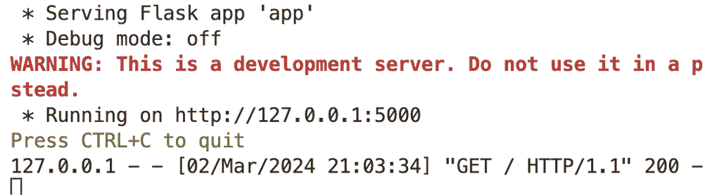
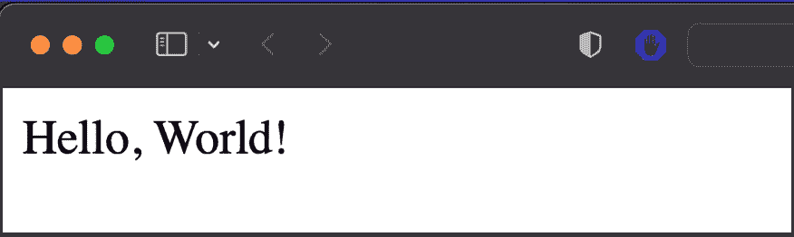
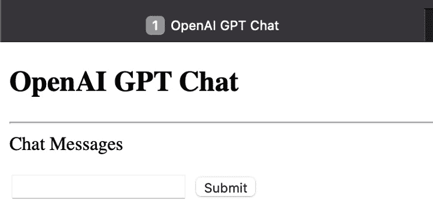
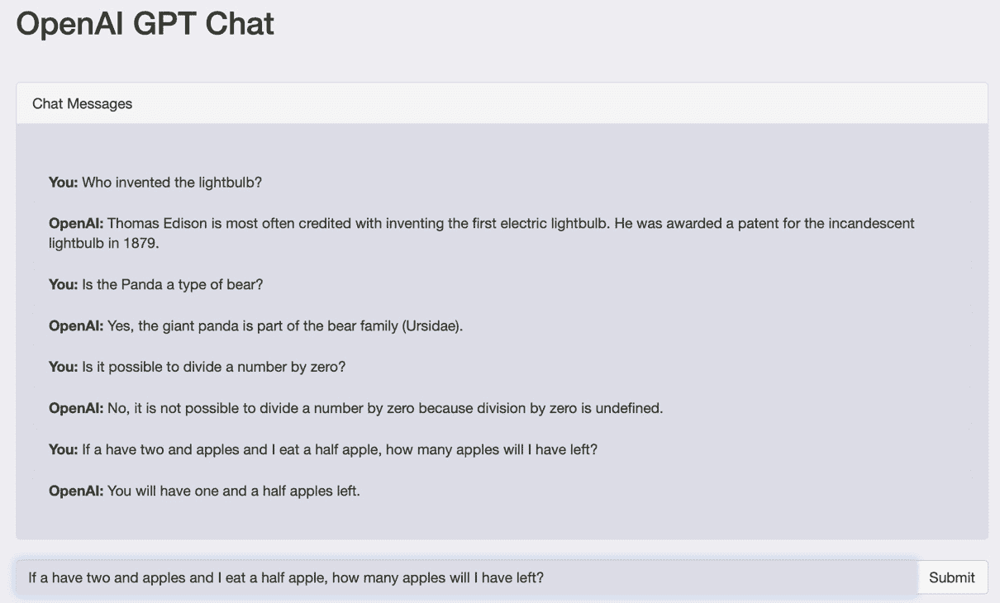
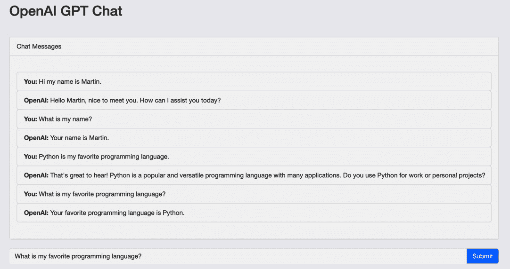

# 第三章：构建一个 ChatGPT 克隆

本章和本书的第一个应用将是一个**<st c="96">ChatGPT 克隆</st>**，它利用 OpenAI 强大的语言模型对用户输入生成类似人类的响应。<st c="226">该应用将使用**<st c="241">Flask</st>**<st c="246">构建，这是一个用于 Python 的轻量级 Web 框架，并具有简单优雅的前端界面，供用户与之交互。</st> <st c="373">只需几行代码，用户就可以输入文本并接收由 OpenAI 语言模型生成的响应。</st> <st c="506">具体来说，该应用将能够渲染一个简单的浏览器聊天界面，与聊天机器人进行交互。</st> <st c="619">聊天机器人将接受用户输入并将其发送到 ChatGPT API，向用户显示 ChatGPT API 的响应，并显示聊天历史。</st>

克隆应用将能够接收用户的输入，将其发送到 OpenAI 的 API，并实时接收响应，这些响应将显示给用户。<st c="917">该应用将可定制，以便使用不同的 OpenAI 模型以及其他选项，例如生成的文本的长度。</st>

初始时，我们的聊天机器人将缺乏维持上下文对话的能力。<st c="1138">虽然它将根据单个查询生成响应，但它将不具备保留先前交互信息的记忆。</st> <st c="1281">然后，我们将介绍一种简单而有效的技术，帮助我们的聊天机器人保持对话上下文，使用 GPT-3.5 模型的字典结构和角色。</st> <st c="1459">我们将探讨使我们的聊天机器人在进行中的对话上下文中理解和连贯响应的技术和工具。</st>

在本章中，我们将涵盖以下主题：

+   使用 Flask <st c="1678">创建一个 ChatGPT 克隆</st>

+   生成 ChatGPT 克隆的**<st c="1710">HTML</st>**

+   截获 ChatGPT 的 API 端点

+   <st c="1771">OpenAI 的 ChatGPT API 用于</st> <st c="1797">文本生成</st>

+   通过使用**<st c="1871">AJAX</st>**将用户输入从前端传递到后端

+   在前端显示生成的文本

+   保留和更新聊天上下文

当使用 Flask 构建一个 ChatGPT 克隆时，有一些事项需要牢记。<st c="2044">设置一个 Python 虚拟环境来将您的依赖项与其他机器上的项目分离是很重要的。</st> <st c="2170">这确保了您的项目拥有所有必要的依赖项，并且不会与其他项目发生冲突。</st> <st c="2276">此外，请确保安全地存储您的 ChatGPT API 密钥，以避免未经授权的访问。</st> <st c="2369">管理您的 API 请求也很重要，因为价格是基于处理令牌的数量。</st> <st c="2487">最后，Flask 在如何构建您的应用程序方面提供了灵活性，但随着项目的增长，保持代码的整洁和可维护性同样重要。</st> <st c="2641">项目。</st>

# 技术要求

为了充分利用本章内容，您将需要一些基本工具。<st c="2756">将提供前一章未涵盖的所有安装的深入解释。</st>

您将需要以下内容：

+   **<st c="2885">Python 3.7</st>** 或更高版本已安装在您的计算机上

+   **<st c="2936">OpenAI API 密钥</st>**，从您的 <st c="2971">OpenAI 账户</st> 获取

+   一个代码编辑器，例如 <st c="3009">VSCode（推荐）</st>

+   在您的 Python <st c="3075">虚拟环境</st> 中安装的 Flask 框架

本章的代码示例可以在 GitHub <st c="3154">上找到</st> [<st c="3157">https://github.com/PacktPublishing/Building-AI-Applications-with-ChatGPT-API</st>](https://github.com/PacktPublishing/Building-AI-Applications-with-ChatGPT-API)<st c="3233">。</st>

在下一节中，我们将开始使用 Flask 构建 ChatGPT 克隆，通过设置一个与 ChatGPT API 通信以生成对用户输入的响应的后端来构建 ChatGPT 克隆。<st c="3408">您将创建一个简单的 Flask 应用程序，并通过集成 ChatGPT API 来逐步增强它。</st> <st c="3510">我们还将对代码进行结构化，并将 ChatGPT API 密钥作为环境变量存储，以提高其安全性。</st>

# 使用 Flask 创建 ChatGPT 克隆

要使用 Flask 创建一个 ChatGPT 克隆，您需要设置一个后端，该后端与 ChatGPT API 通信以生成对用户输入的响应。<st c="3750">Flask 是一个流行的 Python 网络框架，可用于创建包括 ChatGPT 克隆在内的网络应用程序。</st> <st c="3868">我们将从创建一个简单的 Flask 应用程序开始我们的项目，并通过集成 ChatGPT API、额外的网页和前端来逐步增强它。</st> <st c="3919">我们将开始我们的项目，创建一个简单的 Flask 应用程序，并通过集成 ChatGPT API 来逐步增强它。</st> <st c="4069">我们还将对代码进行结构化，并将 ChatGPT API 密钥作为环境变量存储，以提高其安全性。</st>

1.  <st c="4082">要开始，创建一个新的文件夹并将其命名为</st> `<st c="4133">ChatGPT_Clone</st>`<st c="4146">。按照</st> *<st c="4232">第一章</st>*<st c="4241"> 中概述的步骤创建并激活你的 Python 虚拟环境。</st> <st c="4267">创建一个名为</st> `<st c="4267">app.py</st>` <st c="4273"> 的新文件，作为应用程序的后端，你将在其中定义 Flask 应用程序并与 ChatGPT API 交互。</st> <st c="4397">创建项目后，你需要使用</st> `<st c="4481">pip</st>`<st c="4484"> 安装 Flask 包。</st> <st c="4543">你可以在项目的终端中运行以下命令来完成此操作：</st>

    ```py
    <st c="4778">Flask</st> class and pass your application’s name as an argument. Here’s how you can create a new Flask app in your <st c="4889">app.py</st> file:

    ```

    from flask import Flask

    app = Flask(__name__)

    ```py

    ```

1.  <st c="4947">在 Flask 中，路由是用户可以访问的你的应用程序中的 URL 路径。</st> <st c="5023">你可以使用</st> `<st c="5055">@app.route</st>` <st c="5065"> 装饰器和 Python 函数来定义路由。</st> <st c="5099">让我们创建一个显示</st> `<st c="5134">Hello, World!</st>` <st c="5147"> 的路由，如下所示：</st>

    ```py
     @app.route("/")
    def index():
        return "Hello, World!"
    ```

1.  <st c="5211">最后，你可以使用</st> `<st c="5258">app.run()</st>` <st c="5267"> 方法运行你的 Flask 应用程序。</st> <st c="5276">这将允许你启动一个开发服务器，你可以在你的</st> <st c="5354">网络浏览器</st> 中访问它：</st>

    ```py
     if __name__ == "__main__":
        app.run()
    ```

1.  <st c="5403">一旦你</st> <st c="5413">创建了运行配置，你可以通过点击</st> `<st c="5557">app.py</st>` <st c="5563">并选择</st> **<st c="5582">运行</st>** <st c="5585">选项来运行你的 Flask 应用程序。</st> <st c="5594">然后你将在</st> **<st c="5653">运行</st>** <st c="5656">窗口中看到你的 Flask 应用的 URL，如图 <st c="5677">图 2</st>**<st c="5685"> 所示。</st><st c="5686">1</st>*<st c="5688">:</st>



<st c="5913">图 2.1 – Flask 应用程序 URL</st>

<st c="5947">按照这些步骤，你可以构建一个基本的 Flask 应用程序，当用户访问应用程序的根 URL 时，它会显示</st> `<st c="6020">Hello, World!</st>` <st c="6033">。</st> <st c="6086">从这里，你可以向 Flask 应用程序添加更多路由、模板和功能，使用 ChatGPT API 构建更复杂的 Web 应用程序（见图 <st c="6234">图 2</st>**<st c="6242">.2</st>*<st c="6244">）。</st>



<st c="6270">图 2.2 – Flask 应用程序页面</st>

<st c="6305">每个 ChatGPT 应用程序都从设置你的 API 密钥开始。</st> <st c="6369">当在 Python 文件中使用 ChatGPT API 密钥时，你通常会直接将密钥硬编码到文件中，就像你在构建简单的 ChatGPT API 响应时做的那样，这意味着密钥在代码本身中是可见的。</st> <st c="6591">如果有人获取了代码或你意外地将代码推送到公共仓库，这可能会带来安全风险。</st>

<st c="6716">另一方面，将 ChatGPT API 密钥作为环境变量添加意味着密钥存储在代码库之外，并且可以在运行时由代码访问。</st> <st c="6812">这使得它更安全，因为密钥不在代码本身中可见，并且可以轻松更改而无需修改</st> <st c="7005">代码。</st>

<st c="7014">另一种安全存储 API 密钥的方法是将它添加到一个单独的文件中，该文件保存在你的 Git 仓库之外。</st> <st c="7135">要遵循这种方法，让我们创建</st> `<st c="7173">config.py</st>` <st c="7182">，然后使用</st> `<st c="7200">config</st>` <st c="7206">包从</st> `<st c="7233">app.py</st>`<st c="7239">中访问它。以下代码是相应地构建这两个文件的示例：</st> <st c="7299">文件：</st>

<st c="7317">config.py</st>

```py
 API_KEY = "YOUR_API_KEY"
```

<st c="7352">app.py</st>

```py
 from flask import Flask <st c="7384">import config</st>
<st c="7397">client = OpenAI(</st>
 <st c="7414">api_key=config.API_KEY,</st>
<st c="7438">)</st> app = Flask(__name__)
@app.route("/")
def index():
    return "Hello, World!" if __name__ == "__main__":
    app.run()
```

<st c="7551">重要提示</st>

<st c="7566">如果你想要将你的</st> <st c="7592">项目推送到 Git 仓库，重要的是要将</st> `<st c="7648">config.py</st>` <st c="7657">文件添加到你的项目的</st> `<st c="7681">.gitignore</st>` <st c="7691">文件中，以防止意外将你的 API 密钥提交到</st> <st c="7748">版本控制。</st>

<st c="7764">让我们修改</st> <st c="7778">你的</st> `<st c="7804">index()</st>` <st c="7811">函数的功能，通过</st> <st c="7824">配置它从前端返回一个 HTML 模板：</st>

```py
 @app.route("/")
def index(): <st c="8020">("/")</st>. When a user navigates to the root URL, Flask will call the function decorated with <st c="8110">@app.route("/")</st>.
			<st c="8126">The function returns the result of</st> `<st c="8162">render_template("index.html")</st>`<st c="8191">. The</st> `<st c="8197">render_template</st>` <st c="8212">function is a Flask method that renders an HTML template.</st> <st c="8271">In this case, it renders the</st> `<st c="8300">index.html</st>` <st c="8310">template that will be created in the text section.</st> <st c="8362">You can also modify your imports to incorporate the</st> `<st c="8414">render</st>` <st c="8420">function:</st>

```

从`flask`库导入`Flask`和`<st c="8576">index.html</st>`文件通常是用户加载 Web 应用程序时看到的第一个页面。这是用户输入初始输入以开始与 ChatGPT API 聊天的地方。

            <st c="8768">下一步是构建一个函数，该函数将获取 ChatGPT API 的响应，这样你就可以在你的聊天克隆中使用该响应。</st> <st c="8904">你可以通过在`<st c="8986">index()</st>` <st c="8993">函数下方构建`<st c="8943">get_bot_response()</st>` <st c="8961">函数来轻松完成此操作：</st>

```py
 @app.route("/get")
def get_bot_response():
    userText = request.args.get('msg')
    response = client.chat.completions.create(
        model="gpt-3.5-turbo",
        messages=[
        {"role": "user", "content": f"{userText}"},
    ],
        max_tokens=1024,
        n=1,
        stop=None,
        temperature=1,
    )
    answer = response.choices[0].message.content
    return str(answer)
```

            <st c="9319">此代码</st> <st c="9330">为 Flask 应用程序设置了一个</st> `<st c="9340">/get</st>` <st c="9344">路由。</st> <st c="9370">当用户请求此路由时，</st> `<st c="9403">get_bot_response()</st>` <st c="9421">被调用。</st>

            <st c="9432">使用</st> `<st c="9437">request.args.get()</st>` <st c="9455">方法从 URL 查询字符串中检索`<st c="9500">msg</st>` <st c="9503">参数的值。</st> <st c="9541">此参数用作 ChatGPT API 的输入。</st> <st c="9598">稍后，我们将在前端创建一个按钮，当选择时将激活</st> `<st c="9668">/get</st>` <st c="9672">路由。</st>

            `<st c="9688">The</st>` `<st c="9693">client.chat.completions.create()</st>` 方法用于从 ChatGPT API 生成响应。它接受多个参数，例如要使用的模型、提供给 API 的消息以及响应中要生成的标记数量。

            `<st c="9933">在生成响应后，该函数使用字典键从 API 的响应中提取响应文本。</st>` `<st c="10052">最后，响应作为</st>` `<st c="10089">字符串返回。</st>`

            `<st c="10098">当用户键入消息并点击发送时，JavaScript 代码将向此路由发出 HTTP 请求以获取 AI 响应，然后将其显示在</st>` `<st c="10252">网页上。</st>`

            `<st c="10261">为了最终确定您的聊天机器人应用程序的后端，更新您的导入并添加任何必要的包</st>` `<st c="10384">以供</st>` `<st c="10388">get_bot_response()</st>` `<st c="10406">使用：</st>`

```py
 from flask import Flask, <st c="10434">request</st>, render_template <st c="10459">from openai import OpenAI</st> import config
```

            `<st c="10498">这就是您如何通过安装 Flask、定义路由、设置 API 密钥、创建 HTML 模板以及构建从 ChatGPT API 获取响应的功能来高效地创建 Flask 应用程序的方法。</st>` `<st c="10691">您还学习了如何构建配置文件的结构，并强调了保护</st>` `<st c="10820">API 密钥的重要性。</st>`

            `<st c="10828">在下一节中，您将学习如何将后端端点连接到聊天应用程序的前端。</st>` `<st c="10943">我们还将使用</st>` **`<st c="10960">jQuery</st>`** `<st c="10966">来处理前端和后端之间的通信，允许在聊天应用程序中进行实时消息传递。</st>`

            `<st c="11086">前端 HTML 生成</st>`

            `<st c="11111">让我们开始创建生成我们聊天应用前端的必要 HTML 和 CSS。</st>` `<st c="11175">我们将使用 HTML、CSS 和 Bootstrap 来创建</st>` `<st c="11262">用户</st>` `<st c="11271">界面，并使用 jQuery 来处理前端和后端之间的通信。</st>` `<st c="11358">HTML 和 CSS 将负责创建用户界面的结构和样式。</st>`

            `<st c="11454">在创建 Flask 网络应用程序时，建议将您的 HTML 文件保存在一个名为</st>` `<st c="11564">templates</st>` `<st c="11573">的单独文件夹中。这是因为</st>` `<st c="11591">Flask 使用</st>` `<st c="11606">Jinja2</st>` `<st c="11612">模板引擎，它允许您通过将其分成更小、可重用的部分来以更模块化的方式编写可重用的 HTML 代码，这些部分被称为模板。</st>`

            要创建`<div>templates</div>`文件夹，只需在项目目录中创建一个新的目录并命名为`<div>templates</div>`<div>。在`<div>templates</div>`文件夹内，您可以创建您的 HTML 文件，在这个例子中称为`<div>index.html</div>`。</div>要这样做，右键单击`<div>templates</div>`文件夹并选择**<div>New</div>** **<div>HTML file</div>**<div>。以下是项目目录应该看起来像什么：</div>

```py
 ChatGPTChatBot/
├── config.py
├── app.py
├── templates/
│   └── index.html
```

            创建一个`<div>templates</div>`文件夹很重要，因为它允许您将 HTML 文件与 Python 代码分开组织，这使得管理和管理您的 Web 应用更容易。</div>此外，Flask 框架专门设计为查找模板文件夹以渲染 HTML 模板，因此创建此文件夹对于您的`<div>Flask 应用</div>`的正常运行是必要的。

            我们现在可以使用 HTML 和 Bootstrap 创建我们的聊天应用的前端。</div>最初，我们的前端代码将包含一个基本的布局，包括聊天窗口、输入字段和提交按钮。</div>您可以将以下代码包含在您的`<div>index.html</div>`文件中：

```py
 <!DOCTYPE html>
<html>
<head>
    <title>OpenAI GPT Chat</title>
</head>
<body>
    <div class="container">
        <h2>OpenAI GPT Chat</h2>
        <hr>
        <div class="panel panel-default">
            <div class="panel-heading">Chat Messages</div>
            <div class="panel-body" id="chat">
                <ul class="list-group">
                </ul>
            </div>
        </div>
        <div class="input-group">
            <input type="text" id="userInput" class="form-control">
            <span class="input-group-btn">
                <button class="btn btn-default" id="submit">Submit</button>
            </span>
        </div>
    </div>
</body>
</html>
```

            `<div>!</div>`在代码开头的声明表示文档类型和版本。</div> `<div>!</div>`标签表示 HTML 文档的开始，而`<div>!</div>`标签包含有关文档的信息，例如文档的标题，该标题在`<div>!</div>`标签中指定。</div> `<div>!</div>`标签包含在浏览器中显示的文档的可视内容，包括聊天历史和用户消息。

            在 HTML 中，`<div>`元素是一个容器，用于将其他 HTML 元素分组并作为一个组应用样式。</div>它没有固有的语义意义，但其灵活性允许网页开发者以结构化的方式创建布局和组织内容。

            <st c="14040">第一个</st> `<st c="14051"><div></st>` <st c="14056">元素是一个容器的类属性。</st> <st c="14102">整个聊天应用程序都将包含在这个容器中。</st> <st c="14171">我们还有一个</st> `<st c="14187"><h2></st>` <st c="14191">元素，其文本为</st> `<st c="14214">"OpenAI GPT Chat"</st>`<st c="14231">。这是聊天应用程序的标题。</st>

            <st c="14275">接下来，我们有一个</st> `<st c="14293"><hr></st>` <st c="14297">元素，它用于创建一条水平线，以将标题与聊天界面的其余部分分开。</st> <st c="14408">之后，我们还有一个</st> `<st c="14440"><div></st>` <st c="14445">元素，其类属性为</st> `<st c="14480">panel panel-default</st>`<st c="14499">。这个</st> `<st c="14505">panel</st>` <st c="14510">将构建一个带有边框的容器，包含其中的内容，并通过填充提供额外的空间。</st> <st c="14640">此类用于创建一个包含聊天消息历史的面板。</st> <st c="14721">在聊天历史窗口中，还有两个</st> <st c="14763">更多元素。</st>

            <st c="14777">第一个</st> `<st c="14788"><div></st>` <st c="14793">元素具有类属性</st> `<st c="14827">panel-heading</st>` <st c="14840">并包含</st> `<st c="14858">"Chat Messages"</st>` <st c="14873">文本。</st> <st c="14880">这是包含聊天消息的面板的标题。</st>

            <st c="14950">第二个</st> `<st c="14962"><div></st>` <st c="14967">元素具有类属性</st> `<st c="15001">panel-body</st>` <st c="15011">和一个</st> `<st c="15019">id</st>` <st c="15021">属性为</st> `<st c="15035">chat</st>`<st c="15039">。此元素将用于显示聊天消息。</st> <st c="15097">在这个</st> `<st c="15109"><div></st>` <st c="15114">元素内部，我们有一个带有类属性</st> `<st c="15189">list-group</st>`<st c="15199">的无序列表元素，它将包含单个</st> <st c="15235">聊天消息。</st>

            <st c="15249">接下来，我们将</st> <st c="15264">构建一个输入框，用户可以在此输入他们的消息，以及一个提交按钮，将消息发送到服务器进行处理。</st> <st c="15391">输入框是通过使用</st> `<st c="15426"><input></st>` <st c="15433">标签并设置</st> `<st c="15443">type="text"</st>`<st c="15454">创建的。输入框有一个类为</st> `<st c="15485">"form-control"</st>`<st c="15499">，这是一个 Bootstrap 类，用于样式化表单</st> <st c="15549">控件元素。</st>

            <st c="15566">具有</st> `<st c="15606"><button></st>` <st c="15614">ID 为</st> `<st c="15633">submit</st>`<st c="15639">的</st> `<st c="15645">tag</st>` <st c="15656">类是 Bootstrap 类，用于将输入框和“提交”</st> <st c="15729">按钮组合在一起。</st>

            <st c="15745">一旦创建了基本的 HTML 文件，你可以通过运行</st> `<st c="15832">app.py</st>` <st c="15838">文件来激活你的应用程序（见</st> *<st c="15849">图 2</st>**<st c="15857">.3</st>*<st c="15859">）。</st>

            

            <st c="15918">图 2.3 – 初始 ChatGPT 克隆前端</st>

            <st c="15961">界面将包含一个标题，显示为</st> **<st c="16006">OpenAI GPT 聊天</st>**<st c="16021">，一个显示消息的聊天面板，以及底部的一个输入框，用户可以在其中输入他们的消息。</st> <st c="16140">此外，输入框旁边还将有一个</st> **<st c="16161">提交</st>** <st c="16167">按钮。</st> <st c="16198">然而，由于后端端点</st> <st c="16279">尚未连接到应用程序的前端</st> <st c="16316">，聊天功能目前还不能使用。</st>

            <st c="16332">在本节中，我们讨论了如何使用 HTML 创建聊天应用程序的前端。</st> <st c="16424">我们在 Flask 中创建了</st> `<st c="16439">模板</st>` <st c="16448">文件夹，用于基本聊天界面的可重用 HTML 模板，包括聊天窗口、输入字段和提交按钮。</st> <st c="16574">现在我们可以探索不同的方法来自定义应用程序的外观，例如更改字体和添加图标，使其更具</st> <st c="16713">视觉吸引力。</st>

            <st c="16732">增强 ChatGPT 克隆设计</st>

            <st c="16767">为了增强 ChatGPT 克隆的设计和美学，我们将应用一些 CSS 代码。</st> <st c="16862">通过应用 CSS 修改，我们可以提高聊天应用程序的整体视觉吸引力，并创建一个更</st> <st c="16976">用户友好的界面。</st>

            <st c="17000">让我们首先添加由 Bootstrap 框架提供的样式表。</st> <st c="17078">为此，在页面标题下，你可以添加以下内容：</st> <st c="17124">以下内容：</st>

```py
 <link rel="stylesheet" href="https://maxcdn.bootstrapcdn.com/bootstrap/3.3.7/css/bootstrap.min.css">
```

            <st c="17239">将其添加到 HTML 代码中后，它允许使用 Bootstrap 提供的各种类来样式化网页。</st> <st c="17355">此链接指向 Bootstrap 框架的</st> `<st c="17383">3.3.7</st>` <st c="17388">版本，并包括用于样式化常见 HTML 元素（如标题、段落、表单和按钮等）的 CSS 规则。</st> <st c="17548">使用 Bootstrap 可以帮助确保网页设计的统一性，同时简化样式化任务，并使页面能够适应不同的</st> <st c="17712">屏幕尺寸。</st>

            <st c="17725">接下来，在 Bootstrap 链接下，我们可以包含 CSS 代码，用于自定义 body 元素的背景颜色和文本颜色，设置</st> `<st c="17881">margin-top</st>` <st c="17891">属性</st>的`<st c="17908">container</st>` <st c="17917">类，调整聊天消息区域的`<st c="17917">高度</st>`和`<st c="17917">溢出</st>`属性，以及样式化“提交”按钮和</st> `<st c="18033">输入字段</st>`：

```py
 <style>
        body {
            background-color: #35372D;
            color: #ededf2;
        }
        .container {
            margin-top: 20px;
        }
        #chat {
            height: 400px;
            overflow-y: scroll;
            background-color: #444654;
        }
        .list-group-item {
            border-radius: 5px;
            background-color: #444654;
        }
        .submit {
            background-color:#21232e;
            color: white;
            border-radius: 5px;
        }
        .input-group input {
            background-color: #444654;
            color: #ededf2;
            border: none;
        }
    </style>
```

            <st c="18439">The</st> `<st c="18444">body</st>` <st c="18448">规则将页面的背景颜色设置为深绿色灰色，并将文本颜色设置为浅灰色。</st> <st c="18564">The</st> `<st c="18568">.container</st>` <st c="18578">规则在容器元素顶部应用 20 像素的边距，这将使聊天界面从页面顶部向下移动一点。</st> <st c="18715">The</st> `<st c="18719">#chat</st>` <st c="18724">规则将聊天消息显示区域的高度设置为 400 像素，并在内容超过</st> <st c="18867">高度限制时应用垂直滚动条。</st>

            <st c="18880">The</st> `<st c="18885">.list-group-item</st>` <st c="18901">块设置了在聊天面板中显示的列表项的边框半径和背景颜色。</st> <st c="18999">The</st> `<st c="19003">.submit</st>` <st c="19010">块设置了`.input-group` <st c="19100">输入块</st>的背景颜色、文本颜色和边框半径，输入块样式化输入组内的输入字段，设置背景颜色和文本颜色并移除边框。</st> <st c="19241">您可以通过停止并重新运行</st> <st c="19330">您的项目</st>来验证所有 CSS 更改是否正确实施。

            <st c="19343">这些样式</st> <st c="19357">有助于实现一个统一且视觉上吸引人的设计。</st> <st c="19413">现在您可以重新运行应用程序，以查看 ChatGPT 克隆应用程序的最终样式。</st> <st c="19489">clone application。</st>

            <st c="19507">在本节中，我们使用 CSS 代码改进了 ChatGPT 克隆的设计，包括从 Bootstrap 中引入的外部样式表和自定义 CSS 修改。</st> <st c="19664">在下一节中，您将学习如何使用 Flask 拦截 ChatGPT API 端点。</st> <st c="19752">这将允许您创建自定义路由，在 ChatGPT 克隆应用程序的前端和后端服务器之间发送和接收 HTTP 请求。</st>

            <st c="19907">拦截 ChatGPT API 端点</st>

            <st c="19942">我们的 ChatGPT 克隆需要使用 JavaScript 来实时处理与聊天应用程序的用户交互</st> <st c="20039">。</st> <st c="20053">为此，我们可以使用一个 jQuery 脚本，该脚本监听对服务器的</st> `<st c="20189">GET</st>` <st c="20192">请求，其中用户输入作为查询参数，然后从 ChatGPT 接收响应。</st> <st c="20300">以这种方式使用 JavaScript 将使聊天应用程序能够在不刷新页面的情况下更新和显示新的聊天消息，从而提供更流畅和</st> <st c="20475">用户友好的体验。</st>

            <st c="20500">我们可以在</st> `<st c="20549">input-group</st>` <st c="20560">类下面编写 JavaScript 代码，如下所示：</st>

```py
 <div class="input-group">
            <input type="text" id="userInput" class="form-control">
            <span class="input-group-btn">
                <button class="btn btn-default" id="submit">Submit</button>
            </span>
        </div>
    </div> <st c="20778"><script src="img/jquery.min.js"></script></st>
 <st c="20866"><script></st>
 <st c="20875">$("#submit").click(function(){</st>
 <st c="20906">var userInput = $("#userInput").val();</st>
 <st c="20945">$.get("/get?msg=" + userInput, function(data){</st>
 <st c="20992">$("#chat").append("<li class='list-group-item'><b>You:</b> " + userInput + "</li>");</st>
 <st c="21077">$("#chat").append("<li class='list-group-item'><b>OpenAI:</b> " + data + "</li>");</st>
 <st c="21160">});</st>
 <st c="21164">});</st>
 <st c="21168"></script></st> </body>
</html>
```

            <st c="21194">JavaScript 将使我们的应用程序更加动态和响应。</st> <st c="21261">以下是如何实现前面的代码片段：</st>

                1.  首先，我们包含了来自谷歌的 jQuery 库<st c="21315">，使用</st> <st c="21337">Google</st> `<st c="21485">$("#submit")</st>` <st c="21497">选择器用于选择具有 ID 为</st> `<st c="21557">submit</st>`<st c="21563">的 HTML 元素，它就是</st> `<st c="21621">.click()</st>` <st c="21629">方法被用来附加一个点击事件监听器到这个元素。</st> <st c="21700">每次用户点击</st> **<st c="21731">提交</st>** <st c="21737">按钮时，JavaScript 函数中的其余代码将</st> <st c="21799">执行操作。</st>

                1.  <st c="21811">下面的</st> `<st c="21816">function()</st>` <st c="21826">代码块是当使用</st> `<st c="21959">var userInput</st>` <st c="21972">变量来检索用户在聊天输入字段中输入的值时执行的事件处理函数。</st> <st c="22057">这个值是通过使用</st> `<st c="22090">$("#userInput")</st>` <st c="22105">jQuery 选择器来选择具有 ID 为</st> `<st c="22164">userInput</st>`<st c="22173">的 HTML 元素获得的，它就是聊天输入字段。</st> <st c="22206">然后，使用</st> `<st c="22210">.val()</st>` <st c="22216">方法获取用户在此字段中输入的值并将其存储在</st> `<st c="22308">userInput</st>` <st c="22317">变量中。</st>

                1.  <st c="22327">然后，使用 jQuery 库的</st> `<st c="22440">$.get()</st>` <st c="22447">方法将用户输入消息作为参数发送到服务器上的</st> `<st c="22336">GET</st>` <st c="22339">请求。</st> <st c="22456">服务器响应作为匿名函数中的数据参数接收。</st>

                1.  <st c="22545">一旦收到响应，代码将使用 jQuery 库的</st> `<st c="22688">append()</st>` <st c="22696">方法在 HTML 文档的聊天区域</st> `<st c="22631">(#chat)</st>`<st c="22638">中添加两个新的列表项。</st> <st c="22705">第一个列表项以粗体显示用户输入的消息</st> `<st c="22759">"您: <message>"</st>` <st c="22775">。</st> <st c="22785">此项目将记录并显示聊天历史中的用户输入。</st> <st c="22800">第二个列表项显示 ChatGPT API 的响应</st> `<st c="22916">"OpenAI: <response>"</st>` <st c="22936">在聊天历史中。</st>

            <st c="22957">完成此步骤后，您就准备好使用 ChatGPT 克隆应用程序，并通过用户友好的界面轻松与 ChatGPT API 交换响应了。</st> <st c="23127">要开始，只需运行</st> `<st c="23158">app.py</st>` <st c="23164">文件并开始聊天。</st> <st c="23190">请随时提问，答案将被保存在聊天历史窗口中。</st> <st c="23278">以下是一些示例（见</st> *<st c="23307">图 2</st>**<st c="23315">.4</st>*<st c="23317">）：</st>

                +   `<st c="23320">谁发明了</st>` `<st c="23338">灯泡？</st>`

                +   `<st c="23349">熊猫是一种熊吗？</st>` `<st c="23370"></st>`

                +   `<st c="23378">能否将一个数除以零？</st>` `<st c="23413"></st>`

                +   `<st c="23421">如果我有两个苹果，我吃掉半个苹果，我还会剩下多少个苹果？</st>` `<st c="23490"></st>`

            

            <st c="24191">图 2.4 – ChatGPT 克隆响应</st>

            <st c="24227">重要提示</st>

            <st c="24242">此处显示的截图是为了清晰和可见性目的，显示了应用的光色模式。</st> <st c="24356">请注意，实际应用将按照其</st> <st c="24429">默认设置以暗色模式显示。</st>

            <st c="24446">回到</st> <st c="24458">VSCode</st> `<st c="24508">GET</st>` <st c="24511">请求已正确发送到 ChatGPT。</st> <st c="24552">如您所见，我们已收到一个带有</st> `<st c="24601">代码 200</st>`<st c="24609">的响应，这意味着 HTTP 请求成功，服务器已返回所需的数据。</st> <st c="24709">当服务器能够处理客户端的请求并返回所需数据时，它会将此代码作为 HTTP 响应的一部分发送：</st>

```py
 127.0.0.1 - - [11/Apr/2023 14:37:04] "GET / HTTP/1.1" 200 –
127.0.0.1 - - [11/Apr/2023 14:37:26] "GET /get?msg=Who%20invented%20the%20lightbulb? HTTP/1.1" 200 –
127.0.0.1 - - [11/Apr/2023 14:37:53] "GET /get?msg=Is%20the%20Panda%20a%20type%20of%20bear? HTTP/1.1" 200 –
127.0.0.1 - - [11/Apr/2023 14:38:24] "GET /get?msg=Is%20it%20possible%20to%20divide%20a%20number%20by%20zero? HTTP/1.1" 200 –
127.0.0.1 - - [11/Apr/2023 14:44:39] "GET /get?msg=If%20I%20have%20two%20apples%20and%20I%20eat%20a%20half%20apple,%20how%20many%20apples%20will%20I%20have%20lest? HTTP/1.1" 200 –
```

            <st c="25414">这些是</st> <st c="25429">如何使用 JavaScript 处理与聊天应用的用户交互的说明。</st> <st c="25520">我们使用 jQuery 脚本来监听用户输入，并将用户输入作为查询参数发送到服务器上的 GET 请求，然后从 ChatGPT API 接收响应。</st> <st c="25689">我们还完成了一些如何使用 ChatGPT 克隆的示例，并验证所有 GET 请求都已正确发送到 ChatGPT，响应代码为</st> `<st c="25842">200</st>`<st c="25845">。你现在可以构建更多功能性的</st> <st c="25890">AI 应用程序。</st>

            <st c="25906">在下一节中，我们将通过实现一个无缝保留对话历史的特性来提升我们的 ChatGPT 克隆的功能。</st> <st c="26051">这一增强不仅允许用户访问之前的对话并回顾过去的交互，而且还将使我们的克隆能够在新问题提出时动态地记住对话历史。</st> <st c="26269">这意味着每次后续交互都将建立在之前交互的上下文之上，为用户提供更加个性化和吸引人的体验。</st>

            <st c="26430">ChatGPT 克隆对话保留</st>

            <st c="26467">我们成功</st> <st c="26483">使用 OpenAI 的 GPT-3.5 引擎和 Flask 创建了一个简单的 ChatGPT 克隆。</st> <st c="26556">现在，让我们通过实现一个保留对话历史并将其纳入对话上下文的功能，将我们的克隆提升到一个新的层次。</st>

            <st c="26714">保留对话历史允许我们的 ChatGPT 克隆在交互中保持上下文。</st> <st c="26812">用户和 AI 之间的每次交流都存储在一个名为</st> `<st c="26881">conversation_history</st>`<st c="26901">的列表中。</st> <st c="26970">以下列表跟踪了用户的消息和</st> <st c="26975">AI 的</st> <st c="26975">响应：</st>

                1.  <st c="26985">我们首先在 Flask 应用程序外部初始化一个名为</st> `<st c="27032">conversation_history</st>` <st c="27052">的空列表。</st> <st c="27087">此列表将存储用户和</st> <st c="27156">AI</st> <st c="27156">之间交换的所有消息：</st>

    ```py
    <st c="27163">conversation_history = []</st> @app.route("/")
    def index():
        return render_template("index.html")
    ```

                    1.  <st c="27255">在收到用户的消息后，我们最初将其附加到</st> `<st c="27327">conversation_history</st>` <st c="27347">列表中，并附带</st> `<st c="27368">"user"</st>` <st c="27374">角色标识符，以表明它来自</st> <st c="27427">用户：</st>

    ```py
     userText = request.args.get('msg')      model_engine = "gpt-3.5-turbo" <st c="27753">conversation_history</st> list with the <st c="27788">"assistant"</st> role identifier to denote that it’s generated by the AI:

    ```

    ai_response = response.choices[0].message.content <st c="27907">conversation_history.append({"role": "assistant", "content": ai_response})</st> return ai_response

    ```py

    ```

            <st c="28000">在 ChatGPT API 的上下文中，`<st c="28036">"assistant"</st>` <st c="28047">指的是 AI 模型扮演的角色，负责生成响应，而</st> `<st c="28137">"user"</st>` <st c="28143">表示与 AI 交互的人类，提供输入</st> <st c="28205">或查询。</st>

            <st c="28216">现在我们已经在我们 ChatGPT 克隆中实现了对话历史保留功能，测试和验证其功能是至关重要的。</st> <st c="28352">我们将与我们的应用程序进行一系列交互，以确认对话历史确实被保留并在</st> <st c="28494">后续响应中被利用。</st>

            <st c="28515">以下是 ChatGPT 克隆应用的测试</st> <st c="28536">程序：</st>

                1.  **<st c="28571">初始交互</st>**<st c="28591">：首先与 ChatGPT 克隆开始对话。</st> <st c="28653">发送消息或提问以触发</st> <st c="28701">AI 的响应。</st>

                1.  **<st c="28715">观察对话历史</st>**<st c="28746">：在收到 AI 的响应后，观察对话历史的内</st> <st c="28834">容。确保用户的消息和 AI 的响应都被</st> <st c="28898">正确存储。</st>

                1.  **<st c="28915">后续交互</st>**<st c="28939">：通过提问后续问题或发表相关陈述来继续对话。</st> <st c="29028">注意 AI 的响应如何根据之前交互中建立的上下文而演变。</st>

                1.  **<st c="29133">验证</st>**<st c="29144">：验证 AI 的响应是否连贯且相关，这表明它正在利用对话历史来</st> <st c="29266">维持上下文。</st>

            <st c="29283">在图 2*<st c="29317">.5</st>**<st c="29325">中提供的测试场景中，我们与我们的 ChatGPT 克隆进行了一系列交互，以评估其有效保留和利用对话历史的能力。</st> <st c="29464">最初，我们向 AI 介绍自己为“Martin”，并说明我们最喜欢的编程语言为“Python”，提示它在后续交互中承认我们的名字。</st> <st c="29637">AI 成功记住了我们的名字和最喜欢的编程语言，并将其纳入其响应中，展示了其保留用户提供信息的能力。</st> <st c="29821">此外，当我们询问我们的名字和最喜欢的编程语言时，AI 能够从对话历史中准确回忆起它，展示了其检索和利用</st> <st c="30009">上下文信息的能力。</st>

            

            <st c="30558">图 2.5 – ChatGPT 克隆对话保留</st>

            <st c="30607">这个场景</st> <st c="30622">强调了我们的 ChatGPT 克隆在保留和利用对话历史以维持情境并传递相关响应方面的有效性。</st> <st c="30773">通过成功回忆用户提供的信息并相应地定制响应，AI 增强了对话体验，培养了一种连续性和参与感。</st> <st c="30957">此外，AI 根据用户偏好和兴趣调整其响应的能力展示了其在生成连贯和</st> <st c="31104">个性化交互方面的多功能性。</st>

            <st c="31130">总结</st>

            <st c="31138">在本章中，您了解了构建 ChatGPT 克隆的过程，这是一个利用 OpenAI 的语言模型生成类似人类响应的用户输入的聊天机器人。</st> <st c="31337">该应用程序使用 Flask 构建，这是一个用于 Python 的轻量级 Web 框架，并且可定制，允许使用不同的 OpenAI 模型以及其他选项，如生成的文本长度。</st> <st c="31529">。

            <st c="31544">我们还涵盖了创建 ChatGPT 克隆的前端 HTML、拦截 ChatGPT API 端点、使用 AJAX 将用户输入从前端传递到后端以及在前端显示生成的文本等主题。</st> <st c="31778">。

            <st c="31791">我们学习了如何保留对话历史，使我们的 ChatGPT 克隆更加情境感知，根据之前的交互提供更连贯和相关的响应。</st> <st c="31957">。

            <st c="31979">在第</st> *<st c="31983">3 章</st>*<st c="31992">中，您将学习如何使用 Flask 和 ChatGPT 语言模型创建和部署一个 AI 驱动的代码错误修复 SaaS 应用程序。</st> <st c="32125">您将熟练使用 ChatGPT API。</st> <st c="32178">您将学习如何创建一个接受用户输入的 Web 表单，将应用程序部署到 Azure 云平台，并将其与 WordPress 网站集成。</st> <st c="32339">完成本章后，您将具备使 ChatGPT 应用程序对</st> <st c="32448">全球个人可访问的必要技能。</st>

```py

```

# <st c="0">第二部分：使用 ChatGPT API 构建 Web 应用程序</st>

<st c="48">在这里，您将通过将 ChatGPT 与知名的 Python Web 框架如 Django 和 Stripe 无缝集成，掌握 Web 应用程序开发。</st> <st c="206">您将从零开始创建两个前沿的应用程序：一个动态的代码修复工具和一个创新的测验生成应用程序，利用 ChatGPT API 的巨大潜力。</st> <st c="426">此外，您还将获得有关将您的 Web 应用程序部署到 Azure 云、上传到您的网站以及使用</st> <st c="614">Stripe API 实现用户支付功能的宝贵见解。</st>

<st c="625">本部分包含以下章节：</st> <st c="644">：</st>

+   *<st c="663">第三章</st>*<st c="673">,</st> *<st c="675">使用 Flask 创建和部署代码错误修复应用程序</st>*

+   *<st c="739">第四章</st>*<st c="749">,</st> *<st c="751">将代码错误修复应用程序与支付服务集成</st>*

+   *<st c="817">第五章</st>**<st c="827">，使用 ChatGPT 和 Django 的测验生成应用程序</st>*
