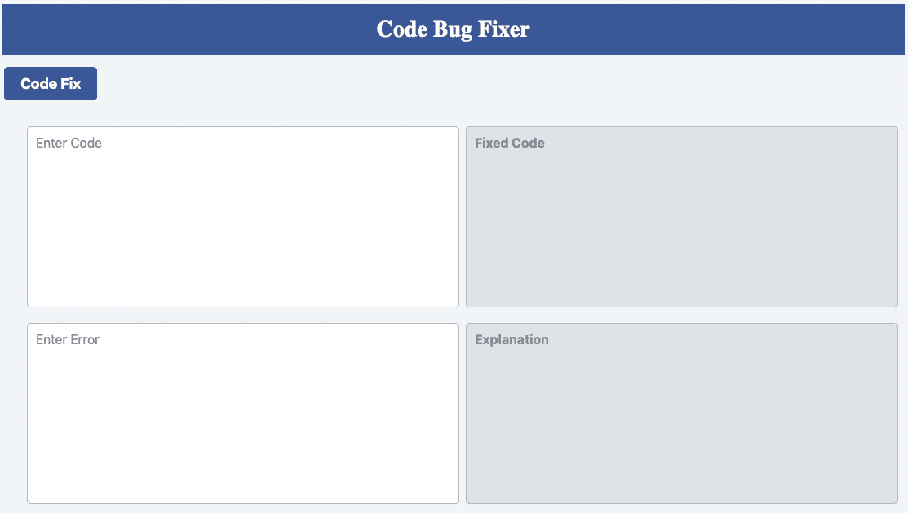
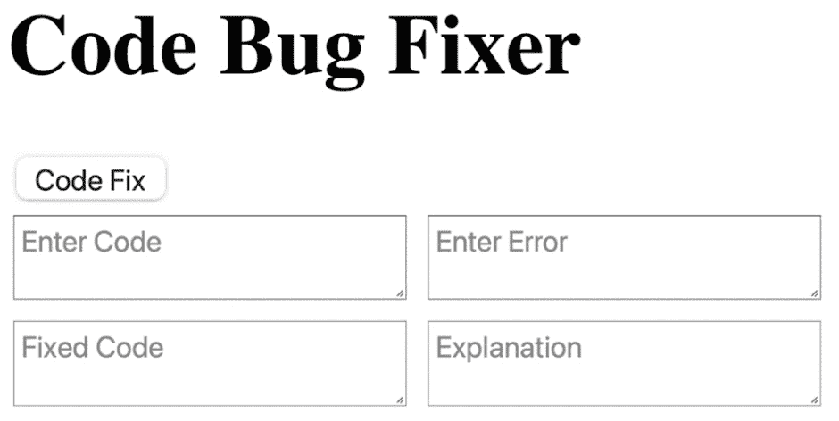
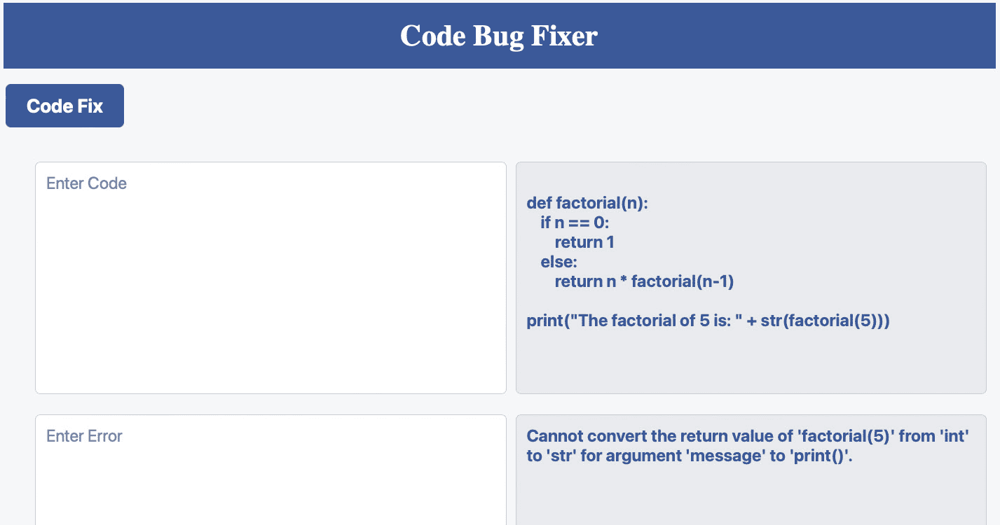
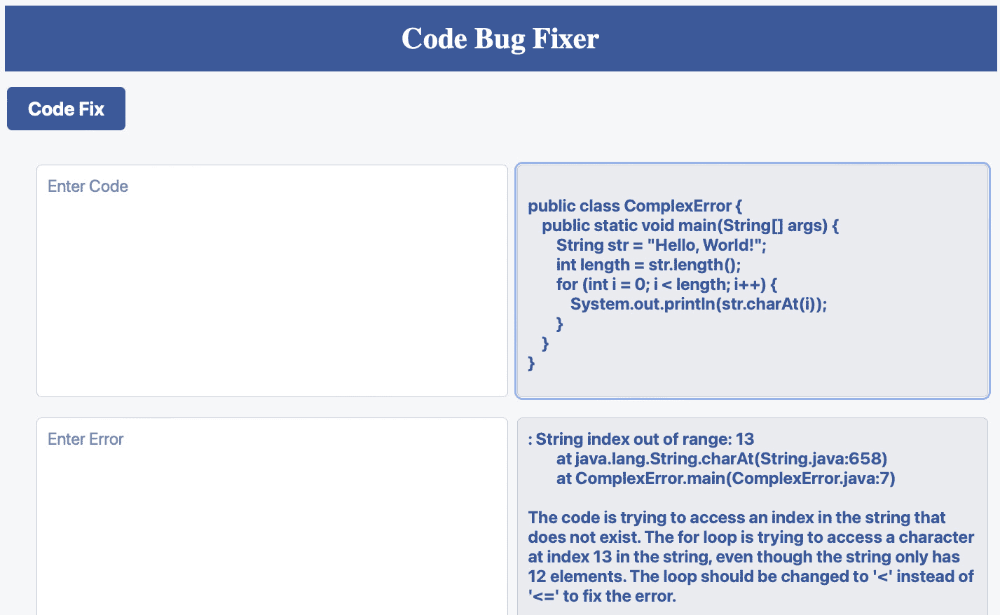
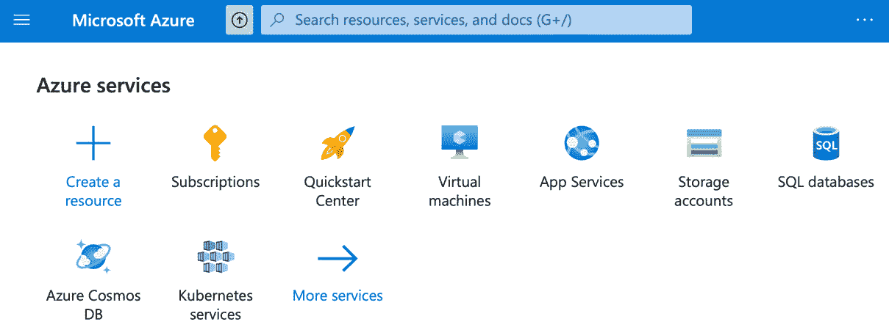
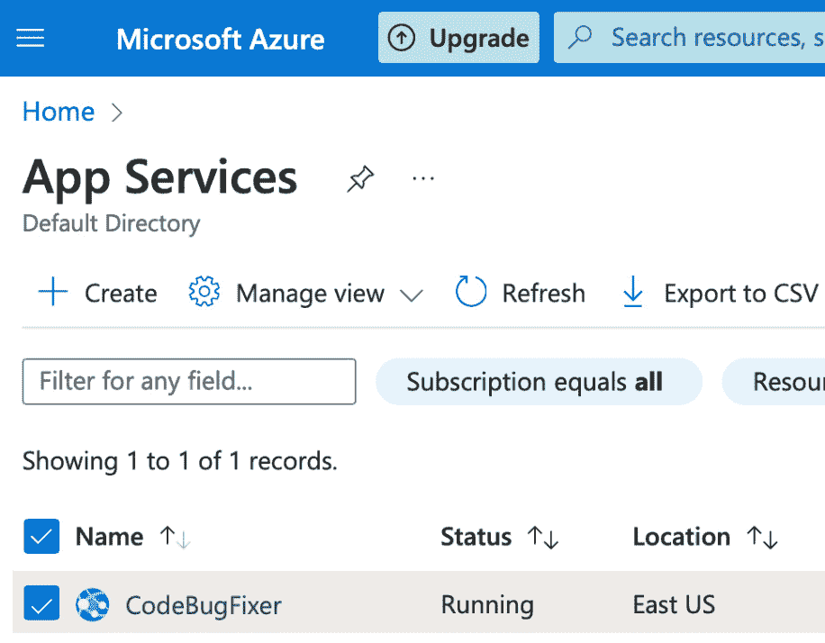

# 第四章：<st c="0">3</st>

# <st c="2">使用 Flask 创建和部署代码错误修复应用程序</st>

在本章中，我们将深入探讨使用 <st c="186">Flask</st> <st c="191">创建和部署一个由人工智能驱动的代码错误修复 SaaS 应用程序。此 <st c="198">应用程序将利用 OpenAI 的 GPT-3.5 语言模型为用户提供代码错误解释和修复。随着软件开发速度的快速增长，对有效且高效的错误调试解决方案的需求比以往任何时候都更加重要。</st> <st c="311">通过构建此 SaaS 应用程序，我们的目标是向开发者提供一款强大的工具，以加快他们的调试过程并提高其代码的质量。</st> <st c="458"></st>

为了开发此 SaaS 应用程序，我们将利用一个你可能已经非常熟悉的工具，即用于在 Python 中构建网络应用的 Flask 框架。我们的目标是熟练掌握这个框架，以构建一个有效且可扩展的 Web 应用程序，能够为用户提供高效的代码错误解决方案。</st> <st c="803">我们的目标是熟练掌握这个框架，以构建一个有效且可扩展的 Web 应用程序，能够为用户提供高效的代码错误解决方案。</st> <st c="976">此外，我们还将利用 OpenAI 的 GPT-3.5 语言模型提供自然语言解释和代码修复。</st>

<st c="1098">在本章中，我们将学习如何进行以下操作：</st> <st c="1140"></st>

+   <st c="1154">执行多个 ChatGPT</st> <st c="1183">API 请求</st>

+   <st c="1195">设置代码错误</st> <st c="1220">修复器项目</st>

+   <st c="1233">实现代码错误</st> <st c="1260">修复器后端</st>

+   <st c="1273">使用文本区域</st> <st c="1291">和容器</st>

+   <st c="1305">测试代码错误</st> <st c="1327">修复器应用</st>

+   将 ChatGPT 应用部署到 <st c="1336">Azure 云</st> <st c="1370">中</st>

<st c="1381">完成本章后，你将具备使你的 ChatGPT 应用程序对全球个人用户可访问所需的技能。</st>

# <st c="1516">技术要求</st>

本项目的技术要求如下 <st c="1539">：</st> <st c="1588"></st>

+   在 <st c="1599">你的机器上安装了 Python 3.7 或更高版本</st>

+   一个代码编辑器，例如 <st c="1669">VSCode（推荐）</st>

+   <st c="1689">一个 Python</st> <st c="1699">虚拟环境</st>

+   在 <st c="1718">虚拟环境</st> <st c="1760">中安装的 Flask 网络框架</st>

+   <st c="1779">一个 OpenAI</st> <st c="1790">API 密钥</st>

+   <st c="1797">访问云托管服务，例如</st> <st c="1840">Microsoft Azure</st>

本章中的代码示例可以在 GitHub 上找到 <st c="1855">，位于</st> <st c="1915">[<st c="1918">https://github.com/PacktPublishing/Building-AI-Applications-with-ChatGPT-API</st>](https://github.com/PacktPublishing/Building-AI-Applications-with-ChatGPT-API)<st c="1994">。</st>

# <st c="1995">执行多个 ChatGPT API 请求</st>

<st c="2036">让我们首先</st> <st c="2048">深入了解 ChatGPT API 请求，并学习如何构建项目和</st> `<st c="2128">app.py</st>` <st c="2134">文件。</st> <st c="2141">在这个项目中，我们将探讨如何进行多个 ChatGPT API 请求，以获取我们输入查询的解释和修复后的代码。</st> <st c="2278">我们将逐步讲解整个过程，并提供清晰的示例，以便您可以轻松跟随。</st>

<st c="2384">为了修复用户的代码，ChatGPT 需要两个关键组件：一些有错误的代码和系统提供的错误信息。</st> <st c="2493">代码错误修复器应用程序背后的理念是，你同时向 ChatGPT 提供两个单独的请求（参见</st> *<st c="2615">图 3</st>**<st c="2623">.1</st>*<st c="2625">）：</st>

+   **<st c="2628">请求 1</st>**<st c="2638">：ChatGPT 使用有错误的代码和错误信息来修复</st> <st c="2690">代码</st>

+   **<st c="2698">请求 2</st>**<st c="2708">：ChatGPT 使用有错误的代码和错误信息，用普通英语向用户解释错误</st>


<st c="2835">图 3.1 – 代码错误修复器请求/响应映射</st>

<st c="2883">如图</st> <st c="2892">所示</st> *<st c="2896">图 3</st>**<st c="2904">.2</st>*<st c="2906">，代码错误修复器应用程序的设计是一个界面简洁、现代的 Web 应用程序。</st> <st c="3001">它包含一个表单，允许用户输入代码和相关错误。</st> <st c="3085">提交表单后，应用程序将代码和错误发送到服务器，并在两个单独的</st> <st c="3231">文本区域中显示生成的解释和修复后的代码。</st>

<st c="3242">用户界面的设计简单直观，有两个文本区域用于代码和错误输入，以及两个只读文本区域用于显示生成的解释和修复后的代码。</st> <st c="3433">应用程序的布局整洁，采用蓝色和白色的配色方案，并有一个居中的标题显示应用程序的名称。</st> <st c="3547">应用程序旨在为识别和修复</st> <st c="3632">代码错误提供无缝的用户体验。</st>



<st c="3705">图 3.2 – 代码错误修复器应用程序用户界面</st>

<st c="3751">我们的应用程序将接受有错误的代码和一个错误，并同时提供两个请求：一个</st> <st c="3848">用于修复代码，另一个向用户解释错误。</st> <st c="3913">应用程序将具有高效的用户界面和简单的布局，从而提供无缝的用户体验。</st> <st c="4017">现在，我们可以回顾一下在 VSCode 中创建必要的文件和文件夹的过程，包括</st> `<st c="4086">CodeBugFixer</st>` <st c="4098">项目，包括</st> `<st c="4132">templates</st>` <st c="4141">文件夹，该文件夹将包含 Flask 应用程序的 HTML 模板，以及</st> `<st c="4212">config.py</st>` <st c="4221">和</st> `<st c="4226">app.py</st>` <st c="4232">文件，以在 Code Bug</st> <st c="4313">Fixer 应用程序中利用 ChatGPT API 奠定基础。</st>

# <st c="4323">设置 Code Bug Fixer 项目</st>

<st c="4361">任何 Python 开发过程中的第一步是创建一个名为</st> `<st c="4456">CodeBugFixer</st>`<st c="4468">的 VSCode 项目。</st> 你可以通过前往<st c="4633">(venv)</st> <st c="4639">指示器来在 VSCode 中打开终端，以确认你正在虚拟环境中工作。</st> <st c="4715">这是防止项目间包安装冲突并确保你使用正确集合的依赖项的必要步骤。</st> <st c="4852">的依赖项。</st>

<st c="4868">现在我们可以按照以下步骤创建必要的文件和文件夹，用于</st> `<st c="4927">CodeBugFixer</st>` <st c="4939">项目：</st>

1.  <st c="4977">首先，在项目的根目录中创建两个新的 Python 文件，分别命名为</st> `<st c="5022">app.py</st>` <st c="5028">和</st> `<st c="5033">config.py</st>`<st c="5042">。</st> <st c="5082">`<st c="5086">app.py</st>` <st c="5092">文件是编写`<st c="5129">CodeBugFixer</st>` <st c="5141">应用程序主要代码的地方，而`<st c="5171">config.py</st>` <st c="5180">文件将包含任何敏感信息，如 API 密钥</st> <st c="5242">和密码。</st>

1.  <st c="5256">接下来，在项目的根目录中创建一个名为</st> `<st c="5290">templates</st>` <st c="5299">的新文件夹。</st> <st c="5338">此文件夹将包含 Flask 应用程序将渲染的 HTML 模板。</st> <st c="5414">在`<st c="5425">templates</st>` <st c="5434">文件夹内，创建一个名为</st> `<st c="5468">index.html</st>`<st c="5478">的新文件。</st> 此文件将包含`<st c="5542">CodeBugFixer</st>` <st c="5554">应用程序主页的 HTML 代码。</st>

    <st c="5559">项目结构应如下所示</st> <st c="5599">：</st>

    ```py
    <st c="5613">CodeBugFixer/</st>
    <st c="5627">├── config.py</st>
    <st c="5641">├── app.py</st>
    <st c="5652">├── templates/</st>
    <st c="5769">CodeBugFixer</st> project in your VSCode project. You can now start writing the code for your Flask app in the <st c="5875">app.py</st> file and the HTML code in the <st c="5912">index.html</st> file.
    ```

1.  <st c="5928">在终端窗口中，你可以按照以下方式安装任何必要的库：</st>

    ```py
     (venv)$ pip install flask
    (venv)$ pip install openai
    ```

1.  <st c="6057">最后，为了在您的</st> `<st c="6142">CodeBugFixer</st>` <st c="6154">应用程序中建立使用 ChatGPT API 的基础，您需要将以下代码添加到</st> `<st c="6201">config.py</st>` <st c="6210">和</st> `<st c="6215">app.py</st>` <st c="6221">:</st>

<st c="6223">config.py</st>

```py
 API_KEY = <Your API Key>
```

<st c="6257">app.py</st>

```py
 from flask import Flask, request, render_template
from openai import OpenAI
import config
app = Flask(__name__)
# API Token
client = OpenAI(
  api_key=config.API_KEY,
)
@app.route("/")
def index():
    return render_template("index.html")
if __name__ == "__main__":
    app.run()
```

<st c="6534">`<st c="6539">config.py</st>` <st c="6548">文件将安全地存储您的 OpenAI API 密钥。</st> <st c="6594">请确保将</st> `<st c="6615"><Your API Key></st>` <st c="6629">替换为您从 OpenAI 获得的实际 API 密钥。</st>

<st c="6684">The</st> `<st c="6689">app.py</st>` <st c="6695">文件是一个 Python 脚本，它定义了一个 Flask 应用程序。</st> <st c="6754">它导入了</st> `<st c="6769">Flask</st>` <st c="6774">模块以及 CodeBugFixer 项目所需的库。</st> <st c="6840">它从</st> `<st c="6877">config.py</st>` <st c="6886">文件中获取 API 密钥。</st> <st c="6893">该脚本定义了主页的路线，并使用 Flask 的</st> `<st c="6988">render_template</st>` <st c="7003">函数渲染</st> `<st c="6954">index.html</st>` <st c="6964">模板。</st>

<st c="7013">为了设置</st> `<st c="7028">CodeBugFixer</st>` <st c="7040">项目，您需要创建一个新的项目，配置项目设置，创建项目所需文件和文件夹，安装 Flask 和 OpenAI 库，并将代码添加到</st> `<st c="7219">config.py</st>` <st c="7228">和</st> `<st c="7233">app.py</st>` <st c="7239">文件中。</st> <st c="7247">`<st c="7251">config.py</st>` <st c="7260">文件安全地存储 OpenAI API 密钥，而`<st c="7311">app.py</st>` <st c="7317">文件定义了一个 Flask 应用程序并渲染了`<st c="7367">index.html</st>` <st c="7377">模板。</st> <st c="7388">此时，如果您运行`<st c="7418">app.py</st>` <st c="7424">文件，您将在浏览器上看到一个空白的（白色）页面。</st>

<st c="7493">在下一节中，我们将修改 Code Bug Fixer 应用程序后端的</st> `<st c="7534">index()</st>` <st c="7541">函数，以确保它可以区分</st> `<st c="7642">GET</st>` <st c="7645">和</st> `<st c="7650">POST</st>` <st c="7654">请求。</st> <st c="7665">我们还将使用 OpenAI GPT-3.5 API 为用户的输入生成解释和修复后的代码，然后我们将使用</st> `<st c="7828">render_template</st>` <st c="7843">函数将这些内容传递给</st> `<st c="7798">index.html</st>` <st c="7808">模板。</st>

# <st c="7853">实现 Code Bug Fixer 后端</st>

<st c="7893">代码错误修复应用程序的后端</st> `<st c="7940">应确保我们正确地将有错误的代码发送到 ChatGPT，并在另一端接收正确的响应。</st> `<st c="8056">因此，您需要确保</st> `<st c="8104">index()</st>` `<st c="8111">函数能够清楚地区分</st> `<st c="8160">GET</st>` `<st c="8163">和</st>` `<st c="8168">POST</st>` `<st c="8172">请求。</st> `<st c="8183">您可以在</st> `<st c="8229">index()</st>` `<st c="8236">函数中添加以下修改来实现这一点：</st>

```py
 @app.route("/", methods=["GET", "POST"])
def index():
    if request.method == "POST":
        code = request.form["code"]
        error = request.form["error"]
        prompt = (f"Explain the error in this code without fixing it:"
                  f"\n\n{code}\n\nError:\n\n{error}")
        model_engine = "gpt-3.5-turbo"
```

<st c="8533">此函数</st> `<st c="8548">检查 HTTP 请求方法——是</st> `<st c="8597">GET</st>` `<st c="8600">还是</st>` `<st c="8604">POST</st>` `<st c="8608">请求。</st> `<st c="8618">如果请求方法是</st> `<st c="8643">POST</st>` `<st c="8647">，这意味着用户已从</st> `<st c="8702">index.html</st>` `<st c="8712">模板中提交了表单。</st> `<st c="8723">这样，你可以确保只有在用户提交表单并点击了</st> **<st c="8848">代码修复</st>** `<st c="8856">按钮后，ChatGPT API 才会被调用，我们将在下一节中构建该按钮。</st>

<st c="8913">函数随后从</st> `<st c="9037">代码</st>` `<st c="9041">和</st>` `<st c="9046">错误</st>` `<st c="9051">变量中分别检索用户的输入。</st> `<st c="9077">这些变量将保存用户想要修复的代码和接收到的错误代码。</st> `<st c="9168">然后使用提取的</st> `<st c="9182">代码</st>` `<st c="9186">和</st>` `<st c="9191">错误</st>` `<st c="9196">变量来创建一个传递给 OpenAI ChatGPT API 的提示。</st> `<st c="9282">这些变量使用 Python 中的</st> **<st c="9318">f-strings</st>** `<st c="9327">进行格式化。</st>

<st c="9338">例如，假设</st> `<st c="9367">代码</st>` `<st c="9371">和</st>` `<st c="9376">错误</st>` `<st c="9381">变量具有以下值：</st>

```py
 code = print(1
error = SyntaxError: '(' was never closed
```

<st c="9475">在这种情况下，我们的提示将显示如下：</st>

```py
 Explain the error in this code without fixing it:
print(1
Error:
SyntaxError: '(' was never closed
The API is instructed to generate an explanation for the error in the code.
```

<st c="9705">`<st c="9710">提示</st>` `<st c="9716">变量为 ChatGPT 模型提供了一个明确和具体的任务，并确保模型生成的输出与</st> `<st c="9838">用户输入</st>` `<st c="9868">相关。</st>

<st c="9881">您可以将</st> `<st c="9898">gpt-3.5-turbo</st>` `<st c="9911">字符串值设置为</st> `<st c="9932">model_engine</st>` `<st c="9944">变量。</st> `<st c="9955">此变量随后用于指定用于文本补全的 OpenAI 语言模型。</st> `<st c="10058">在这种情况下，</st> `<st c="10072">gpt-3.5-turbo</st>` `<st c="10085">是 OpenAI 提供的功能最强大和最通用的模型之一。</st>

`<st c="10153">在</st>` `<st c="10165">if</st>` `<st c="10167">语句中，你现在可以调用 ChatGPT API 来为用户构建</st>` `<st c="10231">explanation_completion</st>` `<st c="10253">和</st>` `<st c="10258">fixed_code_completion</st>` `<st c="10279">：</st>`

```py
 explanation_completions = client.chat.completions.create(
            model=model_engine,
            messages=[{"role": "user", "content": f"{prompt}"}],
            max_tokens=1024,
            n=1,
            stop=None,
            temperature=0.2,
        )
        explanation = explanation_completions.choices[0].message.content
        fixed_code_prompt = (f"Fix this code: \n\n{code}\n\nError:\n\n{error}." f" \n Respond only with the fixed code.")
        fixed_code_completions = client.chat.completions.create(
            model=model_engine,
            messages=[
                {"role": "user", "content": f"{fixed_code_prompt}"},
            ],
            max_tokens=1024,
            n=1,
            stop=None,
            temperature=0.2,
        )
        fixed_code = fixed_code_completions.choices[0].message.content
```

`<st c="10914">前面的代码利用 ChatGPT API</st>` `<st c="10965">根据给定的提示生成补全内容。</st>` `<st c="11012">在这段代码中，</st>` `<st c="11016">client.chat.completions.create()</st>` `<st c="11048">函数被调用两次，以生成两个不同的补全内容：</st>` `<st c="11134">explanation_completions</st>` `<st c="11157">和</st>` `<st c="11162">fixed_code_completions</st>` `<st c="11184">。</st>`

`<st c="11185">在调用</st>` `<st c="11196">client.chat.completions.create()</st>` `<st c="11228">函数两次后，</st>` `<st c="11259">解释</st>` `<st c="11270">和</st>` `<st c="11275">fixed_code</st>` `<st c="11285">变量分别被分配给两个对象的 choices 属性中生成的文本。</st>` `<st c="11389">这些生成的文本将在代码的下一步中使用，以向用户显示解释和修复代码。</st>`

最后，你可以使用`<st c="11509">render_template</st>` `<st c="11535">函数来更新一个 HTML 模板，并使用</st> `<st c="11596">ChatGPT 响应</st>`：

```py
<st c="11613">return render_template("index.html",</st><st c="11650">explanation=explanation,</st><st c="11675">fixed_code=fixed_code)</st> return render_template("index.html")
if __name__ == "__main__":
    app.run()
```

`<st c="11772">该函数接受两个参数：第一个是要渲染的模板名称，第二个是将在模板中使用的变量字典。</st> `<st c="11936">传递给模板的变量是</st>` `<st c="11977">解释</st>` `<st c="11988">和</st>` `<st c="11993">fixed_code</st>` `<st c="12003">。</st>` `<st c="12005">解释</st>` `<st c="12016">是 ChatGPT API 生成的文本，用于解释用户代码中的错误。</st>` `<st c="12102">fixed_code</st>` `<st c="12112">是 ChatGPT API 生成的文本，表示用户代码的修复版本。</st>`

`<st c="12207">这些变量被传递到</st>` `<st c="12226">index.html</st>` `<st c="12240">模板中，以便它们可以显示给用户。</st>` `<st c="12303">模板将使用这些变量来动态更新页面内容，显示由 API 生成的解释和修复代码。</st>`

`<st c="12437">执行你的 Flask 应用程序后，不应显示任何错误。</st>` `<st c="12508">然而，你的浏览器会显示一个完全空白的屏幕，因为我们的</st>` `<st c="12582">index.html</st>` `<st c="12592">文件是空的。</st>` `<st c="12608">我们的下一个任务是创建该文件，这将在下一节中讨论。</st>`

<st c="12698">这就是如何修改</st> `<st c="12730">index()</st>` <st c="12737">函数以确保在用户提交表单并点击</st> `<st c="13037">render_template</st>` <st c="13052">函数之后才调用 ChatGPT API。</st>

<st c="13062">在下一节中，您将学习如何创建一个</st> `<st c="13116">index.html</st>` <st c="13126">文件并构建一个</st> **<st c="13150">代码修复</st>** <st c="13158">按钮，允许用户提交他们的代码进行调试。</st> <st c="13220">您还将学习如何使用 JavaScript 和 AJAX 处理表单提交并在不重新加载</st> <st c="13371">页面的情况下显示 Flask 应用程序的响应。</st>

# <st c="13380">使用文本区域和容器</st>

<st c="13412">在本节中，您将学习如何使用 HTML 和 CSS 为您的</st> `<st c="13492">CodeBugFixer</st>` <st c="13504">应用程序创建一个简单的用户</st> <st c="13537">界面。</st> <st c="13537">我们将逐步讲解为用户设计一个简单表单的过程，以便他们输入代码和错误信息，并显示 ChatGPT API 调用的结果。</st> <st c="13694">在本节结束时，您将拥有一个功能齐全的 Web 应用程序，可以帮助用户修复他们代码中的错误。</st>

<st c="13816">要修改</st> `<st c="13831">index.html</st>` <st c="13841">文件，首先，您需要打开位于您项目</st> `<st c="13896">templates</st>` <st c="13905">文件夹中的文件。</st> <st c="13930">您可以在任何文本编辑器中打开此文件，或者您可以使用 VSCode 内置的 HTML 编辑器。</st> <st c="14024">一旦文件打开，添加以下基本的</st> <st c="14077">HTML 结构：</st>

```py
 <!DOCTYPE html>
<html>
<head>
    <meta charset="UTF-8">
    <title>Code Bug Fixer</title>
</head>
<body>
<div class="header">
    <h1>Code Bug Fixer</h1>
</div>
</body>
</html>
```

<st c="14258">The</st> `<st c="14263"><title></st>` <st c="14270">标签将 HTML 页面的标题设置为</st> `<st c="14310">代码错误修复器</st>`<st c="14324">。这是当页面加载时将在浏览器标签上显示的文本。</st> <st c="14404">它还被搜索引擎用于在</st> <st c="14410">搜索结果中显示页面的标题。</st>

<st c="14489">然后，您可以使用</st> `<st c="14512"><h1></st>` <st c="14516">标签在网页上创建一个包含文本</st> **<st c="14570">代码错误修复器</st>** <st c="14584">的标题，并使用大字体。</st>

<st c="14599">接下来，我们将向我们的</st> `<st c="14639">index.html</st>` <st c="14649">文件中添加一个输入表单。</st> <st c="14656">此表单将允许用户输入他们的代码和相应的错误信息，然后点击</st> `<st c="14894"><</st>``<st c="14895">div></st>` <st c="14899">标签：</st>

```py
 <div class="header">
    <h1>Code Bug Fixer</h1>
</div>
<form action="/" method="post">
    <button class="submit-button" type="submit">Code Fix</button>
    <div class="container">
        <div class="left-column">
            <textarea name="code" placeholder="Enter Code"></textarea>
            <textarea name="error" placeholder="Enter Error"></textarea>
        </div>
        <div class="right-column">
            <textarea class="fixed-code" name="fixed-code" placeholder="Fixed Code" readonly>{{ fixed_code }}</textarea>
            <textarea class="explanation" name="explanation" placeholder="Explanation" readonly>{{ explanation }}</textarea>
        </div>
    </div>
</form>
```

<st c="15498">表单被</st> <st c="15511">HTML</st> `<st c="15528"><form></st>` <st c="15534">标签包围，其中</st> `<st c="15550">action</st>` <st c="15556">属性设置为</st> `<st c="15574">"/"</st>` <st c="15577">，而</st> `<st c="15586">method</st>` <st c="15592">属性设置为</st> `<st c="15610">post</st>`<st c="15614">。这意味着当用户提交表单时，数据将通过 HTTP</st> `<st c="15737">POST</st>` <st c="15741">方法发送到根 URL</st> `<st c="15716">("/")</st>` <st c="15721">。</st> <st c="15750">这指的是我们</st> `<st c="15769">index()</st>` <st c="15776">函数在</st> `<st c="15793">app.py</st>` <st c="15799">文件中的实现。</st>

<st c="15805">在表单内部，我们有两个文本区域，其</st> `<st c="15855">name</st>` <st c="15859">属性分别设置为</st> `<st c="15878">code</st>` <st c="15882">和</st> `<st c="15887">error</st>`<st c="15892">。</st> <st c="15908">这将允许用户输入他们的代码和</st> <st c="15958">错误信息。</st>

<st c="15972">表单还包含一个</st> `<st c="15998">submit</st>` <st c="16004">按钮，带有</st> `<st c="16021">submit-button</st>` <st c="16034">类。</st> <st c="16042">当用户点击此按钮时，表单将被提交，数据将被发送到</st> <st c="16136">后端服务器。</st>

<st c="16151">表单</st> <st c="16164">分为两列，使用</st> `<st c="16197"><div></st>` <st c="16202">标签，并带有</st> `<st c="16216">container</st>` <st c="16225">类。</st> <st c="16233">左侧列包含代码和错误信息文本区域，而右侧列包含固定的代码和解释</st> <st c="16360">文本区域。</st>

<st c="16371">固定的代码和解释文本区域将</st> `<st c="16423">name</st>` <st c="16427">属性设置为</st> `<st c="16446">fixed-code</st>` <st c="16456">和</st> `<st c="16461">explanation</st>`<st c="16472">，分别。</st> <st c="16488">它们也被设置为</st> `<st c="16509">readonly</st>`<st c="16517">，因此用户无法修改其内容。</st> <st c="16560">这些文本区域将在用户提交</st> <st c="16681">表单后，由 ChatGPT API 生成的固定代码和解释进行更新。</st>

<st c="16690">现在你已经添加了<st c="16747">index</st> <st c="16752">页面的必要 HTML 代码，让我们运行 Flask 应用程序并查看它在浏览器中的外观。</st> <st c="16820">当你运行 Flask 应用程序时，你应该会看到一个带有标题的页面，标题为**<st c="16894">Code Bug Fixer</st>** <st c="16908">，以及一个包含两个文本区域以输入你的代码和错误信息的表单。</st> <st c="16982">还有一个标记为**<st c="17020">Code Fix</st>**<st c="17028">的提交按钮。</st> <st c="17148">在表单的右侧，你将看到另外两个文本区域，它们将显示修复后的代码和说明。</st> <st c="17148">然而，这些文本区域最初将是空的，直到用户输入代码和错误信息并点击**<st c="17262">Code Fix</st>** <st c="17270">按钮（见<st c="17283">图 3</st>**<st c="17291">.3</st>**<st c="17293">）。</st>

<st c="17296">目前，由于我们没有将任何样式添加到 HTML 中，应用程序的外观可能不够吸引人。</st>



<st c="17489">图 3.3 – 基于 HTML 的 Code Bug Fixer 应用前端</st>

最后，我们将向我们的应用程序添加一些 CSS 来样式化 HTML 元素。<st c="17547">CSS 代码将定义页面中元素的字体、颜色、大小和位置。</st> <st c="17625">我们将向我们的<st c="17747">index.html</st> <st c="17757">文件中添加 CSS 代码，以增强应用程序的外观和感觉。</st> <st c="17812">通过这些样式改进，我们的应用程序将更具视觉吸引力，并且更容易为<st c="17911">我们的用户使用。</st>

你可以在<st c="17921">`<st c="17958">title</st>` <st c="17963">标签内</st> `<st c="17979">head</st>` <st c="17983">的</st> `<st c="17991">index.html</st>` <st c="18001">文件中添加你的 CSS 代码：</st>

```py
 <title>Code Bug Fixer</title>
    <style type="text/css">
        body {
            font-family: Arial sans-serif;
            background-color: #f6f7f9;
        }
```

首先，让我们<st c="18128">打开 CSS 样式块。</st> <st c="18144">它表示以下代码是 CSS，并将应用于网页中的 HTML 元素。</st> <st c="18170"></st>

<st c="18271">CSS 代码针对 HTML 中的<st c="18295"><body></st> <st c="18301">元素。</st> <st c="18323">在 CSS 中，你可以使用它们的标签名、类名或 ID 来定位元素。</st> <st c="18396">在这里，我们正在定位整个网页的 body。</st>

<st c="18451">在这里，我们还可以将<st c="18474">font-family</st> <st c="18485">设置为<st c="18489">Arial sans-serif</st> <st c="18505">，这意味着任何在<st c="18544">body</st> <st c="18548">元素内的文本都将使用 Arial 字体显示，或者如果 Arial 不可用，则使用类似的 sans-serif 字体。</st> <st c="18653">我们还可以将 body 的背景色设置为浅灰色：</st>

```py
 .header {
            background-color: #3b5998;
            color: #ffffff;
            padding: 15px;
            text-align: center;
        }
        .header h1 {
            margin: 0;
            font-size: 28px;
            font-weight: bold;
        }
        .container {
            display: flex;
            justify-content: space-between;
            padding: 15px;
        }
```

<st c="18960">`.header` <st c="18965">类</st> <st c="18972">指定了标题的背景颜色、文字颜色、填充和对齐方式。</st> <st c="19062">在这里，文本是通过使用</st> `<st c="19099">text-align</st>` <st c="19109">属性来居中的。</st>

<st c="19119">`.header h1` <st c="19124">类</st> <st c="19134">字体大小</st> <st c="19141">属性设置为</st> <st c="19170">28</st> <st c="19172">像素，</st> `<st c="19181">字体粗细</st>` <st c="19192">设置为</st> `<st c="19203">粗体</st>`<st c="19207">，并且</st> `<st c="19213">边距</st>` <st c="19219">设置为</st> `<st c="19230">0</st>`<st c="19231">，因此页面顶部和</st> <st c="19286">标题之间没有空间。</st>

<st c="19297">`.container` <st c="19302">类</st> <st c="19312">的`<st c="19319">display</st>` <st c="19326">属性设置为</st> `<st c="19346">flex</st>` <st c="19350">，以便我们可以使用 Flexbox 进行布局，并且</st> `<st c="19394">justify-content</st>` <st c="19409">设置为</st> `<st c="19420">space-between</st>` <st c="19433">，以便在水平轴上均匀分布容器的内容：</st>

```py
 .left-column, .right-column {
            width: 49%;
            padding: 15px;
        }
        textarea {
            width: 100%;
            height: 200px;
            font-size: 16px;
            padding: 10px;
            margin-bottom: 15px;
            border: 1px solid #cccccc;
            border-radius: 5px;
            resize: none;
        }
        .fixed-code, .explanation {
            background-color: #e9ebee;
            color: #3b5998;
            font-weight: bold;
        }
```

<st c="19817">接下来，让我们设计一个</st> <st c="19841">两列布局，其中左侧列包含用户输入代码和错误的输入字段，而右侧列显示</st> <st c="19997">程序的输出。</st>

<st c="20009">`.left-column` <st c="20014">和</st> `.right-column` <st c="20026">类被赋予了</st> `<st c="20075">49%</st>` <st c="20078">的宽度，以便它们在页面上占据几乎相等的空间。</st> `<st c="20145">textarea` <st c="20149">元素被设计为具有固定的宽度为</st> `<st c="20204">100%</st>` <st c="20208">和高度为</st> `<st c="20225">200px</st>` <st c="20230">，以创建一个清晰的输入字段。</st> `<st c="20262">resize: none</st>` <st c="20278">属性确保用户不能调整</st> <st c="20328">输入字段的大小。</st>

<st c="20341">`.fixed-code` <st c="20346">和</st> `.explanation` <st c="20357">类被赋予了`<st c="20394">bold</st>` <st c="20398">的`<st c="20403">font-weight</st>` <st c="20414">属性，使它们从输入字段中脱颖而出。</st> `<st c="20461">这有助于用户快速识别</st> <st c="20505">输出字段：</st>

```py
 .submit-button {
            background-color: #3b5998;
            color: #ffffff;
            font-size: 18px;
            font-weight: bold;
            padding: 10px 20px;
            border: none;
            border-radius: 5px;
            margin-top: 15px;
            cursor: pointer;
        }
        .submit-button:hover {
            background-color:  #4b76be;
        }
    </style>
```

<st c="20766">我们的最终目标是</st> <st c="20788">使</st> `<st c="20797">提交</st>` <st c="20803">按钮看起来更吸引人，并在用户悬停时向用户提供反馈。</st> <st c="20888">我们将背景颜色设置为深蓝色（</st>`<st c="20938">#3b5998</st>`<st c="20946">）并将字体颜色设置为白色（</st>`<st c="20978">#ffffff</st>`<st c="20986">）以创建对比。</st> <st c="21009">我们还添加了填充和边框半径，使按钮更引人注目</st> <st c="21086">和吸引人。</st>

<st c="21101">`<st c="21106">margin-top</st>` <st c="21116">属性在按钮和文本区域之间添加了一些空间。</st> <st c="21181">最后，我们添加了</st> `<st c="21203">:hover</st>` <st c="21209">伪类，当用户悬停时改变按钮的背景颜色，这为用户提供视觉反馈，表明按钮</st> <st c="21357">是交互式的。</st>

<st c="21372">您现在已经完成了</st> `<st c="21400">index.html</st>` <st c="21410">文件，这是</st> `<st c="21424">CodeBugFixer</st>` <st c="21436">应用程序的。</st> <st c="21450">现在您可以运行</st> `<st c="21470">app.py</st>` <st c="21476">文件并测试应用程序，以确保一切运行正常。</st> <st c="21553">在下一节中，我们将提供一些如何使用应用程序修复代码错误的示例。</st> <st c="21652">或者，您也可以尝试自己的代码示例来查看应用程序的表现。</st>

<st c="21734">这就是我们如何使用 HTML 和 CSS 为</st> `<st c="21786">CodeBugFixer</st>` <st c="21798">应用程序创建用户界面。</st> <st c="21831">我们介绍了为用户设计表单的过程，以便他们可以输入代码和错误信息，并显示 ChatGPT</st> <st c="21953">API 调用的结果。</st>

<st c="21962">在下一节中，您将通过编写测试用例并验证它是否正确处理不同的场景来学习如何测试</st> `<st c="22015">CodeBugFixer</st>` <st c="22027">应用程序。</st> <st c="22123">您还将看到 Code Bug Fixer 应用程序如何修复用 Java 和 Python 两种不同的编程语言编写的代码的示例，并学习如何测试修复后的代码以确认</st> <st c="22307">其准确性。</st>

# <st c="22320">测试代码错误修复应用程序</st>

<st c="22351">现在，我们将学习如何测试我们的代码错误修复应用程序。</st> <st c="22415">我们</st> <st c="22417">将编写一些测试用例以确保应用程序能够正确运行并适当地处理不同的场景。</st> <st c="22549">测试是软件开发的一个关键部分，因为它确保应用程序按预期工作并满足</st> <st c="22668">用户的需求。</st>

代码错误修复器应用程序可以修复任何编程语言，使其成为一个多功能的工具。<st c="22774">因此，我们将通过使用两种不同编程语言编写的示例来展示其有效性：Java</st> <st c="22894">和 Python。</st>

**我们的 Python 示例有两个属性。</st> **<st c="22945">首先，我们有以下</st> **<st c="22976">有错误的代码：</st>**

```py
 def factorial(n):
    if n == 0:
        return 1
    else:
        return n * factorial(n-1)
print("The factorial of 5 is: " + factorial(5))
```

然后，您可以输入以下错误：`<st c="23147">类型错误：</st>`

**此代码返回错误，因为它试图在`<st c="23262">print</st>` <st c="23267">语句中将字符串和整数连接起来。</st> **`<st c="23283">factorial</st>` <st c="23292">函数返回一个整数，但它被连接到字符串`<st c="23365">"The factorial of 5</st>` <st c="23385">is: "</st>`<st c="23390">.</st>**

**为了在代码错误修复器应用程序中修复此代码，请按照以下步骤操作：</st> **<st c="23443">这些步骤：</st>**

1.  将代码粘贴到**<st c="23482">输入</st>** **<st c="23488">代码</st>** <st c="23492">字段中。</st>

1.  将错误粘贴到**<st c="23527">输入</st>** **<st c="23533">错误</st>** <st c="23538">字段中。</st>

1.  左键单击**<st c="23564">代码</st>** **<st c="23569">修复</st>** <st c="23572">按钮。</st>

完成列出的步骤后，固定代码和 ChatGPT API 生成的解释将显示在相应的字段中。<st c="23727">如图**<st c="23742">图 3</st>**<st c="23750">.4</st>*<st c="23752">所示，ChatGPT 的响应以粗体显示且不可编辑。</st> <st c="23822">您还可以看到解释是准确的。</st>



**图 3.4 – 代码错误修复器处理一些 Python 代码**

为了确保固定代码正确运行，您可以通过在 Python IDE（如 VSCode 或任何其他在线 Python 编译器）中运行它来测试它。<st c="24344">通过检查与固定代码一起提供的说明，您可以确认它提供了对错误的准确和详细的解释。</st> <st c="24481">错误。</st>

**最后，为了验证代码错误修复器应用程序可以与任何编程语言一起工作，让我们尝试修复以下</st> **<st c="24607">Java 代码：</st>**

```py
 public class ComplexError {
    public static void main(String[] args) {
        String str = "Hello, World!";
        int length = str.length();
        for (int i = 0; i <= length; i++) {
            System.out.println(str.charAt(i));
        }
    }
}
```

**以下是 Java 编译器产生的错误代码：**

```py
<st c="24987">for</st> loop is iterating from <st c="25014">0</st> to <st c="25019">length</st>, which is the length of the string. However, the index of the last character in the string is length <st c="25127">-1</st>, so when <st c="25139">i</st> equals <st c="25148">length</st>, the program will try to access an index that is out of bounds and throw an <st c="25231">IndexOutOfBoundsException</st> message.
			<st c="25265">Once you run</st> <st c="25279">the code through the Code Bug Fixer app, you will get a response similar to the one depicted in</st> *<st c="25375">Figure 3</st>**<st c="25383">.5</st>*<st c="25385">. You can verify that the fixed code and the description are correct.</st> <st c="25455">ChatGPT fixed the error because it changed the condition in the</st> `<st c="25519">for</st>` <st c="25522">loop from</st> `<st c="25533">i <= length</st>` <st c="25544">to</st> `<st c="25548">i < length</st>`<st c="25558">. By changing the condition to</st> `<st c="25589">i < length</st>`<st c="25599">, the loop only iterates up to the last index of the string and avoids accessing an index that does</st> <st c="25699">not exist.</st>
			<st c="25709">This confirms that your Code Bug Fixer has the ability to differentiate between two distinct programming languages and was able to repair the code within a matter</st> <st c="25873">of seconds.</st>
			

			<st c="26503">Figure 3.5 – Code Bug Fixer processing some Java code</st>
			<st c="26556">This section</st> <st c="26570">explained how to test the Code Bug Fixer application by providing examples in the Python and Java programming languages.</st> <st c="26691">The application can fix any programming language, and the fixed code can be verified by running it in a Python or Java IDE.</st> <st c="26815">We saw how the application can differentiate between two programming languages and fix the code</st> <st c="26911">within seconds.</st>
			<st c="26926">In the next section, you will learn how to set up an Azure account, install the Azure CLI, and deploy its application to the cloud using the CLI.</st> <st c="27073">You will also learn how to create a</st> `<st c="27109">requirements.txt</st>` <st c="27125">file in the root directory of your project, listing all the Python packages and their specific versions that your app needs</st> <st c="27250">to run.</st>
			<st c="27257">Deploying the ChatGPT app to the Azure cloud</st>
			<st c="27302">Now let’s upload our</st> <st c="27324">Code Bug Fixer application to the</st> **<st c="27358">Azure</st>** <st c="27363">cloud</st> <st c="27370">platform.</st> <st c="27380">Azure is a cloud computing service provided by Microsoft that allows developers to host, manage, and scale their applications in the cloud.</st> <st c="27520">By hosting our application on Azure, we can make our application accessible to a wider audience.</st> <st c="27617">We will go through the steps required to create an Azure account, set up our application for deployment, and deploy it to Azure using the</st> <st c="27755">Azure CLI.</st>
			<st c="27765">You can create your Azure account by following</st> <st c="27813">these steps:</st>

				1.  <st c="27825">Go to the Azure website at</st> [<st c="27853">https://azure.microsoft.com/free/</st>](https://azure.microsoft.com/free/) <st c="27886">and click on</st> **<st c="27900">Start free</st>**<st c="27910">.</st>
				2.  <st c="27911">Sign in with your Microsoft account or create one if you don’t</st> <st c="27975">have one.</st>
				3.  <st c="27984">Enter your personal information and payment details.</st> <st c="28038">You won’t be charged unless you upgrade to a</st> <st c="28083">paid plan.</st>
				4.  <st c="28093">Choose your subscription type and agree to the terms</st> <st c="28147">and conditions.</st>
				5.  <st c="28162">Verify your account by entering a phone number and entering the code</st> <st c="28232">you receive.</st>
				6.  <st c="28244">You can log in to your account</st> <st c="28276">at</st> [<st c="28279">https://signup.azure.com/</st>](https://signup.azure.com/)<st c="28304">.</st>
				7.  <st c="28305">Once you log in, on the</st> `<st c="28444">portal.azure.com/#home</st>`<st c="28466">, where you can start using Azure services (see</st> *<st c="28514">Figure 3</st>**<st c="28522">.6</st>*<st c="28524">).</st>

			

			<st c="28789">Figure 3.6 – Azure home page</st>
			<st c="28817">Important note</st>
			<st c="28832">When deploying the Code Bug Fixer app to the Azure cloud, it is important to name the file containing the Flask app</st> `<st c="28949">app.py</st>`<st c="28955">. This is because Azure expects the main file to be named</st> `<st c="29013">app.py</st>` <st c="29019">for deployment to</st> <st c="29038">work properly.</st>
			<st c="29052">To deploy</st> <st c="29063">our application on Azure, we need to install</st> <st c="29108">the Azure</st> **<st c="29118">Command-Line Interface</st>** <st c="29140">(</st>**<st c="29142">CLI</st>**<st c="29145">).</st> <st c="29149">The CLI</st> <st c="29156">provides us with an efficient way to automate and manage our Azure resources.</st> <st c="29235">Next, you can find the steps to install the</st> <st c="29279">Azure CLI.</st>
			<st c="29289">These are the steps for macOS</st> <st c="29320">users (</st>[<st c="29327">https://learn.microsoft.com/en-us/cli/azure/install-azure-cli-macos</st>](https://learn.microsoft.com/en-us/cli/azure/install-azure-cli-macos)<st c="29395">):</st>

				1.  <st c="29398">Open your</st> <st c="29409">macOS Terminal.</st>
				2.  <st c="29424">Install</st> `<st c="29433">brew</st>`<st c="29437">. Homebrew is a popular package manager</st> <st c="29477">for macOS:</st>

    ```

    **$ /bin/bash -c "$(curl -fsSL https://raw.githubusercontent.com/Homebrew/install/HEAD/install.sh)"**

    ```py

    				3.  <st c="29585">Once Homebrew</st> <st c="29599">is installed, run the following command to install</st> <st c="29651">Azure CLI:</st>

    ```

    **$ brew update && brew install azure-cli**

    ```py

    				4.  <st c="29701">Verify that the installation was successful by running the</st> <st c="29761">following command:</st>

    ```

    **$ az --version**

    ```py

    				5.  <st c="29794">This should display</st> <st c="29814">the version number of the Azure CLI that you</st> <st c="29860">just installed:</st>

    ```

    **azure-cli** 2.47.0

    **core** 2.47.0

    **telemetry** 1.0.8

    <st c="29920">依赖项:</st>

    <st c="29934">msal                              1.20.0</st>

    <st c="29946">azure-mgmt-resource               22.0.0</st>

    <st c="29973">Python 位置 '/opt/homebrew/Cellar/azure-cli/2.47.0/libexec/bin/python'</st>

    <st c="30048">扩展目录 '/Users/martinyanev/.azure/cliextensions'</st>

    <st c="30111">Python (Darwin) 3.10.11 (main, Apr  7 2023, 07:24:47) [Clang 14.0.0 (clang-1400.0.29.202)]</st>

    <st c="30201">法律文件和信息：aka.ms/AzureCliLegal</st>

    <st c="30250">您的 CLI 已更新。</st>

    ```py

			<st c="30274">These are the steps for Windows</st> <st c="30307">users (</st>[<st c="30314">https://learn.microsoft.com/en-us/cli/azure/install-azure-cli-windows?tabs=azure-cli</st>](https://learn.microsoft.com/en-us/cli/azure/install-azure-cli-windows?tabs=azure-cli)<st c="30399">):</st>

				1.  <st c="30402">Open a web browser and navigate</st> <st c="30435">to</st> [<st c="30438">https://docs.microsoft.com/en-us/cli/azure/install-azure-cli-windows</st>](https://docs.microsoft.com/en-us/cli/azure/install-azure-cli-windows)<st c="30506">.</st>
				2.  <st c="30507">Scroll down to the section titled</st> **<st c="30542">Install or update</st>** <st c="30559">and click on the</st> **<st c="30577">Microsoft Installer</st>** <st c="30596">(</st>**<st c="30598">MSI</st>**<st c="30601">) tab.</st>
				3.  <st c="30608">Click on the</st> **<st c="30622">Latest release of the Azure CLI</st>** <st c="30653">button to start the MSI</st> <st c="30678">package download.</st>
				4.  <st c="30695">Once the</st> <st c="30705">MSI package has downloaded, double-click on the file to begin the</st> <st c="30771">installation process.</st>
				5.  <st c="30792">Follow the prompts in the installation wizard to complete the</st> <st c="30855">installation process.</st>
				6.  <st c="30876">Once the installation is complete, open a Command Prompt or PowerShell window and type</st> <st c="30964">the following:</st>

    ```

    <st c="30978">$ az –version</st>

    ```py

    <st c="30992">For Linux users (</st>[<st c="31010">https://learn.microsoft.com/en-us/cli/azure/install-azure-cli-linux?pivots=script</st>](https://learn.microsoft.com/en-us/cli/azure/install-azure-cli-linux?pivots=script)<st c="31092">), you can type the following in</st> <st c="31126">the Terminal:</st>

    ```

    curl -L https://aka.ms/InstallAzureCli | bash

    ```py

			<st c="31185">This line will automatically download the installation script and you can follow all steps for setting up your</st> <st c="31297">Azure CLI.</st>
			<st c="31307">Important note</st>
			<st c="31322">After installing the Azure CLI, you may need to close and re-open your Terminal window to ensure that the CLI is fully recognized</st> <st c="31453">and operational.</st>
			<st c="31469">You should now be able to use the Azure CLI on your</st> <st c="31522">Linux machine.</st>
			<st c="31536">Before deploying your app to Azure using the CLI, you’ll need to log in to your Azure account from the CLI.</st> <st c="31645">This will enable you to manage your resources and perform other tasks related to</st> <st c="31726">your account.</st>
			<st c="31739">To log in to your Azure account using the Azure CLI, you can type in the</st> <st c="31813">Terminal window:</st>

```

$ az login

```py

			<st c="31840">A pop-up window will</st> <st c="31862">appear asking you to enter your Azure</st> <st c="31899">account credentials.</st> <st c="31921">Enter your account email and password and click on the</st> **<st c="31976">Sign in</st>** <st c="31983">button.</st> <st c="31992">Once you are successfully logged in, you will see a message in the Command Prompt indicating that you</st> <st c="32094">are authenticated.</st>
			<st c="32112">To prepare our app for deployment, we need to create a file called</st> `<st c="32180">requirements.txt</st>` <st c="32196">in the root directory of our</st> `<st c="32226">CodeBugFixer</st>` <st c="32238">project.</st> <st c="32248">This file will list all the Python packages and their specific versions that our app needs to run.</st> <st c="32347">The</st> `<st c="32351">requirements.txt</st>` <st c="32367">file is a common practice in Python projects to document and manage the project’s dependencies.</st> <st c="32464">It lists all the external packages and their versions that are necessary for the application to function properly.</st> <st c="32579">Each line in the</st> `<st c="32596">requirements.txt</st>` <st c="32612">file typically represents a separate package and may include a specific version number or a version range.</st> <st c="32720">Azure will use this file to install the dependencies in the server where our app will</st> <st c="32806">be hosted.</st>
			<st c="32816">The project structure should look like</st> <st c="32856">the following:</st>

```

CodeBugFixer/

├── config.py

├── app.py

├── requirements.txt

├── templates/

│   └── index.html

```py

			<st c="32962">To create a</st> `<st c="32975">requirements.txt</st>` <st c="32991">file in your project, follow</st> <st c="33021">these steps:</st>

				1.  <st c="33033">Right-click on your</st> `<st c="33054">CodeBugFixer</st>` <st c="33066">project folder in the</st> **<st c="33089">Explorer panel</st>** <st c="33103">on the left-hand side</st> <st c="33126">of VSCode.</st>
				2.  <st c="33136">Select</st> `<st c="33175">requirements.txt</st>` <st c="33191">as</st> <st c="33195">the filename.</st>
				3.  <st c="33208">Once the</st> <st c="33217">file is created, you can add the</st> <st c="33250">necessary libraries to it.</st> <st c="33278">To include Flask and OpenAI libraries, add the following lines to your</st> `<st c="33349">requirements.txt</st>` <st c="33365">file:</st>

    ```

    Flask==3.0.2

    openai==1.13.3

    ```py

			<st c="33399">Now that we have everything set up, it’s time to deploy the app to Azure.</st> <st c="33474">We’ll be using the Azure CLI to accomplish this:</st> 

				1.  <st c="33523">First, navigate to the root directory of your project, where the</st> `<st c="33588">app.py</st>` <st c="33594">and</st> `<st c="33599">requirements.txt</st>` <st c="33615">files</st> <st c="33622">are located.</st>
				2.  <st c="33634">Next, run the following command in</st> <st c="33670">the CLI:</st>

    ```

    $ az webapp up --name <app_name>

    ```py

    <st c="33711">In this command,</st> `<st c="33729">webapp up</st>` <st c="33738">deploys the web app to Azure.</st> <st c="33769">Replace</st> `<st c="33777"><app-name></st>` <st c="33787">with a unique name of</st> <st c="33810">your choice.</st>

    				3.  <st c="33822">After deploying the app, if everything is set up correctly, you should see a JSON output in the Azure CLI terminal.</st> <st c="33939">This output will contain information about the deployed app, such as the app name, URL, location, resource group, and other details.</st> <st c="34072">It will also include the status of the deployment, such as whether it was successful or whether there were</st> <st c="34179">any errors:</st>

    ```

    {

    "URL": "http://<app_name>.azurewebsites.net",

    "appserviceplan": "martinyanev94_asp_7277",

    "location": "location",

    "name": "您的应用名称",

    "os": "Linux",

    "resourcegroup": "resourcegroup",

    "runtime_version": "python|3.10",

    "runtime_version_detected": "-",

    "sku": "PREMIUMV2",

    "src_path": "//Local/app/path"

    }

    ```py

			<st c="34500">After successfully</st> <st c="34519">deploying your app on Azure, you can access it</st> <st c="34566">from anywhere around the world using the URL provided in the JSON output.</st> <st c="34641">Simply copy the URL and paste it into your web browser’s address bar to open the app.</st> <st c="34727">You can also share this URL with others to let them use your Code Bug</st> <st c="34797">Fixer app.</st>
			<st c="34807">If you want to upload the Code Bug Fixer app to your</st> *<st c="34861">WordPress</st>* <st c="34870">website, you can easily do so by using an</st> `<st c="34913">iframe</st>`<st c="34919">. Simply copy and paste the following code into the text editor, replacing</st> `<st c="34994"><your_app_url></st>` <st c="35008">with the URL of your</st> <st c="35030">deployed app:</st>

```

<iframe src="img/<your_app_url> " width="100%" height="1000"></iframe>

```py

			<st c="35110">This will embed the app into your website and allow your visitors to access it directly from</st> <st c="35204">your page.</st>
			<st c="35214">Finally, you can access your deployed application from the Azure web portal.</st> <st c="35292">To access your app from your Azure web account, follow</st> <st c="35347">these steps:</st>

				1.  <st c="35359">Sign in to the Azure portal</st> <st c="35388">at</st> [<st c="35391">https://portal.azure.com/#home</st>](https://portal.azure.com/#home)<st c="35421">.</st>
				2.  <st c="35422">In the left-hand menu, click on</st> **<st c="35455">App Services</st>**<st c="35467">.</st>
				3.  <st c="35468">From there, you will be able to manage the app that</st> <st c="35521">you deployed.</st>

			<st c="35534">Here, you can modify or delete the deployment from your Azure web account (see</st> *<st c="35614">Figure 3</st>**<st c="35622">.7</st>*<st c="35624">):</st>

				*   <st c="35627">To modify the deployment, you can upload a new version of your code using the Azure CLI or</st> <st c="35719">Azure portal</st>
				*   <st c="35731">To delete</st> <st c="35742">the deployment, simply click on the</st> **<st c="35778">Delete</st>** <st c="35784">button</st> <st c="35791">on the</st> **<st c="35799">Overview</st>** <st c="35807">page of your app in the</st> <st c="35832">Azure portal</st>

			

			<st c="36128">Figure 3.7 – Azure cloud app management</st>
			<st c="36167">This is how you can deploy your app on the Azure cloud using the Azure CLI.</st> <st c="36244">We listed all the steps involved in creating an Azure account, installing the Azure CLI, and preparing the app for deployment.</st> <st c="36371">The section also emphasized that the main file of the app should be named</st> `<st c="36445">app.py</st>` <st c="36451">for proper deployment, and a</st> `<st c="36481">requirements.txt</st>` <st c="36497">file is needed to list all the Python packages required by the app to run.</st> <st c="36573">The steps to install the Azure CLI for macOS and Windows users were</st> <st c="36641">also listed.</st>
			<st c="36653">Summary</st>
			<st c="36661">This chapter described the creation and deployment of an AI-powered SaaS application, Code Bug Fixer, which uses OpenAI’s GPT-3.5 language model to provide code error explanations and fixes to users.</st> <st c="36862">It covered building the application using Flask, creating a web form that accepts user input for code and error messages, and designing a web interface to display the generated explanations and solutions.</st> <st c="37067">The chapter also provided instructions on how to test and deploy the application to the Azure cloud platform, offering security and scalability features to</st> <st c="37223">the application.</st>
			<st c="37239">Furthermore, you learned how to create a user interface for Code Bug Fixer using HTML and CSS, adding a basic HTML structure, a header, an input form, and two columns containing text areas for the user to enter their code and error message.</st> <st c="37481">The testing process involved running test cases for the application in two different programming languages, Python and Java.</st> <st c="37606">By following the given steps, users can check whether the application is repairing the codes accurately or not.</st> <st c="37718">This chapter provided a comprehensive guide to building, testing, and deploying an AI-powered SaaS application that can help users fix errors in</st> <st c="37863">their code.</st>
			<st c="37874">In</st> *<st c="37878">Chapter 4</st>*<st c="37887">,</st> *<st c="37889">Integrating the Code Bug-Fixing Application with a Payment Service</st>*<st c="37955">, you will learn how to integrate the popular Stripe payment service into your web application using the Stripe API.</st> <st c="38072">The chapter will cover the step-by-step process of setting up a Stripe account, configuring the API keys, creating a form to collect user payment information, and processing payments securely through Stripe.</st> <st c="38280">Additionally, the chapter will explain how to track and store user data securely for future transactions</st> <st c="38385">and analysis.</st>

```
