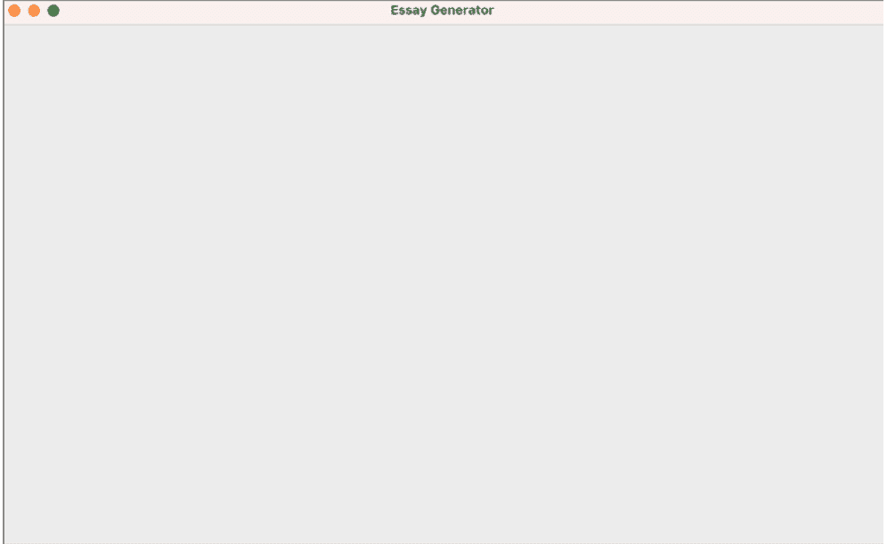
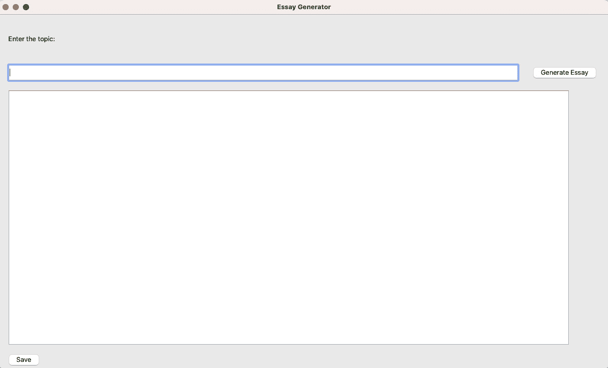
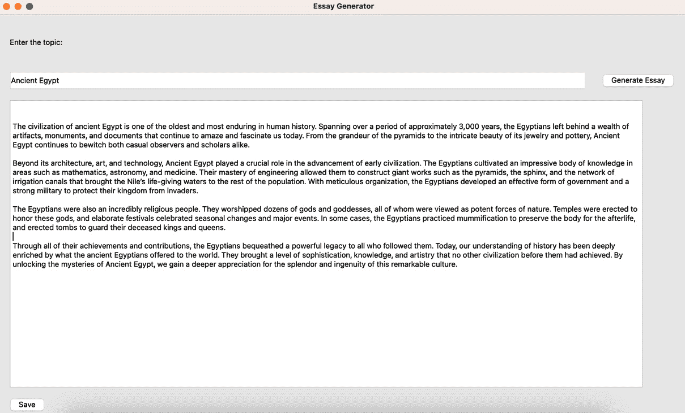
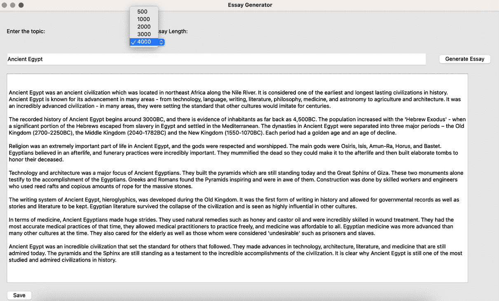

# 第九章：<st c="0">8</st>

# <st c="2">使用 PyQt 和 ChatGPT API 的论文生成工具</st>

<st c="53">在本章中，我们将深入探讨将 ChatGPT API 与最流行的 Python 框架之一用于</st> <st c="189">应用程序开发</st>，**<st c="207">PyQt</st>**<st c="211">的激动人心的世界。您将构建一个用户友好的桌面论文生成工具，该工具由 PyQt 和 ChatGPT API 的集成提供动力，使用户能够轻松地生成关于任何主题的优秀文章。</st> <st c="405">在这里，您将获得有关构建 PyQt</st> <st c="494">桌面应用程序的设计阶段的有价值见解。</st>

<st c="514">我们将引导您通过使用 PyQt 进行面向对象的方法设计桌面应用程序的过程，帮助您理解该框架中涉及的基本概念和组件。</st> <st c="717">在打下坚实基础之后，我们将转向利用 ChatGPT API 的能力。</st> <st c="829">您将学习如何将 API 集成到您的 PyQt 应用程序中，使您能够无缝生成文章。</st> <st c="922">。</st>

<st c="940">通过结合 PyQt 和 ChatGPT API 的优势，您将能够创建一个交互式且智能的桌面应用程序，能够生成关于各种主题的优秀文章。</st> <st c="1132">此外，我们将展示如何让用户能够直接从前端控制 API 令牌，赋予他们指定从 ChatGPT API 获得的文章响应长度的能力。</st> <st c="1359">这种程度的定制化使用户能够根据特定要求调整生成的文章，无论是简洁的摘要还是</st> <st c="1504">深入的分析。</st>

<st c="1522">在本章中，您将涵盖以下主题：</st>

+   <st c="1576">使用 PyQT</st> <st c="1608">构建桌面应用程序</st>

+   <st c="1617">使用 ChatGPT API 创建论文生成方法</st>

+   <st c="1672">控制 ChatGPT</st> <st c="1693">API 令牌</st>

<st c="1703">在本章结束时，您将熟练使用 PyQt 设计和开发桌面应用程序，为应用程序开发打下坚实基础。</st> <st c="1861">此外，您还将进一步发展将 ChatGPT API 集成到您应用程序中的技能，让您更好地控制 AI</st> <st c="2002">响应参数。</st>

# <st c="2022">技术要求</st>

<st c="2045">在本章中，我们将演示完整的</st> `<st c="2096">PyQt6</st>` <st c="2101">安装。</st> <st c="2116">然而，为了成功完成论文生成工具项目，您还应确保满足以下</st> <st c="2234">技术先决条件：</st>

+   <st c="2258">在您的机器上安装了 Python 3.7 或更高版本</st> <st c="2292">。</st>

+   <st c="2304">一个代码编辑器，例如 VS</st> <st c="2331">Code (推荐)</st>

+   <st c="2349">一个 Python</st> <st c="2359">虚拟环境</st>

+   <st c="2378">一个 OpenAI</st> <st c="2389">API 密钥</st>

+   <st c="2396">熟悉 Python</st> **<st c="2421">面向对象编程</st>** <st c="2448">(</st>**<st c="2450">OOP</st>**<st c="2453">) 概念</st>

<st c="2464">本章展示的代码片段可以在 GitHub 平台上找到。</st> <st c="2546">通过访问以下</st> <st c="2607">链接</st> <st c="2613">https://github.com/PacktPublishing/Building-AI-Applications-with-ChatGPT-API/tree/main/Chapter08%20ArticleGenerator</st> <st c="2728">可以获取代码。</st>

<st c="2729">在接下来的章节中，你将开始使用 PyQT 构建桌面应用程序的旅程。</st> <st c="2833">你将深入了解 GUI 设计的复杂性，并学习如何利用 PyQT 的强大功能来开发一个视觉上吸引人且交互式的</st> <st c="2981">桌面应用程序。</st>

# <st c="3001">使用 PyQT 构建桌面应用程序</st>

<st c="3042">在本节中，你</st> <st c="3063">将获得在</st> <st c="3096">创建 PyQT 应用程序用户界面的各种组件的实际经验，例如窗口、标签、按钮、文本字段和下拉菜单。</st> <st c="3235">在这里，你将设置项目，安装</st> `<st c="3282">PyQt6</st>` <st c="3287">和</st> `<st c="3292">docx</st>` <st c="3296">库，并构建你的桌面</st> <st c="3331">应用程序前端。</st>

<st c="3352">首先，让我们讨论一下 PyQt 库是什么，以及它与 Python 应用程序开发工具（如 Tkinter（见</st> *<st c="3498">表 8.1</st>*<st c="3507">）有何不同。</st> <st c="3511">PyQt 是一个强大的 Python 框架，广泛用于创建具有丰富</st> **<st c="3600">图形用户界面</st>** <st c="3625">(</st>**<st c="3627">GUIs</st>**<st c="3631">)的桌面应用程序。</st> <st c="3635">它为开发者提供了一套全面的工具、类和功能，用于设计和构建直观且视觉上吸引人的应用程序。</st> <st c="3789">PyQt 是围绕</st> <st c="3813">流行的</st> **<st c="3826">Qt</st>** <st c="3828">框架的一个包装器，将 Qt 的广泛库和控件</st> <st c="3910">无缝集成到 Python 中。</st>

| **<st c="3922">框架</st>** | **<st c="3932">基于 Qt (强大的</st>** **<st c="3955">GUI 工具包)</st>** | **<st c="3967">内置 Python GUI</st>** **<st c="3988">工具包 (Tkinter)</st>** |
| --- | --- | --- |
| <st c="4005">跨平台</st> | <st c="4020">是</st> | <st c="4024">是</st> |
| <st c="4028">许可</st> | <st c="4036">GPL</st> <st c="4041">和商业</st> | <st c="4055">开源（Python</st> <st c="4076">软件基金会</st>）</st> |
| <st c="4096">小部件库</st> | <st c="4111">广泛</st> | <st c="4121">有限</st> |
| <st c="4129">外观</st> <st c="4135">和感觉</st> | <st c="4143">在所有平台上都有本地外观</st> | <st c="4172">仅在</st> <st c="4193">一些平台上具有本地外观</st> |
| <st c="4207">文档</st> | <st c="4221">全面</st> <st c="4236">且文档齐全</st> | <st c="4255">基本</st> <st c="4262">但足够</st> |
| <st c="4274">流行度</st> | <st c="4285">在爱好</st> <st c="4308">和工业界都受欢迎</st> | <st c="4320">标准库，在 Python</st> <st c="4351">中广泛使用</st> |
| <st c="4360">学习曲线</st> | <st c="4375">适合初学者</st> | <st c="4393">适中</st> <st c="4403">到陡峭</st> |
| <st c="4411">性能</st> | <st c="4423">通常由于</st> <st c="4448">C++后端</st> | <st c="4459">通常由于</st> <st c="4484">Python 后端</st> |
| <st c="4498">社区</st> <st c="4509">支持</st> | <st c="4516">活跃的社区和</st> <st c="4538">第三方模块</st> | <st c="4557">活跃的社区和</st> <st c="4579">丰富的资源</st> |

<st c="4594">表 8.1 – PyQt 与 Tkinter 的比较</st>

<st c="4644">重要注意事项</st>

<st c="4659">PyQt 有两种许可协议 – GNU</st> **<st c="4707">通用公共许可证</st>** <st c="4729">(</st>**<st c="4731">GPL</st>**<st c="4734">) 和商业许可。</st> <st c="4763">GPL 允许你在遵守许可证条款和条件的情况下免费使用 PyQt，这些条件包括如果你分发应用程序，则必须提供应用程序的源代码。</st> <st c="4953">如果你不想遵守 GPL 的要求或需要在专有、封闭源代码的项目中使用 PyQt，你可以从开发 PyQt 的 Riverbank Computing 公司购买商业许可。</st> <st c="5165">商业许可允许你在不受 GPL 限制的情况下使用 PyQt。</st>

<st c="5255">PyQt 是一个 Python 框架，与 Tkinter 不同，Tkinter 是 Python 用于使用 Tk 工具包创建 GUI 的标准库。</st> <st c="5375">PyQt 提供更广泛的控件和高度可定制的</st> <st c="5446">外观。</st> <st c="5459">它还提供了更</st> <st c="5483">现代和美观的 GUI 外观。</st> <st c="5533">现在你已经知道了 PyQt 是什么，我们可以设置你的项目并安装这个出色的 Python 桌面</st> <st c="5636">应用程序框架。</st>

## <st c="5650">设置文章生成工具项目</st>

`<st c="5695">让我们首先</st>` `<st c="5708">通过遵循我们已熟悉的步骤来配置我们的项目。</st>` `<st c="5789">你可以通过创建一个名为` `<st c="5838">EssayGenerationTool</st>` `<st c="5857">的新目录并在 VS Code 中加载它来开始。</st>` `<st c="5885">一旦创建了项目目录，你就可以构建你的 Python 虚拟环境并创建一个名为` `<st c="6001">app.py</st>` `<st c="6007">的 Python 文件，其中将包含邮件生成工具的主要代码。</st>` `<st c="6068">。</st>`

`<st c="6076">为了完成项目设置，你需要安装几个 Python 库。</st>` `<st c="6171">你可以使用` `<st c="6187">pip</st>` `<st c="6190">包管理器来安装这些库。</st>` `<st c="6235">首先，在 VS Code 中打开一个终端并输入以下命令来安装所有必要的库：</st>`

```py
 pip install PyQt6
pip install openai
pip install python-docx
```

`<st c="6407">此外，让我们通过创建` `<st c="6485">config.py</st>` `<st c="6494">模块来设置必要的 OpenAI API 密钥。</st>` `<st c="6503">正如我们在以前的项目中看到的那样，此文件将作为我们项目中所有 API 密钥的安全存储位置。</st>` `<st c="6633">确保` `<st c="6661">config.py</st>` `<st c="6670">文件位于与代码相同的目录中。</st>` `<st c="6719">然而，你必须避免将此文件推送到 Git 仓库，以保持其机密性并防止暴露 API 密钥。</st>` `<st c="6847">在安全存储 API 令牌后，你可以将其包含在相关文件中，并附带必要的库，如下面的代码片段所示：</st>` `<st c="6973">以下</st>` `<st c="7003">代码片段</st>` `<st c="7007">:</st>`

`<st c="7016">config.py</st>`

```py
 API_KEY = "<YOUR_CHATGPT_API_KEY>"
```

`<st c="7061">app.py</st>`

```py
 import sys
from PyQt6.QtWidgets import QApplication, QWidget, QLabel, QLineEdit, QPushButton, QTextEdit, QComboBox
from openai import OpenAI
import docx
import config
client = OpenAI(
  api_key=config.API_KEY,
)
```

在`<st c="7278">app.py</st>` `<st c="7296">文件中，我们可以导入几个库来创建我们的桌面应用程序。</st>` `<st c="7370">从` `<st c="7405">PyQt6</st>` `<st c="7410">导入的具体类代表不同的 GUI 组件，例如应用程序窗口、标签、文本字段、按钮和下拉菜单。</st>` `<st c="7530">此外，还导入了` `<st c="7534">docx</st>` `<st c="7538">模块来处理将我们的 AI 生成文章导出为` `<st c="7616">Microsoft</st>` `<st c="7626">Word 文档。</st>`

## `<st c="7640">使用 PyQt 构建应用程序 GUI</st>`

`<st c="7679">在本节中，我们将探讨创建 PyQt</st>` `<st c="7699">应用程序的过程。</st>` `<st c="7757">我们将使用` `<st c="7834">PyQt6</st>` `<st c="7839">库来为文章生成应用程序设置基础。</st>` `<st c="7849">你将构建的应用程序用户界面由各种小部件组成，如标签、输入字段、文本区域和按钮。</st>`

<st c="7983">要开始创建用于生成论文的 PyQt 应用程序的旅程，我们首先将创建初始应用程序窗口并设置应用程序启动逻辑。</st> <st c="8150">如前所述，我们的应用程序将使用</st> `<st c="8286">EssayGenerator</st>` <st c="8300">类。</st>

<st c="8307">使用面向对象设计（OOD）与 PyQt 相结合是有益的，因为 PyQt 建立在 Qt 框架之上，而 Qt 框架本身是按照面向对象原则设计的。</st> <st c="8445">通过将我们的代码与底层框架对齐，我们可以充分利用 PyQt 的强大功能和灵活性。</st> <st c="8553">通过将应用程序功能封装在类中，我们可以轻松管理和维护我们的应用程序。</st> <st c="8655">这</st> <st c="8659">促进了代码的可重用性和可扩展性，因为类可以根据需要继承、修改和扩展。</st> <st c="8768">`<st c="8772">EssayGenerator</st>` <st c="8786">`类将继承自`<st c="8818">QWidget</st>` <st c="8825">`类，这是 PyQt 中所有用户界面对象的基类：</st>

```py
 class EssayGenerator(QWidget):
    def __init__(self):
        super().__init__()
        self.initUI()
    def initUI(self):
        self.setWindowTitle("Essay Generator")
        self.setGeometry (300, 300, 1200, 800)
if __name__ == '__main__':
    app = QApplication(sys.argv)
    ex = EssayGenerator()
    ex.show()
    sys.exit(app.exec())
```

<st c="9183">以下是我们的 PyQt 应用程序</st> <st c="9217">的实现方式：</st>

1.  <st c="9232">首先，我们在`<st c="9253">QWidget</st>` <st c="9260">`类中将其作为`<st c="9290">EssayGenerator</st>` <st c="9304">`类的基类，这使我们能够采用应用程序 GUI 中的所有`<st c="9341">QWidget</st>` <st c="9348">`功能。</st> `<st c="9389">QWidget</st>` <st c="9396">是 PyQt 中的一个基本类，它提供了创建窗口、处理事件和管理布局的功能。</st> <st c="9510">虽然 PyQt`<st c="9570">`中还有其他可用的替代基类，例如`<st c="9584">QMainWindow</st>` <st c="9595">`用于更复杂的应用程序或`<st c="9629">QDialog</st>` <st c="9636">`用于自定义对话框，但`<st c="9662">QWidget</st>` <st c="9669">`在这里被选择，因为它作为大多数用户界面元素的通用基础，并为我们的论文生成应用程序中创建基本窗口提供了必要的功能。</st> <st c="9836">`

1.  `<st c="9859">The</st>` `<st c="9864">EssayGenerator</st>` `<st c="9878">类是一种特殊类型的控件，可用于创建 GUI 元素。</st> `<st c="9959">在类内部，我们有</st>` `<st c="9989">__init__</st>` `<st c="9997">方法，它是 Python 中称为构造函数的</st> `<st c="10014">特殊方法。</st>` `<st c="10066">当创建类的对象时，它会执行。</st> `<st c="10123">在</st>` `<st c="10134">__init__</st>` `<st c="10142">方法中，我们使用</st> `<st c="10157">EssayGenerator</st>` `<st c="10171">类的</st> `<st c="10190">super()</st>` `<st c="10197">关键字来调用父类</st> `<st c="10218">__init__</st>` `<st c="10226">方法，</st> `<st c="10255">QWidget</st>`，并对其进行初始化。</st> `<st c="10283">这确保了在执行任何针对</st> `<st c="10409">EssayGenerator</st>` `<st c="10423">类的特定初始化之前，执行了父类中必要的设置。</st>

1.  `<st c="10430">然后，</st>` `<st c="10441">initUI()</st>` `<st c="10449">方法负责设置应用程序的用户界面和其他元素，例如窗口标题、大小和位置。</st> `<st c="10591">它使用内置的</st>` `<st c="10638">Essay Generator</st>` `<st c="10653">` `<st c="10674">setWindowTitle</st>` `<st c="10688">` 方法将应用程序的窗口标题设置为，并指定窗口在屏幕上的位置和大小，其中数字代表窗口左上角的</st> `<st c="10794">x</st>` `<st c="10795">` 和 `<st c="10800">y</st>` `<st c="10801">` 坐标，然后是其宽度和</st> `<st c="10878">高度。</st>

1.  通过调用 `<st c="10899">super().__init__()</st>` 和 `<st c="10911">self.initUI()</st>`，我们确保应用程序得到适当的初始化，并且一旦运行它，主应用程序窗口就会启动。<st c="11065">这种方法遵循继承原则，其中</st> `<st c="11127">EssayGenerator</st>` `<st c="11141">子类继承并扩展了父类的功能，</st> `<st c="11214">QWidget</st>`，从而为我们的应用程序创建了一个功能齐全且定制的控件。</st>

1.  `<st c="11297">在 Python 中，通常使用</st>` `<st c="11333">__name__ == '__main__'</st>` `<st c="11355">条件来确保后续代码仅在脚本作为主模块运行时执行。</st> `<st c="11461">如果是这样，代码将继续创建</st>` `<st c="11518">QApplication</st>` `<st c="11530">类的实例，该实例管理应用程序的</st> `<st c="11570">控制流。</st>`

1.  <st c="11583">`<st c="11588">ex</st>` <st c="11590">对象是从</st> `<st c="11618">EssayGenerator</st>` <st c="11632">类创建的，用于显示应用程序窗口，最后，</st> `<st c="11687">sys.exit(app.exec())</st>` <st c="11707">启动了应用程序的事件循环，确保程序在用户关闭窗口或退出应用程序之前保持活跃。</st> <st c="11850">这允许我们在直接运行脚本时执行应用程序。</st> <st c="11925">您可以通过运行项目来验证这一点，以显示主</st> <st c="11994">应用程序</st> <st c="12007">窗口，如图</st> *<st c="12027">图 8</st>**<st c="12035">.1</st>**<st c="12037">所示。</st>



<st c="12055">图 8.1 – 文章生成器工具窗口</st>

<st c="12099">现在我们已经构建了应用程序窗口，我们可以开始添加文章生成器工具的核心元素。</st> <st c="12214">这些元素如下：</st>

+   **<st c="12235">主题输入</st>**<st c="12247">: 文章生成器需要一种机制，让用户输入文章的主题或内容。</st> <st c="12345">这可以通过一个文本</st> <st c="12377">输入框</st>来实现。

+   **<st c="12389">文章输出</st>**<st c="12402">: 一旦生成算法生成了文章内容，就需要将其显示给用户。</st> <st c="12501">这可以通过一个文本区域来实现，其中展示生成的文章。</st>

+   **<st c="12581">保存功能</st>**<st c="12602">: 提供用户保存生成文章的选项通常很有用。</st> <st c="12680">这可能包括将文章保存到文件中，例如 Word 文档，或者提供将文本复制到</st> <st c="12795">剪贴板</st>的能力。

<st c="12809">这些核心</st> <st c="12820">元素</st> <st c="12830">可以轻松地包含在</st> `<st c="12864">initUI()</st>` <st c="12872">函数中，该函数包含我们应用程序中显示的所有元素：</st>

```py
 def initUI(self):
        self.setWindowTitle("Essay Generator")
        self.setGeometry(300, 300, 1200, 800)
        topic_label = QLabel('Enter the topic:', self)
        topic_label.move(20, 40)
        self.topic_input = QLineEdit(self)
        self.topic_input.move(20, 100)
        self.topic_input.resize(1000, 30)
        self.essay_output = QTextEdit(self)
        self.essay_output.move(20, 150)
        self.essay_output.resize(1100, 500)
        generate_button = QPushButton("Generate Essay", self)
        generate_button.move(1050, 100)
        generate_button.clicked.connect(self.generate_essay)
        save_button = QPushButton("Save", self)
        save_button.move(20, 665)
        save_button.clicked.connect(self.save_essay)
```

<st c="13558">在创建文章主题输入框之前，我们将实例化一个</st> `<st c="13626">QLabel</st>` <st c="13632">对象，命名为</st> `<st c="13647">topic_label</st>`<st c="13658">。这个标签将被放置在</st> `<st c="13700">topic_input</st>` <st c="13711">输入框</st>的上方。</st> <st c="13719">标签的目的是指导用户了解下方文本框的目的。</st> <st c="13808">然后我们使用</st> `<st c="13824">move()</st>` <st c="13830">方法将标签定位到应用程序窗口内的坐标</st> `<st c="13875">(20, 40)</st>` <st c="13883">处。</st>

<st c="13914">接下来，我们将创建一个</st> `<st c="13938">QLineEdit</st>` <st c="13947">对象，命名为</st> `<st c="13961">topic_input</st>` <st c="13972">作为主题的输入字段。</st> <st c="14007">在这里，我们可以再次使用</st> `<st c="14028">move()</st>` <st c="14034">方法将输入字段定位在坐标</st> `<st c="14107">(20, 100)</st>`<st c="14116">下方的标签下方。</st> <st c="14143">此外，我们使用</st> `<st c="14143">resize()</st>` <st c="14151">方法设置输入字段的尺寸。</st> <st c="14201">这确保了输入字段有适当的大小以供</st> <st c="14263">用户输入。</st>

<st c="14274">然后，我们可以定义</st> `<st c="14299">essay_output</st>` <st c="14311">属性为</st> `<st c="14344">QTextEdit</st>` <st c="14353">类的实例，它表示一个多行文本编辑小部件。</st> <st c="14411">我们再次使用</st> `<st c="14428">move()</st>` <st c="14434">和</st> `<st c="14439">resize()</st>` <st c="14447">内置方法将文章输出字段放置在主题输入文本字段下方。</st> <st c="14531">`<st c="14535">essay_output</st>` <st c="14547">文本</st> <st c="14553">区域用于显示生成的文章</st> <st c="14593">文本。</st> <st c="14617">现在，用户可以轻松阅读和与文章输出交互，增强了应用程序的可用性和功能性。</st>

<st c="14740">重要提示</st>

<st c="14755">在 Python 中，</st> `<st c="14771">self</st>` <st c="14775">关键字是一个在类内部引用该类实例的约定。</st> <st c="14866">它不是一个保留关键字，而是类中实例方法的第一个参数的常用名称。</st> <st c="14976">在类内部定义方法，包括将</st> `<st c="15023">self</st>` <st c="15027">参数作为第一个参数，允许你访问和修改该类的实例变量和方法。</st> <st c="15132">that class.</st>

<st c="15143">最后，我们将为文章生成器应用程序创建两个按钮 – 一个</st> `<st c="15294">QPushButton</st>` <st c="15305">类，它提供了一个可点击的按钮元素，用户可以通过点击或按下它与之交互。</st> <st c="15412">在这里，使用</st> `<st c="15445">clicked.connect()</st>` <st c="15462">方法至关重要，它将按钮的点击信号连接到方法，允许在按钮</st> <st c="15576">被点击时调用该方法。</st>

<st c="15587">一旦用户点击</st> `<st c="15672">generate_essay()</st>` <st c="15688">函数。</st> <st c="15699">请耐心等待，因为 AI 在生成响应之前需要一些时间来处理</st> `<st c="15951">essay_output</st>` <st c="15963">文本字段。</st> <st c="15976">同样，一旦文章生成，用户将能够点击</st> `<st c="16097">save_essay()</st>` <st c="16109">函数，在那里我们将稍后使用</st> `<st c="16148">docx</st>` <st c="16152">库将文章保存为</st> <st c="16184">Word 文档。</st>

<st c="16198">尽管</st> `<st c="16211">save_essay()</st>` <st c="16223">和</st> `<st c="16228">generate_essay()</st>` <st c="16244">尚未实现，但我们可以将它们初始化以测试我们的应用程序。</st> <st c="16318">这两种方法应放置在</st> `<st c="16359">EssayGeneration</st>` <st c="16374">类内部，但不在</st> `<st c="16397">initUI()</st>` <st c="16405">方法内部。</st> <st c="16414">将函数定义放置在主 Python 函数之上也是一种良好的实践，以避免任何</st> <st c="16519">意外错误：</st>

```py
 def initUI(self):
    ...
    ..
    . <st c="16565">def generate_essay(self):</st>
 <st c="16590">pass</st>
<st c="16595">def save_essay(self):</st>
<st c="16659">pass</st> statement, which is a placeholder statement in Python that does nothing. This is used to indicate that the method does not have any implementation yet.
			<st c="16815">When you execute your application again, you will see that all the text fields and buttons are presented within the application window (see</st> *<st c="16956">Figure 8</st>**<st c="16964">.2</st>*<st c="16966">).</st>
			

			<st c="17011">Figure 8.2 – The Essay Generator text fields and buttons</st>
			<st c="17067">This is how you can create a basic PyQt application.</st> <st c="17121">Now, you know how to build the application window, initialize the user interface elements, and create the core elements of the essay generator tool, such as the topic input field, essay output text area, and buttons for generating and</st> <st c="17356">saving essays.</st>
			<st c="17370">Since both the</st> `<st c="17386">save_essay()</st>` <st c="17398">and</st> `<st c="17403">generate_essay()</st>` <st c="17419">methods contain the placeholder</st> `<st c="17452">pass</st>` <st c="17456">keyword, clicking the buttons will not perform any substantial actions at this point.</st> <st c="17543">We will need to implement the necessary functionality within the respective methods</st> <st c="17627">to</st> <st c="17630">achieve the desired behavior when the buttons are clicked.</st> <st c="17689">You will learn how to build those methods in the</st> <st c="17738">upcoming section.</st>
			<st c="17755">Creating essay generation methods with the ChatGPT API</st>
			<st c="17810">In this section, we</st> <st c="17830">will dive into the</st> <st c="17849">implementation of the key functions within the essay generator application.</st> <st c="17926">These functions are responsible for generating the essay based on user input and saving it to a file.</st> <st c="18028">By understanding the code, you will be able to grasp the inner workings of the application and gain insight into how the essay generation and saving processes</st> <st c="18187">are accomplished.</st>
			<st c="18204">We will begin by exploring the</st> `<st c="18236">generate_essay()</st>` <st c="18252">function.</st> <st c="18263">This function will retrieve the topic entered by the user from the input field.</st> <st c="18343">It will then set the engine type for the OpenAI API, create a prompt using the topic, and make a request to the OpenAI API for essay generation.</st> <st c="18488">The response received from the API will contain the generated essay, which will be extracted and displayed in the essay output area of the application.</st> <st c="18640">To add</st> <st c="18647">that</st> <st c="18651">functionality, simply remove the</st> `<st c="18685">pass</st>` <st c="18689">placeholder and write</st> <st c="18712">this code:</st>

```

def generate_essay(self):

        topic = self.topic_input.text()

        length = 500

        model = "gpt-4"

        prompt = f"Write an {length/1.5} words essay on the following topic: {topic} \n\n"

        response = client.chat.completions.create(

            model=model,

            messages=[

                {"role": "user", "content": "You are a professional essay writer."},

                {"role": "assistant", "content": "Ok"},

                {"role": "user", "content": f"{prompt}"}

            ],

            max_tokens=length

        )

        essay = response.choices[0].message.content

        self.essay_output.setText(essay)

```py

			<st c="19209">Here, we retrieve the topic entered by the user from the</st> `<st c="19267">topic_input's</st>` `<st c="19280">QLineEdit</st>` <st c="19290">widget and assign it to the topic variable, using the</st> `<st c="19345">text()</st>` <st c="19351">method.</st> <st c="19360">This captures the user’s chosen topic for the essay.</st> <st c="19413">For now, we can define the</st> `<st c="19440">tokens</st>` <st c="19446">variable and set it to</st> `<st c="19470">500</st>`<st c="19473">. This indicates the desired length of the generated essay.</st> <st c="19533">We will modify this value later by adding a drop-down menu with different token sizes to generate essays of</st> <st c="19641">different lengths.</st>
			<st c="19659">We can also specify the engine used for the OpenAI API to be</st> `<st c="19721">gpt-4</st>`<st c="19726">, which will generate the essay.</st> <st c="19759">You can adjust this value to utilize different language models or versions, based on your requirements.</st> <st c="19863">We can also create the</st> `<st c="19886">prompt</st>` <st c="19892">variable, which is a string containing the prompt for</st> <st c="19947">essay generation.</st>
			<st c="19964">This is constructed by concatenating the</st> `<st c="20006">Write an {tokens/1.5} essay on the following topic:</st>` <st c="20057">text, where the</st> `<st c="20074">tokens/1.5</st>` <st c="20084">variable specifies how many words our essay should be.</st> <st c="20140">We need to divide the token number by 1.5, as 1 word in English represents about 1.5 tokens according to OpenAI.</st> <st c="20253">After specifying the instructions, we can pass the</st> `<st c="20304">topic</st>` <st c="20309">variable to the prompt.</st> <st c="20334">This prompt serves as the initial input for the essay generation process and provides context for the</st> <st c="20436">generated essay.</st>
			<st c="20452">Once all variables</st> <st c="20472">are</st> <st c="20476">defined, we will make a request to the ChatGPT API with the specified engine, prompt, and the maximum number of tokens (in this case, 500).</st> <st c="20616">The API processes the prompt and generates a response, which is stored in the</st> `<st c="20694">response</st>` <st c="20702">variable.</st> <st c="20713">From the response, we extract the generated essay by accessing the</st> `<st c="20780">text</st>` <st c="20784">attribute of the first choice.</st> <st c="20816">This represents the generated text of the essay.</st> <st c="20865">Finally, we can pass the AI response to the</st> `<st c="20909">essay_output()</st>` <st c="20923">function, displaying it in the user interface for the user to read and</st> <st c="20995">interact with.</st>
			<st c="21009">Next, we will examine the</st> `<st c="21036">save_essay()</st>` <st c="21048">function.</st> <st c="21059">This function will retrieve the topic and the generated essay.</st> <st c="21122">It will utilize the</st> `<st c="21142">docx</st>` <st c="21146">library to create a new Word document and add the final essay to the document.</st> <st c="21226">The document will then be saved, with the filename based on the provided topic, resulting in a Word document that contains the generated essay.</st> <st c="21370">After removing the</st> `<st c="21389">pass</st>` <st c="21393">keyword, you can implement the described functionality using the following</st> <st c="21469">code snippet:</st>

```

def save_essay(self):

        topic = self.topic_input.text()

        final_text = self.essay_output.toPlainText()

        document = docx.Document()

        document.add_paragraph(final_text)

        document.save(topic + ".docx")

```py

			<st c="21674">Here, we will retrieve the text entered in the</st> `<st c="21722">topic_input</st>` <st c="21733">widget and assign it to the</st> `<st c="21762">topic</st>` <st c="21767">variable, using the</st> `<st c="21788">text()</st>` <st c="21794">method.</st> <st c="21803">This captures the topic entered by the user, which will be used as the filename for the saved essay.</st> <st c="21904">Next, we use the</st> `<st c="21921">toPlainText()</st>` <st c="21934">method on the</st> `<st c="21949">essay_output</st>` <st c="21961">widget to retrieve the generated essay text and assign it to the</st> `<st c="22027">final_text</st>` <st c="22037">variable.</st> <st c="22048">This ensures that the user can edit the ChatGPT-generated essay before saving it.</st> <st c="22130">By capturing the topic and the final text, we are now equipped to proceed with the necessary steps to save the essay to</st> <st c="22250">a file.</st>
			<st c="22257">We can now use the</st> `<st c="22277">docx</st>` <st c="22281">library to create a new Word document by calling</st> `<st c="22331">docx.Document()</st>`<st c="22346">, which initializes an empty document.</st> <st c="22385">We then add a paragraph to the document by using the</st> `<st c="22438">add_paragraph()</st>` <st c="22453">method and passing in the</st> `<st c="22480">final_text</st>` <st c="22490">variable, which</st> <st c="22506">contains the</st> <st c="22520">generated essay text.</st> <st c="22542">This adds the generated essay as a paragraph to the document.</st> <st c="22604">We can now save the document by calling</st> `<st c="22644">document.save()</st>` <st c="22659">and providing a filename, constructed by concatenating the</st> `<st c="22719">topic</st>` <st c="22724">variable, which represents the topic entered by the user.</st> <st c="22783">This saves the document as a Word file with the</st> <st c="22831">specified filename.</st>
			<st c="22850">You can now test your essay generator by running the code and generating an essay following these steps (see</st> *<st c="22960">Figure 8</st>**<st c="22968">.3</st>*<st c="22970">):</st>

				1.  `<st c="23094">Ancient Egypt</st>`<st c="23107">.</st>
				2.  **<st c="23108">Generate an essay</st>**<st c="23126">: Click once on the</st> **<st c="23147">Generate Essay</st>** <st c="23161">button.</st> <st c="23170">The app will reach ChatGPT API, and within a few seconds, you will have your essay displayed inside the</st> **<st c="23274">essay</st>** **<st c="23280">output</st>** <st c="23286">field.</st>
				3.  **<st c="23293">Edit the essay</st>**<st c="23308">: You can edit the essay generated by artificial intelligence before</st> <st c="23378">saving it.</st>
				4.  `<st c="23512">save_essay()</st>` <st c="23524">method.</st> <st c="23533">The Word document will</st> <st c="23555">be</st> <st c="23559">saved in the</st> `<st c="23572">root</st>` <st c="23576">directory of</st> <st c="23590">your project.</st>

			

			<st c="25584">Figure 8.3 – Essay Generator creating an Ancient Egypt essay</st>
			<st c="25644">Once the essay has been saved as a Word document, you can reshare it with your peers, submit it as a school assignment, or use any Word styling options</st> <st c="25797">on it.</st>
			<st c="25803">This section discussed the implementation of key functions in our essay generator application using the ChatGPT API.</st> <st c="25921">We built the</st> `<st c="25934">generate_essay()</st>` <st c="25950">method, which retrieved the user’s topic input and sent a request to the ChatGPT API to generate an AI essay.</st> <st c="26061">We also developed the</st> `<st c="26083">save_essay()</st>` <st c="26095">method, which saved the generated essay in a</st> <st c="26141">Word document.</st>
			<st c="26155">In the next section, we</st> <st c="26180">will introduce additional</st> <st c="26206">functionality to the essay generator application.</st> <st c="26256">Specifically, we will allow the user to change the number of AI tokens used to generate</st> <st c="26344">an essay.</st>
			<st c="26353">Controlling the ChatGPT API tokens</st>
			<st c="26388">In this section, we will</st> <st c="26414">explore how to enhance the functionality of the essay generator application by allowing users to have control over the number of tokens used when communicating with ChatGPT.</st> <st c="26588">By enabling this feature, users will be able to generate essays of different lengths, tailored to their specific needs or preferences.</st> <st c="26723">Currently, our application has a fixed value of 500 tokens, but we will modify it to include a drop-down menu that provides different options for</st> <st c="26869">token sizes.</st>
			<st c="26881">To implement this functionality, we will make use of a drop-down menu that presents users with a selection of token length options.</st> <st c="27014">By selecting a specific value from the dropdown, users can indicate their desired length for the generated essay.</st> <st c="27128">We will integrate this feature seamlessly into the existing application, empowering users to customize their</st> <st c="27237">essay-generation experience.</st>
			<st c="27265">Let’s delve into the code snippet that will enable users to control the token length.</st> <st c="27352">You can add the following code snippet inside the</st> `<st c="27402">initUI()</st>` <st c="27410">methods, just under the</st> `<st c="27435">essay_output</st>` <st c="27447">resizing:</st>

```

def initUI(self):

        self.setWindowTitle("Essay Generator")

        self.setGeometry(300, 300, 1200, 800)

        topic_label = QLabel('Enter the topic:', self)

        topic_label.move(20, 40)

        self.topic_input = QLineEdit(self)

        self.topic_input.move(20, 100)

        self.topic_input.resize(1000, 30)

        self.essay_output = QTextEdit(self)

        self.essay_output.move(20, 150)

        self.essay_output.resize(1100, 500) <st c="27829">length_label = QLabel('Select Essay Length:', self)</st><st c="27880">length_label.move(327, 40)</st><st c="27807">self.length_dropdown = QComboBox(self)</st><st c="27846">self.length_dropdown.move(320, 60)</st><st c="27881">self.length_dropdown.addItems(["500", "1000", "2000", "3000", "4000"])</st> generate_button = QPushButton("Generate Essay", self)

        generate_button.move(1050, 100)

        generate_button.clicked.connect(self.generate_essay)

        save_button = QPushButton("Save", self)

        save_button.move(20, 665)

        save_button.clicked.connect(self.save_essay)

```py

			<st c="28302">The preceding code</st> <st c="28322">introduces</st> `<st c="28333">QLabel</st>`<st c="28339">,</st> `<st c="28341">length_label</st>`<st c="28353">, which serves as a visual indication of the purpose of the drop-down menu.</st> <st c="28429">It displays the text</st> `<st c="28450">Select Essay Length</st>` <st c="28469">to inform users about</st> <st c="28492">the functionality.</st>
			<st c="28510">Next, we create a</st> `<st c="28529">length_dropdown</st>` `<st c="28544">QcomboBox</st>`<st c="28554">, which provides users with a drop-down menu to choose the desired token length.</st> <st c="28635">It is positioned below</st> `<st c="28658">length_label</st>` <st c="28670">using the</st> `<st c="28681">move()</st>` <st c="28687">method.</st> <st c="28696">The</st> `<st c="28700">addItems()</st>` <st c="28710">function is then used to populate the drop-down menu with a list of token length options, ranging from</st> `<st c="28814">500</st>` <st c="28817">to</st> `<st c="28821">4000</st>` <st c="28825">tokens.</st> <st c="28834">Users can select their preferred length from</st> <st c="28879">this list.</st>
			<st c="28889">The final step is to implement the functionality that allows users to control the number of tokens used when generating the essay.</st> <st c="29021">We need to modify the</st> `<st c="29043">generate_essay()</st>` <st c="29059">function.</st> <st c="29070">The modified code should be</st> <st c="29098">the following:</st>

```

def generate_essay(self):

        topic = self.topic_input.text() <st c="29171">length = int(self.length_dropdown.currentText())</st> model = "gpt-4"

        prompt = f"以{length/1.5}个单词的长度撰写一篇关于以下主题的论文：{topic} \n\n"

        response = client.chat.completions.create(

            model=model,

            messages=[

                {"role": "user", "content": "您是一位专业的论文作家。"}

                {"role": "assistant", "content": "好的"},

                {"role": "user", "content": f"{prompt}"}

            ], <st c="29539">最大令牌数=max_tokens</st> )

        essay = response.choices[0].message.content

        self.essay_output.setText(essay)

```py

			<st c="29635">In the</st> <st c="29643">modified code, the</st> `<st c="29662">length</st>` <st c="29668">variable is updated to retrieve the selected token length from the</st> `<st c="29736">length_dropdown</st>` <st c="29751">drop-down menu.</st> <st c="29768">The</st> `<st c="29772">currentText()</st>` <st c="29785">method is used to obtain the currently selected option as a string, which is then converted to an integer using the</st> `<st c="29902">int()</st>` <st c="29907">function.</st> <st c="29918">This allows the chosen token length to be assigned to the length</st> <st c="29983">variable dynamically.</st>
			<st c="30004">By making this modification, the</st> `<st c="30038">generate_essay()</st>` <st c="30054">function will utilize the user-selected token length when making the request to the ChatGPT API for essay generation.</st> <st c="30173">This ensures that the generated essay will have the desired length specified by the user through the</st> <st c="30274">drop-down menu.</st>
			<st c="30289">We can now click on the</st> `<st c="30479">addItems()</st>` <st c="30489">function.</st>
			

			<st c="33658">Figure 8.4 – Controlling the essay length</st>
			<st c="33699">The user will be able to choose a token amount between</st> `<st c="33755">500</st>` <st c="33758">and</st> `<st c="33763">4000</st>`<st c="33767">. Now, you can select the</st> `<st c="33793">4000</st>` <st c="33797">tokens option, resulting in a longer length for the generated essay.</st> <st c="33867">We can follow the steps from our previous example and verify that the ChatGPT API generates a longer essay for</st> `<st c="34033">500</st>` <st c="34036">to</st> `<st c="34040">4000</st>`<st c="34044">.</st>
			<st c="34045">This is how you can enhance the functionality of an essay generator application by allowing users to control the number of tokens used when communicating with ChatGPT.</st> <st c="34214">By selecting a specific value from the drop-down menu, users can now indicate their desired length for the generated essay.</st> <st c="34338">We achieved that by using the</st> `<st c="34368">QComboBox</st>` <st c="34377">class to create the drop-down menu itself.</st> <st c="34421">The modified</st> `<st c="34434">generate_essay()</st>` <st c="34450">method</st> <st c="34457">retrieved the selected token length from the drop-down menu and dynamically assigned it to the</st> `<st c="34553">length</st>` <st c="34559">variable.</st>
			<st c="34569">Summary</st>
			<st c="34577">In this chapter, you learned how to build a desktop application with PyQt and enhance its functionality by integrating the ChatGPT API for essay generation.</st> <st c="34735">We discussed the basics of PyQt and its advantages over other Python GUI development tools.</st> <st c="34827">We used that framework to create the application’s GUI components, such as windows, labels, input fields, text areas,</st> <st c="34945">and buttons.</st>
			<st c="34957">The chapter also delved into the implementation of the essay generation functionality using the ChatGPT API.</st> <st c="35067">The main method discussed was</st> `<st c="35097">generate_essay()</st>`<st c="35113">, which took the user’s chosen topic, set the engine type, created a prompt using the topic, and sent a request to the API to generate the essay.</st> <st c="35259">The generated essay was then displayed in the application’s output area.</st> <st c="35332">You also learned how to build the</st> `<st c="35366">save_essay()</st>` <st c="35378">function, which used the</st> `<st c="35404">docx</st>` <st c="35408">library to save the generated essay as a</st> <st c="35450">Word document.</st>
			<st c="35464">Furthermore, the chapter explored how to enhance the application by allowing users to control the length of the generated essay.</st> <st c="35594">It introduced a drop-down menu implemented with the</st> `<st c="35646">QLabel</st>` <st c="35652">and</st> `<st c="35657">QComboBox</st>` <st c="35666">classes, allowing users to select different token sizes.</st> <st c="35724">The modified</st> `<st c="35737">generate_essay()</st>` <st c="35753">function retrieved the selected token length from the drop-down menu and adjusted the length of the generated</st> <st c="35864">essay accordingly.</st>
			<st c="35882">In</st> *<st c="35886">Chapter 9</st>*<st c="35895">,</st> *<st c="35897">Integrating the ChatGPT and DALL-E APIs: Building an End-to-End PowerPoint Presentation Generator</st>*<st c="35994">, you will learn how to integrate two AI APIs,</st> **<st c="36041">ChatGPT</st>** <st c="36048">and</st> **<st c="36053">DALL-E</st>**<st c="36059">, to build an end-to-end</st> **<st c="36084">PowerPoint</st>** <st c="36094">presentation generator.</st> <st c="36119">You will be introduced to the DALL-E API and learn about decoding JSON responses from the API.</st> <st c="36214">The chapter will also cover the PowerPoint Python framework and demonstrate how to generate AI art using the DALL-E API, enabling you to create PowerPoint slides</st> <st c="36376">and images.</st>

```
