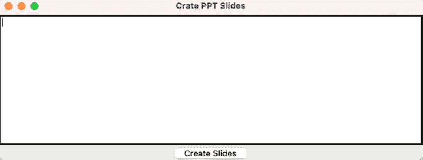
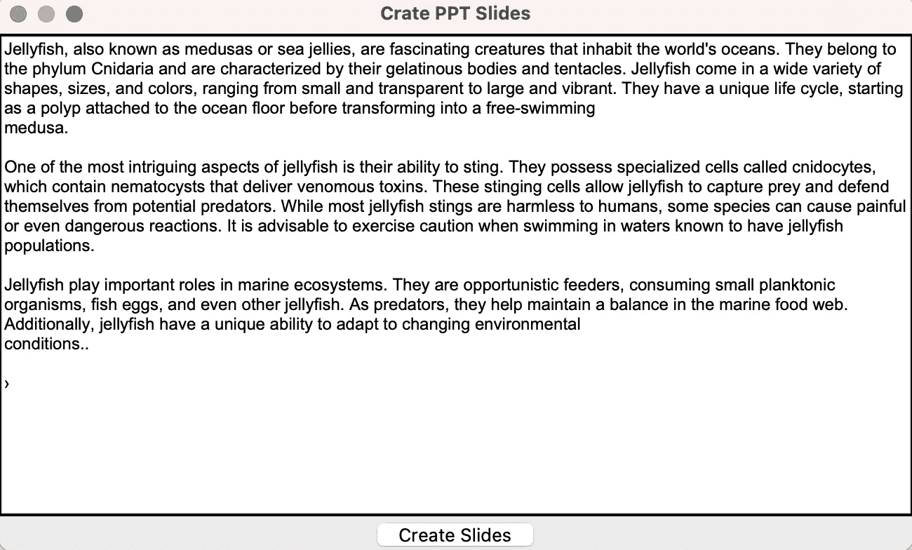
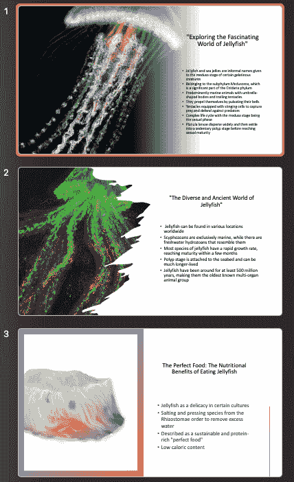

# 第十章：集成 ChatGPT 和 DALL-E API：构建端到端 PowerPoint 演示生成器

在这个令人兴奋的章节中，我们将深入 AI 艺术的世界，并探索由 OpenAI 开发的 AI 模型 **DALL-E** 的惊人能力。<st c="246">我们将首先向您介绍 DALL-E 及其从文本描述生成图像的开创性方法。</st> <st c="367">您将学习如何通过 DALL-E API 访问 DALL-E 的力量，使您能够将这项尖端技术集成到您自己的 Python 应用程序中。</st> <st c="528">随着您发现使用 DALL-E 生成 AI 艺术的迷人可能性，您将释放您的创造力。</st> <st c="628">您将能够使用 DALL-E 生成引人入胜的 AI 艺术作品。</st>

在本章中，我们将展示如何使用 Python 框架和 DALL-E 图像生成自动化 PowerPoint 演示的开发。您将获得利用编程力量简化创建过程的实践经验。<st c="952">。</st>

我们将探讨将 DALL-E 和 ChatGPT 这两个强大的 AI 模型集成起来，以构建一个端到端的 PowerPoint 演示生成器应用程序。<st c="1119">这个项目将使您能够结合 DALL-E 在生成引人入胜的 AI 艺术方面的能力以及 ChatGPT 在生成类似人类文本方面的专业知识。</st> <st c="1272">通过集成这些 API，您将能够创建一个应用程序，该应用程序可以接受用户指定的文本并生成带有图像和文本的 PowerPoint 幻灯片。</st> <st c="1427">和文本。</st>

在本章中，我们将涵盖以下主题：

+   使用 DALL-E 和 DALL-E API

+   使用 PPTX Python 框架构建 PowerPoint 应用程序

+   使用 DALL-E API 生成艺术作品

+   完成并测试 PowerPoint 演示生成器

到本章结束时，您将通过将 DALL-E 和 ChatGPT API 集成到构建端到端的 PowerPoint 演示生成器应用程序中来提高您的 AI 应用程序开发技能。<st c="1884">通过结合 DALL-E 的图像生成能力和 ChatGPT 的文本生成专业知识，您将了解如何自动化包含引人入胜的 AI 生成的图像和类似人类文本的 PowerPoint 演示的开发。</st> <st c="2116">。</st>

# 技术要求

<st c="2155">为了充分利用本章内容，您需要准备一些基本工具。</st> <st c="2244">我们将提供详细说明和安装指南，这些内容在上一章中没有涉及。</st> <st c="2364">以下是您需要的</st> <st c="2376">内容：</st>

+   <st c="2388">在您的计算机上安装 Python 3.7 或更高版本</st> <st c="2432"></st>

+   <st c="2445">一个 OpenAI API 密钥，您可以从您的</st> <st c="2496">OpenAI 账户</st> 获取

+   <st c="2510">一个代码编辑器，例如 VS Code（推荐），用于编写和编辑</st> <st c="2575">您的代码</st>

+   <st c="2584">您 Python 虚拟环境中安装的 Tkinter 框架</st> <st c="2632"></st>

+   <st c="2651">在您的设备上安装的 PowerPoint 软件</st> <st c="2685"></st>

<st c="2696">本章的代码示例可以在 GitHub 上找到</st> <st c="2755">，位于</st> [<st c="2758">https://github.com/PacktPublishing/Building-AI-Applications-with-ChatGPT-API</st>](https://github.com/PacktPublishing/Building-AI-Applications-with-ChatGPT-API)<st c="2834">。</st>

<st c="2835">在下一节中，我们将探讨 DALL-E AI 艺术生成 AI 模型，并介绍 DALL-E API 的基础知识。</st> <st c="2939">DALL-E API。</st>

# <st c="2950">使用 DALL-E API</st>

<st c="2971">DALL-E 是一个</st> <st c="2983">令人瞩目的 AI 模型，可以从文本描述中生成令人惊叹的图像。</st> <st c="3065">在本节中，您将了解 DALL-E 背后的概念及其在图像合成方面的开创性方法。</st> <st c="3194">您将了解 DALL-E 将文本提示转换为生动和富有想象力的视觉表示的独特能力。</st> <st c="3328">此外，我们还将通过 DALL-E API 探索 DALL-E 的实际应用，使您能够无缝地将这项强大的技术集成到您的应用程序中，并解锁无数</st> <st c="3526">创意可能性。</st>

<st c="3549">DALL-E 是由 OpenAI 开发的高级 AI 模型。</st> <st c="3602">它于 2021 年 1 月向世界推出。</st> <st c="3650">DALL-E 是一个基于神经网络的模型，结合了 ChatGPT 语言模型的元素和</st> **<st c="3750">生成对抗网络</st>** <st c="3780">(**<st c="3782">GAN</st>**<st c="3785">)架构。</st> <st c="3802">DALL-E 这个名字是艺术家萨尔瓦多·达利和动画电影中的角色 WALL-E 的俏皮组合。</st> <st c="3920">这个独特的模型旨在根据文本描述生成高度逼真和新颖的图像，展示了 AI 在视觉创造力领域的巨大潜力。</st> <st c="4105">通过在庞大的图像和文本提示数据集上进行训练，DALL-E 可以创建复杂和富有想象力的视觉输出，为 AI 驱动</st> <st c="4299">图像合成方面的突破性进展提供一瞥。</st>

<st c="4315">您可以通过使用 DALL-E API 直接将 DALL-E 集成到您的应用程序中。</st> <st c="4398">它提供了一个方便的接口与 DALL-E 交互，使用户能够根据自定义的文本</st> <st c="4516">提示程序化地生成图像。</st>

<st c="4541">要使用</st> <st c="4552">DALL-E API，您可以使用来自您的 OpenAI 账户的相同 API 密钥。</st> <st c="4620">一旦您有了 API 密钥，您就可以向 API 端点发出请求，指定您想要生成图像的文本提示。</st> <st c="4759">您可以在几行代码内创建一个单独的 Python 文件并生成您的第一个 DALL-E 图像。</st> <st c="4860">API 将处理请求并返回生成的图像作为响应，如下面的</st> <st c="4965">代码示例</st> <st c="4969">所示：</st>

```py
 response = client.images.generate(
        model="dall-e-3",
        prompt=dalle_prompt + " Style: digital art",
        n=1,
        size="1024x1024"
    )
    image_url = response.data[0].url
```

<st c="5133">前面的</st> <st c="5148">代码演示了如何使用</st> `<st c="5181">openai.Image.create()</st>` <st c="5202">函数通过 DALL-E API 生成图像并检索生成的图像的 URL。</st>

<st c="5298">`<st c="5303">prompt</st>` <st c="5309">参数作为所需图像的文本描述或指令。</st> <st c="5392">此提示为 DALL-E 模型提供指导，说明生成的图像应描绘什么。</st> <st c="5485">`<st c="5489">size</st>` <st c="5493">参数确定生成图像的尺寸，表示分辨率为</st> `<st c="5601">1024</st>` <st c="5605">像素乘以</st> `<st c="5616">1024</st>` <st c="5620">像素的正方形图像。</st>

<st c="5628">在发出</st> <st c="5646">API 请求后，响应存储在</st> `<st c="5689">response</st>` <st c="5697">变量中。</st> <st c="5708">然后代码从 API 响应中检索生成的图像的 URL。</st> <st c="5786">URL 通过访问响应字典中的适当键来获取。</st> <st c="5868">通过将</st> `<st c="5881">response</st>` <st c="5889">分配给</st> `<st c="5893">image_url</st>`<st c="5902">，生成的图像的 URL 被存储以供在</st> <st c="5964">任何应用程序中进一步使用。</st>

<st c="5980">这就是您如何使用 DALL-E API 将该 AI 艺术集成到您的应用程序中的方法。</st> <st c="6069">在下一节中，我们将通过启动我们的 PowerPoint 演示</st> <st c="6147">生成器应用程序来实现这一点。</st>

# <st c="6169">使用 PPTX Python 框架构建 PowerPoint 应用程序</st>

<st c="6233">In this</st> <st c="6242">section, we will guide you</st> <st c="6269">through the process of setting up your very own PowerPoint Presentation Generator application using the</st> `<st c="6373">pptx</st>` <st c="6377">Python library and the ChatGPT API.</st> <st c="6414">We’ll explore how to leverage the power of the</st> `<st c="6461">pptx</st>` <st c="6465">library to automate the creation of PowerPoint presentations, allowing you to dynamically generate slides with customized content.</st> <st c="6597">Furthermore, we’ll demonstrate how to integrate this PowerPoint generation functionality into a Tkinter application, enabling you to build a user-friendly interface for your</st> <st c="6771">slide generator.</st>

<st c="6787">For this project, we will use the VS Code IDE, which is our preferred IDE when working with Python.</st> <st c="6888">Launch VS Code and create a new project.</st> <st c="6929">Choose the location where you want to create your project and name it</st> `<st c="6999">PowerPoint Generator</st>`<st c="7019">.</st>

<st c="7020">Once your project is open, find the</st> **<st c="7057">Terminal</st>** <st c="7065">tab.</st> <st c="7071">Once the</st> **<st c="7080">Terminal</st>** <st c="7088">tab is open, you can start using it just like a regular command-line interface to install the necessary libraries for</st> <st c="7207">our project:</st>

```py
 $pip install python-pptx
$pip install openai
$pip install requests
```

<st c="7286">Here’s how we’re going to use</st> <st c="7317">those libraries:</st>

1.  `<st c="7333">python-pptx</st>`<st c="7345">: The</st> `<st c="7352">python-pptx</st>` <st c="7363">package is</st> <st c="7375">used for working with PowerPoint files (</st>`<st c="7415">.pptx</st>`<st c="7420">) and provides functionalities to create, modify, and automate the development of PowerPoint</st> <st c="7514">presentations programmatically.</st>

1.  `<st c="7545">openai</st>`<st c="7552">: The</st> `<st c="7559">openai</st>` <st c="7565">package provides</st> <st c="7582">access to the OpenAI API, which allows you to interact with AI models such as DALL-E and ChatGPT, enabling you to utilize their capabilities in your</st> <st c="7732">Python applications.</st>

1.  `<st c="7752">requests</st>`<st c="7761">: The</st> `<st c="7768">requests</st>` <st c="7776">package</st> <st c="7784">is used for making HTTP requests and is used to communicate with the DALL-E API and retrieve the generated image URL after sending</st> <st c="7916">a request.</st>

<st c="7926">We can</st> <st c="7934">continue</st> <st c="7943">developing our project structure by creating two files,</st> `<st c="7999">app.py</st>` <st c="8005">and</st> `<st c="8010">config.py</st>`<st c="8019">:</st>

<st c="8021">app.py</st>

```py
 import collections.abc
import config
assert collections
import tkinter as tk
from pptx import Presentation
from pptx.util import Inches, Pt
from openai import OpenAI
from io import BytesIO
import requests
# API Token
client = OpenAI(
  api_key=config.API_KEY,
)
```

<st c="8287">config.py</st>

```py
 API_KEY = "YOUR_API_KEY"
```

`<st c="8322">在这里，</st> `<st c="8333">app.py</st>` `<st c="8339">文件是应用程序的核心，作为主入口点。</st> `<st c="8412">它导入各种库和</st> `<st c="8445">模块，以实现与 ChatGPT、DALL-E 和 PowerPoint 框架的连接。</st> `<st c="8525">以下是导入及其</st> `<st c="8563">目的的概述：</st>`

+   `<st c="8578">collections.abc</st>` `<st c="8594">被导入以确保与 Python</st> `<st c="8664">标准库</st>` 的兼容性

+   `<st c="8680">config</st>` `<st c="8687">被导入以访问</st> `<st c="8714">API_KEY</st>` `<st c="8721">变量，该变量包含用于与 OpenAI API</st> `<st c="8793">进行身份验证所需的 API 密钥</st>`

+   `<st c="8803">tkinter</st>` `<st c="8811">被导入以利用 Tkinter 库构建应用程序的用户界面</st> `<st c="8890">`

+   `<st c="8905">pptx</st>` `<st c="8910">和</st> `<st c="8915">pptx.util</st>` `<st c="8924">被导入以处理 PowerPoint 文件，允许应用程序以编程方式创建和修改 PowerPoint</st> `<st c="9026">演示文稿</st>`

+   `<st c="9056">openai</st>` `<st c="9063">被导入以与 OpenAI API 交互并访问其服务，例如语言模型和</st> `<st c="9161">图像生成</st>`

+   `<st c="9177">io</st>` `<st c="9180">和</st> `<st c="9185">requests</st>` `<st c="9193">被导入以处理输入/输出操作和分别发出 HTTP</st> `<st c="9255">请求</st>`

`<st c="9277">另一方面，</st> `<st c="9301">config.py</st>` `<st c="9310">文件是项目的配置文件。</st> `<st c="9364">它包含 API 密钥，由</st> `<st c="9408">API_KEY</st>` `<st c="9415">变量表示，该变量是用于与 OpenAI API</st> `<st c="9484">进行身份验证所需的。</st> 通过将 API 密钥分离到配置文件中，可以更容易地管理和更新密钥，而无需直接修改主应用程序代码。</st> `<st c="9638">这种模块化方法有助于更好地组织和管理敏感信息。</st>`

`<st c="9741">接下来，在我们的</st> `<st c="9759">app.py</st>` `<st c="9765">文件中，我们将专注于构建 Tkinter 应用程序窗口，该窗口将作为我们的 PowerPoint</st> `<st c="9847">演示文稿生成器应用程序</st>` **`<st c="9854">图形用户界面</st>`** (`**<st c="9880">GUI</st>`**)：

```py
 app = tk.Tk()
app.title("Crate PPT Slides")
app.geometry("800x600")
# Create text field
text_field = tk.Text(app)
text_field.pack(fill="both", expand=True)
text_field.configure(wrap="word", font=("Arial", 12))
text_field.focus_set()
# Create the button to create slides
create_button = tk.Button(app, text="Create Slides", command=get_slides)
create_button.pack()
app.mainloop()
```

`<st c="10319">在这里，我们创建了一个 Tkinter 应用程序框架，允许用户根据</st> `<st c="10431">输入文本</st>` 生成 PowerPoint 幻灯片。

<st c="10442">首先，代码</st> <st c="10458">使用</st> `<st c="10510">tk.Tk()</st>` <st c="10517">函数</st> <st c="10528">初始化一个 Tkinter 应用程序窗口。</st> <st c="10532">app</st> <st c="10535">变量被分配为应用程序实例。</st> <st c="10586">在这里，我们为应用程序窗口设置了一个标题，该标题将在窗口的标题栏中显示。</st> <st c="10686">然后，我们将应用程序窗口的初始大小设置为</st> `<st c="10745">800</st>` <st c="10748">像素宽和</st> `<st c="10769">600</st>` <st c="10772">像素高。</st>

<st c="10790">我们也</st> <st c="10798">使用</st> `<st c="10829">tk.Text()</st>` <st c="10838">函数</st> <st c="10849">创建一个文本字段。</st> <st c="10928">这个文本字段用于接受用户输入以生成演示文稿。</st> <st c="10932">调用</st> `<st c="10938">pack()</st>` <st c="10938">方法将文本字段放置在应用程序窗口内。</st> <st c="11011">使用</st> `<st c="11015">configure()</st>` <st c="11026">方法来自定义文本字段的显示外观。</st> <st c="11084">在这种情况下，</st> `<st c="11098">wrap="word"</st>` <st c="11109">被设置为在</st> `<st c="11137">单词边界</st> <st c="11109">处换行。</st>

<st c="11153">最后，我们使用</st> `<st c="11191">tk.Button()</st>` <st c="11202">函数</st> <st c="11213">创建一个按钮。</st> <st c="11235">按钮上标有</st> `<st c="11259">创建幻灯片</st>` <st c="11248">的标签，使用</st> `<st c="11259">text</st>` <st c="11263">参数，并且将</st> `<st c="11283">command</st>` <st c="11290">参数设置为</st> `<st c="11311">get_slides</st>`<st c="11321">。这意味着当按钮被点击时，</st> `<st c="11371">get_slides</st>` <st c="11381">函数将被</st> <st c="11396">调用。</st>

<st c="11406">接下来，我们将</st> <st c="11421">继续构建</st> `<st c="11442">get_slides()</st>` <st c="11454">函数，该函数将负责创建演示文稿和幻灯片。</st> <st c="11544">需要注意的是，</st> `<st c="11577">get_slides()</st>` <st c="11589">函数应该在创建 Tkinter 应用程序窗口</st> <st c="11577">和相关的控件</st> <st c="11676">的代码之上定义。</st> <st c="11704">这确保了当应用程序与</st> <st c="11804">用户</st> <st c="11804">交互时，函数已被定义并可供使用：</st>

```py
<st c="11813">def get_slides():</st><st c="11831">text = text_field.get("1.0", "end-1c")</st><st c="11870">paragraphs = text.split("\n\n")</st><st c="11902">prs = Presentation()</st><st c="11923">width = Pt(1920)</st><st c="11940">height = Pt(1080)</st><st c="11958">prs.slide_width = width</st><st c="11982">prs.slide_height = height</st><st c="12008">for paragraph in paragraphs:</st><st c="12037">slide_generator(paragraph, prs)</st><st c="12069">prs.save("my_presentation.pptx")</st> app = tk.Tk()
app.title("Crate PPT Slides")
app.geometry("800x600")
# Create text field
text_field = tk.Text(app)
text_field.pack(fill="both", expand=True)
text_field.configure(wrap="word", font=("Arial", 12))
text_field.focus_set()
# Create the button to create slides
create_button = tk.Button(app, text="Create Slides", command=get_slides)
create_button.pack()
app.mainloop()
```

<st c="12481">在这里，使用</st> `<st c="12492">text_field.get()</st>` <st c="12508">方法来检索文本框的内容。</st> <st c="12568">参数</st> `<st c="12572">1.0</st>` <st c="12575">表示检索应从文本框的第一个字符开始，而</st> `<st c="12676">end-1c</st>` <st c="12682">表示检索应结束在最后一个字符之前，不包括换行符。</st> <st c="12779">这使我们能够获取用户输入的整个文本。</st>

<st c="12840">接下来，将文本字符串分割成段落。</st> <st c="12889">使用</st> `<st c="12893">\n\n</st>` <st c="12897">分隔符来识别段落，假设每个段落由两个连续的换行符分隔。</st> <st c="13025">这个分割操作将在</st> `<st c="13093">paragraphs</st>` <st c="13103">变量中创建一个段落列表。</st>

<st c="13113">使用</st> `<st c="13168">prs = Presentation()</st>`<st c="13188">创建一个新的 PowerPoint 演示对象。</st> <st c="13267">然后，我们将幻灯片的尺寸设置为</st> `<st c="13312">1920</st>` <st c="13316">点宽和</st> `<st c="13337">1080</st>` <st c="13341">点高。</st>

<st c="13359">循环随后被启动，遍历</st> `<st c="13423">paragraphs</st>` <st c="13433">列表中的每个段落。</st> <st c="13440">对于每个段落，都会调用</st> `<st c="13464">slide_generator()</st>` <st c="13481">函数，并将段落和演示对象作为参数传递。</st> <st c="13567">这个函数将单独实现，其负责根据每个段落的</st> `<st c="13690">内容创建单独的幻灯片。</st>

<st c="13705">一旦循环结束，生成的演示对象将被保存为 PowerPoint 文件。</st> <st c="13795">生成的 PowerPoint 文件将被命名为</st> `<st c="13839">my_presentation.pptx</st>` <st c="13859">，并将包含从</st> `<st c="13915">用户输入创建的幻灯片。</st>

<st c="13928">为了在早期阶段测试你的应用程序，你可以点击</st> `<st c="14281">get_slides()</st>` <st c="14293">函数，该函数根据</st> <st c="14344">输入文本生成幻灯片：</st>



<st c="14387">Figure 9.1 – PowerPoint Presentation Generator GUI</st>

<st c="14437">然而，</st> <st c="14450">在此阶段，如果你尝试生成 AI 幻灯片，你会遇到错误。</st> <st c="14529">这是因为负责为我们的幻灯片创建 AI 艺术和文本的</st> `<st c="14549">slide_generator()</st>` <st c="14566">函数尚未</st> <st c="14660">定义。</st>

<st c="14672">在下一节中，我们将进入构建</st> `<st c="14723">slide_generator()</st>` <st c="14740">函数，其中用户提供的文本将通过 DALL-E API 转换为 AI 艺术。</st> <st c="14841">此函数将访问 DALL-E API 的功能，根据文本输入生成图像，从而创建带有</st> <st c="14996">AI 生成的艺术品</st> 的令人惊叹的幻灯片。

# <st c="15017">使用 DALL-E API 生成艺术作品</st>

<st c="15052">在本节中，我们将探索 ChatGPT API 和 DALL-E API 的激动人心的集成。</st> <st c="15060">我们将展示这两个强大的 AI 工具如何结合以创建独特且视觉上令人惊叹的艺术作品。</st> <st c="15150">通过利用 ChatGPT API，我们将根据应用程序中提供的用户段落生成 DALL-E 提示。</st> <st c="15266">然后，我们将利用 DALL-E API 将该提示转换为</st> <st c="15454">迷人的图像。</st>

<st c="15472">首先，我们将开始</st> <st c="15495">构建</st> `<st c="15508">slide_generator()</st>` <st c="15525">函数，该函数在根据用户输入生成 PowerPoint 幻灯片方面将发挥关键作用。</st> <st c="15630">需要注意的是，此函数应在</st> `<st c="15733">app.py</st>` <st c="15739">文件中 API 密钥定义之后以及</st> `<st c="15759">get_slides()</st>` <st c="15771">函数之上创建。</st> <st c="15782">将其放置在此位置确保它在</st> `<st c="15888">get_slides()</st>` <st c="15900">函数中调用时已定义并可供使用。</st>

<st c="15911">这种方法允许对代码进行结构化组织，并确保</st> <st c="15998">幻灯片生成过程的</st> <st c="16022">顺利执行：</st>

```py
 def slide_generator(text, prs):
    prompt = f"Summarize the following text to a DALL-E image generation " \
             f"prompt: \n {text}"
    model_engine = "gpt-4"
    dlp = client.chat.completions.create(
        model=model_engine,
        messages=[
            {"role": "user", "content": "I will ask you a question"},
            {"role": "assistant", "content": "Ok"},
            {"role": "user", "content": f"{prompt}"}
        ],
        max_tokens=250,
        n=1,
        stop=None,
        temperature=0.8
    )
    dalle_prompt = dlp.choices[0].message.content
    response = client.images.generate(
        model="dall-e-3",
        prompt=dalle_prompt + " Style: digital art",
        n=1,
        size="1024x1024"
    )
    image_url = response.data[0].url
```

<st c="16652">前面的代码展示了</st> <st c="16678">我们如何定义</st> `<st c="16700">slide_generator()</st>` <st c="16717">函数，该函数负责根据用户提供的文本生成 DALL-E 图像生成提示，并将其与 ChatGPT API 集成。</st> <st c="16870">此函数接受两个参数：</st> `<st c="16906">text</st>`<st c="16910">，代表用户的输入，以及</st> `<st c="16951">prs</st>`<st c="16954">，指的是 PowerPoint</st> <st c="16987">演示对象。</st>

<st c="17007">`<st c="17012">prompt</st>`</st> <st c="17018">变量是通过将静态引入文本与用户提供的</st> `<st c="17106">text</st>` <st c="17110">参数连接起来定义的。</st> <st c="17122">此提示将用于指示 ChatGPT 模型将给定文本总结为 DALL-E 图像</st> <st c="17225">生成提示。</st>

`<st c="17243">The</st>` `<st c="17248">create()</st>` <st c="17256">方法随后被调用，以向 ChatGPT API 发送文本补全请求。</st> <st c="17337">ChatGPT API 的 JSON 响应存储在</st> `<st c="17393">dlp</st>` <st c="17396">变量中，其中包含补全结果。</st> <st c="17445">从 ChatGPT 补全结果中提取的实际文本被分配给</st> `<st c="17529">dalle_prompt</st>` <st c="17541">变量。</st> <st c="17552">这个</st> `<st c="17557">dalle_prompt</st>` <st c="17569">变量将作为 DALL-E 图像</st> <st c="17631">生成 API 的输入提示。</st>

`<st c="17646">现在，我们可以开始使用 DALL-E API 生成图像，该图像基于在</st> `<st c="17749">slide_generator</st>` <st c="17764">函数中创建的 DALL-E 提示。</st> <st c="17775">我们调用</st> `<st c="17787">client.images.generate()</st>` <st c="17811">方法，使用以下参数向 DALL-E API 发送图像生成请求：</st>

1.  `<st c="17907">prompt</st>`<st c="17914">: 图像生成的提示，该提示通过附加</st> `<st c="17984">dalle_prompt</st>` <st c="17996">(由 ChatGPT API 生成) 和图像所需风格（指定为</st> `<st c="18079">Style:</st>` `<st c="18086">digital art</st>`<st c="18097">) 构建而成。</st>

    `<st c="18098">这促使 DALL-E 根据文本输入生成具有数字艺术风格的图像。</st> <st c="18190">您可以根据</st> <st c="18229">您的喜好更改此风格。</st>

1.  `<st c="18246">n</st>`<st c="18248">: 这指定了要生成的图像数量。</st> <st c="18299">在这种情况下，我们只请求</st> <st c="18329">一张图像。</st>

1.  `<st c="18339">size</st>`<st c="18344">: 这设置了生成的图像所需的大小。</st> <st c="18398">在这里，它被指定为</st> `<st c="18423">1024x1024</st>` <st c="18432">像素，这是</st> <st c="18454">最高品质的风格。</st>

`<st c="18476">DALL-E API 的响应</st> <st c="18490">存储在</st> `<st c="18527">response</st>` <st c="18535">变量中。</st> <st c="18546">它</st> <st c="18549">包含有关生成的图像的信息，包括其 URL。</st> <st c="18616">生成的图像的 URL 从响应中提取并分配给</st> `<st c="18698">image_url</st>` <st c="18707">变量。</st> <st c="18718">此 URL 可用于在我们的</st> `<st c="18790">PowerPoint 幻灯片中检索和显示生成的图像。</st>

`<st c="18808">在这个部分，我们构建了</st> `<st c="18839">slide_generator()</st>` <st c="18856">函数，该函数使用 ChatGPT API 根据用户输入生成 DALL-E 提示，然后利用 DALL-E API 生成具有所需风格的图像。</st> <st c="19012">这种集成使我们能够创建视觉上令人惊叹的艺术作品，并提高我们 PowerPoint 幻灯片的品质和影响力。</st>

<st c="19135">在下一节中，我们将介绍如何在我们的 PowerPoint 演示文稿中创建幻灯片标题和项目符号。</st> <st c="19249">我们将演示如何将 AI 生成的图像和文本</st> <st c="19317">整合到幻灯片中。</st>

# <st c="19329">完成并测试 PowerPoint 演示文稿生成器</st>

<st c="19390">在本节的最后，您将学习使用 AI 生成的图像和文本创建 PowerPoint 演示文稿幻灯片内容的过程。</st> <st c="19405">我们将探讨如何无缝地将 AI 生成的元素，包括 DALL-E 的图像和 ChatGPT 的文本，整合到幻灯片中。</st> <st c="19536">通过完成本节，您将能够将 AI 生成的内容传递到您的 PowerPoint 幻灯片中，为您的演示文稿增添独特性和精致感。</st> <st c="19672">完成本节后，您将能够将 AI 生成的图像 URL 获取并应用于幻灯片背景或将其插入到特定的幻灯片元素中。</st> <st c="19824">您还将学习如何在幻灯片中将 AI 生成的文本作为项目符号整合。</st>

<st c="19843">您将学习</st> <st c="19859">如何检索 AI 生成的图像 URL 并将其应用于幻灯片背景或插入到特定的幻灯片元素中。</st> <st c="19980">此外，您还将把 AI 生成的文本作为幻灯片中的项目符号整合。</st> <st c="20062">通过</st> <st c="20065">结合 AI 图像生成的力量和 ChatGPT 的文本完成功能，用户将能够用视觉上吸引人的图像和</st> <st c="20230">相关的文本丰富他们的幻灯片。</st>

<st c="20244">首先，我们将演示如何使用 AI 生成的图像和文本创建幻灯片标题和项目符号。</st> <st c="20357">要生成该内容，您可以在您的</st> `<st c="20434">slide_generator()</st>` <st c="20451">函数中包含以下代码片段：</st>

```py
 \
prompt = f"Create a bullet point text for a Powerpoint" \
             f"slide from the following text: \n {text}"
    ppt = client.chat.completions.create(
        model=model_engine,
        messages=[
            {"role": "user", "content": "I will ask you a question"},
            {"role": "assistant", "content": "Ok"},
            {"role": "user", "content": f"{prompt}"}
        ],
        max_tokens=1024,
        n=1,
        stop=None,
        temperature=0.8
    )
    ppt_text = ppt.choices[0].message.content
    prompt = f"Create a title for a Powerpoint" \
             f"slide from the following text: \n {text}"
    ppt = client.chat.completions.create(
        model=model_engine,
        messages=[
            {"role": "user", "content": "I will ask you a question"},
            {"role": "assistant", "content": "Ok"},
            {"role": "user", "content": f"{prompt}"}
        ],
        max_tokens=1024,
        n=1,
        stop=None,
        temperature=0.8
    )
    ppt_header = ppt.choices[0].message.content
```

<st c="21265">在代码的第一部分，一个</st> `<st c="21299">prompt</st>` <st c="21305">字符串被</st> <st c="21316">构建，使用户输入的单个段落。</st> <st c="21402">此提示请求 AI 模型为 PowerPoint 幻灯片生成项目符号文本。</st> <st c="21486">然后将提示传递给 ChatGPT 的</st> `<st c="21527">create()</st>` <st c="21535">方法。</st> <st c="21544">完成的结果存储在</st> `<st c="21590">ppt</st>` <st c="21593">变量中，生成的项目符号文本从</st> `<st c="21658">ppt.choices[0].message.content</st>` <st c="21688">中提取，并分配给</st> `<st c="21709">ppt_text</st>` <st c="21717">变量。</st>

<st c="21727">同样，在代码的第二部分，另一个</st> `<st c="21779">prompt</st>` <st c="21785">字符串被构建，以请求 AI 模型根据相同的用户提供的文本生成一个 PowerPoint 幻灯片的标题。</st> <st c="21909">完成文本的结果从</st> `<st c="21961">ppt.choices[0].message.content</st>` <st c="21991">中提取，并分配给</st> `<st c="22012">ppt_header</st>` <st c="22022">变量。</st>

<st c="22032">此生成的项目符号文本和标题将用于创建实际的 PowerPoint 幻灯片。</st> <st c="22129">您可以将以下代码包含在内，向 PowerPoint 演示文稿添加新幻灯片，并用图像、项目符号</st> <st c="22254">文本和</st> <st c="22271">标题填充它：</st>

```py
 # Add a new slide to the presentation
slide = prs.slides.add_slide(prs.slide_layouts[1])
response = requests.get(image_url)
img_bytes = BytesIO(response.content)
slide.shapes.add_picture(img_bytes, Inches(1), Inches(1))
# Add text box
txBox = slide.shapes.add_textbox(Inches(3), Inches(1),
                                 Inches(4), Inches(1.5))
tf = txBox.text_frame
tf.text = ppt_text
title_shape = slide.shapes.title
title_shape.text = ppt_header
```

<st c="22697">以下是实现新</st> <st c="22740">PowerPoint 幻灯片</st>的步骤：

1.  <st c="22757">首先，使用</st> `<st c="22816">add_slide()</st>` <st c="22827">方法将新幻灯片添加到演示文稿中。</st> <st c="22836">该方法接受所需的幻灯片布局作为参数，在这种情况下表示内容幻灯片的布局。</st>

1.  <st c="22955">接下来，通过 HTTP 请求从图像 URL 检索图像。</st> <st c="23028">获取响应，并将其内容读取到名为</st> `<st c="23085">BytesIO</st>` <st c="23092">的对象</st> `<st c="23106">img_bytes</st>`<st c="23115">中。这允许访问和处理图像数据。</st> <st c="23174">要将图像添加到幻灯片中，使用</st> `<st c="23209">add_picture()</st>` <st c="23222">方法。</st> <st c="23239">它接受</st> `<st c="23252">img_bytes</st>` <st c="23261">对象以及所需的定位参数作为参数。</st> <st c="23331">在这种情况下，图像定位在幻灯片左侧</st> `<st c="23369">1</st>` <st c="23370">英寸和顶部</st> `<st c="23394">1</st>` <st c="23395">英寸处。</st>

1.  <st c="23427">使用</st> `<st c="23475">slide.shapes.add_textbox()</st>` <st c="23501">方法将文本框添加到幻灯片中。</st> <st c="23510">该方法接受文本框的位置参数作为参数。</st> <st c="23584">使用</st> `<st c="23636">txBox.text_frame</st>` <st c="23652">属性访问文本框的文本框架，并将包含生成的项目符号文本的</st> `<st c="23672">ppt_text</st>` <st c="23680">变量分配给</st> `<st c="23754">tf.text</st>`<st c="23761">。这设置了文本框的内容为</st> <st c="23807">AI 生成的文本。</st>

1.  <st c="23825">最后，访问幻灯片的</st> <st c="23839">标题形状。</st> <st c="23867">包含生成的标题文本的</st> `<st c="23881">ppt_header</st>` <st c="23891">变量被分配给</st> `<st c="23958">title_shape.text</st>`<st c="23974">。这设置了幻灯片的标题为</st> <st c="24016">AI 生成的标题。</st>

<st c="24035">这样，我们的演示文稿将包含所需的内容，包括图像、项目符号文本和标题。</st>

<st c="24158">你的 PowerPoint 演示文稿生成器应用程序现在已完成，并准备好进行测试。</st> <st c="24250">为了避免任何意外错误，你可以通过使用 GitHub 上可用的完整</st> `<st c="24355">app.py</st>` <st c="24361">文件来验证你的代码行是否正确：</st> <st c="24380">GitHub:</st> [<st c="24388">https://github.com/PacktPublishing/Building-AI-Applications-with-ChatGPT-API/blob/main/Chapter09%20PowerPoint%20Generator/app.py</st>](https://github.com/PacktPublishing/Building-AI-Applications-with-ChatGPT-API/blob/main/Chapter09%20PowerPoint%20Generator/app.py)<st c="24516">。</st>

<st c="24517">要运行应用程序，只需执行代码或运行</st> `<st c="24577">app.py</st>` <st c="24583">文件。</st> <st c="24590">这将启动 Tkinter 应用程序窗口，该窗口作为你的</st> <st c="24683">幻灯片生成器。</st>

<st c="24699">一旦应用程序运行，你将看到一个包含文本框的应用程序窗口，你可以在其中输入幻灯片的内 容。</st> <st c="24835">只需将所需文本输入或粘贴到文本框中。</st> <st c="24894">在这个例子中，我们使用了一篇关于水母的文章（见</st> *<st c="24952">图 9</st>**<st c="24960">.2</st>*<st c="24962">）。</st>

<st c="24965">“</st>*<st c="24967">水母，也称为海蜇或海葵，是居住在世界上海洋中的迷人生物。</st> <st c="25075">它们属于腔肠动物门，以其凝胶状的体形和触手为特征。</st> <st c="25174">水母的形状、大小和颜色多种多样，从小而透明到大而鲜艳。</st> <st c="25294">它们具有独特的生命周期，从附着在海底的珊瑚虫开始，然后转变为</st>* *<st c="25400">自由游动的海蜇。</st>*

*<st c="25421">水母最引人入胜的方面之一是它们的刺痛能力。</st> <st c="25497">它们拥有称为刺细胞的专业细胞，其中含有能释放毒液的刺丝囊。</st> <st c="25603">这些刺细胞使水母能够捕捉猎物并防御潜在的捕食者。</st> <st c="25704">虽然大多数水母的刺痛对人类无害，但有些物种可以引起疼痛甚至危险的反应。</st> <st c="25816">在已知有水母群的水域游泳时，建议谨慎行事。</st>* *<st c="25890">水母。</st>*

*<st c="25912">水母在海洋生态系统中扮演着重要的角色。</st> <st c="25966">它们是机会主义捕食者，以小型浮游生物、鱼卵甚至其他水母为食。</st> <st c="26073">作为捕食者，它们帮助维持海洋食物网的平衡。</st> <st c="26140">此外，水母具有适应不断变化的</st>* *<st c="26207">环境条件。</st>*<st c="26232">。”</st>

您可以选择使用提供的文本，或者根据您的偏好进行实验性的文本输入。



图 9.2 – 使用文本输入填充 PowerPoint 演示文稿生成器应用

重要提示

确保在每段之间包含一个双行空格，以正确地表示段落之间的分隔，使您的应用能够准确地识别和区分它们。

现在，您可以通过点击**创建幻灯片**按钮来根据输入的文本生成 PowerPoint 幻灯片。请耐心等待几秒钟；您的演示文稿将迅速生成并保存在您项目的**主**目录中。

重要提示

OpenAI 有一个速率限制，指定了每分钟允许使用的令牌数量。如果您广泛使用该应用，可能会达到免费试用版的速率限制，目前为每分钟 40,000 个令牌。

打开演示文稿后，您将看到三张幻灯片，每张幻灯片对应输入文本的一个段落。这些幻灯片将展示由 DALL-E 创建的引人入胜的 AI 艺术图像，配有简洁的项目符号和每张幻灯片的独特标题（见*图 9*<st c="28701">.3</st>*<st c="28709">）：



图 9.3 – PowerPoint 演示文稿生成器应用生成的幻灯片

为了增强幻灯片上元素的可视布局，您可以使用 PowerPoint 内置的**设计器**选项，它方便地位于右上角。

这是完成和测试 DALL-E AI 演示文稿生成器的完整过程。您学习了如何生成幻灯片标题、项目符号和 AI 生成的图像。我们介绍了如何构建 AI 提示并检索生成的内容。本节还概述了如何使用生成的图像、项目符号和标题填充 PowerPoint 演示文稿。

# 摘要

<st c="29416">本章探讨了 DALL-E，一个高级 AI 模型，根据文本描述生成逼真、新颖图像的能力。</st> <st c="29556">您学习了如何使用 DALL-E API 将 DALL-E 集成到您的应用程序中。</st> <st c="29637">此外，我们指导您使用</st> `<st c="29737">pptx</st>` <st c="29741">Python 库和 ChatGPT API 开发 PowerPoint 演示生成器应用程序。</st> <st c="29778">我们使用 Tkinter 构建了 GUI，允许用户使用</st> `<st c="29853">get_slides()</st>` <st c="29865">函数生成幻灯片，该函数检索用户输入并创建一个</st> <st c="29917">PowerPoint 演示文稿。</st>

<st c="29941">然后，我们构建了</st> `<st c="29961">slide_generator()</st>` <st c="29978">函数，它在将用户输入转换为 AI 生成的幻灯片方面发挥了关键作用。</st> <st c="30070">本章还提供了将 AI 生成的图像和文本，如项目符号和幻灯片标题，无缝集成到 PowerPoint 幻灯片中的说明。</st> <st c="30238">我们测试了我们的 AI 演示生成器应用程序，让您能够运行并评估您增强的</st> <st c="30338">PowerPoint 演示文稿。</st>

<st c="30363">在第</st> *<st c="30367">第十章</st>*<st c="30377">中，</st> *<st c="30379">使用 Whisper API 进行语音识别和文本到语音转换</st>*<st c="30437">，您将学习如何利用 Whisper API 进行音频转录。</st> <st c="30510">我们将专注于一个实际项目，该项目涉及将各种文件类型转录成文本，以创建使用英语人类水平鲁棒性和准确性的字幕。</st> <st c="30676">语音识别。</st>
