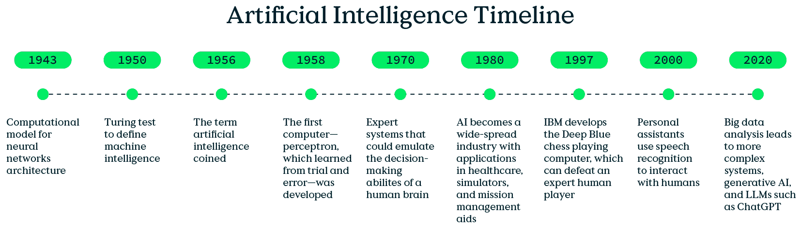
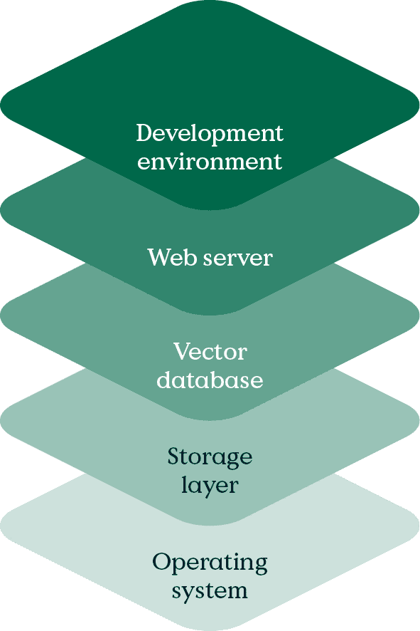
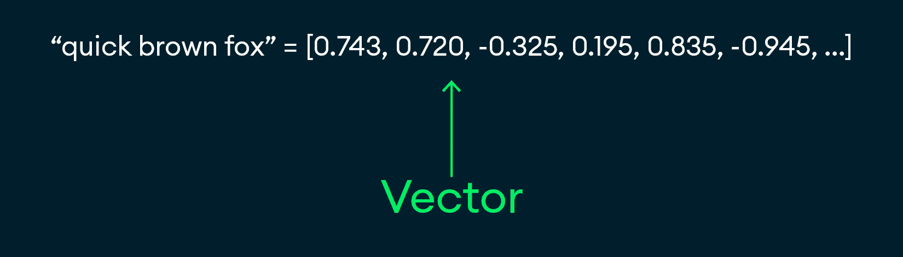

# 第一章：开始使用生成式人工智能

构建生成式人工智能应用程序有大量的选择。坦白说，这个领域非常复杂，许多满足一个标准的工具可能在另一个标准上不足。生成式人工智能应用程序发展如此迅速，以至于本书出版几周后，一些新的AI公司可能已经不存在了。因此，本章重点介绍与创建生成式人工智能应用程序所使用的技术相关的长期、高级概念。

您将学习到您的下一个Web开发项目可能从中受益的方法。本章不仅将探讨这些方法是什么，还将探讨它们是如何工作的，这将使您对生成式人工智能有更广泛的理解和视角。这应该有助于您决定何时以及如何使用生成式人工智能，以及使您创建的应用程序更加准确。

到本章结束时，您将很好地理解单个AI/ML堆栈组件为开发项目带来的好处，它们之间的关系，以及为什么生成式人工智能技术是软件革命——无论是在处理数据还是所需功能方面。

本章介绍了生成式人工智能，并快速概述了以下主题：

+   常见术语的定义

+   您选择的生成式人工智能堆栈

+   Python和生成式人工智能

+   OpenAI API

+   MongoDB向量搜索简介

+   生成式人工智能的重要特性

+   为什么使用生成式人工智能？

+   生成式人工智能的伦理和风险

# 技术要求

这本书包含了一个基本Python应用程序的示例代码。为了重新创建它，建议您具备以下条件：

+   Python的最新版本

+   在您的设备上为您的应用程序服务器设置本地开发环境

+   一个MongoDB Atlas云账户来托管您的数据库。您可以在[https://www.mongodb.com/cloud/atlas/register](https://www.mongodb.com/cloud/atlas/register)注册一个账户。

+   VS Code或您选择的IDE

+   OpenAI API密钥

# 定义术语

对于真正的初学者，让我们从定义一些关键术语开始：AI、ML和GenAI。您将在本书中反复遇到这些术语，因此对这些术语有一个坚实的概念基础是有帮助的：

+   **人工智能**（**AI**）指的是机器执行通常需要人类智能的任务的能力。这包括感知、推理、学习和决策等任务。人工智能的发展历程从早期的推测性想法到今天复杂的技术已经发生了显著变化。*图1.1*展示了人工智能的发展时间线。



图1.1：人工智能的时间线

+   **机器学习**（**ML**）是AI的一个子集，涉及使用算法自动从数据中学习并在时间上不断改进。本质上，这是一种让机器在没有明确编程的情况下学习和适应的方法。ML最常用于需要分析数千个数据点的领域，在医疗诊断、市场分析和军事情报中最为有用。实际上，ML能够识别人类难以看到的数据中的隐藏或复杂模式，然后可以对下一步或行动提出建议。

+   **生成式AI**（**GenAI**）是指根据用户提示创建文本、图像、音频、视频和其他内容的能力。它为聊天机器人、虚拟助手、语言翻译和其他类似服务提供动力。这些系统使用在大量数据上训练的算法，例如来自互联网的文本和图像，来学习模式和关系。这使得它们能够生成与底层训练数据相似但不完全相同的新内容。例如，**大型语言模型**（**LLMs**）使用训练数据来学习书面语言中的模式。GenAI可以使用这些模型来模仿人类的写作风格。

# 生成式AI堆栈

**堆栈**结合工具、库、软件和解决方案，以创建统一和集成的方法。**GenAI堆栈**包括编程语言、LLM提供商、框架、数据库和部署解决方案。尽管GenAI堆栈相对较新，但它已经有许多变体和选项供工程师选择。

让我们讨论构建功能性的GenAI应用程序所需的内容。基本要求如下，如图*1.2*所示：

+   **操作系统**：通常，这是基于Unix/Linux的。

+   **一个存储层**：一个SQL或NoSQL数据库。本书使用MongoDB。

+   **一个能够存储嵌入的向量数据库**：本书使用MongoDB，它将嵌入存储在您的数据或内容中，而不是单独的数据库中。

+   **一个网络服务器**：Apache和Nginx相当受欢迎。

+   **开发环境**：这可能是Node.js/JavaScript、.NET、Java或Python。本书在所有示例中使用Python，并在需要时加入一些JavaScript。



图1.2：基本的GenAI堆栈

如果你想了解更多关于AI堆栈的信息，你可以在[www.mongodb.com/resources/basics/ai-stack](http://www.mongodb.com/resources/basics/ai-stack)找到详细的信息。

## Python和GenAI

**Python**是由Guido van Rossum在20世纪80年代末构思的，并于1991年正式发布。几十年来，Python已经发展成为一个多才多艺的语言，开发者们喜爱它简洁的语法和强大的功能。它拥有易于理解的简洁语法，使其成为初学者开发者的理想选择。

尽管原因并不完全清楚，但相当早的时候，Python生态系统开始引入更多针对机器学习（ML）和数据科学定制的库和框架。TensorFlow、Keras、PyTorch和scikit-learn等库和框架为这些领域的开发者提供了强大的工具。对于技术程度较低的分析师来说，使用Python相对容易上手。由于其互操作性，Python可以无缝集成到其他编程语言和技术中，这使得它与数据管道和Web应用的集成更加容易。

GenAI，由于其对高计算能力和复杂算法的需求，在Python中找到了完美的伙伴。以下是一些容易想到的例子：

+   **Pandas**和**NumPy**等库允许高效地操作和分析大数据集，这是训练生成模型的基本步骤。

+   **TensorFlow**和**PyTorch**等框架提供预构建组件，用于设计和训练复杂的神经网络。

+   **Matplotlib**和**Seaborn**等工具能够详细可视化数据和模型输出，有助于理解和优化AI模型。

+   **Flask**和**FastAPI**等框架使得将你的GenAI模型部署为可扩展的Web服务变得简单直接。

Python拥有一个易于使用且功能丰富的生态系统，让你可以快速开始，使其成为生成式人工智能（GenAI）项目的理想编程语言。现在，让我们更深入地探讨本书剩余部分你将使用的其他技术组件。

## OpenAI API

本书最重要的工具是**OpenAI API**。在接下来的章节中，你将了解GenAI堆栈的每个组件——其中最重要的是OpenAI。虽然我们将涵盖其他大型语言模型（LLM）提供商，但我们在示例和代码库中使用的将是OpenAI。

OpenAI API，于2020年中旬推出，为开发者提供访问其强大模型的途径，使得将高级自然语言处理（NLP）功能集成到应用中成为可能。通过这个API，开发者可以访问到一些现存的最先进的人工智能模型，例如GPT-4。这些模型在庞大的数据集上进行了训练，并在自然语言理解和响应生成方面拥有无与伦比的能力。

此外，OpenAI的基础设施是构建来扩展的。随着你的项目增长并需要更多的计算能力，OpenAI确保你可以轻松扩展，无需担心底层硬件或系统架构。OpenAI的模型在自然语言处理任务上表现出色，包括文本生成、摘要、翻译和情感分析。这对于创建内容、聊天机器人、虚拟助手等非常有价值。

来自互联网、内部对话和文档的大量数据是非结构化的。OpenAI作为一家公司，已经使用这些数据来训练一个LLM，然后将其作为服务提供，这使得你能够在不托管或训练自己的LLM的情况下创建交互式生成式AI应用。你将在[*第3章*](B22495_03.xhtml#_idTextAnchor041)、“大型语言模型”中了解更多关于LLM的内容。

## MongoDB与向量搜索

关于MongoDB如何服务于非结构化数据的使用案例已经有很多讨论，但世界上的数据本质上都是关系型的。可以争论说，没有数据在人类认为它有意义之前是有意义的，而且那些数据的关系和结构也是由人类决定的。例如，几年前，一家领先的空间探索公司的研究员在一次会议上发表了以下令人难忘的评论：

“*我们从网站和PDF文档中抓取了文本内容，并意识到试图将那些数据强行塞入* *表格* *中并没有太多意义。”

MongoDB能够适应现实世界中杂乱无章、非结构化的内容——如`.txt`文件、Markdown、PDFs、HTML等。MongoDB足够灵活，可以拥有工程师认为最适合目的的结构，正因为这种灵活性，它非常适合用于生成式AI的应用场景。

因此，使用文档数据库进行生成式AI比使用SQL数据库要容易得多。

使用MongoDB的另一个原因是其向量搜索功能。**向量搜索**确保当你将短语存储在MongoDB中时，它会将该数据转换为数组。这被称为向量。**向量**是数据及其上下文的数值表示，如图*图1*.3所示。这些维度的数量被称为**嵌入**，你拥有的越多，效果越好。



图1.3：向量的示例

在为数据创建嵌入后，一个数学过程将识别哪些向量彼此最接近或最近，然后你可以推断出数据是相关的。这允许你返回相关词汇，而不仅仅是精确匹配。例如，如果你在寻找`pets`，你可能会找到`cats`、`dogs`、`parakeets`和`hamsters`——即使这些术语并不是精确的单词`pets`。向量是允许你接收在意义或上下文中相关或相似的结果，而不需要精确匹配的东西。

MongoDB将你的数据嵌入与数据本身一起存储。将嵌入存储在一起使得后续查询更快。通过一个带有工作原理解释的示例，你可以最容易地可视化向量搜索。你将在[*第8章*](B22495_08.xhtml#_idTextAnchor180)、“在AI应用中实现向量搜索”中了解更多关于向量搜索的内容。

# 生成式AI的重要特性

当被要求列出GenAI应用最重要的功能时，ChatGPT——可以说是目前最流行的GenAI应用，提出了以下观点：

```py
Content Creation: Generative AI can craft text, images, music, and even videos. It can pen articles, generate realistic images from textual descriptions, compose music, and create video content, opening endless possibilities for creative industries.
```

该响应生成耗时1.5秒，大多数人都会同意这一点。GenAI应用可以以闪电般的速度为你和你的用户创建内容。无论是文本、视频、图像、艺术品，甚至是Java代码，GenAI都能够轻松起草基础内容，然后由专业人士进行编辑。

但还有其他GenAI应用的关键特性也值得指出：

+   **语言翻译**：GenAI具有非凡的熟练度，能够实时翻译语言，保留语境和细微差别，促进跨语言障碍的无缝沟通。

+   **个性化**：在营销和客户服务领域，GenAI可以根据个人用户定制体验和内容。在提供适当语境的情况下，它可以通过分析偏好和行为来提供个性化的推荐、电子邮件和客户互动。

+   **模拟和建模**：在科学研究和工程领域，GenAI可以模拟复杂系统和现象。它通过基于大量数据集生成逼真的模型，有助于预测分子行为、气候模式和甚至经济趋势。

+   **数据增强**：对于机器学习，GenAI可以生成合成数据以增强训练集。在真实数据稀缺或存在偏差的情况下，这非常有价值，可以创建多样化的平衡数据集以提升模型性能。这对于测试目的尤其有用，尤其是在软件测试中。

也许最重要的是，它能够接受自然语言（如英语）的提示来完成这些任务。这使得完成你之前认为困难的任务变得极其简单。你可以在一天内使用GenAI完成多项和多样化的任务，例如审查拉取请求、指导你完成一些Golang任务，以及为书籍的内页插图生成插图。

## 为什么使用生成式AI？

上述每一种能力都令人信服且重要，当正确使用并组合在一起时，具有革命性。简单来说，没有哪个行业GenAI不能发挥作用。通过快速聚合和总结大量内容并简化搜索，GenAI改善了寻找想法和构建知识的使用体验。它可以帮助收集新信息，总结它，并将其重新构思为内容。它可以帮助加快或甚至自动化行政任务，并指数级提高产出。

但所有这些之外，使用GenAI的体验比今天可用的体验要好一个数量级。例如，考虑一下客户服务机器人。你们中的许多人可能熟悉以下流程：

1.  客户首先会遇到一个长长的选项菜单：`如果你想要与销售或支持部门交谈，请按1。如果是账单问题，请按2。如果是管理问题，请按3。如果是订单问题，请按4。` 当客户遇到一个无法清晰归类的问题时，他们仍然可能会按 `4`。

1.  按下 `4` 后，他们会被引导到一个没有他们寻求答案的支持页面。他们点击一个写着“不，这没有回答我的问题”的按钮。

1.  他们自己搜索知识库，可能永远找不到答案，然后通过电话寻求帮助。

想象一下能够输入你想要的内容，而机器人能够以自然的方式回应——不是将你引导到某个页面，而是直接给出答案。再进一步想象，用户可以与机器人聊天，表示他们想要修改订单上的地址，而机器人能够在聊天窗口内完成这一操作，与用户进行多步骤对话以确认并记录他们的新信息。

这对客户来说是一种全新的、更令人愉悦的体验！

## GenAI 的伦理和风险

尽管有这些好处，但使用 AI 仍然存在风险和担忧。在某些领域，对 AI 的反对声音很大，并且有正当的理由。例如，由 AI 生成的艺术作品充斥着互联网市场，取代了那些靠手艺谋生的艺术家和插画师。有人质疑使用 AI 写书是否赋予一个人自称作者的权利。在这里没有明确的答案；根据我们自己的经验，这本书的作者认为 GenAI 加速了而不是取代了今天所做的工作的现有范式。但这可能并不总是如此。随着 AI 的进步，它可能更有可能取代使用它的人类。

GenAI 的风险相当大，其中一些风险尚未得到充分理解。即使那些被充分理解的风险，例如幻觉，对于用户来说也难以识别，更不用说对抗它们了。你可以在 [*第11章*](B22495_11.xhtml#_idTextAnchor232) *生成式AI的常见失败* 中了解更多关于 GenAI 的挑战，以及如何在 [*第12章*](B22495_12.xhtml#_idTextAnchor253) *纠正和优化你的生成式AI应用* 中减轻这些挑战的建议。

# 摘要

本章为 GenAI 应用奠定了基础，从描述每个组件的作用到它们的优点。你学习了一些关键的定义，并了解了 AI 堆栈的基础知识。到目前为止，你也知道了为什么 Python 是构建 GenAI 应用程序的一个很好的选择，以及为什么你会使用 OpenAI API 和 MongoDB 与向量搜索来构建你的 GenAI 应用程序。最后，你也看到了一些 GenAI 的显著用例，并了解了为什么你应该首先使用 GenAI，同时也要关注使用 GenAI 的伦理和风险。既然你在阅读这篇文章，我会假设这个案例很有说服力——你仍然感兴趣，并准备好去探索。

在下一章中，你将获得一个快速、简洁且实用的概述，详细了解GenAI应用的基础构建块，并学习如何开始入门。
