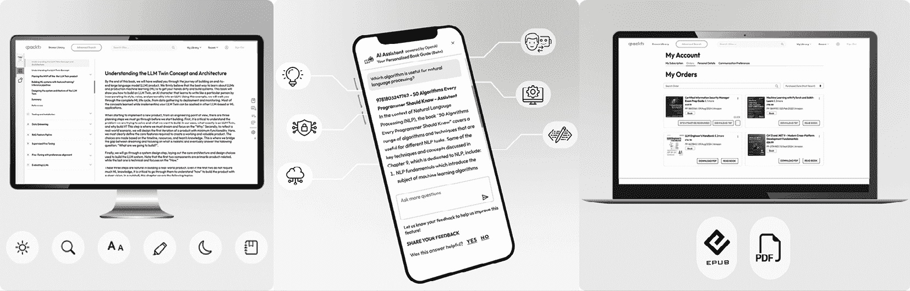
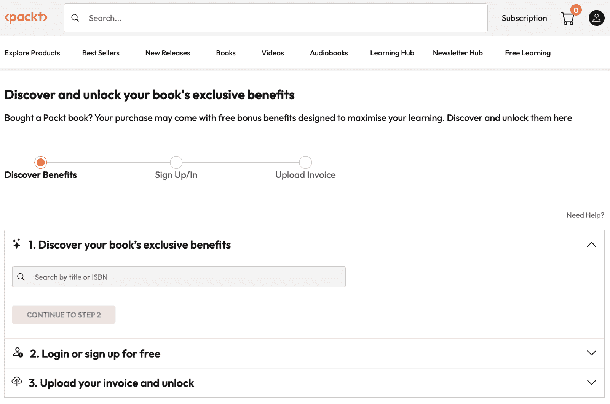

# 前言

在快速发展的 AI 领域中，仅仅依靠独立的**大型语言模型**（**LLMs**）并不能带来商业价值。本全面指南使您能够成为一名生成式 AI 架构师，从头开始构建适应任何平台的强大 ChatGPT 级系统。您将超越基本的聊天机器人，开发具有语义和情感分析能力的系统，其核心是具有上下文感知的 AI 控制器。

您将经历设计具有多用户记忆保持的 AI 控制器架构的完整旅程，使系统能够适应各种用户和系统输入。在此基础上，您将使用 Pinecone 构建一个动态的**检索增强生成**（**RAG**）系统，旨在智能地结合指令场景。

通过强大的多模态能力——包括图像生成、语音交互和机器驱动推理——您将使用思维链编排扩展您系统的智能，以应对真实商业环境要求的跨领域自动化挑战。您还将完全准备好将 OpenAI 的 LLMs 和 DeepSeek-R1 等前沿模型集成到您的 AI 系统中——有信心即使在今天 AI 生态系统的动荡步伐中，它也能保持稳定、可扩展和适用于生产。

到最后，您的**生成式 AI 系统**（**GenAISys**）将能够进行轨迹分析和人类移动预测，即使在处理不完整数据的情况下也能做到。它将为您的营销信息带来神经科学启发的洞察力，无缝集成到人类工作流程中，可视化复杂的交付和移动场景，并连接到实时外部数据——所有这些都被包裹在一个光鲜亮丽的、投资者准备就绪的界面中。

# 本书面向的对象

本书面向 AI 和机器学习工程师、软件架构师和企业开发者，他们希望从头开始构建一个全面的 GenAISys 用于企业应用。它将特别有益于那些对构建 AI 代理、创建高级编排系统以及利用 AI 在营销、生产和物流中实现自动化感兴趣的人。希望构建可扩展的 AI 驱动系统的软件架构师和企业开发者也将在这本指南中找到巨大的价值。不需要有超智能经验，但建议熟悉 AI 概念。

# 本书涵盖的内容

*第一章*，*定义一个适用于商业的生成式 AI 系统*，解释了如何设计针对商业使用的稳健、ChatGPT 级 AI 系统，包括 AI 控制器、代理、上下文感知、高级记忆保持和战略性的团队合作。您将探索如何超越基本的模型集成，构建能够为各行业带来实际业务成果的 AI 解决方案，并成为能够适应任何环境的架构师。

*第二章*，*构建生成式 AI 控制器*，深入实际开发适应性 AI 控制器，结合对话代理和编排器。你将熟练构建一个能够动态响应用户输入、利用高级记忆管理并编排如情感和语义分析等任务的 GenAISys，这些任务对于现实世界、数据密集型应用至关重要。

*第三章*，*将动态 RAG 集成到 GenAISys 中*，教你如何使用 Pinecone 构建一个可扩展、动态的 RAG 系统，有效地结合指令场景和经典数据。你将发现如何构建能够快速响应现实世界商业中断和特定领域挑战的适应性生成式 AI 解决方案。

*第四章*，*构建 AI 控制器编排界面*，展示了如何构建一个协作的、事件驱动的生成式 AI 界面，旨在快速响应现实世界的商业需求。我们将创建一个实用的、多用户的对话式 AI，它能够无缝集成到人类工作流程中，在关键场景中增强决策能力。

*第五章*，*通过思维链添加多模态、多功能推理*，利用 OpenAI 强大的多模态能力增强我们的 GenAISys，包括图像生成、语音交互和机器驱动推理。我们将通过思维链编排扩展我们系统的智能——使智能自动化能够适应复杂的多领域商业场景。

*第六章*，*推理电子营销 AI 代理*，利用 AI 驱动的记忆分析能力来创建客户能记住的营销信息。我们将构建一个消费者记忆代理，它能够智能地分析评论和情感，生成由多模态推理增强的个性化营销内容——将神经科学洞察直接带入我们的 GenAISys。

*第七章*，*使用 DeepSeek 增强 GenAISys*，在保持稳定性的同时导航 AI 的快速演变。你将学习如何战略性地将如 DeepSeek-R1 等前沿模型集成到我们的 GenAISys 中，使用灵活的处理器选择机制——使我们的系统在快速变化的市场中保持适应性、可扩展性和生产就绪。

*第八章*，*GenAISys 用于轨迹模拟和预测*，将先进的 AI 驱动的轨迹分析引入我们的 GenAISys，以精确预测人类移动性和配送，即使是不完整的数据也能做到。我们将构建一个直观的管道，利用 LLMs 来模拟、分析和可视化复杂的配送和移动场景，将空间数据转化为可操作的见解。

*第九章*，*通过数据安全和客户服务升级 GenAISys*，通过集成实时天气信息、旅行信息、强大的审查工具和高级安全功能，将我们的 GenAISys 安全地连接到现实世界的数据。您将发现如何安全地扩展我们 AI 的能力，使其超越内部数据，实现个性化营销、动态活动推荐和实时客户互动。

*第十章*，*展示您的商业就绪生成式 AI 系统*，将向您展示如何将您的 GenAISys 原型转变为一个引人注目、投资者就绪的展示。我们将学习如何通过清晰的信息、实用的演示和精炼的用户界面有效地展示我们的 AI 系统，吸引观众注意力，展示价值，并在拥挤的 AI 市场中证明其扩展的可行性。

# 要充分利用本书

您不需要成为 AI 专家就能从本指南中受益，只需对人工智能和编程的基本知识有所了解即可。如果您使用过 Python 或探索过像 ChatGPT 这样的 LLMs，您会感到非常自在。

本书以清晰、实用的步骤介绍了 AI 代理编排、记忆保留和 RAG 等概念。无论您是开发者、工程师还是好奇的技术人员，您都会找到旨在支持实际应用的工具、代码和解释。

不需要深入的数学或理论背景，只需有构建解决商业问题并在生产环境中扩展的有意义的人工智能系统的愿望。

代码可在 Google Colab 笔记本中找到，带有自动安装，或者您也可以本地下载代码。

## 下载示例代码文件

本书代码包托管在 GitHub 上，网址为[`github.com/Denis2054/Building-Business-Ready-Generative-AI-Systems`](https://github.com/Denis2054/Building-Business-Ready-Generative-AI-Systems)。我们还有其他来自我们丰富图书和视频目录的代码包，可在[`github.com/PacktPublishing`](https://github.com/PacktPublishing)找到。查看它们吧！

## 下载彩色图像

我们还提供了一份包含本书中使用的截图/图表彩色图像的 PDF 文件。您可以从这里下载：[`packt.link/gbp/9781837020690`](https://packt.link/gbp/9781837020690)。

## 使用的约定

本书使用了多种文本约定。

`CodeInText`：表示文本中的代码单词、数据库表名、文件夹名、文件名、文件扩展名、路径名、虚拟 URL、用户输入和 Twitter/X 账号。例如：“接下来，我们将`instruct_selector`集成到现有的界面布局（`VBox`）中。”

代码块设置如下：

```py
# Ensure 'Instructions' exists in the memory_selector options
instruct_selector = Dropdown(
    options=["None","Analysis", "Generation"],
    value="None",  # Ensure default active_memory is in the options
    description='Reasoning:',
    layout=Layout(width='50%')
) 
```

任何命令行输入或输出都按以下方式编写：

```py
Response: The dialog begins by explaining the formation of Hawaii's volcanic islands as the Pacific Plate moves over a stationary hotspot, leading to active volcanoes like Kilauea…. 
```

**粗体**：表示新术语、重要词汇或屏幕上出现的词汇。例如，菜单或对话框中的文字会以这种方式显示。例如：“用户随后重新输入句子，但这次选中了**生成**选项和**文件**选项，以便显示带有文本的图像。”

警告或重要注意事项会以这种方式显示。

小技巧和窍门会以这种方式显示。

# 联系我们

我们始终欢迎读者的反馈。

**一般反馈**：如果您对本书的任何方面有疑问或有任何一般反馈，请通过`customercare@packt.com`发送电子邮件，并在邮件主题中提及本书的标题。

**勘误**：尽管我们已经尽一切努力确保内容的准确性，但错误仍然可能发生。如果您在此书中发现错误，我们将不胜感激，如果您能向我们报告，我们将不胜感激。请访问[`www.packt.com/submit-errata`](http://www.packt.com/submit-errata)，点击**提交勘误**，并填写表格。

**盗版**：如果您在互联网上以任何形式遇到我们作品的非法副本，如果您能提供位置地址或网站名称，我们将不胜感激。请通过`copyright@packt.com`与我们联系，并提供材料的链接。

**如果您有兴趣成为作者**：如果您在某个领域有专业知识，并且您有兴趣撰写或为本书做出贡献，请访问[`authors.packt.com/`](http://authors.packt.com/)。

# 分享您的想法

一旦您阅读了《构建商业就绪的生成式 AI 系统》，我们很乐意听听您的想法！请[点击此处直接访问亚马逊评论页面](https://packt.link/r/1837020698)并分享您的反馈。

您的评论对我们和科技社区都很重要，并将帮助我们确保我们提供高质量的内容。

# 加入我们的 Discord 和 Reddit 空间

您不是唯一在导航碎片化工具、不断更新和不确定的最佳实践的人。加入一个不断壮大的专业社区，交流那些没有进入文档的见解。

| 保持最新信息，了解我们的作者在幕后讨论和洞察。加入我们的 Discord [`packt.link/z8ivB`](https://packt.link/z8ivB) 或扫描下面的二维码： | 与同行建立联系，分享想法，并讨论实际的生成式 AI 挑战。在 Reddit [`packt.link/0rExL`](https://packt.link/0rExL) 上关注我们或扫描下面的二维码： |
| --- | --- |

# 您的书籍附带独家优惠 – 这是如何解锁它们的

|

#### 现在解锁本书的独家优惠

扫描此二维码或访问[packtpub.com/unlock](http://packtpub.com/unlock)，然后通过名称搜索此书。确保是正确的版本。 |  |

| *注意：在开始之前，请准备好您的购买发票。* |
| --- |



使用我们的下一代阅读器增强阅读体验：

**多设备进度同步**：在任何设备上无缝同步进度进行学习。

**高亮和笔记**：将您的阅读转化为持久的知识。

**书签功能**：随时回顾您最重要的学习内容。

**暗黑模式**：切换到暗色或棕褐色模式，以最小化眼睛疲劳。

使用我们的 AI 助手（测试版）更智能地学习：

 **总结内容**：总结关键部分或整章内容。

 **AI 代码解释器**：在下一代 Packt 阅读器中，点击每个代码块上方的**解释**按钮，获取 AI 驱动的代码解释。

*注意：人工智能助手是下一代 Packt 阅读器的一部分，目前处于测试版。*

随时随地学习：

使用无 DRM 的 PDF 和 ePub 版本离线访问您的内容——与您喜欢的电子阅读器兼容。

# 解锁您的书籍独家优惠

您的这本书包含以下独家优惠：

 下一代 Packt 阅读器

 人工智能助手（测试版）

 无 DRM 的 PDF/ePub 下载

如果您尚未解锁，请使用以下指南进行解锁。此过程只需几分钟，并且只需进行一次。

# 如何通过三个简单步骤解锁这些优惠

## 第一步

准备好这本书的购买发票，因为在*第三步*中您将需要它。如果您收到的是实物发票，请用手机扫描，并准备好作为 PDF、JPG 或 PNG 格式。

如需查找发票的更多帮助，请访问 [`www.packtpub.com/unlock-benefits/help`](https://www.packtpub.com/unlock-benefits/help)

**注意**：您是否直接从 Packt 购买了这本书？您不需要发票。完成第二步后，您可以直接跳转到您的独家内容。

|

## 第二步

扫描此二维码或访问 [packtpub.com/unlock](http://packtpub.com/unlock)。 |  |

| 在打开的页面（如果您在桌面，将类似于*图 0.1*），通过书名搜索这本书。确保您选择了正确的版本。图 0.1：桌面上的 Packt 解锁着陆页面 |
| --- |

## 第三步

登录您的 Packt 账户或免费创建一个新账户。登录后，上传您的发票。可以是 PDF、PNG 或 JPG 格式，且大小不能超过 10 MB。按照屏幕上的其余说明完成此过程。

|

## 需要帮助？

如果您遇到困难需要帮助，请访问 [`www.packtpub.com/unlock-benefits/help`](https://www.packtpub.com/unlock-benefits/help) 查看如何找到您的发票等详细 FAQ。以下二维码将直接带您到帮助页面：|  |

**注意**：如果您仍然遇到问题，请联系 [customercare@packt.com](http://authors.packt.com/)。
